# Repository Managers: Nexus, Artifactory, and Enterprise Proxying

A serious Maven ecosystem does not let every laptop and CI job pull arbitrary binaries from the internet.

It introduces a controlled artifact boundary.

That boundary is usually a repository manager.

Examples:

- Sonatype Nexus Repository,
- JFrog Artifactory,
- cloud-hosted package registries,
- internal artifact platforms built around the Maven repository layout.

This part focuses on Nexus and Artifactory because they are the common enterprise patterns, but the mental model applies to any Maven-compatible repository manager.

The key idea:

> A repository manager is not just a cache. It is the control plane for binary artifacts.

It controls what enters the organization, what is built inside the organization, what gets promoted, what gets released, what gets scanned, and what downstream builds are allowed to consume.

---

## 1. Why Maven Needs Repository Managers

Maven is distributed by design.

A build can resolve artifacts from local and remote repositories.

That is powerful.

It is also risky.

Without a repository manager:

- every developer downloads from external repositories independently,
- CI jobs depend directly on public infrastructure availability,
- artifact provenance is harder to inspect,
- dependency ingress is uncontrolled,
- artifact deletion or mutation upstream can break builds,
- internal artifacts are difficult to share safely,
- release artifacts may be stored inconsistently,
- credentials spread across many machines,
- security scanning is fragmented,
- air-gapped or regulated builds become painful.

With a repository manager:

- external dependencies are cached and governed,
- internal artifacts are published centrally,
- release and snapshot policies are enforced,
- artifact access is audited,
- CI builds use consistent sources,
- artifact promotion becomes possible,
- security and license controls can attach to artifact flow,
- build reproducibility becomes more achievable.

---

## 2. The Repository Manager Mental Model

Think of your repository manager as a border checkpoint for artifacts.

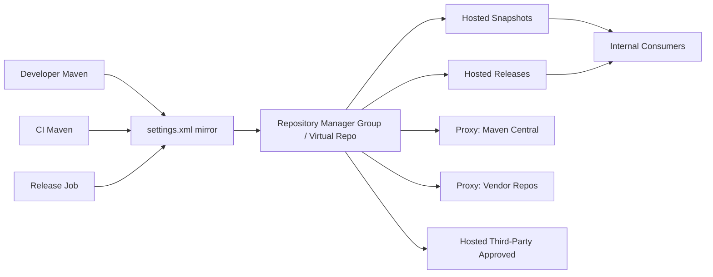

The repository manager has three broad jobs:

1. **Proxy external artifacts**.
2. **Host internal artifacts**.
3. **Present stable consumption endpoints**.

Everything else is governance layered on top.

---

## 3. Maven Repository Types: Conceptual Vocabulary

Different products use different names.

The ideas are stable.

| Concept | Nexus Name | Artifactory Name | Meaning |
|---|---|---|---|
| store internal artifacts | hosted | local | repository physically owned by your organization |
| cache external artifacts | proxy | remote | repository that fetches from upstream and caches artifacts |
| combine several repositories behind one URL | group | virtual | logical repository endpoint aggregating multiple repositories |

Sonatype documentation describes Nexus Repository as supporting hosted, proxy, and group repositories. JFrog documentation describes creating local repositories to share binaries, remote repositories to proxy external registries, and virtual repositories to combine repositories.

References:

- https://help.sonatype.com/en/repository-types.html
- https://docs.jfrog.com/artifactory/docs/getting-started
- https://docs.jfrog.com/artifactory/docs/maven-repositories

---

## 4. Hosted / Local Repositories

A hosted/local repository stores artifacts controlled by your organization.

Examples:

```txt
maven-snapshots
maven-releases
maven-thirdparty
maven-plugins-internal
```

### What Goes Into Hosted Repositories

| Repository | Content |
|---|---|
| `maven-snapshots` | internal `*-SNAPSHOT` artifacts from CI/dev integration |
| `maven-releases` | immutable internal release artifacts |
| `maven-thirdparty` | approved third-party artifacts not available from public repos |
| `maven-plugins-internal` | custom Maven plugins built by the organization |
| `maven-staging` | release candidates awaiting promotion |

### Hosted Repository Policy

A hosted repository should declare whether it accepts releases, snapshots, or both.

Do not mix everything casually.

Bad:

```txt
maven-internal
  contains snapshots
  contains releases
  contains random third-party jars
  allows redeploy
  allows manual admin uploads
```

Good:

```txt
maven-snapshots
  accepts snapshots
  allows overwrite according to snapshot policy

maven-releases
  accepts releases
  immutable after publish

maven-thirdparty-approved
  accepts approved external artifacts only
  immutable after import
```

Separate repositories encode lifecycle semantics.

---

## 5. Proxy / Remote Repositories

A proxy/remote repository points to an external repository.

For Maven, the most common upstream is Maven Central.

Others may include:

- vendor repositories,
- framework-specific repositories,
- internal repositories from partner organizations,
- legacy artifact repositories.

The proxy repository does not usually contain every upstream artifact at the start.

It fetches artifacts on demand and caches them.

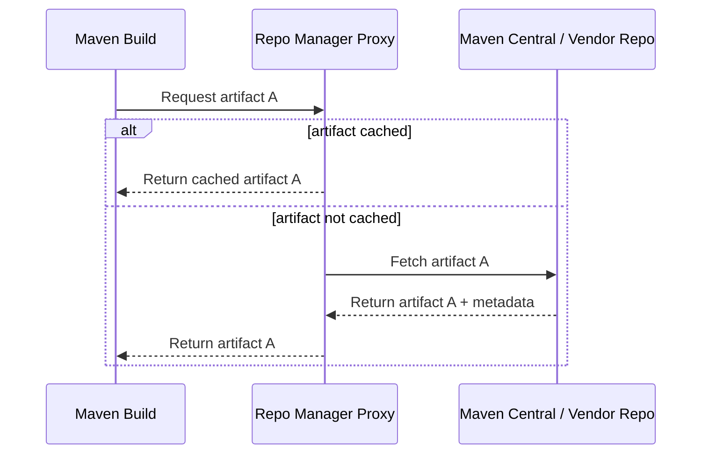

### Why Proxying Matters

Proxying gives:

- speed via local cache,
- resilience against upstream outages,
- audit logs,
- policy enforcement,
- vulnerability scanning integration,
- centralized allow/block decisions,
- better air-gap preparation.

### Proxying Is Not Enough

A proxy cache alone does not guarantee safety.

You still need:

- repository policy,
- artifact review process,
- license/security gates,
- checksum validation,
- immutable releases,
- retention strategy,
- promotion model,
- audit and monitoring.

---

## 6. Group / Virtual Repositories

A group/virtual repository combines multiple repositories behind one URL.

Example consumer URL:

```txt
https://repo.example.com/repository/maven-public/
```

Behind it:

```txt
maven-public
  - maven-releases
  - maven-snapshots
  - maven-thirdparty-approved
  - maven-central-proxy
  - vendor-x-proxy
```

Developers and CI use one endpoint.

The repository team controls the internal ordering and composition.

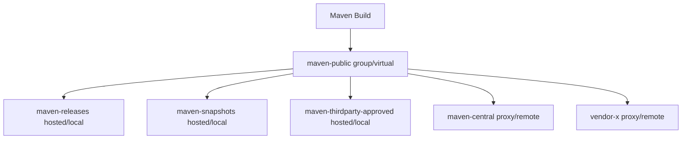

### Ordering Matters

If the same coordinates exist in multiple member repositories, order affects what artifact is returned.

That means repository groups are not neutral.

They encode policy.

Bad ordering can cause:

- internal artifact shadowing,
- stale artifact resolution,
- accidental use of test artifacts,
- vendor artifact overriding public artifact,
- release pulling snapshot-like content.

### Rule

Keep group composition simple and documented.

Do not put every repository into one giant group unless you understand the consequences.

---

## 7. Maven Central and the Enterprise Boundary

Maven Central is the default public repository in the Maven ecosystem.

In enterprise builds, Maven Central should usually be consumed indirectly through a repository manager proxy.

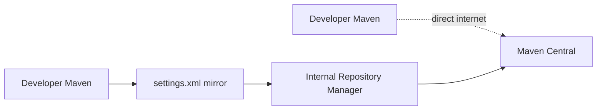

Why indirect?

Because the organization needs to answer:

- Which external artifacts entered?
- When did they enter?
- Who requested them?
- Were they scanned?
- Were they allowed by license policy?
- Are they still available if upstream is unavailable?
- Can we block a malicious artifact quickly?
- Can we reproduce last month's build?

Direct internet resolution makes those questions harder.

---

## 8. Repository Manager as Supply-Chain Boundary

Modern builds depend on thousands of external artifacts.

Each artifact is a supply-chain input.

Repository manager policy turns uncontrolled ingress into controlled ingress.

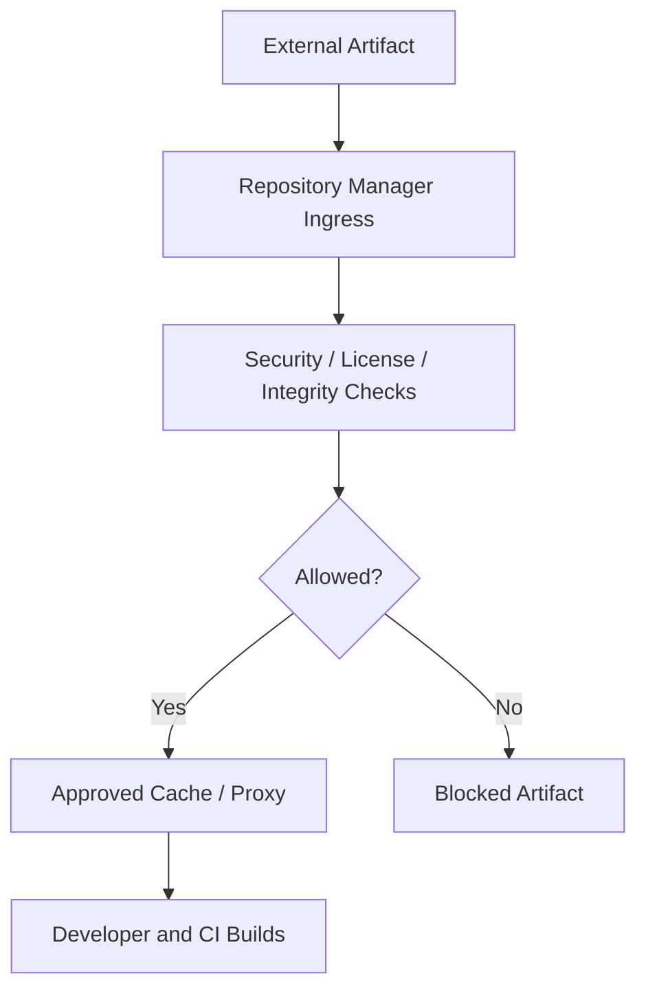

A Maven repository manager is not a complete security system by itself.

But it is the natural enforcement point because all artifacts pass through it.

---

## 9. Recommended Enterprise Maven Repository Topology

Baseline topology:

```txt
maven-public
  group/virtual for normal consumption

maven-central-proxy
  proxy/remote to Maven Central

maven-vendor-proxy
  proxy/remote to approved vendor repositories

maven-thirdparty-approved
  hosted/local for manually approved third-party artifacts

maven-snapshots
  hosted/local for internal snapshots

maven-releases
  hosted/local for internal releases

maven-staging
  hosted/local for release candidates
```

### Consumption Flow

Developers and CI resolve from:

```txt
maven-public
```

### Publication Flow

Branch/integration CI deploys snapshots to:

```txt
maven-snapshots
```

Release jobs deploy release candidates to:

```txt
maven-staging
```

Approved release candidates are promoted to:

```txt
maven-releases
```

### Why Not Publish Directly to `maven-public`?

Because `maven-public` is a consumption endpoint.

It should aggregate repositories.

It should not be the place where artifacts are directly deployed.

Keep write endpoints separate from read endpoints.

---

## 10. Repository Topology Diagram

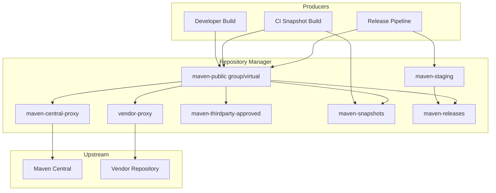

This is not the only topology.

But it is a strong default mental model.

---

## 11. Mapping Maven `settings.xml` to Repository Manager

Developer settings:

```xml
<settings xmlns="http://maven.apache.org/SETTINGS/1.2.0"
          xmlns:xsi="http://www.w3.org/2001/XMLSchema-instance"
          xsi:schemaLocation="http://maven.apache.org/SETTINGS/1.2.0 https://maven.apache.org/xsd/settings-1.2.0.xsd">
  <mirrors>
    <mirror>
      <id>company-maven-public</id>
      <url>https://repo.example.com/repository/maven-public/</url>
      <mirrorOf>external:*</mirrorOf>
    </mirror>
  </mirrors>

  <servers>
    <server>
      <id>company-maven-public</id>
      <username>${env.MAVEN_REPO_USER}</username>
      <password>${env.MAVEN_REPO_TOKEN}</password>
    </server>
  </servers>
</settings>
```

POM deployment:

```xml
<distributionManagement>
  <repository>
    <id>company-releases</id>
    <url>https://repo.example.com/repository/maven-releases/</url>
  </repository>
  <snapshotRepository>
    <id>company-snapshots</id>
    <url>https://repo.example.com/repository/maven-snapshots/</url>
  </snapshotRepository>
</distributionManagement>
```

Release settings:

```xml
<servers>
  <server>
    <id>company-releases</id>
    <username>${env.MAVEN_RELEASE_USER}</username>
    <password>${env.MAVEN_RELEASE_TOKEN}</password>
  </server>
  <server>
    <id>company-snapshots</id>
    <username>${env.MAVEN_SNAPSHOT_USER}</username>
    <password>${env.MAVEN_SNAPSHOT_TOKEN}</password>
  </server>
</servers>
```

The IDs are contracts.

Do not casually rename them.

---

## 12. Snapshot Repository Design

A Maven snapshot version looks like:

```txt
1.4.0-SNAPSHOT
```

Snapshots are mutable development artifacts.

The repository manager may store timestamped snapshot builds under the logical snapshot version.

Snapshot repositories should be optimized for development iteration, not long-term audit certainty.

### Snapshot Policy

Decide:

- how long snapshots are retained,
- whether redeploy is allowed,
- who can deploy snapshots,
- whether pull-request builds can deploy snapshots,
- whether snapshots are allowed in release dependency graphs,
- whether snapshots are allowed in production deployables.

### Strong Rule

Release artifacts should not depend on snapshots.

Use Maven Enforcer or CI policy to block it.

### Common Snapshot Incident

A service works in staging because it consumed snapshot `1.4.0-SNAPSHOT` at 10:00.

A later build consumes a different `1.4.0-SNAPSHOT` at 14:00.

Same logical version.

Different bytes.

If that artifact reaches production, incident analysis becomes painful.

Snapshots are for integration, not immutable release identity.

---

## 13. Release Repository Design

A release repository stores immutable release artifacts.

Examples:

```txt
1.0.0
1.0.1
2.3.0
```

The core rule:

> A release coordinate should map to one artifact forever.

Do not redeploy releases.

Do not overwrite releases.

Do not manually fix a release artifact in-place.

If it is wrong, release a new version.

### Why Immutability Matters

Immutable release repositories support:

- reproducibility,
- auditability,
- rollback,
- incident forensics,
- artifact signing,
- deployment traceability,
- dependency lock integrity.

Mutable release repositories destroy trust.

---

## 14. Staging and Promotion

Direct deploy to release repository is simple.

It is often too simple.

A safer model:

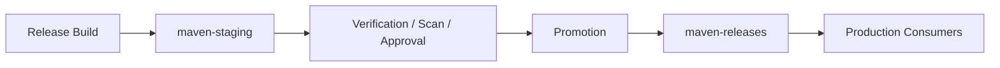

Staging lets you test and scan release candidates before they become official releases.

Promotion should move or copy already-built bytes.

It should not rebuild from source.

Why?

Because rebuilding creates a new artifact.

Promotion should answer:

> Are these exact bytes approved?

not:

> Can we build something similar again?

---

## 15. Repository Manager as Artifact Evidence Store

For regulated or high-stakes systems, the repository manager becomes part of the evidence chain.

For each released artifact, you want to know:

- source commit,
- build job,
- build timestamp,
- builder identity,
- dependency graph,
- test results,
- security scan result,
- signature/checksum,
- promotion approval,
- deployment target.

The repository manager may not store all evidence directly, but it anchors artifact identity.

The artifact coordinate is not enough.

The artifact bytes, checksum, metadata, provenance, and promotion history matter.

---

## 16. Third-Party Artifact Repository

Sometimes an artifact is not available in Maven Central.

Maybe it is:

- a commercial vendor JAR,
- a legacy library,
- an internally approved binary-only dependency,
- a patched third-party artifact,
- an artifact from a partner.

Do not tell developers to run:

```bash
mvn install:install-file ...
```

as a permanent solution.

That installs into one local repository only.

It does not scale.

Instead, publish the artifact to a controlled hosted/local third-party repository.

Example:

```txt
maven-thirdparty-approved
```

### Required Metadata

For manually imported third-party artifacts, record:

- original vendor/source,
- license,
- version,
- checksum,
- approval ticket,
- importer identity,
- import date,
- reason for import,
- vulnerability status,
- replacement plan if legacy.

A third-party binary without provenance is risk.

---

## 17. Custom Internal Maven Plugins

Custom Maven plugins are artifacts too.

If your organization writes internal plugins, publish them to a controlled repository.

Example:

```txt
maven-plugins-internal
```

Then projects can reference:

```xml
<plugin>
  <groupId>com.acme.build</groupId>
  <artifactId>acme-governance-plugin</artifactId>
  <version>2.1.0</version>
</plugin>
```

Do not rely on local plugin installation.

Do not require plugin source checkout to build downstream projects.

Build tooling must be versioned and published like any other dependency.

---

## 18. Repository Access Control

Repository permissions should reflect artifact lifecycle.

| Repository | Read Access | Write Access |
|---|---|---|
| `maven-public` | developers, CI | nobody/direct writes disabled |
| `maven-snapshots` | developers, CI | CI snapshot jobs |
| `maven-staging` | release jobs, release managers | release jobs |
| `maven-releases` | developers, CI, deploy systems | promotion automation only |
| `maven-thirdparty-approved` | developers, CI | dependency governance team |
| proxy repositories | usually through group only | repository admin only |

Principle:

> Separate read endpoints from write endpoints.

Another principle:

> Humans should not manually upload release artifacts except through controlled emergency process.

---

## 19. Repository Naming Strategy

Names matter because they appear in:

- URLs,
- settings files,
- logs,
- credentials,
- documentation,
- incident reports,
- CI templates,
- audit trails.

Use stable, boring names.

Good:

```txt
maven-public
maven-releases
maven-snapshots
maven-staging
maven-thirdparty-approved
maven-central-proxy
```

Bad:

```txt
repo1
new-repo
maven2
libs
test
public2
john-temp
```

Repository names are operational interfaces.

Treat them as API names.

---

## 20. Repository Ordering in Groups

A group/virtual repository resolves by checking member repositories according to product-specific behavior and configured order.

A safe conceptual order:

```txt
maven-releases
maven-thirdparty-approved
maven-snapshots
maven-central-proxy
vendor-proxy
```

But the right order depends on policy.

Questions:

- Should internal releases shadow external artifacts?
- Are internal group IDs protected?
- Should snapshots be in the public group at all?
- Should vendor repositories be separate from public consumption?
- Should third-party approved override public proxy?

### Safer Split

Use separate groups:

```txt
maven-public
  releases + approved third-party + central proxy

maven-internal-dev
  releases + snapshots + approved third-party + central proxy

maven-release-consumption
  releases + approved third-party + central proxy
  no snapshots
```

Then release builds consume from a no-snapshot endpoint.

---

## 21. Preventing Dependency Confusion

Dependency confusion occurs when an internal package coordinate can be resolved from an external repository unexpectedly.

In Maven, risk is lower than in some ecosystems if group IDs are managed carefully, but it is not zero.

Controls:

- reserve internal group IDs,
- block external artifacts under internal group prefixes,
- prefer repository manager routing over direct external repositories,
- scan newly cached artifacts,
- avoid declaring random external repositories in POMs,
- enforce dependency allowlists for sensitive projects,
- use repository manager namespace controls where available.

Example internal group policy:

```txt
com.acme.* must resolve only from internal hosted repositories.
```

If `com.acme:payment-core:1.2.0` appears from an external proxy, treat it as a serious incident.

---

## 22. Repository Manager and Checksums

Maven artifacts usually have checksums alongside artifacts.

Checksums help detect corruption and tampering.

Repository managers may validate, store, generate, or proxy checksums.

A build failure like this is not noise:

```txt
Checksum validation failed
```

It may indicate:

- corrupted local cache,
- corrupted proxy cache,
- upstream metadata inconsistency,
- artifact tampering,
- network/proxy corruption,
- repository manager storage issue.

### Incident Response

Do not automatically disable checksum validation as a default fix.

Instead:

1. reproduce with clean local repo,
2. inspect repository manager cached artifact,
3. compare upstream checksum,
4. invalidate proxy cache if appropriate,
5. check storage backend health,
6. audit recent repository changes.

---

## 23. Repository Manager and Metadata

Maven resolution depends on metadata.

Examples:

```txt
maven-metadata.xml
*.pom
*.jar
*.sha1
*.md5
```

Metadata answers questions like:

- what versions exist?
- what snapshot timestamp/build number exists?
- where is parent POM metadata?
- what are transitive dependencies?

Repository manager metadata cache problems can cause strange resolution failures.

Symptoms:

- artifact exists in UI but Maven cannot resolve it,
- Maven resolves older version,
- snapshot updates are not visible,
- metadata says version exists but artifact download fails,
- clean local repo behaves differently from warm local repo.

Diagnostic:

```bash
mvn -U -X verify
```

Then inspect repository manager logs and metadata.

---

## 24. Retention and Cleanup Policies

Repositories grow forever unless managed.

But cleanup is dangerous when done blindly.

### Snapshot Cleanup

Usually safe to delete older snapshots after policy window.

Example policy:

```txt
retain last 20 snapshots per GAV
retain snapshots younger than 30 days
never delete snapshots currently deployed to shared test environments
```

### Release Cleanup

Be extremely careful.

Release artifacts may be needed for:

- rollback,
- audit,
- reproducible builds,
- old customer patches,
- forensic investigation,
- disaster recovery.

Usually, internal releases should be retained for a long time or indefinitely depending on regulatory and operational requirements.

### Proxy Cache Cleanup

Proxy cache cleanup is possible.

But if an upstream artifact disappears or changes availability, deleting the cache may break future builds.

Policy depends on your risk posture.

---

## 25. Release Immutability and Redeploy Policy

A release repository should reject redeploy of existing release versions.

If your repository allows release redeploy by default, fix that.

Why?

Because two different artifacts with the same coordinates destroy reproducibility.

Bad:

```txt
com.acme:billing-service:1.8.2
  uploaded Monday
  overwritten Tuesday
```

Now a deployment using `1.8.2` is ambiguous.

Good:

```txt
com.acme:billing-service:1.8.2
  immutable

com.acme:billing-service:1.8.3
  new fixed release
```

A version is identity.

Do not mutate identity.

---

## 26. Snapshot Mutability and Promotion Risk

Snapshots are mutable by design.

Do not promote a snapshot as if it were a release.

Bad release process:

```txt
Build 1.2.0-SNAPSHOT
Test it
Rename to 1.2.0 mentally
Deploy snapshot bytes to production
```

Good release process:

```txt
Build 1.2.0 release artifact
Stage exact bytes
Verify exact bytes
Promote exact bytes
Deploy exact bytes
```

The release artifact should be built as release identity from the start or transformed through a controlled release process that produces immutable release coordinates.

---

## 27. Repository Manager in CI/CD

CI should use repository manager for both input and output.

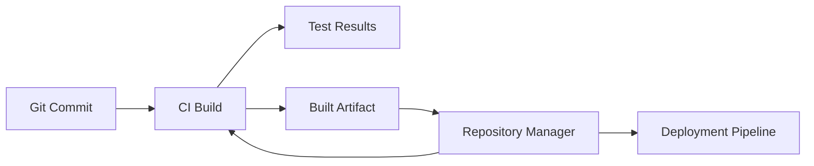

CI build stages:

1. resolve dependencies from repository manager,
2. compile/test/package,
3. publish snapshot or staging artifact,
4. scan artifact and dependency graph,
5. promote or reject,
6. deploy from repository manager, not workspace copy.

Deployment should consume published artifacts.

Do not deploy random files directly from a build workspace if you care about traceability.

---

## 28. Artifact Promotion vs Rebuild

Promotion means moving the same artifact bytes through lifecycle states.

Rebuild means creating new bytes.

They are not equivalent.

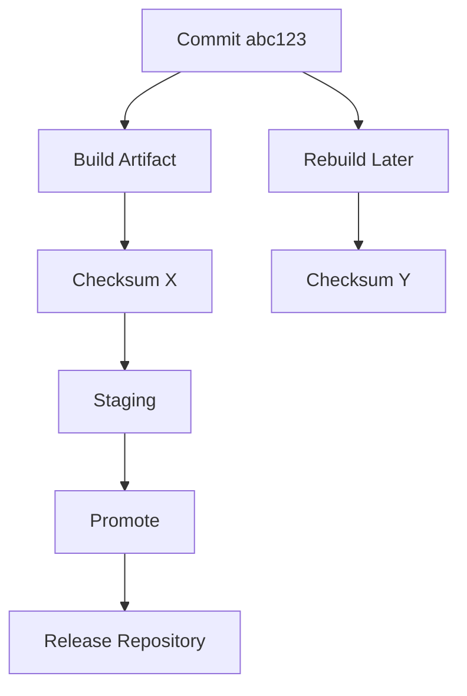

Even if source code is the same, checksum may differ because of:

- timestamps,
- plugin versions,
- JDK version,
- dependency drift,
- generated metadata,
- build environment differences.

Promotion preserves evidence.

Rebuild requires proving equivalence.

---

## 29. Repository Manager and Maven Releases to Central

Publishing open-source artifacts to Maven Central has its own process and tooling.

Historically many projects used OSSRH.

As of June 30, 2025, Sonatype documentation states OSSRH reached end of life and namespaces were migrated to Central Publisher Portal.

Reference:

- https://central.sonatype.org/pages/ossrh-eol/

For internal enterprise builds, the key lesson is not the specific public publishing workflow.

The lesson is:

- external release infrastructure changes,
- hardcoded legacy publishing assumptions become technical debt,
- publication automation should be explicit, documented, and isolated from normal build logic.

For internal repositories, avoid coupling all release logic to one deprecated external path.

---

## 30. Repository Manager Observability

A repository manager is production infrastructure.

Observe it like production infrastructure.

Track:

- request latency,
- error rate,
- upstream proxy failures,
- storage utilization,
- cache hit ratio,
- authentication failures,
- artifact upload failures,
- metadata rebuild errors,
- checksum validation failures,
- blocked artifact events,
- unusual download patterns,
- repository cleanup results.

### Build Symptoms of Repository Issues

| Symptom | Possible Repository Cause |
|---|---|
| random dependency timeouts | repository manager overloaded or upstream slow |
| artifact exists but cannot resolve | metadata cache inconsistency |
| `401 Unauthorized` | token/permission/server ID issue |
| `403 Forbidden` | policy denies artifact or repo access |
| checksum failure | corrupted cache or upstream inconsistency |
| snapshot not updating | metadata update policy/cache problem |
| release deploy rejected | redeploy disabled or wrong repository policy |
| slow CI | repository cache misses or repo manager performance issue |

---

## 31. Repository Manager High Availability

If all builds depend on the repository manager, it becomes critical infrastructure.

Questions:

- What happens when it is down?
- Can developers build from local cache temporarily?
- Can CI continue critical release builds?
- Is storage backed up?
- Is metadata backed up?
- Are credentials recoverable?
- Is disaster recovery tested?
- Are repository URLs stable behind a load balancer or DNS name?

A repository manager outage can stop the engineering organization.

Treat it accordingly.

---

## 32. Backup and Disaster Recovery

Back up:

- hosted release repositories,
- hosted snapshot repositories if needed,
- third-party approved repository,
- repository metadata,
- configuration,
- user/role mappings,
- access tokens if product stores them,
- blob storage,
- database if separate,
- audit logs where required.

Prioritize recovery:

1. release repositories,
2. third-party approved repository,
3. repository configuration,
4. proxy cache,
5. snapshots.

Proxy caches can sometimes be rebuilt from upstream.

Internal releases cannot.

---

## 33. Air-Gapped Repository Manager Pattern

Air-gapped environments need controlled import.

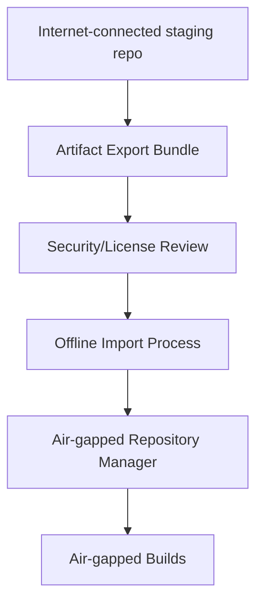

Rules:

- no direct internet from build agents,
- all artifacts imported through review,
- checksums recorded,
- dependency graph captured,
- repository state versioned/snapshotted,
- emergency import process defined,
- blocked artifacts documented.

Air-gapped Maven is not just `mvn -o`.

It is repository governance plus artifact logistics.

---

## 34. Repository Manager and Build Reproducibility

A repository manager supports reproducibility, but does not guarantee it alone.

It helps by:

- caching external artifacts,
- keeping release artifacts stable,
- centralizing dependency sources,
- storing internal artifacts,
- enabling promotion of exact bytes.

It does not solve:

- unpinned plugin versions,
- dynamic dependency versions,
- snapshot dependencies in releases,
- non-deterministic packaging,
- JDK drift,
- generated timestamp differences,
- local repository contamination.

Repository governance and Maven build governance must work together.

---

## 35. Repository Manager and Security Scanning

Many organizations integrate repository managers with SCA/security tools.

Common gates:

- vulnerability severity threshold,
- license allow/block list,
- known malware packages,
- abandoned components,
- policy exceptions,
- internal approval workflow,
- quarantine before consumption.

Do not place every decision only at pull request time.

Artifact ingress and artifact promotion are stronger policy points.

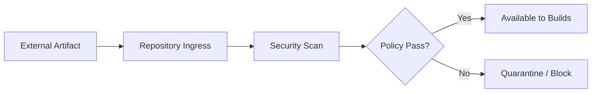

---

## 36. Repository Manager and License Governance

A dependency can be technically safe but legally unacceptable for a product.

Repository manager policy can help enforce license constraints.

Examples:

- block GPL dependencies for closed-source products,
- allow Apache/MIT/BSD by default,
- require review for AGPL/LGPL/MPL,
- require legal approval for unknown license,
- treat transitive dependencies as part of the product bill of materials.

Maven dependency management decides versions.

Repository governance decides whether those versions are allowed to enter and move through the lifecycle.

---

## 37. Repository Manager and SBOM Flow

SBOM generation is often performed by build plugins or CI tools.

But the repository manager contributes artifact truth.

For each release artifact:

- artifact coordinates,
- checksum,
- dependency graph,
- repository source,
- timestamp,
- promotion status,
- security scan status,
- license assessment,
- provenance metadata.

A strong release pipeline attaches or links SBOM output to the release artifact.

The repository manager should be part of that trace.

---

## 38. Vendor Repository Strategy

Some vendors provide their own Maven repository.

Do not let every project add vendor repositories directly in POMs without review.

Better approach:

1. create approved proxy/remote repository,
2. add it to controlled group/virtual repository if appropriate,
3. document vendor terms/license,
4. restrict access if contract-bound,
5. monitor availability and authentication,
6. cache required artifacts,
7. define replacement plan if vendor repository disappears.

POM-level repositories should be rare in enterprise product code.

Repository access should be centrally governed.

---

## 39. Repository Manager Failure Playbooks

### Playbook: Maven Central Proxy Failure

Symptoms:

- new dependencies cannot resolve,
- cached dependencies still work,
- CI fresh builds fail,
- local warm builds pass.

Actions:

1. check repository manager proxy status,
2. check upstream Maven Central connectivity,
3. check corporate network/proxy,
4. check DNS/TLS expiry,
5. verify mirror settings route to expected repo,
6. test with known cached artifact and known uncached artifact,
7. communicate expected impact.

### Playbook: Internal Release Deploy Fails

Symptoms:

```txt
Failed to deploy artifact ... 400/401/403/409
```

Actions:

1. verify repository ID matches `settings.xml` server ID,
2. verify version is release or snapshot according to target repository,
3. verify redeploy policy,
4. verify deploy token permission,
5. verify target URL,
6. check repository manager logs,
7. inspect whether artifact already exists.

### Playbook: Snapshot Drift

Symptoms:

- two developers resolve different snapshot bytes,
- staging behavior changes without code change,
- integration test passes/fails inconsistently.

Actions:

1. inspect timestamped snapshot metadata,
2. pin to release version where possible,
3. avoid snapshots in release graphs,
4. reduce snapshot retention confusion,
5. use BOM alignment for integration trains,
6. rebuild consumers after snapshot publication.

### Playbook: Corrupted Artifact Cache

Symptoms:

- checksum mismatch,
- jar cannot be opened,
- class missing from downloaded artifact,
- clean local repo reproduces only through internal proxy.

Actions:

1. compare artifact checksum from proxy and upstream,
2. invalidate proxy cache for artifact,
3. inspect storage backend errors,
4. check whether artifact was manually uploaded,
5. block artifact until provenance is clear.

---

## 40. Nexus-Specific Mental Model

Nexus terminology commonly includes:

- hosted repositories,
- proxy repositories,
- group repositories.

The Sonatype documentation states Nexus Repository supports hosted, proxy, and group repositories.

A Maven-focused Nexus setup often uses:

```txt
maven-releases       hosted
maven-snapshots      hosted
maven-central        proxy
maven-public         group
```

For enterprise use, expand this baseline with:

```txt
maven-staging
maven-thirdparty-approved
vendor-specific proxies
dev vs release consumption groups
```

Reference:

- https://help.sonatype.com/en/repository-types.html
- https://help.sonatype.com/en/maven-repositories.html

---

## 41. Artifactory-Specific Mental Model

Artifactory terminology commonly includes:

- local repositories,
- remote repositories,
- virtual repositories.

A Maven-focused Artifactory setup often maps to:

```txt
libs-release-local       local
libs-snapshot-local      local
maven-central-remote     remote
libs-release             virtual
```

JFrog Maven repository documentation describes configuring Maven through `settings.xml` and using Artifactory as a source for artifacts and a target for deploying generated artifacts.

References:

- https://docs.jfrog.com/artifactory/docs/maven-repositories
- https://jfrog.com/screencast/setting-maven-repository-jfrog-artifactory-less-one-minute/

The product vocabulary differs.

The architecture principles remain the same:

- separate write and read endpoints,
- proxy external sources,
- host internal outputs,
- expose stable virtual/group consumption URLs,
- protect releases from mutation,
- isolate permissions.

---

## 42. Do Not Treat Repository Manager as a Dumping Ground

A repository manager can become a landfill.

Symptoms:

- random manually uploaded JARs,
- unclear repository names,
- snapshots in release repositories,
- releases overwritten,
- credentials shared broadly,
- no retention policy,
- no ownership,
- no artifact provenance,
- no cleanup,
- no monitoring,
- no promotion model.

This creates false confidence.

You have a repository manager, but not repository governance.

### Repository Governance Requires

- repository naming standards,
- repository ownership,
- permission model,
- artifact lifecycle policy,
- retention policy,
- vulnerability/license policy,
- incident playbooks,
- audit logging,
- backup/restore testing,
- documented settings templates,
- regular review of repositories and credentials.

---

## 43. Repository Manager Checklist

For a production Maven organization, verify:

- all builds resolve through repository manager,
- direct external repositories are blocked or reviewed,
- `settings.xml` mirrors route external traffic correctly,
- repository IDs are stable and documented,
- hosted release repositories are immutable,
- snapshots and releases are separated,
- CI deploy credentials are scoped,
- release deploy credentials are isolated,
- third-party imports require approval,
- proxy repositories are monitored,
- group/virtual repository ordering is documented,
- release promotion uses exact bytes,
- repository manager is backed up,
- repository manager has HA/DR plan,
- security/license scanning is integrated,
- repository cleanup policy exists,
- clean-room builds are tested,
- incident playbooks are documented.

---

## 44. Practice Lab

Design a repository topology for this organization:

```txt
Company: Acme Financial Systems
Projects: 80 Maven services
Teams: 12 product teams
CI: shared Kubernetes runners
External deps: Maven Central + 3 vendor repositories
Regulation: release artifacts must be reproducible for 7 years
Security: critical vulnerabilities must be blocked before release
```

Create:

1. repository list,
2. repository type for each,
3. read/write permissions,
4. settings.xml mirror strategy,
5. deployment target strategy,
6. snapshot retention policy,
7. release immutability policy,
8. promotion workflow,
9. third-party approval process,
10. incident playbooks.

A strong answer might define:

```txt
maven-public-dev
maven-public-release
maven-central-proxy
vendor-a-proxy
vendor-b-proxy
vendor-c-proxy
maven-thirdparty-approved
maven-snapshots
maven-staging
maven-releases
```

Then explain which builds consume from each endpoint.

---

## 45. Summary

A Maven repository manager is the artifact control plane.

It is where dependency resolution, artifact publication, release immutability, security scanning, license governance, and build reproducibility intersect.

Core principles:

- route external artifacts through repository manager,
- separate hosted/local, proxy/remote, and group/virtual concerns,
- separate snapshots from releases,
- make releases immutable,
- promote exact bytes instead of rebuilding,
- isolate read and write endpoints,
- scope credentials by actor and lifecycle,
- monitor repository manager as production infrastructure,
- document topology and policy,
- treat third-party binary import as governed supply-chain ingress,
- use `settings.xml` to connect Maven executions to the repository control plane.

The next part moves into multi-module reactor fundamentals: aggregation vs inheritance, module ordering, reactor graph, partial builds, `-pl`, `-am`, `-amd`, `-rf`, and how Maven builds large codebases without pretending the filesystem is the architecture.

---

## References

- Apache Maven Introduction to Repositories: https://maven.apache.org/guides/introduction/introduction-to-repositories.html
- Apache Maven Guide to Mirrors: https://maven.apache.org/guides/mini/guide-mirror-settings.html
- Apache Maven Settings Reference: https://maven.apache.org/settings.html
- Sonatype Nexus Repository Types: https://help.sonatype.com/en/repository-types.html
- Sonatype Maven Repositories: https://help.sonatype.com/en/maven-repositories.html
- Sonatype Nexus Repository Product Overview: https://www.sonatype.com/products/sonatype-nexus-repository
- JFrog Artifactory Maven Repositories: https://docs.jfrog.com/artifactory/docs/maven-repositories
- JFrog Artifactory Getting Started with Repositories: https://docs.jfrog.com/artifactory/docs/getting-started
- Sonatype Central OSSRH EOL Notice: https://central.sonatype.org/pages/ossrh-eol/
