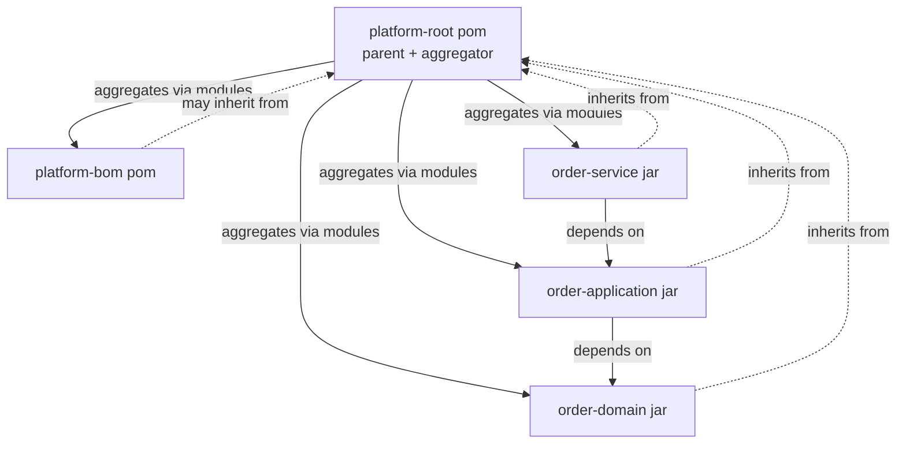
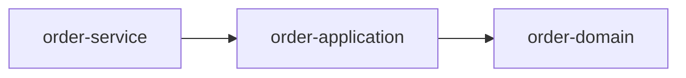
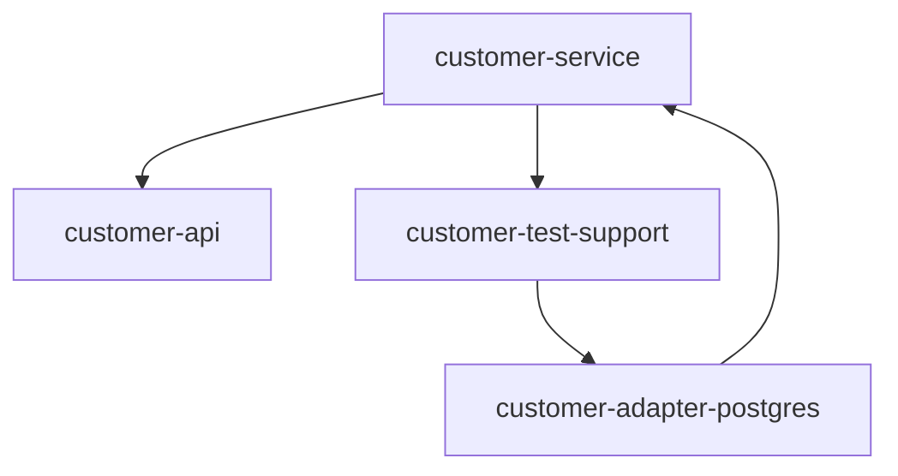
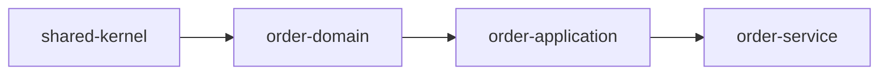
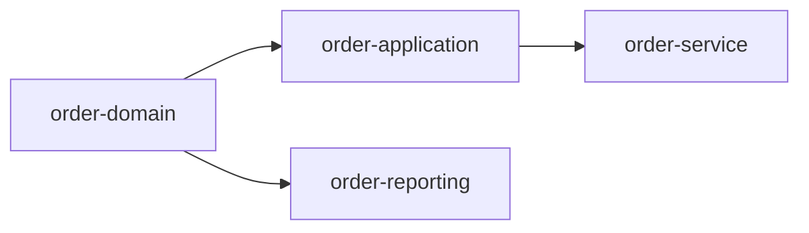
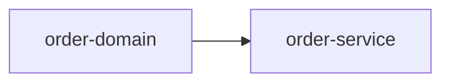
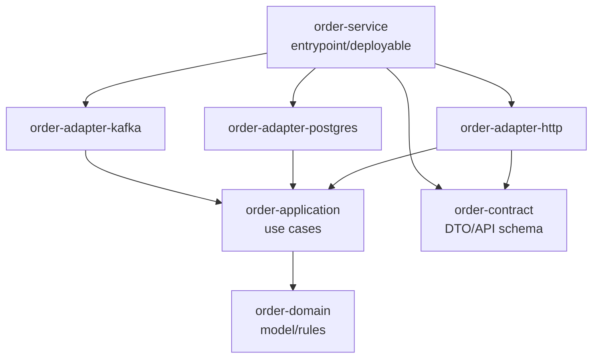
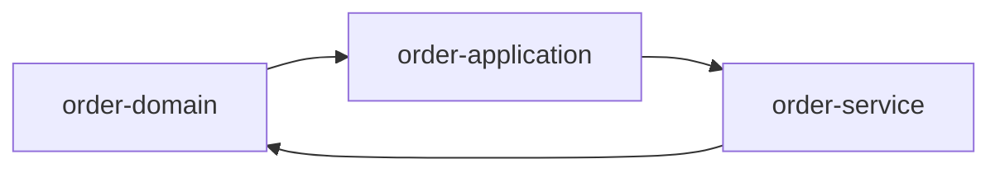
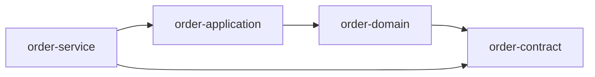
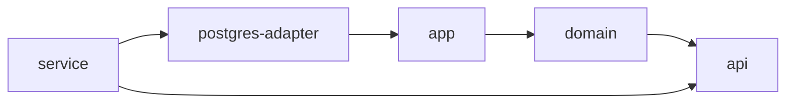

# Part 015 — Multi-Module Reactor Basics

> Target: setelah bagian ini, kamu tidak lagi melihat multi-module Maven sebagai “folder berisi banyak project”, tetapi sebagai **build graph** yang dikumpulkan, disortir, dipotong, dilanjutkan, dan dieksekusi oleh Maven reactor.

Multi-module Maven sering terlihat sederhana:

```xml
<modules>
  <module>domain</module>
  <module>application</module>
  <module>adapter-postgres</module>
  <module>service</module>
</modules>
```

Tapi di production, bagian ini sering menjadi sumber build lambat, dependency cycle, CI tidak deterministik, local build yang beda dari pipeline, dan release yang sulit dipahami.

Maven reactor adalah mekanisme di Maven core yang menangani multi-module build. Dokumentasi resmi Maven menjelaskan bahwa reactor melakukan tiga hal utama: mengumpulkan module yang tersedia, mengurutkan project ke build order yang benar, lalu membangun selected projects secara berurutan. Referensi: [Apache Maven — Guide to Working with Multiple Modules](https://maven.apache.org/guides/mini/guide-multiple-modules.html).

---

## 1. Skill yang Ingin Dibangun

Di akhir part ini, kamu harus bisa:

1. Membedakan **parent**, **aggregator**, **module**, dan **reactor**.
2. Menjelaskan kenapa `<modules>` bukan dependency declaration.
3. Membaca dan memprediksi build order multi-module.
4. Menggunakan `-pl`, `-am`, `-amd`, dan `-rf` dengan aman.
5. Mendesain partial build workflow untuk local development dan CI.
6. Mendiagnosis failure khas reactor: missing module, wrong build order assumption, stale local artifact, hidden dependency, dan circular dependency.

Mental model utama:

```txt
multi-module Maven project = collection of Maven projects
reactor = runtime build plan over that collection
```

Folder structure hanyalah input kasar. Yang dieksekusi Maven adalah **reactor graph**.

---

## 2. Empat Konsep yang Sering Tertukar

### 2.1 Parent POM

Parent POM adalah POM yang diwarisi oleh child POM lewat `<parent>`.

Tujuannya:

- mewariskan `groupId` / `version`,
- menaruh `dependencyManagement`,
- menaruh `pluginManagement`,
- menaruh shared properties,
- menaruh build policy.

Contoh:

```xml
<parent>
  <groupId>com.acme.platform</groupId>
  <artifactId>acme-parent</artifactId>
  <version>1.12.0</version>
  <relativePath>../pom.xml</relativePath>
</parent>
```

Parent menjawab pertanyaan:

> “Konfigurasi build apa yang diwarisi module ini?”

### 2.2 Aggregator POM

Aggregator POM adalah POM yang mencantumkan module lewat `<modules>`.

Tujuannya:

- mengumpulkan beberapa project,
- membuat Maven menjalankan build ke module-module itu,
- membentuk input awal untuk reactor.

Contoh:

```xml
<packaging>pom</packaging>

<modules>
  <module>bom</module>
  <module>domain</module>
  <module>application</module>
  <module>service</module>
</modules>
```

Aggregator menjawab pertanyaan:

> “Project mana saja yang dibangun bersama ketika command dijalankan dari root ini?”

Dokumentasi Maven menegaskan bahwa project aggregation berbeda dari inheritance: aggregation mencantumkan module dari parent/aggregator POM, sedangkan inheritance membuat child menunjuk ke parent POM. Referensi: [Apache Maven — Introduction to the POM: Project Aggregation](https://maven.apache.org/guides/introduction/introduction-to-the-pom.html#project-aggregation).

### 2.3 Module

Module adalah Maven project lain yang dicantumkan oleh aggregator.

`<module>` berisi path relatif ke directory module atau file POM.

```xml
<modules>
  <module>order-api</module>
  <module>order-service</module>
  <module>tools/schema-generator/pom.xml</module>
</modules>
```

Module menjawab pertanyaan:

> “POM mana yang masuk ke kumpulan build ini?”

### 2.4 Reactor

Reactor adalah build plan runtime yang dibentuk Maven setelah membaca project-project dalam multi-module build.

Reactor menjawab pertanyaan:

> “Dari semua project yang tersedia, mana yang harus dibangun, dalam urutan apa, dan apa yang terjadi ketika sebagian build gagal?”

Satu project bisa:

- punya parent tapi tidak di-aggregate oleh parent itu,
- di-aggregate oleh aggregator tapi tidak inherit dari aggregator itu,
- inherit dan di-aggregate oleh POM yang sama,
- ikut reactor hanya ketika command dijalankan dari root aggregator tertentu.

Ini sumber banyak kebingungan.

---

## 3. Parent vs Aggregator: Jangan Campur Secara Mental

Maven mengizinkan POM yang sama menjadi parent sekaligus aggregator. Ini umum, tapi bukan kewajiban.



Di diagram ini:

- garis solid = aggregation,
- garis putus-putus = inheritance,
- garis dependency = artifact dependency.

Tiga relasi ini berbeda.

| Relasi | Dinyatakan di mana? | Efek utama | Apakah memengaruhi classpath? |
|---|---|---|---|
| Inheritance | child `<parent>` | konfigurasi diwarisi | tidak langsung |
| Aggregation | aggregator `<modules>` | module ikut reactor | tidak |
| Dependency | child `<dependencies>` | artifact masuk graph dependency | ya, tergantung scope |

Rule praktis:

> Jangan pernah menganggap “ada di `<modules>`” berarti “bisa dipakai di compile classpath”. Untuk memakai class dari module lain, tetap harus declare dependency.

Contoh salah:

```xml
<!-- root pom -->
<modules>
  <module>order-domain</module>
  <module>order-service</module>
</modules>
```

Lalu `order-service` memakai class dari `order-domain` tanpa dependency.

Itu salah. Aggregation bukan dependency.

Yang benar:

```xml
<!-- order-service/pom.xml -->
<dependencies>
  <dependency>
    <groupId>com.acme.order</groupId>
    <artifactId>order-domain</artifactId>
    <version>${project.version}</version>
  </dependency>
</dependencies>
```

---

## 4. Minimal Multi-Module Project

Struktur:

```txt
order-platform/
  pom.xml
  order-domain/
    pom.xml
    src/main/java/...
  order-application/
    pom.xml
    src/main/java/...
  order-service/
    pom.xml
    src/main/java/...
```

Root POM:

```xml
<project xmlns="http://maven.apache.org/POM/4.0.0"
         xmlns:xsi="http://www.w3.org/2001/XMLSchema-instance"
         xsi:schemaLocation="http://maven.apache.org/POM/4.0.0 https://maven.apache.org/xsd/maven-4.0.0.xsd">
  <modelVersion>4.0.0</modelVersion>

  <groupId>com.acme.order</groupId>
  <artifactId>order-platform</artifactId>
  <version>1.0.0-SNAPSHOT</version>
  <packaging>pom</packaging>

  <modules>
    <module>order-domain</module>
    <module>order-application</module>
    <module>order-service</module>
  </modules>
</project>
```

Child POM:

```xml
<project xmlns="http://maven.apache.org/POM/4.0.0"
         xmlns:xsi="http://www.w3.org/2001/XMLSchema-instance"
         xsi:schemaLocation="http://maven.apache.org/POM/4.0.0 https://maven.apache.org/xsd/maven-4.0.0.xsd">
  <modelVersion>4.0.0</modelVersion>

  <parent>
    <groupId>com.acme.order</groupId>
    <artifactId>order-platform</artifactId>
    <version>1.0.0-SNAPSHOT</version>
  </parent>

  <artifactId>order-domain</artifactId>
</project>
```

Command:

```bash
mvn verify
```

Ketika command dijalankan dari root, Maven membaca root POM, menemukan `<modules>`, mengumpulkan module, membentuk reactor, menyortir, lalu menjalankan lifecycle sampai phase `verify` untuk selected projects.

---

## 5. Reactor Sorting: Urutan `<modules>` Bukan Urutan Final

Banyak engineer junior berpikir Maven membangun module sesuai urutan di `<modules>`. Itu hanya benar ketika tidak ada relasi lain yang menentukan urutan.

Maven reactor sorting menghormati relasi berikut:

1. project dependency pada module lain dalam reactor,
2. plugin declaration ketika plugin adalah module lain dalam reactor,
3. plugin dependency pada module lain dalam reactor,
4. build extension declaration pada module lain dalam reactor,
5. urutan `<modules>` jika tidak ada rule lain yang berlaku.

Elemen `dependencyManagement` dan `pluginManagement` tidak menyebabkan perubahan reactor sort order karena belum tentu dependency/plugin itu benar-benar dipakai. Referensi: [Apache Maven — Reactor Sorting](https://maven.apache.org/guides/mini/guide-multiple-modules.html#reactor-sorting).

Contoh:

```xml
<modules>
  <module>order-service</module>
  <module>order-application</module>
  <module>order-domain</module>
</modules>
```

Jika dependency-nya seperti ini:



Maka Maven harus membangun:

```txt
order-domain
order-application
order-service
```

Bukan sesuai urutan deklarasi.

Urutan `<modules>` tetap berguna untuk readability dan tie-breaker, tapi bukan sumber kebenaran dependency order.

---

## 6. Build Order Bukan Arsitektur

Build order adalah konsekuensi teknis dari dependency graph. Ia tidak otomatis berarti desainnya bagus.

Contoh build order yang legal tapi buruk:



Masalah:

- `service` bergantung ke `test-support`,
- `test-support` bergantung ke adapter,
- adapter bergantung ke service,
- ini cenderung menyebabkan cycle atau test artifact leakage.

Maven bisa membantu menemukan problem, tapi tidak bisa menggantikan desain boundary.

Rule senior:

> Reactor graph harus menjadi bayangan dari architecture dependency direction. Jika reactor graph terlihat kusut, architecture graph mungkin juga kusut.

---

## 7. Partial Build: `-pl`, `-am`, `-amd`, `-rf`

Di project besar, menjalankan `mvn verify` dari root untuk setiap perubahan bisa terlalu mahal. Maven menyediakan opsi untuk memotong reactor.

Dokumentasi Maven menyebut beberapa command line switches untuk reactor, termasuk `--resume-from`, `--also-make`, `--also-make-dependents`, `--fail-fast`, `--fail-at-end`, dan `--non-recursive`. Referensi: [Apache Maven — Multiple Modules Command Line Options](https://maven.apache.org/guides/mini/guide-multiple-modules.html#command-line-options).

Short aliases umum:

| Long Option | Short Option | Makna |
|---|---:|---|
| `--projects` | `-pl` | pilih project/module tertentu |
| `--also-make` | `-am` | ikut build dependencies dari selected project |
| `--also-make-dependents` | `-amd` | ikut build dependents dari selected project |
| `--resume-from` | `-rf` | lanjutkan reactor dari project tertentu |
| `--non-recursive` | `-N` | build current project saja, tanpa module |

### 7.1 Build Satu Module Saja

```bash
mvn -pl order-service verify
```

Makna:

> Build hanya `order-service` dari reactor.

Risiko:

- dependency module lain tidak ikut dibangun,
- Maven bisa memakai artifact lama dari local repository,
- hasil bisa berbeda dari clean full reactor build.

Gunakan ini hanya jika kamu yakin upstream dependency sudah valid di local repo.

### 7.2 Build Module dan Dependencies-nya

```bash
mvn -pl order-service -am verify
```

Makna:

> Build `order-service` dan semua module dalam reactor yang dibutuhkan oleh `order-service`.

Jika graph:



Command:

```bash
mvn -pl order-service -am verify
```

Akan membangun kira-kira:

```txt
shared-kernel
order-domain
order-application
order-service
```

Ini command local development paling aman untuk bekerja pada deployable module tertentu.

### 7.3 Build Module dan Dependents-nya

```bash
mvn -pl order-domain -amd verify
```

Makna:

> Build `order-domain` dan semua module yang bergantung padanya.

Ini cocok ketika kamu mengubah module rendah/lower-level dan ingin tahu dampaknya.

Jika graph:



Command:

```bash
mvn -pl order-domain -amd verify
```

Akan membangun:

```txt
order-domain
order-application
order-service
order-reporting
```

### 7.4 Build Module, Dependencies, dan Dependents

```bash
mvn -pl order-application -am -amd verify
```

Makna:

> Build selected project, dependencies-nya, dan downstream projects yang bergantung padanya.

Ini berguna untuk impact testing, tapi bisa menjadi hampir full build pada graph yang highly connected.

### 7.5 Resume dari Module yang Gagal

```bash
mvn -rf order-service verify
```

Makna:

> Lanjutkan build dari `order-service`.

Dipakai setelah full reactor gagal di tengah.

Tapi hati-hati: `-rf` tidak otomatis memperbaiki upstream state. Jika kamu mengubah upstream setelah failure, lebih aman:

```bash
mvn -pl order-service -am verify
```

Atau ulang dari root:

```bash
mvn verify
```

---

## 8. Failure Strategy: Fail Fast vs Fail At End

Default Maven adalah fail-fast: ketika satu module gagal, build berhenti.

```bash
mvn verify
```

Untuk CI feedback pada banyak module independen, kamu kadang ingin melihat semua failure sekaligus:

```bash
mvn --fail-at-end verify
```

Makna:

- Maven tetap melanjutkan module yang tidak bergantung pada module gagal,
- failure dilaporkan di akhir.

Gunakan `--fail-at-end` untuk:

- nightly build,
- validation branch besar,
- migration build,
- multi-module refactoring.

Gunakan default fail-fast untuk:

- pull request cepat,
- local development,
- pipeline mahal,
- ketika satu module gagal biasanya membuat downstream meaningless.

Jangan gunakan `--fail-never` untuk pipeline quality gate. Itu menyembunyikan failure.

---

## 9. Local Repository Trap pada Partial Build

Ini salah satu jebakan terbesar multi-module Maven.

Misal:



Kamu mengubah `order-domain`, lalu menjalankan:

```bash
mvn -pl order-service test
```

Jika `order-domain` tidak ikut reactor, Maven akan resolve `order-domain` dari local repository `~/.m2/repository`.

Kemungkinan:

- artifact lama dipakai,
- test lolos padahal full reactor gagal,
- bug baru tidak terlihat,
- developer lain/CI mendapat hasil berbeda.

Command yang lebih aman:

```bash
mvn -pl order-service -am test
```

Rule:

> Jika selected module bergantung pada module lain yang mungkin berubah, gunakan `-am`.

Untuk mengecek artifact yang dipakai:

```bash
mvn -pl order-service dependency:tree
```

Atau dengan verbose/debug:

```bash
mvn -pl order-service -X test
```

---

## 10. Aggregator Goal vs Normal Goal

Sebagian plugin goal bersifat aggregator: goal itu berjalan pada aggregator/root dan memproses beberapa module sebagai satu kesatuan.

Contoh umum di dunia Maven:

- aggregate report,
- aggregate javadoc,
- release-related workflow,
- site/reporting tertentu,
- custom enterprise plugin untuk cross-module validation.

Masalah muncul ketika engineer mengira semua goal berjalan sama di setiap module.

Mental model:

```txt
normal goal      = dieksekusi per project/module sesuai lifecycle/execution
aggregator goal  = dieksekusi dengan awareness terhadap reactor/session/module collection
```

Ketika membuat custom plugin nanti, ini akan dibahas lebih dalam. Untuk sekarang, cukup pahami bahwa tidak semua plugin goal bersifat per-module murni.

Diagnostic path:

```bash
mvn help:describe -Dplugin=<plugin-prefix> -Ddetail
```

Cari informasi goal dan parameter. Untuk plugin resmi, baca halaman goal tersebut.

---

## 11. Struktur Root yang Sehat

Untuk project enterprise, root POM jangan dijadikan tempat semua hal tanpa batas.

Struktur awal yang sehat:

```txt
order-platform/
  pom.xml                    # aggregator, maybe parent
  order-platform-bom/
    pom.xml                  # dependencyManagement export
  order-parent/
    pom.xml                  # optional parent if separated
  order-domain/
    pom.xml
  order-application/
    pom.xml
  order-adapter-postgres/
    pom.xml
  order-adapter-kafka/
    pom.xml
  order-service/
    pom.xml
  order-test-support/
    pom.xml
```

Namun untuk banyak tim, root yang menjadi parent sekaligus aggregator masih praktis:

```txt
order-platform/
  pom.xml                    # parent + aggregator
  order-bom/
  order-domain/
  order-application/
  order-service/
```

Yang penting bukan apakah parent dan aggregator dipisah atau digabung. Yang penting adalah:

1. inheritance tidak dipakai untuk menyembunyikan dependency,
2. aggregation tidak dipakai sebagai pengganti dependency,
3. BOM tidak dipakai sebagai parent sembarangan,
4. deployable module tidak menjadi dumping ground semua module lain.

---

## 12. Anti-Pattern: Root POM sebagai God Object

Root POM yang buruk biasanya berisi:

- semua dependency version,
- semua plugin configuration,
- semua profile environment,
- semua repository,
- semua release config,
- semua generated source config,
- semua test config,
- semua module list,
- semua property random.

Akibat:

- setiap module mewarisi konfigurasi yang tidak relevan,
- plugin execution terjadi pada module yang salah,
- perubahan kecil root POM memicu dampak besar,
- sulit tahu module mana yang benar-benar butuh konfigurasi tertentu,
- build lambat karena plugin berjalan di terlalu banyak tempat.

Pattern lebih sehat:

```txt
root aggregator
  minimal build-wide identity and module list

parent POM
  shared policy and pluginManagement

BOM POM
  dependency version alignment only

module POM
  explicit dependencies and module-specific plugin executions
```

Tidak harus selalu dipisah fisik menjadi empat POM, tapi secara konsep harus dipisah.

---

## 13. Dependency Direction untuk Multi-Module

Contoh struktur layered:



Pertanyaan desain:

- Apakah `domain` tahu `postgres`? Seharusnya tidak.
- Apakah `application` tahu framework transport? Biasanya tidak.
- Apakah `adapter` boleh depend ke `application`? Ya, adapter menjalankan use case.
- Apakah deployable module bergantung pada semua adapter? Sering iya, sebagai composition root.

Maven tidak memaksa arsitektur ini. Maven hanya mengeksekusi dependency graph yang kamu deklarasikan.

Senior engineer memakai reactor graph sebagai alat audit:

```bash
mvn dependency:tree
```

Lalu bertanya:

> “Apakah arah dependency ini sesuai dependency rule arsitektur?”

---

## 14. Module Boundary Checklist

Sebelum membuat module baru, jawab:

1. Apakah module ini punya artifact boundary yang jelas?
2. Apakah ia akan dipakai oleh module lain?
3. Apakah ia perlu lifecycle/test/release sendiri?
4. Apakah ia menyembunyikan dependency teknis tertentu?
5. Apakah module ini hanya dibuat karena folder sudah terlalu besar?
6. Apakah ada risiko dependency cycle?
7. Apakah module ini akan dipublish sebagai artifact internal?
8. Apakah ownership module jelas?
9. Apakah build time bertambah sepadan dengan boundary yang diperoleh?
10. Apakah module ini membuat public API baru yang perlu dijaga?

Jangan membuat module hanya karena package Java sudah besar. Package adalah boundary source. Maven module adalah boundary build/artifact.

---

## 15. Reactor Cycle: Build System Menolak Desain yang Berputar

Contoh cycle:



Maven tidak bisa membangun graph ini secara valid karena tidak ada module yang bisa dibangun pertama tanpa membutuhkan module lain.

Solusi bukan “memaksa order”. Solusi adalah memecah boundary.

Contoh refactor:



Pattern umum untuk memutus cycle:

- ekstrak API/contract module,
- ekstrak SPI/interface module,
- pindahkan implementation ke adapter module,
- ubah dependency langsung menjadi event/message contract,
- pindahkan test fixture ke `test-support` dengan scope `test`, bukan compile.

---

## 16. Common Reactor Commands for Daily Work

### Full verification

```bash
mvn clean verify
```

Gunakan ketika:

- sebelum push besar,
- sebelum release,
- setelah update dependency/plugin,
- setelah refactoring cross-module.

### Fast module verification with upstream modules

```bash
mvn -pl order-service -am verify
```

Gunakan ketika:

- bekerja pada satu service,
- ada upstream module yang ikut berubah,
- ingin menghindari stale local artifact.

### Impact check for lower-level module

```bash
mvn -pl order-domain -amd test
```

Gunakan ketika:

- mengubah domain/core/shared library,
- ingin tahu downstream yang terdampak.

### Resume after failure

```bash
mvn -rf order-service verify
```

Gunakan ketika:

- full reactor gagal di module tertentu,
- kamu memperbaiki failure di module itu,
- upstream belum berubah.

### Build root only

```bash
mvn -N validate
```

Gunakan untuk:

- validasi root POM,
- cek effective settings/root metadata,
- operasi yang tidak perlu module recursion.

---

## 17. CI Strategy for Reactor Builds

Untuk CI, jangan asal menjalankan `mvn clean install`.

Pertama, pahami tujuan pipeline.

| Pipeline | Command kandidat | Tujuan |
|---|---|---|
| Pull request cepat | `mvn -pl changed-module -am verify` | validasi area terdampak |
| Pull request conservative | `mvn -pl changed-module -am -amd verify` | validasi upstream + downstream |
| Main branch | `mvn clean verify` | full confidence |
| Nightly | `mvn clean verify --fail-at-end` | kumpulkan semua failure |
| Release | `mvn clean deploy` | publish artifact |

Jangan gunakan `install` di CI kecuali ada alasan. Untuk validasi normal, `verify` biasanya cukup. Dokumentasi Maven sendiri menyebut `verify` sebagai common build invocation ketika tidak perlu reuse artifact dari local repository project lain. Referensi: [Apache Maven — Running Maven](https://maven.apache.org/run.html).

`install` menulis artifact ke local repository runner. Pada ephemeral CI runner, efeknya sering tidak berguna kecuali step berikutnya dalam job yang sama perlu artifact dari local repo.

---

## 18. Build Cache dan Reactor

Maven default tidak memiliki remote build cache seperti beberapa build system lain. Yang sering disebut “cache” di Maven biasanya:

- local repository cache,
- dependency download cache,
- plugin artifact cache,
- CI workspace cache,
- repository manager proxy cache.

Jangan samakan dependency cache dengan build output cache.

Jika module tidak dibangun ulang tapi artifact lama ada di `~/.m2`, Maven bisa resolve artifact lama. Itu bukan incremental correctness guarantee. Itu hanya repository resolution.

Rule:

> Local repository mempercepat resolution, bukan membuktikan build output masih valid terhadap source terbaru.

---

## 19. Diagnostic Playbook: “Kenapa Module Ini Tidak Dibangun?”

Langkah:

### 19.1 Pastikan command dijalankan dari aggregator yang benar

```bash
pwd
ls pom.xml
```

Cek root POM:

```bash
grep -n "<modules>" -n pom.xml
```

### 19.2 Pastikan module tercantum

```xml
<modules>
  <module>order-service</module>
</modules>
```

Path harus relatif dari aggregator POM.

### 19.3 Pastikan tidak memakai `-N`

```bash
mvn -N verify
```

`-N` berarti non-recursive. Module tidak ikut.

### 19.4 Pastikan `-pl` tidak mengecualikan module

```bash
mvn -pl order-api verify
```

Command ini memilih `order-api` saja. Module lain tidak ikut kecuali `-am`/`-amd`.

### 19.5 Pastikan module bukan hanya dependencyManagement

Jika module hanya muncul di `dependencyManagement`, itu tidak membuatnya ikut reactor sorting sebagai dependency aktif.

Harus ada dependency nyata bila artifact dipakai:

```xml
<dependencies>
  <dependency>
    <groupId>com.acme.order</groupId>
    <artifactId>order-domain</artifactId>
  </dependency>
</dependencies>
```

---

## 20. Diagnostic Playbook: “Kenapa Build Order Berbeda dari `<modules>`?”

Jawaban umum:

> Karena Maven topologically sorts reactor projects berdasarkan dependency/plugin/build-extension relationship.

Langkah:

1. Jalankan build dengan output normal dan lihat reactor order.
2. Cek dependency antar module.
3. Cek plugin declaration yang menunjuk module dalam reactor.
4. Cek plugin dependency.
5. Cek build extension.
6. Baru cek urutan `<modules>` sebagai fallback.

Command:

```bash
mvn -DskipTests validate
```

Maven biasanya menampilkan `Reactor Build Order` di awal output untuk multi-module build.

---

## 21. Diagnostic Playbook: “Kenapa Local Build Lolos tapi CI Gagal?”

Penyebab umum:

1. local repository berisi artifact lama yang tidak ada di CI,
2. module tidak ikut build karena command local memakai `-pl` tanpa `-am`,
3. parent POM resolved dari local repository, bukan source tree,
4. profile aktif berbeda,
5. JDK berbeda,
6. settings.xml berbeda,
7. repository mirror berbeda,
8. generated source tidak committed dan tidak generated di CI.

Clean-room test:

```bash
mvn -Dmaven.repo.local=/tmp/clean-m2 clean verify
```

Ini memaksa Maven memakai local repository kosong khusus command itu. Sangat berguna untuk menemukan dependency yang diam-diam hanya ada di laptop.

---

## 22. Good Defaults untuk Multi-Module Team

Untuk repo enterprise, gunakan rule berikut:

1. Command standar lokal:

```bash
mvn -pl <module> -am verify
```

2. Command standar sebelum merge besar:

```bash
mvn clean verify
```

3. Main branch pipeline:

```bash
mvn clean verify
```

4. Nightly/full migration:

```bash
mvn clean verify --fail-at-end
```

5. Jangan mengandalkan `mvn install` sebagai cara normal agar module saling melihat.

6. Jangan commit workaround yang hanya memperbaiki local reactor tapi merusak published artifact.

7. Setiap module harus punya alasan boundary yang jelas.

---

## 23. Exercise: Prediksi Reactor Build

Struktur:

```txt
platform/
  pom.xml
  api/
  domain/
  app/
  postgres-adapter/
  service/
```

Dependencies:



Pertanyaan:

1. Apa build order untuk `mvn verify`?
2. Apa yang dibangun oleh `mvn -pl service -am verify`?
3. Apa yang dibangun oleh `mvn -pl domain -amd test`?
4. Apa risiko `mvn -pl service test`?

Jawaban:

1. `api`, `domain`, `app`, `postgres-adapter`, `service`.
2. `api`, `domain`, `app`, `postgres-adapter`, `service`.
3. `domain`, `app`, `postgres-adapter`, `service`. `api` tidak ikut kecuali dibutuhkan sebagai dependency dari selected/dependent graph yang dipilih dan resolusinya membutuhkan reactor build; untuk command conservative, gunakan `-am -amd`.
4. `service` bisa memakai artifact lama dari local repository untuk upstream module.

---

## 24. Senior Review Checklist

Saat review PR multi-module Maven, cek:

- Apakah module baru benar-benar perlu artifact boundary?
- Apakah dependency direction sesuai arsitektur?
- Apakah ada dependency cycle tersembunyi?
- Apakah `test-support` masuk compile scope?
- Apakah root POM makin menjadi god object?
- Apakah module order di `<modules>` readable?
- Apakah command CI memakai `verify`, bukan `install` tanpa alasan?
- Apakah partial build instruction memakai `-am`?
- Apakah parent dan aggregator sengaja digabung/dipisah?
- Apakah artifact yang dipublish punya dependency metadata benar?

---

## 25. Kesimpulan

Multi-module Maven bukan mekanisme folder. Ia adalah mekanisme build graph.

Ingat empat boundary:

```txt
parent      = inheritance/config boundary
aggregator  = collection boundary
module      = project/artifact boundary
reactor     = runtime build execution boundary
```

Kesalahan terbesar adalah mencampur keempatnya.

Untuk bekerja efektif:

- gunakan `<modules>` untuk mengumpulkan project,
- gunakan `<dependencies>` untuk classpath/artifact relation,
- gunakan `<parent>` untuk inheritance policy,
- gunakan `-pl`, `-am`, `-amd`, `-rf` untuk mengontrol reactor,
- gunakan full `mvn clean verify` untuk confidence tinggi.

Pada part berikutnya, kita akan naik satu level: bukan hanya bagaimana reactor bekerja, tetapi bagaimana menyusun **multi-module enterprise architecture** yang scalable, maintainable, dan defensible.

---

## Referensi

- [Apache Maven — Guide to Working with Multiple Modules](https://maven.apache.org/guides/mini/guide-multiple-modules.html)
- [Apache Maven — Introduction to the POM](https://maven.apache.org/guides/introduction/introduction-to-the-pom.html)
- [Apache Maven — POM Reference](https://maven.apache.org/pom.html)
- [Apache Maven — Running Maven](https://maven.apache.org/run.html)
