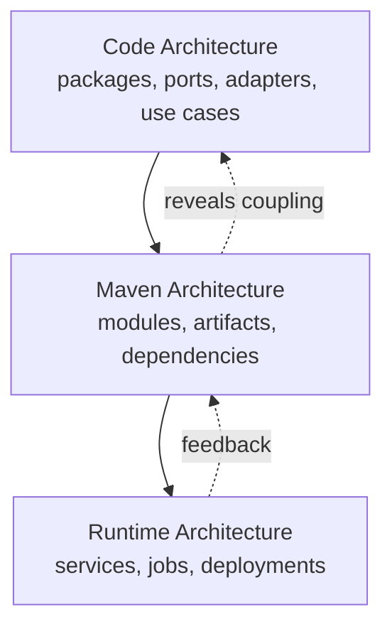
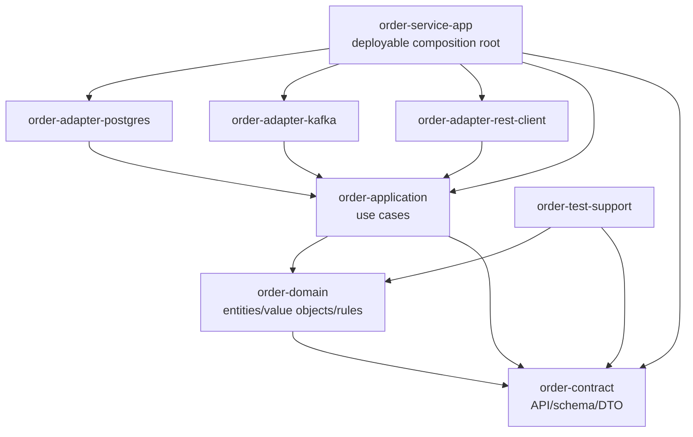
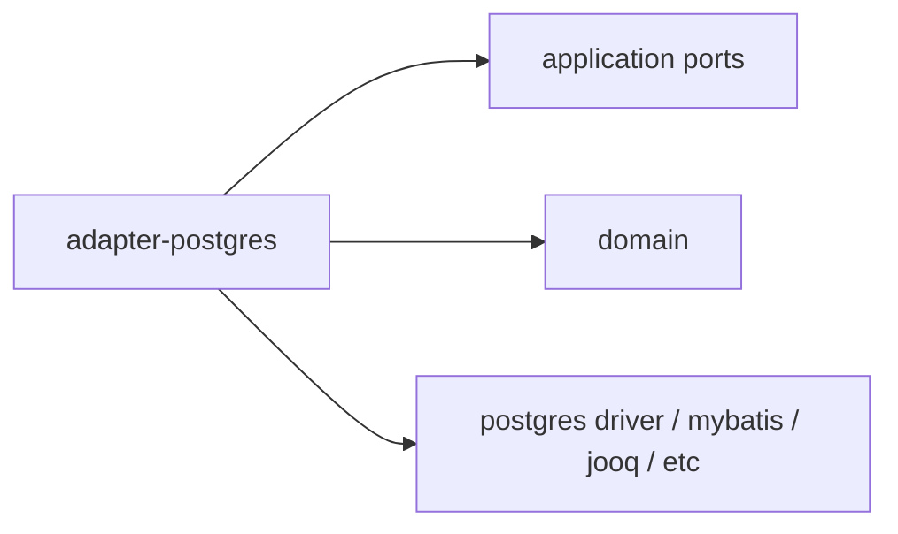
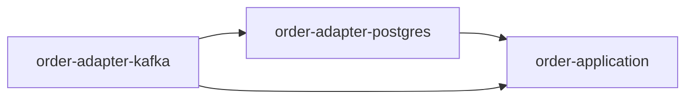
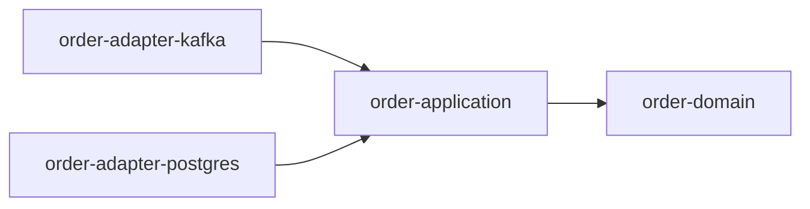
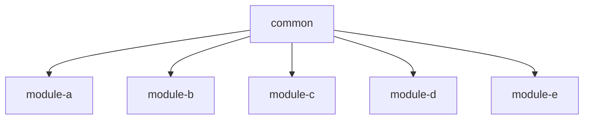
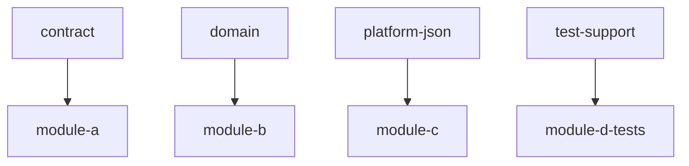
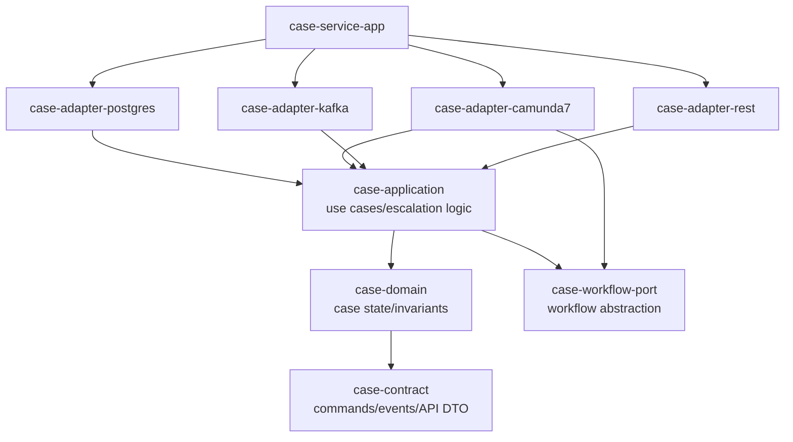

# Part 016 — Multi-Module Enterprise Architecture

> Target: setelah bagian ini, kamu bisa mendesain struktur Maven multi-module untuk sistem production-grade, bukan hanya meniru layout open-source kecil.

Part sebelumnya membahas reactor sebagai runtime build graph. Sekarang kita bahas pertanyaan yang lebih penting:

> “Module apa saja yang seharusnya ada, apa tanggung jawab masing-masing, dan bagaimana dependency antar-module dijaga agar sistem tetap bisa tumbuh?”

Di project kecil, Maven module sering dibuat karena folder sudah besar.

Di project enterprise, Maven module harus dibuat karena ada **boundary**:

- artifact boundary,
- dependency boundary,
- release boundary,
- ownership boundary,
- API contract boundary,
- runtime composition boundary,
- governance boundary.

Kalau boundary tidak jelas, multi-module hanya memindahkan kekacauan dari package Java ke POM XML.

---

## 1. Maven Architecture Bukan Application Architecture, Tapi Mereka Saling Mencerminkan

Maven tidak tahu domain model kamu. Maven tidak tahu clean architecture, hexagonal architecture, DDD, CQRS, BPMN, atau microservices boundary.

Maven hanya tahu:

```txt
POM -> artifact -> dependency -> plugin -> repository -> lifecycle
```

Tapi dependency graph Maven akan mencerminkan arah coupling sistem.

Jika dependency Maven kacau, biasanya architecture coupling juga kacau.



Maven module bukan pengganti desain. Maven module adalah alat untuk membuat desain itu **terlihat, dipaksa, dan bisa diverifikasi**.

---

## 2. Baseline Enterprise Module Types

Untuk sistem besar, biasanya ada beberapa jenis module.

| Module Type | Packaging Umum | Tanggung Jawab | Boleh dipublish? |
|---|---|---|---|
| Root aggregator | `pom` | mengumpulkan module untuk reactor | jarang sebagai dependency |
| Parent POM | `pom` | inheritance build policy | ya, sebagai parent internal |
| BOM | `pom` | version alignment via `dependencyManagement` | ya |
| Contract/API | `jar` atau `pom` | DTO, interface, schema, generated types | ya |
| Domain | `jar` | domain model/rules murni | ya/internal |
| Application | `jar` | use case orchestration | internal |
| Adapter | `jar` | implementation teknologi: DB, HTTP, Kafka, external API | internal |
| Deployable | `jar`, `war` | composition root/runtime artifact | ya, sebagai deployable |
| Test support | `jar`, test-jar | fixture, fake, test utility | internal/test only |
| Build tools/plugin | `maven-plugin`, `jar` | custom build logic | internal |

Tidak semua sistem butuh semua. Tapi sistem enterprise biasanya butuh minimal:

```txt
root aggregator
parent policy
BOM
contract/api
core/application
adapters
deployable
```

---

## 3. Reference Architecture: Single Service, Production-Grade

Contoh satu service besar:

```txt
order-service-platform/
  pom.xml                          # root aggregator, may also be parent
  order-service-bom/
    pom.xml                        # dependency version alignment
  order-contract/
    pom.xml                        # DTO, API model, schema-generated classes
  order-domain/
    pom.xml                        # domain model and invariants
  order-application/
    pom.xml                        # use cases / orchestration
  order-adapter-postgres/
    pom.xml                        # persistence implementation
  order-adapter-kafka/
    pom.xml                        # event publishing/subscription
  order-adapter-rest-client/
    pom.xml                        # outbound HTTP clients
  order-service-app/
    pom.xml                        # deployable application
  order-test-support/
    pom.xml                        # test fixtures/fakes
```

Dependency direction:



Ada variasi. Misalnya domain tidak selalu perlu depend ke contract; sering justru contract depend ke domain dilarang. Yang penting adalah dependency direction sadar dan konsisten.

---

## 4. Root Aggregator: Tipis, Membosankan, Stabil

Root aggregator tugas utamanya mengumpulkan module.

Contoh:

```xml
<project xmlns="http://maven.apache.org/POM/4.0.0"
         xmlns:xsi="http://www.w3.org/2001/XMLSchema-instance"
         xsi:schemaLocation="http://maven.apache.org/POM/4.0.0 https://maven.apache.org/xsd/maven-4.0.0.xsd">
  <modelVersion>4.0.0</modelVersion>

  <groupId>com.acme.order</groupId>
  <artifactId>order-service-platform</artifactId>
  <version>1.0.0-SNAPSHOT</version>
  <packaging>pom</packaging>

  <modules>
    <module>order-service-bom</module>
    <module>order-contract</module>
    <module>order-domain</module>
    <module>order-application</module>
    <module>order-adapter-postgres</module>
    <module>order-adapter-kafka</module>
    <module>order-service-app</module>
    <module>order-test-support</module>
  </modules>
</project>
```

Root aggregator sebaiknya tidak menjadi tempat random config. Ia boleh juga menjadi parent, tetapi jangan jadikan ia god object.

Root aggregator ideal:

- punya module list,
- punya identity project,
- punya shared build policy jika memang parent juga,
- tidak punya dependency runtime,
- tidak menjalankan plugin berat tanpa alasan,
- tidak menyimpan environment-specific profile yang membuat build tidak reproducible.

Dokumentasi Maven menyatakan aggregator project biasanya `pom` packaged dan mencantumkan modules sebagai path relatif; Maven akan mengurutkan module sehingga dependency dibangun sebelum dependent. Referensi: [Apache Maven — POM Reference: Aggregation](https://maven.apache.org/pom.html#aggregation-or-multi-module).

---

## 5. Parent POM: Build Policy, Bukan Dependency Dump

Parent POM adalah tempat policy.

Isi yang tepat:

```txt
properties:
  source encoding
  java release baseline
  plugin versions
  reproducible build timestamp policy

pluginManagement:
  compiler
  surefire
  failsafe
  jar
  source
  javadoc
  enforcer
  checkstyle/spotbugs/etc

dependencyManagement:
  boleh, tapi hati-hati jika parent juga dipakai lintas produk
```

Contoh parent policy:

```xml
<properties>
  <project.build.sourceEncoding>UTF-8</project.build.sourceEncoding>
  <maven.compiler.release>21</maven.compiler.release>
  <maven.compiler.parameters>true</maven.compiler.parameters>
</properties>

<build>
  <pluginManagement>
    <plugins>
      <plugin>
        <groupId>org.apache.maven.plugins</groupId>
        <artifactId>maven-compiler-plugin</artifactId>
        <version>${maven.compiler.plugin.version}</version>
        <configuration>
          <release>${maven.compiler.release}</release>
          <parameters>${maven.compiler.parameters}</parameters>
        </configuration>
      </plugin>
    </plugins>
  </pluginManagement>
</build>
```

Perhatikan `pluginManagement` tidak otomatis menjalankan plugin. Ia menyediakan default configuration/version ketika child module memakai plugin itu. Ini penting agar parent tidak memicu eksekusi tidak sengaja di semua module.

Anti-pattern parent:

```xml
<dependencies>
  <dependency>
    <groupId>org.postgresql</groupId>
    <artifactId>postgresql</artifactId>
  </dependency>
  <dependency>
    <groupId>org.apache.kafka</groupId>
    <artifactId>kafka-clients</artifactId>
  </dependency>
</dependencies>
```

Jika dependency diletakkan di parent `<dependencies>`, semua child mewarisi dependency itu. Ini sering menyebabkan classpath pollution.

Prefer:

```xml
<dependencyManagement>
  <dependencies>
    <dependency>
      <groupId>org.postgresql</groupId>
      <artifactId>postgresql</artifactId>
      <version>${postgresql.version}</version>
    </dependency>
  </dependencies>
</dependencyManagement>
```

Lalu module yang butuh PostgreSQL mendeklarasikan dependency sendiri tanpa version:

```xml
<dependencies>
  <dependency>
    <groupId>org.postgresql</groupId>
    <artifactId>postgresql</artifactId>
  </dependency>
</dependencies>
```

---

## 6. BOM Module: Platform Version Contract

BOM adalah POM yang mengekspor dependency version alignment lewat `dependencyManagement`.

Contoh:

```xml
<project xmlns="http://maven.apache.org/POM/4.0.0">
  <modelVersion>4.0.0</modelVersion>

  <groupId>com.acme.order</groupId>
  <artifactId>order-service-bom</artifactId>
  <version>1.0.0-SNAPSHOT</version>
  <packaging>pom</packaging>

  <dependencyManagement>
    <dependencies>
      <dependency>
        <groupId>com.fasterxml.jackson</groupId>
        <artifactId>jackson-bom</artifactId>
        <version>${jackson.version}</version>
        <type>pom</type>
        <scope>import</scope>
      </dependency>

      <dependency>
        <groupId>org.postgresql</groupId>
        <artifactId>postgresql</artifactId>
        <version>${postgresql.version}</version>
      </dependency>
    </dependencies>
  </dependencyManagement>
</project>
```

Consumer:

```xml
<dependencyManagement>
  <dependencies>
    <dependency>
      <groupId>com.acme.order</groupId>
      <artifactId>order-service-bom</artifactId>
      <version>1.0.0</version>
      <type>pom</type>
      <scope>import</scope>
    </dependency>
  </dependencies>
</dependencyManagement>
```

BOM bukan parent. BOM tidak memberi plugin configuration. BOM tidak membuat dependency otomatis masuk classpath. BOM hanya mengatur version ketika dependency dipakai.

Gunakan BOM untuk:

- menyamakan versi library lintas module,
- mengontrol patch security,
- expose dependency alignment ke repo/service lain,
- menghindari parent inheritance lintas domain yang terlalu kuat.

Jangan gunakan BOM untuk:

- menaruh plugin execution,
- menaruh repository credentials,
- menaruh source directory custom,
- memaksa dependency runtime ke semua module.

---

## 7. Contract/API Module

Contract/API module berisi hal yang boleh dikonsumsi lintas boundary.

Contoh isi:

```txt
order-contract/
  src/main/java/com/acme/order/contract/
    OrderId.java
    OrderStatus.java
    CreateOrderRequest.java
    OrderCreatedEvent.java
  src/main/resources/schema/
    order-created-event.schema.json
    order-api.yaml
```

Tanggung jawab:

- tipe request/response yang stabil,
- event contract,
- generated DTO dari OpenAPI/JSON Schema/Avro/Protobuf jika dipakai,
- interface public jika architecture memilih model API jar.

Yang sebaiknya tidak ada:

- repository implementation,
- framework runtime berat,
- business orchestration,
- database entity persistence,
- HTTP server bootstrap,
- Kafka producer concrete code.

Dependency contract module harus ringan.

Contoh POM:

```xml
<dependencies>
  <dependency>
    <groupId>jakarta.validation</groupId>
    <artifactId>jakarta.validation-api</artifactId>
    <scope>compile</scope>
  </dependency>
</dependencies>
```

Hati-hati dengan dependency seperti Jackson annotation, validation API, Swagger annotation, atau protobuf runtime. Mereka bisa wajar, tapi harus dipilih sadar karena contract module sering dikonsumsi luas.

Rule:

> Contract module harus mudah dikonsumsi, stabil, dan minim runtime assumptions.

---

## 8. Domain Module

Domain module berisi model inti dan aturan bisnis.

Contoh:

```txt
order-domain/
  src/main/java/com/acme/order/domain/
    Order.java
    OrderLine.java
    Money.java
    OrderPolicy.java
    CreditLimitExceeded.java
```

Tanggung jawab:

- entity/value object,
- invariant,
- domain service murni,
- domain exception,
- policy/rule yang tidak tergantung framework.

Dependency sehat:

```xml
<dependencies>
  <dependency>
    <groupId>com.acme.order</groupId>
    <artifactId>order-contract</artifactId>
  </dependency>
</dependencies>
```

Atau bahkan tidak depend ke contract jika domain ingin benar-benar internal dan contract mapping dilakukan di application/adapter.

Dependency yang mencurigakan:

```xml
<dependency>
  <groupId>org.postgresql</groupId>
  <artifactId>postgresql</artifactId>
</dependency>

<dependency>
  <groupId>org.glassfish.jersey.core</groupId>
  <artifactId>jersey-server</artifactId>
</dependency>
```

Jika domain butuh PostgreSQL driver atau HTTP server, boundary sudah bocor.

---

## 9. Application Module

Application module berisi use case orchestration.

Contoh:

```txt
order-application/
  src/main/java/com/acme/order/application/
    CreateOrderUseCase.java
    CancelOrderUseCase.java
    OrderRepository.java        # port/interface
    EventPublisher.java         # port/interface
    PaymentGateway.java         # port/interface
```

Tanggung jawab:

- orchestration use case,
- transaction boundary abstraction,
- ports/interfaces,
- input validation at use-case boundary,
- calling domain behavior.

Dependency sehat:

```xml
<dependencies>
  <dependency>
    <groupId>com.acme.order</groupId>
    <artifactId>order-domain</artifactId>
  </dependency>
  <dependency>
    <groupId>com.acme.order</groupId>
    <artifactId>order-contract</artifactId>
  </dependency>
</dependencies>
```

Dependency yang perlu dicurigai:

- concrete DB driver,
- HTTP server implementation,
- Kafka client jika port abstraction lebih tepat,
- test container library di compile scope.

Application module biasanya mendefinisikan port:

```java
public interface OrderRepository {
    Optional<Order> findById(OrderId id);
    void save(Order order);
}
```

Adapter module mengimplementasikan port.

---

## 10. Adapter Modules

Adapter module menghubungkan application core ke dunia luar.

Contoh:

```txt
order-adapter-postgres/
  PostgresOrderRepository.java
  OrderRecordMapper.java
  migrations/...

order-adapter-kafka/
  KafkaOrderEventPublisher.java
  OrderCreatedEventSerde.java

order-adapter-rest-client/
  CustomerClient.java
  CustomerClientConfig.java
```

Dependency direction:



Adapter bergantung pada application karena application mendefinisikan interface/port. Jangan balik.

Contoh POM adapter-postgres:

```xml
<dependencies>
  <dependency>
    <groupId>com.acme.order</groupId>
    <artifactId>order-application</artifactId>
  </dependency>

  <dependency>
    <groupId>org.postgresql</groupId>
    <artifactId>postgresql</artifactId>
    <scope>runtime</scope>
  </dependency>
</dependencies>
```

Jika mapper membutuhkan driver classes saat compile, scope bisa berbeda. Scope harus mengikuti penggunaan aktual, bukan template.

---

## 11. Deployable Module as Composition Root

Deployable module menyatukan semuanya menjadi artifact runtime.

Contoh:

```txt
order-service-app/
  src/main/java/com/acme/order/service/
    Main.java
    Bootstrap.java
    DependencyWiring.java
  src/main/resources/
    application.yaml
```

Dependency:

```xml
<dependencies>
  <dependency>
    <groupId>com.acme.order</groupId>
    <artifactId>order-application</artifactId>
  </dependency>
  <dependency>
    <groupId>com.acme.order</groupId>
    <artifactId>order-adapter-postgres</artifactId>
  </dependency>
  <dependency>
    <groupId>com.acme.order</groupId>
    <artifactId>order-adapter-kafka</artifactId>
  </dependency>
  <dependency>
    <groupId>com.acme.order</groupId>
    <artifactId>order-contract</artifactId>
  </dependency>
</dependencies>
```

Deployable module boleh tahu banyak hal karena ia composition root.

Tapi jangan taruh semua business logic di deployable module. Jika `order-service-app` menjadi module terbesar, biasanya architecture mulai membusuk.

Rule:

> Deployable module menyusun sistem. Ia tidak seharusnya menjadi sistem itu sendiri.

---

## 12. Test Support Module

Test support module menyediakan fixture, fake, stub, assertion helper, dan test utility lintas module.

Contoh:

```txt
order-test-support/
  src/main/java/com/acme/order/testsupport/
    OrderFixtures.java
    FakeEventPublisher.java
    InMemoryOrderRepository.java
    OrderAssertions.java
```

POM consumer:

```xml
<dependency>
  <groupId>com.acme.order</groupId>
  <artifactId>order-test-support</artifactId>
  <scope>test</scope>
</dependency>
```

Bahaya terbesar:

```xml
<dependency>
  <groupId>com.acme.order</groupId>
  <artifactId>order-test-support</artifactId>
</dependency>
```

Tanpa scope, default adalah compile. Itu membuat test utility bocor ke artifact produksi.

Rule:

> Test support dependency hampir selalu harus `test` scope.

Jika test support butuh dependency berat seperti Testcontainers, WireMock, embedded database, atau assertion library, pastikan dependency itu tidak masuk compile/runtime artifact production module.

---

## 13. Build Tools Module

Kadang enterprise repo butuh module build-tools:

```txt
build-tools/
  acme-maven-plugin/
  acme-build-rules/
```

Use case:

- custom Maven plugin,
- custom enforcer rules,
- code generation shared,
- architecture validation,
- internal license/security validation,
- schema compatibility checker.

Namun ini advanced. Jangan buat custom plugin terlalu cepat.

Urutan keputusan:

1. Bisakah pakai plugin resmi?
2. Bisakah pakai existing plugin populer?
3. Bisakah pakai script di CI tanpa mengikat Maven lifecycle?
4. Apakah logic benar-benar build-domain specific?
5. Apakah tim siap maintain plugin API dan compatibility?

Custom Maven plugin akan dibahas di part khusus.

---

## 14. Three Enterprise Layout Patterns

### Pattern A — Simple Parent + Aggregator

```txt
platform/
  pom.xml              # parent + aggregator
  bom/
  domain/
  application/
  service-app/
```

Cocok untuk:

- satu repo,
- satu produk,
- tim kecil/menengah,
- policy build tidak terlalu kompleks.

Kelebihan:

- sederhana,
- mudah dipahami,
- sedikit artifact POM.

Kekurangan:

- root POM mudah menjadi god object,
- parent policy dan aggregation tercampur,
- sulit reuse parent lintas repo tanpa membawa module assumptions.

### Pattern B — Separate Parent, BOM, Aggregator

```txt
platform/
  pom.xml              # aggregator only
  platform-parent/
    pom.xml            # parent policy
  platform-bom/
    pom.xml            # dependency versions
  domain/
  application/
  service-app/
```

Cocok untuk:

- enterprise repo besar,
- shared parent lintas repo,
- governance kuat,
- dependency alignment ingin diekspor.

Kelebihan:

- separation of concerns jelas,
- BOM bisa dikonsumsi tanpa parent inheritance,
- parent bisa fokus build policy.

Kekurangan:

- lebih verbose,
- perlu disiplin tinggi,
- developer baru perlu onboarding.

### Pattern C — Product Aggregator + Corporate Parent

```txt
corporate-parent                # external/internal artifact
  com.acme:acme-parent:pom

order-platform/
  pom.xml                       # product aggregator
  order-bom/
  order-domain/
  order-service-app/
```

Setiap module:

```xml
<parent>
  <groupId>com.acme.build</groupId>
  <artifactId>acme-parent</artifactId>
  <version>7.3.0</version>
  <relativePath />
</parent>
```

Cocok untuk:

- banyak repo,
- platform engineering team,
- organization-wide build policy.

Kelebihan:

- policy konsisten lintas repo,
- product repo tidak maintain semua plugin baseline,
- upgrade build policy bisa dikelola sebagai product.

Kekurangan:

- parent release bisa memecahkan banyak repo,
- butuh compatibility discipline,
- parent harus sangat hati-hati agar tidak terlalu opinionated.

---

## 15. Dependency Rules by Module Type

Gunakan matrix ini untuk review.

| From / To | Contract | Domain | Application | Adapter | Deployable | Test Support |
|---|---:|---:|---:|---:|---:|---:|
| Contract | - | avoid | no | no | no | no |
| Domain | maybe | - | no | no | no | no |
| Application | yes | yes | - | no | no | no |
| Adapter | yes | yes | yes | maybe | no | test only |
| Deployable | yes | maybe | yes | yes | - | test only |
| Test Support | yes | yes | yes | maybe | no | - |

Interpretasi:

- `application -> adapter` biasanya salah karena application harus bergantung ke port, bukan implementation.
- `domain -> adapter` hampir selalu salah.
- `contract -> domain` sering salah jika contract dimaksudkan public/stable.
- `deployable -> adapter` wajar karena deployable menyusun implementation.
- `test-support` jangan masuk production compile graph.

---

## 16. How to Enforce Module Architecture with Maven

Maven sendiri tidak punya semantic architecture checker built-in. Tapi kamu bisa enforcement via kombinasi:

1. dependency direction review,
2. Maven Enforcer rules,
3. banned dependencies,
4. duplicate class checks,
5. custom enforcer rule,
6. ArchUnit test,
7. CI dependency graph validation,
8. module-specific allowed dependency list.

Contoh Enforcer banned dependency akan dibahas di Part 023, tapi mental modelnya:

```xml
<plugin>
  <groupId>org.apache.maven.plugins</groupId>
  <artifactId>maven-enforcer-plugin</artifactId>
  <executions>
    <execution>
      <id>enforce-no-framework-in-domain</id>
      <goals>
        <goal>enforce</goal>
      </goals>
      <configuration>
        <rules>
          <bannedDependencies>
            <excludes>
              <exclude>org.postgresql:postgresql</exclude>
              <exclude>org.apache.kafka:kafka-clients</exclude>
            </excludes>
          </bannedDependencies>
        </rules>
      </configuration>
    </execution>
  </executions>
</plugin>
```

Untuk domain module, rule seperti ini masuk akal.

Tapi jangan terlalu cepat membuat aturan global. Aturan global yang salah akan dilawan developer dengan exclusions/profile/workaround.

---

## 17. Version Strategy in Multi-Module Architecture

Ada dua strategi umum.

### 17.1 Single Version Reactor

Semua module memakai version sama:

```xml
<version>1.8.0-SNAPSHOT</version>
```

Child mewarisi version dari parent.

Cocok untuk:

- satu deployable product,
- release bersama,
- module internal tidak dirilis independen.

Kelebihan:

- sederhana,
- release mudah,
- dependency antar-module bisa pakai `${project.version}`.

Kekurangan:

- semua module ikut version bump,
- tidak ideal untuk library platform yang benar-benar independen.

### 17.2 Independent Module Versions

Setiap module punya version sendiri.

Cocok untuk:

- library platform,
- shared components lintas produk,
- module dengan lifecycle rilis berbeda.

Kelebihan:

- precise compatibility,
- release lebih granular.

Kekurangan:

- version management berat,
- dependency alignment lebih sulit,
- reactor local development lebih kompleks.

Default enterprise application recommendation:

> Untuk satu product/service repo, gunakan single version reactor. Untuk platform libraries lintas produk, pertimbangkan independent version dengan BOM kuat.

---

## 18. Release Boundary: Semua Module Tidak Harus Dipublish ke Konsumen

Dalam Maven, semua module dengan packaging artifact bisa diinstall/deploy. Tapi secara product governance, tidak semua artifact harus dianggap public.

Klasifikasi artifact:

| Artifact | Audience | Stability Contract |
|---|---|---|
| `order-contract` | external/internal consumers | high |
| `order-service-bom` | internal services | high |
| `order-domain` | same repo/product | medium |
| `order-application` | same repo/product | medium |
| `order-adapter-postgres` | same repo/product | low/medium |
| `order-service-app` | deployment platform | runtime contract |
| `order-test-support` | tests/internal | low |

Repository manager bisa menyimpan semuanya, tapi dokumentasi internal harus membedakan:

- public supported artifact,
- internal implementation artifact,
- test-only artifact,
- deployable artifact.

Tanpa klasifikasi ini, tim lain bisa depend ke artifact internal, lalu refactoring menjadi sulit.

---

## 19. Naming Strategy

Nama module harus memberi sinyal boundary.

Bad:

```txt
common
utils
core
impl
new-service
misc
base
```

Better:

```txt
order-contract
order-domain
order-application
order-adapter-postgres
order-adapter-kafka
order-service-app
order-test-support
order-platform-bom
```

Rule:

```txt
<bounded-context>-<responsibility>
```

Atau untuk platform-wide module:

```txt
acme-platform-bom
acme-parent
acme-build-tools
```

Nama artifact Maven adalah komunikasi arsitektur. Jangan anggap remeh.

---

## 20. Example: Full Enterprise Root POM

```xml
<project xmlns="http://maven.apache.org/POM/4.0.0"
         xmlns:xsi="http://www.w3.org/2001/XMLSchema-instance"
         xsi:schemaLocation="http://maven.apache.org/POM/4.0.0 https://maven.apache.org/xsd/maven-4.0.0.xsd">
  <modelVersion>4.0.0</modelVersion>

  <groupId>com.acme.order</groupId>
  <artifactId>order-platform</artifactId>
  <version>1.0.0-SNAPSHOT</version>
  <packaging>pom</packaging>

  <properties>
    <project.build.sourceEncoding>UTF-8</project.build.sourceEncoding>
    <maven.compiler.release>21</maven.compiler.release>
  </properties>

  <modules>
    <module>order-platform-bom</module>
    <module>order-contract</module>
    <module>order-domain</module>
    <module>order-application</module>
    <module>order-adapter-postgres</module>
    <module>order-adapter-kafka</module>
    <module>order-service-app</module>
    <module>order-test-support</module>
  </modules>

  <dependencyManagement>
    <dependencies>
      <dependency>
        <groupId>com.acme.order</groupId>
        <artifactId>order-platform-bom</artifactId>
        <version>${project.version}</version>
        <type>pom</type>
        <scope>import</scope>
      </dependency>
    </dependencies>
  </dependencyManagement>

  <build>
    <pluginManagement>
      <plugins>
        <plugin>
          <groupId>org.apache.maven.plugins</groupId>
          <artifactId>maven-compiler-plugin</artifactId>
          <version>${maven.compiler.plugin.version}</version>
          <configuration>
            <release>${maven.compiler.release}</release>
          </configuration>
        </plugin>
      </plugins>
    </pluginManagement>
  </build>
</project>
```

Catatan:

- Ini contoh struktur, bukan template final.
- Versi plugin harus didefinisikan di properties atau parent corporate.
- BOM import ke parent/root bisa membantu child mendapatkan dependency version alignment.
- Hati-hati self-import BOM dalam reactor; pastikan struktur tidak menciptakan model resolution yang membingungkan. Alternatif: taruh dependencyManagement langsung di parent dan publish BOM terpisah untuk external consumers.

---

## 21. Example: Domain POM

```xml
<project xmlns="http://maven.apache.org/POM/4.0.0">
  <modelVersion>4.0.0</modelVersion>

  <parent>
    <groupId>com.acme.order</groupId>
    <artifactId>order-platform</artifactId>
    <version>1.0.0-SNAPSHOT</version>
  </parent>

  <artifactId>order-domain</artifactId>

  <dependencies>
    <dependency>
      <groupId>com.acme.order</groupId>
      <artifactId>order-contract</artifactId>
      <version>${project.version}</version>
    </dependency>
  </dependencies>
</project>
```

Jika semua module satu version dan dependencyManagement sudah mengelola internal module versions, version bisa dihilangkan dari dependency declaration.

---

## 22. Example: Application POM

```xml
<project xmlns="http://maven.apache.org/POM/4.0.0">
  <modelVersion>4.0.0</modelVersion>

  <parent>
    <groupId>com.acme.order</groupId>
    <artifactId>order-platform</artifactId>
    <version>1.0.0-SNAPSHOT</version>
  </parent>

  <artifactId>order-application</artifactId>

  <dependencies>
    <dependency>
      <groupId>com.acme.order</groupId>
      <artifactId>order-domain</artifactId>
    </dependency>
    <dependency>
      <groupId>com.acme.order</groupId>
      <artifactId>order-contract</artifactId>
    </dependency>
  </dependencies>
</project>
```

Application POM harus terlihat bersih. Jika terlalu banyak dependency framework di sini, tanyakan apakah adapter concern mulai masuk ke use case layer.

---

## 23. Example: Postgres Adapter POM

```xml
<project xmlns="http://maven.apache.org/POM/4.0.0">
  <modelVersion>4.0.0</modelVersion>

  <parent>
    <groupId>com.acme.order</groupId>
    <artifactId>order-platform</artifactId>
    <version>1.0.0-SNAPSHOT</version>
  </parent>

  <artifactId>order-adapter-postgres</artifactId>

  <dependencies>
    <dependency>
      <groupId>com.acme.order</groupId>
      <artifactId>order-application</artifactId>
    </dependency>

    <dependency>
      <groupId>org.postgresql</groupId>
      <artifactId>postgresql</artifactId>
      <scope>runtime</scope>
    </dependency>
  </dependencies>
</project>
```

Jika adapter memakai MyBatis mapper annotations atau generated classes, dependency compile lain mungkin diperlukan. Yang penting adalah dependency itu hanya muncul di module yang memang butuh.

---

## 24. Example: Service App POM

```xml
<project xmlns="http://maven.apache.org/POM/4.0.0">
  <modelVersion>4.0.0</modelVersion>

  <parent>
    <groupId>com.acme.order</groupId>
    <artifactId>order-platform</artifactId>
    <version>1.0.0-SNAPSHOT</version>
  </parent>

  <artifactId>order-service-app</artifactId>

  <dependencies>
    <dependency>
      <groupId>com.acme.order</groupId>
      <artifactId>order-application</artifactId>
    </dependency>
    <dependency>
      <groupId>com.acme.order</groupId>
      <artifactId>order-adapter-postgres</artifactId>
    </dependency>
    <dependency>
      <groupId>com.acme.order</groupId>
      <artifactId>order-adapter-kafka</artifactId>
    </dependency>
  </dependencies>
</project>
```

Jika membangun executable/fat/shaded JAR, packaging strategy dibahas di Part 024. Jangan campur dulu dengan module architecture.

---

## 25. Anti-Pattern: `common` Module

`common` biasanya dimulai polos:

```txt
common/
  StringUtils.java
  DateUtils.java
```

Lalu tumbuh menjadi:

```txt
common/
  JsonConfig.java
  KafkaConstants.java
  DatabaseUtils.java
  SecurityContext.java
  OrderFixtures.java
  HttpClientFactory.java
  Money.java
  ValidationUtils.java
```

Akibat:

- semua module bergantung ke `common`,
- `common` bergantung ke banyak library,
- dependency graph menjadi star-shaped,
- domain menarik infrastructure dependency,
- perubahan kecil common memicu full rebuild,
- ownership kabur.

Alternatif:

```txt
order-domain             # Money, domain value object
order-contract           # external DTO/common contract
platform-json            # JSON config if truly shared
platform-security-api    # security abstractions
order-test-support       # fixtures
```

Rule:

> Jika nama module menjelaskan “isinya campur-campur”, module itu sudah memberi sinyal masalah.

---

## 26. Anti-Pattern: Adapter-to-Adapter Coupling

Contoh buruk:



Masalah:

- Kafka adapter tahu detail Postgres adapter,
- sulit test isolated,
- runtime coupling tersembunyi,
- mengganti persistence merusak messaging.

Lebih sehat:



Jika Kafka handling perlu menyimpan data, ia memanggil use case/application port, bukan repository implementation langsung.

---

## 27. Anti-Pattern: Test Fixtures in Main Artifact

Buruk:

```txt
order-domain/src/main/java/com/acme/order/fixtures/OrderFixtures.java
```

Akibat:

- fixture masuk artifact produksi,
- API produksi tercemar test concern,
- dependency test bisa bocor ke compile scope.

Lebih baik:

```txt
order-test-support/src/main/java/com/acme/order/testsupport/OrderFixtures.java
```

Consumer:

```xml
<dependency>
  <groupId>com.acme.order</groupId>
  <artifactId>order-test-support</artifactId>
  <scope>test</scope>
</dependency>
```

---

## 28. Anti-Pattern: Parent Inheritance as Coupling Mechanism

Buruk:

```xml
<!-- parent pom -->
<dependencies>
  <dependency>
    <groupId>org.springframework</groupId>
    <artifactId>spring-context</artifactId>
  </dependency>
</dependencies>
```

Semua module mendapat Spring, termasuk domain, contract, test-support.

Lebih baik:

```xml
<!-- parent pom -->
<dependencyManagement>
  <dependencies>
    <dependency>
      <groupId>org.springframework</groupId>
      <artifactId>spring-context</artifactId>
      <version>${spring.version}</version>
    </dependency>
  </dependencies>
</dependencyManagement>
```

Lalu module yang butuh Spring mendeklarasikan dependency sendiri.

Inheritance untuk policy. Dependency untuk coupling. Jangan tukar.

---

## 29. CI Impact of Module Architecture

Module architecture menentukan CI cost.

Graph buruk:



Setiap perubahan common memicu semua downstream.

Graph lebih granular:



Perubahan lebih terisolasi.

Maven command seperti `-amd` menjadi lebih berguna jika module boundary baik. Kalau semua bergantung ke `common`, `-amd` hampir selalu full build.

---

## 30. When to Split a Module

Split module jika:

1. dependency set berbeda jauh,
2. ada artifact yang dikonsumsi pihak lain,
3. ada lifecycle test/build berbeda,
4. ada ownership berbeda,
5. ada release/stability contract berbeda,
6. module sekarang memaksa dependency teknis ke code yang tidak membutuhkannya,
7. compile/build time terlalu besar dan boundary natural jelas,
8. kamu perlu memutus dependency cycle.

Jangan split jika:

1. hanya karena file banyak,
2. boundary belum jelas,
3. semua module baru tetap saling depend dua arah,
4. semua module selalu dirilis dan berubah bersama tetapi tidak memberi isolation,
5. split membuat developer workflow jauh lebih kompleks tanpa benefit.

---

## 31. When to Merge Modules

Merge module jika:

1. module selalu berubah bersama,
2. module tidak pernah dipakai sendiri,
3. boundary hanya artifisial,
4. POM overhead lebih besar dari manfaat,
5. dependency direction selalu satu paket,
6. module membuat build lambat karena plugin overhead berulang,
7. tidak ada ownership/release/test boundary nyata.

Top 1% engineer tidak selalu menambah abstraction. Kadang keputusan terbaik adalah menghapus module.

---

## 32. Enterprise Governance Checklist

Untuk setiap repo multi-module, dokumentasikan:

```md
# Module Governance

## Public artifacts
- order-contract
- order-platform-bom

## Internal artifacts
- order-domain
- order-application
- order-adapter-postgres

## Deployable artifacts
- order-service-app

## Test-only artifacts
- order-test-support

## Forbidden dependency direction
- domain -> adapter
- application -> adapter
- contract -> domain
- main artifact -> test-support

## Standard local commands
- mvn -pl order-service-app -am verify
- mvn clean verify

## Release boundary
- single version reactor
```

Dokumentasi ini pendek, tapi menghindari banyak debat berulang.

---

## 33. Architecture Review Walkthrough

Saat melihat repo baru, lakukan ini:

### Step 1 — Baca module list

```bash
sed -n '/<modules>/,/<\/modules>/p' pom.xml
```

Tanya:

- Apakah nama module menunjukkan responsibility?
- Apakah ada `common`, `utils`, `misc`?
- Apakah ada deployable module jelas?

### Step 2 — Baca dependency graph

```bash
mvn dependency:tree
```

Untuk module tertentu:

```bash
mvn -pl order-application dependency:tree
```

Tanya:

- Apakah application depend ke adapter?
- Apakah domain menarik framework?
- Apakah test-support compile leakage?

### Step 3 — Baca effective POM

```bash
mvn -pl order-domain help:effective-pom
```

Tanya:

- Dependency apa yang diwarisi?
- Plugin apa yang berjalan?
- Profile apa aktif?

### Step 4 — Test clean reactor

```bash
mvn -Dmaven.repo.local=/tmp/clean-m2 clean verify
```

Tanya:

- Apakah build hanya sukses karena local artifact lama?
- Apakah parent/BOM resolution bersih?

### Step 5 — Impact build

```bash
mvn -pl order-domain -amd test
```

Tanya:

- Seberapa besar downstream impact?
- Apakah boundary terlalu sentral?

---

## 34. Practical Blueprint: Regulatory Case Management Service

Karena konteks sistem enterprise sering punya workflow/case lifecycle, berikut contoh module untuk regulatory case management service:

```txt
case-platform/
  pom.xml
  case-platform-bom/
  case-contract/
  case-domain/
  case-application/
  case-workflow-port/
  case-adapter-postgres/
  case-adapter-camunda7/
  case-adapter-kafka/
  case-adapter-rest/
  case-service-app/
  case-test-support/
```

Dependency direction:



Kenapa `case-workflow-port` dipisah?

Karena workflow engine adalah volatile infrastructure decision. Application perlu konsep workflow, tapi tidak harus tahu Camunda-specific API. Adapter Camunda mengimplementasikan port.

Ini contoh Maven module membantu regulatory defensibility:

- domain invariant tidak bercampur engine API,
- workflow adapter bisa diganti/diupgrade,
- contract event bisa diaudit,
- persistence adapter terisolasi,
- deployable module menjadi composition root.

---

## 35. Decision Records untuk Module Baru

Setiap module baru sebaiknya punya ADR pendek:

```md
# ADR: Introduce case-workflow-port module

## Context
Application layer currently depends directly on Camunda APIs.
This couples case lifecycle use cases to a specific workflow engine.

## Decision
Introduce `case-workflow-port` as a Maven module containing workflow abstractions used by `case-application`.
Move Camunda-specific implementation to `case-adapter-camunda7`.

## Consequences
- Application no longer depends on Camunda APIs.
- Camunda adapter depends on workflow port and application.
- Additional module increases build graph size.
- Contract between application and workflow engine becomes explicit.
```

Maven module adalah architecture decision. Treat it like one.

---

## 36. Red Flags in Enterprise Maven Architecture

Waspadai:

- `common` dipakai semua module,
- parent POM punya banyak runtime dependencies,
- domain module depend ke database/framework transport,
- application module depend ke adapter,
- test-support masuk compile scope,
- deployable module berisi sebagian besar business logic,
- BOM berisi plugin execution,
- root POM punya banyak environment profile,
- module dependency cycle diselesaikan dengan copy-paste class,
- CI selalu full build karena graph terlalu sentral,
- artifact internal dikonsumsi repo lain tanpa contract.

---

## 37. Green Flags

Tanda Maven architecture sehat:

- module names jelas,
- dependency direction mudah digambar,
- deployable module hanya composition root,
- domain/application module minim framework dependency,
- adapter module mengandung dependency teknologi,
- BOM dan parent punya peran berbeda,
- local command standar terdokumentasi,
- clean-room build berhasil,
- dependency tree bisa dijelaskan oleh engineer baru,
- artifact public/internal/test-only diklasifikasikan.

---

## 38. Kesimpulan

Multi-module enterprise architecture bukan tentang membuat banyak folder. Ia tentang membuat coupling terlihat dan terkendali.

Maven memberi primitive:

```txt
parent
aggregator
module
dependency
dependencyManagement
pluginManagement
reactor
repository
```

Tugas engineer adalah mengubah primitive itu menjadi architecture boundary:

```txt
policy boundary
version boundary
contract boundary
domain boundary
application boundary
infrastructure boundary
runtime boundary
test boundary
release boundary
```

Jika boundary jelas, Maven menjadi alat governance. Jika boundary kabur, Maven menjadi amplifier kekacauan.

Part berikutnya akan membahas lebih tajam: **Parent POM Design Patterns** — kapan parent digabung dengan aggregator, kapan dipisah, bagaimana mendesain corporate parent, product parent, service parent, dan bagaimana menghindari inheritance trap.

---

## Referensi

- [Apache Maven — POM Reference](https://maven.apache.org/pom.html)
- [Apache Maven — Introduction to the POM](https://maven.apache.org/guides/introduction/introduction-to-the-pom.html)
- [Apache Maven — Guide to Working with Multiple Modules](https://maven.apache.org/guides/mini/guide-multiple-modules.html)
- [Apache Maven — Introduction to the Dependency Mechanism](https://maven.apache.org/guides/introduction/introduction-to-dependency-mechanism.html)
