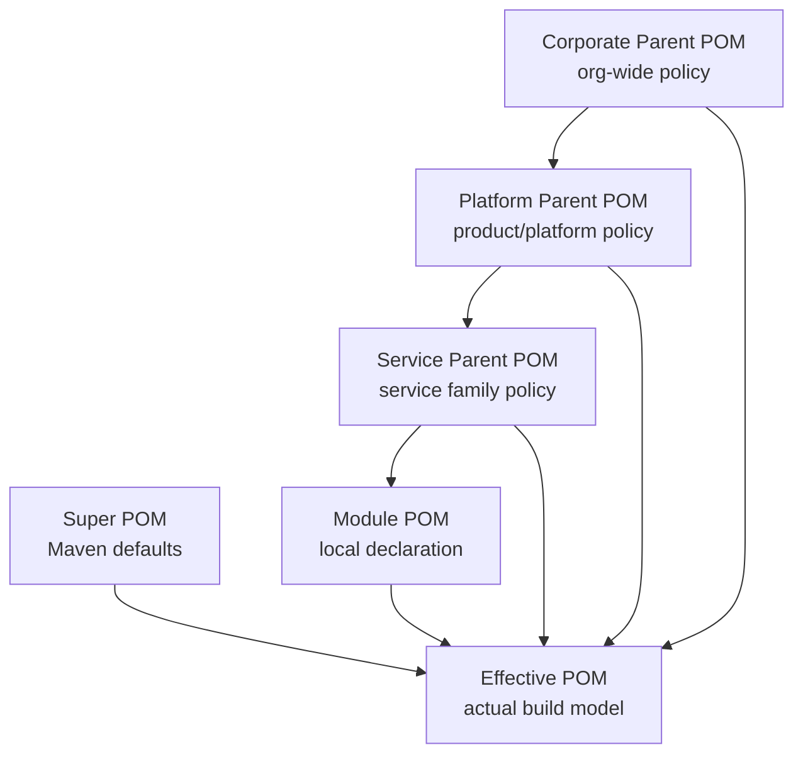
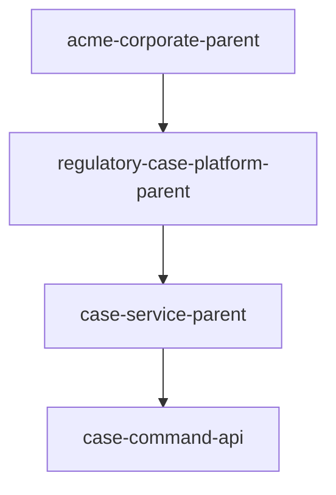
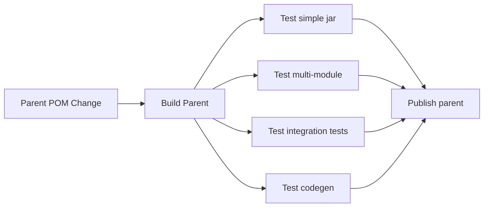
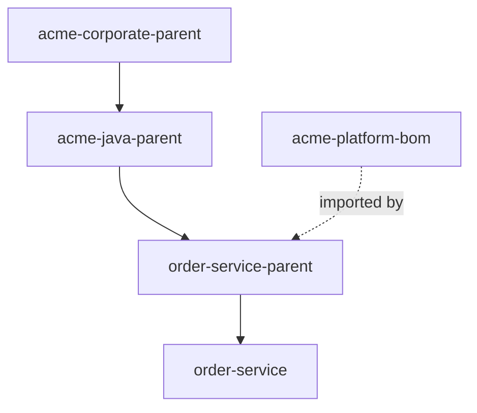

# Part 017 — Parent POM Design Patterns

> Target: setelah bagian ini, kamu bisa mendesain parent POM sebagai **build policy boundary**, bukan sebagai tempat membuang semua konfigurasi Maven.

Di project kecil, parent POM sering dipakai sebagai file `pom.xml` utama yang kebetulan punya `<modules>`.

Di project besar, parent POM adalah salah satu artifact paling berbahaya sekaligus paling berguna dalam ekosistem build.

Berguna karena parent POM bisa menyeragamkan:

- versi plugin,
- konfigurasi compiler,
- test behavior,
- dependency management,
- quality gates,
- repository policy,
- release metadata,
- organization-wide defaults.

Berbahaya karena parent POM bisa menciptakan:

- hidden behavior,
- dependency leakage,
- build coupling antar-team,
- breaking change massal,
- configuration inheritance yang sulit dilacak,
- build yang “berhasil karena kebetulan”.

Apache Maven sendiri mendefinisikan POM sebagai tempat deklarasi informasi project dan konfigurasi plugin build. Referensi: [Apache Maven — POM Reference](https://maven.apache.org/pom.html). Dokumentasi Maven juga menyarankan plugin version didefinisikan eksplisit, biasanya melalui `<build><pluginManagement>...</pluginManagement></build>` di parent POM, untuk menjaga build reproducibility. Referensi: [Apache Maven — Guide to Configuring Plug-ins](https://maven.apache.org/guides/mini/guide-configuring-plugins.html).

Bagian ini membahas parent POM sebagai desain arsitektur, bukan sekadar XML.

---

## 1. Mental Model: Parent POM Adalah Policy Inheritance

Parent POM bukan dependency.

Parent POM bukan module.

Parent POM bukan repository.

Parent POM adalah **model inheritance** untuk Maven project.

```txt
child POM + parent chain + Super POM + active profiles = effective POM
```

Semua yang dieksekusi Maven bukan POM mentah yang kamu lihat, melainkan **effective POM** setelah inheritance, interpolation, profile activation, dan default model Maven diterapkan.



Yang penting:

```txt
parent POM controls inherited build model
BOM controls dependency version alignment
aggregator controls reactor collection
```

Kalau tiga peran ini dicampur tanpa sadar, build akan terlihat sederhana di awal dan menjadi sulit dikendalikan saat organisasi tumbuh.

---

## 2. Tiga Peran yang Sering Tercampur

Maven punya tiga konsep yang sering disatukan dalam satu file, padahal tanggung jawabnya berbeda.

| Peran | Mekanisme | Elemen Kunci | Fungsi |
|---|---|---|---|
| Parent | inheritance | `<parent>` | mewariskan model build |
| Aggregator | reactor collection | `<modules>` | mengumpulkan module untuk build bersama |
| BOM | version alignment | `<dependencyManagement>` + `scope=import` | menyamakan versi dependency |

Satu POM boleh memegang lebih dari satu peran, tapi desain enterprise harus tahu konsekuensinya.

Contoh root POM yang memegang parent + aggregator:

```xml
<project>
  <modelVersion>4.0.0</modelVersion>

  <groupId>com.acme.order</groupId>
  <artifactId>order-root</artifactId>
  <version>1.12.0-SNAPSHOT</version>
  <packaging>pom</packaging>

  <modules>
    <module>order-api</module>
    <module>order-domain</module>
    <module>order-service</module>
  </modules>

  <dependencyManagement>...</dependencyManagement>
  <build>
    <pluginManagement>...</pluginManagement>
  </build>
</project>
```

Ini acceptable untuk project kecil sampai menengah.

Untuk enterprise yang punya banyak repository, banyak product line, dan release cadence berbeda, root aggregator sering lebih baik dipisahkan dari parent policy.

---

## 3. Pattern 1 — Single Repository Root Parent

Ini pattern paling umum.

```txt
order-platform/
  pom.xml                  <- parent + aggregator
  order-api/pom.xml
  order-domain/pom.xml
  order-application/pom.xml
  order-adapter-postgres/pom.xml
  order-service/pom.xml
```

Root `pom.xml`:

```xml
<project>
  <modelVersion>4.0.0</modelVersion>

  <groupId>com.acme.order</groupId>
  <artifactId>order-parent</artifactId>
  <version>1.0.0-SNAPSHOT</version>
  <packaging>pom</packaging>

  <modules>
    <module>order-api</module>
    <module>order-domain</module>
    <module>order-application</module>
    <module>order-adapter-postgres</module>
    <module>order-service</module>
  </modules>

  <properties>
    <java.version>21</java.version>
    <project.build.sourceEncoding>UTF-8</project.build.sourceEncoding>
  </properties>

  <dependencyManagement>
    <dependencies>
      <!-- version alignment only -->
    </dependencies>
  </dependencyManagement>

  <build>
    <pluginManagement>
      <plugins>
        <!-- plugin versions and common config -->
      </plugins>
    </pluginManagement>
  </build>
</project>
```

Child:

```xml
<project>
  <modelVersion>4.0.0</modelVersion>

  <parent>
    <groupId>com.acme.order</groupId>
    <artifactId>order-parent</artifactId>
    <version>1.0.0-SNAPSHOT</version>
  </parent>

  <artifactId>order-domain</artifactId>
</project>
```

### Kapan Pattern Ini Cocok

Gunakan kalau:

- semua module dirilis bersama,
- semua module berada dalam satu repository,
- ownership relatif sama,
- module count masih bisa dipahami,
- parent policy memang spesifik untuk repository itu,
- CI pipeline membangun semua module sebagai satu unit.

### Kapan Mulai Bermasalah

Pattern ini mulai buruk kalau:

- parent berubah terlalu sering dan mempengaruhi semua module,
- ada module yang seharusnya punya release cadence berbeda,
- root POM terlalu penuh dengan policy organisasi,
- dependency management bercampur antara internal product dan external platform,
- `<dependencies>` di parent mulai berisi dependency runtime.

Rule sederhana:

```txt
root parent boleh nyaman
corporate parent harus stabil
platform parent harus eksplisit
module POM harus jujur
```

---

## 4. Pattern 2 — Separate Aggregator and Parent

Di pattern ini, root aggregator hanya mengumpulkan module. Parent POM menjadi module/artifact terpisah.

```txt
order-platform/
  pom.xml                         <- aggregator only
  order-build-parent/pom.xml       <- parent policy
  order-bom/pom.xml                <- dependency version alignment
  order-api/pom.xml
  order-domain/pom.xml
  order-service/pom.xml
```

Root aggregator:

```xml
<project>
  <modelVersion>4.0.0</modelVersion>

  <groupId>com.acme.order</groupId>
  <artifactId>order-aggregator</artifactId>
  <version>1.0.0-SNAPSHOT</version>
  <packaging>pom</packaging>

  <modules>
    <module>order-build-parent</module>
    <module>order-bom</module>
    <module>order-api</module>
    <module>order-domain</module>
    <module>order-service</module>
  </modules>
</project>
```

Parent module:

```xml
<project>
  <modelVersion>4.0.0</modelVersion>

  <groupId>com.acme.order</groupId>
  <artifactId>order-build-parent</artifactId>
  <version>1.0.0-SNAPSHOT</version>
  <packaging>pom</packaging>

  <properties>
    <java.version>21</java.version>
    <maven.compiler.release>${java.version}</maven.compiler.release>
  </properties>

  <build>
    <pluginManagement>
      <plugins>
        <plugin>
          <groupId>org.apache.maven.plugins</groupId>
          <artifactId>maven-compiler-plugin</artifactId>
          <version>3.14.1</version>
          <configuration>
            <release>${maven.compiler.release}</release>
          </configuration>
        </plugin>
      </plugins>
    </pluginManagement>
  </build>
</project>
```

Child module:

```xml
<project>
  <modelVersion>4.0.0</modelVersion>

  <parent>
    <groupId>com.acme.order</groupId>
    <artifactId>order-build-parent</artifactId>
    <version>1.0.0-SNAPSHOT</version>
    <relativePath>../order-build-parent/pom.xml</relativePath>
  </parent>

  <artifactId>order-service</artifactId>
</project>
```

### Kenapa Dipisah?

Karena aggregator dan parent punya axis perubahan berbeda.

Aggregator berubah saat:

- module ditambah,
- module dipindah,
- module dihapus,
- build slicing berubah.

Parent berubah saat:

- plugin policy berubah,
- compiler rule berubah,
- quality gate berubah,
- test behavior berubah,
- release policy berubah.

Kalau disatukan, perubahan module bisa terlihat seperti perubahan policy. Perubahan policy bisa terlihat seperti perubahan struktur project.

Pada organisasi besar, separation of concerns ini mengurangi blast radius.

---

## 5. Pattern 3 — Corporate Parent POM

Corporate parent adalah parent POM lintas-repository/lintas-product.

Contoh coordinate:

```txt
com.acme.build:acme-corporate-parent:2026.07.0
```

Tujuannya bukan mengatur semua detail project. Tujuannya membuat baseline organisasi.

Corporate parent sebaiknya mengatur:

- minimum Maven version,
- minimum/allowed JDK version,
- default encoding,
- central plugin versions,
- license policy,
- repository mirror expectation,
- release metadata baseline,
- organization/scm metadata defaults,
- enforcer rules yang sangat stabil.

Corporate parent tidak sebaiknya mengatur:

- dependency aplikasi spesifik,
- framework product spesifik,
- module structure,
- service-specific plugin execution,
- environment-specific behavior,
- release version semua product.

Contoh:

```xml
<project>
  <modelVersion>4.0.0</modelVersion>

  <groupId>com.acme.build</groupId>
  <artifactId>acme-corporate-parent</artifactId>
  <version>2026.07.0</version>
  <packaging>pom</packaging>

  <properties>
    <project.build.sourceEncoding>UTF-8</project.build.sourceEncoding>
    <project.reporting.outputEncoding>UTF-8</project.reporting.outputEncoding>
    <java.baseline.version>21</java.baseline.version>
  </properties>

  <build>
    <pluginManagement>
      <plugins>
        <plugin>
          <groupId>org.apache.maven.plugins</groupId>
          <artifactId>maven-enforcer-plugin</artifactId>
          <version>3.6.1</version>
        </plugin>
        <plugin>
          <groupId>org.apache.maven.plugins</groupId>
          <artifactId>maven-compiler-plugin</artifactId>
          <version>3.14.1</version>
        </plugin>
        <plugin>
          <groupId>org.apache.maven.plugins</groupId>
          <artifactId>maven-surefire-plugin</artifactId>
          <version>3.5.3</version>
        </plugin>
      </plugins>
    </pluginManagement>
  </build>
</project>
```

### Corporate Parent Harus Membosankan

Corporate parent yang baik terasa membosankan.

Ia jarang berubah, jelas, stabil, dan tidak mengejutkan.

Corporate parent yang terlalu pintar akan menjadi pusat insiden build.

Anti-pattern:

```txt
corporate parent knows every framework, every database, every product, every service, every runtime
```

Itu bukan parent. Itu monolith build policy.

---

## 6. Pattern 4 — Platform Parent POM

Platform parent lebih spesifik dari corporate parent.

Contoh:

```txt
com.acme.platform:regulatory-case-platform-parent:5.4.0
```

Ia bisa mengatur hal yang memang berlaku untuk satu platform/product line:

- Java version platform,
- shared test conventions,
- code generation conventions,
- plugin execution untuk generated sources,
- framework-specific packaging,
- internal BOM import,
- quality gates platform,
- integration test conventions.

Struktur inheritance:



Platform parent boleh lebih opinionated daripada corporate parent, tapi tetap harus membedakan:

```txt
policy that all platform modules must follow
vs
configuration only some modules need
```

Untuk yang hanya sebagian module butuh, gunakan `pluginManagement`, bukan inherited plugin execution global.

---

## 7. Pattern 5 — Service Family Parent

Service family parent adalah parent untuk satu service atau satu bounded context.

Contoh:

```txt
com.acme.case:case-service-parent:1.21.0-SNAPSHOT
```

Biasanya berada di repository yang sama dengan module service.

Cocok untuk:

- common module metadata,
- module version unification,
- service-specific plugin management,
- service-specific generated source paths,
- service-specific integration test behavior,
- Docker/container build plugin convention kalau memang semua module deployable sama.

Contoh:

```xml
<project>
  <modelVersion>4.0.0</modelVersion>

  <parent>
    <groupId>com.acme.platform</groupId>
    <artifactId>regulatory-case-platform-parent</artifactId>
    <version>5.4.0</version>
  </parent>

  <groupId>com.acme.case</groupId>
  <artifactId>case-service-parent</artifactId>
  <version>1.21.0-SNAPSHOT</version>
  <packaging>pom</packaging>

  <dependencyManagement>
    <dependencies>
      <dependency>
        <groupId>com.acme.platform</groupId>
        <artifactId>regulatory-case-platform-bom</artifactId>
        <version>5.4.0</version>
        <type>pom</type>
        <scope>import</scope>
      </dependency>
    </dependencies>
  </dependencyManagement>
</project>
```

Yang perlu dijaga:

- jangan memasukkan semua dependencies ke parent,
- jangan membuat semua module otomatis punya dependency framework runtime,
- jangan mencampur parent policy dengan module dependency graph,
- jangan membuat parent menjadi tempat shortcut.

---

## 8. Parent POM vs BOM: Jangan Pakai Parent untuk Semua Hal

Banyak tim memakai parent POM untuk menyamakan dependency version lintas-repository.

Itu bisa, tapi sering bukan desain terbaik.

Dependency version alignment lebih cocok dimodelkan sebagai BOM.

| Kebutuhan | Gunakan Parent? | Gunakan BOM? |
|---|---:|---:|
| Menyamakan compiler plugin | Ya | Tidak |
| Menyamakan surefire plugin | Ya | Tidak |
| Menyamakan dependency version | Bisa | Lebih baik |
| Dipakai oleh project yang sudah punya parent lain | Tidak | Ya |
| Multiple import/version layer | Terbatas | Ya |
| Build policy inheritance | Ya | Tidak |
| Runtime library alignment | Tidak ideal | Ya |

BOM memberi fleksibilitas karena Maven hanya mendukung satu direct parent, tetapi bisa meng-import beberapa BOM di `dependencyManagement`.

```xml
<dependencyManagement>
  <dependencies>
    <dependency>
      <groupId>com.acme.platform</groupId>
      <artifactId>acme-java-platform-bom</artifactId>
      <version>2026.07.0</version>
      <type>pom</type>
      <scope>import</scope>
    </dependency>
  </dependencies>
</dependencyManagement>
```

Rule:

```txt
parent = how to build
BOM = what versions to use
module dependency = what this module actually needs
```

---

## 9. `pluginManagement` vs `plugins`: Ini Harus Dikuasai

Kesalahan paling umum dalam parent POM adalah tidak membedakan `pluginManagement` dan `plugins`.

### `pluginManagement`

`pluginManagement` mendefinisikan versi dan konfigurasi default plugin.

Ia tidak otomatis membuat semua plugin execution berjalan di semua module.

```xml
<build>
  <pluginManagement>
    <plugins>
      <plugin>
        <groupId>org.apache.maven.plugins</groupId>
        <artifactId>maven-compiler-plugin</artifactId>
        <version>3.14.1</version>
        <configuration>
          <release>21</release>
        </configuration>
      </plugin>
    </plugins>
  </pluginManagement>
</build>
```

Child bisa memakai config ini dengan deklarasi plugin:

```xml
<build>
  <plugins>
    <plugin>
      <groupId>org.apache.maven.plugins</groupId>
      <artifactId>maven-compiler-plugin</artifactId>
    </plugin>
  </plugins>
</build>
```

Untuk plugin yang terikat default oleh lifecycle, `pluginManagement` juga bisa mempengaruhi versi/config plugin tersebut ketika lifecycle memanggilnya.

### `plugins`

`plugins` di parent dapat mewariskan plugin declaration/execution ke child.

```xml
<build>
  <plugins>
    <plugin>
      <groupId>org.apache.maven.plugins</groupId>
      <artifactId>maven-enforcer-plugin</artifactId>
      <executions>
        <execution>
          <id>enforce-build-baseline</id>
          <goals>
            <goal>enforce</goal>
          </goals>
        </execution>
      </executions>
    </plugin>
  </plugins>
</build>
```

Ini berguna untuk rule yang memang harus jalan di semua module.

Tapi berbahaya jika dipakai untuk plugin yang tidak berlaku untuk semua module.

Contoh buruk:

```xml
<build>
  <plugins>
    <plugin>
      <groupId>org.openapitools</groupId>
      <artifactId>openapi-generator-maven-plugin</artifactId>
      <executions>...</executions>
    </plugin>
  </plugins>
</build>
```

Kalau semua module mewarisi ini, module domain murni pun bisa mencoba generate REST API.

Lebih baik:

```xml
<build>
  <pluginManagement>
    <plugins>
      <plugin>
        <groupId>org.openapitools</groupId>
        <artifactId>openapi-generator-maven-plugin</artifactId>
        <version>${openapi.generator.version}</version>
      </plugin>
    </plugins>
  </pluginManagement>
</build>
```

Lalu module yang butuh codegen mendeklarasikan plugin execution sendiri.

---

## 10. `dependencyManagement` vs `dependencies`: Sama Berbahayanya

`dependencyManagement` mengatur versi default dependency.

`dependencies` menambahkan dependency nyata ke project.

Di parent POM:

```xml
<dependencyManagement>
  <dependencies>
    <dependency>
      <groupId>org.junit.jupiter</groupId>
      <artifactId>junit-jupiter</artifactId>
      <version>5.13.2</version>
      <scope>test</scope>
    </dependency>
  </dependencies>
</dependencyManagement>
```

Ini artinya:

```txt
Jika child memakai junit-jupiter, gunakan versi ini.
```

Bukan:

```txt
Semua child otomatis memakai junit-jupiter.
```

Sebaliknya:

```xml
<dependencies>
  <dependency>
    <groupId>org.junit.jupiter</groupId>
    <artifactId>junit-jupiter</artifactId>
    <version>5.13.2</version>
    <scope>test</scope>
  </dependency>
</dependencies>
```

Di parent, ini bisa membuat semua child mewarisi dependency tersebut.

Kadang boleh untuk dependency test standar. Tapi tetap perlu hati-hati.

Rule senior:

```txt
Parent dependencies are inherited behavior.
Dependency management is inherited policy.
Prefer inherited policy over inherited dependencies.
```

---

## 11. Pattern: Thin Parent, Explicit Module

Desain paling sehat biasanya:

```txt
parent POM = central defaults
module POM = explicit needs
```

Parent:

```xml
<dependencyManagement>
  <dependencies>
    <dependency>
      <groupId>org.postgresql</groupId>
      <artifactId>postgresql</artifactId>
      <version>42.7.7</version>
    </dependency>
  </dependencies>
</dependencyManagement>
```

Module adapter PostgreSQL:

```xml
<dependencies>
  <dependency>
    <groupId>org.postgresql</groupId>
    <artifactId>postgresql</artifactId>
  </dependency>
</dependencies>
```

Module domain:

```xml
<dependencies>
  <!-- no PostgreSQL dependency -->
</dependencies>
```

Hasilnya:

- version alignment tetap pusat,
- dependency graph tetap jujur,
- module boundary bisa dibaca,
- domain tidak bocor ke infrastructure,
- review dependency lebih mudah.

---

## 12. Parent POM Layering

Untuk enterprise, parent chain biasanya lebih dari satu level.

```txt
acme-corporate-parent
  -> acme-java-parent
    -> regulatory-platform-parent
      -> case-service-parent
        -> case-domain
```

Jangan membuat chain terlalu panjang.

Setiap layer harus menjawab pertanyaan:

> “Policy apa yang stabil di level ini dan tidak pantas dideklarasikan lebih bawah?”

Contoh pemisahan:

| Layer | Isi yang Masuk Akal |
|---|---|
| Corporate parent | Maven baseline, encoding, organization metadata, very stable plugin versions |
| Java parent | compiler, surefire/failsafe, javadoc, source/jar convention |
| Platform parent | framework plugin, codegen convention, platform test convention |
| Service parent | service-specific generated paths, service release metadata |
| Module POM | actual dependencies and module-specific plugin execution |

Yang tidak boleh terjadi:

```txt
lower layer cannot explain why a setting exists
```

Kalau engineer module tidak tahu kenapa plugin jalan, parent chain terlalu gelap.

---

## 13. Decision Matrix: Parent Harus Di Mana?

Gunakan matrix ini saat menaruh konfigurasi.

| Konfigurasi | Corporate Parent | Platform Parent | Service Parent | Module POM |
|---|---:|---:|---:|---:|
| `project.build.sourceEncoding` | Ya | Tidak perlu | Tidak perlu | Tidak |
| Maven minimum version | Ya | Kadang | Tidak | Tidak |
| Java baseline global | Ya/Kadang | Ya | Kadang | Tidak |
| Compiler plugin version | Ya | Kadang | Tidak | Tidak |
| Compiler release value | Kadang | Ya | Kadang | Jarang |
| Surefire plugin version | Ya | Kadang | Tidak | Tidak |
| Surefire include pattern khusus | Tidak | Kadang | Ya | Kadang |
| OpenAPI codegen execution | Tidak | Tidak sebagai execution global | Kadang | Ya |
| Dependency versions | BOM lebih baik | BOM lebih baik | Kadang | Jarang |
| Actual runtime dependencies | Tidak | Tidak | Jarang | Ya |
| Repository credentials | Tidak | Tidak | Tidak | Tidak |
| Distribution management | Kadang | Kadang | Ya | Tidak |
| Environment URL | Tidak | Tidak | Tidak | Tidak |

---

## 14. Parent Versioning Strategy

Parent POM adalah artifact. Ia harus versioned.

Ada tiga strategi umum.

### Strategy A — Same Version as Product

```txt
case-service-parent:1.21.0-SNAPSHOT
case-domain:1.21.0-SNAPSHOT
case-service:1.21.0-SNAPSHOT
```

Cocok untuk mono-repo/service repo yang semua module dirilis bersama.

Kelebihan:

- sederhana,
- mudah dipahami,
- release konsisten.

Kekurangan:

- parent policy ikut berubah setiap product release,
- sulit dipakai lintas-repository.

### Strategy B — Calendar Version for Corporate/Platform Parent

```txt
acme-corporate-parent:2026.07.0
acme-java-parent:2026.07.0
```

Cocok untuk build policy organization-level.

Kelebihan:

- jelas kapan policy dirilis,
- cocok untuk governance waves,
- mudah untuk audit.

Kekurangan:

- perlu changelog disiplin,
- perlu migration guide.

### Strategy C — Semantic Versioning

```txt
acme-build-parent:3.4.1
```

Cocok kalau parent dianggap API.

Breaking change misalnya:

- menaikkan Java baseline,
- mengubah test include/exclude secara incompatible,
- mengaktifkan enforcer strict rule,
- mengubah release plugin behavior,
- menghapus property lama.

Minor change misalnya:

- menambahkan pluginManagement baru,
- menambahkan optional quality plugin config,
- memperbaiki metadata.

Patch change misalnya:

- patch plugin version non-breaking,
- fix typo metadata,
- fix configuration bug kecil.

Rule:

```txt
If changing parent can break child builds without child POM changes, treat it as a breaking change.
```

---

## 15. `relativePath`: Local Convenience vs Published Parent

Child POM punya parent declaration:

```xml
<parent>
  <groupId>com.acme.build</groupId>
  <artifactId>acme-corporate-parent</artifactId>
  <version>2026.07.0</version>
</parent>
```

Secara default, Maven mencari parent relatif di `../pom.xml` sebelum repository resolution.

Kalau parent ada di path berbeda:

```xml
<parent>
  <groupId>com.acme.order</groupId>
  <artifactId>order-build-parent</artifactId>
  <version>1.0.0-SNAPSHOT</version>
  <relativePath>../order-build-parent/pom.xml</relativePath>
</parent>
```

Kalau parent harus selalu di-resolve dari repository, gunakan:

```xml
<relativePath />
```

Ini penting untuk corporate parent lintas-repository.

### Failure Mode

Engineer mengubah parent lokal di `../pom.xml`, build lokal sukses, CI gagal karena CI resolve parent dari repository.

Atau sebaliknya:

CI memakai parent published, local memakai parent relatif yang stale.

Playbook:

```bash
mvn help:effective-pom
mvn -X validate
```

Lihat parent mana yang benar-benar dipakai.

---

## 16. Inherited Plugin Execution: Pisau Bermata Dua

Parent bisa mendefinisikan plugin execution yang diwariskan.

Contoh baik:

```xml
<build>
  <plugins>
    <plugin>
      <groupId>org.apache.maven.plugins</groupId>
      <artifactId>maven-enforcer-plugin</artifactId>
      <executions>
        <execution>
          <id>enforce-java-and-maven</id>
          <phase>validate</phase>
          <goals>
            <goal>enforce</goal>
          </goals>
          <configuration>
            <rules>
              <requireMavenVersion>
                <version>[3.9.0,)</version>
              </requireMavenVersion>
              <requireJavaVersion>
                <version>[21,)</version>
              </requireJavaVersion>
            </rules>
          </configuration>
        </execution>
      </executions>
    </plugin>
  </plugins>
</build>
```

Ini masuk akal karena semua module harus tunduk pada baseline.

Contoh berisiko:

```xml
<plugin>
  <groupId>org.apache.maven.plugins</groupId>
  <artifactId>maven-shade-plugin</artifactId>
  <executions>
    <execution>
      <phase>package</phase>
      <goals>
        <goal>shade</goal>
      </goals>
    </execution>
  </executions>
</plugin>
```

Kalau diwariskan ke module API, domain, test-support, dan deployable module, artifact bisa berubah tanpa engineer module sadar.

Rule:

```txt
Inherited execution is acceptable only if every child module should execute it.
```

Kalau tidak, letakkan di `pluginManagement`.

---

## 17. Mengontrol Inheritance dengan `<inherited>false</inherited>`

Plugin declaration/execution bisa dibuat tidak diwariskan.

```xml
<plugin>
  <groupId>org.apache.maven.plugins</groupId>
  <artifactId>maven-deploy-plugin</artifactId>
  <inherited>false</inherited>
</plugin>
```

Gunakan untuk konfigurasi root-only atau aggregator-only.

Contoh aggregator-only plugin:

```xml
<plugin>
  <groupId>org.apache.maven.plugins</groupId>
  <artifactId>maven-site-plugin</artifactId>
  <version>3.21.0</version>
  <inherited>false</inherited>
</plugin>
```

Tetapi jangan menjadikan `<inherited>false>` sebagai patch untuk desain parent yang buruk.

Kalau terlalu banyak inherited false, berarti parent terlalu banyak memegang tanggung jawab.

---

## 18. Parent POM sebagai API

Parent POM punya API surface.

API-nya bukan Java method, tetapi:

- properties yang child boleh override,
- plugin configuration yang child warisi,
- dependencyManagement entries,
- profile IDs,
- expected file layout,
- execution IDs,
- lifecycle phase bindings,
- enforcer rules,
- distribution management behavior.

Contoh property API:

```xml
<properties>
  <java.version>21</java.version>
  <skip.integration.tests>false</skip.integration.tests>
  <maven.compiler.release>${java.version}</maven.compiler.release>
</properties>
```

Kalau child memakai:

```xml
<properties>
  <skip.integration.tests>true</skip.integration.tests>
</properties>
```

Maka `skip.integration.tests` adalah API parent.

Jangan rename property sembarangan.

Changelog parent harus mencatat:

```md
## Breaking
- Rename `skip.integration.tests` to `it.skip`.
- Default Java release changed from 17 to 21.
- Enforcer now fails on dependency convergence.

## Added
- `generated.sources.dir` property for codegen modules.
- Plugin management for `maven-jacoco-plugin`.
```

Jika parent dipakai banyak repository, treat it like library.

---

## 19. Execution ID Adalah Contract

Plugin execution punya `<id>`.

```xml
<execution>
  <id>default-test</id>
  <phase>test</phase>
  <goals>
    <goal>test</goal>
  </goals>
</execution>
```

Child dapat merge/override configuration berdasarkan execution ID.

Kalau parent mengubah execution ID, child override bisa tidak bekerja.

Contoh:

Parent:

```xml
<execution>
  <id>integration-test</id>
  <phase>integration-test</phase>
  <goals>
    <goal>integration-test</goal>
  </goals>
</execution>
```

Child override:

```xml
<execution>
  <id>integration-test</id>
  <configuration>
    <includes>
      <include>**/*PostgresIT.java</include>
    </includes>
  </configuration>
</execution>
```

Kalau parent mengganti ID menjadi `run-integration-tests`, child override tidak lagi merge ke execution yang sama.

Rule:

```txt
Execution ID is part of parent POM compatibility contract.
```

---

## 20. Property Naming Strategy

Property di parent sering menjadi global namespace.

Buruk:

```xml
<properties>
  <version>1.0</version>
  <skip>true</skip>
  <path>generated</path>
</properties>
```

Baik:

```xml
<properties>
  <acme.java.release>21</acme.java.release>
  <acme.tests.integration.skip>false</acme.tests.integration.skip>
  <acme.codegen.openapi.outputDir>${project.build.directory}/generated-sources/openapi</acme.codegen.openapi.outputDir>
</properties>
```

Tapi jangan terlalu panjang untuk property yang umum Maven convention:

```xml
<maven.compiler.release>21</maven.compiler.release>
<project.build.sourceEncoding>UTF-8</project.build.sourceEncoding>
```

Heuristic:

| Property Type | Naming |
|---|---|
| Maven-standard property | pakai nama standard |
| Plugin-known property | pakai nama plugin-known |
| Organization-specific policy | prefix organisasi/platform |
| Service-specific override | prefix service/context |

---

## 21. Parent POM dan Repository Policy

Parent POM bisa mendefinisikan `<repositories>` dan `<pluginRepositories>`.

Tapi di enterprise, lebih aman memakai `settings.xml` mirror ke repository manager.

Kenapa?

Karena repository access adalah environment/build-system concern, bukan project model murni.

Buruk:

```xml
<repositories>
  <repository>
    <id>random-third-party</id>
    <url>https://some-random-repo.example.com/maven2</url>
  </repository>
</repositories>
```

Lebih baik:

- POM mendeklarasikan dependency,
- repository manager mengatur source artifact,
- `settings.xml` mengarahkan Maven ke mirror internal,
- security team mengatur allowlist/blocklist.

Parent POM boleh menyimpan repository metadata hanya jika organisasi memang mendesainnya sebagai public build model. Untuk internal enterprise, mirror lebih mudah diaudit.

---

## 22. Parent POM dan Distribution Management

`distributionManagement` menentukan ke mana artifact dipublish saat `mvn deploy`.

Parent bisa menyediakannya:

```xml
<distributionManagement>
  <repository>
    <id>acme-releases</id>
    <url>https://repo.acme.internal/repository/maven-releases</url>
  </repository>
  <snapshotRepository>
    <id>acme-snapshots</id>
    <url>https://repo.acme.internal/repository/maven-snapshots</url>
  </snapshotRepository>
</distributionManagement>
```

Tapi credential tidak boleh di POM. Credential ada di `settings.xml`:

```xml
<servers>
  <server>
    <id>acme-releases</id>
    <username>${env.REPO_USER}</username>
    <password>${env.REPO_PASSWORD}</password>
  </server>
</servers>
```

Policy:

```txt
POM may say where artifacts go.
settings.xml says how this actor authenticates.
```

---

## 23. Parent POM dan Enforcer Rules

Maven Enforcer Plugin sering cocok dijalankan dari parent.

Rule yang biasanya cocok global:

- require Maven version,
- require Java version,
- require plugin versions,
- require release dependencies,
- ban snapshot dependencies untuk release,
- dependency convergence untuk module yang siap strict,
- banned dependencies organisasi,
- require property.

Contoh:

```xml
<plugin>
  <groupId>org.apache.maven.plugins</groupId>
  <artifactId>maven-enforcer-plugin</artifactId>
  <executions>
    <execution>
      <id>enforce-baseline</id>
      <phase>validate</phase>
      <goals>
        <goal>enforce</goal>
      </goals>
      <configuration>
        <rules>
          <requireMavenVersion>
            <version>[3.9.0,)</version>
          </requireMavenVersion>
          <requireJavaVersion>
            <version>[21,)</version>
          </requireJavaVersion>
        </rules>
      </configuration>
    </execution>
  </executions>
</plugin>
```

Tapi jangan mengaktifkan strict rule tanpa migration path.

Untuk repo besar:

```txt
warn/report -> fail new modules -> fail changed modules -> fail all modules
```

Maven tidak otomatis menyediakan staged governance seperti ini; pipeline harus membantu.

---

## 24. Avoid Parent POM Dependency Leakage

Dependency leakage terjadi saat parent membuat dependency masuk ke module yang tidak membutuhkannya.

Contoh parent buruk:

```xml
<dependencies>
  <dependency>
    <groupId>org.springframework.boot</groupId>
    <artifactId>spring-boot-starter-web</artifactId>
  </dependency>
  <dependency>
    <groupId>org.postgresql</groupId>
    <artifactId>postgresql</artifactId>
  </dependency>
</dependencies>
```

Akibat:

- API module membawa web stack,
- domain module membawa JDBC driver,
- test-support module terlihat bergantung ke framework runtime,
- dependency graph tidak merepresentasikan architecture,
- module bisa compile karena dependency yang tidak dideklarasikan secara jujur.

Lebih baik:

```xml
<dependencyManagement>
  <dependencies>
    <dependency>
      <groupId>org.springframework.boot</groupId>
      <artifactId>spring-boot-starter-web</artifactId>
      <version>${spring.boot.version}</version>
    </dependency>
    <dependency>
      <groupId>org.postgresql</groupId>
      <artifactId>postgresql</artifactId>
      <version>${postgresql.version}</version>
    </dependency>
  </dependencies>
</dependencyManagement>
```

Lalu module yang butuh mendeklarasikan dependency.

---

## 25. Design Smell Checklist

Parent POM mulai rusak jika:

- child POM terlalu kosong sampai tidak bisa menjelaskan dependency nyata,
- module domain otomatis punya dependency database/framework,
- semua plugin execution diletakkan di parent `<plugins>`,
- parent punya banyak profile environment seperti `dev`, `qa`, `prod`,
- parent harus berubah untuk setiap module baru,
- engineer takut upgrade parent karena efeknya tidak bisa diprediksi,
- parent chain terlalu panjang,
- property override tersebar tanpa dokumentasi,
- `mvn help:effective-pom` menjadi satu-satunya cara memahami build,
- parent POM memiliki konfigurasi secret, URL environment, atau credential.

Parent POM sehat jika:

- child POM tetap eksplisit,
- plugin versions centralized,
- plugin executions global hanya untuk rule global,
- dependency versions managed, dependency usage local,
- parent changelog jelas,
- upgrade parent bisa diuji dengan matrix sederhana,
- semua inherited behavior bisa dijelaskan.

---

## 26. Upgrade Playbook untuk Parent POM

Ketika parent baru dirilis, jangan langsung update semua repository.

Gunakan playbook:

1. Baca changelog parent.
2. Buat branch upgrade di satu representative service.
3. Jalankan clean-room build.
4. Jalankan `mvn help:effective-pom` sebelum/sesudah.
5. Diff effective POM untuk perubahan besar.
6. Jalankan dependency tree sebelum/sesudah.
7. Jalankan test dan integration test.
8. Periksa generated sources, packaging, artifact names.
9. Jalankan deploy dry-run/staging kalau ada.
10. Baru rollout ke repository lain.

Command baseline:

```bash
mvn -U clean verify
mvn help:effective-pom -Doutput=effective-pom.xml
mvn dependency:tree -DoutputFile=dependency-tree.txt
```

Kalau parent mengubah plugin behavior, tambahkan:

```bash
mvn -X validate
mvn help:describe -Dplugin=org.apache.maven.plugins:maven-compiler-plugin -Ddetail
```

---

## 27. Parent POM Testing

Parent POM juga perlu diuji.

Minimal:

```txt
sample-projects/
  simple-jar/
  multi-module/
  generated-sources/
  integration-tests/
  deployable-service/
```

Pipeline parent:



Tujuannya bukan testing Maven. Tujuannya testing policy kamu.

Kalau parent change tidak diuji di representative projects, kamu sedang release breaking build policy secara buta.

---

## 28. Parent POM Documentation Template

Setiap parent enterprise sebaiknya punya dokumentasi seperti ini:

```md
# acme-java-parent

## Purpose
Common Java build policy for Acme backend services.

## Supported Maven Versions
- Maven >= 3.9.x

## Supported JDK
- Build JDK: 21+
- Target release: 21 by default

## Inherited Executions
- enforcer: validate phase
- surefire: test phase via default lifecycle
- failsafe: integration-test and verify for modules declaring plugin

## Managed Plugins
- maven-compiler-plugin
- maven-surefire-plugin
- maven-failsafe-plugin
- maven-enforcer-plugin

## Public Properties
- acme.java.release
- acme.tests.integration.skip
- acme.codegen.openapi.outputDir

## Migration Notes
- 2026.07.0 changes default Java release from 17 to 21.
```

Dokumentasi ini mencegah parent menjadi tribal knowledge.

---

## 29. Common Incident: Parent Upgrade Breaks CI Only

Gejala:

```txt
Local build works.
CI fails after parent upgrade.
```

Penyebab umum:

1. CI memakai Maven/JDK berbeda.
2. CI `settings.xml` berbeda.
3. Parent resolved dari repository, local dari `relativePath`.
4. Plugin version berubah dan CI cache stale.
5. Profile aktif di CI tapi tidak lokal.
6. Environment variable yang dipakai plugin hanya ada lokal.
7. Parent mengaktifkan enforcer rule yang hanya gagal di CI.

Playbook:

```bash
mvn -version
mvn help:effective-settings
mvn help:effective-pom -Doutput=effective-pom.xml
mvn -X validate
mvn dependency:tree
```

Bandingkan local vs CI:

- Maven version,
- Java version,
- active profiles,
- parent resolution path,
- plugin versions,
- repositories,
- environment properties.

---

## 30. Enterprise Reference Parent Layout

Contoh layout parent/BOM enterprise:

```txt
acme-build/
  pom.xml                            <- aggregator only
  acme-corporate-parent/
    pom.xml
  acme-java-parent/
    pom.xml
  acme-platform-bom/
    pom.xml
  acme-test-parent/
    pom.xml
  samples/
    simple-jar/
    multi-module-service/
    generated-sources-service/
```

Inheritance:



Dalam service repo:

```txt
order-service/
  pom.xml                      <- aggregator
  order-service-parent/pom.xml  <- inherits acme-java-parent, imports BOM
  order-api/pom.xml
  order-domain/pom.xml
  order-app/pom.xml
  order-adapter-postgres/pom.xml
  order-runtime/pom.xml
```

Ini tidak selalu perlu. Tapi untuk organisasi besar, pattern ini memberi separation yang jelas.

---

## 31. Senior Review Questions

Saat review parent POM, tanyakan:

1. Apakah konfigurasi ini policy global atau kebutuhan module tertentu?
2. Apakah harus inherited execution atau cukup pluginManagement?
3. Apakah dependency ini harus inherited atau cukup dependencyManagement?
4. Apakah child POM masih jujur menggambarkan dependency nyata?
5. Apakah perubahan ini breaking untuk child lama?
6. Apakah ada property API yang berubah?
7. Apakah execution ID yang diandalkan child berubah?
8. Apakah build tetap reproducible jika parent resolved dari repository?
9. Apakah parent bisa diuji dengan sample projects?
10. Apakah engineer baru bisa memahami inherited behavior tanpa membaca semua parent chain?

---

## 32. Praktik: Refactor Parent yang Terlalu Gemuk

Misal parent lama:

```txt
legacy-parent
  - dependency versions
  - actual dependencies
  - all plugin executions
  - dev/qa/prod profiles
  - repository URLs
  - deploy config
  - generated sources config
  - service-specific properties
```

Refactor bertahap:

### Step 1 — Inventory Effective Behavior

```bash
mvn help:effective-pom -Doutput=effective-pom.xml
mvn dependency:tree -DoutputFile=dependency-tree.txt
```

Klasifikasikan:

```txt
build baseline
plugin versions
plugin executions
dependency versions
actual dependencies
environment settings
release settings
module-specific settings
```

### Step 2 — Move Versions to Management

Actual dependencies yang tidak global dipindah dari parent `<dependencies>` ke `<dependencyManagement>`.

### Step 3 — Move Conditional Executions to Module

Plugin execution yang hanya beberapa module perlu dipindah ke `pluginManagement` parent dan declaration lokal di module.

### Step 4 — Extract BOM

Dependency version alignment lintas-project dipindah ke BOM.

### Step 5 — Remove Environment Profiles

Environment-specific behavior pindah ke deployment/runtime config, bukan build profile.

### Step 6 — Add Parent Changelog

Setiap perubahan parent dicatat sebagai compatibility change.

---

## 33. Mini Reference: Parent POM Do/Don't

### Do

- Pin plugin versions.
- Use `pluginManagement` for defaults.
- Use `dependencyManagement` for version alignment.
- Keep module dependencies explicit.
- Treat parent properties as API.
- Keep corporate parent stable.
- Document inherited executions.
- Test parent against sample projects.
- Use BOM for dependency version alignment across projects.

### Don't

- Put all runtime dependencies in parent.
- Put every plugin execution in parent `<plugins>`.
- Use profiles for dev/qa/prod artifact differences.
- Store credentials in POM.
- Change execution IDs casually.
- Let parent know every product-specific detail.
- Hide architecture coupling behind inherited dependencies.
- Publish parent without migration notes.

---

## 34. Kesimpulan

Parent POM adalah salah satu leverage terbesar Maven.

Tapi leverage itu datang dari satu hal: inheritance.

Inheritance bisa membuat build konsisten. Ia juga bisa membuat build gelap.

Mental model yang perlu dipegang:

```txt
parent POM = inherited build policy
BOM = dependency version policy
aggregator = reactor collection
module POM = local truth
```

Parent POM yang baik tidak membuat child POM kosong. Parent POM yang baik membuat child POM lebih jujur.

Bagian berikutnya akan membahas **build profiles**: fitur Maven yang sangat kuat, tetapi sering dipakai untuk menyelesaikan masalah yang seharusnya diselesaikan di runtime configuration, CI pipeline, repository manager, atau deployment platform.
