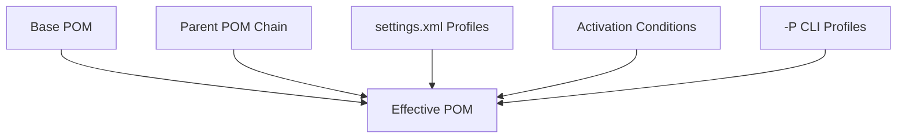
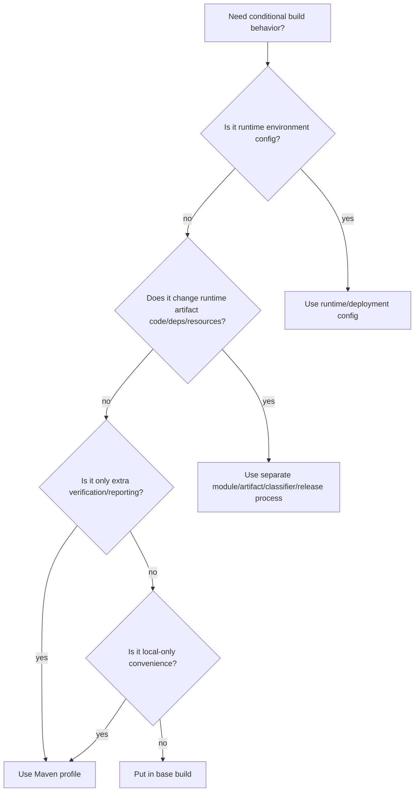
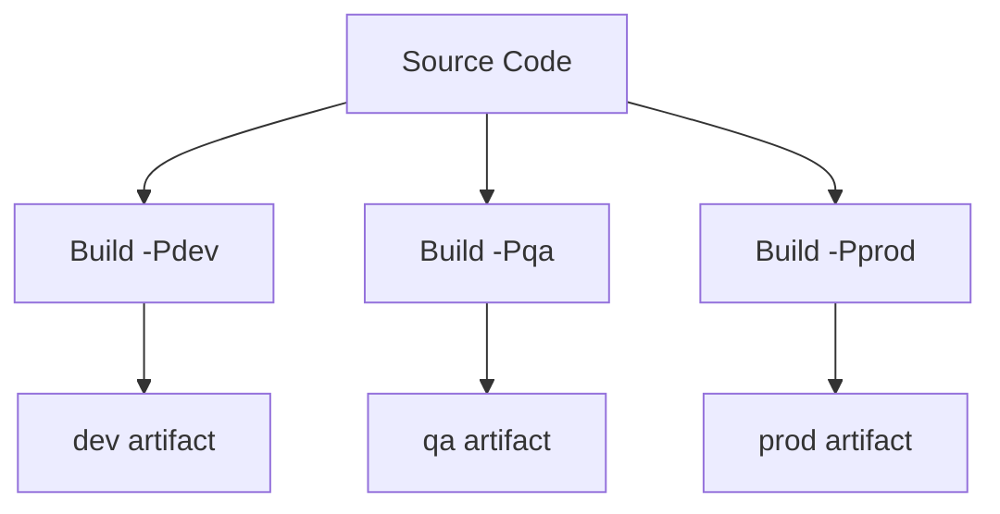
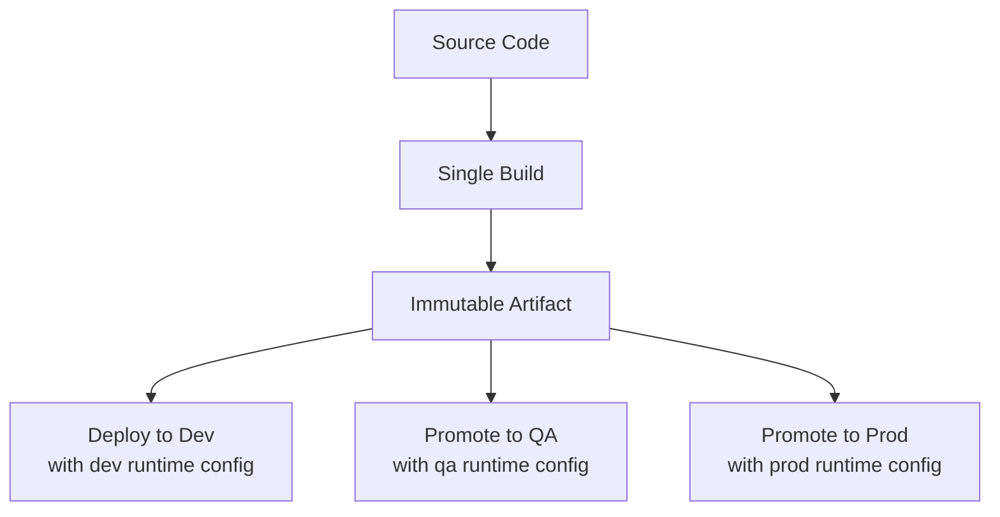

# Part 018 — Build Profiles Without Chaos

> Target: setelah bagian ini, kamu bisa memakai Maven profiles sebagai **build model variant mechanism** tanpa menjadikannya sumber artifact drift, environment drift, dan incident yang susah direproduksi.

Maven profiles sering diperkenalkan dengan contoh sederhana:

```bash
mvn package -Pdev
mvn package -Pprod
```

Lalu tim mulai membuat artifact berbeda untuk environment berbeda.

Awalnya nyaman.

Beberapa bulan kemudian:

- artifact lokal berbeda dari CI,
- `prod` build tidak sama dengan `qa` build,
- dependency berubah karena profile,
- test tertentu hilang karena profile,
- generated sources berbeda,
- repository yang dipakai berbeda,
- issue hanya muncul saat kombinasi profile tertentu,
- tidak ada yang yakin profile mana aktif di pipeline.

Maven profiles memang fitur resmi dan berguna. Dokumentasi Maven menjelaskan bahwa profile dapat mengubah POM pada kondisi tertentu dan bisa diaktifkan secara eksplisit, melalui settings, atau activation condition. Referensi: [Apache Maven — Introduction to Build Profiles](https://maven.apache.org/guides/introduction/introduction-to-profiles.html). Tetapi justru karena profile bisa mengubah build model, profile adalah salah satu fitur Maven yang paling perlu governance.

Bagian ini membahas bagaimana memakai profile tanpa chaos.

---

## 1. Mental Model: Profile Mengubah Effective POM

Profile bukan variabel runtime.

Profile bukan environment runtime.

Profile bukan feature flag aplikasi.

Profile adalah conditional contribution ke Maven model.

```txt
base POM + active profiles + parent chain + settings + Super POM = effective POM
```



Artinya:

> Mengaktifkan profile dapat mengubah artifact yang dihasilkan.

Karena itu, profile harus diperlakukan sebagai build variant mechanism, bukan tempat konfigurasi sembarangan.

---

## 2. Profile Bisa Ada di Beberapa Tempat

Maven profile dapat didefinisikan di:

1. project POM,
2. user/global `settings.xml`,
3. external profile file pada model Maven lama tertentu.

Untuk praktik modern, dua lokasi yang paling penting:

| Lokasi | Cocok Untuk | Tidak Cocok Untuk |
|---|---|---|
| `pom.xml` | project-specific build variants | secrets, user-specific local paths |
| `settings.xml` | user/CI environment, repositories, pluginRepositories, properties | project build structure |

Dokumentasi Maven Settings menjelaskan bahwa profile di `settings.xml` adalah versi terbatas dari POM profile, berisi activation, repositories, pluginRepositories, dan properties karena settings berperan untuk build system secara keseluruhan, bukan project object model penuh. Referensi: [Apache Maven — Settings Reference](https://maven.apache.org/settings.html).

Implikasi:

```txt
POM profile can change project build model deeply.
settings profile should configure execution environment.
```

---

## 3. Apa yang Boleh Diubah Profile?

Profile di POM bisa mengubah banyak elemen model, seperti properties, dependencies, repositories, pluginRepositories, build plugins, reporting, distribution management, dan sebagainya.

Tapi “bisa” bukan berarti “boleh secara desain”.

Gunakan policy berikut.

| Elemen | Boleh di Profile? | Risiko |
|---|---:|---|
| properties untuk build toggle | Ya | medium |
| plugin configuration optional | Ya | medium |
| test skip/selection | Ya, hati-hati | high |
| generated source behavior | Kadang | high |
| dependencies | Jarang | very high |
| dependencyManagement | Jarang | very high |
| repositories | Lebih baik settings/repo manager | high |
| distributionManagement | Kadang untuk release infra | high |
| compiler target/release | Hampir tidak | very high |
| packaging behavior | Jarang sekali | very high |
| secrets | Tidak | critical |
| environment runtime URL | Tidak | critical |

Rule:

```txt
Profile should not make the same version coordinate represent different production code.
```

Kalau `com.acme:case-service:1.2.0` bisa berisi code/dependency berbeda tergantung `-Pdev` atau `-Pprod`, kamu kehilangan artifact integrity.

---

## 4. Good Use Cases untuk Maven Profiles

Profile bukan musuh. Profile berguna untuk beberapa kasus.

### Use Case 1 — Optional Heavy Checks

Contoh: static analysis berat hanya di nightly atau pre-release.

```xml
<profile>
  <id>quality-deep</id>
  <build>
    <plugins>
      <plugin>
        <groupId>com.github.spotbugs</groupId>
        <artifactId>spotbugs-maven-plugin</artifactId>
        <executions>
          <execution>
            <id>spotbugs-check</id>
            <phase>verify</phase>
            <goals>
              <goal>check</goal>
            </goals>
          </execution>
        </executions>
      </plugin>
    </plugins>
  </build>
</profile>
```

Command:

```bash
mvn verify -Pquality-deep
```

Ini acceptable karena artifact utama tidak berubah; hanya checks bertambah.

### Use Case 2 — Optional Integration Tests

```xml
<profile>
  <id>integration-tests</id>
  <properties>
    <skip.integration.tests>false</skip.integration.tests>
  </properties>
</profile>
```

Base:

```xml
<properties>
  <skip.integration.tests>true</skip.integration.tests>
</properties>
```

Failsafe config:

```xml
<plugin>
  <groupId>org.apache.maven.plugins</groupId>
  <artifactId>maven-failsafe-plugin</artifactId>
  <configuration>
    <skipITs>${skip.integration.tests}</skipITs>
  </configuration>
</plugin>
```

Command:

```bash
mvn verify -Pintegration-tests
```

Ini acceptable kalau CI release path selalu menjalankan profile tersebut.

### Use Case 3 — Local Developer Convenience

Contoh: menjalankan embedded test container setup, bukan mengubah production artifact.

```xml
<profile>
  <id>local-dev</id>
  <properties>
    <test.postgres.mode>container</test.postgres.mode>
  </properties>
</profile>
```

Jangan pakai profile ini untuk mengganti production dependency.

### Use Case 4 — Release Signing

Artifact signing sering hanya aktif saat release.

```xml
<profile>
  <id>release-sign</id>
  <build>
    <plugins>
      <plugin>
        <groupId>org.apache.maven.plugins</groupId>
        <artifactId>maven-gpg-plugin</artifactId>
        <executions>
          <execution>
            <id>sign-artifacts</id>
            <phase>verify</phase>
            <goals>
              <goal>sign</goal>
            </goals>
          </execution>
        </executions>
      </plugin>
    </plugins>
  </build>
</profile>
```

Signing mengubah attached artifacts/signatures, bukan business code.

### Use Case 5 — Documentation/Site Generation

```bash
mvn site -Pdocs
```

Boleh karena output-nya documentation artifact, bukan runtime JAR utama.

---

## 5. Bad Use Cases: `dev`, `qa`, `prod` Profiles

Ini anti-pattern klasik:

```xml
<profiles>
  <profile>
    <id>dev</id>
    <properties>
      <db.url>jdbc:postgresql://dev-db/order</db.url>
    </properties>
  </profile>

  <profile>
    <id>prod</id>
    <properties>
      <db.url>jdbc:postgresql://prod-db/order</db.url>
    </properties>
  </profile>
</profiles>
```

Lalu resource filtering memasukkan nilai ke artifact:

```properties
app.db.url=${db.url}
```

Masalah:

- artifact dev dan prod berbeda,
- secret/URL bisa masuk artifact,
- build harus dilakukan per environment,
- rollback artifact menjadi sulit,
- provenance artifact lemah,
- audit tidak bisa yakin artifact yang diuji sama dengan artifact yang diproduksi.

Prinsip deployment modern:

```txt
Build once, promote the same artifact through environments.
```

Environment runtime config harus disediakan oleh runtime platform:

- Kubernetes ConfigMap/Secret,
- environment variables,
- secret manager,
- deployment manifest,
- service discovery,
- runtime config server,
- cloud parameter store.

Maven build tidak seharusnya tahu URL database production.

---

## 6. Activation Mechanisms

Profile bisa aktif dengan beberapa mekanisme.

### Explicit CLI Activation

```bash
mvn verify -Pquality-deep
```

Multiple profiles:

```bash
mvn verify -Pquality-deep,integration-tests
```

Deactivate profile:

```bash
mvn verify -P!local-dev
```

Dalam shell tertentu, karakter `!` perlu escaping/quoting.

### Active by Default

```xml
<profile>
  <id>default-checks</id>
  <activation>
    <activeByDefault>true</activeByDefault>
  </activation>
</profile>
```

Hati-hati: active-by-default profile bisa nonaktif saat profile lain di POM yang sama diaktifkan eksplisit.

Jangan pakai `activeByDefault` untuk behavior penting yang harus selalu terjadi. Untuk behavior penting, taruh di base build atau parent.

### Property Activation

```xml
<profile>
  <id>ci</id>
  <activation>
    <property>
      <name>env.CI</name>
    </property>
  </activation>
</profile>
```

Atau:

```xml
<profile>
  <id>release</id>
  <activation>
    <property>
      <name>performRelease</name>
      <value>true</value>
    </property>
  </activation>
</profile>
```

Command:

```bash
mvn deploy -DperformRelease=true
```

### JDK Activation

```xml
<profile>
  <id>jdk-21-plus</id>
  <activation>
    <jdk>[21,)</jdk>
  </activation>
</profile>
```

Useful untuk migration, tapi berisiko kalau build behavior berubah antar-JDK tanpa disadari.

### OS Activation

```xml
<profile>
  <id>windows-paths</id>
  <activation>
    <os>
      <family>Windows</family>
    </os>
  </activation>
</profile>
```

Gunakan hanya untuk local tooling atau OS-specific test fixtures, bukan artifact logic.

### File Activation

```xml
<profile>
  <id>has-local-overrides</id>
  <activation>
    <file>
      <exists>${user.home}/.acme/maven-local.properties</exists>
    </file>
  </activation>
</profile>
```

Ini sering menjadi sumber nondeterminism.

Gunakan sangat hati-hati.

---

## 7. Profile Activation Decision Tree



Rule praktis:

```txt
If profile changes what you ship, reconsider.
If profile changes how much you verify, it is often fine.
If profile changes where you deploy, keep credentials/settings outside POM.
```

---

## 8. Profile Naming Strategy

Nama profile harus menjelaskan intensi, bukan environment vague.

Buruk:

```txt
dev
qa
uat
prod
fast
full
x
```

Lebih baik:

```txt
integration-tests
quality-deep
release-sign
publish-docs
local-dev-tools
native-image
coverage-report
skip-docker-build
```

Nama profile harus menjawab:

```txt
What build capability does this activate?
```

Bukan:

```txt
Where will this artifact be used?
```

---

## 9. Jangan Menyembunyikan Dependency di Profile

Contoh buruk:

```xml
<profile>
  <id>postgres</id>
  <dependencies>
    <dependency>
      <groupId>org.postgresql</groupId>
      <artifactId>postgresql</artifactId>
      <version>42.7.7</version>
    </dependency>
  </dependencies>
</profile>
```

Kalau code utama compile hanya saat `-Ppostgres`, dependency graph dasar tidak jujur.

Lebih baik buat module/adapter eksplisit:

```txt
order-adapter-postgres
order-adapter-oracle
```

Atau gunakan dependency biasa di module yang memang butuh.

Profile dependency bisa diterima untuk test-only tool optional:

```xml
<profile>
  <id>contract-tests</id>
  <dependencies>
    <dependency>
      <groupId>com.acme.testing</groupId>
      <artifactId>contract-test-kit</artifactId>
      <version>${contract.test.kit.version}</version>
      <scope>test</scope>
    </dependency>
  </dependencies>
</profile>
```

Tetap dokumentasikan.

---

## 10. Jangan Mengubah Compiler Release via Profile

Anti-pattern:

```xml
<profile>
  <id>java17</id>
  <properties>
    <maven.compiler.release>17</maven.compiler.release>
  </properties>
</profile>

<profile>
  <id>java21</id>
  <properties>
    <maven.compiler.release>21</maven.compiler.release>
  </properties>
</profile>
```

Ini membuat artifact coordinate sama bisa punya bytecode target berbeda.

Kalau perlu multi-Java support, gunakan strategy eksplisit:

- separate release line,
- multi-release JAR dengan desain sadar,
- matrix CI untuk compatibility testing,
- Maven Toolchains untuk memilih JDK build,
- artifact classifier kalau benar-benar menghasilkan variant.

Jangan sembunyikan di `-Pjava21` tanpa artifact identity berbeda.

---

## 11. Profile dan Resource Filtering

Resource filtering dengan profile adalah sumber insiden klasik.

Contoh:

```xml
<resources>
  <resource>
    <directory>src/main/resources</directory>
    <filtering>true</filtering>
  </resource>
</resources>
```

Lalu profile:

```xml
<profile>
  <id>prod</id>
  <properties>
    <service.url>https://prod.example.internal</service.url>
  </properties>
</profile>
```

Masalah:

- artifact berbeda per profile,
- URL bisa stale,
- secret bisa bocor,
- prod deployment membutuhkan rebuild,
- testing artifact tidak sama dengan artifact production.

Safe pattern:

```properties
service.url=${SERVICE_URL_FROM_RUNTIME}
```

Atau biarkan aplikasi membaca environment/runtime config.

Maven filtering boleh untuk metadata build yang tidak sensitif:

```properties
build.version=${project.version}
build.artifact=${project.artifactId}
build.timestamp=${maven.build.timestamp}
```

Tetapi untuk reproducible build, timestamp juga harus dipikirkan hati-hati.

---

## 12. Profile dan Reproducibility

Build reproducible berarti input yang sama menghasilkan output yang sama.

Profile menambah dimensi input.

Artifact tidak lagi cukup dijelaskan oleh:

```txt
git commit + Maven version + JDK + dependency graph
```

Tapi juga:

```txt
active profiles + profile source + settings + environment properties
```

Karena itu, CI harus mencatat active profiles.

Minimal:

```bash
mvn help:active-profiles
mvn help:effective-pom -Doutput=effective-pom.xml
```

Untuk release build, simpan:

- Git commit,
- Maven version,
- JDK version,
- active profiles,
- effective POM,
- dependency tree,
- artifact checksum,
- repository source.

---

## 13. Profile di Parent POM

Profile di parent diwariskan sebagai bagian model parent.

Ini bisa berguna, tetapi berisiko.

Contoh profile parent yang cukup aman:

```xml
<profile>
  <id>quality-deep</id>
  <build>
    <plugins>
      <plugin>
        <groupId>com.github.spotbugs</groupId>
        <artifactId>spotbugs-maven-plugin</artifactId>
        <executions>
          <execution>
            <id>spotbugs-check</id>
            <phase>verify</phase>
            <goals>
              <goal>check</goal>
            </goals>
          </execution>
        </executions>
      </plugin>
    </plugins>
  </build>
</profile>
```

Semua child bisa memilih menjalankan deep quality check.

Contoh profile parent yang buruk:

```xml
<profile>
  <id>prod</id>
  <properties>
    <db.host>prod-db.internal</db.host>
    <feature.payment.enabled>true</feature.payment.enabled>
  </properties>
</profile>
```

Parent POM bukan tempat environment runtime.

---

## 14. Profile di `settings.xml`

`settings.xml` profile cocok untuk environment build system.

Contoh:

```xml
<settings>
  <profiles>
    <profile>
      <id>acme-ci</id>
      <repositories>
        <repository>
          <id>acme-maven-group</id>
          <url>https://repo.acme.internal/repository/maven-public</url>
          <releases>
            <enabled>true</enabled>
          </releases>
          <snapshots>
            <enabled>true</enabled>
          </snapshots>
        </repository>
      </repositories>
      <pluginRepositories>
        <pluginRepository>
          <id>acme-maven-plugins</id>
          <url>https://repo.acme.internal/repository/maven-public</url>
        </pluginRepository>
      </pluginRepositories>
    </profile>
  </profiles>

  <activeProfiles>
    <activeProfile>acme-ci</activeProfile>
  </activeProfiles>
</settings>
```

Tapi untuk enterprise, mirror sering lebih baik daripada menaruh banyak repository di POM/profile:

```xml
<mirrors>
  <mirror>
    <id>acme-all</id>
    <mirrorOf>*</mirrorOf>
    <url>https://repo.acme.internal/repository/maven-all</url>
  </mirror>
</mirrors>
```

Settings profile tidak boleh menjadi dependency build model project yang tidak terdokumentasi.

Kalau build hanya bisa sukses karena property di developer `settings.xml`, CI akan rapuh.

---

## 15. Profile Governance Rule

Untuk organisasi besar, setiap profile harus punya metadata manusia.

Minimal di `README` atau `BUILD.md`:

```md
## Maven Profiles

| Profile | Purpose | Changes Artifact? | Used In CI? | Owner |
|---|---|---:|---:|---|
| integration-tests | Enables Failsafe integration tests | No | Yes, release pipeline | Platform Team |
| quality-deep | Enables SpotBugs and extended static checks | No | Nightly | Platform Team |
| release-sign | Signs artifacts during release | Adds signatures | Release only | Build Team |
| local-dev-tools | Local developer helpers | No production artifact | No | DevEx Team |
```

Setiap profile harus menjawab:

1. Kenapa ada?
2. Siapa owner-nya?
3. Apakah mengubah artifact utama?
4. Di pipeline mana dipakai?
5. Apakah aman dikombinasikan dengan profile lain?
6. Apa command canonical-nya?

---

## 16. Profile Combination Matrix

Profile bisa dikombinasikan.

```bash
mvn verify -Pintegration-tests,quality-deep,coverage-report
```

Kombinasi bisa menyebabkan conflict.

Contoh:

```txt
native-image + jacoco
release-sign + skip-tests
coverage-report + parallel-fork-heavy-tests
```

Untuk profile enterprise, dokumentasikan matrix:

| Profile A | Profile B | Status | Catatan |
|---|---|---|---|
| integration-tests | quality-deep | supported | release verify |
| integration-tests | local-dev-tools | supported | local only |
| release-sign | skip-tests | forbidden | release must test |
| native-image | coverage-report | unsupported | instrumentation conflict |

Jangan berharap engineer menebak.

---

## 17. Detect Active Profiles

Command penting:

```bash
mvn help:active-profiles
```

Untuk melihat effective model:

```bash
mvn help:effective-pom -Doutput=effective-pom.xml
```

Untuk melihat settings aktif:

```bash
mvn help:effective-settings
```

Untuk debug activation:

```bash
mvn -X validate
```

Playbook saat “build berbeda di mesin saya”:

```bash
mvn -version
mvn help:active-profiles
mvn help:effective-settings
mvn help:effective-pom -Doutput=effective-pom.xml
mvn dependency:tree -DoutputFile=dependency-tree.txt
```

Bandingkan:

- active profiles,
- JDK,
- OS,
- environment variables,
- settings profile,
- repositories,
- dependency tree,
- plugin configuration.

---

## 18. Build Profiles vs Application Profiles

Banyak framework punya concept profile sendiri, misalnya application runtime profile.

Jangan campur secara buta.

```txt
Maven profile = build-time model change
Application profile = runtime configuration selection
```

Buruk:

```bash
mvn package -Pprod
java -jar target/app.jar
```

Baik:

```bash
mvn package
APP_ENV=prod java -jar target/app.jar
```

Atau di Kubernetes:

```yaml
env:
  - name: APP_ENV
    value: prod
```

Maven membangun artifact. Runtime platform menjalankan artifact dengan config environment.

Boundary ini penting untuk audit, rollback, dan reproducibility.

---

## 19. Build Once, Promote Many

Prinsip:

```txt
The artifact tested in staging should be the artifact deployed to production.
```

Dengan profile environment build:



Ini buruk karena setiap environment punya artifact berbeda.

Dengan build once:



Maven profile boleh mempengaruhi **verification path**, bukan membuat artifact environment-specific.

---

## 20. Safe Pattern: Profiles for Checks, Not Product Behavior

Base build:

```bash
mvn clean verify
```

CI PR build:

```bash
mvn -B clean verify
```

Nightly:

```bash
mvn -B clean verify -Pintegration-tests,quality-deep,coverage-report
```

Release:

```bash
mvn -B clean deploy -Pintegration-tests,release-sign
```

Dalam pattern ini:

- PR build cepat,
- nightly lebih dalam,
- release lengkap dan signed,
- artifact runtime tidak berubah karena environment,
- profile punya fungsi verifikasi/publishing.

---

## 21. Profile untuk Skipping: Nama Harus Jelas

Skipping sering diperlukan, tapi harus eksplisit.

Buruk:

```bash
mvn package -Pfast
```

Apa yang di-skip? Unit test? Integration test? Checkstyle? Generated sources?

Lebih baik:

```bash
mvn package -DskipTests
mvn verify -DskipITs
mvn verify -Pskip-docker-build
```

Kalau memakai profile:

```xml
<profile>
  <id>skip-docker-build</id>
  <properties>
    <docker.build.skip>true</docker.build.skip>
  </properties>
</profile>
```

Profile `fast` adalah nama psikologis, bukan nama teknis.

---

## 22. Profile dan CI Pipeline

CI harus eksplisit.

Buruk:

```bash
mvn clean verify
```

Tapi pipeline bergantung pada `settings.xml` yang mengaktifkan profile tersembunyi.

Lebih baik:

```bash
mvn -B clean verify -Pintegration-tests,quality-deep
```

Dan sebelum build:

```bash
mvn help:active-profiles
```

Pipeline harus menyimpan log:

```txt
Maven version
JDK version
Active profiles
Effective settings
Build command
Git commit
Artifact checksum
```

Kalau profile adalah bagian dari build input, profile harus terlihat di audit trail.

---

## 23. Profile dan Multi-Module Reactor

Profile di multi-module bisa aktif hanya di module tertentu atau parent tertentu.

Masalah umum:

- profile ID sama dengan definisi berbeda di module berbeda,
- parent profile mengubah semua module,
- child profile hanya aktif saat module dibuild langsung,
- partial build tidak mengaktifkan expectation yang sama,
- profile menambah dependency antar-module secara conditional.

Contoh buruk:

```xml
<!-- module A -->
<profile>
  <id>integration-tests</id>
  <properties>
    <it.mode>postgres</it.mode>
  </properties>
</profile>

<!-- module B -->
<profile>
  <id>integration-tests</id>
  <properties>
    <it.mode>kafka</it.mode>
  </properties>
</profile>
```

Ini bisa diterima jika terdokumentasi, tapi berisiko karena ID yang sama tidak punya meaning tunggal.

Lebih baik:

```txt
integration-tests
postgres-integration-tests
kafka-integration-tests
```

Atau parent profile hanya mengaktifkan property umum, module mendefinisikan config spesifik.

---

## 24. Profile dan Dependency Convergence

Jika profile menambahkan dependency, dependency tree bisa berubah.

Command:

```bash
mvn dependency:tree
mvn dependency:tree -Pcontract-tests
```

Bandingkan hasil.

Jika profile untuk test menambah dependency test-only, aman relatif.

Jika profile menambah dependency compile/runtime, sangat berbahaya.

Policy:

```txt
Compile/runtime dependency graph should not depend on environment profile.
```

Kalau dependency graph runtime berubah, artifact identity harus berubah atau module harus dipisah.

---

## 25. Profile dan Generated Sources

Generated sources sering memakai profile:

```bash
mvn generate-sources -Pgenerate-openapi
```

Ini berisiko jika source utama bergantung pada generated code tapi profile tidak selalu aktif.

Lebih baik:

- codegen wajib masuk default lifecycle jika source utama membutuhkannya,
- profile hanya untuk optional regeneration/report,
- generated code committed atau generated deterministically; pilih salah satu secara sadar,
- CI canonical build harus sama dengan local canonical build.

Bad smell:

```txt
To compile the project, remember to run -Pgenerate.
```

Kalau wajib compile, itu bukan optional profile. Itu bagian build normal.

---

## 26. Profile dan Native Image / Platform-Specific Build

Ada kasus di mana profile memang menghasilkan artifact berbeda, misalnya native image.

Contoh:

```bash
mvn package -Pnative
```

Ini acceptable jika artifact identity/output berbeda jelas.

Misalnya:

- output bukan JAR utama,
- classifier berbeda,
- module berbeda,
- pipeline berbeda,
- metadata artifact jelas.

Jangan membuat:

```txt
case-service-1.2.0.jar
```

kadang berisi JVM app, kadang native-specific packaged app.

Lebih baik:

```txt
case-service-1.2.0.jar
case-service-1.2.0-native-image.tar.gz
```

Atau module:

```txt
case-service-runtime-jvm
case-service-runtime-native
```

---

## 27. Profile dan Release Signing

Release signing profile umum dan valid.

Tapi harus dipastikan:

- hanya aktif di release pipeline,
- credential tidak di POM,
- key berasal dari secure CI secret store,
- failure signing menghentikan release,
- signed artifact correspond ke artifact yang diuji.

Command release:

```bash
mvn -B clean deploy -Pintegration-tests,release-sign
```

Jangan:

```bash
mvn -Pprod deploy
```

Nama `prod` menyamarkan maksud. Nama `release-sign` jelas.

---

## 28. Profile dan Repository Switching

Anti-pattern:

```xml
<profile>
  <id>internal-repo</id>
  <repositories>
    <repository>
      <id>internal</id>
      <url>https://repo.acme.internal/repository/maven-public</url>
    </repository>
  </repositories>
</profile>
```

Lebih baik:

- repository manager sebagai mirror di `settings.xml`,
- CI settings eksplisit,
- no random repositories in project POM,
- dependency source diaudit di repository manager.

Repository switching via profile bisa membuat developer resolve artifact dari sumber berbeda.

Ini supply-chain risk.

---

## 29. Minimal Safe Profile Template

Gunakan template ini saat menambah profile baru:

```xml
<profile>
  <id>quality-deep</id>

  <activation>
    <!-- Prefer explicit activation unless there is a strong reason. -->
  </activation>

  <properties>
    <acme.quality.deep.enabled>true</acme.quality.deep.enabled>
  </properties>

  <build>
    <plugins>
      <!-- Only plugins needed by this build capability. -->
    </plugins>
  </build>
</profile>
```

Checklist sebelum merge:

```txt
[ ] Name describes capability, not environment.
[ ] It does not inject secrets.
[ ] It does not change runtime artifact unexpectedly.
[ ] It is documented in BUILD.md.
[ ] CI command using it is explicit.
[ ] Interaction with other profiles is known.
[ ] Effective POM diff is reviewed.
```

---

## 30. Effective POM Diff Workflow

Saat menambah/mengubah profile:

```bash
mvn help:effective-pom -Doutput=effective-base.xml
mvn help:effective-pom -Pnew-profile -Doutput=effective-profile.xml
```

Diff:

```bash
diff -u effective-base.xml effective-profile.xml
```

Periksa:

- dependencies,
- dependencyManagement,
- plugins,
- plugin executions,
- resources/filtering,
- compiler config,
- packaging,
- repositories,
- distributionManagement.

Kalau diff besar dan tidak bisa dijelaskan, profile terlalu kuat.

---

## 31. Incident Playbook: “Works with -Pdev Only”

Gejala:

```txt
mvn test fails
mvn test -Pdev works
```

Kemungkinan:

1. Dependency compile/test ada di profile.
2. Generated sources hanya aktif di profile.
3. Required property hanya ada di profile.
4. Resource filtering butuh property profile.
5. Plugin execution wajib hanya ada di profile.
6. Test fixture hanya dikonfigurasi di profile.

Playbook:

```bash
mvn help:effective-pom -Doutput=base.xml
mvn help:effective-pom -Pdev -Doutput=dev.xml
diff -u base.xml dev.xml
mvn dependency:tree
mvn dependency:tree -Pdev
```

Fix:

- jika wajib untuk compile/test normal, pindahkan ke base build,
- jika optional, ubah code/test agar tidak bergantung default,
- jika environment runtime, pindahkan ke runtime config.

---

## 32. Incident Playbook: “CI Active Profile Tidak Sama dengan Local”

Gejala:

```txt
Local verify passes.
CI verify fails.
```

Langkah:

```bash
mvn -version
mvn help:active-profiles
mvn help:effective-settings
mvn help:effective-pom -Doutput=effective-pom.xml
```

Bandingkan local dan CI.

Penyebab umum:

- CI punya `env.CI` sehingga profile aktif,
- local punya `settings.xml` activeProfile,
- OS/JDK activation berbeda,
- file activation tergantung file lokal,
- CI command eksplisit `-P...`, local tidak,
- parent profile berubah.

Fix governance:

- profile CI harus eksplisit di command,
- hindari activation by file untuk build utama,
- dokumentasikan environment variable activation,
- log active profiles di pipeline.

---

## 33. When Not to Use Maven Profiles

Jangan gunakan Maven profile untuk:

- memilih database production,
- memilih endpoint service production,
- menyimpan credentials,
- enable/disable business feature runtime,
- mengubah compile/runtime dependency per environment,
- membuat artifact per environment dengan coordinate sama,
- menutupi module boundary buruk,
- menambal parent POM terlalu gemuk,
- mengganti release process,
- melakukan deployment orchestration kompleks.

Gunakan alternatif:

| Masalah | Alternatif |
|---|---|
| Runtime config | env vars, config files, secret manager, Kubernetes config |
| Dependency variant | separate module/artifact/classifier |
| Platform variant | separate build pipeline/module |
| Verification depth | Maven profile acceptable |
| Repository source | repository manager + settings mirror |
| Deployment target | CI/CD deployment config |
| Feature flag | runtime feature flag system |

---

## 34. A Clean Enterprise Profile Set

Contoh profile set yang sehat:

```txt
integration-tests       -> enables Failsafe ITs and external test fixtures
quality-deep            -> heavy static analysis
coverage-report         -> coverage instrumentation/report
release-sign            -> signs artifacts
publish-docs            -> site/docs generation
local-dev-tools         -> local-only helper plugins/properties
native-image            -> produces explicit native output artifact
```

Contoh yang buruk:

```txt
dev
sit
qa
uat
prod
fast
full
cloud
local
```

Bukan karena nama itu selalu salah, tetapi karena biasanya menyembunyikan campuran behavior:

- environment config,
- test selection,
- dependency switch,
- resource filtering,
- deployment behavior,
- credentials,
- repository switching.

Satu profile harus punya satu purpose.

---

## 35. Profile Policy untuk Code Review

Saat review PR yang menambah profile, tanyakan:

1. Apa capability yang diaktifkan?
2. Apakah artifact utama berubah?
3. Apakah dependency compile/runtime berubah?
4. Apakah profile dipakai di CI?
5. Apakah active profile terlihat di command?
6. Apakah profile bisa aktif otomatis karena OS/JDK/file/env?
7. Apakah ada secret/URL environment masuk artifact?
8. Apakah base build tetap berhasil tanpa profile?
9. Apakah profile interaction sudah jelas?
10. Apakah effective POM diff sudah direview?

Kalau jawaban tidak jelas, profile belum siap.

---

## 36. Practical Baseline Configuration

Parent/base POM:

```xml
<properties>
  <skip.integration.tests>true</skip.integration.tests>
  <skip.deep.quality>true</skip.deep.quality>
</properties>

<build>
  <pluginManagement>
    <plugins>
      <plugin>
        <groupId>org.apache.maven.plugins</groupId>
        <artifactId>maven-failsafe-plugin</artifactId>
        <version>3.5.3</version>
        <configuration>
          <skipITs>${skip.integration.tests}</skipITs>
        </configuration>
      </plugin>
    </plugins>
  </pluginManagement>
</build>

<profiles>
  <profile>
    <id>integration-tests</id>
    <properties>
      <skip.integration.tests>false</skip.integration.tests>
    </properties>
  </profile>

  <profile>
    <id>quality-deep</id>
    <properties>
      <skip.deep.quality>false</skip.deep.quality>
    </properties>
  </profile>
</profiles>
```

Module yang punya IT:

```xml
<build>
  <plugins>
    <plugin>
      <groupId>org.apache.maven.plugins</groupId>
      <artifactId>maven-failsafe-plugin</artifactId>
      <executions>
        <execution>
          <id>run-integration-tests</id>
          <goals>
            <goal>integration-test</goal>
            <goal>verify</goal>
          </goals>
        </execution>
      </executions>
    </plugin>
  </plugins>
</build>
```

Commands:

```bash
# normal local/PR
mvn clean verify

# deeper verification
mvn clean verify -Pintegration-tests,quality-deep
```

Behavior jelas:

- base build jalan,
- IT optional tapi canonical,
- module yang punya IT mendeklarasikan plugin,
- profile tidak mengubah dependency runtime.

---

## 37. Kesimpulan

Maven profiles adalah alat untuk membuat build model conditional.

Itu kuat. Itu juga berbahaya.

Mental model utama:

```txt
profile activation changes the effective POM
therefore it changes build inputs
therefore it must be explicit, documented, and governed
```

Gunakan profile untuk:

- optional verification,
- release signing,
- documentation generation,
- local developer helpers,
- explicit alternative artifact build dengan identity jelas.

Jangan gunakan profile untuk:

- environment runtime config,
- prod/dev artifact differences,
- secret injection,
- hidden dependency variants,
- mengganti architecture boundary.

Bagian berikutnya akan membahas **resource filtering and build-time configuration**. Ini kelanjutan langsung dari profile chaos, karena banyak insiden profile terjadi saat properties Maven disuntikkan ke resource aplikasi tanpa memahami boundary antara build-time metadata dan runtime configuration.
