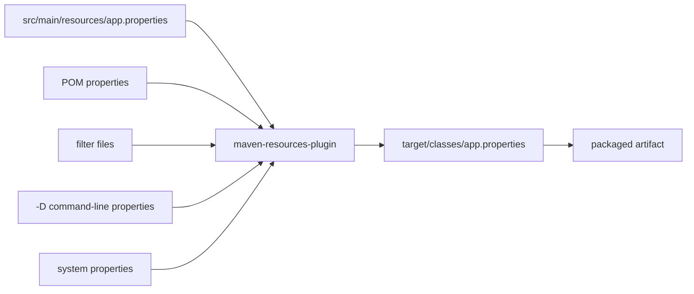
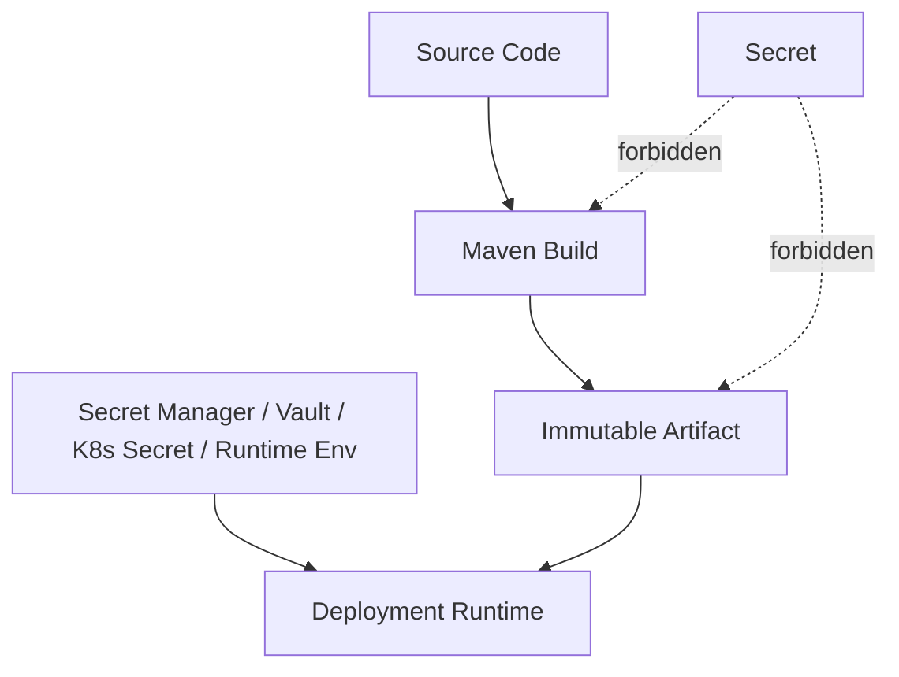
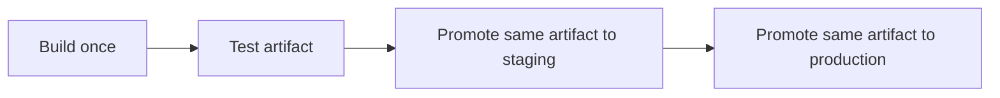
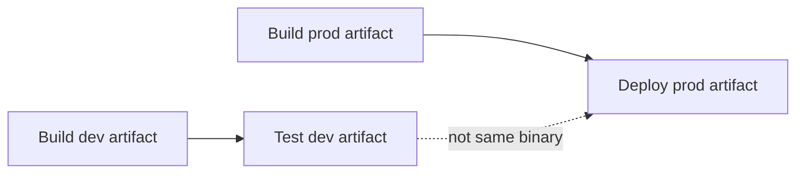
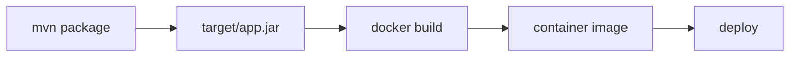

# Part 019 — Resource Filtering and Build-Time Configuration

> Target: setelah bagian ini, kamu bisa memakai Maven resource filtering secara aman, eksplisit, dan reproducible—tanpa mencampur build-time metadata, runtime configuration, environment-specific value, dan secret dalam satu mekanisme yang rapuh.

Maven resource filtering terlihat sederhana:

```xml
<resources>
  <resource>
    <directory>src/main/resources</directory>
    <filtering>true</filtering>
  </resource>
</resources>
```

Lalu di file resource:

```properties
app.version=${project.version}
```

Build menghasilkan:

```properties
app.version=1.4.2
```

Itu mudah.

Yang sulit adalah menjawab pertanyaan ini secara disiplin:

> Value mana yang layak dibekukan ke artifact saat build, dan value mana yang harus tetap diputuskan saat runtime?

Di sistem production, jawaban yang salah bisa menghasilkan artifact drift, secret leakage, environment-specific binary, image yang tidak bisa dipromosikan antar environment, audit trail yang ambigu, dan incident yang susah direproduksi.

---

## 1. Mental Model: Build-Time Config vs Runtime Config

Maven resource filtering adalah mekanisme **build-time substitution**.

Artinya Maven membaca file resource, mencari placeholder, lalu menggantinya dengan value yang diketahui pada saat build.



Setelah artifact dibuat, value yang sudah difilter menjadi bagian dari artifact.

Karena itu, filtering cocok untuk:

- build metadata,
- artifact identity,
- feature manifest statis,
- generated documentation metadata,
- version/banner information,
- non-secret compile/build descriptors.

Filtering tidak cocok untuk:

- password,
- token,
- private key,
- database URL production,
- Kafka bootstrap server per environment,
- endpoint yang berbeda antara dev/staging/prod,
- value yang harus bisa diganti tanpa rebuild.

Kalimat yang harus dipegang:

> Resource filtering menghasilkan artifact baru. Runtime config mengubah perilaku deployment tanpa menghasilkan artifact baru.

Kalau sebuah value berbeda antara staging dan production, dan kamu ingin melakukan artifact promotion yang benar, value itu biasanya **bukan** Maven filtering concern.

---

## 2. Apa yang Sebenarnya Dilakukan Maven Resources Plugin

Maven Resources Plugin bertugas menyalin resource project ke output directory. Secara default, resource utama berasal dari:

```txt
src/main/resources
```

Dan test resources berasal dari:

```txt
src/test/resources
```

Untuk Java project biasa, resource utama akhirnya masuk ke:

```txt
target/classes
```

Saat packaging `jar`, isi `target/classes` menjadi bagian dari JAR.

Saat filtering aktif, plugin melakukan interpolasi placeholder.

Contoh:

```properties
application.name=${project.artifactId}
application.version=${project.version}
build.time=${maven.build.timestamp}
```

Hasilnya bisa menjadi:

```properties
application.name=case-service
application.version=1.8.0
build.time=2026-07-03T09:31:22Z
```

Namun ada problem besar: `build.time` membuat artifact tidak deterministic jika nilainya berubah setiap build.

Di production engineering, convenience semacam ini harus ditimbang terhadap reproducibility.

---

## 3. Placeholder Source: Dari Mana Value Datang?

Value filtering bisa berasal dari beberapa sumber.

Urutan pastinya bisa dipengaruhi konfigurasi plugin dan model Maven, tetapi secara praktis sumber yang umum adalah:

1. POM properties,
2. project model properties seperti `${project.version}`,
3. filter files,
4. command-line properties `-Dkey=value`,
5. system properties,
6. active profile properties.

Contoh POM properties:

```xml
<properties>
  <app.public.name>Case Management Service</app.public.name>
  <app.api.version>v1</app.api.version>
</properties>
```

Resource:

```properties
app.name=${app.public.name}
app.api.version=${app.api.version}
app.maven.version=${project.version}
```

Command:

```bash
mvn package
```

Hasil:

```properties
app.name=Case Management Service
app.api.version=v1
app.maven.version=1.0.0-SNAPSHOT
```

Command-line override:

```bash
mvn package -Dapp.api.version=v2
```

Ini bisa mengubah artifact.

Karena itu, command-line property harus diperlakukan sebagai **build input**. Kalau CI mengizinkan arbitrary `-D`, build menjadi sulit diaudit.

---

## 4. Filtering yang Aman: Pisahkan Filtered dan Non-Filtered Resources

Anti-pattern umum:

```xml
<resources>
  <resource>
    <directory>src/main/resources</directory>
    <filtering>true</filtering>
  </resource>
</resources>
```

Ini mengaktifkan filtering untuk semua resource.

Risikonya:

- file binary bisa rusak,
- placeholder milik framework lain bisa ikut terganti,
- file konfigurasi runtime bisa berubah saat build,
- secret placeholder bisa bocor,
- file besar menjadi overhead,
- behavior tidak mudah diprediksi.

Pattern yang lebih aman:

```txt
src/main/resources/
  application.yml
  logback.xml
  db/migration/V1__init.sql
src/main/filtered-resources/
  build-info.properties
  public-manifest.properties
```

POM:

```xml
<build>
  <resources>
    <resource>
      <directory>src/main/resources</directory>
      <filtering>false</filtering>
    </resource>
    <resource>
      <directory>src/main/filtered-resources</directory>
      <filtering>true</filtering>
    </resource>
  </resources>
</build>
```

Dengan pattern ini, filtering menjadi eksplisit.

Orang yang membaca repository langsung tahu:

- resource biasa tidak disentuh,
- resource yang difilter sengaja diletakkan di directory terpisah,
- review diff menjadi mudah,
- risiko accidental substitution turun drastis.

---

## 5. Build-Time Metadata yang Layak Difilter

Contoh yang relatif aman:

```properties
build.group=${project.groupId}
build.artifact=${project.artifactId}
build.version=${project.version}
build.name=${project.name}
build.description=${project.description}
```

File:

```txt
src/main/filtered-resources/META-INF/build-info.properties
```

POM:

```xml
<properties>
  <project.build.sourceEncoding>UTF-8</project.build.sourceEncoding>
</properties>

<build>
  <resources>
    <resource>
      <directory>src/main/resources</directory>
      <filtering>false</filtering>
    </resource>
    <resource>
      <directory>src/main/filtered-resources</directory>
      <filtering>true</filtering>
    </resource>
  </resources>
</build>
```

Gunanya:

- endpoint `/actuator/info` atau custom `/build-info`,
- log startup,
- incident triage,
- artifact provenance,
- support diagnostic.

Tetapi hindari value yang berubah setiap build tanpa alasan kuat.

Misalnya:

```properties
build.timestamp=${maven.build.timestamp}
```

Ini membuat byte output berubah setiap build. Kalau reproducible build adalah target, gunakan timestamp yang dikontrol, misalnya dari release metadata yang deterministik, atau simpan build timestamp di deployment metadata, bukan di artifact.

---

## 6. Secret Tidak Boleh Masuk Filtering

Jangan lakukan ini:

```properties
db.password=${prod.db.password}
api.token=${external.api.token}
```

Lalu:

```bash
mvn package -Dprod.db.password=super-secret
```

Masalahnya bukan hanya password masuk ke JAR.

Masalah lengkapnya:

- secret bisa masuk ke `target/classes`,
- secret bisa masuk ke artifact repository,
- secret bisa masuk ke Docker image,
- secret bisa masuk ke CI logs,
- secret bisa masuk ke build cache,
- secret bisa masuk ke SBOM atau scanner output,
- secret bisa bertahan di local developer machine,
- secret sulit dicabut dari artifact yang sudah tersebar.

Boundary yang benar:



Rule:

> Secret adalah runtime input, bukan build input.

Kalau sebuah tim butuh secret saat build, evaluasi ulang apakah itu benar-benar build concern. Ada kasus khusus seperti signing key untuk release artifact, tetapi itu bukan resource filtering. Signing harus memakai mekanisme release/signing yang terkontrol, bukan mengganti placeholder dalam file resource.

---

## 7. Environment-Specific Filtering adalah Smell

Contoh smell:

```bash
mvn package -Pdev
mvn package -Pstaging
mvn package -Pprod
```

Dan POM:

```xml
<profiles>
  <profile>
    <id>prod</id>
    <properties>
      <api.base.url>https://api.company.com</api.base.url>
    </properties>
  </profile>
</profiles>
```

Resource:

```yaml
external:
  api:
    baseUrl: ${api.base.url}
```

Setiap environment menghasilkan artifact berbeda.

Ini melanggar artifact promotion:



Environment-specific build menghasilkan flow yang lebih buruk:



Kalau artifact production tidak sama dengan artifact yang diuji, confidence turun.

Pattern lebih baik:

```yaml
external:
  api:
    baseUrl: ${EXTERNAL_API_BASE_URL:}
```

Atau gunakan config provider runtime:

- environment variable,
- mounted config file,
- Kubernetes ConfigMap,
- Spring/MicroProfile/Jakarta config source,
- service discovery,
- platform-specific config injection.

Maven boleh membekukan default non-sensitive yang benar-benar universal, tetapi environment value harus masuk saat deploy/runtime.

---

## 8. Filter Files: Berguna, Tetapi Jangan Dijadikan Environment Store

Maven mendukung filter files:

```xml
<build>
  <filters>
    <filter>src/main/filters/build.properties</filter>
  </filters>
  <resources>
    <resource>
      <directory>src/main/filtered-resources</directory>
      <filtering>true</filtering>
    </resource>
  </resources>
</build>
```

`src/main/filters/build.properties`:

```properties
company.name=Acme Regulatory Systems
public.support.url=https://support.example.com
```

Ini masih masuk akal bila value bersifat publik dan build-level.

Jangan buat:

```txt
src/main/filters/dev.properties
src/main/filters/staging.properties
src/main/filters/prod.properties
```

Lalu mengaktifkannya lewat profile.

Itu menjadikan Maven sebagai deployment config engine. Untuk enterprise system, ini biasanya berakhir dengan:

- artifact tidak immutable,
- environment behavior tersembunyi di build profile,
- sulit melakukan rollback,
- sulit membuktikan binary mana yang diuji,
- compliance evidence lemah.

Gunakan filter file untuk build metadata, bukan runtime environment matrix.

---

## 9. Delimiter Strategy: `${...}` vs `@...@`

Resources Plugin mendukung placeholder seperti:

```txt
${some.property}
@some.property@
```

Masalah dengan `${...}`: banyak framework juga memakai format yang sama.

Contoh:

```yaml
service:
  endpoint: ${SERVICE_ENDPOINT:http://localhost:8080}
```

Kalau filtering aktif, Maven bisa mencoba mengganti `${SERVICE_ENDPOINT:http://localhost:8080}` atau menimbulkan behavior tidak diinginkan.

Pattern yang lebih aman untuk file filtered-only:

```properties
build.artifact=@project.artifactId@
build.version=@project.version@
```

POM:

```xml
<plugin>
  <artifactId>maven-resources-plugin</artifactId>
  <configuration>
    <useDefaultDelimiters>false</useDefaultDelimiters>
    <delimiters>
      <delimiter>@</delimiter>
    </delimiters>
  </configuration>
</plugin>
```

Namun perhatikan: konfigurasi delimiter berlaku pada plugin execution/configuration yang kamu set. Jangan mengubah global behavior tanpa review, terutama jika parent POM dipakai banyak service.

Rule praktis:

- gunakan `${...}` untuk POM expression,
- gunakan `@...@` untuk resource filtering yang disengaja,
- pisahkan directory filtered resources,
- jangan aktifkan filtering untuk `application.yml` runtime kecuali benar-benar terkendali.

---

## 10. Binary Resource Corruption

Filtering membaca dan menulis file sebagai text.

Kalau filtering diterapkan ke binary file seperti:

- PNG,
- JPEG,
- PDF,
- keystore,
- font,
- protobuf descriptor binary,
- compressed asset,

file bisa rusak.

Karena itu, jangan aktifkan filtering pada seluruh `src/main/resources`.

Jika terpaksa memakai satu directory resource campuran, gunakan include/exclude:

```xml
<resource>
  <directory>src/main/resources</directory>
  <filtering>true</filtering>
  <includes>
    <include>**/*.properties</include>
    <include>**/*.txt</include>
  </includes>
</resource>
<resource>
  <directory>src/main/resources</directory>
  <filtering>false</filtering>
  <excludes>
    <exclude>**/*.properties</exclude>
    <exclude>**/*.txt</exclude>
  </excludes>
</resource>
```

Tetapi pattern directory terpisah tetap lebih mudah diaudit.

---

## 11. Encoding: Jangan Biarkan Implisit

Resource filtering bergantung pada encoding.

Minimal definisikan:

```xml
<properties>
  <project.build.sourceEncoding>UTF-8</project.build.sourceEncoding>
  <project.reporting.outputEncoding>UTF-8</project.reporting.outputEncoding>
</properties>
```

Dan untuk resource plugin yang membutuhkan eksplisit:

```xml
<plugin>
  <artifactId>maven-resources-plugin</artifactId>
  <configuration>
    <encoding>UTF-8</encoding>
  </configuration>
</plugin>
```

Kenapa ini penting?

Karena build bisa berjalan di:

- laptop macOS,
- Windows developer machine,
- Linux CI runner,
- container image minimal,
- self-hosted runner lama.

Tanpa encoding eksplisit, karakter non-ASCII bisa berubah.

Incident klasik:

- message template rusak,
- certificate text rusak,
- migration SQL berisi karakter non-ASCII bermasalah,
- generated metadata tidak sama di OS berbeda.

Rule:

> Encoding adalah bagian dari build contract.

---

## 12. Filtering dan Reproducible Builds

Filtering bisa menghancurkan reproducibility bila memasukkan value nondeterministic.

Contoh berbahaya:

```properties
build.time=${maven.build.timestamp}
build.user=${user.name}
build.home=${user.home}
build.java.home=${java.home}
build.os=${os.name}
```

Artifact yang dihasilkan akan berubah tergantung waktu dan mesin.

Untuk diagnostic, value tersebut memang menggoda. Tetapi tanyakan:

- apakah value ini harus berada di artifact?
- apakah bisa dicatat di CI metadata saja?
- apakah bisa ditempel sebagai container label?
- apakah bisa disimpan di release manifest eksternal?
- apakah value ini membuat byte output berubah?

Pattern yang lebih reproducible:

```properties
build.group=@project.groupId@
build.artifact=@project.artifactId@
build.version=@project.version@
```

Untuk commit SHA, ada dua pilihan.

Pilihan A: masukkan commit SHA ke artifact.

```properties
build.commit=@git.commit@
```

Ini berguna untuk traceability, tetapi artifact dari source tree sama dengan commit berbeda memang berbeda.

Pilihan B: simpan commit SHA di deployment metadata.

Untuk regulated/enterprise system, pilihannya tergantung compliance model. Yang penting bukan satu jawaban universal, tetapi consistency:

- policy-nya eksplisit,
- source of truth jelas,
- artifact identity tidak ambigu,
- evidence bisa direkonstruksi.

---

## 13. Build Info Pattern untuk Service Production

Struktur:

```txt
src/main/filtered-resources/META-INF/build-info.properties
```

Isi:

```properties
build.group=@project.groupId@
build.artifact=@project.artifactId@
build.version=@project.version@
build.name=@project.name@
build.description=@project.description@
```

POM:

```xml
<build>
  <resources>
    <resource>
      <directory>src/main/resources</directory>
      <filtering>false</filtering>
    </resource>
    <resource>
      <directory>src/main/filtered-resources</directory>
      <filtering>true</filtering>
    </resource>
  </resources>

  <pluginManagement>
    <plugins>
      <plugin>
        <groupId>org.apache.maven.plugins</groupId>
        <artifactId>maven-resources-plugin</artifactId>
        <version>${maven-resources-plugin.version}</version>
        <configuration>
          <encoding>UTF-8</encoding>
          <useDefaultDelimiters>false</useDefaultDelimiters>
          <delimiters>
            <delimiter>@</delimiter>
          </delimiters>
        </configuration>
      </plugin>
    </plugins>
  </pluginManagement>
</build>
```

Parent properties:

```xml
<properties>
  <maven-resources-plugin.version>3.3.1</maven-resources-plugin.version>
  <project.build.sourceEncoding>UTF-8</project.build.sourceEncoding>
</properties>
```

Catatan: gunakan versi plugin yang sudah disepakati platform/build governance. Jangan membiarkan plugin version implicit.

---

## 14. Application Config Template: Kapan Boleh Difilter?

Kadang tim ingin memasukkan file template:

```yaml
service:
  name: @project.artifactId@
  version: @project.version@
```

Ini masih aman jika value adalah artifact metadata.

Tetapi ini rawan:

```yaml
database:
  url: @database.url@
  username: @database.username@
  password: @database.password@
```

Decision rule:

| Value | Maven Filtering? | Alasan |
|---|---:|---|
| artifact id | Ya | Bagian dari build identity. |
| artifact version | Ya | Bagian dari artifact identity. |
| public documentation URL | Mungkin | Jika universal dan tidak environment-specific. |
| endpoint service internal | Tidak | Biasanya environment/runtime-specific. |
| DB credential | Tidak | Secret runtime. |
| feature flag value | Biasanya tidak | Feature behavior harus runtime-controlled. |
| generated API version label | Mungkin | Jika contract build-level. |
| commit SHA | Mungkin | Tradeoff traceability vs deterministic rebuild. |
| timestamp | Hindari | Nondeterministic kecuali dikontrol. |

---

## 15. Runtime Placeholder yang Harus Dibiarkan Utuh

Banyak runtime config system memakai placeholder.

Contoh:

```yaml
server:
  port: ${PORT:8080}
```

Kalau Maven filtering memakai `${...}` pada file ini, placeholder bisa bentrok.

Pattern aman:

1. Jangan filter `application.yml`.
2. Kalau perlu build metadata, taruh di file terpisah.
3. Gunakan delimiter `@...@` untuk filtered resource.
4. Gunakan includes/excludes bila perlu.

Contoh:

```txt
src/main/resources/application.yml                  # non-filtered
src/main/filtered-resources/META-INF/build-info.properties # filtered
```

Dengan demikian runtime tetap bisa membaca `${PORT:8080}`, sedangkan Maven tetap bisa mengisi `@project.version@` di build-info.

---

## 16. SQL, XML, YAML, JSON: Filtering Harus Skeptis

Filtering file `.properties` relatif mudah.

Filtering `.yaml`, `.json`, `.xml`, atau `.sql` lebih rawan.

Kenapa?

Karena substitution bisa merusak:

- escaping,
- indentation,
- quoting,
- XML entity,
- SQL literal,
- JSON validity.

Contoh rawan:

```json
{
  "description": "@project.description@"
}
```

Jika description berisi quote, newline, atau backslash, JSON bisa rusak.

Contoh rawan SQL:

```sql
INSERT INTO app_metadata(key, value) VALUES ('version', '@project.version@');
```

Ini mungkin aman untuk version sederhana, tetapi pattern ini bisa menjadi preseden untuk memasukkan value yang tidak divalidasi ke SQL migration.

Rule:

- filtering properties file lebih aman,
- filtering structured config butuh test validasi,
- filtering SQL migration harus sangat dihindari,
- jangan filter resource yang menjadi database migration versioned artifact kecuali ada alasan kuat.

---

## 17. Test untuk Filtering

Filtering harus diuji, terutama jika build-info dipakai di runtime.

Contoh JUnit sederhana:

```java
class BuildInfoTest {

    @Test
    void buildInfoMustExistAndContainVersion() throws Exception {
        Properties properties = new Properties();
        try (InputStream input = getClass().getResourceAsStream("/META-INF/build-info.properties")) {
            assertNotNull(input, "build-info.properties must exist");
            properties.load(input);
        }

        assertEquals("case-service", properties.getProperty("build.artifact"));
        assertNotNull(properties.getProperty("build.version"));
        assertFalse(properties.getProperty("build.version").isBlank());
    }
}
```

Test ini bukan untuk menguji Maven, tetapi untuk memastikan artifact berisi metadata yang diharapkan.

Untuk enterprise policy, tambahkan test/scan:

- tidak ada placeholder unresolved di artifact,
- tidak ada secret-like key di filtered resources,
- build-info ada di semua deployable module,
- `application.yml` tidak difilter,
- binary resource tidak berubah.

---

## 18. Unresolved Placeholder Detection

Failure mode umum:

```properties
build.version=@project.version@
```

Tetap muncul begitu di artifact karena delimiter tidak dikonfigurasi.

Atau:

```properties
external.url=${external.url}
```

Tetap unresolved karena property tidak ada.

Tambahkan verification script di CI:

```bash
jar tf target/*.jar | grep 'build-info.properties'
jar xf target/*.jar META-INF/build-info.properties
cat META-INF/build-info.properties
```

Atau automated check:

```bash
if grep -R '@[A-Za-z0-9_.-]\+@' target/classes; then
  echo "Unresolved Maven filtering placeholder found"
  exit 1
fi
```

Untuk `${...}`, hati-hati karena runtime placeholder mungkin sengaja dibiarkan. Jangan buat grep global yang salah menganggap runtime placeholder sebagai error.

Lebih aman: hanya scan directory/file yang memang filtered.

---

## 19. Maven Filtering dan Docker Image

Banyak pipeline modern:



Jika Maven filtering memasukkan environment config ke JAR, lalu JAR masuk ke image, maka image menjadi environment-specific.

Anti-pattern:

```bash
mvn package -Pprod
docker build -t case-service:prod .
```

Pattern lebih baik:

```bash
mvn verify
docker build -t registry/case-service:1.8.0 .
```

Saat deploy:

```bash
docker run \
  -e DATABASE_URL=... \
  -e KAFKA_BOOTSTRAP_SERVERS=... \
  registry/case-service:1.8.0
```

Atau Kubernetes:

```yaml
envFrom:
  - configMapRef:
      name: case-service-config
  - secretRef:
      name: case-service-secret
```

Maven artifact dan container image tetap sama antar environment.

---

## 20. Filtering di Multi-Module Build

Dalam multi-module, filtering bisa menjadi sumber drift jika setiap module mendefinisikan resource behavior sendiri.

Pattern buruk:

```txt
root
  service-a/pom.xml   # filtering all resources
  service-b/pom.xml   # filtering only properties
  service-c/pom.xml   # no filtering
```

Pattern lebih baik:

- parent POM mendefinisikan plugin version,
- parent POM mendefinisikan default delimiter dan encoding,
- module eksplisit menambahkan filtered resource directory jika butuh,
- deployable module wajib punya build-info,
- library module tidak perlu runtime build-info kecuali ada alasan.

Parent:

```xml
<pluginManagement>
  <plugins>
    <plugin>
      <groupId>org.apache.maven.plugins</groupId>
      <artifactId>maven-resources-plugin</artifactId>
      <version>${maven-resources-plugin.version}</version>
      <configuration>
        <encoding>UTF-8</encoding>
        <useDefaultDelimiters>false</useDefaultDelimiters>
        <delimiters>
          <delimiter>@</delimiter>
        </delimiters>
      </configuration>
    </plugin>
  </plugins>
</pluginManagement>
```

Deployable module:

```xml
<build>
  <resources>
    <resource>
      <directory>src/main/resources</directory>
      <filtering>false</filtering>
    </resource>
    <resource>
      <directory>src/main/filtered-resources</directory>
      <filtering>true</filtering>
    </resource>
  </resources>
</build>
```

---

## 21. Filtering Governance Checklist

Sebelum mengaktifkan filtering, jawab:

1. Apakah value ini build-time atau runtime?
2. Apakah value ini sama untuk semua environment?
3. Apakah value ini secret?
4. Apakah artifact harus reproducible?
5. Apakah file yang difilter text-only?
6. Apakah delimiter bisa bentrok dengan framework runtime?
7. Apakah encoding eksplisit?
8. Apakah plugin version pinned?
9. Apakah filtered resource dipisah dari normal resource?
10. Apakah ada test/scan untuk unresolved placeholder?
11. Apakah CI mencatat semua `-D` build input?
12. Apakah generated artifact bisa dipromosikan tanpa rebuild?

Kalau jawaban nomor 1 tidak jelas, jangan aktifkan filtering dulu.

---

## 22. Incident Playbook: Config Salah Setelah Deploy

Symptom:

- service memakai endpoint salah,
- build-info salah,
- config runtime tidak berubah walau env var sudah diganti,
- artifact staging berbeda dari production,
- secret ditemukan di JAR/image.

Diagnosis:

```bash
mvn help:effective-pom -Doutput=effective-pom.xml
mvn help:active-profiles
mvn -X process-resources
find target/classes -type f | sort
```

Inspect artifact:

```bash
jar tf target/*.jar | sort | grep -E 'application|build-info|config'
jar xf target/*.jar META-INF/build-info.properties
cat META-INF/build-info.properties
```

Check filtering config:

- apakah `src/main/resources` difilter semua?
- apakah profile aktif tanpa disadari?
- apakah CI memberi `-D` property?
- apakah `settings.xml` profile menyuntik property?
- apakah parent POM mewariskan resource config?
- apakah Docker image dibuat dari artifact yang benar?

Containment:

- hentikan promotion artifact yang dicurigai,
- rotate secret jika masuk artifact,
- hapus artifact dari hosted repository jika policy memungkinkan,
- revoke image yang sudah terlanjur dipush,
- rebuild dengan input terkontrol,
- tambahkan scan preventif.

Root-cause fix:

- pisahkan filtered directory,
- hapus environment-specific filtering,
- pindahkan secret/runtime config ke deployment mechanism,
- pin plugin version,
- tambahkan CI artifact inspection,
- dokumentasikan build input yang sah.

---

## 23. Production-Grade Reference Pattern

Untuk service Maven enterprise, baseline yang defensible:

```txt
service-root
  pom.xml
  src/main/java
  src/main/resources
    application.yml              # runtime placeholders, non-filtered
    logback.xml                  # non-filtered
  src/main/filtered-resources
    META-INF/build-info.properties
```

`application.yml`:

```yaml
server:
  port: ${PORT:8080}

external:
  caseRegistryBaseUrl: ${CASE_REGISTRY_BASE_URL:}
```

`build-info.properties`:

```properties
build.group=@project.groupId@
build.artifact=@project.artifactId@
build.version=@project.version@
```

POM:

```xml
<build>
  <resources>
    <resource>
      <directory>src/main/resources</directory>
      <filtering>false</filtering>
    </resource>
    <resource>
      <directory>src/main/filtered-resources</directory>
      <filtering>true</filtering>
    </resource>
  </resources>
</build>
```

Build:

```bash
mvn clean verify
```

Deploy:

```bash
kubectl set env deployment/case-service CASE_REGISTRY_BASE_URL=https://case-registry.internal
```

Artifact tidak berubah. Runtime config berubah saat deployment.

---

## 24. Senior Engineer Heuristics

Gunakan heuristik ini saat review PR:

- Kalau `filtering>true` dipasang pada `src/main/resources`, minta alasan kuat.
- Kalau ada `dev`, `qa`, `prod` filter file, curigai environment-specific artifact.
- Kalau ada `password`, `token`, `secret`, `key` dalam filtered resource, block PR.
- Kalau ada timestamp/user/home/os dalam artifact metadata, tanyakan reproducibility.
- Kalau `application.yml` difilter, cek konflik `${ENV_VAR:default}`.
- Kalau plugin version tidak pinned, minta pindah ke parent `pluginManagement`.
- Kalau delimiter default dipakai, cek framework placeholder collision.
- Kalau module punya konfigurasi resource sendiri, cek apakah parent policy bisa dipakai.

Intinya:

> Filtering adalah pisau kecil yang tajam. Jangan jadikan dia configuration platform.

---

## 25. Practice Lab

### Lab 1 — Build Info yang Aman

Buat project Maven sederhana dengan:

```txt
src/main/resources/application.properties
src/main/filtered-resources/META-INF/build-info.properties
```

Pastikan:

- `application.properties` tidak difilter,
- `build-info.properties` difilter,
- delimiter memakai `@...@`,
- encoding UTF-8,
- plugin version pinned.

Command:

```bash
mvn clean package
jar xf target/*.jar META-INF/build-info.properties
cat META-INF/build-info.properties
```

### Lab 2 — Buktikan Runtime Placeholder Tidak Tersentuh

Isi `application.properties`:

```properties
server.port=${PORT:8080}
```

Setelah build, pastikan JAR masih berisi `${PORT:8080}`.

### Lab 3 — Simulasikan Failure

Aktifkan filtering pada semua `src/main/resources`.

Amati apakah runtime placeholder berubah, error, atau tetap sama. Lalu kembalikan ke pattern aman.

### Lab 4 — Secret Leak Drill

Tambahkan placeholder palsu:

```properties
fake.secret=@fake.secret@
```

Build dengan:

```bash
mvn package -Dfake.secret=DO_NOT_DO_THIS
```

Inspect JAR dan Docker layer jika ada. Tujuannya bukan memakai pattern ini, tetapi memahami bagaimana secret bisa tersebar.

---

## 26. Ringkasan

Maven resource filtering bukan mekanisme konfigurasi runtime. Ia adalah mekanisme build-time substitution.

Pemahaman senior-level terletak pada boundary:

```txt
Build-time metadata  -> boleh difilter secara eksplisit
Runtime environment  -> jangan dibekukan ke artifact
Secret               -> tidak boleh masuk artifact
```

Pattern yang paling aman:

- pisahkan filtered resources dari normal resources,
- gunakan delimiter yang tidak bentrok,
- pin plugin version,
- definisikan encoding,
- hindari environment-specific filtering,
- jangan filter secret,
- inspect artifact di CI,
- promote artifact yang sama antar environment.

Setelah bagian ini, kamu harus bisa melihat `filtering>true` bukan sebagai detail kecil, tetapi sebagai perubahan pada artifact contract.

---

## References

- Apache Maven Resources Plugin — Filtering: https://maven.apache.org/plugins/maven-resources-plugin/examples/filter.html
- Apache Maven Resources Plugin — Resource Directories: https://maven.apache.org/plugins/maven-resources-plugin/examples/resource-directory.html
- Apache Maven Resources Plugin — Filtering Properties Files: https://maven.apache.org/plugins/maven-resources-plugin/examples/filtering-properties-files.html
- Apache Maven — Introduction to the Standard Directory Layout: https://maven.apache.org/guides/introduction/introduction-to-the-standard-directory-layout.html
- Apache Maven — Configuring for Reproducible Builds: https://maven.apache.org/guides/mini/guide-reproducible-builds.html
