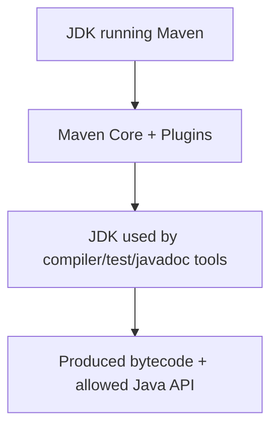
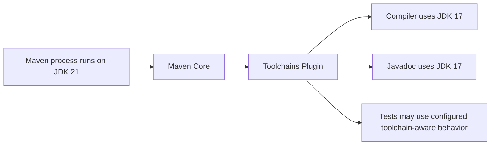
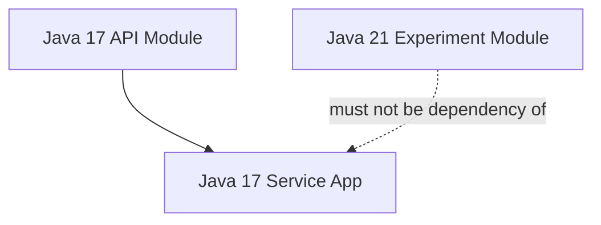
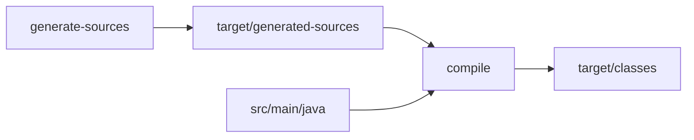
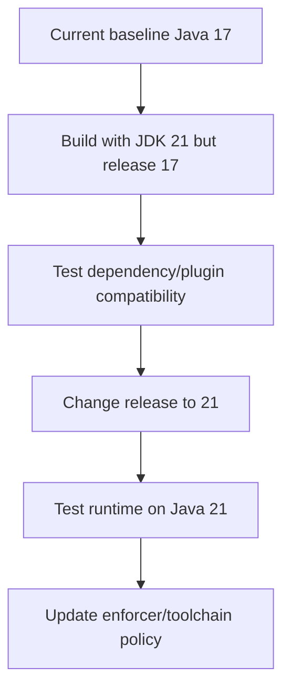

# Part 020 — Compiler, Toolchains, and Java Version Strategy

> Target: setelah bagian ini, kamu bisa mendesain strategi Java version di Maven secara production-grade: compiler config benar, runtime target jelas, toolchain reproducible, CI konsisten, dan multi-module build tidak diam-diam memakai JDK yang salah.

Banyak developer mengira konfigurasi Java version di Maven cukup begini:

```xml
<properties>
  <maven.compiler.source>17</maven.compiler.source>
  <maven.compiler.target>17</maven.compiler.target>
</properties>
```

Untuk project kecil, ini tampak cukup.

Untuk sistem besar, pertanyaan sebenarnya lebih banyak:

- JDK apa yang menjalankan Maven?
- JDK apa yang dipakai `javac` untuk compile?
- bytecode target versi berapa?
- API Java versi berapa yang boleh dipakai?
- test dijalankan dengan JDK apa?
- javadoc dibuat dengan JDK apa?
- annotation processor kompatibel dengan JDK apa?
- CI runner punya JDK apa saja?
- library module boleh memakai Java 21 sementara service runtime Java 17?
- apakah parent POM memaksa version yang sama untuk semua module?

Maven compiler strategy bukan sekadar syntax POM. Ini adalah **compatibility contract**.

---

## 1. Mental Model: Tiga Layer Java Version

Dalam build Maven, minimal ada tiga layer yang harus dipisah.



Layer 1: **JDK yang menjalankan Maven**

```bash
java -version
mvn -version
```

Ini menentukan JVM untuk Maven process dan plugin execution.

Layer 2: **JDK tool yang dipakai plugin**

Compiler, Surefire, Failsafe, Javadoc, dan plugin lain bisa memakai toolchain.

Layer 3: **Target language/API/bytecode**

Ini ditentukan oleh compiler configuration, terutama `--release` untuk JDK modern.

Kesalahan umum adalah menyamakan ketiganya.

Contoh:

> “CI pakai JDK 21, jadi artifact Java 17 aman.”

Belum tentu. Kalau compiler tidak dikonfigurasi dengan benar, code bisa tidak sengaja memakai API Java 21 dan gagal di runtime Java 17.

---

## 2. Maven Compiler Plugin: Peran Utama

`maven-compiler-plugin` bertugas compile source Java project. Secara praktis, konfigurasi inilah yang menentukan source compatibility dan target output.

Minimal production-grade config untuk Java 17:

```xml
<properties>
  <maven.compiler.release>17</maven.compiler.release>
</properties>

<build>
  <pluginManagement>
    <plugins>
      <plugin>
        <groupId>org.apache.maven.plugins</groupId>
        <artifactId>maven-compiler-plugin</artifactId>
        <version>${maven-compiler-plugin.version}</version>
        <configuration>
          <release>${maven.compiler.release}</release>
        </configuration>
      </plugin>
    </plugins>
  </pluginManagement>
</build>
```

Parent properties:

```xml
<properties>
  <maven-compiler-plugin.version>3.13.0</maven-compiler-plugin.version>
  <maven.compiler.release>17</maven.compiler.release>
</properties>
```

Di organisasi besar, version plugin bisa lebih baru sesuai platform governance. Yang penting: **jangan implicit**.

---

## 3. `source`/`target` vs `release`

Ada dua pendekatan umum.

Pendekatan lama:

```xml
<properties>
  <maven.compiler.source>8</maven.compiler.source>
  <maven.compiler.target>8</maven.compiler.target>
</properties>
```

Ini memberi tahu compiler:

- source syntax level,
- target bytecode level.

Tetapi ada jebakan: `source`/`target` tidak otomatis mencegah penggunaan API dari JDK yang lebih baru jika build berjalan dengan JDK baru.

Contoh:

- compile berjalan di JDK 17,
- `source=8`, `target=8`,
- code tidak sengaja memakai API yang tidak ada di Java 8,
- compile bisa lolos dalam beberapa skenario,
- runtime Java 8 gagal.

Pendekatan modern:

```xml
<properties>
  <maven.compiler.release>8</maven.compiler.release>
</properties>
```

`--release` memberi batas lebih kuat: language rules, generated class target, dan public API sesuai release yang dituju.

Rule praktis:

> Untuk JDK 9+ compiler, gunakan `release` daripada kombinasi `source`/`target`, kecuali ada alasan legacy yang jelas.

---

## 4. Compatibility Matrix

| Build JDK | Target Runtime | Recommended Compiler Config | Catatan |
|---:|---:|---|---|
| 17 | 17 | `<release>17</release>` | Baseline modern stabil. |
| 21 | 17 | `<release>17</release>` | Aman jika toolchain/plugin konsisten. |
| 21 | 21 | `<release>21</release>` | Semua runtime harus Java 21. |
| 11 | 8 | `<release>8</release>` | Bisa untuk legacy target. |
| 8 | 8 | `source/target 8` | JDK 8 tidak punya `--release`. |
| 17 | 8 | `<release>8</release>` | Umum untuk library legacy compatibility. |

Kunci matrix:

- Build JDK boleh lebih tinggi dari target runtime.
- Target runtime harus mampu menjalankan bytecode hasil compile.
- `--release` menjaga agar API tidak melampaui target.
- Toolchain memastikan plugin memakai JDK yang benar, bukan sekadar JDK yang kebetulan aktif.

---

## 5. `mvn -version` adalah Diagnostic Wajib

Setiap build incident terkait Java version harus mulai dari:

```bash
mvn -version
```

Output penting:

```txt
Apache Maven ...
Java version: 21.0.x, vendor: ...
Java home: /path/to/jdk-21
Default locale: ...
OS name: ...
```

Ini menjawab:

- Maven dijalankan oleh JDK apa?
- JAVA_HOME menunjuk ke mana?
- apakah CI runner benar?
- apakah local developer memakai JDK berbeda?

Tetapi ingat: jika toolchains aktif, compiler bisa memakai JDK berbeda dari JDK yang menjalankan Maven.

Karena itu, diagnostic lanjutannya adalah membaca compiler log atau toolchain selection.

---

## 6. Maven Toolchains: Pisahkan JDK untuk Maven dari JDK untuk Build Tool

Maven Toolchains memungkinkan plugin memakai tool tertentu secara konsisten, misalnya JDK untuk compiler, surefire, dan javadoc, terlepas dari JRE/JDK yang menjalankan Maven process.

Mental model:



Ini berguna saat:

- Maven harus berjalan di JDK baru,
- project harus dikompilasi dengan JDK tertentu,
- CI runner punya banyak JDK,
- multi-module build butuh version berbeda,
- developer laptop tidak boleh bergantung pada `JAVA_HOME` manual.

---

## 7. `toolchains.xml`

File user-level:

```txt
~/.m2/toolchains.xml
```

Contoh:

```xml
<?xml version="1.0" encoding="UTF-8"?>
<toolchains>
  <toolchain>
    <type>jdk</type>
    <provides>
      <version>17</version>
      <vendor>any</vendor>
    </provides>
    <configuration>
      <jdkHome>/opt/jdks/jdk-17</jdkHome>
    </configuration>
  </toolchain>

  <toolchain>
    <type>jdk</type>
    <provides>
      <version>21</version>
      <vendor>any</vendor>
    </provides>
    <configuration>
      <jdkHome>/opt/jdks/jdk-21</jdkHome>
    </configuration>
  </toolchain>
</toolchains>
```

Project POM bisa meminta JDK tertentu:

```xml
<plugin>
  <groupId>org.apache.maven.plugins</groupId>
  <artifactId>maven-toolchains-plugin</artifactId>
  <version>${maven-toolchains-plugin.version}</version>
  <executions>
    <execution>
      <goals>
        <goal>toolchain</goal>
      </goals>
    </execution>
  </executions>
  <configuration>
    <toolchains>
      <jdk>
        <version>17</version>
        <vendor>any</vendor>
      </jdk>
    </toolchains>
  </configuration>
</plugin>
```

Compiler plugin kemudian bisa memakai toolchain yang disediakan.

Important boundary:

- `toolchains.xml` berisi lokasi lokal JDK,
- POM berisi requirement,
- CI menyediakan file toolchains sesuai runner,
- artifact tidak bergantung pada path lokal developer.

---

## 8. Toolchains vs `JAVA_HOME`

Tanpa toolchains:

```bash
export JAVA_HOME=/opt/jdk-17
mvn clean verify
```

Kelemahan:

- mudah salah di developer laptop,
- mudah salah di CI matrix,
- Maven process dan compiler selalu terkait ke `JAVA_HOME`,
- multi-JDK scenario sulit.

Dengan toolchains:

```bash
export JAVA_HOME=/opt/jdk-21
mvn clean verify
```

Maven berjalan di JDK 21, tetapi compiler bisa diminta memakai JDK 17.

Ini membuat boundary lebih eksplisit.

Namun toolchains menambah operational complexity:

- semua developer/CI harus punya toolchains file,
- path JDK harus dikelola,
- debugging butuh memahami selected toolchain,
- tidak semua plugin support toolchains sama baiknya.

Rule:

> Untuk single-JDK service sederhana, `JAVA_HOME` + compiler `release` cukup. Untuk enterprise/multi-JDK/build platform, gunakan toolchains.

---

## 9. Enforce Java and Maven Version

Konfigurasi compiler belum cukup. Kamu juga harus menolak build yang berjalan di versi Maven/JDK yang salah.

Gunakan Maven Enforcer Plugin di parent POM:

```xml
<plugin>
  <groupId>org.apache.maven.plugins</groupId>
  <artifactId>maven-enforcer-plugin</artifactId>
  <version>${maven-enforcer-plugin.version}</version>
  <executions>
    <execution>
      <id>enforce-build-environment</id>
      <phase>validate</phase>
      <goals>
        <goal>enforce</goal>
      </goals>
      <configuration>
        <rules>
          <requireMavenVersion>
            <version>[3.9.0,)</version>
          </requireMavenVersion>
          <requireJavaVersion>
            <version>[17,)</version>
          </requireJavaVersion>
        </rules>
      </configuration>
    </execution>
  </executions>
</plugin>
```

Ini menjawab:

- minimum Maven untuk build platform,
- minimum JDK untuk menjalankan Maven,
- failure lebih cepat di phase `validate`,
- developer tidak menunggu compile/test lama sebelum gagal.

Tetapi hati-hati: `requireJavaVersion` mengecek Java yang menjalankan Maven, bukan selalu JDK toolchain compiler. Untuk target bytecode/API, tetap gunakan compiler `release` dan/atau toolchains.

---

## 10. Parent POM Java Version Policy

Untuk organisasi besar, jangan biarkan setiap service mengarang compiler config.

Parent POM:

```xml
<properties>
  <java.baseline.version>17</java.baseline.version>
  <maven.compiler.release>${java.baseline.version}</maven.compiler.release>
  <maven-compiler-plugin.version>3.13.0</maven-compiler-plugin.version>
  <maven-toolchains-plugin.version>3.2.0</maven-toolchains-plugin.version>
</properties>

<build>
  <pluginManagement>
    <plugins>
      <plugin>
        <groupId>org.apache.maven.plugins</groupId>
        <artifactId>maven-compiler-plugin</artifactId>
        <version>${maven-compiler-plugin.version}</version>
        <configuration>
          <release>${maven.compiler.release}</release>
          <encoding>${project.build.sourceEncoding}</encoding>
        </configuration>
      </plugin>
    </plugins>
  </pluginManagement>
</build>
```

Child module biasanya tidak perlu mendefinisikan ulang compiler plugin.

Jika ada module khusus:

```xml
<properties>
  <maven.compiler.release>21</maven.compiler.release>
</properties>
```

Tetapi ini harus dianggap architectural decision, bukan convenience.

Pertanyaan review:

- Apakah module ini deployable sendiri?
- Apakah semua runtime support Java 21?
- Apakah module ini library yang dikonsumsi Java 17 service?
- Apakah dependency direction memungkinkan bytecode lebih baru bocor ke module Java 17?
- Apakah CI matrix menguji target runtime yang benar?

---

## 11. Multi-Module Java Version Strategy

Ada beberapa pattern.

### Pattern A — Single Baseline

Semua module Java 17.

```txt
root
  parent-pom       Java 17 policy
  api              Java 17
  domain           Java 17
  app              Java 17
  adapter          Java 17
```

Ini paling sederhana dan paling defensible.

Cocok untuk:

- enterprise services,
- regulated systems,
- teams besar,
- platform yang mengutamakan operability.

### Pattern B — Library Lower Baseline, App Higher Runtime

```txt
root
  common-lib       Java 11
  api-client       Java 11
  service-app      Java 17
```

Cocok jika library dipakai banyak consumer lama.

Risiko:

- developer tidak sadar memakai API Java 17 di library Java 11,
- dependency library membawa bytecode lebih tinggi,
- test lokal lolos karena runtime lebih baru.

Butuh enforcer/bytecode check tambahan.

### Pattern C — Experimental Higher-JDK Module

```txt
root
  platform-parent  Java 17 default
  service-app      Java 17
  ml-experiment    Java 21
```

Ini bisa diterima jika module tidak menjadi dependency module Java 17.

Gunakan dependency direction yang jelas:



---

## 12. Dependency Bytecode Compatibility

Compiler `release` mengontrol code kamu. Tetapi dependency bisa punya bytecode lebih tinggi.

Contoh:

- project target Java 17,
- dependency baru dikompilasi untuk Java 21,
- compile mungkin gagal atau runtime gagal tergantung scenario.

Maven dependency resolution tidak otomatis memilih artifact berdasarkan bytecode compatibility.

Yang dibutuhkan:

- dependency governance,
- BOM yang sesuai baseline,
- enforcer rules tambahan,
- bytecode scanning plugin bila perlu,
- CI runtime test pada JDK target.

Senior rule:

> Java baseline bukan hanya compiler setting. Ia juga constraint dependency ecosystem.

Saat upgrade library, cek:

- minimum Java version library,
- transitive dependency minimum version,
- framework baseline,
- container runtime JDK,
- app server JDK jika WAR/EAR.

---

## 13. Annotation Processing dan Compiler Boundary

Annotation processor berjalan saat compile.

Contoh:

- MapStruct,
- Lombok,
- Immutables,
- AutoService,
- JPA metamodel generator,
- QueryDSL generator.

Compiler config harus memisahkan dependency runtime dan annotation processor dependency.

Pattern:

```xml
<plugin>
  <groupId>org.apache.maven.plugins</groupId>
  <artifactId>maven-compiler-plugin</artifactId>
  <configuration>
    <release>${maven.compiler.release}</release>
    <annotationProcessorPaths>
      <path>
        <groupId>org.mapstruct</groupId>
        <artifactId>mapstruct-processor</artifactId>
        <version>${mapstruct.version}</version>
      </path>
    </annotationProcessorPaths>
  </configuration>
</plugin>
```

Kenapa penting?

- processor tidak perlu menjadi runtime dependency,
- compile classpath lebih bersih,
- generated source lebih predictable,
- supply-chain review lebih jelas,
- dependency tree runtime tidak tercemar processor.

Failure mode:

- processor butuh JDK lebih tinggi dari compiler target,
- generated code memakai API lebih tinggi,
- Lombok/plugin tidak kompatibel dengan JDK baru,
- incremental build lokal menyembunyikan generated source lama.

Diagnosis:

```bash
mvn -X compile
mvn dependency:tree
rm -rf target generated-sources
mvn clean compile
```

---

## 14. Generated Sources dan Compiler Plugin

Generated source biasanya masuk ke:

```txt
target/generated-sources/annotations
```

Maven Compiler Plugin menambahkan generated annotation source secara standar untuk annotation processing.

Untuk generator lain, seperti OpenAPI, JAXB, Protobuf, atau custom generator, boundary-nya akan dibahas lebih dalam di Part 026. Tetapi Java version strategy sudah harus jelas di sini:

- generator berjalan dengan JDK apa?
- generated source target Java berapa?
- generated code memakai API apa?
- generated source masuk phase mana?
- compile menunggu generate-sources atau tidak?

Diagram:



Kalau generated source memakai syntax Java 21 tetapi project release 17, compile harus gagal. Jika tidak gagal, build policy salah.

---

## 15. Test Runtime JDK

Compile target Java 17 belum tentu test berjalan di Java 17.

Jika CI menjalankan Maven di JDK 21, Surefire test juga bisa berjalan di JDK 21 kecuali dikonfigurasi/diatur.

Risiko:

- test lolos di JDK 21,
- production runtime Java 17 gagal,
- dependency behavior berbeda,
- illegal access warning/error berbeda,
- TLS/security provider behavior berbeda.

Pattern aman:

- CI matrix menjalankan test pada target runtime JDK,
- Maven toolchains dipakai jika perlu,
- Docker test image memakai runtime yang sama,
- integration test berjalan di environment sedekat mungkin dengan production.

Minimal CI matrix:

```yaml
strategy:
  matrix:
    java: [17]
```

Untuk library:

```yaml
strategy:
  matrix:
    java: [17, 21]
```

Library sering perlu diuji di baseline minimum dan latest LTS.

---

## 16. Java Version Upgrade Playbook

Misal upgrade dari Java 17 ke Java 21.

Jangan mulai dari mengganti Docker base image saja.

Urutan yang lebih aman:

1. Inventarisasi module dan runtime.
2. Pastikan Maven/plugin mendukung JDK baru.
3. Upgrade CI image untuk test branch.
4. Jalankan `mvn -version` di CI.
5. Update compiler release jika target bytecode berubah.
6. Update toolchain requirement bila dipakai.
7. Jalankan unit/integration tests.
8. Cek dependency compatibility.
9. Cek annotation processors.
10. Cek javadoc/doclint behavior.
11. Cek Docker/runtime base image.
12. Cek app server/container compatibility.
13. Roll out service by service.
14. Tambahkan enforcer rule baru setelah migrasi stabil.

Diagram migration:



Langkah B penting. Ia memisahkan:

- apakah build toolchain kompatibel dengan JDK baru,
- apakah application code siap menargetkan release baru.

Jangan mencampur dua perubahan besar sekaligus.

---

## 17. Maven 3 vs Maven 4 Implication

Maven 4 membawa perubahan model dan runtime requirement yang lebih modern. Untuk seri ini, strategi aman adalah:

- baseline produksi tetap Maven 3.9.x jika organisasi belum migrate,
- pin Maven Wrapper atau CI Maven version,
- uji Maven 4 di branch/matrix terpisah,
- pastikan plugin kompatibel,
- review warning model POM,
- jangan upgrade Maven core dan Java target dalam satu PR besar.

Build platform sebaiknya punya compatibility matrix:

| Dimension | Current | Candidate | Evidence |
|---|---|---|---|
| Maven | 3.9.x | 4.x | full reactor build |
| Build JDK | 17 | 21 | CI matrix |
| Target release | 17 | 21 | compiler + runtime tests |
| Plugin set | pinned | upgraded | plugin compatibility test |

Prinsipnya:

> Upgrade Maven, upgrade JDK, dan upgrade target bytecode adalah tiga perubahan berbeda.

---

## 18. Maven Wrapper

Untuk mengontrol Maven version, banyak tim memakai Maven Wrapper:

```bash
./mvnw clean verify
```

Manfaat:

- developer tidak perlu install Maven manual,
- CI memakai Maven version yang sama,
- onboarding lebih mudah,
- build evidence lebih konsisten.

Tetapi Maven Wrapper tidak menggantikan JDK management.

Kamu tetap butuh:

- JDK installation policy,
- `JAVA_HOME` atau toolchains,
- compiler release,
- enforcer rule.

Boundary:

```txt
Maven Wrapper -> controls Maven distribution
Toolchains/JAVA_HOME -> controls JDK/tool execution
Compiler config -> controls target release
```

---

## 19. Common Failure Modes

### Failure 1 — `invalid target release`

Symptom:

```txt
error: invalid target release: 21
```

Likely cause:

- Maven berjalan dengan JDK yang lebih tua,
- compiler tidak bisa target release tersebut,
- CI JAVA_HOME salah.

Diagnosis:

```bash
mvn -version
java -version
```

Fix:

- pakai JDK yang mendukung target release,
- update CI setup,
- update toolchains.

### Failure 2 — `UnsupportedClassVersionError`

Symptom:

```txt
java.lang.UnsupportedClassVersionError: class file version ...
```

Likely cause:

- artifact dikompilasi untuk Java lebih tinggi dari runtime,
- dependency membawa bytecode lebih tinggi,
- Docker/runtime base image salah.

Diagnosis:

```bash
javap -verbose target/classes/com/example/App.class | grep 'major'
java -version
mvn dependency:tree
```

Fix:

- turunkan compiler release,
- upgrade runtime,
- pilih dependency versi sesuai baseline.

### Failure 3 — Compile lolos, runtime gagal karena API tidak ada

Likely cause:

- memakai `source/target` tanpa `release`,
- compile dengan JDK baru untuk runtime lama.

Fix:

- gunakan `<release>`.

### Failure 4 — Local build beda dari CI

Likely cause:

- developer JAVA_HOME beda,
- CI memakai Maven/JDK beda,
- toolchains tidak tersedia,
- plugin version implicit.

Fix:

- Maven Wrapper,
- Enforcer,
- Toolchains,
- pluginManagement.

### Failure 5 — Annotation processor break setelah JDK upgrade

Likely cause:

- processor belum support JDK baru,
- compiler internals berubah,
- Lombok/MapStruct/plugin versi lama.

Fix:

- upgrade processor,
- isolate annotationProcessorPaths,
- test clean compile.

---

## 20. Diagnostic Commands

Basic:

```bash
mvn -version
java -version
echo $JAVA_HOME
```

Effective POM:

```bash
mvn help:effective-pom -Doutput=effective-pom.xml
```

Compiler debug:

```bash
mvn -X compile
```

Dependency tree:

```bash
mvn dependency:tree
```

Class file version:

```bash
javap -verbose target/classes/com/example/App.class | grep 'major version'
```

Toolchain investigation:

```bash
mvn -X validate
```

Clean-room build:

```bash
rm -rf ~/.m2/repository/com/company
mvn -U clean verify
```

---

## 21. Enterprise Policy Template

A strong enterprise Maven Java policy should say:

```txt
1. All deployable services target Java 17 unless explicitly approved.
2. The Maven Compiler Plugin must use <release>, not source/target, for JDK 9+ builds.
3. Maven and plugin versions must be pinned through parent pluginManagement.
4. CI must print mvn -version in every build.
5. CI must use Maven Wrapper or approved Maven distribution.
6. Toolchains are required for builds that need more than one JDK.
7. Library modules consumed by older services must not raise baseline without owner approval.
8. Runtime container JDK must match or exceed artifact target bytecode.
9. Annotation processors must be declared via annotationProcessorPaths when supported.
10. Java baseline upgrades require dependency, plugin, runtime, and CI evidence.
```

This is not bureaucracy. It prevents accidental platform fragmentation.

---

## 22. Reference Parent POM Snippet

```xml
<project>
  <modelVersion>4.0.0</modelVersion>

  <groupId>com.company.platform</groupId>
  <artifactId>company-service-parent</artifactId>
  <version>1.0.0</version>
  <packaging>pom</packaging>

  <properties>
    <project.build.sourceEncoding>UTF-8</project.build.sourceEncoding>
    <java.baseline.version>17</java.baseline.version>
    <maven.compiler.release>${java.baseline.version}</maven.compiler.release>

    <maven-compiler-plugin.version>3.13.0</maven-compiler-plugin.version>
    <maven-enforcer-plugin.version>3.5.0</maven-enforcer-plugin.version>
    <maven-toolchains-plugin.version>3.2.0</maven-toolchains-plugin.version>
  </properties>

  <build>
    <pluginManagement>
      <plugins>
        <plugin>
          <groupId>org.apache.maven.plugins</groupId>
          <artifactId>maven-compiler-plugin</artifactId>
          <version>${maven-compiler-plugin.version}</version>
          <configuration>
            <release>${maven.compiler.release}</release>
            <encoding>${project.build.sourceEncoding}</encoding>
          </configuration>
        </plugin>

        <plugin>
          <groupId>org.apache.maven.plugins</groupId>
          <artifactId>maven-toolchains-plugin</artifactId>
          <version>${maven-toolchains-plugin.version}</version>
        </plugin>

        <plugin>
          <groupId>org.apache.maven.plugins</groupId>
          <artifactId>maven-enforcer-plugin</artifactId>
          <version>${maven-enforcer-plugin.version}</version>
        </plugin>
      </plugins>
    </pluginManagement>
  </build>
</project>
```

Child service:

```xml
<project>
  <parent>
    <groupId>com.company.platform</groupId>
    <artifactId>company-service-parent</artifactId>
    <version>1.0.0</version>
  </parent>

  <artifactId>case-service</artifactId>
</project>
```

The child inherits Java baseline without repeating compiler config.

---

## 23. Practice Lab

### Lab 1 — Prove `release`

Create code that uses an API introduced after Java 8. Configure:

```xml
<maven.compiler.release>8</maven.compiler.release>
```

Run:

```bash
mvn clean compile
```

Observe compile failure. That is good: the build caught incompatible API usage.

### Lab 2 — Compare `source/target` vs `release`

Switch to:

```xml
<maven.compiler.source>8</maven.compiler.source>
<maven.compiler.target>8</maven.compiler.target>
```

Build with newer JDK. Observe differences. The lesson is not “always fails” or “always passes”; the lesson is that `release` encodes the intended API boundary more directly.

### Lab 3 — Add Enforcer

Add Enforcer rule requiring Maven and Java version. Run build with wrong JDK if available. Confirm failure happens in `validate`.

### Lab 4 — Toolchain Selection

Create `~/.m2/toolchains.xml` with JDK 17 and JDK 21. Configure project to request JDK 17. Run Maven with JAVA_HOME pointing to JDK 21. Confirm compiler uses requested toolchain.

### Lab 5 — Bytecode Inspection

Compile project and run:

```bash
javap -verbose target/classes/com/example/App.class | grep 'major version'
```

Map major version to Java release and confirm it matches expectation.

---

## 24. Senior Engineer Heuristics

During PR/build review:

- If POM uses `source`/`target` for modern JDK, ask why not `release`.
- If compiler plugin version is missing, block or request parent `pluginManagement`.
- If service raises Java baseline, ask for runtime/container evidence.
- If library raises Java baseline, ask for consumer impact analysis.
- If Maven runs on one JDK but target is another, verify toolchain or `release`.
- If annotation processor is normal dependency, ask if it belongs in `annotationProcessorPaths`.
- If CI does not print `mvn -version`, add it.
- If local and CI disagree, inspect JAVA_HOME, toolchains, and effective POM before guessing.

The point is not to memorize plugin syntax. The point is to preserve compatibility invariants.

---

## 25. Ringkasan

Java version strategy in Maven has three separate contracts:

```txt
Maven runtime JDK  -> JVM running Maven and plugins
Toolchain JDK      -> JDK selected for compiler/javadoc/test tools
Compiler release   -> language/API/bytecode target
```

A production-grade Maven build should:

- use Maven Compiler Plugin explicitly,
- prefer `<release>` over `source`/`target` for JDK 9+ builds,
- pin plugin versions,
- enforce Maven/JDK minimums,
- use toolchains when multiple JDKs are involved,
- test on the target runtime JDK,
- govern dependency bytecode compatibility,
- treat Java baseline changes as architectural changes.

After this part, you should be able to diagnose Java version problems structurally instead of trial-and-error changing `JAVA_HOME`.

---

## References

- Apache Maven Compiler Plugin — Introduction: https://maven.apache.org/plugins/maven-compiler-plugin/
- Apache Maven Compiler Plugin — Setting the --release of the Java Compiler: https://maven.apache.org/plugins/maven-compiler-plugin/examples/set-compiler-release.html
- Apache Maven Compiler Plugin — Setting -source and -target: https://maven.apache.org/plugins/maven-compiler-plugin/examples/set-compiler-source-and-target.html
- Apache Maven Toolchains Plugin — Introduction: https://maven.apache.org/plugins/maven-toolchains-plugin/
- Apache Maven Toolchains Plugin — JDK Toolchain: https://maven.apache.org/plugins/maven-toolchains-plugin/toolchains/jdk.html
- Apache Maven Enforcer Plugin: https://maven.apache.org/enforcer/maven-enforcer-plugin/
