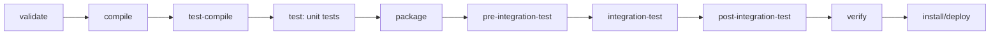
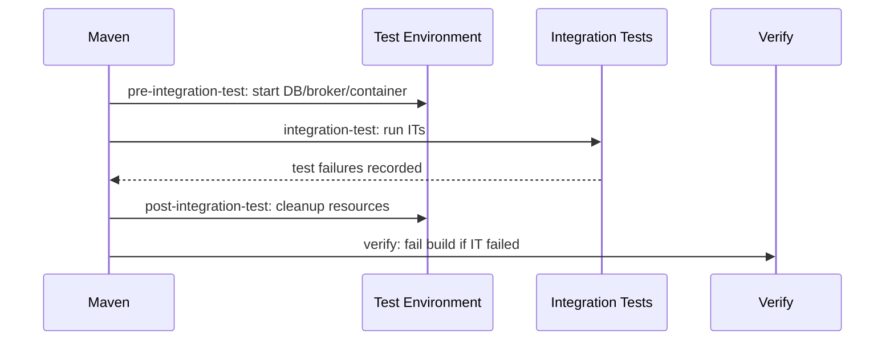
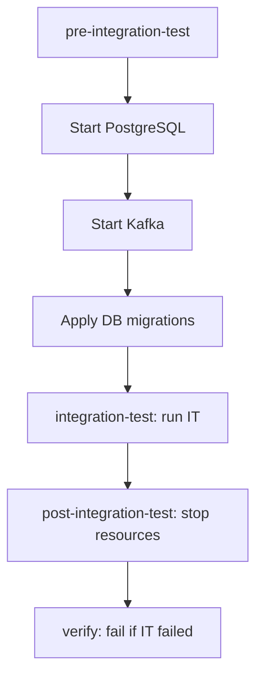
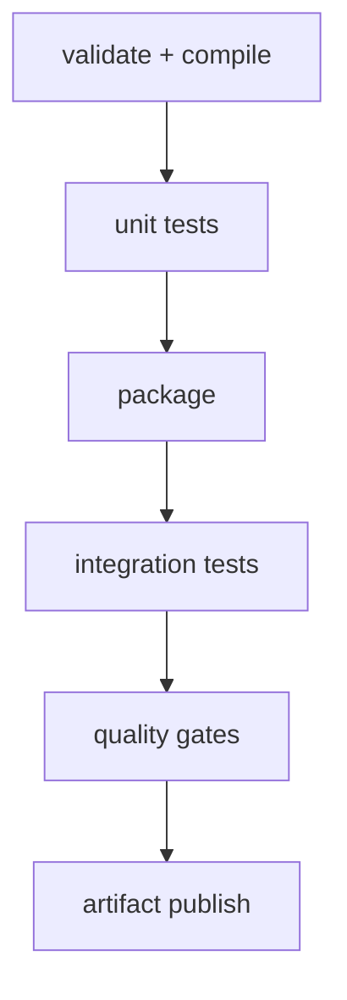
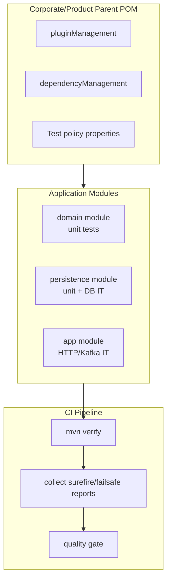

# Part 021 — Testing with Surefire and Failsafe

> Target: setelah bagian ini, kamu bisa mendesain testing lifecycle Maven yang jelas: unit test cepat di `test`, integration test di `verify`, environment test dibersihkan dengan aman, hasil test terbaca oleh CI, dan build tidak rusak karena konfigurasi test yang ambigu.

Maven testing sering terlihat sederhana:

```bash
mvn test
```

atau:

```bash
mvn verify
```

Tapi di project besar, pertanyaan sebenarnya bukan “bagaimana menjalankan test”. Pertanyaannya:

- test mana yang boleh jalan di phase apa?
- test mana yang butuh database, broker, container, atau service eksternal?
- kapan environment test dibuat dan dihancurkan?
- bagaimana CI membedakan unit failure, integration failure, dan environment failure?
- apakah parallel test aman?
- apakah test isolation dijaga?
- bagaimana menangani flaky test tanpa menyembunyikan bug?
- apakah module-level test report masih bisa dibaca ketika build parallel?
- apakah `mvn integration-test` aman dijalankan langsung?

Di Maven, jawaban senior-level-nya adalah: **testing adalah bagian dari lifecycle contract, bukan command acak.**

---

## 1. Mental Model: Test sebagai Build Gate

Build Maven production-grade punya beberapa gate.



Unit test dan integration test tidak hanya beda nama. Mereka punya **lifecycle semantics** berbeda.

| Test Type | Maven Phase | Plugin | Should Be Fast? | External Resource? | Build Gate |
|---|---:|---|---:|---:|---|
| Unit test | `test` | Surefire | Yes | No | compile correctness + local logic |
| Integration test | `integration-test` + `verify` | Failsafe | Not always | Often yes | assembled system correctness |
| Contract/schema test | usually `test` or `verify` | Surefire/Failsafe | Depends | Maybe | interface compatibility |
| End-to-end smoke test | usually external pipeline | sometimes Failsafe | No | Yes | deployment confidence |
| Performance test | usually separate job | custom | No | Yes | capacity/regression signal |

Maven tidak otomatis tahu mana unit test dan mana integration test. Kamu harus membuat boundary eksplisit lewat naming convention, plugin configuration, dan lifecycle binding.

---

## 2. Surefire vs Failsafe

### Surefire

`maven-surefire-plugin` menjalankan test di phase `test`.

Secara mental:

```txt
compile code
compile test code
run fast tests
fail early if unit behavior broken
```

Surefire cocok untuk:

- pure unit test,
- slice test ringan,
- class-level behavior test,
- fast contract test yang tidak membutuhkan environment eksternal,
- test yang aman dijalankan setiap build lokal.

### Failsafe

`maven-failsafe-plugin` dipakai untuk integration test di phase `integration-test` dan `verify`.

Perbedaannya kritis: Failsafe tidak langsung mem-fail build di phase `integration-test`, supaya phase `post-integration-test` tetap sempat berjalan untuk cleanup. Failure kemudian diverifikasi di `verify`.



Konsekuensi praktis:

```bash
# correct for integration tests
mvn verify

# dangerous if environment setup/cleanup is bound around integration-test
mvn integration-test
```

Memanggil `integration-test` langsung bisa meninggalkan resource test menggantung, karena `post-integration-test` dan `verify` belum tentu berjalan sebagai intended gate.

---

## 3. Naming Convention sebagai Routing Rule

Default convention yang umum:

| File Pattern | Meaning | Plugin |
|---|---|---|
| `*Test.java` | unit test | Surefire |
| `Test*.java` | unit test | Surefire |
| `*TestCase.java` | unit test | Surefire |
| `*IT.java` | integration test | Failsafe |
| `IT*.java` | integration test | Failsafe |
| `*ITCase.java` | integration test | Failsafe |

Rule yang bagus harus membuat developer bisa tahu tujuan test dari namanya.

Contoh:

```txt
src/test/java/com/acme/pricing/MoneyTest.java
src/test/java/com/acme/pricing/DiscountPolicyTest.java
src/test/java/com/acme/pricing/PricingRepositoryIT.java
src/test/java/com/acme/pricing/PricingApiIT.java
```

Jangan campur:

```txt
PricingServiceTest.java       # but starts PostgreSQL
OrderWorkflowTest.java        # but waits for Kafka
SettlementIntegrationTest.java # maybe Surefire catches it accidentally
```

Nama test adalah **build routing metadata**.

---

## 4. Baseline Parent POM untuk Testing

Di enterprise Maven, konfigurasi plugin harus dipusatkan di parent POM lewat `pluginManagement`.

```xml
<properties>
  <maven.surefire.version>YOUR_APPROVED_VERSION</maven.surefire.version>
  <junit.jupiter.version>YOUR_APPROVED_VERSION</junit.jupiter.version>
</properties>

<dependencyManagement>
  <dependencies>
    <dependency>
      <groupId>org.junit</groupId>
      <artifactId>junit-bom</artifactId>
      <version>${junit.jupiter.version}</version>
      <type>pom</type>
      <scope>import</scope>
    </dependency>
  </dependencies>
</dependencyManagement>

<build>
  <pluginManagement>
    <plugins>
      <plugin>
        <groupId>org.apache.maven.plugins</groupId>
        <artifactId>maven-surefire-plugin</artifactId>
        <version>${maven.surefire.version}</version>
        <configuration>
          <failIfNoTests>false</failIfNoTests>
          <trimStackTrace>false</trimStackTrace>
          <useModulePath>false</useModulePath>
        </configuration>
      </plugin>

      <plugin>
        <groupId>org.apache.maven.plugins</groupId>
        <artifactId>maven-failsafe-plugin</artifactId>
        <version>${maven.surefire.version}</version>
        <configuration>
          <failIfNoTests>false</failIfNoTests>
          <trimStackTrace>false</trimStackTrace>
          <useModulePath>false</useModulePath>
        </configuration>
        <executions>
          <execution>
            <id>integration-tests</id>
            <goals>
              <goal>integration-test</goal>
              <goal>verify</goal>
            </goals>
          </execution>
        </executions>
      </plugin>
    </plugins>
  </pluginManagement>
</build>
```

Lalu module yang membutuhkan plugin cukup mengaktifkan plugin jika perlu.

```xml
<build>
  <plugins>
    <plugin>
      <groupId>org.apache.maven.plugins</groupId>
      <artifactId>maven-surefire-plugin</artifactId>
    </plugin>
    <plugin>
      <groupId>org.apache.maven.plugins</groupId>
      <artifactId>maven-failsafe-plugin</artifactId>
    </plugin>
  </plugins>
</build>
```

### Kenapa version pakai property?

Karena versi plugin test adalah policy platform. Kamu ingin satu titik kontrol saat:

- upgrade JUnit Platform provider,
- memperbaiki fork crash,
- mengubah XML report behavior,
- mengatur parallelism,
- menyelaraskan CI report parser.

Jangan biarkan setiap service memilih versi Surefire/Failsafe sendiri tanpa alasan.

---

## 5. Dependency Test yang Bersih

Untuk JUnit 5:

```xml
<dependencies>
  <dependency>
    <groupId>org.junit.jupiter</groupId>
    <artifactId>junit-jupiter</artifactId>
    <scope>test</scope>
  </dependency>
</dependencies>
```

Untuk AssertJ:

```xml
<dependency>
  <groupId>org.assertj</groupId>
  <artifactId>assertj-core</artifactId>
  <scope>test</scope>
</dependency>
```

Untuk Mockito:

```xml
<dependency>
  <groupId>org.mockito</groupId>
  <artifactId>mockito-core</artifactId>
  <scope>test</scope>
</dependency>
```

Jika memakai BOM internal:

```xml
<dependency>
  <groupId>com.acme.platform</groupId>
  <artifactId>acme-test-platform</artifactId>
  <version>${acme.platform.version}</version>
  <type>pom</type>
  <scope>import</scope>
</dependency>
```

Pattern yang sehat:

```txt
application module owns test dependencies it actually uses
parent/BOM owns versions
parent owns plugin versions/config defaults
```

Anti-pattern:

```xml
<!-- bad: parent injects test libraries into every module -->
<dependencies>
  <dependency>
    <groupId>org.mockito</groupId>
    <artifactId>mockito-core</artifactId>
    <scope>test</scope>
  </dependency>
</dependencies>
```

Gunakan `dependencyManagement`, bukan inherited `dependencies`, kecuali memang semua module harus punya dependency itu.

---

## 6. Unit Test Boundary

Unit test yang bagus:

- tidak butuh network,
- tidak butuh clock real kecuali explicit,
- tidak butuh database,
- tidak butuh filesystem global,
- tidak bergantung pada urutan test,
- tidak membaca config machine developer,
- deterministic,
- bisa dijalankan sering.

Contoh unit test yang sehat:

```java
class MoneyTest {
    @Test
    void rejectsDifferentCurrencyAddition() {
        Money usd = Money.of("USD", BigDecimal.TEN);
        Money eur = Money.of("EUR", BigDecimal.ONE);

        assertThatThrownBy(() -> usd.plus(eur))
            .isInstanceOf(CurrencyMismatchException.class);
    }
}
```

Contoh unit test yang seharusnya bukan Surefire:

```java
class PricingRepositoryTest {
    @Test
    void savesPrice() {
        // starts real PostgreSQL container
    }
}
```

Nama file ini akan terlihat seperti unit test, tetapi behavior-nya integration test. Rename ke:

```txt
PricingRepositoryIT.java
```

---

## 7. Integration Test Boundary

Integration test boleh mahal, tapi harus jujur.

Integration test cocok untuk:

- repository test dengan database nyata,
- HTTP API test dengan app container,
- Kafka/Redis/PostgreSQL integration,
- transaction boundary,
- serialization/deserialization boundary,
- generated client/server compatibility,
- workflow/process integration.

Contoh:

```txt
PricingRepositoryIT.java
PricingResourceIT.java
OrderKafkaConsumerIT.java
SettlementWorkflowIT.java
```

Jangan jadikan Failsafe sebagai tempat menaruh semua test lambat tanpa struktur. Integration test tetap perlu taxonomy.

```txt
IT categories:
- persistence IT
- HTTP boundary IT
- messaging IT
- workflow IT
- contract compatibility IT
- migration IT
```

---

## 8. Jangan Skip Test secara Sembarangan

Ada beberapa mekanisme skip.

| Property | Effect | Risk |
|---|---|---|
| `-DskipTests` | skip test execution, usually still compile tests | bisa melewati signal penting |
| `-Dmaven.test.skip=true` | skip compiling and running tests | lebih berbahaya |
| custom `-DskipITs` | skip integration tests only if configured | berguna untuk local fast loop |

Pattern yang baik:

```xml
<properties>
  <skipITs>false</skipITs>
</properties>

<plugin>
  <groupId>org.apache.maven.plugins</groupId>
  <artifactId>maven-failsafe-plugin</artifactId>
  <configuration>
    <skipITs>${skipITs}</skipITs>
  </configuration>
</plugin>
```

Lalu:

```bash
# local fast feedback
mvn test

# full verification
mvn verify

# package without integration test for local experiment only
mvn package -DskipITs
```

Enterprise rule:

```txt
CI main branch must not use skipTests.
Release pipeline must not use skipTests.
Emergency bypass must be explicit, audited, and temporary.
```

---

## 9. Forking Strategy

Surefire/Failsafe bisa menjalankan test dalam forked JVM.

Kenapa fork penting?

- isolate static/global state,
- isolate system properties,
- isolate JVM crashes,
- control memory,
- run with agent instrumentation,
- reduce contamination between tests.

Contoh baseline:

```xml
<configuration>
  <forkCount>1</forkCount>
  <reuseForks>true</reuseForks>
  <argLine>-Xmx1024m</argLine>
</configuration>
```

Untuk CI besar:

```xml
<configuration>
  <forkCount>1C</forkCount>
  <reuseForks>true</reuseForks>
  <forkedProcessTimeoutInSeconds>120</forkedProcessTimeoutInSeconds>
</configuration>
```

`1C` berarti relatif terhadap jumlah CPU core. Ini powerful tapi berbahaya jika CI runner juga menjalankan Maven parallel build `-T`.

### Multiplication Trap

```bash
mvn -T 4 verify
```

Dengan:

```xml
<forkCount>2</forkCount>
```

Potensi JVM test concurrent:

```txt
4 Maven module threads × 2 forks = 8 forked test JVMs
```

Jika tiap JVM pakai `-Xmx2g`, kamu baru meminta 16GB heap hanya untuk test forks, belum Maven, compiler, container, DB, dan OS.

Formula praktis:

```txt
max_test_jvms = maven_threads × forkCount_per_module
memory_budget = max_test_jvms × fork_heap + maven_heap + service_containers
```

Jangan tuning test parallelism tanpa menghitung memory.

---

## 10. Parallel Test Execution

Parallel test terlihat seperti cara mudah mempercepat build. Tapi parallelism membuka bug tersembunyi.

Parallel test aman jika test tidak berbagi:

- static mutable state,
- filesystem path yang sama,
- port yang sama,
- database schema yang sama,
- topic/queue yang sama,
- system property global,
- current working directory,
- singleton cache,
- real clock timing assumption.

Contoh konfigurasi:

```xml
<configuration>
  <parallel>classes</parallel>
  <threadCount>4</threadCount>
</configuration>
```

Untuk JUnit 5, parallelism sering lebih baik dikontrol lewat JUnit Platform configuration, bukan hanya Surefire parameter.

Contoh `src/test/resources/junit-platform.properties`:

```properties
junit.jupiter.execution.parallel.enabled=true
junit.jupiter.execution.parallel.mode.default=same_thread
junit.jupiter.execution.parallel.mode.classes.default=concurrent
```

Rule praktis:

```txt
parallelize classes before methods
parallelize stateless tests first
never parallelize shared-container integration tests without isolation model
```

---

## 11. System Properties dan Environment Variables

Test sering butuh property:

```xml
<configuration>
  <systemPropertyVariables>
    <app.env>test</app.env>
    <database.schema>${project.artifactId}_${surefire.forkNumber}</database.schema>
  </systemPropertyVariables>
</configuration>
```

Gunakan property untuk test boundary, bukan rahasia.

Jangan:

```xml
<systemPropertyVariables>
  <db.password>prod-password</db.password>
</systemPropertyVariables>
```

Untuk secret test integration di CI, gunakan secret manager CI dan inject runtime environment secara controlled.

Pattern yang sehat:

```txt
POM declares variable names and safe defaults
CI injects secret values
application test harness reads environment in controlled way
```

---

## 12. `argLine`, Agents, dan JaCoCo Trap

Banyak plugin coverage memakai `argLine` untuk memasang Java agent.

Anti-pattern:

```xml
<argLine>-Xmx1024m</argLine>
```

Jika JaCoCo juga menulis `argLine`, konfigurasi manual bisa menimpa agent.

Pattern lebih aman:

```xml
<argLine>@{argLine} -Xmx1024m</argLine>
```

atau pisahkan property:

```xml
<properties>
  <test.jvm.args>-Xmx1024m</test.jvm.args>
</properties>

<configuration>
  <argLine>@{argLine} ${test.jvm.args}</argLine>
</configuration>
```

Checklist:

```txt
- coverage agent still attached?
- forked JVM receives expected args?
- module path/classpath behavior known?
- Java agent compatible with target JDK?
- CI report includes coverage from all modules?
```

---

## 13. Reports: Signal yang Dibaca Mesin

Surefire report biasanya ada di:

```txt
target/surefire-reports/
```

Failsafe report biasanya ada di:

```txt
target/failsafe-reports/
```

CI harus mengumpulkan report dari semua module:

```txt
**/target/surefire-reports/*.xml
**/target/failsafe-reports/*.xml
```

Senior-level rule:

```txt
A test failure that is not visible in CI UI is a build observability bug.
```

Report harus menjawab:

- test mana gagal?
- module mana?
- phase mana?
- apakah failure test assertion, timeout, fork crash, atau environment setup?
- berapa lama test berjalan?
- apakah flaky/rerun terjadi?

---

## 14. Multi-Module Testing Strategy

Dalam multi-module build:

```txt
root
├── platform-parent
├── platform-bom
├── pricing-domain
├── pricing-api
├── pricing-persistence
├── pricing-service
└── pricing-app
```

Tidak semua module harus punya jenis test yang sama.

| Module | Unit Test | Integration Test | Notes |
|---|---:|---:|---|
| domain | yes | rarely | pure logic |
| api | yes | contract/schema maybe | DTO/schema compatibility |
| persistence | yes | yes | DB IT important |
| service | yes | maybe | mocked boundary + slice |
| app/deployable | yes | yes | HTTP/container IT |

Jangan paksa Failsafe di semua module jika banyak module memang tidak punya IT.

Gunakan:

```xml
<failIfNoTests>false</failIfNoTests>
```

atau aktifkan plugin hanya di module yang butuh.

---

## 15. Integration Test Environment Lifecycle

Contoh lifecycle dengan container plugin/custom script:



Maven phase mapping:

```xml
<execution>
  <id>start-test-environment</id>
  <phase>pre-integration-test</phase>
  <goals>
    <goal>start</goal>
  </goals>
</execution>

<execution>
  <id>stop-test-environment</id>
  <phase>post-integration-test</phase>
  <goals>
    <goal>stop</goal>
  </goals>
</execution>
```

Rule:

```txt
Everything started before integration-test must be stoppable after integration-test.
```

Dan:

```txt
Never require developers to run mvn post-integration-test manually to clean up.
```

---

## 16. Testcontainers dalam Maven Build

Jika memakai Testcontainers, banyak environment lifecycle dipindahkan ke test code.

Kelebihannya:

- dekat dengan test,
- lebih portable,
- tidak perlu bind banyak plugin ke lifecycle,
- cocok untuk module-level integration test.

Risikonya:

- Docker availability menjadi implicit requirement,
- parallel test bisa membuat banyak container,
- image pull membuat CI lambat,
- network flakiness terlihat seperti test failure,
- reusable container bisa mengotori determinism.

Governance:

```txt
- tag integration tests clearly
- separate unit and IT naming
- cache Docker images in CI if allowed
- publish allowed image list
- isolate database/schema/topic per test class or fork
- make container startup logs available in CI artifacts
```

---

## 17. Flaky Test Strategy

Flaky test adalah test yang hasilnya tidak deterministic untuk input/build yang sama.

Sumber umum:

| Cause | Symptom | Fix Direction |
|---|---|---|
| real time | fails around midnight/timezone/DST | inject clock |
| ordering | fails only in suite | remove shared state |
| parallelism | fails with `-T` or fork > 1 | isolate resource |
| network | timeout random | local test double/container |
| async | assertion too early | await with timeout + condition |
| DB | dirty state | transaction/schema isolation |
| port | address already in use | random port allocation |

Surefire/Failsafe mendukung rerun failing tests, tapi ini bukan pengganti fix.

```xml
<configuration>
  <rerunFailingTestsCount>1</rerunFailingTestsCount>
</configuration>
```

Policy yang sehat:

```txt
rerun = diagnostic stabilizer
not = permanent acceptance mechanism
```

Flaky test harus punya SLA:

```txt
- quarantine allowed only with issue link
- owner required
- expiration required
- release-blocking tests cannot be silently quarantined
```

---

## 18. Timeout Strategy

Test tanpa timeout bisa menggantung CI.

Contoh JUnit:

```java
@Test
@Timeout(5)
void completesQuickly() {
    service.calculate();
}
```

Contoh fork timeout:

```xml
<configuration>
  <forkedProcessTimeoutInSeconds>120</forkedProcessTimeoutInSeconds>
  <forkedProcessExitTimeoutInSeconds>30</forkedProcessExitTimeoutInSeconds>
</configuration>
```

Bedakan:

| Timeout | Level | Purpose |
|---|---|---|
| test method timeout | test framework | detect hanging behavior |
| fork timeout | Surefire/Failsafe | kill stuck JVM |
| CI job timeout | pipeline | prevent infra waste |
| container startup timeout | environment | detect dependency readiness issue |

Timeout yang terlalu pendek membuat flaky. Timeout yang tidak ada membuat pipeline rentan hang.

---

## 19. Include/Exclude Pattern

Jika convention default tidak cukup:

```xml
<configuration>
  <includes>
    <include>**/*Test.java</include>
    <include>**/*Spec.java</include>
  </includes>
  <excludes>
    <exclude>**/*IT.java</exclude>
  </excludes>
</configuration>
```

Untuk Failsafe:

```xml
<configuration>
  <includes>
    <include>**/*IT.java</include>
    <include>**/*ITCase.java</include>
  </includes>
</configuration>
```

Tapi jangan terlalu kreatif. Convention yang terlalu banyak membuat developer bingung.

Lebih baik:

```txt
*Test = Surefire
*IT = Failsafe
```

Daripada:

```txt
*Spec, *Feature, *Scenario, *Journey, *E2E, *Component, *Functional, *Slow
```

Kecuali kamu benar-benar punya taxonomy dan CI routing yang jelas.

---

## 20. Test Categories, Tags, dan Groups

JUnit 5 tag:

```java
@Tag("slow")
class PricingRepositoryIT {
}
```

Surefire/Failsafe bisa dikonfigurasi untuk include/exclude groups/tags tergantung provider.

Contoh konsep:

```xml
<configuration>
  <groups>fast</groups>
  <excludedGroups>flaky,manual</excludedGroups>
</configuration>
```

Gunakan tags untuk routing tambahan, bukan mengganti naming convention.

Recommended mental model:

```txt
file name decides plugin/lifecycle
annotation tag decides subset/filter
```

---

## 21. CI Pipeline Pattern

Pipeline sederhana:


Tapi ini compile dua kali. Lebih umum:

```bash
mvn -B -ntp verify
```

Untuk build besar:



Satu command Maven bisa menjalankan semua, tapi pipeline UI bisa tetap memisahkan stage secara logical dengan artifact/cache handoff.

### Baseline CI command

```bash
mvn -B -ntp -Dstyle.color=always verify
```

Keterangan:

- `-B`: batch mode,
- `-ntp`: no transfer progress, log lebih bersih,
- `verify`: lifecycle lengkap sampai verification,
- jangan pakai `install` kecuali butuh publish ke local repo antar job,
- jangan pakai `deploy` di PR validation.

---

## 22. Local Developer Workflow

Developer butuh fast loop.

```bash
# fast unit loop
mvn -q test

# test one class
mvn -Dtest=MoneyTest test

# test one method pattern
mvn -Dtest=MoneyTest#rejectsDifferentCurrencyAddition test

# integration tests only for selected module
mvn -pl pricing-persistence -am verify

# skip integration tests for local package
mvn package -DskipITs
```

Rule:

```txt
Local workflow may optimize speed.
CI workflow must optimize truth.
```

---

## 23. Partial Builds and Test Correctness

Dengan reactor:

```bash
mvn -pl pricing-service -am test
```

Artinya:

- build selected module,
- also make required upstream modules,
- run lifecycle for selected/upstream modules.

Risk:

```bash
mvn -pl pricing-service test
```

Tanpa `-am`, Maven bisa memakai artifact lama dari local repository. Test bisa pass terhadap dependency lama.

Senior habit:

```txt
When testing a module that depends on sibling modules, use -am unless you intentionally want installed artifacts.
```

---

## 24. Failure Diagnostics

### Case 1: Unit test not running

Checklist:

```bash
mvn -X test
mvn help:effective-pom
mvn help:describe -Dplugin=org.apache.maven.plugins:maven-surefire-plugin -Ddetail
```

Check:

- naming pattern,
- plugin included/excluded patterns,
- test class visibility,
- provider detection,
- dependency on test engine,
- `skipTests`,
- profile activation,
- module packaging.

### Case 2: Integration test not running

Check:

```bash
mvn -X verify
```

Then inspect:

```txt
- is failsafe plugin declared under plugins, not only pluginManagement?
- are goals integration-test and verify bound?
- does test class match *IT?
- does selected lifecycle reach verify?
- is skipITs true?
```

### Case 3: `No tests to run`

Could be correct for module with no tests. But in modules that should have tests, check:

```txt
src/test/java location
naming convention
packaging type
active profiles
includes/excludes
```

### Case 4: Forked VM terminated

Common causes:

```txt
- System.exit in test/application code
- JVM crash
- OutOfMemoryError
- native library crash
- killed by CI due to memory
- incompatible javaagent
```

Fix path:

```txt
1. reduce fork/parallelism
2. capture dump/logs
3. increase heap only after identifying leak/usage
4. inspect argLine and javaagent
5. reproduce one test class locally
```

### Case 5: Build hangs after failed IT

Likely environment cleanup problem.

Check:

```txt
- did you run mvn integration-test instead of mvn verify?
- is cleanup bound to post-integration-test?
- does plugin cleanup execute even after failure?
- are forked JVMs/container processes left alive?
```

---

## 25. Test Data Management

Unit test data:

```txt
in-memory builders
explicit fixtures
no shared global mutation
```

Integration test data:

```txt
schema migration baseline
isolated schema/database per class or suite
transaction rollback where possible
explicit cleanup where rollback impossible
unique topic/queue names
random port/resource names
```

Bad pattern:

```txt
all integration tests share acme_test database and assume execution order
```

Better:

```txt
schema = app_module + forkNumber + testClassHash
```

Example:

```xml
<systemPropertyVariables>
  <test.schema>${project.artifactId}_${surefire.forkNumber}</test.schema>
</systemPropertyVariables>
```

---

## 26. Contract Tests in Maven

Contract tests often sit between unit and integration.

Examples:

- OpenAPI request/response schema compatibility,
- JSON serialization compatibility,
- Avro/Protobuf schema compatibility,
- database migration compatibility,
- generated client/server compatibility.

Where to put them?

| Contract Type | Recommended Phase |
|---|---|
| pure schema validation | `test` |
| generated code compatibility | `test` or `verify` |
| provider starts app/server | `verify` |
| requires external broker/db | `verify` |

Rule:

```txt
If it needs a running system boundary, use Failsafe.
If it only checks local artifacts, Surefire is enough.
```

---

## 27. Testing Anti-Patterns

### Anti-pattern 1: All tests under Surefire

```txt
mvn test starts PostgreSQL, Kafka, Redis, and app server
```

Problem:

- local build slow,
- test phase becomes environment phase,
- cleanup semantics weak,
- developers skip tests.

### Anti-pattern 2: All slow tests hidden behind profile

```bash
mvn verify -Pfull-tests
```

Problem:

- default CI may forget profile,
- release may skip real verification,
- lifecycle no longer communicates truth.

Better:

```txt
verify runs required correctness gates
optional expensive suites run in separate job with explicit name
```

### Anti-pattern 3: Parent POM injects all testing libraries

Problem:

- dependency tree noise,
- unused libraries everywhere,
- version conflicts,
- hidden coupling.

### Anti-pattern 4: Rerun flaky tests forever

Problem:

- false confidence,
- failure signal delayed,
- intermittent production bug ignored.

### Anti-pattern 5: Tests depend on local machine config

```txt
~/.aws/credentials
localhost database
developer timezone
installed browser
fixed port 8080
```

Problem:

- works on one machine,
- fails in CI,
- not reproducible.

---

## 28. Reference Testing Architecture



Reference rules:

```txt
1. Parent owns plugin versions and default testing policy.
2. Modules own test dependencies they actually use.
3. *Test routes to Surefire.
4. *IT routes to Failsafe.
5. CI PR validation runs mvn verify unless cost requires explicit staged split.
6. Release validation never skips test gates silently.
7. Test reports are always published.
8. Integration environment is lifecycle-bound and cleaned up.
9. Flaky tests have owner and expiration.
10. Parallelism is calculated, not guessed.
```

---

## 29. Practical Review Checklist

When reviewing a Maven test setup, ask:

```txt
[ ] Are Surefire and Failsafe versions pinned?
[ ] Are plugin versions managed in parent pluginManagement?
[ ] Are unit and integration tests separated by naming convention?
[ ] Is Failsafe bound to both integration-test and verify?
[ ] Does CI call mvn verify for full validation?
[ ] Are skip flags explicit and safe?
[ ] Are test reports collected from all modules?
[ ] Is fork/parallelism compatible with CI memory?
[ ] Are Java agents/argLine composed safely?
[ ] Are external resources isolated and cleaned?
[ ] Are flaky tests tracked instead of normalized?
[ ] Are module partial build commands documented?
[ ] Are test dependencies scoped test and version-managed?
```

---

## 30. Senior-Level Summary

Maven testing mastery is not knowing how to type `mvn test`. It is knowing how to preserve the meaning of every test gate.

The correct mental model:

```txt
Surefire = fast correctness gate for test phase.
Failsafe = integration correctness gate around environment lifecycle and verify phase.
```

The most important rule:

```txt
Unit tests should make compile-time logic trustworthy.
Integration tests should make assembled boundaries trustworthy.
```

And the operational rule:

```txt
Do not let test configuration lie.
```

If a test starts infrastructure, call it an integration test. If a test is required for release confidence, run it in CI. If a test is flaky, treat it as production signal debt. If a build skips tests, make the skip explicit and auditable.

That is how Maven testing becomes an engineering system, not a command habit.
