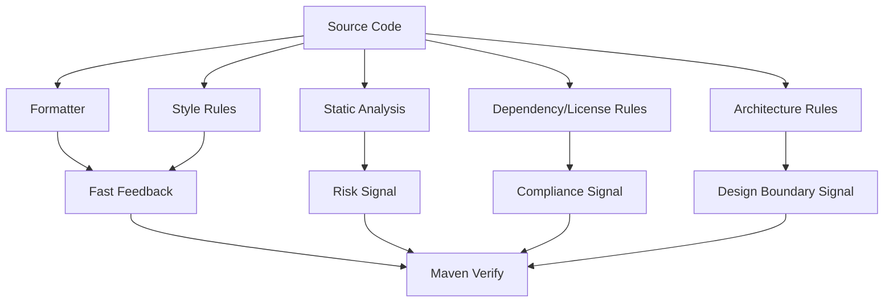
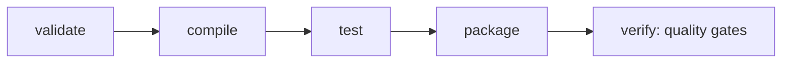

# Part 022 — Code Quality Checks in the Maven Build

> Target: setelah bagian ini, kamu bisa membangun quality gate Maven yang tegas tapi tidak toxic: style konsisten, bug pattern tertangkap, license/header terjaga, static analysis terukur, suppression terkendali, dan CI memberi sinyal yang bisa dipercaya.

Code quality check di Maven sering dipasang seperti checklist:

```xml
<plugin>
  <artifactId>maven-checkstyle-plugin</artifactId>
</plugin>
```

Lalu build mulai gagal karena import order, whitespace, warning lama, false positive, atau plugin lambat.

Team frustrasi. Akhirnya semua orang menjalankan:

```bash
mvn verify -Dcheckstyle.skip -Dpmd.skip -Dspotbugs.skip
```

Itu bukan governance. Itu ritual yang gagal.

Quality checks yang baik harus menjawab:

- aturan apa yang dijaga?
- kenapa aturan itu penting?
- kapan build harus gagal?
- kapan cukup report-only?
- siapa owner suppression?
- apakah rule berlaku untuk semua module?
- apakah generated code dikecualikan?
- apakah CI bisa membedakan style violation, bug pattern, security issue, dan license issue?
- apakah developer bisa memperbaiki masalah secara lokal tanpa trial-and-error?

Quality gate bukan soal membuat build galak. Quality gate adalah **control surface** untuk mengurangi defect, drift, dan review noise.

---

## 1. Mental Model: Quality Checks sebagai Build Control Plane



Ada beberapa jenis quality check. Jangan campur semuanya dalam satu kategori “lint”.

| Check Type | Example Tool | Main Purpose | Typical Failure Mode |
|---|---|---|---|
| formatting | Spotless, formatter plugin | consistent diffs | noisy diffs/review churn |
| style | Checkstyle | coding standard | readability drift |
| bug pattern | SpotBugs | likely defect | nullness/concurrency/resource bug |
| code smell | PMD | suspicious pattern | maintainability risk |
| duplicate code | CPD | duplication detection | copy-paste divergence |
| license/header | license plugin | legal/compliance | missing/invalid header |
| dependency governance | Enforcer/OWASP/etc. | supply-chain policy | banned/vulnerable dependency |
| architecture | ArchUnit/custom tests | boundary control | forbidden package/module dependency |

This part focuses on code quality checks. Dependency governance gets deeper in Part 023 and Part 029.

---

## 2. Lifecycle Placement

Quality checks biasanya masuk `verify`, bukan `compile`.



Kenapa `verify`?

- code sudah compile,
- tests sudah jalan,
- generated sources mungkin sudah dibuat,
- artifact siap diverifikasi,
- CI convention jelas: `mvn verify` = full local verification sebelum publish.

Tapi ada pengecualian:

| Check | Good Phase | Reason |
|---|---|---|
| format check | `validate` or `verify` | bisa cepat fail sebelum compile |
| license header | `validate` or `verify` | tidak butuh compile |
| Checkstyle | `verify` often | source-level rule |
| PMD | `verify` | source analysis, can be slower |
| SpotBugs | `verify` | needs compiled bytecode |
| ArchUnit | `test` | just tests |

Rule praktis:

```txt
Fast deterministic checks can fail early.
Slow or bytecode-based checks belong later.
```

---

## 3. Centralize Plugin Versions in Parent

Parent POM:

```xml
<properties>
  <maven.checkstyle.plugin.version>YOUR_APPROVED_VERSION</maven.checkstyle.plugin.version>
  <maven.pmd.plugin.version>YOUR_APPROVED_VERSION</maven.pmd.plugin.version>
  <spotbugs.maven.plugin.version>YOUR_APPROVED_VERSION</spotbugs.maven.plugin.version>
  <spotless.maven.plugin.version>YOUR_APPROVED_VERSION</spotless.maven.plugin.version>
</properties>

<build>
  <pluginManagement>
    <plugins>
      <plugin>
        <groupId>org.apache.maven.plugins</groupId>
        <artifactId>maven-checkstyle-plugin</artifactId>
        <version>${maven.checkstyle.plugin.version}</version>
      </plugin>
      <plugin>
        <groupId>org.apache.maven.plugins</groupId>
        <artifactId>maven-pmd-plugin</artifactId>
        <version>${maven.pmd.plugin.version}</version>
      </plugin>
      <plugin>
        <groupId>com.github.spotbugs</groupId>
        <artifactId>spotbugs-maven-plugin</artifactId>
        <version>${spotbugs.maven.plugin.version}</version>
      </plugin>
      <plugin>
        <groupId>com.diffplug.spotless</groupId>
        <artifactId>spotless-maven-plugin</artifactId>
        <version>${spotless.maven.plugin.version}</version>
      </plugin>
    </plugins>
  </pluginManagement>
</build>
```

Kenapa property version?

- upgrade terpusat,
- mudah override sementara di branch/platform,
- dependency bot bisa update controlled,
- audit lebih mudah,
- CI matrix bisa test upgrade plugin.

Jangan declare version tersebar di tiap module.

---

## 4. Separate Policy from Execution

Struktur yang sehat:

```txt
build-tools/
├── checkstyle/
│   ├── checkstyle.xml
│   └── suppressions.xml
├── pmd/
│   ├── ruleset.xml
│   └── suppressions.xml
├── spotbugs/
│   └── exclude.xml
└── license/
    └── header.txt
```

Atau sebagai artifact internal:

```txt
com.acme.build:acme-quality-rules:1.12.0
```

Ada dua model.

### Model A: rules checked into repo

Kelebihan:

- easy to inspect,
- versioned with application,
- local change easy.

Kekurangan:

- drift antar repo,
- copy-paste rules,
- update sulit di banyak repo.

### Model B: rules packaged as internal artifact

Kelebihan:

- central governance,
- consistent rules,
- easier fleet upgrade.

Kekurangan:

- lebih kompleks,
- developer perlu tahu cara debug resolved rule,
- breaking change bisa berdampak luas.

Enterprise biasanya memakai hybrid:

```txt
baseline rules as internal artifact
repo-specific suppressions checked into repo
```

---

## 5. Checkstyle: Style as Review Noise Reduction

Checkstyle cocok untuk:

- import order,
- naming convention,
- braces/whitespace policy,
- max line length,
- class/member ordering,
- Javadoc policy jika team memang butuh,
- avoiding review debate.

Contoh plugin:

```xml
<plugin>
  <groupId>org.apache.maven.plugins</groupId>
  <artifactId>maven-checkstyle-plugin</artifactId>
  <configuration>
    <configLocation>build-tools/checkstyle/checkstyle.xml</configLocation>
    <suppressionsLocation>build-tools/checkstyle/suppressions.xml</suppressionsLocation>
    <includeTestSourceDirectory>true</includeTestSourceDirectory>
    <consoleOutput>true</consoleOutput>
    <failsOnError>true</failsOnError>
    <linkXRef>false</linkXRef>
  </configuration>
  <executions>
    <execution>
      <id>checkstyle-verify</id>
      <phase>verify</phase>
      <goals>
        <goal>check</goal>
      </goals>
    </execution>
  </executions>
</plugin>
```

Important distinction:

| Goal | Use |
|---|---|
| `checkstyle:checkstyle` | generate report |
| `checkstyle:check` | fail build on violation |

Quality gate di CI biasanya pakai `check`, bukan hanya report.

### Checkstyle rule design

Good rules:

```txt
- objective
- automatically fixable or easy to fix
- aligned with team style
- low false positive
- stable across IDEs
```

Bad rules:

```txt
- subjective naming preferences with no operational value
- excessive Javadoc requirements for all internals
- line length rule that fights generated SQL/regex/test data
- rules that create more suppression than signal
```

Style rules harus mengurangi review noise, bukan mengganti engineering judgment.

---

## 6. Formatter vs Checkstyle

Ada dua pendekatan:

### Formatter-first

Gunakan tool seperti Spotless untuk auto-format.

```bash
mvn spotless:apply
mvn spotless:check
```

Pros:

- developer tidak manual memperbaiki whitespace/import,
- fewer review comments,
- deterministic format.

Cons:

- format changes besar saat adoption,
- perlu IDE alignment,
- generated/source exclusions penting.

### Checkstyle-first

Checkstyle hanya melaporkan violation.

Pros:

- granular style policy,
- lebih luas dari formatting.

Cons:

- bisa noisy,
- beberapa issue manual fix.

Pattern senior:

```txt
formatter handles mechanical formatting
Checkstyle handles semantic style rules not covered by formatter
```

Jangan membuat Checkstyle bertarung dengan formatter.

---

## 7. Spotless Baseline

Contoh:

```xml
<plugin>
  <groupId>com.diffplug.spotless</groupId>
  <artifactId>spotless-maven-plugin</artifactId>
  <configuration>
    <java>
      <googleJavaFormat />
      <removeUnusedImports />
      <formatAnnotations />
    </java>
  </configuration>
  <executions>
    <execution>
      <id>format-check</id>
      <phase>validate</phase>
      <goals>
        <goal>check</goal>
      </goals>
    </execution>
  </executions>
</plugin>
```

Local developer:

```bash
mvn spotless:apply
```

CI:

```bash
mvn verify
```

Adoption tip:

```txt
Do one mechanical formatting commit before feature work.
Do not mix format adoption with business logic changes.
```

---

## 8. PMD: Source-Level Code Smells

PMD analyzes source code and detects common problematic patterns.

Typical categories:

- unused code,
- overly complex code,
- suspicious conditionals,
- empty catch blocks,
- poor exception handling,
- duplicate code via CPD,
- avoidable object creation,
- questionable design patterns.

Example:

```xml
<plugin>
  <groupId>org.apache.maven.plugins</groupId>
  <artifactId>maven-pmd-plugin</artifactId>
  <configuration>
    <rulesets>
      <ruleset>build-tools/pmd/ruleset.xml</ruleset>
    </rulesets>
    <printFailingErrors>true</printFailingErrors>
    <linkXRef>false</linkXRef>
    <includeTests>true</includeTests>
    <targetJdk>${maven.compiler.release}</targetJdk>
  </configuration>
  <executions>
    <execution>
      <id>pmd-check</id>
      <phase>verify</phase>
      <goals>
        <goal>check</goal>
        <goal>cpd-check</goal>
      </goals>
    </execution>
  </executions>
</plugin>
```

### PMD adoption strategy

PMD can be noisy. Start with curated rules.

Good first rules:

```txt
- empty catch/finally
- unnecessary fully qualified name
- unused private field/method
- avoid duplicate literals where useful
- suspicious equals/hashCode
- broken switch/fallthrough-like cases
```

Avoid early:

```txt
- aggressive design metrics
- low line-count thresholds
- broad complexity rules with no team agreement
- rules that conflict with framework patterns
```

PMD should catch defects and maintainability hazards, not enforce taste blindly.

---

## 9. CPD: Duplicate Code Detection

Copy-paste detection can be valuable, but dangerous if misused.

Useful for:

- duplicated business rules,
- duplicated SQL builders,
- duplicated mapping logic,
- duplicated workflow guard logic.

Noisy for:

- generated code,
- DTOs,
- test fixtures,
- repetitive assertions,
- enum mapping tables,
- configuration classes.

Config strategy:

```xml
<configuration>
  <minimumTokens>100</minimumTokens>
  <excludeRoots>
    <excludeRoot>target/generated-sources</excludeRoot>
  </excludeRoots>
</configuration>
```

Governance rule:

```txt
CPD should detect meaningful duplication, not punish unavoidable structural similarity.
```

---

## 10. SpotBugs: Bytecode-Level Bug Patterns

SpotBugs analyzes compiled bytecode, so it usually belongs after `compile` and often in `verify`.

It can catch:

- null dereference patterns,
- ignored return values,
- concurrency hazards,
- resource leaks,
- equality/hashCode mistakes,
- serialization problems,
- bad practice patterns.

Example:

```xml
<plugin>
  <groupId>com.github.spotbugs</groupId>
  <artifactId>spotbugs-maven-plugin</artifactId>
  <configuration>
    <effort>Max</effort>
    <threshold>Medium</threshold>
    <xmlOutput>true</xmlOutput>
    <excludeFilterFile>build-tools/spotbugs/exclude.xml</excludeFilterFile>
  </configuration>
  <executions>
    <execution>
      <id>spotbugs-check</id>
      <phase>verify</phase>
      <goals>
        <goal>check</goal>
      </goals>
    </execution>
  </executions>
</plugin>
```

### Effort and threshold

| Setting | Meaning |
|---|---|
| `effort` | how much analysis work SpotBugs performs |
| `threshold` | minimum confidence/severity class reported |

Adoption pattern:

```txt
start Medium threshold
fix high-confidence bugs
then expand rule coverage
```

Do not start with maximum strictness across a legacy codebase unless you have time to remediate.

---

## 11. Generated Code Boundary

Generated code should rarely be subject to the same checks as handwritten code.

Examples:

```txt
target/generated-sources/openapi
target/generated-sources/annotations
target/generated-sources/protobuf
```

Rule:

```txt
You govern generated code by governing generator input and generator version.
You do not manually style-police generated output.
```

Exclude generated sources from style checks unless there is a specific reason.

Bad:

```txt
Checkstyle fails because generated OpenAPI model has long line.
```

Better:

```txt
Check OpenAPI spec quality separately.
Exclude generated Java output from formatting/style gates.
```

---

## 12. Test Code Rules

Should quality checks apply to tests?

Yes, but not always with identical rules.

Test code often needs:

- expressive names,
- longer method names,
- repeated literals,
- fixture setup,
- assertions with readable structure.

Separate test rules can help:

```txt
main source: strict production rules
test source: readability-focused rules
```

Example policy:

| Rule Category | Main Code | Test Code |
|---|---:|---:|
| unused imports | fail | fail |
| formatting | fail | fail |
| line length | strict | relaxed |
| magic numbers | strict | relaxed |
| duplicated literals | strict | relaxed |
| empty catch | fail | fail |
| Javadoc | maybe | no |

---

## 13. Suppression Policy

Suppressions are necessary. Uncontrolled suppressions are technical debt hiding as configuration.

Bad suppression:

```xml
<suppress checks=".*" files=".*" />
```

Better suppression:

```xml
<suppress
  checks="LineLength"
  files=".*Generated.*" />
```

Best suppression includes reason and scope:

```xml
<!-- Generated by OpenAPI Generator. Style governed by spec and generator version. -->
<suppress
  checks="LineLength|Javadoc.*"
  files=".*/target/generated-sources/openapi/.*" />
```

For SpotBugs:

```xml
<Match>
  <Class name="com.acme.generated.*" />
  <Bug pattern="EI_EXPOSE_REP" />
</Match>
```

Governance rule:

```txt
Every broad suppression must explain why and where it expires or how it is bounded.
```

---

## 14. Baseline Existing Violations

Legacy codebase problem:

```txt
You add Checkstyle/PMD/SpotBugs and get 8,000 violations.
```

Options:

### Option A: Big Bang Fix

Pros:

- clean baseline,
- simple policy,
- strong signal.

Cons:

- huge diff,
- merge conflicts,
- expensive,
- business work blocked.

### Option B: Report-only First

Pros:

- low disruption,
- learn violation shape.

Cons:

- no enforcement,
- can become permanent.

### Option C: New-code Gate

Pros:

- prevents worsening,
- gradual cleanup.

Cons:

- needs tooling/pipeline support,
- baseline management complexity.

Practical enterprise adoption:

```txt
1. Run report-only for one sprint.
2. Fix mechanical formatter issues in one dedicated commit.
3. Enable fail gate for low-noise rules.
4. Create bounded suppressions for known legacy hotspots.
5. Track remaining violations as explicit debt.
6. Increase strictness gradually.
```

---

## 15. Fail-Fast vs Report-Only

Not every rule should fail build immediately.

| Signal | Mode |
|---|---|
| formatting drift | fail |
| missing license header | fail |
| high-confidence SpotBugs bug | fail |
| broad style preference | report first |
| low-confidence smell | report first |
| duplicate code in legacy area | report first |
| generated code violation | exclude or report separately |

Quality gate maturity:

```txt
Level 0: no checks
Level 1: reports only
Level 2: fail for mechanical deterministic checks
Level 3: fail for high-confidence defect checks
Level 4: governed suppressions and fleet-wide reporting
Level 5: quality signals integrated with ownership and release policy
```

Aim for Level 3 quickly, then grow toward Level 5.

---

## 16. Maven Profile for Strictness

Sometimes you need different strictness locally vs CI.

Be careful. This can hide truth.

Acceptable:

```xml
<profiles>
  <profile>
    <id>ci</id>
    <activation>
      <property>
        <name>env.CI</name>
      </property>
    </activation>
    <properties>
      <quality.failOnViolation>true</quality.failOnViolation>
    </properties>
  </profile>
</profiles>
```

But better if `mvn verify` locally and CI are close.

Recommended:

```txt
local default = same checks as CI
developer convenience = explicit opt-out only for local fast loop
main/release CI = no opt-out
```

Example:

```bash
mvn verify -Dquality.skip=true
```

This should be allowed locally only, not in protected CI.

---

## 17. Skip Flags as Controlled Escape Hatch

Define skip flags explicitly:

```xml
<properties>
  <quality.skip>false</quality.skip>
  <checkstyle.skip>${quality.skip}</checkstyle.skip>
  <pmd.skip>${quality.skip}</pmd.skip>
  <spotbugs.skip>${quality.skip}</spotbugs.skip>
</properties>
```

Then enforce in CI with pipeline policy:

```txt
Protected branch build must not pass -Dquality.skip=true.
Release build must not pass quality skip flags.
Emergency bypass requires approval and issue link.
```

Escape hatches are useful. Silent bypasses are dangerous.

---

## 18. Multi-Module Quality Strategy

In multi-module project:

```txt
root
├── parent
├── bom
├── domain
├── api
├── persistence
├── app
└── generated-client
```

Not all checks apply equally.

| Module | Checkstyle | PMD | SpotBugs | Notes |
|---|---:|---:|---:|---|
| parent POM | no | no | no | use Maven Enforcer instead |
| BOM | no | no | no | dependency governance only |
| domain | yes | yes | yes | high-value |
| api DTO | yes | maybe | maybe | generated/DTO rules need tuning |
| persistence | yes | yes | yes | resource/SQL patterns important |
| app | yes | yes | yes | integration code quality |
| generated-client | limited | no | maybe no | govern generator instead |

Do not force the same rule set blindly across generated, handwritten, parent, BOM, and deployable modules.

---

## 19. Aggregated Reporting

Each module emits reports under its own `target`.

```txt
module-a/target/checkstyle-result.xml
module-b/target/pmd.xml
module-c/target/spotbugsXml.xml
```

CI should publish these as artifacts or annotate PR.

Useful patterns:

```txt
**/target/checkstyle-result.xml
**/target/pmd.xml
**/target/cpd.xml
**/target/spotbugsXml.xml
```

If developers cannot find the violation quickly, the gate is too opaque.

Quality failure message should answer:

```txt
which module?
which file?
which rule?
why failed?
how to reproduce locally?
how to suppress if justified?
```

---

## 20. IDE Alignment

A Maven quality gate that fights the IDE creates friction.

Minimum alignment:

```txt
- same formatter config
- same import order
- same line endings
- same encoding UTF-8
- same generated-source exclusions
- same annotation processor setup
```

Commit supporting files:

```txt
.editorconfig
build-tools/checkstyle/checkstyle.xml
build-tools/pmd/ruleset.xml
build-tools/spotbugs/exclude.xml
```

`.editorconfig` example:

```ini
root = true

[*]
charset = utf-8
end_of_line = lf
insert_final_newline = true
trim_trailing_whitespace = true

[*.java]
indent_style = space
indent_size = 4
```

Maven checks are the source of truth, but IDE should make the right thing easy.

---

## 21. Performance Engineering for Quality Checks

Quality checks can slow build.

Common cost drivers:

```txt
- SpotBugs effort Max on huge module
- PMD rules over generated code
- CPD scanning test fixtures
- formatter checking all files every time
- multi-module duplicate plugin execution
- no CI cache for plugin dependencies
```

Optimization checklist:

```txt
[ ] Exclude generated code.
[ ] Avoid running Java source checks on non-Java modules.
[ ] Use module-specific execution only where needed.
[ ] Keep rulesets curated.
[ ] Tune SpotBugs threshold/effort.
[ ] Separate very expensive checks into nightly job if not release-critical.
[ ] Keep PR gate strict for high-signal checks.
```

Do not remove checks just because they are slow. First find why they are slow.

---

## 22. Quality Gates and Pull Request UX

A good PR quality gate:

- fails quickly for mechanical issues,
- gives file/line/rule,
- suggests local command,
- avoids dumping thousands of lines,
- distinguishes new violation from old debt,
- links to rule documentation or internal guide.

Bad:

```txt
Failed to execute goal org.apache.maven.plugins:maven-pmd-plugin:...:check
```

Better CI annotation:

```txt
module: pricing-domain
file: Money.java:42
rule: AvoidDecimalLiteralsInBigDecimalConstructor
reason: BigDecimal(double) can introduce precision error
local fix: mvn -pl pricing-domain pmd:check
```

Even if Maven plugin emits XML, your CI can surface it better.

---

## 23. Rule Ownership

Quality rules need owners.

Recommended ownership:

| Rule Area | Owner |
|---|---|
| formatting | platform/build team |
| Checkstyle | language guild/platform |
| PMD | platform + service owners |
| SpotBugs | platform + senior engineers |
| license/header | legal/compliance/platform |
| generated code exclusions | owning generator team |
| suppressions | module owner |

Without ownership, rules rot.

Rule lifecycle:


---

## 24. Example Enterprise Quality Parent

```xml
<project>
  <modelVersion>4.0.0</modelVersion>

  <groupId>com.acme.platform</groupId>
  <artifactId>acme-service-parent</artifactId>
  <version>1.18.0</version>
  <packaging>pom</packaging>

  <properties>
    <quality.skip>false</quality.skip>
    <checkstyle.skip>${quality.skip}</checkstyle.skip>
    <pmd.skip>${quality.skip}</pmd.skip>
    <spotbugs.skip>${quality.skip}</spotbugs.skip>

    <maven.checkstyle.plugin.version>YOUR_APPROVED_VERSION</maven.checkstyle.plugin.version>
    <maven.pmd.plugin.version>YOUR_APPROVED_VERSION</maven.pmd.plugin.version>
    <spotbugs.maven.plugin.version>YOUR_APPROVED_VERSION</spotbugs.maven.plugin.version>
    <spotless.maven.plugin.version>YOUR_APPROVED_VERSION</spotless.maven.plugin.version>
  </properties>

  <build>
    <pluginManagement>
      <plugins>
        <plugin>
          <groupId>com.diffplug.spotless</groupId>
          <artifactId>spotless-maven-plugin</artifactId>
          <version>${spotless.maven.plugin.version}</version>
          <configuration>
            <java>
              <googleJavaFormat />
              <removeUnusedImports />
            </java>
          </configuration>
          <executions>
            <execution>
              <id>spotless-check</id>
              <phase>validate</phase>
              <goals>
                <goal>check</goal>
              </goals>
            </execution>
          </executions>
        </plugin>

        <plugin>
          <groupId>org.apache.maven.plugins</groupId>
          <artifactId>maven-checkstyle-plugin</artifactId>
          <version>${maven.checkstyle.plugin.version}</version>
          <configuration>
            <configLocation>build-tools/checkstyle/checkstyle.xml</configLocation>
            <suppressionsLocation>build-tools/checkstyle/suppressions.xml</suppressionsLocation>
            <consoleOutput>true</consoleOutput>
            <failsOnError>true</failsOnError>
            <linkXRef>false</linkXRef>
          </configuration>
          <executions>
            <execution>
              <id>checkstyle</id>
              <phase>verify</phase>
              <goals>
                <goal>check</goal>
              </goals>
            </execution>
          </executions>
        </plugin>

        <plugin>
          <groupId>org.apache.maven.plugins</groupId>
          <artifactId>maven-pmd-plugin</artifactId>
          <version>${maven.pmd.plugin.version}</version>
          <configuration>
            <rulesets>
              <ruleset>build-tools/pmd/ruleset.xml</ruleset>
            </rulesets>
            <printFailingErrors>true</printFailingErrors>
            <linkXRef>false</linkXRef>
          </configuration>
          <executions>
            <execution>
              <id>pmd</id>
              <phase>verify</phase>
              <goals>
                <goal>check</goal>
                <goal>cpd-check</goal>
              </goals>
            </execution>
          </executions>
        </plugin>

        <plugin>
          <groupId>com.github.spotbugs</groupId>
          <artifactId>spotbugs-maven-plugin</artifactId>
          <version>${spotbugs.maven.plugin.version}</version>
          <configuration>
            <effort>Max</effort>
            <threshold>Medium</threshold>
            <xmlOutput>true</xmlOutput>
            <excludeFilterFile>build-tools/spotbugs/exclude.xml</excludeFilterFile>
          </configuration>
          <executions>
            <execution>
              <id>spotbugs</id>
              <phase>verify</phase>
              <goals>
                <goal>check</goal>
              </goals>
            </execution>
          </executions>
        </plugin>
      </plugins>
    </pluginManagement>
  </build>
</project>
```

Module activation:

```xml
<build>
  <plugins>
    <plugin>
      <groupId>com.diffplug.spotless</groupId>
      <artifactId>spotless-maven-plugin</artifactId>
    </plugin>
    <plugin>
      <groupId>org.apache.maven.plugins</groupId>
      <artifactId>maven-checkstyle-plugin</artifactId>
    </plugin>
    <plugin>
      <groupId>org.apache.maven.plugins</groupId>
      <artifactId>maven-pmd-plugin</artifactId>
    </plugin>
    <plugin>
      <groupId>com.github.spotbugs</groupId>
      <artifactId>spotbugs-maven-plugin</artifactId>
    </plugin>
  </plugins>
</build>
```

Remember: `pluginManagement` configures plugin defaults. The plugin still needs to be present under `plugins` or bound by parent inheritance depending on your design.

---

## 25. Architecture Checks as Tests

Some quality rules are better expressed as tests than Maven plugin config.

Example with ArchUnit-style thinking:

```java
class ArchitectureTest {
    @Test
    void domainMustNotDependOnInfrastructure() {
        // assert packages under domain do not access adapter/persistence packages
    }
}
```

Run with Surefire as unit test.

Why?

- rules are code,
- easier to express domain-specific architecture,
- failure is readable,
- versioned with module.

Use Maven plugins for generic quality. Use tests for domain-specific architecture invariants.

---

## 26. What Not to Put in Maven Quality Gate

Do not put everything in PR blocking gate.

Usually not good as mandatory PR gate:

- long-running full SAST across entire monorepo,
- expensive performance analysis,
- broad duplicate detection over legacy code,
- low-confidence style preferences,
- manually reviewed report-only tools,
- checks requiring flaky external service.

Better split:

| Gate | Checks |
|---|---|
| PR gate | compile, unit tests, formatting, high-signal quality checks |
| merge/main gate | full verify, integration tests, stricter analysis |
| nightly | expensive static analysis, broad duplication, deep security scan |
| release | mandatory governance, SBOM, signing, vulnerability policy |

This keeps PR feedback fast without weakening release governance.

---

## 27. Failure Playbooks

### Case 1: Checkstyle fails locally but not in IDE

Check:

```txt
- IDE formatter differs from Maven formatter
- import order settings differ
- line endings differ
- generated source included unexpectedly
- active Maven profile changes configLocation
```

Fix:

```bash
mvn spotless:apply
mvn checkstyle:check
```

### Case 2: PMD reports thousands of old violations

Check:

```txt
- did you enable too many rules at once?
- did you scan generated code?
- are tests included unexpectedly?
- is baseline strategy missing?
```

Fix:

```txt
curate ruleset
exclude generated sources
run report-only temporarily
create bounded suppressions
```

### Case 3: SpotBugs fails after JDK upgrade

Check:

```txt
- SpotBugs plugin supports running JDK?
- bytecode version supported?
- dependencies compiled with newer class file version?
- plugin version pinned too old?
```

Fix:

```txt
upgrade plugin in platform parent
run compatibility branch CI
adjust toolchain if needed
```

### Case 4: Quality checks too slow

Check:

```txt
- generated code scanned?
- too many modules running unnecessary plugins?
- SpotBugs effort too high for PR gate?
- duplicate scanning test fixtures?
- Maven parallelism causing memory pressure?
```

Fix:

```txt
exclude noise
tune rule sets
split expensive checks
cache dependencies
measure before removing gates
```

### Case 5: Everyone bypasses checks

Root cause is usually social + tooling:

```txt
- rules too noisy
- failures not actionable
- local fix not documented
- adoption too sudden
- no ownership
```

Fix:

```txt
reduce false positives
publish local commands
make formatter auto-fix mechanical issues
define suppression policy
make CI bypass visible
```

---

## 28. Review Checklist

Use this for Maven quality gate review:

```txt
[ ] Are plugin versions pinned in parent pluginManagement?
[ ] Are rule files versioned and reviewable?
[ ] Are generated sources excluded where appropriate?
[ ] Are checks bound to sensible lifecycle phases?
[ ] Does mvn verify run the expected quality gates?
[ ] Are skip flags explicit and blocked in protected CI?
[ ] Are reports published as CI artifacts or annotations?
[ ] Are suppressions narrow and justified?
[ ] Are formatter and Checkstyle not conflicting?
[ ] Are legacy violations handled with baseline strategy?
[ ] Are slow checks measured and tuned?
[ ] Are rules owned by a team/guild/platform group?
[ ] Can developers reproduce each failure locally?
[ ] Are quality rules different where test/generated code needs different treatment?
```

---

## 29. Senior-Level Summary

Code quality checks in Maven are not about making the build “strict” for its own sake. They are about creating a trustworthy feedback system.

The correct mental model:

```txt
Formatter = mechanical consistency.
Checkstyle = style and readability policy.
PMD = source-level suspicious patterns.
SpotBugs = bytecode-level likely defects.
Suppressions = controlled exceptions, not hiding place.
CI reports = operational visibility.
```

The strongest quality gate is not the one with the most rules. It is the one with the highest signal-to-noise ratio.

A senior Maven setup makes this easy:

```txt
mvn verify
```

should answer:

```txt
Does this code compile, test, package, and satisfy our minimum quality contract?
```

If the answer is no, the developer should know exactly what failed, why it matters, and how to fix or justify it.

That is Maven quality governance done correctly.
