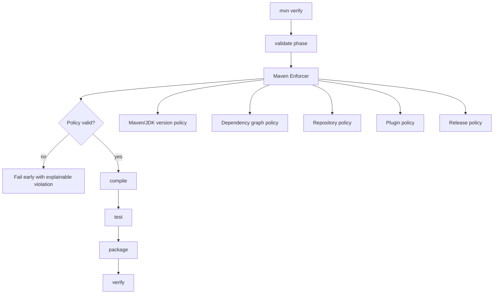
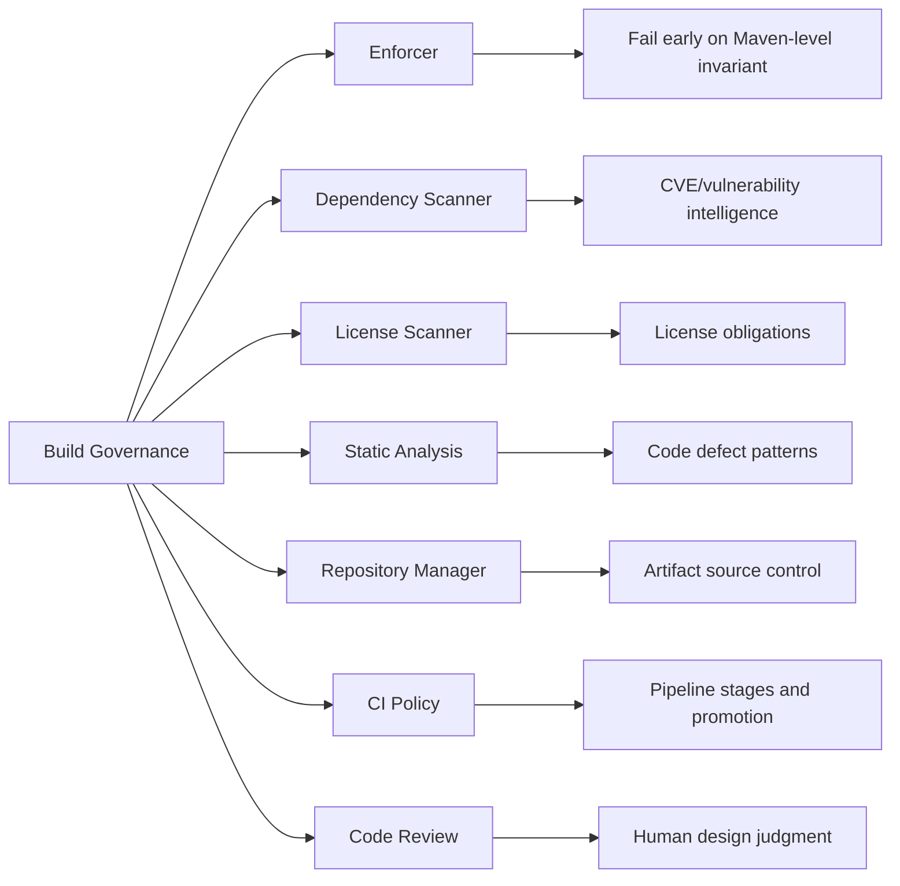
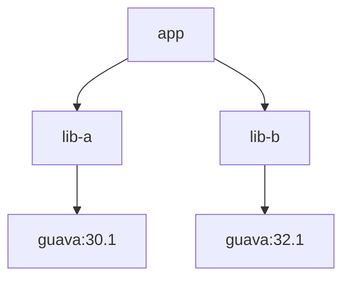
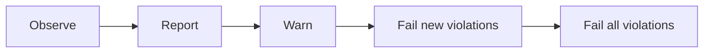
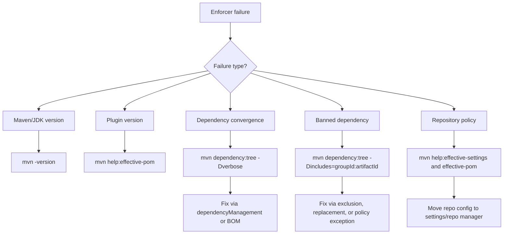
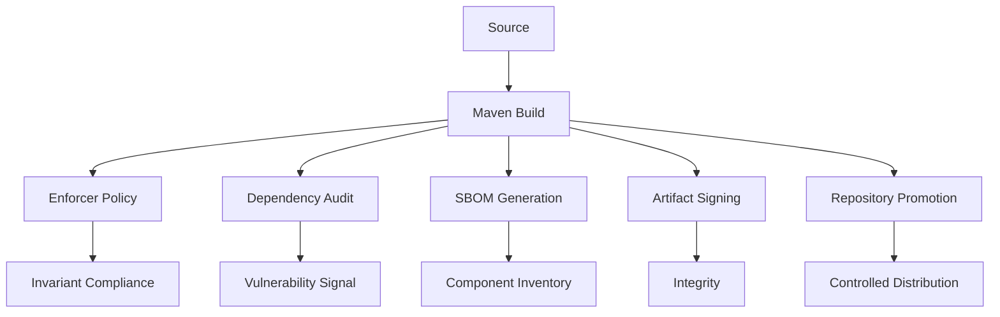

# Part 023 — Maven Enforcer and Build Governance

> Target: setelah bagian ini, kamu bisa memakai Maven Enforcer bukan sebagai “plugin tambahan”, tetapi sebagai **policy engine** untuk menjaga build tetap konsisten, aman, reproducible, dan bisa dijelaskan di organisasi besar.

Maven project kecil biasanya cukup dengan ini:

```bash
mvn clean verify
```

Kalau build hijau, dianggap selesai.

Di enterprise project, itu tidak cukup. Build bisa hijau tapi masih salah:

- developer memakai Maven version yang berbeda dari CI;
- module A compile dengan Java 17, module B tidak sengaja memakai API Java 21;
- transitive dependency membawa versi library yang lebih tua;
- dependency vulnerable masih masuk lewat dependency transitif;
- satu module mengambil artifact dari repository publik secara langsung;
- plugin version tidak dipin sehingga build berubah saat plugin default berubah;
- SNAPSHOT dependency masuk ke release branch;
- library yang dilarang oleh architecture decision tetap masuk lewat transitive graph.

Build yang benar bukan hanya build yang berhasil. Build yang benar adalah build yang **memenuhi kontrak organisasi**.

Maven Enforcer adalah salah satu mekanisme utama untuk membuat kontrak itu executable.

---

## 1. Mental Model: Enforcer sebagai Build Policy Gate

Jangan bayangkan Enforcer sebagai linter.

Bayangkan Enforcer sebagai **pre-flight inspection** sebelum lifecycle Maven melanjutkan pekerjaan mahal seperti compile, test, package, atau deploy.



Enforcer menjawab pertanyaan:

> “Apakah project ini boleh dibangun dalam kondisi seperti ini?”

Bukan:

> “Apakah code ini benar secara bisnis?”

Bukan juga:

> “Apakah unit test lulus?”

Itu tugas layer lain.

---

## 2. Apa yang Seharusnya Dienforce?

Enforcement yang baik fokus pada invariant build. Invariant adalah aturan yang harus benar di semua machine, semua developer, semua CI runner, dan semua branch yang relevan.

| Area | Contoh invariant | Risiko jika tidak dienforce |
|---|---|---|
| Maven runtime | Maven harus minimal versi tertentu | Plugin behavior berbeda, CI/dev mismatch |
| Java runtime | Build harus memakai JDK baseline tertentu | Compile sukses lokal tapi gagal CI, API leakage |
| Dependency graph | Dependency harus converge | Runtime memakai versi tak terduga |
| Dependency policy | Library tertentu tidak boleh masuk | Security, license, architecture violation |
| Repository policy | Tidak boleh mengambil artifact dari repo liar | Supply-chain risk, non-reproducible build |
| Plugin policy | Plugin version harus eksplisit | Build berubah tanpa perubahan source |
| Release policy | Release tidak boleh bergantung pada SNAPSHOT | Artifact tidak reproducible |
| Reactor policy | Module version harus konsisten | Multi-module release drift |

Rule of thumb:

> Kalau pelanggaran rule bisa menyebabkan build berbeda, runtime berbeda, audit gagal, atau deployment tidak dapat direproduksi, rule itu kandidat Enforcer.

---

## 3. Enforcer Bukan Pengganti Semua Governance

Enforcer kuat, tapi tidak boleh dijadikan tempat semua aturan.



Batas yang sehat:

- Enforcer: Maven/JDK/dependency/repository/plugin invariants.
- Dependency scanner: CVE, advisories, exploitability, vulnerable path.
- License scanner: license detection, policy, obligation.
- Static analyzer: code-level risk.
- Repository manager: allowlist/blocklist artifact source.
- CI: branch/stage/promotion policy.
- Review: architecture intent.

Jangan memaksa Enforcer menjadi security scanner penuh. Gunakan Enforcer untuk rule yang bisa dilihat dari model Maven.

---

## 4. Placement: Di Mana Enforcer Ditaruh?

Untuk project enterprise, Enforcer biasanya dideklarasikan di parent POM yang diwarisi module.

Bukan hanya di root aggregator.

Kenapa?

Karena aggregator hanya berlaku ketika build dijalankan dari root. Parent inheritance melekat pada module walaupun module dibuild sendiri.

Struktur yang umum:

```txt
platform-parent/
  pom.xml                 # inherited build policy

product-root/
  pom.xml                 # aggregator only
  service-a/
    pom.xml               # parent = platform-parent or product-parent
  service-b/
    pom.xml
```

Atau dalam monorepo:

```txt
repo-root/
  pom.xml                 # aggregator + parent, jika memang satu repo satu product
  build-parent/
    pom.xml               # optional parent module
  platform-bom/
    pom.xml
  service-a/
    pom.xml
  service-b/
    pom.xml
```

Pattern aman:

- deklarasikan versi plugin di `pluginManagement` parent;
- deklarasikan execution Enforcer di `plugins` parent jika rule wajib inherited;
- bind ke phase `validate`;
- buat message error actionable;
- jangan membuat rule terlalu luas tanpa remediation path.

---

## 5. Baseline Configuration

Contoh parent POM sederhana:

```xml
<project>
  <modelVersion>4.0.0</modelVersion>

  <groupId>com.acme.build</groupId>
  <artifactId>acme-service-parent</artifactId>
  <version>1.0.0</version>
  <packaging>pom</packaging>

  <properties>
    <maven.min.version>3.9.0</maven.min.version>
    <java.release>17</java.release>
    <maven-enforcer-plugin.version>3.6.2</maven-enforcer-plugin.version>
  </properties>

  <build>
    <pluginManagement>
      <plugins>
        <plugin>
          <groupId>org.apache.maven.plugins</groupId>
          <artifactId>maven-enforcer-plugin</artifactId>
          <version>${maven-enforcer-plugin.version}</version>
        </plugin>
      </plugins>
    </pluginManagement>

    <plugins>
      <plugin>
        <groupId>org.apache.maven.plugins</groupId>
        <artifactId>maven-enforcer-plugin</artifactId>
        <executions>
          <execution>
            <id>enforce-build-policy</id>
            <phase>validate</phase>
            <goals>
              <goal>enforce</goal>
            </goals>
            <configuration>
              <rules>
                <requireMavenVersion>
                  <version>[${maven.min.version},)</version>
                  <message>
                    This project requires Maven ${maven.min.version}+.
                    Use the Maven version defined by the engineering build baseline.
                  </message>
                </requireMavenVersion>

                <requireJavaVersion>
                  <version>[${java.release},)</version>
                  <message>
                    This build requires JDK ${java.release}+ to run Maven.
                    Compiler target is governed separately by maven-compiler-plugin.
                  </message>
                </requireJavaVersion>

                <requirePluginVersions>
                  <message>
                    All build plugins must declare versions in pluginManagement.
                    Implicit plugin versions make builds non-reproducible.
                  </message>
                </requirePluginVersions>

                <dependencyConvergence />
              </rules>
              <fail>true</fail>
            </configuration>
          </execution>
        </executions>
      </plugin>
    </plugins>
  </build>
</project>
```

Yang penting bukan menyalin config ini. Yang penting memahami boundary-nya:

- `requireMavenVersion` menjaga Maven runtime.
- `requireJavaVersion` menjaga JDK yang menjalankan Maven.
- `maven-compiler-plugin` tetap menjaga target bytecode/API compile.
- `requirePluginVersions` mencegah plugin default berubah diam-diam.
- `dependencyConvergence` memaksa dependency graph tidak ambigu.

---

## 6. `requireMavenVersion`: Build Tool Baseline

Maven version adalah bagian dari build environment.

Kalau developer memakai Maven lama, behavior plugin resolution, model building, warning handling, atau compatibility bisa berbeda.

Rule:

```xml
<requireMavenVersion>
  <version>[3.9.0,)</version>
</requireMavenVersion>
```

Gunakan lower bound yang sesuai dengan organisasi, bukan selalu latest.

Decision guide:

| Situasi | Policy yang masuk akal |
|---|---|
| Enterprise dengan banyak repo | Minimal Maven version yang distandarisasi |
| Project baru | Minimal Maven version modern yang didukung toolchain |
| Migrasi Maven 4 | Range eksplisit dan pipeline terpisah |
| Library open source | Range cukup longgar, dokumentasikan minimum |

Jangan enforce versi exact kecuali ada alasan kuat. Exact version terlalu mudah membuat developer friction.

Lebih baik:

```xml
<version>[3.9.0,)</version>
```

Daripada:

```xml
<version>[3.9.6]</version>
```

Exact version cocok untuk regulated build dengan toolchain immutable, bukan untuk semua project.

---

## 7. `requireJavaVersion`: Jangan Campur dengan Compiler Target

Ini jebakan umum.

`requireJavaVersion` mengecek Java runtime yang menjalankan Maven.

Itu tidak otomatis berarti artifact compile ke Java version itu.

Contoh:

```xml
<requireJavaVersion>
  <version>[17,)</version>
</requireJavaVersion>
```

Artinya:

> Maven harus berjalan di JDK 17 atau lebih baru.

Bukan:

> Bytecode output pasti Java 17.

Bytecode/API target dikendalikan oleh compiler plugin:

```xml
<plugin>
  <groupId>org.apache.maven.plugins</groupId>
  <artifactId>maven-compiler-plugin</artifactId>
  <configuration>
    <release>17</release>
  </configuration>
</plugin>
```

Policy yang benar:

| Concern | Tool |
|---|---|
| Maven dijalankan dengan JDK yang cukup | Enforcer `requireJavaVersion` |
| Source language level | Compiler plugin |
| Target bytecode/API | Compiler plugin `release` |
| Build memakai JDK tertentu walau Maven berjalan di JDK lain | Toolchains |
| CI matrix lint/test untuk multi-JDK | CI pipeline |

Jangan memakai Enforcer sebagai pengganti compiler configuration.

---

## 8. `requirePluginVersions`: Mencegah Build Drift

Maven plugin adalah code yang menjalankan build kamu.

Kalau plugin version tidak eksplisit, build punya hidden dependency pada default binding atau default plugin version.

Itu berbahaya karena:

- developer baru tidak tahu plugin mana yang dipakai;
- effective POM menjadi satu-satunya tempat melihat version;
- upgrade Maven bisa mengubah default plugin version;
- debugging build menjadi lebih sulit;
- reproducibility turun.

Policy yang sehat:

```xml
<build>
  <pluginManagement>
    <plugins>
      <plugin>
        <groupId>org.apache.maven.plugins</groupId>
        <artifactId>maven-compiler-plugin</artifactId>
        <version>${maven-compiler-plugin.version}</version>
      </plugin>
      <plugin>
        <groupId>org.apache.maven.plugins</groupId>
        <artifactId>maven-surefire-plugin</artifactId>
        <version>${maven-surefire-plugin.version}</version>
      </plugin>
      <plugin>
        <groupId>org.apache.maven.plugins</groupId>
        <artifactId>maven-failsafe-plugin</artifactId>
        <version>${maven-failsafe-plugin.version}</version>
      </plugin>
      <plugin>
        <groupId>org.apache.maven.plugins</groupId>
        <artifactId>maven-jar-plugin</artifactId>
        <version>${maven-jar-plugin.version}</version>
      </plugin>
    </plugins>
  </pluginManagement>
</build>
```

Lalu Enforcer memverifikasi tidak ada plugin tanpa version.

Jangan salah paham: `pluginManagement` tidak otomatis menjalankan plugin. Ia menyediakan default config/version untuk plugin yang dipakai oleh child/module.

---

## 9. `dependencyConvergence`: Graph Harus Punya Satu Jawaban

Dependency convergence berarti dependency yang sama tidak muncul dengan beberapa versi berbeda di graph.

Contoh graph bermasalah:



Maven dependency mediation akan memilih salah satu versi berdasarkan aturan graph. Build bisa tetap sukses.

Tapi senior engineer tidak cukup puas dengan “Maven memilih sesuatu”. Pertanyaan yang benar:

> Apakah versi yang dipilih memang keputusan eksplisit platform?

Dengan `dependencyConvergence`, Maven memaksa kamu menyelesaikan konflik itu.

```xml
<dependencyConvergence />
```

Cara memperbaiki yang sehat:

```xml
<dependencyManagement>
  <dependencies>
    <dependency>
      <groupId>com.google.guava</groupId>
      <artifactId>guava</artifactId>
      <version>${guava.version}</version>
    </dependency>
  </dependencies>
</dependencyManagement>
```

Jangan refleks menambah exclusion di mana-mana.

Exclusion cocok ketika dependency benar-benar tidak boleh ada. Dependency management cocok ketika dependency boleh ada tetapi versinya harus dikendalikan.

---

## 10. Dependency Convergence vs Require Upper Bound Dependencies

Dua konsep ini mirip tapi tidak identik.

`dependencyConvergence` ingin semua path ke artifact yang sama menggunakan versi yang sama.

`requireUpperBoundDeps` fokus memastikan resolved version tidak lebih rendah daripada versi tertinggi yang diminta dalam dependency graph.

Mental model:

```txt
Convergence:
  Semua jalan menuju C harus sepakat pada versi C.

Upper bound:
  Kalau ada dependency yang minta C versi tinggi, jangan resolve ke versi yang lebih rendah.
```

Contoh:

```txt
app
├── lib-a -> jackson-databind:2.14.0
└── lib-b -> jackson-databind:2.17.0
```

Kalau Maven resolve ke `2.14.0`, upper-bound rule akan protes karena ada path yang meminta `2.17.0`.

Policy praktis:

| Project type | Recommendation |
|---|---|
| Internal service | Gunakan convergence, pertimbangkan upper-bound untuk library risk tinggi |
| Shared library | Gunakan hati-hati; terlalu ketat bisa menyulitkan consumer |
| Platform parent/BOM | Gunakan untuk menjaga versi platform eksplisit |
| Legacy migration | Mulai warning/report dulu, fail bertahap |

Di organisasi besar, dependency convergence sering lebih mudah dijelaskan sebagai invariant:

> Satu artifact, satu versi yang disetujui.

---

## 11. `bannedDependencies`: Policy sebagai Executable Decision

Ada dependency yang tidak boleh masuk ke project, bahkan secara transitive.

Contoh alasan:

- library end-of-life;
- library dilarang oleh security;
- license tidak kompatibel;
- framework lama sudah dimigrasikan;
- dependency membawa CVE critical dan belum boleh dipakai;
- API internal tidak boleh dikonsumsi langsung;
- module boundary dilanggar.

Contoh:

```xml
<bannedDependencies>
  <searchTransitive>true</searchTransitive>
  <excludes>
    <exclude>commons-logging:commons-logging</exclude>
    <exclude>log4j:log4j</exclude>
    <exclude>javax.servlet:servlet-api</exclude>
    <exclude>com.acme.internal:legacy-security-client</exclude>
  </excludes>
  <includes>
    <!-- temporary exception during migration, must have owner and expiry in ADR -->
    <include>com.acme.internal:legacy-security-client:2.8.4</include>
  </includes>
  <message>
    A banned dependency was found. Use the approved platform dependency list.
    If this is a migration exception, create an ADR and add an expiry date.
  </message>
</bannedDependencies>
```

Beberapa aturan penting:

1. Ban harus punya alasan.
2. Ban harus punya alternatif.
3. Exception harus punya expiry.
4. Jangan ban terlalu luas tanpa memahami graph.
5. Jangan jadikan banned dependency sebagai pengganti vulnerability scanner.

Banned dependency yang buruk:

```xml
<exclude>org.apache.*:*:*</exclude>
```

Terlalu luas. Hampir pasti membuat build chaos.

Banned dependency yang baik:

```xml
<exclude>log4j:log4j</exclude>
```

Spesifik, bisa dijelaskan, bisa diremediasi.

---

## 12. Repository Enforcement

Repository policy adalah supply-chain boundary.

Project enterprise biasanya tidak boleh langsung mendeklarasikan arbitrary repository:

```xml
<repositories>
  <repository>
    <id>random-internet-repo</id>
    <url>https://example.com/maven</url>
  </repository>
</repositories>
```

Kenapa berbahaya?

- artifact source tidak diaudit;
- repository bisa hilang;
- metadata bisa berubah;
- artifact bisa tidak diproxy/di-cache;
- CI tidak reproducible;
- artifact trust boundary bocor.

Idealnya repository dikendalikan lewat `settings.xml` mirror ke repository manager internal.

Enforcer bisa dipakai untuk mencegah repository liar di POM.

Policy design:

| Rule | Tujuan |
|---|---|
| Ban repository di project POM | Semua resolution lewat repo manager |
| Ban plugin repository liar | Plugin juga executable code |
| Require release repository only di release branch | Mencegah SNAPSHOT drift |
| Mirror central lewat settings | Audit/cache/availability |

Prinsip:

> POM boleh menyatakan apa yang dibutuhkan. POM tidak semestinya bebas menentukan dari internet mana artifact executable diambil.

---

## 13. Release Policy: Jangan Rilis dari Dependency yang Bergerak

Release artifact harus bisa direproduksi.

SNAPSHOT dependency merusak invariant itu karena SNAPSHOT menunjuk ke artifact yang bisa berubah.

Policy sehat:

- SNAPSHOT boleh di feature branch tertentu;
- SNAPSHOT tidak boleh di release branch;
- release pipeline menjalankan Enforcer rule untuk melarang SNAPSHOT dependency;
- internal milestone/pre-release pakai version yang jelas, bukan SNAPSHOT permanen.

Contoh:

```xml
<requireReleaseDeps>
  <message>
    Release builds must not depend on SNAPSHOT artifacts.
    Promote the dependency to a release version first.
  </message>
</requireReleaseDeps>
```

Untuk project multi-module, hati-hati: module dalam reactor bisa punya version SNAPSHOT selama itu bagian dari release process. Jangan membuat rule yang memblokir workflow organisasi sendiri tanpa memahami release topology.

---

## 14. Multi-Module Governance

Di multi-module project, Enforcer perlu menjawab:

- apakah semua module memakai parent yang benar?
- apakah module version converge?
- apakah dependency antar-module memakai version yang sama?
- apakah module tidak saling bergantung secara circular?
- apakah module tertentu tidak boleh dipakai oleh module lain?

Contoh invariant:

```txt
service-web       boleh depend ke service-application
service-application boleh depend ke service-domain
service-domain   tidak boleh depend ke service-web
```

Maven Enforcer built-in tidak selalu cukup untuk semua architecture rules seperti ini. Untuk rule arsitektur yang kompleks, pertimbangkan:

- ArchUnit test;
- custom Enforcer rule;
- dependency analysis script di CI;
- module layout convention;
- code review checklist.

Gunakan Enforcer untuk invariant Maven-level. Gunakan tool lain untuk architectural semantic yang lebih kaya.

---

## 15. Fail Fast vs Gradual Adoption

Kalau project baru, enforce ketat dari awal.

Kalau legacy project besar, langsung menyalakan semua rule sebagai `fail=true` sering menjadi bencana.

Migration path yang lebih aman:



Tahapan praktis:

1. Jalankan Enforcer lokal dan CI tanpa fail untuk melihat baseline.
2. Kategorikan violation: Maven version, Java version, plugin versions, dependency conflicts, banned deps.
3. Fix yang mudah dulu: plugin versions, Maven/JDK baseline.
4. Buat dependency BOM/platform alignment untuk konflik besar.
5. Tambah banned dependencies dengan exception terbatas.
6. Aktifkan fail untuk new modules/new branches.
7. Aktifkan fail global setelah baseline bersih.

Jangan memperlakukan legacy violation sebagai alasan untuk tidak punya governance. Treat it as migration backlog.

---

## 16. Developer Experience: Error Harus Actionable

Enforcer yang buruk memberi error seperti ini:

```txt
Rule 2 failed with message: banned dependency found
```

Developer tidak tahu harus melakukan apa.

Enforcer yang baik memberi remediation:

```xml
<message>
  commons-logging is banned. Use org.slf4j:jcl-over-slf4j via the platform BOM.
  If this dependency is transitive, run:
    mvn dependency:tree -Dincludes=commons-logging:commons-logging
  Then add an exclusion at the dependency root or align through the platform BOM.
</message>
```

Error policy:

| Error harus menyebut | Kenapa |
|---|---|
| Apa yang dilanggar | Developer paham problem |
| Kenapa rule ada | Mengurangi debat berulang |
| Cara inspect | Developer bisa self-service |
| Cara fix | Mengurangi blocking |
| Exception path | Untuk kasus valid yang tidak umum |

Governance tanpa developer experience akan berubah menjadi bypass culture.

---

## 17. Diagnostic Workflow untuk Enforcer Failure

Saat Enforcer gagal, jangan langsung edit POM acak.

Ikuti alur ini:



Commands:

```bash
# Lihat Maven dan JDK runtime
mvn -version

# Lihat POM final setelah inheritance/profile
mvn help:effective-pom

# Lihat settings final
mvn help:effective-settings

# Inspect dependency conflict
mvn dependency:tree -Dverbose

# Cari dependency spesifik
mvn dependency:tree -Dincludes=log4j:log4j

# Jalankan hanya Enforcer
mvn validate
```

Senior habit:

> Jangan fix dependency conflict sebelum tahu path yang membawa dependency itu.

---

## 18. Common Anti-Patterns

### Anti-pattern 1: Enforcer hanya di root aggregator

Build dari root gagal, tapi build dari module lolos.

Fix: letakkan policy di inherited parent.

---

### Anti-pattern 2: Semua rule langsung fail di legacy repo

Hasilnya puluhan tim blocked.

Fix: baseline dulu, enforce bertahap.

---

### Anti-pattern 3: Ban dependency tanpa replacement

Developer hanya mencari cara bypass.

Fix: selalu sediakan approved alternative.

---

### Anti-pattern 4: Exact Maven/JDK version tanpa toolchain distribution

Developer disuruh memakai versi exact tapi tidak diberi mekanisme install standar.

Fix: dokumentasikan toolchain, gunakan container/devbox/SDK manager/internal image.

---

### Anti-pattern 5: Dependency convergence diselesaikan dengan exclusion sembarang

Runtime bisa kehilangan class yang sebenarnya dibutuhkan.

Fix: prefer dependency management/BOM alignment; exclusion hanya jika dependency memang tidak diperlukan atau diganti.

---

### Anti-pattern 6: Enforcer skip property tersebar

```bash
mvn verify -Denforcer.skip=true
```

Kalau semua orang terbiasa skip, policy mati.

Fix:

- allow skip hanya lokal jika benar-benar perlu;
- CI release pipeline tidak boleh skip;
- track skip usage jika memungkinkan;
- gunakan profile exception yang explicit dan audited.

---

## 19. Pattern: Enterprise Parent dengan Layered Enforcement

Contoh layering:

```txt
acme-corporate-parent
  - Maven/JDK minimum
  - repository policy
  - plugin version rule
  - banned global dependencies

acme-java-service-parent
  - compiler release
  - surefire/failsafe baseline
  - dependency convergence
  - service packaging rule

acme-payment-service-parent
  - stricter banned dependencies
  - payment security libraries
  - release-only dependencies
  - SBOM/signing integration
```

Jangan masukkan semua policy ke satu parent global.

Global parent yang terlalu berat akan membuat semua tim membenci parent itu.

Pisahkan:

- corporate invariant;
- platform invariant;
- product invariant;
- service-specific invariant.

---

## 20. Pattern: Banned Dependency dengan Migration Exception

Contoh kasus:

`legacy-http-client` dilarang, tapi satu service belum selesai migrasi.

Jangan lakukan ini:

```xml
<enforcer.skip>true</enforcer.skip>
```

Itu mematikan semua rule.

Lebih baik:

```xml
<bannedDependencies>
  <excludes>
    <exclude>com.acme.legacy:legacy-http-client</exclude>
  </excludes>
  <includes>
    <!-- Temporary exception: PAY-1234, expires 2026-09-30 -->
    <include>com.acme.legacy:legacy-http-client:4.2.1</include>
  </includes>
</bannedDependencies>
```

Dan dokumentasikan:

```txt
Exception owner: Payment Platform Team
Reason: migration to acme-http-client not complete
Expiry: 2026-09-30
Tracking: PAY-1234
Risk acceptance: approved by security architecture
```

Exception tanpa expiry adalah policy yang sudah kalah.

---

## 21. Pattern: Dependency Convergence via Platform BOM

Jika banyak service memakai library platform yang sama, jangan fix convergence per service.

Buat platform BOM:

```xml
<project>
  <modelVersion>4.0.0</modelVersion>
  <groupId>com.acme.platform</groupId>
  <artifactId>acme-platform-bom</artifactId>
  <version>2026.07.0</version>
  <packaging>pom</packaging>

  <dependencyManagement>
    <dependencies>
      <dependency>
        <groupId>com.fasterxml.jackson</groupId>
        <artifactId>jackson-bom</artifactId>
        <version>${jackson.version}</version>
        <type>pom</type>
        <scope>import</scope>
      </dependency>
      <dependency>
        <groupId>org.slf4j</groupId>
        <artifactId>slf4j-api</artifactId>
        <version>${slf4j.version}</version>
      </dependency>
    </dependencies>
  </dependencyManagement>
</project>
```

Service parent:

```xml
<dependencyManagement>
  <dependencies>
    <dependency>
      <groupId>com.acme.platform</groupId>
      <artifactId>acme-platform-bom</artifactId>
      <version>${acme-platform-bom.version}</version>
      <type>pom</type>
      <scope>import</scope>
    </dependency>
  </dependencies>
</dependencyManagement>
```

Enforcer menjaga bahwa graph mengikuti keputusan BOM.

---

## 22. Policy Decision Matrix

| Rule | Default untuk project baru | Default untuk legacy | Catatan |
|---|---|---|---|
| requireMavenVersion | Fail | Fail setelah toolchain siap | Low friction jika versi standar jelas |
| requireJavaVersion | Fail | Fail setelah CI/dev baseline siap | Jangan campur dengan compiler release |
| requirePluginVersions | Fail | Fail setelah pluginManagement dibersihkan | Sangat penting untuk reproducibility |
| dependencyConvergence | Fail | Report → fail bertahap | Bisa membuka banyak conflict lama |
| requireUpperBoundDeps | Case-by-case | Case-by-case | Bisa noisy di ecosystem kompleks |
| bannedDependencies | Fail untuk ban kritis | Fail dengan exception | Harus ada replacement |
| bannedRepositories | Fail | Fail | Supply-chain boundary penting |
| requireReleaseDeps | Fail di release pipeline | Fail di release pipeline | Tidak selalu perlu di local dev |

---

## 23. CI Strategy

Jalankan Enforcer di early stage:

```yaml
stages:
  - build-policy
  - compile
  - unit-test
  - integration-test
  - package
  - publish
```

Maven command:

```bash
mvn -B -ntp validate
```

Lalu full verify:

```bash
mvn -B -ntp verify
```

Kenapa `validate` dulu?

- feedback cepat;
- fail sebelum download/test mahal;
- violation build policy terlihat sebagai kategori terpisah;
- pipeline lebih mudah didiagnosis.

Tapi jangan hanya menjalankan `validate`. Full build tetap perlu.

---

## 24. Enforcer dan Supply Chain

Enforcer bukan SBOM generator dan bukan vulnerability scanner.

Tapi Enforcer membantu supply chain dengan menjaga:

- repository source terkendali;
- dependency terlarang tidak masuk;
- release dependency stabil;
- plugin executable dipin;
- Maven/JDK runtime baseline jelas.

Supply-chain posture yang lebih lengkap:



Enforcer adalah salah satu gate, bukan seluruh chain.

---

## 25. Mini Case Study: Runtime Incident dari Dependency Drift

### Gejala

Service gagal di production:

```txt
java.lang.NoSuchMethodError: com.fasterxml.jackson.databind.ObjectMapper.someMethod()
```

### Kondisi

- Build hijau.
- Unit test hijau.
- Dependency tree punya dua versi Jackson.
- Maven memilih versi lebih lama karena nearest-wins.
- Module baru membawa library yang mengharapkan Jackson lebih baru.

### Diagnosis

```bash
mvn dependency:tree -Dincludes=com.fasterxml.jackson.core:jackson-databind -Dverbose
```

### Fix jangka pendek

Tambahkan version alignment di `dependencyManagement`.

### Fix jangka panjang

- import Jackson BOM di platform BOM;
- enable `dependencyConvergence`;
- CI fail jika graph drift;
- tambahkan regression test untuk integration boundary;
- update release checklist.

### Lesson

Maven berhasil melakukan dependency mediation. Tapi organisasi gagal membuat versi dependency sebagai keputusan eksplisit.

---

## 26. Checklist Review Parent POM Enforcer

Gunakan checklist ini sebelum mengadopsi parent POM di banyak repository.

### Build runtime

- [ ] Maven minimum version jelas.
- [ ] Java runtime minimum jelas.
- [ ] Compiler target dikonfigurasi terpisah.
- [ ] Toolchains strategy jelas jika perlu multi-JDK.

### Plugin governance

- [ ] Semua plugin version dipin.
- [ ] Plugin config ada di `pluginManagement` jika hanya default.
- [ ] Plugin execution inherited hanya jika benar-benar wajib.
- [ ] Plugin skip property tidak membuka bypass di CI release.

### Dependency governance

- [ ] Platform BOM menjadi sumber utama version alignment.
- [ ] Dependency convergence strategy jelas.
- [ ] Banned dependency punya alasan dan replacement.
- [ ] Exception punya owner dan expiry.

### Repository governance

- [ ] Project POM tidak membawa repository liar.
- [ ] Plugin repository juga dikontrol.
- [ ] Resolution lewat repository manager internal.
- [ ] Release repository dan snapshot repository terpisah.

### Developer experience

- [ ] Error message actionable.
- [ ] Debug command didokumentasikan.
- [ ] Migration guide tersedia.
- [ ] Legacy baseline tidak membuat semua tim blocked.

---

## 27. Latihan Deliberate Practice

### Latihan 1 — Plugin Version Drift

Ambil project Maven kecil. Hapus semua version dari build plugins. Aktifkan `requirePluginVersions`. Jalankan:

```bash
mvn validate
```

Tugas:

- identifikasi plugin mana yang gagal;
- pindahkan version ke `pluginManagement`;
- jalankan `mvn help:effective-pom`;
- jelaskan dari mana plugin version akhirnya berasal.

---

### Latihan 2 — Dependency Convergence

Buat dua dependency yang membawa versi transitive berbeda dari artifact yang sama. Aktifkan `dependencyConvergence`.

Tugas:

- baca error path;
- fix dengan `dependencyManagement`;
- ulangi dengan exclusion;
- bandingkan mana yang lebih aman dan kenapa.

---

### Latihan 3 — Banned Dependency

Ban dependency logging lama. Tambahkan dependency yang membawanya secara transitive.

Tugas:

- temukan root dependency dengan `dependency:tree`;
- tambahkan exclusion pada root yang benar;
- dokumentasikan replacement dependency;
- tambahkan message yang actionable.

---

### Latihan 4 — Repository Policy

Tambahkan repository sembarang ke POM. Buat rule untuk mencegahnya.

Tugas:

- pindahkan repository config ke settings/repository manager strategy;
- inspect `effective-pom` dan `effective-settings`;
- jelaskan kenapa repository policy adalah supply-chain concern.

---

## 28. Senior Engineer Heuristics

- Build policy yang tidak executable akan menjadi tribal knowledge.
- Enforcer rule tanpa remediation akan menghasilkan bypass.
- Dependency convergence adalah cara membuat Maven dependency mediation menjadi eksplisit.
- Banned dependency bukan daftar kemarahan; ia adalah daftar keputusan arsitektur dan risiko.
- Parent POM adalah API. Jangan merilis breaking change ke parent tanpa versioning dan migration note.
- Skip flag di local boleh ada; skip flag di release pipeline harus dicurigai.
- Jangan enforce yang belum bisa kamu jelaskan.
- Jangan enforce yang belum punya owner.
- Jangan enforce global rule untuk problem lokal.
- Rule paling efektif adalah rule yang gagal cepat, spesifik, dan bisa diperbaiki developer tanpa meeting.

---

## 29. Referensi Resmi

- Apache Maven Enforcer Plugin: `https://maven.apache.org/enforcer/maven-enforcer-plugin/`
- Apache Maven Enforcer Built-In Rules: `https://maven.apache.org/enforcer/enforcer-rules/index.html`
- Banned Dependencies Rule: `https://maven.apache.org/enforcer/enforcer-rules/bannedDependencies.html`
- Dependency Convergence Rule: `https://maven.apache.org/enforcer/enforcer-rules/dependencyConvergence.html`
- Maven Dependency Mechanism: `https://maven.apache.org/guides/introduction/introduction-to-dependency-mechanism.html`
- Maven POM Reference: `https://maven.apache.org/pom.html`

---

## 30. Ringkasan

Maven Enforcer adalah mekanisme untuk mengubah build policy menjadi invariant yang dieksekusi.

Gunakan Enforcer untuk menjaga:

- Maven/JDK baseline;
- plugin version reproducibility;
- dependency convergence;
- banned dependency;
- repository policy;
- release dependency stability;
- multi-module consistency.

Tapi jangan menjadikannya pengganti semua governance. Enforcer bekerja paling baik ketika rule-nya jelas, failure-nya actionable, adoption-nya bertahap, dan policy-nya punya owner.

Di bagian berikutnya, kita masuk ke packaging patterns: shading, assembly, uber JAR, thin JAR, relocation, dependency-reduced POM, dan bagaimana packaging choice bisa memperbaiki atau justru memperparah dependency conflict.
