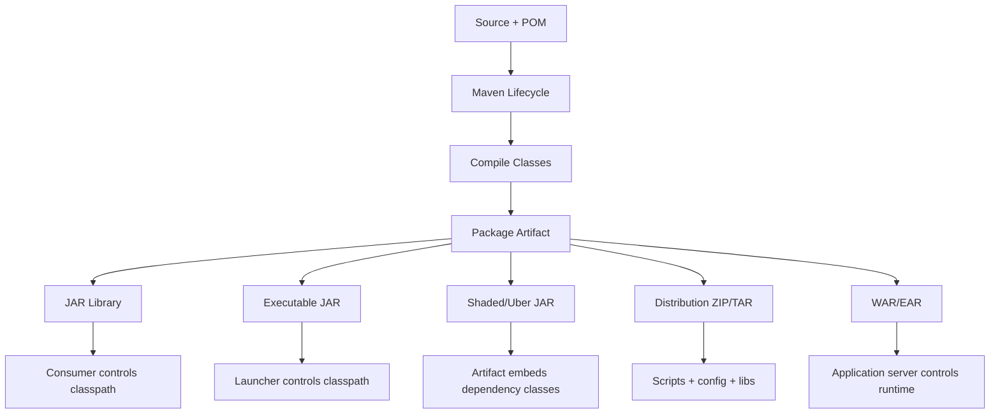
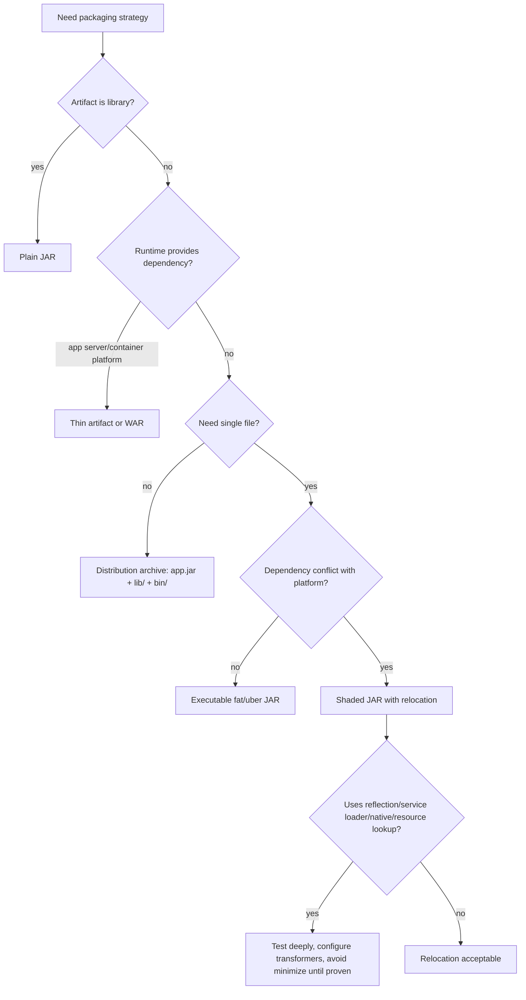

# Part 024 — Shading, Assembly, and Packaging Patterns

> Target: setelah bagian ini, kamu bisa memilih packaging strategy Maven secara sadar: kapan cukup JAR biasa, kapan perlu distribution archive, kapan perlu shaded JAR, kapan relocation wajib, kapan assembly cukup, dan kapan fat JAR justru memperbesar risiko runtime.

Packaging terlihat sederhana:

```bash
mvn package
```

Lalu muncul file:

```txt
target/my-app-1.0.0.jar
```

Tapi di production, pertanyaan sebenarnya bukan “apakah ada JAR”.

Pertanyaannya:

- artifact ini akan dijalankan di mana?
- siapa yang menyediakan dependency runtime?
- apakah classpath dikontrol container, script, app server, atau JAR itu sendiri?
- apakah dependency perlu digabung ke dalam satu file?
- apakah ada dependency conflict dengan platform runtime?
- apakah artifact ini akan dipublish sebagai library atau sebagai application?
- apakah consumer perlu melihat dependency asli di POM?
- apakah service loader, manifest, signature files, dan resource merge aman?
- apakah packaging reproducible?

Maven packaging bukan hanya output format. Ia adalah **runtime contract**.

---

## 1. Mental Model: Packaging sebagai Runtime Boundary



Packaging strategy menjawab:

> “Di runtime, siapa yang bertanggung jawab menyusun classpath?”

Kalau kamu tidak menjawab itu, packaging akan menjadi accidental.

---

## 2. Vocabulary yang Harus Presisi

| Istilah | Makna praktis |
|---|---|
| Plain JAR | JAR berisi class/resource project saja, dependency tidak dimasukkan |
| Thin JAR | JAR kecil, dependency disediakan terpisah di classpath/runtime image |
| Executable JAR | JAR punya manifest/main class atau launcher mechanism |
| Fat JAR | Istilah umum: JAR berisi aplikasi + dependency |
| Uber JAR | Sering dipakai untuk JAR yang menggabungkan banyak dependency ke satu artifact |
| Shaded JAR | Uber/fat JAR yang dibuat dengan Shade Plugin, bisa relocate package dan transform resource |
| Assembly | Archive distribusi berisi artifact, dependency, script, config, docs, atau file lain |
| Relocation | Rewrite package/class bytecode ke namespace lain untuk menghindari conflict |
| Dependency-reduced POM | POM hasil Shade yang menghapus dependency yang sudah dimasukkan ke shaded artifact |

Jangan pakai istilah fat, uber, shaded, assembly secara interchangeable. Mereka punya konsekuensi berbeda.

---

## 3. Default Maven `jar` Packaging

Untuk project dengan:

```xml
<packaging>jar</packaging>
```

Maven default lifecycle akan menghasilkan JAR dari output compile.

Biasanya isinya:

```txt
META-INF/
com/acme/app/*.class
application.properties
```

Tidak otomatis berisi dependency JAR lain.

Itu benar untuk library.

Kenapa?

Karena library harus membiarkan consumer mengontrol dependency graph.

Kalau library mem-bundle dependency ke dalam JAR tanpa alasan, consumer bisa kehilangan kontrol terhadap:

- version alignment;
- CVE remediation;
- classpath conflict;
- license inventory;
- duplicate classes;
- dependency mediation.

Rule:

> Library published ke repository internal/public sebaiknya plain JAR, bukan fat JAR, kecuali ada alasan teknis yang sangat kuat.

---

## 4. Plain JAR vs Thin JAR vs Fat JAR

| Pattern | Isi artifact | Cocok untuk | Risiko utama |
|---|---|---|---|
| Plain JAR | Class project saja | Library | Consumer harus punya dependency graph benar |
| Thin application JAR | App class + dependency eksternal di `/lib` atau image | Container image, server deployment | Launcher/classpath harus benar |
| Fat/Uber JAR | App + dependency digabung | CLI tool, serverless, Hadoop/Spark job, standalone service tertentu | Duplicate resource, hidden dependency, conflict, patching sulit |
| Shaded JAR with relocation | App + dependency yang dipindah namespace | Conflict dengan platform/container | Reflection/resource/service loader risk |
| Distribution archive | JAR + lib + bin + config + docs | On-prem install, batch job, legacy deployment | Archive layout governance |

Tidak ada “best packaging” universal. Yang ada adalah packaging yang sesuai runtime boundary.

---

## 5. Decision Tree



Kalimat kuncinya:

> Jangan mulai dari “pakai Shade atau Assembly?” Mulai dari “runtime classpath siapa yang mengontrol?”

---

## 6. Maven Assembly Plugin: Distribution Archive

Maven Assembly Plugin membuat archive distribusi yang bisa berisi project output, dependency, module, docs, script, config, dan file lain.

Use case yang baik:

```txt
my-app-1.0.0-bin.zip
├── bin/
│   ├── start.sh
│   └── stop.sh
├── lib/
│   ├── my-app-1.0.0.jar
│   ├── dependency-a.jar
│   └── dependency-b.jar
├── conf/
│   └── application.yml.template
├── README.md
└── LICENSE
```

Ini bagus ketika deployment menginginkan struktur distribusi, bukan satu JAR raksasa.

Assembly cocok untuk:

- CLI distribution;
- on-prem package;
- batch application;
- internal tool;
- archive yang butuh `bin/`, `conf/`, `lib/`, `docs/`;
- packaging non-container legacy.

Assembly tidak ideal untuk sophisticated uber JAR yang butuh relocation dan resource transformer.

---

## 7. Assembly `jar-with-dependencies`: Gunakan dengan Hati-Hati

Assembly punya predefined descriptor `jar-with-dependencies`.

Contoh:

```xml
<plugin>
  <groupId>org.apache.maven.plugins</groupId>
  <artifactId>maven-assembly-plugin</artifactId>
  <version>${maven-assembly-plugin.version}</version>
  <configuration>
    <archive>
      <manifest>
        <mainClass>com.acme.cli.Main</mainClass>
      </manifest>
    </archive>
    <descriptorRefs>
      <descriptorRef>jar-with-dependencies</descriptorRef>
    </descriptorRefs>
  </configuration>
  <executions>
    <execution>
      <id>make-assembly</id>
      <phase>package</phase>
      <goals>
        <goal>single</goal>
      </goals>
    </execution>
  </executions>
</plugin>
```

Ini akan membuat artifact dengan classifier seperti:

```txt
my-cli-1.0.0-jar-with-dependencies.jar
```

Tapi `jar-with-dependencies` pada dasarnya unpack dependency ke satu JAR. Ia tidak memberi kontrol sekuat Shade untuk relocation, resource transformer, service descriptor merge, atau dependency-reduced POM.

Rule:

> `jar-with-dependencies` boleh untuk tool sederhana. Untuk production uber JAR yang punya dependency kompleks, prefer Maven Shade Plugin.

---

## 8. Custom Assembly Descriptor

Untuk distribusi yang rapi, tulis descriptor sendiri.

`src/assembly/bin.xml`:

```xml
<assembly xmlns="http://maven.apache.org/ASSEMBLY/2.2.0"
          xmlns:xsi="http://www.w3.org/2001/XMLSchema-instance"
          xsi:schemaLocation="http://maven.apache.org/ASSEMBLY/2.2.0 https://maven.apache.org/xsd/assembly-2.2.0.xsd">
  <id>bin</id>
  <formats>
    <format>zip</format>
    <format>tar.gz</format>
  </formats>

  <includeBaseDirectory>true</includeBaseDirectory>

  <fileSets>
    <fileSet>
      <directory>${project.basedir}/src/main/bin</directory>
      <outputDirectory>bin</outputDirectory>
      <fileMode>0755</fileMode>
      <includes>
        <include>*.sh</include>
      </includes>
    </fileSet>

    <fileSet>
      <directory>${project.basedir}/src/main/conf</directory>
      <outputDirectory>conf</outputDirectory>
      <includes>
        <include>*.template</include>
      </includes>
    </fileSet>
  </fileSets>

  <dependencySets>
    <dependencySet>
      <outputDirectory>lib</outputDirectory>
      <useProjectArtifact>true</useProjectArtifact>
      <scope>runtime</scope>
    </dependencySet>
  </dependencySets>
</assembly>
```

POM:

```xml
<plugin>
  <groupId>org.apache.maven.plugins</groupId>
  <artifactId>maven-assembly-plugin</artifactId>
  <version>${maven-assembly-plugin.version}</version>
  <configuration>
    <descriptors>
      <descriptor>src/assembly/bin.xml</descriptor>
    </descriptors>
  </configuration>
  <executions>
    <execution>
      <id>package-distribution</id>
      <phase>package</phase>
      <goals>
        <goal>single</goal>
      </goals>
    </execution>
  </executions>
</plugin>
```

Keunggulan custom assembly:

- layout explicit;
- dependency tetap sebagai JAR terpisah;
- patching dependency lebih mudah;
- startup script bisa mengontrol classpath;
- config template bisa dipisahkan;
- tidak perlu merge resource ke satu JAR.

---

## 9. Maven Shade Plugin: Uber JAR dengan Kontrol

Shade Plugin digunakan ketika kamu ingin membuat JAR yang memasukkan dependency, dengan kontrol atas:

- artifact include/exclude;
- relocation;
- resource transformers;
- service descriptor merge;
- manifest;
- minimization;
- dependency-reduced POM;
- attachment classifier.

Contoh dasar:

```xml
<plugin>
  <groupId>org.apache.maven.plugins</groupId>
  <artifactId>maven-shade-plugin</artifactId>
  <version>${maven-shade-plugin.version}</version>
  <executions>
    <execution>
      <phase>package</phase>
      <goals>
        <goal>shade</goal>
      </goals>
      <configuration>
        <createDependencyReducedPom>true</createDependencyReducedPom>
        <transformers>
          <transformer implementation="org.apache.maven.plugins.shade.resource.ManifestResourceTransformer">
            <mainClass>com.acme.app.Main</mainClass>
          </transformer>
        </transformers>
      </configuration>
    </execution>
  </executions>
</plugin>
```

Shade cocok ketika single artifact memang requirement.

Tapi single artifact bukan selalu lebih baik.

---

## 10. Relocation: Menyelesaikan Classpath Conflict dengan Namespace Baru

Relocation memindahkan package dependency ke namespace lain di shaded JAR.

Contoh:

```xml
<relocations>
  <relocation>
    <pattern>com.google.common</pattern>
    <shadedPattern>com.acme.shaded.guava</shadedPattern>
  </relocation>
</relocations>
```

Mental model:


Relocation berguna ketika:

- runtime platform sudah menyediakan versi dependency berbeda;
- library kamu harus membawa internal dependency tanpa mengeksposnya ke consumer;
- Hadoop/Spark/plugin container punya dependency lama;
- CLI tool harus isolated dari system classpath.

Tapi relocation punya risiko:

- reflection dengan string class name bisa gagal;
- resource path belum tentu berubah sesuai harapan;
- service loader metadata perlu transformer;
- native library lookup bisa bermasalah;
- license/resource/signature file perlu dikelola;
- stack trace menjadi kurang familiar;
- security scanner bisa lebih sulit membaca component asli jika metadata tidak dijaga.

Relocation adalah scalpel, bukan hammer.

---

## 11. Resource Transformers: Bagian yang Sering Dilupakan

Saat banyak JAR digabung, resource dengan path sama bisa overwrite.

Contoh:

```txt
META-INF/services/java.sql.Driver
META-INF/spring.factories
META-INF/LICENSE
META-INF/NOTICE
META-INF/MANIFEST.MF
```

Kalau tidak di-merge benar, aplikasi bisa compile tapi gagal runtime.

Contoh transformer service loader:

```xml
<transformers>
  <transformer implementation="org.apache.maven.plugins.shade.resource.ServicesResourceTransformer" />
  <transformer implementation="org.apache.maven.plugins.shade.resource.ManifestResourceTransformer">
    <mainClass>com.acme.app.Main</mainClass>
  </transformer>
</transformers>
```

Kapan perlu transformer?

| Resource type | Risiko |
|---|---|
| `META-INF/services/*` | ServiceLoader provider hilang |
| Framework metadata | Auto-configuration tidak terbaca |
| Manifest | Main class atau metadata salah |
| License/notice | Compliance information hilang |
| Signature files | Invalid signature setelah merge |

Setiap framework punya metadata pattern. Jangan menganggap semua resource aman digabung default.

---

## 12. Signature Files dan Invalid JAR

Beberapa dependency JAR punya signature metadata:

```txt
META-INF/*.SF
META-INF/*.DSA
META-INF/*.RSA
```

Saat JAR di-unpack dan digabung ulang, signature lama bisa tidak valid.

Pattern umum:

```xml
<filters>
  <filter>
    <artifact>*:*</artifact>
    <excludes>
      <exclude>META-INF/*.SF</exclude>
      <exclude>META-INF/*.DSA</exclude>
      <exclude>META-INF/*.RSA</exclude>
    </excludes>
  </filter>
</filters>
```

Tapi pahami konsekuensinya: kamu menghapus signature metadata dari dependency yang digabung. Untuk supply chain yang ketat, artifact signing dan provenance perlu ditangani di level publish/promotion, bukan mengandalkan signature internal dependency yang sudah dibongkar.

---

## 13. `dependency-reduced-pom.xml`

Shade bisa membuat dependency-reduced POM.

Tujuannya: dependency yang sudah dimasukkan ke shaded artifact tidak lagi terlihat sebagai dependency normal dari artifact hasil publish.

Ini penting ketika shaded artifact dipakai sebagai library atau dipublish ke repository.

Contoh efek:

```txt
Before shade:
  my-lib depends on guava

After shade with dependency-reduced POM:
  my-lib no longer declares guava as external dependency,
  because guava classes are embedded/relocated inside my-lib
```

Risiko:

- consumer tidak melihat dependency asli;
- SBOM/license inventory harus tetap menjaga asal component;
- generated POM bisa mengganggu workflow jika tidak dikontrol;
- perubahan POM hasil shade bisa membingungkan release.

Rule:

> Kalau shaded artifact dipublish untuk consumer lain, review dependency-reduced POM sebagai bagian dari artifact contract.

Untuk application-only executable JAR yang tidak dipakai sebagai dependency oleh project lain, concern-nya lebih kecil, tapi tetap penting untuk audit.

---

## 14. Minimization: Jangan Aktifkan Tanpa Bukti

Shade punya opsi minimization untuk mengurangi class yang dimasukkan.

Terlihat menarik:

```xml
<minimizeJar>true</minimizeJar>
```

Tapi minimization bisa berbahaya untuk library/framework yang memakai:

- reflection;
- service loader;
- annotation scanning;
- XML/YAML config referencing class names;
- dependency injection;
- serialization;
- JDBC driver discovery;
- plugin loading;
- scripting;
- native bindings.

Minimization melihat static dependency. Runtime Java modern sering tidak sepenuhnya static.

Policy aman:

- default: off;
- enable hanya untuk CLI/tool kecil yang dipahami penuh;
- tambahkan integration test yang menjalankan real runtime path;
- explicit entry points jika fitur plugin mendukung;
- dokumentasikan alasan.

Ukuran JAR yang lebih kecil tidak sebanding dengan runtime failure yang sulit didiagnosis.

---

## 15. Artifact Attachment Strategy

Shade bisa mengganti main artifact atau men-attach artifact dengan classifier.

Dua pattern:

### Replace main artifact

```txt
my-app-1.0.0.jar  # shaded
```

Cocok untuk application artifact yang memang selalu dijalankan sebagai shaded artifact.

### Attach classifier

```txt
my-lib-1.0.0.jar
my-lib-1.0.0-shaded.jar
```

Cocok ketika kamu ingin mempertahankan plain JAR dan shaded JAR sebagai artifact berbeda.

Contoh:

```xml
<configuration>
  <shadedArtifactAttached>true</shadedArtifactAttached>
  <shadedClassifierName>shaded</shadedClassifierName>
</configuration>
```

Decision:

| Situation | Strategy |
|---|---|
| Standalone app only | Replace main artifact boleh |
| Library with optional shaded variant | Attach classifier |
| Internal platform dependency | Prefer plain artifact; shaded hanya jika conflict isolation perlu |
| CLI distribution | Shaded main artifact atau assembly archive |

Jangan membuat consumer bingung artifact mana yang benar.

---

## 16. Thin JAR Pattern untuk Container

Di containerized deployment, single fat JAR bukan satu-satunya pilihan.

Thin layout:

```txt
/app
├── app.jar
├── lib/
│   ├── dependency-a.jar
│   └── dependency-b.jar
└── run.sh
```

Dockerfile pattern:

```dockerfile
FROM eclipse-temurin:17-jre
WORKDIR /app
COPY target/app.jar /app/app.jar
COPY target/lib /app/lib
ENTRYPOINT ["java", "-cp", "app.jar:lib/*", "com.acme.app.Main"]
```

Keuntungan thin layout:

- dependency sebagai file terpisah;
- Docker layer cache bisa lebih baik jika dependency jarang berubah;
- easier inspection;
- tidak perlu unpack/merge resources;
- dependency metadata lebih terlihat.

Kelemahan:

- launcher harus benar;
- classpath ordering harus dikontrol;
- distribution lebih dari satu file;
- platform harus menjaga layout.

Thin JAR sangat cocok ketika runtime image adalah artifact deployment utama, bukan JAR tunggal.

---

## 17. Copy Dependencies dengan Maven Dependency Plugin

Untuk thin layout, sering dipakai dependency plugin:

```xml
<plugin>
  <groupId>org.apache.maven.plugins</groupId>
  <artifactId>maven-dependency-plugin</artifactId>
  <version>${maven-dependency-plugin.version}</version>
  <executions>
    <execution>
      <id>copy-runtime-dependencies</id>
      <phase>package</phase>
      <goals>
        <goal>copy-dependencies</goal>
      </goals>
      <configuration>
        <includeScope>runtime</includeScope>
        <outputDirectory>${project.build.directory}/lib</outputDirectory>
      </configuration>
    </execution>
  </executions>
</plugin>
```

Lalu `maven-jar-plugin` menulis manifest classpath atau launcher memakai `-cp`.

Manifest classpath:

```xml
<plugin>
  <groupId>org.apache.maven.plugins</groupId>
  <artifactId>maven-jar-plugin</artifactId>
  <version>${maven-jar-plugin.version}</version>
  <configuration>
    <archive>
      <manifest>
        <addClasspath>true</addClasspath>
        <classpathPrefix>lib/</classpathPrefix>
        <mainClass>com.acme.app.Main</mainClass>
      </manifest>
    </archive>
  </configuration>
</plugin>
```

Pattern ini membuat dependency tidak digabung, tetapi tetap mudah dijalankan.

---

## 18. Packaging dan Scope

Packaging mengikuti dependency scope.

Untuk application runtime, biasanya dependency runtime berasal dari scope:

- `compile`;
- `runtime`.

Bukan:

- `test`;
- `provided`;
- `system`.

Jebakan umum:

```xml
<dependency>
  <groupId>jakarta.servlet</groupId>
  <artifactId>jakarta.servlet-api</artifactId>
  <version>...</version>
  <scope>provided</scope>
</dependency>
```

Untuk WAR di app server, `provided` masuk akal.

Untuk standalone executable JAR, `provided` bisa menyebabkan runtime `ClassNotFoundException` kalau runtime tidak menyediakan dependency itu.

Checklist:

| Pertanyaan | Implikasi |
|---|---|
| Siapa menyediakan dependency ini di runtime? | Scope `provided` atau runtime included |
| Apakah dependency ini hanya untuk test? | Scope `test` |
| Apakah dependency dibutuhkan compile dan runtime? | Scope `compile` |
| Apakah dependency hanya dibutuhkan runtime? | Scope `runtime` |
| Apakah dependency akan dimasukkan ke shaded/assembly artifact? | Filter/scope harus eksplisit |

Packaging bug sering berasal dari scope yang salah.

---

## 19. Shading untuk Library: Sangat Hati-Hati

Shading library bisa valid, tapi mahal.

Valid use case:

- library membawa parser kecil yang ingin diisolasi;
- library harus kompatibel dengan banyak versi dependency consumer;
- dependency internal tidak ingin diekspos sebagai transitive dependency;
- library berjalan di plugin container dengan dependency conflict ekstrem.

Risiko:

- consumer tidak bisa patch dependency shaded secara normal;
- SBOM/license lebih rumit;
- duplicate code di banyak library;
- class relocation membuat debugging lebih sulit;
- public API tidak boleh mengekspos shaded type.

Rule paling penting:

> Jangan pernah mengekspos shaded class di public API.

Buruk:

```java
public com.acme.shaded.guava.collect.ImmutableList<String> findUsers() {
  ...
}
```

Baik:

```java
public List<String> findUsers() {
  ...
}
```

Shaded dependency harus menjadi implementation detail.

---

## 20. Service Loader Problem

Java `ServiceLoader` membaca file:

```txt
META-INF/services/<fully-qualified-interface-name>
```

Jika banyak dependency punya file service untuk interface yang sama, merge harus benar.

Tanpa transformer, salah satu file bisa overwrite yang lain.

Gejala:

- JDBC driver tidak ditemukan;
- provider tidak diload;
- JSON module tidak aktif;
- plugin discovery gagal;
- runtime behavior berbeda dari local classpath.

Fix biasanya memakai service transformer.

Tapi tetap test real execution path.

```bash
java -jar target/my-app.jar
```

Jangan hanya mengandalkan `mvn test` sebelum shaded artifact dijalankan.

---

## 21. Framework Metadata Problem

Banyak framework memakai metadata resource:

```txt
META-INF/spring.factories
META-INF/spring/org.springframework.boot.autoconfigure.AutoConfiguration.imports
META-INF/services/*
META-INF/maven/**
```

Atau melakukan classpath scanning.

Saat shading:

- metadata bisa overwrite;
- class name di metadata mungkin perlu transform;
- relocation bisa memutus string reference;
- minimization bisa menghapus class yang hanya dipakai reflection.

Pattern aman:

1. Hindari shading framework besar kecuali wajib.
2. Kalau shading, pahami metadata framework.
3. Tambahkan transformer yang sesuai.
4. Jalankan integration test terhadap shaded artifact final.
5. Jangan test hanya terhadap classpath Maven sebelum package.

---

## 22. Testing Final Artifact

Build yang compile/test hijau belum membuktikan packaged artifact benar.

Tambahkan smoke test final artifact.

Contoh dengan Maven Failsafe:

```bash
mvn verify
```

Smoke test bisa menjalankan:

```bash
java -jar target/my-app-1.0.0.jar --version
```

Atau untuk assembly:

```bash
tar -xzf target/my-app-1.0.0-bin.tar.gz
./my-app-1.0.0/bin/start.sh --smoke-test
```

Di CI:

```yaml
package:
  script:
    - mvn -B -ntp verify
    - java -jar target/my-app.jar --version
```

Untuk packaging enterprise, test target artifact, bukan hanya source tree.

---

## 23. Packaging Incident Playbook

### Incident 1 — `NoClassDefFoundError` setelah deploy

Kemungkinan:

- dependency scope `provided` salah;
- dependency tidak masuk assembly/lib;
- classpath launcher salah;
- dependency excluded dari shade;
- minimization menghapus class.

Diagnosis:

```bash
jar tf target/my-app.jar | grep MissingClass
mvn dependency:tree -Dincludes=group:artifact
```

---

### Incident 2 — `ServiceConfigurationError`

Kemungkinan:

- `META-INF/services` tidak merge;
- provider class direlocate tapi service file tidak benar;
- minimization menghapus provider.

Diagnosis:

```bash
jar tf target/my-app.jar | grep 'META-INF/services'
jar xf target/my-app.jar META-INF/services/java.sql.Driver
cat META-INF/services/java.sql.Driver
```

---

### Incident 3 — `SecurityException: Invalid signature file digest`

Kemungkinan:

- signed dependency di-unpack dan digabung;
- signature metadata lama masih ada.

Diagnosis:

```bash
jar tf target/my-app.jar | grep 'META-INF/.*\.SF\|META-INF/.*\.RSA\|META-INF/.*\.DSA'
```

Fix:

- exclude signature files during shade;
- sign final artifact di release pipeline jika diperlukan.

---

### Incident 4 — Runtime memakai versi dependency salah

Kemungkinan:

- thin classpath ordering salah;
- platform menyediakan dependency lebih dulu;
- dependency tidak direlocate;
- container parent-first classloader menang.

Diagnosis:

```java
System.out.println(SomeClass.class.getProtectionDomain().getCodeSource());
```

Atau tambahkan startup diagnostic untuk library kritis.

---

## 24. Packaging untuk Different Runtime

| Runtime | Packaging yang umum | Catatan |
|---|---|---|
| Library repository | Plain JAR | Jangan bundle dependency |
| CLI internal | Shaded executable JAR atau assembly | Single file vs bin/lib trade-off |
| Dockerized service | Fat JAR atau thin image layout | Pertimbangkan layer cache |
| App server | WAR/EAR/provided dependencies | Runtime container controls classpath |
| Hadoop/Spark job | Shaded JAR with relocation | Conflict dengan platform umum terjadi |
| Serverless Java | Fat/shaded JAR atau platform-specific package | Cold start dan size matters |
| On-prem installer | Assembly ZIP/TAR | Include scripts/config/docs |
| Plugin ecosystem | Shading/relocation sering perlu | Classloader isolation harus dipahami |

---

## 25. Reproducibility Concern

Packaging bisa merusak reproducibility jika:

- file order tidak deterministic;
- timestamp berubah;
- generated archive berisi environment-specific file;
- dependency SNAPSHOT berubah;
- plugin version tidak dipin;
- resource filtering memasukkan build machine path;
- assembly memasukkan file lokal yang tidak dilacak.

Checklist:

- pin plugin versions;
- gunakan release dependency;
- hindari memasukkan local file di assembly;
- kontrol output timestamp;
- jangan memasukkan secret/config environment ke artifact;
- test clean-room build;
- compare checksum jika reproducibility penting.

Packaging artifact adalah bukti build. Jangan biarkan artifact membawa informasi yang tidak berasal dari source/build contract.

---

## 26. Security dan License Concern

Fat/shaded JAR memindahkan dependency ke dalam artifact.

Itu tidak menghapus obligation.

Masalah yang sering muncul:

- license file dependency hilang;
- NOTICE tidak digabung;
- SBOM tidak merepresentasikan embedded component;
- scanner hanya melihat top-level artifact;
- vulnerability remediation sulit karena dependency tidak visible sebagai external dependency;
- shaded package membuat mapping ke component asli lebih rumit.

Policy:

- generate SBOM sebelum/bersama packaging;
- simpan dependency list untuk artifact final;
- jangan menghapus license/notice tanpa review;
- dokumentasikan relocation map;
- publish metadata artifact dengan jelas;
- jangan pakai shading untuk menyembunyikan dependency risk.

Shading adalah teknik packaging, bukan teknik compliance avoidance.

---

## 27. Maven Coordinates untuk Packaged Variants

Kalau menghasilkan beberapa artifact, gunakan classifier dengan jelas:

```txt
com.acme:my-tool:1.0.0              # main JAR
com.acme:my-tool:1.0.0:shaded       # shaded JAR
com.acme:my-tool:1.0.0:bin@zip      # binary distribution
com.acme:my-tool:1.0.0:sources      # source JAR
```

Consumer dependency:

```xml
<dependency>
  <groupId>com.acme</groupId>
  <artifactId>my-tool</artifactId>
  <version>1.0.0</version>
  <classifier>shaded</classifier>
</dependency>
```

Tapi hati-hati: classifier dependency bisa membuat consumer memilih artifact yang salah.

Dokumentasikan artifact contract:

| Artifact | Intended consumer |
|---|---|
| no classifier | Library/API consumer |
| `shaded` | Runtime needing isolated dependency |
| `bin` ZIP/TAR | Human/operator installation |
| `sources` | IDE/source reference |

---

## 28. Parent POM Packaging Policy

Di enterprise parent, jangan memaksa semua module memakai shade.

Lebih baik sediakan plugin version/config di `pluginManagement`, lalu module yang membutuhkan mengaktifkan execution.

Parent:

```xml
<pluginManagement>
  <plugins>
    <plugin>
      <groupId>org.apache.maven.plugins</groupId>
      <artifactId>maven-shade-plugin</artifactId>
      <version>${maven-shade-plugin.version}</version>
      <configuration>
        <createDependencyReducedPom>true</createDependencyReducedPom>
      </configuration>
    </plugin>
    <plugin>
      <groupId>org.apache.maven.plugins</groupId>
      <artifactId>maven-assembly-plugin</artifactId>
      <version>${maven-assembly-plugin.version}</version>
    </plugin>
  </plugins>
</pluginManagement>
```

Application module:

```xml
<plugins>
  <plugin>
    <groupId>org.apache.maven.plugins</groupId>
    <artifactId>maven-shade-plugin</artifactId>
    <executions>
      <execution>
        <id>shade-executable</id>
        <phase>package</phase>
        <goals>
          <goal>shade</goal>
        </goals>
      </execution>
    </executions>
  </plugin>
</plugins>
```

Rule:

> Parent defines safe defaults. Module declares intent.

---

## 29. Packaging Anti-Patterns

### Anti-pattern 1: Shading semua service karena “lebih gampang deploy”

Jika runtime adalah Docker image, single JAR bukan satu-satunya simplicity. Thin image layout bisa lebih transparent.

---

### Anti-pattern 2: Shaded library mengekspos shaded types

Consumer jadi tergantung implementation detail.

---

### Anti-pattern 3: Assembly `jar-with-dependencies` untuk framework kompleks

Service loader/resource metadata bisa rusak.

---

### Anti-pattern 4: Minimize JAR tanpa integration test

Reflection path bisa hilang.

---

### Anti-pattern 5: Menganggap dependency hilang dari POM berarti risk hilang

Embedded dependency tetap dependency.

---

### Anti-pattern 6: Menaruh config production lewat resource filtering ke artifact

Artifact menjadi environment-specific dan secret leakage risk naik.

---

### Anti-pattern 7: Tidak menjalankan artifact final di CI

Build hijau tapi artifact tidak bisa dijalankan.

---

## 30. Mini Case Study: Guava Conflict di Runtime Platform

### Konteks

Batch job berjalan di platform yang sudah menyediakan Guava lama.

Aplikasi membutuhkan Guava baru.

Tanpa shading:

```txt
Platform classpath: guava-18.jar
Application dependency: guava-32.jar
```

Runtime mengambil class dari Guava lama.

Gejala:

```txt
NoSuchMethodError
```

### Solusi naive

Buat fat JAR tanpa relocation.

Masalah: classloader platform tetap bisa memilih Guava lama.

### Solusi lebih tepat

Relocate Guava application:

```xml
<relocations>
  <relocation>
    <pattern>com.google.common</pattern>
    <shadedPattern>com.acme.job.shaded.guava</shadedPattern>
  </relocation>
</relocations>
```

### Validasi

- jalankan job di environment yang mirip platform;
- inspect JAR:

```bash
jar tf target/job.jar | grep 'com/acme/job/shaded/guava'
```

- pastikan public API tidak mengekspos Guava;
- cek service/resource metadata;
- dokumentasikan relocation.

Lesson:

> Fat JAR tanpa relocation tidak selalu menyelesaikan classpath conflict.

---

## 31. Mini Case Study: Missing JDBC Driver dari Shaded JAR

### Konteks

Aplikasi memakai JDBC driver. Local test hijau. Shaded artifact gagal:

```txt
java.sql.SQLException: No suitable driver
```

### Penyebab

`META-INF/services/java.sql.Driver` tidak di-merge dengan benar.

### Fix

Tambahkan ServicesResourceTransformer:

```xml
<transformers>
  <transformer implementation="org.apache.maven.plugins.shade.resource.ServicesResourceTransformer" />
  <transformer implementation="org.apache.maven.plugins.shade.resource.ManifestResourceTransformer">
    <mainClass>com.acme.app.Main</mainClass>
  </transformer>
</transformers>
```

### Prevention

Tambahkan smoke test final artifact:

```bash
java -jar target/app.jar --check-database-driver
```

Lesson:

> Packaging harus ditest sebagai artifact final, bukan hanya sebagai classpath Maven.

---

## 32. Deliberate Practice

### Latihan 1 — Plain vs Shaded Artifact

Buat module `my-lib` dengan dependency eksternal. Build plain JAR.

Tugas:

- inspect isi JAR dengan `jar tf`;
- buktikan dependency tidak ikut masuk;
- publish lokal dengan `mvn install`;
- lihat POM di local repository.

---

### Latihan 2 — Assembly Distribution

Buat CLI kecil dengan `src/main/bin/run.sh` dan `src/main/conf/app.yml.template`.

Tugas:

- buat assembly ZIP;
- dependency masuk ke `lib/`;
- script executable mode benar;
- jalankan dari extracted archive.

---

### Latihan 3 — Shade dengan Service Loader

Buat interface dan provider memakai `META-INF/services`.

Tugas:

- build shaded JAR tanpa transformer;
- amati failure;
- tambahkan `ServicesResourceTransformer`;
- jalankan artifact final.

---

### Latihan 4 — Relocation

Shade dependency kecil dengan relocation.

Tugas:

- inspect class path di JAR;
- pastikan package original tidak ada;
- pastikan public API tidak mengekspos shaded class;
- tulis relocation map.

---

### Latihan 5 — Minimize Risk

Aktifkan `minimizeJar` pada aplikasi yang memakai reflection.

Tugas:

- amati class yang hilang;
- buat integration test yang menangkap failure;
- matikan minimization atau tambahkan entry point;
- tulis decision note.

---

## 33. Senior Engineer Heuristics

- Packaging adalah runtime contract, bukan kosmetik build.
- Library default-nya plain JAR.
- Application boleh fat/shaded jika runtime memang membutuhkan single artifact.
- Assembly cocok untuk distribusi terstruktur, bukan sophisticated class relocation.
- Shade cocok untuk single JAR dengan kontrol dependency/resource/relocation.
- Fat JAR tanpa relocation tidak menyelesaikan semua conflict.
- Relocation tidak boleh bocor ke public API.
- Jangan aktifkan minimization tanpa test artifact final.
- Test packaged artifact, bukan hanya `mvn test`.
- Embedded dependency tetap dependency untuk security dan license.
- Parent POM menyediakan default, module menyatakan packaging intent.

---

## 34. Referensi Resmi

- Apache Maven Shade Plugin: `https://maven.apache.org/plugins/maven-shade-plugin/`
- Shade Plugin `shade` goal parameters: `https://maven.apache.org/plugins/maven-shade-plugin/shade-mojo.html`
- Shade Plugin relocation example: `https://maven.apache.org/plugins/maven-shade-plugin/examples/class-relocation.html`
- Apache Maven Assembly Plugin: `https://maven.apache.org/plugins/maven-assembly-plugin/`
- Assembly predefined descriptors: `https://maven.apache.org/plugins/maven-assembly-plugin/descriptor-refs.html`
- Assembly descriptor format: `https://maven.apache.org/plugins/maven-assembly-plugin/assembly.html`
- Maven JAR Plugin: `https://maven.apache.org/plugins/maven-jar-plugin/`
- Maven Dependency Plugin: `https://maven.apache.org/plugins/maven-dependency-plugin/`

---

## 35. Ringkasan

Packaging Maven harus dimulai dari runtime boundary:

- siapa mengontrol classpath;
- apakah artifact dipakai sebagai library atau application;
- apakah dependency disediakan runtime atau harus dibawa artifact;
- apakah conflict membutuhkan relocation;
- apakah distribusi membutuhkan script/config/docs;
- apakah artifact final sudah ditest.

Assembly dan Shade menyelesaikan problem berbeda.

Assembly membangun distribution archive. Shade membangun shaded/uber JAR dengan kontrol class/resource/dependency yang lebih dalam.

Pilih dengan sadar. Packaging yang salah bisa membuat build hijau tetapi runtime gagal.

Di bagian berikutnya, kita masuk ke WAR, EAR, dan Jakarta Enterprise build: packaging untuk application server, provided dependencies, overlays, app server boundary, dan deployment contract.
