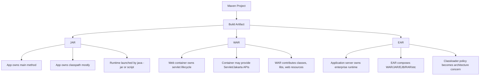
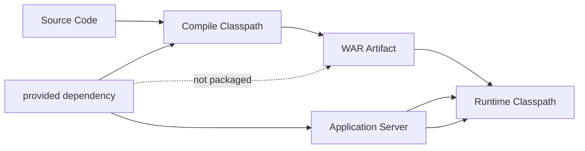
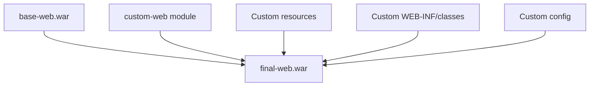
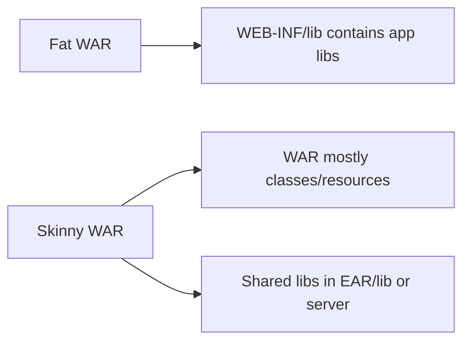
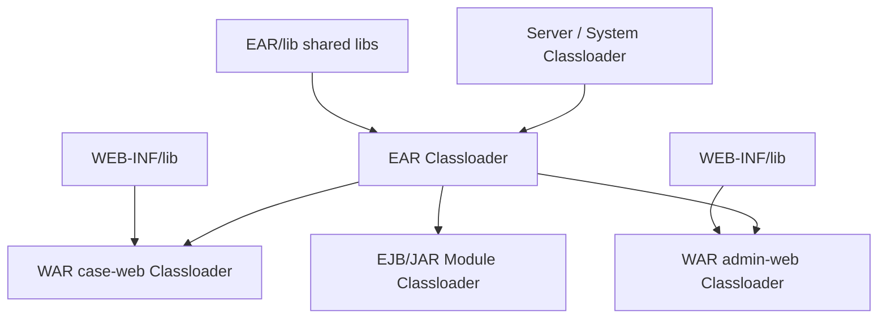
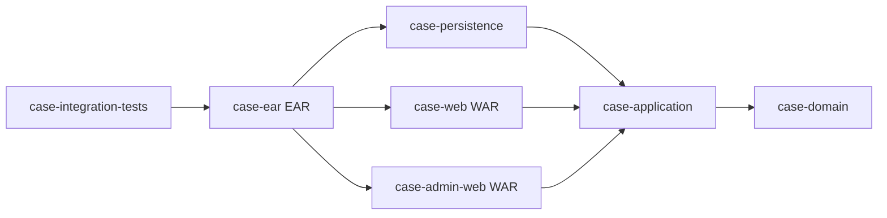
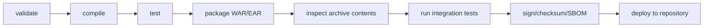

# Part 025 — WAR, EAR, and Jakarta Enterprise Builds

> Target: setelah bagian ini, kamu bisa mendesain build Maven untuk aplikasi web dan enterprise Java/Jakarta secara sadar: kapan memakai `war`, kapan `ear`, dependency mana yang harus `provided`, bagaimana overlay bekerja, bagaimana EAR menyusun module, dan bagaimana mencegah konflik classloader di application server.

Di era container, Kubernetes, Spring Boot, Quarkus, Micronaut, dan executable JAR, banyak engineer menganggap WAR/EAR sebagai legacy.

Itu terlalu simplistik.

WAR/EAR masih muncul di banyak sistem enterprise: bank, telco, insurance, government, core billing, BPM/workflow, case management, regulatory platform, dan sistem yang berjalan di application server seperti WebLogic, WebSphere/Open Liberty, JBoss/WildFly, Payara/GlassFish, TomEE, atau platform internal lama.

Yang membedakan senior engineer bukan apakah ia suka WAR/EAR.

Yang penting adalah apakah ia paham boundary-nya.

WAR/EAR bukan hanya format archive. Mereka adalah **deployment contract dengan runtime container**.

---

## 1. Mental Model: WAR/EAR sebagai Container Contract

Untuk JAR biasa, aplikasi sering membawa runtime sendiri.

Untuk WAR/EAR, sebagian runtime disediakan oleh container.



The core question:

> “Apakah artifact ini membawa runtime, atau ia plug into runtime yang disediakan platform?”

Jika runtime disediakan platform, dependency scope berubah.

Jika dependency scope salah, aplikasi bisa:

- build sukses tetapi deploy gagal;
- deploy sukses tetapi runtime error;
- memakai API versi berbeda dari yang dipakai compile;
- membawa library yang bertabrakan dengan library server;
- diam-diam memakai class dari parent classloader;
- gagal saat migrasi Java EE `javax.*` ke Jakarta EE `jakarta.*`.

---

## 2. Packaging `war`: Apa yang Maven Bangun?

Minimal POM untuk WAR:

```xml
<project>
  <modelVersion>4.0.0</modelVersion>

  <groupId>com.acme.case</groupId>
  <artifactId>case-web</artifactId>
  <version>1.0.0</version>
  <packaging>war</packaging>
</project>
```

Dengan `packaging=war`, Maven mengikat lifecycle default ke plugin goal yang menghasilkan Web Application Archive.

Secara konseptual, WAR berisi:

```txt
case-web-1.0.0.war
├── index.html / static resources
├── WEB-INF/
│   ├── web.xml                  optional di Servlet 3+
│   ├── classes/                 hasil compile project
│   └── lib/                     dependency runtime yang harus ikut WAR
└── META-INF/
```

Maven WAR Plugin bertugas mengumpulkan dependency artifact, class, dan resource web application lalu mengemasnya menjadi WAR.

Konsekuensi engineering-nya:

- class milik project masuk ke `WEB-INF/classes`;
- dependency yang perlu ikut runtime masuk ke `WEB-INF/lib`;
- dependency `provided` tidak ikut WAR;
- resource web dari `src/main/webapp` menjadi root WAR;
- `web.xml` bisa opsional tergantung versi Servlet/Jakarta dan plugin behavior;
- build tidak otomatis menjamin artifact cocok dengan target server.

---

## 3. Standard WAR Layout

Layout konvensional:

```txt
case-web/
├── pom.xml
└── src/
    ├── main/
    │   ├── java/
    │   ├── resources/
    │   └── webapp/
    │       ├── index.jsp
    │       ├── assets/
    │       └── WEB-INF/
    │           └── web.xml
    └── test/
        ├── java/
        └── resources/
```

Mapping konseptual:

| Source | Target di WAR | Catatan |
|---|---|---|
| `src/main/java` | `WEB-INF/classes` | Setelah compile |
| `src/main/resources` | `WEB-INF/classes` | Resource classpath |
| `src/main/webapp` | root WAR | HTML/JSP/static/WEB-INF |
| dependency runtime | `WEB-INF/lib` | Kecuali `provided` |
| dependency provided | tidak dipackage | Disediakan container |

The invariant:

> Isi WAR harus merepresentasikan apa yang aplikasi kontribusikan ke web container, bukan seluruh dunia runtime.

---

## 4. Dependency Scope untuk WAR

Ini bagian yang sering menyebabkan incident.

Contoh POM web application Jakarta:

```xml
<dependencies>
  <dependency>
    <groupId>jakarta.servlet</groupId>
    <artifactId>jakarta.servlet-api</artifactId>
    <version>${jakarta.servlet.version}</version>
    <scope>provided</scope>
  </dependency>

  <dependency>
    <groupId>com.acme.case</groupId>
    <artifactId>case-application</artifactId>
    <version>${project.version}</version>
  </dependency>

  <dependency>
    <groupId>com.fasterxml.jackson.core</groupId>
    <artifactId>jackson-databind</artifactId>
  </dependency>
</dependencies>
```

`jakarta.servlet-api` harus `provided` karena container web menyediakan implementasi runtime.

Jika dibuat `compile` tanpa `provided`, WAR bisa membawa API jar sendiri. Hasilnya bisa tidak langsung gagal, tetapi berisiko menciptakan konflik classloader.

Rule praktis:

| Dependency | Scope biasa pada WAR | Reasoning |
|---|---:|---|
| Servlet API / Jakarta Servlet API | `provided` | Container menyediakan |
| JSP/JSTL API tertentu | sering `provided`, tergantung server | Cek target runtime |
| JAX-RS API bila server menyediakan | `provided` | Hindari duplicate API |
| App internal library | `compile` | Harus ikut WAR kecuali ada shared lib server |
| JDBC driver | tergantung deployment | Bisa di WAR atau server datasource module |
| Logging API | case-by-case | Server logging sering sensitif |
| Logging implementation | hati-hati | Bisa konflik dengan server |
| Test framework | `test` | Tidak masuk artifact |

Jangan membuat scope berdasarkan “agar build sukses”.

Scope harus dibuat berdasarkan runtime ownership.

---

## 5. Provided Scope: Compile-Time Visible, Runtime External

`provided` berarti:

- tersedia saat compile;
- tersedia saat test compile/test dalam beberapa konteks;
- tidak dikemas ke artifact final;
- diasumsikan disediakan oleh runtime environment.

Mental model:



Failure mode klasik:

```txt
java.lang.NoClassDefFoundError: jakarta/servlet/Servlet
```

Interpretasi:

- compile sukses karena API tersedia;
- artifact tidak membawa dependency karena `provided`;
- runtime server ternyata tidak menyediakan API yang sama;
- atau server yang dipakai tidak sesuai target API.

Ini bukan “Maven error”.

Ini contract error antara build dan deployment platform.

---

## 6. Jakarta EE vs Java EE: Boundary `javax.*` dan `jakarta.*`

Migrasi paling penting di enterprise web build modern:

- Java EE lama memakai package `javax.*`;
- Jakarta EE baru memakai package `jakarta.*` untuk banyak API enterprise;
- artifact API dan server runtime harus align.

Contoh mismatch:

```java
import javax.servlet.http.HttpServlet;
```

Dibuild dengan dependency lama, lalu dideploy ke server Jakarta EE baru yang menyediakan `jakarta.servlet.*`.

Atau sebaliknya:

```java
import jakarta.servlet.http.HttpServlet;
```

Dibuild dengan Jakarta Servlet API, lalu dideploy ke server Java EE lama.

Keduanya bukan sekadar beda versi. Package namespace berubah.

Governance rule:

> Dalam satu deployable boundary, jangan campur `javax.*` enterprise stack dan `jakarta.*` enterprise stack kecuali ada compatibility layer yang eksplisit dan diuji.

Checklist:

- target server mendukung Java EE atau Jakarta EE?
- servlet API namespace apa?
- JAX-RS namespace apa?
- Bean Validation namespace apa?
- JPA namespace apa?
- CDI namespace apa?
- framework yang dipakai sudah compatible?
- generated source masih menghasilkan `javax.*` atau sudah `jakarta.*`?

---

## 7. Maven WAR Plugin Configuration

Konfigurasi production-grade biasanya diletakkan di parent `pluginManagement`, lalu dieksekusi di module WAR.

Parent:

```xml
<build>
  <pluginManagement>
    <plugins>
      <plugin>
        <groupId>org.apache.maven.plugins</groupId>
        <artifactId>maven-war-plugin</artifactId>
        <version>${maven-war-plugin.version}</version>
        <configuration>
          <failOnMissingWebXml>false</failOnMissingWebXml>
          <archive>
            <manifestEntries>
              <Build-Revision>${git.commit.id.abbrev}</Build-Revision>
              <Build-Time>${project.build.outputTimestamp}</Build-Time>
            </manifestEntries>
          </archive>
        </configuration>
      </plugin>
    </plugins>
  </pluginManagement>
</build>
```

WAR module:

```xml
<build>
  <plugins>
    <plugin>
      <groupId>org.apache.maven.plugins</groupId>
      <artifactId>maven-war-plugin</artifactId>
    </plugin>
  </plugins>
</build>
```

Important boundary:

- `pluginManagement` defines default configuration;
- `plugins` opts the module into execution/configuration;
- packaging `war` already binds WAR behavior into lifecycle;
- explicit plugin declaration is still useful for readability and governance.

---

## 8. `web.xml`: Required, Optional, or Harmful?

Historically, WAR often needed:

```txt
src/main/webapp/WEB-INF/web.xml
```

Modern Servlet/Jakarta applications may use annotations and initializer APIs instead.

Decision table:

| Situation | `web.xml` strategy |
|---|---|
| Legacy servlet/JSP app | Keep explicit `web.xml` |
| Annotation-based modern servlet app | May omit `web.xml` |
| Regulated app needing explicit deployment contract | Keep minimal explicit descriptor |
| Overlay app that inherits descriptor | Make absence intentional |
| App-server-specific config | Separate vendor descriptor from portable descriptor |

Do not treat missing `web.xml` as automatically good or bad.

Ask:

> Where is the deployment behavior declared, and can we review it?

For regulated or high-control environments, explicit descriptors can be desirable because they are auditable.

---

## 9. WAR Overlay: Powerful, Dangerous, Often Overused

WAR overlay lets one WAR include/override content from another WAR.

Common use cases:

- white-label web application;
- shared portal shell;
- vendor application customization;
- legacy enterprise product extension;
- internal base webapp reused by product variants.

Concept:



Example:

```xml
<dependencies>
  <dependency>
    <groupId>com.acme.platform</groupId>
    <artifactId>base-portal</artifactId>
    <version>${platform.version}</version>
    <type>war</type>
  </dependency>
</dependencies>

<build>
  <plugins>
    <plugin>
      <groupId>org.apache.maven.plugins</groupId>
      <artifactId>maven-war-plugin</artifactId>
      <configuration>
        <overlays>
          <overlay>
            <groupId>com.acme.platform</groupId>
            <artifactId>base-portal</artifactId>
          </overlay>
        </overlays>
      </configuration>
    </plugin>
  </plugins>
</build>
```

Overlay failure modes:

| Failure | Cause |
|---|---|
| File silently overridden | Overlay order misunderstood |
| Security descriptor replaced | Custom overlay shadows base descriptor |
| Static assets stale | Browser/cache/release artifact mismatch |
| Runtime class conflict | Overlay brings unexpected `WEB-INF/lib` |
| Unreviewable customization | Behavior hidden in overlay composition |

Governance rule:

> WAR overlay is acceptable only when overlay order, override policy, and final artifact inspection are part of CI.

Add CI inspection:

```bash
jar tf target/custom-web-*.war | sort > target/war-contents.txt
```

For critical systems, diff final WAR contents across releases.

---

## 10. Skinny WAR vs Fat WAR

A normal WAR may include dependency JARs inside `WEB-INF/lib`.

A skinny WAR removes many libraries from WAR and expects them to be provided elsewhere, often inside EAR-level `lib` or application server shared libraries.



Trade-off:

| Strategy | Benefit | Risk |
|---|---|---|
| Fat WAR | Self-contained within webapp | Larger artifact, duplicate libs across WARs |
| Skinny WAR in EAR | Shared libs, smaller WARs | Classloader complexity |
| Server shared library | Centralized patching | Hidden runtime dependency, coupling to server |

Senior rule:

> Prefer explicit deployable ownership over “some library exists on the server”.

Server shared libraries can be justified for platform-provided APIs or tightly governed enterprise runtime libraries. They are dangerous for ordinary application dependencies because deployability becomes environment-dependent.

---

## 11. Packaging `ear`: Enterprise Archive as Application Assembly

EAR is an application-level archive that can package multiple modules.

Typical structure:

```txt
case-platform-ear-1.0.0.ear
├── META-INF/
│   └── application.xml
├── case-web.war
├── case-admin-web.war
├── case-services.jar
├── lib/
│   ├── shared-domain.jar
│   └── shared-util.jar
└── connector.rar
```

Minimal EAR POM:

```xml
<project>
  <modelVersion>4.0.0</modelVersion>

  <groupId>com.acme.case</groupId>
  <artifactId>case-platform-ear</artifactId>
  <version>1.0.0</version>
  <packaging>ear</packaging>

  <dependencies>
    <dependency>
      <groupId>com.acme.case</groupId>
      <artifactId>case-web</artifactId>
      <version>${project.version}</version>
      <type>war</type>
    </dependency>

    <dependency>
      <groupId>com.acme.case</groupId>
      <artifactId>case-application</artifactId>
      <version>${project.version}</version>
      <type>jar</type>
    </dependency>
  </dependencies>
</project>
```

EAR is not just “WAR plus more files”.

It is an **assembly boundary** for enterprise modules.

---

## 12. Maven EAR Plugin: Modules and Deployment Descriptor

Maven EAR Plugin can generate deployment descriptor such as `application.xml`, and supports different module types: web modules, jar modules, EJB modules, connector modules, application client modules, and others.

Example configuration:

```xml
<build>
  <plugins>
    <plugin>
      <groupId>org.apache.maven.plugins</groupId>
      <artifactId>maven-ear-plugin</artifactId>
      <version>${maven-ear-plugin.version}</version>
      <configuration>
        <version>10</version>
        <defaultLibBundleDir>lib</defaultLibBundleDir>
        <modules>
          <webModule>
            <groupId>com.acme.case</groupId>
            <artifactId>case-web</artifactId>
            <contextRoot>/case</contextRoot>
          </webModule>
          <jarModule>
            <groupId>com.acme.case</groupId>
            <artifactId>case-application</artifactId>
            <bundleDir>lib</bundleDir>
          </jarModule>
        </modules>
      </configuration>
    </plugin>
  </plugins>
</build>
```

The Maven part is straightforward.

The architecture part is not.

You must decide:

- which modules are independently deployable;
- which modules are shared libraries;
- which modules are server-provided;
- which classloader sees which library;
- whether WARs share domain libraries through EAR `lib`;
- whether WAR isolation is required.

---

## 13. EAR Classloader Mental Model

Actual classloader behavior is server-specific, but the mental model is usually some variant of:



This is not guaranteed identical across servers.

But the design implication is stable:

> In EAR deployments, dependency placement is architecture.

If library goes into EAR `lib`, multiple modules may see it.

If library goes into `WEB-INF/lib`, usually only that WAR sees it.

If library goes into server shared library, many applications may see it.

Bad placement causes:

- duplicate classes;
- serialization incompatibility;
- `ClassCastException` between same class name loaded by different classloaders;
- hidden dependency on server library;
- upgrade impact across unrelated applications.

---

## 14. Multi-Module Layout for WAR/EAR Enterprise App

Recommended structure:

```txt
case-platform/
├── pom.xml                         root aggregator
├── case-parent/                    parent POM, packaging pom
├── case-bom/                       dependency alignment BOM
├── case-domain/                    pure domain model
├── case-application/               use cases/application services
├── case-persistence/               database adapter
├── case-web-api/                   web DTO/API boundary if needed
├── case-web/                       WAR
├── case-admin-web/                 WAR
├── case-ear/                       EAR
└── case-integration-tests/         deployment/integration tests
```

Dependency direction:



Important invariant:

> EAR depends on deployable modules. Deployable modules should not depend on EAR.

EAR is assembly. It should not contain business logic.

---

## 15. Parent/BOM Pattern for Enterprise Deployables

Parent POM handles build policy:

```xml
<build>
  <pluginManagement>
    <plugins>
      <plugin>
        <groupId>org.apache.maven.plugins</groupId>
        <artifactId>maven-war-plugin</artifactId>
        <version>${maven-war-plugin.version}</version>
      </plugin>
      <plugin>
        <groupId>org.apache.maven.plugins</groupId>
        <artifactId>maven-ear-plugin</artifactId>
        <version>${maven-ear-plugin.version}</version>
      </plugin>
    </plugins>
  </pluginManagement>
</build>
```

BOM handles dependency versions:

```xml
<dependencyManagement>
  <dependencies>
    <dependency>
      <groupId>jakarta.platform</groupId>
      <artifactId>jakarta.jakartaee-api</artifactId>
      <version>${jakartaee.version}</version>
      <scope>provided</scope>
    </dependency>
  </dependencies>
</dependencyManagement>
```

Do not mix policy ownership randomly.

| Concern | Owner |
|---|---|
| Plugin versions | Parent POM |
| Dependency versions | BOM or parent `dependencyManagement` |
| Dependency declaration | Module POM |
| Deployment assembly | EAR module |
| Runtime server version | Environment/platform contract |
| App-server-specific descriptors | Deployable module |

---

## 16. App Server Provided APIs

For Jakarta EE style application servers, many APIs are provided by the server.

Example:

```xml
<dependency>
  <groupId>jakarta.platform</groupId>
  <artifactId>jakarta.jakartaee-api</artifactId>
  <version>${jakartaee.version}</version>
  <scope>provided</scope>
</dependency>
```

This can be convenient, but be careful.

Using the full platform API as `provided` can hide exact API usage. For stricter systems, prefer smaller APIs:

```xml
<dependency>
  <groupId>jakarta.servlet</groupId>
  <artifactId>jakarta.servlet-api</artifactId>
  <version>${jakarta.servlet.version}</version>
  <scope>provided</scope>
</dependency>

<dependency>
  <groupId>jakarta.ws.rs</groupId>
  <artifactId>jakarta.ws.rs-api</artifactId>
  <version>${jakarta.ws.rs.version}</version>
  <scope>provided</scope>
</dependency>
```

Decision:

| Style | Good for | Risk |
|---|---|---|
| Full platform API | App explicitly targets full Jakarta EE platform | Overbroad compile surface |
| Narrow APIs | Clear boundary and easier migration | More dependency declarations |
| Server vendor libraries | Vendor-specific integration | Lock-in and portability loss |

---

## 17. Vendor Descriptors: Necessary Evil

Portable descriptor:

```txt
WEB-INF/web.xml
META-INF/application.xml
```

Vendor descriptors may include:

```txt
WEB-INF/jboss-web.xml
WEB-INF/weblogic.xml
META-INF/weblogic-application.xml
META-INF/glassfish-application.xml
```

These files can control:

- context root;
- classloader preference;
- security realm;
- resource references;
- session behavior;
- application server-specific deployment behavior.

Governance rule:

> Vendor descriptors are source code, not deployment notes.

They must be:

- versioned;
- reviewed;
- tested against target server version;
- documented in the deployable module;
- not generated by invisible CI scripts.

---

## 18. Filtering Deployment Descriptors: Use Sparingly

It is tempting to filter `web.xml` or vendor descriptors:

```xml
<configuration>
  <filteringDeploymentDescriptors>true</filteringDeploymentDescriptors>
</configuration>
```

This can be useful for:

- version labels;
- environment-independent build metadata;
- explicit context root variants in controlled product builds.

It is dangerous for:

- secrets;
- endpoint URLs that should be runtime config;
- database credentials;
- environment-specific behavior baked into artifact;
- producing different artifacts from same Git commit.

Senior rule:

> If the same source commit produces different WAR/EAR behavior depending on profile, you must be able to explain and audit why.

For most production systems, prefer one artifact promoted across environments, with runtime config externalized.

---

## 19. Testing WAR/EAR Builds

Testing has several layers.

| Layer | Maven Phase | Purpose |
|---|---|---|
| Unit tests | `test` | Code-level behavior |
| Packaging inspection | `package`/`verify` | Artifact contains expected files |
| Integration test | `pre-integration-test` → `verify` | Deploy to container/test runtime |
| Smoke test | CI/CD after deploy | Runtime health |
| Compatibility test | Matrix/server-specific | Server version validation |

Artifact inspection example:

```bash
mvn -pl case-web package
jar tf case-web/target/case-web-*.war | sort | tee target/war-contents.txt
```

Check for forbidden packaged APIs:

```bash
jar tf case-web/target/case-web-*.war \
  | grep 'WEB-INF/lib/.*servlet.*\.jar' \
  && echo 'Servlet API accidentally packaged' && exit 1
```

For EAR:

```bash
jar tf case-ear/target/case-ear-*.ear | sort | tee target/ear-contents.txt
```

You can automate these checks with Maven plugins or CI scripts. The mechanism is less important than the invariant:

> The final deployable artifact must be inspected, not assumed.

---

## 20. Deployment Boundary Decision Matrix

| Requirement | Prefer |
|---|---|
| App server owns Servlet/Jakarta runtime | WAR |
| Multiple enterprise modules deployed as one app | EAR |
| Shared libraries across WAR modules in same app | EAR with controlled `lib` |
| Self-contained service for container runtime | Executable JAR or container image, not EAR |
| Legacy server mandate | WAR/EAR |
| Vendor product customization via web resources | WAR overlay, with strict diff governance |
| Need minimal classloader complexity | Single WAR or executable JAR |
| Need centralized platform services: JTA/JMS/JNDI/EJB | EAR or app-server deployment model |

The decision should be driven by runtime platform, not nostalgia.

---

## 21. Common Failure Modes

### 21.1 Build Succeeds, Deploy Fails

Example:

```txt
UnsupportedClassVersionError
```

Likely causes:

- built with newer Java bytecode than server supports;
- plugin/compiler `release` misaligned;
- CI JDK differs from deployment JDK.

Diagnostic:

```bash
javap -verbose target/classes/com/acme/Foo.class | grep 'major version'
```

### 21.2 `ClassNotFoundException`

Possible causes:

- dependency marked `provided` but server does not provide it;
- dependency not included in WAR/EAR due to scope;
- EAR module placement wrong;
- server module not configured.

Diagnostic:

```bash
mvn dependency:tree -Dscope=runtime
jar tf target/*.war | grep WEB-INF/lib
jar tf target/*.ear | sort
```

### 21.3 `ClassCastException` for Same Class

Example:

```txt
com.acme.User cannot be cast to com.acme.User
```

This usually means same class loaded by two different classloaders.

Look for:

- duplicate library in `EAR/lib` and `WEB-INF/lib`;
- server shared library plus application copy;
- WAR isolation rules;
- vendor classloader preference config.

### 21.4 `NoSuchMethodError`

Likely causes:

- compile-time API version differs from runtime version;
- dependency conflict in WAR/EAR;
- app server provides older library;
- transitive dependency mediation selected unexpected version.

Diagnostic:

```bash
mvn dependency:tree -Dverbose
mvn dependency:tree -Dincludes=groupId:artifactId
```

### 21.5 Works Locally, Fails on Server

Likely causes:

- embedded test container differs from production server;
- local WAR carries dependency that server shadows;
- server has shared libraries not visible locally;
- deployment descriptor differs per environment;
- Maven profile produced different artifact.

Fix the contract. Do not patch symptoms.

---

## 22. Production-Grade WAR POM Example

```xml
<project>
  <modelVersion>4.0.0</modelVersion>

  <parent>
    <groupId>com.acme.case</groupId>
    <artifactId>case-parent</artifactId>
    <version>${revision}</version>
    <relativePath>../case-parent/pom.xml</relativePath>
  </parent>

  <artifactId>case-web</artifactId>
  <packaging>war</packaging>

  <dependencies>
    <dependency>
      <groupId>jakarta.servlet</groupId>
      <artifactId>jakarta.servlet-api</artifactId>
      <scope>provided</scope>
    </dependency>

    <dependency>
      <groupId>com.acme.case</groupId>
      <artifactId>case-application</artifactId>
      <version>${project.version}</version>
    </dependency>

    <dependency>
      <groupId>org.junit.jupiter</groupId>
      <artifactId>junit-jupiter</artifactId>
      <scope>test</scope>
    </dependency>
  </dependencies>

  <build>
    <plugins>
      <plugin>
        <groupId>org.apache.maven.plugins</groupId>
        <artifactId>maven-war-plugin</artifactId>
        <configuration>
          <failOnMissingWebXml>false</failOnMissingWebXml>
          <archive>
            <manifestEntries>
              <Implementation-Title>${project.artifactId}</Implementation-Title>
              <Implementation-Version>${project.version}</Implementation-Version>
            </manifestEntries>
          </archive>
        </configuration>
      </plugin>
    </plugins>
  </build>
</project>
```

Notice:

- no plugin version in module if parent controls it;
- Servlet API is `provided`;
- business module is normal compile dependency;
- test dependency is test-only;
- WAR behavior is explicit enough for review.

---

## 23. Production-Grade EAR POM Example

```xml
<project>
  <modelVersion>4.0.0</modelVersion>

  <parent>
    <groupId>com.acme.case</groupId>
    <artifactId>case-parent</artifactId>
    <version>${revision}</version>
    <relativePath>../case-parent/pom.xml</relativePath>
  </parent>

  <artifactId>case-ear</artifactId>
  <packaging>ear</packaging>

  <dependencies>
    <dependency>
      <groupId>com.acme.case</groupId>
      <artifactId>case-web</artifactId>
      <version>${project.version}</version>
      <type>war</type>
    </dependency>

    <dependency>
      <groupId>com.acme.case</groupId>
      <artifactId>case-admin-web</artifactId>
      <version>${project.version}</version>
      <type>war</type>
    </dependency>

    <dependency>
      <groupId>com.acme.case</groupId>
      <artifactId>case-domain</artifactId>
      <version>${project.version}</version>
    </dependency>
  </dependencies>

  <build>
    <plugins>
      <plugin>
        <groupId>org.apache.maven.plugins</groupId>
        <artifactId>maven-ear-plugin</artifactId>
        <configuration>
          <defaultLibBundleDir>lib</defaultLibBundleDir>
          <modules>
            <webModule>
              <groupId>com.acme.case</groupId>
              <artifactId>case-web</artifactId>
              <contextRoot>/case</contextRoot>
            </webModule>
            <webModule>
              <groupId>com.acme.case</groupId>
              <artifactId>case-admin-web</artifactId>
              <contextRoot>/case-admin</contextRoot>
            </webModule>
            <jarModule>
              <groupId>com.acme.case</groupId>
              <artifactId>case-domain</artifactId>
              <bundleDir>lib</bundleDir>
            </jarModule>
          </modules>
        </configuration>
      </plugin>
    </plugins>
  </build>
</project>
```

Review questions:

- Do WAR modules need to share `case-domain` from EAR `lib`?
- Would duplication inside each WAR be safer?
- Is `contextRoot` controlled in one place?
- Is application.xml generated or committed?
- Does the target server interpret module paths as expected?

---

## 24. Should You Commit `application.xml`?

Generated descriptor is convenient.

Committed descriptor is auditable.

Decision:

| Context | Recommendation |
|---|---|
| Simple EAR, no special server behavior | Generated may be fine |
| Regulated deployment | Commit or generate deterministically and diff |
| Vendor-specific descriptors | Commit |
| Many modules and context roots | Explicit plugin config and artifact inspection |
| Server-specific descriptor | Commit and document |

Invariant:

> Deployment structure must be reviewable from source control or deterministic build output.

---

## 25. CI Pipeline for WAR/EAR

Recommended flow:



Concrete commands:

```bash
mvn -B -U clean verify

mvn -B -pl case-web -am package
jar tf case-web/target/*.war | sort

mvn -B -pl case-ear -am verify
jar tf case-ear/target/*.ear | sort
```

For app-server integration tests, prefer `verify`, not directly `integration-test`, so teardown phases can run.

---

## 26. Senior Review Checklist

Before approving a WAR/EAR Maven change, ask:

### Artifact Boundary

- Is this module supposed to produce WAR, EAR, or JAR?
- Is the packaging type intentional?
- Does artifact name reflect deployable boundary?

### Dependency Scope

- Are server-provided APIs marked `provided`?
- Are runtime dependencies actually packaged?
- Are test dependencies excluded from deployable artifact?
- Are duplicate libraries avoided across WAR/EAR/server?

### Jakarta/Java EE Compatibility

- Does source code use `javax.*` or `jakarta.*`?
- Does target server support that namespace?
- Are generated sources aligned?
- Are old transitive APIs banned?

### Descriptor Governance

- Is `web.xml` needed?
- Are vendor descriptors reviewed?
- Are descriptors filtered?
- Can two environments produce different artifacts?

### Final Artifact Inspection

- Does CI inspect WAR/EAR contents?
- Are forbidden APIs accidentally packaged?
- Are manifests deterministic?
- Is artifact reproducible enough for audit?

### Runtime Diagnostics

- Is deployment tested on target server family?
- Are classloader rules documented?
- Are server shared libraries documented?
- Is rollback artifact immutable?

---

## 27. Part Summary

WAR/EAR builds are not obsolete knowledge. They are still important wherever enterprise Java/Jakarta platforms exist.

The key mental model:

> WAR/EAR packaging is not just archive generation. It is a contract between Maven artifact composition and application server runtime ownership.

What you should now be able to reason about:

- why `provided` matters in web/enterprise deployment;
- how WAR layout maps source directories and dependencies into runtime artifact;
- why Java EE vs Jakarta EE namespace mismatch is a deployment boundary issue;
- when WAR overlay is useful and why it is dangerous;
- how EAR composes modules and shared libraries;
- why classloader placement is architecture;
- how to inspect final deployable artifacts;
- how to review WAR/EAR changes like a senior engineer.

Next part: **Generated Sources and Annotation Processing**.

Generated code is where Maven starts to look simple but behave like a compiler pipeline. We will model where source generation belongs, how annotation processors enter compilation, how OpenAPI/Protobuf/JAXB style generators should be bound, and how to keep generated output deterministic.

---

## References

- Apache Maven WAR Plugin — Introduction: `https://maven.apache.org/plugins/maven-war-plugin/`
- Apache Maven WAR Plugin — `war:war` goal parameters: `https://maven.apache.org/plugins/maven-war-plugin/war-mojo.html`
- Apache Maven EAR Plugin — Introduction: `https://maven.apache.org/plugins/maven-ear-plugin/`
- Apache Maven EAR Plugin — Usage: `https://maven.apache.org/plugins/maven-ear-plugin/usage.html`
- Apache Maven EAR Plugin — Modules: `https://maven.apache.org/plugins/maven-ear-plugin/modules.html`
- Apache Maven EAR Plugin — Skinny WARs: `https://maven.apache.org/plugins/maven-ear-plugin/examples/skinny-wars.html`
- Apache Maven Dependency Mechanism: `https://maven.apache.org/guides/introduction/introduction-to-dependency-mechanism.html`
- Apache Maven Build Lifecycle: `https://maven.apache.org/guides/introduction/introduction-to-the-lifecycle.html`
