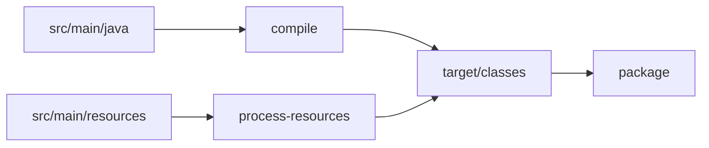
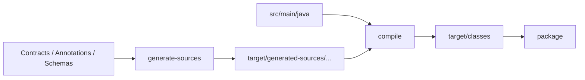
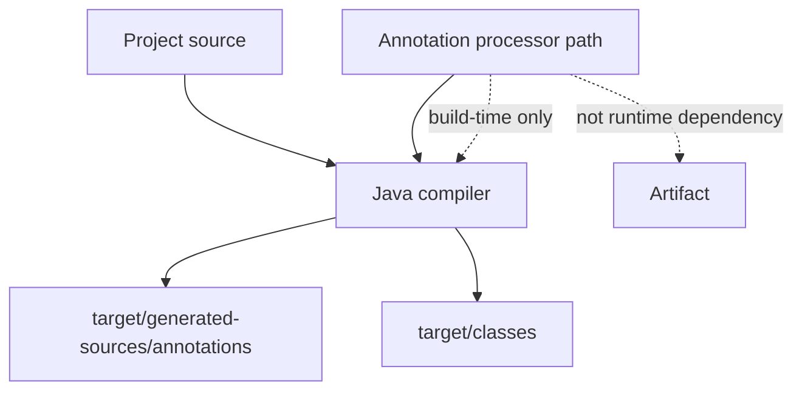
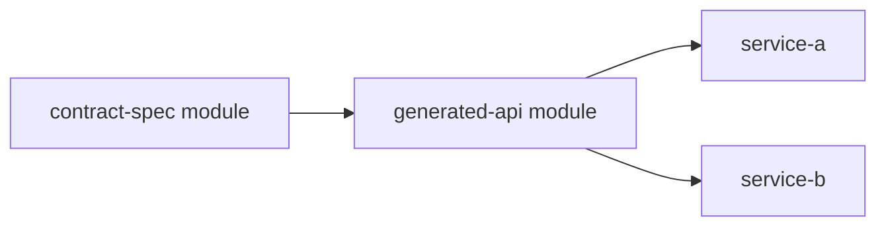
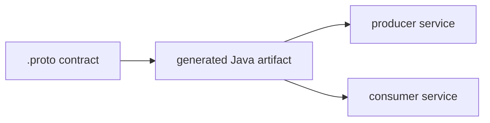
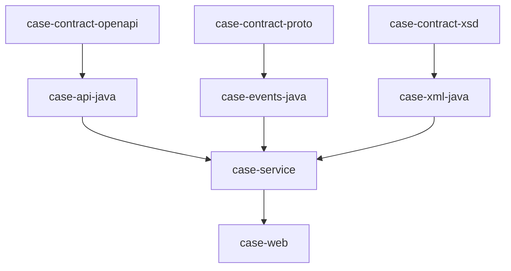

# Part 026 — Generated Sources and Annotation Processing

> Target: setelah bagian ini, kamu bisa mendesain code generation di Maven secara production-grade: kapan generated source dibuat, di phase mana ia masuk, apakah hasilnya dikomit, bagaimana annotation processor dipisahkan dari dependency runtime, dan bagaimana mencegah generated code merusak reproducible build.

Generated code adalah salah satu area paling sering disalahpahami dalam Maven.

Di permukaan, terlihat sederhana:

```bash
mvn compile
```

Lalu tiba-tiba ada source baru di:

```txt
target/generated-sources/...
```

Atau IDE memperlihatkan class yang “ada”, tetapi CI gagal compile.

Atau CI sukses, tetapi rebuild dari source tidak menghasilkan artifact yang sama.

Atau dependency annotation processor ikut bocor ke runtime classpath.

The real problem:

> Code generation membuat build berubah dari “compile source” menjadi “execute compiler pipeline”.

Senior engineer harus tahu pipeline itu.

---

## 1. Mental Model: Source Set Pipeline

Maven build Java normal:



Dengan generated sources:



Generated sources harus ada sebelum compiler membutuhkan class itu.

The invariant:

> Generator harus berjalan sebelum phase yang mengonsumsi output-nya.

Biasanya:

| Output | Phase umum |
|---|---|
| Main generated Java sources | `generate-sources` |
| Main generated resources | `generate-resources` |
| Test generated Java sources | `generate-test-sources` |
| Test generated resources | `generate-test-resources` |
| Annotation processor output | during `compile` or `testCompile` |

---

## 2. Dua Keluarga Code Generation

Ada dua keluarga besar.

### 2.1 Explicit Generator Plugin

Contoh:

- OpenAPI generator;
- Protobuf generator;
- JAXB/XJC generator;
- SQL/JOOQ generator;
- custom internal contract generator;
- grammar/parser generator.

Biasanya dieksekusi pada Maven phase:

```txt
generate-sources
```

Output-nya ditambahkan ke source roots.

### 2.2 Java Annotation Processor

Contoh:

- MapStruct;
- Lombok;
- Hibernate/JPA metamodel;
- Dagger;
- AutoService;
- Immutables;
- custom enterprise annotation processor.

Annotation processor dijalankan oleh Java compiler.

Output biasanya masuk ke:

```txt
target/generated-sources/annotations
```

Perbedaan besar:

| Aspect | Generator Plugin | Annotation Processor |
|---|---|---|
| Trigger | Maven plugin execution | Java compiler |
| Input | schema/spec/file/source/db | annotations/source code |
| Phase | often `generate-sources` | `compile` / `testCompile` |
| Output ownership | plugin-specific | compiler-generated |
| Runtime dependency risk | plugin deps can be isolated | processor can leak if misdeclared |
| IDE sync complexity | medium-high | high with Lombok/MapStruct/etc |

---

## 3. Generated Source Directory Convention

Do not generate into `src/main/java` by default.

Use:

```txt
target/generated-sources/<generator-name>
target/generated-test-sources/<generator-name>
```

Examples:

```txt
target/generated-sources/openapi
target/generated-sources/protobuf
target/generated-sources/jaxb
target/generated-sources/annotations
target/generated-test-sources/openapi-stubs
```

Reasoning:

- `target/` is build output;
- generated files can be cleaned by `mvn clean`;
- source control does not mix human and machine code;
- CI can reproduce generated output;
- review focuses on schema/spec/source of generation, not mechanical output.

Exception exists, but must be deliberate.

---

## 4. Should Generated Code Be Committed?

Default answer:

> Do not commit generated code if the build can deterministically regenerate it.

But enterprise reality is nuanced.

| Situation | Commit generated code? | Reasoning |
|---|---:|---|
| Fast deterministic generator | No | Keep source of truth clean |
| OpenAPI/protobuf in same repo | Usually no | Spec/proto is source of truth |
| Generated code consumed by non-Maven tool | Maybe | Toolchain compatibility |
| Generator unavailable/offline/licensed | Maybe | Build reproducibility risk |
| Generated source is manually patched | Wrong model | Split extension points instead |
| Regulated snapshot of generated contract | Maybe | Audit requirement, but document it |
| Very slow generation | Maybe no; cache instead | Avoid stale committed output |

The better question:

> What is the authoritative source of truth?

If the answer is “both schema and generated code”, you have created a consistency problem.

---

## 5. Basic Generator Binding Pattern

A production-grade generator execution should specify:

- lifecycle phase;
- input directory/file;
- output directory;
- package names;
- deterministic options;
- plugin version via parent `pluginManagement`;
- clear execution id;
- whether generated source root is added automatically.

Pattern:

```xml
<build>
  <plugins>
    <plugin>
      <groupId>com.example</groupId>
      <artifactId>contract-generator-maven-plugin</artifactId>
      <executions>
        <execution>
          <id>generate-contract-sources</id>
          <phase>generate-sources</phase>
          <goals>
            <goal>generate</goal>
          </goals>
          <configuration>
            <inputSpec>${project.basedir}/src/main/contracts/api.yaml</inputSpec>
            <outputDirectory>${project.build.directory}/generated-sources/contracts</outputDirectory>
            <packageName>com.acme.case.contract</packageName>
          </configuration>
        </execution>
      </executions>
    </plugin>
  </plugins>
</build>
```

If the plugin automatically adds generated source root, no extra plugin is needed.

If not, use Build Helper Maven Plugin.

---

## 6. Adding Generated Source Roots with Build Helper

Some generators write files but do not register the output directory as a Maven source root.

Then compiler will not see the generated Java files.

Use `build-helper-maven-plugin`:

```xml
<plugin>
  <groupId>org.codehaus.mojo</groupId>
  <artifactId>build-helper-maven-plugin</artifactId>
  <version>${build-helper-maven-plugin.version}</version>
  <executions>
    <execution>
      <id>add-generated-contract-sources</id>
      <phase>generate-sources</phase>
      <goals>
        <goal>add-source</goal>
      </goals>
      <configuration>
        <sources>
          <source>${project.build.directory}/generated-sources/contracts</source>
        </sources>
      </configuration>
    </execution>
  </executions>
</plugin>
```

Important ordering:

- generator must run before compiler;
- source root must be added before compiler;
- both can bind to `generate-sources`;
- if ordering inside same phase matters, plugin declaration order matters within the same POM build section.

Safer pattern:

- generator in `generate-sources`;
- build-helper in `generate-sources` after generator declaration;
- or generator plugin itself adds source root.

Avoid generating directly under `src/main/java` just to make the compiler see it.

---

## 7. Annotation Processing with Maven Compiler Plugin

Annotation processing runs inside the compiler.

Modern configuration should isolate annotation processors from normal dependencies.

Maven Compiler Plugin supports configuring annotation processor paths.

Example for MapStruct-style processor:

```xml
<plugin>
  <groupId>org.apache.maven.plugins</groupId>
  <artifactId>maven-compiler-plugin</artifactId>
  <configuration>
    <release>${java.release}</release>
    <annotationProcessorPaths>
      <path>
        <groupId>org.mapstruct</groupId>
        <artifactId>mapstruct-processor</artifactId>
        <version>${mapstruct.version}</version>
      </path>
    </annotationProcessorPaths>
    <compilerArgs>
      <arg>-Amapstruct.defaultComponentModel=jakarta</arg>
    </compilerArgs>
  </configuration>
</plugin>
```

Why isolate?

Because annotation processor is a build-time tool, not necessarily runtime code.

Bad pattern:

```xml
<dependency>
  <groupId>org.mapstruct</groupId>
  <artifactId>mapstruct-processor</artifactId>
  <version>${mapstruct.version}</version>
</dependency>
```

This may put processor on normal classpath and possibly leak into packaged artifact or consumers.

Better mental model:



---

## 8. Annotation Processor Dependency vs Annotation API

Some frameworks split API and processor.

Example pattern:

```xml
<dependencies>
  <dependency>
    <groupId>org.mapstruct</groupId>
    <artifactId>mapstruct</artifactId>
  </dependency>
</dependencies>

<build>
  <plugins>
    <plugin>
      <groupId>org.apache.maven.plugins</groupId>
      <artifactId>maven-compiler-plugin</artifactId>
      <configuration>
        <annotationProcessorPaths>
          <path>
            <groupId>org.mapstruct</groupId>
            <artifactId>mapstruct-processor</artifactId>
            <version>${mapstruct.version}</version>
          </path>
        </annotationProcessorPaths>
      </configuration>
    </plugin>
  </plugins>
</build>
```

Mental model:

| Artifact | Purpose | Classpath |
|---|---|---|
| Annotation/API library | Used by source code | compile/runtime if needed |
| Processor library | Generates code at compile time | processor path only |

For Lombok-like tools, behavior can differ because the tool modifies compiler behavior. Still, the review question remains:

> Is this artifact needed at runtime, or only by the compiler?

---

## 9. Explicit Processor Selection

Relying on automatic processor discovery can be convenient but risky in large builds.

A transitive dependency may accidentally contribute a processor.

Safer options:

- explicitly configure `annotationProcessorPaths`;
- explicitly list processors with compiler args when needed;
- disable processing in modules that do not need it;
- keep processors out of broad parent defaults unless every module needs them.

Example disabling processing for a module:

```xml
<plugin>
  <groupId>org.apache.maven.plugins</groupId>
  <artifactId>maven-compiler-plugin</artifactId>
  <configuration>
    <proc>none</proc>
  </configuration>
</plugin>
```

Use this carefully. If a module requires generated code, this will break it.

---

## 10. Multi-Module Generated Source Architecture

Common anti-pattern:

```txt
service-a generates DTOs
service-b imports service-a target/generated-sources somehow
```

This is wrong.

A module should not depend on another module’s `target/` directory.

Correct model:



Example structure:

```txt
case-platform/
├── case-contracts/           owns OpenAPI/proto/xsd files
├── case-generated-api/       generates Java API classes from contracts
├── case-service/             depends on generated API artifact
└── case-web/                 depends on service/API artifacts
```

Generated code should be published as normal compiled artifact if other modules need it.

Do not share generated directories.

---

## 11. OpenAPI Generation Pattern

For contract-first systems, OpenAPI may generate:

- server interfaces;
- client SDK;
- DTO/model classes;
- API documentation helpers;
- test stubs.

A sane Maven architecture separates source of truth from generated output.

```txt
case-api-contract/
└── src/main/openapi/case-api.yaml

case-api-generated/
└── pom.xml    runs generator and publishes jar
```

Conceptual plugin execution:

```xml
<plugin>
  <groupId>org.openapitools</groupId>
  <artifactId>openapi-generator-maven-plugin</artifactId>
  <version>${openapi-generator-maven-plugin.version}</version>
  <executions>
    <execution>
      <id>generate-case-api</id>
      <phase>generate-sources</phase>
      <goals>
        <goal>generate</goal>
      </goals>
      <configuration>
        <inputSpec>${project.basedir}/../case-api-contract/src/main/openapi/case-api.yaml</inputSpec>
        <generatorName>jaxrs-spec</generatorName>
        <output>${project.build.directory}/generated-sources/openapi</output>
        <apiPackage>com.acme.case.api</apiPackage>
        <modelPackage>com.acme.case.api.model</modelPackage>
        <configOptions>
          <dateLibrary>java8</dateLibrary>
          <interfaceOnly>true</interfaceOnly>
          <useJakartaEe>true</useJakartaEe>
        </configOptions>
      </configuration>
    </execution>
  </executions>
</plugin>
```

Review questions:

- Is generated code server-side interface, client SDK, or DTO model?
- Is generator version pinned?
- Is output package stable?
- Does generator produce `javax.*` or `jakarta.*` imports?
- Are generated timestamps disabled if supported?
- Are generated files deterministic across machines?
- Are generated models compatible with JSON library policy?

---

## 12. Protobuf Generation Pattern

Protobuf generation usually starts from `.proto` files.

Recommended source layout:

```txt
case-events-proto/
└── src/main/proto/
    ├── case_event.proto
    └── enforcement_event.proto
```

Generated Java should normally become a normal artifact:

```txt
case-events-java/
└── target/generated-sources/protobuf/java
```

Architecture:



Important governance:

- `.proto` is source of truth;
- generated Java artifact should be versioned normally;
- event schema compatibility must be tested separately;
- do not make each consumer regenerate slightly different Java from copied proto;
- keep generator/protoc version consistent.

Failure modes:

| Failure | Cause |
|---|---|
| Different generated classes across services | Different generator/protoc versions |
| Runtime serialization mismatch | Schema compatibility not governed |
| Duplicate proto classes | Multiple generated artifacts on classpath |
| Non-reproducible artifact | Generator embeds timestamp/path |

---

## 13. JAXB/XJC Generation Pattern

XSD-driven Java generation appears in SOAP, XML integrations, regulatory reporting, document exchange, and older enterprise systems.

Source layout:

```txt
case-xml-contract/
└── src/main/xsd/
    └── enforcement-case.xsd
```

Generated package:

```txt
com.acme.case.xml.enforcement
```

Review questions:

- Does XSD map to stable Java package?
- Are binding files used for naming/customization?
- Is output Jakarta XML Binding or old JAXB namespace?
- Does target Java version require external JAXB dependencies?
- Are generated classes committed or regenerated?
- Is schema evolution backward compatible?

Important architectural point:

> XML schema generation belongs in a contract module, not hidden inside a random service module.

If multiple services consume the same schema, generate and publish a shared contract artifact.

---

## 14. Generated Sources and Clean Builds

Always verify:

```bash
mvn clean verify
```

Not just:

```bash
mvn compile
```

Why?

Because generated source bugs often hide in stale `target/` directories.

Clean build reveals:

- missing generator execution;
- generated directory not added to source roots;
- wrong phase binding;
- IDE-only generated code;
- local files that CI does not have;
- accidental dependency on previous build output.

Clean-room test:

```bash
git clean -xdf
mvn -B -U clean verify
```

If this fails but IDE works, Maven build is incomplete.

---

## 15. IDE vs Maven: Maven Must Be Source of Truth

IDE integration often runs annotation processors or generators differently.

Risk:

- IDE generated code appears in editor but not Maven build;
- Maven generates code but IDE does not mark source root;
- IDE uses different annotation processor version;
- IDE plugin silently adds source root;
- developer commits generated files by accident.

Rule:

> IDE may assist, but Maven must fully define the build.

Verification:

```bash
git clean -xdf
mvn clean verify
```

If Maven cannot build from clean checkout, the project is not buildable.

---

## 16. Generated Code and Reproducible Builds

Generators often break reproducibility by embedding:

- timestamps;
- local filesystem paths;
- user names;
- generator version comments;
- unstable ordering;
- locale-dependent output;
- OS-specific line endings;
- random IDs;
- network-fetched schema fragments.

Reproducibility checklist:

| Concern | Mitigation |
|---|---|
| Timestamp in generated files | Disable if generator supports it |
| Unstable ordering | Sort input/spec definitions if possible |
| Local path comments | Disable metadata comments |
| Generator version drift | Pin plugin/tool version |
| Remote schemas | Vendor/cache/pin them |
| Locale/timezone output | Set CI env deterministically |
| Line endings | Enforce `.gitattributes` |
| Generated output committed | Diff generated output in CI |

If generator cannot produce deterministic output, isolate the blast radius:

- generate in a dedicated module;
- publish artifact once;
- compare API compatibility rather than file content;
- document generator nondeterminism.

---

## 17. Generated Sources and Incremental Builds

Maven itself is not a full content-addressed incremental build system.

Many generator plugins implement their own skip/staleness logic.

Do not assume it is correct.

Failure modes:

| Symptom | Likely cause |
|---|---|
| Changed schema but generated code stale | Generator skip logic wrong |
| Removed field still exists in generated code | Output directory not cleaned |
| CI differs from local | Local stale generated files |
| Partial reactor build fails | Generator module not included |
| `-pl service -am` misses contract generation | Dependency graph modeled incorrectly |

Safer pattern:

- generate into clean `target/generated-sources/...`;
- do not reuse `src/main/java`;
- ensure `mvn clean verify` is canonical;
- model generated artifacts as module dependencies;
- avoid hidden file system coupling.

---

## 18. Do Not Generate Into Another Module

Bad:

```xml
<outputDirectory>../case-api/src/main/java</outputDirectory>
```

This makes one module write into another module.

Problems:

- reactor ordering becomes fragile;
- clean behavior is unclear;
- parallel builds can corrupt output;
- module boundary is violated;
- IDE state becomes confusing;
- generated code may be committed accidentally.

Correct:

```txt
case-api-generated
└── target/generated-sources/openapi
```

Then publish/use:

```xml
<dependency>
  <groupId>com.acme.case</groupId>
  <artifactId>case-api-generated</artifactId>
  <version>${project.version}</version>
</dependency>
```

The artifact is the boundary, not the filesystem.

---

## 19. Generated Test Sources

Generated test sources are useful for:

- contract test stubs;
- generated fixtures;
- mock clients;
- test data builders;
- embedded schemas for compatibility testing.

Use `generate-test-sources`:

```xml
<execution>
  <id>generate-test-stubs</id>
  <phase>generate-test-sources</phase>
  <goals>
    <goal>generate</goal>
  </goals>
  <configuration>
    <outputDirectory>${project.build.directory}/generated-test-sources/contracts</outputDirectory>
  </configuration>
</execution>
```

If source root is not auto-added:

```xml
<execution>
  <id>add-generated-test-sources</id>
  <phase>generate-test-sources</phase>
  <goals>
    <goal>add-test-source</goal>
  </goals>
  <configuration>
    <sources>
      <source>${project.build.directory}/generated-test-sources/contracts</source>
    </sources>
  </configuration>
</execution>
```

Keep test-generated code out of main artifact.

---

## 20. Generated Resources

Not all generated output is Java.

Examples:

- OpenAPI docs;
- JSON schema bundle;
- Avro schema registry files;
- static documentation;
- SQL migration metadata;
- generated configuration metadata;
- service descriptors.

Use appropriate phases:

```txt
generate-resources
process-resources
generate-test-resources
process-test-resources
```

Do not add generated resources to Java source roots.

Model them as resources.

Example using build-helper for resources:

```xml
<execution>
  <id>add-generated-resources</id>
  <phase>generate-resources</phase>
  <goals>
    <goal>add-resource</goal>
  </goals>
  <configuration>
    <resources>
      <resource>
        <directory>${project.build.directory}/generated-resources/contracts</directory>
      </resource>
    </resources>
  </configuration>
</execution>
```

---

## 21. Annotation Processing and Java Modules

With Java module system, annotation processing can get stricter.

Review:

- does processor need access to module internals?
- does generated code target module path or classpath?
- is `module-info.java` updated?
- does generated package belong to module exports?
- are split packages created?

Generated code can accidentally create split packages:

```txt
src/main/java/com/acme/case/api/Foo.java
target/generated-sources/openapi/com/acme/case/api/Bar.java
```

This can be okay if intentional, but it makes ownership fuzzy.

Better:

- generated package has clear subpackage;
- human extension points live separately;
- module exports are explicit.

---

## 22. Generated Code Extension Pattern

Never manually edit generated code.

Instead use extension patterns:

### 22.1 Interface + Implementation

Generated:

```java
public interface CaseApi {
    Response getCase(String caseId);
}
```

Human code:

```java
public final class CaseResource implements CaseApi {
    @Override
    public Response getCase(String caseId) {
        return service.getCase(caseId);
    }
}
```

### 22.2 Partial Mapping Layer

Generated DTO:

```java
public class CaseDto { }
```

Human mapper:

```java
public final class CaseDtoMapper {
    public CaseDto fromDomain(Case domain) {
        // explicit mapping
    }
}
```

### 22.3 Wrapper/Adapter

Generated client:

```java
public class ExternalRegulatorClient { }
```

Human adapter:

```java
public final class RegulatorGateway {
    private final ExternalRegulatorClient client;
}
```

The invariant:

> Generated code is replaceable output. Human behavior should live outside it.

---

## 23. Contract-First Module Blueprint

For OpenAPI/Protobuf/XSD heavy systems:

```txt
regulatory-platform/
├── platform-parent/
├── platform-bom/
├── case-contract-openapi/
│   └── src/main/openapi/case.yaml
├── case-contract-proto/
│   └── src/main/proto/case_event.proto
├── case-contract-xsd/
│   └── src/main/xsd/case-report.xsd
├── case-api-java/
│   └── generates Java from OpenAPI
├── case-events-java/
│   └── generates Java from Protobuf
├── case-xml-java/
│   └── generates Java from XSD
├── case-service/
└── case-web/
```

Dependency direction:



Benefit:

- generator concerns are isolated;
- generated artifacts have normal Maven coordinates;
- downstream modules do not know generator details;
- CI can test contract modules separately;
- versioning and compatibility review become explicit.

---

## 24. Dependency Management for Generators

Generator plugin versions belong in parent `pluginManagement`.

Generator runtime/library versions belong in dependency management or plugin config depending on mechanism.

Example parent:

```xml
<properties>
  <maven-compiler-plugin.version>...</maven-compiler-plugin.version>
  <build-helper-maven-plugin.version>...</build-helper-maven-plugin.version>
  <openapi-generator-maven-plugin.version>...</openapi-generator-maven-plugin.version>
</properties>

<build>
  <pluginManagement>
    <plugins>
      <plugin>
        <groupId>org.apache.maven.plugins</groupId>
        <artifactId>maven-compiler-plugin</artifactId>
        <version>${maven-compiler-plugin.version}</version>
      </plugin>
      <plugin>
        <groupId>org.codehaus.mojo</groupId>
        <artifactId>build-helper-maven-plugin</artifactId>
        <version>${build-helper-maven-plugin.version}</version>
      </plugin>
      <plugin>
        <groupId>org.openapitools</groupId>
        <artifactId>openapi-generator-maven-plugin</artifactId>
        <version>${openapi-generator-maven-plugin.version}</version>
      </plugin>
    </plugins>
  </pluginManagement>
</build>
```

Do not let each module pick generator versions independently.

Codegen version drift is schema drift in disguise.

---

## 25. Security and Supply Chain Considerations

Code generation expands supply chain risk.

A generator can execute code during build.

A malicious or compromised generator can:

- inject source code;
- alter generated authentication logic;
- leak environment variables;
- fetch remote content;
- produce different code in CI vs local;
- add unexpected dependencies.

Controls:

- pin plugin versions;
- resolve plugins from trusted repository manager;
- avoid unreviewed plugin repositories;
- run CI with minimal secrets;
- inspect generated diff on generator upgrades;
- create SBOM after generation/package;
- ban network access during generation where possible;
- review generated code for critical boundary changes.

For high-risk systems, generator upgrades should be treated like compiler upgrades.

---

## 26. Diagnostic Playbook

### 26.1 Generated Class Missing in CI

Symptoms:

```txt
cannot find symbol: class CaseApi
```

Check:

```bash
mvn -X clean compile
ls -R target/generated-sources
mvn help:effective-pom
```

Likely causes:

- generator not bound to phase;
- generated directory not added as source root;
- plugin execution hidden behind inactive profile;
- IDE generated code locally;
- module not included in partial reactor build.

### 26.2 Generated Code Stale

Check:

```bash
git clean -xdf
mvn clean verify
```

Likely causes:

- generating into `src/main/java`;
- output directory not cleaned;
- generator skip flag enabled;
- stale committed generated code;
- schema copied instead of referenced from source module.

### 26.3 Processor Runs Locally but Not in CI

Check:

```bash
mvn -X -DskipTests compile
mvn help:effective-pom
```

Likely causes:

- IDE annotation processing enabled but Maven config missing;
- processor dependency declared only in IDE;
- Maven profile active locally only;
- JDK/compiler version mismatch;
- processor path not configured.

### 26.4 Processor Leaks to Runtime

Check:

```bash
mvn dependency:tree -Dincludes=org.mapstruct:mapstruct-processor
jar tf target/*.jar | grep processor
```

Likely causes:

- processor declared as normal dependency;
- processor included transitively;
- shading/fat packaging pulled build-time tool into artifact.

### 26.5 Generated Code Uses Wrong Namespace

Example:

```txt
javax.annotation.Generated
```

but target platform expects Jakarta.

Check:

- generator config;
- generator version;
- Java/Jakarta EE target;
- generated source imports;
- dependency management.

---

## 27. Review Checklist

Before approving generated-source change:

### Source of Truth

- What input generates the code?
- Is that input versioned?
- Is generated output committed? If yes, why?
- Can clean checkout reproduce output?

### Lifecycle

- Which Maven phase runs generation?
- Is source root added correctly?
- Does generation happen before compile/test compile?
- Does partial reactor build include generator module?

### Dependency Boundary

- Are annotation processors isolated from runtime classpath?
- Are generator plugins pinned?
- Are generated artifacts normal Maven dependencies?
- Is there any filesystem coupling across modules?

### Determinism

- Are timestamps disabled?
- Are file paths/usernames absent?
- Are generated files stable across OS/JDK?
- Are remote schemas pinned or vendored?

### Runtime/API Compatibility

- Do generated sources use correct Java/Jakarta namespace?
- Are package names stable?
- Does generated API create binary compatibility issues?
- Are consumers insulated through adapters/interfaces?

### CI

- Does `git clean -xdf && mvn clean verify` pass?
- Does CI inspect generated artifacts when critical?
- Is generator upgrade reviewed as a behavioral change?

---

## 28. Implementation Recipes

### Recipe A: Generated Code Private to One Module

Use when generated classes are only implementation detail of one module.

```txt
service-module
├── src/main/openapi/internal.yaml
└── target/generated-sources/openapi
```

Rules:

- generate during `generate-sources`;
- do not publish generated source separately;
- do not expose generated types in public API;
- do not let other modules depend on generated directory.

### Recipe B: Generated API Shared by Multiple Modules

Use when generated classes are public contract.

```txt
contract-spec-module --> generated-api-module --> consumers
```

Rules:

- generated API module produces JAR;
- consumers depend on JAR;
- spec/schema is versioned;
- compatibility is tested;
- generator config is owned centrally.

### Recipe C: Annotation Processor for Mapping

Use when generated implementation is derived from annotated interfaces.

```txt
source interface + annotations --> compiler processor --> generated implementation
```

Rules:

- API dependency normal;
- processor dependency on annotation processor path;
- generated implementation not manually edited;
- processor config explicit;
- CI clean build verifies generation.

### Recipe D: Regulatory XML Schema Contract

Use when XSD is external contract.

```txt
xsd-contract-module --> generated-xml-model-module --> service modules
```

Rules:

- binding files versioned;
- generated package stable;
- schema compatibility reviewed;
- generated Java not hand-patched;
- generated artifact version aligns with contract release.

---

## 29. Anti-Patterns

### Anti-Pattern 1: “Generate into `src/main/java`”

Usually done to make IDE happy.

Cost:

- stale files;
- noisy diffs;
- merge conflicts;
- accidental manual edits;
- unclear source ownership.

### Anti-Pattern 2: “Processor as Compile Dependency”

Cost:

- classpath pollution;
- runtime packaging leak;
- consumer dependency leak;
- harder dependency convergence.

### Anti-Pattern 3: “Each Service Regenerates the Same Contract”

Cost:

- generator drift;
- incompatible models;
- duplicated classes;
- contract version ambiguity.

### Anti-Pattern 4: “Generated Code Is the Design”

Generated code is not architecture.

Architecture lives in:

- contract boundaries;
- adapter layers;
- compatibility rules;
- source of truth;
- versioning strategy.

### Anti-Pattern 5: “Profile-Dependent Codegen”

Example:

```bash
mvn package -Pdev
mvn package -Pprod
```

produces different generated Java.

This is dangerous unless the product intentionally builds different variants.

For environment differences, use runtime config, not generated source variants.

---

## 30. Part Summary

Generated sources are not a side note. They are a compiler pipeline concern.

The core mental model:

> Maven does not just compile source. Maven can generate source, add source roots, run processors, compile generated output, package it, and publish it. Every step needs an explicit owner.

What you should now be able to reason about:

- explicit generator plugins vs annotation processors;
- correct Maven phases for generated main/test sources;
- why `target/generated-sources` is the normal output location;
- when generated code should or should not be committed;
- how to isolate annotation processors from runtime dependencies;
- why generated code should become a normal Maven artifact when shared;
- how OpenAPI/Protobuf/JAXB generation should be structured;
- how generators affect reproducibility and supply-chain security;
- how to debug missing/stale generated classes.

Next part: **Build Helper and Non-Standard Layouts**.

We will go deeper into controlled deviations from Maven conventions: adding sources/resources, generated directories, legacy source trees, migration projects, and how to avoid turning Build Helper into a permanent workaround for bad module boundaries.

---

## References

- Apache Maven Compiler Plugin — compile goal parameters: `https://maven.apache.org/plugins/maven-compiler-plugin/compile-mojo.html`
- Apache Maven Compiler Plugin 4.x — Annotation processors example: `https://maven.apache.org/plugins/maven-compiler-plugin-4.x/examples/annotation-processor.html`
- Apache Maven Build Lifecycle: `https://maven.apache.org/guides/introduction/introduction-to-the-lifecycle.html`
- MojoHaus Build Helper Maven Plugin — Introduction: `https://www.mojohaus.org/build-helper-maven-plugin/`
- MojoHaus Build Helper Maven Plugin — add-source goal: `https://www.mojohaus.org/build-helper-maven-plugin/add-source-mojo.html`
- Apache Maven Standard Directory Layout: `https://maven.apache.org/guides/introduction/introduction-to-the-standard-directory-layout.html`
- Apache Maven Reproducible Builds Guide: `https://maven.apache.org/guides/mini/guide-reproducible-builds.html`
