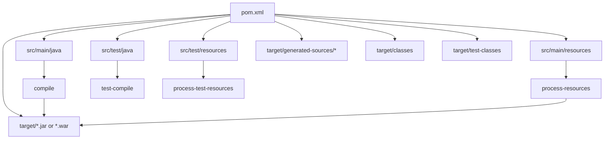
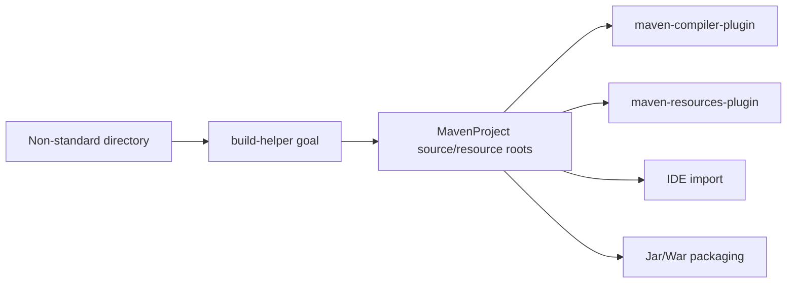
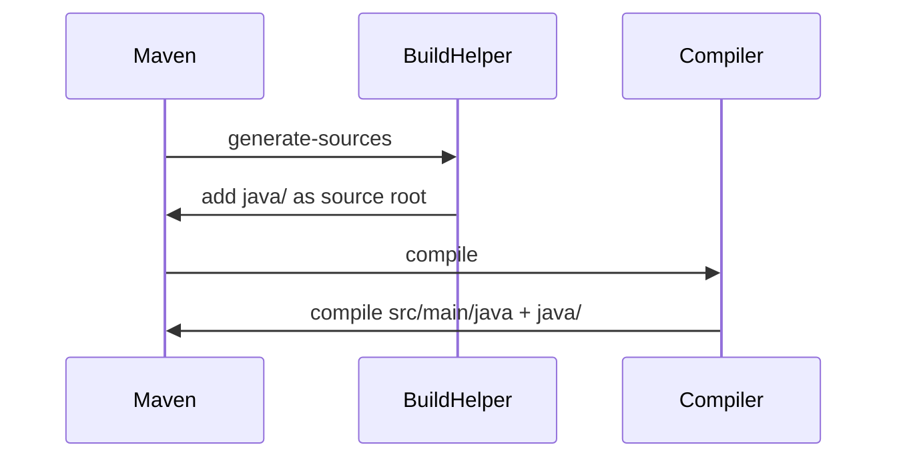
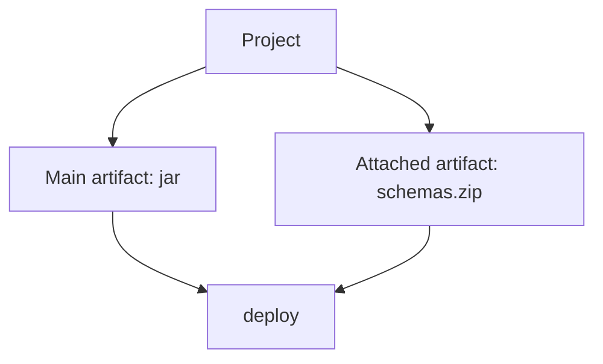
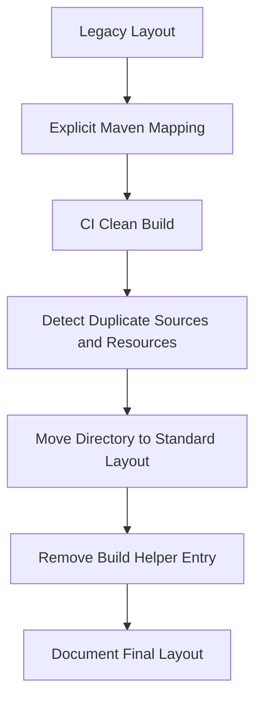
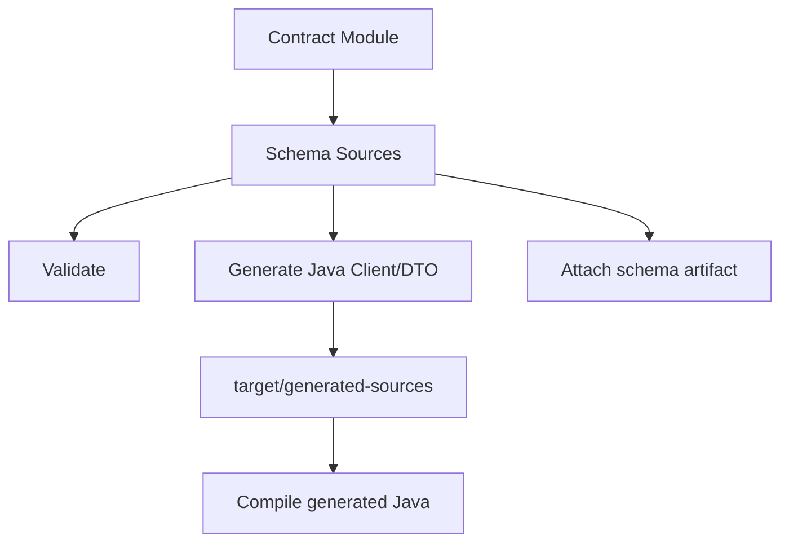

# Part 027 — Build Helper and Non-Standard Layouts

> Target pembelajaran: setelah membaca part ini, kamu tidak hanya tahu cara menambahkan source directory ke Maven, tetapi mampu memutuskan **kapan layout non-standard layak dipertahankan, kapan harus dimigrasi, dan bagaimana menjaganya tetap deterministic, readable, dan aman untuk CI**.

Maven sangat kuat karena convention. Struktur seperti `src/main/java`, `src/main/resources`, `src/test/java`, dan `src/test/resources` bukan sekadar kebiasaan. Itu adalah **kontrak build** antara developer, IDE, plugin, CI, static analysis, packaging, dan deployment pipeline.

Masalahnya, project production jarang sempurna.

Kamu akan bertemu project seperti ini:

```txt
legacy-service/
├── java/
│   └── com/company/app/...
├── config/
│   └── default.properties
├── generated/
│   └── java/...
├── test/
│   └── com/company/app/...
├── sql/
│   └── migrations/...
├── schemas/
│   ├── xsd/...
│   └── openapi/...
└── pom.xml
```

Atau project enterprise seperti ini:

```txt
case-management-platform/
├── domain-model/
├── bpm-processes/
│   └── src/main/bpmn/...
├── contract-schemas/
│   └── src/main/xsd/...
├── db-migrations/
│   └── src/main/plpgsql/...
├── service-runtime/
│   └── src/main/java/...
└── pom.xml
```

Pertanyaan senior bukan “bagaimana supaya Maven mau build?”

Pertanyaan senior adalah:

> Apakah layout exception ini memperjelas boundary sistem, atau hanya menyembunyikan debt?

Part ini membahas jawabannya.

---

## 1. Mental Model: Maven Layout adalah Build Contract

Maven melihat project melalui beberapa root utama:



Default layout membuat banyak plugin bisa bekerja tanpa konfigurasi eksplisit:

- compiler tahu source utama ada di `src/main/java`
- resources plugin tahu resource utama ada di `src/main/resources`
- surefire tahu test class berasal dari `src/test/java`
- packaging plugin tahu output ada di `target/classes`
- IDE tahu apa yang harus dianggap source root
- CI tidak perlu konfigurasi project-specific

Jadi ketika kamu menambah source/resource root non-standard, kamu sedang menulis ulang sebagian kontrak itu.

---

## 2. The Rule: Standard Layout First, Exception Second

Gunakan prinsip berikut:

```txt
Jika source/resource bisa dipindah ke standard Maven layout tanpa merusak ownership,
lakukan migrasi layout.

Jika source/resource dihasilkan oleh build,
taruh di target/generated-* dan deklarasikan sebagai generated source.

Jika source/resource berasal dari legacy atau external tool yang belum bisa diubah,
buat adapter konfigurasi yang eksplisit, terisolasi, dan punya rencana migrasi.
```

Tabel keputusan:

| Kondisi | Solusi Preferensi | Alasan |
|---|---|---|
| Source Java normal di folder lama `java/` | Migrasi ke `src/main/java` | Mengurangi konfigurasi custom dan IDE friction. |
| Test Java lama di `test/` | Migrasi ke `src/test/java` | Sesuai Surefire/Failsafe dan IDE. |
| Source Java hasil generator | `target/generated-sources/<generator>` | Output build tidak boleh dicampur dengan source manual. |
| Resource hasil generator | `target/generated-resources/<generator>` | Bisa dibersihkan dengan `mvn clean`. |
| Schema, SQL, BPMN, OpenAPI sebagai contract source | Simpan di `src/main/<type>` atau module khusus | Bukan Java source, tapi tetap first-class project input. |
| Vendor tool wajib folder tertentu | Tambahkan root eksplisit dengan Build Helper atau plugin terkait | Terima exception, tapi dokumentasikan. |
| Folder random dipakai karena “dulu begitu” | Refactor layout | Jangan mengabadikan accidental architecture. |

---

## 3. Apa Itu Build Helper Maven Plugin?

`build-helper-maven-plugin` adalah plugin dari MojoHaus yang menyediakan goal utilitas untuk membantu lifecycle Maven. Goal yang paling sering dipakai dalam konteks layout adalah:

- `build-helper:add-source`
- `build-helper:add-test-source`
- `build-helper:add-resource`
- `build-helper:add-test-resource`
- `build-helper:attach-artifact`

Menurut dokumentasi MojoHaus, `build-helper:add-source` menambahkan source directory tambahan ke POM dan default bind ke phase `generate-sources`. `build-helper:add-resource` menambahkan resource directory tambahan dan default bind ke phase `generate-resources`.

Sumber resmi:

- Build Helper `add-source`: https://www.mojohaus.org/build-helper-maven-plugin/add-source-mojo.html
- Build Helper `add-resource`: https://www.mojohaus.org/build-helper-maven-plugin/add-resource-mojo.html
- Build Helper plugin info: https://www.mojohaus.org/build-helper-maven-plugin/plugin-info.html

Mental model:



Build Helper bukan compiler. Ia hanya memberi tahu Maven:

> “Folder ini harus dianggap sebagai source/resource root dalam build model.”

---

## 4. Pattern 1 — Menambahkan Legacy Main Source Directory

Misalnya legacy code ada di `java/`.

```txt
legacy-service/
├── java/
│   └── com/acme/legacy/LegacyService.java
├── src/main/resources/
└── pom.xml
```

Konfigurasi:

```xml
<build>
  <plugins>
    <plugin>
      <groupId>org.codehaus.mojo</groupId>
      <artifactId>build-helper-maven-plugin</artifactId>
      <version>${build-helper-maven-plugin.version}</version>
      <executions>
        <execution>
          <id>add-legacy-main-source</id>
          <phase>generate-sources</phase>
          <goals>
            <goal>add-source</goal>
          </goals>
          <configuration>
            <sources>
              <source>${project.basedir}/java</source>
            </sources>
          </configuration>
        </execution>
      </executions>
    </plugin>
  </plugins>
</build>
```

Kenapa `generate-sources`?

Karena compiler berjalan di phase `compile`. Source root tambahan harus sudah terdaftar sebelum compile.



Review senior:

- Apakah ini solusi sementara untuk migrasi?
- Apakah folder `java/` punya ownership jelas?
- Apakah CI dan IDE sama-sama melihat folder itu sebagai source root?
- Apakah static analysis juga membaca folder itu?
- Apakah ada class duplicate antara `java/` dan `src/main/java`?

---

## 5. Pattern 2 — Menambahkan Generated Source Directory

Generator yang benar biasanya menulis ke `target/generated-sources/<tool>`.

Contoh:

```txt
service-contract/
├── src/main/openapi/case-api.yaml
├── target/generated-sources/openapi/
│   └── com/acme/caseapi/generated/...
└── pom.xml
```

Jika generator plugin belum otomatis menambahkan source root, gunakan Build Helper:

```xml
<execution>
  <id>add-openapi-generated-sources</id>
  <phase>generate-sources</phase>
  <goals>
    <goal>add-source</goal>
  </goals>
  <configuration>
    <sources>
      <source>${project.build.directory}/generated-sources/openapi</source>
    </sources>
  </configuration>
</execution>
```

Rule penting:

```txt
Generated source boleh masuk compile classpath.
Generated source tidak boleh menjadi source of truth manual.
```

Jangan taruh generated code di `src/main/java` kecuali kamu memang mengubahnya menjadi source manual yang di-maintain manusia. Kalau generator overwrite folder manual, kamu menciptakan failure mode yang mahal:

- review diff penuh noise
- merge conflict besar
- developer edit generated code lalu hilang saat generate ulang
- source tidak deterministic karena tergantung versi generator lokal
- IDE dan CI menghasilkan source berbeda

---

## 6. Pattern 3 — Menambahkan Test Source Non-Standard

Legacy test di folder `test/`:

```xml
<execution>
  <id>add-legacy-test-source</id>
  <phase>generate-test-sources</phase>
  <goals>
    <goal>add-test-source</goal>
  </goals>
  <configuration>
    <sources>
      <source>${project.basedir}/test</source>
    </sources>
  </configuration>
</execution>
```

Catatan:

- `add-test-source` harus terjadi sebelum `test-compile`
- jangan campur unit test dan integration test hanya dengan source directory
- Surefire/Failsafe tetap memilih test berdasarkan naming pattern dan konfigurasi plugin

Contoh struktur lebih baik:

```txt
src/test/java/                  # unit tests
src/integration-test/java/      # integration tests, if intentionally configured
```

Untuk integration test custom source root:

```xml
<execution>
  <id>add-integration-test-sources</id>
  <phase>generate-test-sources</phase>
  <goals>
    <goal>add-test-source</goal>
  </goals>
  <configuration>
    <sources>
      <source>${project.basedir}/src/integration-test/java</source>
    </sources>
  </configuration>
</execution>
```

Namun sebelum melakukan ini, tanyakan:

> Apakah lebih baik tetap di `src/test/java` dengan naming `*IT.java` dan biarkan Failsafe yang memilah?

Dalam banyak kasus, iya.

---

## 7. Pattern 4 — Menambahkan Resource Directory Tambahan

Misalnya BPMN files berada di `src/main/bpmn` dan harus ikut masuk artifact:

```txt
workflow-service/
├── src/main/java/...
├── src/main/resources/application.properties
├── src/main/bpmn/case-escalation.bpmn
└── pom.xml
```

Konfigurasi:

```xml
<execution>
  <id>add-bpmn-resources</id>
  <phase>generate-resources</phase>
  <goals>
    <goal>add-resource</goal>
  </goals>
  <configuration>
    <resources>
      <resource>
        <directory>${project.basedir}/src/main/bpmn</directory>
        <targetPath>bpmn</targetPath>
        <filtering>false</filtering>
        <includes>
          <include>**/*.bpmn</include>
        </includes>
      </resource>
    </resources>
  </configuration>
</execution>
```

Hasil artifact:

```txt
BOOT-INF/classes/bpmn/case-escalation.bpmn
# or for plain jar:
bpmn/case-escalation.bpmn
```

Kenapa bukan langsung taruh di `src/main/resources/bpmn`?

Boleh. Bahkan itu sering lebih sederhana.

Gunakan `src/main/bpmn` hanya jika ada alasan kuat:

- BPMN adalah contract source yang diolah plugin khusus
- ada validation plugin khusus
- ada generator dari BPMN ke Java/config/report
- ownership BPMN berbeda dari application resource biasa
- ingin memisahkan review path dan linting path

Kalau tidak ada alasan, gunakan standard resource path:

```txt
src/main/resources/bpmn/*.bpmn
```

---

## 8. Pattern 5 — Attach Artifact Tambahan

Kadang build utama menghasilkan JAR, tapi kamu juga ingin publish artifact tambahan seperti:

- schema bundle
- SQL migration zip
- generated client zip
- documentation archive
- contract artifact

Contoh:

```txt
target/
├── case-contract-1.0.0.jar
└── case-contract-1.0.0-schemas.zip
```

Gunakan `build-helper:attach-artifact`:

```xml
<execution>
  <id>attach-schema-bundle</id>
  <phase>package</phase>
  <goals>
    <goal>attach-artifact</goal>
  </goals>
  <configuration>
    <artifacts>
      <artifact>
        <file>${project.build.directory}/${project.artifactId}-${project.version}-schemas.zip</file>
        <type>zip</type>
        <classifier>schemas</classifier>
      </artifact>
    </artifacts>
  </configuration>
</execution>
```

Hasil publikasi:

```txt
com.acme:case-contract:1.0.0          # main artifact
com.acme:case-contract:1.0.0:schemas  # classified attached artifact
```

Mental model:



Gunakan attached artifact ketika artifact tambahan adalah output resmi module yang perlu dikonsumsi module lain atau pipeline lain.

Jangan attach file incidental seperti logs, temporary generated files, local reports, atau output yang tidak stabil.

---

## 9. Build Helper vs Plugin Native Support

Banyak generator plugin modern sudah otomatis menambahkan source root. Jika ya, jangan tambahkan lagi dengan Build Helper.

Checklist:

| Pertanyaan | Jika Jawaban Ya |
|---|---|
| Plugin generator sudah menambahkan source root? | Jangan pakai Build Helper untuk source itu. |
| Source root perlu dikenali compiler tapi plugin tidak mendaftarkan? | Pakai `add-source`. |
| Resource perlu ikut artifact tapi bukan standard resource? | Pakai `add-resource` atau konfigurasi `maven-resources-plugin`. |
| File perlu dipublish sebagai classifier? | Pakai `attach-artifact`. |
| Hanya perlu copy file ke target? | Pakai Resources/Assembly plugin, bukan source root. |
| Perlu menjalankan script custom? | Hindari dulu; evaluasi plugin khusus atau lifecycle yang lebih eksplisit. |

Double registration bisa membuat:

- duplicate compilation
- IDE indexing aneh
- generated source muncul dua kali
- static analysis membaca file sama dari root berbeda

---

## 10. Non-Standard Layout Governance

Layout exception harus dianggap seperti API exception. Ia perlu policy.

Contoh dokumentasi di root module:

```md
# Build Layout Exceptions

This project intentionally uses the following non-standard Maven layout:

| Path | Type | Reason | Registered By | Target Migration |
|---|---|---|---|---|
| java/ | main source | Legacy source path from pre-Maven build | build-helper:add-source | Move to src/main/java by Q4 |
| src/main/bpmn/ | runtime resource | BPMN is validated and packaged separately | build-helper:add-resource | Permanent |
| target/generated-sources/openapi | generated source | Generated from OpenAPI contract | openapi-generator + build-helper | Permanent generated output |
```

Kenapa perlu tabel seperti ini?

Karena tanpa dokumentasi, semua folder menjadi “mungkin penting”. Akibatnya engineer takut membersihkan layout.

---

## 11. Maven 4 Note: `<sources>` Mengurangi Kebutuhan Build Helper

Maven 4 memperkenalkan model baru untuk mendeklarasikan source directories melalui elemen `<sources>`. Dokumentasi Maven 4 Compiler Plugin menyatakan bahwa external plugin seperti Build Helper tidak lagi diperlukan untuk kasus multiple source directories tertentu dan dapat diganti dengan built-in `<sources>`.

Sumber resmi:

- Maven 4 source directories: https://maven.apache.org/plugins/maven-compiler-plugin-4.x/sources.html
- What's new in Maven 4: https://maven.apache.org/whatsnewinmaven4.html

Implikasi:

```txt
Maven 3.x production baseline:
  Build Helper masih umum untuk source root tambahan.

Maven 4 migration path:
  Evaluasi ulang apakah source root tambahan bisa dideklarasikan native.
```

Jangan buru-buru memakai Maven 4 feature di repository production kalau organisasi masih baseline Maven 3.x. Tapi mulai desain layout agar migration path jelas.

---

## 12. Anti-Pattern: Membuat Maven Meniru Build Lama Apa Adanya

Kesalahan besar saat migrasi Ant/Make/custom script ke Maven:

> “Yang penting command lama bisa jalan di Maven.”

Contoh buruk:

```xml
<plugin>
  <artifactId>maven-antrun-plugin</artifactId>
  <executions>
    <execution>
      <phase>compile</phase>
      <goals>
        <goal>run</goal>
      </goals>
      <configuration>
        <target>
          <javac srcdir="java" destdir="classes" />
          <copy todir="classes">
            <fileset dir="config" />
          </copy>
        </target>
      </configuration>
    </execution>
  </executions>
</plugin>
```

Masalah:

- Maven compiler tidak tahu source root sebenarnya
- IDE tidak tahu layout build
- test plugin tidak punya classpath model yang bersih
- incremental build sulit dipahami
- output tidak mengikuti `target/classes`
- lifecycle Maven dilompati oleh script imperative

Alternatif:

```txt
1. Deklarasikan source root tambahan.
2. Deklarasikan resource root tambahan.
3. Biarkan Maven plugin standar melakukan compile/copy/package.
4. Hapus script lama per tahap.
```

Maven bukan shell script orchestrator. Maven adalah declarative build model plus lifecycle execution.

---

## 13. Anti-Pattern: Semua Folder Jadi Source Root

Contoh buruk:

```xml
<sources>
  <source>${project.basedir}</source>
</sources>
```

Atau:

```xml
<source>.</source>
```

Dampak:

- file temporary ikut terbaca compiler
- generated file bisa compile dua kali
- source test bisa masuk main artifact
- resource rahasia bisa ikut packaging
- build lambat karena scanning terlalu luas
- IDE jadi kacau

Rule:

```txt
Source root harus sekecil mungkin dan semantik.
```

Lebih baik:

```xml
<sources>
  <source>${project.basedir}/legacy-main-java</source>
</sources>
```

Bukan:

```xml
<source>${project.basedir}</source>
```

---

## 14. Anti-Pattern: Menggunakan Resource Root untuk Secret

Contoh fatal:

```xml
<resource>
  <directory>${project.basedir}/config/prod</directory>
  <filtering>true</filtering>
</resource>
```

Lalu folder berisi:

```txt
config/prod/application.properties
config/prod/private-key.pem
config/prod/db-password.txt
```

Jika ini masuk artifact, secret bocor.

Rule enterprise:

```txt
Maven boleh memasukkan default config non-secret.
Maven tidak boleh memasukkan credential production.
```

Checklist resource:

- Apakah folder mengandung secret?
- Apakah filtering dapat mengganti placeholder dengan secret?
- Apakah artifact bisa didistribusikan ke environment lain?
- Apakah resource path masuk image/container?
- Apakah output artifact pernah dipublish ke repository internal yang banyak orang bisa akses?

---

## 15. Pattern: Legacy Migration in Small Steps

Untuk project besar, jangan migrasi layout semua sekaligus.

Step-by-step:

```txt
Step 1: Capture current layout.
Step 2: Add explicit Build Helper config.
Step 3: Make CI build pass with Maven model.
Step 4: Add duplicate class/resource detection.
Step 5: Move one directory at a time to standard layout.
Step 6: Remove Build Helper entry when no longer needed.
Step 7: Lock policy with Enforcer/static checks.
```

Mermaid migration flow:



Important invariant:

```txt
Jangan refactor layout sebelum Maven model bisa merepresentasikan current build dengan benar.
```

Kalau kamu pindahkan source dulu tanpa capture model, kamu tidak tahu apakah breakage disebabkan layout, classpath, generated code, resource copy, atau test selection.

---

## 16. Pattern: Contract Module with Non-Java Sources

Dalam platform contract-first, module bisa berisi schema, OpenAPI, Protobuf, BPMN, XSD, atau SQL migration.

Contoh:

```txt
case-contract/
├── src/main/openapi/case-api.yaml
├── src/main/json-schema/case-event.schema.json
├── src/main/xsd/case-file.xsd
├── src/main/proto/case_event.proto
└── pom.xml
```

Jangan otomatis daftarkan semua sebagai Java source.

Model yang lebih bersih:



Pattern POM:

```xml
<build>
  <plugins>
    <!-- schema validation plugin here -->

    <!-- generator plugin here -->

    <plugin>
      <groupId>org.codehaus.mojo</groupId>
      <artifactId>build-helper-maven-plugin</artifactId>
      <version>${build-helper-maven-plugin.version}</version>
      <executions>
        <execution>
          <id>add-generated-contract-sources</id>
          <phase>generate-sources</phase>
          <goals>
            <goal>add-source</goal>
          </goals>
          <configuration>
            <sources>
              <source>${project.build.directory}/generated-sources/contracts</source>
            </sources>
          </configuration>
        </execution>
      </executions>
    </plugin>
  </plugins>
</build>
```

Boundary:

```txt
src/main/openapi      = input contract
src/main/xsd          = input contract
src/main/proto        = input contract
target/generated-*    = derived output
src/main/java         = human-maintained Java
```

---

## 17. Static Analysis and Non-Standard Roots

Setelah menambah source root, pastikan plugin lain ikut melihatnya.

Umumnya compiler akan melihat source root tambahan, tetapi plugin tertentu bisa punya scanning path sendiri.

Cek plugin:

| Plugin/Tool | Risiko |
|---|---|
| Checkstyle | Bisa hanya scan default source jika config custom salah. |
| PMD | Bisa melewatkan generated/custom source atau terlalu banyak scan. |
| SpotBugs | Melihat bytecode hasil compile, relatif aman, tapi source mapping bisa kurang jelas. |
| JaCoCo | Coverage bisa aneh jika generated source ikut dihitung. |
| Javadoc | Bisa gagal jika generated source tidak ada sebelum javadoc phase. |
| IDE importer | Bisa tidak sinkron jika lifecycle mapping tidak dipahami. |

Policy yang baik:

```txt
Generated source biasanya tidak dikenai style rule manual.
Generated source boleh dikenai compile/test compatibility.
Human source wajib dikenai style/static analysis.
```

Jangan memaksa generated code lolos Checkstyle jika generator tidak bisa dikendalikan. Lebih baik exclude generated package/source root dari style rule.

---

## 18. Diagnostics: Bagaimana Membuktikan Root Sudah Masuk Maven Model?

Gunakan beberapa command berikut.

Effective POM:

```bash
mvn help:effective-pom -Doutput=target/effective-pom.xml
```

Debug source root saat compile:

```bash
mvn -X compile
```

Lihat compiler source roots di log debug.

Pastikan clean build:

```bash
mvn clean verify
```

Jangan hanya:

```bash
mvn compile
```

Karena local generated file bisa menipu.

Untuk dependency/resource artifact inspection:

```bash
jar tf target/*.jar | sort | less
```

Untuk WAR:

```bash
jar tf target/*.war | sort | less
```

Expected result harus jelas:

```txt
com/acme/...class
bpmn/case-escalation.bpmn
META-INF/...
```

Bukan:

```txt
config/prod/private-key.pem
java/com/acme/...
target/generated-sources/...
```

Kalau path output mencerminkan source path mentah yang salah, resource configuration kamu kemungkinan salah.

---

## 19. Failure Mode Catalog

### Failure 1 — Build Pass di IDE, Gagal di CI

Gejala:

```txt
cannot find symbol
package com.acme.generated does not exist
```

Kemungkinan penyebab:

- IDE menandai folder sebagai source root manual
- Maven tidak menambahkan root tersebut
- generator belum berjalan sebelum compile
- Build Helper phase salah

Playbook:

```bash
mvn clean compile -X
mvn help:effective-pom -Doutput=target/effective-pom.xml
```

Fix:

- pindahkan generated source ke `target/generated-sources/<tool>`
- bind generator ke `generate-sources`
- tambahkan root dengan Build Helper jika plugin tidak otomatis

---

### Failure 2 — CI Pass, Runtime Missing Resource

Gejala:

```txt
FileNotFoundException: bpmn/case-escalation.bpmn
```

Penyebab:

- file ada di repo tapi tidak masuk artifact
- resource root tidak dideklarasikan
- `targetPath` salah
- packaging plugin exclude resource

Playbook:

```bash
mvn clean package
jar tf target/*.jar | grep bpmn
```

Fix:

- taruh di `src/main/resources/bpmn`
- atau deklarasikan `add-resource`
- tambahkan artifact inspection test

---

### Failure 3 — Duplicate Class

Gejala:

```txt
duplicate class: com.acme.Foo
```

Penyebab:

- source root overlap
- generated source disimpan di `src/main/java` dan juga di `target/generated-sources`
- migration meninggalkan copy lama

Playbook:

```bash
find . -name 'Foo.java' -print
mvn clean compile -X
```

Fix:

- hapus overlap
- pastikan source root tidak parent dari source root lain
- jangan gunakan `${project.basedir}` sebagai root

---

### Failure 4 — Generated Code Lama Masih Dipakai

Gejala:

```txt
CI pass, local fail
local pass, CI fail
```

Penyebab:

- generated source dicommit sebagian
- `mvn clean` tidak membersihkan generated directory karena output di luar `target`
- generator hanya jalan jika file belum ada

Fix:

```txt
Generated output harus berada di target/.
Build harus bisa recreate generated output dari clean checkout.
```

---

## 20. Enterprise Review Checklist

Sebelum menerima non-standard layout dalam PR, cek:

```txt
[ ] Apakah standard Maven layout benar-benar tidak cukup?
[ ] Apakah folder tambahan punya makna domain/build yang jelas?
[ ] Apakah source root tidak overlap dengan root lain?
[ ] Apakah generated output berada di target/ ?
[ ] Apakah phase binding terjadi sebelum plugin consumer berjalan?
[ ] Apakah artifact inspection membuktikan output benar?
[ ] Apakah IDE dan CI menghasilkan model yang sama?
[ ] Apakah static analysis/test/coverage punya behavior jelas?
[ ] Apakah secret tidak ikut masuk resource artifact?
[ ] Apakah ada dokumentasi layout exception?
[ ] Apakah migration path jelas jika layout ini temporary?
```

---

## 21. Minimal Production-Grade Example

Parent POM snippet:

```xml
<properties>
  <build-helper-maven-plugin.version>3.6.1</build-helper-maven-plugin.version>
</properties>

<build>
  <pluginManagement>
    <plugins>
      <plugin>
        <groupId>org.codehaus.mojo</groupId>
        <artifactId>build-helper-maven-plugin</artifactId>
        <version>${build-helper-maven-plugin.version}</version>
      </plugin>
    </plugins>
  </pluginManagement>
</build>
```

Module POM snippet:

```xml
<build>
  <plugins>
    <plugin>
      <groupId>org.codehaus.mojo</groupId>
      <artifactId>build-helper-maven-plugin</artifactId>
      <executions>
        <execution>
          <id>add-generated-sources</id>
          <phase>generate-sources</phase>
          <goals>
            <goal>add-source</goal>
          </goals>
          <configuration>
            <sources>
              <source>${project.build.directory}/generated-sources/contracts</source>
            </sources>
          </configuration>
        </execution>

        <execution>
          <id>add-bpmn-resources</id>
          <phase>generate-resources</phase>
          <goals>
            <goal>add-resource</goal>
          </goals>
          <configuration>
            <resources>
              <resource>
                <directory>${project.basedir}/src/main/bpmn</directory>
                <targetPath>bpmn</targetPath>
                <filtering>false</filtering>
                <includes>
                  <include>**/*.bpmn</include>
                </includes>
              </resource>
            </resources>
          </configuration>
        </execution>
      </executions>
    </plugin>
  </plugins>
</build>
```

Kenapa version di parent?

- konsisten antar module
- gampang audit
- tidak membuat setiap module menentukan plugin version sendiri
- mendukung reproducible build

Kenapa execution di module?

Karena hanya module tertentu yang punya generated contracts atau BPMN resource. Jangan memaksa semua module mewarisi root yang tidak ada.

---

## 22. Exercises

### Exercise 1 — Legacy Layout Capture

Ambil project Maven lama. Buat tabel:

```txt
Path | Type | Consumed By | Should Be Standard? | Migration Plan
```

Lalu tentukan mana yang:

- harus pindah ke standard layout
- harus tetap custom karena domain boundary
- harus menjadi generated output di `target/`

### Exercise 2 — Artifact Inspection Test

Tambahkan test/CI step yang menjalankan:

```bash
mvn clean package
jar tf target/*.jar | sort > target/artifact-files.txt
```

Review apakah artifact mengandung:

- file yang tidak seharusnya masuk
- resource yang hilang
- path yang terlalu mentah seperti `src/main/...`
- secret/config environment

### Exercise 3 — Remove One Build Helper Entry

Cari satu `build-helper:add-source` yang hanya ada karena layout lama. Migrasikan folder ke standard layout, jalankan clean build, lalu hapus config Build Helper.

Targetnya bukan memakai Build Helper lebih banyak. Targetnya memakai Build Helper hanya ketika benar-benar memberi nilai.

---

## 23. Summary

Build Helper Maven Plugin adalah alat penting, tetapi jangan menjadikannya pelarian dari desain layout yang buruk.

Mental model yang harus dipegang:

```txt
Standard layout adalah default contract.
Build Helper adalah adapter.
Generated source harus derived dan cleanable.
Non-standard layout harus explicit, documented, and governed.
```

Seorang engineer senior tidak bangga karena bisa membuat Maven menerima layout apa pun. Ia bertanggung jawab memastikan layout itu bisa dipahami, diuji, di-debug, direproduksi, dan dimigrasi.

Di part berikutnya, kita masuk ke konsekuensi langsung dari semua keputusan layout, plugin, dependency, dan generated source: **reproducible builds dan determinism**.

