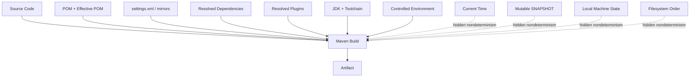
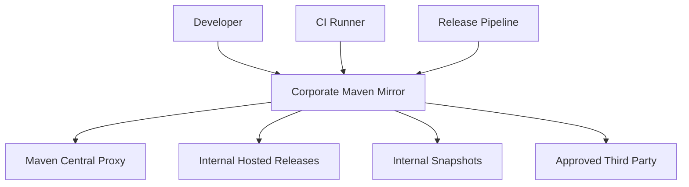
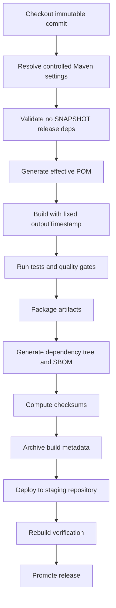

# Part 028 — Reproducible Builds and Determinism

> Target pembelajaran: setelah membaca part ini, kamu mampu mendesain Maven build yang output artifact-nya dapat dibuat ulang secara bit-by-bit atau setidaknya explainable secara forensik: source sama, dependency sama, environment sama, command sama, hasil sama.

Build yang “berhasil” belum tentu build yang bisa dipercaya.

Di organisasi kecil, build sukses berarti:

```txt
mvn clean package works on my machine
```

Di organisasi engineering matang, build sukses berarti:

```txt
Given the same source, dependency set, build instructions, and controlled environment,
we can recreate the same artifact and explain every byte that changed.
```

Reproducibility bukan kosmetik. Ia adalah fondasi untuk:

- supply-chain security
- incident forensics
- artifact promotion
- release rollback
- compliance audit
- build cache correctness
- binary provenance
- long-term maintainability

Maven memberi banyak mekanisme untuk mendukung ini, tetapi tidak otomatis menyelesaikan semua masalah. Kamu harus mengontrol dependency graph, plugin version, generated code, archive timestamp, environment input, dan repository policy.

---

## 1. Definisi: Repeatable, Reproducible, Deterministic

Istilah sering tercampur. Kita pisahkan.

| Istilah | Arti Praktis | Contoh |
|---|---|---|
| Repeatable | Build bisa diulang oleh orang yang sama di environment sama. | Laptop engineer menjalankan command dua kali dan hasilnya sama. |
| Reproducible | Pihak lain bisa menghasilkan artifact identik dari source, environment, dan instruksi yang sama. | CI clean runner dan release runner menghasilkan SHA-256 artifact sama. |
| Deterministic | Build logic tidak bergantung pada input tersembunyi seperti waktu, urutan file acak, path lokal, atau network drift. | ZIP/JAR entry order dan timestamp stabil. |
| Hermetic | Build tidak bergantung pada state luar yang tidak dideklarasikan. | Semua dependency berasal dari repository yang dikontrol dan versi dipin. |

Reproducible build bukan berarti “tidak pernah ada environment”. Artinya environment menjadi bagian dari input yang dikontrol.

---

## 2. Mental Model: Artifact adalah Function Output

Pikirkan build seperti fungsi:

```txt
artifact = build(source, pom, settings, dependencies, plugins, jdk, os, env, time, command)
```

Build reproducible berusaha mengubahnya menjadi:

```txt
artifact = build(locked_source, locked_build_model, locked_dependencies, locked_plugins, controlled_jdk, controlled_env)
```

Dan menghapus input tersembunyi:

```txt
artifact != build(current_time, random_order, local_path, latest_snapshot, network_state, developer_machine)
```

Diagram:



Senior Maven engineering adalah seni mengubah input implisit menjadi input eksplisit.

---

## 3. Official Maven Reproducible Build Baseline

Dokumentasi resmi Maven menjelaskan bahwa reproducible build menciptakan path yang independently-verifiable dari source ke binary, dan build disebut reproducible jika source code, environment, dan build instructions yang sama dapat menghasilkan copy artifact bit-by-bit identik.

Sumber resmi:

- Maven reproducible builds guide: https://maven.apache.org/guides/mini/guide-reproducible-builds.html
- Maven JAR Plugin `outputTimestamp`: https://maven.apache.org/plugins/maven-jar-plugin/jar-mojo.html
- Maven Artifact Plugin reproducible diagnostics: https://maven.apache.org/plugins/maven-artifact-plugin/reproducible.html
- Reproducible Builds project: https://reproducible-builds.org/

Maven ecosystem modern mendukung property penting:

```xml
<project.build.outputTimestamp>...</project.build.outputTimestamp>
```

Banyak archive plugin Maven membaca property ini sebagai timestamp entry archive agar output tidak bergantung pada waktu build saat ini.

---

## 4. Source of Non-Determinism

Penyebab artifact berubah walaupun source terlihat sama:

| Source | Contoh | Dampak |
|---|---|---|
| Timestamp | JAR entry timestamp mengikuti waktu build | SHA artifact berubah setiap build. |
| File order | ZIP entries mengikuti filesystem order | Artifact berbeda antar OS/filesystem. |
| Generated code | Generator menulis timestamp/header/path lokal | Source output berubah. |
| SNAPSHOT dependency | Snapshot terbaru berubah di repository | Bytecode/classpath berubah. |
| Dynamic version | Version range atau latest release | Dependency graph drift. |
| Plugin version unpinned | Plugin default berubah | Build behavior berubah. |
| Environment variable | Build membaca `USER`, `HOME`, locale, timezone | Manifest/resource berubah. |
| Absolute path | Generated file menyimpan `/home/alice/...` | Artifact berbeda per machine. |
| Random value | UUID/build id dibuat saat package | Artifact unik setiap build. |
| Local repository state | Dependency resolved dari cache rusak/berbeda | Build tidak sama antar runner. |
| Parallel race | Generated file ditulis race | Output kadang berbeda. |

Kalau artifact SHA berubah, jangan langsung curiga malicious tampering. Pertama cari nondeterminism.

---

## 5. Control 1 — Pin Plugin Versions

Jangan bergantung pada implicit plugin version.

Buruk:

```xml
<plugin>
  <artifactId>maven-jar-plugin</artifactId>
</plugin>
```

Baik:

```xml
<properties>
  <maven-jar-plugin.version>3.4.2</maven-jar-plugin.version>
  <maven-compiler-plugin.version>3.14.0</maven-compiler-plugin.version>
  <maven-surefire-plugin.version>3.5.3</maven-surefire-plugin.version>
</properties>

<build>
  <pluginManagement>
    <plugins>
      <plugin>
        <groupId>org.apache.maven.plugins</groupId>
        <artifactId>maven-jar-plugin</artifactId>
        <version>${maven-jar-plugin.version}</version>
      </plugin>
      <plugin>
        <groupId>org.apache.maven.plugins</groupId>
        <artifactId>maven-compiler-plugin</artifactId>
        <version>${maven-compiler-plugin.version}</version>
      </plugin>
      <plugin>
        <groupId>org.apache.maven.plugins</groupId>
        <artifactId>maven-surefire-plugin</artifactId>
        <version>${maven-surefire-plugin.version}</version>
      </plugin>
    </plugins>
  </pluginManagement>
</build>
```

Kenapa plugin version penting?

Karena plugin adalah build logic. Jika plugin berubah, artifact bisa berubah walaupun source tidak berubah.

Rule:

```txt
Dependency version mengontrol runtime/compile graph.
Plugin version mengontrol build behavior.
Keduanya harus dipin.
```

---

## 6. Control 2 — Pin Dependency Graph

Gunakan `dependencyManagement` atau BOM yang jelas.

Jangan:

```xml
<version>[1.0,2.0)</version>
```

Jangan juga mengandalkan transitive version tanpa ownership.

Lebih baik:

```xml
<dependencyManagement>
  <dependencies>
    <dependency>
      <groupId>com.acme.platform</groupId>
      <artifactId>acme-platform-bom</artifactId>
      <version>${acme-platform.version}</version>
      <type>pom</type>
      <scope>import</scope>
    </dependency>
  </dependencies>
</dependencyManagement>
```

Lalu dependency biasa tanpa version karena version dikontrol BOM:

```xml
<dependency>
  <groupId>com.fasterxml.jackson.core</groupId>
  <artifactId>jackson-databind</artifactId>
</dependency>
```

Untuk audit:

```bash
mvn dependency:tree -DoutputFile=target/dependency-tree.txt
```

Untuk convergence:

```xml
<plugin>
  <groupId>org.apache.maven.plugins</groupId>
  <artifactId>maven-enforcer-plugin</artifactId>
  <executions>
    <execution>
      <id>enforce-dependency-policy</id>
      <goals>
        <goal>enforce</goal>
      </goals>
      <configuration>
        <rules>
          <dependencyConvergence />
          <requireUpperBoundDeps />
        </rules>
      </configuration>
    </execution>
  </executions>
</plugin>
```

Reproducible classpath adalah prerequisite reproducible artifact.

---

## 7. Control 3 — Set `project.build.outputTimestamp`

Archive formats seperti JAR/ZIP menyimpan timestamp entry. Jika timestamp mengikuti waktu build, binary berubah setiap build.

Gunakan property:

```xml
<properties>
  <project.build.outputTimestamp>2026-01-01T00:00:00Z</project.build.outputTimestamp>
</properties>
```

Atau dalam release pipeline, set dari timestamp commit/tag yang stabil:

```bash
mvn clean verify \
  -Dproject.build.outputTimestamp="$(git log -1 --format=%cI)"
```

Namun hati-hati: command substitution di shell harus distandardisasi di CI. Lebih baik release pipeline menulis nilai eksplisit.

Pattern:

```txt
Development build:
  outputTimestamp boleh fixed default.

Release build:
  outputTimestamp berasal dari commit/tag timestamp yang immutable.

Rebuild verification:
  outputTimestamp harus sama dengan release metadata.
```

Maven JAR Plugin mendokumentasikan parameter `outputTimestamp` untuk reproducible archive entries, dengan default `${project.build.outputTimestamp}`.

---

## 8. Control 4 — Avoid Build-Time Randomness

Jangan generate build id random ke artifact.

Buruk:

```properties
build.id=${random.uuid}
build.time=${current.timestamp}
build.user=${user.name}
```

Kalau harus punya metadata, pisahkan:

| Metadata | Reproducible? | Rekomendasi |
|---|---|---|
| Git commit SHA | Ya, jika source sama | Boleh. |
| Git tag | Ya, jika tag immutable | Boleh. |
| Build time saat CI | Tidak | Hindari di binary. Simpan di external release metadata. |
| Build runner id | Tidak | Jangan masukkan artifact. |
| Username | Tidak | Jangan masukkan artifact. |
| Absolute workspace path | Tidak | Jangan masukkan artifact. |

Manifest yang lebih baik:

```text
Implementation-Title: case-service
Implementation-Version: 1.4.2
Build-Commit: 7f3a9d4c
```

Manifest yang buruk:

```text
Built-By: alice
Build-Time: 2026-07-03T03:17:44.912Z
Build-Path: /Users/alice/work/case-service
```

---

## 9. Control 5 — Make Generated Sources Deterministic

Generated source adalah salah satu penyebab terbesar artifact drift.

Generated output harus memenuhi invariant:

```txt
same input contract + same generator version + same config = same generated files
```

Checklist generator:

```txt
[ ] Generator version dipin.
[ ] Input schema/contract berada di repository atau artifact versioned.
[ ] Output berada di target/generated-*.
[ ] Tidak ada timestamp di header generated file.
[ ] Tidak ada absolute path di comment generated file.
[ ] Sorting field/method/class deterministic.
[ ] Locale/timezone tidak mempengaruhi output.
[ ] Generated output bisa dibuat ulang dari clean checkout.
```

Contoh buruk generated header:

```java
// Generated at 2026-07-03T10:12:31+07:00 by alice on /Users/alice/work/project
```

Contoh lebih baik:

```java
// Generated by acme-contract-generator 2.3.1 from case-api.yaml
```

Kalau generator selalu menulis timestamp dan tidak bisa dimatikan, reproducibility byte-for-byte tidak tercapai. Kamu harus:

- cari opsi disable timestamp
- patch/configure generator
- post-process output dengan hati-hati
- atau dokumentasikan sebagai known non-reproducible component

---

## 10. Control 6 — Keep Generated Output Out of Source Control, Usually

Default policy:

```txt
Generated output tidak dicommit.
Generator input dan config dicommit.
```

Exception:

- consumer tidak punya generator
- generated source adalah compatibility artifact yang di-review sebagai API
- generator mahal/tidak tersedia di build environment
- regulatory process mengharuskan generated code direview sebagai source

Kalau generated output dicommit, policy harus lebih ketat:

```txt
[ ] Ada command resmi untuk regenerate.
[ ] CI memverifikasi committed generated output sama dengan regenerated output.
[ ] Generator version dipin.
[ ] Generated diff tidak boleh manual-edit.
```

CI pattern:

```bash
mvn clean generate-sources
if ! git diff --exit-code; then
  echo "Generated sources are out of date"
  exit 1
fi
```

Tapi pattern ini hanya valid jika generator output deterministic.

---

## 11. Control 7 — Control Repository Resolution

Dependency reproducibility tidak hanya soal POM. Repository juga harus dikontrol.

Risiko:

- dependency dihapus dari remote repository
- metadata berubah
- SNAPSHOT berubah
- mirror berbeda antar developer dan CI
- internal repository proxy menyimpan artifact berbeda dari repository lain
- corrupted local cache

Enterprise pattern:



Rule:

```txt
Developer, CI, and release builds must resolve through the same repository policy.
```

Use `settings.xml` mirror:

```xml
<mirrors>
  <mirror>
    <id>company-maven</id>
    <mirrorOf>*</mirrorOf>
    <url>https://maven.company.example/repository/maven-all</url>
  </mirror>
</mirrors>
```

Jangan biarkan release build mengambil dependency langsung dari internet jika policy organisasi membutuhkan audit.

---

## 12. Control 8 — SNAPSHOT Policy

SNAPSHOT adalah mutable by design.

Gunakan SNAPSHOT untuk development integration, bukan release reproducibility.

Policy:

| Build Type | SNAPSHOT Allowed? | Reason |
|---|---:|---|
| Local dev | Ya | Iterasi cepat. |
| Feature branch CI | Kadang | Bergantung policy internal. |
| Main branch verification | Sebaiknya tidak untuk external dependency | Mengurangi drift. |
| Release candidate | Tidak | Harus immutable. |
| Production release | Tidak | Artifact harus rebuildable. |

Enforcer dapat dipakai untuk melarang SNAPSHOT di release profile:

```xml
<requireReleaseDeps>
  <message>No SNAPSHOT dependencies are allowed in release builds.</message>
</requireReleaseDeps>
```

Snapshot internal masih bisa berguna, tetapi jangan campur dengan release artifact yang harus bisa diaudit bulan atau tahun berikutnya.

---

## 13. Control 9 — JDK and Toolchain Determinism

Bytecode bisa berubah karena JDK berbeda.

Control:

```xml
<properties>
  <maven.compiler.release>17</maven.compiler.release>
</properties>
```

Dan jika perlu:

```xml
<plugin>
  <groupId>org.apache.maven.plugins</groupId>
  <artifactId>maven-toolchains-plugin</artifactId>
  <executions>
    <execution>
      <goals>
        <goal>toolchain</goal>
      </goals>
    </execution>
  </executions>
  <configuration>
    <toolchains>
      <jdk>
        <version>17</version>
        <vendor>temurin</vendor>
      </jdk>
    </toolchains>
  </configuration>
</plugin>
```

Practical policy:

```txt
Maven runtime JDK = allowed set.
Compiler target JDK = explicit.
Toolchain JDK = controlled for release builds.
CI image = versioned.
```

Jangan hanya berkata “pakai Java 17”. Tentukan distribusi, patch policy, dan container image untuk release build jika reproducibility penting.

---

## 14. Control 10 — Locale, Timezone, Encoding

Set property umum:

```xml
<properties>
  <project.build.sourceEncoding>UTF-8</project.build.sourceEncoding>
  <project.reporting.outputEncoding>UTF-8</project.reporting.outputEncoding>
</properties>
```

CI environment:

```bash
export TZ=UTC
export LANG=C.UTF-8
export LC_ALL=C.UTF-8
```

Kenapa?

- sorting bisa dipengaruhi locale
- generated text bisa memakai locale default
- timestamp formatting bisa dipengaruhi timezone
- resource filtering bisa membaca encoding berbeda

Kalau build menghasilkan file text dari template/generator, encoding dan locale harus dianggap input build.

---

## 15. Control 11 — Archive Entry Order and Metadata

Artifact Java biasanya archive: JAR/WAR/EAR/ZIP/TAR.

Non-determinism archive:

- entry timestamp
- entry order
- file mode/permission
- username/group metadata di tar
- compression metadata
- manifest ordering

Modern Maven archive plugins makin mendukung reproducibility, tapi kamu tetap perlu:

```txt
[ ] Pin plugin version.
[ ] Set project.build.outputTimestamp.
[ ] Avoid custom archiving scripts.
[ ] Inspect archive entries.
[ ] Avoid embedding local metadata.
```

Inspect:

```bash
jar tvf target/*.jar | head -50
jar tf target/*.jar | sort > target/jar-entries.txt
sha256sum target/*.jar
```

Untuk zip/tar assembly, cek plugin docs apakah mendukung output timestamp dan deterministic ordering.

---

## 16. Build Verification Workflow

Reproducibility harus dibuktikan, bukan diasumsikan.

Local simple test:

```bash
rm -rf ~/.m2/repository/com/acme/case-service
mvn clean verify
sha256sum target/*.jar > /tmp/build-1.sha256

mvn clean verify
sha256sum target/*.jar > /tmp/build-2.sha256

diff -u /tmp/build-1.sha256 /tmp/build-2.sha256
```

Better clean-room test dengan dua workspace:

```bash
git clone <repo> /tmp/build-a
git clone <repo> /tmp/build-b

cd /tmp/build-a
mvn -s /path/to/settings.xml clean verify
sha256sum target/*.jar > /tmp/a.sha256

cd /tmp/build-b
mvn -s /path/to/settings.xml clean verify
sha256sum target/*.jar > /tmp/b.sha256

diff -u /tmp/a.sha256 /tmp/b.sha256
```

Even better: dua runner/container berbeda dengan image sama.

---

## 17. If SHA Differs: Forensic Playbook

### Step 1 — Compare artifact listing

```bash
mkdir /tmp/a /tmp/b
cp build-a/target/app.jar /tmp/a/app.jar
cp build-b/target/app.jar /tmp/b/app.jar

jar tf /tmp/a/app.jar | sort > /tmp/a/files.txt
jar tf /tmp/b/app.jar | sort > /tmp/b/files.txt

diff -u /tmp/a/files.txt /tmp/b/files.txt
```

Jika daftar file berbeda, masalahnya source/resource inclusion.

### Step 2 — Compare timestamps

```bash
jar tvf /tmp/a/app.jar > /tmp/a/listing.txt
jar tvf /tmp/b/app.jar > /tmp/b/listing.txt

diff -u /tmp/a/listing.txt /tmp/b/listing.txt
```

Jika hanya timestamp berbeda, cek `project.build.outputTimestamp` dan plugin support.

### Step 3 — Extract and compare content

```bash
mkdir /tmp/a/extract /tmp/b/extract
(cd /tmp/a/extract && jar xf ../app.jar)
(cd /tmp/b/extract && jar xf ../app.jar)

diff -ru /tmp/a/extract /tmp/b/extract
```

Jika `.class` berbeda, lanjut:

```bash
javap -classpath /tmp/a/extract -verbose com.acme.App > /tmp/a/App.javap
javap -classpath /tmp/b/extract -verbose com.acme.App > /tmp/b/App.javap

diff -u /tmp/a/App.javap /tmp/b/App.javap
```

### Step 4 — Compare dependency tree

```bash
mvn dependency:tree -DoutputFile=target/dependency-tree.txt
```

Diff antara build A dan B.

### Step 5 — Compare effective POM

```bash
mvn help:effective-pom -Doutput=target/effective-pom.xml
```

Diff effective POM.

Jika effective POM berbeda, masalahnya profile, property, parent, settings, atau environment.

---

## 18. Reproducibility Levels

Tidak semua organisasi langsung butuh bit-by-bit reproducibility penuh untuk semua artifact. Buat maturity level.

| Level | Capability | Cocok Untuk |
|---|---|---|
| 0 | Build works sometimes | Prototype, bukan production. |
| 1 | Clean build repeatable di CI | Minimum production. |
| 2 | Dependency/plugin versions pinned | Team production. |
| 3 | Artifact timestamp controlled | Release engineering dasar. |
| 4 | Clean-room rebuild menghasilkan SHA sama | High-trust internal platform. |
| 5 | Independent third-party rebuild possible | Open-source/security-critical/regulatory. |

Untuk enterprise case management/regulatory platform, target minimal realistis:

```txt
Level 3 untuk semua service.
Level 4 untuk shared libraries, contract artifacts, release candidates, dan compliance-critical components.
```

---

## 19. Reproducible Release Pipeline Pattern

Pipeline:



Important release metadata:

```txt
source commit SHA
Git tag
Maven version
JDK version/vendor
CI image digest
settings.xml reference
repository mirror URL
project.build.outputTimestamp
resolved dependency tree
resolved plugin versions
effective POM
artifact checksums
SBOM
```

Artifact tanpa metadata build sulit diaudit.

---

## 20. What Not to Put Inside the Artifact

Untuk reproducibility dan security, jangan masukkan:

```txt
current timestamp
CI job URL as required runtime metadata
workspace path
developer username
machine hostname
random UUID
production secrets
repository credentials
mutable environment config
large local reports
logs
```

Kalau metadata itu berguna, simpan sebagai external build attestation/release record, bukan di binary runtime.

Exception: version/commit metadata yang immutable dan berguna untuk runtime diagnostics boleh masuk manifest atau `/version.properties`.

---

## 21. Maven Artifact Plugin and Buildinfo

Maven Artifact Plugin menyediakan goal/report yang membantu diagnosa reproducible build, termasuk membandingkan output build dengan reference. Dokumentasi Maven Artifact Plugin menunjukkan workflow seperti menjalankan build dan menggunakan `artifact:compare` untuk memeriksa perbedaan reproducible build.

Sumber resmi:

- https://maven.apache.org/plugins/maven-artifact-plugin/reproducible.html
- https://maven.apache.org/plugins/maven-artifact-plugin/reproducible-central-mojo.html

Dalam organisasi, kamu bisa menggunakan buildinfo/rebuild metadata untuk menjawab:

```txt
Artifact ini dibangun dari source apa?
Dengan Maven/JDK/plugin/dependency apa?
Apakah artifact ini bisa dibuat ulang?
Apa perbedaan build sekarang dengan release sebelumnya?
```

---

## 22. Example Parent POM Policy

```xml
<project>
  <modelVersion>4.0.0</modelVersion>

  <groupId>com.acme.platform</groupId>
  <artifactId>acme-build-parent</artifactId>
  <version>1.0.0</version>
  <packaging>pom</packaging>

  <properties>
    <project.build.sourceEncoding>UTF-8</project.build.sourceEncoding>
    <project.reporting.outputEncoding>UTF-8</project.reporting.outputEncoding>

    <!-- Release pipeline may override this with immutable commit/tag timestamp. -->
    <project.build.outputTimestamp>2026-01-01T00:00:00Z</project.build.outputTimestamp>

    <maven.compiler.release>17</maven.compiler.release>

    <maven-compiler-plugin.version>3.14.0</maven-compiler-plugin.version>
    <maven-jar-plugin.version>3.4.2</maven-jar-plugin.version>
    <maven-surefire-plugin.version>3.5.3</maven-surefire-plugin.version>
    <maven-failsafe-plugin.version>3.5.3</maven-failsafe-plugin.version>
    <maven-enforcer-plugin.version>3.5.0</maven-enforcer-plugin.version>
  </properties>

  <build>
    <pluginManagement>
      <plugins>
        <plugin>
          <groupId>org.apache.maven.plugins</groupId>
          <artifactId>maven-compiler-plugin</artifactId>
          <version>${maven-compiler-plugin.version}</version>
          <configuration>
            <release>${maven.compiler.release}</release>
          </configuration>
        </plugin>

        <plugin>
          <groupId>org.apache.maven.plugins</groupId>
          <artifactId>maven-jar-plugin</artifactId>
          <version>${maven-jar-plugin.version}</version>
        </plugin>

        <plugin>
          <groupId>org.apache.maven.plugins</groupId>
          <artifactId>maven-surefire-plugin</artifactId>
          <version>${maven-surefire-plugin.version}</version>
        </plugin>

        <plugin>
          <groupId>org.apache.maven.plugins</groupId>
          <artifactId>maven-failsafe-plugin</artifactId>
          <version>${maven-failsafe-plugin.version}</version>
        </plugin>
      </plugins>
    </pluginManagement>

    <plugins>
      <plugin>
        <groupId>org.apache.maven.plugins</groupId>
        <artifactId>maven-enforcer-plugin</artifactId>
        <version>${maven-enforcer-plugin.version}</version>
        <executions>
          <execution>
            <id>enforce-reproducible-build-policy</id>
            <goals>
              <goal>enforce</goal>
            </goals>
            <configuration>
              <rules>
                <requireMavenVersion>
                  <version>[3.9.0,)</version>
                </requireMavenVersion>
                <requireJavaVersion>
                  <version>[17,)</version>
                </requireJavaVersion>
                <requirePluginVersions />
                <dependencyConvergence />
              </rules>
            </configuration>
          </execution>
        </executions>
      </plugin>
    </plugins>
  </build>
</project>
```

Catatan:

- Versi plugin di atas adalah contoh baseline yang harus kamu validasi sesuai repository perusahaan.
- Jangan copy-paste angka versi tanpa dependency update policy.
- Parent POM harus punya release cycle sendiri.

---

## 23. Example CI Verification Step

```yaml
name: maven-reproducibility-check

on:
  pull_request:
  push:
    branches: [ main ]

jobs:
  reproducibility:
    runs-on: ubuntu-latest
    steps:
      - uses: actions/checkout@v4

      - name: Set up JDK
        uses: actions/setup-java@v4
        with:
          distribution: temurin
          java-version: '17'
          cache: maven

      - name: Build first artifact
        run: |
          export TZ=UTC
          mvn -B -V clean verify \
            -Dproject.build.outputTimestamp=2026-01-01T00:00:00Z
          mkdir -p /tmp/build-1
          cp target/*.jar /tmp/build-1/
          sha256sum /tmp/build-1/*.jar > /tmp/build-1.sha256

      - name: Build second artifact
        run: |
          export TZ=UTC
          mvn -B -V clean verify \
            -Dproject.build.outputTimestamp=2026-01-01T00:00:00Z
          mkdir -p /tmp/build-2
          cp target/*.jar /tmp/build-2/
          sha256sum /tmp/build-2/*.jar > /tmp/build-2.sha256

      - name: Compare checksums
        run: |
          diff -u /tmp/build-1.sha256 /tmp/build-2.sha256
```

Untuk multi-module, artifact path harus disesuaikan:

```bash
find . -path '*/target/*.jar' -not -path '*/target/original-*' -print0 \
  | sort -z \
  | xargs -0 sha256sum
```

---

## 24. Common Failure Modes

### Failure 1 — Checksum Berbeda Setiap Build

Kemungkinan:

- timestamp archive belum dikontrol
- generated file menulis waktu build
- manifest memasukkan build time

Fix:

```xml
<project.build.outputTimestamp>2026-01-01T00:00:00Z</project.build.outputTimestamp>
```

Lalu inspect extracted diff.

---

### Failure 2 — Developer dan CI Menghasilkan Dependency Berbeda

Kemungkinan:

- settings mirror berbeda
- local repository developer punya artifact lama
- SNAPSHOT berubah
- profile aktif berbeda

Fix:

```bash
mvn -s ci-settings.xml help:effective-settings
mvn help:effective-pom -Doutput=target/effective-pom.xml
mvn dependency:tree -DoutputFile=target/dependency-tree.txt
```

---

### Failure 3 — Release Tidak Bisa Dibuat Ulang Setelah 6 Bulan

Kemungkinan:

- dependency external hilang/berubah
- plugin version tidak dipin
- repository tidak menyimpan cached artifact
- generated tool tidak tersedia
- release metadata tidak disimpan

Fix jangka panjang:

```txt
Use repository manager.
Archive build metadata.
Pin plugin/dependency versions.
Ban dynamic versions.
Store generator artifacts.
Keep release branch/tag immutable.
```

---

### Failure 4 — Reproducibility Rusak Setelah Menambah Code Generator

Kemungkinan:

- generator menulis timestamp
- file order mengikuti input directory listing
- generator version floating
- generated source dicommit tapi tidak divalidasi

Fix:

```txt
Pin generator.
Disable timestamp/header.
Sort input files.
Generate into target/.
Add CI diff check if generated output committed.
```

---

## 25. What Good Looks Like

Project Maven yang matang punya sifat berikut:

```txt
[ ] mvn clean verify works from clean checkout.
[ ] Plugin versions are pinned in parent pluginManagement.
[ ] Dependency versions are owned by BOM/dependencyManagement.
[ ] No dynamic versions in release build.
[ ] No SNAPSHOT dependencies in release artifacts.
[ ] project.build.outputTimestamp is set.
[ ] Generated sources are deterministic.
[ ] Generated outputs are under target/ unless explicitly governed.
[ ] Build environment is versioned or containerized.
[ ] Effective POM and dependency tree can be archived.
[ ] Artifact checksum is generated and stored.
[ ] Release artifact can be rebuilt or differences can be explained.
```

---

## 26. Exercises

### Exercise 1 — Timestamp Drift Test

Ambil module JAR.

```bash
mvn clean package
sha256sum target/*.jar
sleep 5
mvn clean package
sha256sum target/*.jar
```

Jika SHA berbeda, set `project.build.outputTimestamp`, lalu ulangi.

### Exercise 2 — Generated Source Audit

Cari generated source:

```bash
find . -type d \( -path '*generated-sources*' -o -path '*generated*' \) -print
```

Audit:

```txt
Generator apa?
Version dipin di mana?
Input contract di mana?
Output masuk source control atau target?
Ada timestamp/path lokal di output?
```

### Exercise 3 — Release Metadata Bundle

Buat script yang menghasilkan:

```txt
target/release-metadata/
├── effective-pom.xml
├── effective-settings.xml
├── dependency-tree.txt
├── java-version.txt
├── maven-version.txt
├── git-commit.txt
├── artifact-checksums.txt
└── jar-entries.txt
```

Command dasar:

```bash
mkdir -p target/release-metadata
mvn help:effective-pom -Doutput=target/release-metadata/effective-pom.xml
mvn help:effective-settings -Doutput=target/release-metadata/effective-settings.xml
mvn dependency:tree -DoutputFile=target/release-metadata/dependency-tree.txt
java -version 2> target/release-metadata/java-version.txt
mvn -version > target/release-metadata/maven-version.txt
git rev-parse HEAD > target/release-metadata/git-commit.txt
sha256sum target/*.jar > target/release-metadata/artifact-checksums.txt
jar tf target/*.jar | sort > target/release-metadata/jar-entries.txt
```

---

## 27. Summary

Reproducible build adalah discipline, bukan satu plugin.

Maven memberi building blocks:

- POM sebagai build declaration
- dependencyManagement/BOM untuk graph control
- pluginManagement untuk build logic control
- `project.build.outputTimestamp` untuk archive timestamp control
- repository settings/mirrors untuk resolution control
- toolchains untuk JDK control
- artifact plugin/reporting untuk diagnostics

Tapi engineer tetap harus menjaga invariant:

```txt
No hidden input.
No mutable release dependency.
No unpinned build logic.
No generated randomness.
No local-machine-specific artifact content.
```

Jika Part 027 mengajarkan cara menambahkan layout exception dengan benar, Part 028 mengajarkan konsekuensi akhirnya: setiap exception harus tetap menghasilkan artifact yang bisa dipercaya.

Di part berikutnya, kita akan masuk ke **Supply Chain Security, SBOM, and Signing**: checksums, signatures, GPG, SBOM, dependency audit, repository trust boundary, dan bagaimana Maven build menjadi bagian dari software supply chain security.

