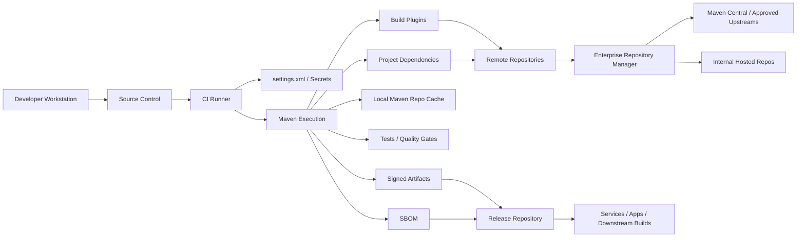
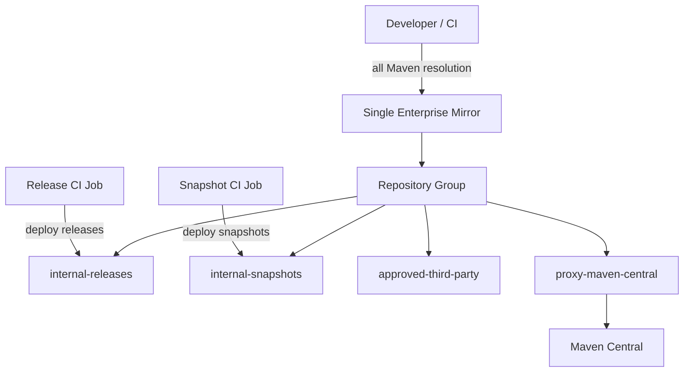
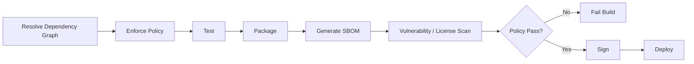
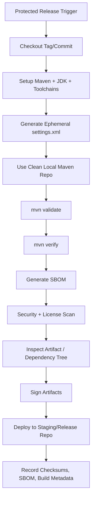
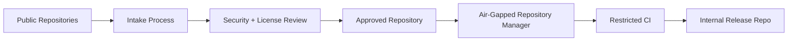

# Part 029 — Supply Chain Security, SBOM, and Signing

Maven security sering disalahpahami sebagai “pakai dependency scanner”. Itu terlalu sempit.

Di sistem produksi, Maven adalah **supply-chain execution engine**. Ia mengambil artifact dari repository, mengeksekusi plugin, membentuk classpath, menjalankan generator, membuat package, lalu mem-publish artifact baru untuk dikonsumsi sistem lain. Jika chain ini tidak dikendalikan, build yang terlihat hijau bisa menghasilkan artifact yang tidak bisa dipertanggungjawabkan.

Part ini membahas Maven dari sisi **trust, integrity, inventory, signing, dan governance**.

Tujuan akhirnya bukan paranoid. Tujuannya adalah build yang bisa menjawab lima pertanyaan defensif:

1. Artifact ini dibuat dari source yang mana?
2. Dependency apa saja yang ikut masuk, langsung maupun transitif?
3. Dari repository mana artifact itu diambil?
4. Apakah artifact hasil build bisa diverifikasi integritas dan asalnya?
5. Apakah policy organisasi mencegah dependency/plugin berbahaya sebelum masuk produksi?

Jika lima pertanyaan ini tidak bisa dijawab, Maven build Anda belum production-grade.

---

## 1. Mental Model: Maven Supply Chain Is a Graph of Trust

Sebelumnya kita melihat Maven sebagai graph dependency dan graph reactor. Untuk security, kita perlu mental model ketiga:

> Maven build adalah **graph of trust** antara source code, dependency, plugin, repository, CI, credential, dan artifact output.

Diagramnya:



Setiap edge adalah pertanyaan trust:

| Edge | Pertanyaan |
|---|---|
| SCM → CI | Apakah build berasal dari commit/tag yang benar? |
| CI → Maven | Apakah Maven version, JDK, settings, dan secrets terkendali? |
| Maven → Plugins | Apakah plugin dipin, dipercaya, dan berasal dari repository yang benar? |
| Maven → Dependencies | Apakah dependency graph sesuai policy? |
| Repositories → Maven | Apakah artifact diverifikasi integrity metadata/checksum/signature-nya? |
| Maven → Release Repo | Apakah output ditandatangani, immutable, dan traceable? |
| Release Repo → Consumers | Apakah consumer memakai artifact release, bukan artifact lokal/acak? |

Maven supply-chain security bukan satu plugin. Ia adalah desain boundary.

---

## 2. Threat Model Maven Build

Sebelum memasang tool, buat threat model. Tanpa threat model, security build mudah berubah menjadi checklist kosmetik.

### 2.1 Dependency Threats

Dependency bisa berbahaya karena:

- dependency malicious sejak awal;
- dependency legitimate tetapi compromised;
- transitive dependency membawa vulnerable version;
- dependency typo-squatting atau namespace mirip;
- dependency internal shadowing nama public artifact;
- dependency snapshot berubah tanpa perubahan POM;
- dependency lama memiliki CVE tetapi tidak terdeteksi karena tidak masuk runtime package;
- dependency test-only bocor ke runtime artifact karena shading/assembly salah.

Maven dependency graph itu besar. Risiko bukan hanya artifact yang Anda tulis di POM. Risiko sering datang dari artifact yang ikut karena transitive path.

### 2.2 Plugin Threats

Build plugin lebih sensitif daripada dependency biasa.

Dependency project masuk ke classpath aplikasi. Plugin Maven berjalan saat build dan dapat:

- membaca source code;
- membaca environment variable;
- membaca credential di workspace;
- mengakses network;
- menghasilkan source code;
- memodifikasi artifact output;
- menulis file ke repository lokal;
- mem-publish artifact.

Karena itu plugin tanpa versi eksplisit, plugin dari repository tidak terkendali, atau plugin custom tanpa review adalah risiko tinggi.

### 2.3 Repository Threats

Repository bukan hanya storage. Repository adalah trust boundary.

Risiko umum:

- CI langsung mengakses internet;
- repository internal tidak enforce checksum/signature policy;
- mirror config salah sehingga plugin resolve dari upstream tak terduga;
- snapshot repository dicampur dengan release repository;
- artifact internal di-overwrite;
- developer deploy manual ke release repo;
- repository credential terlalu luas;
- repository manager cache menyimpan artifact compromised terlalu lama.

### 2.4 CI Threats

CI adalah tempat banyak trust bertemu.

Risiko umum:

- pull request dari fork bisa menjalankan build dengan secrets;
- build cache terkontaminasi antar branch;
- local Maven repository cache tidak diisolasi;
- release job bisa dipicu dari branch non-release;
- signing key tersedia di job yang tidak perlu signing;
- artifact deploy dilakukan sebelum quality/security gates selesai;
- Maven settings di-log secara tidak sengaja.

### 2.5 Generated Code Threats

Generated source tidak otomatis aman.

Risiko umum:

- generator plugin compromised;
- generated code bergantung pada remote schema yang berubah;
- codegen output tidak deterministic;
- generated source masuk artifact tanpa review;
- schema input tidak dipin ke commit/artifact version;
- generator memakai template eksternal dari network.

---

## 3. Security Invariant for Maven Builds

Untuk production-grade Maven, pakai invariant berikut.

### Invariant 1 — Artifact Must Be Identifiable

Setiap artifact harus punya coordinate yang jelas:

```xml
<groupId>com.company.platform</groupId>
<artifactId>case-management-core</artifactId>
<version>2.7.3</version>
```

Jangan publish artifact dengan version ambigu seperti:

```xml
<version>latest</version>
<version>release</version>
<version>dev</version>
```

Maven coordinate adalah identity contract. Jika identity tidak stabil, audit tidak mungkin.

### Invariant 2 — Build Inputs Must Be Controlled

Build input meliputi:

- source code;
- POM;
- parent POM;
- BOM;
- dependency graph;
- plugin graph;
- Maven version;
- JDK/toolchain;
- settings.xml;
- repository manager state;
- generated source input;
- environment variables;
- release properties.

Input yang tidak dikendalikan berarti output tidak defensible.

### Invariant 3 — Plugin Versions Must Be Pinned

Plugin tanpa versi eksplisit adalah hidden moving part.

Buruk:

```xml
<plugin>
  <groupId>org.apache.maven.plugins</groupId>
  <artifactId>maven-compiler-plugin</artifactId>
</plugin>
```

Baik:

```xml
<pluginManagement>
  <plugins>
    <plugin>
      <groupId>org.apache.maven.plugins</groupId>
      <artifactId>maven-compiler-plugin</artifactId>
      <version>${maven.compiler.plugin.version}</version>
    </plugin>
  </plugins>
</pluginManagement>
```

Plugin policy sebaiknya diletakkan di parent POM, lalu enforced dengan Maven Enforcer.

### Invariant 4 — Release Artifact Must Be Immutable

Release artifact tidak boleh di-overwrite.

Jika `com.company:billing-api:1.4.0` sudah publish, perubahan berikutnya harus menjadi:

```txt
1.4.1
1.5.0
2.0.0
```

Bukan upload ulang `1.4.0`.

Immutability adalah dasar audit. Tanpa immutability, checksum/signature/SBOM kehilangan nilai.

### Invariant 5 — Build Must Produce Inventory

Build production harus menghasilkan inventory artifact, minimal:

- dependency tree;
- effective POM or build manifest;
- SBOM;
- test report;
- security scan output;
- artifact checksum;
- signature jika dipublish sebagai release/library;
- provenance metadata jika organisasi sudah punya pipeline provenance.

SBOM bukan pengganti scanner. SBOM adalah inventory.

### Invariant 6 — Secrets Must Not Be in POM

POM adalah project contract dan biasanya masuk source control.

Credential harus berada di:

- secret manager CI;
- injected `settings.xml`;
- environment variable sementara;
- repository manager token terbatas;
- signing key material yang scoped ke release job saja.

POM boleh menyebut `server id`, bukan password.

---

## 4. Checksums, Signatures, and What They Actually Prove

Banyak engineer mencampur checksum dan signature. Keduanya berbeda.

| Mechanism | Membuktikan | Tidak Membuktikan |
|---|---|---|
| Checksum | File tidak berubah sejak checksum dibuat | Siapa pembuat file |
| PGP/GPG signature | File ditandatangani oleh private key tertentu | Key owner pasti aman/benar |
| SBOM | Komponen yang diketahui di artifact/build | Komponen bebas vulnerability |
| Vulnerability scan | Ada/tidaknya finding berdasarkan database scanner | Artifact pasti aman |
| Repository policy | Artifact berasal dari source yang diizinkan | Artifact pasti tidak malicious |

### 4.1 Checksum

Checksum menjawab:

> Apakah file yang saya download sama dengan file yang repository metadata katakan?

Checksum tidak menjawab:

> Apakah file ini berasal dari maintainer yang benar?

Jika attacker bisa mengganti artifact dan checksum di repository yang sama, checksum saja tidak cukup.

### 4.2 Signature

Signature menjawab:

> Apakah file ini ditandatangani oleh private key yang sesuai public key tertentu?

Signature tidak menjawab:

- apakah maintainer key tidak compromised;
- apakah maintainer melakukan review;
- apakah dependency aman;
- apakah artifact cocok dengan source code tag.

Signature adalah bagian dari chain, bukan keseluruhan chain.

### 4.3 SBOM

SBOM menjawab:

> Komponen apa saja yang membentuk software ini?

SBOM tidak menjawab:

- apakah komponen itu punya CVE;
- apakah komponen itu benar-benar dieksekusi runtime;
- apakah transitive graph lengkap;
- apakah artifact tidak dimodifikasi setelah SBOM dibuat.

SBOM paling berguna ketika dikombinasikan dengan:

- version pinning;
- dependency convergence;
- vulnerability intelligence;
- license policy;
- release artifact checksum;
- artifact signing;
- repository immutability.

---

## 5. Maven Repository Trust Boundary

Enterprise Maven sebaiknya tidak membiarkan semua build langsung resolve dari internet.

Pattern produksi:



Core idea:

> Developer dan CI tidak memilih sendiri dari mana dependency diambil. Mereka melewati satu boundary yang bisa diaudit.

### 5.1 Mirror Everything Through Repository Manager

`settings.xml` CI:

```xml
<settings>
  <mirrors>
    <mirror>
      <id>company-maven</id>
      <mirrorOf>*</mirrorOf>
      <url>https://repo.company.example/repository/maven-all/</url>
    </mirror>
  </mirrors>
</settings>
```

Dengan ini, semua request Maven diarahkan ke repository manager.

Namun hati-hati:

- `mirrorOf=*` kuat, tapi bisa merusak jika repository manager tidak mengandung semua repository yang diperlukan;
- plugin resolution juga harus lewat boundary yang sama;
- repository manager harus punya policy snapshot/release yang benar;
- jangan biarkan POM project mendefinisikan repository liar untuk bypass.

### 5.2 Ban Project-Level Repositories Unless Reviewed

Buruk:

```xml
<repositories>
  <repository>
    <id>random-vendor-repo</id>
    <url>https://somewhere.example/maven</url>
  </repository>
</repositories>
```

Masalahnya bukan vendor repo selalu buruk. Masalahnya repository ini menjadi trust boundary baru yang tidak dikelola.

Pattern yang lebih aman:

1. dependency dari vendor direview;
2. repository manager menambahkan remote/proxy atau hosted approved artifact;
3. project tetap resolve dari enterprise mirror;
4. POM tidak membawa repository exception kecuali sangat terpaksa dan terdokumentasi.

### 5.3 Separate Snapshot and Release

Snapshot repository dan release repository harus dipisah.

| Repository | Mutable? | Use Case |
|---|---:|---|
| `internal-snapshots` | Ya, dengan policy | CI branch/mainline snapshot |
| `internal-releases` | Tidak | Artifact release immutable |
| `approved-third-party` | Tidak/controlled | Vendor artifact yang sudah direview |
| `proxy-maven-central` | Cache | External open-source dependencies |

Release build tidak boleh bergantung pada snapshot kecuali organisasi memang menerima risiko eksplisit.

---

## 6. Maven Settings and Credential Boundary

POM tidak boleh menyimpan credential.

`pom.xml`:

```xml
<distributionManagement>
  <repository>
    <id>company-releases</id>
    <url>https://repo.company.example/repository/internal-releases/</url>
  </repository>
  <snapshotRepository>
    <id>company-snapshots</id>
    <url>https://repo.company.example/repository/internal-snapshots/</url>
  </snapshotRepository>
</distributionManagement>
```

`settings.xml`:

```xml
<settings>
  <servers>
    <server>
      <id>company-releases</id>
      <username>${env.MAVEN_REPO_USER}</username>
      <password>${env.MAVEN_REPO_TOKEN}</password>
    </server>
    <server>
      <id>company-snapshots</id>
      <username>${env.MAVEN_REPO_USER}</username>
      <password>${env.MAVEN_REPO_TOKEN}</password>
    </server>
  </servers>
</settings>
```

Important invariant:

> `server.id` di `settings.xml` harus match `repository.id` di POM.

Jika tidak match, deployment gagal atau, lebih buruk, engineer menambahkan credential manual di tempat salah.

### 6.1 CI Settings Pattern

CI job sebaiknya membuat `settings.xml` ephemeral:

```bash
cat > "$WORKSPACE/settings.xml" <<'XML'
<settings>
  <mirrors>
    <mirror>
      <id>company-maven</id>
      <mirrorOf>*</mirrorOf>
      <url>https://repo.company.example/repository/maven-all/</url>
    </mirror>
  </mirrors>
  <servers>
    <server>
      <id>company-releases</id>
      <username>${env.MAVEN_REPO_USER}</username>
      <password>${env.MAVEN_REPO_TOKEN}</password>
    </server>
  </servers>
</settings>
XML

mvn --settings "$WORKSPACE/settings.xml" verify
```

Jangan commit CI settings yang berisi credential. Jika template settings perlu di-commit, pakai placeholder dan generate final file di pipeline.

---

## 7. SBOM in Maven

SBOM adalah daftar komponen software. Untuk Maven, SBOM biasanya dibangun dari dependency graph project.

Salah satu plugin populer adalah CycloneDX Maven Plugin, yang dapat membuat BOM dari direct dan transitive dependencies project.

### 7.1 SBOM Position in Lifecycle

SBOM sebaiknya dibuat setelah dependency graph stabil dan test/packaging boundary jelas.

Common placement:

```txt
validate
  - enforce Maven/JDK/plugin/dependency policy
compile
  - compile source
process-test-sources
  - prepare generated test sources if any
test
  - unit tests
package
  - package artifact
verify
  - integration tests
  - dependency/security checks
  - SBOM generation
  - artifact verification
```

SBOM untuk release sebaiknya dibuat di pipeline yang sama dengan artifact release. Jika SBOM dibuat dari workspace berbeda, Anda harus bisa membuktikan inputnya sama.

### 7.2 CycloneDX Maven Plugin Example

Parent POM pattern:

```xml
<properties>
  <cyclonedx.maven.plugin.version>REPLACE_WITH_APPROVED_VERSION</cyclonedx.maven.plugin.version>
</properties>

<build>
  <pluginManagement>
    <plugins>
      <plugin>
        <groupId>org.cyclonedx</groupId>
        <artifactId>cyclonedx-maven-plugin</artifactId>
        <version>${cyclonedx.maven.plugin.version}</version>
        <configuration>
          <schemaVersion>1.6</schemaVersion>
          <includeBomSerialNumber>true</includeBomSerialNumber>
          <includeCompileScope>true</includeCompileScope>
          <includeProvidedScope>true</includeProvidedScope>
          <includeRuntimeScope>true</includeRuntimeScope>
          <includeSystemScope>false</includeSystemScope>
          <includeTestScope>false</includeTestScope>
          <outputFormat>all</outputFormat>
          <outputName>bom</outputName>
        </configuration>
      </plugin>
    </plugins>
  </pluginManagement>
</build>
```

Module or release profile:

```xml
<build>
  <plugins>
    <plugin>
      <groupId>org.cyclonedx</groupId>
      <artifactId>cyclonedx-maven-plugin</artifactId>
      <executions>
        <execution>
          <id>generate-sbom</id>
          <phase>verify</phase>
          <goals>
            <goal>makeAggregateBom</goal>
          </goals>
        </execution>
      </executions>
    </plugin>
  </plugins>
</build>
```

### 7.3 SBOM Scope Decision

| Project Type | Recommended SBOM Goal | Notes |
|---|---|---|
| Single library | module BOM | publish with artifact if external consumer needs it |
| Multi-module app | aggregate BOM | represent full deployable system |
| Parent/BOM-only project | usually no runtime SBOM | it has no runtime component graph |
| Platform BOM | dependency inventory report | not the same as deployable SBOM |
| WAR/EAR | aggregate/package-aware SBOM | ensure provided/container dependencies are classified correctly |
| Shaded JAR | inspect final artifact too | dependency graph may differ from relocated artifact contents |

### 7.4 SBOM Attachment

For release artifact, SBOM can be attached as classifier artifact:

```xml
<build>
  <plugins>
    <plugin>
      <groupId>org.codehaus.mojo</groupId>
      <artifactId>build-helper-maven-plugin</artifactId>
      <executions>
        <execution>
          <id>attach-sbom</id>
          <phase>verify</phase>
          <goals>
            <goal>attach-artifact</goal>
          </goals>
          <configuration>
            <artifacts>
              <artifact>
                <file>${project.build.directory}/bom.json</file>
                <type>json</type>
                <classifier>cyclonedx</classifier>
              </artifact>
              <artifact>
                <file>${project.build.directory}/bom.xml</file>
                <type>xml</type>
                <classifier>cyclonedx</classifier>
              </artifact>
            </artifacts>
          </configuration>
        </execution>
      </executions>
    </plugin>
  </plugins>
</build>
```

Caution:

- pastikan file SBOM benar-benar ada sebelum attach;
- jangan attach SBOM yang dibuat dari reactor subset jika artifact release adalah full application;
- jangan menganggap SBOM otomatis valid untuk shaded artifact tanpa inspection tambahan.

---

## 8. Vulnerability Scanning: Where It Fits

Dependency scanner sebaiknya diposisikan sebagai **consumer of dependency/SBOM data**, bukan pengganti governance.

Pipeline defensible:



### 8.1 Scanner Output Is Time-Dependent

Vulnerability database berubah. Artifact yang clean hari ini bisa memiliki finding besok karena CVE baru dipublikasi.

Karena itu:

- simpan SBOM untuk setiap release;
- scan ulang artifact/SBOM secara periodik;
- jangan hanya scan saat build;
- bedakan policy release-blocking dan operational alert;
- punya remediation SLA berdasarkan severity dan exploitability.

### 8.2 Avoid False Confidence

Scanner bisa miss karena:

- dependency dibundel manual tanpa metadata Maven;
- shaded/relocated classes tidak terlihat jelas;
- native library tidak terdeteksi;
- generated code membawa vendored code;
- dependency optional runtime-loaded;
- container image membawa library OS-level yang tidak ada di Maven graph.

Maven SBOM adalah satu layer. Untuk deployable container, Anda juga butuh image scan/container SBOM.

---

## 9. Signing Maven Artifacts

Signing membuat artifact bisa diverifikasi terhadap key tertentu.

Untuk Maven, signing umumnya memakai Maven GPG Plugin.

### 9.1 Signing Profile Pattern

Jangan signing semua local build. Signing biasanya hanya untuk release.

```xml
<profiles>
  <profile>
    <id>release-sign</id>
    <activation>
      <property>
        <name>performRelease</name>
        <value>true</value>
      </property>
    </activation>
    <build>
      <plugins>
        <plugin>
          <groupId>org.apache.maven.plugins</groupId>
          <artifactId>maven-gpg-plugin</artifactId>
          <version>${maven.gpg.plugin.version}</version>
          <executions>
            <execution>
              <id>sign-artifacts</id>
              <phase>verify</phase>
              <goals>
                <goal>sign</goal>
              </goals>
            </execution>
          </executions>
        </plugin>
      </plugins>
    </build>
  </profile>
</profiles>
```

CI release:

```bash
mvn -B -P release-sign -DperformRelease=true clean verify deploy
```

### 9.2 Signing Key Handling

Bad practices:

- commit private key;
- store long-lived key unencrypted on CI runner;
- expose key to pull request jobs;
- reuse personal developer key for automated corporate releases;
- allow all pipeline jobs to read signing secret;
- log passphrase.

Better practices:

- signing only in protected release job;
- use protected branch/tag trigger;
- import key only during job;
- use short-lived environment or isolated runner;
- rotate key with documented process;
- restrict who can trigger release;
- store public key and fingerprint in release documentation;
- keep signing profile inactive by default.

### 9.3 Signing Is Not Enough

A signed artifact can still be bad if:

- release source was compromised;
- CI was compromised;
- wrong dependency version was included;
- malicious plugin modified output before signing;
- signing key was stolen;
- reviewer approved wrong change.

Signing should happen after policy, tests, SBOM, and scan gates — not before.

---

## 10. Maven Enforcer as Security Guardrail

Maven Enforcer is not a complete security tool, but it is excellent for preventing unsafe build states.

### 10.1 Baseline Rule Set

```xml
<plugin>
  <groupId>org.apache.maven.plugins</groupId>
  <artifactId>maven-enforcer-plugin</artifactId>
  <version>${maven.enforcer.plugin.version}</version>
  <executions>
    <execution>
      <id>enforce-build-policy</id>
      <phase>validate</phase>
      <goals>
        <goal>enforce</goal>
      </goals>
      <configuration>
        <rules>
          <requireMavenVersion>
            <version>[3.9.0,)</version>
          </requireMavenVersion>
          <requireJavaVersion>
            <version>[17,)</version>
          </requireJavaVersion>
          <requirePluginVersions />
          <dependencyConvergence />
          <requireReleaseDeps>
            <onlyWhenRelease>true</onlyWhenRelease>
          </requireReleaseDeps>
          <bannedDependencies>
            <excludes>
              <exclude>commons-logging:commons-logging</exclude>
              <exclude>log4j:log4j</exclude>
            </excludes>
            <searchTransitive>true</searchTransitive>
          </bannedDependencies>
        </rules>
      </configuration>
    </execution>
  </executions>
</plugin>
```

Use this as a starting point, not copy-paste policy.

Policy harus sesuai domain:

- Fintech/regulatory systems: stricter release/dependency approval;
- internal tools: faster but still pinned plugin/dependency;
- public OSS library: signing and central publication requirements;
- platform BOM: convergence and banned dependency critical;
- legacy monolith: start with warning/report mode, then ratchet.

### 10.2 Policy Ratcheting

Untuk legacy project, jangan langsung enforce semua hal.

Roadmap:

1. Report-only inventory.
2. Pin plugin versions.
3. Enforce Maven/JDK baseline.
4. Enforce no snapshot in release.
5. Enforce banned critical dependencies.
6. Enforce dependency convergence for selected modules.
7. Require SBOM on release.
8. Require signed artifacts.

Security governance yang terlalu agresif tanpa migration path biasanya akan di-bypass.

---

## 11. Release Pipeline Blueprint

Production-grade Maven release pipeline:



### 11.1 Example CI Commands

Snapshot build:

```bash
mvn -B \
  --settings .ci/settings.xml \
  -Dmaven.repo.local="$WORKSPACE/.m2/repository" \
  clean verify
```

Release build:

```bash
mvn -B \
  --settings .ci/settings.xml \
  -Dmaven.repo.local="$WORKSPACE/.m2/repository" \
  -Prelease-sign \
  -DperformRelease=true \
  -DskipTests=false \
  clean verify deploy
```

Why clean local repo?

Because release build should not depend on developer cache or stale CI cache. Cache is useful for speed, but final release should have a reproducibility/clean-room mode.

---

## 12. Public Library Publication Pattern

Public Maven Central publication typically needs more metadata than internal app artifact.

POM metadata commonly expected:

```xml
<name>Company Case Management API</name>
<description>Public Java API for case management integration.</description>
<url>https://github.com/company/case-management-api</url>

<licenses>
  <license>
    <name>Apache License, Version 2.0</name>
    <url>https://www.apache.org/licenses/LICENSE-2.0.txt</url>
  </license>
</licenses>

<developers>
  <developer>
    <id>platform-team</id>
    <name>Company Platform Team</name>
    <email>platform@example.com</email>
  </developer>
</developers>

<scm>
  <connection>scm:git:https://github.com/company/case-management-api.git</connection>
  <developerConnection>scm:git:ssh://git@github.com/company/case-management-api.git</developerConnection>
  <url>https://github.com/company/case-management-api</url>
  <tag>HEAD</tag>
</scm>
```

Artifact attachments often include:

- main JAR;
- POM;
- source JAR;
- javadoc JAR;
- signatures;
- checksums;
- optionally SBOM.

Source/Javadoc attachments:

```xml
<plugin>
  <groupId>org.apache.maven.plugins</groupId>
  <artifactId>maven-source-plugin</artifactId>
  <version>${maven.source.plugin.version}</version>
  <executions>
    <execution>
      <id>attach-sources</id>
      <goals>
        <goal>jar-no-fork</goal>
      </goals>
    </execution>
  </executions>
</plugin>

<plugin>
  <groupId>org.apache.maven.plugins</groupId>
  <artifactId>maven-javadoc-plugin</artifactId>
  <version>${maven.javadoc.plugin.version}</version>
  <executions>
    <execution>
      <id>attach-javadocs</id>
      <goals>
        <goal>jar</goal>
      </goals>
    </execution>
  </executions>
</plugin>
```

---

## 13. Internal Service Pattern

Untuk internal deployable service, signing PGP mungkin tidak selalu wajib, tetapi artifact integrity dan SBOM tetap penting.

Recommended:

- artifact immutable di release repository;
- container image digest dicatat;
- Maven artifact coordinate dicatat di deployment manifest;
- SBOM Maven + container SBOM disimpan;
- dependency scan dijalankan pada build dan setelah release;
- production deployment hanya mengambil artifact dari release repository;
- snapshot hanya untuk dev/test environment;
- rollback mengacu ke exact artifact coordinate/digest.

Example release record:

```yaml
service: case-management-service
source:
  repository: git@example.com:platform/case-management-service.git
  commit: 9f86d081884c7d659a2feaa0c55ad015
  tag: v2.7.3
maven:
  groupId: com.company.case
  artifactId: case-management-service-app
  version: 2.7.3
  sha256: 3b6e1f...redacted
sbom:
  format: cyclonedx-json
  artifact: case-management-service-app-2.7.3-cyclonedx.json
container:
  image: registry.company.example/case-management-service:2.7.3
  digest: sha256:7da8...
```

This is more valuable operationally than saying “build passed”.

---

## 14. Air-Gapped / Restricted Network Pattern

In regulated environments, CI may not access public internet.

Pattern:



Key requirements:

- dependency intake process;
- checksum/signature preservation;
- license metadata review;
- CVE review;
- internal artifact promotion;
- no ad-hoc developer download;
- periodic mirror refresh;
- emergency patch path.

Maven support:

- repository manager as controlled source;
- `settings.xml` mirror to internal only;
- enforcer ban external repositories;
- reproducible build settings;
- local repository bootstrap for offline builds;
- SBOM as inventory for audit.

---

## 15. Failure Modes and Playbooks

### 15.1 Build Suddenly Downloads from Internet

Symptoms:

- CI logs show `repo.maven.apache.org` directly;
- repository manager request logs missing;
- build succeeds locally but violates enterprise policy.

Likely causes:

- `settings.xml` not used in CI;
- mirror not configured with `mirrorOf=*`;
- plugin repository bypass;
- environment-specific Maven config.

Diagnostic:

```bash
mvn help:effective-settings
mvn -X validate | grep -i "Using mirror"
mvn -X validate | grep -i "Downloading from"
```

Fix:

- enforce CI always passes `--settings`;
- audit mirror config;
- block outbound internet from CI except repository manager;
- add policy check in pipeline.

### 15.2 Snapshot Dependency in Release

Symptoms:

- release artifact depends on `1.2.0-SNAPSHOT`;
- build output changes without POM change;
- rollback cannot reproduce exact graph.

Diagnostic:

```bash
mvn dependency:tree | grep SNAPSHOT
mvn enforcer:enforce -Drules=requireReleaseDeps
```

Fix:

- require release dependencies on release profile/job;
- release upstream first;
- use platform BOM with release-only versions;
- block deploy if snapshot remains.

### 15.3 SBOM Missing Runtime Dependency

Symptoms:

- scanner says clean;
- runtime vulnerability found later;
- dependency was inside shaded JAR/manual lib/container base image.

Causes:

- SBOM generated before shading;
- manual artifact copied into package;
- container dependencies not represented by Maven;
- optional/runtime-loaded dependency.

Fix:

- generate Maven SBOM and container SBOM;
- inspect final artifact;
- avoid manual vendoring;
- attach package-aware SBOM;
- document dynamic/plugin-loaded components.

### 15.4 GPG Signing Fails in CI

Symptoms:

- `gpg: signing failed`;
- pinentry error;
- passphrase prompt hangs;
- key unavailable.

Causes:

- GPG not installed;
- key not imported;
- passphrase not passed correctly;
- interactive pinentry in non-interactive CI;
- profile active in non-release job.

Fix:

- isolate signing to release job;
- use batch mode;
- import key at runtime;
- use plugin configuration supported by approved GPG setup;
- test with dry-run release environment;
- never expose key to PR jobs.

### 15.5 Compromised Transitive Dependency

Symptoms:

- urgent CVE or malicious release notice;
- dependency not declared directly;
- multiple paths bring version.

Diagnostic:

```bash
mvn dependency:tree -Dincludes=group:artifact
mvn dependency:tree -Dverbose
```

Fix options:

- upgrade vendor BOM;
- override version in platform BOM;
- exclude transitive dependency if safe;
- upgrade direct dependency that brings it;
- replace library;
- add enforcer banned dependency/version rule.

---

## 16. Minimal Enterprise Security Parent POM

This is a compact skeleton. Adapt it; do not blindly copy.

```xml
<project>
  <modelVersion>4.0.0</modelVersion>

  <groupId>com.company.build</groupId>
  <artifactId>company-secure-parent</artifactId>
  <version>1.0.0</version>
  <packaging>pom</packaging>

  <properties>
    <maven.enforcer.plugin.version>REPLACE</maven.enforcer.plugin.version>
    <maven.gpg.plugin.version>REPLACE</maven.gpg.plugin.version>
    <cyclonedx.maven.plugin.version>REPLACE</cyclonedx.maven.plugin.version>
  </properties>

  <build>
    <pluginManagement>
      <plugins>
        <plugin>
          <groupId>org.apache.maven.plugins</groupId>
          <artifactId>maven-enforcer-plugin</artifactId>
          <version>${maven.enforcer.plugin.version}</version>
        </plugin>
        <plugin>
          <groupId>org.apache.maven.plugins</groupId>
          <artifactId>maven-gpg-plugin</artifactId>
          <version>${maven.gpg.plugin.version}</version>
        </plugin>
        <plugin>
          <groupId>org.cyclonedx</groupId>
          <artifactId>cyclonedx-maven-plugin</artifactId>
          <version>${cyclonedx.maven.plugin.version}</version>
        </plugin>
      </plugins>
    </pluginManagement>

    <plugins>
      <plugin>
        <groupId>org.apache.maven.plugins</groupId>
        <artifactId>maven-enforcer-plugin</artifactId>
        <executions>
          <execution>
            <id>company-build-policy</id>
            <phase>validate</phase>
            <goals>
              <goal>enforce</goal>
            </goals>
            <configuration>
              <rules>
                <requireMavenVersion>
                  <version>[3.9.0,)</version>
                </requireMavenVersion>
                <requireJavaVersion>
                  <version>[17,)</version>
                </requireJavaVersion>
                <requirePluginVersions />
                <dependencyConvergence />
              </rules>
            </configuration>
          </execution>
        </executions>
      </plugin>
    </plugins>
  </build>

  <profiles>
    <profile>
      <id>release-security</id>
      <build>
        <plugins>
          <plugin>
            <groupId>org.cyclonedx</groupId>
            <artifactId>cyclonedx-maven-plugin</artifactId>
            <executions>
              <execution>
                <id>generate-sbom</id>
                <phase>verify</phase>
                <goals>
                  <goal>makeAggregateBom</goal>
                </goals>
              </execution>
            </executions>
          </plugin>

          <plugin>
            <groupId>org.apache.maven.plugins</groupId>
            <artifactId>maven-gpg-plugin</artifactId>
            <executions>
              <execution>
                <id>sign-artifacts</id>
                <phase>verify</phase>
                <goals>
                  <goal>sign</goal>
                </goals>
              </execution>
            </executions>
          </plugin>
        </plugins>
      </build>
    </profile>
  </profiles>
</project>
```

---

## 17. Review Checklist

Before approving Maven release pipeline, ask:

### Dependency and Plugin

- Are dependency versions controlled by BOM or dependency management?
- Are plugin versions pinned?
- Are unknown project-level repositories banned/reviewed?
- Is dependency convergence enforced or at least monitored?
- Are snapshot dependencies blocked for release?
- Are banned dependencies enforced transitively?

### Repository

- Do CI and developers resolve through enterprise repository manager?
- Are snapshot and release repositories separated?
- Are release artifacts immutable?
- Is deploy permission scoped?
- Is repository credential stored outside POM?
- Are repository logs/audit available?

### SBOM and Scanning

- Is SBOM generated for release artifact?
- Is SBOM generated from correct reactor scope?
- Is final packaged artifact inspected when shading/assembly is used?
- Are scanner results archived?
- Is there periodic rescan after release?
- Is license policy part of the gate?

### Signing

- Is signing only done in protected release job?
- Is private key protected and rotated?
- Are artifacts, POM, sources, javadocs, and SBOM signing requirements clear?
- Is signature verification tested by consumers/repository manager?

### Reproducibility

- Are plugin versions pinned?
- Is Maven/JDK version controlled?
- Are generated sources deterministic?
- Is release built from clean local repository or controlled cache?
- Are checksums recorded?

---

## 18. Practice Lab

Build a secure Maven release pipeline for a sample multi-module project.

Requirements:

1. Parent POM pins plugin versions.
2. Enforcer requires Maven/JDK baseline.
3. Enforcer bans at least one dependency.
4. Release profile generates SBOM.
5. Release profile signs artifacts.
6. CI uses ephemeral `settings.xml`.
7. Snapshot and release deploy targets are separated.
8. Release job fails if dependency tree contains `SNAPSHOT`.
9. Build records artifact checksum.
10. Final release note includes artifact coordinate, Git commit, SBOM path, and checksum.

Acceptance criteria:

```bash
mvn -B clean verify
mvn -B -Prelease-security clean verify
mvn -B dependency:tree
mvn -B help:effective-settings
mvn -B help:effective-pom
```

Then answer:

- Which dependencies are runtime-critical?
- Which plugin can publish or modify artifacts?
- Which repository does every artifact come from?
- Which secret is needed for deploy?
- Which secret is needed for signing?
- Can a pull request access either secret?

If you cannot answer these, the pipeline is not defensible yet.

---

## 19. Key Takeaways

- Maven supply-chain security is a **system design problem**, not one plugin.
- Dependency scanner is useful, but insufficient.
- SBOM is inventory, not a safety certificate.
- Signing proves key-based integrity, not semantic correctness.
- Repository manager is the enterprise trust boundary.
- Plugin versions must be pinned because plugins execute code during build.
- Release artifact must be immutable.
- CI release job must be protected, isolated, and auditable.
- The most senior Maven practice is the ability to explain exactly how an artifact was produced.

---

## References

- Apache Maven GPG Plugin — usage and signing goals: https://maven.apache.org/plugins/maven-gpg-plugin/usage.html
- Apache Maven GPG Plugin — deploy signed artifacts: https://maven.apache.org/plugins/maven-gpg-plugin/examples/deploy-signed-artifacts.html
- Apache Maven — Guide to uploading artifacts to the Central Repository: https://maven.apache.org/repository/guide-central-repository-upload.html
- Sonatype Central Repository — publishing requirements and GPG requirements: https://central.sonatype.org/publish/requirements/
- CycloneDX Maven Plugin: https://cyclonedx.github.io/cyclonedx-maven-plugin/
- CycloneDX standard: https://cyclonedx.org/
- Apache Maven Enforcer Plugin rules: https://maven.apache.org/enforcer/enforcer-rules/
