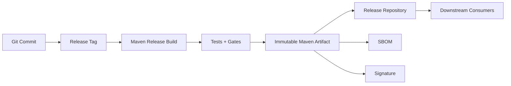
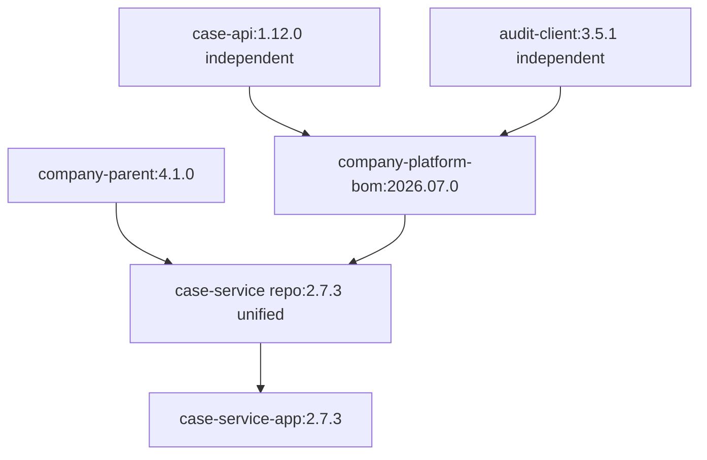
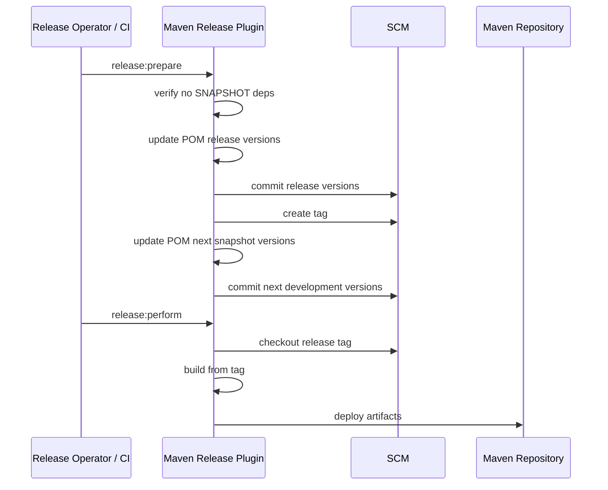
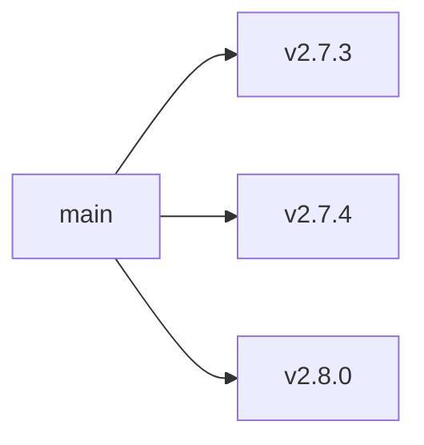
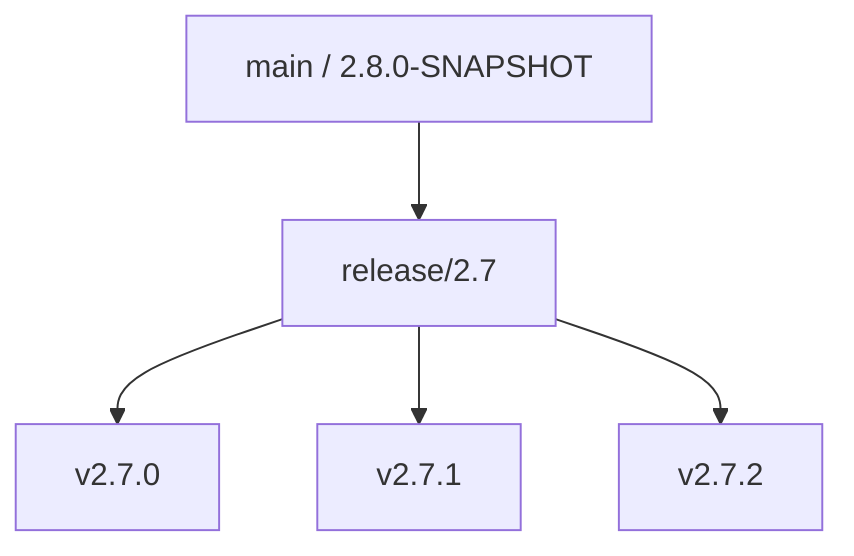

# Part 030 — Release, Versioning, and CI-Friendly Versions

Versioning adalah bahasa koordinasi antar tim.

Di Maven, version bukan sekadar label. Version adalah bagian dari coordinate:

```txt
groupId:artifactId:version
```

Coordinate menentukan dependency resolution, repository path, compatibility expectation, rollback, audit, SBOM, dan support policy.

Part ini membahas bagaimana Maven release dan versioning harus dirancang untuk sistem produksi: library, service, parent POM, BOM, plugin, dan multi-module repository.

---

## 1. Mental Model: A Release Is an Immutable Promise

Release bukan “build yang berhasil”. Release adalah janji:

> Untuk coordinate tertentu, artifact tertentu akan tetap sama, bisa diverifikasi, dan bisa dikaitkan kembali ke source, dependency graph, dan proses approval tertentu.

Diagram:



Release yang defensible harus punya minimal:

| Item | Contoh |
|---|---|
| Source identity | Git commit/tag |
| Maven coordinate | `com.company:case-api:2.4.1` |
| Build environment | Maven/JDK/toolchain version |
| Dependency graph | dependency tree / SBOM |
| Artifact hash | SHA-256/checksum |
| Approval | CI run / release ticket / signed tag |
| Repository target | staging/release repository |

Jika version berubah tanpa artifact berubah, confusing.
Jika artifact berubah tanpa version berubah, dangerous.

---

## 2. Maven Version Semantics

Maven tidak memaksakan Semantic Versioning. Maven memperlakukan version sebagai string dengan aturan comparison/resolution tertentu. Namun organisasi Anda tetap perlu convention.

### 2.1 Common Version Kinds

| Version | Meaning | Use Case |
|---|---|---|
| `1.0.0-SNAPSHOT` | mutable development version | ongoing integration |
| `1.0.0` | immutable release | published artifact |
| `1.0.0-RC1` | release candidate | controlled testing |
| `1.0.0-alpha.1` | early unstable pre-release | experimental public/internal |
| `2026.07.03` | calendar version | platform/BOM/app trains |
| `1.0.0+build.45` | build metadata style | be careful: repository/tool compatibility |

Maven ecosystem umum memakai `-SNAPSHOT` sebagai development marker. Artifact non-SNAPSHOT harus dianggap immutable.

### 2.2 SNAPSHOT Is a Moving Coordinate

`1.4.0-SNAPSHOT` bukan satu artifact stabil. Ia bisa berubah seiring deploy snapshot baru.

Snapshot berguna untuk:

- development integration;
- consumer testing sebelum release;
- nightly/internal builds;
- early feedback antar module yang belum release.

Snapshot buruk untuk:

- production release dependency;
- audit baseline;
- long-lived environment;
- regulated deployment;
- reproducible build.

Rule sederhana:

> SNAPSHOT boleh untuk build sementara. Release tidak boleh bergantung pada SNAPSHOT kecuali ada exception eksplisit.

### 2.3 Release Version Is Immutable

Jika artifact release salah, jangan overwrite.

Buruk:

```txt
Publish com.company:policy-api:1.8.0
Find bug
Overwrite com.company:policy-api:1.8.0
```

Benar:

```txt
Publish com.company:policy-api:1.8.0
Find bug
Publish com.company:policy-api:1.8.1
Deprecate/withdraw guidance for 1.8.0 if needed
```

Immutability membuat rollback dan audit mungkin.

---

## 3. Versioning by Artifact Type

Tidak semua Maven artifact perlu strategi versioning yang sama.

### 3.1 Library/API Artifact

Library version harus mengkomunikasikan compatibility.

Recommended:

```txt
MAJOR.MINOR.PATCH
```

Meaning:

- PATCH: bug fix compatible;
- MINOR: additive compatible feature;
- MAJOR: breaking change.

For Java libraries, compatibility tidak hanya source-level. Pertimbangkan:

- binary compatibility;
- method signature;
- constructor visibility;
- exception behavior;
- serialization format;
- annotation retention;
- generated code contract;
- transitive dependency exposure.

Maven-specific rule:

> Jika library mengekspos type dari dependency lain di public API, dependency itu menjadi bagian dari compatibility surface.

Contoh:

```java
public interface CaseClient {
  jakarta.ws.rs.core.Response submit(CaseRequest request);
}
```

`jakarta.ws.rs-api` sekarang bocor ke public API. Versioning library harus mempertimbangkan perubahan Jakarta API.

### 3.2 Application/Service Artifact

Service artifact biasanya tidak dikonsumsi sebagai dependency library. Version lebih terkait deployment dan rollback.

Common patterns:

```txt
2.7.3
2026.07.03.1
2.7.3-build.145
```

Maven artifact untuk service harus bisa dihubungkan ke:

- container image tag/digest;
- deployment manifest;
- database migration version;
- config release;
- feature flag state;
- SBOM;
- monitoring release marker.

Untuk service, compatibility lebih sering berupa API/runtime contract, bukan Maven dependency compatibility.

### 3.3 Parent POM

Parent POM version adalah build policy version.

Jika parent berubah:

- plugin versions bisa berubah;
- compiler release bisa berubah;
- enforcer rules bisa berubah;
- test behavior bisa berubah;
- repository policy bisa berubah;
- generated artifact bisa berubah.

Karena itu parent POM harus versioned serius.

Recommended:

```txt
company-parent:3.4.0
```

Rules:

- PATCH: bug fix plugin config, no breaking build behavior;
- MINOR: new optional policy/plugin, compatible defaults;
- MAJOR: stricter enforcement, Java baseline change, lifecycle behavior change.

### 3.4 BOM

BOM version adalah dependency platform version.

Jika BOM berubah, dependency graph berubah.

BOM versioning should answer:

- dependency apa yang naik?
- apakah ada breaking runtime change?
- apakah CVE patch included?
- apakah semua service harus adopt?
- apakah rollback BOM aman?

Platform BOM examples:

```txt
company-platform-bom:2026.07.0
company-platform-bom:5.12.3
```

For enterprise, calendar versioning sering masuk akal untuk BOM karena ia merepresentasikan tested dependency set pada waktu tertentu.

### 3.5 Maven Plugin

Internal Maven plugin version harus sangat hati-hati karena plugin mengeksekusi build logic.

Rules:

- PATCH: bug fix, same parameters;
- MINOR: new optional goal/parameter;
- MAJOR: goal behavior changes, default phase changes, parameter removal.

Plugin release harus punya integration test terhadap sample projects.

---

## 4. Multi-Module Versioning Strategies

Maven multi-module menimbulkan pertanyaan:

> Apakah semua module harus punya version sama?

Jawabannya tergantung architecture.

### 4.1 Unified Version Strategy

Semua module dalam reactor memakai satu version.

Example:

```txt
case-platform-parent:2.7.0
case-domain:2.7.0
case-api:2.7.0
case-service:2.7.0
case-adapter-postgres:2.7.0
```

Good for:

- tightly-coupled release train;
- application monorepo;
- service with internal modules;
- platform components released together;
- simpler CI/CD.

Tradeoff:

- module yang tidak berubah tetap naik version;
- consumers may think all modules changed;
- artifact churn lebih banyak.

### 4.2 Independent Version Strategy

Setiap module punya version sendiri.

Good for:

- true independent libraries;
- shared components with different consumers;
- large monorepo with independent release lifecycle.

Tradeoff:

- release automation lebih sulit;
- dependency alignment lebih sulit;
- reactor dependency version harus dikelola;
- release notes lebih kompleks.

### 4.3 Hybrid Strategy

Common enterprise compromise:

- parent POM punya version sendiri;
- platform BOM punya version sendiri;
- service repository memakai unified version;
- shared libraries punya independent version;
- deployable apps punya deployment version.

Diagram:



This is often better than forcing one versioning model on everything.

---

## 5. Maven Release Plugin Model

Maven Release Plugin automates common release steps. Classic flow:

```bash
mvn release:prepare
mvn release:perform
```

Conceptually:



This model is useful, but not always ideal for modern CI.

### 5.1 Strengths

- standard Maven-native release flow;
- handles POM version updates;
- creates SCM tag;
- separates prepare and perform;
- works well for many library projects.

### 5.2 Weaknesses

- mutates POM files;
- can be awkward in protected-branch workflows;
- may not fit trunk-based release tagging;
- multi-module/CI-friendly versions need careful setup;
- release operator credentials can become too powerful;
- failure recovery can be messy if prepare partially succeeds.

### 5.3 When to Use Maven Release Plugin

Use it when:

- team follows Maven classic release process;
- POM versions are explicit, not externally supplied;
- SCM tagging from release job is acceptable;
- project is a library/plugin/published component;
- process is well understood by team.

Avoid or wrap it when:

- release is driven by Git tags;
- version comes from CI pipeline;
- organization requires pull-request version bump;
- deployment involves container/image/provenance pipeline;
- release process must be fully declarative and non-mutating.

---

## 6. Versions Maven Plugin

Versions Maven Plugin is commonly used to update POM versions.

Examples:

```bash
mvn versions:set -DnewVersion=2.8.0-SNAPSHOT
mvn versions:commit
```

Rollback:

```bash
mvn versions:revert
```

Use cases:

- bump project version;
- update parent version;
- update dependency versions;
- check available updates;
- align module versions.

Caution:

- it modifies POM files;
- commit changes intentionally;
- review diffs;
- avoid mass-upgrading dependencies without compatibility tests;
- do not let automated update replace carefully curated BOM governance.

---

## 7. CI-Friendly Versions

Maven supports CI-friendly placeholders in project version:

```xml
<version>${revision}</version>
```

Supported placeholders are specifically:

```txt
${revision}
${sha1}
${changelist}
```

Do not invent arbitrary placeholder names for project version.

### 7.1 Simple Setup

Root POM:

```xml
<project>
  <modelVersion>4.0.0</modelVersion>

  <groupId>com.company.case</groupId>
  <artifactId>case-service-parent</artifactId>
  <version>${revision}</version>
  <packaging>pom</packaging>

  <properties>
    <revision>2.7.3-SNAPSHOT</revision>
  </properties>
</project>
```

Build with default:

```bash
mvn clean verify
```

Override from CI:

```bash
mvn -Drevision=2.7.3 clean verify
```

### 7.2 Multi-Module Setup

Parent/root:

```xml
<project>
  <groupId>com.company.case</groupId>
  <artifactId>case-service-parent</artifactId>
  <version>${revision}</version>
  <packaging>pom</packaging>

  <properties>
    <revision>2.7.3-SNAPSHOT</revision>
  </properties>

  <modules>
    <module>case-domain</module>
    <module>case-api</module>
    <module>case-application</module>
  </modules>
</project>
```

Child module:

```xml
<project>
  <parent>
    <groupId>com.company.case</groupId>
    <artifactId>case-service-parent</artifactId>
    <version>${revision}</version>
    <relativePath>../pom.xml</relativePath>
  </parent>

  <modelVersion>4.0.0</modelVersion>
  <artifactId>case-domain</artifactId>
</project>
```

Internal reactor dependency:

```xml
<dependency>
  <groupId>com.company.case</groupId>
  <artifactId>case-domain</artifactId>
  <version>${project.version}</version>
</dependency>
```

or managed centrally:

```xml
<dependencyManagement>
  <dependencies>
    <dependency>
      <groupId>com.company.case</groupId>
      <artifactId>case-domain</artifactId>
      <version>${project.version}</version>
    </dependency>
  </dependencies>
</dependencyManagement>
```

### 7.3 `.mvn/maven.config` Pattern

Instead of putting default revision in POM properties, you can externalize command-line options:

```txt
# .mvn/maven.config
-Drevision=2.7.3-SNAPSHOT
```

Then CI can override:

```bash
mvn -Drevision=2.7.3 clean deploy
```

Use this carefully. Hidden `.mvn/maven.config` affects every Maven invocation and must be reviewed like code.

---

## 8. CI-Friendly Version Patterns

### 8.1 Pattern A — Revision Only

```xml
<version>${revision}</version>
```

Default:

```xml
<revision>2.7.3-SNAPSHOT</revision>
```

Release:

```bash
mvn -Drevision=2.7.3 clean deploy
```

Best default for enterprise builds.

Why:

- simple;
- readable;
- compatible with release notes;
- easy to map to Git tag;
- avoids over-encoding CI state in Maven version.

### 8.2 Pattern B — Revision + Changelist

```xml
<version>${revision}${changelist}</version>
```

Properties:

```xml
<revision>2.7.3</revision>
<changelist>-SNAPSHOT</changelist>
```

Release:

```bash
mvn -Drevision=2.7.3 -Dchangelist= clean deploy
```

This separates base version and snapshot suffix.

Useful when:

- you want version base stable in one place;
- CI toggles snapshot/release suffix;
- release job should not edit POM.

### 8.3 Pattern C — Revision + SHA1

```xml
<version>${revision}-${sha1}</version>
```

Usually avoid for published library releases.

Why:

- versions become noisy;
- dependency consumers dislike commit-hash versions;
- release compatibility semantics become unclear;
- repository cleanup and support policy harder.

May be acceptable for internal ephemeral artifacts, but not as default enterprise release strategy.

---

## 9. Flatten Maven Plugin and Consumer POM Problem

With Maven 3 CI-friendly versions, there is a publication concern:

> The POM consumed from repository should not expose unresolved build-time placeholders in places consumers cannot resolve.

The Flatten Maven Plugin is commonly used to produce a consumer-friendly POM for install/deploy.

Example pattern:

```xml
<plugin>
  <groupId>org.codehaus.mojo</groupId>
  <artifactId>flatten-maven-plugin</artifactId>
  <version>${flatten.maven.plugin.version}</version>
  <configuration>
    <flattenMode>resolveCiFriendliesOnly</flattenMode>
    <updatePomFile>true</updatePomFile>
  </configuration>
  <executions>
    <execution>
      <id>flatten</id>
      <phase>process-resources</phase>
      <goals>
        <goal>flatten</goal>
      </goals>
    </execution>
    <execution>
      <id>flatten.clean</id>
      <phase>clean</phase>
      <goals>
        <goal>clean</goal>
      </goals>
    </execution>
  </executions>
</plugin>
```

Important:

- test publication by consuming artifact from a clean project;
- inspect deployed POM;
- ensure parent/relativePath/module-only info does not leak incorrectly;
- ensure dependency versions are resolvable by external consumers;
- do not hide required metadata for public library publication.

Maven 4 changes consumer POM story, but production Maven 3 builds still often need flattening for CI-friendly versions.

---

## 10. Release Flow Patterns

### 10.1 Classic Maven Release Plugin Flow

```bash
mvn -B release:prepare \
  -DreleaseVersion=2.7.3 \
  -DdevelopmentVersion=2.7.4-SNAPSHOT \
  -Dtag=v2.7.3

mvn -B release:perform
```

Good for:

- library with classic Maven release process;
- explicit version bump commits;
- teams comfortable with release plugin.

Risk:

- partial prepare state;
- branch protection friction;
- CI credentials need SCM write/tag access;
- generated commits may conflict.

### 10.2 Tag-Driven CI-Friendly Flow

Human or release automation creates tag:

```txt
v2.7.3
```

CI derives version:

```bash
VERSION="${GIT_TAG#v}"

mvn -B \
  -Drevision="$VERSION" \
  -Prelease-security \
  clean verify deploy
```

Good for:

- protected Git tag release;
- no POM mutation during release;
- audit-friendly release from tag;
- modern CI/CD.

Risk:

- needs strict tag naming policy;
- POM default snapshot must remain correct;
- release notes/version bump process must be externalized.

### 10.3 Mainline Snapshot + Manual Release Version

Main branch builds snapshot:

```bash
mvn -B -Drevision=2.8.0-SNAPSHOT clean deploy
```

Release pipeline input:

```bash
mvn -B -Drevision=2.7.3 clean verify deploy
```

Good for:

- internal services;
- release train controlled by pipeline;
- no release plugin mutation.

Risk:

- input version must be validated;
- accidental duplicate release must be blocked by repository immutability;
- tag must still be created and linked.

### 10.4 Pull Request Version Bump Flow

Developer/automation opens PR changing:

```xml
<revision>2.7.3</revision>
```

Merge triggers release build; next PR returns to:

```xml
<revision>2.7.4-SNAPSHOT</revision>
```

Good for:

- strict review of version changes;
- regulated environments;
- visible source history.

Risk:

- more process overhead;
- merge timing can be awkward;
- easy to forget next snapshot bump.

---

## 11. Version Governance for Enterprise

### 11.1 Artifact Version Policy

Define policy per artifact kind.

| Artifact Kind | Version Policy | Example |
|---|---|---|
| Public library | Semantic versioning | `1.5.2` |
| Internal shared library | Semantic or release-train | `3.8.0` |
| Service deployable | SemVer or calendar+build | `2.7.3` / `2026.07.03.1` |
| Parent POM | SemVer for build policy | `4.2.0` |
| Platform BOM | Calendar or SemVer | `2026.07.0` |
| Maven plugin | SemVer | `1.4.1` |
| Prototype | Snapshot only, no release repo | `0.1.0-SNAPSHOT` |

### 11.2 Version Ownership

Every versioned artifact should have an owner:

| Artifact | Owner |
|---|---|
| Parent POM | Build/platform engineering |
| Platform BOM | Architecture/platform team |
| Service artifact | Service team |
| Shared API | Owning domain team |
| Internal Maven plugin | Build tooling team |

No owner means no compatibility promise.

### 11.3 Release Approval Matrix

| Change | Required Approval |
|---|---|
| Patch library release | owning team CI + review |
| Minor library release | owning team + consumer communication |
| Major library release | architecture review + migration guide |
| Parent POM major release | platform/build review + adoption plan |
| BOM security patch | platform review + expedited rollout |
| Service hotfix | service owner + incident commander if incident |

Versioning is governance, not formatting.

---

## 12. Version Compatibility Surface

Before incrementing version, identify compatibility surface.

For Java library:

- public classes/interfaces;
- method signatures;
- constructors;
- annotations;
- checked exceptions;
- serialized fields;
- dependency types exposed in API;
- behavior contracts;
- configuration keys;
- generated code shape;
- package names;
- module names if JPMS involved.

For REST client library:

- OpenAPI contract;
- DTO schema;
- enum values;
- error model;
- pagination contract;
- authentication behavior;
- timeout/retry defaults.

For Maven parent:

- Java baseline;
- plugin versions;
- lifecycle executions;
- enforcer strictness;
- test plugin behavior;
- generated source configuration;
- packaging defaults.

For BOM:

- dependency versions;
- dependency removals;
- major upgrades;
- security fixes;
- runtime conflicts.

This is why version bump should not be random.

---

## 13. Release Branching Models

### 13.1 Trunk-Based Release



Good when:

- CI is strong;
- feature flags are used;
- release from main is safe;
- rollback is artifact-based.

Maven versioning fit:

- CI-friendly `revision` from tag;
- no POM mutation needed;
- release repository immutable.

### 13.2 Release Branch



Good when:

- long support windows;
- enterprise customers need maintenance line;
- regulated release qualification;
- patches must avoid unreleased main changes.

Maven fit:

- branch has `2.7.x-SNAPSHOT` default;
- release tag uses `2.7.x`;
- BOM branch may track maintenance dependencies.

### 13.3 Release Train

Multiple repos release together under train version.

```txt
train-2026.07
  case-api:1.12.0
  audit-client:3.5.1
  platform-bom:2026.07.0
  case-service:2.7.3
```

Maven fit:

- platform BOM captures train dependency set;
- services adopt train BOM;
- release notes map all artifact versions;
- not every artifact must have train version.

---

## 14. Guardrails with Maven Enforcer

Release build should enforce version rules.

Example:

```xml
<plugin>
  <groupId>org.apache.maven.plugins</groupId>
  <artifactId>maven-enforcer-plugin</artifactId>
  <executions>
    <execution>
      <id>release-version-policy</id>
      <phase>validate</phase>
      <goals>
        <goal>enforce</goal>
      </goals>
      <configuration>
        <rules>
          <requireReleaseDeps>
            <onlyWhenRelease>true</onlyWhenRelease>
          </requireReleaseDeps>
          <requirePluginVersions />
        </rules>
      </configuration>
    </execution>
  </executions>
</plugin>
```

Release job can add shell-level validation:

```bash
case "$VERSION" in
  *-SNAPSHOT)
    echo "Release version must not be SNAPSHOT: $VERSION" >&2
    exit 1
    ;;
esac

if ! echo "$VERSION" | grep -Eq '^[0-9]+\.[0-9]+\.[0-9]+(-RC[0-9]+)?$'; then
  echo "Invalid release version: $VERSION" >&2
  exit 1
fi
```

Do not rely solely on humans to type version correctly.

---

## 15. Distribution Management and Deploy Target

Release versioning only matters if artifact goes to the correct repository.

POM:

```xml
<distributionManagement>
  <repository>
    <id>company-releases</id>
    <url>https://repo.company.example/repository/internal-releases/</url>
  </repository>
  <snapshotRepository>
    <id>company-snapshots</id>
    <url>https://repo.company.example/repository/internal-snapshots/</url>
  </snapshotRepository>
</distributionManagement>
```

Maven uses version suffix to choose release vs snapshot repository during deploy.

- `2.7.3` → release repository
- `2.7.4-SNAPSHOT` → snapshot repository

Credential in `settings.xml`:

```xml
<servers>
  <server>
    <id>company-releases</id>
    <username>${env.MAVEN_REPO_USER}</username>
    <password>${env.MAVEN_REPO_TOKEN}</password>
  </server>
  <server>
    <id>company-snapshots</id>
    <username>${env.MAVEN_REPO_USER}</username>
    <password>${env.MAVEN_REPO_TOKEN}</password>
  </server>
</servers>
```

Again: IDs must match.

---

## 16. Release Notes as Build Artifact

Release notes should not be marketing prose only. For engineering systems, release notes are operational metadata.

Minimum template:

```md
# Release 2.7.3

## Coordinates

- Maven: `com.company.case:case-service-app:2.7.3`
- Container: `registry.company.example/case-service:2.7.3`
- Git tag: `v2.7.3`
- Git commit: `9f86d081884c7d659a2feaa0c55ad015`

## Build

- Maven: `3.9.x`
- JDK: `17`
- Parent POM: `com.company.build:service-parent:4.2.0`
- Platform BOM: `com.company.platform:platform-bom:2026.07.0`

## Security

- SBOM: `case-service-app-2.7.3-cyclonedx.json`
- Artifact SHA-256: `...`
- Signed: yes/no
- Vulnerability scan: pass/fail with report link

## Changes

- Added ...
- Fixed ...
- Removed ...

## Compatibility

- API compatible: yes/no
- Database migration required: yes/no
- Config changes required: yes/no

## Rollback

- Previous known-good: `2.7.2`
- Rollback-safe DB migration: yes/no
```

This is what downstream teams need.

---

## 17. Common Failure Modes

### 17.1 Version Changed but Artifact Not Rebuilt

Symptoms:

- release notes say `2.7.3`;
- artifact contents match `2.7.2`;
- wrong source tag built.

Causes:

- pipeline reused old workspace;
- release version injected but checkout wrong;
- artifact copied from cache;
- tag not fetched.

Fix:

- build from clean checkout;
- print commit hash in build;
- embed build metadata safely;
- verify artifact checksum;
- attach source revision metadata.

### 17.2 Artifact Changed but Version Did Not

Symptoms:

- consumer gets different behavior with same version;
- checksum mismatch;
- repository overwrite.

Causes:

- release repository allows redeploy;
- manual upload;
- snapshot used accidentally;
- local repository shadowing.

Fix:

- make release repo immutable;
- block redeploy;
- use clean local repo in CI;
- never manually upload release without review;
- promote from staging to release.

### 17.3 Multi-Module Version Drift

Symptoms:

- parent version `2.7.3`, child `2.7.2`;
- reactor build works, consumer build fails;
- deployed POM references wrong module version.

Causes:

- manual version edits;
- independent version strategy accidentally mixed;
- no CI-friendly property;
- versions plugin partial update.

Fix:

- decide unified vs independent intentionally;
- use `${revision}` for unified version;
- inspect effective POM;
- consume artifact from clean external project.

### 17.4 Release Plugin Partial Failure

Symptoms:

- POM changed to release version;
- tag may or may not exist;
- next snapshot commit absent;
- rerun fails.

Fix:

1. Check SCM status.
2. Check whether tag exists locally/remotely.
3. Check release plugin backup files.
4. Decide rollback or complete release manually.
5. Do not run random release command repeatedly.
6. Document recovery in release playbook.

### 17.5 CI-Friendly Placeholder Published Unresolved

Symptoms:

- deployed POM contains `${revision}`;
- consumer cannot resolve dependency;
- repository metadata looks odd.

Causes:

- flatten plugin missing/misconfigured in Maven 3 flow;
- child POM references placeholder incorrectly;
- deployment skipped flattening phase.

Fix:

- inspect deployed POM;
- use flatten plugin with appropriate mode;
- test consuming from clean repository;
- consider Maven 4 consumer POM features when migration is mature.

---

## 18. Decision Matrix

### 18.1 Release Plugin vs CI-Friendly Tag Release

| Criterion | Maven Release Plugin | CI-Friendly Tag Release |
|---|---|---|
| POM mutation | Yes | No/optional |
| SCM tag creation | Plugin-driven | CI/Git-driven |
| Simplicity for classic Maven libs | High | Medium |
| Fit for containerized services | Medium | High |
| Fit for protected branch workflows | Medium | High |
| Failure recovery | Can be complex | Usually simpler |
| Version controlled in POM | Yes | Optional |
| Requires flatten for Maven 3 CI-friendly publish | Not usually | Often yes |

### 18.2 Unified vs Independent Module Versions

| Criterion | Unified | Independent |
|---|---:|---:|
| Release simplicity | High | Low |
| Consumer clarity | Medium | High per artifact |
| Artifact churn | Higher | Lower |
| Reactor complexity | Lower | Higher |
| Good for service repo | Yes | Usually no |
| Good for shared library monorepo | Sometimes | Yes |
| Good for platform BOM | No, separate version | Separate |

---

## 19. Implementation Blueprint: Modern Maven Release

A pragmatic setup for many enterprise service repos:

### 19.1 POM

```xml
<project>
  <modelVersion>4.0.0</modelVersion>

  <groupId>com.company.case</groupId>
  <artifactId>case-service-parent</artifactId>
  <version>${revision}</version>
  <packaging>pom</packaging>

  <properties>
    <revision>2.8.0-SNAPSHOT</revision>
  </properties>

  <modules>
    <module>case-domain</module>
    <module>case-api</module>
    <module>case-application</module>
    <module>case-service-app</module>
  </modules>

  <distributionManagement>
    <repository>
      <id>company-releases</id>
      <url>https://repo.company.example/repository/internal-releases/</url>
    </repository>
    <snapshotRepository>
      <id>company-snapshots</id>
      <url>https://repo.company.example/repository/internal-snapshots/</url>
    </snapshotRepository>
  </distributionManagement>
</project>
```

### 19.2 Snapshot CI

```bash
mvn -B \
  --settings .ci/settings.xml \
  -Drevision=2.8.0-SNAPSHOT \
  clean verify deploy
```

### 19.3 Release CI from Tag

```bash
TAG="v2.7.3"
VERSION="${TAG#v}"

case "$VERSION" in
  *-SNAPSHOT)
    echo "Invalid release version: $VERSION" >&2
    exit 1
    ;;
esac

mvn -B \
  --settings .ci/settings.xml \
  -Drevision="$VERSION" \
  -Prelease-security \
  clean verify deploy
```

### 19.4 Post-Deploy Verification

```bash
mvn -B dependency:get \
  -Dartifact=com.company.case:case-service-app:2.7.3 \
  -Dtransitive=false
```

Then consume from a clean test project:

```xml
<dependency>
  <groupId>com.company.case</groupId>
  <artifactId>case-api</artifactId>
  <version>2.7.3</version>
</dependency>
```

If clean consumer cannot resolve, release is broken even if producer build passed.

---

## 20. Practice Lab

Create a multi-module Maven project with:

```txt
case-platform/
  pom.xml
  case-domain/
  case-api/
  case-app/
```

Requirements:

1. Root version uses `${revision}`.
2. Default revision is `1.1.0-SNAPSHOT`.
3. CI can build `1.0.0` without editing POM.
4. Child modules inherit parent version.
5. Internal module dependencies do not hardcode version.
6. Release build fails if version contains `SNAPSHOT`.
7. Release build generates SBOM.
8. Deployed POM is consumable from clean project.
9. Release notes include coordinate, commit, checksum, and SBOM.
10. Repository blocks redeploy of same release version.

Commands to practice:

```bash
mvn -Drevision=1.1.0-SNAPSHOT clean verify
mvn -Drevision=1.0.0 clean verify
mvn -Drevision=1.0.0 help:effective-pom
mvn -Drevision=1.0.0 dependency:tree
mvn -Drevision=1.0.0 deploy
```

Review questions:

- What is the exact coordinate of every module?
- Does the deployed POM contain `${revision}`?
- Can an external consumer resolve `case-api:1.0.0`?
- Can the release repository overwrite `1.0.0`?
- Which commit produced `1.0.0`?
- Which BOM/parent was used?

---

## 21. Key Takeaways

- Maven version is part of artifact identity, not just display text.
- SNAPSHOT is mutable and should not be used in release dependency graph.
- Release artifacts must be immutable.
- Parent POM, BOM, service, library, and plugin need different versioning policies.
- Unified multi-module versioning is excellent for service repos; independent versioning is better for truly independent libraries.
- Maven Release Plugin is useful, but not mandatory for modern release pipelines.
- CI-friendly versions let CI inject release version without editing many POM files.
- With Maven 3 CI-friendly publication, inspect consumer POM and use flattening where needed.
- A release is defensible only when source, coordinate, artifact, SBOM, checksum, and repository target are tied together.

---

## References

- Apache Maven — Maven CI Friendly Versions: https://maven.apache.org/guides/mini/guide-maven-ci-friendly.html
- Apache Maven Release Plugin: https://maven.apache.org/maven-release/maven-release-plugin/
- Apache Maven Release Plugin — `release:prepare`: https://maven.apache.org/maven-release/maven-release-plugin/prepare-mojo.html
- Versions Maven Plugin: https://www.mojohaus.org/versions-maven-plugin/
- Apache Maven Deploy Plugin — usage: https://maven.apache.org/plugins/maven-deploy-plugin/usage.html
- Apache Maven POM Reference: https://maven.apache.org/pom.html
- Apache Maven Enforcer Plugin Rules: https://maven.apache.org/enforcer/enforcer-rules/
