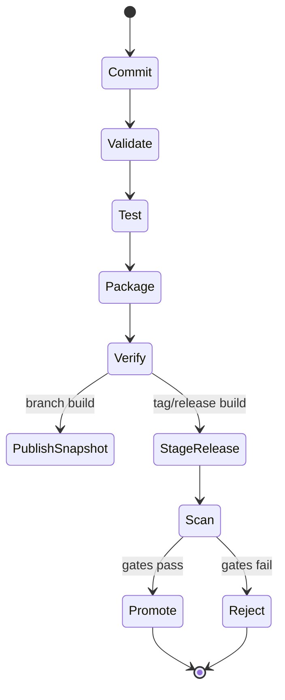
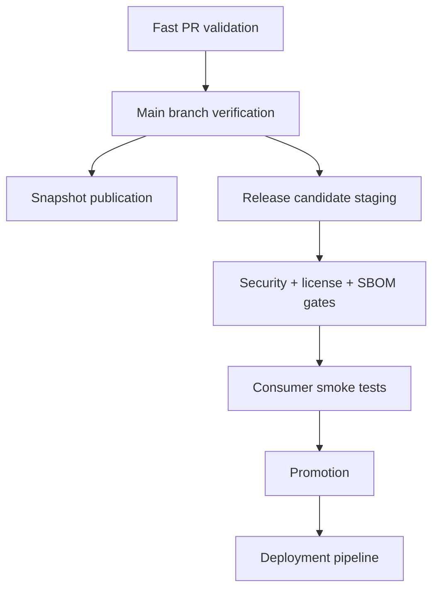
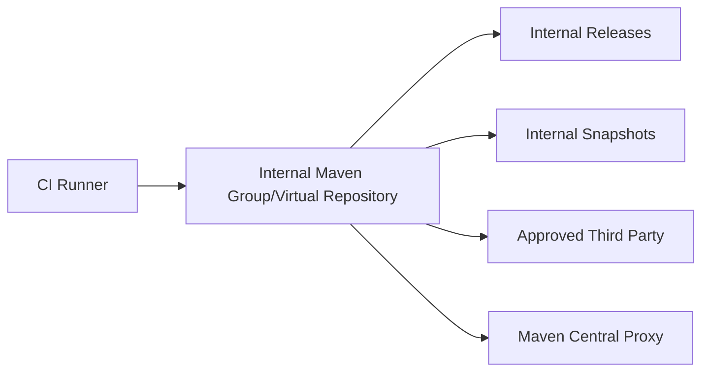
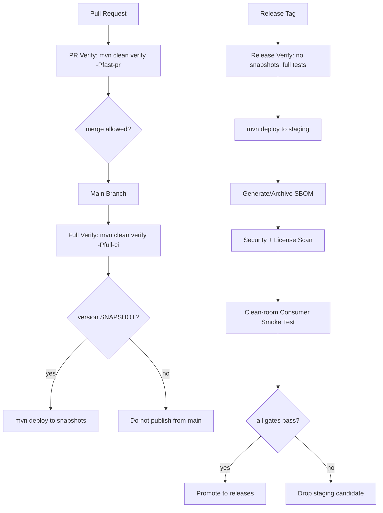

# Part 032 — CI/CD Pipeline Design for Maven

A Maven CI/CD pipeline is not just this:

```bash
mvn clean install
```

That command may be acceptable on a laptop.

It is not a pipeline design.

A production-grade Maven pipeline answers deeper questions:

- Which code changes are allowed to enter the main branch?
- Which Maven phases are run at which gate?
- Which artifacts are produced?
- Which artifacts are published?
- Which dependencies are allowed?
- Which JDK and Maven versions are used?
- How is the local Maven repository cached?
- How are flaky tests isolated?
- How are integration test environments provisioned and cleaned up?
- How is a release artifact traced back to source?
- How do we prevent publishing broken or non-reproducible artifacts?

This part builds a mental model for designing Maven CI/CD pipelines that hold up under large teams, multi-module codebases, internal libraries, regulated change control, and release audit requirements.

---

## 1. Pipeline as a State Machine

Think of CI/CD as a state machine for code and artifacts.



Each state has invariants.

| State | Invariant |
|---|---|
| Commit | Source is identifiable by commit SHA. |
| Validate | Build metadata is structurally valid. |
| Test | Fast correctness checks pass. |
| Package | Artifact can be assembled. |
| Verify | Full build verification passes. |
| Publish snapshot | Mutable integration artifact is available. |
| Stage release | Candidate artifact exists but is not final. |
| Scan | Candidate passes security/license/compliance gates. |
| Promote | Exact candidate becomes release artifact. |

A pipeline is weak when states are collapsed without understanding.

Example weak pipeline:

```bash
mvn clean deploy -DskipTests
```

This jumps directly from source to shared artifact while bypassing verification.

That is not automation maturity. That is automated risk.

---

## 2. Maven Phase Mapping to CI Stages

Maven already has lifecycle phases. A good pipeline maps CI stages to Maven phases intentionally.

| CI Stage | Maven command | Purpose |
|---|---|---|
| Model validation | `mvn validate` | POM structure, enforcer, version policy, basic config. |
| Compile | `mvn compile` | Language/API compatibility. |
| Unit test | `mvn test` | Fast isolated tests via Surefire. |
| Package | `mvn package` | Artifact assembly. |
| Full verification | `mvn verify` | Integration tests, quality checks, packaging checks. |
| Local publish simulation | `mvn install` | Artifact resolvable locally. |
| Remote publish | `mvn deploy` | Artifact shared to remote repository. |

In most CI jobs, `mvn verify` is the default quality gate.

Why `verify`?

Because `verify` runs later than `package` and is the correct lifecycle point for checks that validate the packaged artifact.

Avoid making `mvn install` your default CI validation command unless another module/project needs local repository installation in the same job.

For ordinary validation:

```bash
mvn --batch-mode --no-transfer-progress clean verify
```

For publication:

```bash
mvn --batch-mode --no-transfer-progress clean deploy
```

---

## 3. The Minimal Healthy Maven CI Command

Baseline command:

```bash
mvn --batch-mode --no-transfer-progress clean verify
```

Meaning:

| Option | Why it matters |
|---|---|
| `--batch-mode` | Non-interactive CI execution. |
| `--no-transfer-progress` | Cleaner logs, less noise. |
| `clean` | Reduces stale `target/` contamination. |
| `verify` | Runs lifecycle through verification gates. |

For debugging, you may add:

```bash
-e
```

For deep Maven internals debugging:

```bash
-X
```

Do not run `-X` permanently in CI.

Debug logs are noisy and can expose environment details.

---

## 4. Do Not Default to `mvn clean install`

Many teams use:

```bash
mvn clean install
```

It works, but it often hides weak pipeline thinking.

`install` writes artifacts to the local Maven repository of the CI runner.

That can be useful when:

- later steps in the same job consume the artifact;
- a separate integration test project needs the artifact;
- you are testing publication metadata locally.

But it is unnecessary if the job only validates the project.

Prefer:

```bash
mvn clean verify
```

Use `install` only when you need local repository side effects.

This matters especially with caching.

A polluted CI local repository can hide missing dependencies, broken publication, or undeclared module relationships.

---

## 5. The Pipeline Layers

A strong Maven pipeline has layers.



Each layer answers a different question.

| Layer | Question |
|---|---|
| PR validation | Is this change safe to merge? |
| Main verification | Is main still releasable? |
| Snapshot publication | Can other teams integrate with latest main? |
| Release staging | Is this exact artifact a candidate? |
| Security/license gates | Is it allowed to ship? |
| Consumer smoke test | Can real consumers resolve and start with it? |
| Promotion | Should this artifact become a release? |
| Deployment | Should this artifact go to an environment? |

Do not force every pull request to run every possible gate.

That creates slow feedback and developer bypass behavior.

Instead, design gates by risk and cost.

---

## 6. PR Validation Pipeline

Goal:

> Catch most problems before merge, quickly.

Typical PR command:

```bash
mvn --batch-mode --no-transfer-progress clean verify
```

For huge builds, split into stages:

```txt
1. validate + enforcer
2. compile
3. unit tests
4. package + integration tests for affected modules
```

PR validation should include:

- POM validity;
- Enforcer rules;
- compile;
- unit tests;
- static quality checks;
- selected integration tests;
- dependency convergence checks;
- generated source checks;
- no accidental version changes;
- no snapshot dependency in protected modules unless allowed.

PR validation may skip:

- artifact deploy;
- full system test;
- long performance test;
- manual approval;
- production deployment.

But skipping must be explicit.

Do not hide skipped checks behind random `-DskipTests`.

Use named profiles/properties with clear semantics.

Bad:

```bash
mvn clean install -DskipTests
```

Better:

```bash
mvn clean verify -Pfast-pr
```

Then document exactly what `fast-pr` excludes.

---

## 7. Main Branch Pipeline

Goal:

> Keep main branch releasable.

Main branch should usually run stricter gates than PR.

Example:

```bash
mvn --batch-mode --no-transfer-progress clean verify
```

Additional main branch steps:

- full integration tests;
- package inspection;
- SBOM generation;
- vulnerability scan;
- publish snapshot if policy allows;
- update build status dashboard;
- produce test reports;
- archive build logs/artifacts.

If main branch publishes snapshots:

```bash
mvn --batch-mode --no-transfer-progress clean deploy
```

Only if version is `-SNAPSHOT`.

Never let main publish releases automatically unless the organization has a deliberate continuous-release model.

---

## 8. Release Pipeline

Goal:

> Produce or promote an immutable artifact with provenance.

A release pipeline should run from:

- a Git tag;
- a release branch;
- a manually approved workflow;
- a versioned release request;
- a generated release commit.

Release pipeline stages:

```txt
1. checkout exact source
2. set up exact JDK/Maven/toolchain
3. verify no SNAPSHOT version/dependencies
4. run full tests
5. package artifacts
6. sign artifacts if required
7. deploy to staging repository
8. generate/attach SBOM
9. scan candidate
10. run clean-room consumer test
11. promote staging repository
12. publish release metadata
```

Release command often starts with:

```bash
mvn --batch-mode --no-transfer-progress clean deploy
```

But the command alone is not the release pipeline.

The gates around it make it a release pipeline.

---

## 9. Artifact Handoff Principle

The artifact that passed gates should be the artifact that gets released.

Weak handoff:

```txt
Job A: mvn verify
Job B: mvn deploy   # rebuilds from source
```

This assumes rebuild is identical.

That may be true if reproducible builds are strong. But many Maven builds are not perfectly deterministic because of timestamps, generated sources, environment variables, plugin behavior, or dependency drift.

Stronger handoff:

```txt
Job A: build + test + deploy to staging
Job B: promote same staged artifacts
```

Alternative:

```txt
Job A: build + test + archive artifacts
Job B: publish exact archived artifacts
```

For Maven libraries, repository staging is often the cleanest handoff.

For application deployments, container/image pipelines may take over after Maven package.

---

## 10. Cache Strategy

Maven downloads dependencies and plugins into the local repository.

Default local repository:

```txt
~/.m2/repository
```

Caching this directory can speed up CI.

But caching has risks:

- stale snapshots;
- corrupted artifacts;
- hidden undeclared dependencies;
- cross-branch contamination;
- cache poisoning;
- inconsistent plugin versions;
- secrets accidentally stored outside intended locations.

Good cache key includes:

- operating system;
- Java version;
- Maven version if controlled;
- hash of relevant POM files;
- possibly settings/repository policy version.

Example conceptual key:

```txt
m2-${os}-jdk${javaVersion}-${hashOfPomFiles}
```

Use dependency cache to reduce network cost, not to make builds pass.

A build should pass from an empty local repository.

Run clean-room builds periodically:

```bash
mvn -Dmaven.repo.local=/tmp/m2-clean clean verify
```

---

## 11. GitHub Actions Example

A minimal Maven validation workflow:

```yaml
name: Maven CI

on:
  pull_request:
  push:
    branches: [ main ]

jobs:
  verify:
    runs-on: ubuntu-latest

    steps:
      - name: Checkout
        uses: actions/checkout@v4

      - name: Set up JDK
        uses: actions/setup-java@v4
        with:
          distribution: temurin
          java-version: '21'
          cache: maven

      - name: Verify
        run: mvn --batch-mode --no-transfer-progress clean verify
```

GitHub Actions supports Maven dependency caching through Java setup/cache mechanisms, but the exact action versions should be pinned and maintained by your platform team.

For enterprise CI, also consider pinning actions by SHA according to security policy.

---

## 12. GitHub Actions Publish Example

Snapshot deploy from `main`:

```yaml
name: Maven Snapshot Publish

on:
  push:
    branches: [ main ]

jobs:
  deploy-snapshot:
    runs-on: ubuntu-latest
    permissions:
      contents: read

    steps:
      - name: Checkout
        uses: actions/checkout@v4

      - name: Set up JDK
        uses: actions/setup-java@v4
        with:
          distribution: temurin
          java-version: '21'
          cache: maven

      - name: Generate Maven settings
        run: |
          mkdir -p .ci
          cat > .ci/settings.xml <<'SETTINGS'
          <settings xmlns="http://maven.apache.org/SETTINGS/1.2.0">
            <servers>
              <server>
                <id>acme-snapshots</id>
                <username>${env.MAVEN_REPO_USERNAME}</username>
                <password>${env.MAVEN_REPO_TOKEN}</password>
              </server>
            </servers>
          </settings>
          SETTINGS

      - name: Deploy snapshot
        env:
          MAVEN_REPO_USERNAME: ${{ secrets.MAVEN_REPO_USERNAME }}
          MAVEN_REPO_TOKEN: ${{ secrets.MAVEN_REPO_TOKEN }}
        run: |
          mvn --batch-mode --no-transfer-progress \
            --settings .ci/settings.xml \
            clean deploy
```

Hardening additions:

- branch protection;
- environment protection for releases;
- secret access only on trusted branches;
- no secrets on untrusted pull requests;
- clean-room dependency resolution job;
- dependency review/scanning;
- action pinning;
- artifact provenance metadata.

---

## 13. Jenkins Pipeline Example

Declarative pipeline skeleton:

```groovy
pipeline {
  agent any

  tools {
    jdk 'jdk-21'
    maven 'maven-3.9.x'
  }

  options {
    timestamps()
    ansiColor('xterm')
    disableConcurrentBuilds()
  }

  stages {
    stage('Checkout') {
      steps {
        checkout scm
      }
    }

    stage('Verify') {
      steps {
        sh 'mvn --batch-mode --no-transfer-progress clean verify'
      }
      post {
        always {
          junit '**/target/surefire-reports/*.xml'
          junit '**/target/failsafe-reports/*.xml'
        }
      }
    }

    stage('Deploy Snapshot') {
      when {
        branch 'main'
      }
      steps {
        withCredentials([usernamePassword(
          credentialsId: 'maven-snapshots',
          usernameVariable: 'MAVEN_REPO_USERNAME',
          passwordVariable: 'MAVEN_REPO_TOKEN'
        )]) {
          sh 'mvn --batch-mode --no-transfer-progress --settings .ci/settings.xml clean deploy'
        }
      }
    }
  }
}
```

For release pipelines, add approval and staging promotion stages.

---

## 14. Multi-Module CI Strategy

Multi-module builds introduce tradeoffs.

Full reactor build:

```bash
mvn clean verify
```

Pros:

- highest confidence;
- catches cross-module issues;
- simple mental model.

Cons:

- can be slow;
- poor feedback for small changes;
- expensive in large monorepos.

Partial affected-module build:

```bash
mvn clean verify -pl payment-api -am
```

Pros:

- faster;
- useful for PR feedback;
- builds upstream dependencies automatically.

Cons:

- may miss downstream breakage;
- requires changed-module detection;
- can hide integration issues.

Downstream impact build:

```bash
mvn clean verify -pl payment-api -amd
```

Pros:

- tests modules affected by a change;
- useful for API modules.

Cons:

- can become almost full build;
- dependency graph must be correct.

Recommended pattern:

| Trigger | Build strategy |
|---|---|
| Small PR | Affected modules + upstream dependencies. |
| API contract change | Affected module + downstream modules. |
| Main branch | Full reactor. |
| Release | Full reactor + staging gates. |
| Nightly | Full reactor + slow tests + clean cache. |

---

## 15. Parallel Maven Builds

Maven supports parallel builds with `-T`.

Example:

```bash
mvn -T 1C clean verify
```

`1C` means one thread per CPU core.

Parallel builds can reduce wall-clock time.

But they expose hidden problems:

- non-thread-safe plugins;
- tests sharing ports/files/global state;
- integration tests using fixed resources;
- generated source races;
- modules depending on files without declared Maven dependency;
- flaky ordering assumptions.

Use parallel builds after the reactor graph is healthy.

Do not use parallelism to hide slow architecture.

CI strategy:

```txt
PR fast build:     mvn -T 1C clean verify
Nightly strict:    mvn clean verify
Release build:     mvn clean deploy   # parallel only if proven safe
```

For release, prefer reliability over speed.

---

## 16. Test Stage Design

Maven test execution should align with Surefire/Failsafe.

| Test type | Plugin | Phase | CI placement |
|---|---|---|---|
| Unit test | Surefire | `test` | PR and main. |
| Integration test | Failsafe | `integration-test` + `verify` | Main/release, selected PR. |
| Contract test | Surefire/Failsafe/custom | Depends | PR for API changes, main. |
| Smoke test | External step or Failsafe | After package/deploy | Release/staging. |
| Performance test | Separate tooling/profile | Not default lifecycle | Nightly/release candidate. |

Do not put slow environment-heavy tests in Surefire by accident.

Use naming conventions:

```txt
*Test.java      -> unit tests
*IT.java        -> integration tests
```

Run full verification through:

```bash
mvn verify
```

Not:

```bash
mvn integration-test
```

Because `verify` gives Failsafe a chance to evaluate results and lets post-integration cleanup phases run as designed.

---

## 17. Profiles in CI

Profiles should make pipeline intent explicit, not hide environment chaos.

Good profile names:

```txt
fast-pr
full-ci
release
integration-tests
skip-docker-it
```

Bad profile names:

```txt
dev
qa
prod
local
jenkins
```

Example:

```bash
mvn clean verify -Pfull-ci
```

Profile rules:

- default build should be meaningful;
- CI profiles should be documented;
- release profile should be reproducible;
- avoid profiles that change dependency versions by environment;
- avoid profiles that create different artifacts for dev/qa/prod;
- secrets should not be injected by resource filtering.

A CI profile may enable stricter checks:

```xml
<profile>
  <id>full-ci</id>
  <build>
    <plugins>
      <!-- quality, coverage, integration test plugins -->
    </plugins>
  </build>
</profile>
```

A release profile may attach sources, javadocs, signatures, SBOM.

---

## 18. Build Matrix Strategy

Matrix builds test compatibility across JDKs, operating systems, or Maven versions.

Example dimensions:

```txt
JDK: 17, 21
OS: ubuntu-latest, windows-latest
Maven: controlled wrapper version or installed Maven
```

Use matrix builds when:

- publishing libraries;
- supporting multiple Java baselines;
- using native components;
- tests depend on filesystem behavior;
- annotation processors behave differently;
- toolchain compatibility matters.

Do not blindly run huge matrices on every PR.

Suggested:

| Trigger | Matrix |
|---|---|
| PR | Primary supported JDK/OS. |
| Main | Primary + secondary JDK. |
| Nightly | Full JDK/OS matrix. |
| Release | Required support matrix. |

For libraries, the release matrix is part of the consumer contract.

For services, matrix may be smaller because runtime platform is controlled.

---

## 19. Maven Wrapper in CI

Many teams use Maven Wrapper:

```txt
mvnw
mvnw.cmd
.mvn/wrapper/maven-wrapper.properties
```

Benefits:

- project pins Maven distribution;
- CI and developer use same Maven version;
- easier onboarding;
- less global tool drift.

CI command:

```bash
./mvnw --batch-mode --no-transfer-progress clean verify
```

Governance:

- wrapper JAR/script provenance should be controlled;
- wrapper version should be reviewed;
- update wrapper intentionally;
- do not mix random system Maven and wrapper Maven in the same pipeline without reason.

Maven version is part of the build environment.

Treat it like JDK version.

---

## 20. `.mvn/maven.config` and `.mvn/jvm.config`

Project-level Maven config can standardize command options.

Example `.mvn/maven.config`:

```txt
--batch-mode
--no-transfer-progress
```

Example `.mvn/jvm.config`:

```txt
-Xmx2g
-Dfile.encoding=UTF-8
```

Benefits:

- reduces command duplication;
- aligns local and CI behavior;
- makes default build policy visible.

Risks:

- hidden flags surprise maintainers;
- local-only assumptions leak into CI;
- memory flags may not suit all runners;
- profile activation may become implicit.

Guideline:

Use `.mvn` config for stable build behavior.

Do not hide release decisions in `.mvn/maven.config`.

---

## 21. Environment Isolation

CI must control environment inputs.

Important inputs:

- JDK version;
- Maven version;
- OS image;
- timezone;
- locale;
- file encoding;
- local repository path;
- network access;
- `settings.xml`;
- environment variables;
- Docker daemon availability;
- external service dependencies.

Set explicitly where relevant:

```bash
export TZ=UTC
export MAVEN_OPTS="-Dfile.encoding=UTF-8"
```

POM properties:

```xml
<properties>
  <project.build.sourceEncoding>UTF-8</project.build.sourceEncoding>
  <project.reporting.outputEncoding>UTF-8</project.reporting.outputEncoding>
</properties>
```

For reproducible artifacts, also control:

```xml
<project.build.outputTimestamp>${git.commit.time}</project.build.outputTimestamp>
```

Or another deterministic timestamp source.

---

## 22. Secure Settings and Secret Handling

CI secrets must be available only to jobs that need them.

PRs from untrusted forks should not receive deploy credentials.

Pattern:

| Job | Needs Maven repo credentials? |
|---|---:|
| PR verify | No, except read-only repo if private dependencies require it. |
| Main verify | Maybe read-only. |
| Snapshot publish | Yes, snapshot deploy token. |
| Release staging | Yes, staging deploy token. |
| Promotion | Yes, promotion token/API credentials. |

Keep write credentials out of validation jobs.

Use separate credentials for:

- dependency read;
- snapshot deploy;
- release staging deploy;
- promotion;
- public publishing.

If a job only needs read access, do not give deploy access.

---

## 23. CI Repository Access Pattern

Ideal pattern:



CI should normally resolve through one internal group/virtual URL.

Benefits:

- audit dependency downloads;
- cache external dependencies;
- centralize allow/block rules;
- survive external outages better;
- prevent direct access to random repositories;
- support air-gapped or restricted environments.

Configure this through `settings.xml` mirrors, not repeated POM repositories.

---

## 24. Artifact and Report Archiving

CI should preserve useful evidence.

Archive:

- test reports;
- failsafe reports;
- coverage reports;
- generated SBOM;
- packaged artifact for non-published builds;
- effective POM for release builds;
- dependency tree for release builds;
- build scan/log summary if available;
- checksums for release artifacts.

Example commands:

```bash
mvn dependency:tree -DoutputFile=target/dependency-tree.txt
mvn help:effective-pom -Doutput=target/effective-pom.xml
```

For release builds, these files are audit artifacts.

Do not rely only on console logs.

---

## 25. Dependency Tree Gate

Dependency problems often enter silently.

Useful CI checks:

```bash
mvn dependency:tree
mvn dependency:analyze
mvn enforcer:enforce
```

Release build should capture dependency tree:

```bash
mvn --batch-mode dependency:tree \
  -DoutputFile=target/dependency-tree.txt
```

For multi-module projects, capture per-module dependency trees if needed.

Policy examples:

- no duplicate logging bindings;
- no banned legacy JSON library;
- no vulnerable dependency version;
- no SNAPSHOT dependency in release;
- no test framework in compile scope;
- no internal implementation module dependency from public API module.

Make dependency policy executable.

Do not keep it only in wiki pages.

---

## 26. SBOM in CI

A modern Maven pipeline should be able to produce a Software Bill of Materials.

Typical placement:

```txt
verify/package -> generate SBOM -> scan -> archive/attach
```

SBOM usage:

- vulnerability analysis;
- license review;
- incident response;
- customer/regulator requests;
- artifact provenance;
- dependency inventory.

The important design question is not merely “which plugin?”

It is:

> Which artifact does this SBOM describe?

For libraries, it may describe the published Maven artifact.

For applications, it may need to describe the deployable image, not only the Maven dependency graph.

Maven dependency SBOM is necessary but may not be sufficient for containerized services.

---

## 27. Release Provenance

Every release artifact should answer:

```txt
What source produced this artifact?
What command produced it?
What JDK/Maven produced it?
What dependencies were resolved?
What checks passed?
Who/what approved it?
Where was it published?
What checksum identifies it?
```

Practical metadata to capture:

- Git commit SHA;
- Git tag;
- branch;
- CI run ID;
- JDK version;
- Maven version;
- OS image;
- effective POM;
- dependency tree;
- artifact checksum;
- repository URL;
- staging repository ID;
- promotion timestamp;
- approver identity if manual.

This is not bureaucracy.

This is how you debug production dependency incidents quickly.

---

## 28. Failure Isolation

When a pipeline fails, isolate the failure layer.

| Symptom | Likely layer |
|---|---|
| POM parse error | Model/config. |
| Dependency not found | Repository/resolution. |
| Compilation fails | Source/API/JDK. |
| Unit tests fail | Code behavior. |
| Integration tests hang | Environment/resource cleanup. |
| Package missing files | Plugin/layout/resource config. |
| Enforcer fails | Governance/dependency policy. |
| Deploy returns 401 | Credentials/server ID. |
| Deploy returns 403 | Permission/repository policy. |
| Redeploy conflict | Immutable release/version reuse. |
| Works locally but not CI | Environment/cache/settings difference. |

Debug workflow:

```txt
1. Identify failed stage.
2. Identify Maven phase/goal that failed.
3. Reproduce with same command locally or in CI shell if allowed.
4. Check effective POM/settings.
5. Check dependency tree/resolution.
6. Check environment variables/toolchain.
7. Check repository manager logs if deploy/resolve failure.
```

Do not start by changing plugin versions randomly.

---

## 29. Flaky Tests and Pipeline Trust

Flaky tests destroy CI trust.

Bad response:

```bash
-DskipTests
```

Better response:

- classify flaky tests;
- quarantine only with ticket/owner/expiry;
- collect failure statistics;
- separate environment flakes from logic flakes;
- fix shared ports/time/files/randomness;
- make integration test cleanup reliable;
- use deterministic clocks where possible;
- fail release pipeline on quarantined critical tests.

Maven-level tools:

- Surefire/Failsafe rerun configuration may reduce transient noise;
- but reruns should be visible;
- reruns are not a substitute for fixing nondeterminism.

Pipeline invariant:

> A green release pipeline must mean something.

If everyone knows green sometimes means lucky, the pipeline has lost authority.

---

## 30. Branch and Version Policy

Pipeline behavior should follow branch/version rules.

Example policy:

| Source | Version | Allowed action |
|---|---|---|
| feature branch | `*-SNAPSHOT` | verify only, maybe branch snapshot. |
| main | `*-SNAPSHOT` | verify + publish main snapshot. |
| release branch | release candidate version | stage candidate. |
| Git tag `v1.4.0` | `1.4.0` | release staging/promotion. |
| hotfix branch | `1.4.1-SNAPSHOT` -> `1.4.1` | hotfix release flow. |

Automate checks:

- tag matches project version;
- release version is non-SNAPSHOT;
- main branch does not accidentally carry release version forever;
- no duplicate release tag;
- no redeploy of existing immutable version.

Example simple shell guard:

```bash
PROJECT_VERSION=$(mvn help:evaluate -Dexpression=project.version -q -DforceStdout)
case "$PROJECT_VERSION" in
  *-SNAPSHOT) echo "Snapshot version: $PROJECT_VERSION" ;;
  *) echo "Release version: $PROJECT_VERSION" ;;
esac
```

---

## 31. Container Build Boundary

For Java services, Maven often feeds a container pipeline.

Two patterns:

### Pattern A — Maven builds JAR, container tool builds image

```txt
mvn package -> target/app.jar -> docker build -> image registry
```

Pros:

- clear separation;
- container tool owns image;
- Maven remains Java build tool.

Cons:

- artifact handoff must be controlled;
- Dockerfile must match artifact name/version.

### Pattern B — Maven plugin builds image

```txt
mvn package jib:build
```

Pros:

- integrated with Maven lifecycle;
- can use Maven metadata;
- useful for Java-only services.

Cons:

- build system now owns container publication too;
- plugin configuration becomes release-critical;
- image provenance must be captured.

Either is fine if the boundary is explicit.

Do not publish Maven artifact and container image from disconnected rebuilds unless reproducibility is proven.

---

## 32. Monorepo vs Polyrepo Maven Pipelines

### Polyrepo

Each repository has its own Maven build and release.

Pros:

- simple ownership;
- smaller pipelines;
- independent releases.

Cons:

- cross-repository dependency coordination;
- snapshot dependency temptation;
- platform BOM discipline required.

### Monorepo

Many modules/services in one repository.

Pros:

- atomic refactoring;
- shared reactor visibility;
- easier API impact testing.

Cons:

- large build time;
- changed-module detection complexity;
- ownership boundaries harder;
- partial release complexity.

Maven reactor works naturally for multi-module repositories, but very large monorepos may need additional build orchestration.

The Maven invariant remains:

> If module B depends on module A, express that dependency in Maven metadata, not only in pipeline ordering.

---

## 33. CI Performance Principles

Performance tuning comes later in the series, but pipeline design should already avoid obvious waste.

Principles:

- use dependency cache carefully;
- avoid `clean` in every internal stage if same workspace is reused intentionally;
- split fast and slow checks;
- avoid repeated full rebuilds across jobs unless needed;
- archive artifacts for handoff;
- use `-pl`/`-am` for PR feedback;
- run full build on main/release;
- avoid unnecessary `install`;
- avoid downloading from the internet directly;
- pin plugin versions to reduce metadata churn.

Slow pipelines encourage bypasses.

But fast pipelines that miss real failures are worse.

Optimize after correctness boundaries are clear.

---

## 34. Pipeline Templates as Platform Product

In mature organizations, Maven pipelines are not copy-pasted YAML in every repo.

They are platform products.

A platform team may provide:

- reusable GitHub Actions workflow;
- Jenkins shared library;
- internal Maven parent POM;
- standard `settings.xml` generator;
- repository manager conventions;
- standard release workflow;
- dependency policy rules;
- quality gate profiles;
- troubleshooting docs;
- onboarding sample repository.

This prevents drift.

But platform abstractions must remain debuggable.

Engineers should still be able to answer:

```txt
What Maven command ran?
Which settings.xml was used?
Which profile was active?
Which repository URL was used?
Which artifact coordinates were published?
```

If the platform hides those answers, it is too magical.

---

## 35. Example Enterprise Pipeline Blueprint



Commands:

PR:

```bash
mvn --batch-mode --no-transfer-progress clean verify -Pfast-pr
```

Main:

```bash
mvn --batch-mode --no-transfer-progress clean verify -Pfull-ci
```

Snapshot publish:

```bash
mvn --batch-mode --no-transfer-progress --settings .ci/settings.xml clean deploy
```

Release staging:

```bash
mvn --batch-mode --no-transfer-progress --settings .ci/settings.xml clean deploy -Prelease
```

Clean-room consumer:

```bash
mvn -Dmaven.repo.local=/tmp/m2-clean \
  --settings .ci/settings.xml \
  dependency:get \
  -Dartifact=com.acme.payment:payment-api:1.4.0
```

---

## 36. Pipeline Anti-Patterns

### Anti-pattern: `-DskipTests` in release pipeline

This creates unaudited risk.

If tests are too slow or flaky, fix test architecture.

Do not redefine release to mean “compiled”.

### Anti-pattern: PR and release use different build logic

If PR build does not resemble release build, defects escape.

Some differences are acceptable, but they must be intentional and documented.

### Anti-pattern: pipeline deploys from feature branches by default

This pollutes repositories and creates dependency confusion.

Branch snapshots can exist, but isolate them and expire them.

### Anti-pattern: CI uses random Maven/JDK from runner image

Runner images change.

Pin JDK and Maven or use Maven Wrapper/toolchains.

### Anti-pattern: cache required for success

A build that only works with warm cache is broken.

Periodically test with empty local repo.

### Anti-pattern: release rebuild after validation

If the released artifact is rebuilt after gates, the gates did not validate the released bytes.

Use staging/promotion or reproducible build proof.

---

## 37. Operational Runbook: CI Build Fails Only in CI

Follow this sequence:

1. Capture exact Maven command.
2. Capture JDK version:

```bash
java -version
```

3. Capture Maven version:

```bash
mvn -version
```

4. Capture active profiles:

```bash
mvn help:active-profiles
```

5. Capture effective POM:

```bash
mvn help:effective-pom -Doutput=target/effective-pom.xml
```

6. Capture effective settings:

```bash
mvn help:effective-settings -Doutput=target/effective-settings.xml
```

7. Run with clean local repository:

```bash
mvn -Dmaven.repo.local=/tmp/m2-clean clean verify
```

8. Compare with local environment.

Common differences:

- local has artifact installed in `~/.m2`;
- CI cannot access private repository;
- active profile differs;
- environment variable missing;
- OS path separator/case sensitivity;
- JDK version differs;
- locale/timezone differs;
- integration test service unavailable;
- generated file checked in locally but missing in clean checkout.

---

## 38. Operational Runbook: Deploy Fails in CI

1. Confirm version:

```bash
mvn help:evaluate -Dexpression=project.version -q -DforceStdout
```

2. Confirm target from effective POM:

```bash
mvn help:effective-pom -Doutput=target/effective-pom.xml
```

3. Confirm server IDs from settings:

```bash
mvn help:effective-settings -Doutput=target/effective-settings.xml
```

4. Confirm CI secrets are present without printing them:

```bash
test -n "$MAVEN_REPO_USERNAME"
test -n "$MAVEN_REPO_TOKEN"
```

5. Check status code:

| Code | Meaning |
|---|---|
| 401 | Missing/wrong credentials. |
| 403 | Authenticated but not allowed. |
| 404 | Wrong URL or repository path. |
| 409 | Version conflict/immutable release. |
| 5xx | Repository manager/server issue. |

6. Check repository manager logs.

7. If multi-module release partially deployed, stop and follow repository rollback/drop process.

Do not rerun blindly.

Rerun can make repository state worse.

---

## 39. CI/CD Maturity Ladder

| Level | Behavior |
|---|---|
| 0 | Developers manually run Maven; no standard CI. |
| 1 | CI runs `mvn clean install`; unstable but useful. |
| 2 | CI runs `mvn clean verify`; tests/reports visible. |
| 3 | Dependency cache, pinned JDK/Maven, repository manager, settings discipline. |
| 4 | PR/main/release pipelines separated; snapshots/releases governed. |
| 5 | Staging/promotion, SBOM, scans, clean-room verification, provenance. |
| 6 | Platform templates, policy-as-code, reproducible builds, fast affected-module builds. |

The goal is not “more YAML”.

The goal is trustworthy artifact flow.

---

## 40. Final Mental Model

A Maven CI/CD pipeline is a control system over artifact state.

```txt
code -> verified build -> candidate artifact -> approved artifact -> deployed system
```

Every transition should be explicit.

Every artifact should be traceable.

Every remote publication should be intentional.

Every shortcut should be named and justified.

The highest-leverage Maven pipeline rule:

> Use `mvn verify` to decide whether code is good enough, and use `mvn deploy` only when the organization is ready to share the artifact.

---

## References

- Apache Maven Build Lifecycle: https://maven.apache.org/guides/introduction/introduction-to-the-lifecycle.html
- Apache Maven Deploy Plugin: https://maven.apache.org/plugins/maven-deploy-plugin/
- Apache Maven Deploy Plugin — `deployAtEnd`, alternate repositories, retry configuration: https://maven.apache.org/plugins/maven-deploy-plugin/deploy-mojo.html
- Apache Maven Settings Reference: https://maven.apache.org/settings.html
- Apache Maven Guide to Multiple Modules: https://maven.apache.org/guides/mini/guide-multiple-modules.html
- GitHub Actions — Building and testing Java with Maven: https://docs.github.com/actions/guides/building-and-testing-java-with-maven
- GitHub Actions — Dependency caching reference: https://docs.github.com/en/actions/reference/workflows-and-actions/dependency-caching
