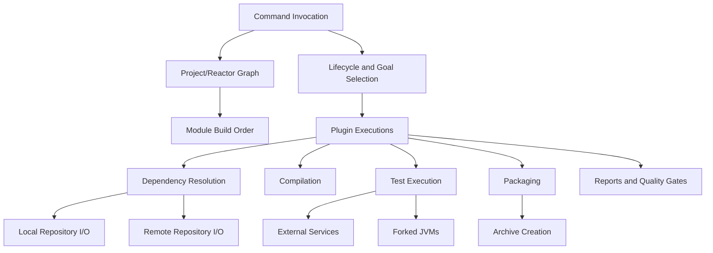
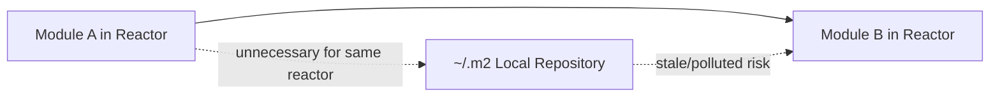
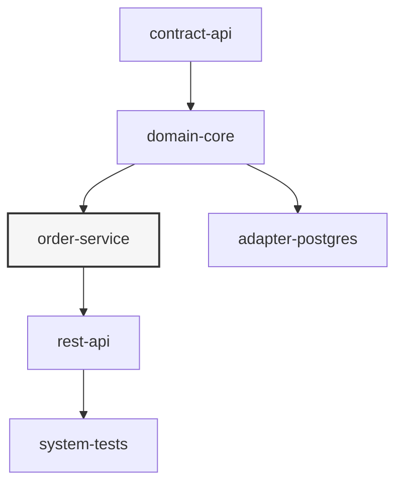
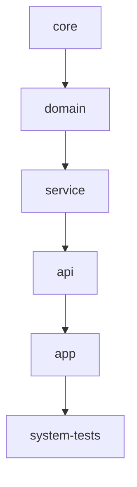
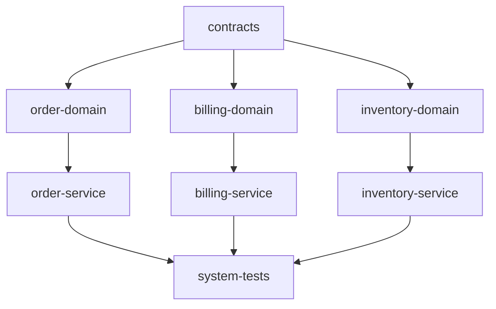
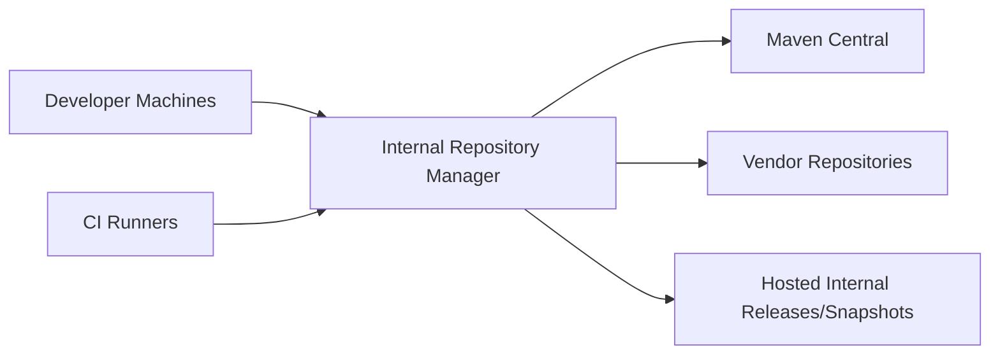
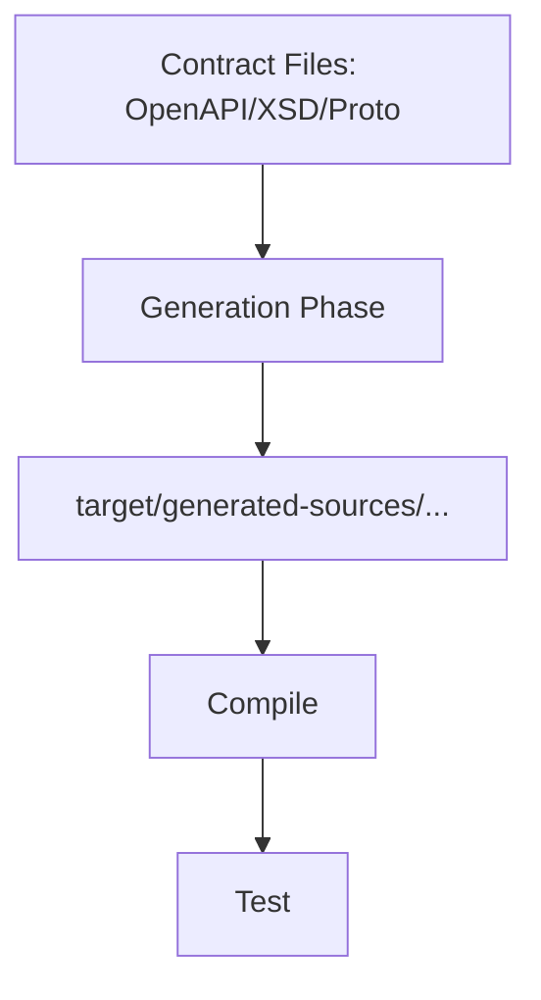

# Part 033 — Performance Engineering for Large Maven Builds

Build yang lambat jarang punya satu penyebab. Biasanya ia adalah akumulasi dari beberapa keputusan kecil:

- dependency graph terlalu besar,
- reactor terlalu lebar tapi tidak bisa diparalelkan,
- test terlalu mahal dan tidak dipisah berdasarkan risiko,
- code generation selalu berjalan walau input tidak berubah,
- artifact selalu di-resolve dari remote,
- plugin berjalan di module yang tidak perlu,
- CI cache tidak stabil,
- parent POM mewariskan goal mahal ke semua module,
- packaging membuat artifact besar untuk setiap PR,
- developer menjalankan lifecycle yang salah untuk feedback loop yang dibutuhkan.

Materi ini bukan tentang “pakai `mvn -T 4` lalu selesai”. Itu hanya satu knob. Senior engineer melihat Maven build sebagai **pipeline ekonomi**: setiap detik build harus membeli confidence tertentu. Kalau detik itu tidak membeli confidence, hapus, pindahkan, paralelkan, atau jalankan hanya pada kondisi yang tepat.

Tujuan part ini:

1. Membangun mental model performa Maven build.
2. Membuat baseline pengukuran yang adil.
3. Mengurai cost Maven: resolution, compilation, testing, codegen, packaging, quality checks, deploy.
4. Mendesain strategi build cepat untuk developer dan CI tanpa mengorbankan reproducibility.
5. Menyusun playbook optimasi yang aman untuk large multi-module builds.

---

## 1. Mental Model: Build Maven Adalah Graph + Workload + I/O

Maven build besar bukan hanya urutan command. Ia adalah hasil dari tiga hal:



Kalau build lambat, jangan mulai dari opini. Mulai dari pertanyaan:

> Di layer mana waktunya hilang?

Layer umum:

| Layer | Contoh Cost | Gejala | Optimasi Umum |
|---|---|---|---|
| Invocation | JVM startup, Maven startup, extension loading | Build kecil tetap terasa lambat | wrapper, daemon alternatif, task granularity; tetapi tetap ukur dulu |
| Model Building | parent, profile, interpolation, effective POM | banyak module lambat sebelum build nyata | kurangi profile kompleks, parent chain, remote parent |
| Dependency Resolution | download, metadata, snapshot checks | lambat saat cold cache atau `-U` | repository manager, cache, snapshot policy |
| Reactor Scheduling | module order, dependency constraints | `-T` tidak banyak membantu | pecah bottleneck module, hilangkan dependency tidak perlu |
| Compilation | javac, annotation processor | CPU tinggi, module compile lama | incremental dev workflow, isolate annotation processors |
| Testing | Surefire/Failsafe, fork JVM, containers | mayoritas waktu build | test pyramid, split unit/integration, parallel test |
| Code Generation | OpenAPI/JAXB/Protobuf/etc | selalu generate ulang | input hashing, phase discipline, generated-source cache di CI bila aman |
| Quality Checks | SpotBugs, PMD, Checkstyle, license | PR build terlalu lama | fast gate vs full gate, diff-aware external tools bila tersedia |
| Packaging | shade/assembly/WAR/EAR/docker context | artifact besar, IO tinggi | avoid fat packaging on every PR, separate release packaging |
| Deploy | upload artifact, staging | main/release pipeline lambat | deployAtEnd, repository locality, staging batching |

Kunci: Maven build tidak bisa dioptimasi hanya dari command line. Banyak optimasi harus dilakukan di POM, module architecture, CI topology, test architecture, dan repository topology.

---

## 2. Definisi “Cepat” Harus Berdasarkan Feedback Loop

Tidak semua build harus melakukan semua hal.

Build yang bagus punya beberapa loop:

| Loop | Target | Command Umum | Confidence |
|---|---:|---|---|
| Edit-compile loop | detik sampai <1 menit | `mvn -pl module -am test` atau IDE compile | kode module masih compile dan unit test lokal lulus |
| PR fast gate | beberapa menit | `mvn -B verify` subset policy | perubahan aman untuk review awal |
| PR full gate | lebih lama | `mvn -B verify` + quality + integration subset | aman merge secara umum |
| Main branch gate | lebih lengkap | full reactor + integration + packaging | branch utama deployable |
| Release gate | paling lengkap | verify + SBOM + signing + deploy/staging | artifact immutable layak dipublish |

Kesalahan umum adalah memaksa semua loop menjalankan release-grade build. Akibatnya developer mencari jalan pintas: skip test, bypass CI, atau tidak menjalankan build lokal sama sekali.

Prinsip:

> Build cepat bukan build yang melakukan sedikit hal. Build cepat adalah build yang melakukan hal yang tepat untuk keputusan yang sedang diambil.

---

## 3. Baseline Measurement Sebelum Optimasi

Optimasi tanpa baseline hampir selalu menghasilkan ritual, bukan engineering.

Gunakan minimal empat baseline:

1. **Cold clean build** — cache dependency kosong atau isolated local repository.
2. **Warm clean build** — dependency sudah ada, tapi `target` dibersihkan.
3. **Warm non-clean build** — build ulang tanpa `clean`.
4. **Targeted module build** — build module yang sering diubah dengan `-pl` dan `-am`.

Contoh baseline script sederhana:

```bash
#!/usr/bin/env bash
set -euo pipefail

export MAVEN_OPTS="${MAVEN_OPTS:-} -Xmx3g"

run_case() {
  name="$1"
  shift
  echo "==== $name ===="
  /usr/bin/time -p "$@"
  echo
}

run_case "warm-clean-verify" mvn -B -V clean verify
run_case "warm-no-clean-verify" mvn -B -V verify
run_case "targeted-module" mvn -B -V -pl :order-service -am test
run_case "parallel-1c" mvn -B -V -T 1C clean verify
run_case "parallel-2c" mvn -B -V -T 2C clean verify
```

Untuk cold cache, jangan hapus `~/.m2/repository` sembarangan di mesin developer. Gunakan local repository sementara:

```bash
mvn -B -V \
  -Dmaven.repo.local=/tmp/maven-repo-cold-$(date +%s) \
  clean verify
```

Ini penting karena:

- cold build mengukur repository topology,
- warm build mengukur actual project workload,
- non-clean build mengukur developer feedback,
- targeted build mengukur modularity effectiveness.

Kalau hanya mengukur `mvn clean install`, hasilnya bias ke workflow lama yang mungkin tidak perlu.

---

## 4. Jangan Selalu Memakai `clean`

`clean` menghapus `target`. Itu berguna untuk clean-room verification. Tapi untuk developer loop, `clean` sering menghancurkan reuse yang masih valid.

Command buruk untuk setiap perubahan kecil:

```bash
mvn clean install
```

Masalah:

1. `clean` menghapus semua output yang sebenarnya masih bisa dipakai.
2. `install` menulis artifact ke local repository, sering tidak perlu.
3. `install` dapat membuat local repository polluted oleh artifact workspace.
4. Jika dijalankan di root multi-module besar, seluruh graph ikut terdampak.

Lebih tepat:

```bash
# cek module dan upstream dependency yang dibutuhkan
mvn -pl :order-service -am test

# cek sampai integration-test verification untuk module terkait
mvn -pl :order-service -am verify

# full clean build hanya untuk clean-room/CI/release
mvn -B clean verify
```

Rule praktis:

| Situasi | Perlu `clean`? | Alasan |
|---|---|---|
| Ganti satu method | Tidak | incremental output cukup |
| Curiga stale generated source | Ya, lokal terarah | bersihkan module terkait saja |
| Ganti plugin codegen | Ya | output generator bisa berubah |
| Ganti parent POM global | Ya untuk CI | semua module bisa terdampak |
| Release artifact | Ya | harus clean-room |
| Debug classpath stale | Ya dengan isolated repo bila perlu | hilangkan pollution |

---

## 5. `install` Bukan Default Developer Command

Banyak tim memakai:

```bash
mvn clean install
```

sebagai mantra. Padahal `install` berarti meng-copy artifact ke local repository agar project lain dapat mengonsumsinya. Dalam reactor build, module downstream biasanya sudah memakai output reactor, bukan harus membaca dari local repository.

Gunakan mental model ini:



Di multi-module reactor, `install` sering tidak diperlukan untuk feedback lokal.

Gunakan:

```bash
mvn verify
```

bukan:

```bash
mvn install
```

kecuali ada alasan:

- project lain di luar reactor perlu artifact lokal,
- manual integration dengan repo terpisah,
- plugin/tool eksternal membaca dari local repository,
- build step berikutnya memang tidak ada dalam reactor.

Untuk CI, `install` juga tidak otomatis lebih benar. CI idealnya menghasilkan artifact sebagai workspace/output pipeline, bukan mengandalkan local repository state antar job tanpa kontrol.

---

## 6. Reactor Slicing: Optimasi Paling Bernilai di Monorepo/Multi-Module

Reactor slicing berarti membangun hanya subgraph yang relevan.

Command penting:

```bash
# Build module tertentu saja
mvn -pl :order-service test

# Build module + dependency upstream yang dibutuhkan
mvn -pl :order-service -am test

# Build module + downstream yang bergantung padanya
mvn -pl :contract-api -amd test

# Lanjut dari module gagal
mvn -rf :order-service verify
```

Mental model:



Jika menjalankan:

```bash
mvn -pl :order-service -am test
```

Maven perlu membangun upstream dependency seperti `contract-api` dan `domain-core`, tapi tidak perlu membangun downstream seperti `rest-api` atau `system-tests` kecuali diminta.

Jika menjalankan:

```bash
mvn -pl :domain-core -amd test
```

Maven membangun module downstream yang depend pada `domain-core`. Ini berguna saat kontrak internal berubah dan kita ingin tahu siapa yang rusak.

### Slicing yang Salah

```bash
mvn -pl order-service test
```

Bisa ambigu atau gagal jika artifactId tidak sesuai. Lebih aman pakai artifact selector:

```bash
mvn -pl :order-service test
```

### Kapan `-am` Wajib?

Pakai `-am` jika module target membutuhkan upstream module yang belum ter-install di local repository atau ingin memastikan sumber terbaru dipakai.

Tanpa `-am`, Maven bisa memakai artifact lama dari `~/.m2`, menciptakan false positive/false negative.

---

## 7. Parallel Build: Gunakan `-T`, Tapi Pahami Batasnya

Maven mendukung parallel reactor build dengan `-T` / `--threads`, misalnya:

```bash
mvn -T 1C verify
mvn -T 2C verify
mvn -T 4 verify
```

`1C` berarti kira-kira satu thread per core CPU. `2C` berarti dua kali jumlah core. Tetapi hasilnya tergantung graph dan workload.

Parallelism membantu jika:

- module independen cukup banyak,
- plugin thread-safe,
- bottleneck bukan satu module besar,
- test tidak berebut port/file/database,
- CI runner punya CPU dan I/O cukup,
- local/remote repository tidak menjadi bottleneck.

Parallelism tidak banyak membantu jika:

- semua module tergantung satu module besar,
- satu integration-test module memakan 70% waktu,
- packaging fat JAR besar menjadi bottleneck tunggal,
- build I/O-bound,
- annotation processor berat hanya ada di satu module,
- plugin tidak aman untuk parallel execution.

### Bentuk Graph Menentukan Speedup

Graph buruk untuk parallelism:



Graph baik untuk parallelism:



Optimasi parallel build sering berarti memperbaiki module architecture, bukan hanya menaikkan thread count.

### Cara Menentukan Thread Count

Jangan jadikan `-T 4` default universal. Ukur:

```bash
mvn -B -T 1C clean verify
mvn -B -T 1.5C clean verify
mvn -B -T 2C clean verify
mvn -B -T 4 clean verify
```

Perhatikan:

- total time,
- CPU utilization,
- memory pressure,
- GC overhead,
- test flakiness,
- repository download error,
- disk I/O wait,
- external service contention.

Kalau `-T 2C` lebih lambat dari `-T 1C`, biasanya terjadi oversubscription: terlalu banyak forked JVM, test thread, compiler process, dan plugin task berebut CPU/memory.

---

## 8. Parallel Maven + Parallel Tests = Multiplicative Load

Ini jebakan besar.

Misal:

- Maven `-T 4`,
- Surefire forkCount `2`,
- JUnit parallel `4`,
- CI runner punya 4 core.

Worst-case runnable workload bisa terasa seperti:

```txt
4 Maven module workers x 2 forked JVM x 4 test threads = 32 concurrent test lanes
```

Ini bisa membuat build lebih lambat dan flaky.

Better pattern:

```xml
<plugin>
  <groupId>org.apache.maven.plugins</groupId>
  <artifactId>maven-surefire-plugin</artifactId>
  <configuration>
    <forkCount>1C</forkCount>
    <reuseForks>true</reuseForks>
  </configuration>
</plugin>
```

Tapi tetap ukur. Untuk project besar, kadang strategi yang lebih baik:

- Maven reactor parallel rendah,
- test parallel di dalam module tinggi,
- atau sebaliknya.

Tergantung graph dan test distribution.

### Decision Table

| Kondisi | Maven `-T` | Test Parallel | Catatan |
|---|---:|---:|---|
| Banyak module kecil, test ringan | Tinggi | Rendah | parallel di level module lebih efisien |
| Sedikit module besar, test banyak | Rendah | Tinggi | parallel di dalam test suite lebih penting |
| Integration test pakai DB/container | Rendah-sedang | Rendah | hindari resource contention |
| Unit test pure CPU | Sedang | Sedang | ukur oversubscription |
| CI runner kecil | Rendah | Rendah | jangan paksa parallelism palsu |

---

## 9. Dependency Resolution Performance

Dependency resolution cost muncul dari:

- artifact belum ada di local repository,
- metadata SNAPSHOT diperiksa terlalu sering,
- remote repository lambat,
- mirror tidak dikonfigurasi,
- repository manager tidak dekat dengan CI,
- plugin dependency juga perlu resolution,
- parent POM/BOM tersebar di banyak repository,
- dynamic/changing dependencies seperti SNAPSHOT.

Maven secara default dapat melakukan parallel artifact resolution. Konfigurasi thread download dapat diubah dengan property seperti:

```bash
mvn -Dmaven.artifact.threads=3 verify
```

Tapi menaikkan download threads bukan solusi jika repository manager lambat atau rate-limited.

### Repository Manager Lokal untuk CI

Pattern enterprise:



Keuntungan:

- cache dependency dekat dengan CI,
- policy satu pintu,
- artifact allowlist/denylist,
- audit download,
- isolasi dari outage external,
- reproducibility lebih baik.

### Hindari `-U` Sebagai Default

`-U` memaksa check snapshot/update. Berguna saat memang perlu update SNAPSHOT, tapi buruk sebagai default CI PR build karena membuat build bergantung pada remote metadata yang berubah.

Gunakan `-U` untuk:

- debugging snapshot stale,
- scheduled dependency refresh,
- pipeline khusus yang memang mengecek snapshot update.

Jangan gunakan `-U` untuk:

- setiap PR build,
- release build,
- build reproducibility check.

---

## 10. Plugin Cost: Semua Execution Punya Harga

Setiap plugin execution membeli sesuatu:

- compiler membeli bytecode,
- surefire membeli unit test confidence,
- failsafe membeli integration confidence,
- checkstyle membeli style consistency,
- spotbugs membeli static defect signal,
- shade membeli executable distribution,
- javadoc membeli documentation artifact,
- source plugin membeli source archive,
- gpg membeli signature,
- deploy membeli publication.

Pertanyaan senior:

> Goal ini perlu berjalan di phase ini, untuk semua module, pada setiap PR?

Contoh anti-pattern:

```xml
<plugin>
  <artifactId>maven-source-plugin</artifactId>
  <executions>
    <execution>
      <phase>package</phase>
      <goals>
        <goal>jar</goal>
      </goals>
    </execution>
  </executions>
</plugin>
```

Jika ini diwariskan parent ke semua module, setiap PR akan membuat source JAR untuk semua module. Mungkin perlu untuk release, tapi tidak perlu untuk fast PR.

Better:

```xml
<profile>
  <id>release-artifacts</id>
  <build>
    <plugins>
      <plugin>
        <groupId>org.apache.maven.plugins</groupId>
        <artifactId>maven-source-plugin</artifactId>
        <executions>
          <execution>
            <id>attach-sources</id>
            <goals>
              <goal>jar-no-fork</goal>
            </goals>
          </execution>
        </executions>
      </plugin>
    </plugins>
  </build>
</profile>
```

Lalu release pipeline menjalankan:

```bash
mvn -B -P release-artifacts verify deploy
```

### Audit Plugin Cost

Checklist:

- Plugin mana yang bind ke lifecycle default?
- Execution mana yang inherited dari parent?
- Goal mana yang aggregator dan hanya perlu di root?
- Goal mana yang berjalan di module `pom` padahal tidak perlu?
- Goal mana yang membuat archive/report besar?
- Plugin mana yang melakukan network call?
- Plugin mana yang fork lifecycle?
- Plugin mana yang tidak thread-safe?

Gunakan:

```bash
mvn help:effective-pom -Dverbose > effective-pom.xml
mvn help:describe -Dplugin=org.apache.maven.plugins:maven-surefire-plugin -Ddetail
```

---

## 11. Code Generation Performance

Generated source sering mahal karena:

- generator startup lambat,
- input schema banyak,
- output selalu berubah karena timestamp/order,
- generator berjalan di semua module,
- generated source dikompilasi ulang terus,
- generator resolve dependency besar.

Pattern sehat:



Boundary:

- Input generator harus eksplisit.
- Output generator masuk `target`, bukan `src/main/java`, kecuali ada alasan kuat.
- Version generator dipin.
- Generated code deterministik.
- Generated code tidak diedit manual.
- Generator hanya berjalan pada module yang punya kontrak.

Jika generated source dipakai banyak module, pertimbangkan module khusus:

```txt
contract-api/          # source of truth: openapi/proto/xsd
contract-generated/    # generated Java types
service-a/             # depends on contract-generated
service-b/             # depends on contract-generated
```

Ini menghindari generator berjalan di setiap service.

Trade-off: contract-generated menjadi artifact yang harus versioned. Itu bagus jika kontrak memang shared.

---

## 12. Test Cost Engineering

Di banyak project, 60–90% waktu `verify` habis di test. Optimasi build tanpa test strategy biasanya dangkal.

Pisahkan test berdasarkan cost dan signal:

| Jenis Test | Plugin | Phase | Cost | Signal |
|---|---|---|---:|---|
| Unit test pure | Surefire | `test` | rendah | logic correctness |
| Component test lokal | Surefire/Failsafe | `test`/`verify` | sedang | module behavior |
| Integration test DB/broker | Failsafe | `integration-test` + `verify` | tinggi | boundary correctness |
| Contract compatibility | Surefire/Failsafe | `verify` | sedang | API/schema safety |
| End-to-end test | Failsafe/external | post-build/release gate | sangat tinggi | deployment flow |

### Jangan Campur Unit dan Integration Test Secara Acak

Jika integration test bernama `*Test`, Surefire akan menjalankannya di phase `test`. Akibatnya:

- local feedback lambat,
- `mvn test` butuh Docker/DB,
- developer mulai skip semua test,
- CI fast gate kehilangan makna.

Pattern:

```txt
src/test/java/.../PriceCalculatorTest.java       # Surefire
src/test/java/.../PriceRepositoryIT.java         # Failsafe
src/test/java/.../OrderFlowIT.java               # Failsafe
```

Command:

```bash
mvn test       # unit test only
mvn verify     # unit + integration verification
```

### Test Skip Discipline

Ada beberapa property yang sering tertukar:

```bash
# skip running tests, but may still compile tests depending plugin behavior/config
mvn -DskipTests package

# skip compiling and running tests; lebih berisiko
mvn -Dmaven.test.skip=true package
```

Policy sehat:

- Developer boleh `-DskipTests` untuk packaging lokal cepat jika sudah tahu risikonya.
- CI PR fast gate tidak boleh skip test.
- Release pipeline tidak boleh skip test.
- `maven.test.skip=true` hanya untuk kondisi khusus, misalnya bootstrap legacy migration.

---

## 13. Quality Gate Cost: Fast Gate vs Full Gate

Tidak semua quality check harus berjalan di semua loop.

Contoh pembagian:

| Check | Developer local | PR fast | PR full/main | Release |
|---|---|---|---|---|
| compile | wajib | wajib | wajib | wajib |
| unit test | wajib | wajib | wajib | wajib |
| checkstyle/format | cepat | wajib | wajib | wajib |
| PMD | opsional | wajib jika cepat | wajib | wajib |
| SpotBugs | opsional | mungkin subset | wajib | wajib |
| dependency convergence | wajib | wajib | wajib | wajib |
| SBOM | tidak | mungkin | wajib | wajib |
| signing | tidak | tidak | tidak | wajib |
| deploy | tidak | tidak | main/release only | wajib |

Maven profile bisa membantu, tapi jangan jadikan profile sebagai magic environment toggle. Lebih baik profile merepresentasikan **build mode**:

```txt
fast-check
full-check
release-artifacts
security-audit
```

Bukan:

```txt
dev
qa
prod
```

Karena `dev/qa/prod` adalah runtime environment, bukan build confidence mode.

---

## 14. Packaging Cost: Jangan Buat Artifact Berat di Setiap PR Jika Tidak Perlu

Packaging mahal muncul dari:

- shaded/fat JAR,
- WAR overlay,
- EAR packaging,
- assembly ZIP/TAR besar,
- source/javadoc JAR,
- Docker context besar,
- resource filtering dan copying besar,
- dependency unpacking.

Pertanyaan:

> PR ini perlu membuktikan artifact final bisa dipublish, atau hanya perlu membuktikan kode aman untuk merge?

Untuk service yang deployable, `package` mungkin tetap perlu. Tetapi release-only artifact seperti `sources.jar`, `javadoc.jar`, GPG signature, staging repository, atau full distribution ZIP tidak perlu di semua PR.

Pattern:

```bash
# PR
mvn -B verify

# Main branch deployable check
mvn -B -P full-check verify

# Release
mvn -B -P full-check,release-artifacts clean deploy
```

---

## 15. CI Cache Strategy

Cache CI harus mempercepat build tanpa menyembunyikan masalah.

Cache umum:

- Maven local repository,
- wrapper distribution,
- build tool downloaded binaries,
- test containers layers,
- generated source cache jika deterministic dan keyed benar,
- Docker layer cache jika pipeline memakai image build.

### Local Repository Cache

Cache `~/.m2/repository` bisa mempercepat build, tapi hati-hati:

- cache bisa corrupt,
- SNAPSHOT bisa stale,
- artifact internal bisa berubah jika repository policy buruk,
- cache key terlalu luas menyembunyikan dependency drift,
- cache key terlalu sempit tidak memberi benefit.

Better CI pattern:

```yaml
cache-key: maven-${hashFiles('**/pom.xml')}
```

Tapi untuk enterprise multi-module, `pom.xml` sering berubah dan cache invalidated terlalu sering. Alternatif:

- cache berdasarkan OS + JDK + major build profile,
- repository manager dekat dengan CI sebagai cache utama,
- local repo cache sebagai optimasi sekunder.

### Isolated Local Repository per Build?

Untuk release/reproducibility:

```bash
mvn -B -Dmaven.repo.local=$WORKSPACE/.m2/repository clean verify
```

Keuntungan:

- tidak ada pollution antar build,
- mudah dihapus,
- lebih deterministic.

Kerugian:

- cold resolution lebih sering,
- butuh repository manager cepat.

Untuk PR build besar, shared cache mungkin acceptable asal repository manager dan policy benar.

---

## 16. Memory and JVM Configuration

Maven sendiri berjalan di JVM. Plugin juga bisa fork JVM lain. Test plugin sering fork JVM lagi.

Konfigurasi umum:

```bash
export MAVEN_OPTS="-Xmx3g -XX:+UseG1GC"
```

Atau per project melalui `.mvn/jvm.config`:

```txt
-Xmx3g
-XX:+UseG1GC
-Djava.awt.headless=true
```

Hati-hati: menaikkan heap Maven tidak memperbaiki test JVM jika Surefire/Failsafe fork JVM dengan argLine sendiri.

Contoh:

```xml
<plugin>
  <groupId>org.apache.maven.plugins</groupId>
  <artifactId>maven-surefire-plugin</artifactId>
  <configuration>
    <argLine>-Xmx1024m</argLine>
    <forkCount>1</forkCount>
    <reuseForks>true</reuseForks>
  </configuration>
</plugin>
```

Jangan asal memberi heap besar ke semua fork. Jika `forkCount` tinggi, total memory bisa meledak:

```txt
Maven JVM 3 GB + 4 test forks x 2 GB = 11 GB
```

Pada runner 8 GB, ini akan swapping atau OOM.

---

## 17. Module Architecture for Build Speed

Build cepat dimulai dari architecture yang tidak membuat semua hal tergantung semua hal.

Anti-pattern:

```txt
common-utils
  ├── depends on jackson
  ├── depends on spring
  ├── depends on kafka
  ├── depends on postgres
  ├── depends on logging
  └── used by every module
```

Akibat:

- perubahan kecil di common memicu banyak downstream,
- dependency graph membengkak,
- compile classpath besar,
- tests downstream ikut rusak,
- parallelism turun karena `common-utils` menjadi bottleneck.

Better:

```txt
common-core          # pure utility, no framework
common-json          # JSON-specific
common-kafka         # Kafka-specific
common-postgres      # DB-specific
common-test-support  # test-only helpers
```

Prinsip:

- Module shared harus sempit.
- Hindari god module.
- Jangan taruh test helper di production dependency.
- Jangan taruh generated code besar di module yang semua orang depend jika tidak perlu.
- Pisahkan API/contract dari implementation.

Build speed adalah emergent property dari dependency direction.

---

## 18. Dependency Bloat and Classpath Size

Dependency besar memperlambat:

- resolution,
- classpath scanning,
- compilation,
- test startup,
- shading,
- vulnerability scanning,
- SBOM generation,
- container image build.

Gunakan:

```bash
mvn dependency:tree
mvn dependency:analyze
```

Lalu tanyakan:

- dependency ini direct atau transitif?
- dipakai compile-time, runtime, atau hanya test?
- scope sudah tepat?
- perlu di semua module atau hanya adapter tertentu?
- ada duplicate functionality?
- ada dependency test yang bocor ke compile?
- ada starter/framework dependency di module domain?

Contoh refactor:

```xml
<!-- buruk: domain ikut bawa database driver -->
<dependency>
  <groupId>org.postgresql</groupId>
  <artifactId>postgresql</artifactId>
</dependency>
```

Pindahkan ke adapter persistence:

```txt
domain-core          # no postgres
adapter-postgres     # owns postgres driver
service-app          # composes domain + adapter
```

---

## 19. Avoid Hidden Network Calls in Build

Build cepat dan reproducible tidak boleh bergantung pada network call tersembunyi.

Sumber network tersembunyi:

- plugin download,
- dependency download,
- snapshot metadata,
- license scanner remote lookup,
- vulnerability scanner update,
- code generator remote schema download,
- integration test hitting external service,
- Docker image pull,
- deployment/staging.

Policy:

- semua dependency/artifact lewat repository manager,
- schema/contract di-vendor ke repository source atau internal artifact,
- vulnerability DB update dilakukan di stage terkontrol,
- integration test external service dimock atau diarahkan ke ephemeral controlled service,
- release/deploy stage jelas terpisah.

Gunakan offline mode untuk validasi cache/repository completeness:

```bash
mvn -o verify
```

Jika offline build gagal di tempat yang tidak semestinya, berarti ada dependency atau plugin yang belum dikelola.

---

## 20. Performance Playbook: Dari Lambat ke Terukur

Ikuti urutan ini. Jangan lompat ke optimasi eksotis.

### Step 1 — Baseline

Ukur:

```bash
mvn -B -V clean verify
mvn -B -V verify
mvn -B -V -T 1C clean verify
mvn -B -V -pl :hot-module -am test
```

Catat:

- total time,
- slowest module,
- test time,
- resolution time,
- packaging time,
- CI vs local difference.

### Step 2 — Identify Dominant Cost

Jika 80% waktu di test, jangan optimasi dependency resolution dulu.

Jika cold build lambat tapi warm build cepat, repository/cache adalah masalah.

Jika `-T` tidak membantu, graph atau bottleneck module adalah masalah.

Jika `verify` cepat tapi `package` lambat, packaging adalah masalah.

### Step 3 — Remove Waste

- hapus plugin execution release-only dari PR,
- pindahkan javadoc/source/gpg ke release profile,
- pisahkan integration test,
- hapus dependency bloat,
- hindari `clean install` default,
- gunakan targeted reactor build.

### Step 4 — Parallelize Safely

- ukur `-T 1C`, `-T 1.5C`, `-T 2C`, fixed count,
- cek plugin thread-safety,
- cek test flakiness,
- batasi fork/test threads.

### Step 5 — Improve Architecture

- pecah god module,
- pisahkan contract/API dari implementation,
- pindahkan heavy dependency ke adapter,
- isolasi codegen,
- kurangi downstream blast radius.

### Step 6 — Stabilize CI

- repository manager dekat runner,
- cache policy jelas,
- isolated local repo untuk release,
- no `-U` default,
- matrix build untuk JDK/platform hanya bila perlu.

---

## 21. Case Study: Dari 38 Menit ke 9 Menit

Misal project enterprise:

```txt
root
├── platform-bom
├── parent
├── contract-api
├── domain-core
├── adapter-postgres
├── adapter-kafka
├── service-app
├── rest-api
├── batch-worker
├── system-tests
└── distribution
```

Gejala:

- PR build 38 menit.
- Developer selalu `mvn clean install -DskipTests`.
- Integration test jalan di Surefire.
- Source/Javadoc/GPG jalan di setiap PR.
- Shade JAR dibuat untuk setiap module service.
- `common-test` masuk compile scope.
- CI selalu pakai `-U`.

### Investigation

Baseline:

```txt
clean verify: 38m
verify warm: 31m
-pl :service-app -am test: 14m
-T 1C clean verify: 29m
-T 2C clean verify: 34m
```

Temuan:

- `system-tests` 16m.
- `maven-javadoc-plugin` 5m.
- `maven-gpg-plugin` 2m.
- shade packaging 4m.
- dependency resolution cold 6m karena remote repo lambat.
- `-T 2C` memperburuk karena Failsafe fork terlalu tinggi.

### Changes

1. Integration test dipindah ke Failsafe dan hanya full PR/main.
2. Source/Javadoc/GPG dipindah ke `release-artifacts` profile.
3. CI PR fast gate menjalankan `mvn -B -T 1C verify -Pfast-check`.
4. Release menjalankan `mvn -B clean deploy -Pfull-check,release-artifacts`.
5. Repository manager cache dipasang dekat CI.
6. `-U` dihapus dari PR.
7. `common-test` dipindah ke test scope.
8. Shade hanya di deployable modules.
9. Fork count diturunkan saat reactor parallel.

Hasil:

```txt
PR fast gate: 9m
PR full gate: 18m
main full verify: 21m
release: 29m
```

Ini bukan karena semua hal dibuat lebih cepat. Ini karena cost dipindahkan ke loop yang benar.

---

## 22. Build Performance Governance

Agar build tidak memburuk lagi, buat guardrail.

### Build Budget

Contoh:

| Pipeline | Budget |
|---|---:|
| local hot module test | < 2 menit |
| PR fast gate | < 10 menit |
| PR full gate | < 25 menit |
| main full build | < 30 menit |
| release build | < 45 menit |

Jika melewati budget, wajib ada review.

### POM Review Checklist

Untuk setiap dependency/plugin baru:

- Apakah module yang tepat yang memilikinya?
- Scope benar?
- Apakah menambah transitive graph besar?
- Apakah plugin bind ke phase yang benar?
- Apakah execution inherited ke semua module?
- Apakah perlu berjalan di PR?
- Apakah thread-safe?
- Apakah membuat network call?
- Apakah output deterministic?

### Build Dashboard Minimal

Simpan metrik:

- total build time,
- per-module time,
- test time,
- flaky test count,
- dependency resolution time/cold cache time,
- artifact size,
- dependency count,
- SBOM component count,
- cache hit ratio.

Tanpa metrik, build lambat akan kembali.

---

## 23. Anti-Patterns

### Anti-Pattern 1: `mvn clean install` sebagai Satu-Satunya Ritual

Masalah: semua orang menjalankan build paling mahal untuk semua situasi.

Perbaikan: definisikan command per feedback loop.

### Anti-Pattern 2: Parent POM Menjalankan Semua Tool di Semua Module

Masalah: parent mewariskan cost tanpa memahami module.

Perbaikan: parent hanya memberi `pluginManagement`; execution mahal dipasang eksplisit atau lewat build mode profile.

### Anti-Pattern 3: Integration Test Masuk Surefire

Masalah: `mvn test` menjadi lambat dan environment-dependent.

Perbaikan: naming convention dan Failsafe.

### Anti-Pattern 4: `-T 2C` Tanpa Mengatur Fork Count

Masalah: oversubscription CPU/memory.

Perbaikan: ukur kombinasi reactor parallel + test parallel.

### Anti-Pattern 5: SNAPSHOT Everywhere

Masalah: build berubah tanpa perubahan source.

Perbaikan: snapshot hanya untuk inner-loop tertentu; release/BOM pinning untuk stable flow.

### Anti-Pattern 6: Build Mengunduh Schema dari Internet

Masalah: reproducibility dan availability buruk.

Perbaikan: schema menjadi source-controlled contract atau internal artifact.

---

## 24. Senior Engineer Heuristics

Gunakan heuristik ini saat review build:

1. **Every lifecycle binding is a recurring tax.** Pastikan pajaknya membeli confidence.
2. **Every shared module is a blast-radius multiplier.** Jaga shared module tetap kecil.
3. **Every dependency increases graph cost.** Scope dan ownership harus jelas.
4. **Every profile adds another build universe.** Profile harus sedikit dan eksplisit.
5. **Every generated file must have deterministic ownership.** Jangan campur manual edit.
6. **Every test belongs to a feedback loop.** Jangan semua test ada di loop yang sama.
7. **Every network call must be named.** Build tidak boleh punya network surprise.
8. **Every release-only task must not tax PR by default.** Signing, javadocs, staging, deploy bukan fast gate.
9. **Every parallelism knob can multiply resource use.** Hitung fork/test/module concurrency bersama-sama.
10. **Every optimization must preserve correctness.** Build cepat yang salah lebih mahal daripada build lambat.

---

## 25. Practical Command Set

Developer daily:

```bash
# module yang sedang dikerjakan + upstream dependency
mvn -pl :order-service -am test

# verify module terkait
mvn -pl :order-service -am verify

# cek downstream impact dari API/contract change
mvn -pl :contract-api -amd test
```

CI PR fast:

```bash
mvn -B -V -T 1C verify -Pfast-check
```

CI full:

```bash
mvn -B -V -T 1C clean verify -Pfull-check
```

Release:

```bash
mvn -B -V clean deploy -Pfull-check,release-artifacts
```

Debug performance:

```bash
mvn -B -V -X verify > build-debug.log
mvn help:effective-pom -Dverbose > effective-pom.xml
mvn dependency:tree > dependency-tree.txt
```

Cold resolution test:

```bash
mvn -B -V \
  -Dmaven.repo.local="$PWD/.tmp-m2" \
  clean verify
```

Offline completeness test:

```bash
mvn -o verify
```

---

## 26. Closing Mental Model

Large Maven build performance is not one trick. It is a system design problem.

Maven gives you:

- graph,
- lifecycle,
- plugin execution,
- dependency resolution,
- reactor scheduling,
- repository integration.

Your job is to make that system economically sane:

- build only the graph needed,
- run only the confidence checks needed,
- resolve dependencies through controlled infrastructure,
- keep module boundaries narrow,
- place expensive work in the right pipeline stage,
- measure before and after every optimization.

A top-tier engineer does not ask, “How do I make `mvn clean install` faster?”

They ask:

> What decision is this build supposed to support, what confidence is required, and which Maven graph/workload is the cheapest correct way to obtain it?

That is the shift from command-user to build-system engineer.

---

## References

- Apache Maven — Running Apache Maven: `mvn [options] [<goal(s)>] [<phase(s)>]` and CLI usage. https://maven.apache.org/run.html
- Apache Maven CLI Options Reference 3.9.16 — `-T/--threads`, `-U`, `-X`, `-rf`, `-s`, etc. https://maven.apache.org/ref/3.9.16/maven-embedder/cli.html
- Apache Maven — Configuring Maven, including `.mvn/jvm.config` and artifact resolution thread configuration. https://maven.apache.org/configure.html and https://maven.apache.org/guides/mini/guide-configuring-maven.html
- Apache Maven — Guide to Working with Multiple Modules. https://maven.apache.org/guides/mini/guide-multiple-modules.html
- Apache Maven — Introduction to the Build Lifecycle. https://maven.apache.org/guides/introduction/introduction-to-the-lifecycle.html
- Apache Maven Dependency Plugin — `dependency:analyze` and dependency analysis usage. https://maven.apache.org/plugins/maven-dependency-plugin/usage.html
- Apache Maven Surefire Plugin — Fork options and parallel test execution. https://maven.apache.org/surefire/maven-surefire-plugin/examples/fork-options-and-parallel-execution.html
