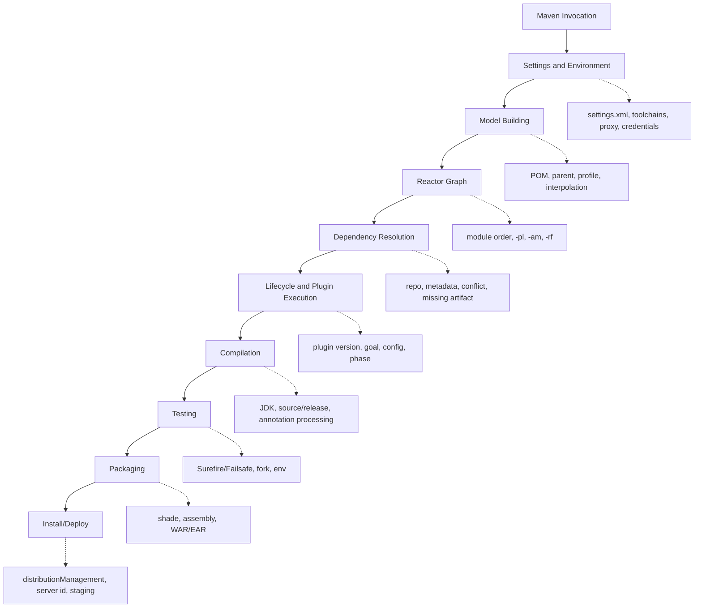
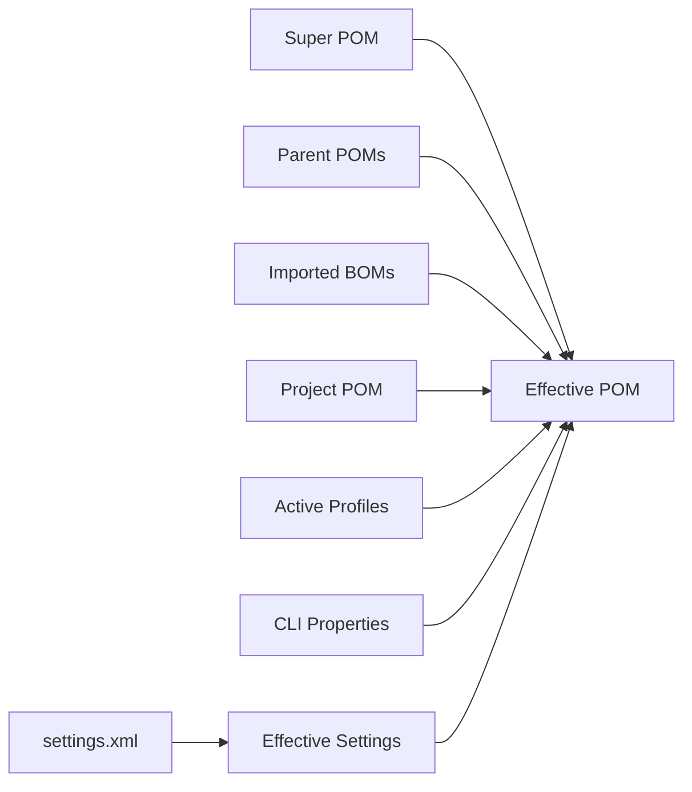
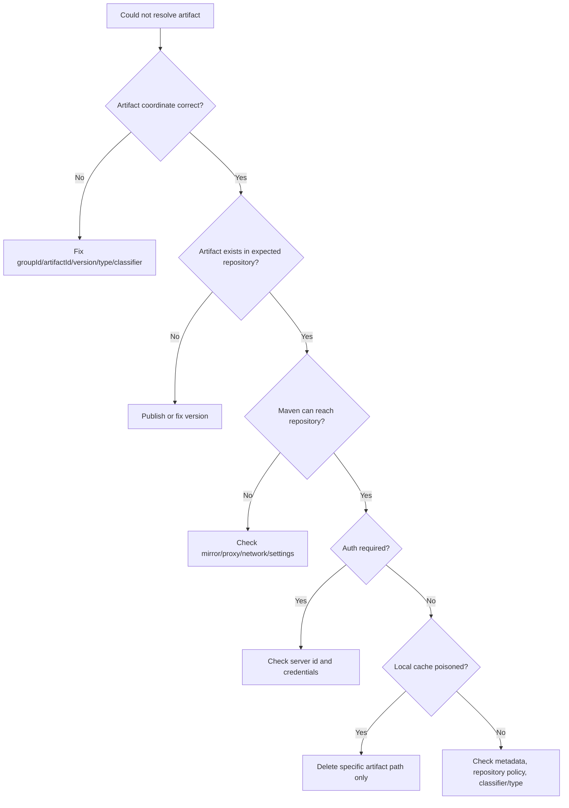

# Part 034 — Debugging Maven Like a Senior Engineer

Maven debugging yang buruk biasanya berbentuk ritual:

```bash
mvn clean install -U
rm -rf ~/.m2/repository
```

Kadang berhasil. Tapi jika berhasil tanpa pemahaman, masalahnya akan kembali.

Maven debugging yang baik dimulai dari model:

> Build Maven gagal karena model, graph, resolution, lifecycle, plugin execution, classpath, environment, atau remote system tidak sesuai dengan asumsi.

Tugas kita bukan menebak. Tugas kita mengubah error menjadi lokasi masalah.

Materi ini akan membahas workflow debugging Maven yang bisa dipakai di project enterprise:

- membaca error berdasarkan layer,
- menggunakan `effective-pom`, `effective-settings`, `active-profiles`, dan `help:describe`,
- membedah dependency tree dan conflict,
- membedah plugin execution,
- membedah reactor failure,
- membedah repository/resolution failure,
- membedah CI-only failure,
- membuat incident playbook agar debugging tidak bergantung pada hero engineer.

---

## 1. Jangan Mulai dari Command. Mulai dari Failure Layer.

Maven failure bisa dipetakan ke layer berikut:



Pertanyaan pertama:

> Error terjadi sebelum Maven tahu module apa yang dibangun, saat dependency resolution, saat compile, saat test, saat packaging, atau saat deploy?

Itu menentukan alat debugging yang tepat.

---

## 2. Golden Rule: Effective State Beats Declared State

Yang kamu tulis di `pom.xml` bukan satu-satunya state Maven.

State final build berasal dari:

- Super POM,
- parent POM,
- imported BOM,
- current POM,
- active profiles,
- settings profiles,
- CLI properties,
- environment/system properties,
- plugin defaults,
- lifecycle default bindings,
- reactor selection.

Jadi jangan hanya melihat file POM lokal. Lihat effective state.

Command penting:

```bash
mvn help:effective-pom -Dverbose > effective-pom.xml
mvn help:effective-settings > effective-settings.xml
mvn help:active-profiles
mvn help:system
```

`effective-pom` menampilkan POM final setelah interpolation, inheritance, dan active profiles. Opsi verbose dapat membantu menunjukkan asal konfigurasi.

Mental model:



Kalau behavior Maven tidak sesuai dugaan, kemungkinan besar yang salah adalah asumsi tentang effective state.

---

## 3. Minimal Debugging Bundle

Saat build gagal dan kamu perlu meminta bantuan senior engineer, jangan hanya kirim screenshot error terakhir.

Kumpulkan bundle:

```bash
mkdir -p debug-maven

mvn -B -V -e verify \
  > debug-maven/build-error.log 2>&1 || true

mvn -B help:effective-pom -Dverbose \
  > debug-maven/effective-pom.xml 2>&1 || true

mvn -B help:effective-settings \
  > debug-maven/effective-settings.xml 2>&1 || true

mvn -B help:active-profiles \
  > debug-maven/active-profiles.txt 2>&1 || true

mvn -B dependency:tree \
  > debug-maven/dependency-tree.txt 2>&1 || true

mvn -B -version \
  > debug-maven/maven-version.txt 2>&1 || true
```

Untuk masalah sangat dalam:

```bash
mvn -B -V -X verify > debug-maven/build-debug.log 2>&1 || true
```

Jangan langsung memakai `-X` untuk semua kasus. Output `-X` sangat besar. Gunakan jika sudah tahu area yang dicari atau ingin trace resolution/plugin detail.

---

## 4. Membaca Error Maven: Cari Error Pertama yang Bermakna

Build log Maven panjang. Error terakhir sering hanya konsekuensi.

Cari pola:

```txt
[ERROR] Failed to execute goal ...
[ERROR] COMPILATION ERROR
[ERROR] Failed to collect dependencies
[ERROR] Could not resolve artifact
[ERROR] Non-resolvable parent POM
[ERROR] Plugin ... or one of its dependencies could not be resolved
[ERROR] There are test failures
[ERROR] Failed to deploy artifacts
```

Gunakan:

```bash
grep -n "\[ERROR\]" build.log | head -50
```

Tetapi jangan berhenti di `[ERROR]` pertama kalau itu hanya summary. Cari stack/exception penyebab.

Pattern umum:

```txt
Failed to execute goal <plugin>:<goal> on project <artifact>: <message>
```

Baca sebagai:

| Bagian | Artinya |
|---|---|
| plugin | siapa yang gagal |
| goal | operasi apa yang gagal |
| project | module mana yang gagal |
| message | penyebab tingkat pertama |
| caused by | penyebab lebih dalam |

Contoh:

```txt
Failed to execute goal org.apache.maven.plugins:maven-compiler-plugin:compile
on project billing-domain: Compilation failure
```

Ini bukan “Maven rusak”. Ini `maven-compiler-plugin` gagal pada module `billing-domain` saat goal `compile`.

---

## 5. Debugging Model Building Failure

### Symptom: Non-Resolvable Parent POM

Contoh:

```txt
Non-resolvable parent POM for com.acme:order-service:1.2.0:
Could not find artifact com.acme.build:service-parent:pom:3.1.0
and 'parent.relativePath' points at wrong local POM
```

Layer: model building + repository resolution.

Check:

1. Apakah parent ada di reactor?
2. Apakah `relativePath` benar?
3. Apakah parent version benar?
4. Apakah parent sudah deploy ke repository internal?
5. Apakah repository/mirror di settings tersedia?
6. Apakah CI memakai settings yang sama dengan local?

Command:

```bash
mvn -B -V help:effective-settings
mvn -B -V -U help:effective-pom
```

Jika parent harus selalu dari repository, matikan relative local lookup:

```xml
<parent>
  <groupId>com.acme.build</groupId>
  <artifactId>service-parent</artifactId>
  <version>3.1.0</version>
  <relativePath />
</parent>
```

Jika parent ada di monorepo, relative path harus jelas:

```xml
<relativePath>../parent/pom.xml</relativePath>
```

### Symptom: Unknown Packaging

```txt
Unknown packaging: custom-package @ line ...
```

Biasanya packaging custom berasal dari extension/plugin yang belum tersedia saat model building.

Check:

- Apakah build extension dideklarasikan?
- Apakah plugin/extension bisa di-resolve?
- Apakah repository plugin benar?
- Apakah versi extension berubah?

---

## 6. Debugging Profile Activation

### Symptom

Build lokal dan CI berbeda padahal source sama.

Kemungkinan:

- profile aktif di local karena property/env/JDK/OS/file,
- settings profile lokal aktif,
- CI menambah `-P`, `-D`, atau env var,
- parent POM mengandung activation implicit.

Command:

```bash
mvn help:active-profiles
mvn help:effective-pom -Dverbose > effective-pom.xml
mvn help:effective-settings > effective-settings.xml
```

Cari:

```xml
<profiles>
  <profile>
    <id>...</id>
```

Juga bandingkan local vs CI:

```bash
diff -u local-effective-pom.xml ci-effective-pom.xml
diff -u local-active-profiles.txt ci-active-profiles.txt
```

### Senior Rule

Jika profile mengubah dependency, plugin, atau source directory, ia mengubah universe build. Harus bisa dijelaskan dan diuji.

Build profile yang baik:

```txt
fast-check
full-check
release-artifacts
security-audit
```

Build profile yang sering buruk:

```txt
dev
qa
prod
```

Karena runtime environment bukan build model.

---

## 7. Debugging Dependency Resolution Failure

### Symptom: Could Not Resolve Artifact

```txt
Could not resolve artifact com.acme:pricing-client:jar:2.4.1
```

Layer: dependency resolution.

Decision tree:



Do not delete entire `~/.m2` first. Delete the specific path:

```bash
rm -rf ~/.m2/repository/com/acme/pricing-client/2.4.1
mvn -U -pl :order-service -am verify
```

Use isolated repo to prove environment issue:

```bash
mvn -B \
  -Dmaven.repo.local="$PWD/.tmp-m2" \
  -U verify
```

If isolated repo works but normal repo fails, local cache is polluted.

If both fail, repository/config/coordinate is wrong.

---

## 8. Debugging SNAPSHOT Drift

### Symptom

Build passed yesterday, fails today, no source change.

Suspect:

- SNAPSHOT dependency changed,
- parent SNAPSHOT changed,
- plugin SNAPSHOT changed,
- repository metadata updated,
- remote dependency was overwritten,
- CI cache restored stale metadata.

Command:

```bash
mvn dependency:tree | grep SNAPSHOT
mvn help:effective-pom | grep SNAPSHOT
```

Force update only for diagnosis:

```bash
mvn -U verify
```

But do not make `-U` default. The root solution is to reduce SNAPSHOT usage in stable pipelines.

Governance:

- release builds must not depend on SNAPSHOT,
- main branch should minimize SNAPSHOT,
- platform BOM should pin release versions,
- if SNAPSHOT is used for inner-loop, isolate it to explicit profile or branch workflow.

---

## 9. Debugging Dependency Conflict

### Symptom: Compile Passes, Runtime Fails

Examples:

```txt
java.lang.NoSuchMethodError
java.lang.NoClassDefFoundError
java.lang.ClassCastException
```

Maven may have resolved a different version than you assumed.

Command:

```bash
mvn dependency:tree -Dverbose
mvn dependency:tree -Dincludes=com.fasterxml.jackson.core
mvn dependency:tree -Dincludes=org.slf4j
```

Common causes:

- nearest-wins mediation selected older version,
- BOM import order issue,
- dependency declared in wrong module,
- shaded artifact hides class conflict,
- runtime container provides different library,
- `provided` dependency missing at runtime,
- duplicate classes from multiple JARs.

### Methodical Conflict Debugging

1. Identify missing/conflicting class.
2. Find which JAR should contain it.
3. Inspect dependency tree for that group/artifact.
4. Check effective POM dependency management.
5. Check packaging artifact contents.
6. Check runtime container classpath.
7. Fix via BOM/dependencyManagement, exclusion, scope, or relocation.

Example:

```bash
jar tf target/app.jar | grep 'com/fasterxml/jackson/databind/ObjectMapper.class'
```

If using shaded JAR:

```bash
jar tf target/*-shaded.jar | grep 'jackson'
```

### Do Not Fix Conflict Blindly

Bad fix:

```xml
<dependency>
  <groupId>some.transitive</groupId>
  <artifactId>library</artifactId>
  <version>latest-version</version>
</dependency>
```

Better:

- choose version at BOM/platform level,
- explain who owns the version,
- add enforcer convergence rule,
- add regression test if runtime failure was severe.

---

## 10. Debugging Plugin Execution

### Symptom

A plugin runs unexpectedly, does not run, or runs with wrong config.

Questions:

1. Is plugin bound by packaging default?
2. Is plugin execution inherited from parent?
3. Is plugin in `pluginManagement` only, or actually in `plugins`?
4. Is execution id overridden?
5. Is profile activating plugin?
6. Is command invoking goal directly?
7. Is plugin version resolved from parent/Super POM/default?

Command:

```bash
mvn help:effective-pom -Dverbose > effective-pom.xml
mvn help:describe -Dplugin=org.apache.maven.plugins:maven-compiler-plugin -Ddetail
mvn -X verify > build-debug.log
```

### `pluginManagement` vs `plugins`

This is a classic bug.

```xml
<pluginManagement>
  <plugins>
    <plugin>
      <artifactId>maven-checkstyle-plugin</artifactId>
      <version>${maven-checkstyle-plugin.version}</version>
      <configuration>...</configuration>
    </plugin>
  </plugins>
</pluginManagement>
```

This does **not** execute Checkstyle by itself. It only defines defaults if the plugin is later used.

To execute:

```xml
<build>
  <plugins>
    <plugin>
      <artifactId>maven-checkstyle-plugin</artifactId>
      <executions>
        <execution>
          <id>checkstyle-verify</id>
          <phase>verify</phase>
          <goals>
            <goal>check</goal>
          </goals>
        </execution>
      </executions>
    </plugin>
  </plugins>
</build>
```

### Direct Goal Invocation vs Lifecycle Invocation

```bash
mvn compiler:compile
```

is not the same mental operation as:

```bash
mvn compile
```

The first invokes a plugin goal directly. The second runs lifecycle phases up to `compile`, including goals bound to earlier phases.

If behavior differs, inspect lifecycle binding and phase order.

---

## 11. Debugging Compiler/JDK Issues

### Symptom: invalid target release

```txt
error: invalid target release: 21
```

Possible causes:

- Maven runs on older JDK,
- compiler toolchain not configured,
- CI JDK differs from local,
- `maven.compiler.release` incompatible with actual compiler JDK.

Command:

```bash
mvn -version
java -version
mvn help:effective-pom | grep -n "maven.compiler"
```

If using toolchains:

```bash
mvn -t path/to/toolchains.xml verify
```

Check `toolchains.xml` exists in CI and matches required JDK.

### Symptom: Works in IDE, Fails in Maven

Causes:

- IDE uses different JDK,
- annotation processor configured in IDE but not Maven,
- generated source not attached in Maven,
- IDE imports profile not active in CLI,
- IDE has dependency on classpath not declared in POM.

Rule:

> Maven CLI is source of truth for build reproducibility. IDE is a client of that model, not the authority.

---

## 12. Debugging Annotation Processing and Generated Sources

### Symptom

```txt
cannot find symbol: class GeneratedSomething
```

Possible causes:

- generator not bound to `generate-sources`,
- generated directory not added as source root,
- annotation processor not configured,
- generated source deleted by `clean` but not regenerated,
- profile controlling generator not active,
- generated code committed locally but missing in CI.

Command:

```bash
mvn -X generate-sources
find target/generated-sources -type f | head
mvn help:effective-pom | grep -n "generated-sources\|annotationProcessor"
```

Check if generated source is in compiler source roots. If not, use proper plugin behavior or Build Helper only when necessary.

Bad:

```txt
Generated code edited manually in src/main/java
```

Better:

```txt
Source contract -> generator in generate-sources -> target/generated-sources -> compile
```

---

## 13. Debugging Surefire/Failsafe Failures

### Symptom: Test Failure

```txt
There are test failures.
Please refer to target/surefire-reports
```

First read reports:

```bash
ls target/surefire-reports
cat target/surefire-reports/*.txt
```

For multi-module:

```bash
find . -path '*/target/surefire-reports/*.txt' -o -path '*/target/failsafe-reports/*.txt'
```

### Surefire vs Failsafe

- Surefire: unit tests, phase `test`.
- Failsafe: integration tests, phases `integration-test` and `verify`.

If integration test starts external resources, do not run `mvn integration-test` directly. Use:

```bash
mvn verify
```

because `verify` lets post-integration cleanup and failure reporting complete correctly.

### Forked JVM Failure

Symptoms:

```txt
The forked VM terminated without properly saying goodbye
```

Causes:

- JVM crash,
- `System.exit`,
- OOM,
- native library crash,
- container killed process,
- argLine broken,
- too many parallel forks.

Debug:

```bash
mvn -DforkCount=0 test
mvn -DreuseForks=false test
mvn -DargLine="-Xmx1024m" test
```

Do not leave `forkCount=0` as permanent if tests need isolation. Use it to localize.

### Flaky Tests Under Parallel Build

If tests fail only with `-T` or test parallelism:

- shared static state,
- reused port,
- shared temp directory,
- non-isolated database schema,
- time/order dependency,
- container resource contention.

Run:

```bash
mvn -T 1 test
mvn -T 1C test
mvn -DforkCount=1 test
mvn -DreuseForks=false test
```

Then isolate test class.

---

## 14. Debugging Packaging Failures

### Shade Failure

Symptoms:

- duplicate classes,
- service loader broken,
- missing resource,
- runtime class not found,
- relocated class inaccessible.

Check artifact:

```bash
jar tf target/*shaded*.jar | sort > shaded-contents.txt
jar tf target/*.jar | grep 'META-INF/services'
```

If service loader breaks, inspect transformers.

If dependency-reduced POM causes downstream issue, inspect generated POM.

### WAR/EAR Failure

Symptoms:

- works locally, fails in app server,
- `ClassNotFoundException` for provided API,
- duplicate servlet/Jakarta API,
- library conflict with container.

Check:

```bash
jar tf target/*.war | sort > war-contents.txt
jar tf target/*.ear | sort > ear-contents.txt
```

Rules:

- container-provided APIs usually `provided`,
- application-owned libraries go inside WAR/EAR as appropriate,
- do not package duplicate server libraries unless server isolation requires it,
- inspect final artifact, not just POM.

---

## 15. Debugging Reactor Failures

### Symptom: One Module Fails, Many Skipped

Maven reactor stops depending on failure strategy.

Useful options:

```bash
# fail fast default-ish behavior
mvn verify

# continue independent modules, report at end
mvn --fail-at-end verify

# continue despite failures; use carefully
mvn --fail-never verify

# resume from failed module
mvn -rf :failed-module verify
```

If failed module needs upstream rebuilt:

```bash
mvn -pl :failed-module -am verify
```

If testing downstream impact:

```bash
mvn -pl :changed-contract -amd test
```

### Symptom: Module Builds in Unexpected Order

Maven reactor order follows dependency relationships, plugin declarations that instantiate dependencies, build extensions, and module declaration when otherwise equal.

Check:

```bash
mvn -X validate > reactor-debug.log
```

Search for reactor build order.

Also check whether module dependency is declared. If module A uses classes from module B but dependency is missing, build order may expose that.

---

## 16. Debugging CI-Only Failures

CI-only failure means environment drift until proven otherwise.

Compare:

| Dimension | Local | CI |
|---|---|---|
| Maven version | `mvn -version` | build log |
| JDK version | `java -version` | setup action/tool output |
| OS | macOS/Linux/Windows | runner image |
| settings.xml | user/global | injected secret file |
| toolchains.xml | local | mounted/generated |
| profiles | active-profiles | active-profiles |
| local repo | warmed/polluted | cached/isolated |
| env vars | shell | pipeline env |
| timezone/locale | local | runner default |
| network | developer/VPN | CI network |

Add diagnostic step temporarily:

```bash
mvn -B -V help:active-profiles help:effective-settings
mvn -B -V -DskipTests validate
```

CI failures frequently come from:

- missing credentials,
- wrong server id,
- repository mirror not applied,
- different JDK,
- test relies on timezone/locale,
- generated file case sensitivity issue,
- path separator issue,
- cache pollution,
- race from parallel build,
- secret unavailable in forked PR.

---

## 17. Debugging Credentials and Deploy Failures

### Symptom: 401 Unauthorized on Deploy

Check:

1. `distributionManagement.repository.id` or `snapshotRepository.id`.
2. Matching `<server><id>...</id></server>` in `settings.xml`.
3. Credentials injected in CI.
4. Repository allows release vs snapshot upload.
5. Artifact version matches repository policy.

POM:

```xml
<distributionManagement>
  <repository>
    <id>internal-releases</id>
    <url>https://repo.acme.com/releases</url>
  </repository>
  <snapshotRepository>
    <id>internal-snapshots</id>
    <url>https://repo.acme.com/snapshots</url>
  </snapshotRepository>
</distributionManagement>
```

Settings:

```xml
<servers>
  <server>
    <id>internal-releases</id>
    <username>${env.MAVEN_REPO_USER}</username>
    <password>${env.MAVEN_REPO_PASSWORD}</password>
  </server>
</servers>
```

If IDs differ, credentials will not apply.

### Symptom: 409 Conflict on Release Deploy

Likely trying to overwrite immutable release artifact.

Correct response:

- do not delete/reupload casually,
- bump version,
- investigate duplicate release pipeline,
- ensure release coordinate is immutable.

---

## 18. Debugging Plugin Resolution Failure

### Symptom

```txt
Plugin org.apache.maven.plugins:maven-xyz-plugin or one of its dependencies could not be resolved
```

Plugin dependencies resolve via plugin repositories and mirrors. Do not assume normal dependency repository config is enough.

Check:

- plugin version explicitly pinned?
- plugin repository/mirror available?
- internal repository manager proxies plugin artifacts?
- settings mirror applies to plugin repo?
- plugin dependency blocked by security policy?

Command:

```bash
mvn -X validate > plugin-resolution-debug.log
mvn help:effective-pom -Dverbose > effective-pom.xml
mvn help:effective-settings > effective-settings.xml
```

Search log for plugin coordinate.

Senior rule:

> Every build plugin must have an explicit version in controlled parent/pluginManagement.

Unpinned plugin versions are a reproducibility risk.

---

## 19. Debugging “It Works After Deleting `~/.m2`”

If deleting local repository fixes it, root cause is one of:

- corrupted artifact download,
- stale metadata,
- locally installed workspace artifact shadowing remote artifact,
- SNAPSHOT changed,
- wrong classifier/type cached,
- repository manager served inconsistent metadata,
- partially downloaded artifact.

Better debugging:

1. Delete only specific path.
2. Run with isolated local repo.
3. Compare artifact checksums.
4. Check whether artifact came from install or remote.
5. Check repository manager logs if available.

Commands:

```bash
rm -rf ~/.m2/repository/com/acme/problem-lib/1.2.3
mvn -U verify

mvn -Dmaven.repo.local=$PWD/.tmp-m2 verify
```

Do not institutionalize `rm -rf ~/.m2/repository` as normal build maintenance. It hides the real failure mode and wastes time.

---

## 20. Debugging `dependency:analyze` Findings

`dependency:analyze` can report:

- used undeclared dependencies,
- unused declared dependencies.

But bytecode analysis has limitations:

- reflection,
- ServiceLoader,
- annotation processors,
- runtime-only dependencies,
- generated code,
- optional/plugin-driven use,
- test-only use.

Treat findings as review input, not automatic truth.

Workflow:

```bash
mvn dependency:analyze
```

For each finding:

1. Is dependency used at compile-time?
2. Is it used only at runtime?
3. Is it loaded reflectively?
4. Is it part of framework auto-discovery?
5. Should it be direct to make contract explicit?
6. Should it be removed or moved to test/runtime scope?

Senior principle:

> Dependency tree should express intentional ownership, not accidental reachability.

---

## 21. Debugging Effective Dependency Version

To know why a version is selected:

```bash
mvn dependency:tree -Dincludes=groupId:artifactId -Dverbose
mvn help:effective-pom -Dverbose > effective-pom.xml
```

Look for:

- direct dependency version,
- parent `dependencyManagement`,
- imported BOM,
- duplicate BOM imports,
- nearest transitive version,
- declaration order when depth equal.

Example problem:

```txt
Expected guava 33.x, got 30.x
```

Find:

```bash
mvn dependency:tree -Dincludes=com.google.guava:guava -Dverbose
```

Then inspect dependency management:

```bash
grep -n "guava" effective-pom.xml
```

Fix should usually go to platform BOM/dependencyManagement, not random child module.

---

## 22. Debugging Maven Wrapper and Maven Version Drift

If local and CI use different Maven versions, behavior can differ.

Check:

```bash
mvn -version
./mvnw -version
```

Prefer Maven Wrapper for project-level consistency:

```bash
./mvnw -B -V verify
```

But wrapper only fixes Maven distribution. It does not fix:

- JDK version,
- settings.xml,
- toolchains.xml,
- repository credentials,
- OS-level dependencies,
- Docker availability.

For enterprise builds, record both Maven and JDK versions in build logs.

---

## 23. Debugging with Binary Search

For mysterious multi-module breakage, use binary search.

Example:

```bash
mvn -pl :module-a,:module-b,:module-c -am verify
```

If full build fails but subset passes:

- suspect plugin aggregator behavior,
- shared resource collision,
- parallel test interference,
- reactor ordering assumption,
- profile active only at root,
- module-specific inherited execution.

If subset fails:

- shrink until minimal failing module set,
- inspect dependency edge between them,
- inspect plugin execution in those modules.

Binary search is often faster than reading thousands of log lines.

---

## 24. Debugging Parallel Build Failures

If failure happens only with `-T`:

Possible causes:

- non-thread-safe plugin,
- tests share ports/temp files,
- generated output path shared between modules,
- plugin writes to root target without module isolation,
- local repository lock/contention issue,
- external service limit,
- race in annotation processor/generated source.

Debug sequence:

```bash
mvn -T 1 verify
mvn -T 1C verify
mvn -T 2C verify
mvn -T 1 -DforkCount=1 verify
```

If `-T 1` passes and `-T 1C` fails, inspect plugins/tests for shared mutable resources.

Bad plugin config:

```xml
<outputDirectory>${project.parent.basedir}/target/generated</outputDirectory>
```

Better:

```xml
<outputDirectory>${project.build.directory}/generated-sources/my-generator</outputDirectory>
```

Each module must write to its own `target` unless intentionally aggregator-only.

---

## 25. Debugging “No Plugin Found for Prefix”

Symptom:

```txt
No plugin found for prefix 'foo'
```

Maven resolves plugin prefix using plugin groups and metadata.

Fix options:

- call plugin with full coordinate,
- add plugin group in settings if appropriate,
- ensure plugin is available in repository,
- ensure metadata is not stale.

Instead of:

```bash
mvn foo:bar
```

Use:

```bash
mvn com.acme.maven:foo-maven-plugin:bar
```

For internal plugin, prefer explicit coordinate in documentation/CI. Prefix shorthand is convenient but less transparent.

---

## 26. Debugging Command Semantics

Many bugs come from wrong command semantics.

| Command | Meaning | Common Mistake |
|---|---|---|
| `mvn test` | run lifecycle through `test` | expects integration tests to run |
| `mvn package` | build package, includes test phase | assumes artifact verified by integration tests |
| `mvn verify` | run checks through verify | correct for integration-test verification |
| `mvn install` | put artifact in local repo | used unnecessarily in reactor |
| `mvn deploy` | publish to remote repo | run accidentally from developer machine |
| `mvn plugin:goal` | direct goal invocation | assumes lifecycle prerequisites ran |
| `mvn clean` | clean lifecycle only | assumes it builds afterward |
| `mvn clean verify` | clean + default lifecycle verify | correct clean verification |

Always ask:

> Am I invoking a lifecycle phase or a plugin goal?

This one distinction explains many Maven surprises.

---

## 27. Incident Playbooks

### Playbook A: Missing Artifact

Symptoms:

```txt
Could not find artifact group:artifact:jar:version
```

Steps:

1. Verify coordinate.
2. Check repository manager UI.
3. Check effective settings/mirror.
4. Check authentication if private.
5. Delete specific local artifact path.
6. Run with isolated local repo.
7. If SNAPSHOT, run `-U` once for diagnosis.
8. Fix publishing/version/repository policy.

### Playbook B: Runtime `NoSuchMethodError`

Steps:

1. Identify class and method.
2. Find owning artifact/version.
3. Run `dependency:tree -Dincludes=...`.
4. Inspect effective dependency management.
5. Inspect final packaged artifact.
6. Check runtime container classpath.
7. Fix via BOM/dependencyManagement/scope/exclusion/relocation.
8. Add regression test.

### Playbook C: CI Fails, Local Passes

Steps:

1. Compare Maven/JDK versions.
2. Compare active profiles.
3. Compare effective settings.
4. Check secrets and server IDs.
5. Check OS/path/timezone/locale.
6. Run local with isolated repo and CI command.
7. Disable parallelism once.
8. Check cache pollution.

### Playbook D: Plugin Runs Unexpectedly

Steps:

1. Generate effective POM verbose.
2. Search plugin artifactId.
3. Check parent inheritance.
4. Check profile activation.
5. Check default lifecycle binding by packaging.
6. Check direct goal invocation.
7. Move version/config to `pluginManagement`, execution to explicit module/profile.

### Playbook E: Parallel Build Flaky

Steps:

1. Re-run with `-T 1`.
2. Reduce test fork/parallel settings.
3. Identify shared ports/files/static state.
4. Check generated output paths.
5. Check non-thread-safe plugin.
6. Add per-module/per-test isolation.
7. Reintroduce parallelism gradually.

---

## 28. Senior Debugging Checklist

Before changing POM, answer:

- Which module failed?
- Which lifecycle phase or plugin goal failed?
- Is the failure before or after dependency resolution?
- Is the effective POM what we think it is?
- Which profiles are active?
- Which settings are active?
- Which dependency version was actually selected?
- Is this local-only, CI-only, or universal?
- Is local repository involved?
- Is remote repository involved?
- Is this deterministic across repeated runs?
- Does it fail with `-T 1`?
- Does it fail with isolated local repository?
- Does it fail without `clean`?
- Does it fail in a targeted module build?
- Does the final artifact contain what we think it contains?

This checklist prevents random walk debugging.

---

## 29. A Debugging Mindset That Scales

Maven is predictable when you respect its layers:

1. It builds an effective model.
2. It selects a reactor graph.
3. It resolves dependencies/plugins.
4. It executes lifecycle-bound plugin goals.
5. It produces/installs/deploys artifacts.

Most Maven confusion comes from looking at declared POM and assuming it is final reality.

Top-tier Maven debugging is therefore not “knowing every plugin option”. It is the ability to ask:

> What final model did Maven build, what graph did it select, what artifact/plugin did it resolve, and what goal failed under which environment?

Once you can answer that, Maven errors become localizable engineering problems, not build-system superstition.

---

## References

- Apache Maven — Running Apache Maven and command syntax. https://maven.apache.org/run.html
- Apache Maven CLI Options Reference 3.9.16 — `-e`, `-X`, `-U`, `-rf`, `-T`, settings/toolchains options. https://maven.apache.org/ref/3.9.16/maven-embedder/cli.html
- Apache Maven Help Plugin — `help:effective-pom`, including active profiles and verbose origin comments. https://maven.apache.org/plugins/maven-help-plugin/effective-pom-mojo.html
- Apache Maven Help Plugin Usage — effective POM, active profiles, system properties, effective settings. https://maven.apache.org/plugins/maven-help-plugin/usage.html
- Apache Maven Dependency Plugin — `dependency:analyze`, `dependency:tree`, dependency analysis. https://maven.apache.org/plugins/maven-dependency-plugin/usage.html
- Apache Maven — Introduction to the Dependency Mechanism. https://maven.apache.org/guides/introduction/introduction-to-dependency-mechanism.html
- Apache Maven — Introduction to the Build Lifecycle. https://maven.apache.org/guides/introduction/introduction-to-the-lifecycle.html
- Apache Maven — Guide to Working with Multiple Modules. https://maven.apache.org/guides/mini/guide-multiple-modules.html
