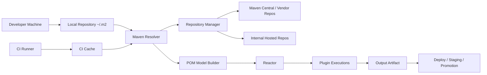
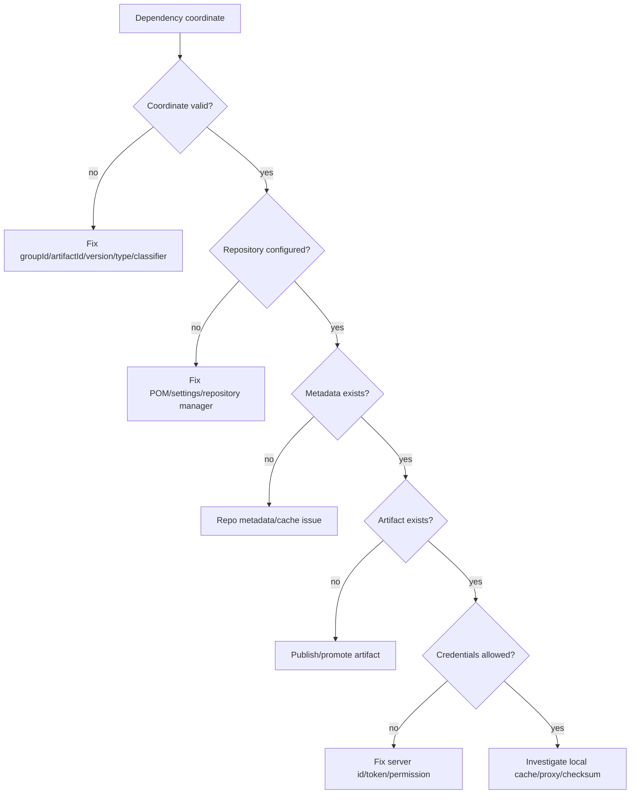
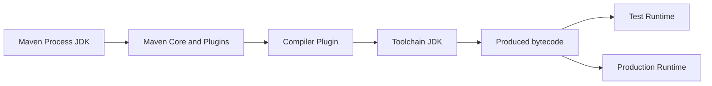
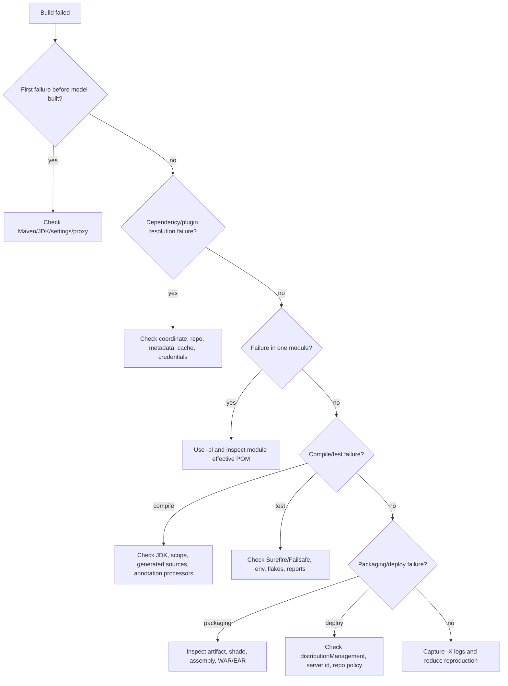

# Part 035 — Common Failure Modes and Incident Playbooks

Di part sebelumnya kita belajar debugging Maven secara sistematis. Part ini mengubah teknik itu menjadi **incident playbook**.

Tujuannya sederhana:

> Saat build Maven gagal di laptop, CI, release pipeline, atau repository manager, engineer tidak boleh langsung menghapus `~/.m2`, menaikkan versi sembarangan, atau men-disable test. Engineer harus tahu failure class, blast radius, diagnostic path, dan safe remediation.

Maven incident biasanya bukan karena Maven “aneh”. Biasanya karena satu dari ini:

- model POM tidak sama dengan asumsi,
- dependency graph berubah,
- repository metadata berubah,
- plugin execution berubah,
- JDK/OS/CI environment berubah,
- lifecycle phase yang dipanggil salah,
- artifact yang dipublikasikan tidak sesuai contract,
- local cache menyimpan keadaan rusak,
- release pipeline tidak punya boundary yang jelas.

Part ini bukan daftar error message. Ini handbook untuk membaca failure sebagai **sistem**.

---

## 1. Incident Mindset: Maven Build adalah Distributed System Kecil

Build Maven terlihat lokal, tapi sebenarnya melibatkan banyak boundary:



Maven build incident bisa terjadi di boundary mana pun. Karena itu, command yang benar bukan selalu:

```bash
mvn clean install
```

Kadang command yang benar adalah:

```bash
mvn -X help:effective-pom
mvn help:effective-settings
mvn dependency:tree -Dverbose
mvn -U dependency:resolve
mvn -pl :module-a -am verify
mvn -Dmaven.repo.local=/tmp/m2-clean verify
```

Senior engineer tidak menambah noise. Senior engineer mempersempit ruang masalah.

---

## 2. Failure Taxonomy

Gunakan taxonomy ini sebelum menyentuh POM.

| Layer | Contoh Gejala | Root Cause Umum | Alat Diagnosis |
|---|---|---|---|
| Invocation | command berbeda di laptop dan CI | phase/goal/property tidak sama | log command, `.mvn/maven.config` |
| Settings | auth/proxy/mirror gagal | `settings.xml`, credentials, mirrorOf | `help:effective-settings` |
| Model | parent/properties/profile salah | inheritance, profile activation, interpolation | `help:effective-pom`, `help:active-profiles` |
| Reactor | module tidak dibangun | `-pl`, missing `-am`, module order | reactor log, `-X`, root POM |
| Resolution | dependency/plugin tidak ditemukan | repo, metadata, snapshot, mirror, typo | `dependency:tree`, `-U`, clean local repo |
| Lifecycle | goal tidak jalan / jalan dua kali | phase binding, default binding, plugin execution | `help:describe`, effective POM |
| Compile/Test | classpath/JDK/test env salah | scope, toolchain, surefire/failsafe | compiler/test reports |
| Packaging | artifact rusak | shade/assembly/resource filtering | inspect JAR/WAR/EAR |
| Deploy | publish gagal | distributionManagement/server ID/staging | deploy logs, repo manager logs |

Rule praktis:

> Jangan memperbaiki dependency graph jika error-nya ada di settings. Jangan memperbaiki settings jika error-nya ada di packaging. Jangan memperbaiki plugin jika error-nya ada di lifecycle phase yang salah.

---

## 3. Minimal Incident Record

Sebelum melakukan fix, catat ini.

```md
## Maven Incident Record

- Incident time:
- Actor: local / CI / release pipeline / repository manager
- Command used:
- Maven version:
- JDK running Maven:
- Toolchain JDK, if any:
- OS / container image:
- Branch / commit SHA:
- Module selection:
- First failing module:
- First failing phase/goal:
- Error class:
- Recent changes:
- Is it reproducible with clean local repo?
- Is it reproducible in CI rerun without cache?
- Is artifact/dependency new, deleted, replaced, or promoted recently?
```

Maven incidents sering menjadi panjang karena orang mulai dari solusi, bukan dari state capture.

---

## 4. Playbook 1 — Missing Artifact / Could Not Resolve Dependency

### Gejala

```text
Could not resolve dependencies for project ...
Could not find artifact com.acme:pricing-core:jar:1.8.2
```

### Jangan langsung lakukan ini

```bash
rm -rf ~/.m2/repository
```

Itu menghapus evidence.

### Model

Dependency resolution membutuhkan:

1. coordinate benar,
2. repository yang benar,
3. metadata tersedia,
4. artifact tersedia,
5. policy release/snapshot cocok,
6. credentials benar,
7. mirror/proxy tidak salah mengarahkan.



### Diagnosis

```bash
mvn -X -DskipTests dependency:resolve
mvn dependency:tree -Dincludes=com.acme:pricing-core
mvn help:effective-settings
mvn help:effective-pom
```

Cek local repository path:

```bash
ls ~/.m2/repository/com/acme/pricing-core/1.8.2
cat ~/.m2/repository/com/acme/pricing-core/1.8.2/*.lastUpdated
```

File `.lastUpdated` sering memberi sinyal bahwa Maven pernah gagal mengambil artifact dan men-cache kegagalan sampai update interval berikutnya.

### Safe remediation

Urutan aman:

1. Validasi coordinate.
2. Validasi repository manager UI/API.
3. Validasi `settings.xml` server/mirror.
4. Jalankan resolution dengan local repo sementara.

```bash
mvn -Dmaven.repo.local=/tmp/m2-clean -U dependency:resolve
```

Jika clean local repo berhasil, masalahnya local cache. Jika gagal juga, masalahnya remote/repository/configuration.

### Prevention

- Jangan publish artifact release secara manual tanpa pipeline.
- Jangan menghapus artifact release dari hosted repository.
- Gunakan repository manager sebagai satu-satunya remote boundary.
- CI release harus memverifikasi artifact bisa di-resolve dari repository final setelah deploy.

---

## 5. Playbook 2 — Poisoned Local Repository

### Gejala

- Build gagal di satu laptop, berhasil di laptop lain.
- CI berhasil, lokal gagal.
- Error berubah setelah `mvn -U`.
- Ada file `.lastUpdated` atau artifact JAR berukuran 0 byte.

### Model

Local repository bukan cache bodoh. Ia menyimpan artifact, POM, metadata, checksum, dan catatan kegagalan.

Masalah umum:

- download terputus,
- proxy men-return HTML error sebagai file artifact,
- repository credential sempat salah,
- snapshot metadata stale,
- artifact lokal di-install manual dengan POM salah,
- local repo dipakai bersama oleh proses paralel yang tidak aman.

### Diagnosis

Jangan hapus semua. Isolasi coordinate.

```bash
rm -rf ~/.m2/repository/com/acme/pricing-core/1.8.2
mvn -U -DskipTests verify
```

Atau gunakan repo bersih sementara:

```bash
mvn -Dmaven.repo.local=/tmp/m2-repro verify
```

Bandingkan file artifact:

```bash
jar tf ~/.m2/repository/com/acme/pricing-core/1.8.2/pricing-core-1.8.2.jar | head
```

Jika `jar tf` gagal, artifact lokal corrupt.

### Safe remediation

- Hapus subtree coordinate spesifik, bukan seluruh `~/.m2`.
- Hindari sharing satu local repository writable antar job CI paralel.
- Untuk CI, gunakan cache dependency yang immutable atau key berbasis POM hash.

---

## 6. Playbook 3 — Parent POM Cannot Be Resolved

### Gejala

```text
Non-resolvable parent POM for com.acme:order-service
Could not find artifact com.acme.build:platform-parent:pom:12.4.0
'parent.relativePath' points at wrong local POM
```

### Model

Parent POM resolution punya dua jalur:

1. `relativePath` lokal,
2. repository resolution.

Jika `relativePath` default `../pom.xml` menunjuk POM yang salah, Maven bisa gagal atau memakai parent yang tidak diinginkan.

```xml
<parent>
  <groupId>com.acme.build</groupId>
  <artifactId>platform-parent</artifactId>
  <version>12.4.0</version>
  <relativePath/>
</parent>
```

`<relativePath/>` kosong berarti: jangan coba parent lokal; resolve dari repository.

### Diagnosis

```bash
mvn -X validate
mvn help:effective-pom
```

Cek:

- apakah parent tersedia di repository manager,
- apakah branch punya parent module lokal,
- apakah `relativePath` memang dimaksudkan,
- apakah child memakai parent version yang sudah dipublish.

### Safe remediation

| Situasi | Remediation |
|---|---|
| Mono-repo parent lokal | gunakan `relativePath` eksplisit yang benar |
| Parent corporate dipublish | gunakan `<relativePath/>` |
| Parent baru belum release | release parent dulu, baru update child |
| Parent version snapshot | pastikan snapshot repository aktif dan CI policy memperbolehkan |

### Prevention

- Pisahkan parent POM sebagai release artifact jika dipakai lintas repository.
- Jangan mengandalkan relative parent untuk repository terpisah.
- Parent version harus masuk release train, bukan update manual acak.

---

## 7. Playbook 4 — Dependency Conflict Runtime Incident

### Gejala

Compile berhasil, test mungkin berhasil, runtime gagal:

```text
java.lang.NoSuchMethodError
java.lang.NoClassDefFoundError
java.lang.LinkageError
ClassCastException between same-looking classes
```

### Model

Maven memilih versi dependency untuk build classpath. Runtime platform mungkin memilih classpath berbeda.

Akar masalah umum:

- transitive dependency membawa versi lama,
- `provided` dependency ternyata tidak tersedia di runtime,
- fat JAR membawa duplicate class,
- app server punya library sendiri,
- shading tidak relocate package,
- dependency declared di test tapi dipakai production,
- BOM tidak konsisten antar module.

### Diagnosis

Cari siapa membawa dependency:

```bash
mvn dependency:tree -Dincludes=org.slf4j
mvn dependency:tree -Dverbose -Dincludes=com.fasterxml.jackson.core
mvn dependency:build-classpath -Dmdep.outputFile=target/classpath.txt
```

Inspect artifact final:

```bash
jar tf target/app.jar | grep 'ObjectMapper.class'
jar tf target/app.jar | grep 'META-INF/services'
```

Jika runtime di container/app server, bandingkan classpath runtime, bukan hanya Maven tree.

### Safe remediation

- Tambahkan version alignment lewat BOM atau `dependencyManagement`.
- Gunakan exclusion hanya pada edge yang membawa dependency bermasalah.
- Jangan menambahkan direct dependency hanya untuk “menang” nearest-wins tanpa komentar governance.
- Untuk shaded JAR, relocate library internal yang rawan collision.
- Untuk WAR/EAR, pahami boundary `provided` dan server classloader.

### Prevention

Tambahkan guardrail:

```xml
<plugin>
  <groupId>org.apache.maven.plugins</groupId>
  <artifactId>maven-enforcer-plugin</artifactId>
  <executions>
    <execution>
      <id>dependency-governance</id>
      <goals>
        <goal>enforce</goal>
      </goals>
      <configuration>
        <rules>
          <dependencyConvergence/>
          <requireUpperBoundDeps/>
        </rules>
      </configuration>
    </execution>
  </executions>
</plugin>
```

Gunakan dengan hati-hati di legacy project. Mulai dari report-only/baseline jika graph terlalu kotor.

---

## 8. Playbook 5 — Plugin Version Breakage

### Gejala

- Build tiba-tiba gagal tanpa perubahan kode.
- Plugin behavior berubah.
- CI yang memakai cache baru gagal, cache lama berhasil.
- Error terjadi di goal plugin, bukan compile/test business code.

### Model

Maven plugin adalah dependency juga. Jika plugin version tidak dipin, build dapat berubah saat plugin default/resolution berubah.

### Diagnosis

```bash
mvn help:effective-pom | grep -A20 '<plugins>'
mvn help:describe -Dplugin=org.apache.maven.plugins:maven-compiler-plugin -Ddetail
mvn -X verify
```

Cari:

- plugin version eksplisit atau tidak,
- plugin dikonfigurasi di parent atau child,
- plugin execution inherited atau override,
- plugin dependency punya conflict,
- plugin goal berubah parameter default.

### Safe remediation

- Pin semua plugin version di `pluginManagement` parent.
- Jangan override plugin version per module kecuali ada alasan teknis tertulis.
- Naikkan plugin di branch khusus, jalankan full CI matrix.
- Untuk plugin kritis, tulis smoke test yang memverifikasi output artifact.

### Prevention

```xml
<build>
  <pluginManagement>
    <plugins>
      <plugin>
        <groupId>org.apache.maven.plugins</groupId>
        <artifactId>maven-compiler-plugin</artifactId>
        <version>${maven.compiler.plugin.version}</version>
      </plugin>
    </plugins>
  </pluginManagement>
</build>
```

Plugin version adalah bagian dari build contract, bukan detail kosmetik.

---

## 9. Playbook 6 — Lifecycle Misuse

### Gejala

- Integration test environment tidak dibersihkan.
- Docker/container test tertinggal.
- Report tidak muncul.
- Deploy terjadi sebelum verification lengkap.
- Goal dijalankan langsung dan melewati phase penting.

### Model

Maven lifecycle adalah urutan phase. Saat memanggil phase, Maven menjalankan phase sebelumnya di lifecycle yang sama. Saat memanggil goal langsung, hanya goal itu yang berjalan.

Masalah umum:

```bash
mvn failsafe:integration-test
mvn integration-test
mvn jar:jar
mvn deploy:deploy
```

Command ini bisa valid secara teknis, tapi salah secara operational jika melewati lifecycle behavior yang dibutuhkan.

### Diagnosis

Tanyakan:

- command apa yang dipanggil di CI,
- apakah `verify` dipanggil,
- apakah plugin goal bind ke phase yang benar,
- apakah pre/post setup cleanup berjalan,
- apakah module partial build melewati module pendukung.

### Safe remediation

Gunakan phase lifecycle:

```bash
mvn verify
mvn deploy
```

Bukan goal langsung kecuali untuk diagnostic atau tooling khusus.

Untuk integration test:

```xml
<plugin>
  <groupId>org.apache.maven.plugins</groupId>
  <artifactId>maven-failsafe-plugin</artifactId>
  <executions>
    <execution>
      <goals>
        <goal>integration-test</goal>
        <goal>verify</goal>
      </goals>
    </execution>
  </executions>
</plugin>
```

### Prevention

- Dokumentasikan approved commands.
- CI harus memanggil lifecycle phase, bukan goal plugin langsung.
- Gunakan `.mvn/maven.config` dengan hati-hati; jangan sembunyikan behavior yang sulit dilihat.

---

## 10. Playbook 7 — JDK / Toolchain Mismatch

### Gejala

```text
invalid target release: 21
release version 17 not supported
Unsupported class file major version
java.lang.UnsupportedClassVersionError
```

### Model

Ada tiga Java boundary:

1. JDK yang menjalankan Maven,
2. JDK compiler/toolchain,
3. JRE/JDK runtime yang menjalankan aplikasi/test.

Mereka bisa berbeda.



### Diagnosis

```bash
mvn -version
java -version
mvn -X -DskipTests compile
mvn help:effective-pom | grep -E 'maven.compiler.release|source|target'
```

Cek toolchain:

```bash
cat ~/.m2/toolchains.xml
```

### Safe remediation

- Gunakan `maven-compiler-plugin` dengan `<release>` untuk target Java modern.
- Gunakan Maven Toolchains untuk build multi-JDK.
- Pin base image CI.
- Jangan mengandalkan JDK default runner.

Contoh baseline:

```xml
<properties>
  <maven.compiler.release>17</maven.compiler.release>
</properties>
```

### Prevention

- Enforce JDK baseline dengan Maven Enforcer.
- CI matrix eksplisit untuk supported JDK.
- Release artifact harus diuji pada runtime target, bukan hanya JDK terbaru.

---

## 11. Playbook 8 — CI-Only Failure

### Gejala

- Local build hijau, CI merah.
- CI rerun kadang hijau.
- Failure terjadi di dependency resolution, test, filesystem, locale, timezone, atau network.

### Model

CI bukan laptop. CI biasanya punya:

- clean workspace,
- ephemeral home directory,
- cache terpisah,
- different JDK,
- restricted network,
- different timezone/locale,
- missing credentials,
- different CPU/memory,
- parallel job interaction.

### Diagnosis

Capture environment:

```bash
mvn -version
env | sort
pwd
find . -maxdepth 3 -type f | sort | head -100
mvn help:effective-settings
mvn help:active-profiles
```

Buat local reproduction:

```bash
docker run --rm -it \
  -v "$PWD":/workspace \
  -w /workspace \
  eclipse-temurin:17 \
  bash
```

Lalu:

```bash
mvn -Dmaven.repo.local=/tmp/m2 verify
```

### Safe remediation

- Jangan menambahkan retry buta tanpa tahu failure class.
- Jangan disable test hanya karena CI-only.
- Pin JDK/container image.
- Pastikan secrets disuntik lewat `settings.xml` CI, bukan POM.
- Gunakan cache key berbasis POM dan OS/JDK.

### Prevention

CI Maven command sebaiknya eksplisit:

```bash
mvn --batch-mode --errors --fail-at-end verify
```

Release pipeline sebaiknya lebih ketat:

```bash
mvn --batch-mode --errors --show-version --no-transfer-progress deploy
```

---

## 12. Playbook 9 — Snapshot Drift

### Gejala

- Build commit sama menghasilkan behavior berbeda.
- CI rerun berubah hasil.
- Dependency SNAPSHOT berubah tanpa commit.
- Local cache berbeda dengan remote snapshot terbaru.

### Model

SNAPSHOT adalah moving target. Ia berguna untuk integrasi cepat, tapi buruk untuk reproducibility.

### Diagnosis

```bash
mvn dependency:tree | grep SNAPSHOT
find ~/.m2/repository -path '*SNAPSHOT*' -name 'maven-metadata*' -print
mvn -U verify
```

Cek repository manager metadata untuk snapshot timestamp/build number.

### Safe remediation

- Untuk release branch, banned SNAPSHOT dependency.
- Untuk integration branch, snapshot boleh tapi harus sadar non-deterministik.
- Promote snapshot menjadi release sebelum dipakai artifact production.

### Prevention

Enforcer rule:

```xml
<requireReleaseDeps>
  <message>No SNAPSHOT dependencies allowed in release builds.</message>
</requireReleaseDeps>
```

Aktifkan hanya di profile release jika development masih butuh snapshot.

---

## 13. Playbook 10 — Flaky Test in Maven Pipeline

### Gejala

- Test yang sama kadang gagal kadang berhasil.
- Failure muncul saat parallel build.
- Failure hilang jika dijalankan sendiri.
- Surefire dump atau fork error muncul.

### Model

Flaky test biasanya bukan “test Maven”. Itu failure karena:

- shared static state,
- port collision,
- timing/concurrency,
- external service dependency,
- timezone/locale,
- order dependency,
- fork memory,
- test parallelism terlalu agresif.

### Diagnosis

```bash
mvn -Dtest=SomeTest test
mvn -Dtest=SomeTest#methodName test
mvn -Dsurefire.rerunFailingTestsCount=0 test
mvn -DforkCount=1 -DreuseForks=false test
```

Cek reports:

```bash
ls target/surefire-reports
cat target/surefire-reports/*.dumpstream 2>/dev/null
```

Untuk integration tests:

```bash
ls target/failsafe-reports
```

### Safe remediation

- Fix isolation, jangan hanya rerun.
- Rerun boleh menjadi mitigasi sementara dengan ticket root cause.
- Pisahkan test lambat ke Failsafe.
- Assign port dinamis.
- Jangan bergantung pada clock nyata tanpa abstraction.

### Prevention

- Unit test harus hermetic.
- Integration test boleh pakai external dependency, tapi environment harus dibuat/dihancurkan di lifecycle yang benar.
- CI harus menyimpan surefire/failsafe reports sebagai artifact.

---

## 14. Playbook 11 — Deploy / Release Publish Failure

### Gejala

```text
Failed to deploy artifacts
401 Unauthorized
409 Conflict
Repository does not allow updating assets
Return code is: 400
```

### Model

Deploy membutuhkan contract antara POM dan `settings.xml`:

- `distributionManagement.repository.id`,
- `settings.servers.server.id`,
- repository URL,
- credential permission,
- snapshot vs release repo,
- immutability policy,
- staging/promotion rule.

### Diagnosis

```bash
mvn help:effective-pom | grep -A20 distributionManagement
mvn help:effective-settings
mvn -X deploy -DskipTests
```

Cek repository manager:

- apakah artifact sudah ada,
- apakah repository read-only,
- apakah release overwrite dilarang,
- apakah credential punya deploy permission,
- apakah target snapshot/release benar.

### Safe remediation

| Error | Makna Umum | Remediation |
|---|---|---|
| 401/403 | auth/permission | fix `server id`, token, permission |
| 404 | URL/repo tidak ada | fix repository URL/topology |
| 409 | artifact sudah ada | jangan overwrite release; bump version |
| 400 | policy reject | cek staging rule, checksum/signature/POM metadata |

### Prevention

- Release artifact immutable.
- Jangan deploy manual dari laptop untuk production artifact.
- Gunakan staging repository lalu promote.
- CI harus publish dari clean checkout dan clean local repo.

---

## 15. Playbook 12 — Resource Filtering Secret Leak

### Gejala

- Secret muncul di artifact.
- `application.properties` final berisi token.
- Docker image membawa credential build.
- Audit menemukan config production di JAR.

### Model

Resource filtering menulis nilai ke file output. Jika nilai itu secret, secret menjadi bagian dari artifact.

### Diagnosis

```bash
jar tf target/*.jar | grep application
jar xf target/*.jar BOOT-INF/classes/application.properties 2>/dev/null || true
grep -R "password\|secret\|token" target/classes target/*.jar 2>/dev/null
```

### Safe remediation

- Rotasi secret.
- Revoke artifact jika sudah dipublish.
- Nonaktifkan filtering untuk file sensitif.
- Pindahkan secret injection ke runtime secret manager / environment.

### Prevention

- Build-time config hanya untuk non-secret metadata.
- Tambahkan scanner artifact sebelum deploy.
- Jangan pakai Maven profile `prod` untuk memasukkan secret production.

---

## 16. Playbook 13 — Generated Source Drift

### Gejala

- Build lokal menghasilkan source berbeda.
- CI diff muncul meski kode tidak berubah.
- Compile gagal karena generated file tidak ada.
- IDE bisa compile, Maven tidak.

### Model

Generated source harus menjadi output lifecycle, bukan hidden IDE magic.

### Diagnosis

```bash
mvn clean generate-sources
find target/generated-sources -type f | sort | head
mvn clean compile
```

Cek apakah generator:

- bind ke phase benar,
- menghasilkan output deterministic,
- version generator dipin,
- input spec/schema ikut version control,
- generated dir ditambahkan ke source roots.

### Safe remediation

- Bind generator ke `generate-sources` atau `generate-test-sources`.
- Gunakan `build-helper` jika plugin generator tidak otomatis menambahkan source root.
- Pin generator version.
- Jangan mengandalkan generated source committed kecuali policy memang begitu.

### Prevention

CI harus menjalankan dari clean checkout:

```bash
mvn clean verify
```

Jika build tanpa generated source committed gagal, konfigurasi lifecycle belum benar.

---

## 17. Playbook 14 — Multi-Module Partial Build Failure

### Gejala

```text
Could not find artifact com.acme:common-lib:jar:1.2.0-SNAPSHOT
```

Atau module yang dibutuhkan tidak ikut dibangun.

### Model

`-pl` memilih project. `-am` membangun upstream dependency yang dibutuhkan. `-amd` membangun downstream dependents.

### Diagnosis

```bash
mvn -pl :service-a verify
mvn -pl :service-a -am verify
mvn -pl :common-lib -amd test
```

Jika tanpa `-am` gagal, local repo tidak punya artifact upstream.

### Safe remediation

- Untuk build module deployable, gunakan `-pl :module -am`.
- Untuk impact test library, gunakan `-pl :library -amd`.
- Jangan memakai `mvn install` sebagai pengganti reactor discipline.

### Prevention

Dokumentasikan common commands:

```bash
# Build one service with required upstream modules
mvn -pl :order-service -am verify

# Test all modules affected by shared contract change
mvn -pl :order-api -amd test
```

---

## 18. Incident Severity Model

Tidak semua build failure perlu incident process berat.

| Severity | Definisi | Respons |
|---|---|---|
| SEV-4 | lokal satu engineer | self-service playbook |
| SEV-3 | satu CI branch gagal | owner team investigate |
| SEV-2 | main branch/release blocked | build sheriff + service owner |
| SEV-1 | artifact salah/rahasia/security publish | incident response, revoke/rollback, audit |

Gunakan SEV-1 untuk:

- secret masuk artifact,
- release artifact salah sudah dipublish,
- dependency malicious masuk repository internal,
- production deployment memakai artifact tidak sesuai source,
- repository manager compromise.

---

## 19. Build Sheriff Workflow

Di organisasi besar, Maven health perlu ownership.

Build sheriff bukan “orang yang memperbaiki semua build”. Build sheriff menjaga sistem diagnosis.

Tugasnya:

- menjaga parent/BOM/plugin baseline,
- triage CI build failures,
- mengelola repository manager policy,
- menjaga incident playbook,
- memantau flaky tests,
- memverifikasi release pipeline,
- mencegah workaround menjadi permanen.

Weekly checklist:

```md
- [ ] main branch green rate
- [ ] top failing modules
- [ ] flaky tests by count and owner
- [ ] dependency convergence violations
- [ ] plugin upgrades pending
- [ ] SNAPSHOT dependencies in release candidates
- [ ] repository manager errors
- [ ] build duration regression
- [ ] CI cache hit/miss anomaly
```

---

## 20. The Maven Incident Decision Tree



Reduction strategy:

1. Full build gagal.
2. Cari first failing module.
3. Reproduce dengan `-pl :module -am`.
4. Jika masih besar, reproduce dengan goal/phase minimum.
5. Jika CI-only, reproduce di container image CI.
6. Jika repository-related, reproduce dengan clean local repo.

---

## 21. What Not To Do During Maven Incidents

Jangan:

- menghapus seluruh `~/.m2` sebagai langkah pertama,
- menambahkan exclusion tanpa tahu edge yang membawa dependency,
- menaikkan semua dependency sekaligus,
- men-disable test tanpa ticket root cause,
- menambahkan repository random ke POM,
- deploy ulang release coordinate yang sama,
- menaruh credential ke POM,
- menjalankan `mvn install` di CI untuk menutupi reactor salah,
- memanggil plugin goal langsung sebagai pipeline utama,
- menganggap local success membuktikan release artifact valid.

---

## 22. Recovery Pattern: From Broken Main to Stable Main

Saat `main` merah:

1. Freeze unrelated merge jika failure memblokir semua pipeline.
2. Identifikasi first bad commit jika regression jelas.
3. Reproduce di clean CI-like environment.
4. Kategorikan layer failure.
5. Jika dependency/repository external, lakukan containment:
   - pin version,
   - rollback BOM,
   - disable bad repository path,
   - restore artifact.
6. Jika test flaky, quarantine hanya dengan owner dan expiry date.
7. Merge minimal fix.
8. Tambahkan guardrail agar tidak terulang.

Postmortem singkat:

```md
## Build Incident Postmortem

### What failed?

### Why did Maven allow this state?

### Why did CI not catch it earlier?

### What guardrail is added?

### What workaround must be removed?

### Owner and due date
```

---

## 23. Practice Lab

Buat repository training dengan module:

```text
maven-incident-lab/
  pom.xml
  platform-bom/
  build-parent/
  common-lib/
  service-a/
  service-b/
```

Sengaja buat failure:

1. Parent POM `relativePath` salah.
2. Dependency conflict Jackson.
3. Missing internal artifact.
4. Plugin version tidak dipin.
5. Integration test dipanggil via `integration-test`, bukan `verify`.
6. JDK target 21 tapi CI pakai JDK 17.
7. Resource filtering memasukkan fake secret.
8. Snapshot dependency berubah.
9. Shaded JAR duplicate class.
10. Deploy ke release repo dengan artifact version yang sudah ada.

Untuk tiap failure, tulis:

```md
- failure symptom
- failure layer
- minimal command to reproduce
- diagnostic command
- root cause
- safe fix
- permanent guardrail
```

Jika bisa melakukan ini tanpa trial-and-error, Maven sudah berubah dari tool menjadi sistem yang kamu pahami.

---

## 24. Ringkasan

Common Maven failures bukan kumpulan error random. Mereka jatuh ke pola yang bisa dibaca:

- resolution failure,
- poisoned cache,
- parent POM resolution,
- dependency conflict,
- plugin breakage,
- lifecycle misuse,
- JDK mismatch,
- CI-only failure,
- snapshot drift,
- flaky test,
- deploy failure,
- secret leak,
- generated source drift,
- partial reactor misuse.

Mental model terpenting:

> Maven incident response adalah proses mempersempit layer, bukan memperbanyak command.

Checklist minimum untuk senior engineer:

```bash
mvn -version
mvn help:effective-settings
mvn help:active-profiles
mvn help:effective-pom
mvn dependency:tree
mvn -X -pl :failing-module -am verify
mvn -Dmaven.repo.local=/tmp/m2-clean verify
```

Bukan semua command dipakai setiap saat. Tapi kamu harus tahu kapan masing-masing membuka bukti yang tepat.

---

## References

- Apache Maven — Introduction to the Build Lifecycle: https://maven.apache.org/guides/introduction/introduction-to-the-lifecycle.html
- Apache Maven — Introduction to the Dependency Mechanism: https://maven.apache.org/guides/introduction/introduction-to-dependency-mechanism.html
- Apache Maven Dependency Plugin — `dependency:tree`: https://maven.apache.org/plugins/maven-dependency-plugin/tree-mojo.html
- Apache Maven Help Plugin — `effective-pom`: https://maven.apache.org/plugins/maven-help-plugin/effective-pom-mojo.html
- Apache Maven — Running Apache Maven: https://maven.apache.org/run.html
