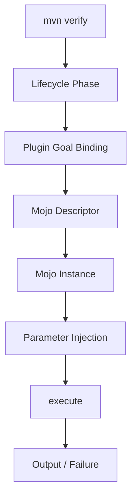
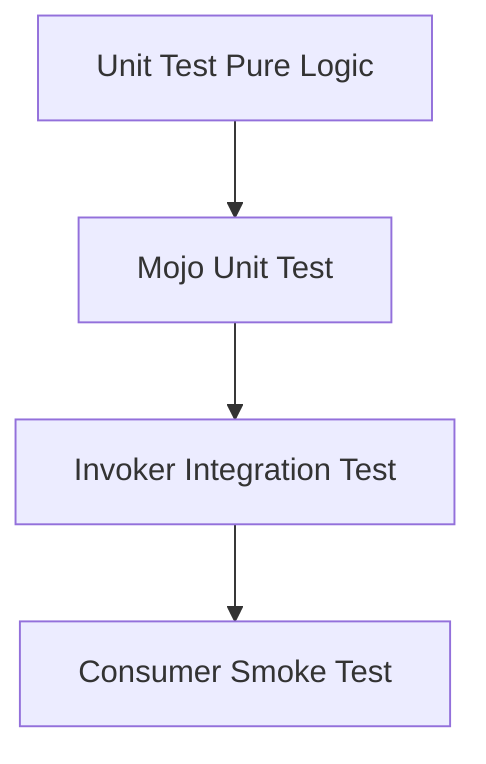
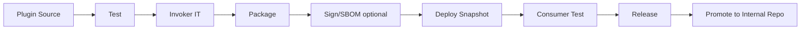

# Part 036 — Writing Custom Maven Plugins

Custom Maven plugin adalah pisau bedah. Ia sangat berguna jika problem memang build-system problem. Tapi jika dipakai untuk menambal desain project yang kacau, ia akan menjadi sumber coupling baru.

Target part ini:

> Kamu bisa mendesain, menulis, menguji, mendokumentasikan, dan mempublish Maven plugin internal dengan aman, deterministik, thread-aware, dan kompatibel dengan lifecycle Maven.

Kita tidak akan membuat plugin demo `hello world` lalu selesai. Kita akan membangun mental model plugin sebagai **extension point yang dieksekusi oleh Maven lifecycle**, punya classpath sendiri, parameter contract, failure semantics, dan compatibility burden.

---

## 1. Kapan Harus Menulis Custom Maven Plugin?

Jangan mulai dari “mari buat plugin”. Mulai dari problem.

Custom plugin masuk akal jika kamu butuh:

- validasi build policy yang tidak bisa diekspresikan oleh Maven Enforcer biasa,
- generate artifact metadata internal,
- enforce struktur module enterprise,
- scan artifact final sebelum deploy,
- menghasilkan file manifest/governance report standar perusahaan,
- orchestrate build-time transformation yang memang bagian dari artifact,
- menyatukan tooling internal agar tidak copy-paste script di ratusan repository.

Custom plugin **tidak** masuk akal jika:

- bisa diselesaikan dengan plugin resmi existing,
- hanya wrapper tipis untuk shell script,
- problem sebenarnya dependency governance,
- problem sebenarnya CI pipeline,
- plugin membutuhkan akses network production saat build,
- plugin akan membaca secret dan menulisnya ke artifact,
- plugin membuat build non-deterministik,
- plugin diam-diam mengubah source tree.

Decision matrix:

| Problem | Plugin? | Alternatif Pertama |
|---|---:|---|
| enforce Maven/JDK version | tidak | Maven Enforcer |
| generate OpenAPI client | biasanya tidak | OpenAPI generator plugin |
| validate internal module naming | mungkin | Enforcer custom rule / custom plugin |
| produce company manifest | ya | custom plugin |
| run deployment | hati-hati | CI/CD pipeline |
| call production API during build | tidak | release pipeline step |
| scan packaged artifact | ya | custom verification plugin |
| normalize POM versions | biasanya tidak | Versions plugin / release process |

Rule:

> Tulis plugin jika logic-nya adalah build contract reusable. Jangan tulis plugin jika logic-nya adalah deployment orchestration atau environment runtime.

---

## 2. Mental Model: Plugin, Goal, Mojo

Maven plugin berisi satu atau lebih **goal**. Goal diimplementasikan oleh class yang disebut **Mojo**.



Model penting:

- Plugin adalah artifact Maven biasa dengan packaging khusus.
- Goal adalah entrypoint yang bisa dipanggil langsung atau bind ke lifecycle phase.
- Mojo menerima parameter dari POM, CLI property, default value, dan Maven context.
- Maven membuat plugin descriptor agar core tahu goal, parameter, requirement, dan metadata.
- Plugin berjalan dengan plugin classpath, bukan project runtime classpath.

Contoh invocation:

```bash
mvn com.acme.build:acme-build-plugin:1.2.0:validate-contracts
```

Jika goal prefix dikonfigurasi dan plugin discoverable:

```bash
mvn acme-build:validate-contracts
```

Jika bind ke phase:

```bash
mvn verify
```

---

## 3. Plugin Project Structure

Struktur dasar:

```text
acme-build-plugin/
  pom.xml
  src/main/java/
    com/acme/build/plugin/ValidateContractsMojo.java
  src/test/java/
    com/acme/build/plugin/ValidateContractsMojoTest.java
  src/it/
    valid-project/
      pom.xml
    invalid-project/
      pom.xml
```

POM plugin:

```xml
<project>
  <modelVersion>4.0.0</modelVersion>

  <groupId>com.acme.build</groupId>
  <artifactId>acme-build-plugin</artifactId>
  <version>1.0.0-SNAPSHOT</version>
  <packaging>maven-plugin</packaging>

  <name>ACME Build Maven Plugin</name>

  <properties>
    <maven.compiler.release>17</maven.compiler.release>
    <maven.plugin.plugin.version>3.15.2</maven.plugin.plugin.version>
  </properties>

  <dependencies>
    <dependency>
      <groupId>org.apache.maven</groupId>
      <artifactId>maven-plugin-api</artifactId>
      <version>${maven.api.version}</version>
      <scope>provided</scope>
    </dependency>
    <dependency>
      <groupId>org.apache.maven.plugin-tools</groupId>
      <artifactId>maven-plugin-annotations</artifactId>
      <version>${maven.plugin.tools.version}</version>
      <scope>provided</scope>
    </dependency>
  </dependencies>

  <build>
    <plugins>
      <plugin>
        <groupId>org.apache.maven.plugins</groupId>
        <artifactId>maven-plugin-plugin</artifactId>
        <version>${maven.plugin.plugin.version}</version>
        <configuration>
          <goalPrefix>acme-build</goalPrefix>
        </configuration>
      </plugin>
    </plugins>
  </build>
</project>
```

Catatan:

- `maven-plugin-api` biasanya `provided` karena disediakan Maven runtime.
- `maven-plugin-annotations` dipakai saat build untuk menghasilkan descriptor metadata.
- `maven-plugin-plugin` menghasilkan descriptor, help goal, dan metadata plugin.
- Pin version plugin tools seperti dependency lain.

---

## 4. Minimal Mojo yang Benar

```java
package com.acme.build.plugin;

import org.apache.maven.plugin.AbstractMojo;
import org.apache.maven.plugin.MojoExecutionException;
import org.apache.maven.plugin.MojoFailureException;
import org.apache.maven.plugins.annotations.LifecyclePhase;
import org.apache.maven.plugins.annotations.Mojo;
import org.apache.maven.plugins.annotations.Parameter;

import java.io.File;
import java.nio.file.Files;

@Mojo(
    name = "validate-contracts",
    defaultPhase = LifecyclePhase.VERIFY,
    threadSafe = true
)
public final class ValidateContractsMojo extends AbstractMojo {

    @Parameter(defaultValue = "${project.basedir}", readonly = true, required = true)
    private File basedir;

    @Parameter(property = "acme.contracts.failOnWarning", defaultValue = "true")
    private boolean failOnWarning;

    @Override
    public void execute() throws MojoExecutionException, MojoFailureException {
        File contractsDir = new File(basedir, "src/main/contracts");

        if (!contractsDir.exists()) {
            throw new MojoFailureException(
                "Missing required directory: " + contractsDir
            );
        }

        try {
            boolean hasContract = Files.walk(contractsDir.toPath())
                .anyMatch(path -> path.toString().endsWith(".yaml") || path.toString().endsWith(".json"));

            if (!hasContract) {
                throw new MojoFailureException("No contract files found in " + contractsDir);
            }

            getLog().info("Contract validation passed: " + contractsDir);
        } catch (MojoFailureException e) {
            throw e;
        } catch (Exception e) {
            throw new MojoExecutionException("Could not validate contracts", e);
        }
    }
}
```

Perhatikan beberapa hal:

- `@Mojo(name = ...)` menentukan goal name.
- `defaultPhase = VERIFY` membuat goal bisa otomatis bind jika plugin dideklarasikan dengan execution.
- `threadSafe = true` hanya boleh di-set jika plugin benar-benar aman untuk parallel build.
- `MojoFailureException` untuk kondisi validasi yang gagal secara expected.
- `MojoExecutionException` untuk error tak terduga saat eksekusi.

Rule failure:

| Exception | Makna | Contoh |
|---|---|---|
| `MojoFailureException` | build input valid dievaluasi dan gagal rule | contract missing, quality threshold gagal |
| `MojoExecutionException` | plugin tidak bisa menjalankan tugasnya | IO error, parser crash, bug, unexpected state |

---

## 5. Parameter Design

Parameter adalah API plugin. Jangan mendesainnya sembarangan.

Contoh:

```java
@Parameter(property = "acme.contracts.includes")
private List<String> includes;

@Parameter(defaultValue = "${project.build.directory}/acme-reports", required = true)
private File outputDirectory;

@Parameter(defaultValue = "${project}", readonly = true, required = true)
private org.apache.maven.project.MavenProject project;
```

Parameter bisa datang dari POM:

```xml
<plugin>
  <groupId>com.acme.build</groupId>
  <artifactId>acme-build-plugin</artifactId>
  <version>1.0.0</version>
  <configuration>
    <failOnWarning>true</failOnWarning>
    <includes>
      <include>**/*.yaml</include>
      <include>**/*.json</include>
    </includes>
  </configuration>
</plugin>
```

Atau CLI property:

```bash
mvn verify -Dacme.contracts.failOnWarning=false
```

Design rules:

1. Parameter name harus stabil.
2. Default harus aman.
3. Boolean negatif membingungkan. Lebih baik `failOnWarning` daripada `ignoreWarnings` jika default-nya strict.
4. Jangan membuat parameter yang menerima secret kecuali benar-benar perlu.
5. Jangan membuat parameter `environment=prod`; Maven plugin bukan runtime config switch.
6. Parameter list/map harus punya contoh dokumentasi.
7. Breaking change parameter adalah breaking change plugin.

---

## 6. Project Context: Apa yang Boleh Diakses Mojo?

Mojo bisa menerima Maven context seperti:

```java
@Parameter(defaultValue = "${project}", readonly = true, required = true)
private MavenProject project;

@Parameter(defaultValue = "${session}", readonly = true, required = true)
private MavenSession session;

@Parameter(defaultValue = "${project.build.directory}", readonly = true, required = true)
private File buildDirectory;
```

Gunakan context seperlunya.

Anti-pattern:

```java
// Buruk: plugin membaca dan mengubah POM langsung tanpa alasan kuat
File pom = new File(basedir, "pom.xml");
```

Lebih baik gunakan model Maven yang sudah dibangun:

```java
String artifactId = project.getArtifactId();
String packaging = project.getPackaging();
```

Guideline:

| Need | Context |
|---|---|
| project identity | `MavenProject` |
| build dir | `${project.build.directory}` |
| selected modules/session | `MavenSession` dengan hati-hati |
| dependencies | require dependency resolution |
| artifact final | project artifact / build output path |

---

## 7. Dependency Resolution in Plugins

Jika plugin perlu melihat dependencies project, deklarasikan requirement secara eksplisit di annotation.

Contoh konseptual:

```java
@Mojo(
    name = "scan-dependencies",
    defaultPhase = LifecyclePhase.VERIFY,
    requiresDependencyResolution = ResolutionScope.TEST,
    threadSafe = true
)
public final class ScanDependenciesMojo extends AbstractMojo {
    @Parameter(defaultValue = "${project}", readonly = true, required = true)
    private MavenProject project;

    @Override
    public void execute() throws MojoExecutionException, MojoFailureException {
        project.getArtifacts().forEach(artifact ->
            getLog().info(artifact.getGroupId() + ":" + artifact.getArtifactId() + ":" + artifact.getVersion())
        );
    }
}
```

Hati-hati:

- dependency resolution mahal,
- scope terlalu luas memperlambat build,
- plugin dependency bukan project dependency,
- jangan mutate dependency graph di plugin biasa,
- jangan resolve network artifact secara manual jika Maven resolver sudah punya model.

Rule:

> Jika plugin hanya butuh file source, jangan require dependency resolution. Jika butuh bytecode test, pilih scope yang paling sempit.

---

## 8. Thread Safety

Maven bisa menjalankan build paralel dengan `-T`. Jika plugin menandai `threadSafe = true`, plugin harus benar-benar aman.

Plugin **tidak thread-safe** jika:

- menulis file global shared tanpa lock,
- memakai static mutable state,
- menulis ke direktori di luar `target` module,
- memakai temp file nama tetap,
- mengubah system properties global,
- mengandalkan current working directory,
- mengakses service external dengan shared mutable state.

Aman:

```java
File report = new File(buildDirectory, "acme/report.json");
```

Berbahaya:

```java
File report = new File(session.getExecutionRootDirectory(), "target/acme-report.json");
```

Jika memang aggregator report, desain goal aggregator terpisah dan dokumentasikan bahwa ia berjalan di root.

---

## 9. Aggregator Goal vs Per-Module Goal

Per-module goal berjalan untuk setiap module.

Aggregator goal berjalan dari root/aggregator dan melihat banyak module.

Gunakan aggregator untuk:

- membuat consolidated report,
- memvalidasi aturan antar module,
- mengecek dependency direction antar module,
- membuat inventory semua artifact.

Jangan gunakan aggregator untuk:

- compile per module,
- mutate file module tanpa explicit opt-in,
- menyembunyikan dependency antar module.

Konseptual:

```java
@Mojo(name = "aggregate-report", aggregator = true, threadSafe = true)
public final class AggregateReportMojo extends AbstractMojo {
    @Parameter(defaultValue = "${session}", readonly = true, required = true)
    private MavenSession session;

    @Override
    public void execute() {
        session.getProjects().forEach(project ->
            getLog().info(project.getGroupId() + ":" + project.getArtifactId())
        );
    }
}
```

Risk:

- aggregator behavior dengan `-pl` harus jelas,
- output root harus deterministic,
- ordering module harus stable,
- partial build semantics harus terdokumentasi.

---

## 10. Lifecycle Binding

Plugin goal bisa dipanggil langsung:

```bash
mvn acme-build:validate-contracts
```

Atau di-bind ke lifecycle:

```xml
<plugin>
  <groupId>com.acme.build</groupId>
  <artifactId>acme-build-plugin</artifactId>
  <version>${acme.build.plugin.version}</version>
  <executions>
    <execution>
      <id>validate-contracts</id>
      <phase>verify</phase>
      <goals>
        <goal>validate-contracts</goal>
      </goals>
    </execution>
  </executions>
</plugin>
```

Best practice:

- Verification goal biasanya bind ke `verify`.
- Code generation bind ke `generate-sources` atau `generate-test-sources`.
- Resource transformation bind ke `process-resources` jika benar-benar resource build-time.
- Artifact inspection bind setelah packaging jika butuh artifact final.
- Deployment bukan tugas plugin custom kecuali benar-benar build-domain internal dan terkontrol.

Lifecycle mapping:

| Goal Type | Phase Umum | Catatan |
|---|---|---|
| validate metadata | `validate` | jangan butuh compiled classes |
| generate source | `generate-sources` | output ke `target/generated-sources` |
| process resource | `process-resources` | jangan leak secret |
| inspect bytecode | `process-classes` / `verify` | butuh compiled output |
| validate artifact | `verify` | setelah tests/package sesuai kebutuhan |
| attach artifact | `package` / `verify` | hati-hati classifier |
| aggregate report | `verify` / `site` | partial reactor semantics jelas |

---

## 11. Plugin Output Contract

Plugin output harus predictable.

Baik:

```text
target/acme-reports/contracts.json
target/generated-sources/acme/...
target/acme-metadata/build-manifest.json
```

Buruk:

```text
src/main/java/generated/...
/tmp/acme-output
../shared/report.json
```

Rules:

- Generated output masuk `target`, kecuali user eksplisit opt-in.
- Jangan mengubah source file default.
- Jangan menghasilkan timestamp non-deterministik kecuali ada parameter eksplisit.
- Untuk reproducible builds, urutkan input file sebelum memproses.
- Output report harus stabil agar bisa di-diff.

Contoh deterministic file traversal:

```java
List<Path> files;
try (Stream<Path> stream = Files.walk(inputDirectory.toPath())) {
    files = stream
        .filter(Files::isRegularFile)
        .sorted(Comparator.comparing(Path::toString))
        .toList();
}
```

---

## 12. Logging Contract

Maven plugin bukan aplikasi CLI bebas. Gunakan `getLog()`.

```java
getLog().debug("Detailed parser state: " + state);
getLog().info("Validated 42 contract files");
getLog().warn("Deprecated contract field found: customerId");
```

Guideline:

| Level | Gunakan untuk |
|---|---|
| debug | detail diagnostik, paths, decisions |
| info | ringkasan work yang berguna |
| warn | masalah non-fatal yang harus ditindaklanjuti |
| error | sebelum melempar exception untuk failure jelas |

Jangan:

- print ke `System.out`,
- log secret,
- spam satu baris per class/dependency kecuali debug,
- menyembunyikan path file yang gagal.

Error message yang baik:

```text
Contract validation failed: src/main/contracts/order.yaml
Reason: field 'customer.id' is required by ACME contract policy v3.
Fix: add field or suppress with documented waiver in acme-contracts.yml.
```

Error message yang buruk:

```text
Validation failed.
```

---

## 13. Testing Custom Maven Plugins

Ada tiga level testing.



### 13.1 Unit Test Pure Logic

Tarik logic utama keluar dari Mojo.

```java
public final class ContractValidator {
    ValidationResult validate(Path contractsDir) {
        // pure-ish logic
    }
}
```

Test-nya tidak perlu Maven.

### 13.2 Mojo Test

Gunakan Maven Plugin Testing Harness untuk injection/configuration behavior.

Tujuan:

- parameter POM terbaca,
- default value benar,
- MavenProject/MavenSession tersedia,
- failure semantics benar.

### 13.3 Invoker Integration Test

Gunakan Maven Invoker Plugin untuk menjalankan project contoh nyata.

Layout:

```text
src/it/
  valid-contracts/
    pom.xml
    src/main/contracts/order.yaml
    verify.groovy
  invalid-contracts/
    pom.xml
    src/main/contracts/bad.yaml
    invoker.properties
```

Invoker test memvalidasi plugin sebagai user akan memakainya: lewat Maven process nyata.

Contoh `invoker.properties`:

```properties
invoker.goals = verify
invoker.buildResult = failure
```

### 13.4 Consumer Smoke Test

Untuk plugin internal enterprise, punya satu repository sample consumer:

```bash
mvn -U -Dacme.build.plugin.version=1.2.0 verify
```

Ini menangkap masalah yang tidak terlihat di test plugin sendiri:

- parent/BOM interaction,
- corporate settings,
- multi-module reactor,
- Java version baseline,
- CI cache behavior.

---

## 14. Documentation Contract

Plugin internal tanpa dokumentasi akan menjadi tribal knowledge.

Minimal dokumentasi:

```md
# acme-build-maven-plugin

## Goals

### acme-build:validate-contracts

Purpose:
Validates files in `src/main/contracts` against ACME contract policy.

Default phase:
`verify`

Parameters:
| Name | Type | Default | Property | Required | Description |
|---|---|---|---|---|---|
| failOnWarning | boolean | true | acme.contracts.failOnWarning | no | Fail build on warning |

Examples:
...

Failure modes:
...

Thread safety:
...

Compatibility:
...
```

Gunakan `maven-plugin-plugin` agar plugin documentation/help goal bisa dibuat dari descriptor.

User harus bisa menjalankan:

```bash
mvn help:describe -Dplugin=com.acme.build:acme-build-plugin -Ddetail
```

Dan memahami parameter tanpa membaca source.

---

## 15. Publishing Internal Plugins

Plugin adalah artifact internal yang harus dipublish seperti library.

Lifecycle:



Rules:

- Plugin release immutable.
- Plugin versions dipin di parent `pluginManagement`.
- Plugin tidak boleh SNAPSHOT di release pipeline production.
- Breaking change butuh major/minor policy jelas.
- Changelog harus menyebut behavior build yang berubah.

Consumer usage:

```xml
<build>
  <pluginManagement>
    <plugins>
      <plugin>
        <groupId>com.acme.build</groupId>
        <artifactId>acme-build-plugin</artifactId>
        <version>${acme.build.plugin.version}</version>
      </plugin>
    </plugins>
  </pluginManagement>
</build>
```

Kemudian module memilih execution:

```xml
<plugin>
  <groupId>com.acme.build</groupId>
  <artifactId>acme-build-plugin</artifactId>
  <executions>
    <execution>
      <id>validate-contracts</id>
      <phase>verify</phase>
      <goals>
        <goal>validate-contracts</goal>
      </goals>
    </execution>
  </executions>
</plugin>
```

---

## 16. Versioning Custom Plugins

Plugin versioning lebih sensitif daripada library biasa karena plugin mengubah build behavior.

Gunakan policy:

| Change | Version Impact |
|---|---|
| bug fix tanpa behavior breaking | patch |
| parameter baru dengan default backward-compatible | minor |
| default behavior berubah | major/minor tergantung organisasi, tapi treat as breaking |
| parameter rename/remove | major |
| output path berubah | major |
| failure threshold berubah dari warn ke fail | breaking |
| Java/Maven minimum version naik | breaking untuk consumer lama |

Jangan melakukan ini di patch release:

- menambah rule baru yang mem-fail build,
- mengubah default `failOnWarning`,
- mengganti output directory,
- menghapus parameter,
- mengubah lifecycle default phase.

---

## 17. Security Rules for Plugins

Custom plugin berjalan di build environment. Itu tempat yang sensitif.

Plugin bisa melihat:

- source code,
- build output,
- environment variables,
- Maven settings,
- possibly credentials via build environment,
- dependency graph,
- artifact contents.

Security rules:

1. Jangan log environment variables mentah.
2. Jangan kirim data build ke network tanpa explicit opt-in.
3. Jangan membaca `settings.xml` credential kecuali benar-benar perlu.
4. Jangan menulis secret ke report.
5. Jangan download dependency secara manual dari URL arbitrary.
6. Jangan execute shell command dari parameter user tanpa sanitasi kuat.
7. Jangan membuat plugin yang butuh production credential untuk `verify`.
8. Jangan membuat rule yang silently uploads artifact/source.

Network access default sebaiknya `false`:

```java
@Parameter(property = "acme.plugin.allowNetwork", defaultValue = "false")
private boolean allowNetwork;
```

Jika plugin butuh network, dokumentasikan endpoint, data yang dikirim, timeout, retry, dan failure behavior.

---

## 18. Performance Rules

Plugin lambat akan memperlambat semua repository yang menggunakannya.

Budget:

| Plugin Type | Target |
|---|---|
| metadata validation | sub-second per module |
| file scan | linear terhadap jumlah file |
| dependency scan | avoid repeated resolution |
| aggregate report | stable under multi-module |
| artifact scan | skip unchanged if safe |

Performance anti-pattern:

```java
for (Artifact artifact : project.getArtifacts()) {
    resolveAgainFromRemote(artifact);
}
```

Better:

- gunakan artifact yang sudah di-resolve Maven,
- cache calculation per module di `target`,
- hindari global locks,
- proses file sorted secara streaming,
- jangan parse POM XML manual untuk semua module jika `MavenProject` sudah tersedia.

Tambahkan timing log di debug:

```java
long start = System.nanoTime();
// work
getLog().debug("Validation took " + Duration.ofNanos(System.nanoTime() - start));
```

---

## 19. Compatibility: Maven 3 and Maven 4

Saat menulis plugin pada era Maven 3 → Maven 4, pikirkan compatibility.

Guideline:

- Tentukan Maven minimum version yang didukung.
- Hindari bergantung pada internal Maven classes yang tidak stabil.
- Gunakan API/plugin annotations yang documented.
- Jalankan invoker tests dengan Maven version matrix jika plugin enterprise-critical.
- Jangan memakai behavior lifecycle Maven 3 yang diketahui berubah di Maven 4 tanpa migration plan.

CI matrix contoh:

```yaml
strategy:
  matrix:
    maven: ['3.9.16', '4.0.0-rc']
    java: ['17', '21']
```

Untuk Maven 4, beberapa API dan lifecycle behavior berubah. Jangan asumsikan plugin custom lama otomatis aman.

---

## 20. Case Study: Internal Artifact Manifest Plugin

Problem:

Perusahaan ingin setiap deployable artifact membawa manifest build standar:

```json
{
  "groupId": "com.acme.order",
  "artifactId": "order-service",
  "version": "2.8.1",
  "gitCommit": "abc123",
  "buildTimestamp": "2026-07-03T10:00:00Z",
  "dependencies": [
    "com.acme:common-lib:1.7.0"
  ]
}
```

Tantangan:

- Jika timestamp selalu berubah, reproducible build rusak.
- Jika dependency order tidak stabil, output berubah.
- Jika git command dipanggil manual, build di source archive bisa gagal.
- Jika manifest masuk artifact, phase harus benar.

Design yang lebih baik:

- `buildTimestamp` default dari `${project.build.outputTimestamp}` jika ada.
- `gitCommit` dari CI property, bukan shell `git` default.
- dependency list sorted.
- output ke `target/generated-resources/acme/META-INF/acme-build-manifest.json`.
- resource root ditambahkan atau file di-attach dengan phase jelas.

Mojo parameter:

```java
@Parameter(defaultValue = "${project.groupId}", readonly = true)
private String groupId;

@Parameter(defaultValue = "${project.artifactId}", readonly = true)
private String artifactId;

@Parameter(defaultValue = "${project.version}", readonly = true)
private String version;

@Parameter(property = "acme.git.commit", required = true)
private String gitCommit;

@Parameter(defaultValue = "${project.build.outputTimestamp}")
private String outputTimestamp;
```

Consumer config:

```xml
<plugin>
  <groupId>com.acme.build</groupId>
  <artifactId>acme-build-plugin</artifactId>
  <executions>
    <execution>
      <id>generate-build-manifest</id>
      <phase>generate-resources</phase>
      <goals>
        <goal>generate-build-manifest</goal>
      </goals>
    </execution>
  </executions>
</plugin>
```

CI:

```bash
mvn verify -Dacme.git.commit="$GIT_COMMIT"
```

This is build-system logic. A custom plugin is justified.

---

## 21. Case Study: Module Boundary Validator

Problem:

Multi-module monorepo punya aturan:

- `*-api` tidak boleh depend ke `*-impl`,
- `domain` tidak boleh depend ke adapter,
- deployable service tidak boleh expose test-support dependency,
- internal generated module tidak boleh dipakai langsung.

Maven Enforcer built-in mungkin tidak cukup ekspresif.

Custom plugin aggregator:

```text
acme-build:validate-module-boundaries
```

Input policy:

```yaml
rules:
  - fromArtifactPattern: "*-api"
    bannedDependencyPattern: "*-impl"
  - fromArtifactPattern: "*-domain"
    bannedDependencyPattern: "*-adapter-*"
  - fromPackaging: "jar"
    bannedScope: "test-support-runtime"
```

Execution:

```xml
<execution>
  <id>validate-module-boundaries</id>
  <phase>validate</phase>
  <goals>
    <goal>validate-module-boundaries</goal>
  </goals>
</execution>
```

Design notes:

- aggregator goal reads `session.getProjects()`.
- It must respect `-pl` partial build semantics.
- It should produce deterministic report.
- It should fail with exact edge:

```text
Module boundary violation:
  from: com.acme.order:order-api
  to:   com.acme.order:order-impl
  rule: API modules must not depend on implementation modules.
```

This plugin creates architectural pressure through the build.

---

## 22. Anti-Patterns in Custom Maven Plugins

### 22.1 The Hidden CI Plugin

Plugin silently behaves differently in CI:

```java
boolean ci = System.getenv("CI") != null;
```

Bad. Build behavior should be explicit via parameter.

### 22.2 The Production Credential Plugin

Plugin calls production services during `verify`.

Bad. Build should not need production access.

### 22.3 The Source Mutator

Plugin rewrites source files in `src/main/java` by default.

Bad. Generated or transformed files should go to `target` unless explicit formatting plugin with clear opt-in.

### 22.4 The Network Downloader

Plugin downloads binary tools from arbitrary URLs.

Bad. Tools should be Maven artifacts or controlled repository assets.

### 22.5 The Global State Plugin

Plugin writes to `/tmp/acme-cache` across modules without locking.

Bad under parallel builds and CI isolation.

### 22.6 The Silent Skipper

Plugin swallows errors and logs warning.

Bad if the plugin enforces policy. Failure semantics must be explicit.

---

## 23. Production-Grade Plugin Checklist

Before publishing plugin internally:

```md
## API and behavior
- [ ] Goal names stable and clear
- [ ] Parameters documented
- [ ] Defaults safe
- [ ] Failure semantics clear
- [ ] No hidden environment behavior

## Build integration
- [ ] Correct default phase
- [ ] Works when called directly
- [ ] Works when bound to lifecycle
- [ ] Works in multi-module reactor
- [ ] Works with `-pl`, `-am`, `-T`

## Safety
- [ ] No secret logging
- [ ] No production network access by default
- [ ] No source mutation by default
- [ ] Output under `target`
- [ ] Deterministic output where possible

## Testing
- [ ] Pure logic unit tests
- [ ] Mojo tests
- [ ] Invoker integration tests
- [ ] Valid and invalid sample projects
- [ ] CI matrix Maven/JDK if needed

## Publishing
- [ ] Plugin version pinned in parent
- [ ] Changelog written
- [ ] Consumer example documented
- [ ] Rollback strategy known
```

---

## 24. Practice Lab

Build `acme-policy-maven-plugin` with three goals:

```text
acme-policy:validate-module-name
acme-policy:validate-no-snapshot-deps
acme-policy:generate-build-manifest
```

Requirements:

1. `validate-module-name`
   - runs in `validate`,
   - checks artifactId matches allowed pattern,
   - fails with `MojoFailureException`.

2. `validate-no-snapshot-deps`
   - runs in `verify`,
   - checks project artifacts,
   - has parameter `allowSnapshots` default `false`,
   - supports `-Dacme.policy.allowSnapshots=true`.

3. `generate-build-manifest`
   - runs in `generate-resources`,
   - writes deterministic JSON under `target/generated-resources/acme`,
   - sorts dependencies,
   - accepts `-Dacme.git.commit=...`,
   - does not call shell `git` by default.

Tests:

- one valid project,
- one invalid name project,
- one snapshot dependency project,
- one project verifying manifest output.

Stretch goal:

- Make `validate-module-boundaries` aggregator goal.
- Test it with three-module reactor.
- Run invoker tests with parallel Maven build.

---

## 25. Ringkasan

Custom Maven plugin adalah bagian dari build platform. Perlakukan seperti production software.

Yang harus kamu kuasai:

- plugin berisi goal,
- goal diimplementasikan oleh Mojo,
- descriptor dihasilkan oleh plugin tools,
- parameter adalah public API,
- `MojoFailureException` berbeda dari `MojoExecutionException`,
- lifecycle phase menentukan kapan plugin boleh bekerja,
- dependency resolution harus diminta eksplisit dan secukupnya,
- thread-safety harus nyata,
- aggregator goal punya semantics berbeda,
- plugin harus dites dengan unit, Mojo test, dan invoker integration test,
- output harus deterministic dan aman,
- publishing plugin internal butuh versioning dan governance.

Mental model final:

> Custom Maven plugin bukan tempat menyembunyikan script. Ia adalah kontrak build reusable yang harus deterministic, observable, testable, documented, dan safe under reactor execution.

Jika plugin tidak memenuhi standar itu, lebih baik jangan ditulis.

---

## References

- Apache Maven — Introduction to Maven Plugin Development: https://maven.apache.org/guides/introduction/introduction-to-plugins.html
- Apache Maven — Guide to Developing Java Plugins: https://maven.apache.org/guides/plugin/guide-java-plugin-development.html
- Apache Maven Plugin Tools — Annotations: https://maven.apache.org/plugin-tools/maven-plugin-tools-annotations/index.html
- Apache Maven Plugin Plugin — Generating Plugin Descriptor: https://maven.apache.org/plugin-tools/maven-plugin-plugin/examples/generate-descriptor.html
- Apache Maven Plugin Testing Harness: https://maven.apache.org/plugin-testing/maven-plugin-testing-harness/index.html
- Apache Maven Invoker Plugin: https://maven.apache.org/plugins/maven-invoker-plugin/
- Apache Maven Mojo API Specification: https://maven.apache.org/developers/mojo-api-specification.html
