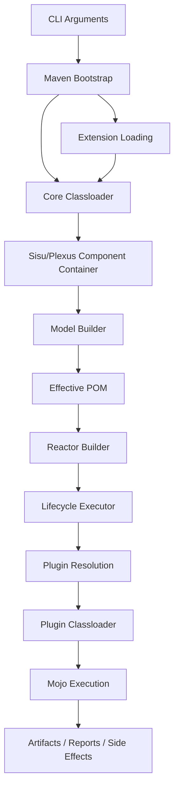
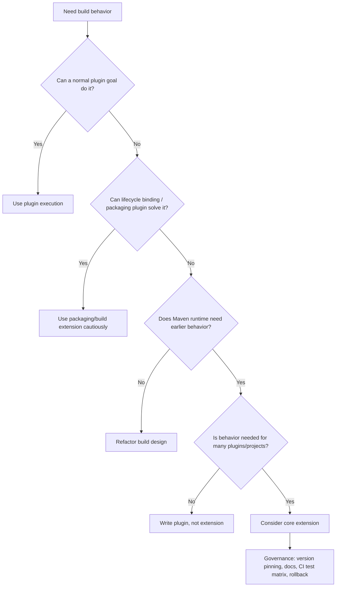
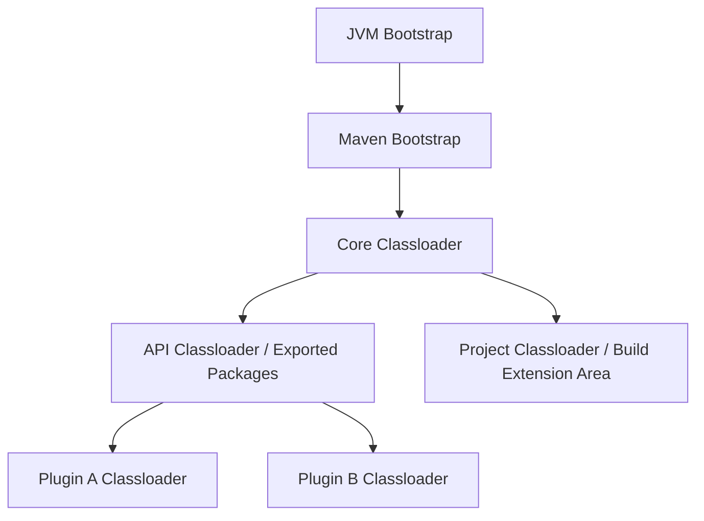
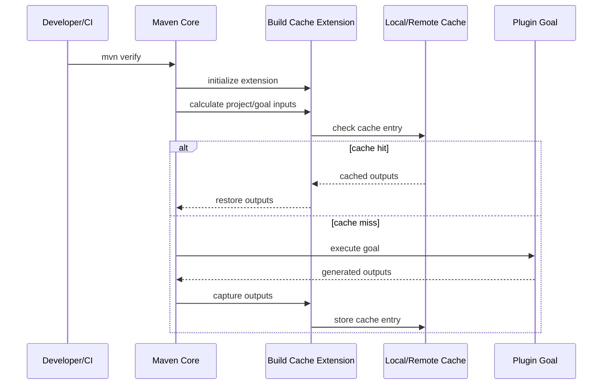

# Part 037 — Maven Extensions and Core Extension Points

> Maven plugin adalah cara normal untuk melakukan pekerjaan build. Maven extension adalah cara untuk mengubah **cara Maven itu sendiri bekerja**. Karena itu, extension bukan “plugin yang lebih powerful”; extension adalah perubahan pada runtime build system.

Pada part sebelumnya kita sudah membangun mental model Maven sebagai gabungan dari POM model, dependency resolver, lifecycle executor, plugin execution framework, repository system, reactor, dan CI governance. Part ini membahas level yang lebih dalam: **extension points**.

Targetnya bukan supaya setiap engineer menulis extension. Targetnya adalah supaya kamu bisa menilai:

1. kapan plugin biasa cukup,
2. kapan build extension masuk akal,
3. kapan core extension diperlukan,
4. kapan extension adalah red flag,
5. bagaimana mengoperasikan extension di enterprise build tanpa membuat build sulit diaudit.

Apache Maven mendokumentasikan extension sebagai mekanisme untuk menambahkan class ke Core Classloader atau Project Classloader. Ini diperlukan ketika perubahan memengaruhi lebih dari satu plugin, misalnya transport artifact, lifecycle enhancement, atau penggantian komponen runtime Maven.

---

## 1. The Core Question

Pertanyaan inti part ini:

> Kalau Maven adalah engine build, di titik mana kita boleh mengubah engine-nya, bukan hanya memberi engine itu task baru?

Plugin memberi Maven task baru:

```bash
mvn my-plugin:my-goal
```

Extension dapat mengubah kemampuan Maven sebelum task berjalan:

- menambah transport repository,
- mengubah lifecycle behavior,
- menambah component ke container Maven,
- mengubah classloading,
- mengaktifkan build cache,
- memengaruhi resolver,
- memengaruhi bagaimana plugin melihat runtime Maven.

Perbedaan ini besar.

Plugin biasanya berada di level **execution unit**. Extension berada di level **runtime modification**.

---

## 2. Mental Model: Maven as Runtime + Container + Classloader Graph

Maven bukan hanya command-line parser. Saat `mvn verify` berjalan, Maven kira-kira melakukan ini:



Yang penting:

- Maven punya **core runtime**.
- Maven memakai **component container**.
- Plugin punya classpath sendiri.
- Core extension dimuat lebih awal.
- Build extension dimuat lebih lambat dan lebih dekat ke project.
- Classloader boundary menentukan siapa bisa melihat class siapa.

Kalau kamu salah memilih plugin vs extension, kamu akan melawan arsitektur Maven.

---

## 3. Plugin vs Build Extension vs Core Extension

| Mechanism | Loaded When | Scope | Good For | Risk |
|---|---:|---|---|---|
| Plugin goal | Saat lifecycle/goal execution | Task spesifik | compile, test, generate, package, publish | Rendah-menengah |
| Plugin with `<extensions>true</extensions>` | Saat plugin dipakai sebagai build extension | Project build | lifecycle enhancement dari plugin tertentu | Menengah |
| `<build><extensions>` | Saat project model/build disiapkan | Project | Wagon provider, packaging support, build behavior | Menengah-tinggi |
| `.mvn/extensions.xml` | Sangat awal di build | Build invocation / repository checkout | build cache, resolver behavior, core-level behavior | Tinggi |
| `${maven.home}/lib/ext` | Maven installation global | Semua build pada instalasi itu | legacy/global core extension | Sangat tinggi |
| `-Dmaven.ext.class.path=...` | CLI bootstrap | Invocation | eksperimen/diagnostic/agent-like extension | Tinggi |

Rule praktis:

> Pakai plugin sampai terbukti tidak cukup. Pakai build extension hanya jika perubahan harus terjadi sebelum plugin goal biasa bisa bekerja. Pakai core extension hanya jika behavior Maven harus berubah di level bootstrap/runtime.

---

## 4. Decision Ladder: Jangan Langsung Membuat Extension

Sebelum membuat atau memasang extension, naikkan pertanyaan ini secara berurutan.



Concrete examples:

| Problem | Preferred Mechanism | Why |
|---|---|---|
| Generate source from OpenAPI | Plugin goal in `generate-sources` | Build task biasa |
| Enforce banned dependency | Maven Enforcer Plugin | Build validation biasa |
| Add non-standard source directory | Build Helper Plugin | Build model modification, tapi plugin goal cukup |
| Support custom artifact transport | Build/Core extension | Transport harus tersedia saat resolver bekerja |
| Add build cache into Maven lifecycle | Core extension | Memengaruhi execution/caching across plugins |
| Create a company-specific quality report | Plugin | Tidak perlu mengubah Maven runtime |
| Change dependency resolution semantics | Core extension or avoid | Sangat berisiko; perlu governance tinggi |
| Add new packaging lifecycle mapping | Build extension/plugin with extensions | Packaging/lifecycle mapping harus tersedia saat lifecycle dihitung |

---

## 5. Loading Surfaces

Maven mendukung beberapa cara memuat extension. Urutannya penting karena menentukan seberapa awal extension memengaruhi build.

### 5.1 `.mvn/extensions.xml`

Ini adalah cara project-local untuk mendeklarasikan core extension.

Struktur umum:

```xml
<extensions xmlns="http://maven.apache.org/EXTENSIONS/1.0.0"
            xmlns:xsi="http://www.w3.org/2001/XMLSchema-instance"
            xsi:schemaLocation="http://maven.apache.org/EXTENSIONS/1.0.0 https://maven.apache.org/xsd/core-extensions-1.0.0.xsd">
  <extension>
    <groupId>org.apache.maven.extensions</groupId>
    <artifactId>maven-build-cache-extension</artifactId>
    <version>${build.cache.extension.version}</version>
  </extension>
</extensions>
```

Namun ada detail penting: tidak semua placeholder dan model interpolation yang biasa kamu pakai di `pom.xml` tersedia di file bootstrap seperti ini. Untuk enterprise, lebih aman gunakan versi eksplisit atau mekanisme yang benar-benar didukung oleh extension tersebut.

Kapan cocok:

- build cache,
- extension yang harus aktif sebelum project model lengkap tersedia,
- behavior yang harus konsisten untuk seluruh checkout repository.

Kapan tidak cocok:

- logic business build kecil,
- formatter,
- code generation biasa,
- quality checker biasa,
- hal yang bisa dilakukan plugin pada phase tertentu.

### 5.2 `<build><extensions>`

Contoh:

```xml
<build>
  <extensions>
    <extension>
      <groupId>org.apache.maven.wagon</groupId>
      <artifactId>wagon-ftp</artifactId>
      <version>3.5.3</version>
    </extension>
  </extensions>
</build>
```

Ini adalah build extension di level project. Cocok ketika project memerlukan extension tertentu untuk build-nya.

Risiko:

- extension ikut menjadi bagian dari model project,
- parent/child inheritance bisa membuat efeknya menyebar,
- version drift bisa membuat build berubah tanpa perubahan source utama,
- developer dan CI harus resolve extension sebelum build berjalan normal.

### 5.3 Plugin `<extensions>true</extensions>`

Contoh umum untuk plugin yang menyediakan lifecycle/packaging integration:

```xml
<build>
  <plugins>
    <plugin>
      <groupId>org.apache.felix</groupId>
      <artifactId>maven-bundle-plugin</artifactId>
      <version>${maven.bundle.plugin.version}</version>
      <extensions>true</extensions>
    </plugin>
  </plugins>
</build>
```

Maknanya: plugin tidak hanya dieksekusi sebagai goal, tetapi juga menyediakan extension behavior.

Gunakan hanya jika plugin documentation memang menyatakan perlu `extensions=true`.

### 5.4 `${maven.home}/lib/ext`

Ini global terhadap instalasi Maven.

Dalam enterprise modern, ini sebaiknya dihindari kecuali untuk skenario yang sangat terkontrol, karena:

- tidak terlihat di repository source code,
- tidak jelas di CI log kecuali dicetak eksplisit,
- susah direproduksi oleh developer lain,
- mudah menciptakan “works on my machine”.

### 5.5 `-Dmaven.ext.class.path=...`

Ini berguna untuk eksperimen atau diagnostic, tetapi buruk sebagai kebiasaan pipeline permanen.

Contoh:

```bash
mvn -Dmaven.ext.class.path=/opt/company/maven/company-build-agent.jar verify
```

Masalahnya: build behavior sekarang tergantung CLI eksternal, bukan repository. Jika dipakai di CI, pipeline harus mencetak nilai itu dan menyimpan artifact extension sebagai dependency yang terversi.

---

## 6. Classloading: Sumber Banyak Bug Extension

Maven classloading bukan classpath flat. Ini sengaja dibuat supaya plugin tidak saling mencemari.

Model sederhana:



Konsekuensi:

1. Dependency plugin A tidak otomatis terlihat oleh plugin B.
2. Dependency project tidak otomatis terlihat oleh plugin.
3. Core extension dapat memengaruhi API yang terlihat lebih luas.
4. Build extension lebih dekat ke project classloader.
5. Library version conflict di extension bisa lebih berbahaya daripada conflict dependency aplikasi.

### Failure Mode: Extension Membawa Library yang Bentrok

Misalnya extension membawa versi library resolver/helper yang tidak kompatibel dengan Maven core atau plugin tertentu.

Gejala:

```text
java.lang.NoSuchMethodError
java.lang.ClassCastException
org.codehaus.plexus.component.repository.exception.ComponentLookupException
```

Diagnosis:

```bash
mvn -X validate
mvn -version
find .mvn -maxdepth 2 -type f -print
cat .mvn/extensions.xml
```

Pertanyaan root cause:

- extension dimuat dari mana?
- versinya pinned atau floating?
- apakah berbeda antara local dan CI?
- apakah plugin failure terjadi hanya ketika extension aktif?
- apakah error muncul sebelum lifecycle execution?

Quick isolation:

```bash
mv .mvn/extensions.xml .mvn/extensions.xml.disabled
mvn -U -e -X validate
mv .mvn/extensions.xml.disabled .mvn/extensions.xml
```

Jika build normal saat extension dimatikan, extension masuk daftar suspect utama.

---

## 7. Extension as Enterprise Policy: Powerful but Dangerous

Di organisasi besar, extension terlihat menarik untuk memaksa policy:

- semua build harus memakai repository internal,
- semua build harus menghasilkan SBOM,
- semua build harus mengirim metrics,
- semua build harus memakai cache,
- semua build harus melarang dependency tertentu,
- semua build harus memakai signing/provenance.

Namun tidak semua policy cocok dijadikan extension.

| Policy | Better Mechanism | Reason |
|---|---|---|
| Maven/JDK minimum version | Enforcer | Mudah terlihat dan debuggable |
| Banned dependencies | Enforcer | Sudah ada rule built-in/extendable |
| Plugin version pinning | Parent POM `pluginManagement` | Kontrak eksplisit |
| Repository mirror | `settings.xml` mirror | Concern environment/org |
| Build cache | Core extension | Butuh intervensi lintas goal/plugin |
| Build metrics | Extension atau CI wrapper | Tergantung kedalaman telemetry |
| Custom artifact transport | Wagon extension | Resolver butuh transport |
| Mandatory SBOM | Plugin execution + CI gate | Lebih audit-friendly |

Prinsipnya:

> Semakin tersembunyi policy-nya dari POM, semakin tinggi biaya debugging-nya.

---

## 8. Case Study: Maven Build Cache Extension

Build cache adalah contoh extension yang masuk akal karena caching bukan sekadar goal tambahan. Cache harus memahami input/output task, fingerprint, lifecycle execution, dan artifact reuse.

Secara konseptual:



Cache extension harus menjawab pertanyaan berat:

- input apa yang dihitung?
- apakah environment variable termasuk input?
- apakah JDK version termasuk input?
- apakah plugin version termasuk input?
- apakah generated file deterministik?
- apakah test output boleh di-cache?
- apakah cache remote trusted?
- apakah cache bisa menyebabkan stale artifact?

Karena itu build cache harus diperlakukan sebagai **performance feature with correctness risk**.

Governance minimal:

```text
1. Aktifkan pada branch non-release dulu.
2. Jalankan mode validate/compare jika tersedia.
3. Bandingkan artifact checksum antara cache-hit dan clean build.
4. Catat plugin yang tidak safe untuk cache.
5. Pisahkan local cache dan remote cache policy.
6. Tambahkan escape hatch: -Dcache.skip=true atau mekanisme setara.
7. Dokumentasikan cara mematikan extension saat incident.
```

---

## 9. Case Study: Custom Wagon / Repository Transport

Repository resolution biasanya memakai HTTP(S). Namun organisasi tertentu punya transport khusus:

- internal artifact service,
- object storage gateway,
- legacy FTP/SFTP,
- hardened repository proxy,
- signed artifact gateway.

Transport harus tersedia sebelum Maven bisa resolve dependency/plugin. Ini alasan transport provider sering masuk wilayah extension.

Risiko:

- build gagal sangat awal,
- plugin/dependency resolution ikut terdampak,
- credential handling rawan bocor,
- retry/backoff behavior memengaruhi semua build,
- offline mode bisa tidak konsisten jika extension buruk.

Checklist transport extension:

```text
- Apakah mendukung checksum verification?
- Apakah mendukung retry dengan backoff?
- Apakah timeout eksplisit?
- Apakah credential dibaca dari settings.xml server id?
- Apakah log tidak mencetak token?
- Apakah error message membedakan 401/403/404/timeout?
- Apakah kompatibel dengan Maven 3.9.x dan Maven 4 RC?
- Apakah ada integration test dengan repository manager nyata?
```

---

## 10. Lifecycle Participants

Maven lifecycle participant adalah extension-level hook yang dapat ikut dalam proses build session. Ini bukan API yang harus dipakai sembarangan.

Contoh hal yang mungkin dilakukan:

- memvalidasi session saat build mulai,
- membaca daftar reactor projects,
- mengubah/menambah behavior sebelum execution,
- mengumpulkan metrics,
- melakukan cross-project initialization.

Bahaya:

- membuat build behavior tidak terlihat di POM,
- mengubah project model setelah engineer mengira effective POM sudah final,
- memperkenalkan global state,
- membuat parallel build tidak aman,
- sulit diuji hanya dengan unit test.

Rule enterprise:

> Lifecycle participant tidak boleh mengubah output build tanpa kontrak eksplisit, dokumentasi, test matrix, dan escape hatch.

---

## 11. Extension Configuration Strategy

Extension yang baik harus punya konfigurasi yang:

1. eksplisit,
2. terversi,
3. bisa diaudit,
4. aman untuk CI,
5. punya default konservatif,
6. punya mode dry-run/diagnostic,
7. punya escape hatch.

Struktur project yang umum:

```text
repo-root/
  .mvn/
    extensions.xml
    maven.config
    company-build-extension.yml
  pom.xml
  modules...
```

Contoh `maven.config`:

```text
--batch-mode
--show-version
-Dcompany.build.telemetry=true
-Dcompany.build.policy.mode=enforce
```

Namun jangan menyembunyikan terlalu banyak behavior di `.mvn/maven.config`. Build harus tetap bisa dipahami dari kombinasi:

- root POM,
- `.mvn/extensions.xml`,
- `.mvn/maven.config`,
- CI workflow,
- `settings.xml` yang disediakan CI,
- dokumentasi build.

---

## 12. Safe Extension Development Lifecycle

Jika organisasi benar-benar perlu membuat extension internal, jangan mulai dari kode. Mulai dari contract.

### 12.1 Extension RFC Template

```md
# Build Extension RFC

## Problem
Apa masalah build yang tidak bisa diselesaikan plugin biasa?

## Non-goals
Apa yang sengaja tidak akan diselesaikan?

## Loading mechanism
.mvn/extensions.xml / build extension / plugin extensions=true / CLI.

## Affected phases
validate / compile / test / package / verify / install / deploy / session-level.

## Inputs
POM, settings, env vars, files, JDK, Maven version, plugin versions.

## Outputs
Artifacts, files, logs, metrics, repository writes, cache writes.

## Failure behavior
Fail build / warn / skip / degrade.

## Reproducibility impact
Bagaimana membuktikan output tidak berubah secara tidak sah?

## Security review
Credential, logging, network, repository trust.

## Rollback
Cara mematikan extension tanpa mengubah banyak module.
```

### 12.2 Implementation Guardrails

Extension code harus:

- kecil,
- minim dependency,
- tidak membawa framework besar,
- tidak melakukan network call tanpa timeout,
- tidak membaca environment variable secara liar,
- tidak menulis ke workspace tanpa path eksplisit,
- tidak mengubah POM model diam-diam,
- aman untuk parallel build,
- punya integration test dengan Maven Invoker/Test Harness,
- diuji pada Maven baseline organisasi.

### 12.3 Versioning

Extension internal harus diperlakukan seperti runtime dependency kritikal.

```text
company-maven-extension:1.4.2
  - compatible with Maven 3.9.12-3.9.16
  - compatible with Java 17 runtime
  - tested with Linux x86_64 CI images 2026.06
  - cache schema version 3
```

Jangan pakai `LATEST`, dynamic version, atau SNAPSHOT di `.mvn/extensions.xml` untuk pipeline release.

---

## 13. Extension Observability

Extension yang mengubah build harus bisa menjawab:

- extension aktif atau tidak?
- versi extension apa?
- konfigurasi apa yang dipakai?
- mode enforce/warn/off apa?
- input apa yang dihitung?
- output apa yang disentuh?
- dependency/plugin apa yang terdampak?

Log minimal saat `validate`:

```text
[INFO] Company Maven Extension 1.4.2 active
[INFO] Policy mode: enforce
[INFO] Build cache: enabled, remote=read-only
[INFO] Maven version: 3.9.16
[INFO] Java runtime: 17.0.11
[INFO] Extension config: .mvn/company-build-extension.yml
```

Hindari log yang mencetak:

- token,
- password,
- full Authorization header,
- internal repository secret path,
- private key material,
- signed URL lengkap.

---

## 14. Incident Playbook: Extension-Induced Build Failure

Gejala:

```text
Build gagal sebelum phase validate selesai.
Maven error muncul sebelum plugin project berjalan.
Error hanya terjadi di CI tertentu.
Error hilang ketika .mvn/extensions.xml dinonaktifkan.
```

Langkah:

```bash
# 1. Capture environment
mvn -version
java -version
pwd
ls -la .mvn
cat .mvn/extensions.xml || true
cat .mvn/maven.config || true

# 2. Run with debug
mvn -e -X validate

# 3. Disable extension temporarily
mv .mvn/extensions.xml .mvn/extensions.xml.disabled
mvn -e validate
mv .mvn/extensions.xml.disabled .mvn/extensions.xml

# 4. Force clean local extension artifact
rm -rf ~/.m2/repository/com/company/build/company-maven-extension
mvn -U -e validate
```

Decision table:

| Finding | Likely Cause | Action |
|---|---|---|
| Fails before POM model | core extension bootstrap | check `.mvn/extensions.xml`, repo access |
| Fails only CI | missing settings/server/mirror | inspect CI settings injection |
| Fails after Maven upgrade | extension binary compatibility | test extension against new Maven |
| Fails only parallel build | shared mutable state | disable `-T`, fix extension thread safety |
| Artifact differs with extension on/off | extension changes outputs | block release until reviewed |
| Credentials printed | security incident | rotate secret, patch logging |

---

## 15. Anti-Patterns

### Anti-pattern 1: Company Extension as Hidden Build God Object

Satu extension melakukan semua:

- lint,
- dependency policy,
- SBOM,
- repository routing,
- test filtering,
- version rewriting,
- deploy tagging,
- metrics,
- credential injection.

Ini buruk karena semua failure punya satu suspect besar.

Lebih baik:

- policy yang bisa diekspresikan di Enforcer tetap di Enforcer,
- code quality tetap di plugin quality,
- SBOM tetap plugin yang jelas,
- extension hanya untuk hal yang butuh runtime hook.

### Anti-pattern 2: Extension Version Floating

```xml
<version>LATEST</version>
```

atau SNAPSHOT di release pipeline.

Akibat:

- build hari ini dan besok bisa berbeda,
- rollback susah,
- audit sulit,
- cache invalidation tidak jelas.

### Anti-pattern 3: Extension Mengubah Dependency Graph Diam-Diam

Jika extension menambah/menghapus dependency tanpa terlihat di POM/effective POM, debugging dependency graph menjadi mimpi buruk.

Jika perlu dependency policy, gunakan:

- BOM,
- dependencyManagement,
- Enforcer,
- repository manager policy,
- explicit plugin execution.

### Anti-pattern 4: Extension Mengganti CI Contract

Build lokal:

```bash
mvn verify
```

Build CI:

```bash
mvn -Dmaven.ext.class.path=/secret/company/build-agent.jar verify
```

Jika output berbeda, berarti CI bukan hanya menjalankan build; CI menjalankan build lain.

---

## 16. Production Checklist

Sebelum extension dipakai di banyak repository:

```text
[ ] Problem tidak bisa diselesaikan dengan plugin biasa.
[ ] Loading mechanism dipilih dan terdokumentasi.
[ ] Version extension pinned.
[ ] Extension artifact berasal dari repository internal terpercaya.
[ ] Kompatibilitas Maven/JDK terdokumentasi.
[ ] Ada integration test dengan sample multi-module project.
[ ] Ada test parallel build.
[ ] Ada test offline/failure repository.
[ ] Ada escape hatch.
[ ] Log mencetak versi/mode tanpa secret.
[ ] Tidak ada dynamic dependency version.
[ ] Tidak ada output mutation diam-diam.
[ ] Security review selesai.
[ ] Rollback plan jelas.
```

---

## 17. Senior Engineer Heuristic

Gunakan heuristic ini saat review PR yang menambah extension:

> “Apakah perubahan ini membuat build lebih eksplisit atau lebih tersembunyi?”

Extension yang baik sering membuat capability baru tersedia tetapi tetap observable. Extension yang buruk membuat build terlihat sama di permukaan, tetapi berubah di bawahnya.

Untuk top-level engineering judgment, pertanyaan terbaik bukan “bisa tidak?” melainkan:

1. apakah ini bisa di-debug oleh engineer yang tidak menulis extension?
2. apakah failure-nya bisa diisolasi dalam 10 menit?
3. apakah output bisa dibuktikan sama dengan clean build?
4. apakah versi dan konfigurasi extension terlihat di source/CI?
5. apakah ada path rollback tanpa mengganti puluhan POM?

---

## 18. What You Should Be Able to Do Now

Setelah part ini, kamu harus bisa:

- membedakan plugin, build extension, dan core extension,
- menjelaskan kenapa extension lebih berisiko daripada plugin,
- membaca `.mvn/extensions.xml`, `<build><extensions>`, dan `<extensions>true</extensions>`,
- mendeteksi build failure yang berasal dari extension,
- membuat decision record sebelum menerima extension enterprise,
- mendesain extension governance untuk organisasi besar.

Part berikutnya masuk ke Maven 4. Kita akan melihat perubahan model Maven 4 bukan sebagai daftar fitur, tetapi sebagai evolusi kontrak build: build POM vs consumer POM, model version 4.1.0, subprojects, BOM packaging, stricter validation, migration strategy, dan cara mengadopsinya tanpa merusak fleet build yang sudah berjalan.

---

## References

- Apache Maven — Using Extensions: https://maven.apache.org/guides/mini/guide-using-extensions.html
- Apache Maven — Maven Classloading: https://maven.apache.org/guides/mini/guide-maven-classloading.html
- Apache Maven — Maven 3 Lifecycle Extensions Example: https://maven.apache.org/examples/maven-3-lifecycle-extensions.html
- Apache Maven — Core Extensions Reference: https://maven.apache.org/ref/4.0.0-rc-5/api/maven-api-cli/core-extensions.html
- Apache Maven Build Cache Extension: https://maven.apache.org/extensions/maven-build-cache-extension/
