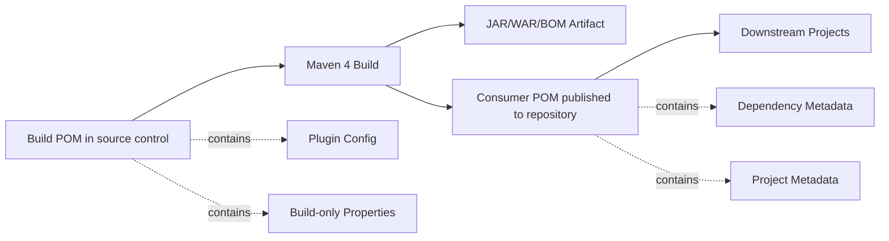
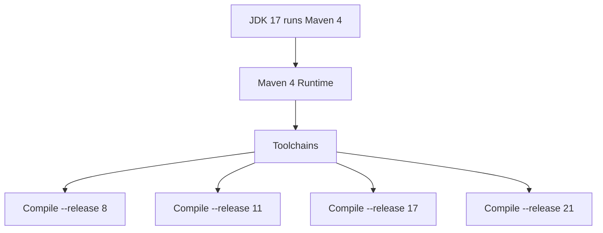
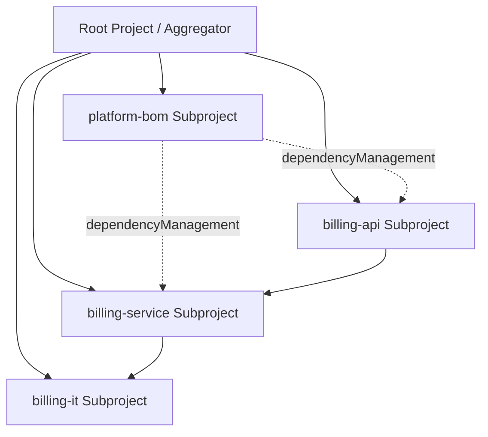
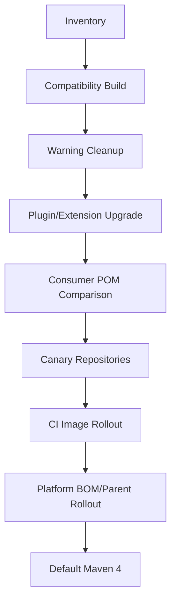

# Part 038 — Maven 4 Upgrade and New Model

> Maven 4 bukan sekadar “Maven 3 dengan versi baru”. Ia memperjelas pemisahan antara POM yang dipakai untuk build dan POM yang dikonsumsi downstream, memperbaiki model multi-project, memperketat validasi, dan membuka ruang fitur baru. Untuk enterprise, Maven 4 adalah migration program, bukan upgrade command.

Status faktual saat materi ini ditulis: dokumentasi rilis Maven menyatakan Maven 4.0+ masih “not yet GA”, dengan Maven `4.0.0-rc-5` sebagai release candidate yang membutuhkan Java 17 untuk menjalankan Maven. Maven 3.9.x tetap menjadi baseline produksi yang aman untuk banyak organisasi sampai Maven 4 GA dan kompatibilitas plugin/fleet tervalidasi.

Part ini mengajarkan cara berpikir tentang Maven 4:

- apa yang berubah di model,
- apa yang tetap kompatibel,
- apa yang perlu dimigrasi,
- bagaimana melakukan rollout aman,
- bagaimana menghindari “upgrade theatre” yang hanya mengganti binary tanpa memahami behavior.

---

## 1. Core Mental Model: Maven 4 Separates Build Intent from Consumer Contract

Di Maven 3, POM yang ada di source control sering juga menjadi POM yang dipublikasikan dan dikonsumsi downstream. Akibatnya, satu file harus melayani dua audience:

1. build system internal,
2. downstream dependency consumer.

Masalahnya, build POM sering berisi hal yang tidak relevan untuk consumer:

- plugin configuration,
- build profiles,
- properties internal,
- generator setup,
- test plugin setup,
- repository/deployment detail,
- corporate parent detail.

Maven 4 memperjelas konsep:



Mental model:

> Build POM menjawab “bagaimana project ini dibangun”. Consumer POM menjawab “bagaimana project lain mengonsumsi artifact ini”.

Ini sangat penting untuk enterprise karena build internals tidak seharusnya bocor ke downstream dependency graph.

---

## 2. Maven 4 Compatibility Principle

Maven 4 tetap bisa membangun project Maven 3 dengan model version `4.0.0`. Dokumentasi Maven 4 menyatakan tidak perlu mengubah build POM ke model `4.1.0` jika project tidak membutuhkan fitur baru.

Artinya migration strategy terbaik bukan:

```text
Convert all POMs to 4.1.0 immediately.
```

Lebih baik:

```text
1. Run existing Maven 3 projects under Maven 4 RC/GA in compatibility mode.
2. Fix validation and plugin compatibility issues.
3. Adopt new model features only where they solve concrete problems.
4. Publish and compare consumer POMs.
5. Roll out by repository class, not all at once.
```

---

## 3. Maven 4 Requires Java 17 Runtime

Maven runtime JDK berbeda dari project target JDK.

Maven 4 membutuhkan Java 17 untuk menjalankan Maven. Tetapi project yang dibangun bisa saja menargetkan Java lain melalui compiler `--release` atau toolchains, selama plugin dan toolchain setup mendukung.



Common misconception:

> “Kalau Maven 4 butuh Java 17, semua aplikasi harus upgrade ke Java 17.”

Tidak selalu. Yang wajib Java 17 adalah runtime Maven, bukan otomatis bytecode aplikasi. Namun plugin lama, annotation processor lama, dan build script lama bisa tidak kompatibel dengan JDK 17 runtime. Itu harus diuji.

Enterprise implication:

- CI image harus punya JDK 17 untuk menjalankan Maven 4.
- Toolchains harus disiapkan jika project menargetkan Java 8/11/17/21 secara berbeda.
- Plugin compatibility harus diuji dengan JDK 17 runtime.
- Build wrapper harus mengunci Maven distribution yang dipakai.

---

## 4. Model Version 4.1.0

Maven 4 memperkenalkan model version `4.1.0` untuk build POM. Namespace-nya berbeda dari model lama.

Namun jangan mengubah model version hanya demi “terlihat modern”. Model version harus dinaikkan ketika kamu membutuhkan fitur model baru.

Decision table:

| Situation | Keep `4.0.0` | Move to `4.1.0` |
|---|---:|---:|
| Project Maven 3 stable | Yes | No |
| Hanya ingin test Maven 4 runtime | Yes | No |
| Ingin pakai `<subprojects>` | No | Yes |
| Ingin pakai packaging `bom` sebagai build POM | No | Yes |
| Ingin pakai Maven 4 model-only feature | No | Yes |
| Library dipakai banyak downstream lama | Prefer Yes | Only after consumer POM validation |

Contoh Maven 3-compatible POM tetap valid:

```xml
<project xmlns="http://maven.apache.org/POM/4.0.0"
         xmlns:xsi="http://www.w3.org/2001/XMLSchema-instance"
         xsi:schemaLocation="http://maven.apache.org/POM/4.0.0 https://maven.apache.org/xsd/maven-4.0.0.xsd">
  <modelVersion>4.0.0</modelVersion>
  <groupId>com.acme.platform</groupId>
  <artifactId>billing-api</artifactId>
  <version>1.8.0</version>
</project>
```

Konsep Maven 4 build POM 4.1.0:

```xml
<project xmlns="http://maven.apache.org/POM/4.1.0"
         xmlns:xsi="http://www.w3.org/2001/XMLSchema-instance"
         xsi:schemaLocation="http://maven.apache.org/POM/4.1.0 https://maven.apache.org/xsd/maven-4.1.0.xsd">
  <modelVersion>4.1.0</modelVersion>
  <groupId>com.acme.platform</groupId>
  <artifactId>platform-root</artifactId>
  <version>1.0.0</version>
  <packaging>pom</packaging>

  <subprojects>
    <subproject>platform-bom</subproject>
    <subproject>billing-api</subproject>
    <subproject>billing-service</subproject>
  </subprojects>
</project>
```

The point is not syntax. The point is model semantics.

---

## 5. Modules Become Subprojects

Maven 3 documentation uses “multi-module”. Maven 4 documentation moves toward “multi-project” and “subprojects”. The old `<modules>` element remains usable, but Maven 4 model `4.1.0` introduces `<subprojects>`.

Why this matters:

- “module” is overloaded in Java because Java Platform Module System also uses module.
- “subproject” better describes independent Maven projects inside one build tree.
- It clarifies that reactor builds projects, not Java modules.

Mental model:



Maven reactor still performs the same conceptual jobs:

1. collect subprojects,
2. sort build order,
3. select subprojects,
4. build selected subprojects.

The migration is more about clearer language and model evolution than abandoning reactor reasoning.

---

## 6. New `bom` Packaging

In Maven 3, BOMs are usually `pom` packaging with `dependencyManagement`. This works, but semantically a parent POM and a BOM both look like packaging `pom`.

Maven 4 introduces dedicated `bom` packaging in the new model to separate roles:

- parent POM: inheritance/build policy,
- aggregator POM: project collection,
- BOM: dependency version alignment.

This is a good correction because many enterprise Maven systems accidentally merge these roles.

Old pattern:

```xml
<project>
  <modelVersion>4.0.0</modelVersion>
  <groupId>com.acme.platform</groupId>
  <artifactId>acme-platform-bom</artifactId>
  <version>2026.07.0</version>
  <packaging>pom</packaging>

  <dependencyManagement>
    <dependencies>
      <dependency>
        <groupId>org.slf4j</groupId>
        <artifactId>slf4j-api</artifactId>
        <version>${slf4j.version}</version>
      </dependency>
    </dependencies>
  </dependencyManagement>
</project>
```

Maven 4 model direction:

```xml
<project xmlns="http://maven.apache.org/POM/4.1.0">
  <modelVersion>4.1.0</modelVersion>
  <groupId>com.acme.platform</groupId>
  <artifactId>acme-platform-bom</artifactId>
  <version>2026.07.0</version>
  <packaging>bom</packaging>

  <dependencyManagement>
    <dependencies>
      <dependency>
        <groupId>org.slf4j</groupId>
        <artifactId>slf4j-api</artifactId>
        <version>${slf4j.version}</version>
      </dependency>
    </dependencies>
  </dependencyManagement>
</project>
```

Enterprise rule:

> Maven 4 `bom` packaging is a chance to clean architecture, not a reason to rename every POM.

Adopt it first in platform/BOM repositories where the semantic win is clear.

---

## 7. Consumer POM: Why It Matters

A downstream project usually needs dependency metadata, not your build machinery.

Consumer POM should preserve what consumers need:

- coordinates,
- dependency graph information,
- dependency management where relevant,
- project metadata needed for consumption,
- repository information where appropriate.

Consumer POM should not force downstream consumers to understand:

- your compiler plugin config,
- your test plugin config,
- your internal source generation setup,
- your build-only properties,
- your CI-only profiles.

This reduces accidental coupling.

### Failure Mode Maven 4 Tries to Reduce

Company publishes library `com.acme:case-client` with a POM that leaks internal plugin/profile/build properties. Downstream service imports it and suddenly model resolution or profile interpolation behaves strangely.

Root problem:

> build-only details leaked into consumer contract.

Consumer POM separation helps reduce that class of leak.

---

## 8. Stricter Validation

Maven 4 is expected to be stricter about model correctness and plugin validation. This is good, but it can surprise old builds that have accumulated warnings for years.

Common categories:

- missing plugin versions,
- malformed POM elements,
- duplicate dependency declarations,
- deprecated model features,
- ambiguous profile activation,
- invalid parent/relativePath setup,
- plugin using internal Maven APIs,
- extensions relying on Maven 3 internals.

Upgrade mindset:

> Treat Maven 4 warnings as migration inventory, not noise.

Pipeline approach:

```bash
# First inventory, do not immediately enforce fleet-wide
mvn -V -e -DskipTests validate
mvn -V -e help:effective-pom
mvn -V -e dependency:tree
```

Then classify warnings:

| Warning Type | Action |
|---|---|
| Missing plugin version | Pin in parent `pluginManagement` |
| Duplicate dependency | Remove duplicate or move version to BOM |
| Deprecated Maven 4 model feature | Plan POM migration |
| Plugin validation warning | Upgrade plugin or report issue |
| Extension compatibility warning | Test new extension version |
| Consumer POM warning | Compare published POM metadata |

---

## 9. Maven Upgrade Tool

Maven 4 release candidate documentation mentions a built-in migration/upgrade tool beginning from the RC line. Treat such tool as an assistant, not an authority.

Safe use pattern:

```text
1. Create migration branch.
2. Run upgrade tool on a small representative repository.
3. Review diff manually.
4. Run Maven 3 build if compatibility is expected.
5. Run Maven 4 build.
6. Compare effective POM.
7. Compare dependency tree.
8. Compare produced artifact checksum/content.
9. Compare published consumer POM.
10. Only then generalize.
```

Never run an upgrade tool across hundreds of repos and auto-merge the result.

---

## 10. Enterprise Migration Strategy

Do not migrate by enthusiasm. Migrate by risk class.

### 10.1 Repository Classes

| Class | Example | Risk | Migration Order |
|---|---|---:|---:|
| Build playground | sample/internal experiments | Low | 1 |
| Leaf service | internal deployable, few consumers | Medium | 2 |
| Internal library | consumed by several services | Medium-high | 3 |
| Platform BOM | imported by many projects | High | 4 |
| Corporate parent POM | inherited by many projects | Very high | 5 |
| Custom Maven plugin/extension | changes build behavior | Very high | Parallel validation |
| Public artifact | external consumers | Critical | Last |

### 10.2 Migration Phases



### 10.3 Inventory Script Ideas

At minimum collect:

```bash
find . -name pom.xml -maxdepth 5 -print
mvn -version
mvn -q help:effective-pom -Doutput=target/effective-pom.xml
mvn -q help:effective-settings -Doutput=target/effective-settings.xml
mvn -q dependency:tree -DoutputFile=target/dependency-tree.txt
```

Fleet-level inventory should detect:

- Maven wrapper version,
- parent POM coordinates,
- plugin versions,
- plugin without version,
- Maven Enforcer rules,
- `.mvn/extensions.xml`,
- `.mvn/maven.config`,
- use of `system` scope,
- use of `LATEST`/`RELEASE`,
- custom repositories in POM,
- old plugins using Maven internals,
- custom packaging,
- custom lifecycle extension,
- release plugin usage,
- flatten plugin usage,
- CI-friendly versions usage.

---

## 11. Maven Wrapper Strategy

For enterprise migration, Maven Wrapper is not optional hygiene; it is build runtime pinning.

Bad:

```bash
mvn verify
```

Better:

```bash
./mvnw -V verify
```

Why:

- developer and CI use same Maven distribution,
- upgrade can be branch-specific,
- canary projects can move first,
- rollback is changing wrapper distribution, not reinstalling global Maven.

Suggested rollout:

```text
Phase 1: Ensure all repos have Maven Wrapper.
Phase 2: Pin Maven 3.9.x latest approved baseline.
Phase 3: Add optional Maven 4 CI job, non-blocking.
Phase 4: Make Maven 4 CI blocking for canary repos.
Phase 5: Roll to leaf services.
Phase 6: Roll to libraries.
Phase 7: Roll to parent/BOM repos.
```

---

## 12. Plugin Compatibility

Maven core and Maven plugins are released independently. Upgrading Maven does not automatically upgrade plugins.

Migration checklist:

```text
[ ] Pin all plugin versions.
[ ] Upgrade ancient plugins before Maven 4 migration.
[ ] Remove plugins using unsupported internal assumptions.
[ ] Test plugin goals used in lifecycle, not only mvn validate.
[ ] Test site/report plugins if organization uses them.
[ ] Test release/deploy flows separately.
[ ] Test custom plugins with Maven Plugin Testing/Invoker.
```

High-risk plugins:

- old release plugin configuration,
- old compiler/surefire/failsafe plugins,
- custom packaging plugins,
- plugins with `<extensions>true</extensions>`,
- plugins that inspect MavenProject internals,
- custom company plugins,
- old codegen plugins,
- site/reporting plugins.

---

## 13. Extension Compatibility

Part 037 matters here. Extensions are more sensitive than plugins because they run closer to Maven runtime.

Check:

```bash
find .mvn -type f -maxdepth 2 -print
cat .mvn/extensions.xml
mvn -X validate
```

If you have internal extension:

- build it and test it with Maven 3.9.x,
- build it and test it with Maven 4 RC/GA,
- verify classloading behavior,
- test parallel build,
- test clean-room repository,
- test offline mode,
- test failure handling.

Do not roll Maven 4 globally until extension compatibility is proven.

---

## 14. Consumer POM Comparison Workflow

For a library or BOM, the key question is not “does `mvn package` pass?”

The key question is:

> Does the artifact published under Maven 4 mean the same thing to consumers?

Workflow:

```bash
# Maven 3 build
./mvnw -V -DskipTests clean deploy -DaltDeploymentRepository=local::file:target/repo-m3

# Maven 4 build, using Maven 4 wrapper branch or explicit wrapper
./mvnw -V -DskipTests clean deploy -DaltDeploymentRepository=local::file:target/repo-m4

# Compare generated POMs
find target/repo-m3 -name "*.pom" -print | sort > target/poms-m3.txt
find target/repo-m4 -name "*.pom" -print | sort > target/poms-m4.txt
```

Then compare:

- coordinates,
- dependency declarations,
- dependencyManagement,
- optional/exclusions,
- scopes,
- repositories,
- parent references,
- properties that consumers rely on,
- relocation/distribution metadata.

For platform BOMs, also create a downstream fixture project that imports the BOM and resolves dependency tree.

```xml
<dependencyManagement>
  <dependencies>
    <dependency>
      <groupId>com.acme.platform</groupId>
      <artifactId>acme-platform-bom</artifactId>
      <version>2026.07.0-maven4-candidate</version>
      <type>pom</type>
      <scope>import</scope>
    </dependency>
  </dependencies>
</dependencyManagement>
```

Then:

```bash
mvn -U dependency:tree
mvn -U help:effective-pom
```

---

## 15. Build POM Cleanup Before Maven 4

Maven 4 migration is easier if Maven 3 builds are already clean.

Clean these first:

### 15.1 Pin Plugin Versions

Bad:

```xml
<plugin>
  <artifactId>maven-compiler-plugin</artifactId>
</plugin>
```

Good:

```xml
<pluginManagement>
  <plugins>
    <plugin>
      <groupId>org.apache.maven.plugins</groupId>
      <artifactId>maven-compiler-plugin</artifactId>
      <version>${maven.compiler.plugin.version}</version>
    </plugin>
  </plugins>
</pluginManagement>
```

### 15.2 Remove Dynamic Versions

Bad:

```xml
<version>LATEST</version>
```

Bad for release:

```xml
<version>1.2.3-SNAPSHOT</version>
```

Good:

```xml
<version>1.2.3</version>
```

### 15.3 Separate Parent, Aggregator, BOM

Bad:

```text
one root POM does everything:
- parent inheritance
- module aggregation
- BOM version alignment
- release metadata
- plugin policy
- repository policy
```

Better:

```text
platform-root/         aggregator
platform-parent/       inherited build policy
platform-bom/          dependency version alignment
service-a/             deployable
library-b/             reusable artifact
```

### 15.4 Remove Environment-Specific Build Outputs

Bad:

```bash
mvn package -Pprod
mvn package -Pqa
```

producing different artifacts for each environment.

Better:

```text
same artifact + runtime configuration injection
```

---

## 16. CI Rollout Pattern

Example GitHub Actions matrix concept:

```yaml
name: Maven Compatibility

on:
  pull_request:
  push:
    branches: [ main ]

jobs:
  maven3:
    runs-on: ubuntu-latest
    steps:
      - uses: actions/checkout@v4
      - uses: actions/setup-java@v4
        with:
          distribution: temurin
          java-version: '17'
          cache: maven
      - run: ./mvnw -V -B verify

  maven4-compat:
    runs-on: ubuntu-latest
    continue-on-error: true
    steps:
      - uses: actions/checkout@v4
      - uses: actions/setup-java@v4
        with:
          distribution: temurin
          java-version: '17'
          cache: maven
      - run: ./mvnw -V -B -DskipITs verify
```

Eventually:

```text
maven4-compat non-blocking -> blocking for canary -> blocking for fleet -> default wrapper.
```

---

## 17. Rollback Strategy

A serious Maven 4 rollout must have rollback.

Rollback surfaces:

| Surface | Rollback |
|---|---|
| Maven wrapper | revert wrapper distribution URL/version |
| CI image | pin previous image tag |
| Parent POM | release previous parent version |
| BOM | release patched old BOM line |
| Plugin upgrade | revert pluginManagement version |
| Extension | disable `.mvn/extensions.xml` or downgrade extension |
| Model 4.1.0 migration | revert POM model change if not required |
| Consumer POM issue | stop publish, restore last known good artifact |

Never combine all of these in one release.

Bad migration PR:

```text
- Upgrade Maven to 4
- Upgrade Java from 11 to 21
- Rewrite parent POM
- Change BOM structure
- Change CI image
- Upgrade all plugins
- Convert modules to subprojects
- Enable build cache
```

Good migration sequence:

```text
PR 1: Pin plugin versions and remove warnings under Maven 3.
PR 2: Upgrade CI JDK runtime to 17 while still using Maven 3.
PR 3: Add Maven 4 non-blocking compatibility job.
PR 4: Fix plugin/extension warnings.
PR 5: Make Maven 4 blocking for one canary service.
PR 6: Roll wrapper to Maven 4 for low-risk repos.
PR 7: Adopt Maven 4 model features selectively.
```

---

## 18. Migration Failure Playbook

### Case 1: Build Fails Before Project Starts

Likely:

- Maven runtime JDK wrong,
- wrapper downloads wrong distribution,
- `.mvn/extensions.xml` incompatible,
- repository cannot resolve core extension.

Commands:

```bash
./mvnw -version
java -version
cat .mvn/extensions.xml || true
./mvnw -e -X validate
```

### Case 2: Plugin Fails Under Maven 4

Likely:

- old plugin uses Maven internals,
- plugin needs newer version,
- plugin dependency conflict,
- JDK 17 runtime incompatibility.

Commands:

```bash
./mvnw -e -X -DskipTests validate
./mvnw help:effective-pom -Doutput=target/effective-pom.xml
```

Action:

- upgrade plugin,
- pin plugin version,
- isolate plugin execution,
- create minimal reproduction.

### Case 3: Tests Fail Only Under Maven 4

Likely:

- Surefire/Failsafe version old,
- JDK 17 runtime differences,
- argLine/module options,
- toolchain not applied,
- environment differences.

Commands:

```bash
./mvnw -V -Dtest=SpecificTest test
./mvnw -V -DskipITs=false verify
```

### Case 4: Artifact Differs

Likely:

- consumer POM generation changed,
- archive timestamp/config changed,
- plugin version changed,
- generated source changed,
- build profile activation changed.

Commands:

```bash
jar tf target/*.jar | sort > target/jar-contents.txt
sha256sum target/*.{jar,pom} || true
```

### Case 5: Downstream Cannot Consume Artifact

Likely:

- consumer POM changed,
- dependencyManagement lost property,
- scope/exclusion changed,
- parent reference leaked,
- repository metadata issue.

Action:

- compare published POM,
- create downstream fixture,
- resolve dependency tree under Maven 3 and Maven 4,
- block release if semantic difference is not intentional.

---

## 19. When to Adopt Maven 4 Features

Adoption should be problem-driven.

| Feature Area | Adopt When | Avoid When |
|---|---|---|
| Maven 4 runtime | You need compatibility/future readiness | Critical release window without validation |
| Model 4.1.0 | You need new model features | Project builds fine and downstream compatibility is priority |
| `<subprojects>` | You want clearer multi-project model | Team/tooling still assumes `<modules>` heavily |
| `bom` packaging | You operate serious platform BOMs | You have simple single-project apps |
| Consumer POM behavior | You publish libraries/BOMs | Internal deployable only, no downstream consumption |
| Upgrade tool | You want guided cleanup | You cannot review generated diffs |

---

## 20. Enterprise Maven 4 Readiness Checklist

```text
Runtime
[ ] CI can run Java 17 for Maven runtime.
[ ] Maven Wrapper exists in all repos.
[ ] Maven 3 baseline is current and supported.
[ ] Maven 4 candidate version is pinned, not floating.

POM Hygiene
[ ] Plugin versions pinned.
[ ] Parent/BOM/aggregator roles separated where necessary.
[ ] Dynamic versions removed.
[ ] System scope removed or explicitly justified.
[ ] Custom repositories audited.
[ ] Profiles audited.

Plugins
[ ] Compiler plugin works under Maven 4 runtime.
[ ] Surefire/Failsafe work under Maven 4 runtime.
[ ] Deploy/release plugins tested.
[ ] Codegen plugins tested.
[ ] Site/reporting plugins tested if used.
[ ] Custom plugins tested.

Extensions
[ ] .mvn/extensions.xml inventoried.
[ ] Build extensions inventoried.
[ ] Plugin extensions=true inventoried.
[ ] Internal extensions tested against Maven 4.
[ ] Escape hatch documented.

Artifacts
[ ] JAR/WAR content compared.
[ ] Generated POM compared.
[ ] BOM import fixture tested.
[ ] Downstream dependency tree tested.
[ ] Reproducibility checked.

Rollout
[ ] Canary repos selected.
[ ] Non-blocking Maven 4 CI job exists.
[ ] Rollback plan exists.
[ ] Migration diff reviewed.
[ ] Release freeze avoided.
```

---

## 21. Senior Engineer Heuristic

Maven 4 migration is not about chasing the newest version. It is about strengthening the build contract.

Ask these questions:

1. Did the migration make build behavior more explicit?
2. Did it reduce build-only metadata leaking to consumers?
3. Did it preserve downstream dependency semantics?
4. Did it reduce warnings or merely hide them?
5. Did it separate runtime Maven upgrade from application Java upgrade?
6. Did it give CI and developers the same Maven runtime?
7. Can we rollback one layer at a time?

If the answer is no, the migration is not done.

---

## 22. What You Should Be Able to Do Now

After this part, you should be able to:

- explain Maven 4 as a model/runtime evolution,
- distinguish Maven runtime JDK from project target JDK,
- decide whether to keep model `4.0.0` or adopt `4.1.0`,
- understand build POM vs consumer POM,
- reason about `<modules>` vs `<subprojects>`,
- use Maven 4 `bom` packaging selectively,
- build an enterprise Maven 4 migration plan,
- test plugin/extension compatibility,
- compare artifacts and consumer POMs across Maven versions,
- design rollback paths.

Part berikutnya akan membandingkan Maven dengan Gradle, Bazel, dan build-system lain. Fokusnya bukan debat fanboy tool, tetapi tradeoff arsitektural: determinism, convention, extensibility, performance, enterprise governance, developer experience, dan organizational fit.

---

## References

- Apache Maven — What's new in Maven 4?: https://maven.apache.org/whatsnewinmaven4.html
- Apache Maven — Starting with Maven 4: https://maven.apache.org/guides/mini/guide-migration-to-mvn4.html
- Apache Maven — Maven Releases History: https://maven.apache.org/docs/history.html
- Apache Maven — Maven 4.0.0-rc-5 Release Notes: https://maven.apache.org/docs/4.0.0-rc-5/release-notes.html
- Apache Maven — Guide to Working with Multiple Subprojects in Maven 4: https://maven.apache.org/guides/mini/guide-multiple-subprojects-4.html
