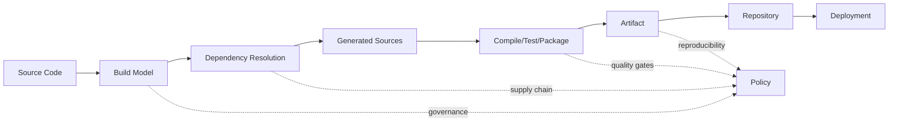
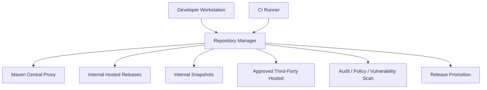
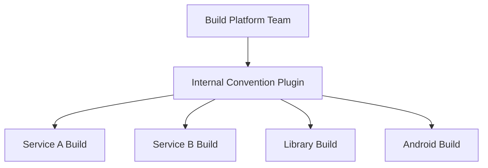
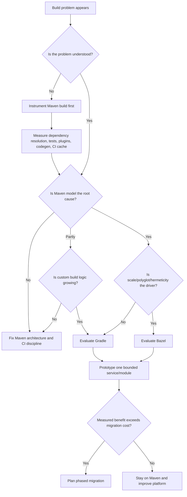
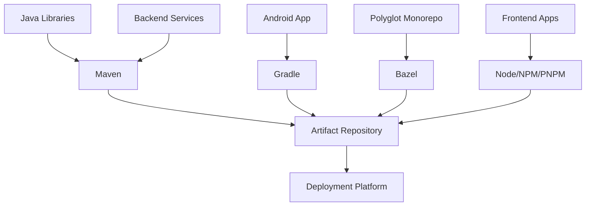
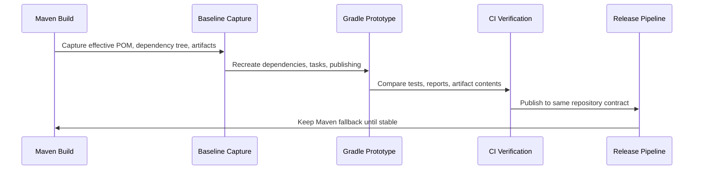
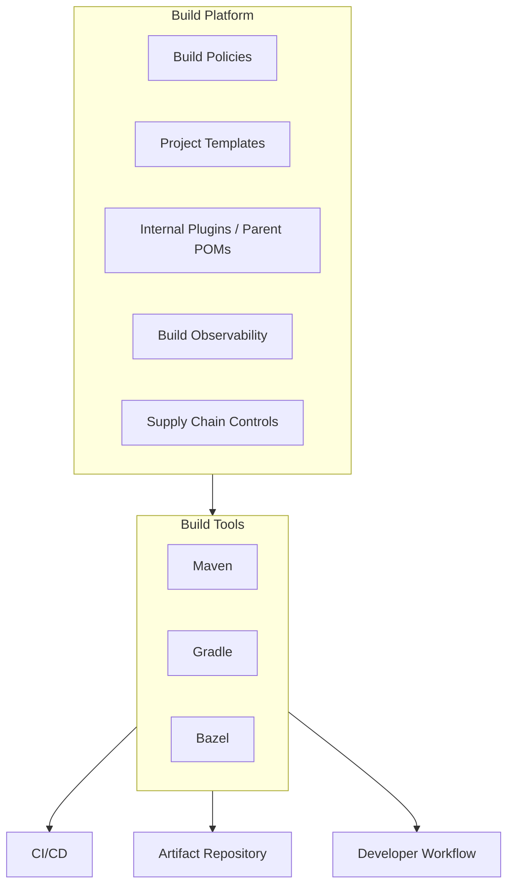

# Part 039 — Maven vs Gradle, Bazel, and Build-System Tradeoffs

This part is not a popularity contest.

A senior engineer should not ask:

> Which build tool is the best?

That question is too shallow.

The better question is:

> Given our codebase shape, team structure, release model, CI constraints, compliance requirements, and dependency graph, which build system failure modes are we willing to own?

Maven, Gradle, Bazel, and similar systems are not only command-line tools. They encode assumptions about:

- how a project is modeled;
- how dependency versions are selected;
- how build work is discovered;
- how incremental execution is achieved;
- how teams customize behavior;
- how reproducibility is enforced;
- how CI/CD performs at scale;
- how much build logic is allowed to become code.

Maven's default tradeoff is **declarative convention and ecosystem compatibility**.

Gradle's default tradeoff is **programmable flexibility and task graph expressiveness**.

Bazel's default tradeoff is **explicit hermetic graph modeling and scalable caching**.

None of those tradeoffs is universally superior.

They optimize different constraints.

---

## 1. The Build-System Decision Is an Architecture Decision

A build system is part of your architecture because it controls the transition from **source state** to **runtime artifact**.



A weak build system decision creates downstream damage:

- slow feedback loops;
- dependency conflicts;
- unrepeatable releases;
- CI-only failures;
- hidden environment coupling;
- inconsistent local vs CI behavior;
- plugin sprawl;
- difficult onboarding;
- unclear artifact ownership;
- release pipeline fragility.

A good build system decision makes the common path boring and the exceptional path explicit.

---

## 2. What Maven Optimizes For

Maven is built around the **Project Object Model**.

The POM is the central declaration of project identity, dependencies, plugins, metadata, and build configuration.

Maven optimizes for a world where:

- project shape follows convention;
- artifact identity is expressed as coordinates;
- dependency metadata flows through repositories;
- lifecycle phases are standardized;
- plugins attach behavior to known phases;
- teams prefer declarative build policy over arbitrary scripts;
- Java/JVM library publishing compatibility matters.

The Maven model is strong when the project can be explained as:

```txt
POM + lifecycle + plugins + dependencies + repositories = artifact
```

This is why Maven remains strong for:

- Java libraries;
- enterprise backend services;
- multi-module JVM systems;
- regulated release workflows;
- organizations with strict artifact governance;
- teams that need predictable onboarding;
- dependency/BOM-driven platform management;
- repository-manager-centered supply chains.

Maven's biggest advantage is not syntax.

It is **shared convention**.

A developer can open an unfamiliar Maven project and usually infer:

```txt
src/main/java       -> production code
src/test/java       -> unit tests
pom.xml             -> build contract
mvn test            -> unit test path
mvn verify          -> integration quality path
mvn deploy          -> publish path
```

That convention has operational value.

---

## 3. What Gradle Optimizes For

Gradle is built around a **task graph** and a programmable build model.

Instead of Maven's fixed lifecycle-first model, Gradle lets builds define and wire tasks with a richer programming surface.

Gradle optimizes for a world where:

- build behavior must be customized heavily;
- multiple JVM languages or ecosystems coexist;
- build logic benefits from real programming abstractions;
- incremental builds and caching are first-class concerns;
- Android/Kotlin ecosystems matter;
- plugin authors need expressive APIs;
- conventions are useful, but not enough.

Gradle is strong when the project shape is not easily captured by Maven's standard lifecycle.

Examples:

- Android projects;
- complex Kotlin builds;
- generated-code-heavy systems;
- cross-language builds with custom tasks;
- build orchestration beyond compile/test/package;
- advanced incremental build behavior;
- large organizations that can invest in build engineering.

But Gradle flexibility creates a governance burden.

A Maven POM can become messy.

A Gradle build can become an application.

That is powerful, but it changes the risk profile.

---

## 4. What Bazel Optimizes For

Bazel is built around explicit build targets, dependency declarations, sandboxing, and caching.

Bazel optimizes for a world where:

- the codebase is very large;
- incremental correctness matters deeply;
- remote caching/execution can deliver high leverage;
- builds should be hermetic;
- source-to-artifact dependencies must be explicit;
- many languages coexist;
- monorepo scale is a real constraint;
- teams can afford specialized build engineering.

Bazel's strongest claim is not that it is easier.

It usually is not easier at first.

Its strongest claim is:

> If you model the graph explicitly and control inputs strictly, the build system can cache, parallelize, and reproduce work at much larger scale.

That is extremely valuable in some organizations.

It is expensive overhead in others.

---

## 5. Comparison Matrix

| Dimension | Maven | Gradle | Bazel |
|---|---|---|---|
| Primary model | POM + lifecycle + plugins | Task graph + build scripts | Explicit targets + rules |
| Default style | Declarative XML | Programmable DSL | Declarative-ish BUILD files with rules |
| JVM ecosystem compatibility | Excellent | Excellent | Good but requires rules and integration work |
| Maven Central publishing | Native | Strong | Possible, less natural |
| Dependency management | Mature transitive dependency model, BOMs | Rich dependency management, platforms, constraints | External dependency rules; often more explicit/pinned |
| Incremental build | Limited by plugin/lifecycle model | Stronger task-level incremental model | Strong graph/caching/sandbox model |
| Remote cache/execution | Not native in core Maven | Available through Gradle ecosystem | Core architectural strength |
| Learning curve | Low to moderate | Moderate | High |
| Custom behavior | Plugin-based; constrained | Very flexible | Rule-based; powerful but specialized |
| Enterprise governance | Strong via parent POM, BOM, repository manager, Enforcer | Strong if convention plugins are disciplined | Strong if build platform team exists |
| Monorepo fit | Works for moderate multi-module; can hurt at very large scale | Better with careful architecture | Strong fit when investment is justified |
| Polyglot fit | JVM-centered | Better, especially JVM + Android/Kotlin | Strong polyglot story |
| Common failure mode | Hidden inherited config, dependency mediation surprises | Build logic sprawl, configuration performance issues | Migration cost, rule complexity, ecosystem impedance |

The wrong conclusion is:

> Bazel is better because it is more scalable.

The correct conclusion is:

> Bazel may be better if scale and reproducibility constraints justify explicit graph modeling and build-platform investment.

The wrong conclusion is:

> Maven is old, therefore bad.

The correct conclusion is:

> Maven is boring by design. Boring is valuable when convention, ecosystem compatibility, and governance matter more than custom build behavior.

---

## 6. Maven's Strategic Strengths

### 6.1 Maven Has a Stable Artifact Contract

Maven coordinates are a durable publishing contract:

```txt
groupId:artifactId:version[:classifier][:type]
```

That contract makes Maven strong for library ecosystems.

A Maven-published artifact can be consumed by Maven, Gradle, SBT, Bazel integrations, IDEs, scanners, repository managers, and dependency analysis tools.

This matters in enterprise systems because artifact identity must survive:

- team boundaries;
- repository manager policies;
- vulnerability scanning;
- release promotion;
- rollback;
- audit;
- customer support;
- long-term maintenance.

### 6.2 Maven Encourages Shared Shape

Maven makes it harder to invent a unique build architecture per module.

That is not only a limitation.

It is a governance feature.

In a large organization, a build system should reduce the number of questions a developer must ask before contributing.

Maven answers many of them through convention.

### 6.3 Maven Works Well With Repository Managers

Maven's resolution model fits naturally with:

- Maven Central;
- Nexus Repository;
- JFrog Artifactory;
- internal hosted repositories;
- proxy repositories;
- release vs snapshot repositories;
- staging and promotion;
- BOM-controlled platforms.

That matters because enterprise dependency governance usually lives at repository boundaries.



### 6.4 Maven Is Easy to Standardize

A platform team can standardize Maven with:

- corporate parent POM;
- internal BOM;
- Maven Enforcer rules;
- repository manager mirror;
- CI settings template;
- Maven Wrapper policy;
- plugin version policy;
- dependency convergence rules;
- release and deploy pipeline.

Standardization is Maven's home territory.

---

## 7. Maven's Strategic Weaknesses

Maven's weaknesses become visible when the build no longer fits the lifecycle model.

### 7.1 Lifecycle Rigidity

Maven's lifecycle is predictable, but not infinitely expressive.

When a build needs many custom steps, Maven tends to accumulate:

- profile-specific behavior;
- plugin executions bound to surprising phases;
- generated source hacks;
- `antrun` scripts;
- shell scripts around Maven;
- CI logic that compensates for POM limitations.

That is a smell.

A Maven build should not become a hidden workflow engine.

### 7.2 Weak Native Incrementality

Maven generally runs phase-driven plugin goals.

Some plugins support incremental behavior, but Maven's core model does not provide the same task-level incremental graph semantics as Gradle or Bazel.

For small and medium builds, this is acceptable.

For massive builds, it can become a cost center.

### 7.3 Configuration Is Distributed

A Maven build may be shaped by:

- Super POM;
- parent POM;
- aggregator POM;
- BOM imports;
- active profiles;
- `settings.xml`;
- CLI properties;
- plugin defaults;
- lifecycle default bindings;
- environment variables;
- repository metadata.

This is manageable when disciplined.

It becomes painful when nobody owns the build model.

### 7.4 XML Verbosity Is Not the Real Problem

Many engineers complain that Maven is XML-heavy.

That complaint is shallow.

Maven's real limitation is not syntax.

It is the combination of:

- phase-oriented lifecycle;
- plugin-bound customization;
- hidden inherited configuration;
- limited first-class incremental graph modeling.

Changing XML to YAML would not fix those issues.

---

## 8. Gradle's Strategic Strengths

Gradle shines when build behavior is part of the product engineering surface.

### 8.1 Rich Task Graph

Gradle tasks declare inputs, outputs, dependencies, and actions.

That makes Gradle more natural when build steps are not simple lifecycle phases.

### 8.2 Convention Plugins

Gradle can centralize build policy through convention plugins.

This is analogous to Maven parent POMs, but more programmable.

A well-run Gradle organization does not let every project write arbitrary scripts.

It creates internal build plugins.



The plugin becomes the policy distribution mechanism.

### 8.3 Better Fit for Complex Generated Workflows

Gradle often handles complex generated-source workflows more cleanly because tasks can model inputs and outputs explicitly.

This helps with:

- OpenAPI generation;
- Protobuf generation;
- GraphQL generation;
- frontend-backend build integration;
- multi-step packaging;
- code transformation;
- custom validation.

### 8.4 Better Fit for Android/Kotlin Ecosystems

For Android, Gradle is effectively the standard path.

For Kotlin-heavy builds, Gradle often has a more native ecosystem.

That alone can decide the build-system choice.

---

## 9. Gradle's Strategic Weaknesses

Gradle is powerful, but power creates entropy.

### 9.1 Build Logic Can Become Product Logic

Because Gradle scripts are programmable, teams can create opaque build behavior.

Symptoms:

- hidden logic in `build.gradle`;
- conditional behavior based on environment;
- custom tasks without clear inputs/outputs;
- build scripts calling external services;
- duplicated task configuration;
- inconsistent project conventions;
- slow configuration phase;
- difficult debugging for non-build engineers.

A Gradle organization needs build engineering discipline.

Without it, Gradle becomes a distributed scripting platform.

### 9.2 Governance Must Be Designed

Maven has built-in convention gravity.

Gradle requires the organization to create convention gravity.

That usually means:

- version catalogs;
- platforms;
- convention plugins;
- plugin management;
- dependency locking;
- build scans or comparable observability;
- CI cache policy;
- central plugin repositories;
- strict review of custom task behavior.

Gradle can be more scalable than Maven, but not automatically.

---

## 10. Bazel's Strategic Strengths

Bazel shines when the build graph itself is the bottleneck.

### 10.1 Explicit Targets

Bazel models build units as explicit targets.

This makes dependency edges visible and analyzable.

That visibility enables:

- precise incremental builds;
- aggressive parallelism;
- remote caching;
- remote execution;
- graph analysis;
- hermetic inputs;
- reproducible outputs.

### 10.2 Strong Monorepo Fit

In a monorepo, the build system must answer:

> Given this change, what exactly needs to be rebuilt and retested?

Bazel is designed for this style of question.

Maven can approximate it with reactor slicing.

Gradle can support it with task graph and caching.

Bazel makes it central.

### 10.3 Better Polyglot Scaling Story

If one repository contains:

- Java;
- Go;
- C++;
- Python;
- JavaScript;
- Protobuf;
- container images;
- generated API contracts;
- platform tooling;

then a JVM-centered build system may become awkward.

Bazel is more naturally multi-language.

### 10.4 Hermeticity as Policy

Bazel's stronger isolation model can reduce accidental coupling to:

- local machine state;
- globally installed tools;
- undeclared dependencies;
- network side effects;
- environment-specific behavior.

That is valuable in regulated or very large engineering environments.

---

## 11. Bazel's Strategic Weaknesses

Bazel's cost is not only migration work.

It is a different operating model.

### 11.1 Higher Entry Cost

Teams must learn:

- WORKSPACE/MODULE concepts;
- BUILD files;
- rules;
- targets;
- labels;
- toolchains;
- remote cache/execution semantics;
- dependency pinning;
- IDE integration patterns;
- language-specific rule ecosystem.

For many Java teams, Maven is understandable on day one.

Bazel may require a build platform team.

### 11.2 JVM Ecosystem Impedance

The Java ecosystem is Maven-coordinate-first.

Bazel can consume Maven artifacts, but the integration layer is additional machinery.

That means you must govern:

- external dependency import;
- lock/pin files;
- artifact checksums;
- generated Java rules;
- IDE classpath mapping;
- annotation processor behavior;
- test framework integration;
- publishing back to Maven repositories.

### 11.3 Migration Can Be More Expensive Than the Build Problem

A slow Maven build is not automatically a Bazel problem.

Sometimes the real issue is:

- too many integration tests in PR path;
- no module boundaries;
- unnecessary `mvn clean install`;
- no dependency cache;
- code generation always running;
- bad CI runner sizing;
- plugin misconfiguration;
- bloated parent POM;
- snapshot dependency drift.

Do not migrate build systems to avoid fixing engineering discipline.

---

## 12. Decision Framework

Use this decision matrix before proposing a migration.

| Question | Maven likely sufficient | Consider Gradle | Consider Bazel |
|---|---|---|---|
| Mostly JVM backend/library projects? | Yes | Maybe | Usually no unless huge scale |
| Android/Kotlin-heavy? | No | Yes | Maybe for advanced orgs |
| Build is mostly compile/test/package/deploy? | Yes | Maybe | Usually overkill |
| Build requires custom orchestration? | Maybe painful | Yes | Maybe |
| Multi-language monorepo? | Weak | Moderate | Strong |
| Need remote execution as core lever? | Weak | Ecosystem-dependent | Strong |
| Need Maven Central compatibility? | Strong | Strong | Requires extra work |
| Need easy onboarding? | Strong | Moderate | Weak unless platform mature |
| Existing Maven governance strong? | Stay | Only with clear benefit | Only with very clear benefit |
| Build platform team available? | Helpful | Important | Usually necessary |

---

## 13. Decision Flowchart



The most important node is this:

> Instrument Maven build first.

Without measurement, migration is theater.

---

## 14. When Maven Is Enough

Maven is enough when:

- repository is JVM-centered;
- lifecycle maps naturally to compile/test/package/verify/deploy;
- module count is manageable;
- CI time is acceptable or fixable;
- dependency governance is BOM-driven;
- artifact publication to Maven repositories matters;
- developers value predictable convention;
- build customization is limited;
- parent POM and Enforcer can express policy;
- repository manager is central to the supply chain.

A Maven organization can be excellent when it has:

- a clean parent/BOM architecture;
- pinned plugin versions;
- reproducible build settings;
- no ad-hoc profiles for deployment environments;
- disciplined integration test placement;
- repository manager mirrors;
- CI-safe `settings.xml`;
- dependency convergence enforcement;
- artifact signing/SBOM policy;
- clear incident playbooks.

In that environment, moving away from Maven may reduce clarity without solving a real problem.

---

## 15. When Maven Is Hurting You

Maven may be hurting you when:

- build behavior requires many custom plugin executions;
- profiles encode complex workflows;
- generated source pipelines are brittle;
- modules are sliced artificially only to satisfy Maven lifecycle constraints;
- CI spends most time rerunning unaffected work;
- build cache cannot be exploited effectively;
- developers wrap Maven in large shell scripts;
- parent POMs are full of conditional behavior;
- lifecycle phase bindings are no longer understandable;
- multi-language build needs exceed Maven's JVM-centered model.

But diagnose before migration.

Ask:

```txt
Is Maven the cause, or is Maven exposing poor architecture?
```

For example:

| Symptom | Possible non-Maven root cause |
|---|---|
| Build is slow | Too many integration tests in PR path |
| Dependency conflicts | No BOM ownership or convergence policy |
| CI-only failure | Different JDK/settings/repository behavior |
| Generated sources unstable | Generator not pinned or output committed inconsistently |
| Multi-module build painful | Module boundaries mirror teams, not architecture |
| Releases fail | Credentials/staging/versioning pipeline is weak |

A build-system migration should not be used as a substitute for architecture cleanup.

---

## 16. When to Consider Gradle

Consider Gradle when:

- JVM ecosystem remains primary;
- custom build logic is legitimate and recurring;
- Kotlin/Android is important;
- incremental task modeling would materially reduce build time;
- internal convention plugins can replace scattered scripts;
- build team can enforce Gradle patterns;
- teams need more expressive dependency constraints and variant-aware modeling;
- Maven plugin lifecycle has become too rigid.

Gradle is often a good evolutionary move from Maven when:

```txt
We are still JVM-first,
but Maven lifecycle no longer models our build cleanly.
```

### 16.1 Gradle Migration Smell Test

A Gradle migration is suspicious if the argument is:

- XML is ugly;
- modern teams use Gradle;
- builds will automatically be faster;
- Kotlin DSL looks nicer;
- one team prefers scripting.

A Gradle migration is credible if the argument is:

- measured build bottlenecks map to incremental task modeling;
- convention plugins will centralize build policy;
- generated workflows are first-class task graphs;
- multi-project build structure has been designed;
- dependency governance has an equivalent model;
- CI cache and configuration cache strategy is planned;
- rollout and rollback are defined.

---

## 17. When to Consider Bazel

Consider Bazel when:

- monorepo scale is real;
- many languages need one build graph;
- remote caching/execution can pay off;
- hermeticity is a major requirement;
- build/test selection is a core productivity bottleneck;
- local and CI reproducibility failures are expensive;
- the organization can invest in rules, tooling, and migration;
- build platform ownership is clear.

Bazel is credible when your problem is graph scale.

It is not credible when your problem is an undisciplined Maven setup.

### 17.1 Bazel Migration Smell Test

A Bazel migration is suspicious if:

- the organization has no build platform team;
- dependency ownership is already unclear;
- developers struggle with current build basics;
- CI cache policy is immature;
- publishing to Maven repositories is core but unplanned;
- annotation processing/code generation is complex and unmapped;
- IDE integration is treated as an afterthought.

A Bazel migration is credible if:

- target graph boundaries are designed;
- external Maven dependencies are pinned and audited;
- remote cache/execution infrastructure is funded;
- developer workflow is tested;
- CI migration is phased;
- Maven artifact publishing compatibility is explicit;
- legacy Maven build remains available during transition.

---

## 18. Hybrid Build Ecosystems

Many organizations do not have one build system.

They have a build ecosystem.

Example:



Hybrid is not failure.

Hybrid without governance is failure.

A healthy hybrid build ecosystem defines:

- artifact identity rules;
- repository boundaries;
- dependency approval process;
- vulnerability scanning;
- release versioning;
- CI pipeline standards;
- cache policy;
- SBOM policy;
- ownership model;
- migration pathways.

The unifying interface is often not the build tool.

It is the artifact repository and release governance.

---

## 19. Migration Strategy: Maven to Gradle

A safe Maven-to-Gradle migration is not a rewrite.

It is a compatibility project.

### 19.1 Preconditions

Before migrating, capture:

- effective POM;
- dependency tree;
- plugin execution plan;
- test reports;
- generated sources;
- artifact contents;
- published POM metadata;
- CI timings;
- release pipeline behavior;
- repository credentials and deployment targets.

### 19.2 Migration Steps



Steps:

1. Freeze dependency versions through BOM or equivalent platform.
2. Capture Maven artifact outputs.
3. Create Gradle build for one low-risk module.
4. Match dependency scopes to Gradle configurations.
5. Match generated sources and annotation processors.
6. Match test separation.
7. Match publication metadata.
8. Compare produced artifacts.
9. Run both builds in CI temporarily.
10. Remove Maven only after release parity is proven.

### 19.3 What Must Match

| Maven concept | Gradle equivalent concern |
|---|---|
| `groupId/artifactId/version` | group/name/version publication metadata |
| `dependencyManagement` BOM | platform/version catalog/dependency constraints |
| `compile/provided/runtime/test` scope | configurations and source sets |
| Surefire/Failsafe split | test tasks/source sets/custom tasks |
| `maven-deploy-plugin` | publishing plugin/repository config |
| parent POM policy | convention plugin/platform plugin |
| Enforcer rules | dependency constraints/custom verification tasks |

---

## 20. Migration Strategy: Maven to Bazel

A Maven-to-Bazel migration is not mostly syntax conversion.

It is graph reconstruction.

### 20.1 Preconditions

Before migration, understand:

- module dependency graph;
- external dependency graph;
- annotation processors;
- code generators;
- resource filtering;
- test categories;
- packaging formats;
- published artifacts;
- developer IDE workflow;
- release pipeline;
- repository manager integration.

### 20.2 Migration Steps

1. Start with read-only build parity for one module.
2. Import external Maven dependencies with pinned versions/checksums.
3. Model Java library targets explicitly.
4. Model generated sources as explicit rules.
5. Model tests separately.
6. Compare classpaths against Maven.
7. Compare produced JAR/WAR artifacts where publication matters.
8. Add remote cache only after local graph correctness is proven.
9. Run Maven and Bazel side-by-side.
10. Migrate CI in phases.
11. Keep Maven publication path or implement explicit publication rules.

### 20.3 Biggest Risk: Invisible Inputs

Maven builds often rely on invisible inputs:

- filtered resources from environment;
- generated code from unpinned tools;
- annotation processors from compile classpath;
- local repository artifacts;
- implicit plugin defaults;
- parent POM inheritance;
- profile activation;
- system properties;
- network access during build.

Bazel will force those inputs to become explicit.

That is good for correctness.

It is painful during migration.

---

## 21. Cost Model

Build-system migration has visible and hidden costs.

### 21.1 Visible Costs

- rewriting build definitions;
- CI pipeline changes;
- developer training;
- plugin/rule implementation;
- repository integration;
- artifact comparison;
- IDE setup;
- release pipeline changes.

### 21.2 Hidden Costs

- support burden;
- documentation drift;
- two-build-system transition period;
- inconsistent local workflows;
- security scanner integration;
- onboarding confusion;
- build logic ownership disputes;
- emergency rollback complexity.

### 21.3 Benefit Must Be Measured

A build migration should have metrics:

| Metric | Baseline | Target |
|---|---:|---:|
| PR feedback time | measured | target |
| clean build time | measured | target |
| incremental local build time | measured | target |
| CI cache hit rate | measured | target |
| release pipeline duration | measured | target |
| dependency incident rate | measured | target |
| developer onboarding time | measured | target |
| build failure MTTR | measured | target |

Without metrics, migration decisions become taste arguments.

---

## 22. Anti-Patterns

### 22.1 Migrating Because of Syntax

XML is not a sufficient reason.

A build system is an operational system, not a formatting preference.

### 22.2 Migrating Without Build Ownership

If nobody owns the Maven build today, nobody will own the Gradle or Bazel build tomorrow.

The tool will change.

The dysfunction will remain.

### 22.3 Recreating Maven Bad Practices Elsewhere

Bad Maven:

- environment profiles;
- unpinned plugins;
- hidden scripts;
- unmanaged dependencies;
- no artifact inspection;
- no release discipline.

Bad migration:

- recreating all of those in Gradle/Bazel.

### 22.4 Big-Bang Migration

A big-bang build migration combines:

- tool risk;
- CI risk;
- release risk;
- developer workflow risk;
- artifact compatibility risk.

That is usually unnecessary.

Use parallel builds, bounded modules, and artifact comparison.

### 22.5 Ignoring Published Metadata

For Java libraries, build output is not only a JAR.

It is also metadata:

- POM;
- dependencies;
- scopes;
- licenses;
- SCM info;
- sources JAR;
- javadoc JAR;
- signatures;
- checksums;
- SBOM.

A migrated build that produces a JAR but breaks metadata is not equivalent.

---

## 23. Build-System Governance Pattern

A top-tier organization treats build systems as a platform.



Governance questions:

- Who owns build policy?
- Who approves plugin/rule upgrades?
- Who owns repository manager configuration?
- Who responds to build incidents?
- Who manages dependency convergence?
- Who reviews generated source behavior?
- Who validates reproducible build claims?
- Who owns CI cache strategy?
- Who owns release pipeline compatibility?

Tool choice is secondary to ownership.

---

## 24. Practical Recommendation

For a Java enterprise backend organization, default to Maven when:

- Maven already works reasonably;
- most services are conventional;
- repository manager governance is important;
- release metadata compatibility matters;
- the team does not have dedicated build engineering capacity.

Invest in Maven architecture first:

1. Clean parent/BOM structure.
2. Strict dependency management.
3. Plugin version pinning.
4. Enforcer governance.
5. Reproducible build policy.
6. Repository manager mirror.
7. CI cache and pipeline redesign.
8. Incident playbooks.
9. Build performance measurement.
10. Artifact inspection.

Consider Gradle if Maven's lifecycle is a genuine modeling constraint.

Consider Bazel if graph scale, hermeticity, and remote execution justify the organizational cost.

Do not migrate because the build is messy.

First prove that the mess is caused by Maven rather than by lack of build discipline.

---

## 25. Senior Engineer Review Checklist

Use this checklist before approving any build-system migration proposal.

### Problem Clarity

- [ ] Is the current build problem measured?
- [ ] Is Maven proven to be the root cause?
- [ ] Are non-tool fixes considered?
- [ ] Are expected benefits quantified?

### Architecture Fit

- [ ] Does the target tool fit the codebase shape?
- [ ] Does it fit dependency governance?
- [ ] Does it fit artifact publication needs?
- [ ] Does it fit developer workflow?
- [ ] Does it fit CI/CD constraints?

### Migration Safety

- [ ] Is there a bounded pilot?
- [ ] Are Maven artifacts captured as baseline?
- [ ] Is dependency parity verified?
- [ ] Are generated sources verified?
- [ ] Are test outputs compared?
- [ ] Are published metadata compared?
- [ ] Is rollback possible?

### Ownership

- [ ] Who owns target build conventions?
- [ ] Who supports developers?
- [ ] Who responds to build incidents?
- [ ] Who approves plugin/rule upgrades?
- [ ] Who maintains documentation?

### Compliance

- [ ] Are SBOM/signing/scanning workflows preserved?
- [ ] Are repository credentials secured?
- [ ] Are license and vulnerability scans integrated?
- [ ] Are reproducibility claims testable?

---

## 26. Final Mental Model

Maven is not obsolete because it is old.

Gradle is not automatically better because it is flexible.

Bazel is not automatically better because it scales.

Build systems are constraint machines.

A strong engineer chooses the constraint machine that matches the organization's actual constraints.

```txt
Maven  -> standardize conventional JVM delivery
Gradle -> express complex JVM/task workflows
Bazel  -> scale explicit hermetic build graphs
```

A top 1% engineer does not advocate tools.

They advocate fit.

---

## References

- Apache Maven — Welcome to Apache Maven: https://maven.apache.org/
- Apache Maven — Introduction to the POM: https://maven.apache.org/guides/introduction/introduction-to-the-pom.html
- Apache Maven — Introduction to the Build Lifecycle: https://maven.apache.org/guides/introduction/introduction-to-the-lifecycle.html
- Apache Maven — Introduction to the Dependency Mechanism: https://maven.apache.org/guides/introduction/introduction-to-dependency-mechanism.html
- Gradle User Manual: https://docs.gradle.org/current/userguide/userguide.html
- Gradle Dependency Management: https://docs.gradle.org/current/userguide/dependency_management.html
- Gradle Platforms: https://docs.gradle.org/current/userguide/platforms.html
- Bazel — official documentation: https://bazel.build/
- Bazel — Migrating from Maven to Bazel: https://bazel.build/migrate/maven
- Bazel rules_jvm_external: https://github.com/bazel-contrib/rules_jvm_external
