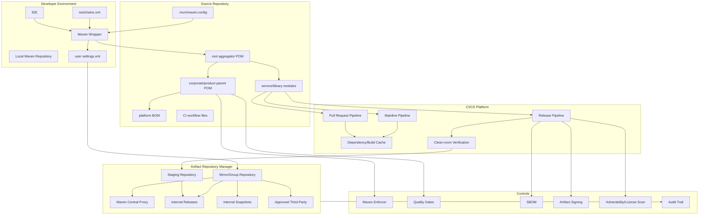
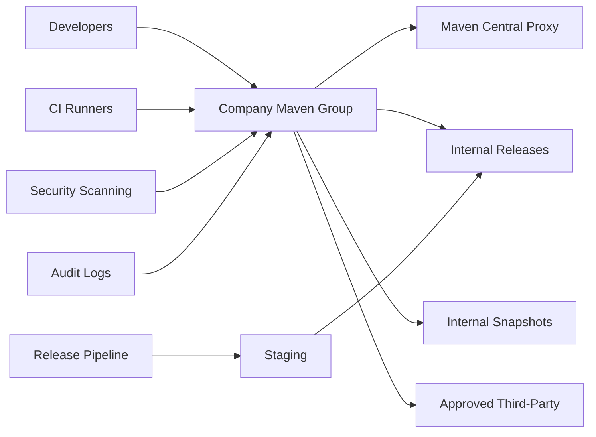
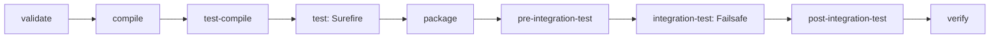
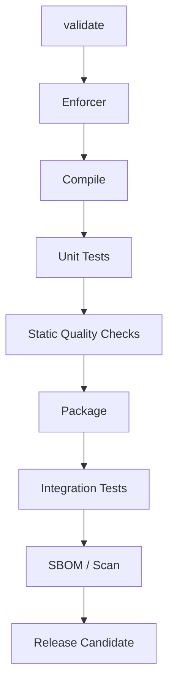
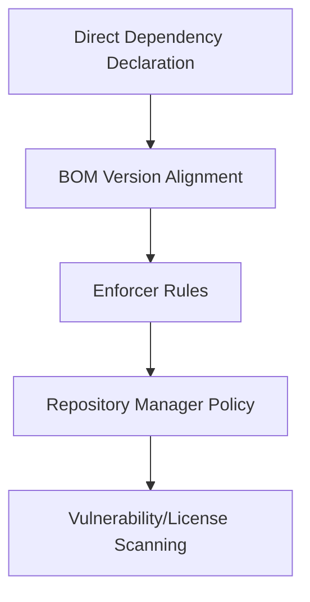
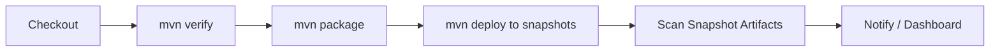
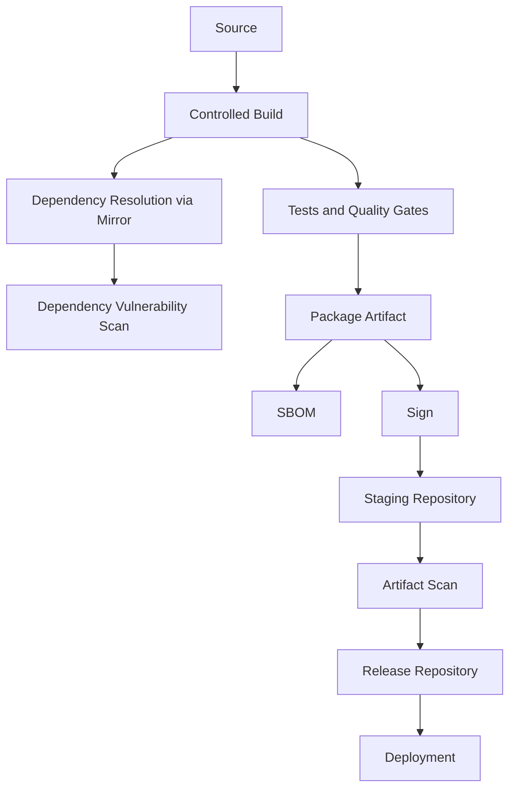

# Part 040 — Enterprise Maven Reference Architecture

This is the final part of the Maven In Action series.

Everything before this part was intentionally decomposed:

- POM;
- lifecycle;
- plugins;
- dependencies;
- repositories;
- settings;
- multi-module reactor;
- parent POM;
- BOM;
- profiles;
- resource filtering;
- compiler/toolchains;
- tests;
- quality gates;
- Enforcer;
- packaging;
- generated sources;
- reproducible builds;
- SBOM/signing;
- release/versioning;
- deploy;
- CI/CD;
- performance;
- debugging;
- failure playbooks;
- custom plugins;
- extensions;
- Maven 4;
- build-system tradeoffs.

Now we assemble those pieces into one production-grade reference architecture.

The goal is not to create the most complex Maven setup possible.

The goal is to create a Maven platform that is:

- boring for ordinary developers;
- strict for production releases;
- observable during failure;
- reproducible under audit;
- safe under dependency supply-chain pressure;
- fast enough for daily engineering;
- evolvable across Java/Maven/plugin versions;
- understandable by future maintainers.

A good Maven platform should make the safe path the easiest path.

---

## 1. Reference Architecture Overview



This architecture has one core idea:

> Maven project configuration must be separated from Maven execution configuration and from release governance.

Do not put everything in `pom.xml`.

Do not put everything in CI YAML.

Do not put everything in repository manager configuration.

Each layer has a job.

---

## 2. Layer Responsibilities

| Layer | Owns | Must not own |
|---|---|---|
| Module POM | Module identity, module dependencies, module-specific plugins | Enterprise-wide policy |
| Parent POM | Shared plugin versions, lifecycle bindings, quality gates, Enforcer rules | Environment secrets |
| BOM | Dependency version alignment | Plugin configuration or module structure |
| Aggregator POM | Reactor module list | Shared build policy unless also intentionally parent |
| `settings.xml` | Mirrors, credentials, proxies, user/CI execution config | Project build contract |
| Repository manager | Artifact trust boundary, proxy/cache, release/snapshot hosting | Source build logic |
| CI pipeline | Stage orchestration, clean-room verification, publish flow | Hidden dependency version decisions |
| Release pipeline | Version finalization, signing, SBOM, staging/promotion | Development-only shortcuts |
| Developer environment | IDE, wrapper, local toolchain | Production-only secrets |

When these responsibilities blur, Maven becomes hard to reason about.

---

## 3. Repository Topology

A production Maven architecture should not let every developer and CI runner freely resolve from arbitrary internet repositories.

Use a repository manager as the controlled boundary.



Recommended repository classes:

| Repository | Type | Purpose |
|---|---|---|
| `maven-public` | group/virtual | Single mirror URL for developers and CI |
| `maven-central-proxy` | proxy/remote | Cached access to Maven Central |
| `internal-releases` | hosted/local | Immutable company release artifacts |
| `internal-snapshots` | hosted/local | Mutable development snapshots |
| `third-party-approved` | hosted/local | Manually approved vendor artifacts unavailable in Central |
| `staging` | hosted/local/staging | Release candidate area before promotion |

Rules:

1. Developers and CI resolve through the group repository.
2. Release artifacts are immutable after promotion.
3. Snapshot repositories are never used for production release dependencies.
4. Third-party artifacts are admitted through approval, not ad-hoc local install.
5. Repository manager audit logs are part of supply-chain evidence.
6. Credentials are stored in CI secrets and `settings.xml`, not in POM.
7. Mirror configuration should prevent bypassing approved repositories.

---

## 4. Source Repository Structure

A clean enterprise Maven repository has explicit build roles.

```txt
repo-root/
  .mvn/
    maven.config
    jvm.config
  pom.xml                         # root aggregator
  build-parent/
    pom.xml                       # parent POM, if versioned in same repo
  platform-bom/
    pom.xml                       # dependency version alignment
  service-api/
    pom.xml
    src/main/java/...
  service-domain/
    pom.xml
    src/main/java/...
  service-application/
    pom.xml
    src/main/java/...
  service-adapter-postgres/
    pom.xml
    src/main/java/...
  service-adapter-http/
    pom.xml
    src/main/java/...
  service-boot/
    pom.xml                       # deployable module
    src/main/java/...
  test-support/
    pom.xml
    src/main/java/...
  docs/
  ci/
```

Not every project needs this many modules.

The structure is a reference pattern, not a template to copy blindly.

The invariant is:

> Module boundaries should reflect architectural dependency direction, not team preference or packaging convenience.

---

## 5. Parent POM Architecture

The parent POM is the build policy API.

It should define:

- plugin versions;
- common plugin configuration;
- lifecycle bindings;
- compiler defaults;
- test plugin defaults;
- quality gates;
- Enforcer rules;
- reproducible build settings;
- source/javadoc/signing attachment policy;
- build metadata conventions;
- common properties.

It should not define:

- every dependency used by every service;
- environment-specific runtime config;
- deployment secrets;
- module-specific business dependencies;
- fragile profile logic;
- hidden shell workflow.

### 5.1 Parent POM Skeleton

```xml
<project xmlns="http://maven.apache.org/POM/4.0.0"
         xmlns:xsi="http://www.w3.org/2001/XMLSchema-instance"
         xsi:schemaLocation="http://maven.apache.org/POM/4.0.0 https://maven.apache.org/xsd/maven-4.0.0.xsd">
  <modelVersion>4.0.0</modelVersion>

  <groupId>com.example.platform</groupId>
  <artifactId>company-build-parent</artifactId>
  <version>1.12.0</version>
  <packaging>pom</packaging>

  <properties>
    <project.build.sourceEncoding>UTF-8</project.build.sourceEncoding>
    <project.reporting.outputEncoding>UTF-8</project.reporting.outputEncoding>
    <java.release>21</java.release>
    <maven.compiler.release>${java.release}</maven.compiler.release>
    <project.build.outputTimestamp>${git.commit.time}</project.build.outputTimestamp>

    <maven.compiler.plugin.version>REPLACE_WITH_APPROVED_VERSION</maven.compiler.plugin.version>
    <maven.surefire.plugin.version>REPLACE_WITH_APPROVED_VERSION</maven.surefire.plugin.version>
    <maven.failsafe.plugin.version>REPLACE_WITH_APPROVED_VERSION</maven.failsafe.plugin.version>
    <maven.enforcer.plugin.version>REPLACE_WITH_APPROVED_VERSION</maven.enforcer.plugin.version>
  </properties>

  <build>
    <pluginManagement>
      <plugins>
        <plugin>
          <groupId>org.apache.maven.plugins</groupId>
          <artifactId>maven-compiler-plugin</artifactId>
          <version>${maven.compiler.plugin.version}</version>
          <configuration>
            <release>${maven.compiler.release}</release>
          </configuration>
        </plugin>

        <plugin>
          <groupId>org.apache.maven.plugins</groupId>
          <artifactId>maven-surefire-plugin</artifactId>
          <version>${maven.surefire.plugin.version}</version>
        </plugin>

        <plugin>
          <groupId>org.apache.maven.plugins</groupId>
          <artifactId>maven-failsafe-plugin</artifactId>
          <version>${maven.failsafe.plugin.version}</version>
        </plugin>
      </plugins>
    </pluginManagement>

    <plugins>
      <plugin>
        <groupId>org.apache.maven.plugins</groupId>
        <artifactId>maven-enforcer-plugin</artifactId>
        <version>${maven.enforcer.plugin.version}</version>
        <executions>
          <execution>
            <id>enforce-build-policy</id>
            <phase>validate</phase>
            <goals>
              <goal>enforce</goal>
            </goals>
            <configuration>
              <rules>
                <requireMavenVersion>
                  <version>[3.9.0,)</version>
                </requireMavenVersion>
                <requireJavaVersion>
                  <version>[21,)</version>
                </requireJavaVersion>
                <dependencyConvergence />
                <requirePluginVersions />
              </rules>
            </configuration>
          </execution>
        </executions>
      </plugin>
    </plugins>
  </build>
</project>
```

The exact versions must come from your approved platform policy.

Do not copy plugin versions blindly from old examples.

---

## 6. BOM Architecture

The BOM is the dependency alignment contract.

It should define versions for libraries that are part of your platform baseline.

It should not configure plugins.

```xml
<project xmlns="http://maven.apache.org/POM/4.0.0"
         xmlns:xsi="http://www.w3.org/2001/XMLSchema-instance"
         xsi:schemaLocation="http://maven.apache.org/POM/4.0.0 https://maven.apache.org/xsd/maven-4.0.0.xsd">
  <modelVersion>4.0.0</modelVersion>

  <groupId>com.example.platform</groupId>
  <artifactId>company-platform-bom</artifactId>
  <version>2026.07.0</version>
  <packaging>pom</packaging>

  <dependencyManagement>
    <dependencies>
      <dependency>
        <groupId>org.slf4j</groupId>
        <artifactId>slf4j-api</artifactId>
        <version>${slf4j.version}</version>
      </dependency>
      <dependency>
        <groupId>com.fasterxml.jackson</groupId>
        <artifactId>jackson-bom</artifactId>
        <version>${jackson.version}</version>
        <type>pom</type>
        <scope>import</scope>
      </dependency>
    </dependencies>
  </dependencyManagement>
</project>
```

BOM rules:

1. Put versions in the BOM.
2. Put dependency usage in module POMs.
3. Keep BOM upgrade cadence explicit.
4. Test BOM upgrades against representative services.
5. Publish release notes for dependency changes.
6. Make security-driven upgrades traceable.
7. Avoid using BOM as a dumping ground for every possible library.

---

## 7. Module POM Pattern

A module POM should be boring.

```xml
<project xmlns="http://maven.apache.org/POM/4.0.0"
         xmlns:xsi="http://www.w3.org/2001/XMLSchema-instance"
         xsi:schemaLocation="http://maven.apache.org/POM/4.0.0 https://maven.apache.org/xsd/maven-4.0.0.xsd">
  <modelVersion>4.0.0</modelVersion>

  <parent>
    <groupId>com.example.platform</groupId>
    <artifactId>company-build-parent</artifactId>
    <version>1.12.0</version>
    <relativePath>../build-parent/pom.xml</relativePath>
  </parent>

  <artifactId>order-service-domain</artifactId>
  <packaging>jar</packaging>

  <dependencyManagement>
    <dependencies>
      <dependency>
        <groupId>com.example.platform</groupId>
        <artifactId>company-platform-bom</artifactId>
        <version>2026.07.0</version>
        <type>pom</type>
        <scope>import</scope>
      </dependency>
    </dependencies>
  </dependencyManagement>

  <dependencies>
    <dependency>
      <groupId>org.slf4j</groupId>
      <artifactId>slf4j-api</artifactId>
    </dependency>
  </dependencies>
</project>
```

If every module POM is full of custom plugin executions, the parent POM failed.

If every module POM declares versions directly, the BOM failed.

If every module POM uses profiles, the runtime configuration model failed.

---

## 8. Maven Wrapper and Local Configuration

Use Maven Wrapper so the repository declares the Maven distribution used by developers and CI.

Recommended files:

```txt
.mvn/
  wrapper/
    maven-wrapper.properties
  maven.config
  jvm.config
```

Example `.mvn/maven.config`:

```txt
--batch-mode
--show-version
--fail-at-end
-Dstyle.color=always
```

Be conservative.

Do not put secrets or environment-specific repository credentials in `.mvn/maven.config`.

Example `.mvn/jvm.config`:

```txt
-Xmx2g
-Dfile.encoding=UTF-8
```

Use `toolchains.xml` when the JDK used to run Maven differs from the JDK used to compile/test.

---

## 9. CI-Safe `settings.xml`

CI should use generated or mounted `settings.xml`.

```xml
<settings xmlns="http://maven.apache.org/SETTINGS/1.0.0"
          xmlns:xsi="http://www.w3.org/2001/XMLSchema-instance"
          xsi:schemaLocation="http://maven.apache.org/SETTINGS/1.0.0 https://maven.apache.org/xsd/settings-1.0.0.xsd">
  <mirrors>
    <mirror>
      <id>company-maven-public</id>
      <mirrorOf>*</mirrorOf>
      <url>https://repo.example.com/maven-public</url>
    </mirror>
  </mirrors>

  <servers>
    <server>
      <id>internal-releases</id>
      <username>${env.MAVEN_REPO_USER}</username>
      <password>${env.MAVEN_REPO_PASSWORD}</password>
    </server>
    <server>
      <id>internal-snapshots</id>
      <username>${env.MAVEN_REPO_USER}</username>
      <password>${env.MAVEN_REPO_PASSWORD}</password>
    </server>
  </servers>

  <profiles>
    <profile>
      <id>company-repositories</id>
      <repositories>
        <repository>
          <id>company-maven-public</id>
          <url>https://repo.example.com/maven-public</url>
          <releases><enabled>true</enabled></releases>
          <snapshots><enabled>true</enabled></snapshots>
        </repository>
      </repositories>
      <pluginRepositories>
        <pluginRepository>
          <id>company-maven-public</id>
          <url>https://repo.example.com/maven-public</url>
          <releases><enabled>true</enabled></releases>
          <snapshots><enabled>true</enabled></snapshots>
        </pluginRepository>
      </pluginRepositories>
    </profile>
  </profiles>

  <activeProfiles>
    <activeProfile>company-repositories</activeProfile>
  </activeProfiles>
</settings>
```

Rules:

- `server.id` must match `distributionManagement.repository.id` or deployment configuration.
- Credentials must come from secret manager/environment injection.
- Do not commit real credentials.
- Use mirrors to control dependency ingress.
- Use clean-room CI to catch local-machine dependency leaks.

---

## 10. Lifecycle Policy

Standard lifecycle usage:

| Command | Purpose | Typical use |
|---|---|---|
| `mvn validate` | Verify build contract and Enforcer rules | Fast configuration check |
| `mvn test` | Compile and run unit tests | Developer quick feedback |
| `mvn verify` | Full verification including integration tests | PR/mainline quality gate |
| `mvn package` | Produce local artifact | Local artifact inspection |
| `mvn install` | Install into local repository | Only when downstream local modules need it |
| `mvn deploy` | Publish to remote repository | CI release/snapshot pipeline only |

Policy:

1. PR pipeline should usually run `verify`.
2. Developers should not run `install` habitually.
3. CI should not run `clean` blindly unless required.
4. Integration tests must complete through `verify`, not direct `integration-test` phase.
5. Deploy should happen only from controlled CI release pipelines.
6. Packaging should be inspected in CI for deployable modules.

---

## 11. Testing Architecture



Testing policy:

| Test type | Location | Plugin | Phase path |
|---|---|---|---|
| Unit test | `src/test/java` | Surefire | `test` |
| Integration test | `src/test/java` or separate source set by convention | Failsafe | `integration-test` + `verify` |
| Contract test | Usually integration path | Failsafe or dedicated plugin | `verify` |
| Slow system test | Separate CI job | Failsafe/custom | Scheduled/mainline |

Rules:

- Unit tests must not require external services.
- Integration tests must own setup/teardown.
- Flaky tests must be treated as incidents, not ignored forever.
- Test naming conventions must be enforced.
- Reports must be archived in CI.
- Containerized tests must not leak resources after failure.

---

## 12. Quality Gate Architecture

Recommended gates:



Gate categories:

| Gate | Tool examples | Failure policy |
|---|---|---|
| Build policy | Maven Enforcer | Fail |
| Compile correctness | Compiler plugin | Fail |
| Unit tests | Surefire | Fail |
| Integration tests | Failsafe | Fail on `verify` |
| Style | Checkstyle/formatter | Fail for new code; baseline legacy if needed |
| Static bugs | SpotBugs/PMD | Fail for high severity |
| Dependency policy | Enforcer/scanner | Fail for banned/high-risk deps |
| SBOM | CycloneDX or equivalent | Required for release |
| Signing | GPG/signing workflow | Required for release artifacts |

Quality gates should be strict enough to protect production, but not so noisy that teams learn to ignore them.

---

## 13. Dependency Governance

Dependency governance has four layers.



### 13.1 Rules

1. Dependency versions should normally be absent from module POMs.
2. Versions should be owned by BOM or parent policy.
3. Do not use dynamic versions.
4. Do not use snapshot dependencies in releases.
5. Use exclusions as surgical fixes, not as global cleanup.
6. Review optional dependencies explicitly.
7. Require dependency convergence for production modules.
8. Track vulnerability exceptions with expiry dates.
9. Prefer platform BOMs over copy-pasted versions.
10. Inspect dependency tree before release.

### 13.2 Dependency Review Checklist

- [ ] Why is this dependency needed?
- [ ] Is it direct or transitive?
- [ ] Is the version controlled by BOM?
- [ ] Does it introduce license risk?
- [ ] Does it introduce vulnerable transitives?
- [ ] Does it conflict with platform libraries?
- [ ] Is the scope correct?
- [ ] Is it needed at runtime?
- [ ] Can it be replaced by existing platform capability?
- [ ] Is the dependency maintained?

---

## 14. Versioning and Release Governance

Use different versioning policies for different artifact types.

| Artifact type | Recommended policy |
|---|---|
| Public library | Semantic versioning discipline |
| Internal library | Semantic or compatibility-based versioning |
| Service deployable | Build/release version tied to deployment traceability |
| Parent POM | Explicit compatibility release notes |
| BOM | Calendar or platform release version |
| Maven plugin | Semantic versioning with compatibility matrix |
| Test-support artifact | Versioned with compatibility to target modules |

Release invariants:

1. Release artifact coordinates are immutable.
2. Release builds do not depend on snapshots.
3. Release build uses clean checkout.
4. Release build uses controlled settings.
5. Release build records source revision.
6. Release build emits SBOM.
7. Release build signs artifacts when required.
8. Release build publishes to staging first.
9. Promotion is explicit and auditable.
10. Rollback means deploying a previous known artifact, not overwriting coordinates.

---

## 15. CI/CD Pipeline Reference

### 15.1 Pull Request Pipeline


Goal: fast confidence before merge.

Recommended behavior:

- no deploy;
- no release signing;
- no mutation of remote release repositories;
- cache dependencies but do not hide resolution problems;
- run module subset if safe;
- full verification for risky changes;
- publish test reports and dependency/security reports.

### 15.2 Mainline Pipeline



Goal: continuously verify main branch and publish snapshots when useful.

### 15.3 Release Pipeline


Goal: produce auditable, immutable release artifacts.

---

## 16. Reproducibility Policy

A Maven build should be reproducible enough to support audit and incident response.

Required controls:

- pin plugin versions;
- pin dependency versions through BOM;
- avoid release-time snapshots;
- set output timestamp policy;
- control JDK/toolchain;
- control Maven version via Wrapper;
- control repository mirrors;
- avoid environment-dependent resource filtering;
- make generated sources deterministic;
- archive effective POM/settings in release evidence;
- archive dependency tree;
- archive SBOM and checksums.

Reproducibility test:

```txt
1. Checkout same source revision.
2. Use same Maven Wrapper version.
3. Use same JDK/toolchain.
4. Use same settings/mirror policy.
5. Build in clean workspace twice.
6. Compare artifact checksums.
7. If different, inspect archive timestamps, generated files, manifest, order, embedded metadata.
```

---

## 17. Supply-Chain Security Architecture



Security controls:

| Control | Purpose |
|---|---|
| Repository mirror | Prevent uncontrolled dependency ingress |
| Dependency scanner | Detect vulnerable dependencies |
| License scanner | Detect license incompatibility |
| Enforcer banned deps | Block known-bad artifacts early |
| SBOM | Record artifact composition |
| Signing | Prove artifact origin/integrity |
| Immutable releases | Prevent coordinate overwrite |
| Clean-room build | Reduce local contamination |
| Secret isolation | Prevent credential leakage |
| Audit trail | Support investigation |

Security principle:

> Do not rely on developer workstations as a trust boundary.

The release pipeline is the trust boundary.

---

## 18. Observability and Build Telemetry

You cannot improve what you cannot see.

Track:

- total build duration;
- duration by module;
- duration by plugin/phase if available;
- dependency resolution time;
- test duration;
- flaky test rate;
- cache hit/miss rate;
- failure category;
- artifact size trend;
- dependency count trend;
- CVE count trend;
- release failure rate;
- build failure MTTR.

Simple classification:

| Failure category | Examples |
|---|---|
| Configuration | malformed POM, profile issue, plugin config |
| Resolution | missing dependency, repository outage, auth failure |
| Compilation | Java version mismatch, generated source issue |
| Test | failing/flaky unit/integration tests |
| Packaging | missing resource, bad manifest, shaded conflict |
| Policy | Enforcer, dependency scanner, license gate |
| Deployment | credential, staging, repository write failure |
| Environment | JDK mismatch, disk, network, CI runner issue |

Incident review should ask:

```txt
Could the build have failed earlier, clearer, or safer?
```

---

## 19. Performance Architecture

Performance is not only `-T`.

Performance comes from reducing unnecessary work.

Order of optimization:

1. Measure baseline.
2. Remove unnecessary `clean`.
3. Avoid unnecessary `install`.
4. Split unit and integration test feedback paths.
5. Use reactor slicing safely.
6. Fix slow tests.
7. Avoid always-running code generation.
8. Pin and cache dependencies.
9. Use parallel builds where module graph allows.
10. Right-size CI runners.
11. Optimize repository manager latency.
12. Archive build metrics.

Do not optimize by skipping quality gates silently.

Optimize by making the graph and stages more precise.

---

## 20. Maven 3 to Maven 4 Readiness

A production Maven architecture should be ready for Maven 4 without rushing into it before organizational readiness.

Readiness checklist:

- [ ] Builds are clean on latest approved Maven 3.9.x.
- [ ] Plugin versions are pinned.
- [ ] Warnings are treated seriously.
- [ ] Effective POM is understood.
- [ ] Parent/BOM/aggregator roles are separated.
- [ ] Deprecated plugin behavior is reviewed.
- [ ] Custom plugins are tested against Maven 4.
- [ ] Extensions are inventoried.
- [ ] CI matrix can run Maven 3 and Maven 4 candidate builds.
- [ ] Consumer POM/publication behavior is reviewed.
- [ ] Maven Upgrade Tool is evaluated in a branch.
- [ ] Rollback to Maven 3 is documented.

Policy:

> Adopt Maven 4 when compatibility, plugin ecosystem, CI, and developer workflows are proven, not merely because it exists.

---

## 21. Enterprise Playbooks

### 21.1 New Service Playbook

1. Generate from approved template.
2. Use Maven Wrapper.
3. Inherit approved parent POM.
4. Import approved BOM.
5. Use standard project layout.
6. Add only necessary dependencies.
7. Run `mvn verify` locally.
8. Check dependency tree.
9. Configure CI from template.
10. Publish snapshot only from mainline CI.
11. Release through release pipeline only.

### 21.2 Dependency Upgrade Playbook

1. Identify dependency and reason.
2. Upgrade in BOM or platform owner branch.
3. Run representative module test suite.
4. Check dependency convergence.
5. Run vulnerability/license scan.
6. Review transitive changes.
7. Publish BOM release notes.
8. Roll out to services.
9. Monitor build/runtime incidents.
10. Revert BOM if systemic breakage appears.

### 21.3 Plugin Upgrade Playbook

1. Inventory plugin usage.
2. Read plugin release notes.
3. Upgrade in parent POM branch.
4. Run multi-module representative builds.
5. Compare generated artifacts.
6. Compare reports.
7. Test CI pipeline.
8. Release parent POM.
9. Roll out gradually.
10. Keep rollback parent version available.

### 21.4 Broken Build Incident Playbook

1. Classify failure category.
2. Reproduce with `mvn -e`.
3. Use `-X` only when needed.
4. Inspect effective POM/settings/profiles.
5. Inspect dependency tree.
6. Inspect plugin execution and versions.
7. Check repository manager status.
8. Check JDK/toolchain/Maven version.
9. Compare local vs CI environment.
10. Fix root cause; do not only clear cache.
11. Add guardrail if recurrence is possible.

### 21.5 Release Failure Playbook

1. Stop promotion.
2. Preserve logs and staging repository state.
3. Identify failure phase.
4. Verify source tag and version.
5. Verify credentials and `server.id` mapping.
6. Verify no snapshots in release graph.
7. Verify signing/SBOM/scanner outputs.
8. Re-run from clean checkout if safe.
9. Drop staging repository if invalid.
10. Retag only according to release policy.
11. Record incident evidence.

---

## 22. Governance Model

A Maven platform needs named owners.

| Area | Owner |
|---|---|
| Parent POM | Build platform / senior backend platform team |
| BOM | Platform dependency council / library owners |
| Repository manager | DevOps/platform/security |
| CI templates | DevOps/build platform |
| Release pipeline | Release engineering/platform |
| Security scanning | AppSec/security engineering |
| Maven custom plugins | Build platform |
| Documentation | Build platform + service teams |
| Incident review | Owning team + build platform |

Governance rituals:

- monthly dependency platform review;
- quarterly plugin upgrade review;
- build failure trend review;
- Maven/JDK compatibility review;
- repository policy audit;
- release pipeline fire drill;
- onboarding feedback review;
- incident playbook update.

Governance anti-pattern:

> Everyone can change build policy, but nobody owns the consequences.

---

## 23. Maturity Model

### Level 0 — Ad Hoc Maven

- random plugin versions;
- direct dependency versions everywhere;
- no repository mirror;
- credentials copied locally;
- CI calls `mvn clean install` blindly;
- releases manually deployed;
- no SBOM/signing;
- failures fixed by deleting `~/.m2`.

### Level 1 — Conventional Maven

- standard layout;
- basic parent POM;
- basic CI;
- dependency versions partially centralized;
- repository manager exists;
- unit tests in lifecycle;
- some release discipline.

### Level 2 — Governed Maven

- parent/BOM separation;
- plugin versions pinned;
- Enforcer rules;
- CI-safe settings;
- release/snapshot repositories separated;
- PR/main/release pipeline separated;
- dependency scanning;
- test reports archived;
- basic incident playbooks.

### Level 3 — Reproducible Maven

- output timestamp policy;
- clean-room verification;
- artifact checksums compared;
- SBOM generated;
- signing integrated;
- repository ingress controlled;
- generated code deterministic;
- dependency and plugin upgrade playbooks.

### Level 4 — Platform Maven

- internal parent/BOM release process;
- self-service templates;
- build telemetry;
- dependency council;
- automated policy checks;
- custom plugins only where justified;
- Maven 4 readiness matrix;
- cross-team support model.

### Level 5 — Strategic Build Platform

- Maven/Gradle/Bazel decisions governed by architecture fit;
- artifact governance is tool-agnostic;
- supply-chain evidence is standard;
- build performance is continuously measured;
- release provenance is auditable;
- developers rarely need to understand build internals for common work;
- senior engineers can debug deep failures quickly.

Target at least Level 3 for serious production systems.

Target Level 4 or 5 for large engineering organizations.

---

## 24. Capstone: Design a Maven Platform for a Regulated Case Management System

Use this exercise to validate mastery.

Scenario:

You own a Java-based regulatory case management platform with:

- 40 backend services;
- shared domain libraries;
- JAX-RS APIs;
- PostgreSQL adapters;
- Kafka event contracts;
- generated OpenAPI clients;
- internal BOM;
- strict audit requirements;
- security scanning;
- monthly patch releases;
- emergency CVE patch path;
- CI runners in isolated network;
- internal Nexus/Artifactory repository manager;
- Java 21 baseline;
- Maven 3.9.x baseline with Maven 4 readiness exploration.

Design:

1. repository topology;
2. parent POM hierarchy;
3. BOM versioning;
4. dependency policy;
5. plugin policy;
6. generated source policy;
7. test lifecycle;
8. CI stages;
9. release pipeline;
10. SBOM/signing workflow;
11. incident playbooks;
12. Maven 4 migration plan.

Expected answer shape:

```txt
architecture/
  build-parent
  platform-bom
  repository-manager-policy
  ci-template
  release-template
  dependency-upgrade-playbook
  plugin-upgrade-playbook
  failure-playbooks
  maven4-readiness-plan
```

If you can produce that design and defend every boundary, you understand Maven at a professional platform-engineering level.

---

## 25. Final Checklist for Every Serious Maven Project

### Build Contract

- [ ] POM identity is correct.
- [ ] Parent POM role is clear.
- [ ] Aggregator role is clear.
- [ ] BOM role is clear.
- [ ] Module boundaries reflect architecture.

### Dependency Control

- [ ] Direct dependencies are minimal and intentional.
- [ ] Versions are centralized.
- [ ] Scopes are correct.
- [ ] Convergence is enforced.
- [ ] Snapshot dependencies are blocked for releases.

### Plugin Control

- [ ] Plugin versions are pinned.
- [ ] Plugin executions are understandable.
- [ ] Plugin configuration is centralized where appropriate.
- [ ] Custom plugins have tests and documentation.
- [ ] Extensions are rare and reviewed.

### Runtime Boundary

- [ ] Build-time config is separated from runtime config.
- [ ] Resource filtering does not leak secrets.
- [ ] Generated sources are deterministic.
- [ ] Artifact contents are inspected.

### CI/CD

- [ ] PR/main/release pipelines are distinct.
- [ ] CI uses controlled `settings.xml`.
- [ ] CI uses approved JDK/Maven versions.
- [ ] Test reports are archived.
- [ ] Release deployment is controlled.

### Security

- [ ] Repository manager mirror is used.
- [ ] Credentials are not in POM.
- [ ] SBOM is generated for releases.
- [ ] Signing is integrated where required.
- [ ] Vulnerability/license gates exist.

### Operations

- [ ] Build telemetry is collected.
- [ ] Failure playbooks exist.
- [ ] Dependency upgrade playbook exists.
- [ ] Plugin upgrade playbook exists.
- [ ] Maven 4 readiness is tracked.

---

## 26. What Top Engineers Actually Do With Maven

They do not memorize every plugin parameter.

They understand the system.

They can answer:

- Where did this dependency version come from?
- Why did this plugin execute?
- Which classpath contains this artifact?
- Why does CI fail while local build passes?
- Why did artifact content change?
- Why is this release not reproducible?
- Why did this snapshot drift?
- Why did this module rebuild?
- Why did this generated source differ?
- Why did this dependency converge locally but fail in CI?
- Why does deployment fail despite successful packaging?
- Which layer should own this configuration?

That is the difference between using Maven and engineering with Maven.

---

## 27. Series Completion

This is the final planned part of **Learn Maven In Action**.

The 40-part sequence is complete:

```txt
001 Kaufman Skill Map
002 Maven as Build System
003 POM Mental Model
004 Effective POM and Inheritance
005 Coordinates, Artifacts, Packaging
006 Lifecycle, Phase, Goal, Execution
007 Plugin System
008 Standard Project Layout
009 Dependency Graph Fundamentals
010 Dependency Management and BOM
011 Scopes and Runtime Boundaries
012 Repositories and Metadata
013 settings.xml Enterprise Config
014 Repository Managers
015 Multi-Module Reactor Basics
016 Multi-Module Enterprise Architecture
017 Parent POM Design Patterns
018 Profiles Without Chaos
019 Resource Filtering
020 Compiler and Toolchains
021 Surefire and Failsafe
022 Code Quality Checks
023 Enforcer and Governance
024 Shading and Assembly
025 WAR/EAR/Jakarta Builds
026 Generated Sources and Annotation Processing
027 Build Helper and Non-Standard Layouts
028 Reproducible Builds
029 Supply Chain Security
030 Release and CI-Friendly Versions
031 Deploy and Distribution Management
032 CI/CD Pipeline Design
033 Performance Engineering
034 Debugging Maven
035 Failure Modes and Incident Playbooks
036 Custom Maven Plugins
037 Maven Extensions
038 Maven 4 Upgrade
039 Build-System Tradeoffs
040 Enterprise Maven Reference Architecture
```

If you want to go beyond this series, the natural next topics are:

1. **Enterprise Java Build Platform Engineering** — build platform as internal product across Maven/Gradle/Bazel.
2. **Software Supply Chain Security for JVM Systems** — SLSA, SBOM, provenance, signing, repository governance.
3. **Large-Scale Java Monorepo Architecture** — module boundaries, dependency graph control, CI slicing, ownership model.
4. **Internal Developer Platform for Java Services** — templates, golden paths, CI/CD, observability, compliance automation.
5. **Maven Plugin and Extension Engineering** — building safe internal build automation at scale.

---

## References

- Apache Maven — Welcome to Apache Maven: https://maven.apache.org/
- Apache Maven — POM Reference: https://maven.apache.org/pom.html
- Apache Maven — Introduction to the POM: https://maven.apache.org/guides/introduction/introduction-to-the-pom.html
- Apache Maven — Introduction to the Build Lifecycle: https://maven.apache.org/guides/introduction/introduction-to-the-lifecycle.html
- Apache Maven — Introduction to the Dependency Mechanism: https://maven.apache.org/guides/introduction/introduction-to-dependency-mechanism.html
- Apache Maven — Introduction to Repositories: https://maven.apache.org/guides/introduction/introduction-to-repositories.html
- Apache Maven — Settings Reference: https://maven.apache.org/settings.html
- Apache Maven — Guide to Reproducible Builds: https://maven.apache.org/guides/mini/guide-reproducible-builds.html
- Apache Maven — Guide to Using Toolchains: https://maven.apache.org/guides/mini/guide-using-toolchains.html
- Apache Maven — Maven CI Friendly Versions: https://maven.apache.org/guides/mini/guide-maven-ci-friendly.html
- Apache Maven — Maven 4 documentation: https://maven.apache.org/whatsnewinmaven4.html
