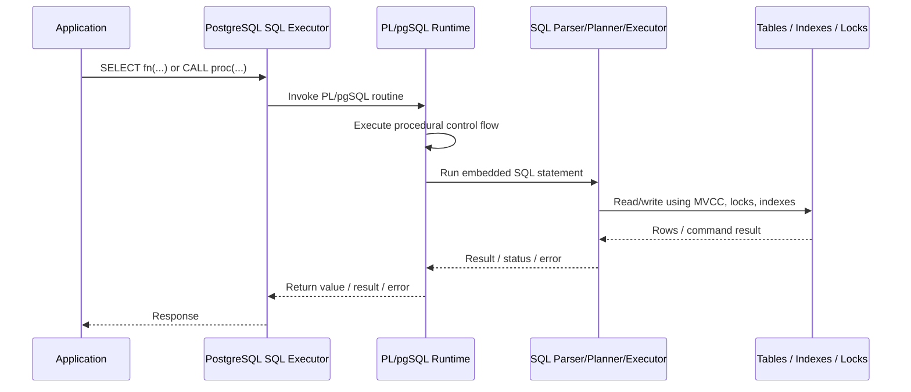
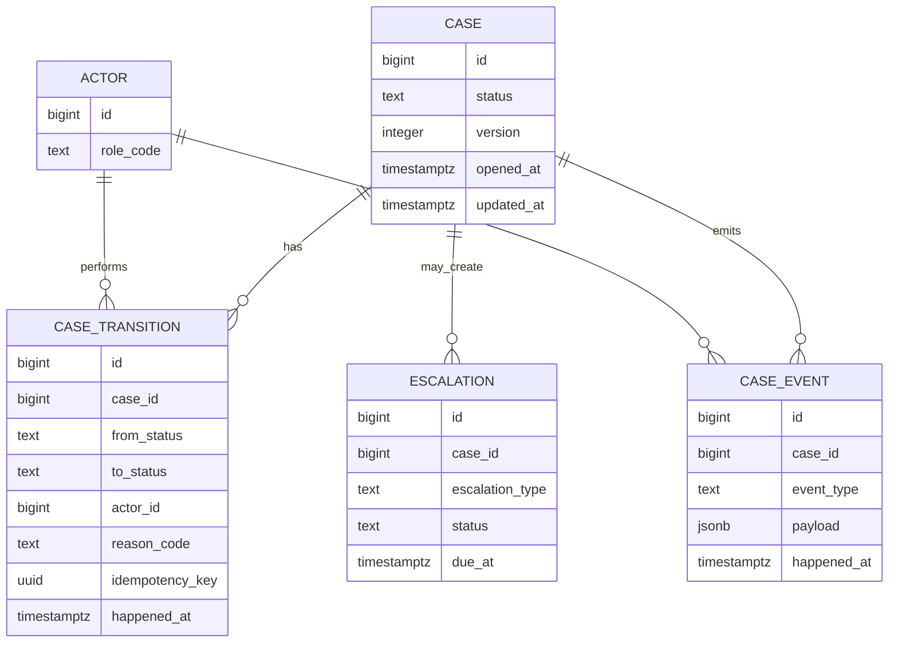

# Part 001 — Kaufman Skill Map and Operational Mental Model

PL/pgSQL is not “just stored procedure syntax”. It is a way to move selected computation into the database process, beside the data, inside PostgreSQL’s transaction, type, lock, privilege, and query-planning machinery.

That is powerful. It is also dangerous.

A top-tier engineer does not ask only:

> “Can this be written in PL/pgSQL?”

The better question is:

> “Should this behavior live inside the database boundary, and if yes, what contract, failure model, observability, and deployment discipline make it safe?”

This part builds the map used for the rest of the series.

We will not repeat SQL basics, PostgreSQL basics, indexing basics, or database design basics. Those are assumed. This series focuses on **usage and implementation**: how PL/pgSQL behaves in real production systems, how to reason about it, and how to avoid turning a database into an invisible application server with poor runtime control.

---

## 1. What You Are Really Learning

PL/pgSQL is PostgreSQL’s procedural language for writing functions, procedures, triggers, and anonymous blocks. PostgreSQL’s documentation describes it as a loadable procedural language that adds control structures to SQL and can be used to create functions, procedures, and triggers.

In practice, you are learning four things at the same time:

1. **Database-local computation**  
   Code runs near the data, inside the database process, not inside an external service.

2. **Transactional orchestration**  
   Logic can run inside the same transaction as reads, writes, constraints, triggers, locks, and visibility rules.

3. **Typed procedural glue over SQL**  
   PL/pgSQL is not a replacement for SQL. It is a control-flow layer around SQL.

4. **Operationally sensitive production code**  
   A bad function can harm the primary database, block critical transactions, hide side effects, or degrade query planning.

A useful shorthand:

```txt
SQL decides sets.
PL/pgSQL decides sequence.
The database decides visibility, locking, constraints, privileges, and durability.
```

The skill is not syntax. The skill is **boundary placement**.

---

## 2. Kaufman-Style Skill Deconstruction

Josh Kaufman’s learning frame is useful because PL/pgSQL has a trap: you can feel productive after learning `CREATE FUNCTION`, `IF`, `LOOP`, and `RAISE NOTICE`, but still be dangerous in production.

So we deconstruct the skill into subskills that produce real-world competence.

### 2.1 Target Performance Level

At the end of this series, you should be able to:

- design PL/pgSQL functions with explicit contracts;
- decide whether logic belongs in SQL, PL/pgSQL, application code, trigger, procedure, migration, or background job;
- implement idempotent, race-aware, observable database workflows;
- reason about plan caching, parameter sensitivity, locking, transaction boundaries, and failure modes;
- write maintainable trigger functions without hidden business chaos;
- protect `SECURITY DEFINER` routines from privilege and `search_path` risks;
- test, benchmark, deploy, and rollback PL/pgSQL code safely;
- refactor legacy PL/pgSQL without breaking dependent objects;
- design database-side state machines for high-integrity workflows.

That is the target: **not “can write functions”, but can operate PL/pgSQL as production software.**

### 2.2 The Minimum Useful Subskills

| Subskill | Why it matters | Failure when missing |
|---|---|---|
| Runtime model | Know when PL/pgSQL parses, plans, caches, executes, and calls SQL | Surprising stale assumptions, slow paths, bad cached plans |
| Function/procedure/trigger selection | Each construct has different semantics | Wrong boundary, untestable side effects, transaction confusion |
| Type discipline | `%TYPE`, `%ROWTYPE`, `record`, domains, composites matter | Schema drift bugs, fragile signatures |
| Name resolution | PL/pgSQL variables and SQL columns can collide | Ambiguous references, wrong values, runtime errors |
| Dynamic SQL safety | Identifiers and values must be separated | SQL injection or broken generated SQL |
| Error model | Exceptions form control-flow and subtransaction behavior | Partial failure confusion, swallowed errors |
| Concurrency reasoning | Code runs under PostgreSQL isolation and locks | Duplicate work, race conditions, deadlocks |
| Observability | Database code is otherwise opaque | Incidents without diagnosis path |
| Testing and migration discipline | Database code has dependencies and runtime state | Broken deployments, unrecoverable rollback |
| Security boundary | Functions can execute with caller or owner privileges | Privilege escalation and data leaks |

### 2.3 Skill Stack Diagram

```mermaid
flowchart TD
    A[PL/pgSQL Competence] --> B[Language Core]
    A --> C[SQL Boundary]
    A --> D[Transactional Reasoning]
    A --> E[Operational Engineering]
    A --> F[Security Engineering]
    A --> G[Architecture Placement]

    B --> B1[Blocks, variables, control flow]
    B --> B2[Functions, procedures, triggers]
    B --> B3[Exceptions, cursors, dynamic SQL]

    C --> C1[Static SQL]
    C --> C2[Plan caching]
    C --> C3[Dynamic EXECUTE]
    C --> C4[Type and name resolution]

    D --> D1[Isolation]
    D --> D2[Locks]
    D --> D3[Idempotency]
    D --> D4[Retryability]

    E --> E1[Testing]
    E --> E2[Benchmarking]
    E --> E3[Logging]
    E --> E4[Deployment]

    F --> F1[SECURITY DEFINER]
    F --> F2[search_path]
    F --> F3[Least privilege APIs]

    G --> G1[Use PL/pgSQL]
    G --> G2[Use SQL only]
    G --> G3[Use app service]
    G --> G4[Use async worker]
```



---

## 3. The Core Mental Model

PL/pgSQL lives in the database, but it is not the database engine itself.

It is an interpreter that coordinates statements. When a PL/pgSQL function runs, its procedural instructions are executed by the PL/pgSQL runtime. SQL commands inside it are sent into PostgreSQL’s main SQL execution machinery.

Think of it as:

```txt
Client/API/Job
    -> SQL statement / SELECT function() / CALL procedure()
        -> PostgreSQL executor
            -> PL/pgSQL interpreter
                -> SQL commands inside PL/pgSQL
                    -> PostgreSQL parser/planner/executor
                        -> tables/indexes/locks/WAL/constraints/triggers
```

So every PL/pgSQL routine crosses at least one internal boundary:



Important consequence:

> PL/pgSQL does not make row-by-row logic magically fast. It reduces client/server round trips and can improve locality, but SQL still wants set-based operations.

Use PL/pgSQL when you need procedural coordination around SQL, not when you are avoiding SQL fluency.

---

## 4. The Database Boundary

A database boundary is not just a storage boundary. It is a semantic boundary.

Inside PostgreSQL, code runs with direct access to:

- transaction snapshot rules;
- row and table locks;
- constraints;
- triggers;
- privileges;
- current user and session settings;
- query planner and executor;
- temporary tables;
- system catalogs;
- server-side error reporting;
- WAL-backed durability.

That gives PL/pgSQL a unique role.

It can enforce invariants at the exact point where data changes.

But the same locality creates risk:

- the primary database CPU becomes application CPU;
- slow PL/pgSQL can block writes;
- hidden trigger logic can surprise application teams;
- deployment mistakes can break queries globally;
- observability is weaker than in application services unless you design it;
- poorly written dynamic SQL can create injection risk;
- `SECURITY DEFINER` can accidentally become privilege escalation.

The database boundary should be used when its semantics are needed, not because it is convenient.

---

## 5. The Boundary Placement Decision

A production-grade engineer chooses the smallest mechanism that enforces the invariant correctly.

The hierarchy usually looks like this:

```txt
Data type / domain
    < CHECK constraint
    < UNIQUE / FK / EXCLUDE constraint
    < generated column
    < view / materialized view
    < pure SQL function
    < PL/pgSQL function
    < trigger
    < procedure
    < application service
    < async worker / workflow engine
```

This is not a strict ordering. It is a pressure test.

If a `CHECK` constraint can express the invariant, use the `CHECK`. If a foreign key can express it, use the foreign key. If one `INSERT ... SELECT` can perform the mutation, do not create a loop in PL/pgSQL.

PL/pgSQL becomes attractive when you need:

- conditional procedural branching;
- multiple SQL statements with shared local variables;
- database-side error shaping;
- controlled dynamic SQL;
- trigger behavior;
- metadata-driven maintenance;
- server-side orchestration near locks and transactions;
- complex validation that cannot be expressed cleanly as constraints;
- reusable data-side commands callable from several clients.

It becomes suspicious when you need:

- long-running workflows;
- external network calls;
- human approval waits;
- complex UI-specific behavior;
- heavy CPU transformations;
- cross-service orchestration;
- versioned business rules that change weekly;
- large opaque business processes better modeled in application code or a workflow engine.

---

## 6. Mechanism Selection Matrix

| Need | Prefer | Use PL/pgSQL when | Avoid PL/pgSQL when |
|---|---|---|---|
| Simple row invariant | `CHECK`, domain, FK | Rule needs lookup or procedural branch | Constraint can express it directly |
| Canonical value | generated column / expression | Canonicalization needs multi-step logic | App-specific display formatting |
| Bulk mutation | set-based SQL | Several steps require local control and diagnostics | Row-by-row loop replaces SQL |
| Public data-side API | SQL/PL function | Multiple clients need one authoritative command | Only one service owns the behavior cleanly |
| Audit trail | trigger or logical decoding pattern | Must capture change atomically with write | Audit semantics are external/business-only |
| State transition | constraint + function | Transition must be race-safe and auditable | Long-lived workflow spans humans/services |
| Maintenance | procedure / migration SQL | Needs metadata iteration or transaction chunks | One-off migration is clearer as explicit SQL |
| Security boundary | `SECURITY DEFINER` function | Need narrow privilege delegation | Caller can have direct table privilege safely |
| Dynamic object access | `EXECUTE` with `format()` | Object name must be data-driven | Dynamic SQL hides a bad schema design |

A useful rule:

> Choose PL/pgSQL when the correctness benefit of running inside the database exceeds the operational cost of putting code there.

---

## 7. PL/pgSQL as Product Code

Do not treat PL/pgSQL as migration glue that happens to be left behind.

A PL/pgSQL routine in production needs the same discipline as application code:

- clear name;
- explicit contract;
- ownership;
- tests;
- versioning plan;
- observability;
- rollback plan;
- concurrency model;
- error taxonomy;
- permission model;
- performance expectation;
- caller documentation.

A weak function looks like this:

```sql
CREATE OR REPLACE FUNCTION process_case(id bigint)
RETURNS void
LANGUAGE plpgsql
AS $$
BEGIN
    -- lots of hidden behavior
END;
$$;
```

A stronger design starts before code:

```txt
Routine: enforcement.transition_case
Purpose: Move a case from one legal state to another.
Caller: application service role, not direct human users.
Inputs: case id, target state, actor id, reason code, idempotency key.
Outputs: transition id + resulting state.
Side effects: inserts transition row, updates case state, appends audit event.
Failure classes: not found, illegal transition, stale version, duplicate idempotency key.
Concurrency: locks target case row FOR UPDATE.
Security: SECURITY DEFINER with hardened search_path.
Observability: raises structured exception details; audit row contains actor/reason/correlation id.
Testing: legal transitions, illegal transitions, duplicate retries, concurrent attempts.
```

Top-tier PL/pgSQL engineering is less about clever procedural code and more about **making the database routine a small, explicit, reviewable API**.

---

## 8. Production Design Invariants

Use these invariants throughout the series.

### 8.1 PL/pgSQL Must Not Hide Business Chaos

Database-side code should clarify invariants, not bury arbitrary business processes.

Good:

```txt
Only one active enforcement order may exist for a case.
Every state transition must append an audit event in the same transaction.
A penalty amount must be recomputed when the basis changes.
```

Suspicious:

```txt
If the user came from screen A, then route to team B unless campaign C is active.
Call external service X, then wait for result Y, then maybe send notification Z.
```

The first group is data integrity. The second group is workflow/application orchestration.

### 8.2 Every Routine Needs a Caller Model

A function called from a report query has a different risk profile from a command function called by an API.

Ask:

- Is this routine called by humans, services, jobs, triggers, or other functions?
- Can it be called repeatedly?
- Does it mutate data?
- Does it depend on `current_user`, `current_setting`, time, randomness, temporary tables, or session state?
- Can it run under read replicas?
- Can it be parallelized?
- Does it rely on privileges the caller does not have?

The answers change design.

### 8.3 Every Mutation Needs a Race Model

If the routine writes data, assume concurrent callers.

Ask:

- What row/table/index protects uniqueness?
- What lock order prevents deadlock?
- What happens when two callers submit the same command?
- What happens when two callers submit conflicting commands?
- Can the function be retried after serialization failure?
- Is the operation idempotent?

A database function without a concurrency model is not production-ready.

### 8.4 Every Error Needs a Contract

Errors are part of the API.

Bad:

```txt
function failed
```

Better:

```txt
CASE_NOT_FOUND
ILLEGAL_STATE_TRANSITION
STALE_CASE_VERSION
DUPLICATE_IDEMPOTENCY_KEY
PERMISSION_DENIED_FOR_CASE_SCOPE
```

You can still raise PostgreSQL errors, but the caller should know which classes are expected and which are system failures.

### 8.5 Every Hidden Side Effect Must Be Documented

Triggers are powerful because callers cannot forget them.

Triggers are dangerous because callers can forget them.

If a trigger writes audit rows, recomputes summaries, validates cross-row state, or changes `NEW`, that behavior must be documented as part of the table contract.

---

## 9. Practical Routine Categories

Most production PL/pgSQL routines fall into one of these categories.

### 9.1 Query Helper Function

Reads data and returns a scalar, row, or table.

Example use:

```sql
SELECT enforcement.case_age_bucket(c.opened_at, now())
FROM enforcement.case c;
```

Risk profile:

- can be called many times per query;
- planner annotations matter;
- volatility matters;
- performance must be predictable.

### 9.2 Command Function

Represents a business command and mutates state.

Example:

```sql
SELECT *
FROM enforcement.transition_case(
    p_case_id => 1001,
    p_target_status => 'under_review',
    p_actor_id => 77,
    p_reason_code => 'evidence_received',
    p_idempotency_key => 'api-req-2026-07-02-0001'
);
```

Risk profile:

- must define concurrency behavior;
- should be idempotent where possible;
- should return enough information for the caller to continue without re-querying blindly.

### 9.3 Trigger Function

Runs as a side effect of table mutation.

Example:

```txt
Before inserting a case transition, ensure the transition is legal.
After inserting a transition, update the case current status.
```

Risk profile:

- hidden from casual callers;
- executes for all writes on that table;
- can produce surprising performance cost;
- must be carefully scoped.

### 9.4 Maintenance Procedure

Operational code invoked by `CALL`, often manually or by a scheduler.

Example:

```sql
CALL maintenance.rotate_monthly_partitions('audit.case_event', 6);
```

Risk profile:

- may need transaction control;
- should be safe to resume;
- should log progress;
- should avoid blocking critical workload.

### 9.5 Migration Helper

Temporary or semi-permanent function used to transform existing data.

Example:

```sql
SELECT migration.backfill_case_risk_score(p_batch_size => 10000);
```

Risk profile:

- must be batchable;
- must be restartable;
- should not hold locks too long;
- should usually be removed or quarantined after migration.

---

## 10. First Running Domain: Enforcement Case Management

To keep examples realistic, this series will reuse a small enforcement/case-management domain.

The domain is intentionally simple but production-shaped:

- a case is opened;
- evidence is attached;
- case state changes through legal transitions;
- escalations may be created;
- audit events must be immutable;
- commands must be idempotent;
- concurrent actors may attempt transitions;
- reporting needs derived status and history.

Minimal conceptual model:



This domain is useful because it forces real questions:

- Should state transitions be implemented in application code, PL/pgSQL, constraints, or triggers?
- How do we guarantee audit events are written atomically?
- How do we prevent duplicate transition commands?
- How do we safely reject illegal transitions?
- How do we expose stable database APIs without giving table-level write access?
- How do we observe what happened after a failure?

---

## 11. PL/pgSQL Decision Examples

### 11.1 Example: Simple Constraint — Do Not Use PL/pgSQL

Need:

> Penalty amount must be non-negative.

Use:

```sql
ALTER TABLE enforcement.penalty
ADD CONSTRAINT penalty_amount_non_negative
CHECK (amount >= 0);
```

Do not write:

```sql
CREATE FUNCTION enforcement.validate_penalty_amount()
RETURNS trigger
LANGUAGE plpgsql
AS $$
BEGIN
    IF NEW.amount < 0 THEN
        RAISE EXCEPTION 'negative amount';
    END IF;
    RETURN NEW;
END;
$$;
```

Why?

The constraint is more declarative, easier for the optimizer and tooling to understand, visible in schema metadata, and less operationally surprising.

### 11.2 Example: Cross-Row State Transition — PL/pgSQL May Fit

Need:

> A case can move from `open` to `under_review` only if at least one evidence item exists, and the transition must append an audit event in the same transaction.

This can fit a command function:

```sql
SELECT *
FROM enforcement.transition_case(
    p_case_id => 42,
    p_target_status => 'under_review',
    p_actor_id => 7,
    p_reason_code => 'evidence_received',
    p_idempotency_key => '3c8a1a5c-77f8-4ec8-92cb-d3a5d2a04845'
);
```

Why PL/pgSQL may be justified:

- multiple checks and writes need one transaction;
- the command has a stable domain meaning;
- callers should not manually perform each step;
- the routine can centralize errors and audit behavior;
- row locking and idempotency can be handled close to data.

### 11.3 Example: Human Workflow — Do Not Put the Whole Process in PL/pgSQL

Need:

> Wait for supervisor approval, call external scoring service, notify user, wait two days, then escalate if no response.

Do not put this whole workflow in PL/pgSQL.

The database can own state transitions and durable facts. The workflow engine or application should own waiting, external calls, retries, notification policies, and human interaction.

A healthy split:

```txt
Application/workflow engine:
    orchestrates long-running process
    calls external services
    waits for human events
    retries integration failures

PostgreSQL + PL/pgSQL:
    validates transition command
    locks case row
    persists state change
    writes audit event
    rejects illegal transition
```

---

## 12. Boundary Anti-Patterns

### 12.1 The “Database as Hidden Microservice” Anti-Pattern

Symptoms:

- application calls one vague function like `process_everything()`;
- function mutates many unrelated tables;
- no documented output contract;
- errors are generic;
- triggers cascade into more triggers;
- no tests outside manual SQL scripts;
- only one senior database engineer understands it.

Failure mode:

```txt
The system works until it doesn't.
Then nobody can safely change it.
```

### 12.2 The “Loop Instead of SQL” Anti-Pattern

Bad shape:

```sql
FOR v_row IN SELECT id FROM invoice WHERE status = 'pending'
LOOP
    UPDATE invoice
    SET status = 'expired'
    WHERE id = v_row.id;
END LOOP;
```

Better shape:

```sql
UPDATE invoice
SET status = 'expired'
WHERE status = 'pending'
  AND due_at < now();
```

PL/pgSQL should not be used to translate set-based work into row-by-row work unless there is a concrete reason: per-row exception handling, batching, externalized audit semantics, lock pacing, or operational throttling.

### 12.3 The “Trigger Fog” Anti-Pattern

Symptoms:

- triggers modify data in unexpected tables;
- trigger order matters but is undocumented;
- business logic is split across several trigger functions;
- bulk loads become slow or impossible;
- tests bypass triggers unintentionally.

Rule:

> Use triggers for table invariants and atomic side effects, not as a secret application layer.

### 12.4 The “Security Definer Without Threat Model” Anti-Pattern

A `SECURITY DEFINER` function can execute with the privileges of the function owner. That is useful for controlled access, but dangerous without hardening.

Every security-definer routine needs:

- explicit schema qualification;
- hardened `search_path`;
- minimal owner privileges;
- no unsafe dynamic SQL;
- narrow input validation;
- clear `EXECUTE` grants;
- tests with low-privilege roles.

We will cover this deeply later.

---

## 13. Design Template for Every Routine

Use this before writing PL/pgSQL.

```txt
Name:
Schema:
Routine kind: function | procedure | trigger function | DO block | migration helper
Purpose:
Caller:
Inputs:
Outputs:
Tables read:
Tables written:
Transaction behavior:
Locking behavior:
Idempotency behavior:
Expected errors:
Unexpected errors:
Security mode:
search_path strategy:
Volatility/parallel/cost annotations:
Observability:
Performance expectation:
Test cases:
Rollback strategy:
```

Example filled version:

```txt
Name: enforcement.transition_case
Schema: enforcement
Routine kind: command function
Purpose: atomically transition a case to a legal next status
Caller: API role app_enforcement_api
Inputs: case id, target status, actor id, reason code, idempotency key
Outputs: transition id, resulting status, resulting version
Tables read: enforcement.case, enforcement.case_transition_rule, enforcement.evidence
Tables written: enforcement.case, enforcement.case_transition, enforcement.case_event
Transaction behavior: caller transaction; no transaction control inside function
Locking behavior: SELECT case FOR UPDATE before validation
Idempotency behavior: unique key on idempotency_key; duplicate returns previous result if semantically identical
Expected errors: case not found, illegal transition, missing evidence, stale version
Unexpected errors: constraint violation outside known contract, lock timeout, serialization failure
Security mode: SECURITY DEFINER
search_path strategy: SET search_path = enforcement, pg_temp
Volatility: VOLATILE
Parallel: UNSAFE
Observability: audit event + structured RAISE details on rejection
Performance expectation: p95 < 25 ms under normal indexed case lookup
Test cases: legal path, illegal path, duplicate command, concurrent command, missing actor
Rollback strategy: CREATE OR REPLACE-compatible body change; signature versioned if output changes
```

This looks heavy. It is cheaper than debugging a broken production database at 3 AM.

---

## 14. Routine Shape Naming Convention

The series will use a practical naming style:

| Kind | Prefix/style | Example |
|---|---|---|
| Command function | verb phrase | `enforcement.transition_case` |
| Query helper | noun/derived concept | `enforcement.case_age_bucket` |
| Predicate/policy | `can_`, `is_`, `has_` | `enforcement.can_transition_case` |
| Trigger function | table + timing + event | `enforcement.case_transition_ai_apply` |
| Maintenance procedure | operational verb | `maintenance.ensure_partitions` |
| Migration helper | `migration.` schema | `migration.backfill_case_event_payload` |
| Internal helper | private-ish schema or prefix | `enforcement._normalize_reason_code` |

PostgreSQL does not have true private functions. Naming and schema grants are your boundary.

---

## 15. First Implementation Taste: A Small Policy Function

This is not the final pattern. It is a preview.

Suppose the legal transition graph is stored in a table:

```sql
CREATE TABLE enforcement.case_transition_rule (
    from_status text NOT NULL,
    to_status text NOT NULL,
    reason_code text NOT NULL,
    requires_evidence boolean NOT NULL DEFAULT false,
    PRIMARY KEY (from_status, to_status, reason_code)
);
```

A small PL/pgSQL predicate might look like this:

```sql
CREATE OR REPLACE FUNCTION enforcement.can_transition_case(
    p_from_status text,
    p_to_status text,
    p_reason_code text,
    p_has_evidence boolean
)
RETURNS boolean
LANGUAGE plpgsql
STABLE
AS $$
DECLARE
    v_requires_evidence boolean;
BEGIN
    SELECT r.requires_evidence
    INTO v_requires_evidence
    FROM enforcement.case_transition_rule r
    WHERE r.from_status = p_from_status
      AND r.to_status = p_to_status
      AND r.reason_code = p_reason_code;

    IF NOT FOUND THEN
        RETURN false;
    END IF;

    IF v_requires_evidence AND NOT p_has_evidence THEN
        RETURN false;
    END IF;

    RETURN true;
END;
$$;
```

This is readable, but it is also a teaching opportunity:

- Should this be a SQL function instead of PL/pgSQL?
- Is `STABLE` correct if the table may change during the statement?
- What if `p_from_status` is null?
- Is `text` enough, or should status be a domain or enum?
- Should this function raise a reason instead of returning boolean?
- Is it safe to call from a large query?
- Should the command function own the validation instead?

A top-tier engineer does not stop at “it works”. They pressure-test the boundary.

---

## 16. Why PL/pgSQL Feels Different from Application Code

Application code usually lives outside the database transaction unless it explicitly starts one.

PL/pgSQL runs inside PostgreSQL’s execution context. That changes how to think.

### 16.1 Time and Visibility

A PL/pgSQL function sees data according to the transaction isolation and statement snapshot rules of the caller.

It is not simply “current data”. It is data visible under PostgreSQL’s MVCC rules.

### 16.2 Error Propagation

An unhandled exception aborts the current transaction unless handled by the caller or function structure. Exception blocks have transactional implications because they use subtransaction-like behavior internally.

### 16.3 Locks Are Not Abstract

If your function updates a row, it participates in PostgreSQL locking. If it reads `FOR UPDATE`, it can block. If two functions lock rows in different order, they can deadlock.

### 16.4 Function Calls Can Be Query Operators

A function can be invoked inside a `SELECT`, a `WHERE` clause, an index expression, a trigger, a view, or another function. That means its volatility, cost, parallel-safety, and side effects matter.

### 16.5 Deployment Is Schema Deployment

Changing a function is not only changing code. It may affect dependent views, triggers, grants, application queries, migration scripts, and cached plans.

---

## 17. PL/pgSQL and the “Top 1%” Bar

The difference between ordinary and elite usage is not syntax volume.

Ordinary usage:

```txt
Write function.
Make query pass.
Add RAISE NOTICE if confused.
Deploy with migration.
Hope it is fine.
```

Elite usage:

```txt
Classify invariant.
Choose minimal mechanism.
Define routine contract.
Design concurrency behavior.
Write set-first SQL.
Use PL/pgSQL only for necessary control flow.
Constrain privileges.
Instrument important paths.
Test expected failures.
Benchmark realistic workload.
Deploy with compatibility plan.
Document operational runbook.
```

The work is more explicit, but the resulting system is easier to defend.

---

## 18. Learning Path for the Next Parts

The rest of the series follows an implementation path.

```mermaid
flowchart LR
    A[Part 001: Skill Map] --> B[Part 002: Runtime Model]
    B --> C[Function/Procedure/Trigger Design]
    C --> D[Blocks, Scope, Types]
    D --> E[Statements and Control Flow]
    E --> F[Errors and Observability]
    F --> G[Dynamic SQL and Plan Caching]
    G --> H[Triggers and State Machines]
    H --> I[Security and Concurrency]
    I --> J[Testing and Benchmarking]
    J --> K[Deployment and Operations]
    K --> L[Enterprise Case Study]
```



The sequence matters.

You should understand runtime boundaries before writing abstractions. You should understand name resolution before dynamic SQL. You should understand transaction behavior before state machines. You should understand observability before production incidents.

---

## 19. Engineering Checklist: Should This Be PL/pgSQL?

Before writing a function, answer these.

### 19.1 Correctness

- Can a declarative constraint express this better?
- Can one set-based SQL statement do the work?
- Does the logic need database transaction semantics?
- Does it protect a data invariant shared by multiple clients?
- Does it need access to locks, constraints, or privilege boundaries?

### 19.2 Maintainability

- Will application engineers know this routine exists?
- Is the behavior discoverable from schema and docs?
- Can it be tested without a full application stack?
- Can it be versioned safely?
- Can it be rolled back?

### 19.3 Performance

- Could it be called once or millions of times per query?
- Does it execute queries in a loop?
- Does it force row-by-row work?
- Does it rely on dynamic SQL?
- Does it run on the primary write database?

### 19.4 Operations

- How do we know it is slow?
- How do we know it failed?
- How do we correlate it with an application request?
- What happens during lock contention?
- What happens during retry?

### 19.5 Security

- Who can execute it?
- What table privileges does it bypass or require?
- Is it `SECURITY INVOKER` or `SECURITY DEFINER`?
- Is `search_path` controlled?
- Are identifiers and values safely separated in dynamic SQL?

If you cannot answer these, you are not ready to deploy the routine.

---

## 20. Small Exercise: Classify the Boundary

For each requirement, choose the first mechanism you would evaluate.

1. Email must contain `@`.
2. Case cannot be closed unless all required tasks are completed.
3. Each transition must insert an audit event atomically.
4. Monthly audit partitions must be created before data arrives.
5. A report needs a reusable risk bucket calculation.
6. A workflow waits for an external regulator response for 14 days.
7. A low-privilege user may insert cases but must not directly write audit rows.
8. Existing rows need a one-time payload migration in batches.

Suggested classification:

| Requirement | First mechanism to evaluate |
|---|---|
| Email must contain `@` | domain or `CHECK` constraint |
| Case cannot close unless tasks complete | command function or trigger depending write model |
| Transition audit must be atomic | command function and/or trigger |
| Monthly partitions | maintenance procedure |
| Risk bucket calculation | SQL function first, PL/pgSQL only if procedural branch needed |
| 14-day external wait | application workflow / job system, not PL/pgSQL |
| Low-privilege insert with audit | `SECURITY DEFINER` command function or controlled trigger design |
| Batch payload migration | migration helper with batching or explicit migration SQL |

The point is not that there is one universal answer. The point is that you must classify the behavior before choosing syntax.

---

## 21. Production Posture for This Series

From this point forward, every serious PL/pgSQL example will be evaluated through five lenses:

```txt
Contract
Concurrency
Performance
Security
Operations
```

A function that is correct only in a single-user test is not done.

A trigger that works only for one-row inserts is not done.

A command that cannot be retried is not done.

A security-definer function without a `search_path` plan is not done.

A migration helper that cannot resume is not done.

---

## 22. Part 001 Summary

PL/pgSQL is best understood as **procedural control flow inside PostgreSQL’s transactional and typed execution environment**.

Use it deliberately when the database boundary improves correctness, performance, security, or operational simplicity.

Avoid it when it hides application workflow, replaces set-based SQL with loops, or concentrates fragile business behavior inside opaque routines.

The first advanced skill is not writing PL/pgSQL.

The first advanced skill is deciding **where PL/pgSQL belongs**.

---

## 23. References

- PostgreSQL Documentation — Chapter 41, PL/pgSQL: SQL Procedural Language: `https://www.postgresql.org/docs/current/plpgsql.html`
- PostgreSQL Documentation — PL/pgSQL Overview: `https://www.postgresql.org/docs/current/plpgsql-overview.html`
- PostgreSQL Documentation — Structure of PL/pgSQL: `https://www.postgresql.org/docs/current/plpgsql-structure.html`
- PostgreSQL Documentation — PL/pgSQL under the Hood: `https://www.postgresql.org/docs/current/plpgsql-implementation.html`
- PostgreSQL Documentation — CREATE FUNCTION: `https://www.postgresql.org/docs/current/sql-createfunction.html`
- PostgreSQL Documentation — CREATE PROCEDURE: `https://www.postgresql.org/docs/current/sql-createprocedure.html`
- PostgreSQL Documentation — CALL: `https://www.postgresql.org/docs/current/sql-call.html`
- PostgreSQL Documentation — DO: `https://www.postgresql.org/docs/current/sql-do.html`
