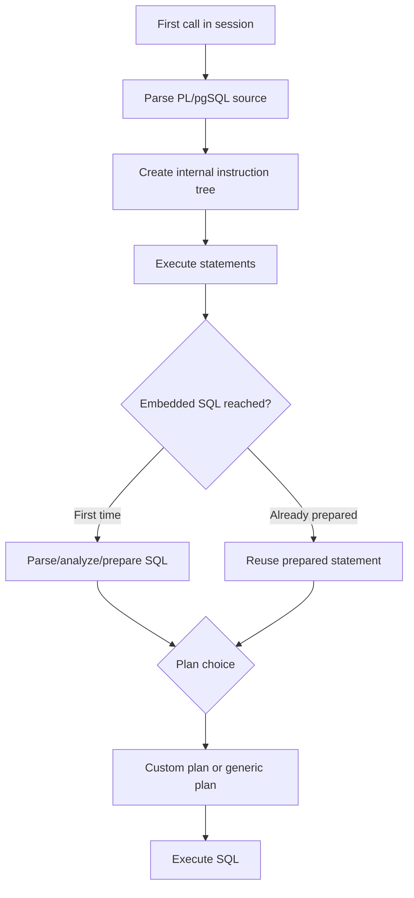
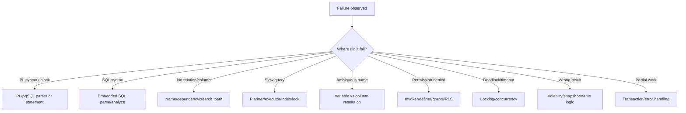

# Part 002 — PL/pgSQL Runtime Model and Execution Boundaries

This part answers a deceptively simple question:

> What actually happens when PL/pgSQL runs?

Without this model, engineers usually make four mistakes:

1. they assume PL/pgSQL is compiled like application code;
2. they assume embedded SQL is just string execution;
3. they do not understand plan caching and parameter substitution;
4. they confuse function, procedure, trigger, and anonymous block boundaries.

PL/pgSQL is easier to use than to reason about. This part builds the runtime model that later parts depend on.

---

## 1. Runtime Model in One Page

A PL/pgSQL routine is stored as database metadata, invoked through PostgreSQL, interpreted by the PL/pgSQL runtime, and uses PostgreSQL’s SQL engine for embedded SQL commands.

High-level flow:

```mermaid
flowchart TD
    A[Client sends SQL] --> B{Invocation form}
    B -->|SELECT fn(...)| C[Function call]
    B -->|CALL proc(...)| D[Procedure call]
    B -->|INSERT/UPDATE/DELETE/MERGE| E[Trigger firing]
    B -->|DO $$...$$| F[Anonymous block]

    C --> G[PostgreSQL executor invokes PL/pgSQL]
    D --> G
    E --> G
    F --> G

    G --> H[PL/pgSQL instruction tree]
    H --> I[Procedural statements]
    H --> J[Embedded SQL statements]
    J --> K[Parser / analyzer / planner / executor]
    K --> L[Tables, indexes, locks, constraints, WAL]
```

The key separation:

```txt
PL/pgSQL runtime:
    variables, blocks, IF, LOOP, exceptions, RETURN, trigger variables

PostgreSQL SQL engine:
    SELECT, INSERT, UPDATE, DELETE, MERGE, EXPLAIN, locks, indexes, constraints
```

PL/pgSQL is not a separate database. It is procedural control flow wrapped around normal PostgreSQL execution.

---

## 2. PL/pgSQL Objects Are Database Objects

A PL/pgSQL function is created with `CREATE FUNCTION`.

A PL/pgSQL procedure is created with `CREATE PROCEDURE`.

A trigger function is still created with `CREATE FUNCTION`, but attached to a table or event with `CREATE TRIGGER` or `CREATE EVENT TRIGGER`.

A `DO` block is an anonymous transient function-like block executed once.

This matters because routines have database-level properties:

- schema;
- name;
- argument types;
- owner;
- privileges;
- language;
- volatility;
- security mode;
- cost;
- parallel-safety annotation;
- dependency behavior;
- configuration settings;
- source text.

Example:

```sql
CREATE OR REPLACE FUNCTION enforcement.case_age_days(
    p_opened_at timestamptz,
    p_as_of timestamptz DEFAULT clock_timestamp()
)
RETURNS integer
LANGUAGE plpgsql
STABLE
AS $$
BEGIN
    RETURN floor(extract(epoch FROM (p_as_of - p_opened_at)) / 86400)::integer;
END;
$$;
```

This is not only code. It is schema state.

That has direct operational consequences:

- replacing the body is a migration;
- changing argument types creates a different function identity;
- changing return type may require drop/recreate;
- grants can survive `CREATE OR REPLACE FUNCTION`;
- dependencies may exist from views, triggers, policies, and queries;
- callers may depend on output column names.

---

## 3. Invocation Forms

PL/pgSQL can run through several entry points.

### 3.1 Function Invocation

Functions are called from SQL expressions.

Examples:

```sql
SELECT enforcement.case_age_days(opened_at)
FROM enforcement.case;
```

```sql
SELECT *
FROM enforcement.transition_case(
    p_case_id => 42,
    p_target_status => 'under_review',
    p_actor_id => 7,
    p_reason_code => 'evidence_received',
    p_idempotency_key => '3c8a1a5c-77f8-4ec8-92cb-d3a5d2a04845'
);
```

Function implications:

- returns a value, row, table, set, or `void`;
- can be used inside larger SQL statements;
- cannot control transactions with `COMMIT`/`ROLLBACK`;
- may be executed many times by a query;
- annotations such as volatility, parallel-safety, cost, and rows matter;
- side-effecting functions are possible but must be treated carefully.

### 3.2 Procedure Invocation

Procedures are invoked with `CALL`.

```sql
CALL maintenance.rebuild_case_rollups(p_batch_size => 10000);
```

Procedure implications:

- does not return a scalar in expression position;
- may have output parameters;
- can perform transaction control only under specific invocation conditions;
- fits operational commands and maintenance routines better than expression-level computation.

A practical distinction:

```txt
Function:
    “Compute or perform a database command and return a value to SQL.”

Procedure:
    “Run a server-side operation as a top-level command.”
```

### 3.3 Trigger Invocation

A trigger function is invoked by PostgreSQL as a side effect of table or event activity.

```sql
CREATE OR REPLACE FUNCTION enforcement.case_transition_ai_apply()
RETURNS trigger
LANGUAGE plpgsql
AS $$
BEGIN
    UPDATE enforcement.case c
    SET status = NEW.to_status,
        version = c.version + 1,
        updated_at = NEW.happened_at
    WHERE c.id = NEW.case_id;

    RETURN NEW;
END;
$$;
```

Trigger implications:

- caller does not call it directly;
- special variables such as `NEW`, `OLD`, and `TG_OP` exist;
- behavior is coupled to table writes;
- every relevant write pays the cost;
- bulk operations and migrations must account for it.

### 3.4 Anonymous DO Block

A `DO` block executes transient procedural code.

```sql
DO $$
DECLARE
    v_schema name := 'enforcement';
BEGIN
    RAISE NOTICE 'Preparing schema %', v_schema;
END;
$$;
```

`DO` implications:

- useful for migrations, admin tasks, and quick metadata operations;
- treated like a function body with no parameters and `void` return;
- parsed and executed once;
- should not become permanent application logic;
- transaction control is restricted when executed inside an explicit transaction block.

---

## 4. Function Identity and Overloading

PostgreSQL identifies functions and procedures primarily by:

```txt
schema + name + input argument types
```

That means these are different functions:

```sql
CREATE FUNCTION enforcement.score_case(p_case_id bigint)
RETURNS numeric
LANGUAGE plpgsql
AS $$
BEGIN
    RETURN 0;
END;
$$;

CREATE FUNCTION enforcement.score_case(p_case_id bigint, p_as_of timestamptz)
RETURNS numeric
LANGUAGE plpgsql
AS $$
BEGIN
    RETURN 0;
END;
$$;
```

Operational consequence:

```txt
CREATE OR REPLACE can replace a body.
It cannot safely be treated as arbitrary API evolution.
```

Changing return shape, output names, or input types can break callers.

For production APIs, prefer one of these strategies:

1. stable signature with compatible body changes;
2. explicit versioned function name, such as `transition_case_v2`;
3. new composite return type with migration period;
4. wrapper function preserving old behavior;
5. application release coordinated with database migration.

---

## 5. The Function Body Is a String Literal

In `CREATE FUNCTION`, the PL/pgSQL body is supplied as a string literal. Dollar quoting is used to avoid escaping every quote.

```sql
CREATE OR REPLACE FUNCTION enforcement.normalize_reason_code(p_reason_code text)
RETURNS text
LANGUAGE plpgsql
IMMUTABLE
AS $$
BEGIN
    RETURN lower(trim(p_reason_code));
END;
$$;
```

The `$$` delimiters are not PL/pgSQL syntax. They are PostgreSQL string literal delimiters.

You can also use tagged delimiters:

```sql
CREATE OR REPLACE FUNCTION enforcement.example_quote()
RETURNS text
LANGUAGE plpgsql
AS $function$
BEGIN
    RETURN 'a value with ''quotes'' inside';
END;
$function$;
```

Production convention:

- use dollar quoting;
- use stable tags for generated SQL when nesting quote layers;
- avoid single-quoted function bodies;
- schema-qualify object references in security-sensitive code;
- avoid naming delimiters that can appear in the body.

---

## 6. Block Structure Runtime

PL/pgSQL is block-structured.

Canonical shape:

```sql
[ <<label>> ]
[ DECLARE
    declarations ]
BEGIN
    statements
END [ label ];
```

Inside a function:

```sql
CREATE OR REPLACE FUNCTION enforcement.example_block(p_case_id bigint)
RETURNS text
LANGUAGE plpgsql
AS $$
<<fn>>
DECLARE
    v_status text;
BEGIN
    SELECT c.status
    INTO v_status
    FROM enforcement.case c
    WHERE c.id = p_case_id;

    IF NOT FOUND THEN
        RETURN 'missing';
    END IF;

    RETURN fn.v_status;
END;
$$;
```

Runtime consequences:

- variables live within block scope;
- subblocks can shadow outer variables;
- labels can qualify variables;
- parameters exist in a hidden outer block labeled with the function name;
- statements end with semicolons;
- `BEGIN`/`END` here are procedural block delimiters, not transaction commands.

That final point is important:

```txt
PL/pgSQL BEGIN/END:
    starts and ends a procedural block.

SQL BEGIN/COMMIT:
    starts and ends a transaction block.
```

Do not confuse them.

---

## 7. The Hidden Outer Block

Every PL/pgSQL function has an implicit outer block containing parameters and special variables such as `FOUND`.

This means function parameters can be qualified by function name.

Example:

```sql
CREATE OR REPLACE FUNCTION enforcement.find_case_status(id bigint)
RETURNS text
LANGUAGE plpgsql
AS $$
DECLARE
    v_status text;
BEGIN
    SELECT c.status
    INTO v_status
    FROM enforcement.case c
    WHERE c.id = find_case_status.id;

    RETURN v_status;
END;
$$;
```

This is legal, but the naming is poor because parameter `id` can collide with column names. A better convention:

```sql
CREATE OR REPLACE FUNCTION enforcement.find_case_status(p_case_id bigint)
RETURNS text
LANGUAGE plpgsql
AS $$
DECLARE
    v_status text;
BEGIN
    SELECT c.status
    INTO v_status
    FROM enforcement.case c
    WHERE c.id = p_case_id;

    RETURN v_status;
END;
$$;
```

Production convention used in this series:

```txt
p_ prefix = input parameter
v_ prefix = local variable
r_ prefix = record variable
c_ prefix = cursor or constant when useful
```

The point is not aesthetics. The point is avoiding SQL-column/PL-variable ambiguity.

---

## 8. Embedded SQL Execution Boundary

PL/pgSQL has statements it understands directly:

- assignment;
- `IF`;
- `CASE`;
- loops;
- `RETURN`;
- `RAISE`;
- `EXECUTE`;
- exception blocks;
- cursor operations;
- diagnostics.

SQL commands that are not PL/pgSQL-specific are sent to PostgreSQL’s SQL engine.

Example:

```sql
CREATE OR REPLACE FUNCTION enforcement.touch_case(p_case_id bigint)
RETURNS void
LANGUAGE plpgsql
AS $$
BEGIN
    UPDATE enforcement.case c
    SET updated_at = clock_timestamp()
    WHERE c.id = p_case_id;
END;
$$;
```

The `UPDATE` is not executed by a PL/pgSQL mini-database. PL/pgSQL passes it into PostgreSQL’s normal SQL machinery.

That means:

- indexes matter;
- constraints matter;
- locks matter;
- triggers can fire;
- row-level security can matter depending on privileges and security mode;
- errors are PostgreSQL errors;
- planning matters.

---

## 9. Assignment Is Also SQL-Backed

A PL/pgSQL assignment looks like local code:

```sql
v_due_at := p_opened_at + interval '14 days';
```

But PL/pgSQL expressions are evaluated through PostgreSQL expression machinery. Type coercion follows database rules.

Implication:

```sql
v_amount := p_payload->>'amount';
```

This may involve text conversion and assignment casts. If the string cannot be converted to the target type, the error happens at runtime.

Prefer explicit conversion when failure clarity matters:

```sql
v_amount := (p_payload->>'amount')::numeric;
```

And for production contracts, validate before conversion when the input is externally supplied JSON.

---

## 10. Variable Substitution

PL/pgSQL variables can appear inside SQL commands.

Example:

```sql
CREATE OR REPLACE FUNCTION enforcement.load_case(p_case_id bigint)
RETURNS enforcement.case
LANGUAGE plpgsql
AS $$
DECLARE
    v_case enforcement.case%ROWTYPE;
BEGIN
    SELECT *
    INTO v_case
    FROM enforcement.case c
    WHERE c.id = p_case_id;

    RETURN v_case;
END;
$$;
```

Here `p_case_id` becomes a query parameter behind the scenes. PL/pgSQL does not paste the value into the SQL text.

This is good:

- safer than string concatenation;
- allows prepared statement behavior;
- supports plan caching;
- avoids quoting errors for values.

But variable substitution can only represent **data values**, not object names.

This does not work as dynamic table selection:

```sql
-- Wrong mental model
SELECT count(*)
FROM p_table_name;
```

If an identifier must be dynamic, you need dynamic SQL with `EXECUTE`.

```sql
EXECUTE format('SELECT count(*) FROM %I.%I', p_schema_name, p_table_name)
INTO v_count;
```

The separation is fundamental:

```txt
Value changes:
    use normal SQL with PL/pgSQL variables.

Identifier/object changes:
    use dynamic SQL safely.
```

---

## 11. Name Resolution Ambiguity

Ambiguity happens when a name could refer to a PL/pgSQL variable or a SQL column.

Bad example:

```sql
CREATE OR REPLACE FUNCTION enforcement.bad_update_case_status(
    id bigint,
    status text
)
RETURNS void
LANGUAGE plpgsql
AS $$
BEGIN
    UPDATE enforcement.case
    SET status = status
    WHERE id = id;
END;
$$;
```

This is a bug factory.

Better:

```sql
CREATE OR REPLACE FUNCTION enforcement.update_case_status(
    p_case_id bigint,
    p_status text
)
RETURNS void
LANGUAGE plpgsql
AS $$
BEGIN
    UPDATE enforcement.case c
    SET status = p_status
    WHERE c.id = p_case_id;
END;
$$;
```

Rules:

- prefix variables and parameters;
- alias tables;
- qualify columns with aliases;
- qualify variables with block labels only when needed;
- never use column-like names for parameters in mutation functions.

This series will heavily use table aliases because they make SQL intent explicit.

---

## 12. Plan Caching: The First Performance Boundary

PL/pgSQL is not pure string interpretation on every statement.

The important runtime behavior:

1. The PL/pgSQL function source is parsed into an internal instruction tree the first time it is called in a session.
2. Individual SQL expressions and SQL commands inside the function are not fully prepared until first executed.
3. When an embedded SQL statement is first reached, PL/pgSQL prepares it through PostgreSQL’s server programming interface machinery.
4. Later visits can reuse the prepared statement.
5. PostgreSQL may use custom or generic plans depending on parameter sensitivity and execution behavior.

Mental model:



Why this matters:

- rarely executed branches may not pay preparation cost in a session;
- static SQL inside PL/pgSQL expects the same referenced objects each execution;
- dynamic SQL replans each execution;
- parameter-sensitive queries can suffer if generic plans are poor;
- schema changes can interact with cached plans in ways you must test.

We will deep-dive plan caching later. For now, remember:

```txt
Static embedded SQL:
    safer, parameterized, cacheable, object references fixed.

Dynamic EXECUTE:
    flexible object names, no plan cache reuse for the dynamic command string in the same way, safer only if constructed carefully.
```

---

## 13. Static SQL vs Dynamic SQL Boundary

### 13.1 Static SQL

Use static SQL when table and column names are known.

```sql
SELECT c.status
INTO v_status
FROM enforcement.case c
WHERE c.id = p_case_id;
```

Benefits:

- easier to read;
- safer value substitution;
- better dependency clarity;
- potential plan caching;
- less injection risk.

### 13.2 Dynamic SQL

Use dynamic SQL when object names or SQL structure must vary.

```sql
EXECUTE format(
    'SELECT count(*) FROM %I.%I WHERE created_at >= $1',
    p_schema_name,
    p_table_name
)
INTO v_count
USING p_since;
```

Important pattern:

```txt
format('%I', identifier) for identifiers
format('%L', literal) only when literal embedding is required
USING for values whenever possible
```

Do not do this:

```sql
EXECUTE 'SELECT count(*) FROM ' || p_table_name ||
        ' WHERE created_at >= ''' || p_since || '''';
```

That mixes identifiers, values, quoting, and injection risk.

---

## 14. Transaction Boundary

PL/pgSQL usually runs inside the caller’s transaction.

For functions, think:

```txt
Application starts transaction
    -> SELECT enforcement.transition_case(...)
        -> function reads/writes
        -> errors propagate
Application COMMIT or ROLLBACK
```

A PL/pgSQL function cannot commit independently.

Procedures and `DO` blocks can perform transaction control only under specific conditions. For example, transaction control is possible in procedures invoked by `CALL` and anonymous blocks invoked by `DO`, but not when the call is inside a surrounding transaction block that disallows it.

Design consequence:

```txt
Use functions for atomic commands inside caller transaction.
Use procedures for operational routines that may intentionally commit in chunks.
```

Do not casually add commits to server-side code. Chunked transaction control changes failure recovery, locks, visibility, and caller expectations.

---

## 15. Runtime Boundary of Errors

An unhandled error exits the function and aborts the current transaction context.

Example:

```sql
CREATE OR REPLACE FUNCTION enforcement.require_case(p_case_id bigint)
RETURNS enforcement.case
LANGUAGE plpgsql
AS $$
DECLARE
    v_case enforcement.case%ROWTYPE;
BEGIN
    SELECT *
    INTO STRICT v_case
    FROM enforcement.case c
    WHERE c.id = p_case_id;

    RETURN v_case;
END;
$$;
```

`INTO STRICT` raises an error if the query returns zero rows or more than one row. That can be exactly what you want for an invariant, but not for every API.

A command function should often shape expected failures:

```sql
IF NOT FOUND THEN
    RAISE EXCEPTION USING
        ERRCODE = 'P0002',
        MESSAGE = 'case not found',
        DETAIL = format('case_id=%s', p_case_id),
        HINT = 'Verify that the case exists and is visible to the caller';
END IF;
```

Error design is a runtime boundary because it defines whether the caller sees:

- a domain rejection;
- a retryable concurrency failure;
- a permission problem;
- a system bug;
- a data corruption signal.

Later parts will define a complete error taxonomy.

---

## 16. Volatility Boundary

A function has a volatility annotation:

```sql
IMMUTABLE | STABLE | VOLATILE
```

This tells PostgreSQL what assumptions it may make about the function.

Simplified production guidance:

| Annotation | Meaning in design terms | Example |
|---|---|---|
| `IMMUTABLE` | same inputs always produce same output, no database/session/time dependency | pure normalization of a string |
| `STABLE` | same result within a statement for same inputs, may read database | lookup-like calculation |
| `VOLATILE` | can change every call or has side effects | mutation command, uses `clock_timestamp()`, writes rows |

Be conservative.

Mislabeling a function as more stable than it really is can produce wrong query behavior. A side-effecting command function should be `VOLATILE`.

Example:

```sql
CREATE OR REPLACE FUNCTION enforcement.normalize_status(p_status text)
RETURNS text
LANGUAGE plpgsql
IMMUTABLE
AS $$
BEGIN
    RETURN lower(trim(p_status));
END;
$$;
```

But this should not be `IMMUTABLE`:

```sql
CREATE OR REPLACE FUNCTION enforcement.current_case_count()
RETURNS bigint
LANGUAGE plpgsql
STABLE
AS $$
DECLARE
    v_count bigint;
BEGIN
    SELECT count(*) INTO v_count FROM enforcement.case;
    RETURN v_count;
END;
$$;
```

It reads database state. Depending on use, `STABLE` may fit; `IMMUTABLE` does not.

A mutation function:

```sql
CREATE OR REPLACE FUNCTION enforcement.touch_case(p_case_id bigint)
RETURNS void
LANGUAGE plpgsql
VOLATILE
AS $$
BEGIN
    UPDATE enforcement.case
    SET updated_at = clock_timestamp()
    WHERE id = p_case_id;
END;
$$;
```

---

## 17. Parallel-Safety Boundary

Functions can be annotated for parallel query behavior:

```sql
PARALLEL SAFE | PARALLEL RESTRICTED | PARALLEL UNSAFE
```

For this series, assume:

- mutation functions are `PARALLEL UNSAFE`;
- functions that read or depend on session state need careful classification;
- pure computation can sometimes be `PARALLEL SAFE`;
- when unsure, prefer correctness over planner optimism.

This matters because a function may be called inside a query plan. Your annotation can influence whether PostgreSQL can use parallel execution.

---

## 18. Security Boundary

Every function and procedure runs as either:

```txt
SECURITY INVOKER
SECURITY DEFINER
```

`SECURITY INVOKER` means the routine runs with the privileges of the caller. This is the default.

`SECURITY DEFINER` means it runs with privileges of the owner.

Use `SECURITY DEFINER` only when it creates a deliberate, narrow capability.

Example use case:

```txt
API role may transition a case through a function.
API role may not directly update enforcement.case or insert enforcement.case_event.
```

Sketch:

```sql
CREATE OR REPLACE FUNCTION enforcement.transition_case(...)
RETURNS enforcement.transition_result
LANGUAGE plpgsql
SECURITY DEFINER
SET search_path = enforcement, pg_temp
AS $$
BEGIN
    -- validate, lock, write, audit
END;
$$;
```

The `SET search_path` is not decoration. It is part of the threat model. Without a hardened search path and schema qualification discipline, security-definer code can become dangerous.

This will get a dedicated part later.

---

## 19. Session and Configuration Boundary

A routine executes inside a database session. Session settings can influence behavior:

- `search_path`;
- timezone;
- statement timeout;
- lock timeout;
- role;
- custom application settings;
- planner settings;
- locale/collation-related behavior;
- temporary tables.

You can attach `SET` clauses to functions/procedures for controlled execution environment.

Example:

```sql
CREATE OR REPLACE FUNCTION enforcement.secure_command(p_case_id bigint)
RETURNS void
LANGUAGE plpgsql
SECURITY DEFINER
SET search_path = enforcement, pg_temp
SET lock_timeout = '2s'
AS $$
BEGIN
    -- command body
END;
$$;
```

Be careful with timeouts. A low `lock_timeout` can make a command fail fast, but it also becomes part of the API’s retry behavior.

---

## 20. Memory and Result Boundary

PL/pgSQL code can accidentally materialize data.

Common risks:

- `SELECT array_agg(...)` over huge rows;
- building large JSON payloads in memory;
- `RETURN QUERY` with massive intermediate results;
- loops that accumulate unbounded state;
- cursor misuse;
- temporary table bloat;
- exception-heavy loops.

A database-side routine runs on the database server. Its memory and CPU pressure compete with the workload that keeps the system alive.

Rule:

```txt
Do not move heavy compute into PL/pgSQL unless database locality is the reason and resource impact is measured.
```

---

## 21. Caller Multiplicity Boundary

A function can be called once:

```sql
SELECT enforcement.transition_case(...);
```

Or once per row:

```sql
SELECT c.id, enforcement.case_risk_score(c.id)
FROM enforcement.case c
WHERE c.status = 'open';
```

Those are radically different.

If `case_risk_score()` executes multiple queries internally, the second query can become an N+1 query pattern inside the database.

Bad shape:

```sql
CREATE OR REPLACE FUNCTION enforcement.case_risk_score(p_case_id bigint)
RETURNS numeric
LANGUAGE plpgsql
STABLE
AS $$
DECLARE
    v_score numeric := 0;
BEGIN
    SELECT count(*) * 10
    INTO v_score
    FROM enforcement.evidence e
    WHERE e.case_id = p_case_id;

    RETURN v_score;
END;
$$;
```

Then:

```sql
SELECT c.id, enforcement.case_risk_score(c.id)
FROM enforcement.case c;
```

This may execute the internal query many times.

Better for bulk reporting:

```sql
SELECT c.id, count(e.id) * 10 AS risk_score
FROM enforcement.case c
LEFT JOIN enforcement.evidence e ON e.case_id = c.id
GROUP BY c.id;
```

Rule:

```txt
A function that is safe as a command may be unsafe as a per-row expression.
```

Document expected invocation shape.

---

## 22. Trigger Boundary

Trigger functions have special runtime context.

They receive no normal arguments in the way ordinary functions do. Instead, PostgreSQL provides trigger context variables.

Common variables:

```txt
NEW       row being inserted/updated
OLD       row being updated/deleted
TG_OP     INSERT | UPDATE | DELETE | TRUNCATE
TG_TABLE_SCHEMA
TG_TABLE_NAME
TG_WHEN
TG_LEVEL
TG_ARGV[]
```

Example:

```sql
CREATE OR REPLACE FUNCTION enforcement.case_bu_set_updated_at()
RETURNS trigger
LANGUAGE plpgsql
AS $$
BEGIN
    IF TG_OP = 'UPDATE' THEN
        NEW.updated_at := clock_timestamp();
    END IF;

    RETURN NEW;
END;
$$;
```

Boundary consequences:

- `BEFORE` row triggers can modify `NEW`;
- `AFTER` triggers cannot change the row already written;
- statement triggers behave differently from row triggers;
- trigger execution is part of the original statement;
- trigger errors abort the triggering statement;
- trigger recursion must be considered.

Trigger design is one of the highest-risk PL/pgSQL areas because the caller may not see the control flow.

---

## 23. Procedure Transaction Boundary

Procedures are often misunderstood.

A procedure invoked by `CALL` may be able to use transaction control statements such as `COMMIT` and `ROLLBACK`, but not in every context.

A practical model:

```txt
CALL maintenance.proc();
    may control transactions if top-level invocation allows it

BEGIN;
CALL maintenance.proc();
COMMIT;
    procedure cannot freely commit inside this explicit transaction block
```

Chunked maintenance procedure sketch:

```sql
CREATE OR REPLACE PROCEDURE maintenance.backfill_case_flags(p_batch_size integer)
LANGUAGE plpgsql
AS $$
DECLARE
    v_rows integer;
BEGIN
    LOOP
        WITH batch AS (
            SELECT c.id
            FROM enforcement.case c
            WHERE c.flags_backfilled = false
            ORDER BY c.id
            LIMIT p_batch_size
            FOR UPDATE SKIP LOCKED
        )
        UPDATE enforcement.case c
        SET flags_backfilled = true
        FROM batch b
        WHERE c.id = b.id;

        GET DIAGNOSTICS v_rows = ROW_COUNT;

        COMMIT;

        EXIT WHEN v_rows = 0;
    END LOOP;
END;
$$;
```

This example is intentionally incomplete for production. A real version needs:

- progress logging;
- failure recovery;
- lock timeout strategy;
- batch ordering;
- max runtime;
- monitoring;
- safe invocation documentation;
- clarity about whether `COMMIT` is legal in the caller context.

We will revisit this in maintenance and migration parts.

---

## 24. DO Block Boundary

Use `DO` for one-off procedural execution.

Good uses:

- migration metadata loop;
- grant generation;
- one-time validation script;
- admin repair script;
- throwaway exploration.

Bad uses:

- permanent business behavior;
- code copied across migrations with no tests;
- complex hidden deployment logic;
- non-idempotent data repair without audit.

Example: generating grants safely.

```sql
DO $$
DECLARE
    r record;
BEGIN
    FOR r IN
        SELECT table_schema, table_name
        FROM information_schema.tables
        WHERE table_schema = 'enforcement'
          AND table_type = 'BASE TABLE'
    LOOP
        EXECUTE format(
            'GRANT SELECT ON TABLE %I.%I TO reporting_readonly',
            r.table_schema,
            r.table_name
        );
    END LOOP;
END;
$$;
```

Notice the use of `format('%I.%I', ...)` for identifiers.

---

## 25. Runtime Failure Map

When a PL/pgSQL routine fails, locate the boundary.



This map prevents vague debugging.

Do not say:

```txt
The function is slow.
```

Say:

```txt
The function is slow because embedded statement 3 chooses a generic plan that scans case_event for a selective case_id under current parameter distribution.
```

Or:

```txt
The function blocks because it locks case rows after escalation rows, while another command locks them in the opposite order.
```

Precise boundary diagnosis is the production skill.

---

## 26. Implementation Example: Boundary-Aware Command Skeleton

This skeleton is intentionally verbose. It shows runtime decisions explicitly.

```sql
CREATE OR REPLACE FUNCTION enforcement.transition_case_skeleton(
    p_case_id bigint,
    p_target_status text,
    p_actor_id bigint,
    p_reason_code text,
    p_idempotency_key uuid
)
RETURNS TABLE (
    transition_id bigint,
    resulting_status text,
    resulting_version integer
)
LANGUAGE plpgsql
VOLATILE
SECURITY DEFINER
SET search_path = enforcement, pg_temp
AS $$
DECLARE
    v_case enforcement.case%ROWTYPE;
    v_existing_transition_id bigint;
BEGIN
    -- 1. Idempotency boundary.
    SELECT t.id
    INTO v_existing_transition_id
    FROM enforcement.case_transition t
    WHERE t.idempotency_key = p_idempotency_key;

    IF FOUND THEN
        RETURN QUERY
        SELECT t.id, c.status, c.version
        FROM enforcement.case_transition t
        JOIN enforcement.case c ON c.id = t.case_id
        WHERE t.id = v_existing_transition_id;
        RETURN;
    END IF;

    -- 2. Concurrency boundary.
    SELECT *
    INTO v_case
    FROM enforcement.case c
    WHERE c.id = p_case_id
    FOR UPDATE;

    IF NOT FOUND THEN
        RAISE EXCEPTION USING
            ERRCODE = 'P0002',
            MESSAGE = 'case not found',
            DETAIL = format('case_id=%s', p_case_id);
    END IF;

    -- 3. Domain validation boundary.
    IF v_case.status = p_target_status THEN
        RAISE EXCEPTION USING
            ERRCODE = 'P0001',
            MESSAGE = 'case already in target status',
            DETAIL = format('case_id=%s status=%s', p_case_id, p_target_status);
    END IF;

    -- 4. Mutation boundary.
    INSERT INTO enforcement.case_transition (
        case_id,
        from_status,
        to_status,
        actor_id,
        reason_code,
        idempotency_key,
        happened_at
    )
    VALUES (
        p_case_id,
        v_case.status,
        p_target_status,
        p_actor_id,
        p_reason_code,
        p_idempotency_key,
        clock_timestamp()
    )
    RETURNING id INTO transition_id;

    UPDATE enforcement.case c
    SET status = p_target_status,
        version = c.version + 1,
        updated_at = clock_timestamp()
    WHERE c.id = p_case_id
    RETURNING c.status, c.version
    INTO resulting_status, resulting_version;

    -- 5. Audit boundary.
    INSERT INTO enforcement.case_event (
        case_id,
        event_type,
        payload,
        happened_at
    )
    VALUES (
        p_case_id,
        'case_transitioned',
        jsonb_build_object(
            'transition_id', transition_id,
            'from_status', v_case.status,
            'to_status', p_target_status,
            'actor_id', p_actor_id,
            'reason_code', p_reason_code
        ),
        clock_timestamp()
    );

    RETURN NEXT;
END;
$$;
```

What this skeleton demonstrates:

- the function is a command, so `VOLATILE` is appropriate;
- `SECURITY DEFINER` requires `search_path` discipline;
- idempotency is checked before mutation;
- target case row is locked before state mutation;
- expected failure is shaped;
- audit event is written in same transaction;
- output gives caller enough information.

What it still does not solve fully:

- duplicate idempotency race unless backed by a unique constraint and conflict handling;
- illegal transition validation;
- actor authorization;
- null input validation;
- retry behavior;
- structured SQLSTATE taxonomy;
- tests;
- benchmark behavior;
- lock timeout strategy;
- versioned deployment.

That is why production PL/pgSQL is a series, not a snippet.

---

## 27. Checklist: Runtime Questions Before Writing Code

Before implementing a routine, answer:

### Invocation

- Is this called through `SELECT`, `CALL`, trigger, or `DO`?
- Can it be used inside a larger query?
- Can it be called per row?
- Is it expected to mutate data?

### Execution

- Which embedded SQL statements are static?
- Which must be dynamic?
- Are object names fixed?
- Are values passed as parameters rather than concatenated?

### Planning

- Could parameter distribution cause bad generic plans?
- Is dynamic SQL required to force replanning?
- Is the function called frequently enough for plan caching to matter?

### Transaction

- Does it run inside caller transaction?
- Does it require independent commits?
- Is it retry-safe?
- Are exception blocks used intentionally?

### Security

- Is it invoker or definer?
- Is `search_path` controlled?
- Are all object references schema-qualified where needed?
- Are grants narrow?

### Operations

- How is slowness observed?
- How are expected domain errors distinguished from system errors?
- What logs or audit rows are emitted?
- What happens under lock contention?

---

## 28. Part 002 Summary

PL/pgSQL runs as procedural control flow inside PostgreSQL, but embedded SQL is still planned and executed by PostgreSQL’s SQL engine.

The main runtime boundaries are:

```txt
Invocation boundary:
    function vs procedure vs trigger vs DO

SQL boundary:
    PL/pgSQL statements vs embedded SQL commands

Planning boundary:
    static SQL caching vs dynamic SQL replanning

Transaction boundary:
    caller transaction vs procedure/DO transaction control conditions

Security boundary:
    invoker vs definer, grants, search_path

Operational boundary:
    database CPU, locks, memory, errors, logs, observability
```

If Part 001 taught where PL/pgSQL belongs, Part 002 taught how it actually runs.

The next part will turn this into concrete design choices between functions, procedures, triggers, and `DO` blocks.

---

## 29. References

- PostgreSQL Documentation — Chapter 41, PL/pgSQL: SQL Procedural Language: `https://www.postgresql.org/docs/current/plpgsql.html`
- PostgreSQL Documentation — PL/pgSQL Overview: `https://www.postgresql.org/docs/current/plpgsql-overview.html`
- PostgreSQL Documentation — Structure of PL/pgSQL: `https://www.postgresql.org/docs/current/plpgsql-structure.html`
- PostgreSQL Documentation — Basic Statements: `https://www.postgresql.org/docs/current/plpgsql-statements.html`
- PostgreSQL Documentation — PL/pgSQL under the Hood: `https://www.postgresql.org/docs/current/plpgsql-implementation.html`
- PostgreSQL Documentation — Transaction Management: `https://www.postgresql.org/docs/current/plpgsql-transactions.html`
- PostgreSQL Documentation — CREATE FUNCTION: `https://www.postgresql.org/docs/current/sql-createfunction.html`
- PostgreSQL Documentation — CREATE PROCEDURE: `https://www.postgresql.org/docs/current/sql-createprocedure.html`
- PostgreSQL Documentation — CALL: `https://www.postgresql.org/docs/current/sql-call.html`
- PostgreSQL Documentation — DO: `https://www.postgresql.org/docs/current/sql-do.html`
