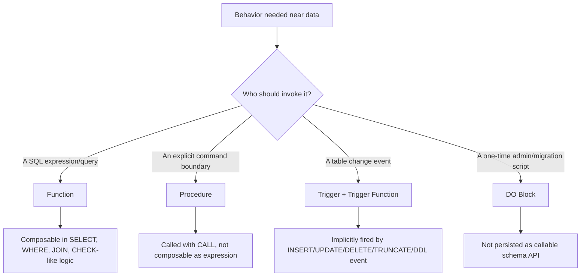
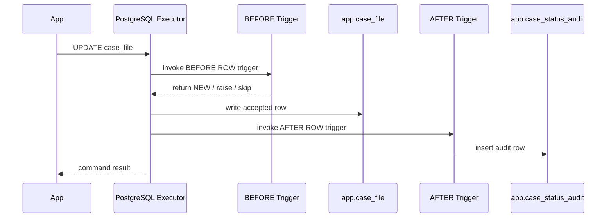
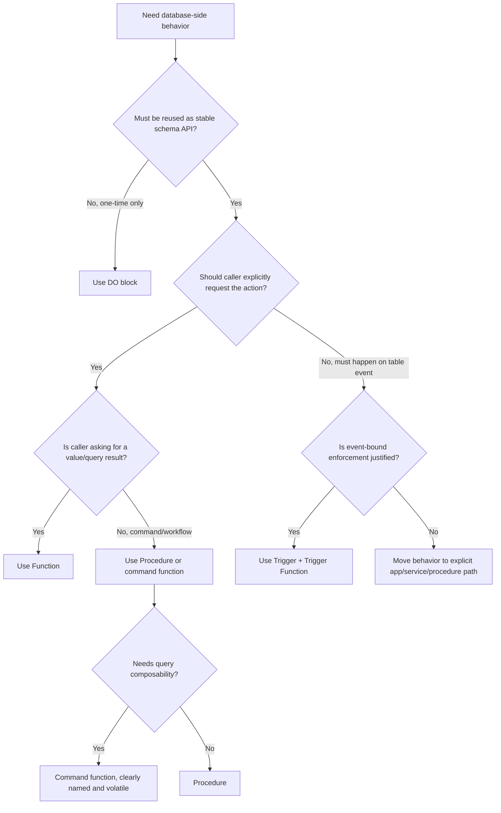

# Part 003 — Function, Procedure, Trigger, and DO Block Design

This part answers a practical question:

> When should database-side behavior be a function, a procedure, a trigger, or a `DO` block?

This is not just a syntax decision. It is an execution-contract decision.

A weak engineer asks:

> “Where can I put this code?”

A strong engineer asks:

> “How should this behavior be invoked, observed, tested, deployed, rolled back, secured, and reasoned about under concurrency?”

PL/pgSQL gives you several executable shapes:

- **function**: called as an expression or table source;
- **procedure**: called explicitly with `CALL`;
- **trigger function**: called implicitly by a trigger event;
- **trigger object**: attaches a trigger function to a table, view, or event;
- **anonymous `DO` block**: one-shot executable block.

They are not interchangeable in production design.

---

## 1. The Core Mental Model

Think of each PL/pgSQL executable form as an API with a different caller.



The key question is not “which one is more powerful?”

The key question is:

> What invocation model makes the behavior least surprising?

A behavior that must be intentionally requested should not hide in a trigger.  
A behavior that must be query-composable should not be a procedure.  
A behavior that must enforce table mutation invariants may need a trigger.  
A behavior that exists only for one migration should not become permanent schema API.

---

## 2. Decision Matrix

Use this table before writing code.

| Need | Prefer | Reason |
|---|---|---|
| Return a scalar value inside SQL | Function | Functions can be used in expressions. |
| Return a table-like result | Function returning table / set | Query callers can join/filter/project the result. |
| Encapsulate read-only query logic | Function, often `STABLE` | Gives a queryable contract without hiding writes. |
| Encapsulate explicit write workflow | Procedure or command function | Caller intent should be obvious. |
| Need transaction control inside routine | Procedure, with restrictions | Functions cannot do transaction control. |
| Enforce invariant on every table mutation | Trigger | The database itself must guard the invariant. |
| Populate derived row fields before write | `BEFORE ROW` trigger | Can modify `NEW` before storage. |
| Audit final persisted changes | `AFTER ROW` or `AFTER STATEMENT` trigger | Sees effects after operation. |
| Validate a migration precondition | `DO` block | One-time operational script, not persistent API. |
| Perform metadata-driven one-off repair | `DO` block or temporary procedure | Avoid long-lived hidden code. |
| Shared pure domain calculation | Function | Reusable and testable. |
| Hidden side effect during normal `SELECT` | Usually avoid | Surprising, hard to operate, can repeat unexpectedly. |
| Cross-table cascade with complex business meaning | Usually avoid trigger; prefer explicit procedure/service | Hidden workflows become hard to trace and debug. |

The table is deliberately conservative. In database engineering, “clever” usually becomes “invisible production coupling”.

---

## 3. Functions: Query-Compatible Contracts

A PostgreSQL function is created with `CREATE FUNCTION`. In PL/pgSQL, the body is a block of PL/pgSQL code stored as a database object.

A function can return:

- a scalar value;
- a composite value;
- `void`;
- a set of values;
- a table-shaped result through `RETURNS TABLE`;
- values through `OUT` parameters.

A function can be invoked from SQL:

```sql
select app.calculate_penalty_amount(100000, 14);
```

or used as a table source:

```sql
select *
from app.search_open_cases('AML', limit_count => 50);
```

That composability is the function's power.

It is also the source of risk.

If a function hides writes, external calls may look harmless:

```sql
select app.recalculate_case_score(case_id)
from app.case_file
where status = 'OPEN';
```

That looks like a query. It may actually mutate data thousands of times.

The operational rule:

> Use functions for values and query-shaped contracts. Be extremely explicit when a function performs writes.

---

## 4. Function Categories You Should Separate

Do not mentally group all functions together. In production, they behave like different kinds of API.

### 4.1 Pure Domain Function

A pure domain function computes a result from inputs without accessing tables and without side effects.

Example:

```sql
create or replace function app.normalize_case_reference(p_reference text)
returns text
language plpgsql
immutable
strict
as $$
begin
    return upper(regexp_replace(trim(p_reference), '\s+', '-', 'g'));
end;
$$;
```

Use this for:

- normalization;
- deterministic classification;
- formatting;
- value-level domain rules;
- expression indexes, only when the immutability claim is truly correct.

Design notes:

- `IMMUTABLE` means the same inputs always produce the same output independent of database state.
- `STRICT` means null input produces null output without executing the body.
- Do not mark a function immutable just because you want it to be fast.

The volatility label is a promise to the optimizer and future maintainers.

### 4.2 Read Model Function

A read model function queries tables and returns a result.

Example:

```sql
create or replace function app.get_case_summary(p_case_id bigint)
returns table (
    case_id bigint,
    case_status text,
    open_task_count integer,
    latest_event_at timestamptz
)
language plpgsql
stable
as $$
begin
    return query
    select
        c.case_id,
        c.status,
        count(t.task_id)::integer,
        max(e.created_at)
    from app.case_file c
    left join app.case_task t
        on t.case_id = c.case_id
       and t.status <> 'DONE'
    left join app.case_event e
        on e.case_id = c.case_id
    where c.case_id = p_case_id
    group by c.case_id, c.status;
end;
$$;
```

Use this when:

- callers need a stable query contract;
- the underlying schema is more complex than the consumer should know;
- the function can be tested like a read endpoint;
- the result shape is part of a database API.

Avoid this when:

- the function becomes a general-purpose reporting engine;
- the caller needs flexible filtering/sorting not supported by the function;
- the function hides severe performance complexity.

### 4.3 Command Function

A command function performs writes and returns a result.

Example:

```sql
create or replace function app.assign_case_owner(
    p_case_id bigint,
    p_owner_id bigint,
    p_reason text
)
returns app.case_file
language plpgsql
volatile
as $$
declare
    v_case app.case_file%rowtype;
begin
    update app.case_file
       set owner_id = p_owner_id,
           updated_at = clock_timestamp()
     where case_id = p_case_id
       and status in ('OPEN', 'UNDER_REVIEW')
     returning *
      into v_case;

    if not found then
        raise exception 'case % cannot be assigned', p_case_id
            using errcode = 'P0001';
    end if;

    insert into app.case_event(case_id, event_type, reason)
    values (p_case_id, 'OWNER_ASSIGNED', p_reason);

    return v_case;
end;
$$;
```

This is legal and often useful.

But treat it as a command, not a harmless function.

Recommended naming convention:

```txt
get_*        read result
find_*       read collection
calculate_*  pure/domain-ish computation
validate_*   validation result or exception
apply_*      explicit mutation
assign_*     explicit mutation
transition_* explicit mutation/state change
```

Avoid mutation functions with names like:

```txt
case_status(...)
current_owner(...)
summary(...)
```

Those names look like reads.

### 4.4 Validation Function

A validation function checks a condition and either returns a structured result or raises an exception.

```sql
create or replace function app.assert_case_can_transition(
    p_case_id bigint,
    p_target_status text
)
returns void
language plpgsql
stable
as $$
declare
    v_current_status text;
begin
    select status
      into strict v_current_status
      from app.case_file
     where case_id = p_case_id;

    if v_current_status = 'CLOSED' then
        raise exception 'closed case % cannot transition to %', p_case_id, p_target_status
            using errcode = 'P0001',
                  hint = 'Reopen the case through the formal reopen workflow.';
    end if;
end;
$$;
```

This is useful when the rule is shared by procedures, application code, triggers, or migration checks.

But be careful: a function that only validates current state is not a lock. Between validation and write, another transaction may change the row. Later parts will cover concurrency patterns.

---

## 5. Function Design Checklist

Before approving a function, answer these questions.

### Invocation

- Is it safe to call from a `SELECT`?
- Could a query accidentally execute it many times?
- Could it be used in a view, expression index, generated column, or reporting query?
- Is the name honest about side effects?

### Contract

- What does it return on no match?
- Does it raise an exception or return an empty result?
- Are null inputs allowed?
- Is `STRICT` appropriate?
- Are result columns stable enough to become public database API?

### Volatility

- Is it truly `IMMUTABLE`, `STABLE`, or `VOLATILE`?
- Does it read tables?
- Does it call time, random, sequence, config, or external-state functions?
- Does it write data?

### Security

- Should it run as caller or owner?
- Does it need a hardened `search_path`?
- Does it expose privileged data through a convenient wrapper?

### Performance

- Can it be called per row in a large query?
- Does it hide N+1 queries?
- Does it return too much data?
- Does it depend on plan caching behavior?

### Deployment

- Can it be changed with `CREATE OR REPLACE FUNCTION`?
- Would changing return type require drop/recreate?
- Who depends on it: views, triggers, app queries, reports, migrations?

---

## 6. Procedures: Explicit Command Boundaries

A PostgreSQL procedure is created with `CREATE PROCEDURE` and invoked with `CALL`.

```sql
call app.close_old_inactive_cases(p_cutoff_date => date '2026-01-01');
```

Procedures are not used as expressions.

That makes them suitable for explicit workflows:

- batch maintenance;
- administrative actions;
- operational repair commands;
- database-side jobs;
- migration helper routines;
- workflows where the command nature should be visible.

A procedure says:

> “I am doing something.”

A function often says:

> “I am returning something.”

This difference matters in systems where auditability, operator expectation, and review discipline are important.

---

## 7. Procedure Design Pattern

A procedure should usually look like a command handler.

```sql
create or replace procedure app.rebuild_case_escalation_queue(
    p_limit integer default 10000
)
language plpgsql
as $$
declare
    v_processed integer := 0;
begin
    with candidates as (
        select c.case_id
        from app.case_file c
        where c.status = 'OPEN'
          and c.next_escalation_at <= clock_timestamp()
        order by c.next_escalation_at
        limit p_limit
        for update skip locked
    ), inserted as (
        insert into app.escalation_queue(case_id, reason, created_at)
        select case_id, 'DUE_ESCALATION', clock_timestamp()
        from candidates
        on conflict (case_id, reason)
        do nothing
        returning case_id
    )
    select count(*)
      into v_processed
      from inserted;

    raise notice 'rebuild_case_escalation_queue processed % rows', v_processed;
end;
$$;
```

A production procedure should make these things obvious:

- scope of mutation;
- batching behavior;
- lock behavior;
- idempotency behavior;
- observability signal;
- failure behavior.

Do not write procedures as large unstructured scripts. A procedure is a production command, not a dumping ground.

---

## 8. Procedure vs Function

| Axis | Function | Procedure |
|---|---|---|
| Invocation | `SELECT fn(...)`, expression, table source | `CALL proc(...)` |
| Query composability | Yes | No |
| Return model | Scalar, composite, set, table, `void`, `OUT` | `OUT`/`INOUT` parameters through `CALL`, not query-table composability |
| Common intent | Compute/read/return result | Execute explicit command/workflow |
| Transaction control | No transaction control inside normal functions | Possible in procedures under PostgreSQL restrictions |
| Surprise risk | High if it mutates | Lower because `CALL` signals command |
| App integration | Easy in SQL queries | Command style from migration/job/admin tools |

A simple rule:

> If the caller primarily wants a result, consider a function. If the caller primarily wants an action, consider a procedure.

There are exceptions, but most systems become cleaner when this distinction is respected.

---

## 9. Transaction Control and Procedures

Procedures can be relevant when you need database-side transaction control. However, do not overgeneralize this.

The practical guidance:

- A procedure called inside an explicit outer transaction may not be able to freely commit and roll back in the way you expect.
- Security and configuration clauses can restrict transaction control.
- Transaction control inside database routines should be rare and heavily reviewed.
- Application-managed transaction boundaries are usually easier to observe and retry.

Most procedures should still run inside one transaction supplied by the caller.

Use internal transaction control only when you are solving a real operational problem, such as long-running maintenance that must commit in chunks. Even then, consider whether the better design is an external job loop that calls a smaller database routine repeatedly.

Bad pattern:

```sql
create or replace procedure app.process_everything()
language plpgsql
as $$
begin
    -- hundreds of thousands of writes
    -- unclear commit behavior
    -- unclear restart behavior
    -- unclear error handling
end;
$$;
```

Better pattern:

```sql
create or replace function app.claim_escalation_batch(p_batch_size integer)
returns table(queue_id bigint, case_id bigint)
language plpgsql
volatile
as $$
begin
    return query
    update app.escalation_queue q
       set status = 'CLAIMED',
           claimed_at = clock_timestamp()
     where q.queue_id in (
         select q2.queue_id
         from app.escalation_queue q2
         where q2.status = 'READY'
         order by q2.created_at
         limit p_batch_size
         for update skip locked
     )
     returning q.queue_id, q.case_id;
end;
$$;
```

Then the external worker owns loop, commit, retry, metrics, timeout, and backpressure.

---

## 10. Trigger Functions: Reactive Hooks, Not Public APIs

A trigger function is created with `CREATE FUNCTION`, but it is not called like a normal function. For data-change triggers, it is declared with no ordinary arguments and returns `trigger`.

```sql
create or replace function app.trg_case_file_set_updated_at()
returns trigger
language plpgsql
as $$
begin
    new.updated_at := clock_timestamp();
    return new;
end;
$$;
```

The trigger object attaches it to a table:

```sql
create trigger case_file_set_updated_at
before update on app.case_file
for each row
execute function app.trg_case_file_set_updated_at();
```

The function receives trigger context through special variables such as:

- `NEW`;
- `OLD`;
- `TG_NAME`;
- `TG_WHEN`;
- `TG_LEVEL`;
- `TG_OP`;
- `TG_TABLE_SCHEMA`;
- `TG_TABLE_NAME`;
- `TG_NARGS`;
- `TG_ARGV`.

This creates an important boundary:

> A trigger function is not a public business API. It is an event handler bound to a database mutation event.

---

## 11. When Triggers Are the Right Tool

Triggers are appropriate when the behavior must be enforced regardless of caller.

Good trigger use cases:

1. **Row metadata**
   - `updated_at`
   - `updated_by`
   - normalized reference fields

2. **Audit capture**
   - record before/after changes;
   - capture operation metadata;
   - enforce tamper-resistant logging.

3. **Invariant enforcement**
   - reject impossible state transitions;
   - protect derived columns;
   - block prohibited changes.

4. **View write routing**
   - `INSTEAD OF` triggers on views.

5. **Statement-level change handling**
   - aggregate change capture with transition tables;
   - avoid row-by-row side effects where statement-level logic is better.

Bad trigger use cases:

1. **Large business workflow orchestration**
   - many cross-table writes;
   - external side effects;
   - implicit process advancement.

2. **Hidden behavior only some callers expect**
   - the application thinks it owns the lifecycle;
   - trigger silently changes lifecycle.

3. **Recursive mutation without hard guardrails**
   - trigger updates same table;
   - same trigger fires again;
   - cascade behavior becomes unpredictable.

4. **Performance-heavy per-row logic**
   - each modified row calls expensive queries;
   - bulk updates become unexpectedly slow.

---

## 12. Trigger Timing: BEFORE, AFTER, INSTEAD OF

Trigger timing is design language.

### BEFORE ROW

Use when you need to modify or reject a row before it is written.

```sql
create or replace function app.trg_case_file_normalize_reference()
returns trigger
language plpgsql
as $$
begin
    new.case_reference := app.normalize_case_reference(new.case_reference);
    return new;
end;
$$;
```

Good for:

- normalization;
- lightweight validation;
- derived values on same row;
- rejecting invalid input early.

Caution:

- another `BEFORE` trigger may run after yours;
- you are not necessarily seeing the final row state if multiple triggers exist;
- do not perform large cross-table work here.

### AFTER ROW

Use when the row has been accepted and you need to react to the final changed row.

```sql
create or replace function app.trg_case_file_audit_status_change()
returns trigger
language plpgsql
as $$
begin
    if old.status is distinct from new.status then
        insert into app.case_status_audit(
            case_id,
            old_status,
            new_status,
            changed_at
        ) values (
            new.case_id,
            old.status,
            new.status,
            clock_timestamp()
        );
    end if;

    return null;
end;
$$;
```

Good for:

- audit events;
- secondary consistency checks;
- propagating accepted changes.

Caution:

- still runs inside the same transaction;
- errors still roll back the original statement;
- high-volume row changes may produce many trigger invocations.

### AFTER STATEMENT

Use when the operation as a whole matters more than individual rows.

Good for:

- batch audit summaries;
- invalidating cache tables;
- maintaining coarse-grained metadata;
- using transition tables to inspect affected sets.

### INSTEAD OF

Use on views when the view must support writes.

Good for:

- compatibility views;
- controlled API-like views;
- decomposing a write into underlying base-table writes.

Caution:

- can become a hidden persistence layer;
- must be documented like an API endpoint.

---

## 13. Trigger Function Return Semantics

Trigger functions return either `NULL` or a row value, depending on timing and trigger type.

For row-level `BEFORE` triggers:

- returning `NEW` continues the operation with the row;
- returning modified `NEW` changes the row;
- returning `NULL` skips the row operation;
- for delete, returning `OLD` is common.

For row-level `AFTER` triggers:

- return value is ignored;
- conventionally return `NULL`.

For statement-level triggers:

- return value is ignored;
- conventionally return `NULL`.

Example with explicit rejection:

```sql
create or replace function app.trg_case_file_block_closed_update()
returns trigger
language plpgsql
as $$
begin
    if old.status = 'CLOSED'
       and new.status is distinct from old.status then
        raise exception 'closed case % cannot change status', old.case_id
            using errcode = 'P0001';
    end if;

    return new;
end;
$$;
```

Do not use `return null` as a casual “do nothing” in `BEFORE ROW` triggers. It skips the row operation. That is a major semantic action.

---

## 14. Triggers Are Invisible Control Flow

Triggers are invisible to normal application flow.

An application may execute:

```sql
update app.case_file
   set status = 'ESCALATED'
 where case_id = 1001;
```

But PostgreSQL may execute:



That hidden control flow is sometimes exactly what you need.

But hidden control flow has costs:

- harder debugging;
- harder performance attribution;
- harder migration reasoning;
- harder ownership boundaries;
- harder incident response;
- more surprise for application engineers.

Therefore:

> Use triggers when invisible enforcement is the point. Avoid triggers when visible workflow is needed.

---

## 15. Trigger Object vs Trigger Function

Do not confuse these two objects.

The trigger function contains code:

```sql
create or replace function app.trg_set_updated_at()
returns trigger
language plpgsql
as $$
begin
    new.updated_at := clock_timestamp();
    return new;
end;
$$;
```

The trigger object binds code to an event:

```sql
create trigger customer_set_updated_at
before update on app.customer
for each row
execute function app.trg_set_updated_at();
```

This separation matters because one trigger function can be reused by many trigger objects.

Example reusable audit trigger function:

```sql
create or replace function app_trg.audit_row_change()
returns trigger
language plpgsql
as $$
begin
    insert into app.row_change_audit(
        table_schema,
        table_name,
        operation,
        old_row,
        new_row,
        changed_at
    ) values (
        tg_table_schema,
        tg_table_name,
        tg_op,
        case when tg_op in ('UPDATE', 'DELETE') then to_jsonb(old) else null end,
        case when tg_op in ('INSERT', 'UPDATE') then to_jsonb(new) else null end,
        clock_timestamp()
    );

    return null;
end;
$$;
```

Then separate trigger objects attach the same function to different tables:

```sql
create trigger case_file_audit_row_change
after insert or update or delete on app.case_file
for each row
execute function app_trg.audit_row_change();

create trigger case_task_audit_row_change
after insert or update or delete on app.case_task
for each row
execute function app_trg.audit_row_change();
```

This reuse is acceptable only if the audit contract is genuinely uniform. Generic trigger functions can become more complex than duplicated explicit triggers.

A better production heuristic:

> Reuse trigger functions only when the reuse reduces risk. Do not create generic trigger frameworks that obscure table-specific behavior.

---

## 16. DO Blocks: One-Time Executable Blocks

A `DO` block executes an anonymous code block once.

```sql
do $$
declare
    v_missing_count integer;
begin
    select count(*)
      into v_missing_count
      from app.case_file
     where case_reference is null;

    if v_missing_count > 0 then
        raise exception 'migration blocked: % cases have null reference', v_missing_count;
    end if;
end;
$$ language plpgsql;
```

A `DO` block is useful for:

- migration assertions;
- one-time data repair;
- administrative checks;
- metadata-driven script execution;
- ad hoc operational automation.

A `DO` block is bad for:

- reusable business behavior;
- application runtime code;
- logic that needs permissions managed as a stable API;
- behavior that must be tested as a named unit;
- code that should be dependency-tracked as a function/procedure.

A `DO` block is a script, not a product surface.

---

## 17. DO Block Design Pattern for Migrations

Good migration `DO` blocks are defensive and self-reporting.

```sql
do $$
declare
    v_duplicate_count integer;
begin
    select count(*)
      into v_duplicate_count
      from (
          select case_reference
          from app.case_file
          group by case_reference
          having count(*) > 1
      ) d;

    if v_duplicate_count > 0 then
        raise exception 'cannot add unique constraint: % duplicate case references',
            v_duplicate_count
            using hint = 'Deduplicate app.case_file.case_reference before rerunning migration.';
    end if;

    raise notice 'precondition passed: no duplicate case references';
end;
$$ language plpgsql;
```

A migration `DO` block should usually:

- check preconditions;
- fail loudly;
- avoid hiding broad mutations;
- emit useful notices;
- be idempotent or safely rerunnable;
- not depend on application runtime state.

---

## 18. The Four-Shape Decision Algorithm

Use this as a production decision flow.



This algorithm prevents the most common mistake: using triggers as a workflow engine because they are convenient.

---

## 19. Case Study: Compliance Case Transition

Suppose we are building a compliance case management platform.

Requirement:

> A case may transition from `OPEN` to `UNDER_REVIEW`, then to `ESCALATED` or `CLOSED`. Every transition must be audited. Closed cases cannot be modified except through a formal reopen workflow.

Possible implementation shapes:

### Option A — Application-only Logic

Application validates transition, updates row, inserts audit.

Pros:

- visible in service flow;
- easier to instrument with application telemetry;
- easier to coordinate with external systems.

Cons:

- direct database writers can bypass it;
- multiple services may duplicate logic;
- migrations/scripts must remember the invariant.

### Option B — Trigger-only Logic

Any status update triggers validation and audit.

Pros:

- invariant applies to every writer;
- audit cannot be easily forgotten;
- centralized enforcement.

Cons:

- hidden side effects;
- complex transitions become hard to trace;
- bulk operations may be expensive;
- recursion/cascade risk.

### Option C — Explicit Function + Minimal Trigger Guard

Use an explicit transition function for normal workflow. Use a narrow trigger to block invalid direct mutation or guarantee audit.

```sql
create or replace function app.transition_case_status(
    p_case_id bigint,
    p_target_status text,
    p_reason text
)
returns app.case_file
language plpgsql
volatile
as $$
declare
    v_case app.case_file%rowtype;
begin
    update app.case_file
       set status = p_target_status,
           updated_at = clock_timestamp()
     where case_id = p_case_id
       and app.is_valid_case_transition(status, p_target_status)
     returning *
      into v_case;

    if not found then
        raise exception 'invalid transition for case % to %', p_case_id, p_target_status
            using errcode = 'P0001';
    end if;

    insert into app.case_status_audit(case_id, new_status, reason, changed_at)
    values (p_case_id, p_target_status, p_reason, clock_timestamp());

    return v_case;
end;
$$;
```

This is usually the best balance:

- normal workflow is explicit;
- invariant logic is centralized;
- audit behavior is testable;
- direct table mutation can still be guarded.

Production design often combines shapes rather than choosing only one.

---

## 20. Naming and Schema Organization

Recommended schema organization:

```txt
app.*             public-ish application database API
app_private.*     internal helper routines
app_trg.*         trigger functions
app_admin.*       admin/maintenance procedures
app_test.*        test helper routines, if kept in database
```

Example naming:

```txt
app.get_case_summary(...)
app.find_due_escalations(...)
app.transition_case_status(...)
app_private.assert_case_transition_allowed(...)
app_trg.case_file_audit_status_change()
app_admin.rebuild_escalation_queue(...)
```

Why separate trigger functions?

Because trigger functions are not normal API. Putting them in a distinct schema or naming namespace helps prevent accidental direct use and improves catalog search.

---

## 21. Ownership Model

Every database routine needs an owner.

But ownership should not be accidental.

Poor model:

```txt
All functions owned by migration user.
All application roles can execute everything.
No distinction between read functions and mutation routines.
```

Better model:

```txt
app_owner       owns schema objects
app_reader      can execute read functions
app_writer      can execute command functions/procedures
app_admin       can execute maintenance procedures
migration_role  can deploy, not necessarily runtime-call everything
```

This becomes critical with `SECURITY DEFINER`, which will be covered deeply later. For now, the rule is simple:

> A routine's owner is part of its runtime behavior.

---

## 22. API Stability and `CREATE OR REPLACE`

`CREATE OR REPLACE FUNCTION` is convenient, but not magic.

In practical deployment:

- changing function body is usually safe;
- changing function name creates a new function;
- changing input argument types creates a different signature;
- changing return type generally requires drop/recreate;
- dropping a function can break views, triggers, generated expressions, and application queries;
- replacing a function preserves ownership and permissions unless changed separately.

Therefore, function signatures should be treated like API contracts.

Bad evolution:

```sql
-- v1
create function app.get_case_summary(p_case_id bigint)
returns text ...

-- v2 attempts to return jsonb instead
create or replace function app.get_case_summary(p_case_id bigint)
returns jsonb ...
```

Better evolution:

```sql
create function app.get_case_summary_v2(p_case_id bigint)
returns jsonb ...
```

or introduce a stable composite/table result from the beginning.

---

## 23. Production Review Rubric

Use this before merging PL/pgSQL code.

### For Functions

- Is the function name honest about side effects?
- Is volatility correct?
- Is null behavior explicit?
- Is return shape stable?
- Can it be called per row accidentally?
- Does it hide expensive queries?
- Is it safe under concurrent calls?
- Are privileges intentionally granted?

### For Procedures

- Is the command boundary clear?
- Is batch size controlled?
- Is restart behavior defined?
- Is the procedure idempotent or guarded?
- Are notices/logs useful but not noisy?
- Are transaction boundaries intentional?
- Can it be safely run twice?

### For Triggers

- Is invisible behavior justified?
- Is row vs statement level correct?
- Is timing correct: `BEFORE`, `AFTER`, or `INSTEAD OF`?
- Can the trigger recurse or cascade?
- Does it perform heavy work per row?
- Does it interfere with foreign key actions?
- Is the trigger function schema/naming clear?
- Is the trigger included in migrations and rollback scripts?

### For DO Blocks

- Is the script one-time only?
- Is it safe to rerun?
- Does it fail loudly on violated assumptions?
- Does it avoid becoming hidden business logic?
- Is it reviewed as production code, not just a quick script?

---

## 24. Common Anti-Patterns

### Anti-Pattern 1 — Trigger as Secret Workflow Engine

```txt
Updating case.status silently creates tasks, sends queue records, recalculates SLA,
updates officer assignment, and modifies reporting tables.
```

This is not an invariant. This is a workflow.

Prefer explicit procedure/function/service orchestration.

### Anti-Pattern 2 — Function with Hidden Writes Called from Reporting Query

```sql
select app.refresh_score(case_id)
from app.case_file;
```

A reporting query should not mutate production state unless that is the explicit, reviewed intent.

### Anti-Pattern 3 — Permanent DO Block Logic

If the same `DO` block is copied across migrations five times, it wants to become a tested function or procedure.

### Anti-Pattern 4 — Generic Trigger Framework

A generic trigger function that reads `TG_ARGV`, dynamically mutates columns, writes generic JSON audit, and handles ten tables may look elegant. It often becomes an untyped mini-framework inside the database.

Prefer boring explicitness unless generic behavior is genuinely uniform.

### Anti-Pattern 5 — Procedure as Monolith

A procedure with 800 lines, multiple modes, and hidden transaction assumptions is not maintainable. Split into smaller explicit routines with clear contracts.

---

## 25. Practical Heuristics

Use these defaults unless you have a strong reason not to.

1. **Pure computation** → function.
2. **Read model** → function returning table/composite.
3. **Explicit business command** → procedure or command function.
4. **Mutation invariant** → trigger or constraint.
5. **Audit all writes** → trigger, often `AFTER`.
6. **Large workflow** → application/service orchestration, with small PL/pgSQL helpers if needed.
7. **One-time migration assertion** → `DO` block.
8. **Reusable migration/admin command** → procedure.
9. **Security boundary** → function/procedure with explicit privilege model.
10. **Unsure** → start explicit, not implicit.

The last rule matters most.

Implicit behavior is expensive to discover during incidents.

---

## 26. Minimal Template Library

### 26.1 Pure Function Template

```sql
create or replace function app.calculate_something(
    p_input numeric
)
returns numeric
language plpgsql
immutable
strict
as $$
begin
    return p_input * 2;
end;
$$;
```

### 26.2 Read Function Template

```sql
create or replace function app.get_something(
    p_id bigint
)
returns table (
    id bigint,
    status text,
    created_at timestamptz
)
language plpgsql
stable
as $$
begin
    return query
    select t.id, t.status, t.created_at
    from app.some_table t
    where t.id = p_id;
end;
$$;
```

### 26.3 Command Function Template

```sql
create or replace function app.apply_something(
    p_id bigint,
    p_reason text
)
returns app.some_table
language plpgsql
volatile
as $$
declare
    v_row app.some_table%rowtype;
begin
    update app.some_table
       set status = 'APPLIED',
           updated_at = clock_timestamp()
     where id = p_id
     returning *
      into v_row;

    if not found then
        raise exception 'row % not found or not applicable', p_id;
    end if;

    insert into app.some_table_event(id, event_type, reason)
    values (p_id, 'APPLIED', p_reason);

    return v_row;
end;
$$;
```

### 26.4 Procedure Template

```sql
create or replace procedure app_admin.run_maintenance(
    p_limit integer default 1000
)
language plpgsql
as $$
declare
    v_processed integer := 0;
begin
    -- bounded work here
    raise notice 'run_maintenance processed % rows', v_processed;
end;
$$;
```

### 26.5 Trigger Function Template

```sql
create or replace function app_trg.some_table_before_update()
returns trigger
language plpgsql
as $$
begin
    new.updated_at := clock_timestamp();
    return new;
end;
$$;

create trigger some_table_before_update
before update on app.some_table
for each row
execute function app_trg.some_table_before_update();
```

### 26.6 Migration DO Block Template

```sql
do $$
declare
    v_problem_count integer;
begin
    select count(*)
      into v_problem_count
      from app.some_table
     where required_column is null;

    if v_problem_count > 0 then
        raise exception 'migration blocked: % invalid rows', v_problem_count;
    end if;
end;
$$ language plpgsql;
```

---

## 27. What to Internalize

The main lesson:

> PL/pgSQL design starts with invocation semantics, not syntax.

A function, procedure, trigger, and `DO` block can all contain similar-looking code. But they create different operational realities.

A strong design makes these things explicit:

- who calls it;
- when it runs;
- whether it returns data;
- whether it mutates data;
- whether it is visible or implicit;
- whether it is reusable or one-time;
- whether it can be safely tested;
- whether it can be safely changed.

In the next part, we go inside the routine body: block structure, scope, labels, declarations, and defensive local coding discipline.

---

## References

- PostgreSQL Documentation — `CREATE FUNCTION`: https://www.postgresql.org/docs/current/sql-createfunction.html
- PostgreSQL Documentation — `CREATE PROCEDURE`: https://www.postgresql.org/docs/current/sql-createprocedure.html
- PostgreSQL Documentation — `CALL`: https://www.postgresql.org/docs/current/sql-call.html
- PostgreSQL Documentation — `DO`: https://www.postgresql.org/docs/current/sql-do.html
- PostgreSQL Documentation — PL/pgSQL Trigger Functions: https://www.postgresql.org/docs/current/plpgsql-trigger.html
- PostgreSQL Documentation — Trigger Behavior: https://www.postgresql.org/docs/current/trigger-definition.html
- PostgreSQL Documentation — `CREATE TRIGGER`: https://www.postgresql.org/docs/current/sql-createtrigger.html
