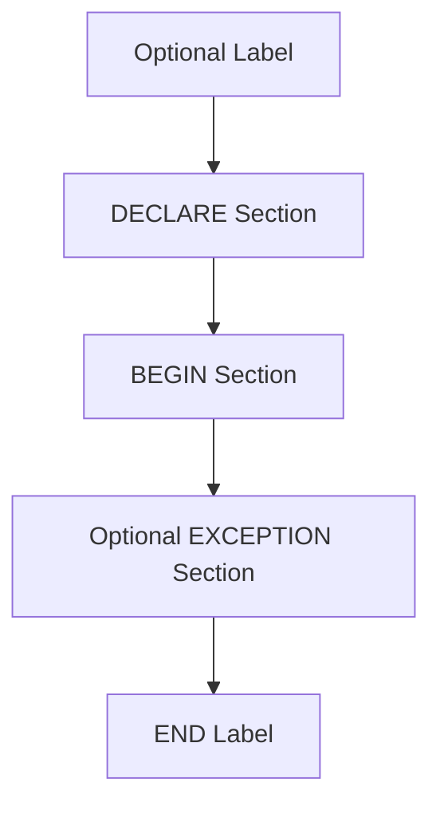
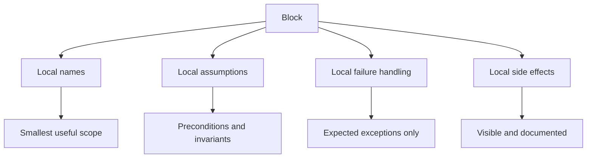

# Part 004 — Block Structure, Scope, Labels, and Defensive Declarations

This part is about the smallest unit of PL/pgSQL design: the block.

Most PL/pgSQL bugs are not caused by exotic features. They come from ordinary local mistakes:

- unclear variable names;
- accidental shadowing;
- nulls flowing through code;
- confusing parameter names with column names;
- overly broad variable scope;
- no defensive declarations;
- subblocks used as visual indentation instead of error and scope boundaries;
- misunderstanding `BEGIN`/`END` as transaction control.

A block looks simple. In production, block discipline is where maintainability starts.

---

## 1. PL/pgSQL Is Block-Structured

A PL/pgSQL function/procedure/trigger body is a block.

The shape is:

```sql
[ <<label>> ]
[ declare
    declarations ]
begin
    statements
end [ label ];
```

For a function body:

```sql
create or replace function app.example(p_case_id bigint)
returns text
language plpgsql
as $$
declare
    v_status text;
begin
    select c.status
      into v_status
      from app.case_file c
     where c.case_id = p_case_id;

    return v_status;
end;
$$;
```

The important point:

> `BEGIN` and `END` in PL/pgSQL group statements. They do not start or commit a SQL transaction.

This confusion causes dangerous code reviews. PL/pgSQL's `BEGIN` is not `BEGIN TRANSACTION`.

---

## 2. Block Anatomy

A block has four conceptual parts.



Example with all relevant pieces:

```sql
<<transition_block>>
declare
    v_current_status text;
    v_allowed boolean := false;
begin
    select c.status
      into strict v_current_status
      from app.case_file c
     where c.case_id = p_case_id;

    v_allowed := app.is_valid_case_transition(v_current_status, p_target_status);

    if not v_allowed then
        raise exception 'invalid transition from % to %',
            v_current_status,
            p_target_status;
    end if;
exception
    when no_data_found then
        raise exception 'case % not found', p_case_id;
end transition_block;
```

This is more than syntax:

- label gives a stable name to the scope;
- declarations state local state;
- statements express behavior;
- exception section creates a local error boundary;
- matching `END label` makes nested code easier to audit.

---

## 3. Semicolon Discipline

In PL/pgSQL:

- declarations end with semicolons;
- statements end with semicolons;
- nested blocks end with `END;`;
- the outer function body's final `END` is followed by a semicolon inside the dollar-quoted body in normal examples;
- do not put a semicolon immediately after `BEGIN`.

Wrong:

```sql
begin;
    return 1;
end;
```

Right:

```sql
begin
    return 1;
end;
```

The first form looks like SQL transaction syntax. It is not valid PL/pgSQL block syntax.

---

## 4. Scope Is a Design Tool

Every variable should live in the smallest block that needs it.

Bad:

```sql
declare
    v_case_id bigint;
    v_status text;
    v_task_count integer;
    v_message text;
    v_should_escalate boolean;
begin
    -- 200 lines using some of these variables occasionally
end;
```

Better:

```sql
begin
    declare
        v_task_count integer;
    begin
        select count(*)
          into v_task_count
          from app.case_task t
         where t.case_id = p_case_id
           and t.status <> 'DONE';

        if v_task_count > 0 then
            raise exception 'case % still has open tasks', p_case_id;
        end if;
    end;

    declare
        v_should_escalate boolean;
    begin
        v_should_escalate := app.case_requires_escalation(p_case_id);

        if v_should_escalate then
            perform app.enqueue_case_escalation(p_case_id);
        end if;
    end;
end;
```

The second version makes variable lifetime match reasoning lifetime.

A local variable is not just storage. It is part of the cognitive surface area of the routine.

---

## 5. Hidden Outer Block

A PL/pgSQL function has a hidden outer block around the body. It contains function parameters and special variables such as `FOUND`.

That means parameters can be qualified using the function name.

Example:

```sql
create or replace function app.calculate_due_days(p_due_at timestamptz)
returns integer
language plpgsql
as $$
begin
    return greatest(
        0,
        extract(day from clock_timestamp() - calculate_due_days.p_due_at)::integer
    );
end;
$$;
```

This is rarely needed, but it is useful when resolving ambiguity or reading older code.

The more maintainable approach is usually a naming convention:

```txt
p_*  input parameter
v_*  local variable
r_*  row variable / record-ish local
c_*  constant
```

Example:

```sql
create or replace function app.calculate_due_days(p_due_at timestamptz)
returns integer
language plpgsql
as $$
begin
    return greatest(
        0,
        extract(day from clock_timestamp() - p_due_at)::integer
    );
end;
$$;
```

---

## 6. Labels Are Not Decoration

Labels are useful for three things:

1. qualifying variables from outer scopes;
2. making `EXIT`/`CONTINUE` target explicit in nested loops;
3. documenting meaningful local phases.

Example of qualification:

```sql
create or replace function app.demo_scope()
returns integer
language plpgsql
as $$
<<outer_block>>
declare
    v_quantity integer := 30;
begin
    declare
        v_quantity integer := 80;
    begin
        -- inner variable
        raise notice 'inner quantity = %', v_quantity;

        -- outer variable
        raise notice 'outer quantity = %', outer_block.v_quantity;
    end;

    return v_quantity;
end outer_block;
$$;
```

The presence of `outer_block.v_quantity` should make you pause. Variable shadowing may be justified, but it should not be casual.

---

## 7. Labeling Loops

Nested loops without labels are difficult to review.

Bad:

```sql
for r_case in
    select case_id from app.case_file
loop
    for r_task in
        select task_id from app.case_task where case_id = r_case.case_id
    loop
        if r_task.task_id is null then
            exit;
        end if;
    end loop;
end loop;
```

Which loop does `exit` target? The nearest one. But the reader has to check.

Better:

```sql
<<case_loop>>
for r_case in
    select case_id from app.case_file
loop
    <<task_loop>>
    for r_task in
        select task_id
        from app.case_task
        where case_id = r_case.case_id
    loop
        if r_task.task_id is null then
            exit task_loop;
        end if;
    end loop task_loop;
end loop case_loop;
```

In production code, explicit loop labels remove ambiguity.

---

## 8. Labels as Phase Boundaries

Labels can also make long routines easier to inspect.

```sql
create or replace function app.transition_case_status(
    p_case_id bigint,
    p_target_status text,
    p_reason text
)
returns app.case_file
language plpgsql
as $$
<<transition_case_status>>
declare
    v_case app.case_file%rowtype;
begin
    <<load_and_lock_case>>
    begin
        select *
          into strict v_case
          from app.case_file c
         where c.case_id = p_case_id
         for update;
    exception
        when no_data_found then
            raise exception 'case % not found', p_case_id;
    end load_and_lock_case;

    <<validate_transition>>
    begin
        if not app.is_valid_case_transition(v_case.status, p_target_status) then
            raise exception 'invalid transition from % to %',
                v_case.status,
                p_target_status;
        end if;
    end validate_transition;

    <<apply_transition>>
    begin
        update app.case_file
           set status = p_target_status,
               updated_at = clock_timestamp()
         where case_id = p_case_id
         returning *
          into v_case;
    end apply_transition;

    return v_case;
end transition_case_status;
$$;
```

This style is useful for routines with distinct phases.

Do not overuse it for tiny functions. Labels should reduce ambiguity, not create ceremony.

---

## 9. Declarations Are Contracts

A declaration is not just a type annotation. It says what the routine is allowed to remember.

General form:

```sql
name [ constant ] type [ collate collation_name ] [ not null ] [ default | := | = expression ];
```

Examples:

```sql
v_case_id bigint;
v_status text;
v_retry_count integer := 0;
c_max_attempts constant integer := 3;
v_created_at timestamptz not null := clock_timestamp();
r_case app.case_file%rowtype;
r_any record;
```

A good declaration answers:

- what is this value?
- can it be null?
- can it change?
- is it tied to a table column type?
- is it local to the smallest useful block?

---

## 10. Default Values Are Evaluated When the Block Is Entered

A variable default is not a compile-time constant. It is evaluated when the block is entered.

```sql
declare
    v_started_at timestamptz := clock_timestamp();
begin
    -- v_started_at is assigned when this block starts
end;
```

For nested blocks, each entry evaluates its declarations again.

```sql
begin
    for i in 1..3 loop
        declare
            v_seen_at timestamptz := clock_timestamp();
        begin
            raise notice 'iteration %, seen at %', i, v_seen_at;
        end;
    end loop;
end;
```

This is useful for local timestamps, counters, and phase-local state. It is dangerous if you assume the default is evaluated only once when the function is created.

---

## 11. Prefer `:=` for Assignment

PL/pgSQL allows `:=` and `=` in declarations/assignments in some contexts, but prefer `:=` for assignment.

```sql
v_status := 'OPEN';
```

Reason:

- `=` already means equality in SQL;
- `:=` visually separates assignment from comparison;
- code reviews become faster.

This is a small convention with large readability payoff.

---

## 12. Constants for Business Meaning

Use constants for repeated values that carry meaning inside the routine.

Bad:

```sql
if v_retry_count > 3 then
    raise exception 'too many retries';
end if;
```

Better:

```sql
declare
    c_max_retry_count constant integer := 3;
begin
    if v_retry_count > c_max_retry_count then
        raise exception 'too many retries: %', v_retry_count;
    end if;
end;
```

Constants are useful for:

- retry limits;
- batch limits;
- status names inside a narrow routine;
- default reason codes;
- guard thresholds.

But do not hide global policy in local constants if the policy should be table-driven or configurable.

---

## 13. `NOT NULL` Local Variables

Use `NOT NULL` when null would represent a programming error.

```sql
declare
    v_actor_id bigint not null := p_actor_id;
begin
    -- impossible to accidentally set v_actor_id to null later
end;
```

This is useful for:

- required actor/user IDs;
- required target IDs;
- timestamps that must exist;
- computed values that should always resolve.

But `NOT NULL` variables must have a non-null default. Otherwise the declaration itself is invalid at runtime.

Bad:

```sql
declare
    v_actor_id bigint not null;
begin
    -- starts as null, so this is invalid
end;
```

Better:

```sql
declare
    v_actor_id bigint not null := p_actor_id;
begin
    if v_actor_id is null then
        -- this cannot be reached if declaration already failed,
        -- so validate nullable inputs before assigning to not-null locals if needed.
    end if;
end;
```

If the input itself may be null and you want a custom error, validate first in a nullable variable or with an explicit `IF` before assigning to a `NOT NULL` local.

---

## 14. Parameter Naming Discipline

The most common PL/pgSQL ambiguity bug is naming a parameter the same as a column.

Risky:

```sql
create or replace function app.get_case(case_id bigint)
returns app.case_file
language plpgsql
as $$
declare
    v_case app.case_file%rowtype;
begin
    select *
      into v_case
      from app.case_file
     where case_id = case_id;

    return v_case;
end;
$$;
```

The predicate looks right but is suspicious. Which `case_id` is the column and which is the parameter?

Better:

```sql
create or replace function app.get_case(p_case_id bigint)
returns app.case_file
language plpgsql
as $$
declare
    v_case app.case_file%rowtype;
begin
    select c.*
      into v_case
      from app.case_file c
     where c.case_id = p_case_id;

    return v_case;
end;
$$;
```

Rules:

- prefix parameters with `p_`;
- prefix local variables with `v_`;
- always alias tables in SQL statements;
- always qualify column references with table aliases;
- never rely on name resolution magic in production code.

---

## 15. Variable Prefixes Are Not Cosmetic

Recommended prefix convention:

| Prefix | Meaning | Example |
|---|---|---|
| `p_` | input or input-like parameter | `p_case_id` |
| `v_` | scalar local variable | `v_status` |
| `r_` | row/composite/record variable | `r_case` |
| `c_` | local constant | `c_max_batch_size` |
| `b_` | boolean local, optional | `b_allowed` |
| `j_` | JSON/JSONB local, optional | `j_payload` |

This is not Hungarian notation for its own sake. PL/pgSQL intermixes SQL identifiers, table columns, parameters, records, and local variables. Prefixes reduce ambiguity.

The larger the function, the more valuable this becomes.

---

## 16. Use `%TYPE` to Track Schema Types

When a variable represents a column value, prefer `%TYPE`.

```sql
declare
    v_case_id app.case_file.case_id%type;
    v_status app.case_file.status%type;
begin
    -- variable type follows the table column type
end;
```

This reduces schema drift. If `case_id` changes from `bigint` to another compatible type, code is less likely to require manual updates.

Use `%TYPE` for:

- IDs;
- status columns;
- amounts;
- timestamps;
- domain-typed columns;
- any value that semantically mirrors a table column.

Do not use `%TYPE` when the local variable has intentionally different semantics from the column.

Example:

```sql
declare
    v_task_count integer;
begin
    -- count is not a table column semantic; integer is fine here
end;
```

Part 005 will go much deeper into PL/pgSQL type usage.

---

## 17. Use `%ROWTYPE` for Whole Rows

Use `%ROWTYPE` when you need a complete row shaped like a table.

```sql
declare
    r_case app.case_file%rowtype;
begin
    select *
      into strict r_case
      from app.case_file c
     where c.case_id = p_case_id;
end;
```

Good use cases:

- load-and-lock row before transition;
- return updated row;
- compare `OLD` and `NEW`-like structures;
- pass row-shaped data to helper functions.

Avoid `%ROWTYPE` when:

- you only need one or two columns;
- selecting `*` makes dependency on table shape too broad;
- a future column addition could make logic accidentally heavier;
- the row contains sensitive columns not needed by the routine.

A row variable is convenient, but it also couples the function to the table shape.

---

## 18. Use `record` Sparingly

`record` is flexible. That is the danger.

```sql
declare
    r_any record;
begin
    for r_any in
        select case_id, status
        from app.case_file
    loop
        raise notice 'case %, status %', r_any.case_id, r_any.status;
    end loop;
end;
```

`record` is appropriate for:

- loop variables over query results;
- dynamic SQL result shapes;
- generic metadata routines;
- short local scopes where shape is obvious.

Avoid `record` for stable business objects. Prefer named row types, composite types, or explicit table-returning contracts.

Bad:

```sql
declare
    r_case record;
begin
    -- 150 lines later: what fields exist on r_case?
end;
```

Better:

```sql
declare
    r_case app.case_file%rowtype;
begin
    -- shape is known
end;
```

---

## 19. `ALIAS` Is a Sharp Tool

PL/pgSQL supports aliases for variables and parameters.

Example:

```sql
declare
    prior_row alias for old;
    updated_row alias for new;
begin
    -- trigger code can refer to prior_row and updated_row
end;
```

This can make trigger code more readable:

```sql
create or replace function app_trg.case_file_audit()
returns trigger
language plpgsql
as $$
declare
    prior_row alias for old;
    updated_row alias for new;
begin
    if prior_row.status is distinct from updated_row.status then
        insert into app.case_status_audit(case_id, old_status, new_status)
        values (updated_row.case_id, prior_row.status, updated_row.status);
    end if;

    return null;
end;
$$;
```

But unrestricted alias use is confusing because two names refer to the same value.

Recommended rule:

> Use `ALIAS` mainly to clarify predetermined names such as `OLD`, `NEW`, or positional parameters in legacy code. Do not use it as a general renaming mechanism.

---

## 20. Subblocks for Local Error Boundaries

A subblock can have its own `EXCEPTION` section.

```sql
begin
    begin
        insert into app.case_reference(case_reference)
        values (p_case_reference);
    exception
        when unique_violation then
            raise exception 'case reference % already exists', p_case_reference
                using errcode = 'P0001';
    end;
end;
```

This creates a localized error handling boundary.

Important design point:

> A block with an `EXCEPTION` clause has transaction-like rollback behavior for statements inside that block, but it is not a full application transaction boundary.

Use exception subblocks to make error handling local and intentional.

Do not wrap huge routines in a broad `EXCEPTION when others` unless you are adding context and rethrowing safely. Broad catch-all error handling hides failure modes.

Bad:

```sql
begin
    -- many operations
exception
    when others then
        return false;
end;
```

Better:

```sql
begin
    insert into app.case_status_audit(case_id, old_status, new_status)
    values (p_case_id, v_old_status, v_new_status);
exception
    when foreign_key_violation then
        raise exception 'audit failed for missing case %', p_case_id;
end;
```

---

## 21. Subblocks for Optional Work

Sometimes part of a routine is best-effort, but the main mutation should still be explicit about whether best-effort failure is acceptable.

Example:

```sql
begin
    update app.case_file
       set status = 'ESCALATED'
     where case_id = p_case_id;

    begin
        insert into app.case_notification_outbox(case_id, notification_type)
        values (p_case_id, 'CASE_ESCALATED');
    exception
        when unique_violation then
            raise notice 'notification already queued for case %', p_case_id;
    end;
end;
```

This is acceptable only if duplicate notification is genuinely non-fatal.

Do not convert real failure into `NOTICE` for convenience.

A top-tier review asks:

> Is this exception boundary preserving correctness, or hiding a bug?

---

## 22. `FOUND` Is Useful but Fragile Across Statements

`FOUND` is a special boolean variable set by certain PL/pgSQL statements.

Example:

```sql
update app.case_file
   set owner_id = p_owner_id
 where case_id = p_case_id;

if not found then
    raise exception 'case % not found', p_case_id;
end if;
```

The danger is distance.

Bad:

```sql
update app.case_file
   set owner_id = p_owner_id
 where case_id = p_case_id;

perform app.emit_assignment_metric(p_case_id);

if not found then
    raise exception 'case % not found', p_case_id;
end if;
```

The `PERFORM` may change `FOUND`. The check is no longer obviously tied to the `UPDATE`.

Better:

```sql
update app.case_file
   set owner_id = p_owner_id
 where case_id = p_case_id;

if not found then
    raise exception 'case % not found', p_case_id;
end if;

perform app.emit_assignment_metric(p_case_id);
```

Rule:

> Check `FOUND` immediately after the statement whose result you care about.

Part 007 will cover `FOUND` and basic statements in detail.

---

## 23. Prefer `SELECT ... INTO STRICT` When Cardinality Matters

If you expect exactly one row, say so.

Weak:

```sql
select c.status
  into v_status
  from app.case_file c
 where c.case_id = p_case_id;
```

If no row exists, `v_status` becomes null. If multiple rows somehow match, behavior may not reflect your invariant clearly.

Stronger:

```sql
select c.status
  into strict v_status
  from app.case_file c
 where c.case_id = p_case_id;
```

Then handle expected exceptions locally if needed:

```sql
begin
    select c.status
      into strict v_status
      from app.case_file c
     where c.case_id = p_case_id;
exception
    when no_data_found then
        raise exception 'case % not found', p_case_id;
    when too_many_rows then
        raise exception 'data integrity failure: duplicate case id %', p_case_id;
end;
```

This is defensive programming: cardinality assumptions become executable.

---

## 24. Keep SQL Statements Self-Contained

Inside PL/pgSQL, SQL and procedural code are interleaved. Make every SQL statement readable on its own.

Bad:

```sql
select status into v_status from case_file where case_id = p_case_id;
```

Better:

```sql
select c.status
  into v_status
  from app.case_file c
 where c.case_id = p_case_id;
```

Rules:

- schema-qualify application tables when appropriate;
- alias tables;
- qualify columns;
- align `SELECT`, `INTO`, `FROM`, `WHERE` consistently;
- keep procedural variables visually distinct.

This makes name resolution errors easier to spot.

---

## 25. Avoid “Variable Soup”

A routine with too many mutable locals becomes a hidden state machine.

Bad signal:

```sql
declare
    v_status text;
    v_old_status text;
    v_new_status text;
    v_allowed boolean;
    v_count integer;
    v_exists boolean;
    v_message text;
    v_reason text;
    v_mode text;
    v_skip boolean;
    v_done boolean;
```

This often means the routine is doing too much.

Refactoring options:

- split phases into subblocks;
- extract validation helper function;
- use SQL CTEs instead of procedural accumulation;
- use a row variable for a coherent entity;
- replace boolean flags with early `RAISE`/`RETURN`;
- move workflow orchestration outside PL/pgSQL.

The goal is not fewer variables at all costs. The goal is fewer unclear variables.

---

## 26. Use Early Failure for Preconditions

Preconditions should appear near the top.

```sql
if p_case_id is null then
    raise exception 'p_case_id is required'
        using errcode = 'P0001';
end if;

if p_reason is null or length(trim(p_reason)) = 0 then
    raise exception 'p_reason is required';
end if;
```

This keeps the rest of the function from carrying defensive null checks everywhere.

However, do not duplicate constraints unnecessarily. If a table constraint is the real enforcement, local prechecks should improve error clarity or avoid wasted work, not create inconsistent rules.

---

## 27. Defensive Declaration Pattern

For command-style functions, a good skeleton looks like this:

```sql
create or replace function app.assign_case_owner(
    p_case_id bigint,
    p_owner_id bigint,
    p_reason text
)
returns app.case_file
language plpgsql
volatile
as $$
<<assign_case_owner>>
declare
    c_event_type constant text := 'OWNER_ASSIGNED';

    r_case app.case_file%rowtype;
    v_reason text not null := nullif(trim(p_reason), '');
begin
    if p_case_id is null then
        raise exception 'p_case_id is required';
    end if;

    if p_owner_id is null then
        raise exception 'p_owner_id is required';
    end if;

    -- v_reason declaration will fail if p_reason is null/blank.
    -- If you want a custom message, validate before assigning to NOT NULL.

    select *
      into strict r_case
      from app.case_file c
     where c.case_id = p_case_id
     for update;

    if r_case.status not in ('OPEN', 'UNDER_REVIEW') then
        raise exception 'case % cannot be assigned in status %',
            p_case_id,
            r_case.status;
    end if;

    update app.case_file c
       set owner_id = p_owner_id,
           updated_at = clock_timestamp()
     where c.case_id = p_case_id
     returning *
      into r_case;

    insert into app.case_event(case_id, event_type, reason)
    values (p_case_id, c_event_type, v_reason);

    return r_case;
exception
    when no_data_found then
        raise exception 'case % not found', p_case_id;
end assign_case_owner;
$$;
```

This demonstrates:

- routine label;
- constants;
- row variable;
- input validation;
- row lock;
- explicit transition guard;
- immediate mutation result capture;
- event insert;
- local exception translation.

But note the subtle issue: `v_reason text not null := nullif(trim(p_reason), '')` will raise a generic not-null assignment error if blank. If user-facing error quality matters, validate `p_reason` explicitly before assigning to a not-null local.

Production code often chooses clarity over compactness.

---

## 28. Improved Defensive Pattern with Clear Input Errors

```sql
create or replace function app.assign_case_owner(
    p_case_id bigint,
    p_owner_id bigint,
    p_reason text
)
returns app.case_file
language plpgsql
volatile
as $$
<<assign_case_owner>>
declare
    c_event_type constant text := 'OWNER_ASSIGNED';

    r_case app.case_file%rowtype;
    v_reason text;
begin
    if p_case_id is null then
        raise exception 'p_case_id is required';
    end if;

    if p_owner_id is null then
        raise exception 'p_owner_id is required';
    end if;

    v_reason := nullif(trim(p_reason), '');

    if v_reason is null then
        raise exception 'p_reason is required';
    end if;

    select *
      into strict r_case
      from app.case_file c
     where c.case_id = p_case_id
     for update;

    if r_case.status not in ('OPEN', 'UNDER_REVIEW') then
        raise exception 'case % cannot be assigned in status %',
            p_case_id,
            r_case.status;
    end if;

    update app.case_file c
       set owner_id = p_owner_id,
           updated_at = clock_timestamp()
     where c.case_id = p_case_id
     returning *
      into r_case;

    insert into app.case_event(case_id, event_type, reason)
    values (p_case_id, c_event_type, v_reason);

    return r_case;
exception
    when no_data_found then
        raise exception 'case % not found', p_case_id;
end assign_case_owner;
$$;
```

This is slightly longer and much clearer.

---

## 29. Declarations and Collation

PL/pgSQL variable declarations can specify collation.

You will not need this in most routines. But it matters when string comparison or sorting must follow a specific collation rule.

Example shape:

```sql
declare
    v_name text collate "C";
begin
    -- comparisons involving v_name use the declared collation where relevant
end;
```

Production heuristic:

> If your business rule depends on locale-sensitive text ordering or comparison, do not leave collation implicit.

For most case-management and regulatory workflow code, prefer normalized canonical values for decision logic, not locale-dependent free text comparisons.

---

## 30. Block Comments and Intent Comments

PL/pgSQL comments work like SQL comments.

```sql
-- single-line comment

/*
 multi-line comment
*/
```

Good comments explain why, not what.

Bad:

```sql
-- update case status
update app.case_file
   set status = p_target_status
 where case_id = p_case_id;
```

Better:

```sql
-- Status is updated only after audit preconditions pass so failed audit cannot
-- leave the case in a state that lacks a corresponding event record.
update app.case_file
   set status = p_target_status
 where case_id = p_case_id;
```

In database code, comments should often explain:

- concurrency assumptions;
- idempotency assumptions;
- why a lock is taken;
- why an exception is swallowed;
- why a trigger is `BEFORE` vs `AFTER`;
- why a value is calculated in database instead of application.

---

## 31. Review Smells

When reviewing a PL/pgSQL block, look for these smells.

### 31.1 Unqualified Columns

```sql
where case_id = p_case_id
```

Better:

```sql
where c.case_id = p_case_id
```

### 31.2 Parameter Names That Look Like Columns

```sql
create function app.get_case(case_id bigint)
```

Better:

```sql
create function app.get_case(p_case_id bigint)
```

### 31.3 Broad Mutable State

Many variables declared at top, used far apart.

### 31.4 Delayed `FOUND` Check

`FOUND` checked many statements after the statement of interest.

### 31.5 Silent Null Handling

No distinction between “not found”, “found null”, and “not applicable”.

### 31.6 `EXCEPTION when others` Without Rethrow

Usually hides a bug or operational failure.

### 31.7 Trigger `RETURN NULL` in `BEFORE ROW`

May silently skip writes.

### 31.8 Dynamic SQL Without Identifier/Value Discipline

This will be covered later, but reviewers should already be suspicious.

---

## 32. Practical Style Guide

Use this as a default.

### Structure

```sql
create or replace function schema.name(
    p_arg type
)
returns type
language plpgsql
as $$
<<function_label>>
declare
    -- constants first
    -- row variables second
    -- scalar variables third
begin
    -- preconditions
    -- load/lock
    -- validate
    -- mutate/compute
    -- emit/audit
    -- return
exception
    -- local expected translations only
end function_label;
$$;
```

### Naming

```txt
p_case_id
v_status
r_case
c_event_type
```

### SQL

```sql
select c.status
  into strict v_status
  from app.case_file c
 where c.case_id = p_case_id;
```

### Error Handling

```sql
exception
    when no_data_found then
        raise exception 'case % not found', p_case_id;
```

### Avoid

```sql
exception
    when others then
        return null;
```

---

## 33. Mental Model: Block as Mini-Transaction of Meaning

A block is not a database transaction.

But it should represent a coherent unit of meaning.



When a block contains unrelated state, unrelated side effects, and broad exception handling, it stops being a unit of meaning. It becomes a trap.

---

## 34. Exercises

### Exercise 1 — Rename for Clarity

Given:

```sql
create function app.f(id bigint, status text)
returns void
language plpgsql
as $$
declare
    x text;
begin
    select status into x from app.case_file where id = id;
end;
$$;
```

Rewrite it with:

- honest function name;
- parameter prefixes;
- table alias;
- column qualification;
- meaningful local variable name;
- cardinality handling.

### Exercise 2 — Add Scope Boundaries

Given a 100-line function with ten top-level variables, group it into labeled subblocks:

- precondition validation;
- row load;
- business validation;
- mutation;
- audit.

### Exercise 3 — Find the `FOUND` Bug

Given:

```sql
update app.case_file
   set owner_id = p_owner_id
 where case_id = p_case_id;

perform app.log_assignment_attempt(p_case_id);

if not found then
    raise exception 'case not found';
end if;
```

Explain why this is unsafe and fix it.

### Exercise 4 — Replace Silent Nulls

Find all `SELECT ... INTO` statements in a PL/pgSQL codebase and classify them:

- zero rows acceptable;
- exactly one row required;
- many rows impossible by constraint;
- many rows possible and should be handled.

Replace with `STRICT` where appropriate.

---

## 35. What to Internalize

This part is about local code hygiene, but the impact is architectural.

A clear PL/pgSQL block makes these things obvious:

- what local state exists;
- what values may be null;
- which identifiers are columns vs variables;
- which errors are expected;
- which side effects belong together;
- which assumptions are enforced by code.

The practical rule:

> Small, labeled, defensively declared blocks are easier to test, easier to review, easier to debug, and less likely to lie during an incident.

Next, we go deeper into the PL/pgSQL type system: `record`, `%ROWTYPE`, `%TYPE`, composite types, domain types, and how to use PostgreSQL's type system as a correctness boundary instead of just a storage detail.

---

## References

- PostgreSQL Documentation — Structure of PL/pgSQL: https://www.postgresql.org/docs/current/plpgsql-structure.html
- PostgreSQL Documentation — Declarations: https://www.postgresql.org/docs/current/plpgsql-declarations.html
- PostgreSQL Documentation — Basic Statements: https://www.postgresql.org/docs/current/plpgsql-statements.html
- PostgreSQL Documentation — Control Structures: https://www.postgresql.org/docs/current/plpgsql-control-structures.html
- PostgreSQL Documentation — Errors and Messages: https://www.postgresql.org/docs/current/plpgsql-errors-and-messages.html
