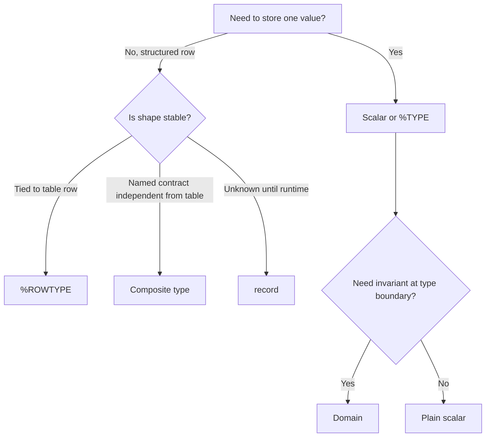
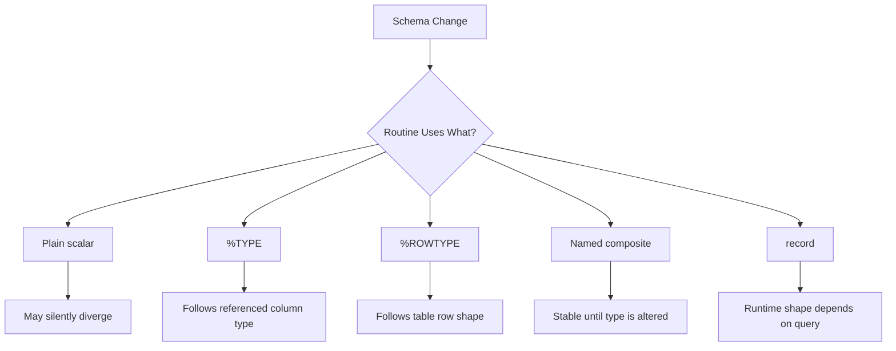
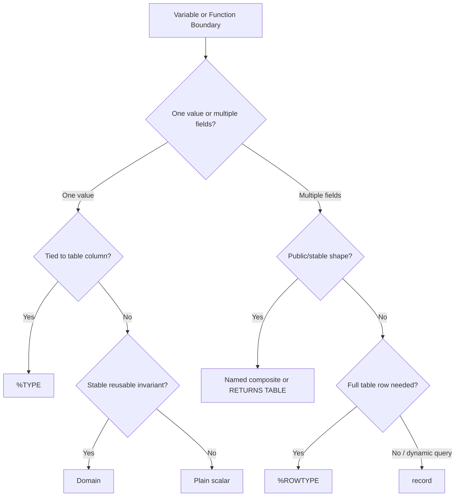

# Part 005 — Type System: Record, Rowtype, Domain, and Composite Usage

PL/pgSQL code looks procedural, but its real safety comes from the PostgreSQL type system.

A production function is not merely a block of imperative logic. It is a typed boundary between:

1. application code,
2. relational tables,
3. constraints,
4. stored routines,
5. triggers,
6. migrations,
7. operational scripts,
8. reporting queries,
9. and future maintainers.

The main question in this part is not: **"How do I declare a variable?"**

The real question is:

> How do I choose the right type boundary so the database can protect my intent without over-coupling the routine to accidental schema details?

That is where `%TYPE`, `%ROWTYPE`, `record`, domains, and composite types become production tools rather than syntax trivia.

---

## 1. The Core Mental Model

In PL/pgSQL, a variable can be:

- a scalar value,
- a copied column type using `%TYPE`,
- a full row-shaped value using `%ROWTYPE`,
- a flexible row container using `record`,
- a named composite value,
- a domain-constrained value,
- an array, enum, range, JSONB, or other PostgreSQL type.

Each option answers a different design question.



The important distinction:

| Construct | What It Means | Coupling Level | Best Use |
|---|---|---:|---|
| `text`, `uuid`, `numeric` | Plain scalar | Low | Generic local values |
| `table.column%TYPE` | Same type as a column | Medium | Local variable mirrors a table column |
| `table%ROWTYPE` | Same row shape as table | High | Row mutation, table-centered logic |
| `record` | Shape discovered at runtime | Dynamic | Generic query loops, dynamic SQL results |
| `CREATE TYPE ... AS (...)` | Named structured contract | Medium | Cross-function API, stable DTO-like shape |
| `CREATE DOMAIN` | Type + constraints | Medium/High | Reusable scalar invariant |

A top-tier engineer does not default to one of these. They pick based on the boundary being modeled.

---

## 2. Scalar Variables: Use Plain Types When the Meaning Is Truly Local

A scalar variable is fine when the variable has no durable schema contract.

```sql
CREATE OR REPLACE FUNCTION case_ops.calculate_due_days(
    p_priority text,
    p_created_at timestamptz
)
RETURNS integer
LANGUAGE plpgsql
AS $$
DECLARE
    v_due_days integer;
BEGIN
    v_due_days := CASE p_priority
        WHEN 'critical' THEN 1
        WHEN 'high' THEN 3
        WHEN 'normal' THEN 7
        ELSE 14
    END;

    RETURN v_due_days;
END;
$$;
```

This is acceptable because `v_due_days` is an internal implementation variable. It does not need to follow a table column.

But for table-coupled values, a plain scalar can become a migration hazard.

```sql
DECLARE
    v_case_id bigint; -- risky if enforcement_case.case_id later becomes uuid
```

Better:

```sql
DECLARE
    v_case_id enforcement.enforcement_case.case_id%TYPE;
```

Now the function follows the table column type during schema evolution.

---

## 3. `%TYPE`: Copy a Column Type Without Copying a Table Shape

`%TYPE` declares a variable using the data type of another object, usually a table column.

```sql
DECLARE
    v_case_id enforcement.enforcement_case.case_id%TYPE;
    v_status  enforcement.enforcement_case.status%TYPE;
    v_owner   enforcement.enforcement_case.owner_user_id%TYPE;
```

Use `%TYPE` when:

- the variable semantically represents a column value,
- the column type might evolve,
- you want migration resilience,
- you do not need the entire row.

### Good `%TYPE` Use Case

```sql
CREATE OR REPLACE FUNCTION enforcement.assign_case_owner(
    p_case_id enforcement.enforcement_case.case_id%TYPE,
    p_owner_user_id enforcement.enforcement_case.owner_user_id%TYPE
)
RETURNS void
LANGUAGE plpgsql
AS $$
DECLARE
    v_previous_owner enforcement.enforcement_case.owner_user_id%TYPE;
BEGIN
    SELECT owner_user_id
    INTO v_previous_owner
    FROM enforcement.enforcement_case
    WHERE case_id = p_case_id
    FOR UPDATE;

    UPDATE enforcement.enforcement_case
    SET owner_user_id = p_owner_user_id,
        updated_at = clock_timestamp()
    WHERE case_id = p_case_id;

    INSERT INTO enforcement.case_assignment_audit(
        case_id,
        previous_owner_user_id,
        new_owner_user_id,
        changed_at
    )
    VALUES (
        p_case_id,
        v_previous_owner,
        p_owner_user_id,
        clock_timestamp()
    );
END;
$$;
```

Here, `%TYPE` expresses a contract: the function accepts values that match the table it mutates.

### `%TYPE` Is Not a Business Meaning

This is wrong as a design habit:

```sql
DECLARE
    v_reason enforcement.enforcement_case.status%TYPE;
```

If `v_reason` is not actually a status, it should not copy the status column. Type compatibility is not the same as semantic compatibility.

A better version:

```sql
DECLARE
    v_transition_reason text;
```

or, if reason codes are constrained:

```sql
CREATE DOMAIN enforcement.transition_reason_code AS text
CHECK (VALUE ~ '^[A-Z][A-Z0-9_]{2,63}$');
```

Then:

```sql
DECLARE
    v_transition_reason enforcement.transition_reason_code;
```

---

## 4. `%ROWTYPE`: Copy the Shape of a Table Row

`%ROWTYPE` creates a row variable with the same fields as a table or view row.

```sql
DECLARE
    r_case enforcement.enforcement_case%ROWTYPE;
```

You can then access fields:

```sql
r_case.case_id
r_case.status
r_case.priority
r_case.created_at
```

### Good `%ROWTYPE` Use Case: Row-Centered Mutation

```sql
CREATE OR REPLACE FUNCTION enforcement.close_case(
    p_case_id enforcement.enforcement_case.case_id%TYPE,
    p_resolution_code text,
    p_actor_user_id uuid
)
RETURNS enforcement.enforcement_case
LANGUAGE plpgsql
AS $$
DECLARE
    r_case enforcement.enforcement_case%ROWTYPE;
BEGIN
    SELECT *
    INTO STRICT r_case
    FROM enforcement.enforcement_case
    WHERE case_id = p_case_id
    FOR UPDATE;

    IF r_case.status IN ('closed', 'cancelled') THEN
        RAISE EXCEPTION 'Case % cannot be closed from status %',
            p_case_id,
            r_case.status
            USING ERRCODE = 'P0001';
    END IF;

    UPDATE enforcement.enforcement_case
    SET status = 'closed',
        resolution_code = p_resolution_code,
        closed_by_user_id = p_actor_user_id,
        closed_at = clock_timestamp(),
        updated_at = clock_timestamp()
    WHERE case_id = p_case_id
    RETURNING *
    INTO r_case;

    RETURN r_case;
END;
$$;
```

This is reasonable because the function is centered on an `enforcement_case` row.

### Bad `%ROWTYPE` Use Case: Overfetching as a Habit

```sql
DECLARE
    r_case enforcement.enforcement_case%ROWTYPE;
BEGIN
    SELECT * INTO r_case
    FROM enforcement.enforcement_case
    WHERE case_id = p_case_id;

    IF r_case.status = 'open' THEN
        -- only status was needed
    END IF;
END;
```

If only one value is needed, do not carry an entire row as implicit dependency.

Better:

```sql
DECLARE
    v_status enforcement.enforcement_case.status%TYPE;
BEGIN
    SELECT status
    INTO v_status
    FROM enforcement.enforcement_case
    WHERE case_id = p_case_id;
END;
```

### `%ROWTYPE` Coupling Cost

`%ROWTYPE` follows the table shape. That is convenient, but it also couples the routine to every column.

If a table has 80 columns and the function needs 3, a `%ROWTYPE` variable hides the real dependency set.

For production review, ask:

> Does this routine need the row, or does it need a few values?

If it only needs a few values, prefer scalar `%TYPE` variables or a named composite type with only the fields needed.

---

## 5. `record`: Runtime Shape, Runtime Risk

A `record` variable has no predefined structure. Its shape is assigned by the query that fills it.

```sql
DECLARE
    r_any record;
BEGIN
    SELECT case_id, status, priority
    INTO r_any
    FROM enforcement.enforcement_case
    WHERE case_id = p_case_id;

    RAISE NOTICE 'case %, status %', r_any.case_id, r_any.status;
END;
```

This is flexible, but the compiler cannot protect field access the same way it can for a row variable.

### `record` Before Assignment

This fails at runtime:

```sql
DECLARE
    r_any record;
BEGIN
    RAISE NOTICE '%', r_any.case_id;
END;
```

The variable has no structure until assigned.

### Good `record` Use Case: Generic Query Iteration

```sql
CREATE OR REPLACE FUNCTION admin.inspect_large_tables(p_min_bytes bigint)
RETURNS TABLE(schema_name text, table_name text, total_bytes bigint)
LANGUAGE plpgsql
AS $$
DECLARE
    r_table record;
BEGIN
    FOR r_table IN
        SELECT
            n.nspname AS schema_name,
            c.relname AS table_name,
            pg_total_relation_size(c.oid) AS total_bytes
        FROM pg_class c
        JOIN pg_namespace n ON n.oid = c.relnamespace
        WHERE c.relkind = 'r'
          AND pg_total_relation_size(c.oid) >= p_min_bytes
        ORDER BY total_bytes DESC
    LOOP
        schema_name := r_table.schema_name;
        table_name := r_table.table_name;
        total_bytes := r_table.total_bytes;
        RETURN NEXT;
    END LOOP;
END;
$$;
```

`record` is acceptable here because the query shape is local and obvious.

### Bad `record` Use Case: Public Contract Hidden in Dynamic Shape

```sql
CREATE OR REPLACE FUNCTION enforcement.get_case_summary(p_case_id uuid)
RETURNS record
LANGUAGE plpgsql
AS $$
DECLARE
    r record;
BEGIN
    SELECT case_id, status, priority
    INTO r
    FROM enforcement.enforcement_case
    WHERE case_id = p_case_id;

    RETURN r;
END;
$$;
```

This pushes shape responsibility to the caller. The caller must know the returned columns.

Better:

```sql
CREATE TYPE enforcement.case_summary AS (
    case_id uuid,
    status text,
    priority text
);

CREATE OR REPLACE FUNCTION enforcement.get_case_summary(p_case_id uuid)
RETURNS enforcement.case_summary
LANGUAGE plpgsql
AS $$
DECLARE
    r_summary enforcement.case_summary;
BEGIN
    SELECT case_id, status, priority
    INTO r_summary
    FROM enforcement.enforcement_case
    WHERE case_id = p_case_id;

    RETURN r_summary;
END;
$$;
```

A named result type is easier to test, document, version, and review.

---

## 6. Composite Types: Named Row Contracts

A composite type is a named structure.

```sql
CREATE TYPE enforcement.case_transition_request AS (
    case_id uuid,
    requested_status text,
    reason_code text,
    actor_user_id uuid,
    request_id uuid
);
```

It can be used in function signatures:

```sql
CREATE OR REPLACE FUNCTION enforcement.request_case_transition(
    p_request enforcement.case_transition_request
)
RETURNS void
LANGUAGE plpgsql
AS $$
BEGIN
    -- Access fields with dot notation
    IF p_request.requested_status IS NULL THEN
        RAISE EXCEPTION 'requested_status is required';
    END IF;
END;
$$;
```

Composite types are useful when a set of values travels together and deserves a stable name.

### Composite Type as Internal DTO

In application code, we often use DTOs to represent messages or command objects. Composite types can play a similar role inside the database.


This can make PL/pgSQL routines cleaner when the input has more than a few fields.

### When Composite Types Are Better Than Many Parameters

This:

```sql
CREATE OR REPLACE FUNCTION enforcement.create_case(
    p_subject_id uuid,
    p_case_type text,
    p_priority text,
    p_source_system text,
    p_source_reference text,
    p_created_by uuid,
    p_request_id uuid
)
RETURNS uuid
...
```

can become harder to evolve as the command grows.

A composite command makes the boundary explicit:

```sql
CREATE TYPE enforcement.create_case_command AS (
    subject_id uuid,
    case_type text,
    priority text,
    source_system text,
    source_reference text,
    created_by uuid,
    request_id uuid
);
```

Then:

```sql
CREATE OR REPLACE FUNCTION enforcement.create_case(
    p_cmd enforcement.create_case_command
)
RETURNS uuid
LANGUAGE plpgsql
AS $$
DECLARE
    v_case_id uuid;
BEGIN
    IF p_cmd.subject_id IS NULL THEN
        RAISE EXCEPTION 'subject_id is required';
    END IF;

    INSERT INTO enforcement.enforcement_case(
        subject_id,
        case_type,
        priority,
        source_system,
        source_reference,
        created_by_user_id,
        created_at,
        request_id
    )
    VALUES (
        p_cmd.subject_id,
        p_cmd.case_type,
        p_cmd.priority,
        p_cmd.source_system,
        p_cmd.source_reference,
        p_cmd.created_by,
        clock_timestamp(),
        p_cmd.request_id
    )
    RETURNING case_id INTO v_case_id;

    RETURN v_case_id;
END;
$$;
```

This has a cost: changing the composite type may affect dependent functions. Use it when the shape deserves a name.

---

## 7. Composite Types Are Not Table Constraints

A common misconception:

> If a table column has constraints, a composite value based on that table must obey those constraints.

Not generally.

A composite type represents structure. It does not automatically carry all table constraints as reusable business rules.

Example:

```sql
CREATE TABLE enforcement.case_priority_rule (
    rule_id uuid PRIMARY KEY,
    priority text NOT NULL CHECK (priority IN ('critical', 'high', 'normal', 'low')),
    max_due_days integer NOT NULL CHECK (max_due_days > 0)
);
```

The table has constraints.

A row variable from the table has the same fields:

```sql
DECLARE
    r_rule enforcement.case_priority_rule%ROWTYPE;
```

But do not treat the row variable itself as a full validation layer. Constraints are enforced when data is inserted or updated into the constrained table, not when arbitrary local variables are assigned.

For reusable type-level validation, use a domain.

---

## 8. Domains: Reusable Scalar Invariants

A domain is a named type with optional constraints.

```sql
CREATE DOMAIN enforcement.case_priority AS text
CHECK (VALUE IN ('critical', 'high', 'normal', 'low'));
```

Now the invariant can be reused:

```sql
CREATE TABLE enforcement.enforcement_case (
    case_id uuid PRIMARY KEY,
    priority enforcement.case_priority NOT NULL
);
```

And in PL/pgSQL:

```sql
CREATE OR REPLACE FUNCTION enforcement.set_case_priority(
    p_case_id uuid,
    p_priority enforcement.case_priority
)
RETURNS void
LANGUAGE plpgsql
AS $$
BEGIN
    UPDATE enforcement.enforcement_case
    SET priority = p_priority,
        updated_at = clock_timestamp()
    WHERE case_id = p_case_id;
END;
$$;
```

The function signature now tells callers what kind of value is acceptable.

### Domain Use Cases

Use domains for reusable scalar invariants such as:

- case priority,
- workflow state code,
- source system code,
- external reference format,
- non-empty trimmed text,
- positive amount,
- percentage range,
- country code,
- idempotency key format.

Example:

```sql
CREATE DOMAIN common.non_empty_text AS text
CHECK (length(btrim(VALUE)) > 0);

CREATE DOMAIN enforcement.case_state_code AS text
CHECK (VALUE ~ '^[a-z][a-z0-9_]{1,63}$');

CREATE DOMAIN integration.idempotency_key AS text
CHECK (length(VALUE) BETWEEN 16 AND 200);
```

### Domain Caveat: Do Not Overuse for Volatile Business Rules

Domains are schema objects. Changing them affects many dependent objects.

A domain is good for stable shape constraints:

```sql
CHECK (VALUE > 0)
CHECK (VALUE IN ('critical', 'high', 'normal', 'low'))
CHECK (length(VALUE) <= 64)
```

A domain is not ideal for rules that change weekly:

```sql
CHECK (VALUE IN ('special_campaign_a', 'special_campaign_b'))
```

Volatile policy should usually live in reference tables, not hard-coded domain constraints.

---

## 9. Domains Over Composite Types: Powerful but Use Sparingly

PostgreSQL allows domains over many underlying types, including user-defined types. This means you can create a domain over a composite type.

That can model a structured value with reusable validation, but it is usually harder to operate and evolve than plain table constraints plus validation functions.

For most production systems, prefer:

- domains for scalar invariants,
- tables for relational invariants,
- functions for procedural invariants,
- composite types for named structured transport.

Use composite domains only when the invariant is stable, small, and strongly reusable.

---

## 10. Function Return Type Design

Return type is part of the API contract.

### Option 1: Return Scalar

```sql
RETURNS uuid
```

Use this for identifiers or single computed values.

### Option 2: Return Table Row

```sql
RETURNS enforcement.enforcement_case
```

Use this when the function logically returns a full table row.

Cost: caller becomes coupled to the full table shape.

### Option 3: Return Named Composite

```sql
RETURNS enforcement.case_summary
```

Use this when the function returns a stable projection.

### Option 4: Return Table Syntax

```sql
RETURNS TABLE(
    case_id uuid,
    status text,
    priority text,
    owner_user_id uuid
)
```

Use this for query-like functions where explicit output columns are clearer than a named type.

### Option 5: Return `record`

Use rarely for public functions. It is more appropriate for internal dynamic use, not stable APIs.

---

## 11. Result Contract Decision Table

| Need | Recommended Return Type | Avoid |
|---|---|---|
| Return generated ID | Scalar | Full row |
| Return mutated table row | Table row type | Ad hoc `record` |
| Return stable summary | Named composite | `SELECT *` shape |
| Return query result set | `RETURNS TABLE` | `record` without caller contract |
| Return dynamic admin result | `record` or JSONB | Hard-coded unstable composite |
| Return business event payload | Named composite or JSONB | Raw table row with unrelated columns |

---

## 12. Table Row Type vs Named Composite Type

Suppose you need a case summary.

Bad:

```sql
RETURNS enforcement.enforcement_case
```

This leaks every table column to the caller, including columns irrelevant to summary consumers.

Better:

```sql
CREATE TYPE enforcement.case_summary AS (
    case_id uuid,
    case_number text,
    status text,
    priority text,
    owner_user_id uuid,
    opened_at timestamptz
);
```

Then:

```sql
CREATE OR REPLACE FUNCTION enforcement.get_case_summary(
    p_case_id uuid
)
RETURNS enforcement.case_summary
LANGUAGE plpgsql
STABLE
AS $$
DECLARE
    r_summary enforcement.case_summary;
BEGIN
    SELECT
        c.case_id,
        c.case_number,
        c.status,
        c.priority,
        c.owner_user_id,
        c.opened_at
    INTO STRICT r_summary
    FROM enforcement.enforcement_case c
    WHERE c.case_id = p_case_id;

    RETURN r_summary;
END;
$$;
```

This communicates intent much better.

---

## 13. Schema Drift: How Types Behave During Migration

Schema changes affect PL/pgSQL differently depending on type choice.



### Drift Example: Column Type Change

If `case_id` changes from `bigint` to `uuid`:

```sql
DECLARE
    v_case_id bigint;
```

may break or silently force casts.

But:

```sql
DECLARE
    v_case_id enforcement.enforcement_case.case_id%TYPE;
```

tracks the new type.

### Drift Example: Added Column

If a table gains a new column:

```sql
DECLARE
    r_case enforcement.enforcement_case%ROWTYPE;
```

sees the expanded row shape.

That can be useful if you use `RETURNING *`, but it can also accidentally enlarge a function's output dependency.

---

## 14. `SELECT INTO` with Row Variables and Records

PL/pgSQL `SELECT INTO` assigns query results into variables.

```sql
SELECT *
INTO STRICT r_case
FROM enforcement.enforcement_case
WHERE case_id = p_case_id;
```

The target can be:

- scalar variable,
- list of variables,
- row-type variable,
- record variable.

### Scalar List Assignment

```sql
DECLARE
    v_status enforcement.enforcement_case.status%TYPE;
    v_priority enforcement.enforcement_case.priority%TYPE;
BEGIN
    SELECT c.status, c.priority
    INTO STRICT v_status, v_priority
    FROM enforcement.enforcement_case c
    WHERE c.case_id = p_case_id;
END;
```

This is explicit and low-coupling.

### Row Assignment

```sql
DECLARE
    r_case enforcement.enforcement_case%ROWTYPE;
BEGIN
    SELECT *
    INTO STRICT r_case
    FROM enforcement.enforcement_case c
    WHERE c.case_id = p_case_id;
END;
```

Use when the full row is needed.

### Record Assignment

```sql
DECLARE
    r_result record;
BEGIN
    SELECT c.case_id, c.status, count(t.task_id) AS open_task_count
    INTO STRICT r_result
    FROM enforcement.enforcement_case c
    LEFT JOIN enforcement.case_task t
      ON t.case_id = c.case_id
     AND t.status <> 'done'
    WHERE c.case_id = p_case_id
    GROUP BY c.case_id, c.status;
END;
```

Use when the shape is query-local and not a public contract.

---

## 15. `STRICT`: Type Safety's Runtime Partner

`STRICT` does not change data types, but it changes cardinality expectations.

```sql
SELECT *
INTO STRICT r_case
FROM enforcement.enforcement_case
WHERE case_id = p_case_id;
```

This means:

- exactly one row expected,
- zero rows is an error,
- more than one row is an error.

For production code, this is often better than silently accepting missing or duplicate data.

Without `STRICT`, a missing row results in null-assigned variables and `FOUND = false`.

That may be valid, but it must be intentional.

---

## 16. `RETURNING ... INTO`: Prefer Database-Confirmed State

After mutation, prefer `RETURNING` into a typed variable rather than reconstructing expected state manually.

```sql
DECLARE
    r_case enforcement.enforcement_case%ROWTYPE;
BEGIN
    UPDATE enforcement.enforcement_case
    SET status = 'under_review',
        updated_at = clock_timestamp()
    WHERE case_id = p_case_id
    RETURNING * INTO STRICT r_case;

    RETURN r_case;
END;
```

This returns the actual stored state after triggers, defaults, generated columns, and mutation logic have run.

---

## 17. Avoid `SELECT *` Unless the Target Is Truly Row-Shaped

This is acceptable:

```sql
SELECT *
INTO r_case
FROM enforcement.enforcement_case
WHERE case_id = p_case_id;
```

because `r_case` is a table row variable.

This is fragile:

```sql
SELECT *
INTO r_summary
FROM enforcement.enforcement_case
WHERE case_id = p_case_id;
```

if `r_summary` is a smaller composite type. The query shape is now dependent on table column order and count.

Prefer explicit projection:

```sql
SELECT
    c.case_id,
    c.case_number,
    c.status,
    c.priority,
    c.owner_user_id,
    c.opened_at
INTO r_summary
FROM enforcement.enforcement_case c
WHERE c.case_id = p_case_id;
```

---

## 18. Polymorphic Types: Useful, but Usually Not First-Line Application Code

PostgreSQL supports polymorphic pseudo-types such as `anyelement`, `anyarray`, and related families. They are powerful for generic library functions.

But in application PL/pgSQL, avoid using polymorphic signatures unless you are deliberately building reusable infrastructure.

Bad application boundary:

```sql
CREATE FUNCTION enforcement.normalize_value(p_value anyelement)
RETURNS text
...
```

Better domain-specific boundary:

```sql
CREATE FUNCTION enforcement.normalize_source_reference(p_source_reference text)
RETURNS text
...
```

Generic code is only better when the abstraction is real.

---

## 19. Case Study: Regulatory Case Transition Command

Imagine a case management system where transitions must be:

- idempotent,
- auditable,
- actor-aware,
- reason-coded,
- status-constrained,
- safe under concurrent calls.

We can model the input command as a composite type and stable scalar invariants as domains.

```sql
CREATE DOMAIN enforcement.case_status_code AS text
CHECK (VALUE ~ '^[a-z][a-z0-9_]{1,63}$');

CREATE DOMAIN enforcement.transition_reason_code AS text
CHECK (VALUE ~ '^[A-Z][A-Z0-9_]{2,63}$');

CREATE DOMAIN integration.request_id AS uuid;

CREATE TYPE enforcement.case_transition_command AS (
    case_id uuid,
    target_status enforcement.case_status_code,
    reason_code enforcement.transition_reason_code,
    actor_user_id uuid,
    request_id integration.request_id,
    note text
);
```

Now the function boundary is concise:

```sql
CREATE OR REPLACE FUNCTION enforcement.transition_case(
    p_cmd enforcement.case_transition_command
)
RETURNS enforcement.enforcement_case
LANGUAGE plpgsql
AS $$
DECLARE
    r_case enforcement.enforcement_case%ROWTYPE;
BEGIN
    IF p_cmd.case_id IS NULL THEN
        RAISE EXCEPTION 'case_id is required';
    END IF;

    IF p_cmd.actor_user_id IS NULL THEN
        RAISE EXCEPTION 'actor_user_id is required';
    END IF;

    SELECT *
    INTO STRICT r_case
    FROM enforcement.enforcement_case c
    WHERE c.case_id = p_cmd.case_id
    FOR UPDATE;

    -- Transition validation omitted here; covered in state-machine part.

    UPDATE enforcement.enforcement_case c
    SET status = p_cmd.target_status,
        updated_at = clock_timestamp(),
        updated_by_user_id = p_cmd.actor_user_id
    WHERE c.case_id = p_cmd.case_id
    RETURNING * INTO STRICT r_case;

    INSERT INTO enforcement.case_transition_audit(
        case_id,
        from_status,
        to_status,
        reason_code,
        actor_user_id,
        request_id,
        note,
        changed_at
    )
    VALUES (
        p_cmd.case_id,
        r_case.status,
        p_cmd.target_status,
        p_cmd.reason_code,
        p_cmd.actor_user_id,
        p_cmd.request_id,
        p_cmd.note,
        clock_timestamp()
    );

    RETURN r_case;
END;
$$;
```

There is a subtle bug above.

After the `UPDATE ... RETURNING * INTO r_case`, `r_case.status` now contains the **new** status, not the previous status. If the audit insert uses `r_case.status` as `from_status`, it records the wrong value.

Better:

```sql
DECLARE
    r_case enforcement.enforcement_case%ROWTYPE;
    v_from_status enforcement.enforcement_case.status%TYPE;
BEGIN
    SELECT *
    INTO STRICT r_case
    FROM enforcement.enforcement_case c
    WHERE c.case_id = p_cmd.case_id
    FOR UPDATE;

    v_from_status := r_case.status;

    UPDATE enforcement.enforcement_case c
    SET status = p_cmd.target_status,
        updated_at = clock_timestamp(),
        updated_by_user_id = p_cmd.actor_user_id
    WHERE c.case_id = p_cmd.case_id
    RETURNING * INTO STRICT r_case;

    INSERT INTO enforcement.case_transition_audit(
        case_id,
        from_status,
        to_status,
        reason_code,
        actor_user_id,
        request_id,
        note,
        changed_at
    )
    VALUES (
        p_cmd.case_id,
        v_from_status,
        p_cmd.target_status,
        p_cmd.reason_code,
        p_cmd.actor_user_id,
        p_cmd.request_id,
        p_cmd.note,
        clock_timestamp()
    );
END;
```

Type discipline does not replace state discipline. It supports it.

---

## 20. Production Failure Modes

### Failure Mode 1: `record` Field Missing at Runtime

```sql
DECLARE
    r record;
BEGIN
    SELECT case_id INTO r
    FROM enforcement.enforcement_case
    WHERE case_id = p_case_id;

    RAISE NOTICE '%', r.status; -- runtime error
END;
```

The selected record has `case_id`, not `status`.

**Mitigation:** use explicit row/composite types for expected shapes.

### Failure Mode 2: `%ROWTYPE` Hides Over-Broad Dependency

A routine reads `SELECT * INTO r_case`, but only uses `status`. A later migration adds large or sensitive columns. The function now implicitly touches more data than needed.

**Mitigation:** use scalar `%TYPE` when only a few fields are required.

### Failure Mode 3: Composite Type Becomes API Lock-In

A composite command type is shared by ten functions. A field rename breaks many dependents.

**Mitigation:** version composite types for external/public contracts.

Example:

```sql
CREATE TYPE enforcement.case_transition_command_v1 AS (...);
CREATE TYPE enforcement.case_transition_command_v2 AS (...);
```

### Failure Mode 4: Domain Encodes Volatile Policy

A domain constrains values that business changes every sprint.

**Mitigation:** use reference tables for volatile policy.

### Failure Mode 5: Plain Scalar Diverges from Column Type

A local `bigint` variable mirrors a `uuid` column after migration.

**Mitigation:** use `%TYPE` for column-coupled values.

---

## 21. Type Selection Heuristics

Use this as a fast review rule.



---

## 22. Review Checklist

Before approving PL/pgSQL code, ask:

1. Does each variable have the narrowest type that expresses intent?
2. Are column-coupled scalar values declared with `%TYPE`?
3. Is `%ROWTYPE` used only when the full row is meaningful?
4. Is `record` limited to local dynamic/query iteration cases?
5. Are public result shapes explicit and stable?
6. Are domains used for stable scalar invariants, not volatile policy?
7. Are composite types versioned when they form external contracts?
8. Does `SELECT *` only target a full row variable?
9. Are `RETURNING` results captured from the database instead of reconstructed manually?
10. Are before/after values stored separately when audit correctness matters?

---

## 23. Practical Exercises

### Exercise 1: Replace Over-Broad `%ROWTYPE`

Given:

```sql
DECLARE
    r_case enforcement.enforcement_case%ROWTYPE;
BEGIN
    SELECT * INTO r_case
    FROM enforcement.enforcement_case
    WHERE case_id = p_case_id;

    RETURN r_case.status = 'open';
END;
```

Refactor it using `%TYPE` scalar variables.

### Exercise 2: Design a Composite Command

Create a composite type for `assign_case_owner` with:

- `case_id`,
- `owner_user_id`,
- `actor_user_id`,
- `reason_code`,
- `request_id`.

Then write the function signature.

### Exercise 3: Find the Audit Bug

Review this pattern:

```sql
UPDATE enforcement.enforcement_case
SET status = p_target_status
WHERE case_id = p_case_id
RETURNING * INTO r_case;

INSERT INTO audit(from_status, to_status)
VALUES (r_case.status, p_target_status);
```

Explain why it is wrong and how to fix it.

---

## 24. Key Takeaways

- `%TYPE` is the safest default for scalar values that mirror table columns.
- `%ROWTYPE` is useful but high-coupling; use it when the full row matters.
- `record` is flexible and dangerous; keep it local and obvious.
- Composite types create named structured contracts.
- Domains encode stable scalar invariants.
- Return types are API contracts, not afterthoughts.
- `SELECT *` is only acceptable when the target is intentionally full-row shaped.
- Type safety helps, but it does not replace explicit state and audit reasoning.

---

## References

- PostgreSQL Documentation — PL/pgSQL Declarations: https://www.postgresql.org/docs/current/plpgsql-declarations.html
- PostgreSQL Documentation — PL/pgSQL Basic Statements: https://www.postgresql.org/docs/current/plpgsql-statements.html
- PostgreSQL Documentation — Composite Types: https://www.postgresql.org/docs/current/rowtypes.html
- PostgreSQL Documentation — Domain Types: https://www.postgresql.org/docs/current/domains.html
- PostgreSQL Documentation — CREATE TYPE: https://www.postgresql.org/docs/current/sql-createtype.html
- PostgreSQL Documentation — CREATE DOMAIN: https://www.postgresql.org/docs/current/sql-createdomain.html
