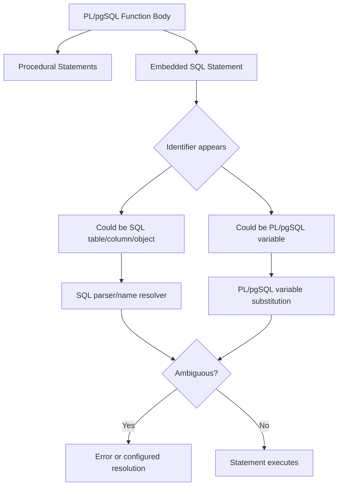

# Part 006 — Variable Substitution, Name Resolution, and Ambiguity Control

PL/pgSQL bugs often look like logic bugs, but many are actually **name resolution bugs**.

The routine compiles. The SQL looks reasonable. The table exists. The column exists. The variable exists.

Then production fails with:

```txt
ERROR: column reference "id" is ambiguous
```

or worse, it does not fail. It silently chooses the wrong meaning.

This part is about removing that class of risk.

The goal is not merely to memorize naming conventions. The goal is to build code where every identifier has an obvious owner:

- table alias,
- column name,
- function parameter,
- local variable,
- block label,
- trigger pseudo-record,
- dynamic SQL parameter,
- or schema object.

Good PL/pgSQL is not clever. It is unambiguous.

---

## 1. The Core Mental Model

PL/pgSQL runs procedural code, but embedded SQL is still parsed as SQL.

That means an identifier inside a SQL statement can be interpreted by two systems:

1. PL/pgSQL variable substitution,
2. SQL name resolution.



Your job is to make ambiguity structurally impossible.

---

## 2. Variable Substitution Is Not Text Replacement

PL/pgSQL variable substitution is not naive string interpolation.

This is important.

When PL/pgSQL sees a SQL statement, it can replace references to PL/pgSQL variables only where SQL allows a data value. It cannot use a variable name as a table name, column name, or syntax element.

Example:

```sql
CREATE OR REPLACE FUNCTION demo.get_case(p_case_id uuid)
RETURNS demo.case_file
LANGUAGE plpgsql
AS $$
DECLARE
    r_case demo.case_file%ROWTYPE;
BEGIN
    SELECT *
    INTO STRICT r_case
    FROM demo.case_file
    WHERE case_id = p_case_id;

    RETURN r_case;
END;
$$;
```

Here, `p_case_id` is a PL/pgSQL variable used as a value in the `WHERE` clause.

This is legal because SQL expects a value expression there.

But this does not work:

```sql
DECLARE
    v_table_name text := 'demo.case_file';
BEGIN
    SELECT *
    FROM v_table_name; -- not interpreted as table name
END;
```

A table name is not a data value. If an identifier must be dynamic, use dynamic SQL with `EXECUTE`.

---

## 3. Ambiguity: The Root Production Hazard

Consider this function:

```sql
CREATE OR REPLACE FUNCTION enforcement.get_case_status(case_id uuid)
RETURNS text
LANGUAGE plpgsql
AS $$
DECLARE
    status text;
BEGIN
    SELECT status
    INTO status
    FROM enforcement.enforcement_case
    WHERE case_id = case_id;

    RETURN status;
END;
$$;
```

This is terrible code.

The name `case_id` could refer to:

- the function parameter `case_id`,
- the table column `case_id`.

The name `status` could refer to:

- the local variable `status`,
- the table column `status`.

Even if PostgreSQL rejects the ambiguity, the code has already failed the human-readability test.

Better:

```sql
CREATE OR REPLACE FUNCTION enforcement.get_case_status(
    p_case_id enforcement.enforcement_case.case_id%TYPE
)
RETURNS enforcement.enforcement_case.status%TYPE
LANGUAGE plpgsql
AS $$
DECLARE
    v_status enforcement.enforcement_case.status%TYPE;
BEGIN
    SELECT c.status
    INTO STRICT v_status
    FROM enforcement.enforcement_case AS c
    WHERE c.case_id = p_case_id;

    RETURN v_status;
END;
$$;
```

Now every name has an owner:

| Identifier | Owner |
|---|---|
| `p_case_id` | parameter |
| `v_status` | local variable |
| `c.status` | table alias `c` |
| `c.case_id` | table alias `c` |

---

## 4. Use a Naming Convention, But Do Not Depend Only on It

A good convention reduces ambiguity before it starts.

Recommended convention:

| Kind | Prefix | Example |
|---|---|---|
| Input parameter | `p_` | `p_case_id` |
| Local scalar variable | `v_` | `v_status` |
| Row variable | `r_` | `r_case` |
| Record variable | `rec_` or `r_` | `rec_task` |
| Boolean variable | `v_is_`, `v_has_` | `v_has_open_tasks` |
| Count variable | `v_count_` or `v_*_count` | `v_open_task_count` |
| Timestamp variable | `v_*_at` | `v_closed_at` |
| JSON variable | `v_*_jsonb` | `v_payload_jsonb` |
| Transition variable | `v_from_*`, `v_to_*` | `v_from_status` |
| Function argument composite | `p_cmd`, `p_request` | `p_cmd.case_id` |

But prefixes are not enough.

Still qualify SQL columns with table aliases:

```sql
SELECT c.status
FROM enforcement.enforcement_case AS c
WHERE c.case_id = p_case_id;
```

Do not write:

```sql
SELECT status
FROM enforcement.enforcement_case
WHERE case_id = p_case_id;
```

It may work, but it leaves name ownership implicit.

Production code should not force readers to run the parser in their heads.

---

## 5. The Default Rule: Qualify Every Column in Embedded SQL

Inside PL/pgSQL, treat unqualified column names as suspicious.

Bad:

```sql
SELECT status, priority
INTO v_status, v_priority
FROM enforcement.enforcement_case
WHERE case_id = p_case_id;
```

Good:

```sql
SELECT c.status, c.priority
INTO v_status, v_priority
FROM enforcement.enforcement_case AS c
WHERE c.case_id = p_case_id;
```

Bad:

```sql
UPDATE enforcement.enforcement_case
SET status = p_status
WHERE case_id = p_case_id;
```

Better:

```sql
UPDATE enforcement.enforcement_case AS c
SET status = p_status,
    updated_at = clock_timestamp()
WHERE c.case_id = p_case_id;
```

Notice that the left side of `SET status = ...` is a target column of the updated table. Do not qualify the target column on the left side in PostgreSQL `UPDATE SET` syntax.

This is valid:

```sql
UPDATE enforcement.enforcement_case AS c
SET status = p_status
WHERE c.case_id = p_case_id;
```

This is not the normal PostgreSQL syntax:

```sql
UPDATE enforcement.enforcement_case AS c
SET c.status = p_status;
```

So the practical rule is:

- qualify columns in expressions, predicates, joins, `RETURNING`, and subqueries,
- use target column names directly in the `SET` assignment target,
- use aliases where PostgreSQL syntax permits them.

---

## 6. `SELECT INTO`: Two Name Spaces Collide

This pattern is common:

```sql
SELECT c.status
INTO v_status
FROM enforcement.enforcement_case AS c
WHERE c.case_id = p_case_id;
```

There are three important zones:

```sql
SELECT c.status       -- SQL output expression
INTO v_status         -- PL/pgSQL target variable
FROM ...              -- SQL relation namespace
WHERE c.case_id = ... -- SQL expression + PL/pgSQL variable substitution
```

The `INTO` target is PL/pgSQL-specific in this context. It is not the same as `SELECT INTO new_table` in plain SQL.

Be explicit and place `INTO` near the select list or after it consistently.

Recommended style:

```sql
SELECT c.status, c.priority
INTO STRICT v_status, v_priority
FROM enforcement.enforcement_case AS c
WHERE c.case_id = p_case_id;
```

---

## 7. Ambiguity in `INSERT`

`INSERT` can hide name-resolution problems because column names, variable names, and conflict targets may overlap.

Bad:

```sql
CREATE OR REPLACE FUNCTION enforcement.insert_case_note(
    case_id uuid,
    note text
)
RETURNS void
LANGUAGE plpgsql
AS $$
BEGIN
    INSERT INTO enforcement.case_note(case_id, note)
    VALUES (case_id, note);
END;
$$;
```

Better:

```sql
CREATE OR REPLACE FUNCTION enforcement.insert_case_note(
    p_case_id enforcement.case_note.case_id%TYPE,
    p_note enforcement.case_note.note%TYPE
)
RETURNS void
LANGUAGE plpgsql
AS $$
BEGIN
    INSERT INTO enforcement.case_note(case_id, note)
    VALUES (p_case_id, p_note);
END;
$$;
```

Even better when inserting derived data:

```sql
INSERT INTO enforcement.case_note(
    case_id,
    note,
    created_by_user_id,
    created_at
)
VALUES (
    p_case_id,
    p_note,
    p_actor_user_id,
    clock_timestamp()
);
```

The target column list is table metadata. The `VALUES` expressions should clearly be variables or expressions.

---

## 8. Ambiguity in `UPDATE`

Bad:

```sql
UPDATE enforcement.enforcement_case
SET status = status
WHERE case_id = case_id;
```

This is unreadable and potentially dangerous.

What does `status = status` mean?

- assign the column to itself?
- assign parameter `status` to column `status`?
- compare something?

Correct:

```sql
UPDATE enforcement.enforcement_case AS c
SET status = p_status,
    updated_at = clock_timestamp()
WHERE c.case_id = p_case_id;
```

When you need old values, use aliases in `RETURNING` carefully:

```sql
UPDATE enforcement.enforcement_case AS c
SET status = p_target_status,
    updated_at = clock_timestamp()
WHERE c.case_id = p_case_id
RETURNING c.case_id, c.status, c.updated_at
INTO v_case_id, v_new_status, v_updated_at;
```

Remember: in `RETURNING`, `c.status` is the new value after update.

If you need the old value, select and store it before the update, or use a data-modifying CTE pattern when appropriate.

---

## 9. Ambiguity in `ON CONFLICT`

`ON CONFLICT` is a common place for name collisions.

Bad:

```sql
CREATE OR REPLACE FUNCTION enforcement.upsert_case_external_ref(
    source_system text,
    source_reference text,
    case_id uuid
)
RETURNS void
LANGUAGE plpgsql
AS $$
BEGIN
    INSERT INTO enforcement.case_external_ref(
        source_system,
        source_reference,
        case_id
    )
    VALUES (
        source_system,
        source_reference,
        case_id
    )
    ON CONFLICT (source_system, source_reference)
    DO UPDATE
    SET case_id = case_id;
END;
$$;
```

This is a minefield.

Better:

```sql
CREATE OR REPLACE FUNCTION enforcement.upsert_case_external_ref(
    p_source_system enforcement.case_external_ref.source_system%TYPE,
    p_source_reference enforcement.case_external_ref.source_reference%TYPE,
    p_case_id enforcement.case_external_ref.case_id%TYPE
)
RETURNS void
LANGUAGE plpgsql
AS $$
BEGIN
    INSERT INTO enforcement.case_external_ref AS ref (
        source_system,
        source_reference,
        case_id,
        updated_at
    )
    VALUES (
        p_source_system,
        p_source_reference,
        p_case_id,
        clock_timestamp()
    )
    ON CONFLICT (source_system, source_reference)
    DO UPDATE
    SET case_id = EXCLUDED.case_id,
        updated_at = clock_timestamp();
END;
$$;
```

In an upsert, there are several namespaces:

| Name | Meaning |
|---|---|
| target table columns | columns of `case_external_ref` |
| `EXCLUDED.column` | value proposed for insertion |
| function parameters | `p_*` variables |
| target table alias | existing row being updated |

If you need the existing row value:

```sql
ON CONFLICT (source_system, source_reference)
DO UPDATE
SET case_id = EXCLUDED.case_id,
    updated_at = clock_timestamp()
WHERE ref.case_id IS DISTINCT FROM EXCLUDED.case_id;
```

Now `ref.case_id` is the old/existing value and `EXCLUDED.case_id` is the proposed value.

---

## 10. Use Function and Block Labels for Disambiguation

PL/pgSQL supports labels for blocks.

```sql
CREATE OR REPLACE FUNCTION enforcement.example_label(
    p_case_id uuid
)
RETURNS uuid
LANGUAGE plpgsql
AS $$
<<fn>>
DECLARE
    v_case_id uuid := p_case_id;
BEGIN
    RETURN fn.v_case_id;
END;
$$;
```

A block label can qualify variables declared in that block.

This is useful when a local name might conflict with another scope, but do not use labels as a substitute for clear naming.

Good use:

```sql
CREATE OR REPLACE FUNCTION enforcement.close_case(
    p_case_id uuid
)
RETURNS uuid
LANGUAGE plpgsql
AS $$
<<close_case_block>>
DECLARE
    v_case_id uuid := p_case_id;
BEGIN
    -- Rare explicit qualification for clarity in nested block logic.
    RETURN close_case_block.v_case_id;
END;
$$;
```

Usually, a naming convention is simpler than heavy label qualification.

---

## 11. Function Parameters Are Variables Too

Input parameters, output parameters, and local variables all participate in PL/pgSQL name resolution.

This matters especially with output parameters.

```sql
CREATE OR REPLACE FUNCTION enforcement.get_case_status_bad(
    p_case_id uuid,
    OUT status text
)
LANGUAGE plpgsql
AS $$
BEGIN
    SELECT status
    INTO status
    FROM enforcement.enforcement_case
    WHERE case_id = p_case_id;
END;
$$;
```

The output parameter `status` is also a variable named `status`.

Better:

```sql
CREATE OR REPLACE FUNCTION enforcement.get_case_status(
    p_case_id uuid,
    OUT o_status text
)
LANGUAGE plpgsql
AS $$
BEGIN
    SELECT c.status
    INTO STRICT o_status
    FROM enforcement.enforcement_case AS c
    WHERE c.case_id = p_case_id;
END;
$$;
```

For output parameters, use `o_` if you use them at all.

In many cases, an explicit `RETURNS TABLE` or named composite return is clearer.

---

## 12. Nested Blocks and Shadowing

PL/pgSQL allows nested blocks. Inner declarations can shadow outer declarations.

```sql
DECLARE
    v_status text := 'outer';
BEGIN
    DECLARE
        v_status text := 'inner';
    BEGIN
        RAISE NOTICE 'status=%', v_status; -- inner
    END;

    RAISE NOTICE 'status=%', v_status; -- outer
END;
```

Shadowing is legal but dangerous in production routines.

Use nested blocks for:

- exception isolation,
- short-lived variables,
- logically isolated operation phases.

Avoid reusing the same variable name across nested scopes.

Better:

```sql
DECLARE
    v_original_status text;
BEGIN
    DECLARE
        v_candidate_status text;
    BEGIN
        -- no shadowing
    END;
END;
```

---

## 13. Trigger Name Resolution

Trigger functions introduce pseudo-records and trigger metadata variables:

- `NEW`,
- `OLD`,
- `TG_NAME`,
- `TG_OP`,
- `TG_TABLE_NAME`,
- `TG_TABLE_SCHEMA`,
- and others.

Bad trigger code:

```sql
CREATE OR REPLACE FUNCTION enforcement.case_audit_trigger()
RETURNS trigger
LANGUAGE plpgsql
AS $$
DECLARE
    status text;
BEGIN
    status := NEW.status;

    INSERT INTO enforcement.case_audit(case_id, status)
    VALUES (case_id, status);

    RETURN NEW;
END;
$$;
```

`case_id` is not clearly owned.

Better:

```sql
CREATE OR REPLACE FUNCTION enforcement.case_audit_trigger()
RETURNS trigger
LANGUAGE plpgsql
AS $$
DECLARE
    v_status enforcement.enforcement_case.status%TYPE;
BEGIN
    v_status := NEW.status;

    INSERT INTO enforcement.case_audit(case_id, status, changed_at)
    VALUES (NEW.case_id, v_status, clock_timestamp());

    RETURN NEW;
END;
$$;
```

Inside triggers, prefer explicit `NEW.column` and `OLD.column` for row state.

Do not copy fields into local variables unless you need to freeze values, normalize them, or pass them to another function.

---

## 14. Dynamic SQL: No Automatic Variable Substitution Inside Strings

This does not work as intended:

```sql
EXECUTE 'SELECT count(*) FROM enforcement.enforcement_case WHERE status = p_status'
INTO v_count;
```

Inside the string, `p_status` is just text in the SQL command. It is not automatically substituted as a PL/pgSQL variable.

Use `EXECUTE ... USING` for values:

```sql
EXECUTE
    'SELECT count(*) FROM enforcement.enforcement_case WHERE status = $1'
INTO v_count
USING p_status;
```

Use `format('%I', identifier)` or `quote_ident` for identifiers:

```sql
EXECUTE format(
    'SELECT count(*) FROM %I.%I WHERE status = $1',
    p_schema_name,
    p_table_name
)
INTO v_count
USING p_status;
```

Golden rule:

| Dynamic Part | Safe Mechanism |
|---|---|
| Data value | `USING` |
| Identifier | `format('%I', ...)` |
| Literal embedded into generated SQL | Prefer `USING`; otherwise `format('%L', ...)` |
| SQL keyword/operator | Whitelist manually |

Never concatenate untrusted input directly into SQL.

---

## 15. `EXECUTE` and Ambiguity Boundaries

Dynamic SQL creates a hard boundary:

```sql
EXECUTE 'UPDATE enforcement.enforcement_case SET status = $1 WHERE case_id = $2'
USING p_status, p_case_id;
```

Inside the SQL string:

- `$1` means the first dynamic SQL parameter,
- `$2` means the second dynamic SQL parameter,
- `p_status` is not visible,
- `p_case_id` is not visible.

This can actually reduce ambiguity if used carefully.

But dynamic SQL also removes some compile-time checking. Use it when identifiers or structure must be dynamic, not when ordinary static SQL would work.

---

## 16. `plpgsql.variable_conflict`: Last Resort, Not Style Guide

PostgreSQL exposes a setting named `plpgsql.variable_conflict` with modes such as:

- `error`,
- `use_variable`,
- `use_column`.

There is also a per-function directive form:

```sql
#variable_conflict use_variable
```

Example:

```sql
CREATE OR REPLACE FUNCTION enforcement.example_conflict(id uuid)
RETURNS uuid
LANGUAGE plpgsql
AS $$
#variable_conflict use_variable
BEGIN
    RETURN id;
END;
$$;
```

Do not use this as a normal solution.

For production code, the best setting is effectively: make conflicts impossible through naming and qualification.

`use_variable` and `use_column` encode hidden policy into the parser. That makes code harder to review.

Acceptable uses:

- migration compatibility,
- controlled porting from legacy PL/SQL,
- emergency stabilization of old code while refactoring.

Not acceptable:

- avoiding proper names,
- making ambiguous code pass review,
- hiding unresolved collisions.

---

## 17. Query Alias Discipline

Always alias tables in non-trivial SQL.

Bad:

```sql
SELECT enforcement_case.status
FROM enforcement.enforcement_case
WHERE enforcement_case.case_id = p_case_id;
```

Better:

```sql
SELECT c.status
FROM enforcement.enforcement_case AS c
WHERE c.case_id = p_case_id;
```

Recommended alias style:

| Table | Alias |
|---|---|
| `enforcement_case` | `c` |
| `case_transition` | `ct` |
| `case_task` | `t` |
| `case_audit` | `a` |
| `case_external_ref` | `ref` |
| `users` | `u` |
| `organization` | `org` |

Keep aliases short but meaningful.

Avoid aliases like `x`, `y`, `z` unless the query is truly tiny.

---

## 18. Column Alias Discipline

When selecting expressions, alias them explicitly.

Bad:

```sql
SELECT count(*), max(created_at)
INTO v_count, v_latest_created_at
FROM enforcement.case_task AS t
WHERE t.case_id = p_case_id;
```

This is acceptable but less readable in larger queries.

Better when using records:

```sql
DECLARE
    r_task_summary record;
BEGIN
    SELECT
        count(*) AS open_task_count,
        max(t.created_at) AS latest_task_created_at
    INTO r_task_summary
    FROM enforcement.case_task AS t
    WHERE t.case_id = p_case_id
      AND t.status <> 'done';

    RAISE NOTICE 'open tasks=%', r_task_summary.open_task_count;
END;
```

If you access a `record` field later, the field name must come from the query output. Make it intentional.

---

## 19. Avoid Reusing Table Column Names as Variable Names

Do not do this:

```sql
DECLARE
    status text;
    priority text;
    created_at timestamptz;
```

Prefer:

```sql
DECLARE
    v_status text;
    v_priority text;
    v_created_at timestamptz;
```

Even better when coupled to table columns:

```sql
DECLARE
    v_status enforcement.enforcement_case.status%TYPE;
    v_priority enforcement.enforcement_case.priority%TYPE;
    v_created_at enforcement.enforcement_case.created_at%TYPE;
```

This is not cosmetic. It prevents parser ambiguity and reader ambiguity.

---

## 20. Avoid Generic Variable Names in Long Functions

Bad:

```sql
DECLARE
    v_id uuid;
    v_name text;
    v_count integer;
    v_result boolean;
```

Better:

```sql
DECLARE
    v_case_id uuid;
    v_actor_display_name text;
    v_open_task_count integer;
    v_transition_allowed boolean;
```

Generic names force the reader to search upward for meaning.

In database code, where SQL and procedural scopes are interleaved, vague names are expensive.

---

## 21. Name Resolution With Composite Parameters

Composite parameters can improve naming if used well.

```sql
CREATE TYPE enforcement.case_transition_command AS (
    case_id uuid,
    target_status text,
    actor_user_id uuid,
    reason_code text
);
```

Function:

```sql
CREATE OR REPLACE FUNCTION enforcement.transition_case(
    p_cmd enforcement.case_transition_command
)
RETURNS void
LANGUAGE plpgsql
AS $$
BEGIN
    UPDATE enforcement.enforcement_case AS c
    SET status = p_cmd.target_status,
        updated_by_user_id = p_cmd.actor_user_id,
        updated_at = clock_timestamp()
    WHERE c.case_id = p_cmd.case_id;
END;
$$;
```

`p_cmd.case_id` is clearly not `c.case_id`.

Composite parameters create a namespace. That can be cleaner than many similarly named scalar parameters.

---

## 22. Beware Same Field Names Across Multiple Row Variables

This is common in transition logic:

```sql
DECLARE
    r_before enforcement.enforcement_case%ROWTYPE;
    r_after enforcement.enforcement_case%ROWTYPE;
BEGIN
    -- ...
END;
```

Access fields with full row variable qualification:

```sql
r_before.status
r_after.status
```

Do not copy both into generic variables called `v_status`.

Better:

```sql
v_from_status := r_before.status;
v_to_status := r_after.status;
```

Name variables according to time/phase semantics, not just column names.

---

## 23. `FOUND` Is Global-ish Within Function Execution

`FOUND` is a special PL/pgSQL variable that changes after certain statements.

This can create logic ambiguity, not name ambiguity.

Bad:

```sql
UPDATE enforcement.enforcement_case AS c
SET status = p_status
WHERE c.case_id = p_case_id;

PERFORM enforcement.write_audit_event(p_case_id);

IF NOT FOUND THEN
    RAISE EXCEPTION 'case not found';
END IF;
```

The `PERFORM` may change `FOUND`, so the check may no longer refer to the `UPDATE`.

Better:

```sql
UPDATE enforcement.enforcement_case AS c
SET status = p_status
WHERE c.case_id = p_case_id;

GET DIAGNOSTICS v_row_count = ROW_COUNT;

IF v_row_count <> 1 THEN
    RAISE EXCEPTION 'Expected to update 1 case %, updated %',
        p_case_id,
        v_row_count;
END IF;

PERFORM enforcement.write_audit_event(p_case_id);
```

Name clarity also applies to implicit state.

---

## 24. Do Not Hide Meaning Behind `COALESCE(parameter, column)` Without Care

Patch/update functions often use this pattern:

```sql
UPDATE enforcement.enforcement_case AS c
SET priority = COALESCE(p_priority, c.priority)
WHERE c.case_id = p_case_id;
```

This is clear enough if `NULL` means "no change".

But it becomes ambiguous if `NULL` is a valid requested value.

Better for patch semantics:

```sql
CREATE TYPE enforcement.case_patch_command AS (
    case_id uuid,
    priority_present boolean,
    priority text,
    owner_present boolean,
    owner_user_id uuid
);
```

Then:

```sql
UPDATE enforcement.enforcement_case AS c
SET priority = CASE
        WHEN p_cmd.priority_present THEN p_cmd.priority
        ELSE c.priority
    END,
    owner_user_id = CASE
        WHEN p_cmd.owner_present THEN p_cmd.owner_user_id
        ELSE c.owner_user_id
    END,
    updated_at = clock_timestamp()
WHERE c.case_id = p_cmd.case_id;
```

This is more verbose, but it makes patch intent unambiguous.

---

## 25. Name Resolution in CTEs

CTEs add another naming layer.

Bad:

```sql
WITH case_data AS (
    SELECT case_id, status
    FROM enforcement.enforcement_case
    WHERE case_id = p_case_id
)
SELECT status
INTO v_status
FROM case_data;
```

Better:

```sql
WITH case_data AS (
    SELECT
        c.case_id AS case_id,
        c.status AS status
    FROM enforcement.enforcement_case AS c
    WHERE c.case_id = p_case_id
)
SELECT cd.status
INTO STRICT v_status
FROM case_data AS cd;
```

CTE output columns should be explicitly named when used outside the CTE.

---

## 26. Name Resolution in `RETURN QUERY`

Bad:

```sql
RETURN QUERY
SELECT case_id, status
FROM enforcement.enforcement_case
WHERE status = status;
```

Better:

```sql
RETURN QUERY
SELECT c.case_id, c.status
FROM enforcement.enforcement_case AS c
WHERE c.status = p_status;
```

If the function uses `RETURNS TABLE(case_id uuid, status text)`, those output columns are variables too. Avoid giving local variables the same names as output columns.

Safer:

```sql
CREATE OR REPLACE FUNCTION enforcement.find_cases_by_status(
    p_status text
)
RETURNS TABLE(o_case_id uuid, o_status text)
LANGUAGE plpgsql
AS $$
BEGIN
    RETURN QUERY
    SELECT c.case_id, c.status
    FROM enforcement.enforcement_case AS c
    WHERE c.status = p_status;
END;
$$;
```

Some teams prefer output column names without `o_` because they define the result schema. That can be okay for simple SQL functions, but in PL/pgSQL bodies it increases collision risk. Choose deliberately.

---

## 27. Security Note: Name Resolution Is Not Search Path Hardening

Qualifying columns and variables prevents local ambiguity.

It does not fully secure function execution.

For security-definer functions, you must also control schema object resolution, especially `search_path`. That topic is handled deeply in the security part of this series.

For now, remember:

```sql
SELECT c.status
FROM enforcement.enforcement_case AS c
```

is clearer than unqualified column use, but function security also depends on how object names are resolved.

---

## 28. Production Naming Standard

Use this as a team baseline.

### Function Parameters

```sql
p_case_id
p_actor_user_id
p_target_status
p_reason_code
p_request_id
```

### Local Variables

```sql
v_case_id
v_from_status
v_to_status
v_open_task_count
v_transition_allowed
```

### Row Variables

```sql
r_case
r_transition
r_actor
r_policy
```

### Record Variables

```sql
rec_table
rec_partition
rec_violation
```

### Output Variables

```sql
o_case_id
o_status
o_priority
```

### Composite Parameters

```sql
p_cmd
p_request
p_patch
p_event
```

### Table Aliases

```sql
c    -- enforcement_case
ct   -- case_transition
t    -- task
u    -- user
org  -- organization
ref  -- external reference
a    -- audit
```

The exact convention can vary. The invariant should not:

> No local variable, parameter, or output variable should have the same unqualified name as a column referenced in embedded SQL.

---

## 29. Full Example: Ambiguous to Production-Grade

### Ambiguous Version

```sql
CREATE OR REPLACE FUNCTION enforcement.reassign_case(
    case_id uuid,
    owner_user_id uuid,
    reason text
)
RETURNS void
LANGUAGE plpgsql
AS $$
DECLARE
    status text;
BEGIN
    SELECT status
    INTO status
    FROM enforcement.enforcement_case
    WHERE case_id = case_id;

    IF status = 'closed' THEN
        RAISE EXCEPTION 'closed case cannot be reassigned';
    END IF;

    UPDATE enforcement.enforcement_case
    SET owner_user_id = owner_user_id
    WHERE case_id = case_id;

    INSERT INTO enforcement.case_assignment_audit(
        case_id,
        owner_user_id,
        reason
    )
    VALUES (
        case_id,
        owner_user_id,
        reason
    );
END;
$$;
```

### Production-Grade Version

```sql
CREATE OR REPLACE FUNCTION enforcement.reassign_case(
    p_case_id enforcement.enforcement_case.case_id%TYPE,
    p_owner_user_id enforcement.enforcement_case.owner_user_id%TYPE,
    p_reason enforcement.case_assignment_audit.reason%TYPE,
    p_actor_user_id uuid
)
RETURNS void
LANGUAGE plpgsql
AS $$
DECLARE
    v_status enforcement.enforcement_case.status%TYPE;
    v_previous_owner_user_id enforcement.enforcement_case.owner_user_id%TYPE;
    v_row_count bigint;
BEGIN
    SELECT c.status, c.owner_user_id
    INTO STRICT v_status, v_previous_owner_user_id
    FROM enforcement.enforcement_case AS c
    WHERE c.case_id = p_case_id
    FOR UPDATE;

    IF v_status = 'closed' THEN
        RAISE EXCEPTION 'Case % cannot be reassigned because it is closed', p_case_id;
    END IF;

    UPDATE enforcement.enforcement_case AS c
    SET owner_user_id = p_owner_user_id,
        updated_by_user_id = p_actor_user_id,
        updated_at = clock_timestamp()
    WHERE c.case_id = p_case_id;

    GET DIAGNOSTICS v_row_count = ROW_COUNT;

    IF v_row_count <> 1 THEN
        RAISE EXCEPTION 'Expected to update 1 case %, updated %',
            p_case_id,
            v_row_count;
    END IF;

    INSERT INTO enforcement.case_assignment_audit(
        case_id,
        previous_owner_user_id,
        new_owner_user_id,
        reason,
        actor_user_id,
        changed_at
    )
    VALUES (
        p_case_id,
        v_previous_owner_user_id,
        p_owner_user_id,
        p_reason,
        p_actor_user_id,
        clock_timestamp()
    );
END;
$$;
```

What changed?

| Problem | Fix |
|---|---|
| Parameters named like columns | `p_` prefix |
| Local variable named like column | `v_status` |
| Unqualified table columns | table alias `c` |
| `WHERE case_id = case_id` | `c.case_id = p_case_id` |
| Hidden row-count assumption | `GET DIAGNOSTICS ROW_COUNT` |
| Audit lost previous value | stored `v_previous_owner_user_id` before update |

---

## 30. Review Checklist

Before approving PL/pgSQL, check:

1. Do all parameters use a clear convention such as `p_`?
2. Do all local variables use a clear convention such as `v_` or `r_`?
3. Are table columns qualified with table aliases?
4. Are `UPDATE` predicates unambiguous?
5. Are `INSERT ... VALUES` expressions clearly variables, not accidental column names?
6. Does `ON CONFLICT DO UPDATE` distinguish target row and `EXCLUDED` values?
7. Are output parameters named to avoid column collisions?
8. Are `record` fields created by explicit column aliases?
9. Does dynamic SQL use `USING` for values?
10. Are dynamic identifiers quoted through `format('%I', ...)`?
11. Is `plpgsql.variable_conflict` avoided except for legacy migration cases?
12. Does the routine avoid variable shadowing in nested blocks?
13. Is `FOUND` checked immediately, or is `ROW_COUNT` captured explicitly?
14. Are before/after values named by phase, such as `v_from_status` and `v_to_status`?

---

## 31. Practical Exercises

### Exercise 1: Fix the Ambiguous Predicate

Refactor:

```sql
SELECT status
INTO status
FROM enforcement.enforcement_case
WHERE case_id = case_id;
```

Use parameter prefixing, local variable prefixing, and table aliases.

### Exercise 2: Fix the Upsert

Refactor:

```sql
INSERT INTO enforcement.case_external_ref(source_system, source_reference, case_id)
VALUES (source_system, source_reference, case_id)
ON CONFLICT (source_system, source_reference)
DO UPDATE
SET case_id = case_id;
```

Make target row, excluded row, and parameters unambiguous.

### Exercise 3: Dynamic SQL Boundary

Write a safe dynamic SQL statement that counts rows in a supplied schema/table where `status = p_status`.

Rules:

- schema/table names are identifiers,
- status is a value,
- no direct concatenation of untrusted input.

---

## 32. Key Takeaways

- PL/pgSQL variable substitution is not text replacement.
- Variables can be substituted only where SQL expects values.
- Ambiguous identifiers are a production risk even when the parser catches them.
- Prefix parameters and local variables, but still qualify SQL columns.
- Use table aliases consistently.
- Treat `ON CONFLICT`, `UPDATE`, `RETURN QUERY`, output parameters, and triggers as high-risk ambiguity zones.
- Dynamic SQL has its own parameter boundary; use `EXECUTE ... USING` for values.
- Avoid relying on `plpgsql.variable_conflict` for normal code.
- Code review should enforce name ownership as a structural invariant.

---

## References

- PostgreSQL Documentation — PL/pgSQL Under the Hood / Variable Substitution: https://www.postgresql.org/docs/current/plpgsql-implementation.html
- PostgreSQL Documentation — PL/pgSQL Declarations: https://www.postgresql.org/docs/current/plpgsql-declarations.html
- PostgreSQL Documentation — PL/pgSQL Basic Statements: https://www.postgresql.org/docs/current/plpgsql-statements.html
- PostgreSQL Documentation — PL/pgSQL Trigger Functions: https://www.postgresql.org/docs/current/plpgsql-trigger.html
- PostgreSQL Documentation — INSERT / ON CONFLICT: https://www.postgresql.org/docs/current/sql-insert.html
- PostgreSQL Documentation — UPDATE: https://www.postgresql.org/docs/current/sql-update.html
