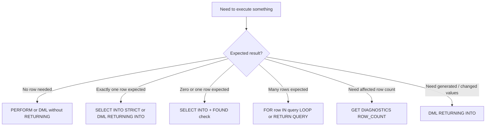

# Part 007 — Basic Statements: `PERFORM`, `SELECT INTO`, `RETURNING`, and `FOUND`

Most PL/pgSQL routines are not complex because the syntax is complex.

They become complex because the code does not make a simple distinction:

> Is this statement being executed for a side effect, for one row, for many rows, or for proof that something changed?

That distinction is the backbone of this part.

In application code, we often separate commands and queries. In PL/pgSQL, the separation is more subtle because SQL statements can return data, mutate data, trigger side effects, and expose execution metadata through `FOUND` and `GET DIAGNOSTICS`.

Production PL/pgSQL must make those contracts visible.

This part covers the daily-use statement set:

- `PERFORM`
- `SELECT ... INTO`
- `STRICT`
- `INSERT/UPDATE/DELETE/MERGE ... RETURNING ... INTO`
- `FOUND`
- `GET DIAGNOSTICS ... ROW_COUNT`
- statement-level correctness patterns

We will not repeat SQL basics. The focus is PL/pgSQL behavior and implementation discipline.

---

## 1. The Statement Contract Model

Every PL/pgSQL statement should have a contract.



The problem with weak PL/pgSQL is not that it uses the wrong syntax. The problem is that it hides the intended cardinality.

For example:

```sql
SELECT status INTO v_status
FROM app_case
WHERE id = p_case_id;
```

This says:

- assign a status,
- from a matching case,
- probably one case.

But it does **not** tell the reader what should happen if:

- no row exists,
- more than one row can match,
- a concurrent transaction deletes the row before this function runs,
- the query accidentally becomes non-unique after a later change.

A production routine should encode that decision explicitly.

---

## 2. Working Example Schema

We will use a compact case-management example throughout this part.

```sql
CREATE SCHEMA IF NOT EXISTS app;

CREATE TABLE app.case_file (
    case_id       uuid PRIMARY KEY,
    case_number   text NOT NULL UNIQUE,
    status        text NOT NULL,
    priority      text NOT NULL,
    assigned_to   uuid,
    opened_at     timestamptz NOT NULL DEFAULT clock_timestamp(),
    updated_at    timestamptz NOT NULL DEFAULT clock_timestamp(),
    version       bigint NOT NULL DEFAULT 1,
    CONSTRAINT case_status_valid CHECK (
        status IN ('draft', 'open', 'under_review', 'escalated', 'closed')
    ),
    CONSTRAINT case_priority_valid CHECK (
        priority IN ('low', 'normal', 'high', 'critical')
    )
);

CREATE TABLE app.case_event (
    event_id      bigserial PRIMARY KEY,
    case_id       uuid NOT NULL REFERENCES app.case_file(case_id),
    event_type    text NOT NULL,
    event_payload jsonb NOT NULL DEFAULT '{}'::jsonb,
    occurred_at   timestamptz NOT NULL DEFAULT clock_timestamp(),
    actor_id      uuid
);
```

The schema is intentionally small. The goal is not schema design. The goal is to reason about PL/pgSQL statement semantics.

---

## 3. `PERFORM`: Execute for Side Effect, Discard the Result

In PL/pgSQL, a plain SQL query that returns rows cannot be written as a bare `SELECT` when you do not consume its result. Use `PERFORM`.

```sql
PERFORM app.recalculate_case_sla(p_case_id);
```

Think of `PERFORM` as:

> Execute this expression or query because I care about its side effects or whether it found anything, not because I need returned values.

Common use cases:

| Use case | Example |
|---|---|
| Call function for side effect | `PERFORM app.emit_case_metric(p_case_id);` |
| Check existence | `PERFORM 1 FROM app.case_file WHERE case_id = p_case_id;` |
| Execute validation function that raises on failure | `PERFORM app.assert_case_mutable(p_case_id);` |
| Warm or force deterministic internal behavior | rare; use carefully |

### 3.1 Existence Check with `PERFORM`

```sql
CREATE OR REPLACE FUNCTION app.case_exists(p_case_id uuid)
RETURNS boolean
LANGUAGE plpgsql
AS $$
BEGIN
    PERFORM 1
    FROM app.case_file c
    WHERE c.case_id = p_case_id;

    RETURN FOUND;
END;
$$;
```

`FOUND` becomes `true` if the query produced at least one row.

This is usually more direct than selecting a value you do not need.

### 3.2 Side-Effect Function Call

```sql
CREATE OR REPLACE FUNCTION app.record_case_touch(p_case_id uuid, p_actor_id uuid)
RETURNS void
LANGUAGE plpgsql
AS $$
BEGIN
    INSERT INTO app.case_event(case_id, event_type, actor_id)
    VALUES (p_case_id, 'case_touched', p_actor_id);
END;
$$;

CREATE OR REPLACE FUNCTION app.touch_case(p_case_id uuid, p_actor_id uuid)
RETURNS void
LANGUAGE plpgsql
AS $$
BEGIN
    UPDATE app.case_file c
    SET updated_at = clock_timestamp(),
        version = c.version + 1
    WHERE c.case_id = p_case_id;

    IF NOT FOUND THEN
        RAISE EXCEPTION 'case % does not exist', p_case_id
            USING ERRCODE = 'P0002';
    END IF;

    PERFORM app.record_case_touch(p_case_id, p_actor_id);
END;
$$;
```

Here `PERFORM` communicates intent: the routine wants the event recorded, not a returned value.

### 3.3 `PERFORM` Is Not a Logging Mechanism

This is poor style:

```sql
PERFORM app.debug_dump_case(p_case_id);
```

If the function exists only to emit logs, prefer explicit `RAISE` in the current function or a clearly named diagnostic function. Hidden side-effect calls make production behavior harder to audit.

A better pattern:

```sql
RAISE DEBUG 'touch_case: case_id=%, actor_id=%', p_case_id, p_actor_id;
```

or:

```sql
PERFORM app.emit_case_audit_signal(
    p_case_id     => p_case_id,
    p_signal_name => 'touch_case.started',
    p_payload     => jsonb_build_object('actor_id', p_actor_id)
);
```

The second is acceptable only when audit/event emission is a real domain side effect.

---

## 4. `SELECT ... INTO`: Assign Query Result to Variables

In PL/pgSQL, `SELECT ... INTO` assigns query output into PL/pgSQL variables.

This is different from SQL-level `SELECT INTO`, which creates a table. Inside PL/pgSQL, read `INTO` as assignment.

```sql
DECLARE
    v_status app.case_file.status%TYPE;
BEGIN
    SELECT c.status
    INTO v_status
    FROM app.case_file c
    WHERE c.case_id = p_case_id;
END;
```

### 4.1 The Default Contract: Zero or One Useful Row

Without `STRICT`, `SELECT ... INTO` assigns the first row if a row is returned.

If no row is returned, target variables are set to nulls and `FOUND` becomes `false`.

This behavior is useful for optional lookup, but dangerous for required lookup.

```sql
CREATE OR REPLACE FUNCTION app.get_case_priority_or_null(p_case_id uuid)
RETURNS text
LANGUAGE plpgsql
AS $$
DECLARE
    v_priority app.case_file.priority%TYPE;
BEGIN
    SELECT c.priority
    INTO v_priority
    FROM app.case_file c
    WHERE c.case_id = p_case_id;

    IF NOT FOUND THEN
        RETURN NULL;
    END IF;

    RETURN v_priority;
END;
$$;
```

This is clear: no case maps to null.

But if absence is an error, do not write optional lookup.

### 4.2 Required Lookup with `STRICT`

`STRICT` turns the statement into an exact-cardinality assertion.

```sql
CREATE OR REPLACE FUNCTION app.get_required_case_status(p_case_id uuid)
RETURNS text
LANGUAGE plpgsql
AS $$
DECLARE
    v_status app.case_file.status%TYPE;
BEGIN
    SELECT c.status
    INTO STRICT v_status
    FROM app.case_file c
    WHERE c.case_id = p_case_id;

    RETURN v_status;
END;
$$;
```

With `STRICT`:

- zero rows raises `NO_DATA_FOUND`,
- more than one row raises `TOO_MANY_ROWS`,
- exactly one row assigns values and sets `FOUND` to `true`.

Use `STRICT` when the domain says there must be exactly one result.

### 4.3 Optional Lookup with Explicit `FOUND`

When zero rows are valid, make it obvious.

```sql
CREATE OR REPLACE FUNCTION app.find_case_id_by_number(p_case_number text)
RETURNS uuid
LANGUAGE plpgsql
AS $$
DECLARE
    v_case_id app.case_file.case_id%TYPE;
BEGIN
    SELECT c.case_id
    INTO v_case_id
    FROM app.case_file c
    WHERE c.case_number = p_case_number;

    IF NOT FOUND THEN
        RETURN NULL;
    END IF;

    RETURN v_case_id;
END;
$$;
```

Because `case_number` is unique, this is safe enough. If the predicate were not unique, the code would be under-specified.

### 4.4 Never Rely on “First Row” Without `ORDER BY`

This is a common production bug:

```sql
SELECT e.event_type
INTO v_last_event_type
FROM app.case_event e
WHERE e.case_id = p_case_id;
```

It looks like “get the last event”. It is not.

A correct version states the ordering:

```sql
SELECT e.event_type
INTO v_last_event_type
FROM app.case_event e
WHERE e.case_id = p_case_id
ORDER BY e.occurred_at DESC, e.event_id DESC
LIMIT 1;
```

This is now an optional single-row lookup. Absence means the case has no events.

```sql
IF NOT FOUND THEN
    v_last_event_type := 'none';
END IF;
```

### 4.5 The Cardinality Decision Table

| Domain expectation | Statement style | Absence | Multiple rows |
|---|---|---|---|
| Exactly one row | `SELECT ... INTO STRICT` | exception | exception |
| Zero or one row by unique predicate | `SELECT ... INTO` + `FOUND` | explicit branch | structurally impossible if constraint is valid |
| Best row by ranking | `ORDER BY ... LIMIT 1` + `FOUND` | explicit branch | intentionally reduced to one |
| Many rows | `FOR r IN SELECT ... LOOP` | loop body skipped | all rows processed |
| Aggregate result | `SELECT count(*) INTO ...` | one row returned | one row returned |

The production rule is simple:

> Do not write `SELECT ... INTO` until you can say what zero rows and many rows mean.

---

## 5. `DML ... RETURNING ... INTO`: Mutation plus Result Contract

`RETURNING` is one of PostgreSQL's strongest tools for PL/pgSQL.

It lets mutation and result capture happen in one statement.

```sql
INSERT INTO app.case_file(case_id, case_number, status, priority, assigned_to)
VALUES (gen_random_uuid(), p_case_number, 'open', p_priority, p_actor_id)
RETURNING case_id
INTO v_case_id;
```

This avoids a second query to fetch generated values.

### 5.1 Insert and Capture Generated Identity

```sql
CREATE OR REPLACE FUNCTION app.open_case(
    p_case_number text,
    p_priority text,
    p_actor_id uuid
)
RETURNS uuid
LANGUAGE plpgsql
AS $$
DECLARE
    v_case_id app.case_file.case_id%TYPE;
BEGIN
    INSERT INTO app.case_file(case_id, case_number, status, priority, assigned_to)
    VALUES (gen_random_uuid(), p_case_number, 'open', p_priority, p_actor_id)
    RETURNING case_id
    INTO v_case_id;

    INSERT INTO app.case_event(case_id, event_type, actor_id, event_payload)
    VALUES (
        v_case_id,
        'case_opened',
        p_actor_id,
        jsonb_build_object('priority', p_priority)
    );

    RETURN v_case_id;
END;
$$;
```

This function has two state changes:

1. create the case,
2. record the event.

`RETURNING` makes the generated identifier available without re-querying by `case_number`.

### 5.2 Update and Capture the Post-Update Row

```sql
CREATE OR REPLACE FUNCTION app.escalate_case(
    p_case_id uuid,
    p_actor_id uuid,
    p_reason text
)
RETURNS app.case_file
LANGUAGE plpgsql
AS $$
DECLARE
    v_case app.case_file%ROWTYPE;
BEGIN
    UPDATE app.case_file c
    SET status = 'escalated',
        priority = 'critical',
        updated_at = clock_timestamp(),
        version = c.version + 1
    WHERE c.case_id = p_case_id
      AND c.status IN ('open', 'under_review')
    RETURNING c.*
    INTO v_case;

    IF NOT FOUND THEN
        RAISE EXCEPTION 'case % cannot be escalated from its current state or does not exist', p_case_id
            USING ERRCODE = 'P0001',
                  HINT = 'Only open or under_review cases can be escalated.';
    END IF;

    INSERT INTO app.case_event(case_id, event_type, actor_id, event_payload)
    VALUES (
        p_case_id,
        'case_escalated',
        p_actor_id,
        jsonb_build_object('reason', p_reason)
    );

    RETURN v_case;
END;
$$;
```

This pattern is powerful because it collapses several concerns into one atomic mutation statement:

- state transition predicate,
- mutation,
- version increment,
- post-update row capture,
- existence/eligibility detection.

The important part is the `WHERE` clause. It encodes the transition rule.

### 5.3 Update Expected Exactly One Row

For `UPDATE ... RETURNING ... INTO`, PostgreSQL cannot choose an arbitrary row safely if multiple rows are returned. PL/pgSQL reports an error if more than one row is returned, even without `STRICT`.

So this is safe only when the predicate is unique by design:

```sql
UPDATE app.case_file c
SET priority = p_priority
WHERE c.case_id = p_case_id
RETURNING c.case_id, c.priority
INTO v_case_id, v_priority;
```

If the predicate is not unique, either:

- redesign the predicate,
- process multiple rows with a loop,
- use a set-based statement without single-row `INTO`,
- or return a set from the function.

### 5.4 Delete with Proof

```sql
CREATE OR REPLACE FUNCTION app.delete_draft_case(p_case_id uuid)
RETURNS boolean
LANGUAGE plpgsql
AS $$
DECLARE
    v_deleted_case_number text;
BEGIN
    DELETE FROM app.case_file c
    WHERE c.case_id = p_case_id
      AND c.status = 'draft'
    RETURNING c.case_number
    INTO v_deleted_case_number;

    IF NOT FOUND THEN
        RETURN false;
    END IF;

    RAISE NOTICE 'deleted draft case %', v_deleted_case_number;
    RETURN true;
END;
$$;
```

This routine deliberately returns `false` instead of raising. That is a domain decision.

Use this shape when the caller can reasonably treat “nothing deleted” as a non-exceptional result.

---

## 6. `FOUND`: Local Boolean Signal

`FOUND` is a special PL/pgSQL boolean variable.

It starts as `false` at the beginning of every function call and is updated by selected statement types.

You should read `FOUND` as:

> Did the immediately relevant previous PL/pgSQL statement produce or affect at least one row?

But because `FOUND` is mutable implicit state, it must be used carefully.

### 6.1 Statements That Commonly Set `FOUND`

| Statement | `FOUND = true` when... |
|---|---|
| `SELECT INTO` | a row was assigned |
| `PERFORM` | the query produced at least one row |
| `INSERT`, `UPDATE`, `DELETE`, `MERGE` | at least one row was affected |
| `FETCH` | a row was returned |
| `MOVE` | cursor position changed successfully |
| `FOR` / `FOREACH` | the loop completed after at least one iteration |
| `RETURN QUERY` | the query returned at least one row |

The practical rule:

> Check `FOUND` immediately after the statement you care about.

### 6.2 Good `FOUND` Usage

```sql
UPDATE app.case_file c
SET assigned_to = p_actor_id,
    updated_at = clock_timestamp(),
    version = c.version + 1
WHERE c.case_id = p_case_id
  AND c.status <> 'closed';

IF NOT FOUND THEN
    RAISE EXCEPTION 'case % was not assigned because it does not exist or is closed', p_case_id;
END IF;
```

This is good because the `IF` directly follows the statement.

### 6.3 Fragile `FOUND` Usage

```sql
UPDATE app.case_file c
SET assigned_to = p_actor_id
WHERE c.case_id = p_case_id;

PERFORM app.emit_metric('case.assignment.attempted');

IF NOT FOUND THEN
    RAISE EXCEPTION 'case % not found', p_case_id;
END IF;
```

This is wrong because `PERFORM` overwrites `FOUND`.

A safer version captures the result immediately:

```sql
DECLARE
    v_updated boolean;
BEGIN
    UPDATE app.case_file c
    SET assigned_to = p_actor_id
    WHERE c.case_id = p_case_id;

    v_updated := FOUND;

    PERFORM app.emit_metric('case.assignment.attempted');

    IF NOT v_updated THEN
        RAISE EXCEPTION 'case % not found', p_case_id;
    END IF;
END;
```

### 6.4 Do Not Use `FOUND` as a Long-Lived State Variable

Poor:

```sql
IF FOUND THEN
    -- 40 lines later, after several statements
END IF;
```

Good:

```sql
v_case_updated := FOUND;
```

Use explicit local variables for business decisions.

Reserve `FOUND` for immediate statement interpretation.

---

## 7. `GET DIAGNOSTICS ROW_COUNT`: When Count Matters

`FOUND` answers yes/no.

Sometimes you need the actual number of affected rows.

```sql
GET DIAGNOSTICS v_row_count = ROW_COUNT;
```

Example:

```sql
CREATE OR REPLACE FUNCTION app.close_inactive_cases(p_cutoff timestamptz)
RETURNS bigint
LANGUAGE plpgsql
AS $$
DECLARE
    v_closed_count bigint;
BEGIN
    UPDATE app.case_file c
    SET status = 'closed',
        updated_at = clock_timestamp(),
        version = c.version + 1
    WHERE c.status IN ('open', 'under_review')
      AND c.updated_at < p_cutoff;

    GET DIAGNOSTICS v_closed_count = ROW_COUNT;

    INSERT INTO app.case_event(case_id, event_type, event_payload)
    SELECT c.case_id,
           'case_auto_closed',
           jsonb_build_object('cutoff', p_cutoff)
    FROM app.case_file c
    WHERE c.status = 'closed'
      AND c.updated_at >= statement_timestamp();

    RETURN v_closed_count;
END;
$$;
```

This example is intentionally imperfect: the event insert tries to rediscover changed rows by timestamp, which is risky.

A better design uses `UPDATE ... RETURNING` with a CTE.

```sql
CREATE OR REPLACE FUNCTION app.close_inactive_cases(p_cutoff timestamptz)
RETURNS bigint
LANGUAGE plpgsql
AS $$
DECLARE
    v_closed_count bigint;
BEGIN
    WITH closed AS (
        UPDATE app.case_file c
        SET status = 'closed',
            updated_at = clock_timestamp(),
            version = c.version + 1
        WHERE c.status IN ('open', 'under_review')
          AND c.updated_at < p_cutoff
        RETURNING c.case_id
    ), inserted_events AS (
        INSERT INTO app.case_event(case_id, event_type, event_payload)
        SELECT closed.case_id,
               'case_auto_closed',
               jsonb_build_object('cutoff', p_cutoff)
        FROM closed
        RETURNING event_id
    )
    SELECT count(*)
    INTO v_closed_count
    FROM inserted_events;

    RETURN v_closed_count;
END;
$$;
```

This is set-based and avoids timestamp inference.

### 7.1 `ROW_COUNT` vs `FOUND`

| Need | Prefer |
|---|---|
| Did anything happen? | `FOUND` |
| How many rows changed? | `GET DIAGNOSTICS ROW_COUNT` |
| Need changed row values | `RETURNING` |
| Need changed rows as a relation | writable CTE with `RETURNING` |

### 7.2 Capture Immediately

Just like `FOUND`, diagnostics describe the most recent SQL command relevant to the diagnostic.

Capture `ROW_COUNT` immediately after the statement you care about.

```sql
UPDATE app.case_file c
SET priority = 'high'
WHERE c.status = 'open';

GET DIAGNOSTICS v_updated_count = ROW_COUNT;

RAISE NOTICE 'updated % open cases to high priority', v_updated_count;
```

---

## 8. `SELECT INTO STRICT` with Domain-Specific Errors

`STRICT` raises built-in exceptions. Sometimes that is enough. In service-facing functions, you often want domain-specific messages.

```sql
CREATE OR REPLACE FUNCTION app.require_open_case(p_case_id uuid)
RETURNS app.case_file
LANGUAGE plpgsql
AS $$
DECLARE
    v_case app.case_file%ROWTYPE;
BEGIN
    SELECT c.*
    INTO STRICT v_case
    FROM app.case_file c
    WHERE c.case_id = p_case_id;

    IF v_case.status = 'closed' THEN
        RAISE EXCEPTION 'case % is closed', p_case_id
            USING ERRCODE = 'P0001',
                  HINT = 'Closed cases cannot be modified.';
    END IF;

    RETURN v_case;
EXCEPTION
    WHEN NO_DATA_FOUND THEN
        RAISE EXCEPTION 'case % does not exist', p_case_id
            USING ERRCODE = 'P0002';
END;
$$;
```

This design has two layers:

1. database cardinality error: no case row,
2. domain eligibility error: case exists but is closed.

Do not blur them unless the caller must not know the difference for security reasons.

---

## 9. `print_strict_params`: Debugging Strict Failures

When debugging `STRICT` failures, PostgreSQL can include parameter values in error detail if `plpgsql.print_strict_params` is enabled globally or per function.

Per-function option:

```sql
CREATE OR REPLACE FUNCTION app.get_case_by_number(p_case_number text)
RETURNS app.case_file
LANGUAGE plpgsql
SET plpgsql.print_strict_params = on
AS $$
DECLARE
    v_case app.case_file%ROWTYPE;
BEGIN
    SELECT c.*
    INTO STRICT v_case
    FROM app.case_file c
    WHERE c.case_number = p_case_number;

    RETURN v_case;
END;
$$;
```

Use this carefully. Parameter values may contain sensitive data.

For production systems, prefer safe domain identifiers over raw payload values.

---

## 10. Statement Shape Patterns

### 10.1 Required Entity Lookup

Use when the routine cannot continue without the row.

```sql
SELECT c.*
INTO STRICT v_case
FROM app.case_file c
WHERE c.case_id = p_case_id;
```

Then handle `NO_DATA_FOUND` if you need a custom error.

### 10.2 Optional Entity Lookup

Use when absence is valid.

```sql
SELECT c.assigned_to
INTO v_assigned_to
FROM app.case_file c
WHERE c.case_id = p_case_id;

IF NOT FOUND THEN
    RETURN NULL;
END IF;
```

### 10.3 State Transition with Proof

Use `UPDATE ... WHERE current_state ... RETURNING`.

```sql
UPDATE app.case_file c
SET status = 'under_review',
    updated_at = clock_timestamp(),
    version = c.version + 1
WHERE c.case_id = p_case_id
  AND c.status = 'open'
RETURNING c.*
INTO v_case;

IF NOT FOUND THEN
    RAISE EXCEPTION 'case % cannot transition from open to under_review', p_case_id;
END IF;
```

### 10.4 Idempotent Insert with `ON CONFLICT`

```sql
CREATE TABLE app.case_idempotency_key (
    key text PRIMARY KEY,
    case_id uuid NOT NULL,
    created_at timestamptz NOT NULL DEFAULT clock_timestamp()
);
```

```sql
CREATE OR REPLACE FUNCTION app.reserve_case_idempotency_key(
    p_key text,
    p_case_id uuid
)
RETURNS boolean
LANGUAGE plpgsql
AS $$
BEGIN
    INSERT INTO app.case_idempotency_key(key, case_id)
    VALUES (p_key, p_case_id)
    ON CONFLICT (key) DO NOTHING;

    RETURN FOUND;
END;
$$;
```

Here `FOUND = true` means the insert happened. `false` means the key already existed.

If you need to know which case owns the key, use `RETURNING` or a follow-up `SELECT` with explicit concurrency semantics.

### 10.5 Mutate Many Rows and Return Count

```sql
UPDATE app.case_file c
SET priority = 'high',
    updated_at = clock_timestamp(),
    version = c.version + 1
WHERE c.status = 'open'
  AND c.priority = 'normal'
  AND c.opened_at < clock_timestamp() - interval '7 days';

GET DIAGNOSTICS v_promoted_count = ROW_COUNT;

RETURN v_promoted_count;
```

Use this for batch operations where individual changed rows are not needed.

---

## 11. Anti-Patterns

### 11.1 Bare Lookup Without Absence Handling

```sql
SELECT c.status
INTO v_status
FROM app.case_file c
WHERE c.case_id = p_case_id;

-- code assumes v_status is non-null
```

This code is under-specified.

Better:

```sql
SELECT c.status
INTO STRICT v_status
FROM app.case_file c
WHERE c.case_id = p_case_id;
```

or:

```sql
SELECT c.status
INTO v_status
FROM app.case_file c
WHERE c.case_id = p_case_id;

IF NOT FOUND THEN
    RETURN false;
END IF;
```

### 11.2 Using `count(*)` for Existence Before Update

Poor:

```sql
SELECT count(*) INTO v_count
FROM app.case_file c
WHERE c.case_id = p_case_id;

IF v_count = 0 THEN
    RAISE EXCEPTION 'case not found';
END IF;

UPDATE app.case_file c
SET status = 'closed'
WHERE c.case_id = p_case_id;
```

This introduces a race window and does two operations.

Better:

```sql
UPDATE app.case_file c
SET status = 'closed',
    updated_at = clock_timestamp(),
    version = c.version + 1
WHERE c.case_id = p_case_id
RETURNING c.case_id
INTO v_case_id;

IF NOT FOUND THEN
    RAISE EXCEPTION 'case % not found', p_case_id;
END IF;
```

### 11.3 Re-Querying What `RETURNING` Already Knows

Poor:

```sql
INSERT INTO app.case_file(case_id, case_number, status, priority)
VALUES (gen_random_uuid(), p_case_number, 'open', p_priority);

SELECT c.case_id
INTO v_case_id
FROM app.case_file c
WHERE c.case_number = p_case_number;
```

Better:

```sql
INSERT INTO app.case_file(case_id, case_number, status, priority)
VALUES (gen_random_uuid(), p_case_number, 'open', p_priority)
RETURNING case_id
INTO v_case_id;
```

### 11.4 Checking `FOUND` Too Late

Poor:

```sql
UPDATE app.case_file c
SET status = 'closed'
WHERE c.case_id = p_case_id;

INSERT INTO app.case_event(case_id, event_type)
VALUES (p_case_id, 'close_attempted');

IF NOT FOUND THEN
    RAISE EXCEPTION 'case not found';
END IF;
```

`FOUND` now refers to the `INSERT`, not the `UPDATE`.

Better:

```sql
UPDATE app.case_file c
SET status = 'closed'
WHERE c.case_id = p_case_id;

v_case_updated := FOUND;

INSERT INTO app.case_event(case_id, event_type)
VALUES (p_case_id, 'close_attempted');

IF NOT v_case_updated THEN
    RAISE EXCEPTION 'case not found';
END IF;
```

Even better: do not insert a successful-looking event if the case did not change.

---

## 12. Implementation Walkthrough: Assign a Case Safely

Requirement:

- assign an open or under-review case to an actor,
- reject closed cases,
- record an event,
- return the updated case,
- avoid separate existence check,
- avoid stale `FOUND`,
- avoid re-query after update.

```sql
CREATE OR REPLACE FUNCTION app.assign_case(
    p_case_id uuid,
    p_actor_id uuid,
    p_assignee_id uuid
)
RETURNS app.case_file
LANGUAGE plpgsql
AS $$
DECLARE
    v_case app.case_file%ROWTYPE;
BEGIN
    UPDATE app.case_file c
    SET assigned_to = p_assignee_id,
        updated_at = clock_timestamp(),
        version = c.version + 1
    WHERE c.case_id = p_case_id
      AND c.status IN ('open', 'under_review', 'escalated')
    RETURNING c.*
    INTO v_case;

    IF NOT FOUND THEN
        RAISE EXCEPTION 'case % is not assignable or does not exist', p_case_id
            USING ERRCODE = 'P0001',
                  HINT = 'Only open, under_review, or escalated cases can be assigned.';
    END IF;

    INSERT INTO app.case_event(case_id, event_type, actor_id, event_payload)
    VALUES (
        p_case_id,
        'case_assigned',
        p_actor_id,
        jsonb_build_object('assignee_id', p_assignee_id)
    );

    RETURN v_case;
END;
$$;
```

This routine is not just shorter. It is more correct.

The mutation predicate is the authorization gate for state. The `RETURNING` row is the post-change row. The `FOUND` check is immediate. The event is written only after a successful state change.

---

## 13. Implementation Walkthrough: Close Case Idempotently

Requirement:

- closing an already closed case should not fail,
- closing a non-existent case should fail,
- only one close event should be emitted,
- function should return whether it changed the state.

A naive function would check status first, then update. We can encode the behavior more tightly.

```sql
CREATE OR REPLACE FUNCTION app.close_case_idempotent(
    p_case_id uuid,
    p_actor_id uuid,
    p_reason text
)
RETURNS boolean
LANGUAGE plpgsql
AS $$
DECLARE
    v_existing_status app.case_file.status%TYPE;
    v_changed boolean;
BEGIN
    UPDATE app.case_file c
    SET status = 'closed',
        updated_at = clock_timestamp(),
        version = c.version + 1
    WHERE c.case_id = p_case_id
      AND c.status <> 'closed'
    RETURNING c.status
    INTO v_existing_status;

    v_changed := FOUND;

    IF v_changed THEN
        INSERT INTO app.case_event(case_id, event_type, actor_id, event_payload)
        VALUES (
            p_case_id,
            'case_closed',
            p_actor_id,
            jsonb_build_object('reason', p_reason)
        );

        RETURN true;
    END IF;

    PERFORM 1
    FROM app.case_file c
    WHERE c.case_id = p_case_id
      AND c.status = 'closed';

    IF FOUND THEN
        RETURN false;
    END IF;

    RAISE EXCEPTION 'case % does not exist', p_case_id
        USING ERRCODE = 'P0002';
END;
$$;
```

Why this shape?

- The first update attempts the meaningful change.
- If it changed a row, emit the event exactly once.
- If it changed nothing, distinguish “already closed” from “missing”.
- `FOUND` is captured before the later `PERFORM` overwrites it.

This is the kind of statement discipline that prevents duplicate events and ambiguous API behavior.

---

## 14. Handling Aggregate Queries

Aggregate queries often return exactly one row even when the underlying table has no matching rows.

```sql
SELECT count(*)
INTO v_open_count
FROM app.case_file c
WHERE c.status = 'open';
```

`FOUND` will usually be `true` because the aggregate result row exists.

Do not use `FOUND` to ask whether there were matching input rows for aggregate queries. Use the aggregate value.

```sql
IF v_open_count = 0 THEN
    RETURN;
END IF;
```

Same idea for `sum`:

```sql
SELECT coalesce(sum(effort_minutes), 0)
INTO v_total_effort
FROM app.case_worklog w
WHERE w.case_id = p_case_id;
```

Use `coalesce` when null aggregate results would leak into procedural logic.

---

## 15. `EXECUTE` Does Not Behave Like Static Statements for `FOUND`

Dynamic SQL is covered deeply later. For this part, remember one practical trap:

```sql
EXECUTE v_sql;

IF FOUND THEN
    -- misleading expectation
END IF;
```

Do not rely on `FOUND` for dynamic SQL.

Use `GET DIAGNOSTICS ROW_COUNT` after `EXECUTE` when you need affected row count.

```sql
EXECUTE v_sql USING p_case_id;
GET DIAGNOSTICS v_row_count = ROW_COUNT;

IF v_row_count = 0 THEN
    RAISE EXCEPTION 'dynamic update affected no rows';
END IF;
```

For dynamic single-row queries, use `EXECUTE ... INTO` and explicit checks.

```sql
EXECUTE v_sql
INTO v_status
USING p_case_id;

IF v_status IS NULL THEN
    -- only safe if null cannot be a legitimate status
END IF;
```

Better: query a non-null marker or use a record and check row count where appropriate.

---

## 16. Production Review Checklist

For every PL/pgSQL statement, ask:

1. Is this statement for side effect, one row, many rows, or count?
2. If it reads one row, what happens when no row exists?
3. If it reads one row, what prevents multiple rows?
4. If it mutates data, is the mutation predicate encoding the domain rule?
5. If the mutation must return generated or changed values, does it use `RETURNING`?
6. Is `FOUND` checked immediately?
7. If exact count matters, is `ROW_COUNT` captured immediately?
8. Is a separate existence check creating a race window?
9. Is `ORDER BY` present when the code depends on “first” or “latest”?
10. Is absence a domain result or an exception?

---

## 17. Compact Rules

Use these rules as defaults:

| Situation | Default shape |
|---|---|
| Call side-effect function | `PERFORM fn(...)` |
| Required lookup | `SELECT ... INTO STRICT` |
| Optional lookup | `SELECT ... INTO` + immediate `FOUND` check |
| Latest/first row | `ORDER BY ... LIMIT 1` + immediate `FOUND` check |
| Insert and need generated value | `INSERT ... RETURNING ... INTO` |
| Update expected one row and need result | `UPDATE ... WHERE primary_key ... RETURNING ... INTO` |
| Update many rows and need count | `UPDATE ...; GET DIAGNOSTICS v_count = ROW_COUNT;` |
| Existence before mutation | Usually avoid; mutate with predicate and inspect result |
| Long-lived business decision | Copy `FOUND` into named boolean immediately |

---

## 18. What This Part Enables

After this part, you should be able to read a PL/pgSQL routine and classify every statement by contract.

That is not cosmetic. It is how you prevent:

- silent null assignments,
- duplicate events,
- stale `FOUND` checks,
- arbitrary first-row selection,
- race windows from check-then-update logic,
- unnecessary re-querying,
- weak idempotency,
- confusing service behavior.

PL/pgSQL is powerful because it sits next to the data.

That power is safe only when each statement makes its cardinality and side-effect contract explicit.

---

## References

- PostgreSQL Documentation — PL/pgSQL Basic Statements: `https://www.postgresql.org/docs/current/plpgsql-statements.html`
- PostgreSQL Documentation — PL/pgSQL Control Structures: `https://www.postgresql.org/docs/current/plpgsql-control-structures.html`
- PostgreSQL Documentation — Returning Data from Modified Rows: `https://www.postgresql.org/docs/current/dml-returning.html`
- PostgreSQL Documentation — PL/pgSQL Errors and Messages: `https://www.postgresql.org/docs/current/plpgsql-errors-and-messages.html`
