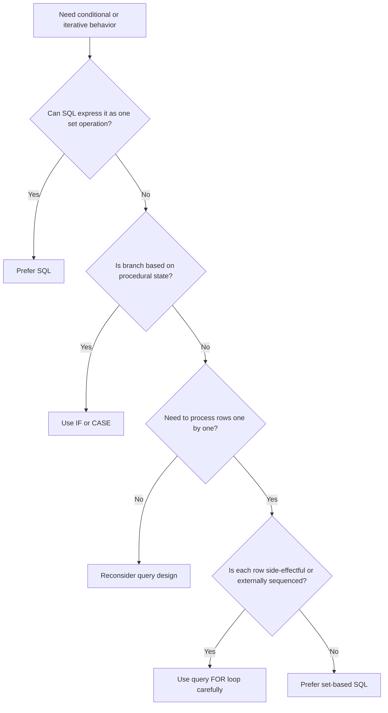

# Part 008 — Control Flow: Conditionals, Loops, and Query Iteration

Control flow is where PL/pgSQL starts looking like an application language.

That is useful and dangerous.

Useful, because some database-side operations are genuinely procedural:

- validate a state transition,
- branch on prior query result,
- process batches,
- call different routines based on domain type,
- perform guarded side effects,
- normalize payloads,
- generate audit records.

Dangerous, because procedural code can hide what SQL would express more clearly as a set operation.

The production rule is:

> Use PL/pgSQL control flow for orchestration, exceptional logic, and statement sequencing. Use SQL for set logic whenever possible.

This part covers:

- `IF` / `ELSIF` / `ELSE`
- `CASE` statements
- `LOOP`
- `WHILE`
- integer `FOR`
- query `FOR`
- dynamic query `FOR ... EXECUTE`
- `FOREACH` over arrays
- `EXIT` and `CONTINUE`
- labels
- row-by-row processing trade-offs

---

## 1. Control Flow Decision Model



The most important skill is not knowing loop syntax. It is knowing when a loop is a design smell.

---

## 2. `IF`: Branch on Runtime Truth

`IF` is the default branch construct.

```sql
IF condition THEN
    statements;
ELSIF other_condition THEN
    statements;
ELSE
    statements;
END IF;
```

Use `IF` when the branch depends on procedural state:

- a variable assigned by a previous query,
- `FOUND`, copied into a named boolean,
- input parameter combinations,
- validation result,
- state transition eligibility.

### 2.1 Basic Guard Clause

```sql
CREATE OR REPLACE FUNCTION app.assert_case_priority(p_priority text)
RETURNS void
LANGUAGE plpgsql
AS $$
BEGIN
    IF p_priority NOT IN ('low', 'normal', 'high', 'critical') THEN
        RAISE EXCEPTION 'invalid case priority: %', p_priority
            USING ERRCODE = '22023',
                  HINT = 'Use low, normal, high, or critical.';
    END IF;
END;
$$;
```

This is a guard clause. It is clear and cheap.

However, if the invariant belongs to persisted data, prefer a table constraint or domain. PL/pgSQL validation should not be the only line of defense for table integrity.

### 2.2 Branch on Prior Statement Result

```sql
CREATE OR REPLACE FUNCTION app.assign_case_if_open(
    p_case_id uuid,
    p_assignee_id uuid
)
RETURNS boolean
LANGUAGE plpgsql
AS $$
DECLARE
    v_updated boolean;
BEGIN
    UPDATE app.case_file c
    SET assigned_to = p_assignee_id,
        updated_at = clock_timestamp(),
        version = c.version + 1
    WHERE c.case_id = p_case_id
      AND c.status = 'open';

    v_updated := FOUND;

    IF v_updated THEN
        INSERT INTO app.case_event(case_id, event_type, event_payload)
        VALUES (
            p_case_id,
            'case_assigned',
            jsonb_build_object('assignee_id', p_assignee_id)
        );

        RETURN true;
    END IF;

    RETURN false;
END;
$$;
```

This is a legitimate `IF`: it branches on the outcome of a mutation.

### 2.3 Avoid Branching That SQL Can Express

Poor:

```sql
IF p_priority = 'critical' THEN
    UPDATE app.case_file SET priority_weight = 100 WHERE case_id = p_case_id;
ELSIF p_priority = 'high' THEN
    UPDATE app.case_file SET priority_weight = 50 WHERE case_id = p_case_id;
ELSE
    UPDATE app.case_file SET priority_weight = 10 WHERE case_id = p_case_id;
END IF;
```

Better:

```sql
UPDATE app.case_file c
SET priority_weight = CASE p_priority
    WHEN 'critical' THEN 100
    WHEN 'high' THEN 50
    ELSE 10
END
WHERE c.case_id = p_case_id;
```

The first version repeats the update. The second keeps the set operation as one statement.

---

## 3. SQL `CASE` Expression vs PL/pgSQL `CASE` Statement

There are two different ideas named `CASE`.

### 3.1 SQL `CASE` Expression

This belongs inside SQL expressions.

```sql
UPDATE app.case_file c
SET priority_weight = CASE c.priority
    WHEN 'critical' THEN 100
    WHEN 'high' THEN 50
    WHEN 'normal' THEN 20
    ELSE 5
END;
```

Use it when computing a value row-by-row.

### 3.2 PL/pgSQL `CASE` Statement

This controls procedural branches.

```sql
CASE v_case.status
    WHEN 'draft' THEN
        RAISE EXCEPTION 'draft case cannot be assigned';
    WHEN 'closed' THEN
        RAISE EXCEPTION 'closed case cannot be assigned';
    ELSE
        PERFORM app.validate_assignment_target(p_assignee_id);
END CASE;
```

Use it when each branch runs statements, not merely returns a value.

### 3.3 Missing `ELSE` Is Not the Same as SQL `CASE`

In SQL, a `CASE` expression without a matching branch returns null if there is no `ELSE`.

In PL/pgSQL, a `CASE` statement without a matching branch and without `ELSE` raises `CASE_NOT_FOUND`.

That can be useful if the set of states is closed.

```sql
CASE v_case.status
    WHEN 'open' THEN
        PERFORM app.prepare_open_case_assignment(v_case.case_id);
    WHEN 'under_review' THEN
        PERFORM app.prepare_review_case_assignment(v_case.case_id);
    WHEN 'escalated' THEN
        PERFORM app.prepare_escalated_case_assignment(v_case.case_id);
END CASE;
```

This routine fails if a new status appears. That is sometimes exactly what you want during deployment: fail closed instead of silently accepting unmodeled state.

For externally supplied or forward-compatible values, include `ELSE`.

```sql
ELSE
    RAISE EXCEPTION 'unsupported case status: %', v_case.status;
```

---

## 4. `LOOP`: Explicit Infinite Loop with Explicit Exit

`LOOP` repeats until you exit.

```sql
LOOP
    statements;
    EXIT WHEN condition;
END LOOP;
```

Use it when the termination condition is discovered inside the loop.

### 4.1 Batch Worker Skeleton

```sql
CREATE TABLE app.case_work_queue (
    queue_id     bigserial PRIMARY KEY,
    case_id      uuid NOT NULL,
    work_type    text NOT NULL,
    locked_at    timestamptz,
    completed_at timestamptz,
    created_at   timestamptz NOT NULL DEFAULT clock_timestamp()
);
```

```sql
CREATE OR REPLACE FUNCTION app.process_case_work_batch(p_batch_size integer)
RETURNS integer
LANGUAGE plpgsql
AS $$
DECLARE
    v_processed integer := 0;
    v_item app.case_work_queue%ROWTYPE;
BEGIN
    LOOP
        SELECT q.*
        INTO v_item
        FROM app.case_work_queue q
        WHERE q.completed_at IS NULL
        ORDER BY q.queue_id
        LIMIT 1
        FOR UPDATE SKIP LOCKED;

        EXIT WHEN NOT FOUND;
        EXIT WHEN v_processed >= p_batch_size;

        PERFORM app.process_case_work_item(v_item.queue_id, v_item.case_id, v_item.work_type);

        UPDATE app.case_work_queue q
        SET completed_at = clock_timestamp()
        WHERE q.queue_id = v_item.queue_id;

        v_processed := v_processed + 1;
    END LOOP;

    RETURN v_processed;
END;
$$;
```

This is a procedural worker loop. It is legitimate because each item may require a side-effectful function call.

Still, this design should be reviewed carefully:

- How long can one transaction run?
- What happens if item 50 fails after 49 succeeded?
- Should the worker commit per item? That requires procedure-level transaction design, not a simple function.
- Is this better handled by the application worker?
- Is there enough observability?

The syntax is easy. The operational contract is hard.

### 4.2 Prefer `EXIT WHEN` Over Deep Nested `IF`

Poor:

```sql
LOOP
    IF v_done THEN
        EXIT;
    ELSE
        -- many lines
    END IF;
END LOOP;
```

Better:

```sql
LOOP
    EXIT WHEN v_done;

    -- many lines
END LOOP;
```

Guard clauses reduce nesting.

---

## 5. `WHILE`: Loop While Condition Is True

`WHILE` checks the condition before each iteration.

```sql
WHILE condition LOOP
    statements;
END LOOP;
```

Use it when the loop condition is simple and already known at the top.

### 5.1 Retry-Like Local Loop

This example is not a full transaction retry strategy. It is only a local attempt loop for a generated candidate.

```sql
CREATE OR REPLACE FUNCTION app.generate_case_number()
RETURNS text
LANGUAGE plpgsql
AS $$
DECLARE
    v_attempt integer := 0;
    v_candidate text;
BEGIN
    WHILE v_attempt < 10 LOOP
        v_attempt := v_attempt + 1;
        v_candidate := 'CASE-' || to_char(clock_timestamp(), 'YYYYMMDD') || '-' || floor(random() * 1000000)::text;

        PERFORM 1
        FROM app.case_file c
        WHERE c.case_number = v_candidate;

        IF NOT FOUND THEN
            RETURN v_candidate;
        END IF;
    END LOOP;

    RAISE EXCEPTION 'could not generate unique case number after % attempts', v_attempt;
END;
$$;
```

This is acceptable for illustration but not ideal for high-scale uniqueness. A sequence, identity, or deterministic allocator is usually better.

The larger point: `WHILE` is best when the loop condition is a simple counter or state flag.

---

## 6. Integer `FOR`: Counted Iteration

Integer `FOR` is useful for bounded loops.

```sql
FOR i IN 1..p_attempts LOOP
    statements;
END LOOP;
```

Reverse iteration:

```sql
FOR i IN REVERSE 10..1 LOOP
    statements;
END LOOP;
```

Step size:

```sql
FOR i IN 1..100 BY 10 LOOP
    statements;
END LOOP;
```

### 6.1 Bounded Attempts

```sql
CREATE OR REPLACE FUNCTION app.try_reserve_case_number(p_prefix text)
RETURNS text
LANGUAGE plpgsql
AS $$
DECLARE
    v_candidate text;
BEGIN
    FOR i IN 1..5 LOOP
        v_candidate := p_prefix || '-' || floor(random() * 1000000)::text;

        INSERT INTO app.case_number_reservation(case_number)
        VALUES (v_candidate)
        ON CONFLICT DO NOTHING;

        IF FOUND THEN
            RETURN v_candidate;
        END IF;
    END LOOP;

    RAISE EXCEPTION 'could not reserve case number after bounded attempts';
END;
$$;
```

The loop has a clear upper bound. That matters in database-side code because long-running routines consume backend resources and hold transaction context.

---

## 7. Query `FOR`: Iterate Rows from a Query

Query `FOR` is the most common PL/pgSQL loop shape.

```sql
FOR v_case IN
    SELECT c.*
    FROM app.case_file c
    WHERE c.status = 'open'
LOOP
    statements;
END LOOP;
```

The loop target can be a `record`, row variable, or list of variables.

### 7.1 Legitimate Query Loop: Side-Effect Per Row

```sql
CREATE OR REPLACE FUNCTION app.emit_open_case_reminders(p_limit integer)
RETURNS integer
LANGUAGE plpgsql
AS $$
DECLARE
    v_case app.case_file%ROWTYPE;
    v_emitted integer := 0;
BEGIN
    FOR v_case IN
        SELECT c.*
        FROM app.case_file c
        WHERE c.status = 'open'
          AND c.updated_at < clock_timestamp() - interval '3 days'
        ORDER BY c.updated_at
        LIMIT p_limit
    LOOP
        PERFORM app.emit_case_reminder(v_case.case_id, v_case.assigned_to);
        v_emitted := v_emitted + 1;
    END LOOP;

    RETURN v_emitted;
END;
$$;
```

This is acceptable if `emit_case_reminder` is a database-side action such as inserting an outbox row.

It is not acceptable if it hides direct network calls through unsafe extensions. PL/pgSQL should not become an opaque distributed workflow engine.

### 7.2 Prefer Set-Based SQL for Uniform Data Changes

Poor:

```sql
FOR v_case IN
    SELECT c.* FROM app.case_file c WHERE c.status = 'open'
LOOP
    UPDATE app.case_file c
    SET priority = 'high'
    WHERE c.case_id = v_case.case_id;
END LOOP;
```

Better:

```sql
UPDATE app.case_file c
SET priority = 'high',
    updated_at = clock_timestamp(),
    version = c.version + 1
WHERE c.status = 'open';
```

The loop version is slower, noisier, and creates more opportunities for bugs.

### 7.3 Query Loop with Per-Row Branching

A loop becomes more defensible when each row may require different action.

```sql
CREATE OR REPLACE FUNCTION app.reclassify_stale_cases(p_limit integer)
RETURNS integer
LANGUAGE plpgsql
AS $$
DECLARE
    v_case app.case_file%ROWTYPE;
    v_count integer := 0;
BEGIN
    FOR v_case IN
        SELECT c.*
        FROM app.case_file c
        WHERE c.status IN ('open', 'under_review')
          AND c.updated_at < clock_timestamp() - interval '7 days'
        ORDER BY c.updated_at
        LIMIT p_limit
    LOOP
        IF v_case.priority = 'critical' THEN
            PERFORM app.escalate_case(v_case.case_id, NULL, 'stale critical case');
        ELSIF v_case.assigned_to IS NULL THEN
            PERFORM app.route_unassigned_case(v_case.case_id);
        ELSE
            PERFORM app.emit_case_reminder(v_case.case_id, v_case.assigned_to);
        END IF;

        v_count := v_count + 1;
    END LOOP;

    RETURN v_count;
END;
$$;
```

This is procedural orchestration. The branching is domain logic.

Still, the function should be reviewed for transaction length, error isolation, and idempotency.

---

## 8. `FOR ... EXECUTE`: Iterate Dynamic Query Results

Dynamic query loops are useful for metadata-driven routines.

```sql
FOR v_row IN EXECUTE v_sql USING p_cutoff LOOP
    statements;
END LOOP;
```

Example: inspect partition-like tables by name.

```sql
CREATE OR REPLACE FUNCTION app.count_stale_rows_in_tables(
    p_table_names text[],
    p_cutoff timestamptz
)
RETURNS TABLE(table_name text, stale_count bigint)
LANGUAGE plpgsql
AS $$
DECLARE
    v_table_name text;
    v_sql text;
BEGIN
    FOREACH v_table_name IN ARRAY p_table_names LOOP
        v_sql := format(
            'SELECT count(*) FROM %I WHERE updated_at < $1',
            v_table_name
        );

        table_name := v_table_name;
        EXECUTE v_sql INTO stale_count USING p_cutoff;
        RETURN NEXT;
    END LOOP;
END;
$$;
```

This example is simplified. In production, table names should usually be schema-qualified and represented as `regclass` rather than raw text.

The important discipline:

- identifiers are inserted with `format('%I', ...)`,
- values are passed with `USING`,
- dynamic SQL is reserved for object names or query shape that cannot be static.

Dynamic SQL is covered in depth later.

---

## 9. `FOREACH`: Iterate Arrays

`FOREACH` iterates over array values.

```sql
FOREACH v_case_id IN ARRAY p_case_ids LOOP
    statements;
END LOOP;
```

### 9.1 Bulk Input with Per-Item Validation

```sql
CREATE OR REPLACE FUNCTION app.close_cases_by_ids(
    p_case_ids uuid[],
    p_actor_id uuid,
    p_reason text
)
RETURNS integer
LANGUAGE plpgsql
AS $$
DECLARE
    v_case_id uuid;
    v_closed_count integer := 0;
BEGIN
    FOREACH v_case_id IN ARRAY p_case_ids LOOP
        IF app.close_case_idempotent(v_case_id, p_actor_id, p_reason) THEN
            v_closed_count := v_closed_count + 1;
        END IF;
    END LOOP;

    RETURN v_closed_count;
END;
$$;
```

This is easy to read but may be inefficient for large arrays.

A set-based design may be better:

```sql
UPDATE app.case_file c
SET status = 'closed',
    updated_at = clock_timestamp(),
    version = c.version + 1
WHERE c.case_id = ANY (p_case_ids)
  AND c.status <> 'closed';
```

Use `FOREACH` when each item needs individual procedural handling. Use set SQL when all items share the same operation.

### 9.2 Iterating Composite Arrays

```sql
CREATE TYPE app.case_assignment_input AS (
    case_id uuid,
    assignee_id uuid
);
```

```sql
CREATE OR REPLACE FUNCTION app.assign_cases(p_items app.case_assignment_input[])
RETURNS integer
LANGUAGE plpgsql
AS $$
DECLARE
    v_item app.case_assignment_input;
    v_count integer := 0;
BEGIN
    FOREACH v_item IN ARRAY p_items LOOP
        PERFORM app.assign_case(v_item.case_id, NULL, v_item.assignee_id);
        v_count := v_count + 1;
    END LOOP;

    RETURN v_count;
END;
$$;
```

Again, use this only when per-item function behavior is required.

---

## 10. `EXIT` and `CONTINUE`

`EXIT` terminates a loop or labeled block.

`CONTINUE` skips to the next loop iteration.

Both support `WHEN`.

```sql
EXIT WHEN v_done;
CONTINUE WHEN v_item_is_invalid;
```

### 10.1 Filtering in Loop

```sql
FOR v_case IN
    SELECT c.* FROM app.case_file c WHERE c.status <> 'closed'
LOOP
    CONTINUE WHEN v_case.assigned_to IS NULL;

    PERFORM app.emit_case_reminder(v_case.case_id, v_case.assigned_to);
END LOOP;
```

This is readable when the skip condition is cheap and procedural.

If the condition is purely relational, push it into the query:

```sql
FOR v_case IN
    SELECT c.*
    FROM app.case_file c
    WHERE c.status <> 'closed'
      AND c.assigned_to IS NOT NULL
LOOP
    PERFORM app.emit_case_reminder(v_case.case_id, v_case.assigned_to);
END LOOP;
```

Prefer the second version. It reduces procedural work.

### 10.2 Early Termination

```sql
FOR v_case IN
    SELECT c.*
    FROM app.case_file c
    WHERE c.status = 'open'
    ORDER BY c.priority, c.opened_at
LOOP
    EXIT WHEN v_processed >= p_limit;

    PERFORM app.process_case(v_case.case_id);
    v_processed := v_processed + 1;
END LOOP;
```

If the limit can be expressed in SQL, put it in SQL:

```sql
SELECT c.*
FROM app.case_file c
WHERE c.status = 'open'
ORDER BY c.priority, c.opened_at
LIMIT p_limit;
```

Use `EXIT` when the stop condition depends on procedural outcomes, not merely row count.

---

## 11. Labels: Make Nested Control Flow Explicit

Labels make nested loops and blocks easier to reason about.

```sql
<<outer_loop>>
LOOP
    <<inner_loop>>
    LOOP
        EXIT outer_loop WHEN v_done;
        EXIT inner_loop WHEN v_inner_done;
    END LOOP inner_loop;
END LOOP outer_loop;
```

### 11.1 Realistic Nested Loop Example

```sql
CREATE OR REPLACE FUNCTION app.route_cases_to_available_reviewers(
    p_case_ids uuid[],
    p_reviewer_ids uuid[]
)
RETURNS integer
LANGUAGE plpgsql
AS $$
DECLARE
    v_case_id uuid;
    v_reviewer_id uuid;
    v_assigned_count integer := 0;
BEGIN
    <<case_loop>>
    FOREACH v_case_id IN ARRAY p_case_ids LOOP
        <<reviewer_loop>>
        FOREACH v_reviewer_id IN ARRAY p_reviewer_ids LOOP
            PERFORM 1
            FROM app.reviewer_capacity rc
            WHERE rc.reviewer_id = v_reviewer_id
              AND rc.remaining_capacity > 0;

            CONTINUE reviewer_loop WHEN NOT FOUND;

            PERFORM app.assign_case(v_case_id, NULL, v_reviewer_id);
            v_assigned_count := v_assigned_count + 1;

            CONTINUE case_loop;
        END LOOP reviewer_loop;

        RAISE NOTICE 'no reviewer capacity available for case %', v_case_id;
    END LOOP case_loop;

    RETURN v_assigned_count;
END;
$$;
```

Labels communicate which loop is being controlled.

Without labels, nested `EXIT` and `CONTINUE` become error-prone.

### 11.2 Use Labels Sparingly

If a function needs many labels, it may be doing too much.

Refactor when:

- nested loops exceed two levels,
- branches have large bodies,
- labels are used to simulate `goto`,
- control flow depends on many mutable flags.

---

## 12. Query Loop Semantics and `FOUND`

A query `FOR` loop sets `FOUND` after the loop exits.

That means this works:

```sql
FOR v_case IN
    SELECT c.* FROM app.case_file c WHERE c.status = 'open'
LOOP
    PERFORM app.emit_case_metric(v_case.case_id);
END LOOP;

IF NOT FOUND THEN
    RAISE NOTICE 'no open cases found';
END IF;
```

But be careful: statements inside the loop also change `FOUND` during loop execution. Only after loop completion is `FOUND` set to whether the loop iterated at least once.

For clarity, prefer an explicit counter when the loop result matters.

```sql
v_seen_count := 0;

FOR v_case IN
    SELECT c.* FROM app.case_file c WHERE c.status = 'open'
LOOP
    v_seen_count := v_seen_count + 1;
    PERFORM app.emit_case_metric(v_case.case_id);
END LOOP;

IF v_seen_count = 0 THEN
    RAISE NOTICE 'no open cases found';
END IF;
```

This is more robust when the loop body grows.

---

## 13. Row-by-Row vs Set-Based: The Core Trade-Off

PL/pgSQL makes row-by-row code easy.

That does not make row-by-row code good.

### 13.1 Prefer Set-Based When Operation Is Uniform

Uniform mutation:

```sql
UPDATE app.case_file c
SET priority = 'high'
WHERE c.status = 'open'
  AND c.opened_at < clock_timestamp() - interval '14 days';
```

Do not loop over rows to do this.

### 13.2 Use Row-by-Row When Each Row Has a Distinct Procedural Path

Procedural path:

```sql
FOR v_case IN
    SELECT c.*
    FROM app.case_file c
    WHERE c.status IN ('open', 'under_review')
LOOP
    CASE
        WHEN v_case.priority = 'critical' THEN
            PERFORM app.route_to_emergency_queue(v_case.case_id);
        WHEN v_case.assigned_to IS NULL THEN
            PERFORM app.route_to_general_queue(v_case.case_id);
        ELSE
            PERFORM app.send_reviewer_reminder(v_case.case_id, v_case.assigned_to);
    END CASE;
END LOOP;
```

This is row-by-row because the side effect differs by row.

### 13.3 Hybrid Pattern: Set Select, Procedural Side Effect

Often the best pattern is:

1. use SQL to identify the exact candidate set,
2. loop only for the side effect that cannot be represented as one SQL statement.

```sql
FOR v_case IN
    SELECT c.case_id, c.assigned_to
    FROM app.case_file c
    WHERE c.status = 'open'
      AND c.assigned_to IS NOT NULL
      AND c.updated_at < clock_timestamp() - interval '3 days'
    ORDER BY c.updated_at
    LIMIT p_limit
LOOP
    PERFORM app.enqueue_reminder_outbox(v_case.case_id, v_case.assigned_to);
END LOOP;
```

The filter, ordering, and limit are SQL. The per-case enqueue is procedural.

---

## 14. Error Behavior Inside Loops

By default, an exception inside a loop aborts the function unless caught.

```sql
FOR v_case IN SELECT ... LOOP
    PERFORM app.process_case(v_case.case_id); -- if this raises, function aborts
END LOOP;
```

That may be correct. It preserves all-or-nothing behavior.

But for batch processing, you may want item-level failure recording.

```sql
FOR v_case IN
    SELECT c.* FROM app.case_file c WHERE c.status = 'open'
LOOP
    BEGIN
        PERFORM app.process_case(v_case.case_id);
        v_success_count := v_success_count + 1;
    EXCEPTION
        WHEN OTHERS THEN
            INSERT INTO app.case_event(case_id, event_type, event_payload)
            VALUES (
                v_case.case_id,
                'case_processing_failed',
                jsonb_build_object(
                    'sqlstate', SQLSTATE,
                    'message', SQLERRM
                )
            );

            v_failure_count := v_failure_count + 1;
    END;
END LOOP;
```

Use this carefully.

Catching exceptions inside loops can create partial success semantics. That must be a deliberate contract, not an accident.

Ask:

- Should successful rows commit if later rows fail?
- Is this function allowed to swallow errors?
- Does the caller receive enough failure detail?
- Will retries duplicate side effects?
- Does the event table become the real source of error reporting?

Exception handling is covered in a later part. For now, understand that loop-level exception handling changes the meaning of the entire routine.

---

## 15. Control Flow for State Machines

PL/pgSQL is often used to enforce state transitions close to the data.

A minimal state transition function:

```sql
CREATE OR REPLACE FUNCTION app.transition_case_status(
    p_case_id uuid,
    p_actor_id uuid,
    p_to_status text,
    p_reason text DEFAULT NULL
)
RETURNS app.case_file
LANGUAGE plpgsql
AS $$
DECLARE
    v_case app.case_file%ROWTYPE;
BEGIN
    SELECT c.*
    INTO STRICT v_case
    FROM app.case_file c
    WHERE c.case_id = p_case_id
    FOR UPDATE;

    CASE v_case.status
        WHEN 'draft' THEN
            IF p_to_status <> 'open' THEN
                RAISE EXCEPTION 'draft case can only transition to open';
            END IF;
        WHEN 'open' THEN
            IF p_to_status NOT IN ('under_review', 'escalated', 'closed') THEN
                RAISE EXCEPTION 'open case cannot transition to %', p_to_status;
            END IF;
        WHEN 'under_review' THEN
            IF p_to_status NOT IN ('escalated', 'closed') THEN
                RAISE EXCEPTION 'under_review case cannot transition to %', p_to_status;
            END IF;
        WHEN 'escalated' THEN
            IF p_to_status <> 'closed' THEN
                RAISE EXCEPTION 'escalated case can only transition to closed';
            END IF;
        WHEN 'closed' THEN
            RAISE EXCEPTION 'closed case cannot transition';
        ELSE
            RAISE EXCEPTION 'unknown case status: %', v_case.status;
    END CASE;

    UPDATE app.case_file c
    SET status = p_to_status,
        updated_at = clock_timestamp(),
        version = c.version + 1
    WHERE c.case_id = p_case_id
    RETURNING c.*
    INTO v_case;

    INSERT INTO app.case_event(case_id, event_type, actor_id, event_payload)
    VALUES (
        p_case_id,
        'case_status_changed',
        p_actor_id,
        jsonb_build_object(
            'to_status', p_to_status,
            'reason', p_reason
        )
    );

    RETURN v_case;
END;
$$;
```

This is readable for a small state machine.

For larger state machines, a transition table may be better:

```sql
CREATE TABLE app.case_status_transition (
    from_status text NOT NULL,
    to_status   text NOT NULL,
    PRIMARY KEY (from_status, to_status)
);
```

Then the function checks data instead of hard-coded branches.

The decision:

| State machine shape | Better approach |
|---|---|
| Small, stable, safety-critical | explicit `CASE` may be acceptable |
| Large or frequently changing | transition table |
| Requires role/condition policies | transition table + policy functions |
| Needs audit and explanation | transition table with reason metadata |

State-machine design gets a dedicated later part. This section only shows how control flow participates.

---

## 16. Function Size and Control Flow Complexity

Control flow complexity is a leading indicator of PL/pgSQL risk.

A function is becoming risky when it has:

- more than two nested levels,
- multiple mutable boolean flags,
- long loops with exception blocks,
- repeated SQL statements in branches,
- hidden side-effect functions,
- several `RETURN` points with inconsistent semantics,
- branch behavior not covered by tests.

Refactor by extracting:

- validation functions,
- mutation functions,
- event writer functions,
- transition decision functions,
- query views or CTEs,
- data-driven policy tables.

Do not extract merely to make files smaller. Extract to make contracts clearer.

---

## 17. Production Patterns

### 17.1 Guard, Mutate, Emit

```sql
IF p_actor_id IS NULL THEN
    RAISE EXCEPTION 'actor is required';
END IF;

UPDATE app.case_file c
SET status = 'under_review'
WHERE c.case_id = p_case_id
  AND c.status = 'open'
RETURNING c.*
INTO v_case;

IF NOT FOUND THEN
    RAISE EXCEPTION 'case cannot move to under_review';
END IF;

INSERT INTO app.case_event(case_id, event_type, actor_id)
VALUES (p_case_id, 'case_review_started', p_actor_id);
```

This is the standard shape for many domain routines.

### 17.2 Select Candidates, Loop Side Effects

```sql
FOR v_case IN
    SELECT c.case_id, c.assigned_to
    FROM app.case_file c
    WHERE c.status = 'open'
      AND c.assigned_to IS NOT NULL
    ORDER BY c.updated_at
    LIMIT p_limit
LOOP
    PERFORM app.enqueue_case_notification(v_case.case_id, v_case.assigned_to);
END LOOP;
```

SQL selects. PL/pgSQL orchestrates.

### 17.3 Bounded Loop with Explicit Progress

```sql
v_processed := 0;

LOOP
    EXIT WHEN v_processed >= p_limit;

    -- claim one item
    -- process one item
    -- mark progress

    v_processed := v_processed + 1;
END LOOP;
```

Every production loop should have an understandable progress variable or termination condition.

### 17.4 Fail-Closed CASE

```sql
CASE v_status
    WHEN 'open' THEN
        -- allowed
    WHEN 'under_review' THEN
        -- allowed
    ELSE
        RAISE EXCEPTION 'unsupported status for this operation: %', v_status;
END CASE;
```

This prevents new enum-like values from silently bypassing logic.

---

## 18. Anti-Patterns

### 18.1 Row-by-Row Uniform Update

```sql
FOR v_case IN SELECT * FROM app.case_file LOOP
    UPDATE app.case_file SET priority = 'normal' WHERE case_id = v_case.case_id;
END LOOP;
```

Use one `UPDATE`.

### 18.2 Procedural Filtering That Belongs in SQL

```sql
FOR v_case IN SELECT * FROM app.case_file LOOP
    CONTINUE WHEN v_case.status <> 'open';
    CONTINUE WHEN v_case.assigned_to IS NULL;
    PERFORM app.enqueue_case_notification(v_case.case_id, v_case.assigned_to);
END LOOP;
```

Better:

```sql
FOR v_case IN
    SELECT *
    FROM app.case_file
    WHERE status = 'open'
      AND assigned_to IS NOT NULL
LOOP
    PERFORM app.enqueue_case_notification(v_case.case_id, v_case.assigned_to);
END LOOP;
```

### 18.3 Unbounded Loops

```sql
LOOP
    -- hope something eventually changes
END LOOP;
```

Every loop needs an exit condition that can be reasoned about.

### 18.4 Catch-and-Continue Without Contract

```sql
BEGIN
    PERFORM app.process_case(v_case_id);
EXCEPTION
    WHEN OTHERS THEN
        -- ignore
END;
```

This is rarely acceptable.

If you continue after failure, record what failed and expose the partial-success semantics.

### 18.5 Large Branches with Repeated Mutation

```sql
IF condition_a THEN
    UPDATE ...;
ELSIF condition_b THEN
    UPDATE ...;
ELSIF condition_c THEN
    UPDATE ...;
END IF;
```

Often this should be one `UPDATE` with computed values or a policy table.

---

## 19. Review Checklist

For every PL/pgSQL function with control flow, ask:

1. Can this branch be a SQL expression instead?
2. Can this loop be a set-based statement instead?
3. Is every loop bounded or naturally terminating?
4. Is `EXIT`/`CONTINUE` labeled when nesting makes intent unclear?
5. Does the loop body perform necessary per-row side effects?
6. Are query filters pushed into SQL instead of procedural `CONTINUE`?
7. Does exception handling create partial success?
8. Are state branches fail-closed for unknown states?
9. Are repeated branch statements hiding a missing data-driven model?
10. Is the function still small enough to test thoroughly?

---

## 20. Compact Rules

| Need | Prefer |
|---|---|
| Validate input | Guard `IF` with clear exception |
| Compute row value | SQL `CASE` expression |
| Execute procedural branch | PL/pgSQL `IF` or `CASE` statement |
| Small closed state set | PL/pgSQL `CASE` with explicit `ELSE` or fail-closed behavior |
| Large configurable state set | Transition/policy table |
| Uniform data change | Set-based SQL |
| Per-row side effect | Query `FOR` loop |
| Iterate array input | `FOREACH`, only when per-item behavior matters |
| Stop from nested loop | Labeled `EXIT` / `CONTINUE` |
| Batch processing | Bounded loop with explicit progress and error semantics |

---

## 21. What This Part Enables

You should now be able to look at PL/pgSQL control flow and ask the real engineering question:

> Is this procedural structure expressing necessary orchestration, or is it hiding a set operation?

That question separates maintainable database-side code from accidental application code trapped inside the database.

Good PL/pgSQL control flow is boring:

- guards are early,
- branches are explicit,
- loops are bounded,
- SQL does set work,
- procedural code handles orchestration,
- failure behavior is deliberate.

That is the standard we will carry into return values, dynamic SQL, cursors, triggers, concurrency, and production operations.

---

## References

- PostgreSQL Documentation — PL/pgSQL Control Structures: `https://www.postgresql.org/docs/current/plpgsql-control-structures.html`
- PostgreSQL Documentation — PL/pgSQL Basic Statements: `https://www.postgresql.org/docs/current/plpgsql-statements.html`
- PostgreSQL Documentation — Conditional Expressions: `https://www.postgresql.org/docs/current/functions-conditional.html`
- PostgreSQL Documentation — Explicit Locking: `https://www.postgresql.org/docs/current/explicit-locking.html`
