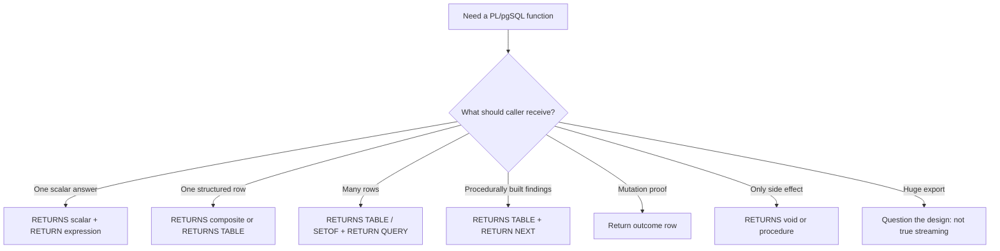
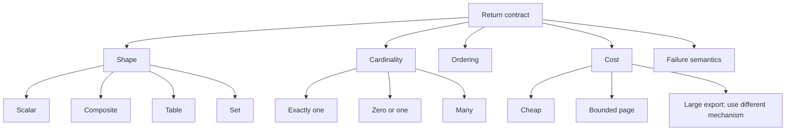

# Part 009 — Returning Values, Tables, Sets, and Stream-Like Results

A PL/pgSQL function is not merely a block of server-side code. It is a **result contract**.

The caller needs to know whether the function returns one scalar, one row, many rows, no rows, or only a side effect. The caller also needs to know whether row order is stable, whether zero rows is normal, whether the result shape is public API, and whether the function hides expensive work behind a harmless-looking `SELECT`.

This part focuses on implementation discipline for:

- `RETURN expression`
- `RETURN` in `void` functions
- `OUT` parameters
- `RETURNS TABLE`
- `RETURNS SETOF <type>`
- `RETURN NEXT`
- `RETURN QUERY`
- `RETURN QUERY EXECUTE`
- stable API-facing result contracts
- set-returning functions that look stream-like but are not true streaming

We will not repeat SQL projection basics. The goal is to design PL/pgSQL result behavior that survives production use.

---

## 1. Result Contract Mental Model

Before writing a function body, classify the result.



The common failure is treating return syntax as cosmetic. It is not.

`RETURNS uuid`, `RETURNS app.case_file`, `RETURNS TABLE (...)`, and `RETURNS SETOF app.case_file` create different coupling, planner behavior, caller expectations, test strategy, and migration risk.

A production-grade function should answer:

| Question | Why it matters |
|---|---|
| Is the result scalar, row, table, set, or void? | Determines caller contract. |
| Can it return zero rows? | Distinguishes normal absence from failure. |
| Can it return many rows? | Requires ordering, limits, pagination, or streaming alternative. |
| Is order part of the contract? | SQL row order is not stable unless specified. |
| Is result shape tied to a table? | Table changes can accidentally become API changes. |
| Does it mutate data? | Caller may need proof, not just “success”. |
| Can caller use it in joins? | Expensive functions can become hidden row-by-row work. |

---

## 2. Working Schema

We will use a compact regulatory case-management schema.

```sql
CREATE SCHEMA IF NOT EXISTS app;

CREATE TABLE app.case_file (
    case_id       uuid PRIMARY KEY,
    case_number   text NOT NULL UNIQUE,
    status        text NOT NULL,
    priority      text NOT NULL,
    assigned_to   uuid,
    opened_at     timestamptz NOT NULL DEFAULT clock_timestamp(),
    updated_at    timestamptz NOT NULL DEFAULT clock_timestamp(),
    version       bigint NOT NULL DEFAULT 1,
    CONSTRAINT case_status_valid CHECK (
        status IN ('draft', 'open', 'under_review', 'escalated', 'closed')
    ),
    CONSTRAINT case_priority_valid CHECK (
        priority IN ('low', 'normal', 'high', 'critical')
    )
);

CREATE TABLE app.case_event (
    event_id      bigserial PRIMARY KEY,
    case_id       uuid NOT NULL REFERENCES app.case_file(case_id),
    event_type    text NOT NULL,
    event_payload jsonb NOT NULL DEFAULT '{}'::jsonb,
    occurred_at   timestamptz NOT NULL DEFAULT clock_timestamp(),
    actor_id      uuid
);

CREATE TABLE app.case_assignment (
    case_id       uuid PRIMARY KEY REFERENCES app.case_file(case_id),
    assignee_id   uuid NOT NULL,
    assigned_at   timestamptz NOT NULL DEFAULT clock_timestamp(),
    assigned_by   uuid NOT NULL
);
```

---

## 3. Scalar Return: Good for Narrow Answers

A scalar function should answer one narrow question.

```sql
CREATE OR REPLACE FUNCTION app.should_escalate_case(
    p_case_id uuid,
    p_now timestamptz DEFAULT clock_timestamp()
)
RETURNS boolean
LANGUAGE plpgsql
STABLE
AS $$
DECLARE
    v_opened_at timestamptz;
    v_priority text;
BEGIN
    SELECT c.opened_at, c.priority
    INTO STRICT v_opened_at, v_priority
    FROM app.case_file AS c
    WHERE c.case_id = p_case_id;

    RETURN
        v_priority IN ('high', 'critical')
        AND p_now - v_opened_at > interval '48 hours';
END;
$$;
```

This is a clear scalar contract:

- one case ID in;
- one boolean out;
- missing case is exceptional because `INTO STRICT` is used;
- no mutation;
- safe to call when the caller truly needs one answer.

But scalar functions become risky when called once per row over a large table.

```sql
SELECT c.case_id
FROM app.case_file AS c
WHERE app.should_escalate_case(c.case_id);
```

That query can hide row-by-row execution. If the function itself queries tables, the caller may accidentally create N additional lookups.

For bulk selection, prefer a set-based function.

```sql
CREATE OR REPLACE FUNCTION app.find_escalation_candidates(
    p_now timestamptz DEFAULT clock_timestamp()
)
RETURNS TABLE (
    case_id uuid,
    case_number text,
    priority text,
    age interval
)
LANGUAGE plpgsql
STABLE
AS $$
BEGIN
    RETURN QUERY
    SELECT
        c.case_id,
        c.case_number,
        c.priority,
        p_now - c.opened_at AS age
    FROM app.case_file AS c
    WHERE c.status IN ('open', 'under_review')
      AND c.priority IN ('high', 'critical')
      AND p_now - c.opened_at > interval '48 hours'
    ORDER BY c.opened_at ASC, c.case_id ASC;
END;
$$;
```

Mental model:

> Scalar functions are excellent for narrow answers. They are dangerous when used as hidden bulk query engines.

---

## 4. `RETURN expression`

For scalar and single-composite functions, `RETURN expression` terminates the function and sends the value to the caller.

```sql
CREATE OR REPLACE FUNCTION app.case_age_hours(
    p_case_id uuid,
    p_now timestamptz DEFAULT clock_timestamp()
)
RETURNS numeric
LANGUAGE plpgsql
STABLE
AS $$
DECLARE
    v_opened_at timestamptz;
BEGIN
    SELECT c.opened_at
    INTO STRICT v_opened_at
    FROM app.case_file AS c
    WHERE c.case_id = p_case_id;

    RETURN round(extract(epoch FROM (p_now - v_opened_at)) / 3600.0, 2);
END;
$$;
```

Use this when:

- there is exactly one logical result;
- the return value is simple and stable;
- early return clarifies control flow;
- the caller should not receive multiple facts bundled into text or JSON.

Bad scalar design:

```sql
CREATE OR REPLACE FUNCTION app.assignment_summary_bad(p_case_id uuid)
RETURNS text
LANGUAGE plpgsql
AS $$
DECLARE
    v_result text;
BEGIN
    SELECT a.assignee_id::text || '|' || a.assigned_at::text
    INTO v_result
    FROM app.case_assignment AS a
    WHERE a.case_id = p_case_id;

    RETURN v_result;
END;
$$;
```

Better structured design:

```sql
CREATE OR REPLACE FUNCTION app.assignment_summary(
    p_case_id uuid
)
RETURNS TABLE (
    assignee_id uuid,
    assigned_at timestamptz,
    assigned_by uuid
)
LANGUAGE plpgsql
STABLE
AS $$
BEGIN
    RETURN QUERY
    SELECT
        a.assignee_id,
        a.assigned_at,
        a.assigned_by
    FROM app.case_assignment AS a
    WHERE a.case_id = p_case_id;
END;
$$;
```

Structured facts should stay structured.

---

## 5. `RETURNS void`: Side Effects Need Proof

A function can return `void`.

```sql
CREATE OR REPLACE FUNCTION app.log_case_event(
    p_case_id uuid,
    p_event_type text,
    p_payload jsonb DEFAULT '{}'::jsonb,
    p_actor_id uuid DEFAULT NULL
)
RETURNS void
LANGUAGE plpgsql
VOLATILE
AS $$
BEGIN
    INSERT INTO app.case_event (
        case_id,
        event_type,
        event_payload,
        actor_id
    )
    VALUES (
        p_case_id,
        p_event_type,
        coalesce(p_payload, '{}'::jsonb),
        p_actor_id
    );

    RETURN;
END;
$$;
```

`RETURNS void` is acceptable for small helper functions, but it hides whether useful work happened.

For workflows, prefer returning proof.

```sql
CREATE OR REPLACE FUNCTION app.log_case_event_with_result(
    p_case_id uuid,
    p_event_type text,
    p_payload jsonb DEFAULT '{}'::jsonb,
    p_actor_id uuid DEFAULT NULL
)
RETURNS TABLE (
    event_id bigint,
    occurred_at timestamptz
)
LANGUAGE plpgsql
VOLATILE
AS $$
BEGIN
    RETURN QUERY
    INSERT INTO app.case_event (
        case_id,
        event_type,
        event_payload,
        actor_id
    )
    VALUES (
        p_case_id,
        p_event_type,
        coalesce(p_payload, '{}'::jsonb),
        p_actor_id
    )
    RETURNING
        case_event.event_id,
        case_event.occurred_at;
END;
$$;
```

The second version gives the caller a durable event reference. In enforcement and case-management systems, durable references are often more valuable than silent success.

---

## 6. `OUT` Parameters

Output parameters can make a small row result concise.

```sql
CREATE OR REPLACE FUNCTION app.get_case_status_out(
    p_case_id uuid,
    OUT case_number text,
    OUT status text,
    OUT priority text
)
LANGUAGE plpgsql
STABLE
AS $$
BEGIN
    SELECT c.case_number, c.status, c.priority
    INTO case_number, status, priority
    FROM app.case_file AS c
    WHERE c.case_id = p_case_id;
END;
$$;
```

Caller:

```sql
SELECT *
FROM app.get_case_status_out('00000000-0000-0000-0000-000000000001');
```

Trade-offs:

| Aspect | Impact |
|---|---|
| Result columns are declared in the signature | Good |
| Output variables are assignable inside body | Convenient |
| Output names can conflict with column names | Risk |
| Control flow can become implicit | Risk |
| Large DTOs become awkward | Risk |

Use `OUT` parameters for small stable outputs. Prefer `RETURNS TABLE` for larger API-like result contracts.

---

## 7. `RETURNS TABLE`: The DTO-Like Contract

`RETURNS TABLE` is often the clearest way to define a caller-facing result shape.

```sql
CREATE OR REPLACE FUNCTION app.get_case_summary(
    p_case_id uuid
)
RETURNS TABLE (
    case_id uuid,
    case_number text,
    status text,
    priority text,
    assigned_to uuid,
    event_count bigint,
    last_event_at timestamptz
)
LANGUAGE plpgsql
STABLE
AS $$
BEGIN
    RETURN QUERY
    SELECT
        c.case_id,
        c.case_number,
        c.status,
        c.priority,
        a.assignee_id AS assigned_to,
        count(e.event_id)::bigint AS event_count,
        max(e.occurred_at) AS last_event_at
    FROM app.case_file AS c
    LEFT JOIN app.case_assignment AS a
        ON a.case_id = c.case_id
    LEFT JOIN app.case_event AS e
        ON e.case_id = c.case_id
    WHERE c.case_id = p_case_id
    GROUP BY
        c.case_id,
        c.case_number,
        c.status,
        c.priority,
        a.assignee_id;
END;
$$;
```

Use `RETURNS TABLE` when:

- the function behaves like a query endpoint;
- result fields are derived or aggregated;
- you want to decouple caller contract from base table shape;
- the function may be consumed by services, reports, or tests;
- the result shape should be readable without opening the body.

Avoid `SELECT *` in API-facing `RETURN QUERY` statements. Public shape should be deliberate.

---

## 8. `RETURNS SETOF <table>`: Useful but Table-Coupled

A function can return rows of an existing table type.

```sql
CREATE OR REPLACE FUNCTION app.list_open_case_files()
RETURNS SETOF app.case_file
LANGUAGE plpgsql
STABLE
AS $$
BEGIN
    RETURN QUERY
    SELECT c.*
    FROM app.case_file AS c
    WHERE c.status IN ('open', 'under_review', 'escalated')
    ORDER BY c.opened_at ASC, c.case_id ASC;
END;
$$;
```

This is compact, but it ties the public result to table shape.

If the table gains a sensitive column, this function may expose it. If the table changes, callers may observe a result contract change. For long-lived APIs, prefer explicit `RETURNS TABLE` projections.

Use `RETURNS SETOF table_name` for:

- internal administrative routines;
- stable internal composition;
- cases where the table shape is intentionally the contract.

Avoid it for service-facing database APIs unless table-shape coupling is explicitly accepted.

---

## 9. Named Composite Types

A named composite type is useful when multiple functions share the same result shape.

```sql
CREATE TYPE app.case_summary_result AS (
    case_id uuid,
    case_number text,
    status text,
    priority text,
    assigned_to uuid,
    event_count bigint,
    last_event_at timestamptz
);
```

Then:

```sql
CREATE OR REPLACE FUNCTION app.get_case_summary_typed(
    p_case_id uuid
)
RETURNS app.case_summary_result
LANGUAGE plpgsql
STABLE
AS $$
DECLARE
    v_result app.case_summary_result;
BEGIN
    SELECT
        c.case_id,
        c.case_number,
        c.status,
        c.priority,
        a.assignee_id,
        count(e.event_id)::bigint,
        max(e.occurred_at)
    INTO v_result
    FROM app.case_file AS c
    LEFT JOIN app.case_assignment AS a ON a.case_id = c.case_id
    LEFT JOIN app.case_event AS e ON e.case_id = c.case_id
    WHERE c.case_id = p_case_id
    GROUP BY c.case_id, c.case_number, c.status, c.priority, a.assignee_id;

    RETURN v_result;
END;
$$;
```

Practical rule:

> Use `RETURNS TABLE` until the result shape is reused enough to deserve a named type.

Named types create a real schema object. That is good for shared contracts, but it also means migrations must manage dependencies.

---

## 10. `RETURN NEXT`: Build Procedural Result Rows

`RETURN NEXT` appends one row to a set-returning result.

It is ideal for validation findings.

```sql
CREATE OR REPLACE FUNCTION app.validate_case_for_escalation(
    p_case_id uuid
)
RETURNS TABLE (
    severity text,
    code text,
    message text
)
LANGUAGE plpgsql
STABLE
AS $$
DECLARE
    v_case app.case_file%ROWTYPE;
BEGIN
    SELECT c.*
    INTO STRICT v_case
    FROM app.case_file AS c
    WHERE c.case_id = p_case_id;

    IF v_case.status NOT IN ('open', 'under_review') THEN
        severity := 'error';
        code := 'CASE_STATUS_NOT_ESCALATABLE';
        message := format('Case status %s cannot be escalated', v_case.status);
        RETURN NEXT;
    END IF;

    IF v_case.assigned_to IS NULL THEN
        severity := 'warning';
        code := 'CASE_UNASSIGNED';
        message := 'Case has no assigned owner';
        RETURN NEXT;
    END IF;

    IF v_case.priority NOT IN ('high', 'critical') THEN
        severity := 'warning';
        code := 'CASE_PRIORITY_LOW';
        message := 'Case priority is not high enough for automatic escalation';
        RETURN NEXT;
    END IF;

    RETURN;
END;
$$;
```

This is better than raising on the first validation failure when the caller needs all findings.

Use `RETURN NEXT` when result rows are naturally procedural. Avoid it when a single SQL query can return the set more directly.

Bad for large simple queries:

```sql
FOR v_case IN SELECT c.* FROM app.case_file AS c LOOP
    RETURN NEXT v_case;
END LOOP;
```

Better:

```sql
RETURN QUERY
SELECT c.* FROM app.case_file AS c;
```

---

## 11. `RETURN QUERY`: Append a Set-Based Result

`RETURN QUERY` appends all rows from a query to the function result.

```sql
CREATE OR REPLACE FUNCTION app.search_cases(
    p_status text DEFAULT NULL,
    p_priority text DEFAULT NULL,
    p_limit integer DEFAULT 100
)
RETURNS TABLE (
    case_id uuid,
    case_number text,
    status text,
    priority text,
    opened_at timestamptz
)
LANGUAGE plpgsql
STABLE
AS $$
BEGIN
    IF p_limit < 1 OR p_limit > 500 THEN
        RAISE EXCEPTION 'p_limit must be between 1 and 500';
    END IF;

    RETURN QUERY
    SELECT
        c.case_id,
        c.case_number,
        c.status,
        c.priority,
        c.opened_at
    FROM app.case_file AS c
    WHERE (p_status IS NULL OR c.status = p_status)
      AND (p_priority IS NULL OR c.priority = p_priority)
    ORDER BY c.opened_at DESC, c.case_id DESC
    LIMIT p_limit;
END;
$$;
```

A search/list function should normally have:

- explicit projection;
- bounded limit;
- deterministic ordering;
- no surprise mutation;
- stable output names;
- predictable empty-result behavior.

Empty set is usually normal for search functions. Do not raise merely because no rows match.

---

## 12. Multiple `RETURN QUERY` Blocks

A set-returning function may append rows from multiple queries.

```sql
CREATE OR REPLACE FUNCTION app.validate_case_before_close(
    p_case_id uuid
)
RETURNS TABLE (
    severity text,
    code text,
    message text
)
LANGUAGE plpgsql
STABLE
AS $$
BEGIN
    RETURN QUERY
    SELECT
        'error'::text,
        'OPEN_ESCALATION_EXISTS'::text,
        'Case has an unresolved escalation event'::text
    WHERE EXISTS (
        SELECT 1
        FROM app.case_event AS e
        WHERE e.case_id = p_case_id
          AND e.event_type = 'escalation_opened'
    );

    RETURN QUERY
    SELECT
        'warning'::text,
        'NO_RECENT_ACTIVITY'::text,
        'Case has no recent activity'::text
    WHERE NOT EXISTS (
        SELECT 1
        FROM app.case_event AS e
        WHERE e.case_id = p_case_id
          AND e.occurred_at >= clock_timestamp() - interval '30 days'
    );

    RETURN;
END;
$$;
```

Use multiple `RETURN QUERY` statements when independent reasoning blocks produce the same output shape.

If the logic is just set algebra, a single `UNION ALL` query may be clearer.

---

## 13. `RETURN QUERY EXECUTE`: Dynamic Result SQL

Use `RETURN QUERY EXECUTE` when the query shape is stable but part of the SQL must be dynamic.

Example: partition-aware event search.

```sql
CREATE OR REPLACE FUNCTION app.search_case_events_in_partition(
    p_partition_name text,
    p_case_id uuid,
    p_limit integer DEFAULT 100
)
RETURNS TABLE (
    event_id bigint,
    case_id uuid,
    event_type text,
    occurred_at timestamptz
)
LANGUAGE plpgsql
STABLE
AS $$
DECLARE
    v_sql text;
BEGIN
    IF p_partition_name !~ '^case_event_[0-9]{4}_[0-9]{2}$' THEN
        RAISE EXCEPTION 'Invalid event partition name: %', p_partition_name;
    END IF;

    IF p_limit < 1 OR p_limit > 1000 THEN
        RAISE EXCEPTION 'p_limit must be between 1 and 1000';
    END IF;

    v_sql := format(
        'SELECT e.event_id, e.case_id, e.event_type, e.occurred_at
         FROM app.%I AS e
         WHERE e.case_id = $1
         ORDER BY e.occurred_at DESC, e.event_id DESC
         LIMIT $2',
        p_partition_name
    );

    RETURN QUERY EXECUTE v_sql
    USING p_case_id, p_limit;
END;
$$;
```

The safety line is strict:

- identifiers go through `format('%I', identifier)`;
- values go through `USING`;
- result shape remains fixed;
- dynamic surface area is validated before execution.

Do not concatenate values into SQL text.

---

## 14. `FOUND` After `RETURN QUERY`

`RETURN QUERY` affects `FOUND`, so you can check whether it appended rows.

```sql
CREATE OR REPLACE FUNCTION app.required_escalation_candidates(
    p_now timestamptz DEFAULT clock_timestamp()
)
RETURNS TABLE (
    case_id uuid,
    case_number text,
    priority text,
    age interval
)
LANGUAGE plpgsql
STABLE
AS $$
BEGIN
    RETURN QUERY
    SELECT
        c.case_id,
        c.case_number,
        c.priority,
        p_now - c.opened_at
    FROM app.case_file AS c
    WHERE c.status IN ('open', 'under_review')
      AND c.priority IN ('high', 'critical')
      AND p_now - c.opened_at > interval '48 hours';

    IF NOT FOUND THEN
        RAISE EXCEPTION 'No escalation candidates found';
    END IF;

    RETURN;
END;
$$;
```

This is valid, but absence should be exceptional only when the function contract says so.

| Function type | Empty result usually means |
|---|---|
| Search/list | Normal |
| Validation findings | No findings |
| Required operational candidate | Possibly exceptional |
| Report | Normal unless explicitly required |
| Mutation proof | Usually failure or conflict |

---

## 15. Stream-Like Results Are Not True Streaming

Set-returning PL/pgSQL can look stream-like to callers because rows come back from `SELECT * FROM function()`.

But PL/pgSQL `RETURN NEXT` and `RETURN QUERY` build up the result set before the function finishes. For large results, this can consume memory and spill to disk depending on memory settings.

So this is a risky export API:

```sql
CREATE OR REPLACE FUNCTION app.export_all_case_events_bad()
RETURNS TABLE (
    event_id bigint,
    case_id uuid,
    event_type text,
    event_payload jsonb,
    occurred_at timestamptz
)
LANGUAGE plpgsql
STABLE
AS $$
BEGIN
    RETURN QUERY
    SELECT
        e.event_id,
        e.case_id,
        e.event_type,
        e.event_payload,
        e.occurred_at
    FROM app.case_event AS e
    ORDER BY e.event_id;
END;
$$;
```

For large exports, prefer:

- direct SQL with client cursor/fetch;
- server-side cursors where appropriate;
- keyset pagination;
- `COPY` for bulk extraction;
- materialized report tables;
- asynchronous export jobs;
- CDC/logical replication for event streams.

Safer bounded function:

```sql
CREATE OR REPLACE FUNCTION app.list_case_events_page(
    p_after_event_id bigint DEFAULT 0,
    p_limit integer DEFAULT 1000
)
RETURNS TABLE (
    event_id bigint,
    case_id uuid,
    event_type text,
    occurred_at timestamptz
)
LANGUAGE plpgsql
STABLE
AS $$
BEGIN
    IF p_limit < 1 OR p_limit > 5000 THEN
        RAISE EXCEPTION 'p_limit must be between 1 and 5000';
    END IF;

    RETURN QUERY
    SELECT
        e.event_id,
        e.case_id,
        e.event_type,
        e.occurred_at
    FROM app.case_event AS e
    WHERE e.event_id > p_after_event_id
    ORDER BY e.event_id ASC
    LIMIT p_limit;
END;
$$;
```

This is honest: the function returns a bounded page, not a pretend stream.

---

## 16. Ordering Is Part of the Contract Only When Declared

A list function without `ORDER BY` has no stable row order.

Bad:

```sql
CREATE OR REPLACE FUNCTION app.list_recent_cases_bad()
RETURNS TABLE (
    case_id uuid,
    case_number text,
    opened_at timestamptz
)
LANGUAGE plpgsql
STABLE
AS $$
BEGIN
    RETURN QUERY
    SELECT c.case_id, c.case_number, c.opened_at
    FROM app.case_file AS c
    WHERE c.status = 'open';
END;
$$;
```

Better:

```sql
CREATE OR REPLACE FUNCTION app.list_recent_cases(
    p_limit integer DEFAULT 100
)
RETURNS TABLE (
    case_id uuid,
    case_number text,
    opened_at timestamptz
)
LANGUAGE plpgsql
STABLE
AS $$
BEGIN
    IF p_limit < 1 OR p_limit > 500 THEN
        RAISE EXCEPTION 'p_limit must be between 1 and 500';
    END IF;

    RETURN QUERY
    SELECT c.case_id, c.case_number, c.opened_at
    FROM app.case_file AS c
    WHERE c.status = 'open'
    ORDER BY c.opened_at DESC, c.case_id DESC
    LIMIT p_limit;
END;
$$;
```

Tie-breakers matter. Ordering only by timestamp can produce unstable pagination if many rows share the same timestamp.

---

## 17. Return Mutation Outcomes

A mutation function that returns `void` often makes the caller guess.

Bad:

```sql
CREATE OR REPLACE FUNCTION app.close_case_bad(
    p_case_id uuid,
    p_actor_id uuid
)
RETURNS void
LANGUAGE plpgsql
VOLATILE
AS $$
BEGIN
    UPDATE app.case_file AS c
    SET status = 'closed',
        updated_at = clock_timestamp(),
        version = c.version + 1
    WHERE c.case_id = p_case_id;
END;
$$;
```

The caller cannot distinguish not found, already closed, stale version, or successful close.

Better:

```sql
CREATE OR REPLACE FUNCTION app.close_case(
    p_case_id uuid,
    p_actor_id uuid,
    p_expected_version bigint
)
RETURNS TABLE (
    case_id uuid,
    previous_status text,
    new_status text,
    new_version bigint,
    event_id bigint
)
LANGUAGE plpgsql
VOLATILE
AS $$
BEGIN
    RETURN QUERY
    WITH current_case AS (
        SELECT c.case_id, c.status, c.version
        FROM app.case_file AS c
        WHERE c.case_id = p_case_id
        FOR UPDATE
    ), updated AS (
        UPDATE app.case_file AS c
        SET status = 'closed',
            updated_at = clock_timestamp(),
            version = c.version + 1
        FROM current_case AS cc
        WHERE c.case_id = cc.case_id
          AND cc.version = p_expected_version
          AND cc.status <> 'closed'
        RETURNING
            c.case_id,
            cc.status AS previous_status,
            c.status AS new_status,
            c.version AS new_version
    ), inserted_event AS (
        INSERT INTO app.case_event (
            case_id,
            event_type,
            event_payload,
            actor_id
        )
        SELECT
            u.case_id,
            'case_closed',
            jsonb_build_object(
                'previous_status', u.previous_status,
                'new_status', u.new_status,
                'new_version', u.new_version
            ),
            p_actor_id
        FROM updated AS u
        RETURNING app.case_event.case_id, app.case_event.event_id
    )
    SELECT
        u.case_id,
        u.previous_status,
        u.new_status,
        u.new_version,
        e.event_id
    FROM updated AS u
    JOIN inserted_event AS e ON e.case_id = u.case_id;

    IF NOT FOUND THEN
        RAISE EXCEPTION
            'Case % could not be closed: not found, stale version, or already closed',
            p_case_id
            USING ERRCODE = 'P0001';
    END IF;
END;
$$;
```

This returns operational proof: old state, new state, version, and event ID.

---

## 18. Validation Functions Should Return Rows

Validation often needs to return multiple findings, not one string.

```sql
CREATE TYPE app.validation_severity AS ENUM ('error', 'warning', 'info');

CREATE OR REPLACE FUNCTION app.validate_case_for_submission(
    p_case_id uuid
)
RETURNS TABLE (
    severity app.validation_severity,
    code text,
    field_name text,
    message text,
    detail jsonb
)
LANGUAGE plpgsql
STABLE
AS $$
DECLARE
    v_case app.case_file%ROWTYPE;
BEGIN
    SELECT c.*
    INTO STRICT v_case
    FROM app.case_file AS c
    WHERE c.case_id = p_case_id;

    IF v_case.status <> 'draft' THEN
        severity := 'error';
        code := 'INVALID_STATUS';
        field_name := 'status';
        message := 'Only draft cases can be submitted';
        detail := jsonb_build_object('actual_status', v_case.status);
        RETURN NEXT;
    END IF;

    IF v_case.priority = 'critical' AND v_case.assigned_to IS NULL THEN
        severity := 'error';
        code := 'CRITICAL_CASE_UNASSIGNED';
        field_name := 'assigned_to';
        message := 'Critical cases require an assignee before submission';
        detail := '{}'::jsonb;
        RETURN NEXT;
    END IF;

    RETURN;
END;
$$;
```

The caller can filter, aggregate, show, or persist findings.

```sql
SELECT *
FROM app.validate_case_for_submission($1)
WHERE severity = 'error';
```

For regulatory systems, validation rows are evidence. They are more useful than an opaque exception message when the user needs to fix multiple fields.

---

## 19. Volatility and Result Contracts

Result behavior is also shaped by function volatility.

| Volatility | Practical interpretation |
|---|---|
| `IMMUTABLE` | Same inputs always produce same output independent of database state. Rare for business PL/pgSQL. |
| `STABLE` | Does not modify data and is stable within a statement. Good for read functions. |
| `VOLATILE` | May change data or produce changing results. Required for mutation workflows. |

Do not mark table-reading business functions as `IMMUTABLE`.

Bad:

```sql
CREATE OR REPLACE FUNCTION app.count_open_cases_bad()
RETURNS bigint
LANGUAGE plpgsql
IMMUTABLE
AS $$
DECLARE
    v_count bigint;
BEGIN
    SELECT count(*) INTO v_count
    FROM app.case_file AS c
    WHERE c.status = 'open';

    RETURN v_count;
END;
$$;
```

Better:

```sql
CREATE OR REPLACE FUNCTION app.count_open_cases()
RETURNS bigint
LANGUAGE plpgsql
STABLE
AS $$
DECLARE
    v_count bigint;
BEGIN
    SELECT count(*) INTO v_count
    FROM app.case_file AS c
    WHERE c.status = 'open';

    RETURN v_count;
END;
$$;
```

Volatility is not decoration. It is a planner and correctness contract.

---

## 20. Avoid `SETOF record` for Public Contracts

`SETOF record` pushes shape responsibility to the caller.

```sql
CREATE OR REPLACE FUNCTION app.dynamic_record_bad()
RETURNS SETOF record
LANGUAGE plpgsql
AS $$
BEGIN
    RETURN QUERY
    SELECT 1 AS id, 'open'::text AS status;
END;
$$;
```

Caller must provide the shape:

```sql
SELECT *
FROM app.dynamic_record_bad() AS t(id integer, status text);
```

That is rarely desirable for production APIs.

Use `record` for internal dynamic programming or metadata tooling. Use `RETURNS TABLE` for stable contracts.

---

## 21. API-Facing Function Rules

A PL/pgSQL function consumed by services should behave like a versioned API.

```sql
CREATE OR REPLACE FUNCTION app.api_case_timeline_v1(
    p_case_id uuid,
    p_after_event_id bigint DEFAULT 0,
    p_limit integer DEFAULT 100
)
RETURNS TABLE (
    event_id bigint,
    event_type text,
    event_payload jsonb,
    occurred_at timestamptz,
    actor_id uuid
)
LANGUAGE plpgsql
STABLE
ROWS 100
AS $$
BEGIN
    IF p_limit < 1 OR p_limit > 500 THEN
        RAISE EXCEPTION 'p_limit must be between 1 and 500';
    END IF;

    RETURN QUERY
    SELECT
        e.event_id,
        e.event_type,
        e.event_payload,
        e.occurred_at,
        e.actor_id
    FROM app.case_event AS e
    WHERE e.case_id = p_case_id
      AND e.event_id > p_after_event_id
    ORDER BY e.event_id ASC
    LIMIT p_limit;
END;
$$;
```

Rules:

- version the function name when external callers depend on shape;
- never expose `SELECT *` accidentally;
- validate limits;
- document empty-result behavior;
- keep ordering deterministic;
- avoid hidden mutation in read functions;
- set realistic `ROWS` for set-returning functions when useful.

---

## 22. Review Checklist

Before merging a PL/pgSQL function, ask:

### Shape

- Is the result scalar, row, table, set, or void?
- Is table-shape coupling intentional?
- Are sensitive fields excluded?
- Are output names stable?

### Cardinality

- Can zero rows happen?
- Is zero rows normal or exceptional?
- Can many rows happen?
- Is result size bounded?
- Is pagination needed?

### Runtime

- Is volatility correct?
- Could the function be called once per row by accident?
- Does it pretend to stream large data?
- Is `ORDER BY` present where order matters?

### Failure Semantics

- Are missing rows handled explicitly?
- Should validation return rows instead of raising?
- Does mutation return proof?
- Are SQLSTATE and messages useful?

### API Safety

- Is the function versioned if public?
- Are dynamic SQL identifiers and values separated?
- Are limits enforced?
- Are result contracts documented?

---

## 23. Final Mental Model

A PL/pgSQL return design has five axes.



Good PL/pgSQL result design is boring in the best way: callers know what comes back, how much comes back, what absence means, and whether the function is safe to compose.

---

## 24. What Comes Next

Part 010 moves from result contracts to execution contracts:

- procedures;
- `CALL`;
- transaction control;
- chunked operational workflows;
- when internal commits are useful;
- when internal commits are a production hazard.

The key shift:

> Functions primarily expose result contracts. Procedures primarily expose execution and transaction contracts.
