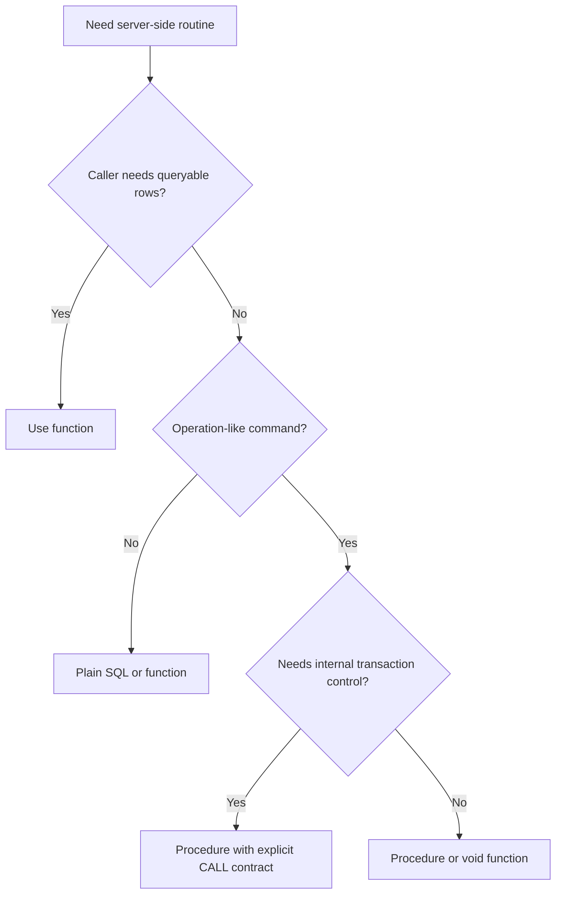
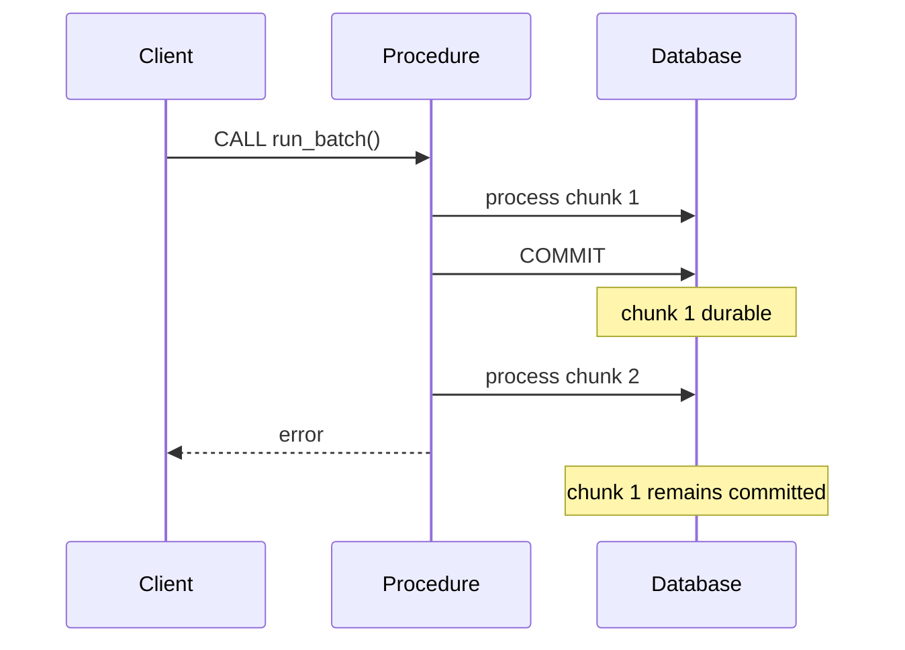
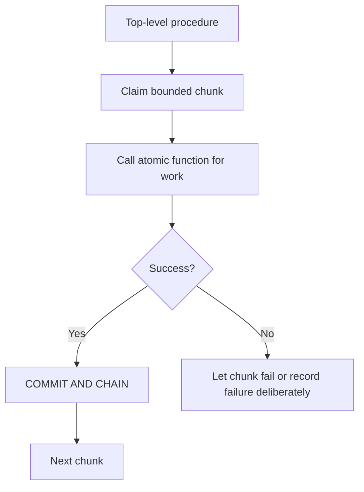
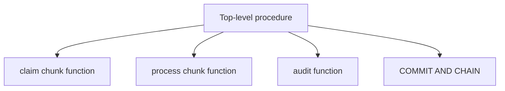
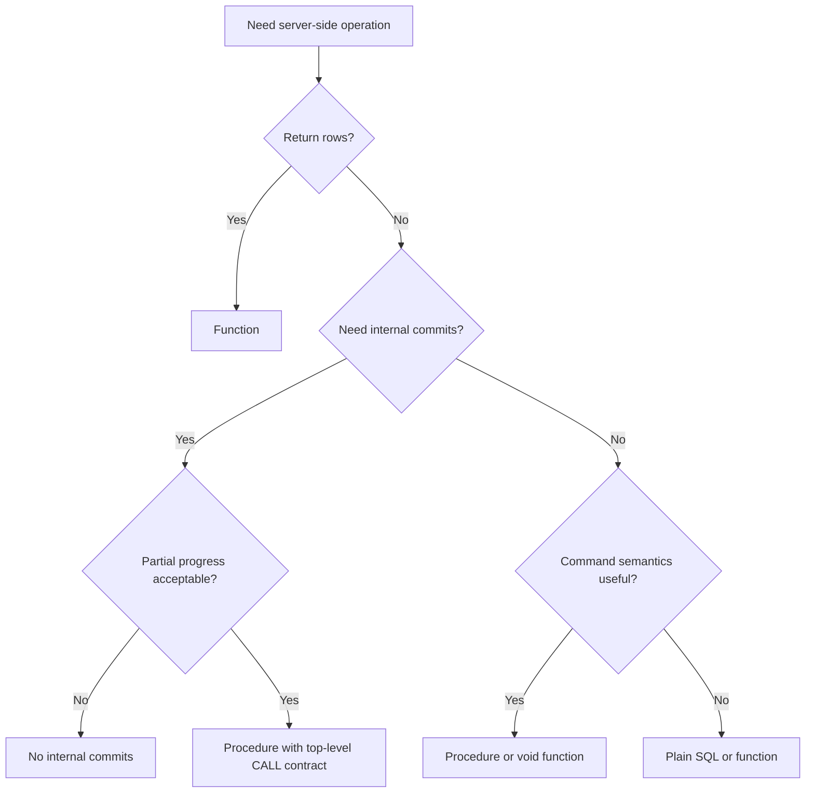

# Part 010 — Procedure Calls, Transaction Control, and Server-Side Workflows

A PostgreSQL function answers a caller.

A PostgreSQL procedure performs an operation.

That difference looks small, but it changes the production contract. A function is normally invoked inside SQL:

```sql
SELECT * FROM app.get_case_summary($1);
```

A procedure is invoked as a command:

```sql
CALL app.run_case_escalation_batch(100);
```

A function is a result boundary. A procedure is an execution boundary.

This part covers:

- `CREATE PROCEDURE`
- `CALL`
- procedure input/output parameters
- transaction control in PL/pgSQL procedures
- `COMMIT`, `ROLLBACK`, `COMMIT AND CHAIN`, `ROLLBACK AND CHAIN`
- valid and invalid call paths for transaction control
- chunked maintenance procedures
- server-side workflow orchestration
- procedure observability and runbooks
- when procedures are the wrong abstraction

The goal is not to move all business logic into the database. The goal is to use procedures where the database is the correct operational boundary.

---

## 1. Procedure Mental Model

A procedure is best treated as a **database-side command handler**.



Use a procedure when the operation is:

- command-like;
- administrative or operational;
- batch-oriented;
- close to database invariants;
- designed to commit in chunks;
- not meant to be embedded in arbitrary SQL expressions.

Be skeptical when a procedure starts to look like a hidden application service.

---

## 2. Function vs Procedure

| Dimension | Function | Procedure |
|---|---|---|
| Invocation | `SELECT`, expression, query context | `CALL` command |
| SQL composability | High | Low |
| Main contract | Return value/result | Perform operation |
| Transaction control | Not allowed inside normal function execution | Allowed only in specific `CALL`/`DO` contexts |
| Good for | lookup, validation rows, computed results, mutation outcome | batch jobs, maintenance, chunked DB workflows |
| Main risk | hidden row-by-row execution | hidden commits and unclear partial progress |

Decision question:

> Does the caller need a result contract or an execution contract?

If result contract, use a function. If execution contract, consider a procedure.

---

## 3. Basic Procedure Syntax

A minimal procedure:

```sql
CREATE OR REPLACE PROCEDURE app.rebuild_case_rollup()
LANGUAGE plpgsql
AS $$
BEGIN
    RAISE NOTICE 'Rebuilding case rollup';

    -- Maintenance work here.
END;
$$;
```

Call it:

```sql
CALL app.rebuild_case_rollup();
```

A procedure can take parameters.

```sql
CREATE OR REPLACE PROCEDURE app.mark_stale_cases_for_review(
    p_older_than interval,
    p_actor_id uuid
)
LANGUAGE plpgsql
AS $$
DECLARE
    v_changed_count bigint;
BEGIN
    UPDATE app.case_file AS c
    SET status = 'under_review',
        updated_at = clock_timestamp(),
        version = c.version + 1
    WHERE c.status = 'open'
      AND clock_timestamp() - c.opened_at > p_older_than;

    GET DIAGNOSTICS v_changed_count = ROW_COUNT;

    INSERT INTO app.case_event (
        case_id,
        event_type,
        event_payload,
        actor_id
    )
    SELECT
        c.case_id,
        'case_marked_for_review',
        jsonb_build_object('older_than', p_older_than::text),
        p_actor_id
    FROM app.case_file AS c
    WHERE c.status = 'under_review'
      AND clock_timestamp() - c.opened_at > p_older_than;

    RAISE NOTICE 'Marked % stale cases for review', v_changed_count;
END;
$$;
```

This example does not commit. It runs inside the caller's transaction context.

---

## 4. Transaction Control Is Conditional

Procedures can control transactions, but not everywhere.

Transaction control is possible only through valid `CALL` or `DO` invocation paths, typically from the top level, without an intervening command that breaks the procedure-call chain.

Valid shape:

```sql
CALL app.proc_a();
-- proc_a calls proc_b
-- proc_b calls proc_c
-- transaction control may be possible inside this CALL chain
```

Invalid mental model:

```sql
SELECT app.some_function_that_calls_procedure();
```

A function-call context is not a transaction-control boundary for procedures.

Also problematic:

```sql
BEGIN;
CALL app.procedure_that_commits();
COMMIT;
```

If the client already opened an explicit transaction block, a procedure that tries to commit internally will fail.

A transaction-controlling procedure therefore requires a caller contract:

- invoke with top-level `CALL`;
- do not wrap in explicit client `BEGIN`/`COMMIT`;
- do not call through a `SELECT` wrapper;
- understand that partial progress may be committed.

---

## 5. `COMMIT` and Automatic New Transactions

Inside an eligible procedure, `COMMIT` ends the current transaction. PostgreSQL automatically starts a new transaction for subsequent commands.

```sql
CREATE OR REPLACE PROCEDURE app.demo_commit_boundary()
LANGUAGE plpgsql
AS $$
BEGIN
    INSERT INTO app.case_event (
        case_id,
        event_type,
        event_payload
    )
    VALUES (
        '00000000-0000-0000-0000-000000000001',
        'demo_before_commit',
        '{}'::jsonb
    );

    COMMIT;

    INSERT INTO app.case_event (
        case_id,
        event_type,
        event_payload
    )
    VALUES (
        '00000000-0000-0000-0000-000000000001',
        'demo_after_commit',
        '{}'::jsonb
    );
END;
$$;
```

Failure semantics change immediately.



If chunk 1 committed and chunk 2 fails, chunk 1 stays committed. That is not a bug. That is the procedure's contract.

Only use internal commits when partial progress is acceptable and restartable.

---

## 6. `COMMIT AND CHAIN`

`COMMIT AND CHAIN` starts the next transaction with similar transaction characteristics. It is useful for chunked jobs.

```sql
CREATE OR REPLACE PROCEDURE app.process_case_backfill_chunks(
    p_chunk_size integer DEFAULT 1000
)
LANGUAGE plpgsql
AS $$
DECLARE
    v_changed bigint;
BEGIN
    IF p_chunk_size < 1 OR p_chunk_size > 10000 THEN
        RAISE EXCEPTION 'p_chunk_size must be between 1 and 10000';
    END IF;

    LOOP
        WITH picked AS (
            SELECT c.case_id
            FROM app.case_file AS c
            WHERE c.status = 'open'
              AND c.priority = 'critical'
            ORDER BY c.opened_at ASC, c.case_id ASC
            LIMIT p_chunk_size
            FOR UPDATE SKIP LOCKED
        )
        UPDATE app.case_file AS c
        SET updated_at = clock_timestamp(),
            version = c.version + 1
        FROM picked AS p
        WHERE c.case_id = p.case_id;

        GET DIAGNOSTICS v_changed = ROW_COUNT;

        RAISE NOTICE 'Processed % rows in current chunk', v_changed;

        COMMIT AND CHAIN;

        EXIT WHEN v_changed = 0;
    END LOOP;
END;
$$;
```

Call contract:

```sql
CALL app.process_case_backfill_chunks(1000);
```

Do not call this inside an explicit transaction block.

---

## 7. `ROLLBACK` and Recoverable Design

A procedure can roll back the current transaction in valid transaction-control contexts.

Use `ROLLBACK` as a chunk boundary, not as casual error handling.

A robust batch design usually needs:

- a work table;
- attempt count;
- last error;
- idempotency key;
- retry policy;
- dead-letter state;
- durable run record.

Do not silently roll back and continue without preserving why. In regulated systems, lost failure evidence is itself a defect.

A minimal chunk skeleton:

```sql
CREATE OR REPLACE PROCEDURE app.try_process_case_chunk(
    p_chunk_size integer DEFAULT 100
)
LANGUAGE plpgsql
AS $$
DECLARE
    v_changed bigint;
BEGIN
    WITH picked AS (
        SELECT c.case_id
        FROM app.case_file AS c
        WHERE c.status = 'open'
        ORDER BY c.opened_at ASC, c.case_id ASC
        LIMIT p_chunk_size
        FOR UPDATE SKIP LOCKED
    )
    UPDATE app.case_file AS c
    SET status = 'under_review',
        updated_at = clock_timestamp(),
        version = c.version + 1
    FROM picked AS p
    WHERE c.case_id = p.case_id;

    GET DIAGNOSTICS v_changed = ROW_COUNT;

    RAISE NOTICE 'Changed % rows', v_changed;

    COMMIT;
END;
$$;
```

This is intentionally simple. Real procedures need restart and failure evidence.

---

## 8. Exception Blocks and Transaction Boundaries

PL/pgSQL exception blocks behave like subtransaction boundaries. A practical consequence: do not design transaction-controlling procedures by wrapping the entire body in one giant `EXCEPTION` block and committing inside it.

Risky pattern:

```sql
BEGIN
    -- many steps
    COMMIT;
EXCEPTION WHEN OTHERS THEN
    -- handle everything
END;
```

Better structure:



Keep transaction boundaries visible. Push atomic work into helper functions. Handle durable failure evidence explicitly.

---

## 9. Security Attributes and Transaction Control

Be careful combining privilege escalation with internal commits.

Procedures marked `SECURITY DEFINER` and procedures with certain `SET` clauses have transaction-control restrictions. Even when syntax appears possible, the security model becomes harder to reason about.

Production guidance:

> Avoid mixing privilege escalation and internal transaction control in the same routine unless the design has been explicitly reviewed.

Prefer separation:

```sql
CREATE FUNCTION app.privileged_apply_one_case_change(...)
RETURNS ...
LANGUAGE plpgsql
SECURITY DEFINER
SET search_path = app, pg_temp
AS $$
BEGIN
    -- one atomic privileged operation
    -- no COMMIT or ROLLBACK here
END;
$$;
```

Then let a separate operational procedure orchestrate chunks if that is safe.

Security-definer details are handled in Part 020.

---

## 10. Procedure Output: Command Metadata, Not Query API

Procedures may have output parameters, but if the main goal is returning rows, use a function.

Use procedure output for command metadata.

```sql
CREATE OR REPLACE PROCEDURE app.recalculate_case_priorities(
    IN p_limit integer,
    OUT processed_count bigint
)
LANGUAGE plpgsql
AS $$
BEGIN
    IF p_limit < 1 OR p_limit > 10000 THEN
        RAISE EXCEPTION 'p_limit must be between 1 and 10000';
    END IF;

    WITH picked AS (
        SELECT c.case_id
        FROM app.case_file AS c
        WHERE c.status = 'open'
        ORDER BY c.opened_at ASC, c.case_id ASC
        LIMIT p_limit
    )
    UPDATE app.case_file AS c
    SET priority = CASE
            WHEN clock_timestamp() - c.opened_at > interval '7 days' THEN 'high'
            ELSE c.priority
        END,
        updated_at = clock_timestamp(),
        version = c.version + 1
    FROM picked AS p
    WHERE c.case_id = p.case_id;

    GET DIAGNOSTICS processed_count = ROW_COUNT;
END;
$$;
```

Call:

```sql
CALL app.recalculate_case_priorities(1000, NULL);
```

The returned value is operation metadata. If you need rows of changed cases, use a function with `UPDATE ... RETURNING`.

---

## 11. What Belongs in a Procedure?

Good procedure candidates:

| Workflow | Why it fits |
|---|---|
| Large backfill | Close to data, chunkable, resumable. |
| Data repair | Needs database invariants and audit discipline. |
| Partition maintenance | Metadata-driven database operation. |
| Bulk archival | Chunk commits reduce lock and failure blast radius. |
| Database-contained queue worker | Can claim rows transactionally. |
| Maintenance helper | Operational command, not query endpoint. |

Weak procedure candidates:

| Workflow | Why risky |
|---|---|
| Full user journey orchestration | Harder to observe, evolve, and test than service workflow. |
| Cross-service saga | Database cannot coordinate distributed side effects alone. |
| External API calls | Keep network side effects outside database transactions. |
| Human approval workflow | Long-lived state machine belongs in application/workflow layer. |
| UI-specific data shaping | Usually belongs in API/query layer unless contract is deliberate. |

Principle:

> Put data-close, transaction-sensitive, set-oriented operations in the database. Keep human, distributed, integration-heavy workflows outside.

---

## 12. Pattern: Chunked Archival Procedure

Create archive table:

```sql
CREATE TABLE IF NOT EXISTS app.case_file_archive (
    LIKE app.case_file INCLUDING ALL,
    archived_at timestamptz NOT NULL DEFAULT clock_timestamp()
);
```

Procedure:

```sql
CREATE OR REPLACE PROCEDURE app.archive_closed_cases(
    p_closed_before timestamptz,
    p_chunk_size integer DEFAULT 1000
)
LANGUAGE plpgsql
AS $$
DECLARE
    v_moved bigint;
BEGIN
    IF p_closed_before IS NULL THEN
        RAISE EXCEPTION 'p_closed_before is required';
    END IF;

    IF p_chunk_size < 1 OR p_chunk_size > 10000 THEN
        RAISE EXCEPTION 'p_chunk_size must be between 1 and 10000';
    END IF;

    LOOP
        WITH picked AS (
            SELECT c.case_id
            FROM app.case_file AS c
            WHERE c.status = 'closed'
              AND c.updated_at < p_closed_before
            ORDER BY c.updated_at ASC, c.case_id ASC
            LIMIT p_chunk_size
            FOR UPDATE SKIP LOCKED
        ), moved AS (
            DELETE FROM app.case_file AS c
            USING picked AS p
            WHERE c.case_id = p.case_id
            RETURNING c.*
        )
        INSERT INTO app.case_file_archive
        SELECT moved.*, clock_timestamp()
        FROM moved;

        GET DIAGNOSTICS v_moved = ROW_COUNT;

        RAISE NOTICE 'Archived % cases', v_moved;

        COMMIT AND CHAIN;

        EXIT WHEN v_moved = 0;
    END LOOP;
END;
$$;
```

Call:

```sql
CALL app.archive_closed_cases(clock_timestamp() - interval '2 years', 1000);
```

Properties:

- bounded chunk size;
- deterministic ordering;
- `FOR UPDATE SKIP LOCKED` for concurrent safety;
- committed progress per chunk;
- restartable if archive/delete state is consistent;
- visible progress through notices.

Caveat: committed chunks will not roll back if a later chunk fails.

---

## 13. Pattern: Database Queue Worker Procedure

A database queue can be processed in chunks when work is database-contained.

```sql
CREATE TABLE IF NOT EXISTS app.case_work_item (
    work_item_id bigserial PRIMARY KEY,
    case_id uuid NOT NULL REFERENCES app.case_file(case_id),
    work_type text NOT NULL,
    status text NOT NULL DEFAULT 'pending',
    attempt_count integer NOT NULL DEFAULT 0,
    last_error text,
    available_at timestamptz NOT NULL DEFAULT clock_timestamp(),
    locked_at timestamptz,
    completed_at timestamptz,
    created_at timestamptz NOT NULL DEFAULT clock_timestamp(),
    CONSTRAINT case_work_item_status_valid CHECK (
        status IN ('pending', 'running', 'completed', 'failed')
    )
);
```

Procedure skeleton:

```sql
CREATE OR REPLACE PROCEDURE app.process_case_work_items(
    p_chunk_size integer DEFAULT 100
)
LANGUAGE plpgsql
AS $$
DECLARE
    v_claimed bigint;
BEGIN
    IF p_chunk_size < 1 OR p_chunk_size > 1000 THEN
        RAISE EXCEPTION 'p_chunk_size must be between 1 and 1000';
    END IF;

    CREATE TEMP TABLE IF NOT EXISTS pg_temp.current_work_chunk (
        work_item_id bigint PRIMARY KEY
    ) ON COMMIT DELETE ROWS;

    LOOP
        DELETE FROM pg_temp.current_work_chunk;

        WITH claimed AS (
            SELECT wi.work_item_id
            FROM app.case_work_item AS wi
            WHERE wi.status = 'pending'
              AND wi.available_at <= clock_timestamp()
            ORDER BY wi.available_at ASC, wi.work_item_id ASC
            LIMIT p_chunk_size
            FOR UPDATE SKIP LOCKED
        ), marked AS (
            UPDATE app.case_work_item AS wi
            SET status = 'running',
                locked_at = clock_timestamp(),
                attempt_count = wi.attempt_count + 1
            FROM claimed AS c
            WHERE wi.work_item_id = c.work_item_id
            RETURNING wi.work_item_id
        )
        INSERT INTO pg_temp.current_work_chunk(work_item_id)
        SELECT marked.work_item_id
        FROM marked;

        GET DIAGNOSTICS v_claimed = ROW_COUNT;

        IF v_claimed = 0 THEN
            COMMIT;
            RETURN;
        END IF;

        -- Real work should be explicit and idempotent.
        -- Keep external side effects out of this database-only procedure.

        UPDATE app.case_work_item AS wi
        SET status = 'completed',
            completed_at = clock_timestamp()
        FROM pg_temp.current_work_chunk AS chunk
        WHERE wi.work_item_id = chunk.work_item_id;

        RAISE NOTICE 'Processed % work items', v_claimed;

        COMMIT AND CHAIN;
    END LOOP;
END;
$$;
```

If processing sends emails, calls APIs, publishes Kafka messages, or touches external systems, use an application worker and a transactional outbox pattern instead. A database procedure should not secretly become a distributed workflow engine.

---

## 14. Pattern: Migration Assistant Procedure

Procedures can help large backfills during migrations.

```sql
CREATE OR REPLACE PROCEDURE app.backfill_case_priority_normalization(
    p_chunk_size integer DEFAULT 5000
)
LANGUAGE plpgsql
AS $$
DECLARE
    v_changed bigint;
BEGIN
    IF p_chunk_size < 1 OR p_chunk_size > 50000 THEN
        RAISE EXCEPTION 'Invalid chunk size: %', p_chunk_size;
    END IF;

    LOOP
        WITH picked AS (
            SELECT c.case_id
            FROM app.case_file AS c
            WHERE c.priority IN ('urgent', 'p1', 'p2')
            ORDER BY c.case_id
            LIMIT p_chunk_size
            FOR UPDATE SKIP LOCKED
        )
        UPDATE app.case_file AS c
        SET priority = CASE c.priority
                WHEN 'urgent' THEN 'critical'
                WHEN 'p1' THEN 'high'
                WHEN 'p2' THEN 'normal'
                ELSE c.priority
            END,
            updated_at = clock_timestamp(),
            version = c.version + 1
        FROM picked AS p
        WHERE c.case_id = p.case_id;

        GET DIAGNOSTICS v_changed = ROW_COUNT;

        RAISE NOTICE 'Normalized % case priorities', v_changed;

        COMMIT AND CHAIN;

        EXIT WHEN v_changed = 0;
    END LOOP;
END;
$$;
```

This is useful when:

- the backfill is large;
- locks must be bounded;
- progress must be resumable;
- operators may need to run it directly;
- application deployment should not carry the long-running work.

Do not leave one-off procedures installed forever without ownership and documentation.

---

## 15. Procedure Observability

A procedure needs operational signals.

Minimum useful signals:

- `RAISE NOTICE` for progress;
- `GET DIAGNOSTICS ... ROW_COUNT` after mutations;
- durable run table for long jobs;
- start/end timestamp;
- processed count;
- last message;
- status: running/completed/failed.

Example run table:

```sql
CREATE TABLE IF NOT EXISTS app.batch_run (
    batch_run_id bigserial PRIMARY KEY,
    procedure_name text NOT NULL,
    status text NOT NULL,
    started_at timestamptz NOT NULL DEFAULT clock_timestamp(),
    finished_at timestamptz,
    processed_count bigint NOT NULL DEFAULT 0,
    last_message text,
    CONSTRAINT batch_run_status_valid CHECK (
        status IN ('running', 'completed', 'failed')
    )
);
```

Run-record skeleton:

```sql
CREATE OR REPLACE PROCEDURE app.run_observed_backfill(
    p_chunk_size integer DEFAULT 1000
)
LANGUAGE plpgsql
AS $$
DECLARE
    v_run_id bigint;
    v_changed bigint := 0;
BEGIN
    INSERT INTO app.batch_run(procedure_name, status)
    VALUES ('app.run_observed_backfill', 'running')
    RETURNING batch_run_id
    INTO v_run_id;

    COMMIT AND CHAIN;

    LOOP
        -- Perform bounded chunk work here.
        -- Set v_changed to actual affected row count.
        v_changed := 0;

        UPDATE app.batch_run AS br
        SET processed_count = br.processed_count + v_changed,
            last_message = format('Last chunk processed %s rows', v_changed)
        WHERE br.batch_run_id = v_run_id;

        COMMIT AND CHAIN;

        EXIT WHEN v_changed = 0;
    END LOOP;

    UPDATE app.batch_run AS br
    SET status = 'completed',
        finished_at = clock_timestamp(),
        last_message = 'Completed successfully'
    WHERE br.batch_run_id = v_run_id;

    COMMIT;
END;
$$;
```

Without durable observability, a long-running procedure is a black box.

---

## 16. Client Contract

A transaction-controlling procedure must document how it is called.

Correct:

```sql
CALL app.archive_closed_cases(clock_timestamp() - interval '2 years', 1000);
```

Incorrect:

```sql
BEGIN;
CALL app.archive_closed_cases(clock_timestamp() - interval '2 years', 1000);
COMMIT;
```

Incorrect:

```sql
SELECT app.wrapper_that_calls_archive();
```

Incorrect in many frameworks:

```sql
-- inside ORM-managed @Transactional service method
CALL app.archive_closed_cases(...);
```

If the procedure owns transaction boundaries, the client must not also own them.

Document it:

```sql
COMMENT ON PROCEDURE app.archive_closed_cases(timestamptz, integer) IS
'Runs archive in committed chunks. Must be invoked with top-level CALL, not inside an explicit client transaction.';
```

---

## 17. Avoid Hidden Commits in Request Paths

Internal commits are usually a poor fit for normal user requests.

Anti-pattern:

```sql
CALL app.submit_case_and_commit_inside(...);
```

Why dangerous:

- the application cannot roll back the whole request;
- partial state may commit before service validation finishes;
- outbox/event publication can become inconsistent;
- tests become harder;
- retry behavior is unclear;
- distributed side effects are not coordinated.

For normal business commands, prefer:

- application starts transaction;
- database function/DML enforces invariants;
- outbox event is written in same transaction;
- application commits once at the service boundary.

Procedures with internal commits are best for operational jobs, not standard request/response flows.

---

## 18. Procedure-to-Procedure Calls

A procedure can call another procedure.

```sql
CREATE OR REPLACE PROCEDURE app.step_one()
LANGUAGE plpgsql
AS $$
BEGIN
    RAISE NOTICE 'step one';
END;
$$;

CREATE OR REPLACE PROCEDURE app.step_two()
LANGUAGE plpgsql
AS $$
BEGIN
    RAISE NOTICE 'step two';
END;
$$;

CREATE OR REPLACE PROCEDURE app.run_two_steps()
LANGUAGE plpgsql
AS $$
BEGIN
    CALL app.step_one();
    CALL app.step_two();
END;
$$;
```

Maintainable rule:

- top-level procedure owns commits;
- lower-level routines perform atomic work;
- transaction boundary is visible in one place;
- avoid hidden commits deep in nested procedure chains.



Hidden transaction boundaries make incident analysis painful.

---

## 19. Production Procedure Template

```sql
CREATE OR REPLACE PROCEDURE app.<operation_name>(
    p_required_input type,
    p_chunk_size integer DEFAULT 1000
)
LANGUAGE plpgsql
AS $$
DECLARE
    v_changed bigint;
    v_total bigint := 0;
BEGIN
    IF p_chunk_size < 1 OR p_chunk_size > 10000 THEN
        RAISE EXCEPTION 'Invalid chunk size: %', p_chunk_size;
    END IF;

    LOOP
        -- 1. Claim/select bounded chunk.
        -- 2. Apply set-based mutation.
        -- 3. Capture affected row count.
        GET DIAGNOSTICS v_changed = ROW_COUNT;

        v_total := v_total + v_changed;

        RAISE NOTICE 'Changed %, total %', v_changed, v_total;

        COMMIT AND CHAIN;

        EXIT WHEN v_changed = 0;
    END LOOP;

    COMMIT;
END;
$$;
```

Review questions:

- Is the procedure allowed to commit?
- Must the caller invoke it outside explicit transactions?
- What happens if it fails after partial commits?
- Is it restartable?
- Are chunks bounded?
- Are locks bounded?
- Is progress observable?
- Is failure evidence durable?
- Can two instances run concurrently?
- Is there a runbook?

---

## 20. Failure Mode Catalogue

### Failure Mode 1: `invalid transaction termination`

Cause: procedure attempts `COMMIT` while the caller already controls the transaction.

Fix: call at top level, remove internal commits, or split into atomic function plus operational procedure.

### Failure Mode 2: Partial Progress Surprises Caller

Cause: procedure commits chunks and later fails.

Fix: document partial progress, make operation restartable, and provide runbook.

### Failure Mode 3: Giant Procedure as Hidden Application Service

Cause: business workflow, human state, and distributed side effects are hidden in DB code.

Fix: keep database routines data-close and bounded. Move distributed orchestration to service/workflow layer.

### Failure Mode 4: No Progress Visibility

Cause: long job emits no durable status.

Fix: notices, row counts, run table, monitoring queries.

### Failure Mode 5: Unbounded Locks

Cause: procedure mutates too many rows in one transaction.

Fix: deterministic chunks, indexes, `SKIP LOCKED`, smaller commits.

### Failure Mode 6: Procedure Used as Query API

Cause: output params are used to emulate result sets.

Fix: use set-returning function for queryable data.

---

## 21. Runbook Template

Every transaction-controlling production procedure should have a runbook.

```md
# Runbook: app.archive_closed_cases

## Purpose
Archive closed cases older than a specified timestamp in committed chunks.

## Invocation
CALL app.archive_closed_cases('<timestamp>', 1000);

## Transaction Contract
Must be called at top level. Do not wrap in BEGIN/COMMIT.
The procedure commits after each chunk.

## Safety
Safe to restart if archive table and source table remain consistent.

## Progress
Watch server notices and app.batch_run if enabled.

## Failure Handling
Resolve the error and rerun with the same parameters if restart-safe.

## Concurrency
Uses bounded chunks and SKIP LOCKED.

## Rollback
Already committed chunks are not automatically rolled back.
Restore from archive table only through an approved repair procedure.
```

A runbook is part of the procedure contract, not optional paperwork.

---

## 22. Decision Guide



Final rule:

> Use procedures when the operation contract matters more than the result contract.

---

## 23. Final Mental Model

A procedure is not a function that forgot to return something.

A procedure is an operational boundary.

Its design must make these things obvious:

- who owns the transaction;
- whether partial progress is possible;
- how it is called;
- how it reports progress;
- how it fails;
- how it is restarted;
- whether it belongs in the database at all.

Used well, procedures are excellent for database-close operational workflows. Used poorly, they create hidden commits, invisible business workflows, and failure modes that only appear during incidents.

Hold the boundary:

- functions for result contracts;
- procedures for command and transaction contracts;
- service layer for distributed/human workflows;
- runbooks for operational procedures.

---

## 24. What Comes Next

Part 011 moves into error handling:

- `RAISE`
- `EXCEPTION`
- SQLSTATE
- domain failures
- failure taxonomy
- when to return validation rows vs raise exceptions

That part is the natural continuation because functions and procedures are not production-ready until their failure semantics are explicit.
