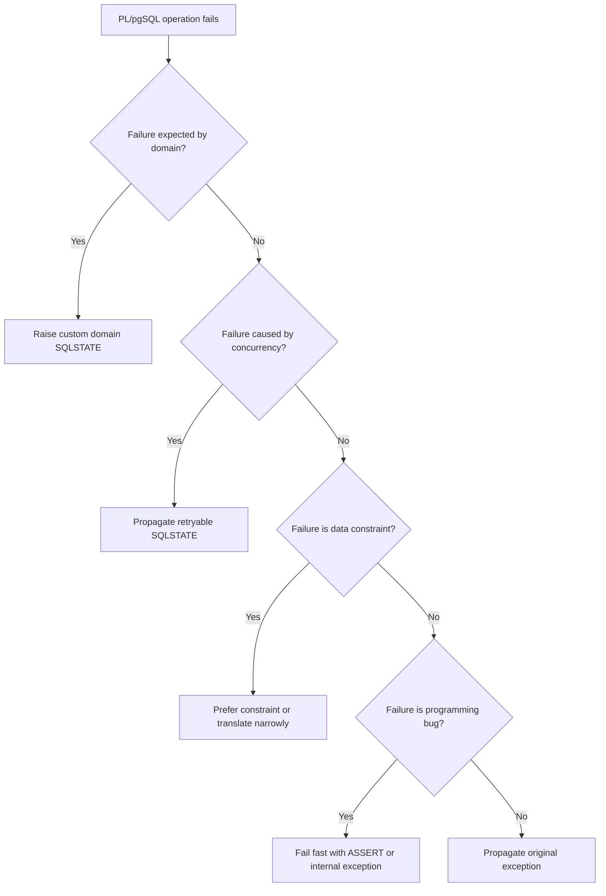

# Part 011 — Error Handling: Exceptions, SQLSTATE, and Domain Failures

> Target part ini: kamu tidak hanya bisa menulis `EXCEPTION WHEN others THEN ...`, tetapi bisa mendesain **failure contract** untuk database-side code: error mana yang harus meledak, error mana yang harus diterjemahkan, error mana yang retryable, error mana yang domain violation, dan error mana yang merupakan bug internal.

PL/pgSQL bukan Java `try/catch` yang kebetulan berada di database. Ia berjalan di dalam transaksi PostgreSQL. Artinya setiap error bukan hanya control-flow event, tapi juga bisa mengubah nasib seluruh transaksi, lock, savepoint internal, dan observability downstream.

Materi ini sengaja praktis. Kita akan berpikir seperti engineer yang harus menjaga sistem produksi: bagaimana error terlihat di log, bagaimana caller membedakannya, bagaimana auditor membaca failure, dan bagaimana operasi bisa mengambil tindakan tanpa menebak-nebak.

---

## 1. Mental Model: Error Adalah Bagian dari API

Dalam PL/pgSQL, function/procedure tidak hanya punya return value. Ia juga punya **error surface**.

Error surface mencakup:

1. SQLSTATE yang keluar.
2. message utama.
3. detail.
4. hint.
5. object terkait, misalnya table/column/constraint.
6. apakah transaksi caller tetap bisa lanjut atau harus rollback.
7. apakah caller boleh retry.
8. apakah error tersebut domain-level, infrastructure-level, data-level, atau programming bug.

Kalau error surface tidak dirancang, caller akan membaca error message sebagai string. Itu rapuh.

Contoh buruk:

```sql
RAISE EXCEPTION 'invalid case';
```

Masalahnya:

- invalid karena state salah?
- invalid karena assignee kosong?
- invalid karena case sudah closed?
- invalid karena caller tidak punya privilege?
- invalid karena data corrupt?
- caller harus retry atau tidak?

Contoh lebih baik:

```sql
RAISE EXCEPTION USING
    ERRCODE = 'P2401',
    MESSAGE = 'case transition rejected',
    DETAIL  = format(
        'case_id=%s, current_status=%s, requested_status=%s',
        p_case_id,
        v_current_status,
        p_requested_status
    ),
    HINT    = 'Check the allowed transition matrix before calling transition_case_status.';
```

Di sini error bukan lagi teriakan acak. Ia menjadi contract.

---

## 2. Jangan Mulai dari `EXCEPTION`; Mulai dari Taxonomy

Production error handling dimulai dari klasifikasi.

| Kategori | Makna | Contoh | Biasanya Ditangani Dengan |
|---|---|---|---|
| Domain failure | Request valid secara teknis tapi melanggar aturan bisnis | transition case dari `CLOSED` ke `IN_REVIEW` | custom SQLSTATE, clear message, no retry |
| Data integrity failure | Constraint database menolak perubahan | unique violation, foreign key violation | biarkan constraint bicara atau translate selektif |
| Concurrency failure | Dua transaksi bersaing | serialization failure, deadlock, lock timeout | retry di caller/orchestrator |
| Not found / stale data | Entity hilang atau versi tidak cocok | update zero rows | custom not-found/stale error |
| Authorization boundary | Caller tidak boleh melakukan aksi | privilege/domain role gagal | custom domain auth error atau PostgreSQL privilege error |
| Infrastructure/operational | Disk, connection, timeout, unavailable resource | statement timeout, IO error | jangan ditelan; escalate |
| Programming bug | Bug function itu sendiri | impossible branch, null unexpected | assert/exception; fail fast |

Diagram keputusan:



Aturan praktis:

- Jangan menangkap error hanya agar function “tidak gagal”.
- Jangan menyamakan domain rejection dengan infrastructure failure.
- Jangan retry domain failure.
- Jangan translate semua error menjadi satu message generik.
- Jangan pakai `WHEN others` kecuali kamu tahu persis apa yang dipertahankan, dicatat, dan dilempar ulang.

---

## 3. PostgreSQL Error Primitive yang Wajib Dikuasai

PL/pgSQL menyediakan `RAISE` untuk menghasilkan message atau exception.

Bentuk umum:

```sql
RAISE [ level ] 'format' [, expression [, ... ]];
```

Atau bentuk production-grade:

```sql
RAISE EXCEPTION USING
    ERRCODE = 'P2401',
    MESSAGE = 'case transition rejected',
    DETAIL  = 'case_id=123, current_status=CLOSED, requested_status=IN_REVIEW',
    HINT    = 'Only reopen through reopen_case procedure.';
```

Level penting:

| Level | Efek Umum | Pemakaian |
|---|---|---|
| `DEBUG` | diagnostic rendah | local troubleshooting, dev session |
| `LOG` | masuk server log sesuai config | operational signal, jarang dari business code |
| `INFO` | informasi ke client | administrative script, migration output |
| `NOTICE` | default-visible notice | progress message non-fatal |
| `WARNING` | warning non-fatal | degraded behavior, suspicious state |
| `EXCEPTION` | error fatal untuk statement/block | domain rejection, invariant breach |

Default `RAISE` tanpa level adalah `EXCEPTION`.

Contoh:

```sql
RAISE NOTICE 'processed % cases', v_processed_count;
```

```sql
RAISE EXCEPTION 'case % not found', p_case_id;
```

Tapi untuk sistem besar, lebih baik gunakan `USING` agar error dapat diproses mesin dan manusia.

---

## 4. SQLSTATE: Jangan Biarkan Caller Menebak String

SQLSTATE adalah kode lima karakter yang mengklasifikasi error SQL. PostgreSQL memakai banyak kode standar dan kode spesifik PostgreSQL.

Contoh umum:

| SQLSTATE | Condition | Makna |
|---|---|---|
| `02000` | `no_data_found` | tidak ada row untuk operasi `STRICT` |
| `21000` | `cardinality_violation` | hasil lebih dari satu saat hanya satu diharapkan |
| `23505` | `unique_violation` | unique constraint gagal |
| `23503` | `foreign_key_violation` | foreign key gagal |
| `23514` | `check_violation` | check constraint gagal |
| `40001` | `serialization_failure` | transaksi serializable perlu retry |
| `40P01` | `deadlock_detected` | deadlock terjadi |
| `55P03` | `lock_not_available` | lock tidak tersedia |
| `57014` | `query_canceled` | query dibatalkan, sering karena timeout/cancel |
| `P0001` | `raise_exception` | default custom exception PL/pgSQL |
| `P0002` | `no_data_found` | PL/pgSQL no data found |
| `P0003` | `too_many_rows` | PL/pgSQL too many rows |
| `P0004` | `assert_failure` | assertion failure |

Untuk custom application/domain error, gunakan kode custom yang tidak bentrok dengan kode standar. Banyak tim memakai kelas `P` untuk PL/pgSQL/application exception, misalnya:

| Range Tim | Makna |
|---|---|
| `P1xxx` | validation/domain input |
| `P2xxx` | workflow/state machine |
| `P3xxx` | authorization/policy |
| `P4xxx` | idempotency/replay |
| `P5xxx` | operational guardrail |

Contoh registry:

| SQLSTATE | Nama Internal | Makna |
|---|---|---|
| `P2001` | `case_not_found` | case id tidak ditemukan |
| `P2401` | `case_transition_rejected` | transisi state tidak valid |
| `P2402` | `case_transition_stale` | optimistic version mismatch |
| `P3001` | `case_policy_denied` | actor tidak boleh melakukan aksi |
| `P4001` | `idempotency_conflict` | key sama tapi payload berbeda |

Jangan membuat kode custom tanpa registry. Tanpa registry, SQLSTATE berubah menjadi magic number baru.

---

## 5. Pattern: Domain Error Helper Function

Kalau banyak function perlu menaikkan error domain secara konsisten, buat helper. Namun helper harus tetap sederhana.

```sql
CREATE OR REPLACE FUNCTION app.raise_domain_error(
    p_sqlstate text,
    p_message  text,
    p_detail   text DEFAULT NULL,
    p_hint     text DEFAULT NULL
)
RETURNS void
LANGUAGE plpgsql
AS $$
BEGIN
    IF p_sqlstate IS NULL OR length(p_sqlstate) <> 5 THEN
        RAISE EXCEPTION USING
            ERRCODE = 'P0001',
            MESSAGE = 'invalid domain SQLSTATE',
            DETAIL  = format('sqlstate=%s', p_sqlstate);
    END IF;

    RAISE EXCEPTION USING
        ERRCODE = p_sqlstate,
        MESSAGE = p_message,
        DETAIL  = p_detail,
        HINT    = p_hint;
END;
$$;
```

Pemakaian:

```sql
PERFORM app.raise_domain_error(
    'P2401',
    'case transition rejected',
    format(
        'case_id=%s, current_status=%s, requested_status=%s',
        p_case_id,
        v_case.status,
        p_next_status
    ),
    'Use an allowed transition from case_status_transition_rule.'
);
```

Trade-off:

- Pro: konsisten.
- Pro: mudah standardisasi message, detail, hint.
- Kontra: stack trace akan menunjuk helper juga.
- Kontra: helper bisa menyembunyikan lokasi asli bila dipakai terlalu agresif.

Untuk domain platform besar, helper wajar. Untuk function kecil, `RAISE EXCEPTION USING` langsung sering lebih jelas.

---

## 6. `EXCEPTION` Block Bukan Gratis

PL/pgSQL `EXCEPTION` block menciptakan subtransaction-like boundary. Secara operasional, ini bukan control-flow murah yang boleh dipasang di setiap cabang.

Gunakan `EXCEPTION` untuk:

- menerjemahkan error yang benar-benar kamu pahami;
- melakukan cleanup lokal yang aman;
- retry mikro untuk operasi kecil dan bounded;
- mengubah low-level constraint menjadi domain-specific error;
- mencatat diagnostic lalu rethrow.

Jangan gunakan `EXCEPTION` untuk:

- mengganti `IF EXISTS`;
- mengabaikan error;
- menyembunyikan data corruption;
- membuat “best effort” mutation tanpa kontrak;
- menangkap semua error agar batch terlihat sukses.

Buruk:

```sql
BEGIN
    INSERT INTO case_assignment(case_id, user_id)
    VALUES (p_case_id, p_user_id);
EXCEPTION WHEN others THEN
    -- silently ignore
END;
```

Ini sangat berbahaya. Caller mengira assignment berhasil, padahal tidak.

Lebih baik:

```sql
BEGIN
    INSERT INTO case_assignment(case_id, user_id)
    VALUES (p_case_id, p_user_id);
EXCEPTION
    WHEN unique_violation THEN
        RAISE EXCEPTION USING
            ERRCODE = 'P2101',
            MESSAGE = 'case assignment already exists',
            DETAIL  = format('case_id=%s, user_id=%s', p_case_id, p_user_id),
            HINT    = 'Use reassign_case when replacing an existing assignee.';
END;
```

Lebih baik lagi jika idempotent behavior memang diinginkan:

```sql
INSERT INTO case_assignment(case_id, user_id)
VALUES (p_case_id, p_user_id)
ON CONFLICT (case_id, user_id) DO NOTHING;

GET DIAGNOSTICS v_rows = ROW_COUNT;

IF v_rows = 0 THEN
    RAISE NOTICE 'assignment already existed: case_id=%, user_id=%', p_case_id, p_user_id;
END IF;
```

Tidak semua konflik perlu exception. Kadang SQL sendiri sudah menyediakan operator semantik yang lebih tepat.

---

## 7. Pattern: Translate Constraint Error Secara Sempit

Constraint adalah guardrail terbaik untuk invariant data. Tetapi constraint error mentah kadang terlalu low-level untuk caller.

Contoh table:

```sql
CREATE TABLE enforcement_case (
    id uuid PRIMARY KEY,
    status text NOT NULL,
    severity text NOT NULL,
    version bigint NOT NULL DEFAULT 1,
    CONSTRAINT enforcement_case_status_chk
        CHECK (status IN ('DRAFT', 'OPEN', 'IN_REVIEW', 'ESCALATED', 'CLOSED')),
    CONSTRAINT enforcement_case_severity_chk
        CHECK (severity IN ('LOW', 'MEDIUM', 'HIGH', 'CRITICAL'))
);
```

Function:

```sql
CREATE OR REPLACE FUNCTION app.create_case(
    p_case_id uuid,
    p_status text,
    p_severity text
)
RETURNS uuid
LANGUAGE plpgsql
AS $$
BEGIN
    INSERT INTO enforcement_case(id, status, severity)
    VALUES (p_case_id, p_status, p_severity);

    RETURN p_case_id;
EXCEPTION
    WHEN check_violation THEN
        RAISE EXCEPTION USING
            ERRCODE = 'P1001',
            MESSAGE = 'case input violates allowed value policy',
            DETAIL  = format('status=%s, severity=%s', p_status, p_severity),
            HINT    = 'Use allowed status and severity values from the case contract.';
END;
$$;
```

Masalah: `check_violation` bisa berasal dari constraint mana pun di statement itu.

Lebih aman menggunakan diagnostic constraint name.

```sql
CREATE OR REPLACE FUNCTION app.create_case(
    p_case_id uuid,
    p_status text,
    p_severity text
)
RETURNS uuid
LANGUAGE plpgsql
AS $$
DECLARE
    v_constraint text;
BEGIN
    INSERT INTO enforcement_case(id, status, severity)
    VALUES (p_case_id, p_status, p_severity);

    RETURN p_case_id;
EXCEPTION
    WHEN check_violation THEN
        GET STACKED DIAGNOSTICS
            v_constraint = CONSTRAINT_NAME;

        IF v_constraint = 'enforcement_case_status_chk' THEN
            RAISE EXCEPTION USING
                ERRCODE = 'P1002',
                MESSAGE = 'invalid case status',
                DETAIL  = format('status=%s', p_status),
                HINT    = 'Allowed statuses: DRAFT, OPEN, IN_REVIEW, ESCALATED, CLOSED.';
        ELSIF v_constraint = 'enforcement_case_severity_chk' THEN
            RAISE EXCEPTION USING
                ERRCODE = 'P1003',
                MESSAGE = 'invalid case severity',
                DETAIL  = format('severity=%s', p_severity),
                HINT    = 'Allowed severities: LOW, MEDIUM, HIGH, CRITICAL.';
        ELSE
            RAISE;
        END IF;
END;
$$;
```

Prinsip:

- Tangkap kategori error.
- Baca diagnostic.
- Translate hanya constraint yang kamu kenali.
- `RAISE;` untuk yang tidak dikenal.

---

## 8. `GET STACKED DIAGNOSTICS`: Cara Membaca Error yang Ditangkap

Di dalam `EXCEPTION` handler, kamu bisa mengambil informasi error yang sedang ditangani.

Template:

```sql
DECLARE
    v_state      text;
    v_message    text;
    v_detail     text;
    v_hint       text;
    v_context    text;
    v_constraint text;
    v_table      text;
    v_column     text;
BEGIN
    -- risky operation
EXCEPTION WHEN others THEN
    GET STACKED DIAGNOSTICS
        v_state      = RETURNED_SQLSTATE,
        v_message    = MESSAGE_TEXT,
        v_detail     = PG_EXCEPTION_DETAIL,
        v_hint       = PG_EXCEPTION_HINT,
        v_context    = PG_EXCEPTION_CONTEXT,
        v_constraint = CONSTRAINT_NAME,
        v_table      = TABLE_NAME,
        v_column     = COLUMN_NAME;

    RAISE;
END;
```

Gunakan ini untuk:

- membedakan constraint tertentu;
- mencatat diagnostic yang cukup;
- membuat audit failure;
- memperbaiki message domain;
- rethrow original exception.

Jangan gunakan ini untuk:

- mengubah semua error menjadi sukses;
- menyimpan sensitive data mentah ke log;
- mengambil keputusan bisnis dari string message.

---

## 9. `RAISE;` vs `RAISE EXCEPTION ...`

Di dalam exception handler:

```sql
RAISE;
```

akan melempar ulang exception asli.

Gunakan `RAISE;` ketika:

- kamu hanya ingin logging/diagnostic tambahan;
- error bukan milik boundary yang sedang kamu translate;
- kamu ingin mempertahankan SQLSTATE asli;
- caller butuh retryability asli seperti `40001` atau `40P01`.

Contoh:

```sql
BEGIN
    PERFORM app.perform_case_batch(p_batch_id);
EXCEPTION WHEN others THEN
    GET STACKED DIAGNOSTICS
        v_state   = RETURNED_SQLSTATE,
        v_message = MESSAGE_TEXT;

    INSERT INTO batch_failure_log(batch_id, sqlstate, message, occurred_at)
    VALUES (p_batch_id, v_state, v_message, clock_timestamp());

    RAISE;
END;
```

Kalau kamu memakai:

```sql
RAISE EXCEPTION 'batch failed';
```

kamu menghancurkan informasi penting seperti SQLSTATE asli.

Lebih aman kalau harus membungkus:

```sql
RAISE EXCEPTION USING
    ERRCODE = v_state,
    MESSAGE = 'batch failed',
    DETAIL  = format('batch_id=%s, original_message=%s', p_batch_id, v_message);
```

Tetapi mempertahankan SQLSTATE asli sambil mengubah message juga harus hati-hati. Bisa membuat caller mengira error adalah error native padahal sudah dibungkus. Untuk domain boundary, custom SQLSTATE lebih baik.

---

## 10. Avoid `WHEN others` Tanpa Rethrow

`WHEN others` adalah pisau tajam.

Anti-pattern:

```sql
EXCEPTION WHEN others THEN
    RETURN false;
```

Kenapa buruk?

- unique violation terlihat sama dengan disk failure;
- timeout terlihat sama dengan invalid input;
- caller kehilangan SQLSTATE;
- operasi parsial bisa tersembunyi;
- sistem monitoring tidak melihat error;
- audit bisa berbohong.

Pattern yang masih masuk akal:

```sql
EXCEPTION WHEN others THEN
    GET STACKED DIAGNOSTICS
        v_state   = RETURNED_SQLSTATE,
        v_message = MESSAGE_TEXT,
        v_context = PG_EXCEPTION_CONTEXT;

    INSERT INTO app_error_log(
        operation_name,
        correlation_id,
        sqlstate,
        message,
        context,
        occurred_at
    ) VALUES (
        'close_case',
        p_correlation_id,
        v_state,
        v_message,
        v_context,
        clock_timestamp()
    );

    RAISE;
```

Kalau kamu benar-benar perlu mengubah error menjadi return value, batasi dengan SQLSTATE spesifik:

```sql
EXCEPTION
    WHEN unique_violation THEN
        RETURN false;
```

Bahkan ini pun harus jelas dalam function contract.

---

## 11. `STRICT`, `no_data_found`, dan `too_many_rows`

`SELECT ... INTO STRICT` adalah alat bagus untuk menyatakan “saya mengharapkan tepat satu row”.

```sql
SELECT *
INTO STRICT v_case
FROM enforcement_case
WHERE id = p_case_id;
```

Kalau row tidak ada, PL/pgSQL menaikkan `NO_DATA_FOUND`. Kalau lebih dari satu, `TOO_MANY_ROWS`.

Namun ada trade-off.

Bagus untuk invariant internal:

```sql
SELECT *
INTO STRICT v_policy
FROM case_policy
WHERE policy_code = p_policy_code;
```

Artinya policy code harus ada dan unik. Kalau tidak, itu bug konfigurasi.

Kurang bagus untuk domain not-found yang harus punya message API jelas:

```sql
SELECT *
INTO v_case
FROM enforcement_case
WHERE id = p_case_id;

IF NOT FOUND THEN
    RAISE EXCEPTION USING
        ERRCODE = 'P2001',
        MESSAGE = 'case not found',
        DETAIL  = format('case_id=%s', p_case_id);
END IF;
```

Rule:

- Pakai `STRICT` untuk invariant internal “tepat satu harus ada”.
- Pakai non-`STRICT` + explicit `IF NOT FOUND` untuk domain not-found yang harus komunikatif.
- Jangan biarkan `NO_DATA_FOUND` mentah keluar dari public-facing function kecuali itu memang contract.

---

## 12. Pattern: Mutation with Proof

Mutation yang baik tidak hanya menjalankan `UPDATE`. Ia membuktikan outcome.

Buruk:

```sql
UPDATE enforcement_case
SET status = p_next_status
WHERE id = p_case_id;
```

Tidak jelas:

- row ada atau tidak?
- row berubah atau tidak?
- status lama apa?
- caller stale atau tidak?

Lebih baik:

```sql
UPDATE enforcement_case c
SET status = p_next_status,
    version = c.version + 1,
    updated_at = clock_timestamp()
WHERE c.id = p_case_id
  AND c.version = p_expected_version
RETURNING c.id, c.status, c.version
INTO v_updated_case;

IF NOT FOUND THEN
    SELECT c.version
    INTO v_actual_version
    FROM enforcement_case c
    WHERE c.id = p_case_id;

    IF NOT FOUND THEN
        RAISE EXCEPTION USING
            ERRCODE = 'P2001',
            MESSAGE = 'case not found',
            DETAIL  = format('case_id=%s', p_case_id);
    END IF;

    RAISE EXCEPTION USING
        ERRCODE = 'P2402',
        MESSAGE = 'case update rejected because version is stale',
        DETAIL  = format(
            'case_id=%s, expected_version=%s, actual_version=%s',
            p_case_id,
            p_expected_version,
            v_actual_version
        ),
        HINT = 'Reload the case and retry with the current version.';
END IF;
```

Ini lebih verbose, tetapi production-grade. Ia membedakan not-found dari stale-write.

---

## 13. Domain Failures dalam State Machine

State machine adalah salah satu tempat terbaik untuk PL/pgSQL, tetapi hanya jika failure-nya jelas.

Contoh rule table:

```sql
CREATE TABLE case_status_transition_rule (
    from_status text NOT NULL,
    to_status   text NOT NULL,
    actor_role  text NOT NULL,
    requires_reason boolean NOT NULL DEFAULT false,
    PRIMARY KEY (from_status, to_status, actor_role)
);
```

Function:

```sql
CREATE OR REPLACE FUNCTION app.transition_case_status(
    p_case_id uuid,
    p_actor_id uuid,
    p_actor_role text,
    p_next_status text,
    p_reason text,
    p_expected_version bigint
)
RETURNS TABLE (
    case_id uuid,
    previous_status text,
    new_status text,
    new_version bigint
)
LANGUAGE plpgsql
AS $$
DECLARE
    v_case enforcement_case%ROWTYPE;
    v_rule case_status_transition_rule%ROWTYPE;
BEGIN
    SELECT *
    INTO v_case
    FROM enforcement_case c
    WHERE c.id = p_case_id
    FOR UPDATE;

    IF NOT FOUND THEN
        RAISE EXCEPTION USING
            ERRCODE = 'P2001',
            MESSAGE = 'case not found',
            DETAIL  = format('case_id=%s', p_case_id);
    END IF;

    IF v_case.version <> p_expected_version THEN
        RAISE EXCEPTION USING
            ERRCODE = 'P2402',
            MESSAGE = 'case transition rejected because version is stale',
            DETAIL  = format(
                'case_id=%s, expected_version=%s, actual_version=%s',
                p_case_id,
                p_expected_version,
                v_case.version
            );
    END IF;

    SELECT *
    INTO v_rule
    FROM case_status_transition_rule r
    WHERE r.from_status = v_case.status
      AND r.to_status = p_next_status
      AND r.actor_role = p_actor_role;

    IF NOT FOUND THEN
        RAISE EXCEPTION USING
            ERRCODE = 'P2401',
            MESSAGE = 'case transition rejected',
            DETAIL  = format(
                'case_id=%s, from_status=%s, to_status=%s, actor_role=%s',
                p_case_id,
                v_case.status,
                p_next_status,
                p_actor_role
            ),
            HINT = 'Check case_status_transition_rule for allowed transitions.';
    END IF;

    IF v_rule.requires_reason AND nullif(trim(p_reason), '') IS NULL THEN
        RAISE EXCEPTION USING
            ERRCODE = 'P1004',
            MESSAGE = 'case transition reason is required',
            DETAIL  = format(
                'case_id=%s, from_status=%s, to_status=%s',
                p_case_id,
                v_case.status,
                p_next_status
            );
    END IF;

    UPDATE enforcement_case c
    SET status = p_next_status,
        version = c.version + 1,
        updated_at = clock_timestamp()
    WHERE c.id = p_case_id
    RETURNING c.id, v_case.status, c.status, c.version
    INTO case_id, previous_status, new_status, new_version;

    RETURN NEXT;
END;
$$;
```

Failure contract:

| Error | SQLSTATE | Retry? | Caller Action |
|---|---:|---|---|
| Case not found | `P2001` | no | show not-found / abort workflow |
| Stale version | `P2402` | yes after reload | reload and retry |
| Transition rejected | `P2401` | no | fix requested transition/role |
| Reason required | `P1004` | no | ask user for reason |

Ini jauh lebih defensible daripada satu error `invalid transition`.

---

## 14. Retryability: Jangan Retry Semua Error

Retry adalah keputusan arsitektural, bukan refleks.

| Error Class | Retry? | Catatan |
|---|---|---|
| `40001` serialization failure | Ya | retry seluruh transaksi dari caller |
| `40P01` deadlock detected | Ya | retry dengan backoff |
| `55P03` lock not available | Tergantung | retry bisa, tapi perlu limit/backoff |
| `57014` query canceled | Tergantung | bisa timeout; jangan infinite retry |
| `23505` unique violation | Biasanya tidak | kecuali idempotency/insert race tertentu |
| custom `P1xxx` validation | Tidak | input harus diperbaiki |
| custom `P24xx` state failure | Tergantung | stale version bisa retry setelah reload; invalid transition tidak |
| internal bug/assert | Tidak | fix code/data |

Dalam banyak sistem, retry harus dilakukan di application service atau job orchestrator, bukan di dalam PL/pgSQL, karena retry perlu mengulang seluruh transaction boundary.

PL/pgSQL boleh melakukan retry mikro hanya jika:

- operasi sangat kecil;
- bounded loop;
- side effect aman;
- tidak memanggil external system;
- tidak menyembunyikan kegagalan akhir.

Contoh retry lock kecil:

```sql
CREATE OR REPLACE FUNCTION app.try_allocate_case_number()
RETURNS bigint
LANGUAGE plpgsql
AS $$
DECLARE
    v_attempt int := 0;
    v_case_number bigint;
BEGIN
    LOOP
        v_attempt := v_attempt + 1;

        BEGIN
            UPDATE case_number_sequence
            SET last_value = last_value + 1
            WHERE sequence_name = 'case'
            RETURNING last_value INTO v_case_number;

            RETURN v_case_number;
        EXCEPTION
            WHEN deadlock_detected OR serialization_failure THEN
                IF v_attempt >= 3 THEN
                    RAISE;
                END IF;
                PERFORM pg_sleep(0.05 * v_attempt);
        END;
    END LOOP;
END;
$$;
```

Ini masih harus dipakai hati-hati. Untuk transaction besar, retry di caller lebih benar.

---

## 15. Error Handling dan Transaction Semantics

Ingat: ketika statement gagal, transaction bisa berada dalam failed state kecuali error ditangkap di PL/pgSQL exception block. PL/pgSQL exception block memungkinkan block lokal menangani error dan melanjutkan transaksi, tetapi perubahan di dalam block yang gagal akan di-roll back ke boundary internal tersebut.

Contoh:

```sql
CREATE OR REPLACE FUNCTION app.demo_exception_boundary()
RETURNS void
LANGUAGE plpgsql
AS $$
BEGIN
    INSERT INTO audit_log(message) VALUES ('before risky operation');

    BEGIN
        INSERT INTO unique_table(id) VALUES (1);
        INSERT INTO unique_table(id) VALUES (1); -- fails
    EXCEPTION WHEN unique_violation THEN
        RAISE NOTICE 'duplicate ignored inside inner block';
    END;

    INSERT INTO audit_log(message) VALUES ('after risky operation');
END;
$$;
```

Efek penting:

- insert audit pertama tetap ada;
- insert dalam inner block yang gagal di-rollback;
- function bisa lanjut setelah handler;
- ini bukan alasan untuk menelan error sembarangan.

Gunakan boundary kecil. Jangan bungkus seluruh function besar dalam satu `EXCEPTION WHEN others` kalau hanya satu statement yang expected bisa gagal.

---

## 16. Pattern: Idempotency Conflict sebagai Domain Error

Idempotency sering salah diperlakukan sebagai unique violation biasa.

Schema:

```sql
CREATE TABLE idempotency_request (
    key text PRIMARY KEY,
    request_hash text NOT NULL,
    response_payload jsonb,
    created_at timestamptz NOT NULL DEFAULT clock_timestamp()
);
```

Function fragment:

```sql
INSERT INTO idempotency_request(key, request_hash)
VALUES (p_idempotency_key, p_request_hash)
ON CONFLICT (key) DO NOTHING;

GET DIAGNOSTICS v_rows = ROW_COUNT;

IF v_rows = 0 THEN
    SELECT r.request_hash, r.response_payload
    INTO v_existing_hash, v_existing_response
    FROM idempotency_request r
    WHERE r.key = p_idempotency_key;

    IF v_existing_hash <> p_request_hash THEN
        RAISE EXCEPTION USING
            ERRCODE = 'P4001',
            MESSAGE = 'idempotency key reused with different request payload',
            DETAIL  = format('idempotency_key=%s', p_idempotency_key),
            HINT    = 'Reuse an idempotency key only for the exact same logical request.';
    END IF;

    -- same request replay: return cached response
END IF;
```

Ini bukan `23505` untuk caller. Ini `P4001` domain protocol violation.

---

## 17. Pattern: Error Registry Table

Untuk platform besar, simpan registry error di schema aplikasi.

```sql
CREATE TABLE app_error_code (
    sqlstate text PRIMARY KEY,
    name text NOT NULL UNIQUE,
    category text NOT NULL,
    retryable boolean NOT NULL,
    public_message text NOT NULL,
    owner_team text NOT NULL,
    created_at timestamptz NOT NULL DEFAULT clock_timestamp(),
    CONSTRAINT app_error_code_sqlstate_chk
        CHECK (sqlstate ~ '^[A-Z0-9]{5}$')
);
```

Seed:

```sql
INSERT INTO app_error_code(sqlstate, name, category, retryable, public_message, owner_team)
VALUES
('P2001', 'case_not_found', 'domain_not_found', false, 'Case was not found.', 'case-platform'),
('P2401', 'case_transition_rejected', 'workflow', false, 'Case transition is not allowed.', 'case-platform'),
('P2402', 'case_transition_stale', 'workflow', true, 'Case was modified by another transaction.', 'case-platform'),
('P4001', 'idempotency_conflict', 'protocol', false, 'Idempotency key conflict.', 'platform-runtime');
```

Manfaat:

- API gateway bisa map SQLSTATE ke response code.
- Observability bisa aggregate by code.
- Documentation tidak tertinggal dari implementasi.
- Reviewer bisa menolak custom SQLSTATE liar.

---

## 18. Mapping SQLSTATE ke API/Error Response

PL/pgSQL sering dipanggil oleh service layer. Service layer harus memetakan SQLSTATE dengan stabil.

Contoh mapping:

| SQLSTATE | HTTP | gRPC | Meaning |
|---|---:|---|---|
| `P2001` | 404 | `NOT_FOUND` | Case tidak ditemukan |
| `P1001` | 400 | `INVALID_ARGUMENT` | Input invalid |
| `P2401` | 409 | `FAILED_PRECONDITION` | Transisi tidak valid |
| `P2402` | 409 | `ABORTED` | Stale version |
| `P3001` | 403 | `PERMISSION_DENIED` | Policy denied |
| `P4001` | 409 | `ALREADY_EXISTS`/`FAILED_PRECONDITION` | Idempotency conflict |
| `40001` | 503/409 | `ABORTED` | Retryable serialization |
| `40P01` | 503 | `ABORTED` | Retryable deadlock |
| `57014` | 504/499 | `DEADLINE_EXCEEDED`/`CANCELLED` | Timeout/cancel |

Jangan map semua database errors ke HTTP 500. Itu membuang informasi.

---

## 19. Error Message Hygiene

Error message production harus cukup detail untuk operasi, tetapi tidak membocorkan data sensitif.

Hindari:

```sql
RAISE EXCEPTION 'user % with token % cannot access account %',
    p_user_id,
    p_access_token,
    p_account_id;
```

Lebih aman:

```sql
RAISE EXCEPTION USING
    ERRCODE = 'P3001',
    MESSAGE = 'case access denied',
    DETAIL  = format('actor_id=%s, case_id=%s', p_actor_id, p_case_id),
    HINT    = 'Verify case visibility policy for the actor role.';
```

Jangan log:

- password;
- token;
- raw authorization header;
- PII yang tidak diperlukan;
- dokumen rahasia;
- full JSON payload jika bisa besar/sensitif.

Gunakan identifiers, hash, correlation id, dan compact context.

---

## 20. Failure Audit: Kapan Mencatat Error ke Table?

Tidak semua error harus disimpan ke table. PostgreSQL sudah punya log. Namun untuk workflow defensible, kadang failure adalah business evidence.

Cocok dicatat ke table:

- transition rejected yang harus diaudit;
- policy denied untuk case sensitif;
- batch item failure;
- validation failure pada ingestion;
- idempotency conflict;
- escalation failure.

Tidak cocok dicatat ke table oleh function:

- semua exception global;
- high-volume transient error;
- error yang akan rollback bersama transaksi sehingga log table ikut rollback;
- sensitive payload.

Kalau mencatat failure di transaksi yang sama, ingat: jika kamu rethrow dan transaksi luar rollback, log table ikut hilang. Itu bisa diinginkan atau tidak.

Untuk failure audit yang harus bertahan walau transaksi gagal, PostgreSQL function biasa bukan tempat ideal karena tidak punya autonomous transaction seperti Oracle. Alternatif:

- biarkan server log menjadi source;
- gunakan caller untuk mencatat setelah rollback;
- gunakan procedure dengan transaction control pada boundary yang sah;
- gunakan queue/outbox yang ditulis sebelum failure final jika semantik memungkinkan;
- gunakan external observability dari application layer.

---

## 21. Pattern: Batch Item Failure Tanpa Membunuh Seluruh Batch

Kadang satu item gagal tidak boleh menghentikan batch. Ini valid, tetapi kontraknya harus eksplisit.

```sql
CREATE TABLE batch_item_result (
    batch_id uuid NOT NULL,
    item_id uuid NOT NULL,
    status text NOT NULL,
    sqlstate text,
    error_message text,
    processed_at timestamptz NOT NULL DEFAULT clock_timestamp(),
    PRIMARY KEY (batch_id, item_id)
);
```

Function:

```sql
CREATE OR REPLACE FUNCTION app.process_case_batch_item(
    p_batch_id uuid,
    p_case_id uuid
)
RETURNS void
LANGUAGE plpgsql
AS $$
DECLARE
    v_state text;
    v_message text;
BEGIN
    BEGIN
        PERFORM app.recalculate_case_risk(p_case_id);

        INSERT INTO batch_item_result(batch_id, item_id, status)
        VALUES (p_batch_id, p_case_id, 'SUCCESS')
        ON CONFLICT (batch_id, item_id) DO UPDATE
        SET status = excluded.status,
            sqlstate = NULL,
            error_message = NULL,
            processed_at = clock_timestamp();
    EXCEPTION WHEN others THEN
        GET STACKED DIAGNOSTICS
            v_state = RETURNED_SQLSTATE,
            v_message = MESSAGE_TEXT;

        INSERT INTO batch_item_result(
            batch_id,
            item_id,
            status,
            sqlstate,
            error_message
        ) VALUES (
            p_batch_id,
            p_case_id,
            'FAILED',
            v_state,
            left(v_message, 500)
        )
        ON CONFLICT (batch_id, item_id) DO UPDATE
        SET status = excluded.status,
            sqlstate = excluded.sqlstate,
            error_message = excluded.error_message,
            processed_at = clock_timestamp();
    END;
END;
$$;
```

Catatan:

- Inner block failure rollback hanya operasi dalam inner block sebelum handler.
- Result ditulis setelah error ditangkap.
- Function ini sengaja tidak rethrow karena contract-nya adalah item-level failure capture.
- Caller batch harus menghitung jumlah failed item dan memutuskan status batch.

Jangan pakai pola ini untuk operation yang harus atomic all-or-nothing.

---

## 22. Domain Exception vs Constraint: Mana yang Menang?

Pertanyaan desain umum: apakah validasi domain ditaruh sebelum `INSERT/UPDATE`, atau biarkan constraint gagal?

Jawaban praktis:

- Constraint tetap harus ada untuk invariant data.
- Pre-validation boleh ada untuk message yang lebih baik, UX, dan branching domain.
- Jangan hanya mengandalkan PL/pgSQL validation tanpa constraint untuk invariant kritis.

Contoh:

```sql
IF p_due_at <= clock_timestamp() THEN
    RAISE EXCEPTION USING
        ERRCODE = 'P1005',
        MESSAGE = 'case due date must be in the future',
        DETAIL  = format('due_at=%s', p_due_at);
END IF;
```

Tetapi jika invariant benar-benar harus dijaga, tambahkan constraint bila memungkinkan:

```sql
ALTER TABLE case_task
ADD CONSTRAINT case_task_due_at_chk
CHECK (due_at IS NULL OR due_at > created_at);
```

PL/pgSQL memberi error bagus. Constraint memberi keselamatan permanen.

---

## 23. Failure Mode: Handler Mengira `FOUND` Masih Miliknya

`FOUND` berubah oleh statement PL/pgSQL tertentu. Jangan mengandalkan `FOUND` setelah statement lain.

Buruk:

```sql
UPDATE enforcement_case
SET status = p_status
WHERE id = p_case_id;

INSERT INTO audit_log(message) VALUES ('updated case');

IF NOT FOUND THEN
    RAISE EXCEPTION 'case not found';
END IF;
```

`FOUND` mungkin sudah berubah oleh statement lain. Lebih aman:

```sql
UPDATE enforcement_case
SET status = p_status
WHERE id = p_case_id;

GET DIAGNOSTICS v_rows = ROW_COUNT;

IF v_rows = 0 THEN
    RAISE EXCEPTION USING
        ERRCODE = 'P2001',
        MESSAGE = 'case not found',
        DETAIL = format('case_id=%s', p_case_id);
END IF;

INSERT INTO audit_log(message) VALUES ('updated case');
```

Untuk error handling, jangan mencampur outcome proof dengan statement sampingan.

---

## 24. Failure Mode: Exception Handler Terlalu Lebar

Buruk:

```sql
BEGIN
    -- 200 lines of logic
EXCEPTION WHEN unique_violation THEN
    RAISE EXCEPTION 'duplicate';
END;
```

Masalah:

- unique violation bisa berasal dari banyak table;
- kamu tidak tahu statement mana gagal;
- diagnostic jadi ambiguous;
- handler bisa menerjemahkan error yang salah.

Lebih baik:

```sql
-- safe code

BEGIN
    INSERT INTO case_external_reference(case_id, external_ref)
    VALUES (p_case_id, p_external_ref);
EXCEPTION WHEN unique_violation THEN
    GET STACKED DIAGNOSTICS v_constraint = CONSTRAINT_NAME;

    IF v_constraint = 'case_external_reference_external_ref_key' THEN
        RAISE EXCEPTION USING
            ERRCODE = 'P1101',
            MESSAGE = 'external reference already exists',
            DETAIL  = format('external_ref=%s', p_external_ref);
    END IF;

    RAISE;
END;

-- more safe code
```

Exception boundary harus sedekat mungkin dengan statement yang expected gagal.

---

## 25. Failure Mode: Menggunakan Error untuk Normal Branching

Buruk:

```sql
BEGIN
    SELECT * INTO STRICT v_case
    FROM enforcement_case
    WHERE id = p_case_id;
EXCEPTION WHEN no_data_found THEN
    INSERT INTO enforcement_case(id, status)
    VALUES (p_case_id, 'DRAFT');
END;
```

Lebih baik:

```sql
INSERT INTO enforcement_case(id, status)
VALUES (p_case_id, 'DRAFT')
ON CONFLICT (id) DO NOTHING;
```

Atau:

```sql
SELECT * INTO v_case
FROM enforcement_case
WHERE id = p_case_id;

IF NOT FOUND THEN
    INSERT INTO enforcement_case(id, status)
    VALUES (p_case_id, 'DRAFT')
    RETURNING * INTO v_case;
END IF;
```

Exception untuk exceptional path, bukan normal path.

---

## 26. Failure Mode: Menangkap Retryable Error Lalu Mengubahnya Menjadi Non-Retryable

Buruk:

```sql
EXCEPTION WHEN others THEN
    RAISE EXCEPTION USING
        ERRCODE = 'P9999',
        MESSAGE = 'operation failed';
```

Jika original error adalah `40001`, caller kehilangan sinyal retry.

Lebih baik:

```sql
EXCEPTION WHEN others THEN
    GET STACKED DIAGNOSTICS
        v_state = RETURNED_SQLSTATE,
        v_message = MESSAGE_TEXT;

    IF v_state IN ('40001', '40P01', '55P03') THEN
        RAISE;
    END IF;

    RAISE EXCEPTION USING
        ERRCODE = 'P9999',
        MESSAGE = 'operation failed',
        DETAIL  = format('original_sqlstate=%s, original_message=%s', v_state, v_message);
```

Namun jangan terlalu cepat membungkus `others`. Biasanya rethrow lebih baik.

---

## 27. Failure Mode: Error Code Tanpa Ownership

Custom SQLSTATE tanpa owner akan menjadi sampah organisasi.

Setiap error code harus punya:

- name;
- category;
- owner;
- retryability;
- public message;
- internal detail policy;
- expected caller action;
- test case.

Template registry review:

```mdx
| SQLSTATE | Name | Category | Retryable | Caller Action | Owner |
|---|---|---|---|---|---|
| P2401 | case_transition_rejected | workflow | no | show allowed action error | case-platform |
```

Kalau tidak bisa mengisi tabel ini, jangan buat error code baru.

---

## 28. Testing Error Contract

Error handling wajib dites. Bukan hanya happy path.

Contoh simple test tanpa framework:

```sql
DO $$
BEGIN
    PERFORM app.transition_case_status(
        '00000000-0000-0000-0000-000000000001'::uuid,
        '00000000-0000-0000-0000-000000000002'::uuid,
        'ANALYST',
        'CLOSED',
        NULL,
        1
    );

    RAISE EXCEPTION 'expected case_not_found was not raised';
EXCEPTION
    WHEN SQLSTATE 'P2001' THEN
        RAISE NOTICE 'ok: case_not_found raised';
END;
$$;
```

Lebih baik dengan pgTAP nanti di part testing, tetapi prinsipnya sama:

- test SQLSTATE;
- test message seperlunya;
- test detail jika menjadi contract;
- test retryable vs non-retryable behavior;
- test constraint translation;
- test unknown constraint rethrow.

---

## 29. Review Checklist: Error Handling

Gunakan checklist ini saat review function/procedure besar.

### Contract

- [ ] Apakah public-facing function punya error surface yang jelas?
- [ ] Apakah custom SQLSTATE terdaftar?
- [ ] Apakah retryability jelas?
- [ ] Apakah caller action jelas?

### Exception Boundary

- [ ] Apakah `EXCEPTION` block sedekat mungkin dengan statement yang expected gagal?
- [ ] Apakah `WHEN others` selalu rethrow kecuali contract function memang item-level best-effort?
- [ ] Apakah retryable error tidak dihancurkan?
- [ ] Apakah unknown constraint di-rethrow?

### Diagnostic

- [ ] Apakah `GET STACKED DIAGNOSTICS` dipakai saat menerjemahkan constraint?
- [ ] Apakah error detail cukup untuk debugging?
- [ ] Apakah sensitive data tidak masuk message/detail/log?
- [ ] Apakah correlation id tersedia bila operasi kompleks?

### Data Integrity

- [ ] Apakah invariant kritis tetap dijaga constraint?
- [ ] Apakah PL/pgSQL validation tidak menjadi satu-satunya guardrail?
- [ ] Apakah mutation membuktikan outcome dengan `ROW_COUNT` atau `RETURNING`?

### Operations

- [ ] Apakah batch failure punya table result yang jelas?
- [ ] Apakah failure audit tidak diasumsikan bertahan jika transaksi rollback?
- [ ] Apakah error bisa diagregasi by SQLSTATE?

---

## 30. Mini Pattern Library

### 30.1 Not Found

```sql
IF NOT FOUND THEN
    RAISE EXCEPTION USING
        ERRCODE = 'P2001',
        MESSAGE = 'case not found',
        DETAIL = format('case_id=%s', p_case_id);
END IF;
```

### 30.2 Stale Version

```sql
RAISE EXCEPTION USING
    ERRCODE = 'P2402',
    MESSAGE = 'case update rejected because version is stale',
    DETAIL = format(
        'case_id=%s, expected_version=%s, actual_version=%s',
        p_case_id,
        p_expected_version,
        v_actual_version
    ),
    HINT = 'Reload the entity and retry.';
```

### 30.3 Constraint Translation

```sql
EXCEPTION WHEN unique_violation THEN
    GET STACKED DIAGNOSTICS v_constraint = CONSTRAINT_NAME;

    IF v_constraint = 'case_external_reference_external_ref_key' THEN
        RAISE EXCEPTION USING
            ERRCODE = 'P1101',
            MESSAGE = 'external reference already exists',
            DETAIL = format('external_ref=%s', p_external_ref);
    END IF;

    RAISE;
```

### 30.4 Diagnostic + Rethrow

```sql
EXCEPTION WHEN others THEN
    GET STACKED DIAGNOSTICS
        v_state = RETURNED_SQLSTATE,
        v_message = MESSAGE_TEXT,
        v_context = PG_EXCEPTION_CONTEXT;

    RAISE WARNING 'operation failed: state=%, message=%', v_state, v_message;
    RAISE;
```

### 30.5 Batch Item Capture

```sql
BEGIN
    PERFORM app.process_one_item(p_item_id);
EXCEPTION WHEN others THEN
    GET STACKED DIAGNOSTICS
        v_state = RETURNED_SQLSTATE,
        v_message = MESSAGE_TEXT;

    INSERT INTO batch_item_result(item_id, status, sqlstate, error_message)
    VALUES (p_item_id, 'FAILED', v_state, left(v_message, 500));
END;
```

---

## 31. Closing Mental Model

PL/pgSQL error handling yang matang memiliki tiga kualitas:

1. **Precise** — error yang berbeda punya kode dan meaning berbeda.
2. **Preserving** — error asli tidak dihancurkan kecuali memang diterjemahkan secara sadar.
3. **Operational** — manusia dan mesin bisa mengambil tindakan dari error tersebut.

Jangan berpikir “bagaimana agar function tidak error”. Pikirkan:

- error apa yang merupakan hasil valid?
- error apa yang merupakan bug?
- error apa yang retryable?
- error apa yang harus terlihat di audit?
- error apa yang tidak boleh dibocorkan?
- error apa yang harus dibiarkan sebagai PostgreSQL native error?

Top 1% engineer tidak menulis handler paling banyak. Mereka menulis failure contract paling jelas.

---

## Next Part

Part berikutnya memperluas topik ini ke observability: `RAISE NOTICE`, structured debug signal, logging boundary, diagnostic context, dan bagaimana membuat PL/pgSQL bisa dioperasikan di production tanpa menebak isi black box.
