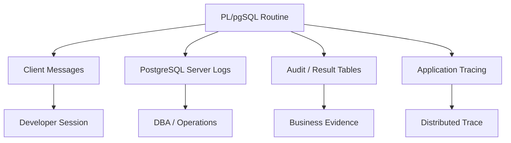
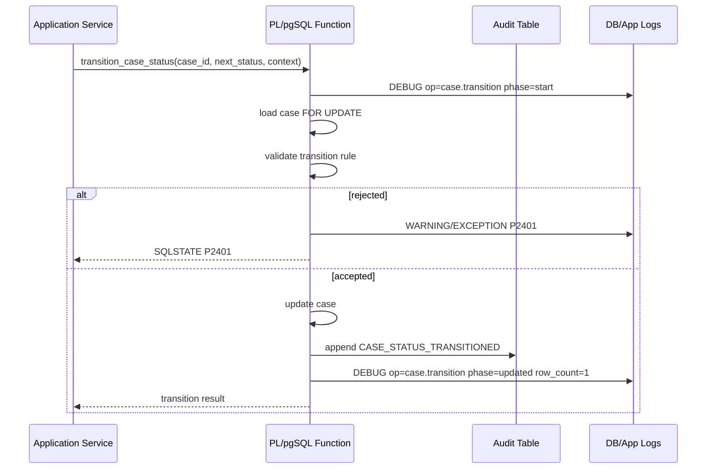

# Part 012 — Observability: RAISE, Logging, Context, and Debug Signals

> Target part ini: kamu bisa membuat PL/pgSQL routine yang **terlihat jelas saat berjalan di production** tanpa mengubah database menjadi mesin spam log, tanpa membocorkan data sensitif, dan tanpa membuat caller bergantung pada message string yang rapuh.

PL/pgSQL sering menjadi black box: application memanggil function, function menjalankan banyak SQL, lalu yang terlihat hanya “query lambat” atau “exception”. Ini tidak cukup untuk sistem produksi.

Observability di PL/pgSQL berarti kita bisa menjawab:

- operasi apa yang sedang dijalankan?
- input penting apa yang membentuk keputusan?
- branch mana yang dipilih?
- berapa row yang berubah?
- error apa yang terjadi?
- apakah failure itu domain failure, concurrency failure, atau bug?
- berapa lama tahap penting berjalan?
- bagaimana menghubungkan log database dengan request aplikasi?

Namun observability juga bisa merusak sistem jika asal-asalan:

- terlalu banyak `NOTICE` membuat client noisy;
- terlalu banyak log memperbesar biaya storage;
- message mengandung PII/token;
- log tidak punya correlation id;
- log tidak structured sehingga sulit dicari;
- debug signal menjadi dependency caller.

Part ini membahas desain sinyal, bukan hanya syntax `RAISE NOTICE`.

---

## 1. Mental Model: Observability Bukan Print Debug

`RAISE NOTICE 'here';` bukan observability. Itu print debug.

Observability yang baik punya struktur:

```txt
operation + phase + key identifiers + outcome + duration/row count + correlation id
```

Contoh buruk:

```sql
RAISE NOTICE 'start';
RAISE NOTICE 'done';
```

Contoh lebih berguna:

```sql
RAISE NOTICE 'op=case.transition phase=loaded case_id=% status=% version=% correlation_id=%',
    p_case_id,
    v_case.status,
    v_case.version,
    p_correlation_id;
```

Masih plain text, tetapi formatnya punya field stabil.

Production PL/pgSQL observability berada di persimpangan empat dunia:



Tidak semua sinyal cocok ke semua tempat.

---

## 2. RAISE Level: Pilih Level Berdasarkan Audience

PL/pgSQL `RAISE` mendukung beberapa level pesan. Pemilihan level menentukan siapa yang melihat pesan dan seberapa serius pesan itu.

| Level | Audience Utama | Fatal? | Cocok Untuk |
|---|---|---:|---|
| `DEBUG` | developer/DBA saat troubleshooting | no | detail branch, timing internal, temporary investigation |
| `LOG` | server log/operator | no | event operasional yang jarang dan penting |
| `INFO` | client | no | output administrative script |
| `NOTICE` | client secara default | no | progress atau result penting untuk manual operation |
| `WARNING` | client/log perhatian | no | degraded behavior, suspicious condition |
| `EXCEPTION` | caller + log/error path | yes | failure contract |

Aturan umum:

- Gunakan `DEBUG` untuk detail yang tidak boleh muncul normal.
- Gunakan `NOTICE` untuk manual/admin operation yang memang butuh progress.
- Gunakan `WARNING` untuk kondisi non-fatal tapi perlu perhatian.
- Gunakan `EXCEPTION` untuk contract failure.
- Hindari `LOG` dari business function high-volume.

---

## 3. Client Message vs Server Log

PostgreSQL punya konfigurasi yang menentukan level message apa yang dikirim ke client dan apa yang masuk server log.

Dua setting penting:

- `client_min_messages`: level minimum message yang dikirim ke client.
- `log_min_messages`: level minimum message yang masuk server log.

Implikasi:

- `RAISE NOTICE` bisa terlihat di psql/client, tetapi belum tentu masuk log tergantung konfigurasi.
- `RAISE DEBUG` biasanya tidak terlihat kecuali level diturunkan.
- `RAISE INFO` punya perilaku khusus ke client; jangan pakai sembarangan untuk high-volume routine.
- Jangan menganggap message yang terlihat di dev akan terlihat di production.

Karena itu, observability production tidak boleh hanya mengandalkan `NOTICE`.

Layer observability perlu dipilih:

| Kebutuhan | Media Lebih Cocok |
|---|---|
| Debug lokal | `RAISE DEBUG` / `NOTICE` |
| Manual migration progress | `RAISE NOTICE` atau `INFO` |
| Failure operational | exception + server log + app log |
| Business audit | audit table |
| Batch item result | result table |
| Distributed request trace | application trace/correlation id |

---

## 4. Structured Message Convention

PostgreSQL `RAISE` bukan JSON logger. Tetapi kita bisa membuat convention agar message mudah dicari.

Format yang direkomendasikan:

```txt
op=<operation> phase=<phase> key1=<value> key2=<value> outcome=<outcome> correlation_id=<id>
```

Contoh:

```sql
RAISE NOTICE
    'op=case.transition phase=validated case_id=% actor_id=% from_status=% to_status=% correlation_id=%',
    p_case_id,
    p_actor_id,
    v_case.status,
    p_next_status,
    p_correlation_id;
```

Gunakan key stabil:

| Key | Makna |
|---|---|
| `op` | nama operasi stabil, misalnya `case.transition` |
| `phase` | tahap operasi, misalnya `loaded`, `validated`, `updated` |
| `case_id` | identifier domain |
| `actor_id` | actor, jika aman |
| `batch_id` | batch/job identifier |
| `correlation_id` | request trace id dari caller |
| `row_count` | jumlah row terdampak |
| `duration_ms` | durasi tahap |
| `outcome` | `success`, `skipped`, `failed`, `noop` |

Hindari message natural-language panjang untuk event yang perlu dicari mesin.

Buruk:

```sql
RAISE NOTICE 'Case was updated successfully by the analyst after checking validation rules';
```

Lebih baik:

```sql
RAISE NOTICE
    'op=case.transition phase=updated outcome=success case_id=% actor_role=% row_count=% correlation_id=%',
    p_case_id,
    p_actor_role,
    v_rows,
    p_correlation_id;
```

---

## 5. Correlation ID: Jangan Debug Tanpa Jejak Request

PL/pgSQL function sering dipanggil dari service. Kalau log database tidak punya correlation id, kamu sulit menghubungkan:

- API request;
- application log;
- database log;
- audit row;
- failure table;
- job execution.

Cara paling eksplisit: pass `p_correlation_id` sebagai parameter.

```sql
CREATE OR REPLACE FUNCTION app.transition_case_status(
    p_case_id uuid,
    p_actor_id uuid,
    p_next_status text,
    p_expected_version bigint,
    p_correlation_id text
)
RETURNS app.case_transition_result
LANGUAGE plpgsql
AS $$
BEGIN
    RAISE DEBUG 'op=case.transition phase=start case_id=% correlation_id=%',
        p_case_id,
        p_correlation_id;

    -- logic
END;
$$;
```

Alternatif: gunakan session setting/custom GUC dari application connection.

Application sebelum memanggil function:

```sql
SELECT set_config('app.correlation_id', 'req-7f3b...', true);
```

PL/pgSQL:

```sql
v_correlation_id := current_setting('app.correlation_id', true);
```

Trade-off:

| Pendekatan | Pro | Kontra |
|---|---|---|
| Parameter eksplisit | jelas, typed, mudah test | signature lebih panjang |
| Custom setting | tidak mengotori signature | raw text, perlu connection hygiene |
| Application-only log | tidak perlu DB change | DB routine tetap black box |

Untuk public critical routine, parameter eksplisit sering lebih defensible. Untuk cross-cutting tracing, custom setting bisa berguna.

---

## 6. Operation Context Object

Untuk routine besar, jangan sebarkan parameter observability secara acak. Buat context kecil.

```sql
CREATE TYPE app.operation_context AS (
    actor_id uuid,
    actor_role text,
    correlation_id text,
    request_source text
);
```

Function:

```sql
CREATE OR REPLACE FUNCTION app.close_case(
    p_case_id uuid,
    p_reason text,
    p_context app.operation_context
)
RETURNS app.case_transition_result
LANGUAGE plpgsql
AS $$
BEGIN
    RAISE DEBUG 'op=case.close phase=start case_id=% actor_id=% correlation_id=%',
        p_case_id,
        p_context.actor_id,
        p_context.correlation_id;

    -- logic
END;
$$;
```

Keuntungan:

- signature tetap rapi;
- actor/correlation/request source konsisten;
- audit insertion lebih mudah;
- testing bisa membuat context fixture.

Risiko:

- composite context bisa menjadi “god parameter”;
- perubahan type bisa memengaruhi function dependencies;
- jangan masukkan data besar/sensitif.

---

## 7. Progress Messages untuk Manual Operation

Procedure maintenance atau migration helper kadang butuh progress output.

Contoh:

```sql
CREATE OR REPLACE PROCEDURE maintenance.rebuild_case_rollups(
    p_batch_size int DEFAULT 1000
)
LANGUAGE plpgsql
AS $$
DECLARE
    v_processed bigint := 0;
    v_batch_rows int;
BEGIN
    RAISE NOTICE 'op=rebuild_case_rollups phase=start batch_size=%', p_batch_size;

    LOOP
        WITH picked AS (
            SELECT id
            FROM enforcement_case
            WHERE rollup_dirty = true
            ORDER BY id
            LIMIT p_batch_size
            FOR UPDATE SKIP LOCKED
        ), updated AS (
            UPDATE enforcement_case c
            SET risk_score = app.calculate_case_risk(c.id),
                rollup_dirty = false,
                updated_at = clock_timestamp()
            FROM picked p
            WHERE c.id = p.id
            RETURNING c.id
        )
        SELECT count(*) INTO v_batch_rows
        FROM updated;

        v_processed := v_processed + v_batch_rows;

        RAISE NOTICE 'op=rebuild_case_rollups phase=batch outcome=processed row_count=% total_processed=%',
            v_batch_rows,
            v_processed;

        EXIT WHEN v_batch_rows = 0;

        COMMIT;
    END LOOP;

    RAISE NOTICE 'op=rebuild_case_rollups phase=finish outcome=success total_processed=%',
        v_processed;
END;
$$;
```

Catatan:

- Ini cocok untuk admin procedure yang dipanggil manual.
- Jangan menaruh `NOTICE` per row.
- Progress per batch lebih aman.
- Untuk high-volume job otomatis, result table/metrics lebih cocok daripada client notice.

---

## 8. Log Per Row Adalah Bom Waktu

Anti-pattern:

```sql
FOR v_case IN SELECT * FROM enforcement_case LOOP
    RAISE NOTICE 'processing case %', v_case.id;
    PERFORM app.recalculate_case_risk(v_case.id);
END LOOP;
```

Jika ada 10 juta row, kamu menghasilkan 10 juta message.

Lebih baik:

```sql
v_processed := v_processed + 1;

IF v_processed % 1000 = 0 THEN
    RAISE NOTICE 'op=case.recalculate phase=progress processed=%', v_processed;
END IF;
```

Lebih baik lagi: batch update + result table.

Rule:

- Jangan log per row kecuali row count sangat kecil dan operation manual.
- Log per batch.
- Log anomaly, bukan normal item.
- Gunakan counters.

---

## 9. Capturing Row Count sebagai Sinyal Observability

`GET DIAGNOSTICS v_rows = ROW_COUNT` adalah primitive observability penting.

Contoh:

```sql
UPDATE enforcement_case c
SET status = 'ESCALATED'
WHERE c.severity = 'CRITICAL'
  AND c.status = 'OPEN';

GET DIAGNOSTICS v_rows = ROW_COUNT;

RAISE NOTICE 'op=case.bulk_escalate phase=updated row_count=%', v_rows;
```

Row count membantu menjawab:

- mutation benar-benar terjadi?
- batch unexpectedly besar/kecil?
- filter terlalu luas?
- migration menyentuh jumlah row yang diharapkan?

Untuk operation risk tinggi, validasi row count:

```sql
IF v_rows > p_max_allowed_rows THEN
    RAISE EXCEPTION USING
        ERRCODE = 'P5001',
        MESSAGE = 'bulk operation exceeded row-count guardrail',
        DETAIL  = format('row_count=%s, max_allowed_rows=%s', v_rows, p_max_allowed_rows),
        HINT    = 'Refine the filter or increase guardrail intentionally.';
END IF;
```

Ini observability sekaligus safety.

---

## 10. Timing Internal: Gunakan Secukupnya

PL/pgSQL tidak menggantikan profiler. Tetapi untuk procedure maintenance, timing manual bisa membantu.

```sql
DECLARE
    v_started_at timestamptz;
    v_duration_ms numeric;
BEGIN
    v_started_at := clock_timestamp();

    PERFORM app.recalculate_case_risk(p_case_id);

    v_duration_ms := extract(epoch FROM (clock_timestamp() - v_started_at)) * 1000;

    RAISE DEBUG 'op=case.risk phase=recalculate duration_ms=% case_id=%',
        round(v_duration_ms, 2),
        p_case_id;
END;
```

Gunakan `clock_timestamp()` untuk mengukur waktu berjalan aktual, bukan `now()` yang stabil dalam transaksi.

Jangan menambahkan timing di setiap function kecil secara permanen. Pilih:

- operation lambat;
- maintenance procedure;
- batch phase;
- temporary investigation;
- suspicious branch.

---

## 11. Debug Flag dalam Function: Gunakan Hati-Hati

Kadang function butuh debug output opsional.

```sql
CREATE OR REPLACE FUNCTION app.recalculate_case_risk(
    p_case_id uuid,
    p_debug boolean DEFAULT false
)
RETURNS numeric
LANGUAGE plpgsql
AS $$
DECLARE
    v_score numeric;
BEGIN
    IF p_debug THEN
        RAISE NOTICE 'op=case.risk phase=start case_id=%', p_case_id;
    END IF;

    -- calculation

    IF p_debug THEN
        RAISE NOTICE 'op=case.risk phase=finish case_id=% score=%', p_case_id, v_score;
    END IF;

    RETURN v_score;
END;
$$;
```

Kapan masuk akal:

- admin/debug helper;
- function dipanggil manual;
- migration script;
- troubleshooting terkontrol.

Kapan buruk:

- public API hot path;
- function yang dipanggil ribuan kali per request;
- caller mulai bergantung pada notice;
- debug output mengandung data sensitif.

Alternatif lebih rapi: gunakan `RAISE DEBUG` dan atur `client_min_messages` di session troubleshooting.

---

## 12. Session-Level Debugging

Untuk investigasi, kamu bisa menaikkan visibilitas debug di session.

```sql
SET client_min_messages = DEBUG1;
```

Lalu function dengan `RAISE DEBUG` akan terlihat di client session sesuai konfigurasi.

Contoh:

```sql
RAISE DEBUG 'op=case.transition phase=rule_lookup from_status=% to_status=% actor_role=%',
    v_case.status,
    p_next_status,
    p_actor_role;
```

Keuntungan:

- tidak perlu parameter `p_debug`;
- debug tetap diam secara normal;
- caller biasa tidak noisy.

Risiko:

- tetap mengirim message jika session dikonfigurasi;
- jangan taruh sensitive data;
- connection pool harus mengembalikan setting ke default.

Dalam application pool, gunakan `SET LOCAL` di transaksi jika memungkinkan, bukan `SET` global session yang bocor ke request berikutnya.

---

## 13. Diagnostic Context pada Exception

Saat error terjadi, PostgreSQL menyediakan context stack. Di PL/pgSQL handler, kamu bisa membaca `PG_EXCEPTION_CONTEXT`.

```sql
EXCEPTION WHEN others THEN
    GET STACKED DIAGNOSTICS
        v_state = RETURNED_SQLSTATE,
        v_message = MESSAGE_TEXT,
        v_context = PG_EXCEPTION_CONTEXT;

    RAISE WARNING 'op=case.transition phase=failed sqlstate=% message=% context=% correlation_id=%',
        v_state,
        v_message,
        v_context,
        p_correlation_id;

    RAISE;
```

Gunakan context untuk:

- debugging function stack;
- locating line/function failing;
- support incident review.

Jangan selalu menyimpan context besar ke business audit table. Bisa panjang dan noisy.

---

## 14. `RAISE ... USING` untuk Message Kaya

Selain `MESSAGE`, `RAISE` bisa memakai `DETAIL`, `HINT`, dan metadata lain.

```sql
RAISE EXCEPTION USING
    ERRCODE = 'P2401',
    MESSAGE = 'case transition rejected',
    DETAIL  = format(
        'case_id=%s, from_status=%s, to_status=%s, actor_role=%s, correlation_id=%s',
        p_case_id,
        v_case.status,
        p_next_status,
        p_actor_role,
        p_correlation_id
    ),
    HINT    = 'Check case_status_transition_rule for allowed transitions.';
```

Guideline:

| Field | Isi Yang Cocok |
|---|---|
| `MESSAGE` | stable summary, manusia-readable |
| `DETAIL` | identifiers, actual values, compact context |
| `HINT` | next action atau remediation |
| `ERRCODE` | machine-readable classification |

Jangan masukkan seluruh payload JSON ke `DETAIL` kecuali benar-benar aman dan kecil.

---

## 15. Audit Table Bukan Log Table

Audit dan log sering tertukar.

| Aspek | Log | Audit |
|---|---|---|
| Audience | engineer/operator | business/compliance/security |
| Format | diagnostic | evidentiary |
| Retention | operasional | regulasi/kebijakan |
| Volume | bisa tinggi | harus terkendali |
| Isi | technical details | who/what/when/why |
| Mutability | tergantung log backend | biasanya append-only |

Jangan menyimpan stack trace ke audit event. Jangan menjadikan `RAISE NOTICE` sebagai audit.

Contoh audit event:

```sql
CREATE TABLE case_audit_event (
    audit_id bigserial PRIMARY KEY,
    case_id uuid NOT NULL,
    event_type text NOT NULL,
    actor_id uuid,
    actor_role text,
    reason text,
    before_state jsonb,
    after_state jsonb,
    correlation_id text,
    occurred_at timestamptz NOT NULL DEFAULT clock_timestamp()
);
```

Function fragment:

```sql
INSERT INTO case_audit_event(
    case_id,
    event_type,
    actor_id,
    actor_role,
    reason,
    before_state,
    after_state,
    correlation_id
) VALUES (
    p_case_id,
    'CASE_STATUS_TRANSITIONED',
    p_context.actor_id,
    p_context.actor_role,
    p_reason,
    jsonb_build_object('status', v_old_status, 'version', v_old_version),
    jsonb_build_object('status', p_next_status, 'version', v_new_version),
    p_context.correlation_id
);
```

Audit adalah domain artifact. Log adalah diagnostic artifact.

---

## 16. Result Table untuk Batch Observability

Untuk batch, notice/log saja tidak cukup. Buat table hasil.

```sql
CREATE TABLE maintenance_job_run (
    job_run_id uuid PRIMARY KEY,
    job_name text NOT NULL,
    status text NOT NULL,
    started_at timestamptz NOT NULL DEFAULT clock_timestamp(),
    finished_at timestamptz,
    total_processed bigint NOT NULL DEFAULT 0,
    total_failed bigint NOT NULL DEFAULT 0,
    correlation_id text
);

CREATE TABLE maintenance_job_item_result (
    job_run_id uuid NOT NULL REFERENCES maintenance_job_run(job_run_id),
    item_id uuid NOT NULL,
    status text NOT NULL,
    sqlstate text,
    message text,
    processed_at timestamptz NOT NULL DEFAULT clock_timestamp(),
    PRIMARY KEY (job_run_id, item_id)
);
```

Manfaat:

- bisa resume;
- bisa reprocess failed item;
- bisa report progress;
- tidak bergantung pada log retention;
- cocok untuk runbook.

`RAISE NOTICE` tetap bisa dipakai untuk progress ringkas, tetapi source of truth batch adalah result table.

---

## 17. Observability untuk State Machine

State transition harus mudah ditelusuri.

Sinyal minimum:

- case id;
- actor id/role;
- from status;
- to status;
- rule id atau policy source;
- reason;
- expected version;
- actual/new version;
- correlation id;
- outcome.

Diagram lifecycle sinyal:



Untuk compliance/regulatory workflow, audit event lebih penting daripada debug log. Tetapi debug log membantu saat incident.

---

## 18. Guardrail Logging untuk Bulk Mutation

Bulk mutation berisiko. Observability harus menjadi guardrail.

```sql
CREATE OR REPLACE FUNCTION app.bulk_close_stale_cases(
    p_cutoff timestamptz,
    p_max_allowed_rows bigint,
    p_correlation_id text
)
RETURNS bigint
LANGUAGE plpgsql
AS $$
DECLARE
    v_candidate_count bigint;
    v_updated_count bigint;
BEGIN
    SELECT count(*)
    INTO v_candidate_count
    FROM enforcement_case c
    WHERE c.status = 'OPEN'
      AND c.updated_at < p_cutoff;

    RAISE NOTICE 'op=case.bulk_close_stale phase=precheck candidate_count=% cutoff=% correlation_id=%',
        v_candidate_count,
        p_cutoff,
        p_correlation_id;

    IF v_candidate_count > p_max_allowed_rows THEN
        RAISE EXCEPTION USING
            ERRCODE = 'P5001',
            MESSAGE = 'bulk close stale cases exceeded row-count guardrail',
            DETAIL  = format(
                'candidate_count=%s, max_allowed_rows=%s, cutoff=%s, correlation_id=%s',
                v_candidate_count,
                p_max_allowed_rows,
                p_cutoff,
                p_correlation_id
            ),
            HINT = 'Use a narrower cutoff or intentionally raise max_allowed_rows.';
    END IF;

    UPDATE enforcement_case c
    SET status = 'CLOSED',
        updated_at = clock_timestamp()
    WHERE c.status = 'OPEN'
      AND c.updated_at < p_cutoff;

    GET DIAGNOSTICS v_updated_count = ROW_COUNT;

    RAISE NOTICE 'op=case.bulk_close_stale phase=updated outcome=success row_count=% correlation_id=%',
        v_updated_count,
        p_correlation_id;

    RETURN v_updated_count;
END;
$$;
```

Pattern:

1. pre-count;
2. log candidate count;
3. enforce guardrail;
4. mutate;
5. capture row count;
6. log outcome;
7. return row count.

Ini jauh lebih aman daripada blind update.

---

## 19. Debugging Dynamic SQL

Dynamic SQL (`EXECUTE`) lebih sulit diamati karena query dibangun runtime.

Jangan langsung log full SQL jika mengandung literal sensitif. Prefer log template dan parameter ringkas.

Buruk:

```sql
RAISE NOTICE 'sql=%', v_sql;
EXECUTE v_sql;
```

Lebih baik:

```sql
RAISE DEBUG 'op=partition.maintenance phase=execute target_table=% action=% correlation_id=%',
    v_target_table,
    'detach_old_partition',
    p_correlation_id;

EXECUTE v_sql;
```

Jika perlu log SQL untuk migration manual:

```sql
IF p_debug THEN
    RAISE NOTICE 'op=migration phase=dynamic_sql sql=%', v_sql;
END IF;
```

Tetapi pastikan:

- SQL tidak mengandung secret;
- bukan high-volume path;
- debug flag default false;
- output tidak menjadi contract.

---

## 20. Observability dan Security Definer

`SECURITY DEFINER` function punya risiko observability khusus. Message bisa membocorkan informasi yang caller biasa tidak boleh tahu.

Buruk:

```sql
RAISE EXCEPTION 'account % belongs to tenant %, caller tenant %',
    p_account_id,
    v_account_tenant_id,
    p_caller_tenant_id;
```

Lebih aman:

```sql
RAISE EXCEPTION USING
    ERRCODE = 'P3001',
    MESSAGE = 'access denied for requested account',
    DETAIL  = format('account_id=%s, correlation_id=%s', p_account_id, p_correlation_id),
    HINT    = 'Verify caller tenant and account visibility policy.';
```

Internal details bisa masuk server log jika aman dan hanya terlihat operator, tetapi jangan asumsikan semua log aman. Banyak organisasi mengirim log ke platform bersama.

Rule:

- treat logs as semi-sensitive;
- never log credentials/tokens;
- avoid cross-tenant details;
- avoid full PII unless required and approved;
- include correlation id for secure investigation.

---

## 21. Observability untuk Policy Decision

Policy function sering menjadi sumber “kenapa user ditolak?”. Jangan hanya return boolean.

Buruk:

```sql
RETURN false;
```

Lebih baik untuk internal policy evaluation:

```sql
CREATE TYPE app.policy_decision AS (
    allowed boolean,
    reason_code text,
    reason_detail text
);
```

Function:

```sql
CREATE OR REPLACE FUNCTION app.can_transition_case(
    p_case_id uuid,
    p_actor_id uuid,
    p_next_status text
)
RETURNS app.policy_decision
LANGUAGE plpgsql
AS $$
DECLARE
    v_decision app.policy_decision;
BEGIN
    -- simplified
    IF NOT EXISTS (
        SELECT 1
        FROM case_actor_permission p
        WHERE p.case_id = p_case_id
          AND p.actor_id = p_actor_id
          AND p.permission = 'TRANSITION_CASE'
    ) THEN
        v_decision := (false, 'MISSING_TRANSITION_PERMISSION', 'actor lacks TRANSITION_CASE permission');
        RETURN v_decision;
    END IF;

    v_decision := (true, 'ALLOWED', NULL);
    RETURN v_decision;
END;
$$;
```

Caller transition function:

```sql
v_policy := app.can_transition_case(p_case_id, p_actor_id, p_next_status);

IF NOT v_policy.allowed THEN
    RAISE EXCEPTION USING
        ERRCODE = 'P3001',
        MESSAGE = 'case transition denied by policy',
        DETAIL  = format(
            'case_id=%s, actor_id=%s, reason_code=%s, correlation_id=%s',
            p_case_id,
            p_actor_id,
            v_policy.reason_code,
            p_correlation_id
        );
END IF;
```

Ini membuat policy denial bisa dianalisis tanpa membuka semua detail ke caller.

---

## 22. Local Debug Table: Kapan Boleh?

Kadang engineer membuat table debug sementara. Ini bisa berguna, tapi sering menjadi utang.

Contoh aman untuk session/local investigation:

```sql
CREATE TEMP TABLE debug_case_transition (
    seq bigserial,
    phase text,
    payload jsonb,
    created_at timestamptz DEFAULT clock_timestamp()
) ON COMMIT DROP;
```

Dalam function? Function tidak selalu bisa mengandalkan temp table ada. Kalau mau optional:

```sql
BEGIN
    INSERT INTO debug_case_transition(phase, payload)
    VALUES ('loaded_case', jsonb_build_object('case_id', p_case_id, 'status', v_case.status));
EXCEPTION WHEN undefined_table THEN
    -- debug table not enabled for this session; ignore narrowly
END;
```

Ini hanya untuk dev/troubleshooting, bukan production pattern umum.

Risiko:

- overhead;
- handler noise;
- dependency implisit;
- data sensitif;
- lupa dihapus.

Untuk production, gunakan audit/result table yang disengaja.

---

## 23. Observability dengan `application_name`

Application bisa mengatur `application_name` pada connection. Ini akan muncul di banyak log/monitoring PostgreSQL.

Contoh dari application/session:

```sql
SET application_name = 'case-service transition-worker';
```

Ini bukan pengganti correlation id, tapi membantu membedakan caller.

Kombinasi ideal:

```txt
application_name = service/component
correlation_id   = request/job id
operation        = domain operation
phase            = routine phase
```

PL/pgSQL bisa membaca:

```sql
v_application_name := current_setting('application_name', true);
```

Gunakan untuk diagnostic, bukan authorization.

---

## 24. What Not To Log

Daftar ini harus keras.

Jangan log:

- password;
- session token;
- API key;
- OAuth/JWT raw token;
- full Authorization header;
- raw payment instrument;
- full identity document;
- full personal address jika tidak perlu;
- full case narrative sensitif;
- raw evidence document;
- huge JSON payload;
- cross-tenant secret;
- dynamic SQL dengan literal sensitif.

Prefer:

- id internal;
- hash payload;
- count;
- enum/status;
- reason code;
- correlation id;
- constraint name;
- SQLSTATE;
- bounded message.

Contoh hash payload:

```sql
v_payload_hash := encode(digest(p_payload::text, 'sha256'), 'hex');
```

Catatan: `digest` membutuhkan extension `pgcrypto`. Jangan gunakan extension tanpa keputusan platform.

---

## 25. Observability Failure Modes

### 25.1 Message Terlalu Natural-Language

```sql
RAISE NOTICE 'The user does not have permission to close the case because their role is analyst';
```

Sulit dicari dan tidak stabil.

Lebih baik:

```sql
RAISE NOTICE 'op=case.close phase=policy outcome=denied reason_code=% actor_role=% case_id=%',
    'ROLE_NOT_ALLOWED',
    p_actor_role,
    p_case_id;
```

### 25.2 No Correlation ID

```sql
RAISE WARNING 'case transition failed';
```

Tidak bisa dihubungkan ke request.

Lebih baik:

```sql
RAISE WARNING 'op=case.transition outcome=failed case_id=% correlation_id=%',
    p_case_id,
    p_correlation_id;
```

### 25.3 Log Per Row

Sudah dibahas: ini membunuh log pipeline.

### 25.4 Swallow Error Setelah Logging

```sql
EXCEPTION WHEN others THEN
    RAISE WARNING 'failed';
    RETURN;
```

Logging bukan recovery.

### 25.5 Audit via Notice

```sql
RAISE NOTICE 'case closed by %', p_actor_id;
```

Notice bukan audit. Gunakan audit table.

### 25.6 Sensitive Detail di Error

```sql
RAISE EXCEPTION 'payload=%', p_payload;
```

Jangan.

---

## 26. Runbook-Oriented Function Output

Untuk procedure operational, return/record output harus mendukung runbook.

```sql
CREATE TYPE maintenance.rebuild_result AS (
    job_run_id uuid,
    total_processed bigint,
    total_failed bigint,
    started_at timestamptz,
    finished_at timestamptz
);
```

Function/procedure dapat mengisi result table dan mengembalikan summary.

```sql
CREATE OR REPLACE FUNCTION maintenance.get_job_run_summary(
    p_job_run_id uuid
)
RETURNS maintenance.rebuild_result
LANGUAGE sql
AS $$
    SELECT
        r.job_run_id,
        r.total_processed,
        r.total_failed,
        r.started_at,
        r.finished_at
    FROM maintenance_job_run r
    WHERE r.job_run_id = p_job_run_id;
$$;
```

Runbook harus bisa berkata:

1. panggil job;
2. ambil job_run_id;
3. cek summary;
4. cek failed items;
5. re-run failed items;
6. escalate jika SQLSTATE tertentu dominan.

Observability bukan hanya log. Ia adalah desain operasi.

---

## 27. Integrasi dengan `pg_stat_activity`

Untuk operasi panjang, `pg_stat_activity` dapat membantu melihat query aktif. Tetapi jika semua dipanggil sebagai `SELECT app.big_function(...)`, detail internal tidak selalu terlihat.

Karena itu, buat phase-level notice/result table untuk job panjang.

Application/session juga dapat mengatur `application_name` dan correlation id agar operator bisa mengidentifikasi session.

Contoh administrative call:

```sql
SET application_name = 'maintenance:rebuild-case-rollups';
SELECT set_config('app.correlation_id', 'job-20260703-001', true);
CALL maintenance.rebuild_case_rollups(1000);
```

Dalam procedure:

```sql
v_correlation_id := current_setting('app.correlation_id', true);

RAISE NOTICE 'op=rebuild_case_rollups phase=start correlation_id=%', v_correlation_id;
```

---

## 28. Observability untuk Dynamic Maintenance

Metadata-driven maintenance sering memakai dynamic SQL dan catalog introspection.

Pattern:

```sql
RAISE NOTICE 'op=partition.maintenance phase=planned action=% target=% cutoff=% correlation_id=%',
    v_action,
    v_partition_name,
    p_cutoff,
    p_correlation_id;

IF p_dry_run THEN
    RETURN NEXT v_plan_row;
ELSE
    EXECUTE v_sql;
    GET DIAGNOSTICS v_rows = ROW_COUNT;

    RAISE NOTICE 'op=partition.maintenance phase=executed action=% target=% row_count=% correlation_id=%',
        v_action,
        v_partition_name,
        v_rows,
        p_correlation_id;
END IF;
```

Dry-run adalah observability feature.

Untuk operation berisiko, sediakan:

- dry-run mode;
- planned action output;
- max affected objects guardrail;
- post-action summary;
- correlation id.

---

## 29. Production Logging Policy

Sebuah tim harus punya policy sederhana.

Contoh policy:

| Routine Type | Default Signal | Notes |
|---|---|---|
| Hot-path API function | no `NOTICE`, only structured exception | avoid client noise |
| Critical domain mutation | audit event + structured exception | include correlation id |
| Batch job | job_run table + batch `NOTICE` | no per-row notice |
| Maintenance procedure | `NOTICE` progress + result summary | manual/operator friendly |
| Debug helper | `RAISE DEBUG`/optional `p_debug` | not for general API |
| Security definer | minimal detail, no sensitive internals | harden search path too |

Policy ini mencegah setiap engineer membuat gaya logging sendiri.

---

## 30. Testing Observability

Observability juga perlu dites, tetapi jangan overfit pada exact message panjang.

Yang perlu dites:

- audit row tercipta;
- result table berisi status benar;
- SQLSTATE benar;
- failure detail tidak null untuk diagnostic penting;
- sensitive field tidak masuk audit/log table;
- row-count guardrail bekerja;
- debug flag tidak mengubah behavior.

Contoh test audit:

```sql
SELECT app.transition_case_status(
    p_case_id := '00000000-0000-0000-0000-000000000001'::uuid,
    p_actor_id := '00000000-0000-0000-0000-000000000002'::uuid,
    p_next_status := 'CLOSED',
    p_expected_version := 1,
    p_correlation_id := 'test-correlation-001'
);

SELECT count(*) = 1 AS audit_written
FROM case_audit_event e
WHERE e.case_id = '00000000-0000-0000-0000-000000000001'::uuid
  AND e.event_type = 'CASE_STATUS_TRANSITIONED'
  AND e.correlation_id = 'test-correlation-001';
```

Jangan membuat test rapuh yang membandingkan seluruh `NOTICE` text kecuali message memang contract. Biasanya SQLSTATE, audit row, dan result row lebih penting.

---

## 31. Example: Observable Case Transition Function

Berikut contoh ringkas yang menggabungkan beberapa konsep.

```sql
CREATE OR REPLACE FUNCTION app.transition_case_status_observable(
    p_case_id uuid,
    p_actor_id uuid,
    p_actor_role text,
    p_next_status text,
    p_reason text,
    p_expected_version bigint,
    p_correlation_id text
)
RETURNS TABLE (
    case_id uuid,
    previous_status text,
    new_status text,
    new_version bigint
)
LANGUAGE plpgsql
AS $$
DECLARE
    v_case enforcement_case%ROWTYPE;
    v_rule case_status_transition_rule%ROWTYPE;
    v_started_at timestamptz := clock_timestamp();
    v_duration_ms numeric;
BEGIN
    RAISE DEBUG 'op=case.transition phase=start case_id=% actor_id=% actor_role=% to_status=% correlation_id=%',
        p_case_id,
        p_actor_id,
        p_actor_role,
        p_next_status,
        p_correlation_id;

    SELECT *
    INTO v_case
    FROM enforcement_case c
    WHERE c.id = p_case_id
    FOR UPDATE;

    IF NOT FOUND THEN
        RAISE EXCEPTION USING
            ERRCODE = 'P2001',
            MESSAGE = 'case not found',
            DETAIL  = format('case_id=%s, correlation_id=%s', p_case_id, p_correlation_id);
    END IF;

    RAISE DEBUG 'op=case.transition phase=loaded case_id=% status=% version=% correlation_id=%',
        p_case_id,
        v_case.status,
        v_case.version,
        p_correlation_id;

    IF v_case.version <> p_expected_version THEN
        RAISE EXCEPTION USING
            ERRCODE = 'P2402',
            MESSAGE = 'case transition rejected because version is stale',
            DETAIL  = format(
                'case_id=%s expected_version=%s actual_version=%s correlation_id=%s',
                p_case_id,
                p_expected_version,
                v_case.version,
                p_correlation_id
            ),
            HINT = 'Reload the case and retry with the current version.';
    END IF;

    SELECT *
    INTO v_rule
    FROM case_status_transition_rule r
    WHERE r.from_status = v_case.status
      AND r.to_status = p_next_status
      AND r.actor_role = p_actor_role;

    IF NOT FOUND THEN
        RAISE EXCEPTION USING
            ERRCODE = 'P2401',
            MESSAGE = 'case transition rejected',
            DETAIL  = format(
                'case_id=%s from_status=%s to_status=%s actor_role=%s correlation_id=%s',
                p_case_id,
                v_case.status,
                p_next_status,
                p_actor_role,
                p_correlation_id
            ),
            HINT = 'Check case_status_transition_rule for allowed transitions.';
    END IF;

    IF v_rule.requires_reason AND nullif(trim(p_reason), '') IS NULL THEN
        RAISE EXCEPTION USING
            ERRCODE = 'P1004',
            MESSAGE = 'case transition reason is required',
            DETAIL  = format('case_id=%s correlation_id=%s', p_case_id, p_correlation_id);
    END IF;

    UPDATE enforcement_case c
    SET status = p_next_status,
        version = c.version + 1,
        updated_at = clock_timestamp()
    WHERE c.id = p_case_id
    RETURNING c.id, v_case.status, c.status, c.version
    INTO case_id, previous_status, new_status, new_version;

    INSERT INTO case_audit_event(
        case_id,
        event_type,
        actor_id,
        actor_role,
        reason,
        before_state,
        after_state,
        correlation_id
    ) VALUES (
        p_case_id,
        'CASE_STATUS_TRANSITIONED',
        p_actor_id,
        p_actor_role,
        p_reason,
        jsonb_build_object('status', previous_status, 'version', v_case.version),
        jsonb_build_object('status', new_status, 'version', new_version),
        p_correlation_id
    );

    v_duration_ms := extract(epoch FROM (clock_timestamp() - v_started_at)) * 1000;

    RAISE DEBUG 'op=case.transition phase=finish outcome=success case_id=% from_status=% to_status=% new_version=% duration_ms=% correlation_id=%',
        p_case_id,
        previous_status,
        new_status,
        new_version,
        round(v_duration_ms, 2),
        p_correlation_id;

    RETURN NEXT;
EXCEPTION WHEN others THEN
    -- Do not swallow. Add bounded diagnostic and preserve original error.
    GET STACKED DIAGNOSTICS
        previous_status = MESSAGE_TEXT;

    RAISE;
END;
$$;
```

Catatan: bagian `EXCEPTION` di atas sengaja tidak melakukan logging tambahan karena contoh lengkapnya akan membutuhkan variabel diagnostic yang benar-benar terpisah. Di production, jangan menyalahgunakan output column sebagai variable diagnostic. Ini contoh pengingat bahwa observability tidak boleh mengorbankan clarity variable.

Versi handler yang lebih bersih:

```sql
DECLARE
    v_error_state text;
    v_error_message text;
    v_error_context text;
BEGIN
    -- body
EXCEPTION WHEN others THEN
    GET STACKED DIAGNOSTICS
        v_error_state = RETURNED_SQLSTATE,
        v_error_message = MESSAGE_TEXT,
        v_error_context = PG_EXCEPTION_CONTEXT;

    RAISE WARNING 'op=case.transition phase=failed sqlstate=% message=% correlation_id=%',
        v_error_state,
        left(v_error_message, 500),
        p_correlation_id;

    RAISE;
END;
```

Namun untuk hot path, bahkan warning-on-every-error bisa noisy. Banyak sistem lebih baik membiarkan application log menangkap SQLSTATE dan correlation id.

---

## 32. Review Checklist: Observability

### Signal Design

- [ ] Apakah routine punya `op` name stabil?
- [ ] Apakah phase penting terlihat?
- [ ] Apakah correlation id tersedia?
- [ ] Apakah row count dicatat untuk mutation penting?
- [ ] Apakah duration dicatat untuk phase mahal bila perlu?

### Noise Control

- [ ] Tidak ada `NOTICE` per row?
- [ ] Tidak ada debug output default di hot path?
- [ ] Batch memakai progress per batch, bukan per item?
- [ ] Warning hanya untuk kondisi yang benar-benar butuh perhatian?

### Safety

- [ ] Tidak ada token/password/secret di message?
- [ ] Tidak ada full payload sensitif?
- [ ] Security definer tidak membocorkan cross-tenant detail?
- [ ] Dynamic SQL tidak dilog dengan literal sensitif?

### Operational Usefulness

- [ ] Manual operation punya progress dan summary?
- [ ] Batch punya job/result table?
- [ ] Audit event dipisahkan dari diagnostic log?
- [ ] Failure bisa diagregasi by SQLSTATE/reason code?

### Maintainability

- [ ] Message format konsisten?
- [ ] Key name stabil?
- [ ] Debug flag tidak mengubah behavior bisnis?
- [ ] Observability code tidak mendominasi business logic?

---

## 33. Closing Mental Model

PL/pgSQL observability yang baik bukan berarti function berbicara terus-menerus. Ia berarti function berbicara **pada saat yang tepat**, **kepada audience yang tepat**, dengan **field yang tepat**, dan **tanpa membocorkan hal yang salah**.

Pegang model ini:

```txt
RAISE DEBUG   = temporary/internal diagnostic
RAISE NOTICE  = manual/admin progress
RAISE WARNING = suspicious non-fatal condition
RAISE EXCEPTION + SQLSTATE = failure contract
Audit table   = business evidence
Result table  = batch/job source of truth
App trace     = distributed request context
```

Sinyal yang buruk membuat incident makin gelap. Sinyal yang terlalu banyak membuat incident tenggelam. Sinyal yang tepat membuat database-side code bisa dioperasikan, diuji, dan dipertanggungjawabkan.

---

## Next Part

Part berikutnya membahas assertions, contracts, dan runtime guardrails: kapan memakai `ASSERT`, kapan memakai explicit exception, kapan memakai constraint, dan bagaimana membangun invariant yang tidak rapuh.
