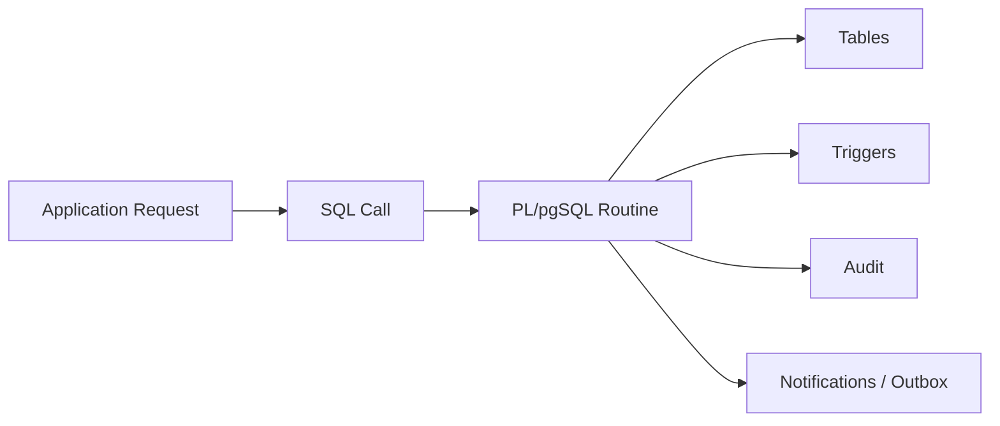
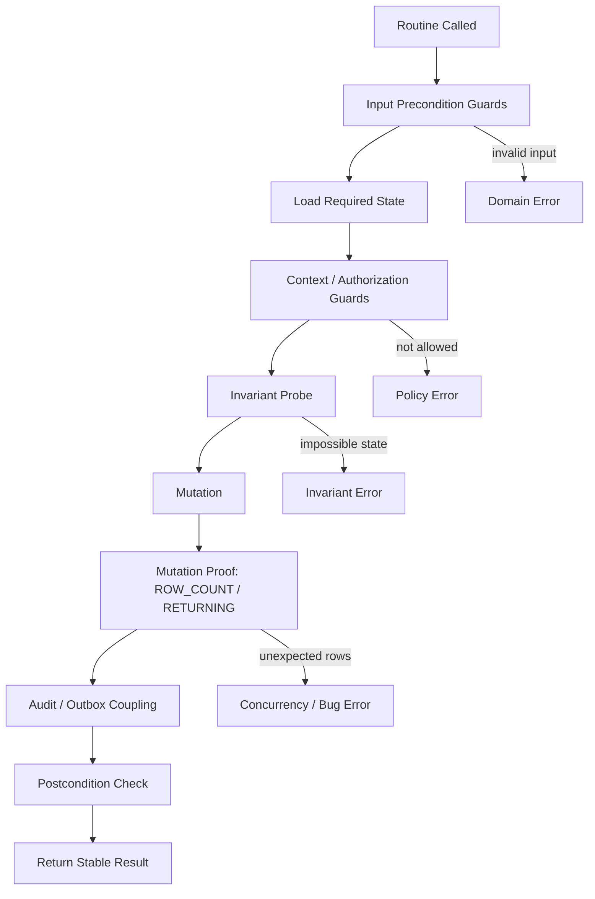

# Part 013 — Assertions, Contracts, and Runtime Guardrails

> Target part ini: kamu bisa menulis PL/pgSQL routine yang punya **kontrak eksplisit**: apa yang wajib benar sebelum routine berjalan, apa yang dijamin setelah routine selesai, invariant apa yang tidak boleh rusak, dan guardrail apa yang menghentikan routine sebelum membuat kerusakan data.

Di PL/pgSQL, bug yang paling mahal jarang berupa syntax error. Bug yang mahal biasanya seperti ini:

- function berhasil dieksekusi tetapi menulis status yang salah;
- procedure batch berjalan terlalu luas karena filter salah;
- trigger membuat perubahan tambahan yang tidak terlihat caller;
- dynamic policy function mengizinkan transisi yang seharusnya ditolak;
- `UPDATE` dianggap mengubah satu row, padahal nol atau banyak row;
- data audit sukses ditulis, tetapi perubahan utama gagal;
- retry membuat side effect ganda;
- developer masa depan mengubah schema lalu routine tetap compile tetapi semantics berubah.

Karena itu PL/pgSQL production-grade butuh kontrak runtime.

Kontrak runtime bukan sekadar `ASSERT`. Kontrak runtime adalah desain yang menjawab:

```txt
Apa yang routine terima?
Apa yang routine percayai?
Apa yang routine validasi?
Apa yang routine ubah?
Apa yang routine jamin?
Apa yang routine tolak?
Apa yang routine laporkan saat gagal?
```

Part ini membahas `ASSERT`, `RAISE`, guard clauses, invariant checks, mutation proof, row-count guard, feature guard, blast-radius limit, dan review checklist.

---

## 1. Mental Model: Contract Is Executable Architecture

Arsitektur yang hanya hidup di diagram cepat busuk. Kontrak yang hidup di kode lebih tahan lama.

Di PL/pgSQL, kontrak harus ditempatkan sedekat mungkin dengan data karena routine sering berada di jalur kritis:



Jika kontrak hanya ada di application layer, masih ada jalur lain yang bisa melewati kontrak:

- ad-hoc SQL admin;
- migration script;
- batch job;
- database procedure;
- trigger side effect;
- integration service berbeda;
- manual remediation.

PL/pgSQL sering menjadi boundary terakhir sebelum data berubah. Karena itu routine harus punya pertahanan sendiri.

---

## 2. Tiga Jenis Kebenaran yang Harus Dipisah

Jangan mencampur semua validasi menjadi satu `IF ... THEN RAISE`.

Pisahkan tiga jenis kebenaran:

| Jenis | Pertanyaan | Failure Berarti | Mekanisme Umum |
|---|---|---|---|
| Precondition | Apakah input/caller/context valid? | Caller salah atau request tidak boleh diproses | `IF` + `RAISE EXCEPTION` |
| Invariant | Apakah asumsi internal sistem tetap benar? | Bug kode, schema drift, corruption, race | `ASSERT`, `RAISE`, constraint |
| Postcondition | Apakah hasil mutasi sesuai janji? | Bug, race, unexpected data shape | `GET DIAGNOSTICS`, `RETURNING`, `ASSERT`, `RAISE` |

Contoh perbedaan:

```sql
-- Precondition: caller memberikan input invalid.
IF p_case_id IS NULL THEN
    RAISE EXCEPTION 'case_id is required'
        USING ERRCODE = 'P2201',
              HINT = 'Pass a non-null case id.';
END IF;

-- Invariant: sistem internal tidak boleh punya active case duplicate.
ASSERT NOT EXISTS (
    SELECT 1
    FROM enforcement_case c
    WHERE c.subject_id = v_case.subject_id
      AND c.status IN ('OPEN', 'UNDER_REVIEW')
      AND c.case_id <> v_case.case_id
), 'invariant violated: duplicate active case for subject';

-- Postcondition: update harus mengenai tepat satu row.
GET DIAGNOSTICS v_rows = ROW_COUNT;
IF v_rows <> 1 THEN
    RAISE EXCEPTION 'expected exactly one case row to be updated, got %', v_rows
        USING ERRCODE = 'P2202';
END IF;
```

Mental modelnya:

```txt
Precondition protects routine from bad input.
Invariant protects system from impossible internal states.
Postcondition protects caller from false success.
```

---

## 3. `ASSERT` Bukan Validasi Domain Biasa

PostgreSQL menyediakan statement:

```sql
ASSERT condition [ , message ];
```

`ASSERT` cocok untuk mengecek kondisi yang **seharusnya selalu benar** jika kode dan data model benar.

Contoh tepat:

```sql
ASSERT v_new_score BETWEEN 0 AND 100,
    'internal bug: normalized risk score must be between 0 and 100';
```

Contoh kurang tepat:

```sql
-- Buruk: ini ordinary domain validation, bukan bug internal.
ASSERT p_email IS NOT NULL, 'email is required';
```

Kenapa buruk? Karena `p_email IS NULL` adalah input invalid yang mungkin terjadi secara normal. Caller perlu error domain yang stabil, bukan assertion failure.

Gunakan:

```sql
IF p_email IS NULL THEN
    RAISE EXCEPTION 'email is required'
        USING ERRCODE = 'P2201',
              HINT = 'Provide email before calling create_customer.';
END IF;
```

Aturan praktis:

| Situasi | Pakai |
|---|---|
| Caller mengirim input invalid | `RAISE EXCEPTION` dengan SQLSTATE domain |
| Data tidak ditemukan | `RAISE EXCEPTION`, `RETURN`, atau result status sesuai kontrak |
| Race/concurrency conflict | `RAISE EXCEPTION` atau return conflict result |
| Kode mencapai branch yang mustahil | `ASSERT` atau `RAISE internal_error` |
| Row-count tidak sesuai janji routine | `RAISE EXCEPTION`; boleh dibantu `ASSERT` |
| Debug-only internal assumption | `ASSERT` |
| Security/policy violation | `RAISE EXCEPTION`, bukan `ASSERT` |

---

## 4. `plpgsql.check_asserts`: Jangan Jadikan `ASSERT` Satu-satunya Pertahanan

Assertion checking bisa diaktifkan/nonaktifkan via konfigurasi `plpgsql.check_asserts`. Default dokumentasi PostgreSQL adalah `on`, tetapi karena bisa dimatikan, jangan memakai `ASSERT` untuk sesuatu yang wajib mencegah data rusak.

Artinya:

```sql
-- Buruk jika ini satu-satunya proteksi.
ASSERT p_actor_id IS NOT NULL, 'actor is required';
```

Lebih aman:

```sql
IF p_actor_id IS NULL THEN
    RAISE EXCEPTION 'actor_id is required'
        USING ERRCODE = 'P2201';
END IF;

ASSERT p_actor_id IS NOT NULL, 'bug: actor guard failed';
```

`ASSERT` boleh menjadi lapisan tambahan, bukan satu-satunya rem.

---

## 5. Kontrak Routine: Header yang Menjelaskan Janji

Setiap function/procedure penting sebaiknya punya header kontrak di komentar. Bukan komentar kosmetik, tetapi ringkasan invariant operasional.

Template:

```sql
-- Contract:
--   Purpose:
--     Transition an enforcement case from current status to target status.
--   Preconditions:
--     - p_case_id must identify an existing case.
--     - p_actor_id must identify an active internal actor.
--     - p_target_status must be an allowed next status for the current status.
--   Mutations:
--     - Updates enforcement_case.status and version.
--     - Inserts enforcement_case_transition.
--     - May insert enforcement_case_escalation when policy requires it.
--   Postconditions:
--     - Exactly one case row updated.
--     - Exactly one transition row inserted.
--     - Case version increases by one.
--   Failure:
--     - P2301 when transition is not allowed.
--     - P2302 when optimistic version conflict occurs.
--     - 23503/23505 may surface from constraints.
```

Header ini membuat review lebih tajam. Reviewer tidak hanya membaca syntax; reviewer memeriksa apakah code menepati janji.

---

## 6. Guard Clause Pattern

Guard clause adalah validasi awal yang menghentikan routine sebelum mutasi.

Contoh buruk:

```sql
CREATE OR REPLACE FUNCTION approve_case(p_case_id bigint, p_actor_id bigint)
RETURNS void
LANGUAGE plpgsql
AS $$
DECLARE
    v_case enforcement_case%ROWTYPE;
BEGIN
    SELECT * INTO v_case
    FROM enforcement_case
    WHERE case_id = p_case_id;

    UPDATE enforcement_case
    SET status = 'APPROVED'
    WHERE case_id = p_case_id;
END;
$$;
```

Masalah:

- tidak validasi null;
- tidak validasi case exists;
- tidak validasi current status;
- tidak validasi actor;
- tidak membuktikan jumlah row update;
- tidak ada audit;
- silent false success jika case tidak ada.

Versi lebih defensif:

```sql
CREATE OR REPLACE FUNCTION approve_case(
    p_case_id bigint,
    p_actor_id bigint,
    p_expected_version integer
)
RETURNS void
LANGUAGE plpgsql
AS $$
DECLARE
    v_case enforcement_case%ROWTYPE;
    v_rows integer;
BEGIN
    IF p_case_id IS NULL THEN
        RAISE EXCEPTION 'case_id is required'
            USING ERRCODE = 'P2201';
    END IF;

    IF p_actor_id IS NULL THEN
        RAISE EXCEPTION 'actor_id is required'
            USING ERRCODE = 'P2201';
    END IF;

    SELECT * INTO STRICT v_case
    FROM enforcement_case c
    WHERE c.case_id = p_case_id
    FOR UPDATE;

    IF v_case.status <> 'UNDER_REVIEW' THEN
        RAISE EXCEPTION 'case % cannot be approved from status %', p_case_id, v_case.status
            USING ERRCODE = 'P2301',
                  HINT = 'Only UNDER_REVIEW cases can be approved.';
    END IF;

    UPDATE enforcement_case c
    SET status = 'APPROVED',
        version = c.version + 1,
        updated_by = p_actor_id,
        updated_at = clock_timestamp()
    WHERE c.case_id = p_case_id
      AND c.version = p_expected_version;

    GET DIAGNOSTICS v_rows = ROW_COUNT;

    IF v_rows <> 1 THEN
        RAISE EXCEPTION 'case % version conflict or missing row', p_case_id
            USING ERRCODE = 'P2302',
                  HINT = 'Reload the case and retry with the latest version.';
    END IF;

    INSERT INTO enforcement_case_transition(
        case_id,
        from_status,
        to_status,
        actor_id,
        occurred_at
    ) VALUES (
        p_case_id,
        v_case.status,
        'APPROVED',
        p_actor_id,
        clock_timestamp()
    );
END;
$$;
```

Catatan: contoh ini masih bisa diperdebatkan apakah perlu `FOR UPDATE` jika optimistic version check sudah ada. Pada beberapa sistem, salah satu cukup. Pada sistem regulatori, `FOR UPDATE` sering dipilih ketika routine juga membaca banyak state turunan dan ingin mencegah perubahan bersamaan selama keputusan dibuat.

---

## 7. Mutation-With-Proof Pattern

Routine produksi tidak boleh sekadar “melakukan update”. Ia harus membuktikan efek update.

Pola dasar:

```sql
UPDATE target_table t
SET some_column = p_value
WHERE t.id = p_id;

GET DIAGNOSTICS v_rows = ROW_COUNT;

IF v_rows <> 1 THEN
    RAISE EXCEPTION 'expected one row, got %', v_rows
        USING ERRCODE = 'P2202';
END IF;
```

Lebih kuat dengan `RETURNING`:

```sql
UPDATE enforcement_case c
SET status = 'ESCALATED',
    version = c.version + 1
WHERE c.case_id = p_case_id
  AND c.status = 'OPEN'
RETURNING c.case_id, c.status, c.version
INTO STRICT v_updated_case_id, v_new_status, v_new_version;
```

Dengan `RETURNING INTO STRICT`, routine menolak kondisi:

- nol row berubah;
- lebih dari satu row berubah.

Namun untuk `UPDATE ... RETURNING`, PostgreSQL PL/pgSQL memang error jika lebih dari satu row dikembalikan ke target scalar/row. Karena itu desain predicate tetap harus memastikan mutation shape jelas.

---

## 8. Row-Count Contract: Nol, Satu, Banyak Harus Disengaja

Setiap mutasi punya expected cardinality.

| Operation | Expected Row Count | Jika Berbeda |
|---|---:|---|
| update by primary key | 1 | error atau conflict |
| delete by idempotency key | 0 atau 1 | boleh idempotent |
| batch close expired cases | 0..N dengan limit | return count |
| insert audit event | 1 | error |
| cleanup temp rows | 0..N | log count, bukan error |

Jangan jadikan semua `ROW_COUNT <> 1` sebagai error. Kontrak tergantung operasi.

Contoh idempotent delete:

```sql
DELETE FROM case_lock l
WHERE l.case_id = p_case_id
  AND l.lock_owner = p_actor_id;

GET DIAGNOSTICS v_rows = ROW_COUNT;

IF v_rows > 1 THEN
    RAISE EXCEPTION 'lock table invariant violated for case % actor %', p_case_id, p_actor_id
        USING ERRCODE = 'P2203';
END IF;
```

Nol row di sini mungkin valid: lock sudah dilepas oleh retry sebelumnya. Lebih dari satu row tidak valid: invariant unique lock rusak.

---

## 9. Blast-Radius Guard untuk Batch Procedure

Batch procedure tanpa guard adalah sumber incident.

Contoh berbahaya:

```sql
UPDATE enforcement_case
SET status = 'EXPIRED'
WHERE due_at < now();
```

Masalah: bisa mengubah jutaan row jika condition salah atau index tidak ada.

Tambahkan guard:

```sql
CREATE OR REPLACE PROCEDURE expire_cases_batch(
    p_cutoff timestamptz,
    p_limit integer DEFAULT 1000,
    p_dry_run boolean DEFAULT true
)
LANGUAGE plpgsql
AS $$
DECLARE
    v_candidate_count bigint;
    v_changed_count integer;
BEGIN
    IF p_cutoff IS NULL THEN
        RAISE EXCEPTION 'cutoff is required' USING ERRCODE = 'P2201';
    END IF;

    IF p_limit IS NULL OR p_limit < 1 OR p_limit > 10000 THEN
        RAISE EXCEPTION 'limit must be between 1 and 10000, got %', p_limit
            USING ERRCODE = 'P2201';
    END IF;

    SELECT count(*) INTO v_candidate_count
    FROM enforcement_case c
    WHERE c.status = 'OPEN'
      AND c.due_at < p_cutoff;

    RAISE NOTICE 'op=expire_cases phase=planned candidate_count=% limit=% dry_run=%',
        v_candidate_count, p_limit, p_dry_run;

    IF p_dry_run THEN
        RETURN;
    END IF;

    WITH candidate AS (
        SELECT c.case_id
        FROM enforcement_case c
        WHERE c.status = 'OPEN'
          AND c.due_at < p_cutoff
        ORDER BY c.due_at, c.case_id
        LIMIT p_limit
        FOR UPDATE SKIP LOCKED
    )
    UPDATE enforcement_case c
    SET status = 'EXPIRED',
        updated_at = clock_timestamp()
    FROM candidate x
    WHERE c.case_id = x.case_id;

    GET DIAGNOSTICS v_changed_count = ROW_COUNT;

    IF v_changed_count > p_limit THEN
        RAISE EXCEPTION 'blast-radius guard failed: changed % rows, limit %',
            v_changed_count, p_limit
            USING ERRCODE = 'P2204';
    END IF;

    RAISE NOTICE 'op=expire_cases phase=done changed_count=%', v_changed_count;
END;
$$;
```

Guard penting:

- explicit limit;
- dry run;
- planned candidate count;
- deterministic ordering;
- `FOR UPDATE SKIP LOCKED` jika parallel worker;
- row-count proof;
- maximum blast radius.

---

## 10. Feature Guard dan Kill Switch

Untuk routine berisiko, guard bisa dikendalikan data.

Contoh table:

```sql
CREATE TABLE app_runtime_guardrail (
    guardrail_key text PRIMARY KEY,
    enabled boolean NOT NULL,
    updated_at timestamptz NOT NULL DEFAULT clock_timestamp(),
    updated_by bigint,
    reason text
);
```

Function helper:

```sql
CREATE OR REPLACE FUNCTION assert_guardrail_enabled(p_key text)
RETURNS void
LANGUAGE plpgsql
AS $$
DECLARE
    v_enabled boolean;
BEGIN
    SELECT g.enabled INTO v_enabled
    FROM app_runtime_guardrail g
    WHERE g.guardrail_key = p_key;

    IF v_enabled IS DISTINCT FROM true THEN
        RAISE EXCEPTION 'guardrail % is disabled', p_key
            USING ERRCODE = 'P2401',
                  HINT = 'Enable guardrail explicitly before running this operation.';
    END IF;
END;
$$;
```

Usage:

```sql
PERFORM assert_guardrail_enabled('batch.expire_cases');
```

Ini cocok untuk:

- migration berisiko;
- batch remediation;
- one-time backfill;
- procedure yang bisa mengubah banyak data;
- operasi yang butuh approval operasional.

Jangan pakai kill switch untuk mengganti authorization. Kill switch adalah operational guardrail, bukan security model.

---

## 11. Contract Table untuk State Machine

Pada workflow regulatori, state transition sebaiknya tidak tersebar sebagai `IF` acak.

Buat contract table:

```sql
CREATE TABLE case_status_transition_rule (
    from_status text NOT NULL,
    to_status text NOT NULL,
    requires_reason boolean NOT NULL DEFAULT false,
    requires_supervisor boolean NOT NULL DEFAULT false,
    active boolean NOT NULL DEFAULT true,
    PRIMARY KEY (from_status, to_status)
);
```

Routine guard:

```sql
CREATE OR REPLACE FUNCTION assert_case_transition_allowed(
    p_from_status text,
    p_to_status text,
    p_reason text,
    p_actor_is_supervisor boolean
)
RETURNS void
LANGUAGE plpgsql
AS $$
DECLARE
    v_rule case_status_transition_rule%ROWTYPE;
BEGIN
    SELECT * INTO STRICT v_rule
    FROM case_status_transition_rule r
    WHERE r.from_status = p_from_status
      AND r.to_status = p_to_status
      AND r.active;

    IF v_rule.requires_reason AND nullif(trim(p_reason), '') IS NULL THEN
        RAISE EXCEPTION 'transition % -> % requires reason', p_from_status, p_to_status
            USING ERRCODE = 'P2303';
    END IF;

    IF v_rule.requires_supervisor AND NOT p_actor_is_supervisor THEN
        RAISE EXCEPTION 'transition % -> % requires supervisor', p_from_status, p_to_status
            USING ERRCODE = 'P2304';
    END IF;
EXCEPTION
    WHEN no_data_found THEN
        RAISE EXCEPTION 'transition % -> % is not allowed', p_from_status, p_to_status
            USING ERRCODE = 'P2301';
END;
$$;
```

Pattern ini membuat policy bisa di-review sebagai data dan routine bisa fokus pada enforcement.

---

## 12. Constraint vs PL/pgSQL Guard

Tidak semua guard sebaiknya di PL/pgSQL.

| Rule | Tempat Terbaik | Alasan |
|---|---|---|
| `email` tidak null | `NOT NULL` constraint | Universal, murah, tidak bisa dilewati |
| status value valid | enum/domain/check/FK | Universal |
| tidak boleh duplicate active lock | unique partial index | Race-safe |
| transisi status tergantung actor role | PL/pgSQL + table policy | Butuh context |
| batch maksimal 10.000 row | procedure guard | Operational |
| audit harus ada untuk setiap status change | trigger atau controlled routine | Tergantung architecture |
| transition reason wajib untuk beberapa state | PL/pgSQL/table rule/check kompleks | Contextual |

Prinsip:

```txt
Use constraints for timeless data truth.
Use PL/pgSQL guards for contextual workflow truth.
Use application guards for UX and early feedback.
```

Jika rule harus tetap benar walaupun routine dilewati, taruh di constraint/index.

---

## 13. Defensive `STRICT`: Bagus, Tapi Jangan Buta

`SELECT ... INTO STRICT` berguna ketika routine mengharapkan tepat satu row.

```sql
SELECT * INTO STRICT v_case
FROM enforcement_case c
WHERE c.case_id = p_case_id;
```

Jika nol row: `NO_DATA_FOUND`.
Jika lebih dari satu row: `TOO_MANY_ROWS`.

Namun jangan biarkan error mentah jika caller butuh domain error.

```sql
BEGIN
    SELECT * INTO STRICT v_case
    FROM enforcement_case c
    WHERE c.case_id = p_case_id;
EXCEPTION
    WHEN no_data_found THEN
        RAISE EXCEPTION 'case % does not exist', p_case_id
            USING ERRCODE = 'P2305';
    WHEN too_many_rows THEN
        RAISE EXCEPTION 'case id % is not unique: invariant violated', p_case_id
            USING ERRCODE = 'P2203';
END;
```

`STRICT` adalah cardinality assertion. Bungkus dengan error taxonomy jika routine adalah API kontrak.

---

## 14. Guard terhadap Null Semantics

Null sering membuat guard terlihat benar tetapi tidak efektif.

Buruk:

```sql
IF p_status <> 'OPEN' THEN
    RAISE EXCEPTION 'status must be OPEN';
END IF;
```

Jika `p_status` null, ekspresi `p_status <> 'OPEN'` bernilai null, bukan true. Branch tidak jalan.

Lebih aman:

```sql
IF p_status IS DISTINCT FROM 'OPEN' THEN
    RAISE EXCEPTION 'status must be OPEN, got %', p_status
        USING ERRCODE = 'P2201';
END IF;
```

Atau eksplisit:

```sql
IF p_status IS NULL THEN
    RAISE EXCEPTION 'status is required' USING ERRCODE = 'P2201';
END IF;

IF p_status <> 'OPEN' THEN
    RAISE EXCEPTION 'status must be OPEN, got %', p_status
        USING ERRCODE = 'P2201';
END IF;
```

Untuk equality guard yang menganggap null sebagai nilai comparable, gunakan `IS DISTINCT FROM` / `IS NOT DISTINCT FROM`.

---

## 15. Guard terhadap Time Semantics

Jangan campur `now()`, `clock_timestamp()`, dan external timestamp tanpa sadar.

Pattern:

```sql
CREATE OR REPLACE FUNCTION submit_case(
    p_case_id bigint,
    p_actor_id bigint,
    p_request_time timestamptz DEFAULT NULL
)
RETURNS void
LANGUAGE plpgsql
AS $$
DECLARE
    v_effective_time timestamptz := coalesce(p_request_time, clock_timestamp());
BEGIN
    IF v_effective_time > clock_timestamp() + interval '5 minutes' THEN
        RAISE EXCEPTION 'request time is too far in the future: %', v_effective_time
            USING ERRCODE = 'P2201';
    END IF;

    -- use v_effective_time consistently below
END;
$$;
```

Kontrak waktu harus menjelaskan:

- apakah routine memakai transaction timestamp (`now()` / `transaction_timestamp()`);
- wall-clock timestamp (`clock_timestamp()`);
- effective business timestamp dari caller;
- timezone handling;
- toleransi future/past timestamp;
- apakah ordering audit berdasarkan database time atau event time.

---

## 16. Guard terhadap Actor dan Authorization Context

PL/pgSQL routine sering menerima `p_actor_id`. Jangan hanya menulisnya ke audit.

Minimal:

```sql
SELECT a.actor_id, a.active, a.role_code
INTO STRICT v_actor
FROM internal_actor a
WHERE a.actor_id = p_actor_id;

IF NOT v_actor.active THEN
    RAISE EXCEPTION 'actor % is inactive', p_actor_id
        USING ERRCODE = 'P2403';
END IF;
```

Untuk SECURITY DEFINER, guard ini lebih penting karena routine berjalan dengan privilege owner. Part security akan dibahas khusus nanti, tetapi prinsipnya mulai dari sini:

```txt
Never confuse database privilege with business authorization.
```

Database privilege menjawab “boleh execute function?”. Business authorization menjawab “aktor ini boleh melakukan transisi ini pada case ini?”.

---

## 17. Guard terhadap Search Path untuk Routine Sensitif

Walaupun detail security ada di part 020, routine guardrail harus sadar `search_path`.

Untuk function sensitif, gunakan schema qualification:

```sql
UPDATE app.enforcement_case c
SET status = 'APPROVED'
WHERE c.case_id = p_case_id;
```

Bukan:

```sql
UPDATE enforcement_case
SET status = 'APPROVED'
WHERE case_id = p_case_id;
```

Dalam routine SECURITY DEFINER, unqualified object name bisa menjadi risiko jika `search_path` tidak dikunci. Guardrail produksi: schema-qualify object penting.

---

## 18. Postcondition dengan Audit Coupling

Jika routine menjanjikan audit, pastikan audit terjadi satu transaction dengan mutasi utama.

Pattern:

```sql
WITH updated AS (
    UPDATE app.enforcement_case c
    SET status = 'APPROVED',
        version = c.version + 1
    WHERE c.case_id = p_case_id
      AND c.status = 'UNDER_REVIEW'
    RETURNING c.case_id, c.status, c.version
), inserted_audit AS (
    INSERT INTO app.enforcement_case_transition(
        case_id,
        from_status,
        to_status,
        actor_id,
        occurred_at
    )
    SELECT u.case_id, 'UNDER_REVIEW', u.status, p_actor_id, clock_timestamp()
    FROM updated u
    RETURNING transition_id
)
SELECT
    (SELECT count(*) FROM updated),
    (SELECT count(*) FROM inserted_audit)
INTO v_updated_count, v_audit_count;

IF v_updated_count <> 1 OR v_audit_count <> 1 THEN
    RAISE EXCEPTION 'transition postcondition failed: updated=%, audit=%',
        v_updated_count, v_audit_count
        USING ERRCODE = 'P2205';
END IF;
```

Ini membuat postcondition eksplisit: mutasi dan audit harus berpasangan.

---

## 19. Invariant Probe Function

Untuk sistem besar, buat function kecil yang mengecek invariant. Ini berguna untuk test, migration, dan runbook.

```sql
CREATE OR REPLACE FUNCTION assert_case_invariants(p_case_id bigint)
RETURNS void
LANGUAGE plpgsql
AS $$
DECLARE
    v_open_assignment_count integer;
BEGIN
    SELECT count(*) INTO v_open_assignment_count
    FROM app.case_assignment a
    WHERE a.case_id = p_case_id
      AND a.revoked_at IS NULL;

    IF v_open_assignment_count > 1 THEN
        RAISE EXCEPTION 'case % has % active assignments', p_case_id, v_open_assignment_count
            USING ERRCODE = 'P2203';
    END IF;
END;
$$;
```

Lalu panggil dari routine penting:

```sql
PERFORM assert_case_invariants(p_case_id);
```

Namun hati-hati: invariant probe bisa mahal. Jangan panggil full-table invariant di hot path.

Pisahkan:

- hot-path invariant: murah, scoped by id;
- batch invariant: mahal, dijalankan sebagai monitoring/check job;
- migration invariant: dijalankan sebelum/after migration;
- incident invariant: dijalankan manual saat investigasi.

---

## 20. Mermaid: Contract Execution Flow



---

## 21. Contract Result Instead of Exception

Tidak semua failure harus exception. Untuk beberapa workflow, stable result lebih baik.

Contoh:

```sql
CREATE TYPE transition_result AS (
    success boolean,
    code text,
    message text,
    case_id bigint,
    new_status text,
    new_version integer
);
```

Function:

```sql
CREATE OR REPLACE FUNCTION try_transition_case(
    p_case_id bigint,
    p_target_status text,
    p_actor_id bigint,
    p_expected_version integer
)
RETURNS transition_result
LANGUAGE plpgsql
AS $$
DECLARE
    v_result transition_result;
BEGIN
    -- guards and mutation here

    v_result.success := true;
    v_result.code := 'OK';
    v_result.message := 'transition applied';
    v_result.case_id := p_case_id;
    v_result.new_status := p_target_status;

    RETURN v_result;
EXCEPTION
    WHEN SQLSTATE 'P2301' THEN
        RETURN (false, 'TRANSITION_NOT_ALLOWED', SQLERRM, p_case_id, NULL, NULL)::transition_result;
    WHEN SQLSTATE 'P2302' THEN
        RETURN (false, 'VERSION_CONFLICT', SQLERRM, p_case_id, NULL, NULL)::transition_result;
END;
$$;
```

Trade-off:

| Exception Contract | Result Contract |
|---|---|
| Cocok untuk invariant violation | Cocok untuk expected business rejection |
| Caller perlu exception handling | Caller bisa branch biasa |
| Rollback otomatis jika tidak ditangkap | Harus hati-hati agar partial mutation tidak telanjur terjadi |
| Baik untuk command hard-fail | Baik untuk validation API |

Jangan mencampur seenaknya. Tetapkan per routine.

---

## 22. Idempotency Guard

Routine yang bisa dipanggil ulang harus punya idempotency contract.

Table:

```sql
CREATE TABLE app.idempotency_record (
    idempotency_key text PRIMARY KEY,
    operation_name text NOT NULL,
    request_hash text NOT NULL,
    response_payload jsonb,
    created_at timestamptz NOT NULL DEFAULT clock_timestamp()
);
```

Guard:

```sql
INSERT INTO app.idempotency_record(
    idempotency_key,
    operation_name,
    request_hash
) VALUES (
    p_idempotency_key,
    'case.transition',
    p_request_hash
)
ON CONFLICT (idempotency_key) DO NOTHING;

GET DIAGNOSTICS v_rows = ROW_COUNT;

IF v_rows = 0 THEN
    SELECT r.response_payload INTO v_existing_response
    FROM app.idempotency_record r
    WHERE r.idempotency_key = p_idempotency_key
      AND r.operation_name = 'case.transition'
      AND r.request_hash = p_request_hash;

    IF v_existing_response IS NULL THEN
        RAISE EXCEPTION 'idempotency key conflict with different request'
            USING ERRCODE = 'P2501';
    END IF;

    RETURN v_existing_response;
END IF;
```

Ini bukan full implementation, tetapi contract skeleton.

Idempotency bukan “retry saja”. Idempotency adalah janji bahwa replay request yang sama tidak membuat side effect baru.

---

## 23. Anti-Patterns

### 23.1 `ASSERT` untuk User Input

Buruk:

```sql
ASSERT p_amount > 0;
```

Lebih baik:

```sql
IF p_amount IS NULL OR p_amount <= 0 THEN
    RAISE EXCEPTION 'amount must be positive'
        USING ERRCODE = 'P2201';
END IF;
```

### 23.2 Guard Setelah Mutasi

Buruk:

```sql
UPDATE account SET balance = balance - p_amount WHERE id = p_account_id;

IF p_amount <= 0 THEN
    RAISE EXCEPTION 'invalid amount';
END IF;
```

Guard harus sebelum mutasi.

### 23.3 Silent Success

Buruk:

```sql
UPDATE enforcement_case SET status = 'CLOSED' WHERE case_id = p_case_id;
RETURN;
```

Jika `case_id` tidak ada, caller tetap melihat sukses.

### 23.4 Swallow Exception

Buruk:

```sql
BEGIN
    INSERT INTO audit_log(...) VALUES (...);
EXCEPTION
    WHEN OTHERS THEN
        NULL;
END;
```

Audit gagal diam-diam adalah mimpi buruk regulatori.

### 23.5 Guard yang Tidak Race-Safe

Buruk:

```sql
IF NOT EXISTS (SELECT 1 FROM lock_table WHERE case_id = p_case_id) THEN
    INSERT INTO lock_table(case_id, actor_id) VALUES (p_case_id, p_actor_id);
END IF;
```

Gunakan unique constraint + `INSERT ... ON CONFLICT` atau explicit lock.

---

## 24. Review Checklist

Sebelum routine PL/pgSQL masuk production, tanyakan:

1. Apakah precondition eksplisit?
2. Apakah null semantics benar?
3. Apakah expected row count jelas untuk setiap mutation?
4. Apakah false success mungkin terjadi?
5. Apakah domain failure berbeda dari internal invariant failure?
6. Apakah SQLSTATE/error code stabil?
7. Apakah audit/outbox coupling dijamin?
8. Apakah routine punya blast-radius guard jika batch?
9. Apakah routine aman untuk retry?
10. Apakah side effect trigger diketahui?
11. Apakah object penting schema-qualified?
12. Apakah invariant yang mahal tidak dipanggil di hot path?
13. Apakah `ASSERT` tidak dipakai untuk ordinary validation?
14. Apakah caller tahu contract: exception atau result object?
15. Apakah guard bisa diuji dengan fixture sederhana?

---

## 25. Latihan Praktis

Bangun function:

```txt
transition_case(case_id, target_status, actor_id, expected_version, reason)
```

Dengan contract:

- case harus ada;
- actor harus active;
- transition harus ada di rule table;
- reason wajib untuk transition tertentu;
- optimistic version harus match;
- tepat satu row case berubah;
- tepat satu row audit transition ditulis;
- error code berbeda untuk not found, not allowed, version conflict, dan invariant broken;
- semua object schema-qualified;
- result harus memuat `case_id`, `old_status`, `new_status`, `new_version`.

Tambahkan test manual:

- valid transition;
- invalid target;
- missing reason;
- wrong version;
- inactive actor;
- duplicate active assignment invariant;
- repeated call dengan same expected version.

---

## 26. Kesimpulan

PL/pgSQL production-grade bukan hanya soal bisa menulis `IF`, `UPDATE`, dan `EXCEPTION`.

Yang membedakan routine matang dari routine rapuh adalah kontrak:

```txt
Precondition jelas.
Invariant eksplisit.
Mutation dibuktikan.
Postcondition diperiksa.
Failure diklasifikasi.
Blast radius dibatasi.
Retry semantics dipikirkan.
```

`ASSERT` berguna, tetapi bukan pengganti validasi domain. `RAISE` berguna, tetapi bukan pengganti constraint. Constraint kuat, tetapi tidak selalu punya context workflow.

Top 1% engineer tidak hanya bertanya “syntax-nya apa?”. Mereka bertanya:

```txt
Apa janji routine ini?
Apa yang terjadi jika janji itu tidak terpenuhi?
Bagaimana caller tahu?
Bagaimana operator tahu?
Bagaimana kita mencegah kerusakan data meluas?
```

Di part berikutnya, kita masuk ke dynamic SQL: bagian PL/pgSQL yang sangat kuat, sangat praktis, dan sangat mudah berubah menjadi injection risk serta operational trap jika tidak disiplin.

---

## References

- PostgreSQL Documentation — PL/pgSQL Errors and Messages: `RAISE`, `ASSERT`, `plpgsql.check_asserts`.
- PostgreSQL Documentation — PL/pgSQL Basic Statements: `SELECT INTO`, `STRICT`, `GET DIAGNOSTICS`, `ROW_COUNT`, `FOUND`.
- PostgreSQL Documentation — PL/pgSQL Control Structures.
- PostgreSQL Documentation — Constraints, Indexes, and Transaction Behavior.
