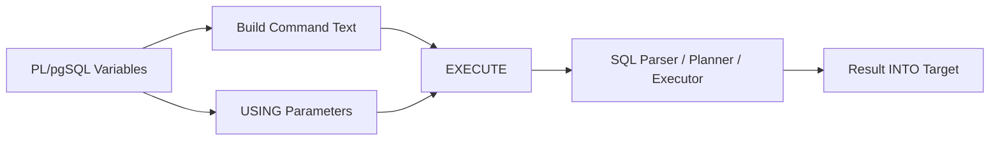
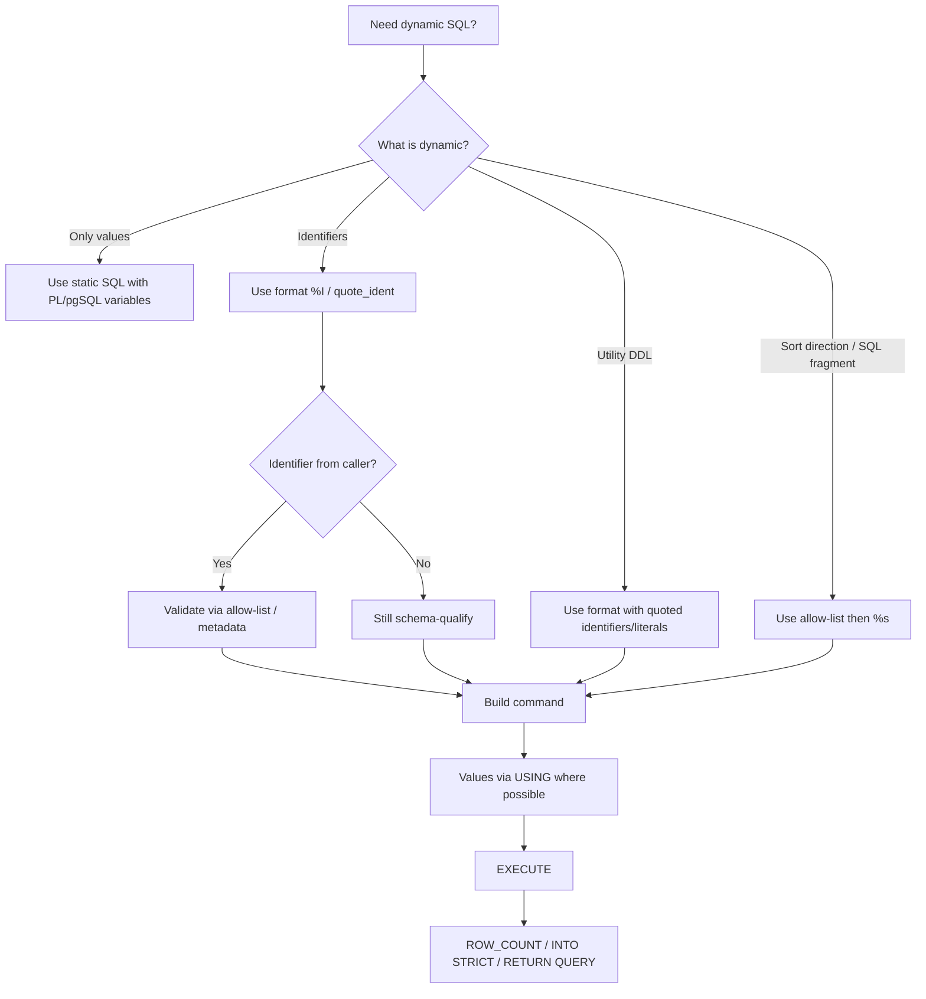

# Part 014 — Dynamic SQL: EXECUTE, FORMAT, Quote Ident, and USING

> Target part ini: kamu bisa memakai dynamic SQL di PL/pgSQL secara aman, jelas, dan production-grade: paham kapan perlu `EXECUTE`, bagaimana memisahkan identifier dari value, bagaimana menghindari SQL injection, bagaimana membaca dampak plan/replanning, dan bagaimana membangun metadata-driven routine tanpa membuat database menjadi string-concatenation hell.

Dynamic SQL adalah pisau tajam.

Ia menyelesaikan problem nyata:

- table name dinamis;
- column name dinamis;
- schema maintenance;
- partition maintenance;
- audit generator;
- metadata-driven validation;
- multi-tenant schema routing;
- dynamic DDL;
- generic admin procedure;
- parameter-sensitive plan control.

Tetapi ia juga sumber incident:

- SQL injection;
- salah quote identifier;
- value disisipkan sebagai string;
- `NULL` membuat command string menjadi `NULL`;
- plan selalu direplan tanpa sadar;
- permission boundary kabur;
- `search_path` disalahgunakan;
- command logging membocorkan PII;
- error message sulit dilacak;
- routine generic terlalu pintar dan tidak bisa di-review.

Part ini membahas dynamic SQL sebagai engineering discipline.

---

## 1. Mental Model: Dynamic SQL Punya Dua Dunia

Dalam PL/pgSQL biasa, SQL statis ditulis langsung:

```sql
SELECT count(*) INTO v_count
FROM app.enforcement_case c
WHERE c.status = p_status;
```

PL/pgSQL dapat mengganti variable PL/pgSQL dalam query statis dan dapat melakukan plan caching sesuai mekanisme internalnya.

Dynamic SQL berbeda:

```sql
EXECUTE v_sql INTO v_count USING p_status;
```

Command yang dieksekusi adalah string runtime. Tidak ada variable substitution PL/pgSQL otomatis di dalam string. Semua value harus:

- dimasukkan tekstual ke command string; atau
- dipasang sebagai parameter via `USING`.

Mental model:



Ada dua kelas input dynamic SQL:

| Kelas | Contoh | Cara Aman |
|---|---|---|
| Identifier | schema, table, column, index name | `format('%I', ident)` atau `quote_ident()` |
| Value | status, date, amount, actor id | `EXECUTE ... USING` paling disarankan |

Kesalahan utama: memperlakukan value seperti identifier atau sebaliknya.

---

## 2. Syntax Dasar `EXECUTE`

Bentuk umum:

```sql
EXECUTE command_string [ INTO [STRICT] target ] [ USING expression [, ...] ];
```

Contoh:

```sql
EXECUTE 'SELECT count(*) FROM app.enforcement_case WHERE status = $1'
INTO v_count
USING p_status;
```

`$1`, `$2`, dan seterusnya di command string merujuk ke expression dalam `USING`, bukan parameter function.

Contoh multiple parameter:

```sql
EXECUTE '
    SELECT count(*)
    FROM app.enforcement_case
    WHERE status = $1
      AND created_at >= $2
      AND created_at < $3
'
INTO v_count
USING p_status, p_from, p_to;
```

---

## 3. Rule Utama: Value Pakai `USING`, Identifier Pakai `%I`

Template aman:

```sql
EXECUTE format(
    'SELECT count(*) FROM %I.%I WHERE %I = $1',
    p_schema_name,
    p_table_name,
    p_column_name
)
INTO v_count
USING p_value;
```

Penjelasan:

- `%I` untuk identifier: schema/table/column;
- `$1` untuk value;
- `USING p_value` mengikat value tanpa manual quoting.

Jangan lakukan ini:

```sql
-- Buruk: injection risk dan null handling buruk.
v_sql := 'SELECT count(*) FROM ' || p_table_name ||
         ' WHERE status = ''' || p_status || '''';
EXECUTE v_sql INTO v_count;
```

Kenapa buruk?

- table name tidak diquote sebagai identifier;
- status disisipkan sebagai literal string manual;
- quote escaping rawan salah;
- jika `p_status` mengandung quote, command rusak atau berbahaya;
- jika `p_status` null, concatenation bisa menghasilkan command null;
- planner tidak menerima typed parameter.

---

## 4. `format()`: `%I`, `%L`, dan `%s`

`format()` sangat cocok untuk dynamic SQL.

| Specifier | Arti | Gunakan Untuk | Catatan |
|---|---|---|---|
| `%I` | SQL identifier | schema, table, column | Equivalent conceptually to `quote_ident` |
| `%L` | SQL literal | value tekstual | Equivalent conceptually to `quote_nullable` |
| `%s` | raw string | fragment yang sudah aman | Berbahaya jika input user |

Contoh identifier:

```sql
v_sql := format('SELECT count(*) FROM %I.%I', p_schema, p_table);
```

Contoh literal:

```sql
v_sql := format('SELECT count(*) FROM app.case WHERE status = %L', p_status);
```

Namun untuk value, lebih baik:

```sql
v_sql := 'SELECT count(*) FROM app.case WHERE status = $1';
EXECUTE v_sql INTO v_count USING p_status;
```

Kenapa `USING` lebih baik untuk value?

- menghindari quote/escape manual;
- menjaga type value;
- lebih tahan SQL injection;
- lebih readable untuk predicate kompleks;
- tidak perlu memikirkan literal representation.

Gunakan `%L` ketika `USING` tidak bisa dipakai, misalnya beberapa utility statement.

---

## 5. Identifier Tidak Bisa Pakai `$1`

Ini tidak valid untuk table name:

```sql
EXECUTE 'SELECT count(*) FROM $1 WHERE status = $2'
INTO v_count
USING p_table_name, p_status;
```

Parameter `$1` hanya untuk data value di optimizable SQL command. Identifier harus menjadi bagian dari command text.

Benar:

```sql
EXECUTE format('SELECT count(*) FROM %I WHERE status = $1', p_table_name)
INTO v_count
USING p_status;
```

Jika schema juga dinamis:

```sql
EXECUTE format('SELECT count(*) FROM %I.%I WHERE status = $1', p_schema_name, p_table_name)
INTO v_count
USING p_status;
```

---

## 6. `quote_ident`, `quote_literal`, `quote_nullable`

Selain `format()`, PostgreSQL menyediakan quoting functions.

Contoh:

```sql
v_sql := 'SELECT count(*) FROM '
      || quote_ident(p_schema_name)
      || '.'
      || quote_ident(p_table_name)
      || ' WHERE '
      || quote_ident(p_column_name)
      || ' = $1';

EXECUTE v_sql INTO v_count USING p_value;
```

Untuk value literal:

```sql
v_sql := 'UPDATE app.config SET value = '
      || quote_nullable(p_value)
      || ' WHERE key = '
      || quote_nullable(p_key);
```

Namun manual concatenation sulit dibaca untuk command panjang. Preferensi production:

```txt
Use format() for command shape.
Use %I for identifiers.
Use USING for values.
Use quote_* only when it improves clarity or for small fragments.
```

---

## 7. Null Trap pada Dynamic SQL

String concatenation dengan `NULL` bisa membuat seluruh command menjadi `NULL`.

Buruk:

```sql
v_sql := 'UPDATE app.config SET value = ' || quote_literal(p_value);
```

`quote_literal(NULL)` menghasilkan null, sehingga `v_sql` bisa null.

Gunakan:

```sql
v_sql := 'UPDATE app.config SET value = ' || quote_nullable(p_value);
```

Atau lebih baik:

```sql
EXECUTE 'UPDATE app.config SET value = $1 WHERE key = $2'
USING p_value, p_key;
```

Null equality trap:

```sql
v_sql := format('SELECT * FROM %I WHERE %I = %L', p_table, p_column, p_value);
```

Jika `p_value` null, predicate menjadi:

```sql
WHERE column = NULL
```

Itu tidak match apapun. Jika null harus dianggap comparable, gunakan:

```sql
v_sql := format('SELECT * FROM %I WHERE %I IS NOT DISTINCT FROM $1', p_table, p_column);
EXECUTE v_sql USING p_value;
```

---

## 8. Dynamic SELECT INTO

Di dynamic SQL, `SELECT INTO` tidak ditulis di dalam command string. `INTO` adalah bagian dari `EXECUTE`.

Buruk:

```sql
EXECUTE 'SELECT count(*) INTO v_count FROM app.case';
```

Benar:

```sql
EXECUTE 'SELECT count(*) FROM app.case'
INTO v_count;
```

Dengan `STRICT`:

```sql
EXECUTE format('SELECT %I FROM %I WHERE id = $1', p_column, p_table)
INTO STRICT v_value
USING p_id;
```

`INTO STRICT` tetap berarti command harus menghasilkan tepat satu row.

---

## 9. Dynamic DML dengan `RETURNING`

Contoh generic update satu column:

```sql
CREATE OR REPLACE FUNCTION app.update_case_attribute(
    p_case_id bigint,
    p_column_name text,
    p_value text,
    p_actor_id bigint
)
RETURNS app.enforcement_case
LANGUAGE plpgsql
AS $$
DECLARE
    v_case app.enforcement_case%ROWTYPE;
    v_allowed_columns constant text[] := ARRAY['title', 'priority_code', 'external_reference'];
BEGIN
    IF NOT p_column_name = ANY (v_allowed_columns) THEN
        RAISE EXCEPTION 'column % is not allowed for dynamic update', p_column_name
            USING ERRCODE = 'P2402';
    END IF;

    EXECUTE format(
        'UPDATE app.enforcement_case
         SET %I = $1,
             updated_by = $2,
             updated_at = clock_timestamp()
         WHERE case_id = $3
         RETURNING *',
        p_column_name
    )
    INTO STRICT v_case
    USING p_value, p_actor_id, p_case_id;

    RETURN v_case;
END;
$$;
```

Perhatikan guard `v_allowed_columns`. Quoting identifier mencegah injection, tetapi tidak menjawab pertanyaan bisnis: “kolom ini boleh diubah secara generic atau tidak?”

Security rule:

```txt
Quoting makes syntax safe.
Allow-list makes intent safe.
Privilege makes access safe.
Audit makes change accountable.
```

---

## 10. Allow-List Wajib untuk Identifier dari Caller

Jangan menerima arbitrary table/column dari caller eksternal.

Buruk:

```sql
EXECUTE format('DELETE FROM %I WHERE id = $1', p_table)
USING p_id;
```

Walaupun `%I` mencegah injection, caller masih bisa memilih table yang tidak semestinya.

Gunakan allow-list:

```sql
IF p_table_name NOT IN ('case_draft', 'case_import_error') THEN
    RAISE EXCEPTION 'table % is not allowed for cleanup', p_table_name
        USING ERRCODE = 'P2402';
END IF;
```

Lebih baik lagi, simpan di metadata table:

```sql
CREATE TABLE app.dynamic_cleanup_target (
    target_name text PRIMARY KEY,
    schema_name text NOT NULL,
    table_name text NOT NULL,
    id_column text NOT NULL,
    retention_column text NOT NULL,
    max_delete_per_run integer NOT NULL CHECK (max_delete_per_run BETWEEN 1 AND 100000),
    active boolean NOT NULL DEFAULT true
);
```

Caller mengirim `target_name`, bukan raw table name.

---

## 11. Metadata-Driven Cleanup Procedure

Contoh production-ish:

```sql
CREATE OR REPLACE PROCEDURE app.cleanup_dynamic_target(
    p_target_name text,
    p_cutoff timestamptz,
    p_dry_run boolean DEFAULT true
)
LANGUAGE plpgsql
AS $$
DECLARE
    v_target app.dynamic_cleanup_target%ROWTYPE;
    v_sql text;
    v_deleted_count integer;
BEGIN
    IF p_cutoff IS NULL THEN
        RAISE EXCEPTION 'cutoff is required' USING ERRCODE = 'P2201';
    END IF;

    SELECT * INTO STRICT v_target
    FROM app.dynamic_cleanup_target t
    WHERE t.target_name = p_target_name
      AND t.active;

    v_sql := format(
        'WITH victim AS (
             SELECT %1$I
             FROM %2$I.%3$I
             WHERE %4$I < $1
             ORDER BY %4$I, %1$I
             LIMIT %5$s
         )
         DELETE FROM %2$I.%3$I d
         USING victim v
         WHERE d.%1$I = v.%1$I',
        v_target.id_column,
        v_target.schema_name,
        v_target.table_name,
        v_target.retention_column,
        v_target.max_delete_per_run
    );

    RAISE NOTICE 'op=cleanup target=% dry_run=% sql=%',
        p_target_name, p_dry_run, v_sql;

    IF p_dry_run THEN
        RETURN;
    END IF;

    EXECUTE v_sql USING p_cutoff;
    GET DIAGNOSTICS v_deleted_count = ROW_COUNT;

    IF v_deleted_count > v_target.max_delete_per_run THEN
        RAISE EXCEPTION 'cleanup guard failed: deleted %, max %',
            v_deleted_count,
            v_target.max_delete_per_run
            USING ERRCODE = 'P2204';
    END IF;

    RAISE NOTICE 'op=cleanup target=% deleted=%', p_target_name, v_deleted_count;
EXCEPTION
    WHEN no_data_found THEN
        RAISE EXCEPTION 'cleanup target % not found or inactive', p_target_name
            USING ERRCODE = 'P2404';
END;
$$;
```

Catatan:

- metadata mengontrol identifier;
- value cutoff lewat `USING`;
- limit berasal dari metadata yang sudah constrained;
- dry run ada;
- delete dibatasi;
- SQL di-log sebagai signal, tetapi hati-hati jika command mengandung literal sensitif.

---

## 12. `%s` Harus Dianggap Berbahaya

`%s` menyisipkan string mentah.

Kadang berguna untuk fragment yang dibuat sendiri:

```sql
v_where_fragment := 'status = $1 AND created_at >= $2';

v_sql := format(
    'SELECT count(*) FROM app.enforcement_case WHERE %s',
    v_where_fragment
);

EXECUTE v_sql INTO v_count USING p_status, p_from;
```

Tetapi jangan isi `%s` dari input user.

Buruk:

```sql
v_sql := format('SELECT * FROM app.case ORDER BY %s', p_sort_expression);
```

Lebih aman:

```sql
v_order_by := CASE p_sort_key
    WHEN 'created_at' THEN 'created_at'
    WHEN 'priority' THEN 'priority_code, created_at'
    WHEN 'status' THEN 'status, created_at'
    ELSE NULL
END;

IF v_order_by IS NULL THEN
    RAISE EXCEPTION 'unsupported sort key: %', p_sort_key
        USING ERRCODE = 'P2201';
END IF;

v_sql := format('SELECT * FROM app.case ORDER BY %s', v_order_by);
```

Di sini `%s` aman karena fragment dibuat oleh routine dari allow-list, bukan dari caller mentah.

---

## 13. Dynamic ORDER BY Pattern

`ORDER BY` sering membuat developer tergoda concatenation.

Pattern aman:

```sql
CREATE OR REPLACE FUNCTION app.search_cases(
    p_status text,
    p_sort_key text DEFAULT 'created_at',
    p_sort_direction text DEFAULT 'desc',
    p_limit integer DEFAULT 50
)
RETURNS SETOF app.enforcement_case
LANGUAGE plpgsql
AS $$
DECLARE
    v_sort_column text;
    v_sort_direction text;
    v_sql text;
BEGIN
    v_sort_column := CASE p_sort_key
        WHEN 'created_at' THEN 'created_at'
        WHEN 'updated_at' THEN 'updated_at'
        WHEN 'priority' THEN 'priority_code'
        ELSE NULL
    END;

    IF v_sort_column IS NULL THEN
        RAISE EXCEPTION 'unsupported sort key: %', p_sort_key
            USING ERRCODE = 'P2201';
    END IF;

    v_sort_direction := CASE lower(p_sort_direction)
        WHEN 'asc' THEN 'ASC'
        WHEN 'desc' THEN 'DESC'
        ELSE NULL
    END;

    IF v_sort_direction IS NULL THEN
        RAISE EXCEPTION 'unsupported sort direction: %', p_sort_direction
            USING ERRCODE = 'P2201';
    END IF;

    IF p_limit IS NULL OR p_limit < 1 OR p_limit > 500 THEN
        RAISE EXCEPTION 'limit must be between 1 and 500'
            USING ERRCODE = 'P2201';
    END IF;

    v_sql := format(
        'SELECT *
         FROM app.enforcement_case c
         WHERE ($1 IS NULL OR c.status = $1)
         ORDER BY c.%I %s, c.case_id ASC
         LIMIT $2',
        v_sort_column,
        v_sort_direction
    );

    RETURN QUERY EXECUTE v_sql USING p_status, p_limit;
END;
$$;
```

Identifier pakai `%I`, direction pakai allow-list fragment `%s`, values pakai `USING`.

---

## 14. Dynamic SQL dan Plan Behavior

`EXECUTE` tidak memakai plan caching PL/pgSQL untuk command-nya. Command di-plan setiap kali statement `EXECUTE` berjalan.

Dampaknya dua sisi:

| Dampak | Bagus Jika | Buruk Jika |
|---|---|---|
| Replanning setiap eksekusi | Plan sangat tergantung parameter | Routine hot path sangat sering dipanggil |
| Dynamic object name | Table/column memang berubah | Sebenarnya query statis cukup |
| Hindari generic cached plan | Parameter skew besar | Overhead planning dominan |

Contoh kasus `EXECUTE` sengaja dipakai walaupun query shape statis:

```sql
EXECUTE '
    SELECT count(*)
    FROM app.enforcement_case c
    WHERE c.subject_id = $1
      AND c.status = $2
'
INTO v_count
USING p_subject_id, p_status;
```

Ini bisa dipakai untuk memaksa custom planning per parameter pada query yang sangat sensitive terhadap distribusi data. Namun jangan jadikan default. Ukur dulu.

Rule:

```txt
Use static SQL unless you need dynamic identifiers, dynamic command shape, utility statement construction, or deliberate replanning.
```

---

## 15. Dynamic DDL

DDL sering perlu dynamic SQL karena object name dinamis.

Contoh membuat index untuk partition:

```sql
CREATE OR REPLACE PROCEDURE app.create_partition_index(
    p_schema_name text,
    p_table_name text,
    p_column_name text
)
LANGUAGE plpgsql
AS $$
DECLARE
    v_index_name text;
BEGIN
    v_index_name := p_table_name || '_' || p_column_name || '_idx';

    EXECUTE format(
        'CREATE INDEX IF NOT EXISTS %I ON %I.%I (%I)',
        v_index_name,
        p_schema_name,
        p_table_name,
        p_column_name
    );
END;
$$;
```

DDL values biasanya harus textual, karena utility statements tidak selalu menerima `$1` parameters seperti optimizable SQL.

Guard tambahan:

- validate schema exists;
- validate table exists;
- validate column exists;
- restrict allowed schema;
- log command;
- avoid running in hot transaction;
- consider lock impact.

---

## 16. Validasi Metadata via `regclass`

Untuk object table, `regclass` bisa membantu validasi object exists.

```sql
CREATE OR REPLACE FUNCTION app.count_rows_dynamic(p_table regclass)
RETURNS bigint
LANGUAGE plpgsql
AS $$
DECLARE
    v_count bigint;
BEGIN
    EXECUTE format('SELECT count(*) FROM %s', p_table)
    INTO v_count;

    RETURN v_count;
END;
$$;
```

Kenapa `%s`, bukan `%I`? Karena `regclass` output sudah merepresentasikan object reference yang valid. Namun tetap hati-hati: ini tidak otomatis menjawab apakah caller boleh memilih table tersebut.

Allow-list tetap diperlukan untuk routine yang exposed ke caller luas.

---

## 17. Search Path dan Schema Qualification

Dynamic SQL memperbesar risiko `search_path` ambiguity.

Buruk:

```sql
EXECUTE format('SELECT count(*) FROM %I', p_table);
```

Lebih jelas:

```sql
EXECUTE format('SELECT count(*) FROM %I.%I', p_schema, p_table);
```

Untuk function sensitif:

- schema-qualify table;
- schema-qualify helper function jika perlu;
- set `search_path` pada function/procedure security-sensitive;
- jangan biarkan caller mengontrol schema mentah tanpa allow-list.

---

## 18. Dynamic SQL di SECURITY DEFINER

Dynamic SQL dalam `SECURITY DEFINER` berbahaya jika tidak disiplin.

Minimal rule:

```txt
No raw identifier from caller.
No unqualified object names.
No caller-controlled SQL fragments.
Allow-list every object/action.
Set safe search_path.
Do not expose generic executor function.
```

Anti-pattern fatal:

```sql
CREATE OR REPLACE FUNCTION app.run_admin_sql(p_sql text)
RETURNS void
LANGUAGE plpgsql
SECURITY DEFINER
AS $$
BEGIN
    EXECUTE p_sql;
END;
$$;
```

Ini pada dasarnya memberi caller kemampuan menjalankan SQL sebagai owner function. Jangan buat.

---

## 19. Observability untuk Dynamic SQL

Dynamic SQL sulit di-debug jika command text tidak terlihat.

Pattern:

```sql
RAISE DEBUG 'op=dynamic_cleanup sql=%', v_sql;
```

Tetapi jangan log literal sensitif.

Lebih aman jika value lewat `USING`, command text tidak mengandung value:

```sql
v_sql := format(
    'UPDATE %I.%I SET status = $1 WHERE case_id = $2',
    p_schema,
    p_table
);

RAISE DEBUG 'op=dynamic_update sql=% param_count=2', v_sql;

EXECUTE v_sql USING p_status, p_case_id;
```

Jangan:

```sql
RAISE NOTICE 'sql=%', format(
    'UPDATE case SET national_id = %L WHERE case_id = %L',
    p_national_id,
    p_case_id
);
```

Itu bisa membocorkan PII ke log/client.

---

## 20. Error Wrapping untuk Dynamic SQL

Dynamic SQL error sering sulit ditelusuri. Tambahkan context.

```sql
BEGIN
    EXECUTE v_sql USING p_value;
EXCEPTION
    WHEN undefined_table OR undefined_column THEN
        RAISE EXCEPTION 'dynamic SQL metadata invalid for operation %, sql=%',
            p_operation_name,
            v_sql
            USING ERRCODE = 'P2405',
                  HINT = 'Check metadata table and deployed schema.';
    WHEN others THEN
        RAISE;
END;
```

Jangan wrap semua error menjadi satu pesan generic. Itu menghilangkan SQLSTATE asli.

Lebih baik wrap hanya error yang memang metadata/config issue. Untuk constraint violation, deadlock, serialization failure, sering lebih baik dibiarkan atau diterjemahkan secara spesifik.

---

## 21. Dynamic SQL Builder Discipline

Untuk command panjang, jangan bangun string acak di banyak tempat.

Pattern:

```sql
v_sql := format($sql$
    UPDATE %I.%I AS t
    SET %I = $1,
        updated_at = clock_timestamp()
    WHERE t.%I = $2
    RETURNING t.*
$sql$,
    v_schema_name,
    v_table_name,
    v_update_column,
    v_id_column
);
```

Dollar-quoted template lebih readable daripada escape quote manual.

Aturan:

- command template satu block;
- identifier arguments berurutan dan diberi nama jelas;
- value tetap `$1`, `$2`, ...;
- `USING` berurutan sesuai placeholder;
- log command shape, bukan value sensitif;
- test dengan identifier aneh seperti mixed-case atau reserved word.

---

## 22. Placeholder Numbering Discipline

Bug umum: `$1`, `$2` tidak cocok dengan `USING`.

Buruk:

```sql
EXECUTE 'UPDATE app.case SET status = $2 WHERE case_id = $1'
USING p_status, p_case_id;
```

Ini menukar value.

Lebih mudah dibaca:

```sql
-- $1 = p_status
-- $2 = p_case_id
EXECUTE 'UPDATE app.case SET status = $1 WHERE case_id = $2'
USING p_status, p_case_id;
```

Untuk command panjang, tambahkan komentar lokal sebelum `EXECUTE`.

---

## 23. Dynamic Predicate Construction

Jangan bangun predicate dengan concatenation value.

Buruk:

```sql
v_where := 'WHERE 1=1';

IF p_status IS NOT NULL THEN
    v_where := v_where || ' AND status = ''' || p_status || '''';
END IF;
```

Alternatif statis sering cukup:

```sql
SELECT *
FROM app.enforcement_case c
WHERE (p_status IS NULL OR c.status = p_status)
  AND (p_actor_id IS NULL OR c.assigned_actor_id = p_actor_id);
```

Jika harus dynamic karena optional predicate banyak dan plan quality penting:

```sql
v_sql := 'SELECT * FROM app.enforcement_case c WHERE true';

IF p_status IS NOT NULL THEN
    v_param_count := v_param_count + 1;
    v_sql := v_sql || format(' AND c.status = $%s', v_param_count);
    v_params := v_params || jsonb_build_array(p_status);
END IF;
```

Namun PL/pgSQL tidak punya native variadic `USING` dari array untuk arbitrary parameter count. Karena itu dynamic predicate dengan jumlah parameter berubah bisa menjadi rumit.

Praktisnya:

- gunakan static optional predicate dulu;
- gunakan beberapa branch static query untuk kasus performa penting;
- gunakan dynamic SQL jika identifier/shape benar-benar dinamis;
- jangan memaksa generic query builder di PL/pgSQL jika application layer lebih cocok.

---

## 24. Safer Branching Than Fully Dynamic Query

Daripada membangun semua predicate dinamis, gunakan branch query statis.

```sql
IF p_status IS NOT NULL AND p_actor_id IS NOT NULL THEN
    RETURN QUERY
    SELECT * FROM app.enforcement_case c
    WHERE c.status = p_status
      AND c.assigned_actor_id = p_actor_id;
ELSIF p_status IS NOT NULL THEN
    RETURN QUERY
    SELECT * FROM app.enforcement_case c
    WHERE c.status = p_status;
ELSIF p_actor_id IS NOT NULL THEN
    RETURN QUERY
    SELECT * FROM app.enforcement_case c
    WHERE c.assigned_actor_id = p_actor_id;
ELSE
    RETURN QUERY
    SELECT * FROM app.enforcement_case c
    ORDER BY c.created_at DESC
    LIMIT 100;
END IF;
```

Ini verbose, tetapi:

- lebih mudah di-review;
- lebih aman;
- plan statis bisa dicache;
- tidak ada placeholder numbering complexity.

Dynamic SQL bukan badge seniority. Kadang branch statis adalah engineering yang lebih baik.

---

## 25. Dynamic SQL untuk Audit Generator

Contoh: generate audit snapshot JSON untuk table yang dikonfigurasi.

```sql
CREATE TABLE app.audit_target_column (
    target_name text NOT NULL,
    column_name text NOT NULL,
    ordinal integer NOT NULL,
    PRIMARY KEY (target_name, column_name)
);
```

Function skeleton:

```sql
CREATE OR REPLACE FUNCTION app.build_audit_snapshot(
    p_schema_name text,
    p_table_name text,
    p_id_column text,
    p_id_value bigint,
    p_target_name text
)
RETURNS jsonb
LANGUAGE plpgsql
AS $$
DECLARE
    v_select_list text;
    v_sql text;
    v_snapshot jsonb;
BEGIN
    SELECT string_agg(format('%1$L, t.%2$I', c.column_name, c.column_name), ', ' ORDER BY c.ordinal)
    INTO v_select_list
    FROM app.audit_target_column c
    WHERE c.target_name = p_target_name;

    IF v_select_list IS NULL THEN
        RAISE EXCEPTION 'no audit columns configured for %', p_target_name
            USING ERRCODE = 'P2404';
    END IF;

    v_sql := format(
        'SELECT jsonb_build_object(%s)
         FROM %I.%I t
         WHERE t.%I = $1',
        v_select_list,
        p_schema_name,
        p_table_name,
        p_id_column
    );

    EXECUTE v_sql INTO STRICT v_snapshot USING p_id_value;

    RETURN v_snapshot;
END;
$$;
```

Perhatikan `%1$L` untuk key JSON literal dan `%2$I` untuk column identifier. Ini contoh perbedaan literal vs identifier dalam satu fragment.

---

## 26. Mermaid: Safe Dynamic SQL Decision Flow



---

## 27. Anti-Patterns

### 27.1 Generic SQL Executor

```sql
CREATE FUNCTION run_sql(sql text) RETURNS void AS $$
BEGIN
    EXECUTE sql;
END;
$$ LANGUAGE plpgsql SECURITY DEFINER;
```

Hampir selalu buruk.

### 27.2 Raw Table Name from API

```sql
EXECUTE 'SELECT * FROM ' || p_table;
```

Injection/scope disaster.

### 27.3 `%s` with User Input

```sql
EXECUTE format('ORDER BY %s', p_order_by);
```

Bisa menjadi SQL fragment injection.

### 27.4 Literal Instead of `USING`

```sql
EXECUTE format('WHERE email = %L', p_email);
```

Masih bisa aman jika `%L`, tetapi `USING` biasanya lebih baik.

### 27.5 Dynamic SQL Karena Malas Menulis Branch

Jika hanya ada dua variasi query, branch statis sering lebih baik.

### 27.6 Tidak Ada Test untuk Identifier Aneh

Test identifier:

```txt
Case
case
case detail
select
MixedCase
name-with-dash
```

Jika routine pecah pada identifier valid yang butuh quoting, berarti quoting discipline lemah.

---

## 28. Review Checklist

Sebelum dynamic SQL masuk production, periksa:

1. Apakah dynamic SQL benar-benar perlu?
2. Apa yang dinamis: identifier, value, fragment, atau command type?
3. Apakah semua identifier pakai `%I`/`quote_ident` atau valid `regclass`?
4. Apakah semua value pakai `USING` jika memungkinkan?
5. Apakah `%s` hanya menerima fragment dari allow-list internal?
6. Apakah caller bisa memilih table/column sembarang?
7. Apakah ada allow-list/metadata guard?
8. Apakah schema-qualified?
9. Apakah routine SECURITY DEFINER? Jika ya, apakah search_path aman?
10. Apakah command text di-log tanpa value sensitif?
11. Apakah `INTO STRICT`/`ROW_COUNT` dipakai untuk membuktikan result shape?
12. Apakah null semantics benar?
13. Apakah DDL lock impact dipahami?
14. Apakah replanning overhead diterima?
15. Apakah ada test dengan malicious input dan identifier aneh?

---

## 29. Latihan Praktis

Buat procedure:

```txt
archive_old_rows(target_name, cutoff, dry_run)
```

Dengan metadata table:

```txt
target_name
schema_name
table_name
id_column
retention_column
archive_table_name
max_rows_per_run
active
```

Contract:

- caller hanya mengirim `target_name`;
- semua identifier berasal dari metadata aktif;
- `cutoff` wajib;
- dry-run menghitung candidate dan tidak mutasi;
- execution memindahkan maksimal `max_rows_per_run` row ke archive table;
- delete hanya row yang berhasil diinsert ke archive;
- row-count insert dan delete harus sama;
- log command shape, bukan values;
- error code khusus untuk metadata missing, guard failed, row-count mismatch;
- test dengan table/column mixed-case.

Ini latihan bagus karena menggabungkan:

- dynamic identifier;
- value binding;
- CTE;
- mutation proof;
- blast-radius guard;
- metadata allow-list;
- observability;
- error handling.

---

## 30. Kesimpulan

Dynamic SQL bukan teknik untuk membuat kode terlihat pintar. Dynamic SQL adalah alat untuk saat query shape tidak bisa diketahui saat compile-time PL/pgSQL.

Prinsip intinya sederhana:

```txt
Static SQL by default.
Dynamic SQL only with a reason.
Identifiers are not values.
Values are not identifiers.
Identifiers need quoting and allow-listing.
Values should use USING.
Fragments must be generated internally.
Row effects must be proven.
Security boundary must be explicit.
```

Dynamic SQL yang matang terasa membosankan: ada allow-list, ada schema qualification, ada `USING`, ada `ROW_COUNT`, ada dry run, ada logging, ada tests. Justru itu ciri production-grade.

Di part berikutnya, kita akan membahas plan caching, generic/custom plans, parameter sensitivity, dan performance traps yang muncul ketika PL/pgSQL mulai dipakai di jalur request yang panas.

---

## References

- PostgreSQL Documentation — PL/pgSQL Basic Statements: executing dynamic commands with `EXECUTE`, `INTO`, `STRICT`, and `USING`.
- PostgreSQL Documentation — String Functions: `format()`, `%I`, `%L`, string formatting.
- PostgreSQL Documentation — PL/pgSQL Under the Hood: variable substitution and plan caching.
- PostgreSQL Documentation — SQL Syntax and Object Identifiers.
