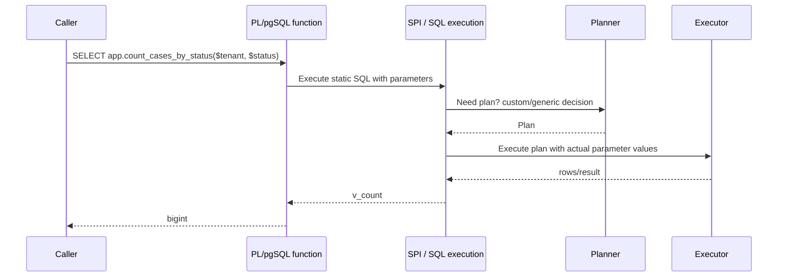

# Part 015 — Plan Caching, Generic vs Custom Plans, and Performance Traps

> Target part ini: kamu bisa membaca PL/pgSQL bukan hanya sebagai procedural syntax, tetapi sebagai *query execution host* yang punya konsekuensi planning. Kamu akan tahu kapan static SQL bagus, kapan dynamic `EXECUTE` diperlukan, kenapa parameter tertentu membuat plan buruk, bagaimana mendeteksi generic/custom plan trap, dan bagaimana membuat fungsi PL/pgSQL tetap cepat tanpa berubah jadi micro-optimization folklore.

PL/pgSQL sering dipakai untuk “mendekatkan logic ke data”. Itu benar, tetapi kalimat itu belum lengkap.

Kalimat yang lebih production-grade:

> PL/pgSQL mendekatkan logic ke data **dengan mengeksekusi SQL melalui SPI, variable substitution, dan plan caching tertentu**. Karena itu, performanya tidak hanya ditentukan oleh isi query, tetapi juga oleh bagaimana query tersebut diparameterkan, di-cache, di-replan, dipanggil, dan diberi input.

Banyak engineer bisa menulis fungsi PL/pgSQL yang benar secara fungsional. Lebih sedikit yang bisa menjawab pertanyaan ini:

- Apakah query di dalam fungsi ini memakai custom plan atau generic plan?
- Apakah plan yang bagus untuk satu tenant buruk untuk tenant lain?
- Apakah `EXECUTE` di sini sengaja dipakai untuk force replanning atau hanya karena malas menulis SQL statis?
- Apakah fungsi ini lambat karena PL/pgSQL, atau karena nested SQL yang salah plan?
- Apakah function volatility membuat planner kehilangan kesempatan optimasi?
- Apakah row-by-row loop membuat ribuan plan executions?
- Apakah `LIMIT`, skewed status, partition key, tenant id, dan date range membuat selectivity sangat parameter-sensitive?

Part ini membangun mental model dan pattern untuk menjawabnya.

---

## 1. Peta Masalah: PL/pgSQL Performance Bukan Satu Hal

Ketika fungsi PL/pgSQL lambat, penyebabnya bisa berada di beberapa layer.

```mermaid
graph TD
  A[Slow PL/pgSQL routine] --> B[Query plan problem]
  A --> C[Procedural shape problem]
  A --> D[Lock/contention problem]
  A --> E[Data volume/memory problem]
  A --> F[Deployment/config problem]

  B --> B1[Generic plan buruk]
  B --> B2[Custom plan terlalu mahal]
  B --> B3[Stats stale]
  B --> B4[Index tidak cocok]
  B --> B5[Partition pruning tidak terjadi]

  C --> C1[Row-by-row SQL]
  C --> C2[Unbounded loop]
  C --> C3[Repeated dynamic SQL]
  C --> C4[Exception as control flow]

  D --> D1[Long transaction]
  D --> D2[Lock escalation by workload]
  D --> D3[Hot row]
  D --> D4[Advisory lock misuse]

  E --> E1[RETURN QUERY besar]
  E --> E2[Array aggregation besar]
  E --> E3[Temporary table bloat]

  F --> F1[plan_cache_mode]
  F --> F2[work_mem]
  F --> F3[jit]
  F --> F4[search_path/security wrapper]
```



Part ini fokus pada **query plan problem** dan bentuk PL/pgSQL yang membuat query plan problem menjadi sulit dilihat.

---

## 2. Mental Model: Static SQL di PL/pgSQL Itu Bukan String Biasa

Contoh:

```sql
CREATE OR REPLACE FUNCTION app.count_cases_by_status(
  p_tenant_id uuid,
  p_status text
)
RETURNS bigint
LANGUAGE plpgsql
AS $$
DECLARE
  v_count bigint;
BEGIN
  SELECT count(*)
    INTO v_count
  FROM app.enforcement_case c
  WHERE c.tenant_id = p_tenant_id
    AND c.status = p_status;

  RETURN v_count;
END;
$$;
```

Query `SELECT count(*) ...` bukan dynamic string. Itu statement SQL statis di dalam PL/pgSQL.

Yang penting:

1. PL/pgSQL mengenali reference ke variable/function parameter.
2. Reference tersebut diperlakukan sebagai parameter query.
3. PostgreSQL bisa menyimpan dan memakai ulang execution plan untuk command optimizable tertentu.
4. Dari waktu ke waktu, mekanisme planning dapat memilih custom atau generic plan.

Sederhananya:



PL/pgSQL bukan mengganti teks `p_status` menjadi `'OPEN'` secara naif. Ia membuat boundary parameterized execution.

Ini bagus untuk keamanan dan reuse. Tetapi ada trade-off: generic plan bisa tidak tahu detail nilai parameter aktual.

---

## 3. Generic Plan vs Custom Plan

Dalam PostgreSQL, prepared/parameterized execution dapat memakai dua bentuk plan:

| Jenis plan | Karakter | Kelebihan | Risiko |
|---|---|---|---|
| Custom plan | Dibuat untuk eksekusi spesifik dengan nilai parameter saat itu | Bisa memilih plan optimal untuk nilai tertentu | Ada overhead planning setiap eksekusi |
| Generic plan | Tidak bergantung pada nilai parameter tertentu dan bisa dipakai ulang | Menghemat planning time | Bisa buruk jika nilai parameter sangat memengaruhi selectivity |

Contoh query yang biasanya aman dengan generic plan:

```sql
SELECT c.id, c.case_number
FROM app.enforcement_case c
WHERE c.id = p_case_id;
```

Jika `id` primary key, plan hampir selalu sama: index lookup by primary key.

Contoh query yang bisa parameter-sensitive:

```sql
SELECT c.id, c.case_number
FROM app.enforcement_case c
WHERE c.tenant_id = p_tenant_id
  AND c.status = p_status
  AND c.created_at >= p_from
ORDER BY c.created_at DESC
LIMIT p_limit;
```

Mengapa?

- Tenant A punya 10 juta row, tenant B punya 1.000 row.
- Status `CLOSED` punya 90% data, status `ESCALATED` punya 0.1% data.
- `p_from` bisa 1 hari terakhir atau 5 tahun terakhir.
- `LIMIT` kecil bisa cocok untuk index order scan.
- `LIMIT` besar bisa lebih cocok untuk bitmap scan atau sequential-ish path.

Generic plan harus memilih plan yang “cukup masuk akal” tanpa mengetahui kombinasi parameter aktual. Itu bisa menjadi sangat mahal untuk outlier.

---

## 4. Kenapa Ini Sangat Penting di Sistem Enterprise

Di sistem multi-tenant, regulatory case management, order management, payment, billing, CPQ, audit, dan workflow engine, data hampir selalu skewed.

Skewed berarti distribusinya tidak rata:

```txt
Tenant A: 70% data
Tenant B: 20% data
Tenant C-Z: 10% data gabungan

Status CLOSED: 85%
Status OPEN: 10%
Status ESCALATED: 1%
Status FRAUD_REVIEW: 0.01%
```

Query yang sama bisa punya karakter berbeda:

```sql
WHERE tenant_id = 'big-tenant' AND status = 'CLOSED'
```

vs

```sql
WHERE tenant_id = 'small-tenant' AND status = 'FRAUD_REVIEW'
```

Jika kamu menyembunyikan query tersebut di balik fungsi PL/pgSQL, aplikasi hanya melihat:

```sql
SELECT * FROM app.search_cases($1, $2, $3, $4);
```

Dari sisi aplikasi, terlihat rapi.

Dari sisi database, kamu baru saja membuat planning boundary yang harus dipahami dengan serius.

---

## 5. Static SQL vs Dynamic EXECUTE: Bukan Soal Selera

Bandingkan dua versi.

### Versi A — Static SQL

```sql
CREATE OR REPLACE FUNCTION app.find_cases_static(
  p_tenant_id uuid,
  p_status text,
  p_from timestamptz
)
RETURNS TABLE(case_id uuid, case_number text)
LANGUAGE plpgsql
AS $$
BEGIN
  RETURN QUERY
  SELECT c.id, c.case_number
  FROM app.enforcement_case c
  WHERE c.tenant_id = p_tenant_id
    AND c.status = p_status
    AND c.created_at >= p_from
  ORDER BY c.created_at DESC
  LIMIT 100;
END;
$$;
```

Kelebihan:

- sederhana;
- aman dari injection;
- bisa mendapat plan caching;
- readable;
- cocok jika plan relatif stabil.

Risiko:

- untuk query sangat parameter-sensitive, cached/generic plan bisa kurang optimal.

### Versi B — Dynamic SQL dengan `EXECUTE ... USING`

```sql
CREATE OR REPLACE FUNCTION app.find_cases_dynamic(
  p_tenant_id uuid,
  p_status text,
  p_from timestamptz
)
RETURNS TABLE(case_id uuid, case_number text)
LANGUAGE plpgsql
AS $$
BEGIN
  RETURN QUERY EXECUTE
    'SELECT c.id, c.case_number
     FROM app.enforcement_case c
     WHERE c.tenant_id = $1
       AND c.status = $2
       AND c.created_at >= $3
     ORDER BY c.created_at DESC
     LIMIT 100'
  USING p_tenant_id, p_status, p_from;
END;
$$;
```

Kelebihan:

- command dynamic `EXECUTE` di-plan setiap kali dieksekusi;
- bisa mendapatkan custom plan berdasarkan parameter aktual;
- berguna untuk parameter-sensitive query.

Risiko:

- planning overhead tiap eksekusi;
- lebih verbose;
- mudah salah jika value disisipkan tekstual;
- command string membuat tooling dan review lebih sulit;
- bukan solusi untuk query yang memang butuh index/statistik lebih baik.

Rule awal:

> Pakai static SQL sebagai default. Pakai dynamic `EXECUTE` untuk identifier dinamis atau ketika kamu punya bukti bahwa replanning per eksekusi memberi manfaat yang signifikan.

---

## 6. Pattern: Parameter-Sensitive Query Escape Hatch

Kadang satu fungsi punya query utama yang rentan generic-plan trap. Jangan ubah semua statement menjadi dynamic SQL. Buat escape hatch sempit.

```sql
CREATE OR REPLACE FUNCTION app.search_cases(
  p_tenant_id uuid,
  p_status text,
  p_from timestamptz,
  p_limit integer DEFAULT 100
)
RETURNS TABLE(case_id uuid, case_number text, created_at timestamptz)
LANGUAGE plpgsql
AS $$
BEGIN
  IF p_limit IS NULL OR p_limit < 1 OR p_limit > 1000 THEN
    RAISE EXCEPTION 'Invalid limit: %', p_limit
      USING ERRCODE = '22023';
  END IF;

  -- Intentionally dynamic: this query is parameter-sensitive for tenant/status/date.
  RETURN QUERY EXECUTE
    'SELECT c.id, c.case_number, c.created_at
     FROM app.enforcement_case c
     WHERE c.tenant_id = $1
       AND c.status = $2
       AND c.created_at >= $3
     ORDER BY c.created_at DESC
     LIMIT $4'
  USING p_tenant_id, p_status, p_from, p_limit;
END;
$$;
```

Tambahkan komentar yang menjelaskan *why*, bukan *what*.

Buruk:

```sql
-- dynamic query
```

Baik:

```sql
-- Intentionally dynamic to avoid bad generic plans on skewed tenant/status/date predicates.
```

Komentar ini adalah kontrak maintenance. Engineer berikutnya tahu bahwa dynamic SQL bukan accidental complexity.

---

## 7. Pattern: Static Shell, Dynamic Core

Dalam sistem produksi, fungsi sering butuh guardrail, observability, dan query berat. Pisahkan shell dari core.

```sql
CREATE OR REPLACE FUNCTION app.get_escalation_candidates(
  p_tenant_id uuid,
  p_now timestamptz DEFAULT clock_timestamp(),
  p_limit integer DEFAULT 500
)
RETURNS TABLE(case_id uuid, current_status text, due_at timestamptz)
LANGUAGE plpgsql
AS $$
DECLARE
  v_started_at timestamptz := clock_timestamp();
BEGIN
  IF p_tenant_id IS NULL THEN
    RAISE EXCEPTION 'tenant_id is required'
      USING ERRCODE = '22004';
  END IF;

  IF p_limit NOT BETWEEN 1 AND 5000 THEN
    RAISE EXCEPTION 'limit out of range: %', p_limit
      USING ERRCODE = '22023';
  END IF;

  RETURN QUERY EXECUTE
    'SELECT c.id, c.status, c.escalation_due_at
     FROM app.enforcement_case c
     WHERE c.tenant_id = $1
       AND c.status IN (''OPEN'', ''UNDER_REVIEW'')
       AND c.escalation_due_at <= $2
     ORDER BY c.escalation_due_at ASC
     LIMIT $3'
  USING p_tenant_id, p_now, p_limit;

  RAISE DEBUG 'get_escalation_candidates tenant=% limit=% elapsed_ms=%',
    p_tenant_id,
    p_limit,
    extract(milliseconds from clock_timestamp() - v_started_at);
END;
$$;
```

Shell:

- validates input;
- limits blast radius;
- attaches observability;
- defines return contract.

Core:

- query yang sengaja dynamic karena plan sensitivity.

---

## 8. Jangan Mengobati Index Problem dengan Dynamic SQL

Dynamic SQL bukan obat untuk semua lambat.

Jika query lambat karena tidak ada index:

```sql
WHERE tenant_id = p_tenant_id
  AND status = p_status
  AND escalation_due_at <= p_now
ORDER BY escalation_due_at
LIMIT 500
```

Kemungkinan index yang dibutuhkan adalah sesuatu seperti:

```sql
CREATE INDEX CONCURRENTLY enforcement_case_escalation_scan_idx
ON app.enforcement_case (tenant_id, status, escalation_due_at)
WHERE status IN ('OPEN', 'UNDER_REVIEW');
```

Dynamic SQL tidak menggantikan:

- index design;
- extended statistics;
- partitioning;
- updated table statistics;
- query rewrite;
- data model correction;
- removing row-by-row procedural shape.

Decision rule:

| Gejala | Obat pertama |
|---|---|
| Query selalu lambat untuk semua parameter | Index/query rewrite/statistics |
| Query cepat untuk beberapa parameter, buruk untuk outlier | Investigasi custom vs generic plan |
| Query melakukan ribuan eksekusi kecil | Set-based rewrite/batching |
| Query menunggu lock | Lock analysis, transaction shortening |
| Query memory-heavy | Batching/cursor/temp table strategy |
| Dynamic SQL lambat | Mungkin planning overhead atau query tetap buruk |

---

## 9. Generic Plan Trap: Contoh Konkret

Misalkan tabel:

```sql
CREATE TABLE app.case_event (
  id bigserial PRIMARY KEY,
  tenant_id uuid NOT NULL,
  case_id uuid NOT NULL,
  event_type text NOT NULL,
  occurred_at timestamptz NOT NULL,
  payload jsonb NOT NULL
);

CREATE INDEX case_event_tenant_type_time_idx
ON app.case_event (tenant_id, event_type, occurred_at DESC);
```

Fungsi:

```sql
CREATE OR REPLACE FUNCTION app.latest_events(
  p_tenant_id uuid,
  p_event_type text,
  p_since timestamptz
)
RETURNS TABLE(event_id bigint, case_id uuid, occurred_at timestamptz)
LANGUAGE plpgsql
AS $$
BEGIN
  RETURN QUERY
  SELECT e.id, e.case_id, e.occurred_at
  FROM app.case_event e
  WHERE e.tenant_id = p_tenant_id
    AND e.event_type = p_event_type
    AND e.occurred_at >= p_since
  ORDER BY e.occurred_at DESC
  LIMIT 1000;
END;
$$;
```

Data distribution:

```txt
CASE_VIEWED        800,000,000 rows
STATUS_CHANGED      5,000,000 rows
ESCALATED              80,000 rows
LEGAL_HOLD_ADDED          500 rows
```

Plan bagus untuk `LEGAL_HOLD_ADDED` mungkin index scan sangat selektif.

Plan bagus untuk `CASE_VIEWED` sejak 5 tahun terakhir mungkin berbeda karena hasilnya masif.

Generic plan tidak bisa sepenuhnya “merasakan” perbedaan itu dari nilai aktual parameter. Jika PostgreSQL memilih generic plan, performa outlier bisa buruk.

Solusi mungkin:

1. dynamic `EXECUTE` agar replan per call;
2. partial index untuk event tertentu;
3. memisahkan fungsi per use case;
4. partitioning by time/tenant;
5. materialized summary;
6. memperbaiki query contract agar tidak terlalu umum.

Pilihan terbaik tergantung bukti, bukan preferensi.

---

## 10. Pattern: Jangan Membuat Fungsi Search yang Terlalu Umum

Fungsi seperti ini terlihat fleksibel:

```sql
CREATE OR REPLACE FUNCTION app.search_cases_too_generic(
  p_tenant_id uuid,
  p_status text DEFAULT NULL,
  p_assignee_id uuid DEFAULT NULL,
  p_from timestamptz DEFAULT NULL,
  p_to timestamptz DEFAULT NULL,
  p_include_closed boolean DEFAULT false,
  p_sort text DEFAULT 'created_at_desc',
  p_limit integer DEFAULT 100
)
RETURNS SETOF app.case_search_result
LANGUAGE plpgsql
AS $$
BEGIN
  -- many optional predicates here
END;
$$;
```

Masalah:

- banyak kombinasi predicate;
- plan optimal berbeda per kombinasi;
- optional predicate sering ditulis dengan `OR p_param IS NULL`;
- index selection menjadi sulit;
- function contract terlalu kabur;
- sulit benchmark;
- sulit review security;
- sulit menjaga pagination benar.

Contoh anti-pattern:

```sql
WHERE c.tenant_id = p_tenant_id
  AND (p_status IS NULL OR c.status = p_status)
  AND (p_assignee_id IS NULL OR c.assignee_id = p_assignee_id)
  AND (p_from IS NULL OR c.created_at >= p_from)
```

Query ini fleksibel, tetapi sering buruk untuk planning.

Lebih baik pecah berdasarkan use case:

```txt
app.search_open_cases_by_assignee(...)
app.search_cases_by_status_window(...)
app.search_escalation_candidates(...)
app.search_cases_for_export(...)
```

Atau bangun dynamic SQL dengan predicate hanya jika parameter ada, tetapi tetap dengan allow-list dan `USING`.

```sql
CREATE OR REPLACE FUNCTION app.search_cases_dynamic_predicates(
  p_tenant_id uuid,
  p_status text DEFAULT NULL,
  p_assignee_id uuid DEFAULT NULL,
  p_from timestamptz DEFAULT NULL,
  p_limit integer DEFAULT 100
)
RETURNS TABLE(case_id uuid, case_number text, status text, created_at timestamptz)
LANGUAGE plpgsql
AS $$
DECLARE
  v_sql text :=
    'SELECT c.id, c.case_number, c.status, c.created_at
     FROM app.enforcement_case c
     WHERE c.tenant_id = $1';
  v_param_index integer := 1;
BEGIN
  IF p_limit NOT BETWEEN 1 AND 500 THEN
    RAISE EXCEPTION 'invalid limit: %', p_limit USING ERRCODE = '22023';
  END IF;

  IF p_status IS NOT NULL THEN
    v_param_index := v_param_index + 1;
    v_sql := v_sql || format(' AND c.status = $%s', v_param_index);
  END IF;

  IF p_assignee_id IS NOT NULL THEN
    v_param_index := v_param_index + 1;
    v_sql := v_sql || format(' AND c.assignee_id = $%s', v_param_index);
  END IF;

  IF p_from IS NOT NULL THEN
    v_param_index := v_param_index + 1;
    v_sql := v_sql || format(' AND c.created_at >= $%s', v_param_index);
  END IF;

  v_param_index := v_param_index + 1;
  v_sql := v_sql || format(' ORDER BY c.created_at DESC LIMIT $%s', v_param_index);

  -- This implementation sketch shows the idea but is intentionally incomplete:
  -- EXECUTE requires the USING list to be statically written at compile time.
  -- For many optional parameters, prefer a small number of explicit branches
  -- or separate functions over a too-clever generic builder.
  RAISE EXCEPTION 'Use explicit branches for optional predicate combinations';
END;
$$;
```

Poin penting: dynamic SQL dengan variable number of parameters di PL/pgSQL bisa menjadi awkward. Jangan membuat generic builder terlalu pintar. Untuk production, sering lebih baik menulis beberapa branch eksplisit.

```sql
IF p_status IS NOT NULL AND p_assignee_id IS NOT NULL THEN
  RETURN QUERY EXECUTE
    'SELECT c.id, c.case_number, c.status, c.created_at
     FROM app.enforcement_case c
     WHERE c.tenant_id = $1
       AND c.status = $2
       AND c.assignee_id = $3
     ORDER BY c.created_at DESC
     LIMIT $4'
  USING p_tenant_id, p_status, p_assignee_id, p_limit;

ELSIF p_status IS NOT NULL THEN
  RETURN QUERY EXECUTE
    'SELECT c.id, c.case_number, c.status, c.created_at
     FROM app.enforcement_case c
     WHERE c.tenant_id = $1
       AND c.status = $2
     ORDER BY c.created_at DESC
     LIMIT $3'
  USING p_tenant_id, p_status, p_limit;

ELSE
  RETURN QUERY EXECUTE
    'SELECT c.id, c.case_number, c.status, c.created_at
     FROM app.enforcement_case c
     WHERE c.tenant_id = $1
     ORDER BY c.created_at DESC
     LIMIT $2'
  USING p_tenant_id, p_limit;
END IF;
```

Ini lebih panjang, tetapi lebih mudah di-review, di-benchmark, dan di-index.

---

## 11. Volatility: Contract yang Mempengaruhi Planner

Saat membuat function, kamu memberi label volatility:

```sql
IMMUTABLE
STABLE
VOLATILE
```

Mental model:

| Volatility | Makna praktis | Contoh cocok |
|---|---|---|
| `IMMUTABLE` | hasil hanya bergantung pada input dan tidak berubah | pure normalization, deterministic calculation |
| `STABLE` | hasil tetap dalam satu statement, bisa membaca database | lookup config yang tidak berubah selama statement |
| `VOLATILE` | bisa berubah setiap call atau punya side effect | mutation, sequence, clock, random, audit insert |

Default function adalah `VOLATILE` jika tidak disebutkan.

Jangan asal memberi `IMMUTABLE` agar cepat. Salah volatility bisa menghasilkan hasil salah.

Contoh salah:

```sql
CREATE OR REPLACE FUNCTION app.current_policy_version()
RETURNS integer
LANGUAGE plpgsql
IMMUTABLE
AS $$
DECLARE
  v_version integer;
BEGIN
  SELECT max(version) INTO v_version FROM app.policy_version;
  RETURN v_version;
END;
$$;
```

Ini salah karena membaca table. Hasil bisa berubah saat data berubah.

Versi lebih jujur:

```sql
CREATE OR REPLACE FUNCTION app.current_policy_version()
RETURNS integer
LANGUAGE plpgsql
STABLE
AS $$
DECLARE
  v_version integer;
BEGIN
  SELECT max(version) INTO v_version FROM app.policy_version;
  RETURN v_version;
END;
$$;
```

Untuk mutation:

```sql
CREATE OR REPLACE FUNCTION app.mark_case_reviewed(p_case_id uuid)
RETURNS void
LANGUAGE plpgsql
VOLATILE
AS $$
BEGIN
  UPDATE app.enforcement_case
  SET reviewed_at = clock_timestamp()
  WHERE id = p_case_id;
END;
$$;
```

Volatility adalah bagian dari performance contract, tetapi juga correctness contract.

---

## 12. Function Cost dan Rows: Jangan Dibiarkan Selalu Default untuk API Internal Besar

`CREATE FUNCTION` mendukung atribut seperti `COST` dan `ROWS`.

Contoh:

```sql
CREATE OR REPLACE FUNCTION app.case_events_for_report(p_case_id uuid)
RETURNS TABLE(event_id bigint, occurred_at timestamptz, event_type text)
LANGUAGE plpgsql
STABLE
COST 100
ROWS 1000
AS $$
BEGIN
  RETURN QUERY
  SELECT e.id, e.occurred_at, e.event_type
  FROM app.case_event e
  WHERE e.case_id = p_case_id
  ORDER BY e.occurred_at;
END;
$$;
```

Kenapa ini penting?

Jika function dipakai dalam query lain, planner butuh estimasi cost dan jumlah row. Estimasi yang salah bisa membuat join order buruk.

Anti-pattern:

```sql
SELECT c.id, f.event_type
FROM app.enforcement_case c
JOIN LATERAL app.case_events_for_report(c.id) f ON true
WHERE c.tenant_id = $1;
```

Jika function sebenarnya mengembalikan banyak row tetapi planner mengira sedikit, join strategy bisa buruk.

Rule:

- Untuk function yang dipanggil dari SQL besar, beri `COST`/`ROWS` secara sadar.
- Untuk function kecil yang dipakai sebagai application call boundary, default mungkin cukup.
- Jangan memakai PL/pgSQL table-returning function sebagai black box jika query relational biasa lebih bisa dioptimasi.

---

## 13. SQL Function vs PL/pgSQL Function

Tidak semua function harus PL/pgSQL.

Jika function hanya membungkus satu SQL expression/query, pertimbangkan `LANGUAGE sql`.

```sql
CREATE OR REPLACE FUNCTION app.normalize_case_number(p_case_number text)
RETURNS text
LANGUAGE sql
IMMUTABLE
AS $$
  SELECT upper(regexp_replace(trim(p_case_number), '\s+', '', 'g'))
$$;
```

PL/pgSQL cocok ketika kamu butuh:

- multi-step logic;
- branching;
- exception handling;
- diagnostics;
- multiple statements;
- loops/batching;
- dynamic SQL;
- explicit guardrails.

SQL function cocok ketika kamu butuh:

- pure expression;
- simple query wrapper;
- composability;
- planner friendliness.

Jangan menjadikan PL/pgSQL sebagai default untuk semua function. Itu membuat query lebih opaque.

---

## 14. Trap: Row-by-Row SQL Mengalahkan Plan Caching

Plan caching tidak menyelamatkan desain yang salah bentuk.

Buruk:

```sql
CREATE OR REPLACE FUNCTION app.recalculate_case_scores(p_tenant_id uuid)
RETURNS integer
LANGUAGE plpgsql
AS $$
DECLARE
  r record;
  v_score numeric;
  v_count integer := 0;
BEGIN
  FOR r IN
    SELECT c.id
    FROM app.enforcement_case c
    WHERE c.tenant_id = p_tenant_id
  LOOP
    SELECT coalesce(sum(e.weight), 0)
      INTO v_score
    FROM app.case_event e
    WHERE e.case_id = r.id;

    UPDATE app.enforcement_case
    SET risk_score = v_score
    WHERE id = r.id;

    v_count := v_count + 1;
  END LOOP;

  RETURN v_count;
END;
$$;
```

Masalah:

- satu query ambil cases;
- untuk setiap case, satu aggregation;
- untuk setiap case, satu update;
- plan mungkin cached, tetapi executor tetap dipanggil ribuan/jutaan kali;
- transaction panjang;
- lock banyak;
- WAL besar;
- sulit observability per batch.

Lebih baik set-based:

```sql
CREATE OR REPLACE FUNCTION app.recalculate_case_scores(p_tenant_id uuid)
RETURNS integer
LANGUAGE plpgsql
AS $$
DECLARE
  v_updated integer;
BEGIN
  WITH score AS (
    SELECT c.id AS case_id,
           coalesce(sum(e.weight), 0) AS risk_score
    FROM app.enforcement_case c
    LEFT JOIN app.case_event e ON e.case_id = c.id
    WHERE c.tenant_id = p_tenant_id
    GROUP BY c.id
  )
  UPDATE app.enforcement_case c
  SET risk_score = s.risk_score
  FROM score s
  WHERE c.id = s.case_id;

  GET DIAGNOSTICS v_updated = ROW_COUNT;
  RETURN v_updated;
END;
$$;
```

Jika volume terlalu besar, gunakan batching. Tetapi batching tetap harus berbasis set, bukan row-by-row naif.

---

## 15. Trap: Exception Block yang Mahal dan Mengaburkan Fast Path

Exception handling berguna. Tetapi jangan memakai exception sebagai fast-path control flow.

Buruk:

```sql
BEGIN
  INSERT INTO app.idempotency_key(key, result)
  VALUES (p_key, p_result);
EXCEPTION WHEN unique_violation THEN
  SELECT result INTO v_result
  FROM app.idempotency_key
  WHERE key = p_key;
END;
```

Kadang ini valid untuk idempotency, tetapi jika duplicate adalah kasus umum, kamu membayar exception path terus-menerus.

Alternatif:

```sql
INSERT INTO app.idempotency_key(key, result)
VALUES (p_key, p_result)
ON CONFLICT (key) DO NOTHING;

IF NOT FOUND THEN
  SELECT result INTO v_result
  FROM app.idempotency_key
  WHERE key = p_key;
END IF;
```

Rule:

- Exception untuk kondisi exceptional, bukan branch normal berfrekuensi tinggi.
- Untuk conflict normal, pakai `ON CONFLICT`, row-count, atau mutation-with-proof.
- Exception block juga membuat transaction subcontext yang punya biaya dan perilaku khusus.

---

## 16. Trap: Dynamic SQL di Dalam Loop

Buruk:

```sql
FOR r IN SELECT tenant_id FROM app.tenant LOOP
  EXECUTE format(
    'UPDATE app.case_%s SET stale = true WHERE updated_at < $1',
    r.tenant_id
  ) USING p_cutoff;
END LOOP;
```

Masalah:

- identifier mungkin tidak valid;
- table-per-tenant adalah smell;
- setiap loop parse/plan command baru;
- observability buruk;
- error di tenant tengah membuat state parsial jika dipakai dalam procedure dengan commit per tenant;
- sulit permission review.

Versi lebih baik jika schema/table memang dinamis:

```sql
FOR r IN
  SELECT t.schema_name, t.table_name
  FROM app.tenant_physical_table t
  WHERE t.active
  ORDER BY t.schema_name, t.table_name
LOOP
  IF r.schema_name !~ '^[a-z][a-z0-9_]*$'
     OR r.table_name !~ '^[a-z][a-z0-9_]*$' THEN
    RAISE EXCEPTION 'invalid physical table metadata: %.%', r.schema_name, r.table_name
      USING ERRCODE = '22023';
  END IF;

  EXECUTE format(
    'UPDATE %I.%I SET stale = true WHERE updated_at < $1',
    r.schema_name,
    r.table_name
  ) USING p_cutoff;
END LOOP;
```

Tetapi pertanyaan arsitekturalnya tetap: mengapa data dipisah menjadi table dinamis? Partitioning atau tenant_id biasanya lebih baik.

---

## 17. Cara Membuktikan Generic/Custom Plan Problem

Jangan menebak. Buat eksperimen kecil.

### 17.1 Reproduksi Query di Luar Function

Ambil query inti.

```sql
EXPLAIN (ANALYZE, BUFFERS)
SELECT c.id, c.case_number, c.created_at
FROM app.enforcement_case c
WHERE c.tenant_id = '...big tenant...'
  AND c.status = 'CLOSED'
  AND c.created_at >= now() - interval '5 years'
ORDER BY c.created_at DESC
LIMIT 100;
```

Lalu bandingkan dengan parameter outlier:

```sql
EXPLAIN (ANALYZE, BUFFERS)
SELECT c.id, c.case_number, c.created_at
FROM app.enforcement_case c
WHERE c.tenant_id = '...small tenant...'
  AND c.status = 'ESCALATED'
  AND c.created_at >= now() - interval '7 days'
ORDER BY c.created_at DESC
LIMIT 100;
```

Jika plan berbeda drastis, query parameter-sensitive.

### 17.2 Simulasikan Prepared Statement

```sql
PREPARE case_search(uuid, text, timestamptz, integer) AS
SELECT c.id, c.case_number, c.created_at
FROM app.enforcement_case c
WHERE c.tenant_id = $1
  AND c.status = $2
  AND c.created_at >= $3
ORDER BY c.created_at DESC
LIMIT $4;

EXPLAIN (ANALYZE, BUFFERS)
EXECUTE case_search('...tenant...', 'ESCALATED', now() - interval '7 days', 100);
```

Prepared statement memberi simulasi yang lebih dekat dengan parameterized execution.

### 17.3 Gunakan `plan_cache_mode` untuk Eksperimen

Untuk debugging session, kamu bisa membandingkan:

```sql
SET LOCAL plan_cache_mode = force_custom_plan;
-- run test

SET LOCAL plan_cache_mode = force_generic_plan;
-- run test
```

Jangan langsung mengubah setting global. Gunakan sebagai alat diagnosis.

### 17.4 Bandingkan Static Function vs Dynamic Function

Buat dua function sementara di schema test:

```sql
CREATE OR REPLACE FUNCTION scratch.search_static(...)
RETURNS TABLE(...)
LANGUAGE plpgsql
AS $$
BEGIN
  RETURN QUERY
  SELECT ...;
END;
$$;

CREATE OR REPLACE FUNCTION scratch.search_dynamic(...)
RETURNS TABLE(...)
LANGUAGE plpgsql
AS $$
BEGIN
  RETURN QUERY EXECUTE 'SELECT ... WHERE col = $1' USING p_col;
END;
$$;
```

Benchmark dengan parameter representative dan outlier.

---

## 18. Observability untuk Planning Problem

PL/pgSQL tidak otomatis memberi flame graph per internal statement. Kamu perlu membangun observability yang proporsional.

### 18.1 Gunakan `auto_explain` di Environment yang Tepat

Di staging/performance environment, `auto_explain` bisa membantu log nested statement yang lambat. Konfigurasi harus hati-hati karena bisa verbose dan mahal.

Contoh niat konfigurasi:

```sql
LOAD 'auto_explain';
SET auto_explain.log_min_duration = '500ms';
SET auto_explain.log_analyze = on;
SET auto_explain.log_buffers = on;
SET auto_explain.log_nested_statements = on;
```

Gunakan untuk investigasi, bukan selalu-on sembarangan di production high-volume tanpa sampling/threshold yang masuk akal.

### 18.2 Tambahkan Debug Timing pada Boundary Besar

```sql
DECLARE
  v_started_at timestamptz := clock_timestamp();
BEGIN
  -- heavy query

  RAISE DEBUG 'routine=app.search_cases tenant=% elapsed_ms=%',
    p_tenant_id,
    extract(milliseconds from clock_timestamp() - v_started_at);
END;
```

Jangan log tiap row. Log boundary batch atau phase.

### 18.3 Pakai Result Table untuk Batch Procedure

Untuk maintenance job:

```sql
CREATE TABLE app.batch_run_step_log (
  run_id uuid NOT NULL,
  step_name text NOT NULL,
  started_at timestamptz NOT NULL,
  finished_at timestamptz,
  row_count integer,
  detail jsonb NOT NULL DEFAULT '{}'::jsonb,
  PRIMARY KEY (run_id, step_name, started_at)
);
```

Fungsi/procedure yang memproses banyak data sebaiknya punya jejak structured, bukan hanya `NOTICE`.

---

## 19. Design Pattern: Plan-Safe Function Boundary

Template:

```sql
CREATE OR REPLACE FUNCTION app.plan_safe_search_template(
  p_tenant_id uuid,
  p_status text,
  p_from timestamptz,
  p_limit integer DEFAULT 100
)
RETURNS TABLE(id uuid, case_number text, created_at timestamptz)
LANGUAGE plpgsql
STABLE
ROWS 100
AS $$
BEGIN
  IF p_tenant_id IS NULL THEN
    RAISE EXCEPTION 'tenant_id is required' USING ERRCODE = '22004';
  END IF;

  IF p_status IS NULL OR p_status NOT IN ('OPEN', 'UNDER_REVIEW', 'ESCALATED', 'CLOSED') THEN
    RAISE EXCEPTION 'invalid status: %', p_status USING ERRCODE = '22023';
  END IF;

  IF p_limit IS NULL OR p_limit NOT BETWEEN 1 AND 500 THEN
    RAISE EXCEPTION 'limit out of range: %', p_limit USING ERRCODE = '22023';
  END IF;

  -- Static by default. Convert to EXECUTE only with benchmark evidence.
  RETURN QUERY
  SELECT c.id, c.case_number, c.created_at
  FROM app.enforcement_case c
  WHERE c.tenant_id = p_tenant_id
    AND c.status = p_status
    AND c.created_at >= p_from
  ORDER BY c.created_at DESC
  LIMIT p_limit;
END;
$$;
```

Checklist:

- parameter validate;
- limit bounded;
- volatility jujur;
- `ROWS` jika set-returning;
- query tidak terlalu generic;
- comment jika dynamic karena plan sensitivity;
- benchmark static vs dynamic jika data skewed;
- index dievaluasi terhadap predicate dan order;
- no row-by-row hidden SQL.

---

## 20. Pattern: Explicit Branching untuk Selectivity Kelas Berbeda

Kadang status tertentu punya karakter khusus. Daripada satu query generik, branch secara eksplisit.

```sql
CREATE OR REPLACE FUNCTION app.find_cases_by_status(
  p_tenant_id uuid,
  p_status text,
  p_limit integer DEFAULT 100
)
RETURNS TABLE(case_id uuid, case_number text, created_at timestamptz)
LANGUAGE plpgsql
STABLE
AS $$
BEGIN
  IF p_status = 'ESCALATED' THEN
    RETURN QUERY
    SELECT c.id, c.case_number, c.created_at
    FROM app.enforcement_case c
    WHERE c.tenant_id = p_tenant_id
      AND c.status = 'ESCALATED'
    ORDER BY c.escalation_due_at ASC
    LIMIT p_limit;

  ELSIF p_status = 'CLOSED' THEN
    RETURN QUERY
    SELECT c.id, c.case_number, c.created_at
    FROM app.enforcement_case c
    WHERE c.tenant_id = p_tenant_id
      AND c.status = 'CLOSED'
    ORDER BY c.closed_at DESC
    LIMIT p_limit;

  ELSE
    RETURN QUERY
    SELECT c.id, c.case_number, c.created_at
    FROM app.enforcement_case c
    WHERE c.tenant_id = p_tenant_id
      AND c.status = p_status
    ORDER BY c.created_at DESC
    LIMIT p_limit;
  END IF;
END;
$$;
```

Ini bukan duplikasi bodoh. Ini adalah encoding fakta domain:

- `ESCALATED` dibaca berdasarkan due date;
- `CLOSED` dibaca berdasarkan close time;
- status lain berdasarkan created time.

Function lebih panjang, tetapi planner dan index design lebih jelas.

---

## 21. Pattern: Avoid Function Black Box in Large Joins

Buruk:

```sql
SELECT c.id, app.compute_case_risk(c.id)
FROM app.enforcement_case c
WHERE c.tenant_id = $1;
```

Jika `compute_case_risk` melakukan query internal, kamu menciptakan N+1 di database.

Lebih baik:

```sql
WITH risk AS (
  SELECT e.case_id, sum(e.weight) AS risk_score
  FROM app.case_event e
  JOIN app.enforcement_case c ON c.id = e.case_id
  WHERE c.tenant_id = $1
  GROUP BY e.case_id
)
SELECT c.id, coalesce(r.risk_score, 0) AS risk_score
FROM app.enforcement_case c
LEFT JOIN risk r ON r.case_id = c.id
WHERE c.tenant_id = $1;
```

Function per-row boleh jika:

- pure calculation murah;
- tidak query table;
- immutable/stable benar;
- dipanggil pada row count kecil;
- sudah dibenchmark.

---

## 22. Partitioning dan Parameter-Sensitive Planning

Jika tabel dipartisi, plan sensitivity bisa semakin penting.

Contoh:

```sql
WHERE tenant_id = p_tenant_id
  AND created_at >= p_from
  AND created_at < p_to
```

Jika partition key adalah `created_at`, planner bisa melakukan partition pruning ketika batas tanggal jelas. Tetapi function wrapper dan parameterization dapat memengaruhi kapan pruning terjadi dan seberapa baik plan dipilih.

Guideline:

- pastikan predicate menyebut partition key secara jelas;
- hindari membungkus partition key dalam fungsi yang mengaburkan pruning;
- batasi date window;
- benchmark dengan window kecil dan besar;
- untuk maintenance per partition, dynamic SQL dengan identifier partition memang wajar;
- untuk query aplikasi biasa, query parent partitioned table biasanya lebih baik daripada table-name dynamic.

Buruk:

```sql
WHERE date_trunc('day', c.created_at) = p_day
```

Lebih baik:

```sql
WHERE c.created_at >= p_day
  AND c.created_at < p_day + interval '1 day'
```

Ini bukan hanya SQL style. Ini memengaruhi index dan partition pruning.

---

## 23. JIT, Work Mem, dan Planning Time: Jangan Campur Diagnosis

Ketika query lambat, lihat komponen:

- planning time;
- execution time;
- buffer hits/reads;
- temp read/write;
- JIT time;
- rows estimated vs actual;
- loops;
- lock wait.

Contoh diagnosis:

```txt
Planning Time: 1.2 ms
Execution Time: 18,000 ms
Buffers: shared read=900000
```

Ini bukan plan caching problem pertama-tama. Ini query/data access problem.

Contoh lain:

```txt
Planning Time: 80 ms
Execution Time: 4 ms
Called 50,000 times
```

Ini mungkin planning overhead problem, terutama jika dynamic SQL dipakai dalam hot path.

Contoh estimasi buruk:

```txt
rows=10 estimated, rows=500000 actual
```

Ini statistik/selectivity problem. Pertimbangkan `ANALYZE`, extended statistics, index, query rewrite, atau custom plan.

---

## 24. Function Deployment dan Cached Plans

Saat schema berubah, cached plan dapat invalidated. Tetapi deployment yang ceroboh tetap bisa membuat function boundary rusak.

Contoh risiko:

```sql
CREATE OR REPLACE FUNCTION app.get_case(p_id uuid)
RETURNS app.case_view
...
```

Jika `app.case_view` berubah shape, caller bisa terdampak.

Aturan deployment:

- jangan ubah return shape function publik tanpa versi baru;
- gunakan `CREATE OR REPLACE FUNCTION` dengan signature sama hanya untuk perubahan compatible;
- jika parameter berubah, buat function baru atau overload dengan hati-hati;
- test plan-sensitive function setelah migration index/statistik;
- jalankan `ANALYZE` setelah bulk migration;
- hindari drop/recreate object yang memutus dependency tanpa perlu.

Versioning function akan dibahas lebih dalam di Part 036, tetapi performa sering rusak setelah deployment karena statistik berubah, bukan karena PL/pgSQL syntax.

---

## 25. Case Study: Escalation Candidate Scanner

### Problem

Setiap beberapa menit, sistem enforcement perlu mengambil case yang due untuk escalation.

Kebutuhan:

- multi-tenant;
- status tertentu saja;
- due time <= now;
- batch terbatas;
- harus cepat untuk tenant besar dan kecil;
- tidak boleh scan semua closed case;
- harus retry-safe;
- harus punya observability.

### Tabel

```sql
CREATE TABLE app.enforcement_case (
  id uuid PRIMARY KEY,
  tenant_id uuid NOT NULL,
  status text NOT NULL,
  escalation_due_at timestamptz,
  escalation_locked_at timestamptz,
  escalation_locked_by uuid,
  updated_at timestamptz NOT NULL DEFAULT clock_timestamp()
);
```

### Index

```sql
CREATE INDEX enforcement_case_due_escalation_idx
ON app.enforcement_case (tenant_id, escalation_due_at, id)
WHERE status IN ('OPEN', 'UNDER_REVIEW')
  AND escalation_due_at IS NOT NULL;
```

### Function

```sql
CREATE OR REPLACE FUNCTION app.claim_escalation_candidates(
  p_tenant_id uuid,
  p_worker_id uuid,
  p_now timestamptz DEFAULT clock_timestamp(),
  p_limit integer DEFAULT 100
)
RETURNS TABLE(case_id uuid, escalation_due_at timestamptz)
LANGUAGE plpgsql
VOLATILE
ROWS 100
AS $$
BEGIN
  IF p_tenant_id IS NULL OR p_worker_id IS NULL THEN
    RAISE EXCEPTION 'tenant_id and worker_id are required'
      USING ERRCODE = '22004';
  END IF;

  IF p_limit IS NULL OR p_limit NOT BETWEEN 1 AND 1000 THEN
    RAISE EXCEPTION 'invalid limit: %', p_limit
      USING ERRCODE = '22023';
  END IF;

  RETURN QUERY
  WITH candidate AS (
    SELECT c.id
    FROM app.enforcement_case c
    WHERE c.tenant_id = p_tenant_id
      AND c.status IN ('OPEN', 'UNDER_REVIEW')
      AND c.escalation_due_at IS NOT NULL
      AND c.escalation_due_at <= p_now
      AND c.escalation_locked_at IS NULL
    ORDER BY c.escalation_due_at ASC, c.id ASC
    LIMIT p_limit
    FOR UPDATE SKIP LOCKED
  )
  UPDATE app.enforcement_case c
  SET escalation_locked_at = p_now,
      escalation_locked_by = p_worker_id,
      updated_at = clock_timestamp()
  FROM candidate x
  WHERE c.id = x.id
  RETURNING c.id, c.escalation_due_at;
END;
$$;
```

### Kenapa static SQL cukup di sini?

- Predicate utama cocok dengan partial index.
- Status set fixed.
- Query shape sempit.
- `LIMIT` bounded.
- Selectivity didominasi due queue, bukan arbitrary search.
- `FOR UPDATE SKIP LOCKED` lebih penting daripada generic/custom nuance.

### Kapan perlu dynamic `EXECUTE`?

Jika data sangat skewed per tenant dan generic plan terbukti memilih plan buruk meskipun index/statistik sudah benar, versi dynamic bisa diuji:

```sql
RETURN QUERY EXECUTE
  'WITH candidate AS (
     SELECT c.id
     FROM app.enforcement_case c
     WHERE c.tenant_id = $1
       AND c.status IN (''OPEN'', ''UNDER_REVIEW'')
       AND c.escalation_due_at IS NOT NULL
       AND c.escalation_due_at <= $2
       AND c.escalation_locked_at IS NULL
     ORDER BY c.escalation_due_at ASC, c.id ASC
     LIMIT $3
     FOR UPDATE SKIP LOCKED
   )
   UPDATE app.enforcement_case c
   SET escalation_locked_at = $2,
       escalation_locked_by = $4,
       updated_at = clock_timestamp()
   FROM candidate x
   WHERE c.id = x.id
   RETURNING c.id, c.escalation_due_at'
USING p_tenant_id, p_now, p_limit, p_worker_id;
```

Tetapi ini harus dibuktikan dengan benchmark. Jangan refactor ke dynamic hanya karena terlihat lebih “performance aware”.

---

## 26. Performance Review Checklist untuk PL/pgSQL Function

Gunakan checklist ini saat code review.

### 26.1 Query Shape

- Apakah function menyembunyikan query besar di balik interface kecil?
- Apakah query utama bisa ditulis set-based?
- Apakah ada SQL di dalam loop?
- Apakah ada function call per row yang query database lagi?
- Apakah optional predicate membuat plan tidak stabil?

### 26.2 Plan Caching

- Apakah static SQL cukup?
- Apakah query parameter-sensitive?
- Apakah dynamic `EXECUTE` punya alasan eksplisit?
- Apakah planning overhead dynamic sudah diukur?
- Apakah `plan_cache_mode` pernah dipakai untuk diagnosis, bukan sebagai blind fix?

### 26.3 Index dan Statistik

- Apakah index cocok dengan predicate + order + limit?
- Apakah partial index cocok dengan domain condition?
- Apakah table sudah `ANALYZE` setelah load besar?
- Apakah estimated rows vs actual rows masuk akal?
- Apakah extended statistics dibutuhkan untuk correlated columns?

### 26.4 Function Contract

- Apakah volatility benar?
- Apakah `ROWS` masuk akal untuk set-returning function?
- Apakah function terlalu generic?
- Apakah output shape stabil?
- Apakah limit bounded?

### 26.5 Operational Risk

- Apakah function bisa menyebabkan long transaction?
- Apakah ada lock wait risk?
- Apakah ada observability untuk phase berat?
- Apakah error message memberi context cukup?
- Apakah benchmark mencakup tenant/data outlier?

---

## 27. Decision Matrix

| Situasi | Pilihan default | Kapan ubah |
|---|---|---|
| Query sederhana by PK | Static SQL | Hampir tidak perlu dynamic |
| Query search dengan skew tinggi | Static dulu + benchmark | Dynamic jika generic/custom terbukti bermasalah |
| Dynamic table/column name | `EXECUTE format('%I', ...)` | Pastikan allow-list |
| Bulk update besar | Set-based SQL | Batch jika lock/WAL/timeout besar |
| Function dipakai dalam join besar | Prefer SQL inline/query langsung | PL/pgSQL hanya jika boundary memang perlu |
| Optional filter banyak | Pecah use case atau explicit branches | Dynamic builder hanya dengan disiplin tinggi |
| Query lambat semua parameter | Index/statistics/query rewrite | Dynamic bukan obat utama |
| Planning time dominan | Static/prepared/generic reuse | Hindari dynamic hot loop |

---

## 28. Mini-Lab: Membuktikan Plan Sensitivity

Gunakan lab ini di database lokal/staging dengan data sintetis.

### 28.1 Buat Distribusi Skewed

```sql
CREATE TABLE scratch.event_log (
  id bigserial PRIMARY KEY,
  tenant_id integer NOT NULL,
  event_type text NOT NULL,
  occurred_at timestamptz NOT NULL DEFAULT clock_timestamp(),
  payload jsonb NOT NULL DEFAULT '{}'::jsonb
);

INSERT INTO scratch.event_log(tenant_id, event_type, occurred_at)
SELECT
  CASE WHEN g <= 900000 THEN 1 ELSE 2 END,
  CASE
    WHEN g <= 850000 THEN 'COMMON'
    WHEN g <= 999000 THEN 'NORMAL'
    ELSE 'RARE'
  END,
  clock_timestamp() - (random() * interval '365 days')
FROM generate_series(1, 1000000) g;

CREATE INDEX event_log_tenant_type_time_idx
ON scratch.event_log (tenant_id, event_type, occurred_at DESC);

ANALYZE scratch.event_log;
```

### 28.2 Test Literal

```sql
EXPLAIN (ANALYZE, BUFFERS)
SELECT id
FROM scratch.event_log
WHERE tenant_id = 1
  AND event_type = 'COMMON'
ORDER BY occurred_at DESC
LIMIT 100;

EXPLAIN (ANALYZE, BUFFERS)
SELECT id
FROM scratch.event_log
WHERE tenant_id = 2
  AND event_type = 'RARE'
ORDER BY occurred_at DESC
LIMIT 100;
```

### 28.3 Test Prepared Generic/Custom

```sql
PREPARE scratch_event_search(integer, text, integer) AS
SELECT id
FROM scratch.event_log
WHERE tenant_id = $1
  AND event_type = $2
ORDER BY occurred_at DESC
LIMIT $3;

SET LOCAL plan_cache_mode = force_custom_plan;
EXPLAIN (ANALYZE, BUFFERS) EXECUTE scratch_event_search(1, 'COMMON', 100);
EXPLAIN (ANALYZE, BUFFERS) EXECUTE scratch_event_search(2, 'RARE', 100);

SET LOCAL plan_cache_mode = force_generic_plan;
EXPLAIN (ANALYZE, BUFFERS) EXECUTE scratch_event_search(1, 'COMMON', 100);
EXPLAIN (ANALYZE, BUFFERS) EXECUTE scratch_event_search(2, 'RARE', 100);
```

Tujuan lab bukan mendapatkan satu jawaban absolut, tetapi melatih mata membaca perbedaan:

- plan node;
- rows estimate vs actual;
- buffer reads;
- planning time;
- execution time;
- loops;
- sort/temp.

---

## 29. Kesimpulan

Plan caching di PL/pgSQL adalah fitur yang sering membantu, tetapi bisa menjadi jebakan ketika query sangat parameter-sensitive.

Mental model yang harus dibawa:

1. Static SQL adalah default terbaik: aman, readable, dan bisa cache plan.
2. Dynamic `EXECUTE` selalu replan command; itu berguna jika custom planning penting, tetapi mahal jika dipakai sembarangan.
3. Generic plan buruk biasanya muncul pada data skewed, optional predicate, tenant besar/kecil, status populer/langka, date window ekstrem, dan partition-sensitive query.
4. Jangan mengobati index/statistics/query-shape problem dengan dynamic SQL.
5. Jangan menyembunyikan N+1 database query di dalam function call per row.
6. Volatility, cost, rows, limit, dan return shape adalah bagian dari performance contract.
7. Bukti terbaik berasal dari `EXPLAIN`, benchmark representative, dan data outlier—bukan intuisi.

Part berikutnya membahas cursor, portal, batching, dan large result processing. Itu penting karena setelah query punya plan yang benar, problem berikutnya adalah bagaimana hasil besar diproses tanpa membuat memory, lock, dan transaction boundary menjadi rusak.

---

## Source Anchors

- PostgreSQL Documentation — PL/pgSQL Basic Statements: `https://www.postgresql.org/docs/current/plpgsql-statements.html`
- PostgreSQL Documentation — PL/pgSQL Under the Hood / Plan Caching: `https://www.postgresql.org/docs/current/plpgsql-implementation.html`
- PostgreSQL Documentation — Runtime Config Query / Plan Cache Mode: `https://www.postgresql.org/docs/current/runtime-config-query.html`
- PostgreSQL Documentation — PREPARE: `https://www.postgresql.org/docs/current/sql-prepare.html`
- PostgreSQL Documentation — CREATE FUNCTION: `https://www.postgresql.org/docs/current/sql-createfunction.html`
- PostgreSQL Documentation — EXPLAIN: `https://www.postgresql.org/docs/current/sql-explain.html`
