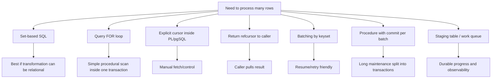
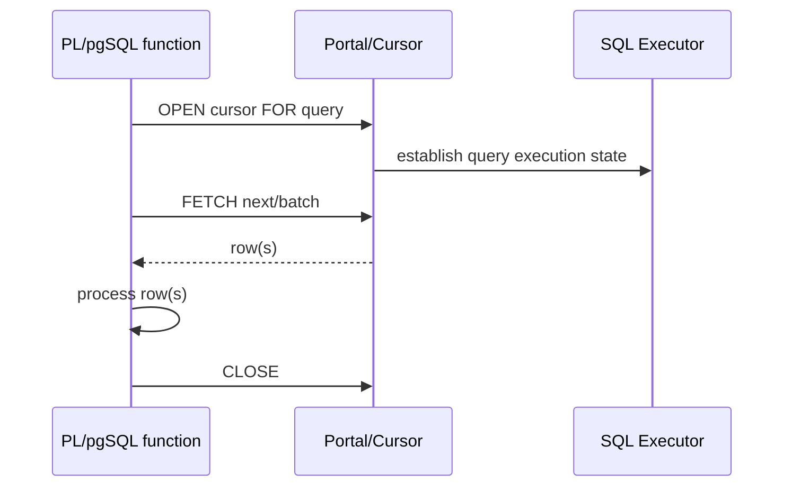

# Part 016 — Cursors, Portals, Batching, and Large Result Processing

> Target part ini: kamu bisa memutuskan kapan memakai query loop biasa, explicit cursor, `refcursor`, batching berbasis keyset, procedure dengan commit per batch, temporary/staging table, atau streaming melalui application cursor. Kamu juga akan paham mengapa cursor bukan magic memory fix, mengapa transaction boundary menentukan lifetime cursor, dan mengapa sebagian besar pemrosesan besar sebaiknya didesain sebagai batch contract yang eksplisit.

Cursor adalah salah satu fitur yang sering disalahpahami.

Banyak engineer melihat cursor sebagai:

> “Cara loop row satu-satu tanpa load semua data.”

Itu hanya sebagian kecil. Dalam sistem produksi, pertanyaan yang lebih penting adalah:

- Siapa pemilik cursor?
- Berapa lama cursor hidup?
- Apakah cursor berada dalam transaction yang panjang?
- Apakah snapshot cursor membuat data lama tetap terlihat?
- Apakah pemrosesan row-by-row benar-benar diperlukan?
- Apakah consumer bisa gagal di tengah?
- Apakah progress bisa dilanjutkan?
- Apakah output function sebenarnya materialized sebelum dikirim?
- Apakah batch lebih aman daripada cursor?

Part ini membahas cursor sebagai **execution boundary**, bukan syntax loop.

---

## 1. Peta Mekanisme Pemrosesan Hasil Besar

Untuk hasil besar, kamu punya beberapa pilihan.



Decision rule awal:

> Jika bisa set-based, pakai set-based. Jika harus procedural, batch dengan progress contract. Cursor berguna untuk controlled iteration, tetapi bukan pengganti desain batch yang durable.

---

## 2. Mental Model: Cursor, Portal, dan `refcursor`

Di PL/pgSQL, cursor diakses melalui variable bertipe `refcursor` atau cursor variable yang dideklarasikan.

Mental model sederhana:

```txt
Cursor variable  -> nama/handle di PL/pgSQL
Portal           -> server-side execution state untuk query
FETCH            -> ambil row dari portal
CLOSE            -> tutup portal
Transaction      -> boundary umum lifetime cursor
```

Diagram:



Cursor bukan data structure biasa di memory PL/pgSQL. Ia adalah handle ke execution state di server.

---

## 3. Query `FOR` Loop: Default untuk Iterasi Sederhana

PL/pgSQL punya query `FOR` loop:

```sql
CREATE OR REPLACE FUNCTION app.rebuild_case_summary(p_tenant_id uuid)
RETURNS integer
LANGUAGE plpgsql
AS $$
DECLARE
  r record;
  v_count integer := 0;
BEGIN
  FOR r IN
    SELECT c.id, c.status
    FROM app.enforcement_case c
    WHERE c.tenant_id = p_tenant_id
    ORDER BY c.id
  LOOP
    -- procedural work per row
    v_count := v_count + 1;
  END LOOP;

  RETURN v_count;
END;
$$;
```

Gunakan ini jika:

- logic per row ringan;
- jumlah row bounded;
- satu transaction acceptable;
- tidak perlu return cursor ke caller;
- tidak perlu manual fetch size;
- tidak perlu interleave beberapa cursor.

Tetapi jangan anggap query `FOR` loop otomatis aman untuk jutaan row. Ia tetap berada dalam transaction function call, dan procedural work per row tetap bisa mahal.

---

## 4. Explicit Cursor: Ketika Kamu Butuh Kontrol Manual

Contoh explicit cursor:

```sql
CREATE OR REPLACE FUNCTION app.process_due_cases_with_cursor(
  p_tenant_id uuid,
  p_limit integer DEFAULT 1000
)
RETURNS integer
LANGUAGE plpgsql
AS $$
DECLARE
  cur refcursor;
  r record;
  v_count integer := 0;
BEGIN
  OPEN cur FOR
    SELECT c.id, c.escalation_due_at
    FROM app.enforcement_case c
    WHERE c.tenant_id = p_tenant_id
      AND c.status IN ('OPEN', 'UNDER_REVIEW')
      AND c.escalation_due_at <= clock_timestamp()
    ORDER BY c.escalation_due_at, c.id
    LIMIT p_limit;

  LOOP
    FETCH cur INTO r;
    EXIT WHEN NOT FOUND;

    -- Process one row.
    v_count := v_count + 1;
  END LOOP;

  CLOSE cur;
  RETURN v_count;
EXCEPTION WHEN OTHERS THEN
  IF cur IS NOT NULL THEN
    BEGIN
      CLOSE cur;
    EXCEPTION WHEN invalid_cursor_name THEN
      NULL;
    END;
  END IF;
  RAISE;
END;
$$;
```

Kapan explicit cursor berguna?

- perlu `FETCH` manual;
- perlu fetch arah tertentu;
- perlu cursor sebagai output `refcursor`;
- perlu interleave beberapa result stream;
- perlu dynamic cursor query;
- perlu memberi nama portal tertentu.

Kapan tidak perlu?

- sekadar loop query sederhana;
- transformasi bisa set-based;
- ingin “membuat cepat” tanpa bukti;
- ingin memproses jutaan row tapi tetap satu transaction.

---

## 5. Bound Cursor vs Unbound Cursor

PL/pgSQL mendukung cursor yang terikat query sejak deklarasi.

```sql
CREATE OR REPLACE FUNCTION app.count_open_cases_cursor(p_tenant_id uuid)
RETURNS integer
LANGUAGE plpgsql
AS $$
DECLARE
  cur_open_cases CURSOR(p_tenant uuid) FOR
    SELECT c.id
    FROM app.enforcement_case c
    WHERE c.tenant_id = p_tenant
      AND c.status = 'OPEN';
  r record;
  v_count integer := 0;
BEGIN
  OPEN cur_open_cases(p_tenant_id);

  LOOP
    FETCH cur_open_cases INTO r;
    EXIT WHEN NOT FOUND;
    v_count := v_count + 1;
  END LOOP;

  CLOSE cur_open_cases;
  RETURN v_count;
END;
$$;
```

Bound cursor cocok jika:

- query cursor adalah bagian stabil dari function;
- kamu ingin memberi nama semantic pada cursor;
- parameter cursor jelas.

Unbound `refcursor` cocok jika:

- query dibangun runtime;
- cursor akan dikembalikan ke caller;
- portal name perlu dikontrol;
- function generic admin/maintenance.

---

## 6. Returning `refcursor`: Saat Caller yang Mengonsumsi

Function bisa membuka cursor dan mengembalikan handle ke caller.

```sql
CREATE OR REPLACE FUNCTION app.open_case_export_cursor(
  p_tenant_id uuid,
  p_from timestamptz,
  p_to timestamptz
)
RETURNS refcursor
LANGUAGE plpgsql
AS $$
DECLARE
  v_cursor refcursor := 'case_export_cursor';
BEGIN
  OPEN v_cursor FOR
    SELECT c.id, c.case_number, c.status, c.created_at
    FROM app.enforcement_case c
    WHERE c.tenant_id = p_tenant_id
      AND c.created_at >= p_from
      AND c.created_at < p_to
    ORDER BY c.created_at, c.id;

  RETURN v_cursor;
END;
$$;
```

Caller harus berada dalam transaction yang sama saat fetch:

```sql
BEGIN;
SELECT app.open_case_export_cursor('00000000-0000-0000-0000-000000000001', now() - interval '1 day', now());
FETCH 1000 FROM case_export_cursor;
FETCH 1000 FROM case_export_cursor;
CLOSE case_export_cursor;
COMMIT;
```

Ini penting: cursor yang dikembalikan bukan file download durable. Ia adalah handle server-side yang terkait transaction/session semantics.

Gunakan return `refcursor` jika:

- caller tahu cara mengelola transaction;
- protocol/client mendukung cursor consumption;
- hasil besar perlu ditarik bertahap;
- kamu menerima risiko transaction yang tetap terbuka selama fetch.

Jangan gunakan jika:

- API HTTP biasa tidak bisa menjaga transaction panjang dengan aman;
- caller tidak disiplin menutup cursor;
- workload high-concurrency;
- data harus diproses durable/resumable;
- kamu sebenarnya butuh export job asynchronous dengan result table/object storage.

---

## 7. Cursor Lifetime dan Transaction Boundary

Ini sumber bug besar.

Dalam pola umum, cursor hidup di dalam transaction. Jika transaction selesai, cursor tertutup.

```sql
BEGIN;
SELECT app.open_case_export_cursor(...);
FETCH 1000 FROM case_export_cursor;
COMMIT;
-- cursor no longer usable
FETCH 1000 FROM case_export_cursor; -- error
```

Konsekuensi:

- long cursor consumption berarti long transaction;
- long transaction bisa menahan snapshot;
- vacuum cleanup bisa terdampak;
- lock/resource bisa lebih lama;
- idle-in-transaction dengan cursor adalah incident waiting to happen.

Untuk aplikasi web, long transaction cursor biasanya buruk. Lebih aman memakai keyset pagination atau export job durable.

---

## 8. Cursor vs Pagination: Jangan Campur Tujuan

Cursor server-side:

- stateful;
- transaction/session-bound;
- bagus untuk controlled backend processing;
- buruk untuk stateless API publik.

Keyset pagination:

- stateless-ish;
- bisa resume;
- cocok untuk API;
- membutuhkan ordering key stabil.

Contoh keyset:

```sql
CREATE OR REPLACE FUNCTION app.list_cases_page(
  p_tenant_id uuid,
  p_after_created_at timestamptz DEFAULT NULL,
  p_after_id uuid DEFAULT NULL,
  p_limit integer DEFAULT 100
)
RETURNS TABLE(case_id uuid, case_number text, created_at timestamptz)
LANGUAGE plpgsql
STABLE
AS $$
BEGIN
  IF p_limit IS NULL OR p_limit NOT BETWEEN 1 AND 500 THEN
    RAISE EXCEPTION 'invalid limit: %', p_limit USING ERRCODE = '22023';
  END IF;

  RETURN QUERY
  SELECT c.id, c.case_number, c.created_at
  FROM app.enforcement_case c
  WHERE c.tenant_id = p_tenant_id
    AND (
      p_after_created_at IS NULL
      OR (c.created_at, c.id) > (p_after_created_at, p_after_id)
    )
  ORDER BY c.created_at ASC, c.id ASC
  LIMIT p_limit;
END;
$$;
```

Index:

```sql
CREATE INDEX enforcement_case_tenant_created_id_idx
ON app.enforcement_case (tenant_id, created_at, id);
```

Untuk external API, ini biasanya lebih aman daripada `refcursor`.

---

## 9. Cursor Does Not Fix Row-by-Row Mutation

Buruk:

```sql
OPEN cur FOR SELECT id FROM app.enforcement_case WHERE tenant_id = p_tenant_id;
LOOP
  FETCH cur INTO v_id;
  EXIT WHEN NOT FOUND;

  UPDATE app.enforcement_case
  SET normalized = true
  WHERE id = v_id;
END LOOP;
```

Ini tetap row-by-row update.

Lebih baik:

```sql
UPDATE app.enforcement_case c
SET normalized = true
WHERE c.tenant_id = p_tenant_id
  AND c.normalized = false;
```

Jika perlu batch:

```sql
WITH batch AS (
  SELECT c.id
  FROM app.enforcement_case c
  WHERE c.tenant_id = p_tenant_id
    AND c.normalized = false
  ORDER BY c.id
  LIMIT p_batch_size
  FOR UPDATE SKIP LOCKED
)
UPDATE app.enforcement_case c
SET normalized = true
FROM batch b
WHERE c.id = b.id
RETURNING c.id;
```

Cursor adalah iteration mechanism, bukan performance strategy.

---

## 10. Batching: Strategy Utama untuk Data Besar

Batching menjawab problem yang cursor tidak jawab:

- membatasi lock duration;
- membatasi WAL burst;
- membatasi memory;
- membuat progress observable;
- memungkinkan retry;
- memungkinkan parallel worker;
- memungkinkan pause/resume;
- menghindari transaction terlalu panjang.

Batching contract minimal:

```txt
Input:
- scope: tenant/date/status
- batch size
- worker id/run id

Selection:
- deterministic order
- lock strategy if concurrent workers
- progress boundary

Mutation:
- set-based per batch
- row_count captured

Output:
- rows processed
- last key/checkpoint
- done flag
- diagnostics
```

---

## 11. Pattern: Single-Batch Function

Function yang memproses satu batch kecil lebih mudah dikontrol daripada function yang mencoba menyelesaikan semua.

```sql
CREATE OR REPLACE FUNCTION app.normalize_cases_batch(
  p_tenant_id uuid,
  p_after_id uuid DEFAULT NULL,
  p_batch_size integer DEFAULT 1000
)
RETURNS TABLE(processed_count integer, last_case_id uuid, has_more boolean)
LANGUAGE plpgsql
VOLATILE
AS $$
DECLARE
  v_processed integer;
  v_last_id uuid;
BEGIN
  IF p_batch_size IS NULL OR p_batch_size NOT BETWEEN 1 AND 10000 THEN
    RAISE EXCEPTION 'invalid batch size: %', p_batch_size
      USING ERRCODE = '22023';
  END IF;

  WITH batch AS (
    SELECT c.id
    FROM app.enforcement_case c
    WHERE c.tenant_id = p_tenant_id
      AND c.normalized = false
      AND (p_after_id IS NULL OR c.id > p_after_id)
    ORDER BY c.id
    LIMIT p_batch_size
    FOR UPDATE SKIP LOCKED
  ), updated AS (
    UPDATE app.enforcement_case c
    SET normalized = true,
        normalized_at = clock_timestamp()
    FROM batch b
    WHERE c.id = b.id
    RETURNING c.id
  )
  SELECT count(*), max(id)
    INTO v_processed, v_last_id
  FROM updated;

  RETURN QUERY
  SELECT
    coalesce(v_processed, 0)::integer,
    v_last_id,
    coalesce(v_processed, 0) = p_batch_size;
END;
$$;
```

Kelebihan:

- caller dapat loop dengan commit antar batch;
- function bounded;
- mudah di-benchmark;
- mudah di-retry;
- tidak membuka transaction sangat panjang;
- progress eksplisit.

Catatan: `has_more` berbasis `processed_count = batch_size` adalah indikasi, bukan bukti absolut. Jika concurrency tinggi, caller bisa memanggil lagi sampai `processed_count = 0`.

---

## 12. Pattern: Procedure untuk Commit per Batch

Jika kamu ingin server-side procedure yang mengelola transaction antar batch, gunakan `CREATE PROCEDURE` dan `CALL` pada boundary yang mengizinkan transaction control.

```sql
CREATE OR REPLACE PROCEDURE app.normalize_cases_all(
  p_tenant_id uuid,
  p_batch_size integer DEFAULT 1000,
  p_max_batches integer DEFAULT 100
)
LANGUAGE plpgsql
AS $$
DECLARE
  v_batch_no integer := 0;
  v_processed integer;
BEGIN
  IF p_batch_size NOT BETWEEN 1 AND 10000 THEN
    RAISE EXCEPTION 'invalid batch size: %', p_batch_size
      USING ERRCODE = '22023';
  END IF;

  LOOP
    v_batch_no := v_batch_no + 1;

    WITH batch AS (
      SELECT c.id
      FROM app.enforcement_case c
      WHERE c.tenant_id = p_tenant_id
        AND c.normalized = false
      ORDER BY c.id
      LIMIT p_batch_size
      FOR UPDATE SKIP LOCKED
    ), updated AS (
      UPDATE app.enforcement_case c
      SET normalized = true,
          normalized_at = clock_timestamp()
      FROM batch b
      WHERE c.id = b.id
      RETURNING c.id
    )
    SELECT count(*) INTO v_processed FROM updated;

    RAISE NOTICE 'tenant=% batch=% processed=%', p_tenant_id, v_batch_no, v_processed;

    COMMIT;

    EXIT WHEN v_processed = 0;
    EXIT WHEN v_batch_no >= p_max_batches;
  END LOOP;
END;
$$;
```

Gunakan dengan sadar:

```sql
CALL app.normalize_cases_all('00000000-0000-0000-0000-000000000001', 1000, 50);
```

Risiko:

- procedure transaction control punya batasan call context;
- commit per batch berarti partial progress normal;
- harus idempotent;
- harus punya run log jika operasional penting;
- error setelah batch ke-10 tidak rollback batch 1-10.

Procedure ini cocok untuk maintenance. Untuk business transaction biasa, jangan pecah commit sembarangan.

---

## 13. Pattern: Durable Batch Run Table

Untuk pekerjaan operasional serius, jangan hanya `NOTICE`. Buat run table.

```sql
CREATE TABLE app.maintenance_run (
  run_id uuid PRIMARY KEY,
  job_name text NOT NULL,
  tenant_id uuid,
  status text NOT NULL CHECK (status IN ('RUNNING', 'COMPLETED', 'FAILED', 'CANCELLED')),
  started_at timestamptz NOT NULL DEFAULT clock_timestamp(),
  finished_at timestamptz,
  last_checkpoint jsonb NOT NULL DEFAULT '{}'::jsonb,
  total_processed bigint NOT NULL DEFAULT 0,
  error_code text,
  error_message text
);

CREATE TABLE app.maintenance_run_step (
  run_id uuid NOT NULL REFERENCES app.maintenance_run(run_id),
  step_no integer NOT NULL,
  started_at timestamptz NOT NULL DEFAULT clock_timestamp(),
  finished_at timestamptz,
  processed_count integer NOT NULL,
  checkpoint jsonb NOT NULL DEFAULT '{}'::jsonb,
  PRIMARY KEY (run_id, step_no)
);
```

Batch procedure dapat update progress:

```sql
INSERT INTO app.maintenance_run_step(
  run_id,
  step_no,
  finished_at,
  processed_count,
  checkpoint
)
VALUES (
  p_run_id,
  v_batch_no,
  clock_timestamp(),
  v_processed,
  jsonb_build_object('last_id', v_last_id)
);
```

Keuntungan:

- run bisa diaudit;
- progress bisa dilihat tanpa membaca log;
- retry bisa pakai checkpoint;
- dashboard bisa dibuat;
- operator tahu batch mana gagal.

---

## 14. Work Queue Pattern dengan `FOR UPDATE SKIP LOCKED`

Untuk parallel worker, sering lebih baik memakai table sebagai queue daripada cursor.

```sql
CREATE TABLE app.case_reindex_queue (
  case_id uuid PRIMARY KEY,
  tenant_id uuid NOT NULL,
  status text NOT NULL DEFAULT 'PENDING'
    CHECK (status IN ('PENDING', 'PROCESSING', 'DONE', 'FAILED')),
  available_at timestamptz NOT NULL DEFAULT clock_timestamp(),
  attempt_count integer NOT NULL DEFAULT 0,
  locked_by uuid,
  locked_at timestamptz,
  last_error text
);
```

Claim function:

```sql
CREATE OR REPLACE FUNCTION app.claim_reindex_jobs(
  p_worker_id uuid,
  p_limit integer DEFAULT 100
)
RETURNS TABLE(case_id uuid, tenant_id uuid)
LANGUAGE plpgsql
VOLATILE
AS $$
BEGIN
  IF p_limit NOT BETWEEN 1 AND 1000 THEN
    RAISE EXCEPTION 'invalid limit: %', p_limit USING ERRCODE = '22023';
  END IF;

  RETURN QUERY
  WITH candidate AS (
    SELECT q.case_id
    FROM app.case_reindex_queue q
    WHERE q.status = 'PENDING'
      AND q.available_at <= clock_timestamp()
    ORDER BY q.available_at, q.case_id
    LIMIT p_limit
    FOR UPDATE SKIP LOCKED
  )
  UPDATE app.case_reindex_queue q
  SET status = 'PROCESSING',
      locked_by = p_worker_id,
      locked_at = clock_timestamp(),
      attempt_count = q.attempt_count + 1
  FROM candidate c
  WHERE q.case_id = c.case_id
  RETURNING q.case_id, q.tenant_id;
END;
$$;
```

Ini sering lebih operasional daripada cursor karena:

- pekerjaan durable;
- banyak worker bisa claim;
- retry bisa dijadwalkan;
- status terlihat;
- tidak butuh long cursor transaction.

---

## 15. Large Result Export: Cursor atau Export Job?

Misal aplikasi perlu export 20 juta case events.

Pilihan 1: `refcursor`.

Kelebihan:

- caller fetch bertahap;
- tidak perlu menyimpan hasil intermediate;
- cocok untuk controlled internal client.

Kekurangan:

- transaction panjang;
- client harus disiplin;
- failure di tengah sulit resume;
- tidak cocok untuk request HTTP panjang;
- resource server bisa tertahan.

Pilihan 2: export job.

```sql
CREATE TABLE app.export_job (
  export_id uuid PRIMARY KEY,
  tenant_id uuid NOT NULL,
  status text NOT NULL CHECK (status IN ('PENDING', 'RUNNING', 'COMPLETED', 'FAILED')),
  requested_by uuid NOT NULL,
  requested_at timestamptz NOT NULL DEFAULT clock_timestamp(),
  from_time timestamptz NOT NULL,
  to_time timestamptz NOT NULL,
  result_location text,
  error_message text
);
```

Worker memproses dengan keyset batch dan menulis ke file/object storage atau export table.

Untuk enterprise API, export job biasanya lebih baik.

Decision:

| Kebutuhan | Lebih cocok |
|---|---|
| Internal admin session, fetch manual | `refcursor` |
| API stateless | keyset pagination |
| Export besar dan durable | export job |
| Maintenance mutation | batch function/procedure |
| Parallel processing | queue + `SKIP LOCKED` |
| Small procedural scan | query `FOR` loop |

---

## 16. Cursor Scrollability dan Direction

Cursor bisa memiliki kemampuan seperti scroll/no scroll tergantung declaration dan query.

Untuk kebanyakan processing produksi, jangan bergantung pada backward fetch kecuali benar-benar perlu.

Forward-only mental model lebih sederhana:

```txt
open -> fetch next batch -> process -> fetch next batch -> close
```

Backward/scrollable cursor menambah complexity:

- resource usage bisa berbeda;
- query tertentu tidak cocok;
- caller logic lebih rumit;
- debugging lebih sulit.

Untuk pagination UI, jangan pakai scrollable cursor. Pakai keyset pagination dengan cursor token aplikasi.

---

## 17. Dynamic Cursor Query

Kadang cursor query perlu dynamic identifier.

```sql
CREATE OR REPLACE FUNCTION app.open_table_scan_cursor(
  p_schema_name text,
  p_table_name text
)
RETURNS refcursor
LANGUAGE plpgsql
AS $$
DECLARE
  v_cursor refcursor := 'table_scan_cursor';
BEGIN
  IF p_schema_name !~ '^[a-z][a-z0-9_]*$'
     OR p_table_name !~ '^[a-z][a-z0-9_]*$' THEN
    RAISE EXCEPTION 'invalid relation name %.%', p_schema_name, p_table_name
      USING ERRCODE = '22023';
  END IF;

  OPEN v_cursor FOR EXECUTE format(
    'SELECT * FROM %I.%I ORDER BY 1 LIMIT 10000',
    p_schema_name,
    p_table_name
  );

  RETURN v_cursor;
END;
$$;
```

Tetap pakai `%I` untuk identifier. Jangan concatenate nama table mentah.

Untuk production, tambahkan allow-list dari metadata table, bukan hanya regex.

```sql
IF NOT EXISTS (
  SELECT 1
  FROM app.allowed_export_relation r
  WHERE r.schema_name = p_schema_name
    AND r.table_name = p_table_name
    AND r.enabled
) THEN
  RAISE EXCEPTION 'relation not allowed for export: %.%', p_schema_name, p_table_name
    USING ERRCODE = '42501';
END IF;
```

---

## 18. Fetch Batch Manual di PL/pgSQL

PL/pgSQL cursor `FETCH` ke satu row umum dipakai. Untuk batch processing, biasanya lebih baik pakai SQL `LIMIT` batch daripada cursor fetch satu-satu.

Kenapa?

- Set-based update per batch lebih efisien.
- Row-count mudah ditangkap.
- Progress checkpoint jelas.
- Bisa `FOR UPDATE SKIP LOCKED`.
- Commit per batch lebih natural di procedure.

Cursor fetch batch lebih relevan untuk caller eksternal:

```sql
FETCH 1000 FROM case_export_cursor;
```

Di dalam PL/pgSQL, jika setelah fetch kamu tetap update row satu-satu, kamu kembali ke anti-pattern.

---

## 19. Snapshot Semantics: Data Bisa Berubah Saat Kamu Memproses

Dengan cursor atau long transaction, snapshot menentukan data yang terlihat. Dengan batching commit per batch, setiap batch bisa melihat kondisi terbaru.

Perbedaan:

| Model | Visibility | Risiko |
|---|---|---|
| Single long transaction cursor | Snapshot lebih stabil | long transaction, vacuum pressure, stale view |
| Batch per transaction | Melihat perubahan antar batch | result set bisa berubah, perlu idempotency |
| Queue claim | Durable explicit state | butuh queue maintenance |
| Export snapshot | Konsistensi kuat | mahal untuk hasil sangat besar |

Untuk regulatory/audit export, kamu mungkin butuh snapshot consistency. Untuk maintenance normalization, kamu lebih butuh progress dan retry.

Jangan memilih cursor hanya karena “hasil besar”. Pilih berdasarkan consistency contract.

---

## 20. Idempotent Batch Mutation

Batch besar harus idempotent.

Buruk:

```sql
UPDATE app.account
SET balance = balance + 10
WHERE id IN (SELECT ... batch ...);
```

Jika batch diulang, balance bertambah lagi.

Lebih aman:

```sql
UPDATE app.enforcement_case
SET normalized_case_number = upper(regexp_replace(case_number, '\s+', '', 'g')),
    normalized = true,
    normalized_at = clock_timestamp()
WHERE normalized = false
  AND id IN (SELECT id FROM batch);
```

Atau pakai operation ledger:

```sql
CREATE TABLE app.case_operation_ledger (
  operation_id uuid NOT NULL,
  case_id uuid NOT NULL,
  operation_type text NOT NULL,
  applied_at timestamptz NOT NULL DEFAULT clock_timestamp(),
  PRIMARY KEY (operation_id, case_id)
);
```

Mutation:

```sql
WITH candidate AS (...), inserted AS (
  INSERT INTO app.case_operation_ledger(operation_id, case_id, operation_type)
  SELECT p_operation_id, c.id, 'RECALCULATE_SCORE'
  FROM candidate c
  ON CONFLICT DO NOTHING
  RETURNING case_id
)
UPDATE app.enforcement_case c
SET risk_score = s.risk_score
FROM inserted i
JOIN app.case_score_staging s ON s.case_id = i.case_id
WHERE c.id = i.case_id;
```

Idempotency lebih penting daripada cursor elegance.

---

## 21. Locking: Cursor Tidak Otomatis Melindungi dari Race

Jika kamu membuka cursor:

```sql
OPEN cur FOR
  SELECT id
  FROM app.enforcement_case
  WHERE status = 'PENDING';
```

Lalu fetch dan update, row bisa diproses worker lain jika tidak ada lock/claim strategy.

Untuk worker parallel, gunakan claim update:

```sql
WITH candidate AS (
  SELECT id
  FROM app.enforcement_case
  WHERE status = 'PENDING'
  ORDER BY id
  LIMIT 100
  FOR UPDATE SKIP LOCKED
)
UPDATE app.enforcement_case c
SET status = 'PROCESSING'
FROM candidate x
WHERE c.id = x.id
RETURNING c.id;
```

Ini mengubah status secara atomik dalam batch. Cursor select saja tidak cukup.

---

## 22. Memory Traps pada Return Set

Part 009 sudah menyinggung bahwa `RETURN NEXT` dan `RETURN QUERY` di PL/pgSQL tidak boleh dianggap true streaming API.

Buruk untuk hasil sangat besar:

```sql
CREATE OR REPLACE FUNCTION app.export_all_events(p_tenant_id uuid)
RETURNS TABLE(event_id bigint, payload jsonb)
LANGUAGE plpgsql
AS $$
BEGIN
  RETURN QUERY
  SELECT e.id, e.payload
  FROM app.case_event e
  WHERE e.tenant_id = p_tenant_id
  ORDER BY e.id;
END;
$$;
```

Untuk 50 juta row, ini bukan desain API yang baik.

Alternatif:

- keyset pagination function;
- `refcursor` untuk internal controlled client;
- export job;
- COPY command dari client/admin pipeline;
- materialized result table dengan chunk.

---

## 23. Pattern: Keyset Export Page

```sql
CREATE OR REPLACE FUNCTION app.export_case_events_page(
  p_tenant_id uuid,
  p_after_id bigint DEFAULT NULL,
  p_limit integer DEFAULT 10000
)
RETURNS TABLE(event_id bigint, case_id uuid, event_type text, occurred_at timestamptz, payload jsonb)
LANGUAGE plpgsql
STABLE
ROWS 10000
AS $$
BEGIN
  IF p_limit IS NULL OR p_limit NOT BETWEEN 1 AND 50000 THEN
    RAISE EXCEPTION 'invalid limit: %', p_limit USING ERRCODE = '22023';
  END IF;

  RETURN QUERY
  SELECT e.id, e.case_id, e.event_type, e.occurred_at, e.payload
  FROM app.case_event e
  WHERE e.tenant_id = p_tenant_id
    AND (p_after_id IS NULL OR e.id > p_after_id)
  ORDER BY e.id
  LIMIT p_limit;
END;
$$;
```

Index:

```sql
CREATE INDEX case_event_tenant_id_idx
ON app.case_event (tenant_id, id);
```

Caller loop:

```txt
last_id = null
repeat:
  rows = select * from app.export_case_events_page(tenant, last_id, 10000)
  write rows
  last_id = max(event_id)
until rows empty
```

Kelebihan:

- stateless between calls except checkpoint;
- resume mudah;
- no long transaction;
- cocok untuk distributed worker;
- easy observability.

Kekurangan:

- tidak snapshot-consistent jika data berubah;
- butuh ordering key stabil;
- deletion/insertion semantics harus dipahami.

Untuk audit export yang harus snapshot-consistent, buat export job dengan captured upper bound:

```sql
SELECT max(id) INTO v_max_id
FROM app.case_event
WHERE tenant_id = p_tenant_id;
```

Lalu export:

```sql
WHERE tenant_id = p_tenant_id
  AND id > p_after_id
  AND id <= v_max_id
```

Ini memberi boundary deterministik untuk append-only event table.

---

## 24. Staging Table untuk Transformasi Berat

Jika transformasi melibatkan banyak phase, staging table sering lebih baik daripada cursor besar.

```sql
CREATE TABLE app.case_score_rebuild_stage (
  run_id uuid NOT NULL,
  case_id uuid NOT NULL,
  computed_score numeric NOT NULL,
  status text NOT NULL DEFAULT 'READY'
    CHECK (status IN ('READY', 'APPLIED', 'FAILED')),
  error_message text,
  PRIMARY KEY (run_id, case_id)
);
```

Phase 1: compute set-based.

```sql
INSERT INTO app.case_score_rebuild_stage(run_id, case_id, computed_score)
SELECT p_run_id, c.id, coalesce(sum(e.weight), 0)
FROM app.enforcement_case c
LEFT JOIN app.case_event e ON e.case_id = c.id
WHERE c.tenant_id = p_tenant_id
GROUP BY c.id
ON CONFLICT (run_id, case_id) DO UPDATE
SET computed_score = EXCLUDED.computed_score,
    status = 'READY',
    error_message = NULL;
```

Phase 2: apply batch.

```sql
WITH batch AS (
  SELECT s.case_id, s.computed_score
  FROM app.case_score_rebuild_stage s
  WHERE s.run_id = p_run_id
    AND s.status = 'READY'
  ORDER BY s.case_id
  LIMIT p_batch_size
  FOR UPDATE SKIP LOCKED
), applied AS (
  UPDATE app.enforcement_case c
  SET risk_score = b.computed_score,
      updated_at = clock_timestamp()
  FROM batch b
  WHERE c.id = b.case_id
  RETURNING c.id
)
UPDATE app.case_score_rebuild_stage s
SET status = 'APPLIED'
FROM applied a
WHERE s.run_id = p_run_id
  AND s.case_id = a.id;
```

Staging table memberi:

- checkpoint;
- auditability;
- retry;
- ability to inspect before apply;
- separation of compute and mutation;
- operational pause/resume.

---

## 25. Temporary Table vs Permanent Staging

Temporary table cocok untuk:

- session-local intermediate;
- ad-hoc admin job;
- data tidak perlu diaudit;
- tidak perlu resume setelah disconnect.

Permanent staging cocok untuk:

- long-running job;
- retry/resume;
- audit/compliance;
- dashboard progress;
- worker parallel;
- handoff antar process.

Decision:

| Kebutuhan | Temp table | Permanent staging |
|---|---:|---:|
| Cepat untuk session lokal | Ya | Bisa |
| Survive disconnect | Tidak | Ya |
| Audit trail | Tidak natural | Ya |
| Parallel worker | Sulit | Ya |
| Cleanup lifecycle | Session | Harus didesain |
| Compliance visibility | Lemah | Kuat |

Untuk sistem regulatory, permanent staging sering lebih defensible.

---

## 26. Cleanup dan Resource Safety

Explicit cursor harus ditutup.

Basic pattern:

```sql
DECLARE
  cur refcursor;
BEGIN
  OPEN cur FOR SELECT ...;

  LOOP
    FETCH cur INTO r;
    EXIT WHEN NOT FOUND;
    -- work
  END LOOP;

  CLOSE cur;
EXCEPTION WHEN OTHERS THEN
  IF cur IS NOT NULL THEN
    BEGIN
      CLOSE cur;
    EXCEPTION WHEN invalid_cursor_name THEN
      NULL;
    END;
  END IF;
  RAISE;
END;
```

Tetapi jangan over-engineer ini untuk query `FOR` loop. Query `FOR` loop lebih simple dan PL/pgSQL mengelola portal internalnya.

Untuk batch jobs, cleanup berarti juga:

- release stale locks;
- mark failed jobs;
- reset stuck processing rows;
- delete old staging rows;
- archive run logs;
- monitor idle transaction.

Example stale queue reset:

```sql
UPDATE app.case_reindex_queue q
SET status = 'PENDING',
    locked_by = NULL,
    locked_at = NULL,
    available_at = clock_timestamp() + interval '5 minutes',
    last_error = 'reset stale processing lock'
WHERE q.status = 'PROCESSING'
  AND q.locked_at < clock_timestamp() - interval '30 minutes';
```

---

## 27. Observability untuk Cursor dan Batch

Untuk cursor internal, observability minimal:

- opened count/scope;
- rows fetched/processed;
- elapsed time;
- close status;
- error context.

Untuk batch job:

- run id;
- step/batch no;
- selected count;
- updated count;
- skipped count;
- last checkpoint;
- lock wait if possible;
- started/finished time;
- status.

Example notice for manual admin:

```sql
RAISE NOTICE 'job=% batch=% selected=% updated=% checkpoint=% elapsed_ms=%',
  p_run_id,
  v_batch_no,
  v_selected,
  v_updated,
  v_last_id,
  extract(milliseconds from clock_timestamp() - v_started_at);
```

For production, prefer table logs over only `NOTICE`.

---

## 28. Case Study: Compliance Case Backfill

### Requirement

Backfill `normalized_case_number` for 200 million cases.

Constraints:

- must not lock whole table for hours;
- must be restartable;
- must show progress;
- must allow pause;
- must avoid double-applying unsafe mutation;
- must work per tenant;
- must not expose inconsistent API state as much as possible.

### Bad Design

```sql
CREATE OR REPLACE FUNCTION app.backfill_all_case_numbers()
RETURNS void
LANGUAGE plpgsql
AS $$
DECLARE
  r record;
BEGIN
  FOR r IN SELECT id, case_number FROM app.enforcement_case LOOP
    UPDATE app.enforcement_case
    SET normalized_case_number = upper(regexp_replace(r.case_number, '\s+', '', 'g'))
    WHERE id = r.id;
  END LOOP;
END;
$$;
```

Problems:

- one massive transaction;
- row-by-row update;
- no checkpoint;
- no pause;
- no progress;
- retry starts from beginning;
- huge WAL and bloat risk;
- operationally indefensible.

### Better Design: Batch Function

```sql
CREATE OR REPLACE FUNCTION app.backfill_case_numbers_batch(
  p_tenant_id uuid,
  p_after_id uuid DEFAULT NULL,
  p_batch_size integer DEFAULT 5000
)
RETURNS TABLE(processed_count integer, last_id uuid)
LANGUAGE plpgsql
VOLATILE
AS $$
DECLARE
  v_count integer;
  v_last_id uuid;
BEGIN
  IF p_batch_size NOT BETWEEN 1 AND 20000 THEN
    RAISE EXCEPTION 'invalid batch size: %', p_batch_size USING ERRCODE = '22023';
  END IF;

  WITH batch AS (
    SELECT c.id
    FROM app.enforcement_case c
    WHERE c.tenant_id = p_tenant_id
      AND c.normalized_case_number IS NULL
      AND (p_after_id IS NULL OR c.id > p_after_id)
    ORDER BY c.id
    LIMIT p_batch_size
    FOR UPDATE SKIP LOCKED
  ), updated AS (
    UPDATE app.enforcement_case c
    SET normalized_case_number = upper(regexp_replace(c.case_number, '\s+', '', 'g')),
        updated_at = clock_timestamp()
    FROM batch b
    WHERE c.id = b.id
    RETURNING c.id
  )
  SELECT count(*), max(id)
    INTO v_count, v_last_id
  FROM updated;

  RETURN QUERY SELECT coalesce(v_count, 0), v_last_id;
END;
$$;
```

### Better Design: Run Table

```sql
CREATE TABLE app.case_number_backfill_run (
  run_id uuid PRIMARY KEY,
  tenant_id uuid NOT NULL,
  status text NOT NULL CHECK (status IN ('RUNNING', 'PAUSED', 'COMPLETED', 'FAILED')),
  last_id uuid,
  total_processed bigint NOT NULL DEFAULT 0,
  started_at timestamptz NOT NULL DEFAULT clock_timestamp(),
  updated_at timestamptz NOT NULL DEFAULT clock_timestamp(),
  error_message text
);
```

### Operational Loop

```txt
while run.status == RUNNING:
  begin transaction
  call batch function using run.last_id
  update run.last_id and total_processed
  commit
  sleep if needed
```

This can be implemented in application worker or stored procedure, depending on operational preference.

Key point: cursor is not the main design. The main design is **bounded, idempotent, observable progress**.

---

## 29. Anti-Patterns

### 29.1 Cursor for Everything

```sql
DECLARE cur CURSOR FOR SELECT ...;
```

Not every loop needs explicit cursor. Use query `FOR` loop or set-based SQL.

### 29.2 Cursor in HTTP Request for Large Export

Bad if request may last minutes and hold transaction open.

Use export job or keyset pagination.

### 29.3 Row-by-Row Update Behind Cursor

Cursor does not make row-by-row mutation efficient.

Use set-based batch update.

### 29.4 No Deterministic Order

Batch without order can skip/repeat unpredictably under concurrent changes.

```sql
SELECT id FROM table LIMIT 1000;
```

Prefer:

```sql
SELECT id FROM table ORDER BY id LIMIT 1000;
```

### 29.5 Offset Pagination for Large Tables

```sql
OFFSET 10000000 LIMIT 1000
```

This becomes expensive as offset grows.

Use keyset.

### 29.6 Unbounded Batch Size

Never let caller pass arbitrary batch size.

### 29.7 No Stuck-Job Recovery

If worker dies while rows are `PROCESSING`, they must be recoverable.

### 29.8 Cursor as Consistency Illusion

Cursor may give a snapshot, but it does not define business consistency by itself. Define export boundary, data cutoff, and audit semantics explicitly.

---

## 30. Decision Matrix

| Problem | Best starting point | Avoid |
|---|---|---|
| Small procedural scan | Query `FOR` loop | Explicit cursor ceremony |
| Large read for internal client | `refcursor` or client cursor | Returning huge set from PL/pgSQL |
| Stateless API pagination | Keyset pagination | Server-side cursor across requests |
| Large mutation | Set-based batch | Row-by-row cursor update |
| Parallel workers | Queue + `FOR UPDATE SKIP LOCKED` | Shared cursor |
| Restartable maintenance | Permanent run/staging table | One long transaction |
| Snapshot export | Captured boundary/export job | Cursor without business cutoff |
| Dynamic relation scan | Dynamic cursor with allow-list | Raw string table name |

---

## 31. Review Checklist

Before approving cursor/batch PL/pgSQL code, ask:

### Cursor

- Is explicit cursor really needed?
- Who owns the cursor lifecycle?
- Is it closed on error?
- Does caller understand transaction requirements?
- Could keyset pagination be safer?
- Could export job be more appropriate?

### Batch

- Is batch size bounded?
- Is ordering deterministic?
- Is mutation idempotent?
- Is progress recorded?
- Is retry safe?
- Is stuck work recoverable?
- Is partial completion acceptable?
- Are locks held only briefly?

### Large Result

- Is result truly needed synchronously?
- Is output shape stable?
- Is there a snapshot/cutoff contract?
- Is memory bounded?
- Is consumer backpressure considered?

### Operational

- Is there run id/correlation id?
- Are row counts captured?
- Are errors stored with enough context?
- Is there a pause/cancel mechanism?
- Is cleanup lifecycle defined?

---

## 32. Mini-Lab: Compare Cursor, Keyset, and Batch

### 32.1 Setup

```sql
CREATE TABLE scratch.big_case (
  id bigserial PRIMARY KEY,
  tenant_id integer NOT NULL,
  status text NOT NULL,
  normalized boolean NOT NULL DEFAULT false,
  created_at timestamptz NOT NULL DEFAULT clock_timestamp()
);

INSERT INTO scratch.big_case(tenant_id, status, created_at)
SELECT
  CASE WHEN g <= 900000 THEN 1 ELSE 2 END,
  CASE WHEN random() < 0.8 THEN 'CLOSED' ELSE 'OPEN' END,
  clock_timestamp() - (random() * interval '365 days')
FROM generate_series(1, 1000000) g;

CREATE INDEX big_case_tenant_id_idx ON scratch.big_case(tenant_id, id);
CREATE INDEX big_case_tenant_status_created_idx ON scratch.big_case(tenant_id, status, created_at, id);
ANALYZE scratch.big_case;
```

### 32.2 Keyset Page

```sql
EXPLAIN (ANALYZE, BUFFERS)
SELECT id, status, created_at
FROM scratch.big_case
WHERE tenant_id = 1
  AND id > 500000
ORDER BY id
LIMIT 1000;
```

### 32.3 Offset Page

```sql
EXPLAIN (ANALYZE, BUFFERS)
SELECT id, status, created_at
FROM scratch.big_case
WHERE tenant_id = 1
ORDER BY id
OFFSET 500000
LIMIT 1000;
```

Compare cost and buffers.

### 32.4 Batch Update

```sql
WITH batch AS (
  SELECT id
  FROM scratch.big_case
  WHERE tenant_id = 1
    AND normalized = false
  ORDER BY id
  LIMIT 1000
  FOR UPDATE SKIP LOCKED
)
UPDATE scratch.big_case c
SET normalized = true
FROM batch b
WHERE c.id = b.id
RETURNING c.id;
```

Observe:

- rows updated;
- locks duration;
- ability to repeat;
- whether result is deterministic.

---

## 33. Kesimpulan

Cursor adalah alat, bukan strategi arsitektur.

Mental model akhir:

1. Query `FOR` loop cukup untuk procedural scan kecil/sederhana.
2. Explicit cursor berguna ketika kamu butuh manual fetch/lifecycle/control.
3. Returning `refcursor` memindahkan consumption ke caller, tetapi mengikat caller pada transaction/session discipline.
4. Untuk API stateless, keyset pagination biasanya lebih baik daripada server-side cursor.
5. Untuk mutation besar, batch set-based lebih baik daripada row-by-row cursor.
6. Untuk pekerjaan panjang, durable run table/staging/queue lebih penting daripada cursor.
7. `FOR UPDATE SKIP LOCKED` adalah pattern penting untuk parallel batch workers.
8. Hasil besar perlu consistency contract: snapshot, cutoff, checkpoint, atau export job.
9. Production-grade large processing berarti bounded, idempotent, observable, retryable, dan operable.

Part berikutnya masuk ke trigger functions, data-change triggers, dan row state machines. Setelah memahami plan dan batching, kita akan membahas cara menaruh logic di titik paling sensitif: saat data berubah.

---

## Source Anchors

- PostgreSQL Documentation — PL/pgSQL Cursors: `https://www.postgresql.org/docs/current/plpgsql-cursors.html`
- PostgreSQL Documentation — SQL DECLARE Cursor: `https://www.postgresql.org/docs/current/sql-declare.html`
- PostgreSQL Documentation — SQL FETCH: `https://www.postgresql.org/docs/current/sql-fetch.html`
- PostgreSQL Documentation — SQL CLOSE: `https://www.postgresql.org/docs/current/sql-close.html`
- PostgreSQL Documentation — PL/pgSQL Control Structures: `https://www.postgresql.org/docs/current/plpgsql-control-structures.html`
- PostgreSQL Documentation — PL/pgSQL Transaction Management: `https://www.postgresql.org/docs/current/plpgsql-transactions.html`
- PostgreSQL Documentation — `pg_cursors`: `https://www.postgresql.org/docs/current/view-pg-cursors.html`
