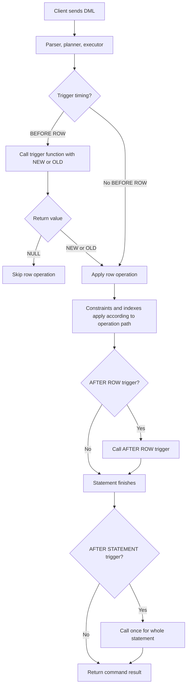
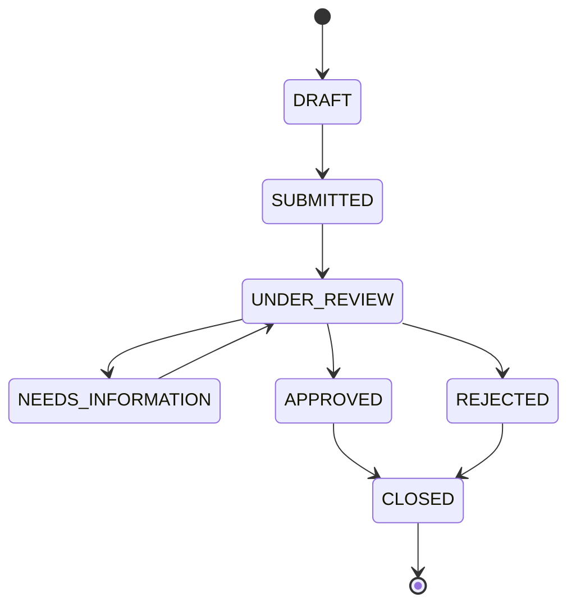

# Part 017 — Trigger Functions, Data Change Triggers, and Row State Machines

Trigger adalah salah satu fitur PostgreSQL yang paling mudah dipakai dan paling mudah disalahgunakan.

Di tangan yang tepat, trigger membuat invariant data sulit ditembus, audit lebih konsisten, dan workflow transisi state lebih defensible. Di tangan yang salah, trigger menjadi side effect tersembunyi yang membuat aplikasi sulit dipahami, migration berbahaya, debugging melelahkan, dan performa tidak stabil.

Mental model yang dipakai di part ini:

> Trigger bukan tempat untuk menaruh “semua business logic”. Trigger adalah enforcement hook yang berjalan karena perubahan data, bukan karena user journey.

Kita akan fokus pada trigger sebagai mekanisme implementasi produksi:

1. validasi row-level yang harus dekat dengan data,
2. normalisasi dan stamping otomatis,
3. audit dan change capture,
4. enforcement state machine,
5. prevention terhadap illegal mutation,
6. guardrail untuk data yang dimodifikasi dari banyak jalur,
7. integrasi dengan constraint, transaction, concurrency, dan deployment.

---

## 1. Apa yang Harus Diingat dari Dokumentasi Resmi

Baseline PostgreSQL current:

- PL/pgSQL bisa dipakai untuk trigger data-change dan event trigger.
- Data-change trigger function dibuat sebagai function tanpa argument formal dan return type `trigger`.
- Argument dari `CREATE TRIGGER` tidak masuk sebagai parameter function biasa; argument itu tersedia lewat `TG_ARGV`.
- Saat trigger dipanggil, PostgreSQL menyediakan special variables seperti `NEW`, `OLD`, `TG_NAME`, `TG_WHEN`, `TG_LEVEL`, `TG_OP`, `TG_RELID`, `TG_TABLE_NAME`, `TG_TABLE_SCHEMA`, `TG_NARGS`, dan `TG_ARGV`.
- Row-level `BEFORE` trigger dapat mengembalikan `NULL` untuk melewati operasi row tersebut.
- Row-level `BEFORE INSERT` dan `BEFORE UPDATE` dapat mengubah `NEW` lalu mengembalikan `NEW`.
- Return value dari row-level `AFTER` trigger dan statement-level trigger diabaikan, tetapi trigger tetap bisa membatalkan operasi dengan exception.
- `TG_RELNAME` deprecated; gunakan `TG_TABLE_NAME`.

Referensi resmi:

- PostgreSQL PL/pgSQL Trigger Functions: `https://www.postgresql.org/docs/current/plpgsql-trigger.html`
- PostgreSQL `CREATE TRIGGER`: `https://www.postgresql.org/docs/current/sql-createtrigger.html`

---

## 2. Trigger Mental Model

Sebuah trigger bukan “function yang dipanggil manual”. Trigger adalah callback database yang dipasang pada relation tertentu dan dieksekusi karena event tertentu.

Dimensi trigger:

| Dimensi | Pilihan | Pertanyaan desain |
|---|---|---|
| Timing | `BEFORE`, `AFTER`, `INSTEAD OF` | Apakah kita mau mengubah/menolak row sebelum masuk, atau bereaksi setelah perubahan valid? |
| Event | `INSERT`, `UPDATE`, `DELETE`, `TRUNCATE` | Mutation apa yang harus diawasi? |
| Level | `FOR EACH ROW`, `FOR EACH STATEMENT` | Logic butuh setiap row, atau cukup sekali per statement? |
| Target | table, view, foreign table | Hook dipasang di objek mana? |
| Filter | `WHEN` clause | Bisakah database menghindari pemanggilan trigger yang tidak perlu? |
| Function | `RETURNS trigger` | Kontrak eksekusi apa yang dijalankan? |

Diagram eksekusi row-level trigger:



Yang sering dilupakan: trigger berjalan dalam transaction yang sama dengan statement pemicu. Jika trigger raise exception, mutation utama ikut rollback. Ini membuat trigger sangat kuat untuk invariant, tetapi juga berbahaya jika melakukan side effect eksternal secara tidak langsung.

---

## 3. Trigger Function vs Trigger Object

Ada dua artefak berbeda:

1. trigger function,
2. trigger object.

Trigger function adalah kode.

```sql
CREATE OR REPLACE FUNCTION app_private.fn_case_guard_transition()
RETURNS trigger
LANGUAGE plpgsql
AS $$
BEGIN
    RETURN NEW;
END;
$$;
```

Trigger object adalah binding ke table/event/timing/level.

```sql
CREATE TRIGGER trg_20_case_guard_transition
BEFORE UPDATE OF status ON app_case.case_file
FOR EACH ROW
EXECUTE FUNCTION app_private.fn_case_guard_transition();
```

Kenapa pemisahan ini penting?

| Concern | Function | Trigger object |
|---|---|---|
| Reusable logic | Ya | Tidak |
| Dipasang pada table tertentu | Tidak secara langsung | Ya |
| Bisa menerima trigger args | Lewat `TG_ARGV` | Didefinisikan di sini |
| Migration dependency | Function bisa dibuat dulu | Trigger binding dibuat setelah table ada |
| Review ownership | Code review | Schema behavior review |

Prinsip produksi:

> Jangan review trigger hanya dari function body. Review selalu function plus trigger binding.

Function yang terlihat aman bisa berbahaya jika dipasang sebagai `BEFORE UPDATE` untuk semua kolom, bukan hanya kolom tertentu. Sebaliknya, function yang mahal bisa masih masuk akal jika trigger object memakai `WHEN` clause ketat.

---

## 4. Special Variables dalam Trigger Function

Template eksplorasi:

```sql
CREATE OR REPLACE FUNCTION app_private.fn_debug_trigger_context()
RETURNS trigger
LANGUAGE plpgsql
AS $$
BEGIN
    RAISE NOTICE 'trigger=%, schema=%, table=%, when=%, level=%, op=%',
        TG_NAME,
        TG_TABLE_SCHEMA,
        TG_TABLE_NAME,
        TG_WHEN,
        TG_LEVEL,
        TG_OP;

    RETURN COALESCE(NEW, OLD);
END;
$$;
```

Tabel penting:

| Variable | Type | Ada kapan | Gunakan untuk |
|---|---:|---|---|
| `NEW` | `record` | row-level `INSERT`/`UPDATE` | nilai baru |
| `OLD` | `record` | row-level `UPDATE`/`DELETE` | nilai lama |
| `TG_NAME` | `name` | semua trigger | observability |
| `TG_WHEN` | `text` | semua trigger | defensive assertion |
| `TG_LEVEL` | `text` | semua trigger | defensive assertion |
| `TG_OP` | `text` | semua trigger | branch `INSERT`/`UPDATE`/`DELETE`/`TRUNCATE` |
| `TG_RELID` | `oid` | semua trigger | lookup catalog aman |
| `TG_TABLE_NAME` | `name` | semua trigger | logging/metadata |
| `TG_TABLE_SCHEMA` | `name` | semua trigger | logging/metadata |
| `TG_NARGS` | `integer` | semua trigger | validasi trigger args |
| `TG_ARGV` | `text[]` | semua trigger | konfigurasi trigger ringan |

Gunakan `TG_TABLE_NAME`, bukan `TG_RELNAME`, karena `TG_RELNAME` deprecated.

---

## 5. Return Semantics: Bagian yang Sering Bikin Bug

Trigger function wajib return `NULL` atau row yang cocok dengan struktur target table.

### 5.1 `BEFORE INSERT` / `BEFORE UPDATE`

Return `NEW` untuk melanjutkan operasi.

```sql
CREATE OR REPLACE FUNCTION app_private.fn_stamp_case_file()
RETURNS trigger
LANGUAGE plpgsql
AS $$
BEGIN
    NEW.updated_at := clock_timestamp();
    NEW.updated_by := current_setting('app.user_id', true);

    IF TG_OP = 'INSERT' THEN
        NEW.created_at := COALESCE(NEW.created_at, NEW.updated_at);
        NEW.created_by := COALESCE(NEW.created_by, NEW.updated_by);
    END IF;

    RETURN NEW;
END;
$$;
```

Jika return `NULL`, row tidak di-insert/update. Ini kadang dipakai sebagai filtering, tetapi di sistem produksi lebih baik raise exception jika operasi memang illegal. Silent skip mudah menipu caller.

### 5.2 `BEFORE DELETE`

Return `OLD` untuk melanjutkan delete.

```sql
CREATE OR REPLACE FUNCTION app_private.fn_prevent_case_delete()
RETURNS trigger
LANGUAGE plpgsql
AS $$
BEGIN
    RAISE EXCEPTION USING
        ERRCODE = 'P0001',
        MESSAGE = 'CASE_DELETE_FORBIDDEN',
        DETAIL = format('case_id=%s', OLD.case_id);
END;
$$;
```

Di contoh ini tidak perlu return karena exception menghentikan operasi. Jika branch tidak exception, return `OLD`.

### 5.3 `AFTER ROW` dan `STATEMENT`

Return value diabaikan. Biasanya pakai:

```sql
RETURN NULL;
```

Tetapi jangan lupa: meskipun return value diabaikan, exception tetap membatalkan statement.

---

## 6. Timing Decision: BEFORE vs AFTER vs INSTEAD OF

| Timing | Cocok untuk | Hindari untuk |
|---|---|---|
| `BEFORE` | validasi, normalisasi, stamping, rewrite `NEW`, menolak operasi | audit final value yang bergantung pada constraint atau generated effect |
| `AFTER` | audit, outbox, summary update, dependent side effect internal DB | mengubah row utama yang sama secara berulang |
| `INSTEAD OF` | membuat view bisa menerima DML terkendali | menyembunyikan workflow kompleks tanpa dokumentasi |

Rule sederhana:

> Jika logic menentukan apakah row boleh masuk, gunakan `BEFORE`. Jika logic bereaksi karena row sudah berubah, gunakan `AFTER`.

Contoh salah:

```sql
-- Anti-pattern: AFTER trigger mengubah row yang baru saja di-update.
-- Ini bisa menyebabkan recursion, update tambahan, dan surprise row count.
CREATE OR REPLACE FUNCTION app_private.fn_bad_after_update_stamp()
RETURNS trigger
LANGUAGE plpgsql
AS $$
BEGIN
    UPDATE app_case.case_file
       SET updated_at = clock_timestamp()
     WHERE case_id = NEW.case_id;

    RETURN NULL;
END;
$$;
```

Lebih baik pakai `BEFORE UPDATE`:

```sql
CREATE OR REPLACE FUNCTION app_private.fn_good_before_update_stamp()
RETURNS trigger
LANGUAGE plpgsql
AS $$
BEGIN
    NEW.updated_at := clock_timestamp();
    RETURN NEW;
END;
$$;
```

---

## 7. Row-Level vs Statement-Level

### 7.1 Row-Level Trigger

Dieksekusi per row yang terkena mutation.

Cocok untuk:

- validasi per row,
- perubahan `NEW`,
- state transition guard,
- row-level audit detail,
- per-row outbox event.

Risiko:

- mahal untuk bulk update,
- memanggil query tambahan per row,
- lock amplification,
- deadlock jika query trigger tidak konsisten urutan aksesnya.

### 7.2 Statement-Level Trigger

Dieksekusi sekali per statement, termasuk statement yang menyentuh nol row.

Cocok untuk:

- logging operasi batch,
- invalidate cache marker,
- aggregate maintenance berbasis transition table,
- guardrail global ringan.

Risiko:

- tidak otomatis punya `NEW`/`OLD` per row,
- tidak cocok untuk validasi transisi spesifik row kecuali memakai transition table,
- bisa menipu jika developer mengira hanya fired saat ada row berubah.

---

## 8. `WHEN` Clause sebagai Filter Pertama

Jangan taruh semua predicate di function body jika PostgreSQL bisa memutuskan lebih awal lewat trigger `WHEN`.

Contoh:

```sql
CREATE TRIGGER trg_20_case_status_transition
BEFORE UPDATE OF status ON app_case.case_file
FOR EACH ROW
WHEN (OLD.status IS DISTINCT FROM NEW.status)
EXECUTE FUNCTION app_private.fn_guard_case_status_transition();
```

Keuntungan:

1. function tidak dipanggil untuk update kolom lain,
2. intent trigger terlihat di DDL,
3. risiko overhead lebih kecil,
4. audit reviewer bisa memahami event surface tanpa membaca seluruh function.

Tetap boleh ada guard di function:

```sql
IF TG_OP <> 'UPDATE' THEN
    RAISE EXCEPTION 'fn_guard_case_status_transition only supports UPDATE';
END IF;
```

`WHEN` adalah filter eksekusi. Defensive check di function adalah kontrak internal.

---

## 9. Naming Convention untuk Trigger Ordering

Jika ada lebih dari satu trigger dengan jenis yang sama untuk event yang sama pada relation yang sama, PostgreSQL menjalankannya berdasarkan nama trigger secara alfabetis.

Jangan bergantung pada kebetulan nama.

Gunakan prefiks urutan:

```sql
CREATE TRIGGER trg_10_case_normalize
BEFORE INSERT OR UPDATE ON app_case.case_file
FOR EACH ROW
EXECUTE FUNCTION app_private.fn_case_normalize();

CREATE TRIGGER trg_20_case_validate
BEFORE INSERT OR UPDATE ON app_case.case_file
FOR EACH ROW
EXECUTE FUNCTION app_private.fn_case_validate();

CREATE TRIGGER trg_30_case_guard_transition
BEFORE UPDATE OF status ON app_case.case_file
FOR EACH ROW
WHEN (OLD.status IS DISTINCT FROM NEW.status)
EXECUTE FUNCTION app_private.fn_case_guard_transition();
```

Pattern urutan yang sering masuk akal:

| Order | Trigger | Tugas |
|---:|---|---|
| 10 | normalize | canonicalize input |
| 20 | validate | validasi bentuk dan domain |
| 30 | transition guard | enforce state machine |
| 40 | stamp | isi metadata |
| 80 | audit | capture hasil akhir |
| 90 | outbox | publish event internal via table |

Jangan membuat urutan terlalu halus jika tidak perlu. Trigger order adalah coupling. Semakin banyak urutan, semakin banyak hidden dependency.

---

## 10. Pattern: Stamping Metadata

Use case paling umum: `created_at`, `created_by`, `updated_at`, `updated_by`.

Table:

```sql
CREATE SCHEMA IF NOT EXISTS app_case;
CREATE SCHEMA IF NOT EXISTS app_private;

CREATE TABLE app_case.case_file (
    case_id       uuid PRIMARY KEY DEFAULT gen_random_uuid(),
    case_number   text NOT NULL UNIQUE,
    status        text NOT NULL,
    title         text NOT NULL,
    created_at    timestamptz NOT NULL,
    created_by    text NOT NULL,
    updated_at    timestamptz NOT NULL,
    updated_by    text NOT NULL
);
```

Function:

```sql
CREATE OR REPLACE FUNCTION app_private.fn_case_file_stamp()
RETURNS trigger
LANGUAGE plpgsql
AS $$
DECLARE
    v_actor text;
    v_now   timestamptz := clock_timestamp();
BEGIN
    IF TG_LEVEL <> 'ROW' THEN
        RAISE EXCEPTION 'fn_case_file_stamp must be used as row-level trigger';
    END IF;

    IF TG_OP NOT IN ('INSERT', 'UPDATE') THEN
        RAISE EXCEPTION 'fn_case_file_stamp only supports INSERT/UPDATE, got %', TG_OP;
    END IF;

    v_actor := nullif(current_setting('app.actor_id', true), '');

    IF v_actor IS NULL THEN
        RAISE EXCEPTION USING
            ERRCODE = 'P0001',
            MESSAGE = 'ACTOR_CONTEXT_REQUIRED',
            DETAIL = 'Set app.actor_id before mutating app_case.case_file';
    END IF;

    NEW.updated_at := v_now;
    NEW.updated_by := v_actor;

    IF TG_OP = 'INSERT' THEN
        NEW.created_at := COALESCE(NEW.created_at, v_now);
        NEW.created_by := COALESCE(NULLIF(NEW.created_by, ''), v_actor);
    ELSE
        NEW.created_at := OLD.created_at;
        NEW.created_by := OLD.created_by;
    END IF;

    RETURN NEW;
END;
$$;
```

Trigger:

```sql
CREATE TRIGGER trg_40_case_file_stamp
BEFORE INSERT OR UPDATE ON app_case.case_file
FOR EACH ROW
EXECUTE FUNCTION app_private.fn_case_file_stamp();
```

Perhatikan detail produksi:

- actor context diambil dari `current_setting('app.actor_id', true)`, bukan dari `current_user`, karena database user sering sama untuk seluruh aplikasi;
- pada `UPDATE`, `created_at` dan `created_by` dipertahankan dari `OLD` agar caller tidak bisa overwrite metadata awal;
- function memvalidasi `TG_LEVEL` dan `TG_OP` agar tidak dipasang salah;
- `clock_timestamp()` dipakai jika ingin timestamp aktual saat trigger dieksekusi; jika ingin timestamp konsisten sepanjang transaction, gunakan `now()`.

---

## 11. Pattern: Immutable Columns

Beberapa kolom tidak boleh berubah setelah insert: `case_number`, `tenant_id`, `created_at`, `created_by`.

```sql
CREATE OR REPLACE FUNCTION app_private.fn_case_file_immutable_columns()
RETURNS trigger
LANGUAGE plpgsql
AS $$
BEGIN
    IF TG_OP <> 'UPDATE' THEN
        RETURN NEW;
    END IF;

    IF NEW.case_number IS DISTINCT FROM OLD.case_number THEN
        RAISE EXCEPTION USING
            ERRCODE = 'P0001',
            MESSAGE = 'IMMUTABLE_COLUMN_CHANGED',
            DETAIL = format('column=case_number case_id=%s', OLD.case_id);
    END IF;

    IF NEW.created_at IS DISTINCT FROM OLD.created_at THEN
        RAISE EXCEPTION USING
            ERRCODE = 'P0001',
            MESSAGE = 'IMMUTABLE_COLUMN_CHANGED',
            DETAIL = format('column=created_at case_id=%s', OLD.case_id);
    END IF;

    IF NEW.created_by IS DISTINCT FROM OLD.created_by THEN
        RAISE EXCEPTION USING
            ERRCODE = 'P0001',
            MESSAGE = 'IMMUTABLE_COLUMN_CHANGED',
            DETAIL = format('column=created_by case_id=%s', OLD.case_id);
    END IF;

    RETURN NEW;
END;
$$;

CREATE TRIGGER trg_15_case_file_immutable_columns
BEFORE UPDATE ON app_case.case_file
FOR EACH ROW
EXECUTE FUNCTION app_private.fn_case_file_immutable_columns();
```

Kenapa bukan hanya revoke permission kolom?

Karena dalam banyak sistem, aplikasi memakai satu DB role untuk mutation. Trigger membuat invariant berlaku untuk semua jalur yang berhasil mengeksekusi update, termasuk admin tool, migration script, dan backfill yang lupa guard.

Namun trigger bukan pengganti permission design. Idealnya keduanya dipakai bersama.

---

## 12. Pattern: Row State Machine

State machine adalah salah satu use case paling kuat untuk trigger karena illegal transition harus ditolak di dekat data.

Contoh state:



Table state transition rule:

```sql
CREATE TABLE app_case.case_status_transition_rule (
    from_status text NOT NULL,
    to_status   text NOT NULL,
    requires_reason boolean NOT NULL DEFAULT false,
    requires_actor_role text NULL,
    PRIMARY KEY (from_status, to_status)
);

INSERT INTO app_case.case_status_transition_rule
    (from_status, to_status, requires_reason, requires_actor_role)
VALUES
    ('DRAFT', 'SUBMITTED', false, 'case_submitter'),
    ('SUBMITTED', 'UNDER_REVIEW', false, 'case_reviewer'),
    ('UNDER_REVIEW', 'NEEDS_INFORMATION', true, 'case_reviewer'),
    ('NEEDS_INFORMATION', 'UNDER_REVIEW', false, 'case_submitter'),
    ('UNDER_REVIEW', 'APPROVED', true, 'case_approver'),
    ('UNDER_REVIEW', 'REJECTED', true, 'case_approver'),
    ('APPROVED', 'CLOSED', false, 'case_closer'),
    ('REJECTED', 'CLOSED', false, 'case_closer');
```

Case table extension:

```sql
ALTER TABLE app_case.case_file
ADD COLUMN status_reason text NULL,
ADD COLUMN status_changed_at timestamptz NULL,
ADD COLUMN status_changed_by text NULL;
```

Trigger function:

```sql
CREATE OR REPLACE FUNCTION app_private.fn_case_status_transition_guard()
RETURNS trigger
LANGUAGE plpgsql
AS $$
DECLARE
    v_rule app_case.case_status_transition_rule%ROWTYPE;
    v_actor text;
    v_role  text;
BEGIN
    IF TG_OP <> 'UPDATE' THEN
        RAISE EXCEPTION 'status transition guard supports UPDATE only';
    END IF;

    IF NEW.status IS NOT DISTINCT FROM OLD.status THEN
        RETURN NEW;
    END IF;

    SELECT r.*
      INTO v_rule
      FROM app_case.case_status_transition_rule r
     WHERE r.from_status = OLD.status
       AND r.to_status = NEW.status;

    IF NOT FOUND THEN
        RAISE EXCEPTION USING
            ERRCODE = 'P0001',
            MESSAGE = 'ILLEGAL_CASE_STATUS_TRANSITION',
            DETAIL = format(
                'case_id=%s from=%s to=%s',
                OLD.case_id,
                OLD.status,
                NEW.status
            );
    END IF;

    IF v_rule.requires_reason AND nullif(trim(NEW.status_reason), '') IS NULL THEN
        RAISE EXCEPTION USING
            ERRCODE = 'P0001',
            MESSAGE = 'STATUS_REASON_REQUIRED',
            DETAIL = format('case_id=%s transition=%s->%s', OLD.case_id, OLD.status, NEW.status);
    END IF;

    v_actor := nullif(current_setting('app.actor_id', true), '');
    v_role := nullif(current_setting('app.actor_role', true), '');

    IF v_actor IS NULL THEN
        RAISE EXCEPTION USING
            ERRCODE = 'P0001',
            MESSAGE = 'ACTOR_CONTEXT_REQUIRED';
    END IF;

    IF v_rule.requires_actor_role IS NOT NULL AND v_role IS DISTINCT FROM v_rule.requires_actor_role THEN
        RAISE EXCEPTION USING
            ERRCODE = 'P0001',
            MESSAGE = 'ACTOR_ROLE_NOT_ALLOWED_FOR_TRANSITION',
            DETAIL = format(
                'case_id=%s required_role=%s actual_role=%s',
                OLD.case_id,
                v_rule.requires_actor_role,
                COALESCE(v_role, '<null>')
            );
    END IF;

    NEW.status_changed_at := clock_timestamp();
    NEW.status_changed_by := v_actor;

    RETURN NEW;
END;
$$;

CREATE TRIGGER trg_30_case_status_transition_guard
BEFORE UPDATE OF status ON app_case.case_file
FOR EACH ROW
WHEN (OLD.status IS DISTINCT FROM NEW.status)
EXECUTE FUNCTION app_private.fn_case_status_transition_guard();
```

Desain ini punya beberapa property penting:

1. transition rule data-driven,
2. illegal transition ditolak walaupun caller bypass service layer,
3. reason requirement disimpan sebagai policy,
4. actor context eksplisit,
5. timestamp transition diisi dekat dengan data,
6. `WHEN` clause mengurangi pemanggilan function untuk update non-status.

---

## 13. State Machine: Jangan Semua Dimasukkan ke Trigger

Trigger cocok untuk invariant transisi. Trigger tidak selalu cocok untuk seluruh workflow.

Pisahkan:

| Concern | Tempat yang cocok |
|---|---|
| Apakah status A boleh ke B? | Trigger atau function domain |
| Apakah reason wajib? | Trigger atau constraint/policy table |
| Apakah actor punya role minimal? | Bisa trigger jika context tersedia, tetapi service tetap harus validasi UX |
| Kirim email setelah approve | Outbox table, bukan langsung dari trigger |
| Panggil API eksternal | Jangan dari trigger |
| Generate task lanjutan | Bisa insert internal table/outbox, bukan call eksternal |
| Render user journey | Application layer |
| Orkestrasi multi-step panjang | Application/workflow engine/procedure, bukan row trigger tersembunyi |

Trigger yang baik menjaga data benar. Trigger yang buruk mencoba menjadi aplikasi tersembunyi.

---

## 14. Pattern: Audit Trail Minimal

Audit table:

```sql
CREATE TABLE app_case.case_file_audit (
    audit_id       bigserial PRIMARY KEY,
    audit_at       timestamptz NOT NULL DEFAULT clock_timestamp(),
    actor_id       text NULL,
    operation      text NOT NULL,
    case_id        uuid NOT NULL,
    old_row        jsonb NULL,
    new_row        jsonb NULL,
    changed_fields text[] NULL
);
```

Helper untuk changed fields:

```sql
CREATE OR REPLACE FUNCTION app_private.fn_jsonb_changed_keys(p_old jsonb, p_new jsonb)
RETURNS text[]
LANGUAGE sql
IMMUTABLE
AS $$
    SELECT COALESCE(array_agg(k ORDER BY k), ARRAY[]::text[])
    FROM (
        SELECT key AS k
        FROM jsonb_object_keys(p_old || p_new) AS key
        WHERE p_old -> key IS DISTINCT FROM p_new -> key
    ) s;
$$;
```

Audit trigger:

```sql
CREATE OR REPLACE FUNCTION app_private.fn_case_file_audit()
RETURNS trigger
LANGUAGE plpgsql
AS $$
DECLARE
    v_actor text := nullif(current_setting('app.actor_id', true), '');
    v_old jsonb;
    v_new jsonb;
BEGIN
    IF TG_LEVEL <> 'ROW' THEN
        RAISE EXCEPTION 'fn_case_file_audit must be row-level';
    END IF;

    v_old := CASE WHEN TG_OP IN ('UPDATE', 'DELETE') THEN to_jsonb(OLD) ELSE NULL END;
    v_new := CASE WHEN TG_OP IN ('INSERT', 'UPDATE') THEN to_jsonb(NEW) ELSE NULL END;

    INSERT INTO app_case.case_file_audit (
        actor_id,
        operation,
        case_id,
        old_row,
        new_row,
        changed_fields
    )
    VALUES (
        v_actor,
        TG_OP,
        COALESCE(NEW.case_id, OLD.case_id),
        v_old,
        v_new,
        CASE
            WHEN TG_OP = 'UPDATE' THEN app_private.fn_jsonb_changed_keys(v_old, v_new)
            ELSE NULL
        END
    );

    RETURN NULL;
END;
$$;

CREATE TRIGGER trg_80_case_file_audit
AFTER INSERT OR UPDATE OR DELETE ON app_case.case_file
FOR EACH ROW
EXECUTE FUNCTION app_private.fn_case_file_audit();
```

Trade-off audit JSONB:

| Kelebihan | Kekurangan |
|---|---|
| cepat dibuat | schema audit longgar |
| fleksibel saat table berubah | query audit lebih mahal |
| menyimpan full snapshot | storage besar |
| bagus untuk forensic | butuh redaction strategy |

Untuk compliance serius, sering lebih baik punya audit model eksplisit: changed field, old value, new value, reason, actor, source system, correlation id. JSONB snapshot tetap bisa berguna sebagai forensic fallback.

---

## 15. Pattern: Outbox dari Trigger, Bukan External Call

Jangan memanggil HTTP, Kafka client, email service, atau external system langsung dari trigger. Trigger berjalan dalam transaction database. Side effect eksternal tidak otomatis ikut rollback.

Gunakan outbox table:

```sql
CREATE TABLE app_integration.outbox_event (
    event_id       uuid PRIMARY KEY DEFAULT gen_random_uuid(),
    aggregate_type text NOT NULL,
    aggregate_id   text NOT NULL,
    event_type     text NOT NULL,
    payload        jsonb NOT NULL,
    created_at     timestamptz NOT NULL DEFAULT clock_timestamp(),
    available_at   timestamptz NOT NULL DEFAULT clock_timestamp(),
    processed_at   timestamptz NULL,
    attempt_count  integer NOT NULL DEFAULT 0,
    last_error     text NULL
);
```

Trigger:

```sql
CREATE OR REPLACE FUNCTION app_private.fn_case_status_outbox()
RETURNS trigger
LANGUAGE plpgsql
AS $$
BEGIN
    IF TG_OP = 'UPDATE' AND NEW.status IS DISTINCT FROM OLD.status THEN
        INSERT INTO app_integration.outbox_event (
            aggregate_type,
            aggregate_id,
            event_type,
            payload
        )
        VALUES (
            'case_file',
            NEW.case_id::text,
            'case.status_changed',
            jsonb_build_object(
                'caseId', NEW.case_id,
                'fromStatus', OLD.status,
                'toStatus', NEW.status,
                'changedAt', NEW.status_changed_at,
                'changedBy', NEW.status_changed_by
            )
        );
    END IF;

    RETURN NULL;
END;
$$;

CREATE TRIGGER trg_90_case_status_outbox
AFTER UPDATE OF status ON app_case.case_file
FOR EACH ROW
WHEN (OLD.status IS DISTINCT FROM NEW.status)
EXECUTE FUNCTION app_private.fn_case_status_outbox();
```

Mengapa `AFTER`?

Karena outbox merepresentasikan fakta bahwa row sudah berubah dalam transaction yang sama. Jika transaction rollback, insert outbox juga rollback. Worker eksternal baru memproses setelah commit terlihat.

---

## 16. Pattern: Denormalized Counter dengan Hati-Hati

Misal table `case_comment` dan counter `comment_count` di `case_file`.

```sql
ALTER TABLE app_case.case_file
ADD COLUMN comment_count integer NOT NULL DEFAULT 0;

CREATE TABLE app_case.case_comment (
    comment_id bigserial PRIMARY KEY,
    case_id uuid NOT NULL REFERENCES app_case.case_file(case_id),
    body text NOT NULL,
    created_at timestamptz NOT NULL DEFAULT clock_timestamp()
);
```

Trigger:

```sql
CREATE OR REPLACE FUNCTION app_private.fn_case_comment_count()
RETURNS trigger
LANGUAGE plpgsql
AS $$
BEGIN
    IF TG_OP = 'INSERT' THEN
        UPDATE app_case.case_file
           SET comment_count = comment_count + 1
         WHERE case_id = NEW.case_id;
        RETURN NULL;
    END IF;

    IF TG_OP = 'DELETE' THEN
        UPDATE app_case.case_file
           SET comment_count = comment_count - 1
         WHERE case_id = OLD.case_id;
        RETURN NULL;
    END IF;

    IF TG_OP = 'UPDATE' AND NEW.case_id IS DISTINCT FROM OLD.case_id THEN
        UPDATE app_case.case_file
           SET comment_count = comment_count - 1
         WHERE case_id = OLD.case_id;

        UPDATE app_case.case_file
           SET comment_count = comment_count + 1
         WHERE case_id = NEW.case_id;
    END IF;

    RETURN NULL;
END;
$$;

CREATE TRIGGER trg_80_case_comment_count
AFTER INSERT OR UPDATE OF case_id OR DELETE ON app_case.case_comment
FOR EACH ROW
EXECUTE FUNCTION app_private.fn_case_comment_count();
```

Ini valid, tetapi punya risiko:

1. hot row pada parent jika banyak comment masuk ke case yang sama,
2. lock contention pada `case_file`,
3. counter drift jika trigger pernah disabled saat backfill,
4. migration lebih rumit,
5. bulk load menjadi mahal.

Alternatif:

- hitung via query dengan index,
- materialized view refresh,
- asynchronous aggregate,
- summary table di-maintain batch,
- statement-level trigger dengan transition table.

Rule:

> Counter trigger masuk akal jika read path sangat sering, write contention rendah sampai sedang, dan drift repair tersedia.

Sediakan repair query:

```sql
UPDATE app_case.case_file cf
   SET comment_count = s.actual_count
  FROM (
      SELECT c.case_id, count(*)::integer AS actual_count
        FROM app_case.case_comment c
       GROUP BY c.case_id
  ) s
 WHERE s.case_id = cf.case_id;
```

Dan drift detector:

```sql
SELECT cf.case_id, cf.comment_count, COALESCE(s.actual_count, 0) AS actual_count
FROM app_case.case_file cf
LEFT JOIN (
    SELECT c.case_id, count(*)::integer AS actual_count
    FROM app_case.case_comment c
    GROUP BY c.case_id
) s ON s.case_id = cf.case_id
WHERE cf.comment_count IS DISTINCT FROM COALESCE(s.actual_count, 0);
```

---

## 17. Trigger dan Constraint: Jangan Salah Tempat

Gunakan constraint jika rule bisa dinyatakan deklaratif.

| Rule | Prefer |
|---|---|
| kolom wajib tidak null | `NOT NULL` |
| nilai harus dalam range sederhana | `CHECK` |
| uniqueness | `UNIQUE` / exclusion constraint |
| referential integrity | foreign key |
| format sederhana | domain/check |
| cross-row complex policy | trigger/function |
| state transition old to new | trigger |
| side-effect internal DB setelah mutation | `AFTER` trigger |

Anti-pattern:

```sql
-- Buruk: trigger untuk rule yang seharusnya CHECK.
IF NEW.amount < 0 THEN
    RAISE EXCEPTION 'amount cannot be negative';
END IF;
```

Lebih baik:

```sql
ALTER TABLE billing.invoice
ADD CONSTRAINT chk_invoice_amount_non_negative
CHECK (amount >= 0);
```

Trigger bukan pengganti declarative constraint. Trigger adalah lapisan untuk rule yang memang butuh procedural context.

---

## 18. Trigger Recursion dan Re-entrancy

Trigger bisa memicu DML lain, dan DML lain bisa memicu trigger lain. Ini tidak selalu salah, tetapi harus didesain.

Contoh bahaya:

```sql
CREATE OR REPLACE FUNCTION app_private.fn_bad_recursive_update()
RETURNS trigger
LANGUAGE plpgsql
AS $$
BEGIN
    UPDATE app_case.case_file
       SET title = trim(title)
     WHERE case_id = NEW.case_id;

    RETURN NULL;
END;
$$;
```

Jika dipasang sebagai `AFTER UPDATE` pada `case_file`, function melakukan update pada table yang sama dan bisa memicu trigger lagi.

Pilihan mitigasi:

1. pakai `BEFORE` trigger dan ubah `NEW`,
2. batasi `UPDATE OF column`,
3. gunakan `WHEN` clause,
4. jika benar-benar perlu, gunakan guard eksplisit,
5. desain ulang agar side effect pindah ke outbox/batch.

Contoh guard ringan:

```sql
CREATE OR REPLACE FUNCTION app_private.fn_normalize_title()
RETURNS trigger
LANGUAGE plpgsql
AS $$
BEGIN
    NEW.title := regexp_replace(trim(NEW.title), '\s+', ' ', 'g');
    RETURN NEW;
END;
$$;

CREATE TRIGGER trg_10_case_normalize_title
BEFORE INSERT OR UPDATE OF title ON app_case.case_file
FOR EACH ROW
WHEN (NEW.title IS NOT NULL)
EXECUTE FUNCTION app_private.fn_normalize_title();
```

Tidak perlu update table yang sama. Cukup ubah `NEW`.

---

## 19. Trigger Arguments dengan `TG_ARGV`

Trigger function bisa dibuat generic, tetapi jangan terlalu generic.

Contoh generic immutable column guard:

```sql
CREATE OR REPLACE FUNCTION app_private.fn_prevent_column_change()
RETURNS trigger
LANGUAGE plpgsql
AS $$
DECLARE
    v_column text;
    v_old jsonb;
    v_new jsonb;
BEGIN
    IF TG_OP <> 'UPDATE' THEN
        RETURN NEW;
    END IF;

    v_old := to_jsonb(OLD);
    v_new := to_jsonb(NEW);

    FOR i IN 0..TG_NARGS - 1 LOOP
        v_column := TG_ARGV[i];

        IF v_old -> v_column IS DISTINCT FROM v_new -> v_column THEN
            RAISE EXCEPTION USING
                ERRCODE = 'P0001',
                MESSAGE = 'IMMUTABLE_COLUMN_CHANGED',
                DETAIL = format('table=%I.%I column=%I', TG_TABLE_SCHEMA, TG_TABLE_NAME, v_column);
        END IF;
    END LOOP;

    RETURN NEW;
END;
$$;

CREATE TRIGGER trg_15_case_immutable_columns
BEFORE UPDATE ON app_case.case_file
FOR EACH ROW
EXECUTE FUNCTION app_private.fn_prevent_column_change('case_number', 'created_at', 'created_by');
```

Kapan generic trigger function masuk akal?

| Masuk akal | Tidak masuk akal |
|---|---|
| rule teknis sama persis di banyak table | rule domain berbeda tapi dipaksa satu function |
| audit/stamp/immutable helper | workflow kompleks |
| behavior dikonfigurasi sedikit | behavior butuh banyak branching |
| argumen sedikit dan jelas | argumen jadi mini-language |

Jika `TG_ARGV` mulai menjadi DSL, hentikan. Buat function spesifik domain.

---

## 20. Performance Model Trigger

Biaya trigger bukan hanya biaya function body. Biaya total:

```txt
cost = fired_rows
     × (function call overhead
        + SQL inside trigger
        + locks acquired
        + indexes maintained
        + WAL generated
        + contention side effects)
```

Checklist performa:

- Apakah trigger fired untuk update kolom yang tidak relevan?
- Apakah bisa pakai `UPDATE OF column`?
- Apakah bisa pakai `WHEN`?
- Apakah function melakukan query per row?
- Apakah query dalam trigger punya index yang cocok?
- Apakah trigger menulis parent hot row?
- Apakah trigger menulis audit JSONB besar?
- Apakah bulk import akan memicu trigger jutaan kali?
- Apakah ada repair/reconciliation job?
- Apakah ada test contention?

Contoh filter buruk:

```sql
CREATE TRIGGER trg_case_guard
BEFORE UPDATE ON app_case.case_file
FOR EACH ROW
EXECUTE FUNCTION app_private.fn_case_status_transition_guard();
```

Lebih baik:

```sql
CREATE TRIGGER trg_30_case_status_transition_guard
BEFORE UPDATE OF status ON app_case.case_file
FOR EACH ROW
WHEN (OLD.status IS DISTINCT FROM NEW.status)
EXECUTE FUNCTION app_private.fn_case_status_transition_guard();
```

---

## 21. Concurrency Failure Modes

Trigger tidak membuat concurrency magically safe. Trigger berjalan dalam transaction yang sama dan mengikuti locking/isolation PostgreSQL.

Beberapa failure mode:

| Failure | Contoh | Mitigasi |
|---|---|---|
| Lost semantic update | dua actor update status berurutan tanpa expected state | optimistic condition di `WHERE`, state transition guard |
| Hot parent row | child trigger update counter parent | async aggregate, sharding counter, avoid counter |
| Deadlock | trigger update table B sementara flow lain update B lalu A | konsisten urutan lock |
| Long transaction | trigger melakukan query mahal per row | set-based rewrite, statement trigger, batch |
| Hidden lock | audit/outbox table index contention | partition audit/outbox, reduce indexes |

Contoh update state yang lebih aman dari aplikasi:

```sql
UPDATE app_case.case_file
   SET status = 'UNDER_REVIEW',
       status_reason = NULL
 WHERE case_id = $1
   AND status = 'SUBMITTED';
```

Trigger tetap guard transisi. `WHERE status = expected` mencegah caller mengira transisi berhasil padahal state sudah berubah.

---

## 22. Deployment dan Migration Safety

Trigger deployment harus dipikir sebagai behavior change, bukan hanya schema change.

Urutan aman umum:

1. buat function baru,
2. test function secara eksplisit jika memungkinkan,
3. buat trigger disabled di environment staging,
4. backfill/clean data agar rule baru tidak langsung gagal,
5. enable trigger,
6. observe error rate,
7. rollout application path yang bergantung pada trigger.

PostgreSQL menyediakan kemampuan enable/disable trigger lewat `ALTER TABLE`, tetapi ini harus dipakai hati-hati.

```sql
ALTER TABLE app_case.case_file DISABLE TRIGGER trg_30_case_status_transition_guard;
ALTER TABLE app_case.case_file ENABLE TRIGGER trg_30_case_status_transition_guard;
```

Jangan disable trigger di production tanpa:

- approval eksplisit,
- time window,
- compensating validation,
- audit trail,
- reconciliation setelahnya.

Jika trigger enforcing compliance dimatikan tanpa catatan, data setelahnya sulit dipertanggungjawabkan.

---

## 23. Test Strategy untuk Trigger

Minimal test matrix untuk state transition trigger:

| Test | Expected |
|---|---|
| allowed transition | update sukses |
| illegal transition | SQLSTATE/error code domain |
| reason required missing | gagal |
| role missing | gagal |
| actor context missing | gagal |
| update kolom non-status | trigger tidak mengubah status metadata |
| concurrent update dengan expected state | salah satu gagal/rowcount nol |
| bulk update legal | performa acceptable |

Contoh test manual:

```sql
BEGIN;

SELECT set_config('app.actor_id', 'user-123', true);
SELECT set_config('app.actor_role', 'case_submitter', true);

INSERT INTO app_case.case_file (
    case_number,
    status,
    title,
    created_at,
    created_by,
    updated_at,
    updated_by
)
VALUES (
    'CASE-001',
    'DRAFT',
    'Incomplete KYC evidence',
    clock_timestamp(),
    'user-123',
    clock_timestamp(),
    'user-123'
);

UPDATE app_case.case_file
   SET status = 'SUBMITTED'
 WHERE case_number = 'CASE-001';

ROLLBACK;
```

Untuk automated regression, part testing nanti akan memakai pgTAP dan fixture strategy.

---

## 24. Review Checklist

Gunakan checklist ini setiap kali melihat trigger baru.

### 24.1 Trigger Object

- Apakah timing benar: `BEFORE`, `AFTER`, atau `INSTEAD OF`?
- Apakah event dibatasi, misalnya `UPDATE OF status`?
- Apakah level benar: row atau statement?
- Apakah ada `WHEN` clause jika predicate bisa diketahui di DDL?
- Apakah nama trigger punya ordering eksplisit?
- Apakah trigger dipasang pada schema/table yang benar?
- Apakah function reuse aman?

### 24.2 Trigger Function

- Apakah function defensive terhadap `TG_OP`, `TG_LEVEL`, dan `TG_WHEN` jika perlu?
- Apakah return value benar untuk setiap operation?
- Apakah `NEW`/`OLD` dipakai hanya saat tersedia?
- Apakah error memakai SQLSTATE/message/detail yang berguna?
- Apakah ada query per row yang berpotensi mahal?
- Apakah ada DML ke table yang sama?
- Apakah ada side effect eksternal? Jika ya, desain salah.
- Apakah function `SECURITY DEFINER`? Jika ya, search path harus dikunci.

### 24.3 Operational

- Apakah bulk load path sudah dipikirkan?
- Apakah migration bisa rollback?
- Apakah ada observability saat trigger gagal?
- Apakah ada reconciliation untuk derived data?
- Apakah trigger bisa menjebak admin script?
- Apakah behavior sudah terdokumentasi di schema handbook?

---

## 25. Anti-Patterns

### 25.1 Trigger sebagai Hidden Application Service

Gejala:

- trigger membuat banyak row di banyak table,
- trigger memutuskan user journey,
- trigger mengirim notifikasi langsung,
- aplikasi tidak tahu efek sampingnya,
- debugging butuh membaca schema penuh.

Perbaikan:

- pindahkan orchestration ke service/procedure/workflow engine,
- trigger hanya enforce invariant dan tulis outbox.

### 25.2 Trigger untuk Semua Validasi

Jika validasi bisa menjadi constraint, gunakan constraint.

### 25.3 Trigger yang Silent Skip

Return `NULL` dari `BEFORE` trigger untuk melewati row bisa berguna, tetapi sering membuat caller tertipu.

Lebih baik raise exception untuk illegal mutation.

### 25.4 Trigger yang Query Table Besar Per Row

Contoh:

```sql
SELECT count(*) INTO v_count
FROM huge_table
WHERE tenant_id = NEW.tenant_id;
```

Jika dipanggil per row dalam bulk update, ini bencana.

### 25.5 Trigger Generic Berlebihan

Satu function dengan 12 argumen `TG_ARGV` dan branching berdasarkan table name biasanya sudah melewati batas sehat.

---

## 26. Latihan Implementasi

### Latihan 1 — Immutable Business Key

Buat trigger untuk mencegah perubahan `case_number` dan `tenant_id` setelah insert.

Kriteria:

- hanya fired pada `UPDATE`,
- error message menyebut kolom,
- tidak query table lain,
- return `NEW` jika valid.

### Latihan 2 — Transition Guard

Buat state machine `DRAFT -> SUBMITTED -> APPROVED/REJECTED -> CLOSED`.

Kriteria:

- transition rule disimpan di table,
- illegal transition raise exception,
- transition ke `REJECTED` wajib reason,
- `status_changed_at` dan `status_changed_by` diisi trigger.

### Latihan 3 — Outbox

Tambahkan `AFTER UPDATE OF status` trigger yang insert outbox event.

Kriteria:

- hanya fired saat status berubah,
- payload punya old/new status,
- tidak call external service,
- event rollback jika transaction utama rollback.

### Latihan 4 — Trigger Review

Ambil satu trigger dari sistem nyata. Jawab:

1. Apa invariant yang dijaga?
2. Kenapa harus trigger, bukan constraint/service?
3. Apa failure mode concurrency-nya?
4. Apa query paling mahal di body-nya?
5. Bagaimana cara rollback behavior change?

---

## 27. Ringkasan Mental Model

Trigger production-grade harus punya batas yang jelas:

- `BEFORE` untuk validasi/normalisasi/mengubah `NEW`,
- `AFTER` untuk audit/outbox/derived internal effect,
- `INSTEAD OF` untuk controlled DML di view,
- row-level untuk invariant per row,
- statement-level untuk operasi per statement,
- `WHEN` untuk mengurangi trigger surface,
- exception untuk illegal mutation,
- outbox untuk side effect eksternal,
- constraint untuk rule deklaratif,
- naming convention untuk trigger order.

Kalimat yang harus diingat:

> Trigger adalah enforcement hook, bukan tempat menyembunyikan aplikasi.

Jika trigger membuat data lebih benar, lebih defensible, dan lebih mudah diaudit, ia layak. Jika trigger membuat sistem sulit diprediksi, sulit dites, dan sulit dioperasikan, logic itu berada di tempat yang salah.
