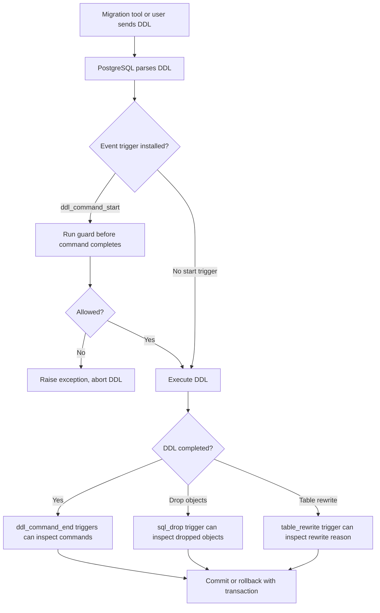
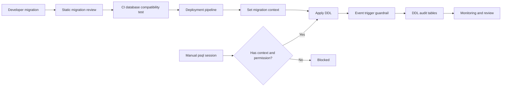

# Part 018 — Event Triggers, DDL Guardrails, and Schema Governance

Data-change trigger menjawab pertanyaan: “Apa yang terjadi ketika row berubah?”

Event trigger menjawab pertanyaan berbeda:

> Apa yang terjadi ketika struktur database berubah?

Di sistem kecil, DDL sering dianggap urusan migration tool. Di sistem production-grade, DDL adalah operational event: ia bisa mengubah kontrak API database, merusak function, mengubah plan, menahan lock, melakukan table rewrite, menghapus object yang masih dipakai, atau membuat audit/compliance story bolong.

Event trigger memberi hook untuk mengawasi dan mengontrol perubahan schema langsung di database.

Tetapi event trigger jauh lebih berbahaya dibanding data-change trigger karena sifatnya global pada satu database. Event trigger yang salah dapat membuat database sulit diubah, bahkan menyulitkan proses drop trigger itu sendiri jika guardrail terlalu agresif.

Tujuan part ini:

1. memahami runtime model event trigger,
2. membangun DDL audit trail,
3. membuat guardrail yang aman,
4. mencegah destructive schema change tanpa metadata,
5. mendeteksi table rewrite risk,
6. menghubungkan migration governance dengan database enforcement,
7. menghindari event trigger anti-pattern.

---

## 1. Apa yang Harus Diingat dari Dokumentasi Resmi

Baseline PostgreSQL current:

- Event trigger berbeda dari regular trigger. Regular trigger melekat pada satu table dan menangkap DML; event trigger bersifat global pada satu database dan mampu menangkap DDL events.
- Event trigger function di PL/pgSQL harus dibuat sebagai function tanpa argument dengan return type `event_trigger`.
- Saat event trigger function dipanggil, tersedia special variables `TG_EVENT` dan `TG_TAG`.
- `CREATE EVENT TRIGGER` menerima event, optional filter `WHEN TAG IN (...)`, lalu function yang dieksekusi.
- Dalam syntax `CREATE EVENT TRIGGER`, keyword `FUNCTION` dan `PROCEDURE` setara secara historis, tetapi referenced object tetap harus function, bukan procedure.
- Hanya superuser yang dapat membuat event trigger.
- Event trigger dapat dinonaktifkan melalui single-user mode atau konfigurasi `event_triggers = false` jika trigger bermasalah membuat database sulit diperbaiki.
- Helper function seperti `pg_event_trigger_ddl_commands()`, `pg_event_trigger_dropped_objects()`, dan table rewrite helper tersedia untuk konteks event tertentu.

Referensi resmi:

- PostgreSQL Event Triggers: `https://www.postgresql.org/docs/current/event-triggers.html`
- PostgreSQL `CREATE EVENT TRIGGER`: `https://www.postgresql.org/docs/current/sql-createeventtrigger.html`
- PostgreSQL Event Trigger Functions: `https://www.postgresql.org/docs/current/functions-event-triggers.html`
- PL/pgSQL Trigger Functions: `https://www.postgresql.org/docs/current/plpgsql-trigger.html`

---

## 2. Mental Model Event Trigger

Event trigger adalah database-level callback untuk event DDL.

Diagram:



Event trigger bukan audit log yang berada di luar transaction. Jika DDL transaction rollback, insert audit yang dilakukan event trigger juga rollback kecuali Anda menulis ke tempat eksternal, yang sebaiknya tidak dilakukan dari trigger.

Jadi untuk durable audit lintas rollback, event trigger saja tidak cukup. Tetapi untuk governance terhadap DDL yang benar-benar committed, event trigger sangat berguna.

---

## 3. Event yang Penting

PostgreSQL event trigger menyediakan beberapa event utama:

| Event | Kapan dipakai | Cocok untuk |
|---|---|---|
| `ddl_command_start` | sebelum command DDL dijalankan | block command berbahaya berdasarkan command tag |
| `ddl_command_end` | setelah command DDL selesai | audit DDL detail, inspect object identity |
| `sql_drop` | saat object di-drop | audit dan guard drop cascade/destructive change |
| `table_rewrite` | saat table akan direwrite oleh DDL tertentu | guard operasi mahal/berisiko |
| `login` | saat login database | kontrol login khusus, jarang dipakai untuk PL/pgSQL app governance |

Rule umum:

- Untuk menolak DDL berdasarkan jenis command, pakai `ddl_command_start`.
- Untuk mencatat object yang dibuat/diubah, pakai `ddl_command_end`.
- Untuk mencatat object yang dihapus, pakai `sql_drop`.
- Untuk mencegah table rewrite tidak sengaja, pakai `table_rewrite`.

---

## 4. Special Variables: `TG_EVENT` dan `TG_TAG`

Template minimal:

```sql
CREATE SCHEMA IF NOT EXISTS governance;

CREATE OR REPLACE FUNCTION governance.fn_notice_ddl()
RETURNS event_trigger
LANGUAGE plpgsql
AS $$
BEGIN
    RAISE NOTICE 'event trigger fired: event=%, tag=%', TG_EVENT, TG_TAG;
END;
$$;

CREATE EVENT TRIGGER etrg_notice_ddl
ON ddl_command_start
EXECUTE FUNCTION governance.fn_notice_ddl();
```

`TG_EVENT` menjelaskan event trigger, misalnya `ddl_command_start`.

`TG_TAG` menjelaskan command tag, misalnya:

- `CREATE TABLE`,
- `ALTER TABLE`,
- `DROP TABLE`,
- `CREATE FUNCTION`,
- `DROP FUNCTION`,
- `CREATE INDEX`.

Untuk guardrail awal, `TG_TAG` sudah sangat berguna. Untuk audit detail object, gunakan helper function event trigger.

---

## 5. Filter dengan `WHEN TAG IN (...)`

Jangan biarkan event trigger global memproses semua DDL jika hanya perlu command tertentu.

Contoh:

```sql
CREATE EVENT TRIGGER etrg_guard_destructive_ddl
ON ddl_command_start
WHEN TAG IN ('DROP TABLE', 'DROP SCHEMA', 'DROP FUNCTION', 'ALTER TABLE')
EXECUTE FUNCTION governance.fn_guard_destructive_ddl();
```

Keuntungan:

1. event surface lebih kecil,
2. performa lebih ringan,
3. risiko false positive lebih rendah,
4. reviewer langsung tahu DDL apa yang dikontrol.

Filter ini bukan pengganti validasi di function. Tetap lakukan defensive check jika function hanya didesain untuk subset tertentu.

---

## 6. Governance Schema

Pisahkan schema governance dari schema aplikasi.

```sql
CREATE SCHEMA IF NOT EXISTS governance;

REVOKE ALL ON SCHEMA governance FROM PUBLIC;
```

Table audit:

```sql
CREATE TABLE governance.ddl_audit_log (
    audit_id        bigserial PRIMARY KEY,
    occurred_at     timestamptz NOT NULL DEFAULT clock_timestamp(),
    database_name   name NOT NULL DEFAULT current_database(),
    session_user_name name NOT NULL DEFAULT session_user,
    current_user_name name NOT NULL DEFAULT current_user,
    application_name text NULL DEFAULT current_setting('application_name', true),
    migration_id    text NULL DEFAULT current_setting('app.migration_id', true),
    change_ticket   text NULL DEFAULT current_setting('app.change_ticket', true),
    tg_event        text NOT NULL,
    tg_tag          text NOT NULL,
    command_tag     text NULL,
    object_type     text NULL,
    schema_name     text NULL,
    object_identity text NULL,
    in_extension    boolean NULL,
    command_summary jsonb NOT NULL DEFAULT '{}'::jsonb
);
```

Mengapa menyimpan `migration_id` dan `change_ticket` dari custom setting?

Karena DDL governance tidak cukup tahu “siapa DB user-nya”. Dalam platform modern, migration sering dijalankan oleh service account. Yang kita butuhkan adalah konteks change:

- migration version,
- deployment id,
- change ticket,
- actor atau pipeline,
- application name,
- environment.

Set dari migration tool:

```sql
SELECT set_config('app.migration_id', '2026_07_03_1200_add_case_index', true);
SELECT set_config('app.change_ticket', 'DB-1842', true);
```

Catatan: `true` berarti setting berlaku lokal pada transaction saat ini.

---

## 7. Pattern: Audit DDL di `ddl_command_end`

Pada `ddl_command_end`, PostgreSQL menyediakan `pg_event_trigger_ddl_commands()` untuk melihat command yang dieksekusi.

Function:

```sql
CREATE OR REPLACE FUNCTION governance.fn_audit_ddl_command_end()
RETURNS event_trigger
LANGUAGE plpgsql
AS $$
DECLARE
    r record;
BEGIN
    FOR r IN
        SELECT *
        FROM pg_event_trigger_ddl_commands()
    LOOP
        INSERT INTO governance.ddl_audit_log (
            tg_event,
            tg_tag,
            command_tag,
            object_type,
            schema_name,
            object_identity,
            in_extension,
            command_summary
        )
        VALUES (
            TG_EVENT,
            TG_TAG,
            r.command_tag,
            r.object_type,
            r.schema_name,
            r.object_identity,
            r.in_extension,
            jsonb_build_object(
                'classid', r.classid::text,
                'objid', r.objid::text,
                'objsubid', r.objsubid
            )
        );
    END LOOP;
END;
$$;

CREATE EVENT TRIGGER etrg_audit_ddl_command_end
ON ddl_command_end
EXECUTE FUNCTION governance.fn_audit_ddl_command_end();
```

Kegunaan:

- mengetahui object apa yang dibuat/diubah,
- menghubungkan DDL dengan migration id,
- forensic saat schema berubah di luar pipeline,
- mendeteksi extension script via `in_extension`,
- membuat schema governance visible.

Keterbatasan:

- audit ikut rollback jika DDL rollback,
- tidak otomatis menyimpan raw SQL text,
- object identity bisa berubah format antar object type,
- event trigger bukan SIEM penuh.

Untuk raw query text, Anda biasanya mengandalkan PostgreSQL logging, `pgaudit`, migration logs, atau observability platform, bukan event trigger saja.

---

## 8. Pattern: Audit Drop dengan `sql_drop`

Drop object sangat penting untuk governance. `DROP TABLE` atau `DROP FUNCTION` bisa merusak kontrak aplikasi.

Table tambahan:

```sql
CREATE TABLE governance.ddl_drop_audit_log (
    audit_id        bigserial PRIMARY KEY,
    occurred_at     timestamptz NOT NULL DEFAULT clock_timestamp(),
    session_user_name name NOT NULL DEFAULT session_user,
    current_user_name name NOT NULL DEFAULT current_user,
    application_name text NULL DEFAULT current_setting('application_name', true),
    migration_id    text NULL DEFAULT current_setting('app.migration_id', true),
    change_ticket   text NULL DEFAULT current_setting('app.change_ticket', true),
    tg_event        text NOT NULL,
    tg_tag          text NOT NULL,
    object_type     text NULL,
    schema_name     text NULL,
    object_name     text NULL,
    object_identity text NULL,
    original        boolean NULL,
    normal          boolean NULL,
    is_temporary    boolean NULL,
    address_names   text[] NULL,
    address_args    text[] NULL
);
```

Function:

```sql
CREATE OR REPLACE FUNCTION governance.fn_audit_sql_drop()
RETURNS event_trigger
LANGUAGE plpgsql
AS $$
DECLARE
    r record;
BEGIN
    FOR r IN
        SELECT *
        FROM pg_event_trigger_dropped_objects()
    LOOP
        INSERT INTO governance.ddl_drop_audit_log (
            tg_event,
            tg_tag,
            object_type,
            schema_name,
            object_name,
            object_identity,
            original,
            normal,
            is_temporary,
            address_names,
            address_args
        )
        VALUES (
            TG_EVENT,
            TG_TAG,
            r.object_type,
            r.schema_name,
            r.object_name,
            r.object_identity,
            r.original,
            r.normal,
            r.is_temporary,
            r.address_names,
            r.address_args
        );
    END LOOP;
END;
$$;

CREATE EVENT TRIGGER etrg_audit_sql_drop
ON sql_drop
EXECUTE FUNCTION governance.fn_audit_sql_drop();
```

Interpretasi penting:

| Field | Makna praktis |
|---|---|
| `original` | object root yang secara langsung di-drop |
| `normal` | object ikut hilang karena dependency normal |
| `is_temporary` | object temporary |
| `object_identity` | identitas object yang bisa dibaca manusia |

Untuk review destructive migration, object yang `original = true` adalah pusat perhatian. Object dependency juga penting karena `DROP ... CASCADE` bisa menghapus jauh lebih banyak dari yang terlihat.

---

## 9. Pattern: Guardrail Wajib Migration Context

Production database sebaiknya menolak DDL tanpa konteks migration, kecuali untuk role tertentu.

```sql
CREATE TABLE governance.ddl_guardrail_config (
    config_key text PRIMARY KEY,
    config_value text NOT NULL
);

INSERT INTO governance.ddl_guardrail_config(config_key, config_value)
VALUES ('enforce_migration_context', 'on')
ON CONFLICT (config_key) DO UPDATE SET config_value = EXCLUDED.config_value;
```

Function:

```sql
CREATE OR REPLACE FUNCTION governance.fn_require_migration_context()
RETURNS event_trigger
LANGUAGE plpgsql
AS $$
DECLARE
    v_enforced boolean;
    v_migration_id text;
    v_change_ticket text;
BEGIN
    SELECT config_value = 'on'
      INTO v_enforced
      FROM governance.ddl_guardrail_config
     WHERE config_key = 'enforce_migration_context';

    IF NOT COALESCE(v_enforced, false) THEN
        RETURN;
    END IF;

    -- Example bypass for emergency superuser/admin role.
    -- Keep this list extremely small and audited.
    IF session_user IN ('postgres') THEN
        RETURN;
    END IF;

    v_migration_id := nullif(current_setting('app.migration_id', true), '');
    v_change_ticket := nullif(current_setting('app.change_ticket', true), '');

    IF v_migration_id IS NULL OR v_change_ticket IS NULL THEN
        RAISE EXCEPTION USING
            ERRCODE = 'P0001',
            MESSAGE = 'DDL_MIGRATION_CONTEXT_REQUIRED',
            DETAIL = format('tag=%s migration_id=%s change_ticket=%s', TG_TAG, v_migration_id, v_change_ticket),
            HINT = 'Set app.migration_id and app.change_ticket in the migration transaction.';
    END IF;
END;
$$;

CREATE EVENT TRIGGER etrg_10_require_migration_context
ON ddl_command_start
WHEN TAG IN (
    'CREATE TABLE',
    'ALTER TABLE',
    'DROP TABLE',
    'CREATE FUNCTION',
    'ALTER FUNCTION',
    'DROP FUNCTION',
    'CREATE INDEX',
    'DROP INDEX',
    'CREATE TYPE',
    'ALTER TYPE',
    'DROP TYPE'
)
EXECUTE FUNCTION governance.fn_require_migration_context();
```

Ini bukan security model sempurna. Superuser tetap dapat mengubah banyak hal. Tujuannya guardrail: mencegah accidental DDL dan membuat normal path terdokumentasi.

---

## 10. Pattern: Block Destructive DDL di Protected Schema

Misal schema `app_case` dan `app_private` tidak boleh di-drop langsung di production.

Masalah: pada `ddl_command_start`, kita punya `TG_TAG`, tetapi belum punya detail object seperti pada `ddl_command_end`. Untuk block sederhana, kita bisa block semua command tag destructive dan sediakan emergency bypass.

```sql
CREATE OR REPLACE FUNCTION governance.fn_block_destructive_ddl()
RETURNS event_trigger
LANGUAGE plpgsql
AS $$
DECLARE
    v_allow text;
BEGIN
    v_allow := nullif(current_setting('app.allow_destructive_ddl', true), '');

    IF v_allow = 'approved' THEN
        RAISE WARNING 'destructive DDL allowed by explicit session override: tag=% user=%', TG_TAG, session_user;
        RETURN;
    END IF;

    RAISE EXCEPTION USING
        ERRCODE = 'P0001',
        MESSAGE = 'DESTRUCTIVE_DDL_BLOCKED',
        DETAIL = format('tag=%s user=%s application=%s', TG_TAG, session_user, current_setting('application_name', true)),
        HINT = 'Use reviewed migration with app.allow_destructive_ddl=approved only during approved change window.';
END;
$$;

CREATE EVENT TRIGGER etrg_20_block_destructive_ddl
ON ddl_command_start
WHEN TAG IN (
    'DROP TABLE',
    'DROP SCHEMA',
    'DROP FUNCTION',
    'DROP TYPE',
    'DROP INDEX',
    'DROP VIEW',
    'TRUNCATE TABLE'
)
EXECUTE FUNCTION governance.fn_block_destructive_ddl();
```

Perhatikan: `TRUNCATE TABLE` bukan DDL dalam arti schema definition biasa, tetapi command tag bisa menjadi bagian guardrail data-destructive. Pastikan behavior diuji pada versi PostgreSQL yang dipakai.

Untuk guard yang harus tahu object detail, gunakan kombinasi:

- `ddl_command_start` untuk block kasar,
- `sql_drop` untuk audit detail,
- migration pipeline untuk static analysis sebelum apply,
- permission model agar hanya migration role yang bisa DDL.

---

## 11. Pattern: Protect Extension Script

Event trigger audit dapat melihat `in_extension` pada `pg_event_trigger_ddl_commands()`.

Kenapa penting?

Extension creation/update dapat membuat banyak object. Jangan salah menganggap semua object itu dibuat manual oleh migration bisnis.

Audit function bisa menandai:

```sql
CASE
    WHEN r.in_extension THEN 'extension_script'
    ELSE 'direct_ddl'
END
```

Policy umum:

- allow extension DDL hanya dari migration terverifikasi,
- audit `in_extension = true`,
- jangan block blindly semua object yang dibuat extension,
- jangan membuat event trigger yang merusak `CREATE EXTENSION` resmi tanpa test.

---

## 12. Table Rewrite Guardrail

Beberapa `ALTER TABLE` dapat menyebabkan table rewrite. Pada table besar, ini bisa menjadi operasi mahal, lock lama, WAL besar, replication lag, dan outage.

Gunakan event `table_rewrite` untuk mendeteksi.

Table log:

```sql
CREATE TABLE governance.table_rewrite_audit_log (
    audit_id        bigserial PRIMARY KEY,
    occurred_at     timestamptz NOT NULL DEFAULT clock_timestamp(),
    session_user_name name NOT NULL DEFAULT session_user,
    application_name text NULL DEFAULT current_setting('application_name', true),
    migration_id    text NULL DEFAULT current_setting('app.migration_id', true),
    change_ticket   text NULL DEFAULT current_setting('app.change_ticket', true),
    relation_oid    oid NOT NULL,
    relation_name   text NOT NULL,
    reason_code     integer NOT NULL,
    reason_text     text NOT NULL
);
```

Function:

```sql
CREATE OR REPLACE FUNCTION governance.fn_audit_table_rewrite()
RETURNS event_trigger
LANGUAGE plpgsql
AS $$
DECLARE
    v_oid oid;
    v_reason integer;
BEGIN
    v_oid := pg_event_trigger_table_rewrite_oid();
    v_reason := pg_event_trigger_table_rewrite_reason();

    INSERT INTO governance.table_rewrite_audit_log (
        relation_oid,
        relation_name,
        reason_code,
        reason_text
    )
    VALUES (
        v_oid,
        v_oid::regclass::text,
        v_reason,
        CASE
            WHEN v_reason & 1 <> 0 THEN 'persistence changed'
            WHEN v_reason & 2 <> 0 THEN 'default changed'
            WHEN v_reason & 4 <> 0 THEN 'column type changed'
            WHEN v_reason & 8 <> 0 THEN 'access method changed'
            ELSE 'unknown or combined reason'
        END
    );
END;
$$;

CREATE EVENT TRIGGER etrg_audit_table_rewrite
ON table_rewrite
EXECUTE FUNCTION governance.fn_audit_table_rewrite();
```

Catatan: reason adalah bitmask. Jika beberapa bit aktif, `CASE` sederhana di atas hanya menunjukkan prioritas pertama. Untuk produksi, simpan array reason.

Versi lebih baik:

```sql
CREATE OR REPLACE FUNCTION governance.fn_table_rewrite_reason_texts(p_reason integer)
RETURNS text[]
LANGUAGE sql
IMMUTABLE
AS $$
    SELECT array_remove(ARRAY[
        CASE WHEN p_reason & 1 <> 0 THEN 'persistence changed' END,
        CASE WHEN p_reason & 2 <> 0 THEN 'default changed' END,
        CASE WHEN p_reason & 4 <> 0 THEN 'column type changed' END,
        CASE WHEN p_reason & 8 <> 0 THEN 'access method changed' END
    ], NULL);
$$;
```

Guardrail:

```sql
CREATE OR REPLACE FUNCTION governance.fn_block_unapproved_table_rewrite()
RETURNS event_trigger
LANGUAGE plpgsql
AS $$
DECLARE
    v_oid oid;
    v_reason integer;
    v_allow text;
BEGIN
    v_oid := pg_event_trigger_table_rewrite_oid();
    v_reason := pg_event_trigger_table_rewrite_reason();
    v_allow := nullif(current_setting('app.allow_table_rewrite', true), '');

    IF v_allow = 'approved' THEN
        RAISE WARNING 'approved table rewrite: relation=% reason=%', v_oid::regclass::text, v_reason;
        RETURN;
    END IF;

    RAISE EXCEPTION USING
        ERRCODE = 'P0001',
        MESSAGE = 'TABLE_REWRITE_REQUIRES_APPROVAL',
        DETAIL = format('relation=%s reason=%s', v_oid::regclass::text, v_reason),
        HINT = 'Review lock/WAL/replication impact and set app.allow_table_rewrite=approved only in approved migration.';
END;
$$;

CREATE EVENT TRIGGER etrg_30_block_unapproved_table_rewrite
ON table_rewrite
EXECUTE FUNCTION governance.fn_block_unapproved_table_rewrite();
```

Ini guardrail yang sangat berguna di database besar.

---

## 13. DDL Governance Architecture

Event trigger sebaiknya bukan satu-satunya mekanisme governance.



Layer yang saling melengkapi:

| Layer | Fungsi |
|---|---|
| migration code review | mencegah perubahan buruk sebelum runtime |
| CI shadow database | mendeteksi syntax dan dependency failure |
| permission model | membatasi siapa bisa DDL |
| event trigger | runtime guardrail di database |
| audit table | forensic committed DDL |
| PostgreSQL logs/pgaudit | raw statement dan session evidence |
| runbook | emergency disable/repair procedure |

Event trigger tidak menggantikan CI. CI tidak menggantikan event trigger. Keduanya menjaga boundary berbeda.

---

## 14. Search Path dan Security

Karena event trigger biasanya dibuat oleh superuser dan beroperasi pada DDL, security hygiene wajib kuat.

Rekomendasi:

1. letakkan function di schema khusus seperti `governance`,
2. revoke schema dari `PUBLIC`,
3. schema-qualify semua table/function yang dipanggil,
4. hindari dynamic SQL kecuali perlu,
5. jika memakai `SECURITY DEFINER`, set `search_path` eksplisit,
6. jangan percaya object name dari event tanpa quoting yang benar.

Contoh hardening function:

```sql
CREATE OR REPLACE FUNCTION governance.fn_require_migration_context()
RETURNS event_trigger
LANGUAGE plpgsql
SECURITY DEFINER
SET search_path = governance, pg_catalog
AS $$
BEGIN
    -- body
END;
$$;
```

Tetapi jangan otomatis memakai `SECURITY DEFINER`. Gunakan hanya jika perlu. `SECURITY DEFINER` memperbesar blast radius jika function rentan.

---

## 15. Emergency Disable Strategy

Dokumentasi PostgreSQL menyebut event trigger dapat dinonaktifkan saat single-user mode atau ketika `event_triggers` diset `false`. Ini penting karena event trigger yang salah bisa membuat database sulit diperbaiki.

Production handbook harus punya bagian:

```txt
Emergency: event trigger blocks critical recovery

1. Confirm database, environment, and incident commander.
2. Stop normal migration pipeline.
3. Connect with break-glass superuser according to policy.
4. Prefer ALTER EVENT TRIGGER ... DISABLE if possible.
5. If not possible because trigger blocks DDL, restart with event_triggers=false or use single-user mode according to PostgreSQL operational runbook.
6. Drop/fix offending trigger function.
7. Re-enable event triggers.
8. Reconcile DDL audit gap.
9. Write post-incident report.
```

SQL normal disable:

```sql
ALTER EVENT TRIGGER etrg_20_block_destructive_ddl DISABLE;
ALTER EVENT TRIGGER etrg_20_block_destructive_ddl ENABLE;
```

Jangan membuat guardrail tanpa break-glass path. Guardrail tanpa escape hatch adalah outage waiting to happen.

---

## 16. Failure Modes Event Trigger

| Failure mode | Penyebab | Dampak | Mitigasi |
|---|---|---|---|
| Database tidak bisa migration | guard terlalu luas | deployment blocked | filter `TAG`, config toggle, emergency runbook |
| Extension install gagal | event trigger memblokir object extension | upgrade gagal | check `in_extension`, test extension path |
| False sense of audit | audit rollback bersama DDL rollback | missing failed attempt evidence | PostgreSQL logs/pgaudit untuk attempted DDL |
| Superuser bypass | superuser dapat disable/drop | governance tidak absolut | process control, audit, least privilege |
| Function dependency rusak | governance function refer table yang diubah | DDL gagal aneh | schema dedicated, stable API, tests |
| Recursion/DDL inside trigger | trigger menjalankan DDL | unpredictable behavior | hindari DDL di event trigger |
| Raw SQL tidak tercatat | helper tidak expose full original SQL | forensic kurang lengkap | combine dengan logs/pgaudit |

---

## 17. Jangan Over-Enforce di Database

Event trigger menggoda untuk membuat policy terlalu ambisius:

- menolak semua `ALTER TABLE`,
- menolak semua `DROP`,
- menolak semua DDL di luar jam tertentu,
- parse naming convention dari `object_identity`,
- enforce arsitektur full dari PL/pgSQL.

Sebagian bisa berguna, tetapi semakin kompleks event trigger, semakin besar risiko database terkunci oleh policy sendiri.

Pindahkan policy kompleks ke pipeline jika memungkinkan.

Gunakan event trigger untuk guardrail runtime yang jelas:

1. wajib migration context,
2. block destructive DDL tanpa override,
3. audit DDL committed,
4. audit drop object,
5. block table rewrite tanpa approval,
6. detect forbidden schema touch sederhana.

---

## 18. Pattern: Naming Convention Check Ringan

Misal semua table aplikasi harus ada di schema `app_*`, dan table tidak boleh dibuat di `public`.

Pada `ddl_command_end`, kita bisa inspect `schema_name`.

```sql
CREATE OR REPLACE FUNCTION governance.fn_guard_no_public_app_objects()
RETURNS event_trigger
LANGUAGE plpgsql
AS $$
DECLARE
    r record;
BEGIN
    FOR r IN
        SELECT *
        FROM pg_event_trigger_ddl_commands()
    LOOP
        IF r.object_type IN ('table', 'view', 'function', 'type')
           AND r.schema_name = 'public'
           AND COALESCE(r.in_extension, false) = false THEN
            RAISE EXCEPTION USING
                ERRCODE = 'P0001',
                MESSAGE = 'PUBLIC_SCHEMA_OBJECT_FORBIDDEN',
                DETAIL = format('object_type=%s object=%s', r.object_type, r.object_identity),
                HINT = 'Create application objects in an explicit app schema.';
        END IF;
    END LOOP;
END;
$$;

CREATE EVENT TRIGGER etrg_40_guard_no_public_app_objects
ON ddl_command_end
WHEN TAG IN ('CREATE TABLE', 'CREATE VIEW', 'CREATE FUNCTION', 'CREATE TYPE')
EXECUTE FUNCTION governance.fn_guard_no_public_app_objects();
```

Kenapa `ddl_command_end`, bukan `ddl_command_start`?

Karena kita butuh `schema_name` dan `object_identity` dari `pg_event_trigger_ddl_commands()`.

Konsekuensi: DDL sempat dieksekusi, lalu exception membatalkan transaction. Itu masih aman untuk transactional DDL. Tetapi ingat bahwa tidak semua efek operasional sama murahnya walau rollback.

---

## 19. Pattern: DDL Review Queue

Kadang tidak mau langsung block, tetapi ingin mencatat change yang harus direview.

```sql
CREATE TABLE governance.ddl_review_queue (
    review_id       bigserial PRIMARY KEY,
    created_at      timestamptz NOT NULL DEFAULT clock_timestamp(),
    status          text NOT NULL DEFAULT 'OPEN',
    severity        text NOT NULL,
    migration_id    text NULL DEFAULT current_setting('app.migration_id', true),
    change_ticket   text NULL DEFAULT current_setting('app.change_ticket', true),
    command_tag     text NOT NULL,
    object_type     text NULL,
    object_identity text NULL,
    reason          text NOT NULL
);
```

Function:

```sql
CREATE OR REPLACE FUNCTION governance.fn_queue_sensitive_ddl_review()
RETURNS event_trigger
LANGUAGE plpgsql
AS $$
DECLARE
    r record;
BEGIN
    FOR r IN
        SELECT *
        FROM pg_event_trigger_ddl_commands()
    LOOP
        IF r.command_tag IN ('ALTER TABLE', 'CREATE INDEX', 'CREATE FUNCTION') THEN
            INSERT INTO governance.ddl_review_queue (
                severity,
                command_tag,
                object_type,
                object_identity,
                reason
            )
            VALUES (
                CASE WHEN r.command_tag = 'ALTER TABLE' THEN 'HIGH' ELSE 'MEDIUM' END,
                r.command_tag,
                r.object_type,
                r.object_identity,
                'Sensitive DDL should be reviewed after deployment'
            );
        END IF;
    END LOOP;
END;
$$;

CREATE EVENT TRIGGER etrg_50_queue_sensitive_ddl_review
ON ddl_command_end
WHEN TAG IN ('ALTER TABLE', 'CREATE INDEX', 'CREATE FUNCTION')
EXECUTE FUNCTION governance.fn_queue_sensitive_ddl_review();
```

Ini cocok jika organisasi belum siap block keras tetapi ingin visibility.

---

## 20. Integration dengan Migration Tool

Migration tool yang matang harus melakukan:

```sql
BEGIN;

SELECT set_config('app.migration_id', '20260703_018_add_case_transition_rule', true);
SELECT set_config('app.change_ticket', 'CASE-DB-219', true);
SELECT set_config('application_name', 'schema-migrator', true);

-- DDL here

COMMIT;
```

Namun banyak client tidak mengizinkan `set_config('application_name', ..., true)` secara efektif setelah connection dibuat, atau application_name lebih baik diset di connection string. Sesuaikan dengan tool.

Kontrak minimum:

| Context | Required | Source |
|---|---:|---|
| `app.migration_id` | Ya | migration framework |
| `app.change_ticket` | Ya untuk production | release/change management |
| `application_name` | Ya | connection string/tool config |
| session user | Ya | PostgreSQL |
| current user | Ya | PostgreSQL |

Jika migration tool tidak bisa set custom setting, buat wrapper SQL migration header yang selalu dijalankan.

---

## 21. Event Trigger dan Multi-Tenant Database

Jika satu PostgreSQL database memuat banyak tenant/schema, event trigger tetap global pada database.

Konsekuensi:

- guardrail harus sadar schema,
- jangan block temporary object developer/test secara tidak sengaja,
- jangan scan seluruh catalog pada setiap DDL,
- gunakan allow-list schema,
- audit tenant/schema jika relevan.

Contoh allow-list schema:

```sql
CREATE TABLE governance.protected_schema (
    schema_name name PRIMARY KEY,
    protection_level text NOT NULL CHECK (protection_level IN ('audit', 'guarded', 'locked'))
);

INSERT INTO governance.protected_schema(schema_name, protection_level)
VALUES
    ('app_case', 'guarded'),
    ('app_private', 'locked'),
    ('governance', 'locked')
ON CONFLICT (schema_name) DO UPDATE
SET protection_level = EXCLUDED.protection_level;
```

Pada `ddl_command_end`, inspect `r.schema_name` dan terapkan policy sesuai level.

---

## 22. Observability Query

DDL terakhir:

```sql
SELECT occurred_at,
       session_user_name,
       application_name,
       migration_id,
       change_ticket,
       command_tag,
       object_type,
       schema_name,
       object_identity
FROM governance.ddl_audit_log
ORDER BY occurred_at DESC
LIMIT 50;
```

Drop terakhir:

```sql
SELECT occurred_at,
       session_user_name,
       migration_id,
       tg_tag,
       object_type,
       schema_name,
       object_identity,
       original,
       normal
FROM governance.ddl_drop_audit_log
ORDER BY occurred_at DESC
LIMIT 50;
```

Table rewrite terakhir:

```sql
SELECT occurred_at,
       session_user_name,
       migration_id,
       relation_name,
       reason_code,
       reason_text
FROM governance.table_rewrite_audit_log
ORDER BY occurred_at DESC
LIMIT 50;
```

DDL tanpa change ticket:

```sql
SELECT *
FROM governance.ddl_audit_log
WHERE change_ticket IS NULL
ORDER BY occurred_at DESC;
```

Perubahan pada schema protected:

```sql
SELECT a.*
FROM governance.ddl_audit_log a
JOIN governance.protected_schema s
  ON s.schema_name = a.schema_name
ORDER BY a.occurred_at DESC;
```

---

## 23. Test Strategy

Event trigger harus dites seperti production control plane.

### 23.1 Positive Tests

- DDL dengan migration context berhasil.
- DDL non-destructive ter-audit.
- `CREATE TABLE` di schema benar berhasil.
- Extension install yang diizinkan berhasil.
- Approved table rewrite berhasil jika override diset.

### 23.2 Negative Tests

- DDL tanpa migration context gagal.
- `DROP TABLE` tanpa override gagal.
- `CREATE TABLE public.foo` gagal.
- Table rewrite tanpa approval gagal.
- `DROP ... CASCADE` tercatat di drop audit saat diizinkan.

### 23.3 Recovery Tests

- `ALTER EVENT TRIGGER ... DISABLE` bisa dilakukan oleh role break-glass.
- Governance function error tidak membuat migration normal mustahil diperbaiki.
- Runbook emergency valid di staging.

Contoh test manual:

```sql
-- Should fail
CREATE TABLE public.bad_table(id bigint);

-- Should pass with context, assuming schema policy allows it
BEGIN;
SELECT set_config('app.migration_id', 'test_migration_001', true);
SELECT set_config('app.change_ticket', 'TEST-001', true);
CREATE TABLE app_case.test_governed_table(id bigint PRIMARY KEY);
ROLLBACK;
```

---

## 24. Deployment Strategy

Jangan langsung memasang event trigger block keras di production.

Tahapan sehat:

1. audit-only mode,
2. review audit selama beberapa release,
3. tambahkan warning mode,
4. enforce migration context,
5. enforce destructive DDL guard,
6. enforce table rewrite guard,
7. refine allow-list dan emergency path.

Config-driven enforcement:

```sql
CREATE TABLE governance.guardrail_setting (
    setting_name text PRIMARY KEY,
    setting_value text NOT NULL,
    updated_at timestamptz NOT NULL DEFAULT clock_timestamp(),
    updated_by text NOT NULL DEFAULT session_user
);

INSERT INTO governance.guardrail_setting(setting_name, setting_value)
VALUES
    ('mode', 'audit')
ON CONFLICT (setting_name) DO NOTHING;
```

Mode:

| Mode | Behavior |
|---|---|
| `off` | no-op |
| `audit` | log only |
| `warn` | log and `RAISE WARNING` |
| `enforce` | raise exception for violation |

Function guard bisa membaca mode ini agar rollout tidak perlu drop/recreate trigger.

---

## 25. Anti-Patterns

### 25.1 Event Trigger yang Parse Raw SQL

PostgreSQL event trigger helper memberi structured info. Parsing SQL text manual di PL/pgSQL rapuh.

Gunakan:

- `TG_TAG`,
- `pg_event_trigger_ddl_commands()`,
- `pg_event_trigger_dropped_objects()`,
- catalog queries,
- migration static analysis di luar database.

### 25.2 Guardrail Tanpa Emergency Path

Jika policy bisa block DDL, harus ada documented bypass dan recovery path.

### 25.3 Menaruh Business Workflow di Event Trigger

Event trigger untuk schema governance, bukan untuk workflow domain user.

### 25.4 Audit Table di Schema yang Sama dengan App yang Dijaga

Jika schema app rusak atau di-drop, audit ikut terpengaruh. Pisahkan schema governance dan permission.

### 25.5 Block Semua DDL

Block total terasa aman tetapi merusak operasional. Gunakan policy yang spesifik.

---

## 26. Latihan Implementasi

### Latihan 1 — Audit DDL

Buat `governance.ddl_audit_log` dan event trigger `ddl_command_end`.

Kriteria:

- catat `TG_EVENT`, `TG_TAG`, command tag, object type, schema, object identity,
- catat session user, current user, application name,
- catat migration id dari `app.migration_id`.

### Latihan 2 — Require Migration Context

Buat event trigger yang menolak `ALTER TABLE`, `DROP TABLE`, dan `CREATE FUNCTION` jika `app.migration_id` kosong.

Kriteria:

- punya config toggle,
- error message actionable,
- ada bypass role kecil.

### Latihan 3 — Protect Public Schema

Tolak pembuatan table/function/type di `public`, kecuali object extension.

Kriteria:

- gunakan `pg_event_trigger_ddl_commands()`,
- ignore `in_extension = true`,
- raise exception dengan object identity.

### Latihan 4 — Table Rewrite Approval

Buat guard untuk `table_rewrite`.

Kriteria:

- log relation name,
- block jika `app.allow_table_rewrite` bukan `approved`,
- hint menyebut review lock/WAL/replication.

### Latihan 5 — Runbook

Tulis runbook emergency jika event trigger membuat migration gagal total.

Kriteria:

- siapa yang boleh menjalankan,
- command disable normal,
- fallback operational,
- audit gap reconciliation.

---

## 27. Ringkasan Mental Model

Event trigger adalah control plane hook untuk schema change.

Gunakan untuk:

- DDL audit,
- drop audit,
- migration context enforcement,
- destructive DDL guardrail,
- table rewrite approval,
- schema naming/policy ringan,
- visibility terhadap perubahan database.

Jangan gunakan untuk:

- workflow bisnis,
- parsing SQL kompleks,
- menggantikan migration review,
- menggantikan permission model,
- block semua DDL tanpa escape hatch,
- side effect eksternal.

Kalimat yang harus diingat:

> Data-change trigger menjaga data; event trigger menjaga perubahan bentuk database.

Event trigger yang baik membuat schema change lebih terlihat, lebih terkendali, dan lebih mudah dipertanggungjawabkan. Event trigger yang buruk mengubah database menjadi perangkap operasional.
