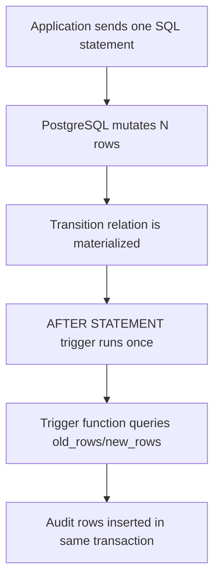
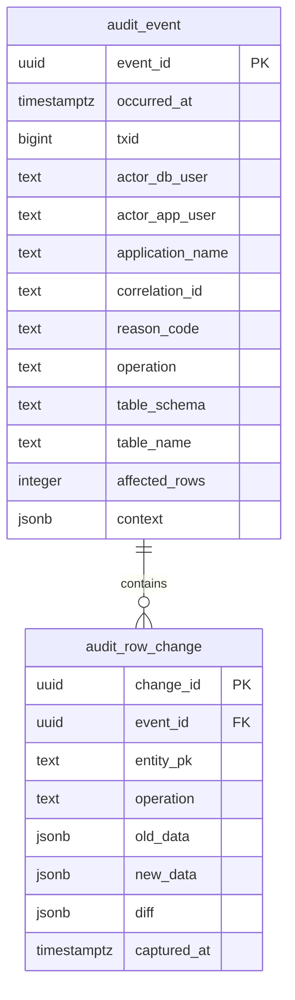

# Part 019 — Transition Tables, Audit Capture, and Change Reasoning

Trigger biasa memberi kita `NEW` dan `OLD` untuk melihat satu row.

Transition table memberi kita sesuatu yang lebih kuat:

> seluruh kumpulan row yang berubah oleh satu statement.

Itu perbedaan besar.

Jika sebuah statement mengubah 50.000 row, row-level trigger membuat kita berpikir 50.000 kali. Transition table membuat kita berpikir satu kali terhadap set perubahan tersebut.

Di sistem produksi, terutama sistem yang butuh audit, compliance, dispute handling, atau regulatory defensibility, pertanyaan yang harus dijawab bukan hanya:

> row ini berubah dari apa menjadi apa?

Pertanyaan yang benar adalah:

1. siapa yang mengubah,
2. kapan berubah,
3. melalui jalur aplikasi atau job apa,
4. statement apa yang menyebabkan perubahan,
5. berapa banyak row terdampak,
6. apa alasan domain-nya,
7. apakah perubahan itu valid menurut state machine,
8. apakah perubahan bisa dijelaskan ulang setelah 2 tahun.

Part ini membahas cara membangun audit capture dan change reasoning yang defensible menggunakan PL/pgSQL, trigger, transition table, dan context discipline.

Kita tidak akan mengulang basic trigger dari Part 017. Fokus kita adalah desain audit yang bisa dipakai pada sistem besar.

---

## 1. Mental Model: Audit Bukan Log

Log menjawab:

> apa yang terjadi saat runtime?

Audit menjawab:

> apa bukti perubahan state yang dapat dipercaya?

Perbedaannya penting.

| Dimensi | Log | Audit |
|---|---|---|
| Tujuan | Debugging, operasi, observability | Bukti perubahan domain |
| Retensi | Bisa pendek | Sering panjang |
| Struktur | Bisa semi-bebas | Harus stabil dan queryable |
| Konsumen | Engineer/operator | Engineer, auditor, regulator, legal, customer support |
| Kegagalan | Bisa kehilangan sebagian sinyal | Kehilangan audit sering fatal |
| Transaction coupling | Sering out-of-band | Biasanya harus ikut transaksi data |

Audit yang baik harus dekat dengan mutation. Jika data berubah tetapi audit gagal dibuat, perubahan harus ikut gagal, kecuali ada desain eksplisit yang menerima gap tersebut.

PL/pgSQL trigger cocok untuk audit karena berjalan di database transaction yang sama dengan perubahan data.

Tetapi ini juga berarti:

> trigger audit yang lambat akan membuat mutation lambat; trigger audit yang gagal akan menggagalkan mutation.

Ini bukan kekurangan. Ini kontrak.

---

## 2. Apa Itu Transition Table

Dalam `CREATE TRIGGER`, PostgreSQL menyediakan `REFERENCING OLD TABLE AS ...` dan/atau `REFERENCING NEW TABLE AS ...` untuk trigger tertentu.

Secara praktis:

- `OLD TABLE` berisi before-image untuk row yang di-update atau di-delete,
- `NEW TABLE` berisi after-image untuk row yang di-insert atau di-update,
- keduanya berisi row set akibat satu SQL statement,
- hanya tersedia untuk trigger level statement tertentu,
- bukan row-level pseudo-record seperti `OLD` dan `NEW`.

Diagram:



Contoh satu statement:

```sql
UPDATE app.case_file
SET status = 'ESCALATED', updated_at = clock_timestamp()
WHERE risk_score >= 90
  AND status = 'UNDER_REVIEW';
```

Jika statement ini mengubah 8.000 case, transition table memungkinkan trigger melihat 8.000 before-image dan 8.000 after-image dalam satu pemanggilan trigger function.

---

## 3. Kapan Memakai Row-Level Trigger vs Transition Table

Jangan pilih berdasarkan preferensi syntax. Pilih berdasarkan bentuk reasoning.

| Kebutuhan | Pilihan Lebih Tepat | Alasan |
|---|---|---|
| Validasi setiap row sebelum disimpan | `BEFORE EACH ROW` | Harus bisa mengubah/menolak row individual |
| Stamping `created_at`, `updated_at` | `BEFORE EACH ROW` | Perubahan langsung pada `NEW` murah dan jelas |
| Audit old/new untuk volume kecil | Row-level `AFTER` trigger | Sederhana, mudah dipahami |
| Audit bulk update/delete/insert | Statement-level trigger + transition table | Satu eksekusi untuk banyak row |
| Menghitung jumlah row terdampak oleh satu statement | Transition table | Natural set-level reasoning |
| Membuat summary audit event | Transition table | Satu event parent untuk satu statement |
| Mencegah row tertentu berubah | `BEFORE EACH ROW` + exception | Butuh intervensi per row |
| Melakukan outbox event per row setelah mutation | Bisa row-level atau transition table | Transition table lebih baik untuk bulk |

Rule of thumb:

> gunakan row-level trigger untuk mengontrol row; gunakan transition table untuk memahami statement.

---

## 4. Constraint Penting Transition Table

Transition table bukan fitur bebas tanpa batas.

Hal penting yang harus diingat:

1. Transition table dipakai melalui `REFERENCING` pada `CREATE TRIGGER`.
2. `OLD TABLE` hanya relevan untuk `UPDATE` dan `DELETE`.
3. `NEW TABLE` hanya relevan untuk `INSERT` dan `UPDATE`.
4. Transition table digunakan pada trigger statement-level, bukan row-level pseudo-record.
5. Untuk `UPDATE` trigger yang memakai transition table, jangan gabungkan dengan daftar kolom `UPDATE OF column_name`.
6. Transition table membuat PostgreSQL harus menyediakan relasi sementara berisi row yang berubah; pada mutation besar, ini berdampak ke biaya eksekusi.
7. Transition table tidak otomatis memberi “diff”; kita harus membandingkan old/new sendiri.

Contoh trigger INSERT statement-level:

```sql
CREATE TRIGGER trg_case_file_audit_insert_stmt
AFTER INSERT ON app.case_file
REFERENCING NEW TABLE AS new_rows
FOR EACH STATEMENT
EXECUTE FUNCTION audit.capture_case_file_insert_stmt();
```

Contoh trigger UPDATE statement-level:

```sql
CREATE TRIGGER trg_case_file_audit_update_stmt
AFTER UPDATE ON app.case_file
REFERENCING OLD TABLE AS old_rows NEW TABLE AS new_rows
FOR EACH STATEMENT
EXECUTE FUNCTION audit.capture_case_file_update_stmt();
```

Contoh trigger DELETE statement-level:

```sql
CREATE TRIGGER trg_case_file_audit_delete_stmt
AFTER DELETE ON app.case_file
REFERENCING OLD TABLE AS old_rows
FOR EACH STATEMENT
EXECUTE FUNCTION audit.capture_case_file_delete_stmt();
```

---

## 5. Audit Event vs Audit Change

Audit yang serius perlu membedakan event dan change.

- **Audit event**: satu per statement, command, request, job, atau workflow step.
- **Audit change**: satu per entity/row yang berubah.

Jangan hanya membuat tabel `audit_log` tunggal yang mencampur semuanya.

Model yang lebih stabil:



Mengapa dipisah?

Karena satu statement bisa mengubah banyak row. Jika metadata event diulang per row, audit menjadi mahal, boros storage, dan sulit dibaca.

---

## 6. Schema Audit Minimal yang Layak Produksi

Contoh schema:

```sql
CREATE SCHEMA IF NOT EXISTS audit;

CREATE TABLE audit.audit_event (
    event_id         uuid PRIMARY KEY DEFAULT gen_random_uuid(),
    occurred_at      timestamptz NOT NULL DEFAULT clock_timestamp(),
    txid             bigint NOT NULL DEFAULT txid_current(),
    actor_db_user    text NOT NULL DEFAULT current_user,
    session_user     text NOT NULL DEFAULT session_user,
    application_name text NULL DEFAULT current_setting('application_name', true),
    correlation_id   text NULL,
    actor_app_user   text NULL,
    reason_code      text NULL,
    operation        text NOT NULL,
    table_schema     text NOT NULL,
    table_name       text NOT NULL,
    affected_rows    integer NOT NULL CHECK (affected_rows >= 0),
    context          jsonb NOT NULL DEFAULT '{}'::jsonb
);

CREATE TABLE audit.audit_row_change (
    change_id   uuid PRIMARY KEY DEFAULT gen_random_uuid(),
    event_id    uuid NOT NULL REFERENCES audit.audit_event(event_id),
    entity_pk   text NOT NULL,
    operation   text NOT NULL CHECK (operation IN ('INSERT', 'UPDATE', 'DELETE')),
    old_data    jsonb NULL,
    new_data    jsonb NULL,
    diff        jsonb NULL,
    captured_at timestamptz NOT NULL DEFAULT clock_timestamp()
);

CREATE INDEX idx_audit_event_occurred_at
    ON audit.audit_event (occurred_at DESC);

CREATE INDEX idx_audit_event_correlation_id
    ON audit.audit_event (correlation_id)
    WHERE correlation_id IS NOT NULL;

CREATE INDEX idx_audit_row_change_entity
    ON audit.audit_row_change (entity_pk, captured_at DESC);

CREATE INDEX idx_audit_row_change_event
    ON audit.audit_row_change (event_id);
```

Catatan:

- `txid_current()` memberi identitas transaksi yang berguna untuk korelasi.
- `clock_timestamp()` mencatat waktu sebenarnya ketika audit ditulis, bukan hanya start transaction.
- `current_user` penting untuk SECURITY DEFINER/INVOKER reasoning.
- `session_user` membantu melihat user asli sesi.
- `application_name` berguna untuk membedakan API, worker, migration tool, scheduler.
- `correlation_id` harus datang dari aplikasi atau job runner.

Untuk compliance berat, audit table biasanya dipartisi berdasarkan waktu.

---

## 7. Context Discipline: Audit Butuh “Why”

Database tidak otomatis tahu kenapa aplikasi melakukan perubahan.

Aplikasi harus memasukkan context ke session/transaction sebelum mutation.

Contoh pola:

```sql
CREATE SCHEMA IF NOT EXISTS app_context;

CREATE OR REPLACE FUNCTION app_context.set_audit_context(p_context jsonb)
RETURNS void
LANGUAGE plpgsql
AS $$
BEGIN
    IF p_context IS NULL THEN
        RAISE EXCEPTION USING
            ERRCODE = '22004',
            MESSAGE = 'audit context must not be null';
    END IF;

    PERFORM set_config('app.audit_context', p_context::text, true);
END;
$$;

CREATE OR REPLACE FUNCTION app_context.current_audit_context()
RETURNS jsonb
LANGUAGE sql
STABLE
AS $$
    SELECT COALESCE(
        NULLIF(current_setting('app.audit_context', true), '')::jsonb,
        '{}'::jsonb
    );
$$;
```

Parameter ketiga `set_config(..., true)` membuat setting bersifat local terhadap transaksi saat ini.

Aplikasi memakai pola:

```sql
BEGIN;

SELECT app_context.set_audit_context(jsonb_build_object(
    'correlation_id', 'req-01JZ9CBF9K9GM8ZV7PR1',
    'actor_app_user', 'user-123',
    'reason_code', 'RISK_ESCALATION',
    'source', 'case-review-api',
    'endpoint', 'POST /cases/bulk-escalate'
));

UPDATE app.case_file
SET status = 'ESCALATED', updated_at = clock_timestamp()
WHERE risk_score >= 90
  AND status = 'UNDER_REVIEW';

COMMIT;
```

Trigger membaca context tersebut.

```sql
SELECT app_context.current_audit_context();
```

Jangan mengandalkan aplikasi mengirim `updated_by` saja. Untuk audit defensible, simpan request context, reason code, actor, correlation id, dan job identity.

---

## 8. Membuat Helper JSONB Diff

Audit `old_data` dan `new_data` berguna, tetapi sering terlalu berisik.

Untuk update, kita butuh `diff`.

Contoh helper sederhana:

```sql
CREATE OR REPLACE FUNCTION audit.jsonb_diff_object(p_old jsonb, p_new jsonb)
RETURNS jsonb
LANGUAGE sql
IMMUTABLE
AS $$
    WITH keys AS (
        SELECT key FROM jsonb_object_keys(COALESCE(p_old, '{}'::jsonb)) AS key
        UNION
        SELECT key FROM jsonb_object_keys(COALESCE(p_new, '{}'::jsonb)) AS key
    ), compared AS (
        SELECT
            key,
            p_old -> key AS old_value,
            p_new -> key AS new_value
        FROM keys
        WHERE (p_old -> key) IS DISTINCT FROM (p_new -> key)
    )
    SELECT COALESCE(
        jsonb_object_agg(
            key,
            jsonb_build_object(
                'old', old_value,
                'new', new_value
            )
        ),
        '{}'::jsonb
    )
    FROM compared;
$$;
```

Contoh output:

```json
{
  "status": { "old": "UNDER_REVIEW", "new": "ESCALATED" },
  "risk_score": { "old": 85, "new": 92 }
}
```

Production note:

- Jangan simpan field sensitif tanpa masking.
- Jangan menyimpan payload besar tanpa alasan.
- Pertimbangkan allow-list kolom audit.
- Untuk data regulated, audit design harus align dengan policy retensi dan akses.

---

## 9. Capture INSERT dengan Transition Table

Function:

```sql
CREATE OR REPLACE FUNCTION audit.capture_case_file_insert_stmt()
RETURNS trigger
LANGUAGE plpgsql
SECURITY DEFINER
SET search_path = audit, app_context, app, pg_catalog, pg_temp
AS $$
DECLARE
    v_event_id uuid;
    v_context  jsonb;
    v_count    integer;
BEGIN
    SELECT count(*) INTO v_count FROM new_rows;
    v_context := app_context.current_audit_context();

    INSERT INTO audit.audit_event (
        correlation_id,
        actor_app_user,
        reason_code,
        operation,
        table_schema,
        table_name,
        affected_rows,
        context
    )
    VALUES (
        v_context ->> 'correlation_id',
        v_context ->> 'actor_app_user',
        v_context ->> 'reason_code',
        TG_OP,
        TG_TABLE_SCHEMA,
        TG_TABLE_NAME,
        v_count,
        v_context
    )
    RETURNING event_id INTO v_event_id;

    INSERT INTO audit.audit_row_change (
        event_id,
        entity_pk,
        operation,
        old_data,
        new_data,
        diff
    )
    SELECT
        v_event_id,
        n.case_id::text,
        'INSERT',
        NULL,
        to_jsonb(n),
        to_jsonb(n)
    FROM new_rows AS n;

    RETURN NULL;
END;
$$;
```

Trigger:

```sql
CREATE TRIGGER trg_case_file_audit_insert_stmt
AFTER INSERT ON app.case_file
REFERENCING NEW TABLE AS new_rows
FOR EACH STATEMENT
EXECUTE FUNCTION audit.capture_case_file_insert_stmt();
```

Kenapa `RETURN NULL`?

Untuk statement-level AFTER trigger, return value diabaikan. Kita return `NULL` untuk menandai bahwa function tidak sedang memodifikasi row.

---

## 10. Capture DELETE dengan Transition Table

Function:

```sql
CREATE OR REPLACE FUNCTION audit.capture_case_file_delete_stmt()
RETURNS trigger
LANGUAGE plpgsql
SECURITY DEFINER
SET search_path = audit, app_context, app, pg_catalog, pg_temp
AS $$
DECLARE
    v_event_id uuid;
    v_context  jsonb;
    v_count    integer;
BEGIN
    SELECT count(*) INTO v_count FROM old_rows;
    v_context := app_context.current_audit_context();

    INSERT INTO audit.audit_event (
        correlation_id,
        actor_app_user,
        reason_code,
        operation,
        table_schema,
        table_name,
        affected_rows,
        context
    )
    VALUES (
        v_context ->> 'correlation_id',
        v_context ->> 'actor_app_user',
        v_context ->> 'reason_code',
        TG_OP,
        TG_TABLE_SCHEMA,
        TG_TABLE_NAME,
        v_count,
        v_context
    )
    RETURNING event_id INTO v_event_id;

    INSERT INTO audit.audit_row_change (
        event_id,
        entity_pk,
        operation,
        old_data,
        new_data,
        diff
    )
    SELECT
        v_event_id,
        o.case_id::text,
        'DELETE',
        to_jsonb(o),
        NULL,
        to_jsonb(o)
    FROM old_rows AS o;

    RETURN NULL;
END;
$$;
```

Trigger:

```sql
CREATE TRIGGER trg_case_file_audit_delete_stmt
AFTER DELETE ON app.case_file
REFERENCING OLD TABLE AS old_rows
FOR EACH STATEMENT
EXECUTE FUNCTION audit.capture_case_file_delete_stmt();
```

---

## 11. Capture UPDATE dengan Pairing Old/New

UPDATE butuh membandingkan before-image dan after-image.

Kita harus punya key stabil untuk memasangkan row lama dan baru.

Function:

```sql
CREATE OR REPLACE FUNCTION audit.capture_case_file_update_stmt()
RETURNS trigger
LANGUAGE plpgsql
SECURITY DEFINER
SET search_path = audit, app_context, app, pg_catalog, pg_temp
AS $$
DECLARE
    v_event_id uuid;
    v_context  jsonb;
    v_count    integer;
BEGIN
    SELECT count(*) INTO v_count FROM new_rows;
    v_context := app_context.current_audit_context();

    INSERT INTO audit.audit_event (
        correlation_id,
        actor_app_user,
        reason_code,
        operation,
        table_schema,
        table_name,
        affected_rows,
        context
    )
    VALUES (
        v_context ->> 'correlation_id',
        v_context ->> 'actor_app_user',
        v_context ->> 'reason_code',
        TG_OP,
        TG_TABLE_SCHEMA,
        TG_TABLE_NAME,
        v_count,
        v_context
    )
    RETURNING event_id INTO v_event_id;

    INSERT INTO audit.audit_row_change (
        event_id,
        entity_pk,
        operation,
        old_data,
        new_data,
        diff
    )
    SELECT
        v_event_id,
        n.case_id::text,
        'UPDATE',
        to_jsonb(o),
        to_jsonb(n),
        audit.jsonb_diff_object(to_jsonb(o), to_jsonb(n))
    FROM old_rows AS o
    JOIN new_rows AS n
      ON n.case_id = o.case_id
    WHERE to_jsonb(o) IS DISTINCT FROM to_jsonb(n);

    RETURN NULL;
END;
$$;
```

Trigger:

```sql
CREATE TRIGGER trg_case_file_audit_update_stmt
AFTER UPDATE ON app.case_file
REFERENCING OLD TABLE AS old_rows NEW TABLE AS new_rows
FOR EACH STATEMENT
EXECUTE FUNCTION audit.capture_case_file_update_stmt();
```

Critical invariant:

> primary key tidak boleh berubah jika dipakai untuk memasangkan old/new rows.

Jika primary key bisa berubah, gunakan immutable surrogate key internal atau capture key lama dan baru secara eksplisit.

---

## 12. Jangan Audit No-Op Update sebagai Perubahan Domain

PostgreSQL dapat menjalankan update yang secara value tidak mengubah apa pun:

```sql
UPDATE app.case_file
SET status = status
WHERE case_id = 'C-001';
```

Secara storage, trigger bisa tetap melihat statement update. Secara domain, ini bukan perubahan state.

Karena itu function update di atas memakai:

```sql
WHERE to_jsonb(o) IS DISTINCT FROM to_jsonb(n)
```

Namun pendekatan ini bisa terlalu mahal pada row besar. Untuk tabel besar, gunakan kolom penting saja:

```sql
WHERE (o.status, o.risk_score, o.assigned_team_id)
  IS DISTINCT FROM
      (n.status, n.risk_score, n.assigned_team_id)
```

Lalu diff hanya berisi field yang dipilih.

---

## 13. Field Allow-List untuk Audit

Mengaudit semua kolom sering salah.

Masalah:

- payload besar,
- data sensitif ikut tersimpan,
- audit table menjadi data leak baru,
- perubahan teknis kecil membanjiri audit,
- retensi menjadi mahal.

Pola allow-list:

```sql
CREATE OR REPLACE FUNCTION audit.case_file_public_image(p_row app.case_file)
RETURNS jsonb
LANGUAGE sql
STABLE
AS $$
    SELECT jsonb_build_object(
        'case_id', p_row.case_id,
        'status', p_row.status,
        'risk_score', p_row.risk_score,
        'assigned_team_id', p_row.assigned_team_id,
        'priority', p_row.priority,
        'updated_at', p_row.updated_at,
        'updated_by', p_row.updated_by
    );
$$;
```

Lalu update capture:

```sql
SELECT
    audit.case_file_public_image(o) AS old_image,
    audit.case_file_public_image(n) AS new_image
FROM old_rows o
JOIN new_rows n ON n.case_id = o.case_id;
```

Ini lebih stabil dibanding `to_jsonb(row)` untuk semua kolom.

---

## 14. Change Reasoning: Mengapa Perubahan Terjadi

Audit old/new menjelaskan perubahan data.

Change reasoning menjelaskan perubahan keputusan.

Contoh buruk:

```json
{
  "status": { "old": "UNDER_REVIEW", "new": "ESCALATED" }
}
```

Contoh lebih defensible:

```json
{
  "status": { "old": "UNDER_REVIEW", "new": "ESCALATED" },
  "reason": {
    "code": "RISK_SCORE_THRESHOLD",
    "risk_score": 94,
    "threshold": 90,
    "policy_version": "case-escalation-policy-v7",
    "rule_id": "AUTO_ESCALATE_HIGH_RISK"
  },
  "actor": {
    "type": "system_job",
    "name": "risk-recalculation-worker"
  }
}
```

Untuk sistem regulasi, reason code harus dikontrol.

```sql
CREATE TABLE app.reason_code (
    reason_code text PRIMARY KEY,
    description text NOT NULL,
    active boolean NOT NULL DEFAULT true,
    requires_comment boolean NOT NULL DEFAULT false
);
```

Guard di trigger:

```sql
IF NULLIF(v_context ->> 'reason_code', '') IS NULL THEN
    RAISE EXCEPTION USING
        ERRCODE = 'P7601',
        MESSAGE = 'audit reason_code is required for case_file mutation',
        DETAIL = format('table=%I.%I operation=%s', TG_TABLE_SCHEMA, TG_TABLE_NAME, TG_OP),
        HINT = 'Set app.audit_context before mutating audited tables.';
END IF;
```

Jangan membuat audit yang menjawab “apa” tetapi tidak menjawab “kenapa”. Dalam sengketa produksi, “kenapa” sering lebih penting.

---

## 15. Enforcing Context untuk Tabel Sensitif

Untuk tabel biasa, missing context mungkin hanya warning.

Untuk tabel sensitif, missing context harus menggagalkan mutation.

Contoh:

```sql
CREATE OR REPLACE FUNCTION audit.require_audit_context(
    p_context jsonb,
    p_required_keys text[]
)
RETURNS void
LANGUAGE plpgsql
AS $$
DECLARE
    v_key text;
BEGIN
    FOREACH v_key IN ARRAY p_required_keys LOOP
        IF NULLIF(p_context ->> v_key, '') IS NULL THEN
            RAISE EXCEPTION USING
                ERRCODE = 'P7602',
                MESSAGE = format('missing required audit context key: %s', v_key),
                HINT = 'Call app_context.set_audit_context(...) before performing this mutation.';
        END IF;
    END LOOP;
END;
$$;
```

Pemakaian:

```sql
PERFORM audit.require_audit_context(
    v_context,
    ARRAY['correlation_id', 'actor_app_user', 'reason_code']
);
```

Ini membuat audit menjadi contract, bukan best effort.

---

## 16. Audit untuk State Transition

Untuk domain berbasis lifecycle, audit sebaiknya tidak hanya menangkap row berubah. Ia harus memahami state transition.

Contoh tabel transition policy:

```sql
CREATE TABLE app.case_status_transition_policy (
    from_status text NOT NULL,
    to_status   text NOT NULL,
    reason_code text NOT NULL,
    active      boolean NOT NULL DEFAULT true,
    PRIMARY KEY (from_status, to_status, reason_code)
);
```

Function check:

```sql
CREATE OR REPLACE FUNCTION app.assert_case_status_transition_allowed(
    p_from_status text,
    p_to_status text,
    p_reason_code text
)
RETURNS void
LANGUAGE plpgsql
AS $$
BEGIN
    IF p_from_status IS NOT DISTINCT FROM p_to_status THEN
        RETURN;
    END IF;

    IF NOT EXISTS (
        SELECT 1
        FROM app.case_status_transition_policy p
        WHERE p.from_status = p_from_status
          AND p.to_status = p_to_status
          AND p.reason_code = p_reason_code
          AND p.active
    ) THEN
        RAISE EXCEPTION USING
            ERRCODE = 'P7603',
            MESSAGE = 'case status transition is not allowed',
            DETAIL = format(
                'from=%s to=%s reason=%s',
                p_from_status,
                p_to_status,
                p_reason_code
            );
    END IF;
END;
$$;
```

Dalam update audit trigger:

```sql
PERFORM app.assert_case_status_transition_allowed(
    o.status,
    n.status,
    v_context ->> 'reason_code'
)
FROM old_rows o
JOIN new_rows n ON n.case_id = o.case_id
WHERE o.status IS DISTINCT FROM n.status;
```

Dengan begitu audit capture sekaligus menjadi change reasoning guard.

Namun hati-hati: trigger audit yang terlalu banyak business validation dapat berubah menjadi hidden workflow engine. Untuk logic yang kompleks, pertimbangkan function eksplisit seperti `app.transition_case_status(...)` dan jadikan trigger sebagai guard terakhir.

---

## 17. Statement Summary untuk Bulk Mutation

Transition table cocok untuk membuat summary.

Contoh summary status:

```sql
INSERT INTO audit.audit_event_summary (
    event_id,
    summary_key,
    summary_value
)
SELECT
    v_event_id,
    'status_transition',
    jsonb_build_object(
        'from', o.status,
        'to', n.status,
        'count', count(*)
    )
FROM old_rows o
JOIN new_rows n ON n.case_id = o.case_id
WHERE o.status IS DISTINCT FROM n.status
GROUP BY o.status, n.status;
```

Ini berguna untuk bulk operation:

```json
{
  "from": "UNDER_REVIEW",
  "to": "ESCALATED",
  "count": 7342
}
```

Tanpa summary, auditor harus membaca ribuan row change untuk memahami satu statement.

---

## 18. Outbox dari Transition Table

Audit menyimpan bukti.

Outbox menyimpan work untuk sistem lain.

Jangan mengirim HTTP, Kafka, email, atau webhook langsung dari trigger. Trigger berjalan dalam database transaction; external side effect tidak rollback secara natural.

Gunakan outbox:

```sql
CREATE TABLE app.outbox_event (
    outbox_id      uuid PRIMARY KEY DEFAULT gen_random_uuid(),
    created_at     timestamptz NOT NULL DEFAULT clock_timestamp(),
    event_type     text NOT NULL,
    aggregate_type text NOT NULL,
    aggregate_id   text NOT NULL,
    payload        jsonb NOT NULL,
    status         text NOT NULL DEFAULT 'PENDING',
    available_at   timestamptz NOT NULL DEFAULT clock_timestamp(),
    processed_at   timestamptz NULL,
    attempt_count  integer NOT NULL DEFAULT 0
);
```

Trigger update bisa menulis outbox berdasarkan transition table:

```sql
INSERT INTO app.outbox_event (
    event_type,
    aggregate_type,
    aggregate_id,
    payload
)
SELECT
    'case.status_changed',
    'case_file',
    n.case_id::text,
    jsonb_build_object(
        'case_id', n.case_id,
        'from_status', o.status,
        'to_status', n.status,
        'audit_event_id', v_event_id,
        'correlation_id', v_context ->> 'correlation_id'
    )
FROM old_rows o
JOIN new_rows n ON n.case_id = o.case_id
WHERE o.status IS DISTINCT FROM n.status;
```

Worker terpisah mengambil outbox dan mengirim ke Kafka/HTTP.

Ini menjaga invariant:

> data change, audit, dan outbox commit bersama.

---

## 19. Performance Model

Transition table tidak gratis.

Biaya utama:

1. PostgreSQL harus menyediakan row set untuk trigger.
2. Function audit bisa melakukan join old/new.
3. JSONB conversion bisa mahal.
4. Insert audit per row bisa memperbesar transaksi.
5. Index audit memperlambat write.
6. Partitioning audit perlu desain awal.

Prinsip performa:

| Area | Rekomendasi |
|---|---|
| Kolom audit | Gunakan allow-list, jangan selalu `to_jsonb(row)` |
| Bulk update besar | Batasi batch size atau tulis summary + detail selektif |
| Audit indexes | Index query path utama saja |
| Retensi | Partition by time untuk archive/drop |
| Diff | Hitung field penting saja jika tabel besar |
| Trigger work | Hindari query kompleks per row |
| Outbox | Insert payload minimal, enrichment bisa di worker |

Untuk high-volume table, audit harus masuk capacity planning.

---

## 20. Partitioned Audit Table

Audit table sering tumbuh paling cepat.

Pola umum:

```sql
CREATE TABLE audit.audit_event_partitioned (
    event_id         uuid NOT NULL,
    occurred_at      timestamptz NOT NULL,
    txid             bigint NOT NULL,
    actor_db_user    text NOT NULL,
    actor_app_user   text NULL,
    correlation_id   text NULL,
    reason_code      text NULL,
    operation        text NOT NULL,
    table_schema     text NOT NULL,
    table_name       text NOT NULL,
    affected_rows    integer NOT NULL,
    context          jsonb NOT NULL,
    PRIMARY KEY (occurred_at, event_id)
) PARTITION BY RANGE (occurred_at);
```

Contoh monthly partition:

```sql
CREATE TABLE audit.audit_event_2026_07
PARTITION OF audit.audit_event_partitioned
FOR VALUES FROM ('2026-07-01') TO ('2026-08-01');
```

Partitioning bukan hanya untuk performance. Ia menyederhanakan retention:

```sql
DROP TABLE audit.audit_event_2021_01;
```

Namun untuk compliance, drop harus sesuai policy legal/regulatory.

---

## 21. Masking Data Sensitif

Audit bukan tempat dumping seluruh row.

Contoh masking:

```sql
CREATE OR REPLACE FUNCTION audit.mask_email(p_email text)
RETURNS text
LANGUAGE sql
IMMUTABLE
AS $$
    SELECT CASE
        WHEN p_email IS NULL THEN NULL
        WHEN position('@' in p_email) <= 2 THEN '***'
        ELSE left(p_email, 2) || '***' || substring(p_email from position('@' in p_email))
    END;
$$;
```

Projection:

```sql
CREATE OR REPLACE FUNCTION audit.case_party_public_image(p_row app.case_party)
RETURNS jsonb
LANGUAGE sql
STABLE
AS $$
    SELECT jsonb_build_object(
        'case_party_id', p_row.case_party_id,
        'case_id', p_row.case_id,
        'role', p_row.role,
        'email_masked', audit.mask_email(p_row.email),
        'risk_category', p_row.risk_category
    );
$$;
```

Jangan simpan password hash, token, secret, raw identity document, atau payment-sensitive data dalam audit JSON kecuali ada kebutuhan legal yang eksplisit dan storage/access policy yang matang.

---

## 22. Hardening Audit Table

Audit table tidak boleh mudah dimodifikasi oleh aplikasi.

Pola role:

```sql
REVOKE ALL ON SCHEMA audit FROM PUBLIC;
REVOKE ALL ON ALL TABLES IN SCHEMA audit FROM PUBLIC;
REVOKE ALL ON ALL FUNCTIONS IN SCHEMA audit FROM PUBLIC;

GRANT USAGE ON SCHEMA audit TO app_runtime;
GRANT EXECUTE ON FUNCTION audit.capture_case_file_insert_stmt() TO app_runtime;
GRANT EXECUTE ON FUNCTION audit.capture_case_file_update_stmt() TO app_runtime;
GRANT EXECUTE ON FUNCTION audit.capture_case_file_delete_stmt() TO app_runtime;
```

Biasanya aplikasi tidak perlu `INSERT` langsung ke audit table. Trigger function `SECURITY DEFINER` yang dimiliki role khusus melakukan insert.

Part 020 membahas security boundary ini secara jauh lebih detail.

---

## 23. Failure Modes

### 23.1 Missing Context

Gejala:

- audit row ada, tetapi `actor_app_user`, `reason_code`, atau `correlation_id` kosong.

Root cause:

- aplikasi lupa memanggil `set_audit_context`,
- connection pool reuse tanpa transaction-local setting,
- mutation dilakukan oleh job lama.

Mitigasi:

- wajibkan context untuk tabel sensitif,
- gunakan `set_config(..., true)`,
- tambah test integrasi.

### 23.2 Audit Table Menjadi Bottleneck

Gejala:

- mutation lambat,
- WAL meningkat,
- vacuum pressure naik,
- index audit membengkak.

Mitigasi:

- partition audit,
- kurangi index,
- allow-list payload,
- batch mutation,
- summary-only untuk beberapa operasi.

### 23.3 Primary Key Berubah

Gejala:

- update audit gagal join old/new,
- perubahan dicatat salah.

Mitigasi:

- jangan izinkan update key,
- gunakan immutable internal id,
- audit old/new key secara eksplisit.

### 23.4 Trigger Recursion

Gejala:

- audit trigger memicu trigger lain yang menulis tabel sumber,
- loop tidak jelas.

Mitigasi:

- jangan mutasi source table dari audit trigger,
- pisahkan schema audit,
- gunakan guard `pg_trigger_depth()` hanya sebagai safety net, bukan desain utama.

### 23.5 Audit Menjadi Data Leak

Gejala:

- user tidak bisa melihat table asli tetapi bisa melihat audit payload,
- data sensitif tersimpan dalam JSON.

Mitigasi:

- lock down privilege audit schema,
- mask sensitive data,
- audit access to audit.

---

## 24. Review Checklist

Gunakan checklist ini untuk review audit trigger.

### Correctness

- Apakah trigger menangkap operasi yang benar?
- Apakah INSERT/UPDATE/DELETE dipisah jelas?
- Apakah UPDATE pairing memakai immutable key?
- Apakah no-op update difilter?
- Apakah trigger return semantics benar?

### Audit Value

- Apakah audit menjawab siapa, kapan, apa, kenapa?
- Apakah correlation id tersedia?
- Apakah reason code tersedia?
- Apakah actor aplikasi berbeda dari database user?
- Apakah policy/rule version dicatat bila relevan?

### Security

- Apakah audit function memakai search path aman?
- Apakah privilege audit table dibatasi?
- Apakah aplikasi tidak bisa mengubah audit langsung?
- Apakah payload sensitif dimasking?

### Performance

- Apakah payload memakai allow-list?
- Apakah audit table dipartisi jika high-volume?
- Apakah index audit minimal dan sesuai query?
- Apakah bulk operation diuji?

### Operability

- Apakah missing context menghasilkan error yang jelas?
- Apakah audit failure behavior dipahami?
- Apakah ada runbook jika audit trigger bermasalah?
- Apakah migration audit trigger aman?

---

## 25. Mini Case Study: Bulk Escalation Audit

Scenario:

- Sistem case management memiliki ribuan case `UNDER_REVIEW`.
- Risk engine menaikkan `risk_score`.
- Case dengan `risk_score >= 90` harus menjadi `ESCALATED`.
- Auditor ingin tahu rule, job id, policy version, dan jumlah case terdampak.

Context:

```sql
SELECT app_context.set_audit_context(jsonb_build_object(
    'correlation_id', 'job-risk-2026-07-03-001',
    'actor_app_user', 'system:risk-worker',
    'reason_code', 'RISK_SCORE_THRESHOLD',
    'policy_version', 'case-escalation-policy-v7',
    'rule_id', 'AUTO_ESCALATE_HIGH_RISK'
));
```

Mutation:

```sql
UPDATE app.case_file
SET status = 'ESCALATED',
    updated_at = clock_timestamp(),
    updated_by = 'system:risk-worker'
WHERE status = 'UNDER_REVIEW'
  AND risk_score >= 90;
```

Audit event:

```sql
SELECT event_id, occurred_at, actor_app_user, reason_code, affected_rows, context
FROM audit.audit_event
WHERE correlation_id = 'job-risk-2026-07-03-001';
```

Change detail:

```sql
SELECT entity_pk, diff
FROM audit.audit_row_change
WHERE event_id = $1
ORDER BY entity_pk;
```

Statement summary:

```sql
SELECT
    diff -> 'status' ->> 'old' AS old_status,
    diff -> 'status' ->> 'new' AS new_status,
    count(*)
FROM audit.audit_row_change
WHERE event_id = $1
GROUP BY 1, 2;
```

Hasilnya bukan hanya “row berubah”. Hasilnya adalah story lengkap: job apa, rule apa, policy version apa, berapa row, dan perubahan setiap entity.

---

## 26. Prinsip Desain Final

1. Audit adalah bukti domain, bukan log debug.
2. Row-level trigger cocok untuk kontrol row; transition table cocok untuk reasoning satu statement.
3. Pisahkan audit event dari audit row change.
4. Context harus transaction-local dan wajib untuk tabel sensitif.
5. Diff harus cukup informatif, tetapi tidak membocorkan data sensitif.
6. Audit harus ikut commit/rollback dengan data yang diaudit.
7. Jangan melakukan external side effect langsung dari trigger.
8. High-volume audit butuh partitioning, indexing minimal, dan payload discipline.
9. Audit tanpa reason code sering tidak cukup untuk sistem regulasi.
10. Security boundary audit harus dirancang eksplisit.

---

## 27. Latihan

1. Buat audit schema untuk tabel `app.enforcement_case`.
2. Buat `set_audit_context` dan `current_audit_context`.
3. Buat transition-table trigger untuk INSERT, UPDATE, DELETE.
4. Batasi payload audit hanya ke kolom domain penting.
5. Tambahkan reason code mandatory untuk update `status`.
6. Tambahkan summary transition status.
7. Uji bulk update 10.000 row dan ukur latency.
8. Uji missing audit context dan pastikan error jelas.
9. Uji bahwa app role tidak bisa insert/update audit table langsung.
10. Tulis runbook: apa yang dilakukan jika audit trigger membuat mutation gagal.

---

## 28. Referensi

- PostgreSQL Documentation — `CREATE TRIGGER`: `https://www.postgresql.org/docs/current/sql-createtrigger.html`
- PostgreSQL Documentation — PL/pgSQL Trigger Functions: `https://www.postgresql.org/docs/current/plpgsql-trigger.html`
- PostgreSQL Documentation — JSON Functions and Operators: `https://www.postgresql.org/docs/current/functions-json.html`
- PostgreSQL Documentation — Transaction ID Functions: `https://www.postgresql.org/docs/current/functions-info.html`
- PostgreSQL Documentation — Table Partitioning: `https://www.postgresql.org/docs/current/ddl-partitioning.html`
