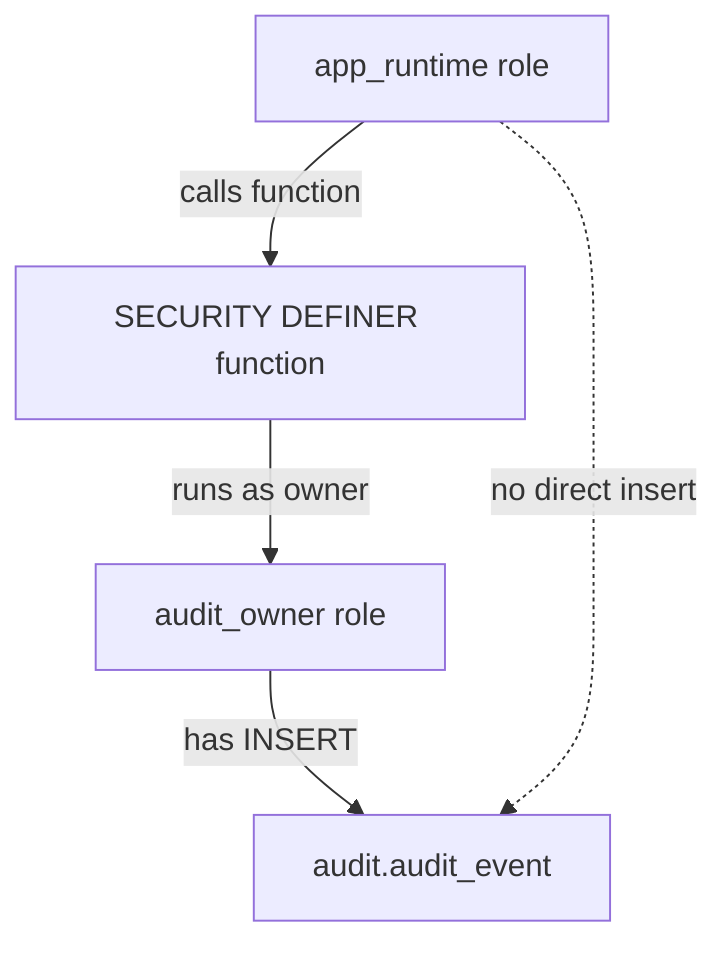
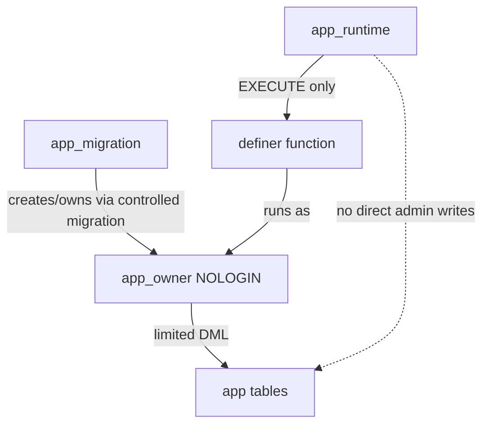

# Part 020 — SECURITY DEFINER/INVOKER, Search Path, and Privilege Boundaries

PL/pgSQL function bukan hanya unit logic.

Ia juga unit privilege.

Begitu function dipakai oleh aplikasi, trigger, job, reporting user, atau role lain, pertanyaan yang harus dijawab adalah:

> function ini berjalan dengan hak siapa?

Jawaban itu menentukan:

- table apa yang bisa dibaca,
- table apa yang bisa ditulis,
- policy apa yang berlaku,
- object mana yang di-resolve ketika nama tidak qualified,
- apakah function bisa dipakai untuk privilege escalation.

Part ini membahas boundary paling penting dalam PL/pgSQL security:

1. `SECURITY INVOKER`,
2. `SECURITY DEFINER`,
3. `search_path`,
4. function ownership,
5. execute privilege,
6. schema privilege,
7. row-level security interaction,
8. safe deployment.

Jika Part 019 membahas audit sebagai bukti, Part 020 membahas siapa yang boleh membuat bukti itu dan dengan hak apa.

---

## 1. Mental Model: Function sebagai Capability

Dalam aplikasi biasa, function adalah kode.

Dalam PostgreSQL, function juga bisa menjadi capability:

> hak terbatas untuk melakukan aksi tertentu tanpa memberikan seluruh privilege underlying table kepada caller.

Contoh:

- caller tidak boleh `INSERT` langsung ke `audit.audit_event`,
- caller boleh menjalankan `audit.capture_case_file_update_stmt()` melalui trigger,
- function tersebut dimiliki role khusus yang boleh insert ke audit table.

Diagram:



Ini pola yang kuat.

Tetapi jika function tidak diamankan, ia berubah menjadi privilege escalation endpoint.

---

## 2. SECURITY INVOKER vs SECURITY DEFINER

PostgreSQL function secara default berjalan sebagai `SECURITY INVOKER`.

Artinya:

> function memakai privilege role yang memanggil function.

`SECURITY DEFINER` berarti:

> function memakai privilege owner function.

Tabel keputusan:

| Kebutuhan | Pilihan | Alasan |
|---|---|---|
| Query biasa mengikuti permission caller | `SECURITY INVOKER` | Principle of least surprise |
| Business helper yang tidak boleh menaikkan privilege | `SECURITY INVOKER` | Caller tetap dibatasi privilege-nya |
| API database dengan controlled write | `SECURITY DEFINER` | Caller diberi capability sempit |
| Trigger audit menulis ke schema terkunci | `SECURITY DEFINER` | Aplikasi tidak diberi direct table privilege |
| Maintenance routine untuk admin terbatas | `SECURITY DEFINER` | Bisa expose operasi aman tanpa superuser |
| Function membaca tenant data dengan RLS caller | Biasanya `SECURITY INVOKER` | Hindari bypass tidak sengaja |

Default yang aman:

> pakai `SECURITY INVOKER` kecuali ada alasan privilege boundary yang eksplisit.

---

## 3. Kenapa SECURITY DEFINER Berbahaya

`SECURITY DEFINER` berjalan dengan hak owner. Jika caller bisa memengaruhi object resolution, dynamic SQL, argument, atau search path, caller bisa membuat function melakukan sesuatu yang tidak dimaksudkan.

Attack surface umum:

1. unqualified table/function/operator name,
2. `search_path` yang bisa dipengaruhi caller,
3. dynamic SQL yang menyisipkan identifier/value mentah,
4. function owner terlalu powerful,
5. function executable oleh `PUBLIC`,
6. schema writable oleh role tidak trusted,
7. temporary object masking,
8. RLS bypass tidak disengaja,
9. default privileges lupa diubah.

Prinsip:

> SECURITY DEFINER function harus diperlakukan seperti endpoint privileged API.

Bukan helper biasa.

---

## 4. search_path: Hidden Dependency yang Sering Diremehkan

`search_path` menentukan schema mana yang dipakai PostgreSQL untuk mencari object yang tidak ditulis qualified.

Contoh rawan:

```sql
CREATE OR REPLACE FUNCTION admin.close_case(p_case_id uuid)
RETURNS void
LANGUAGE plpgsql
SECURITY DEFINER
AS $$
BEGIN
    UPDATE case_file
    SET status = 'CLOSED'
    WHERE case_id = p_case_id;
END;
$$;
```

Masalahnya: `case_file` tidak qualified.

Jika function berjalan dengan `search_path` yang tidak aman, object resolution bisa menjadi tidak sesuai harapan.

Versi aman:

```sql
CREATE OR REPLACE FUNCTION admin.close_case(p_case_id uuid)
RETURNS void
LANGUAGE plpgsql
SECURITY DEFINER
SET search_path = app, pg_catalog, pg_temp
AS $$
BEGIN
    UPDATE app.case_file AS cf
    SET status = 'CLOSED'
    WHERE cf.case_id = p_case_id;
END;
$$;
```

Ada dua lapis defense:

1. `SET search_path` pada function,
2. schema qualification pada object penting.

Untuk function privileged, lakukan keduanya.

---

## 5. Template SECURITY DEFINER yang Aman

Gunakan template ini sebagai baseline.

```sql
CREATE OR REPLACE FUNCTION admin.perform_controlled_action(
    p_entity_id uuid,
    p_actor text
)
RETURNS void
LANGUAGE plpgsql
SECURITY DEFINER
SET search_path = admin, app, pg_catalog, pg_temp
AS $$
BEGIN
    IF p_entity_id IS NULL THEN
        RAISE EXCEPTION USING
            ERRCODE = '22004',
            MESSAGE = 'p_entity_id must not be null';
    END IF;

    UPDATE app.entity AS e
    SET updated_by = p_actor,
        updated_at = clock_timestamp()
    WHERE e.entity_id = p_entity_id;

    IF NOT FOUND THEN
        RAISE EXCEPTION USING
            ERRCODE = 'P7701',
            MESSAGE = 'entity not found',
            DETAIL = format('entity_id=%s', p_entity_id);
    END IF;
END;
$$;

REVOKE ALL ON FUNCTION admin.perform_controlled_action(uuid, text) FROM PUBLIC;
GRANT EXECUTE ON FUNCTION admin.perform_controlled_action(uuid, text) TO app_runtime;
```

Checklist template:

- `SECURITY DEFINER` ada hanya jika perlu.
- `SET search_path` eksplisit.
- Schema writable oleh untrusted users tidak masuk search path.
- Object penting tetap schema-qualified.
- Argument divalidasi.
- Dynamic SQL tidak digunakan kecuali perlu.
- Execute privilege direvoke dari `PUBLIC`.
- Execute privilege diberikan ke role spesifik.
- Owner function bukan superuser dan bukan role login aplikasi.

---

## 6. Owner Role: Jangan Pakai Superuser

Kesalahan umum:

```sql
CREATE FUNCTION ... SECURITY DEFINER ...;
-- dibuat oleh postgres superuser
```

Akibatnya function berjalan dengan privilege superuser-level.

Lebih baik:

```sql
CREATE ROLE app_owner NOLOGIN;
CREATE ROLE audit_owner NOLOGIN;
CREATE ROLE app_runtime LOGIN;
CREATE ROLE app_migration LOGIN;
```

Kemudian:

```sql
ALTER SCHEMA app OWNER TO app_owner;
ALTER SCHEMA audit OWNER TO audit_owner;

ALTER FUNCTION audit.capture_case_file_update_stmt() OWNER TO audit_owner;
```

Role owner harus punya privilege yang cukup, tetapi tidak lebih.

Diagram role:



Prinsip:

> function owner adalah privilege envelope function tersebut.

Jika owner terlalu kuat, bug kecil menjadi escalation besar.

---

## 7. PUBLIC Execute Privilege

PostgreSQL memberi default privileges tertentu kepada `PUBLIC`, termasuk `EXECUTE` untuk function/procedure kecuali direvoke.

Artinya, setelah membuat function, jangan otomatis menganggap function hanya bisa dijalankan role aplikasi tertentu.

Gunakan:

```sql
REVOKE ALL ON FUNCTION admin.perform_controlled_action(uuid, text) FROM PUBLIC;
GRANT EXECUTE ON FUNCTION admin.perform_controlled_action(uuid, text) TO app_runtime;
```

Untuk banyak function:

```sql
REVOKE EXECUTE ON ALL FUNCTIONS IN SCHEMA admin FROM PUBLIC;
GRANT EXECUTE ON ALL FUNCTIONS IN SCHEMA admin TO app_runtime;
```

Untuk function masa depan:

```sql
ALTER DEFAULT PRIVILEGES IN SCHEMA admin
REVOKE EXECUTE ON FUNCTIONS FROM PUBLIC;

ALTER DEFAULT PRIVILEGES IN SCHEMA admin
GRANT EXECUTE ON FUNCTIONS TO app_runtime;
```

Namun hati-hati: `ALTER DEFAULT PRIVILEGES` hanya berlaku untuk object yang dibuat setelah command tersebut oleh role yang relevan. Ia tidak mengubah object existing.

---

## 8. Schema Privilege: USAGE Bukan DML

Agar role bisa menjalankan function dalam schema, role biasanya perlu `USAGE` pada schema dan `EXECUTE` pada function.

```sql
GRANT USAGE ON SCHEMA admin TO app_runtime;
GRANT EXECUTE ON FUNCTION admin.perform_controlled_action(uuid, text) TO app_runtime;
```

Jangan memberikan privilege tabel jika function dimaksudkan sebagai satu-satunya path.

```sql
REVOKE ALL ON app.case_file FROM app_runtime;
```

Lalu expose operasi melalui function:

```sql
GRANT EXECUTE ON FUNCTION app.transition_case_status(uuid, text, text) TO app_runtime;
```

Ini membuat database API lebih sempit.

---

## 9. Trusted Schema Discipline

Schema dalam `search_path` untuk SECURITY DEFINER harus trusted.

Trusted berarti:

- untrusted role tidak bisa create object di schema tersebut,
- untrusted role tidak bisa replace function/operator/table yang akan dipakai,
- owner schema terkendali,
- migration path diaudit.

Contoh hardening:

```sql
REVOKE CREATE ON SCHEMA public FROM PUBLIC;
REVOKE ALL ON SCHEMA admin FROM PUBLIC;
REVOKE ALL ON SCHEMA audit FROM PUBLIC;

GRANT USAGE ON SCHEMA admin TO app_runtime;
```

Kenapa `public` sering harus direvoke?

Karena banyak database historis membiarkan banyak role membuat object di schema `public`. Jika `public` masuk `search_path` function privileged, object masking risk meningkat.

---

## 10. pg_temp dan Temporary Object Masking

Temporary objects memiliki behavior resolution khusus. Untuk SECURITY DEFINER function, biasakan meletakkan `pg_temp` terakhir jika memang perlu masuk search path.

Contoh:

```sql
SET search_path = admin, app, pg_catalog, pg_temp
```

Jangan:

```sql
SET search_path = pg_temp, admin, app
```

Temporary schema tidak boleh menang atas schema trusted.

Bahkan dengan search path aman, object penting tetap lebih baik ditulis qualified:

```sql
UPDATE app.case_file AS cf
SET status = 'CLOSED'
WHERE cf.case_id = p_case_id;
```

---

## 11. Function Resolution dan Operator Resolution

`search_path` tidak hanya tentang table.

Ia juga memengaruhi resolution untuk:

- function,
- operator,
- type,
- cast,
- aggregate,
- object lain.

Karena itu, risiko SECURITY DEFINER bukan hanya “table palsu”. Caller bisa mencoba memengaruhi function/operator resolution jika schema tidak aman.

Contoh lebih aman:

```sql
PERFORM app.validate_case_transition(
    p_case_id,
    p_target_status,
    p_reason_code
);
```

Bukan:

```sql
PERFORM validate_case_transition(
    p_case_id,
    p_target_status,
    p_reason_code
);
```

Pada privileged function, readability kalah penting dibanding explicitness.

---

## 12. Dynamic SQL dalam SECURITY DEFINER

Dynamic SQL di function privileged adalah area berisiko tinggi.

Buruk:

```sql
EXECUTE 'UPDATE ' || p_table_name || ' SET status = ''CLOSED'' WHERE id = ' || p_id;
```

Lebih aman:

```sql
EXECUTE format(
    'UPDATE %I.%I SET status = $1 WHERE id = $2',
    p_schema_name,
    p_table_name
)
USING 'CLOSED', p_id;
```

Namun escaping saja belum cukup. Identifier harus di-allow-list.

```sql
IF NOT EXISTS (
    SELECT 1
    FROM admin.allowed_target_table t
    WHERE t.schema_name = p_schema_name
      AND t.table_name = p_table_name
      AND t.operation = 'close'
      AND t.active
) THEN
    RAISE EXCEPTION USING
        ERRCODE = 'P7702',
        MESSAGE = 'target table is not allowed for this operation';
END IF;
```

Prinsip:

> identifier dynamic harus melalui allow-list; value dynamic harus melalui `USING`.

---

## 13. SECURITY DEFINER dan RLS

Row-Level Security perlu perhatian khusus.

PostgreSQL row security memiliki beberapa bypass path:

- superuser bypass,
- role dengan `BYPASSRLS` bypass,
- table owner biasanya bypass,
- table owner bisa dipaksa mengikuti RLS dengan `ALTER TABLE ... FORCE ROW LEVEL SECURITY`.

Artinya, SECURITY DEFINER function yang dimiliki table owner bisa membaca/menulis melewati RLS yang caller alami.

Kadang ini memang tujuan.

Contoh valid:

- user tidak boleh melihat semua row audit,
- tetapi boleh memanggil function `submit_case_action` yang menulis row tertentu setelah validasi.

Contoh berbahaya:

- function report `SECURITY DEFINER` tidak sengaja mengembalikan data lintas tenant.

Decision table:

| Scenario | Rekomendasi |
|---|---|
| Function harus mengikuti tenant caller | `SECURITY INVOKER` atau explicit tenant filter |
| Function sengaja melakukan privileged write terbatas | `SECURITY DEFINER` dengan validation ketat |
| Function membaca data sensitif lintas tenant | Hindari atau audit akses sangat ketat |
| Owner function sama dengan table owner RLS | Cek apakah RLS dibypass |
| RLS harus berlaku ke owner | Gunakan `FORCE ROW LEVEL SECURITY` bila sesuai |

Jangan menganggap RLS otomatis melindungi semua function.

---

## 14. Explicit Tenant/Actor Validation

Jika function privileged menerima actor atau tenant dari aplikasi, jangan percaya begitu saja.

Buruk:

```sql
CREATE OR REPLACE FUNCTION app.get_case(p_tenant_id uuid, p_case_id uuid)
RETURNS app.case_file
LANGUAGE plpgsql
SECURITY DEFINER
AS $$
DECLARE
    v_case app.case_file;
BEGIN
    SELECT * INTO STRICT v_case
    FROM app.case_file
    WHERE tenant_id = p_tenant_id
      AND case_id = p_case_id;

    RETURN v_case;
END;
$$;
```

Caller bisa mengirim tenant lain.

Lebih baik tenant berasal dari session context yang ditetapkan oleh trusted middleware, atau dari database role mapping.

```sql
CREATE OR REPLACE FUNCTION app_context.current_tenant_id()
RETURNS uuid
LANGUAGE sql
STABLE
AS $$
    SELECT NULLIF(current_setting('app.tenant_id', true), '')::uuid;
$$;
```

Function:

```sql
CREATE OR REPLACE FUNCTION app.get_case(p_case_id uuid)
RETURNS app.case_file
LANGUAGE plpgsql
SECURITY DEFINER
SET search_path = app, app_context, pg_catalog, pg_temp
AS $$
DECLARE
    v_tenant_id uuid;
    v_case app.case_file;
BEGIN
    v_tenant_id := app_context.current_tenant_id();

    IF v_tenant_id IS NULL THEN
        RAISE EXCEPTION USING
            ERRCODE = 'P7703',
            MESSAGE = 'tenant context is required';
    END IF;

    SELECT * INTO STRICT v_case
    FROM app.case_file AS cf
    WHERE cf.tenant_id = v_tenant_id
      AND cf.case_id = p_case_id;

    RETURN v_case;
END;
$$;
```

Tetap perlu memastikan siapa yang boleh set `app.tenant_id` pada connection.

---

## 15. API Function Boundary Pattern

Database API function adalah pola yang baik ketika kita ingin mencegah aplikasi melakukan mutation bebas.

Contoh:

```sql
CREATE OR REPLACE FUNCTION app.transition_case_status(
    p_case_id uuid,
    p_target_status text,
    p_reason_code text
)
RETURNS TABLE (
    case_id uuid,
    old_status text,
    new_status text,
    changed boolean
)
LANGUAGE plpgsql
SECURITY DEFINER
SET search_path = app, app_context, audit, pg_catalog, pg_temp
AS $$
DECLARE
    v_actor text;
    v_old_status text;
BEGIN
    v_actor := app_context.current_audit_context() ->> 'actor_app_user';

    IF v_actor IS NULL THEN
        RAISE EXCEPTION USING
            ERRCODE = 'P7704',
            MESSAGE = 'actor_app_user is required';
    END IF;

    SELECT cf.status INTO STRICT v_old_status
    FROM app.case_file AS cf
    WHERE cf.case_id = p_case_id
    FOR UPDATE;

    PERFORM app.assert_case_status_transition_allowed(
        v_old_status,
        p_target_status,
        p_reason_code
    );

    UPDATE app.case_file AS cf
    SET status = p_target_status,
        updated_by = v_actor,
        updated_at = clock_timestamp()
    WHERE cf.case_id = p_case_id
      AND cf.status IS DISTINCT FROM p_target_status;

    RETURN QUERY
    SELECT
        p_case_id,
        v_old_status,
        p_target_status,
        FOUND;
END;
$$;
```

Grant:

```sql
REVOKE ALL ON FUNCTION app.transition_case_status(uuid, text, text) FROM PUBLIC;
GRANT EXECUTE ON FUNCTION app.transition_case_status(uuid, text, text) TO app_runtime;
```

Aplikasi tidak perlu update table langsung.

---

## 16. Trigger Function Security

Trigger function sering memakai `SECURITY DEFINER` agar bisa menulis ke audit/outbox schema.

Pattern:

```sql
CREATE OR REPLACE FUNCTION audit.capture_case_file_update_stmt()
RETURNS trigger
LANGUAGE plpgsql
SECURITY DEFINER
SET search_path = audit, app_context, app, pg_catalog, pg_temp
AS $$
BEGIN
    INSERT INTO audit.audit_event (...)
    VALUES (...);

    RETURN NULL;
END;
$$;
```

Namun trigger function juga harus diproteksi:

```sql
REVOKE ALL ON FUNCTION audit.capture_case_file_update_stmt() FROM PUBLIC;
```

Trigger manager dapat menjalankan function sebagai trigger, tetapi jangan biarkan user memanggilnya bebas jika tidak perlu.

Catatan: data-change trigger function memang menerima context khusus seperti `TG_OP`, `TG_TABLE_NAME`, `OLD`, `NEW`, atau transition relations saat dipanggil sebagai trigger. Jika dipanggil langsung di luar trigger context, ia tidak punya context tersebut dan akan gagal. Tetap revoke execute untuk mengurangi attack surface dan kebingungan operasional.

---

## 17. SET Clause pada Function

`CREATE FUNCTION` mendukung `SET` configuration parameter untuk durasi function call.

Untuk security, ini paling sering dipakai untuk `search_path`.

```sql
CREATE FUNCTION ...
SECURITY DEFINER
SET search_path = app, pg_catalog, pg_temp
AS $$ ... $$;
```

Keuntungan:

- search path melekat pada function definition,
- tidak tergantung session caller,
- mudah diaudit lewat catalog.

Cari function SECURITY DEFINER tanpa SET search_path:

```sql
SELECT
    n.nspname AS schema_name,
    p.proname AS function_name,
    pg_get_function_identity_arguments(p.oid) AS args
FROM pg_proc p
JOIN pg_namespace n ON n.oid = p.pronamespace
WHERE p.prosecdef
  AND NOT EXISTS (
      SELECT 1
      FROM unnest(COALESCE(p.proconfig, ARRAY[]::text[])) cfg
      WHERE cfg LIKE 'search_path=%'
  )
ORDER BY 1, 2;
```

Ini query audit penting untuk database review.

---

## 18. Catalog Query untuk Privilege Review

Cari function executable by PUBLIC:

```sql
SELECT
    n.nspname AS schema_name,
    p.proname AS function_name,
    pg_get_function_identity_arguments(p.oid) AS args,
    p.proacl
FROM pg_proc p
JOIN pg_namespace n ON n.oid = p.pronamespace
WHERE has_function_privilege('PUBLIC', p.oid, 'EXECUTE')
ORDER BY 1, 2;
```

Cari SECURITY DEFINER function:

```sql
SELECT
    n.nspname AS schema_name,
    p.proname AS function_name,
    pg_get_userbyid(p.proowner) AS owner_name,
    pg_get_function_identity_arguments(p.oid) AS args,
    p.proconfig
FROM pg_proc p
JOIN pg_namespace n ON n.oid = p.pronamespace
WHERE p.prosecdef
ORDER BY 1, 2;
```

Cari function owner superuser:

```sql
SELECT
    n.nspname AS schema_name,
    p.proname AS function_name,
    r.rolname AS owner_name
FROM pg_proc p
JOIN pg_namespace n ON n.oid = p.pronamespace
JOIN pg_roles r ON r.oid = p.proowner
WHERE p.prosecdef
  AND r.rolsuper;
```

Tujuan review bukan hanya menemukan bug. Tujuannya membangun inventory capability.

---

## 19. Exception Messages dalam Function Privileged

Function privileged tidak boleh membocorkan detail sensitif melalui error.

Buruk:

```sql
RAISE EXCEPTION 'no access to tenant %, internal policy row %', v_tenant_id, v_policy;
```

Lebih aman:

```sql
RAISE EXCEPTION USING
    ERRCODE = 'P7705',
    MESSAGE = 'operation is not allowed',
    DETAIL = format('case_id=%s', p_case_id),
    HINT = 'Verify caller context and required permission.';
```

Untuk internal debug, tulis detail ke audit/security event table dengan akses terbatas.

---

## 20. Volatility, Leakproof, Parallel Safety: Jangan Asal Label

`CREATE FUNCTION` memiliki atribut seperti volatility, leakproof, parallel safety, cost, rows.

Untuk security, jangan asal menandai function sebagai `LEAKPROOF`. Leakproof adalah klaim kuat bahwa function tidak membocorkan informasi melalui side effect/error message. Biasanya hanya superuser dapat menandai function leakproof karena memengaruhi planner dan security barrier behavior.

Prinsip:

- jangan memberi label security/performance tanpa bukti,
- gunakan `VOLATILE` untuk function yang membaca setting, waktu, table, sequence, atau melakukan mutation,
- gunakan `STABLE` untuk function read-only yang konsisten dalam satu statement,
- gunakan `IMMUTABLE` hanya jika benar-benar deterministik terhadap input.

Label salah bisa menjadi correctness bug atau security bug.

---

## 21. Migration Pattern yang Aman

Membuat SECURITY DEFINER function harus atomic dengan privilege hardening.

Buruk:

```sql
CREATE FUNCTION admin.do_sensitive_action(...) ... SECURITY DEFINER ...;
-- deploy selesai
-- revoke/grant menyusul nanti
```

Ada window function executable oleh role yang tidak diinginkan.

Lebih aman:

```sql
BEGIN;

CREATE OR REPLACE FUNCTION admin.do_sensitive_action(...)
RETURNS void
LANGUAGE plpgsql
SECURITY DEFINER
SET search_path = admin, app, pg_catalog, pg_temp
AS $$
BEGIN
    -- body
END;
$$;

ALTER FUNCTION admin.do_sensitive_action(...) OWNER TO admin_owner;
REVOKE ALL ON FUNCTION admin.do_sensitive_action(...) FROM PUBLIC;
GRANT EXECUTE ON FUNCTION admin.do_sensitive_action(...) TO app_runtime;

COMMIT;
```

Untuk migration framework, buat helper template agar revoke/grant tidak lupa.

---

## 22. Zero-Trust Checklist untuk SECURITY DEFINER

Sebelum merge function privileged, jawab ini:

### Necessity

- Mengapa function ini harus `SECURITY DEFINER`?
- Apa privilege yang sengaja dinaikkan?
- Apakah bisa diselesaikan dengan `SECURITY INVOKER` + grant biasa?

### Owner

- Siapa owner function?
- Apakah owner superuser?
- Apakah owner role login aplikasi?
- Apakah owner punya privilege lebih dari yang function butuhkan?

### Search Path

- Apakah function punya `SET search_path`?
- Apakah schema dalam search path trusted?
- Apakah `pg_temp` tidak berada di depan schema trusted?
- Apakah table/function penting tetap schema-qualified?

### Input

- Apakah argument divalidasi?
- Apakah identifier dynamic di-allow-list?
- Apakah value dynamic memakai `USING`?
- Apakah caller bisa mengirim tenant/actor palsu?

### Output

- Apakah function mengembalikan data sensitif?
- Apakah error message membocorkan informasi?
- Apakah audit/security event dicatat untuk operasi penting?

### Grants

- Apakah execute direvoke dari `PUBLIC`?
- Apakah execute diberikan ke role spesifik?
- Apakah default privileges dikonfigurasi?

### RLS

- Apakah function bypass RLS?
- Jika ya, apakah itu disengaja?
- Apakah table owner dipaksa mengikuti RLS jika perlu?

---

## 23. Anti-Patterns

### 23.1 SECURITY DEFINER untuk Kenyamanan

```sql
SECURITY DEFINER
```

karena “permission-nya ribet” adalah red flag.

Security definer harus punya tujuan capability yang jelas.

### 23.2 Function Owner = postgres

Function privileged owned by superuser membuat blast radius terlalu besar.

### 23.3 Tidak Ada SET search_path

Ini salah satu footgun terbesar.

### 23.4 Unqualified Object Names di Function Privileged

Search path aman membantu, tetapi qualification eksplisit tetap lebih baik.

### 23.5 Dynamic SQL Tanpa Allow-List

`format('%I', value)` melindungi syntax, bukan authorization.

### 23.6 PUBLIC Execute Dibiarkan

Function internal sering tidak sengaja menjadi public API database.

### 23.7 Mengandalkan RLS Tanpa Memahami Owner Bypass

RLS bukan magic layer yang selalu berlaku untuk semua function.

---

## 24. Case Study: Secure Audit Capture

Kebutuhan:

- `app_runtime` boleh update `app.case_file` melalui API function,
- `app_runtime` tidak boleh insert ke `audit.audit_event`,
- audit trigger harus tetap bisa menulis audit,
- audit schema tidak boleh dibaca semua user.

Role setup:

```sql
CREATE ROLE app_owner NOLOGIN;
CREATE ROLE audit_owner NOLOGIN;
CREATE ROLE app_runtime LOGIN;

REVOKE CREATE ON SCHEMA public FROM PUBLIC;

CREATE SCHEMA app AUTHORIZATION app_owner;
CREATE SCHEMA audit AUTHORIZATION audit_owner;
```

Privilege:

```sql
REVOKE ALL ON SCHEMA audit FROM PUBLIC;
GRANT USAGE ON SCHEMA app TO app_runtime;
GRANT USAGE ON SCHEMA audit TO app_runtime;

REVOKE ALL ON ALL TABLES IN SCHEMA audit FROM PUBLIC;
REVOKE ALL ON ALL TABLES IN SCHEMA audit FROM app_runtime;
```

Audit function:

```sql
CREATE OR REPLACE FUNCTION audit.capture_case_file_update_stmt()
RETURNS trigger
LANGUAGE plpgsql
SECURITY DEFINER
SET search_path = audit, app_context, app, pg_catalog, pg_temp
AS $$
BEGIN
    -- Insert audit event and row changes.
    RETURN NULL;
END;
$$;

ALTER FUNCTION audit.capture_case_file_update_stmt() OWNER TO audit_owner;
REVOKE ALL ON FUNCTION audit.capture_case_file_update_stmt() FROM PUBLIC;
```

Trigger:

```sql
CREATE TRIGGER trg_case_file_audit_update_stmt
AFTER UPDATE ON app.case_file
REFERENCING OLD TABLE AS old_rows NEW TABLE AS new_rows
FOR EACH STATEMENT
EXECUTE FUNCTION audit.capture_case_file_update_stmt();
```

Result:

- app update menghasilkan audit,
- app tidak bisa memalsukan audit langsung,
- audit function punya search path aman,
- audit table ownership terpisah.

---

## 25. Practical Review Query Pack

Simpan query ini di repository database governance.

### SECURITY DEFINER tanpa search_path

```sql
SELECT
    n.nspname,
    p.proname,
    pg_get_function_identity_arguments(p.oid)
FROM pg_proc p
JOIN pg_namespace n ON n.oid = p.pronamespace
WHERE p.prosecdef
  AND NOT EXISTS (
      SELECT 1
      FROM unnest(COALESCE(p.proconfig, ARRAY[]::text[])) c
      WHERE c LIKE 'search_path=%'
  );
```

### SECURITY DEFINER owned by superuser

```sql
SELECT
    n.nspname,
    p.proname,
    r.rolname
FROM pg_proc p
JOIN pg_namespace n ON n.oid = p.pronamespace
JOIN pg_roles r ON r.oid = p.proowner
WHERE p.prosecdef
  AND r.rolsuper;
```

### Function executable by PUBLIC

```sql
SELECT
    n.nspname,
    p.proname,
    pg_get_function_identity_arguments(p.oid)
FROM pg_proc p
JOIN pg_namespace n ON n.oid = p.pronamespace
WHERE has_function_privilege('PUBLIC', p.oid, 'EXECUTE')
ORDER BY 1, 2;
```

### Schemas where PUBLIC can create objects

```sql
SELECT
    nspname
FROM pg_namespace
WHERE has_schema_privilege('PUBLIC', oid, 'CREATE')
ORDER BY 1;
```

---

## 26. Final Rules

1. Treat PL/pgSQL function as a privilege boundary, not just code.
2. Use `SECURITY INVOKER` by default.
3. Use `SECURITY DEFINER` only for explicit capability design.
4. Never let SECURITY DEFINER depend on caller search path.
5. Always set `search_path` in SECURITY DEFINER function.
6. Keep untrusted writable schemas out of function search path.
7. Prefer schema-qualified object names anyway.
8. Revoke execute from `PUBLIC` unless the function is intentionally public.
9. Function owner should be no-login and least-privileged.
10. Dynamic SQL in privileged function requires allow-list and `USING`.
11. Understand RLS bypass before using SECURITY DEFINER on tenant data.
12. Review privileged functions through catalog queries regularly.

---

## 27. Latihan

1. Buat role `app_owner`, `audit_owner`, `app_runtime`, dan `app_migration`.
2. Buat schema `app`, `audit`, dan `admin` dengan ownership terpisah.
3. Buat satu function `SECURITY INVOKER` dan satu `SECURITY DEFINER`.
4. Tunjukkan perbedaan `current_user` dan `session_user` saat function dipanggil.
5. Buat SECURITY DEFINER function tanpa `SET search_path`, lalu deteksi dengan catalog query.
6. Hardening function tersebut dengan `SET search_path` dan explicit qualification.
7. Revoke execute dari `PUBLIC` dan grant hanya ke `app_runtime`.
8. Buat dynamic SQL privileged function dengan allow-list table.
9. Uji bahwa app role tidak bisa mengakses table langsung tetapi bisa menjalankan API function.
10. Jika memakai RLS, uji apakah function bypass policy dan dokumentasikan keputusan desain.

---

## 28. Referensi

- PostgreSQL Documentation — `CREATE FUNCTION`: `https://www.postgresql.org/docs/current/sql-createfunction.html`
- PostgreSQL Documentation — Function Security: `https://www.postgresql.org/docs/current/perm-functions.html`
- PostgreSQL Documentation — Privileges: `https://www.postgresql.org/docs/current/ddl-priv.html`
- PostgreSQL Documentation — `GRANT`: `https://www.postgresql.org/docs/current/sql-grant.html`
- PostgreSQL Documentation — `ALTER DEFAULT PRIVILEGES`: `https://www.postgresql.org/docs/current/sql-alterdefaultprivileges.html`
- PostgreSQL Documentation — Row Security Policies: `https://www.postgresql.org/docs/current/ddl-rowsecurity.html`
- PostgreSQL Documentation — PL/pgSQL Trigger Functions: `https://www.postgresql.org/docs/current/plpgsql-trigger.html`
