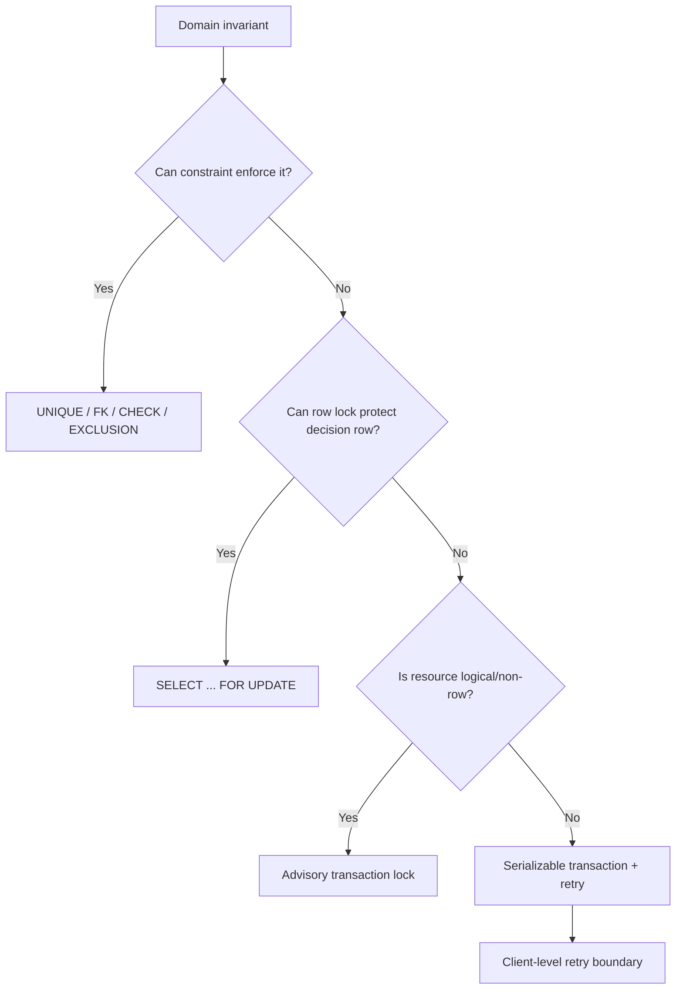

# Part 021 — Concurrency, Locking, Advisory Locks, and Race Condition Control

PL/pgSQL sering terlihat benar ketika diuji satu session.

Lalu rusak ketika dua worker, dua API request, atau dua job scheduler berjalan bersamaan.

Itu bukan masalah syntax. Itu masalah model.

Dalam database produksi, logic yang benar harus tetap benar ketika:

- dua transaksi membaca state yang sama,
- dua transaksi mencoba memutasi row yang sama,
- dua transaksi memproses job yang sama,
- dua transaksi mengambil keputusan dari agregat yang sama,
- satu transaksi menunggu lock terlalu lama,
- satu transaksi mati di tengah proses,
- deadlock terjadi karena urutan lock tidak konsisten.

Part ini membahas cara mendesain PL/pgSQL yang aman terhadap race condition.

Bukan dengan mantra “pakai transaction”. Semua operasi database memang berada di transaction. Pertanyaan sebenarnya:

> invariant apa yang harus tetap benar di bawah concurrency, dan mekanisme apa yang memaksanya?

---

## 1. Mental Model: Concurrency Bug adalah Invariant Bug

Jangan mulai dari lock.

Mulai dari invariant.

Contoh invariant:

| Domain | Invariant |
|---|---|
| Case management | Case hanya boleh di-assign ke satu active investigator |
| Payment | Idempotency key hanya boleh menghasilkan satu efek bisnis |
| Queue | Satu job hanya boleh diproses satu worker pada satu waktu |
| Inventory | Reserved quantity tidak boleh melebihi available quantity |
| Compliance | Closed case tidak boleh dimutasi kecuali lewat reopen workflow |
| SLA | Escalation hanya boleh dibuat sekali per breached threshold |

Concurrency control bertugas menjaga invariant itu ketika banyak transaksi saling bersaing.

Diagram sederhana:



Rule praktis:

> Locking adalah alat terakhir setelah constraint, mutation-with-proof, dan atomic SQL tidak cukup.

---

## 2. Race Condition Paling Umum di PL/pgSQL

### 2.1 Check-Then-Act Race

Anti-pattern:

```sql
CREATE OR REPLACE FUNCTION case_app.assign_case_bad(
    p_case_id bigint,
    p_investigator_id bigint
) RETURNS void
LANGUAGE plpgsql
AS $$
DECLARE
    v_status text;
BEGIN
    SELECT status
    INTO v_status
    FROM case_app.case_file
    WHERE case_id = p_case_id;

    IF v_status <> 'OPEN' THEN
        RAISE EXCEPTION 'case % is not open', p_case_id
            USING ERRCODE = 'PZ421';
    END IF;

    UPDATE case_app.case_file
    SET investigator_id = p_investigator_id,
        status = 'ASSIGNED'
    WHERE case_id = p_case_id;
END;
$$;
```

Masalahnya:

1. transaksi A membaca case masih `OPEN`,
2. transaksi B membaca case masih `OPEN`,
3. A update menjadi assigned,
4. B juga update, menimpa assignment A.

Fix minimal: satukan proof dan mutation.

```sql
CREATE OR REPLACE FUNCTION case_app.assign_case(
    p_case_id bigint,
    p_investigator_id bigint,
    p_actor text
) RETURNS void
LANGUAGE plpgsql
AS $$
DECLARE
    v_row_count integer;
BEGIN
    UPDATE case_app.case_file AS cf
    SET investigator_id = p_investigator_id,
        status = 'ASSIGNED',
        assigned_at = clock_timestamp(),
        assigned_by = p_actor
    WHERE cf.case_id = p_case_id
      AND cf.status = 'OPEN';

    GET DIAGNOSTICS v_row_count = ROW_COUNT;

    IF v_row_count <> 1 THEN
        RAISE EXCEPTION 'case % cannot be assigned from current state', p_case_id
            USING ERRCODE = 'PZ421',
                  DETAIL = 'Expected exactly one OPEN case row to be updated.',
                  HINT = 'Reload case state and evaluate allowed transitions.';
    END IF;
END;
$$;
```

Kenapa lebih aman?

Karena decision predicate (`status = 'OPEN'`) dan mutation berada di satu `UPDATE` statement.

PostgreSQL akan mengambil row lock untuk row yang di-update. Jika ada transaksi lain mengubah row itu lebih dulu, statement kedua akan mengevaluasi ulang predicate terhadap versi row yang baru sesuai aturan isolation yang berlaku.

### 2.2 Duplicate Work Race

Anti-pattern:

```sql
SELECT job_id
INTO v_job_id
FROM worker.job
WHERE status = 'READY'
ORDER BY priority DESC, created_at
LIMIT 1;

UPDATE worker.job
SET status = 'RUNNING'
WHERE job_id = v_job_id;
```

Dua worker bisa memilih job yang sama sebelum salah satunya mengubah status.

Fix queue-style:

```sql
CREATE OR REPLACE FUNCTION worker.claim_job(p_worker_id text)
RETURNS TABLE(job_id bigint, payload jsonb)
LANGUAGE plpgsql
AS $$
BEGIN
    RETURN QUERY
    WITH candidate AS (
        SELECT j.job_id
        FROM worker.job AS j
        WHERE j.status = 'READY'
          AND j.run_after <= clock_timestamp()
        ORDER BY j.priority DESC, j.created_at, j.job_id
        FOR UPDATE SKIP LOCKED
        LIMIT 1
    )
    UPDATE worker.job AS j
    SET status = 'RUNNING',
        claimed_by = p_worker_id,
        claimed_at = clock_timestamp(),
        attempt_count = j.attempt_count + 1
    FROM candidate AS c
    WHERE j.job_id = c.job_id
    RETURNING j.job_id, j.payload;
END;
$$;
```

`FOR UPDATE SKIP LOCKED` membuat worker melewati row yang sedang diklaim transaksi lain.

Ini cocok untuk queue internal database.

Tetapi jangan salah paham:

> `SKIP LOCKED` mengoptimalkan throughput, bukan fairness mutlak.

Job dengan lock panjang bisa dilewati berkali-kali. Desain queue tetap perlu retry, timeout, lease expiry, dan dead-letter strategy.

### 2.3 Aggregate Decision Race

Contoh:

```sql
SELECT count(*)
INTO v_active_count
FROM case_app.assignment
WHERE investigator_id = p_investigator_id
  AND status = 'ACTIVE';

IF v_active_count >= 10 THEN
    RAISE EXCEPTION 'capacity exceeded';
END IF;

INSERT INTO case_app.assignment(...);
```

Masalah:

- dua transaksi membaca count = 9,
- keduanya insert,
- hasil akhir = 11.

Row lock pada row assignment yang ada belum tentu cukup, karena invariant-nya bukan row tunggal. Invariant-nya adalah kapasitas per investigator.

Pilihan desain:

1. materialized counter row `investigator_capacity` lalu lock row tersebut,
2. advisory lock per investigator,
3. serializable transaction + retry,
4. constraint/exclusion jika invariant bisa diekspresikan sebagai constraint.

Pattern dengan counter row:

```sql
CREATE TABLE case_app.investigator_load (
    investigator_id bigint PRIMARY KEY,
    active_case_count integer NOT NULL DEFAULT 0,
    max_active_case_count integer NOT NULL,
    CHECK (active_case_count >= 0),
    CHECK (max_active_case_count >= 0),
    CHECK (active_case_count <= max_active_case_count)
);
```

```sql
CREATE OR REPLACE FUNCTION case_app.assign_with_capacity(
    p_case_id bigint,
    p_investigator_id bigint,
    p_actor text
) RETURNS void
LANGUAGE plpgsql
AS $$
DECLARE
    v_capacity case_app.investigator_load%ROWTYPE;
BEGIN
    SELECT *
    INTO STRICT v_capacity
    FROM case_app.investigator_load AS il
    WHERE il.investigator_id = p_investigator_id
    FOR UPDATE;

    IF v_capacity.active_case_count >= v_capacity.max_active_case_count THEN
        RAISE EXCEPTION 'investigator % capacity exceeded', p_investigator_id
            USING ERRCODE = 'PZ430';
    END IF;

    UPDATE case_app.case_file AS cf
    SET investigator_id = p_investigator_id,
        status = 'ASSIGNED',
        assigned_at = clock_timestamp(),
        assigned_by = p_actor
    WHERE cf.case_id = p_case_id
      AND cf.status = 'OPEN';

    IF NOT FOUND THEN
        RAISE EXCEPTION 'case % cannot be assigned', p_case_id
            USING ERRCODE = 'PZ421';
    END IF;

    UPDATE case_app.investigator_load AS il
    SET active_case_count = il.active_case_count + 1
    WHERE il.investigator_id = p_investigator_id;
END;
$$;
```

Di sini row `investigator_load` menjadi serialization point untuk invariant kapasitas.

---

## 3. Locking Bukan Pengganti Constraint

Jika invariant bisa diekspresikan dengan constraint, gunakan constraint.

Contoh: satu active assignment per case.

```sql
CREATE UNIQUE INDEX assignment_one_active_per_case_uq
ON case_app.assignment(case_id)
WHERE status = 'ACTIVE';
```

Lalu PL/pgSQL menerjemahkan violation menjadi domain error:

```sql
CREATE OR REPLACE FUNCTION case_app.create_active_assignment(
    p_case_id bigint,
    p_investigator_id bigint
) RETURNS bigint
LANGUAGE plpgsql
AS $$
DECLARE
    v_assignment_id bigint;
BEGIN
    INSERT INTO case_app.assignment(case_id, investigator_id, status)
    VALUES (p_case_id, p_investigator_id, 'ACTIVE')
    RETURNING assignment_id INTO v_assignment_id;

    RETURN v_assignment_id;
EXCEPTION
    WHEN unique_violation THEN
        RAISE EXCEPTION 'case % already has an active assignment', p_case_id
            USING ERRCODE = 'PZ431';
END;
$$;
```

Kenapa ini lebih baik daripada manual lock?

- constraint bekerja untuk semua writer,
- constraint tetap aktif walau ada path selain function,
- constraint mudah diaudit,
- constraint tidak bergantung pada developer mengingat lock yang benar.

Rule:

> PL/pgSQL boleh mengorkestrasi invariant, tetapi database constraint harus memegang invariant yang bisa diformalkan.

---

## 4. Row Locking: `FOR UPDATE` dan Kawan-Kawan

PostgreSQL menyediakan beberapa row-level lock mode melalui `SELECT ... FOR ...`.

| Clause | Gunakan ketika | Intuisi |
|---|---|---|
| `FOR UPDATE` | Row akan di-update/delete atau keputusan butuh lock kuat | Lock eksklusif terhadap perubahan row |
| `FOR NO KEY UPDATE` | Update non-key column | Lebih lemah dari `FOR UPDATE` untuk key-related conflict |
| `FOR SHARE` | Membaca row dan ingin mencegah update/delete tertentu | Shared read lock |
| `FOR KEY SHARE` | Melindungi referenced key dari delete/key update | Dipakai terkait FK/key stability |

Dalam PL/pgSQL, pattern umum:

```sql
SELECT *
INTO STRICT v_case
FROM case_app.case_file AS cf
WHERE cf.case_id = p_case_id
FOR UPDATE;
```

Gunakan ketika:

1. function perlu membaca state kompleks,
2. melakukan beberapa validasi,
3. lalu melakukan beberapa mutation yang harus konsisten terhadap state tersebut.

Contoh state-machine transition:

```sql
CREATE OR REPLACE FUNCTION case_app.transition_case_locked(
    p_case_id bigint,
    p_target_status text,
    p_reason_code text,
    p_actor text
) RETURNS void
LANGUAGE plpgsql
AS $$
DECLARE
    v_case case_app.case_file%ROWTYPE;
BEGIN
    SELECT *
    INTO STRICT v_case
    FROM case_app.case_file AS cf
    WHERE cf.case_id = p_case_id
    FOR UPDATE;

    IF v_case.status = 'CLOSED' AND p_target_status <> 'REOPENED' THEN
        RAISE EXCEPTION 'closed case % cannot transition to %', p_case_id, p_target_status
            USING ERRCODE = 'PZ440';
    END IF;

    IF v_case.status = p_target_status THEN
        RETURN;
    END IF;

    INSERT INTO case_app.case_status_history(
        case_id,
        from_status,
        to_status,
        reason_code,
        changed_by,
        changed_at
    ) VALUES (
        p_case_id,
        v_case.status,
        p_target_status,
        p_reason_code,
        p_actor,
        clock_timestamp()
    );

    UPDATE case_app.case_file AS cf
    SET status = p_target_status,
        updated_by = p_actor,
        updated_at = clock_timestamp()
    WHERE cf.case_id = p_case_id;
END;
$$;
```

`FOR UPDATE` membuat hanya satu transaction pada satu waktu yang mengevaluasi transition untuk case tersebut.

---

## 5. `NOWAIT` dan `SKIP LOCKED`

Blocking default sering benar untuk correctness, tetapi tidak selalu benar untuk UX atau worker throughput.

### 5.1 `NOWAIT`

`NOWAIT` gagal cepat jika lock tidak bisa diperoleh.

```sql
SELECT *
INTO STRICT v_case
FROM case_app.case_file AS cf
WHERE cf.case_id = p_case_id
FOR UPDATE NOWAIT;
```

Gunakan untuk:

- admin action yang harus segera memberi respons,
- UI operation yang tidak boleh menggantung,
- job yang akan dicoba lagi nanti,
- optimistic manual operation.

Tangkap error dengan hati-hati:

```sql
BEGIN
    SELECT *
    INTO STRICT v_case
    FROM case_app.case_file AS cf
    WHERE cf.case_id = p_case_id
    FOR UPDATE NOWAIT;
EXCEPTION
    WHEN lock_not_available THEN
        RAISE EXCEPTION 'case % is currently being modified', p_case_id
            USING ERRCODE = 'PZ450',
                  HINT = 'Retry later.';
END;
```

### 5.2 `SKIP LOCKED`

`SKIP LOCKED` cocok untuk worker pool.

```sql
SELECT j.job_id
FROM worker.job AS j
WHERE j.status = 'READY'
ORDER BY j.priority DESC, j.created_at
FOR UPDATE SKIP LOCKED
LIMIT 10;
```

Gunakan untuk:

- job queue,
- batch processor,
- retry worker,
- outbox dispatcher.

Jangan gunakan untuk:

- business operation yang harus menjelaskan “row tidak ada”,
- authorization check,
- user-facing search yang menuntut completeness,
- audit query.

`SKIP LOCKED` sengaja mengembalikan view tidak lengkap dari data yang sedang terkunci.

---

## 6. Advisory Locks: Lock untuk Resource Logis

Row lock melindungi row.

Advisory lock melindungi resource yang kamu definisikan sendiri.

Contoh resource logis:

- `case:{case_id}:escalation`,
- `tenant:{tenant_id}:daily-rollup`,
- `investigator:{id}:capacity`,
- `external-system:{name}:sync`,
- `schema:{name}:maintenance`.

PostgreSQL advisory lock ada dua keluarga besar:

| Jenis | Lifetime | Gunakan untuk |
|---|---|---|
| Session-level advisory lock | Sampai session unlock atau session berakhir | Jarang untuk app pooled connection |
| Transaction-level advisory lock | Sampai transaction selesai | Default pilihan aman untuk PL/pgSQL |

Untuk PL/pgSQL production, biasakan:

> gunakan transaction-level advisory lock, bukan session-level lock.

Contoh:

```sql
CREATE OR REPLACE FUNCTION case_app.create_escalation_once(
    p_case_id bigint,
    p_policy_code text,
    p_actor text
) RETURNS bigint
LANGUAGE plpgsql
AS $$
DECLARE
    v_escalation_id bigint;
    v_lock_key bigint;
BEGIN
    v_lock_key := hashtextextended('case-escalation:' || p_case_id::text || ':' || p_policy_code, 0);

    PERFORM pg_advisory_xact_lock(v_lock_key);

    SELECT e.escalation_id
    INTO v_escalation_id
    FROM case_app.escalation AS e
    WHERE e.case_id = p_case_id
      AND e.policy_code = p_policy_code
      AND e.status IN ('OPEN', 'ACKNOWLEDGED');

    IF v_escalation_id IS NOT NULL THEN
        RETURN v_escalation_id;
    END IF;

    INSERT INTO case_app.escalation(case_id, policy_code, status, created_by, created_at)
    VALUES (p_case_id, p_policy_code, 'OPEN', p_actor, clock_timestamp())
    RETURNING escalation_id INTO v_escalation_id;

    RETURN v_escalation_id;
END;
$$;
```

Advisory lock tidak mengganti unique constraint.

Tambahkan juga constraint jika invariant bisa diformalkan:

```sql
CREATE UNIQUE INDEX escalation_one_open_per_policy_uq
ON case_app.escalation(case_id, policy_code)
WHERE status IN ('OPEN', 'ACKNOWLEDGED');
```

Advisory lock mengurangi konflik dan membuat logic lebih deterministic. Constraint tetap menjadi pagar terakhir.

---

## 7. Advisory Lock Key Design

Advisory lock key adalah bagian dari API internal.

Jangan desain asal.

### 7.1 Single bigint key

```sql
PERFORM pg_advisory_xact_lock(hashtextextended('tenant-rollup:' || p_tenant_id, 0));
```

Kelebihan:

- mudah dibuat dari string namespace,
- cocok untuk resource compound,
- collision sangat jarang tetapi bukan mustahil.

Kekurangan:

- tidak mudah dibaca dari `pg_locks`,
- collision tetap secara teoritis mungkin.

### 7.2 Two-int key

```sql
PERFORM pg_advisory_xact_lock(2001, p_tenant_id::integer);
```

Kelebihan:

- namespace eksplisit,
- lebih mudah diobservasi,
- tidak memakai hash untuk id integer.

Kekurangan:

- harus punya registry namespace,
- terbatas pada integer 32-bit untuk setiap bagian.

Contoh registry:

| Namespace id | Resource |
|---:|---|
| 1001 | case transition |
| 1002 | case escalation |
| 2001 | tenant rollup |
| 3001 | external sync |

Simpan registry ini di migration docs atau table metadata:

```sql
CREATE TABLE platform.advisory_lock_namespace (
    namespace_id integer PRIMARY KEY,
    namespace_name text NOT NULL UNIQUE,
    description text NOT NULL,
    owner_team text NOT NULL
);
```

---

## 8. Deadlock: Bukan Kemungkinan Teoretis

Deadlock terjadi ketika transaksi saling menunggu lock dalam siklus.

Contoh:

```text
T1 locks case 10
T2 locks case 20
T1 tries case 20 -> waits
T2 tries case 10 -> waits
Deadlock
```

Fix: lock ordering deterministik.

```sql
CREATE OR REPLACE FUNCTION case_app.merge_cases(
    p_case_id_a bigint,
    p_case_id_b bigint,
    p_actor text
) RETURNS void
LANGUAGE plpgsql
AS $$
DECLARE
    v_first_id bigint;
    v_second_id bigint;
    v_first case_app.case_file%ROWTYPE;
    v_second case_app.case_file%ROWTYPE;
BEGIN
    IF p_case_id_a = p_case_id_b THEN
        RAISE EXCEPTION 'cannot merge case % into itself', p_case_id_a
            USING ERRCODE = 'PZ460';
    END IF;

    v_first_id := LEAST(p_case_id_a, p_case_id_b);
    v_second_id := GREATEST(p_case_id_a, p_case_id_b);

    SELECT * INTO STRICT v_first
    FROM case_app.case_file AS cf
    WHERE cf.case_id = v_first_id
    FOR UPDATE;

    SELECT * INTO STRICT v_second
    FROM case_app.case_file AS cf
    WHERE cf.case_id = v_second_id
    FOR UPDATE;

    -- Continue merge after locks are acquired in deterministic order.
END;
$$;
```

Rule:

> Jika satu routine mengunci lebih dari satu resource, semua caller harus mengunci dengan urutan global yang sama.

Untuk advisory lock juga sama.

```sql
PERFORM pg_advisory_xact_lock(1001, LEAST(p_case_id_a, p_case_id_b)::integer);
PERFORM pg_advisory_xact_lock(1001, GREATEST(p_case_id_a, p_case_id_b)::integer);
```

---

## 9. Lock Scope dalam PL/pgSQL

Lock row dan advisory transaction lock bertahan sampai transaction selesai.

Bukan sampai function selesai.

Ini penting.

Jika aplikasi menjalankan:

```sql
BEGIN;
SELECT case_app.transition_case_locked(42, 'UNDER_REVIEW', 'manual', 'agent-1');
-- aplikasi melakukan network call 5 detik
COMMIT;
```

Lock yang diambil function bisa tertahan selama network call.

Prinsip desain:

1. jangan ambil lock sebelum external call,
2. jangan tahan transaction sambil menunggu user input,
3. jangan menjalankan HTTP call dari extension/procedure sambil memegang lock,
4. pisahkan reservation dan external side effect,
5. commit cepat setelah mutation penting.

PL/pgSQL tidak membuat lock lebih pendek hanya karena function selesai.

---

## 10. Constraint + Lock + Retry: Layered Defense

Production-grade concurrency biasanya memakai kombinasi.

Contoh create escalation:

| Layer | Fungsi |
|---|---|
| Unique partial index | Pagar akhir: tidak boleh duplicate active escalation |
| Advisory xact lock | Mengurangi race dan membuat branch logic stabil |
| `INSERT ... ON CONFLICT` | Atomic creation path |
| Domain error translation | Caller mendapat error yang bisa dipahami |
| Retry policy | Menangani serialization/deadlock transient |

Contoh robust:

```sql
CREATE OR REPLACE FUNCTION case_app.ensure_escalation(
    p_case_id bigint,
    p_policy_code text,
    p_actor text
) RETURNS bigint
LANGUAGE plpgsql
AS $$
DECLARE
    v_escalation_id bigint;
BEGIN
    PERFORM pg_advisory_xact_lock(
        hashtextextended('escalation:' || p_case_id || ':' || p_policy_code, 0)
    );

    INSERT INTO case_app.escalation(case_id, policy_code, status, created_by, created_at)
    VALUES (p_case_id, p_policy_code, 'OPEN', p_actor, clock_timestamp())
    ON CONFLICT (case_id, policy_code)
    WHERE status IN ('OPEN', 'ACKNOWLEDGED')
    DO UPDATE
    SET last_seen_at = clock_timestamp()
    RETURNING escalation_id INTO v_escalation_id;

    RETURN v_escalation_id;
END;
$$;
```

Catatan: `ON CONFLICT` dengan partial unique index butuh conflict target yang sesuai. Untuk banyak kasus, lebih jelas memakai named constraint jika memungkinkan. Partial unique index tidak selalu bisa direferensikan seperti constraint biasa.

---

## 11. Observability: Melihat Lock yang Bermasalah

Saat production lambat, kamu harus bisa menjawab:

- siapa menunggu lock,
- siapa blocking,
- lock apa yang ditunggu,
- query apa yang menahan lock,
- berapa lama transaksi berjalan.

Query dasar:

```sql
SELECT
    blocked.pid AS blocked_pid,
    blocked.usename AS blocked_user,
    blocked.application_name AS blocked_app,
    blocked.state AS blocked_state,
    blocked.wait_event_type,
    blocked.wait_event,
    age(clock_timestamp(), blocked.query_start) AS blocked_query_age,
    left(blocked.query, 200) AS blocked_query,
    blocker.pid AS blocker_pid,
    blocker.usename AS blocker_user,
    blocker.application_name AS blocker_app,
    age(clock_timestamp(), blocker.xact_start) AS blocker_xact_age,
    left(blocker.query, 200) AS blocker_query
FROM pg_stat_activity AS blocked
JOIN pg_locks AS blocked_locks
  ON blocked_locks.pid = blocked.pid
 AND NOT blocked_locks.granted
JOIN pg_locks AS blocker_locks
  ON blocker_locks.locktype = blocked_locks.locktype
 AND blocker_locks.database IS NOT DISTINCT FROM blocked_locks.database
 AND blocker_locks.relation IS NOT DISTINCT FROM blocked_locks.relation
 AND blocker_locks.page IS NOT DISTINCT FROM blocked_locks.page
 AND blocker_locks.tuple IS NOT DISTINCT FROM blocked_locks.tuple
 AND blocker_locks.virtualxid IS NOT DISTINCT FROM blocked_locks.virtualxid
 AND blocker_locks.transactionid IS NOT DISTINCT FROM blocked_locks.transactionid
 AND blocker_locks.classid IS NOT DISTINCT FROM blocked_locks.classid
 AND blocker_locks.objid IS NOT DISTINCT FROM blocked_locks.objid
 AND blocker_locks.objsubid IS NOT DISTINCT FROM blocked_locks.objsubid
 AND blocker_locks.pid <> blocked_locks.pid
 AND blocker_locks.granted
JOIN pg_stat_activity AS blocker
  ON blocker.pid = blocker_locks.pid
ORDER BY blocked.query_start;
```

Untuk advisory locks:

```sql
SELECT
    l.pid,
    a.application_name,
    a.usename,
    l.locktype,
    l.mode,
    l.granted,
    l.classid,
    l.objid,
    l.objsubid,
    age(clock_timestamp(), a.xact_start) AS xact_age,
    left(a.query, 200) AS query
FROM pg_locks AS l
JOIN pg_stat_activity AS a ON a.pid = l.pid
WHERE l.locktype = 'advisory'
ORDER BY a.xact_start NULLS LAST;
```

Recommended operational settings untuk environment produksi:

```sql
-- Biasanya diset di postgresql.conf / ALTER SYSTEM, bukan per function.
-- Nilai spesifik tergantung workload.
SET lock_timeout = '2s';
SET statement_timeout = '30s';
```

Untuk diagnosis server-side:

- aktifkan `log_lock_waits`,
- set `deadlock_timeout` masuk akal,
- pastikan `application_name` dari service jelas,
- log correlation id di application layer dan audit context.

---

## 12. Testing Race Condition

Race condition tidak cukup diuji dengan unit test serial.

Minimal test harness:

1. dua session `psql`,
2. manual `BEGIN`,
3. jalankan function sampai menahan lock,
4. jalankan transaction kedua,
5. amati blocking/error/result,
6. commit/rollback dalam urutan berbeda.

Contoh manual scenario:

```sql
-- Session A
BEGIN;
SELECT case_app.transition_case_locked(42, 'UNDER_REVIEW', 'manual', 'a');
-- jangan commit dulu
```

```sql
-- Session B
BEGIN;
SELECT case_app.transition_case_locked(42, 'CLOSED', 'manual', 'b');
-- harus block atau gagal sesuai desain
```

Untuk automated test, pakai:

- `pgbench` custom script,
- integration test dengan dua connection,
- testcontainers dengan dua client thread,
- fault injection via `pg_sleep()` di test-only function,
- assertion final invariant.

Jangan assert urutan interleaving terlalu spesifik. Assert invariant akhir.

Contoh invariant test:

```sql
SELECT case_id, count(*)
FROM case_app.assignment
WHERE status = 'ACTIVE'
GROUP BY case_id
HAVING count(*) > 1;
```

Harus selalu kosong.

---

## 13. Common Anti-Patterns

### 13.1 Lock Setelah Keputusan

Buruk:

```sql
SELECT status INTO v_status FROM case_file WHERE case_id = p_case_id;
-- decision
SELECT * FROM case_file WHERE case_id = p_case_id FOR UPDATE;
```

Keputusan dibuat sebelum lock.

Baik:

```sql
SELECT * INTO STRICT v_case
FROM case_file
WHERE case_id = p_case_id
FOR UPDATE;
-- decision after lock
```

### 13.2 Session Advisory Lock di Connection Pool

Buruk:

```sql
PERFORM pg_advisory_lock(123);
-- hope unlock happens later
```

Di pooler, session bisa dikembalikan ke pool. Lock bisa bocor ke request lain.

Baik:

```sql
PERFORM pg_advisory_xact_lock(123);
```

### 13.3 Lock Terlalu Luas

Buruk:

```sql
LOCK TABLE case_app.case_file IN ACCESS EXCLUSIVE MODE;
```

Ini memblokir jauh lebih banyak dari kebutuhan.

Cari row lock, constraint, advisory lock, atau serializable sebelum table lock berat.

### 13.4 Tidak Ada Lock Ordering

Buruk:

```sql
-- caller A: lock 1 then 2
-- caller B: lock 2 then 1
```

Baik:

```sql
-- semua caller lock ascending id
```

### 13.5 Menjadikan Advisory Lock sebagai Satu-Satunya Invariant

Advisory lock hanya bekerja jika semua writer patuh.

Constraint bekerja bahkan jika writer lupa.

---

## 14. Production Pattern Library

### 14.1 Mutation-With-Proof

```sql
UPDATE target
SET ...
WHERE id = p_id
  AND status = 'EXPECTED';

GET DIAGNOSTICS v_count = ROW_COUNT;
IF v_count <> 1 THEN
    RAISE EXCEPTION ...;
END IF;
```

Gunakan untuk state transition sederhana.

### 14.2 Lock-Then-Decide

```sql
SELECT * INTO STRICT v_row
FROM target
WHERE id = p_id
FOR UPDATE;

-- complex validation
-- multiple mutations
```

Gunakan untuk transition kompleks pada aggregate root row.

### 14.3 Claim-With-Skip-Locked

```sql
WITH candidate AS (
    SELECT id
    FROM job
    WHERE status = 'READY'
    FOR UPDATE SKIP LOCKED
    LIMIT 1
)
UPDATE job
SET status = 'RUNNING'
FROM candidate
WHERE job.id = candidate.id
RETURNING job.*;
```

Gunakan untuk queue worker.

### 14.4 Logical Resource Advisory Lock

```sql
PERFORM pg_advisory_xact_lock(hashtextextended('resource:' || p_resource_id, 0));
```

Gunakan ketika invariant tidak punya satu row natural untuk dikunci.

### 14.5 Constraint-Backed Race Defense

```sql
CREATE UNIQUE INDEX ... WHERE active;

BEGIN
    INSERT ...;
EXCEPTION WHEN unique_violation THEN
    RAISE EXCEPTION ... domain error ...;
END;
```

Gunakan ketika invariant bisa diformalkan.

---

## 15. Review Checklist

Sebelum merge PL/pgSQL routine yang mengubah data, tanyakan:

- [ ] Invariant concurrency apa yang dilindungi?
- [ ] Apakah invariant bisa dijadikan constraint?
- [ ] Apakah ada check-then-act race?
- [ ] Apakah decision dibuat setelah lock?
- [ ] Apakah mutation predicate membawa expected state?
- [ ] Apakah `ROW_COUNT` atau `FOUND` divalidasi?
- [ ] Apakah routine mengunci lebih dari satu resource?
- [ ] Jika iya, apakah urutan lock deterministik?
- [ ] Apakah memakai advisory lock transaction-level, bukan session-level?
- [ ] Apakah advisory lock punya namespace/key strategy?
- [ ] Apakah `SKIP LOCKED` hanya dipakai untuk workload yang menerima incomplete view?
- [ ] Apakah lock timeout dan statement timeout dipertimbangkan?
- [ ] Apakah deadlock/serialization failure akan ditangani di boundary yang benar?
- [ ] Apakah ada test concurrency minimal dua connection?
- [ ] Apakah observability lock tersedia lewat `pg_stat_activity`/`pg_locks`?

---

## 16. Summary

PL/pgSQL concurrency-safe bukan berarti “semua diberi lock”.

Model yang benar:

1. definisikan invariant,
2. pakai constraint jika bisa,
3. satukan proof dan mutation jika cukup,
4. lock row aggregate root jika perlu keputusan kompleks,
5. pakai advisory transaction lock untuk resource logis,
6. jaga lock ordering,
7. desain retry boundary,
8. observasi blocking dan deadlock.

Formula praktis:

> Correctness first. Then lock scope. Then throughput.

Part berikutnya membahas transaction isolation, retryability, dan consistency pattern. Di sana kita akan melihat kapan `READ COMMITTED` cukup, kapan `REPEATABLE READ` berbahaya jika tidak dipahami, dan kapan `SERIALIZABLE` menjadi pilihan terbaik asalkan retry dilakukan di tempat yang benar.

---

## References

- PostgreSQL Documentation — Concurrency Control
- PostgreSQL Documentation — Transaction Isolation
- PostgreSQL Documentation — Explicit Locking
- PostgreSQL Documentation — Advisory Locks
- PostgreSQL Documentation — `SELECT ... FOR UPDATE`, `NOWAIT`, `SKIP LOCKED`
- PostgreSQL Documentation — `pg_locks`, `pg_stat_activity`
