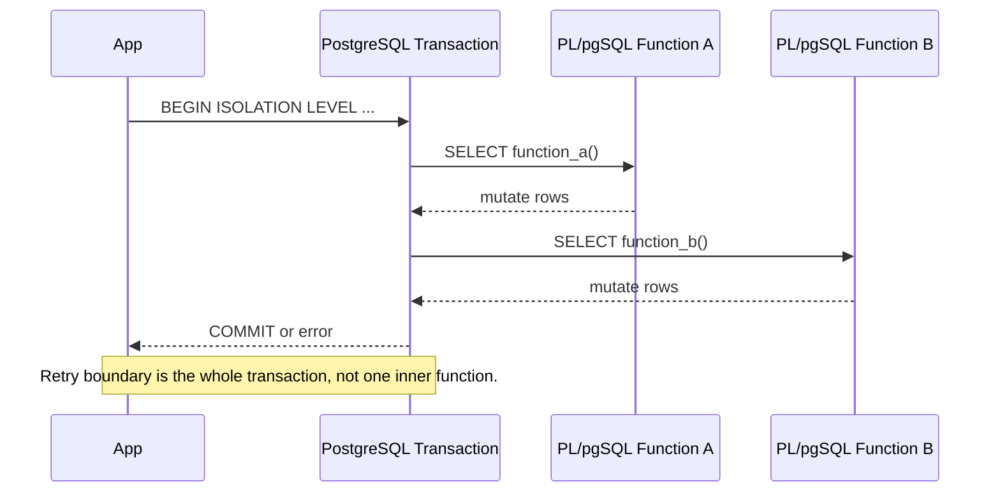

# Part 022 — Transaction Isolation, Retryability, and Consistency Patterns

Part 021 membahas lock.

Part ini membahas lapisan yang lebih fundamental:

> apa yang dilihat satu transaction ketika transaction lain sedang berjalan?

Itulah isolation.

PL/pgSQL routine tidak hidup di ruang kosong. Ia selalu berjalan di dalam transaction context caller. Semua `SELECT`, `UPDATE`, `INSERT`, `DELETE`, trigger, constraint, exception block, dan function call dipengaruhi oleh isolation level transaction tersebut.

Kesalahan umum:

> “Karena sudah pakai transaction, berarti aman.”

Tidak cukup.

Transaction memberi atomicity. Isolation menentukan apa yang bisa terjadi saat banyak transaction berjalan bersamaan.

---

## 1. Mental Model: Transaction adalah Boundary Kebenaran

Satu PL/pgSQL function biasanya bukan transaction boundary.

Aplikasi bisa melakukan:

```sql
BEGIN;
SELECT case_app.transition_case_locked(...);
SELECT case_app.create_escalation_once(...);
INSERT INTO app.outbox(...);
COMMIT;
```

Jika error terjadi, seluruh transaction rollback.

Jika serialization failure terjadi, seluruh transaction perlu diulang.

Bukan hanya statement terakhir.

Diagram:



Rule:

> Retry harus dilakukan pada boundary yang bisa mengulang seluruh unit of work secara semantik aman.

---

## 2. PostgreSQL Isolation Level dalam Praktik

PostgreSQL mendukung level isolation SQL standard, tetapi perilakunya punya detail penting.

| Level | Snapshot behavior praktis | Cocok untuk | Risiko |
|---|---|---|---|
| `READ COMMITTED` | Snapshot baru per statement | Default OLTP, mutation-with-proof, row-level operations | Multi-statement decision bisa melihat dunia berubah |
| `REPEATABLE READ` | Snapshot transaction-stable | Report/decision yang perlu view konsisten | Bisa gagal karena concurrent update; write skew tertentu perlu dipahami |
| `SERIALIZABLE` | PostgreSQL mencegah anomaly sehingga hasil setara serial order | Invariant kompleks, aggregate decision, high correctness workflow | Harus siap retry `40001` |
| `READ UNCOMMITTED` | Di PostgreSQL efektif seperti `READ COMMITTED` | Hampir tidak dipakai | Jangan mengandalkan dirty read |

Jangan memilih isolation level sebagai “tingkatan rasa aman”. Pilih berdasarkan invariant dan retry capability.

---

## 3. READ COMMITTED: Default yang Baik, Tetapi Statement-Oriented

Di `READ COMMITTED`, setiap statement melihat snapshot data committed saat statement dimulai.

Artinya dalam satu function:

```sql
SELECT status INTO v_status
FROM case_app.case_file
WHERE case_id = p_case_id;

-- transaction lain commit update di sini

SELECT status INTO v_status_again
FROM case_app.case_file
WHERE case_id = p_case_id;
```

Dua `SELECT` bisa melihat nilai berbeda.

Ini bukan bug. Ini model default.

### 3.1 Pattern Aman di READ COMMITTED

Gunakan atomic mutation:

```sql
UPDATE case_app.case_file AS cf
SET status = 'CLOSED',
    closed_at = clock_timestamp()
WHERE cf.case_id = p_case_id
  AND cf.status = 'UNDER_REVIEW';

IF NOT FOUND THEN
    RAISE EXCEPTION 'case % cannot be closed from current state', p_case_id
        USING ERRCODE = 'PZ500';
END IF;
```

Ini aman karena expected state ada di mutation predicate.

Gunakan row lock untuk multi-step decision:

```sql
SELECT * INTO STRICT v_case
FROM case_app.case_file AS cf
WHERE cf.case_id = p_case_id
FOR UPDATE;

-- all subsequent decisions use locked row state
```

READ COMMITTED cukup baik jika:

- invariant berpusat pada satu row,
- predicate mutation membawa expected state,
- constraint menjaga uniqueness/integrity,
- decision kompleks dilakukan setelah row lock,
- retry untuk deadlock masih tersedia.

---

## 4. REPEATABLE READ: Snapshot Stabil, Bukan Magic Lock

`REPEATABLE READ` memberi snapshot transaction-stable. Dua `SELECT` terhadap data yang sama akan melihat view yang konsisten sepanjang transaction.

Bagus untuk:

- report internal,
- read-heavy validation batch,
- rekonsiliasi snapshot,
- export yang butuh view konsisten.

Tetapi snapshot stabil bukan berarti semua conflict hilang.

Contoh masalah:

1. transaction A membaca row X,
2. transaction B update row X dan commit,
3. transaction A mencoba update row X berdasarkan snapshot lama,
4. PostgreSQL dapat menolak karena tidak bisa serialize access terhadap update tersebut.

PL/pgSQL routine pada isolation ini harus siap menerima error dan retry di caller.

### 4.1 Jangan Campur Snapshot Lama dengan Side Effect Eksternal

Buruk:

1. mulai `REPEATABLE READ`,
2. baca daftar pembayaran pending,
3. panggil external payment API,
4. update status,
5. commit gagal.

Jika commit gagal setelah external API sukses, database dan external system bisa diverge.

Pattern yang lebih aman:

1. pilih dan tandai work item di transaction pendek,
2. commit,
3. panggil external API,
4. simpan result dengan idempotency key,
5. reconcile via retry worker.

PL/pgSQL tidak boleh membuat external side effect menjadi bagian dari atomic database transaction kecuali ada protocol khusus.

---

## 5. SERIALIZABLE: Correctness Kuat dengan Harga Retry

`SERIALIZABLE` membuat hasil concurrent transactions setara dengan satu urutan serial tertentu.

Ini sangat berguna untuk invariant berbasis agregat:

- kapasitas per investigator,
- one escalation per breached policy,
- quota tenant,
- regulatory threshold,
- mutually exclusive workflow decisions,
- complex read-before-write decisions.

Tetapi ada konsekuensi:

> aplikasi harus siap mengulang transaction ketika PostgreSQL mendeteksi serialization anomaly.

SQLSTATE utama:

```text
40001 serialization_failure
```

Contoh PL/pgSQL routine yang boleh dipakai di serializable transaction:

```sql
CREATE OR REPLACE FUNCTION case_app.open_escalations_for_breached_cases(
    p_policy_code text,
    p_actor text
) RETURNS integer
LANGUAGE plpgsql
AS $$
DECLARE
    v_created_count integer;
BEGIN
    INSERT INTO case_app.escalation(case_id, policy_code, status, created_by, created_at)
    SELECT cf.case_id, p_policy_code, 'OPEN', p_actor, clock_timestamp()
    FROM case_app.case_file AS cf
    WHERE cf.status = 'UNDER_REVIEW'
      AND cf.sla_due_at < clock_timestamp()
      AND NOT EXISTS (
          SELECT 1
          FROM case_app.escalation AS e
          WHERE e.case_id = cf.case_id
            AND e.policy_code = p_policy_code
            AND e.status IN ('OPEN', 'ACKNOWLEDGED')
      )
    ON CONFLICT DO NOTHING;

    GET DIAGNOSTICS v_created_count = ROW_COUNT;
    RETURN v_created_count;
END;
$$;
```

Caller:

```sql
BEGIN ISOLATION LEVEL SERIALIZABLE;
SELECT case_app.open_escalations_for_breached_cases('SLA_REVIEW', 'sla-worker');
COMMIT;
```

Jika `COMMIT` gagal dengan `40001`, caller mengulang seluruh transaction.

---

## 6. Retryability: Error Mana yang Boleh Diulang?

Tidak semua error boleh di-retry.

| SQLSTATE | Nama | Retry? | Catatan |
|---|---|---|---|
| `40001` | `serialization_failure` | Ya | Retry seluruh transaction |
| `40P01` | `deadlock_detected` | Biasanya ya | Retry setelah jitter; perbaiki lock ordering jika sering |
| `55P03` | `lock_not_available` | Tergantung | Jika memakai `NOWAIT` atau timeout sebagai backpressure |
| `57014` | `query_canceled` | Tergantung | Bisa timeout; jangan retry buta tanpa memahami durasi |
| `23505` | `unique_violation` | Biasanya tidak | Sering domain conflict; bisa idempotency success jika sesuai desain |
| `23503` | `foreign_key_violation` | Tidak | Biasanya bug/order operasi/domain invalid |
| `PZxxx` custom | Domain error | Sesuai registry | Jangan retry jika error bisnis permanen |

Rule:

> Retry hanya aman jika unit of work idempotent atau seluruh efeknya berada di transaction yang rollback.

---

## 7. Kenapa Retry Tidak Boleh di Dalam Function Biasa

Function PL/pgSQL biasa tidak bisa `COMMIT` dan memulai transaction baru.

Jika function menangkap `serialization_failure`, lalu mencoba mengulang sebagian logic di dalam transaction yang sama, itu biasanya salah.

Buruk:

```sql
CREATE OR REPLACE FUNCTION app.do_work_bad()
RETURNS void
LANGUAGE plpgsql
AS $$
BEGIN
    -- work
EXCEPTION
    WHEN serialization_failure THEN
        -- retry inner work here? usually wrong
        -- transaction is already in failed/unsafe semantic boundary
        NULL;
END;
$$;
```

Masalah:

- serialization failure berarti keseluruhan transaction schedule bermasalah,
- caller mungkin sudah menjalankan statement lain sebelum function,
- retry sebagian bisa menggandakan side effect internal,
- `COMMIT` failure terjadi setelah function selesai, sehingga function tidak bisa menangkapnya.

Correct pattern:

```text
application retry loop:
  begin transaction
  call one or more PL/pgSQL routines
  commit
  if SQLSTATE in retryable set:
      rollback if needed
      sleep with jitter
      retry whole unit of work
```

Pseudo-code application:

```java
for (int attempt = 1; attempt <= maxAttempts; attempt++) {
    try (Connection c = dataSource.getConnection()) {
        c.setAutoCommit(false);
        c.setTransactionIsolation(Connection.TRANSACTION_SERIALIZABLE);

        callPlpgsqlRoutine(c, command);

        c.commit();
        return;
    } catch (SQLException e) {
        if (!isRetryable(e) || attempt == maxAttempts) {
            throw e;
        }
        sleepWithJitter(attempt);
    }
}
```

---

## 8. Procedure dan Transaction Control

PostgreSQL procedure dapat melakukan transaction control dalam kondisi tertentu ketika dipanggil melalui `CALL` pada boundary yang valid.

Tetapi jangan menyimpulkan bahwa semua retry bisa dipindahkan ke procedure.

Procedure cocok untuk:

- maintenance batch,
- chunked cleanup,
- controlled migration helper,
- internal job yang bisa commit per chunk,
- administrative workflow.

Procedure kurang cocok untuk:

- API request atomic multi-step business command,
- transaction yang harus dikontrol application service,
- logic yang perlu digabung dengan operasi lain di transaction caller,
- retry yang perlu memahami idempotency command dari application layer.

Contoh chunked procedure:

```sql
CREATE OR REPLACE PROCEDURE maintenance.close_expired_case_batches(
    p_batch_size integer
)
LANGUAGE plpgsql
AS $$
DECLARE
    v_closed_count integer;
BEGIN
    LOOP
        WITH candidate AS (
            SELECT cf.case_id
            FROM case_app.case_file AS cf
            WHERE cf.status = 'UNDER_REVIEW'
              AND cf.review_due_at < clock_timestamp()
            ORDER BY cf.review_due_at, cf.case_id
            FOR UPDATE SKIP LOCKED
            LIMIT p_batch_size
        )
        UPDATE case_app.case_file AS cf
        SET status = 'EXPIRED',
            updated_at = clock_timestamp(),
            updated_by = 'maintenance.close_expired_case_batches'
        FROM candidate AS c
        WHERE cf.case_id = c.case_id;

        GET DIAGNOSTICS v_closed_count = ROW_COUNT;

        COMMIT;

        EXIT WHEN v_closed_count = 0;
    END LOOP;
END;
$$;
```

Catatan desain:

- commit per batch membatasi lock duration,
- `SKIP LOCKED` memungkinkan parallel worker,
- routine harus idempotent karena batch bisa berhenti di tengah,
- observability harus mencatat progress.

---

## 9. Exception Blocks dan Subtransaction Cost

PL/pgSQL `EXCEPTION` block berguna untuk menerjemahkan error.

Tetapi jangan menaruh exception block di hot loop tanpa alasan.

Contoh kurang baik:

```sql
FOR v_row IN SELECT * FROM staging.import_row LOOP
    BEGIN
        INSERT INTO target_table(...)
        VALUES (...);
    EXCEPTION
        WHEN unique_violation THEN
            -- handle per row
            NULL;
    END;
END LOOP;
```

Ini sering mahal dan sulit diobservasi.

Alternatif set-based:

```sql
INSERT INTO target_table(key, value)
SELECT s.key, s.value
FROM staging.import_row AS s
ON CONFLICT (key) DO UPDATE
SET value = EXCLUDED.value;
```

Gunakan exception block untuk:

- domain error translation,
- bounded fallback,
- logging diagnostic sebelum re-raise,
- isolasi operasi kecil yang memang bisa gagal secara expected.

Jangan gunakan exception sebagai control flow utama untuk batch besar.

---

## 10. Consistency Patterns

### 10.1 Read-Modify-Write Satu Row

Gunakan `UPDATE ... WHERE ... RETURNING`.

```sql
CREATE OR REPLACE FUNCTION account.debit(
    p_account_id bigint,
    p_amount numeric
) RETURNS numeric
LANGUAGE plpgsql
AS $$
DECLARE
    v_new_balance numeric;
BEGIN
    UPDATE account.account AS a
    SET balance = a.balance - p_amount
    WHERE a.account_id = p_account_id
      AND a.balance >= p_amount
    RETURNING a.balance INTO v_new_balance;

    IF NOT FOUND THEN
        RAISE EXCEPTION 'insufficient balance or account not found'
            USING ERRCODE = 'PZ510';
    END IF;

    RETURN v_new_balance;
END;
$$;
```

Tidak perlu `SELECT balance` dulu.

### 10.2 Multi-Step Aggregate Root Change

Gunakan `FOR UPDATE` pada root row.

```sql
SELECT * INTO STRICT v_order
FROM sales.order_header
WHERE order_id = p_order_id
FOR UPDATE;

-- validate lines, totals, state transition
-- write history and header
```

### 10.3 Cross-Row Aggregate Invariant

Pilihan:

1. lock counter row,
2. serializable + retry,
3. materialized aggregate with constraint,
4. advisory lock resource.

Jangan mengandalkan `SELECT count(*)` di `READ COMMITTED` tanpa lock/constraint/retry.

### 10.4 Idempotent Command

Simpan command key.

```sql
CREATE TABLE app.command_execution (
    command_key text PRIMARY KEY,
    command_type text NOT NULL,
    result jsonb,
    status text NOT NULL,
    created_at timestamptz NOT NULL DEFAULT clock_timestamp(),
    completed_at timestamptz
);
```

Masukkan command execution sebelum melakukan mutation.

```sql
INSERT INTO app.command_execution(command_key, command_type, status)
VALUES (p_command_key, 'close_case', 'RUNNING')
ON CONFLICT (command_key) DO NOTHING;

IF NOT FOUND THEN
    SELECT result
    INTO v_existing_result
    FROM app.command_execution
    WHERE command_key = p_command_key
      AND status = 'COMPLETED';

    IF v_existing_result IS NOT NULL THEN
        RETURN v_existing_result;
    END IF;

    RAISE EXCEPTION 'command % is already running or incomplete', p_command_key
        USING ERRCODE = 'PZ520';
END IF;
```

Part 023 akan membahas idempotency lebih dalam.

### 10.5 Outbox untuk Side Effect

Jangan kirim external side effect langsung dari transaction yang mungkin retry.

Simpan outbox event:

```sql
INSERT INTO app.outbox_event(
    event_type,
    aggregate_type,
    aggregate_id,
    payload,
    created_at
) VALUES (
    'case.closed',
    'case_file',
    p_case_id::text,
    jsonb_build_object('case_id', p_case_id, 'closed_by', p_actor),
    clock_timestamp()
);
```

Dispatcher terpisah mengirim event setelah commit.

---

## 11. PL/pgSQL Error Translation dengan Retry Awareness

Jangan ubah retryable database error menjadi domain error permanen tanpa alasan.

Buruk:

```sql
EXCEPTION
    WHEN OTHERS THEN
        RAISE EXCEPTION 'case operation failed';
```

Ini menghapus SQLSTATE penting seperti `40001` dan `40P01`.

Lebih baik:

```sql
EXCEPTION
    WHEN serialization_failure OR deadlock_detected THEN
        RAISE;
    WHEN unique_violation THEN
        RAISE EXCEPTION 'duplicate active case policy'
            USING ERRCODE = 'PZ530';
    WHEN OTHERS THEN
        RAISE;
END;
```

Jika perlu logging:

```sql
EXCEPTION
    WHEN OTHERS THEN
        GET STACKED DIAGNOSTICS
            v_sqlstate = RETURNED_SQLSTATE,
            v_message = MESSAGE_TEXT,
            v_detail = PG_EXCEPTION_DETAIL,
            v_hint = PG_EXCEPTION_HINT,
            v_context = PG_EXCEPTION_CONTEXT;

        INSERT INTO platform.plpgsql_error_log(
            routine_name,
            sqlstate,
            message,
            detail,
            hint,
            context,
            created_at
        ) VALUES (
            'case_app.some_routine',
            v_sqlstate,
            v_message,
            v_detail,
            v_hint,
            v_context,
            clock_timestamp()
        );

        RAISE;
END;
```

Tetap `RAISE`, jangan menelan error.

---

## 12. Retry Loop Design

Retry policy harus bounded.

Parameter minimal:

| Parameter | Rekomendasi |
|---|---|
| Max attempts | 3–5 untuk OLTP umum |
| Backoff | exponential ringan |
| Jitter | wajib untuk menghindari retry storm |
| Retryable SQLSTATE | allow-list, bukan deny-list |
| Idempotency key | wajib untuk command yang bisa dikirim ulang oleh client |
| Observability | log attempt, SQLSTATE, command key, correlation id |

Pseudo-code:

```text
attempt = 1
while attempt <= max:
  try:
    begin tx
    run command
    commit
    return success
  catch sqlstate in [40001, 40P01, conditional 55P03]:
    rollback
    sleep(backoff(attempt) + jitter)
    attempt++
  catch:
    rollback
    raise
raise retry_exhausted
```

Jangan retry tanpa batas.

Retry storm bisa memperburuk contention.

---

## 13. Isolation Choice Matrix

| Scenario | Recommended model |
|---|---|
| Simple state transition satu row | `READ COMMITTED` + `UPDATE ... WHERE expected_state` |
| Complex transition satu aggregate root | `READ COMMITTED` + `SELECT ... FOR UPDATE` |
| Queue worker | `READ COMMITTED` + `FOR UPDATE SKIP LOCKED` |
| Capacity/quota per logical owner | Counter row lock atau advisory lock; bisa serializable |
| Complex read set menentukan write set | `SERIALIZABLE` + retry |
| Long read-only export | `REPEATABLE READ READ ONLY` jika butuh snapshot konsisten |
| Regulatory decision yang harus defensible | Prefer explicit locked root + audit; serializable untuk aggregate invariants |
| External side effect | Database transaction + outbox; side effect after commit |
| Batch maintenance | Procedure commit per chunk atau application-controlled chunks |

---

## 14. Worked Example: Case Closure with Retry-Safe Boundary

### 14.1 Tables

```sql
CREATE TABLE case_app.case_file (
    case_id bigint PRIMARY KEY,
    status text NOT NULL,
    closed_at timestamptz,
    closed_by text,
    updated_at timestamptz NOT NULL DEFAULT clock_timestamp()
);

CREATE TABLE case_app.case_status_history (
    history_id bigserial PRIMARY KEY,
    case_id bigint NOT NULL REFERENCES case_app.case_file(case_id),
    from_status text NOT NULL,
    to_status text NOT NULL,
    reason_code text NOT NULL,
    changed_by text NOT NULL,
    changed_at timestamptz NOT NULL
);

CREATE TABLE app.outbox_event (
    outbox_id bigserial PRIMARY KEY,
    event_type text NOT NULL,
    aggregate_type text NOT NULL,
    aggregate_id text NOT NULL,
    payload jsonb NOT NULL,
    created_at timestamptz NOT NULL,
    published_at timestamptz
);
```

### 14.2 Function

```sql
CREATE OR REPLACE FUNCTION case_app.close_case(
    p_case_id bigint,
    p_reason_code text,
    p_actor text
) RETURNS void
LANGUAGE plpgsql
AS $$
DECLARE
    v_case case_app.case_file%ROWTYPE;
BEGIN
    SELECT *
    INTO STRICT v_case
    FROM case_app.case_file AS cf
    WHERE cf.case_id = p_case_id
    FOR UPDATE;

    IF v_case.status = 'CLOSED' THEN
        RETURN;
    END IF;

    IF v_case.status NOT IN ('UNDER_REVIEW', 'ESCALATED') THEN
        RAISE EXCEPTION 'case % cannot be closed from status %', p_case_id, v_case.status
            USING ERRCODE = 'PZ540';
    END IF;

    UPDATE case_app.case_file AS cf
    SET status = 'CLOSED',
        closed_at = clock_timestamp(),
        closed_by = p_actor,
        updated_at = clock_timestamp()
    WHERE cf.case_id = p_case_id;

    INSERT INTO case_app.case_status_history(
        case_id,
        from_status,
        to_status,
        reason_code,
        changed_by,
        changed_at
    ) VALUES (
        p_case_id,
        v_case.status,
        'CLOSED',
        p_reason_code,
        p_actor,
        clock_timestamp()
    );

    INSERT INTO app.outbox_event(
        event_type,
        aggregate_type,
        aggregate_id,
        payload,
        created_at
    ) VALUES (
        'case.closed',
        'case_file',
        p_case_id::text,
        jsonb_build_object(
            'case_id', p_case_id,
            'from_status', v_case.status,
            'to_status', 'CLOSED',
            'reason_code', p_reason_code,
            'actor', p_actor
        ),
        clock_timestamp()
    );
END;
$$;
```

### 14.3 Application Boundary

```sql
BEGIN ISOLATION LEVEL READ COMMITTED;
SELECT case_app.close_case(:case_id, :reason_code, :actor);
COMMIT;
```

Retry needed for:

- `40P01` deadlock,
- conditional lock timeout if configured,
- possibly connection failure where commit outcome unknown; idempotency key pattern handles this better.

If closing case is triggered by user command, add command idempotency key. Part 023 will expand this.

---

## 15. Testing Isolation Behavior

Test isolation with two real connections.

### 15.1 READ COMMITTED snapshot changes

Session A:

```sql
BEGIN ISOLATION LEVEL READ COMMITTED;
SELECT status FROM case_app.case_file WHERE case_id = 42;
```

Session B:

```sql
UPDATE case_app.case_file
SET status = 'ESCALATED'
WHERE case_id = 42;
COMMIT;
```

Session A:

```sql
SELECT status FROM case_app.case_file WHERE case_id = 42;
COMMIT;
```

A can see new committed status on second statement.

### 15.2 Serialization retry test

Run two transactions that both make aggregate decisions under `SERIALIZABLE`.

Expected outcome:

- one or both may fail with `40001`,
- retry eventually succeeds or domain limit is reached,
- final invariant holds.

The test should assert invariant, not exact failure order.

---

## 16. Common Anti-Patterns

### 16.1 Retrying Only the Failed Statement

Wrong mental model:

> `UPDATE` failed, so retry only `UPDATE`.

Correct:

> Transaction schedule failed, retry the whole unit of work.

### 16.2 Catch-All Exception That Destroys SQLSTATE

Bad:

```sql
WHEN OTHERS THEN
    RAISE EXCEPTION 'failed';
```

This hides retryable state.

### 16.3 External Side Effect Before Commit

Bad:

```text
BEGIN
  update payment pending
  call external gateway
  update payment success
COMMIT fails
```

Use outbox, idempotency key, and reconciliation.

### 16.4 Long Transaction with User Think Time

Bad:

```text
BEGIN
  lock case
  show UI confirmation
  user waits 2 minutes
  commit
```

Do not hold database transaction across user think time.

### 16.5 Assuming Serializable Means No Retry

Serializable gives stronger correctness by aborting unsafe schedules.

Abort is part of the contract.

---

## 17. Review Checklist

- [ ] What isolation level does caller use?
- [ ] Does the function assume a stable snapshot?
- [ ] Does the function make multi-statement decisions under `READ COMMITTED`?
- [ ] Are expected states included in mutation predicates?
- [ ] Are row locks acquired before complex decisions?
- [ ] Are aggregate invariants protected by constraint, lock, or serializable retry?
- [ ] Are retryable SQLSTATEs preserved?
- [ ] Is retry performed at whole transaction boundary?
- [ ] Are external side effects moved to outbox or idempotent workflow?
- [ ] Are `EXCEPTION` blocks narrow and intentional?
- [ ] Is there a maximum retry count with jitter?
- [ ] Are final invariants tested under concurrent execution?
- [ ] Is procedure transaction control used only where boundary is clear?
- [ ] Are long transactions avoided?

---

## 18. Summary

Isolation is not an implementation detail.

It is part of your correctness model.

The production-grade approach:

1. use `READ COMMITTED` when statement-level atomicity and row locks are enough,
2. use `REPEATABLE READ` for consistent read snapshots, not as a universal lock,
3. use `SERIALIZABLE` for complex invariants when caller can retry,
4. preserve retryable SQLSTATEs,
5. retry whole transactions, not fragments,
6. avoid external side effects inside retryable transactions,
7. design PL/pgSQL routines to be idempotent or transactionally contained.

Most PL/pgSQL concurrency bugs are not fixed by “more isolation”.

They are fixed by aligning:

- invariant,
- isolation level,
- lock strategy,
- constraint strategy,
- retry boundary,
- side-effect boundary.

Part berikutnya masuk ke idempotency, deduplication, dan exactly-once-ish database workflows.

---

## References

- PostgreSQL Documentation — Transaction Isolation
- PostgreSQL Documentation — Concurrency Control
- PostgreSQL Documentation — Explicit Locking
- PostgreSQL Documentation — PL/pgSQL Transaction Management
- PostgreSQL Documentation — PL/pgSQL Errors and Messages
- PostgreSQL Documentation — `CREATE PROCEDURE` and `CALL`
