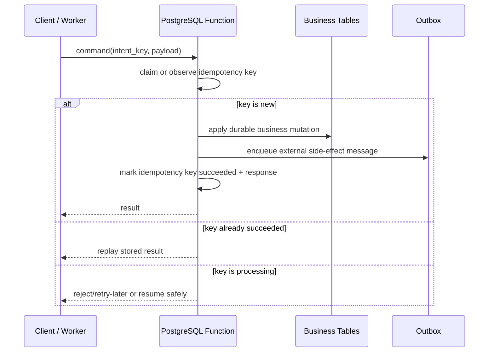
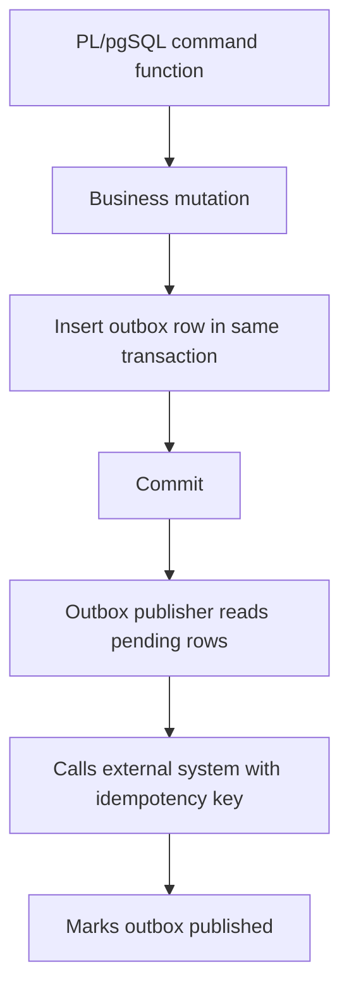

# Part 023 — Idempotency, Deduplication, and Exactly-Once-ish Database Workflows

Idempotency is not a decorator you add after a system is unreliable.

It is a **contract**:

> Given the same logical intent, the system must produce at most one durable effect, and every retry must either observe that effect or safely continue it.

In a production PostgreSQL system, PL/pgSQL is powerful for this because it can place the idempotency decision, business mutation, audit write, and outbox write inside one database transaction.

But there is a trap: people often say “exactly once” when what they really have is “probably once unless the network, worker, queue, process, or caller retries at the wrong time”. In a distributed system, PostgreSQL can give you strong guarantees **inside its transactional boundary**. Outside that boundary, you need explicit deduplication and replay design.

So the practical target is:

> **Exactly-once-ish**: exactly one durable database state transition per logical intent, plus retry-safe external side-effect coordination.

That “ish” is not weakness. It is engineering honesty.

---

## 1. What This Part Is Solving

You will use the patterns in this part when you have operations like:

- create order;
- submit payment authorization;
- register incoming webhook;
- consume Kafka/RabbitMQ message;
- execute regulatory case transition;
- generate an invoice once;
- send escalation notification once;
- apply a migration helper repeatedly;
- retry a failed API request without duplicate business effects.

The concrete failure modes are familiar:

| Failure | Bad Outcome |
|---|---|
| Client times out after successful commit | Client retries and creates duplicate order |
| Worker crashes after database update but before acking message | Message redelivered and mutation is applied twice |
| External API call succeeds but database transaction rolls back | System loses proof of external effect |
| Two concurrent requests use the same intent | Race creates duplicate row |
| Retry uses same key but different payload | Silent semantic corruption |
| Old idempotency key is purged too early | Duplicate effect after retention window |
| Dedupe table is checked with `SELECT` before `INSERT` | Race condition under concurrency |

The production-grade solution is built from several PostgreSQL primitives:

- **unique constraints** for one-winner semantics;
- **`INSERT ... ON CONFLICT`** for atomic insert-or-observe behavior;
- **row locks** for serializing mutation against a specific logical resource;
- **transactional outbox** for external side effects;
- **SQLSTATE-aware retry policy** for serialization failures and deadlocks;
- **PL/pgSQL functions/procedures** for placing these pieces behind a stable contract.

---

## 2. Mental Model: Attempt, Intent, Effect, Acknowledgement

Most duplicate bugs happen because engineers confuse four different things.

| Concept | Meaning | Example |
|---|---|---|
| Attempt | One execution try | HTTP request attempt, worker attempt |
| Intent | Logical command the user/system wants | “create order checkout-123” |
| Effect | Durable mutation or external side effect | row inserted, payment charged |
| Acknowledgement | Caller/queue knows result | HTTP 200, message ack |

A retry repeats the **attempt**.

It must not repeat the **effect**.

The idempotency key names the **intent**, not the attempt.



The correct question is not:

> “Did this function run before?”

The correct question is:

> “Has this logical intent already produced a committed effect, and if yes, what result should the caller observe?”

---

## 3. Idempotency Is a Contract, Not a Cache

A weak idempotency table stores only this:

```sql
CREATE TABLE app.idempotency_keys (
    key text PRIMARY KEY
);
```

That is usually not enough.

A production idempotency record must answer:

1. What is the **scope** of the key?
2. What payload was associated with the key?
3. Is the command still processing, succeeded, failed, or abandoned?
4. What stable result should be replayed?
5. When can the key expire?
6. Which transaction/worker claimed it?
7. How do we detect key reuse with different intent?

A better contract looks like this:

```sql
CREATE SCHEMA IF NOT EXISTS app;

CREATE TYPE app.idempotency_status AS ENUM (
    'processing',
    'succeeded',
    'failed_retryable',
    'failed_final'
);

CREATE TABLE app.idempotency_request (
    idempotency_scope text NOT NULL,
    idempotency_key text NOT NULL,
    request_hash text NOT NULL,
    status app.idempotency_status NOT NULL,
    result_ref_type text,
    result_ref_id uuid,
    response_body jsonb,
    failure_code text,
    failure_message text,
    claimed_by text,
    claimed_at timestamptz NOT NULL DEFAULT clock_timestamp(),
    locked_until timestamptz,
    attempt_count integer NOT NULL DEFAULT 1,
    created_at timestamptz NOT NULL DEFAULT clock_timestamp(),
    updated_at timestamptz NOT NULL DEFAULT clock_timestamp(),
    expires_at timestamptz NOT NULL,
    PRIMARY KEY (idempotency_scope, idempotency_key),
    CHECK (idempotency_scope <> ''),
    CHECK (idempotency_key <> ''),
    CHECK (request_hash <> ''),
    CHECK (attempt_count >= 1),
    CHECK (expires_at > created_at)
);
```

Why primary key on `(scope, key)`?

Because the same raw key may be valid in different domains:

- `payment_authorization / abc`;
- `order_submission / abc`;
- `case_transition / abc`.

The scope prevents accidental global coupling.

---

## 4. Request Hash: The Guard Against Semantic Key Reuse

An idempotency key alone is not enough.

A caller can accidentally reuse the same key for a different payload:

```txt
key = X, payload = create order A
key = X, payload = create order B
```

If your function simply returns the first result, the second caller gets a lie.

So every idempotency record should store a request hash.

In PostgreSQL, you can calculate it from canonical payload text. In production, it is often safer for the application boundary to canonicalize the request and pass the hash explicitly. But you can still enforce the comparison in PL/pgSQL.

```sql
CREATE OR REPLACE FUNCTION app.assert_same_idempotent_request(
    p_existing_hash text,
    p_incoming_hash text
)
RETURNS void
LANGUAGE plpgsql
AS $$
BEGIN
    IF p_existing_hash IS DISTINCT FROM p_incoming_hash THEN
        RAISE EXCEPTION
            USING
                ERRCODE = 'P4002',
                MESSAGE = 'idempotency key reused with a different request payload',
                DETAIL = format(
                    'existing_hash=%s incoming_hash=%s',
                    p_existing_hash,
                    p_incoming_hash
                ),
                HINT = 'Reuse an idempotency key only for the same logical command.';
    END IF;
END;
$$;
```

Use a custom SQLSTATE class such as `Pxxxx` carefully and document it. Client code should branch on SQLSTATE, not message text.

---

## 5. The Atomic Claim Pattern

The unsafe pattern is:

```sql
SELECT 1
FROM app.idempotency_request
WHERE idempotency_scope = p_scope
  AND idempotency_key = p_key;

-- if no row, insert business effect
```

This has a race window.

The safe pattern is:

```sql
INSERT INTO app.idempotency_request (...)
VALUES (...)
ON CONFLICT (idempotency_scope, idempotency_key)
DO NOTHING;
```

Then lock and inspect the row.

```sql
SELECT *
INTO v_idem
FROM app.idempotency_request ir
WHERE ir.idempotency_scope = p_scope
  AND ir.idempotency_key = p_key
FOR UPDATE;
```

Why lock after insert-or-observe?

Because you want one transaction at a time to decide whether a key is:

- newly claimed;
- already succeeded;
- still processing;
- stale and recoverable;
- failed and retryable;
- failed permanently.

The primary key determines who wins creation. The row lock serializes subsequent state inspection and update.

---

## 6. A Reusable Idempotency Claim Function

This function does not perform business mutation yet. It classifies the idempotency key.

```sql
CREATE TYPE app.idempotency_claim_kind AS ENUM (
    'new_claim',
    'replay_success',
    'processing_active',
    'processing_stale',
    'retryable_failure',
    'final_failure'
);

CREATE TYPE app.idempotency_claim AS (
    claim_kind app.idempotency_claim_kind,
    response_body jsonb,
    result_ref_type text,
    result_ref_id uuid,
    attempt_count integer
);

CREATE OR REPLACE FUNCTION app.claim_idempotency_key(
    p_scope text,
    p_key text,
    p_request_hash text,
    p_claimed_by text,
    p_lock_seconds integer DEFAULT 300,
    p_retention interval DEFAULT interval '24 hours'
)
RETURNS app.idempotency_claim
LANGUAGE plpgsql
AS $$
DECLARE
    v_inserted_count integer := 0;
    v_row app.idempotency_request%ROWTYPE;
    v_now timestamptz := clock_timestamp();
BEGIN
    IF p_scope IS NULL OR btrim(p_scope) = '' THEN
        RAISE EXCEPTION USING ERRCODE = 'P4000', MESSAGE = 'idempotency scope is required';
    END IF;

    IF p_key IS NULL OR btrim(p_key) = '' THEN
        RAISE EXCEPTION USING ERRCODE = 'P4001', MESSAGE = 'idempotency key is required';
    END IF;

    IF p_request_hash IS NULL OR btrim(p_request_hash) = '' THEN
        RAISE EXCEPTION USING ERRCODE = 'P4003', MESSAGE = 'request hash is required';
    END IF;

    INSERT INTO app.idempotency_request (
        idempotency_scope,
        idempotency_key,
        request_hash,
        status,
        claimed_by,
        locked_until,
        expires_at
    )
    VALUES (
        p_scope,
        p_key,
        p_request_hash,
        'processing',
        p_claimed_by,
        v_now + make_interval(secs => p_lock_seconds),
        v_now + p_retention
    )
    ON CONFLICT (idempotency_scope, idempotency_key)
    DO NOTHING;

    GET DIAGNOSTICS v_inserted_count = ROW_COUNT;

    SELECT *
    INTO STRICT v_row
    FROM app.idempotency_request ir
    WHERE ir.idempotency_scope = p_scope
      AND ir.idempotency_key = p_key
    FOR UPDATE;

    PERFORM app.assert_same_idempotent_request(v_row.request_hash, p_request_hash);

    IF v_inserted_count = 1 THEN
        RETURN ('new_claim', NULL, NULL, NULL, v_row.attempt_count)::app.idempotency_claim;
    END IF;

    IF v_row.status = 'succeeded' THEN
        RETURN (
            'replay_success',
            v_row.response_body,
            v_row.result_ref_type,
            v_row.result_ref_id,
            v_row.attempt_count
        )::app.idempotency_claim;
    END IF;

    IF v_row.status = 'failed_final' THEN
        RETURN (
            'final_failure',
            jsonb_build_object(
                'failureCode', v_row.failure_code,
                'failureMessage', v_row.failure_message
            ),
            v_row.result_ref_type,
            v_row.result_ref_id,
            v_row.attempt_count
        )::app.idempotency_claim;
    END IF;

    IF v_row.status = 'failed_retryable' THEN
        UPDATE app.idempotency_request ir
        SET
            status = 'processing',
            attempt_count = ir.attempt_count + 1,
            claimed_by = p_claimed_by,
            claimed_at = v_now,
            locked_until = v_now + make_interval(secs => p_lock_seconds),
            updated_at = v_now
        WHERE ir.idempotency_scope = p_scope
          AND ir.idempotency_key = p_key;

        RETURN (
            'retryable_failure',
            NULL,
            v_row.result_ref_type,
            v_row.result_ref_id,
            v_row.attempt_count + 1
        )::app.idempotency_claim;
    END IF;

    IF v_row.status = 'processing' AND v_row.locked_until > v_now THEN
        RETURN ('processing_active', NULL, NULL, NULL, v_row.attempt_count)::app.idempotency_claim;
    END IF;

    IF v_row.status = 'processing' AND v_row.locked_until <= v_now THEN
        UPDATE app.idempotency_request ir
        SET
            attempt_count = ir.attempt_count + 1,
            claimed_by = p_claimed_by,
            claimed_at = v_now,
            locked_until = v_now + make_interval(secs => p_lock_seconds),
            updated_at = v_now
        WHERE ir.idempotency_scope = p_scope
          AND ir.idempotency_key = p_key;

        RETURN ('processing_stale', NULL, NULL, NULL, v_row.attempt_count + 1)::app.idempotency_claim;
    END IF;

    RAISE EXCEPTION
        USING
            ERRCODE = 'P4099',
            MESSAGE = 'unsupported idempotency state',
            DETAIL = format('status=%s scope=%s key=%s', v_row.status, p_scope, p_key);
END;
$$;
```

Important detail: `GET DIAGNOSTICS ... ROW_COUNT` returns a count. Use that count directly. Do not turn it into an implicit truthy/falsey convention. PL/pgSQL is clearer when the code says exactly what it proves: one inserted row means this transaction created the claim.

---

## 7. Completion and Failure Marking

After the business mutation succeeds, store the stable replay response.

```sql
CREATE OR REPLACE FUNCTION app.mark_idempotency_succeeded(
    p_scope text,
    p_key text,
    p_result_ref_type text,
    p_result_ref_id uuid,
    p_response_body jsonb
)
RETURNS void
LANGUAGE plpgsql
AS $$
DECLARE
    v_rows integer;
BEGIN
    UPDATE app.idempotency_request ir
    SET
        status = 'succeeded',
        result_ref_type = p_result_ref_type,
        result_ref_id = p_result_ref_id,
        response_body = p_response_body,
        failure_code = NULL,
        failure_message = NULL,
        locked_until = NULL,
        updated_at = clock_timestamp()
    WHERE ir.idempotency_scope = p_scope
      AND ir.idempotency_key = p_key
      AND ir.status = 'processing';

    GET DIAGNOSTICS v_rows = ROW_COUNT;

    IF v_rows <> 1 THEN
        RAISE EXCEPTION
            USING
                ERRCODE = 'P4010',
                MESSAGE = 'failed to mark idempotency key as succeeded',
                DETAIL = format('scope=%s key=%s row_count=%s', p_scope, p_key, v_rows);
    END IF;
END;
$$;
```

For failures, decide whether retry is allowed.

```sql
CREATE OR REPLACE FUNCTION app.mark_idempotency_failed(
    p_scope text,
    p_key text,
    p_retryable boolean,
    p_failure_code text,
    p_failure_message text
)
RETURNS void
LANGUAGE plpgsql
AS $$
BEGIN
    UPDATE app.idempotency_request ir
    SET
        status = CASE WHEN p_retryable THEN 'failed_retryable' ELSE 'failed_final' END::app.idempotency_status,
        failure_code = p_failure_code,
        failure_message = p_failure_message,
        locked_until = NULL,
        updated_at = clock_timestamp()
    WHERE ir.idempotency_scope = p_scope
      AND ir.idempotency_key = p_key
      AND ir.status = 'processing';

    IF NOT FOUND THEN
        RAISE EXCEPTION
            USING
                ERRCODE = 'P4011',
                MESSAGE = 'failed to mark idempotency key as failed',
                DETAIL = format('scope=%s key=%s', p_scope, p_key);
    END IF;
END;
$$;
```

Do not mark every exception as `failed_final`.

A serialization failure or deadlock may be safe to retry. A validation failure is usually final. An external dependency timeout is ambiguous unless you have a separate external idempotency key.

---

## 8. End-to-End Example: Create Order Once

### 8.1 Tables

```sql
CREATE TABLE app.customer_order (
    order_id uuid PRIMARY KEY DEFAULT gen_random_uuid(),
    customer_id uuid NOT NULL,
    external_cart_id text NOT NULL,
    status text NOT NULL DEFAULT 'created',
    total_amount numeric(18, 2) NOT NULL,
    created_at timestamptz NOT NULL DEFAULT clock_timestamp(),
    CHECK (total_amount >= 0),
    UNIQUE (customer_id, external_cart_id)
);

CREATE TABLE app.outbox_event (
    outbox_id uuid PRIMARY KEY DEFAULT gen_random_uuid(),
    event_type text NOT NULL,
    aggregate_type text NOT NULL,
    aggregate_id uuid NOT NULL,
    idempotency_scope text NOT NULL,
    idempotency_key text NOT NULL,
    payload jsonb NOT NULL,
    status text NOT NULL DEFAULT 'pending',
    attempt_count integer NOT NULL DEFAULT 0,
    created_at timestamptz NOT NULL DEFAULT clock_timestamp(),
    published_at timestamptz,
    UNIQUE (idempotency_scope, idempotency_key, event_type)
);
```

The order table has a natural uniqueness rule: one order per customer/cart.

The idempotency table has a command uniqueness rule: one command result per scope/key.

The outbox has an external-message uniqueness rule: one message of a given type per command.

These are different invariants. Do not collapse them casually.

### 8.2 Function

```sql
CREATE OR REPLACE FUNCTION app.create_order_once(
    p_idempotency_key text,
    p_request_hash text,
    p_customer_id uuid,
    p_external_cart_id text,
    p_total_amount numeric
)
RETURNS jsonb
LANGUAGE plpgsql
AS $$
DECLARE
    v_claim app.idempotency_claim;
    v_order app.customer_order%ROWTYPE;
    v_response jsonb;
BEGIN
    v_claim := app.claim_idempotency_key(
        p_scope => 'create_order',
        p_key => p_idempotency_key,
        p_request_hash => p_request_hash,
        p_claimed_by => current_user,
        p_lock_seconds => 300,
        p_retention => interval '7 days'
    );

    IF v_claim.claim_kind = 'replay_success' THEN
        RETURN v_claim.response_body;
    END IF;

    IF v_claim.claim_kind = 'processing_active' THEN
        RAISE EXCEPTION
            USING
                ERRCODE = 'P4029',
                MESSAGE = 'idempotent command is already processing',
                HINT = 'Retry after a short delay.';
    END IF;

    IF v_claim.claim_kind = 'final_failure' THEN
        RAISE EXCEPTION
            USING
                ERRCODE = 'P4030',
                MESSAGE = 'idempotent command previously failed permanently',
                DETAIL = v_claim.response_body::text;
    END IF;

    INSERT INTO app.customer_order (
        customer_id,
        external_cart_id,
        total_amount
    )
    VALUES (
        p_customer_id,
        p_external_cart_id,
        p_total_amount
    )
    ON CONFLICT (customer_id, external_cart_id)
    DO UPDATE
    SET customer_id = EXCLUDED.customer_id
    RETURNING *
    INTO v_order;

    v_response := jsonb_build_object(
        'orderId', v_order.order_id,
        'status', v_order.status,
        'totalAmount', v_order.total_amount
    );

    INSERT INTO app.outbox_event (
        event_type,
        aggregate_type,
        aggregate_id,
        idempotency_scope,
        idempotency_key,
        payload
    )
    VALUES (
        'order.created',
        'customer_order',
        v_order.order_id,
        'create_order',
        p_idempotency_key,
        jsonb_build_object(
            'orderId', v_order.order_id,
            'customerId', p_customer_id,
            'externalCartId', p_external_cart_id,
            'totalAmount', p_total_amount
        )
    )
    ON CONFLICT (idempotency_scope, idempotency_key, event_type)
    DO NOTHING;

    PERFORM app.mark_idempotency_succeeded(
        p_scope => 'create_order',
        p_key => p_idempotency_key,
        p_result_ref_type => 'customer_order',
        p_result_ref_id => v_order.order_id,
        p_response_body => v_response
    );

    RETURN v_response;

EXCEPTION
    WHEN unique_violation THEN
        PERFORM app.mark_idempotency_failed(
            'create_order',
            p_idempotency_key,
            false,
            'unique_violation',
            SQLERRM
        );
        RAISE;

    WHEN serialization_failure OR deadlock_detected THEN
        PERFORM app.mark_idempotency_failed(
            'create_order',
            p_idempotency_key,
            true,
            SQLSTATE,
            SQLERRM
        );
        RAISE;

    WHEN OTHERS THEN
        PERFORM app.mark_idempotency_failed(
            'create_order',
            p_idempotency_key,
            false,
            SQLSTATE,
            SQLERRM
        );
        RAISE;
END;
$$;
```

This example demonstrates the architecture, but you should refine it before production:

- `ON CONFLICT DO UPDATE SET customer_id = EXCLUDED.customer_id` is a no-op update. That can still fire update triggers and create write amplification. Prefer a clearer strategy if you only need to fetch the existing row.
- Exception blocks in PostgreSQL form subtransactions; do not wrap huge loops in exception-per-row patterns casually.
- Failure marking inside an exception handler is still part of the same transaction. If the outer transaction aborts, the mark may not persist. For API-bound idempotency, it is often better for the caller/application transaction boundary to control retry classification, or to perform final failure recording in a separate safe boundary.

The deeper lesson: idempotency is not just a function. It is a protocol between caller, transaction, data model, and retry policy.

---

## 9. The Outbox Boundary

Never assume that a database transaction and an external side effect are one atomic unit.

This is unsafe:

```txt
BEGIN
  update database
  call payment provider
COMMIT
```

If the provider succeeds and the database rolls back, you have no local proof.

This is safer:

```txt
BEGIN
  update database
  insert outbox event
COMMIT

worker publishes outbox event using external idempotency key
worker marks event published
```



The database can guarantee that the outbox event exists if and only if the business mutation committed.

The publisher must still be idempotent because it may crash after publishing but before marking the outbox row as published.

---

## 10. Deduplicating Message Consumers

For inbound messages, use an inbox or processed-message table.

```sql
CREATE TABLE app.processed_message (
    consumer_name text NOT NULL,
    message_id text NOT NULL,
    message_hash text NOT NULL,
    processed_at timestamptz NOT NULL DEFAULT clock_timestamp(),
    result_ref_type text,
    result_ref_id uuid,
    PRIMARY KEY (consumer_name, message_id)
);
```

A consumer function should claim the message before applying the effect.

```sql
CREATE OR REPLACE FUNCTION app.consume_case_event_once(
    p_consumer_name text,
    p_message_id text,
    p_message_hash text,
    p_payload jsonb
)
RETURNS text
LANGUAGE plpgsql
AS $$
DECLARE
    v_inserted integer;
    v_case_id uuid;
BEGIN
    INSERT INTO app.processed_message (
        consumer_name,
        message_id,
        message_hash
    )
    VALUES (
        p_consumer_name,
        p_message_id,
        p_message_hash
    )
    ON CONFLICT (consumer_name, message_id)
    DO NOTHING;

    GET DIAGNOSTICS v_inserted = ROW_COUNT;

    IF v_inserted = 0 THEN
        PERFORM 1
        FROM app.processed_message pm
        WHERE pm.consumer_name = p_consumer_name
          AND pm.message_id = p_message_id
          AND pm.message_hash = p_message_hash;

        IF FOUND THEN
            RETURN 'duplicate_ignored';
        END IF;

        RAISE EXCEPTION
            USING
                ERRCODE = 'P4050',
                MESSAGE = 'message id reused with a different payload',
                DETAIL = format('consumer=%s message_id=%s', p_consumer_name, p_message_id);
    END IF;

    v_case_id := (p_payload ->> 'caseId')::uuid;

    -- Apply mutation here.
    -- The processed_message row and mutation commit together.

    UPDATE app.processed_message pm
    SET
        result_ref_type = 'case',
        result_ref_id = v_case_id
    WHERE pm.consumer_name = p_consumer_name
      AND pm.message_id = p_message_id;

    RETURN 'processed';
END;
$$;
```

This protects one consumer. If two different consumers legitimately process the same message, include `consumer_name` in the key.

---

## 11. Idempotency Key Design

A good idempotency key is stable, scoped, and generated by the boundary that understands the intent.

| Strategy | Good For | Risk |
|---|---|---|
| Client-generated UUID | Public API retries | Client may reuse wrong key |
| Natural business key | Order/cart/case command | Business key may evolve |
| Message id | Queue consumer dedupe | Message id may not represent semantic intent |
| Command id from upstream | Workflow orchestration | Requires trust in upstream uniqueness |
| Hash of canonical payload | Stateless dedupe | Payload canonicalization is hard |

Recommended shape:

```txt
scope = <bounded command domain>
key = <logical command id>
hash = <canonical request hash>
```

Examples:

```txt
scope = create_order
key   = checkout-session-3c51...
hash  = sha256(canonical-json-request)
```

```txt
scope = case_transition
key   = case-123/transition/submit-review/client-command-abc
hash  = sha256(caseId + command + expectedState + actor + reasonCode)
```

Avoid keys like:

```txt
timestamp-now
random-per-attempt
user-id-only
order-id-only-without-command
message-partition-offset-without-consumer
```

These either do not dedupe retries or dedupe unrelated work.

---

## 12. Exactly-Once-ish: What PostgreSQL Can and Cannot Guarantee

PostgreSQL can help guarantee:

- one row per primary key;
- one transition per unique command id;
- one outbox event per committed mutation;
- atomic update of multiple local tables;
- rollback of local changes on error;
- row-lock serialization for selected records.

PostgreSQL cannot globally guarantee:

- the caller receives the HTTP response exactly once;
- a queue broker delivers a message exactly once in all failure cases;
- an external provider charges exactly once unless the provider supports idempotency;
- a process does not crash between external publish and local status update;
- two independent databases agree without a protocol.

So the target architecture is:

```txt
inside PostgreSQL transaction: exactly one durable local effect
outside PostgreSQL transaction: at-least-once delivery + idempotent external operation
```

That is why outbox/inbox patterns matter.

---

## 13. When to Use Advisory Locks

Unique constraints are usually the first line of defense.

Use advisory locks when the thing you need to serialize is a logical resource that is not naturally represented by one row or one unique constraint.

Examples:

- “only one settlement close per merchant/day”;
- “only one workflow worker should calculate SLA escalation for this case at a time”;
- “only one import per source file hash can run at once”.

```sql
CREATE OR REPLACE FUNCTION app.try_lock_import_file(p_file_hash text)
RETURNS boolean
LANGUAGE sql
AS $$
    SELECT pg_try_advisory_xact_lock(hashtextextended(p_file_hash, 42));
$$;
```

Transaction-level advisory locks are released automatically when the transaction ends. That is usually safer than session-level locks for application workflows.

Do not use advisory locks as a substitute for constraints. Locks prevent concurrent execution; constraints protect durable data truth.

---

## 14. Retry Policy and SQLSTATE

A retry policy should be explicit.

| SQLSTATE / Condition | Meaning | Retry? |
|---|---|---|
| `40001` serialization failure | Serializable/concurrent anomaly detected | Usually yes, from transaction boundary |
| `40P01` deadlock detected | PostgreSQL aborted one participant | Usually yes, after backoff |
| `23505` unique violation | Duplicate key | Depends: may mean replay, conflict, or bug |
| custom `P40xx` idempotency active | Another attempt processing same key | Retry after delay |
| custom validation failure | Domain invalid | No |

The retry boundary should normally be **outside** the PL/pgSQL function: application transaction wrapper, job runner, or command dispatcher.

Why?

Because retrying inside a function can duplicate non-transactional effects, hide latency, and obscure observability. PL/pgSQL can classify failure; the caller usually controls retry cadence and cancellation.

---

## 15. Retention and Purging

Idempotency keys cannot live forever in every system, but purging them too early reopens duplicates.

Retention must be based on the maximum replay horizon:

```txt
retention >= max(client retry window, queue redelivery window, external reconciliation window, audit requirement)
```

For financial/regulatory systems, idempotency records may need to be retained much longer than typical HTTP retry windows because they become part of operational evidence.

A safe purge procedure should delete only expired terminal records.

```sql
CREATE OR REPLACE PROCEDURE app.purge_expired_idempotency_requests(p_limit integer DEFAULT 10000)
LANGUAGE plpgsql
AS $$
DECLARE
    v_deleted integer;
BEGIN
    WITH doomed AS (
        SELECT ir.idempotency_scope, ir.idempotency_key
        FROM app.idempotency_request ir
        WHERE ir.expires_at < clock_timestamp()
          AND ir.status IN ('succeeded', 'failed_final')
        ORDER BY ir.expires_at
        LIMIT p_limit
    )
    DELETE FROM app.idempotency_request ir
    USING doomed d
    WHERE ir.idempotency_scope = d.idempotency_scope
      AND ir.idempotency_key = d.idempotency_key;

    GET DIAGNOSTICS v_deleted = ROW_COUNT;

    RAISE NOTICE 'purged % idempotency records', v_deleted;
END;
$$;
```

Do not purge `processing` rows simply because they are old. Classify them first as stale, recoverable, abandoned, or operational incident.

---

## 16. Partitioning the Idempotency Table

For high-volume systems, idempotency and processed-message tables become hot operational tables.

Common partitioning choices:

| Partition Key | Good For | Risk |
|---|---|---|
| `created_at` / `expires_at` | Easy retention purge | Uniqueness must include partition key if global uniqueness is needed on partitioned table |
| hash of scope/key | Write distribution | Harder retention management |
| scope | Operational separation | Uneven hot partitions |

Be careful: uniqueness on partitioned tables has specific limitations. If you need global uniqueness on `(scope, key)`, design the partitioning key around that requirement or keep the idempotency table unpartitioned until scale demands otherwise.

A common compromise:

- keep recent idempotency in an unpartitioned hot table;
- archive completed records into partitioned history;
- retain only operational replay horizon in the hot table.

---

## 17. Anti-Patterns

### 17.1 SELECT-Then-Insert

```sql
IF NOT EXISTS (...) THEN
    INSERT ...;
END IF;
```

Under concurrency, this is not a guarantee. Use a unique constraint and `INSERT ... ON CONFLICT`.

### 17.2 Idempotency Key Without Request Hash

This allows accidental semantic reuse.

### 17.3 Treating Unique Violation as Universal Success

A unique violation might mean:

- successful replay;
- conflicting payload;
- data corruption;
- an unrelated natural-key conflict.

Classify it.

### 17.4 External Side Effect Before Commit

If the database transaction rolls back after the external call succeeds, the system loses local truth.

### 17.5 Marking Success Before All Local Effects Are Written

The idempotency row, business row, audit row, and outbox row should commit together.

### 17.6 Infinite Retrying Failed Final Commands

Validation failures should become stable final outcomes, not retry storms.

### 17.7 Deleting Idempotency Records Before Replay Window Ends

This reintroduces duplicates later.

---

## 18. Review Checklist

Use this checklist before approving idempotent PL/pgSQL workflows.

### Contract

- [ ] Is the idempotency scope explicit?
- [ ] Is the key stable across retries?
- [ ] Is the request hash stored and compared?
- [ ] Does the function replay the same result for the same succeeded command?
- [ ] Are active, stale, retryable, and final states distinguished?

### Data Guarantees

- [ ] Is there a unique or primary key enforcing one-winner behavior?
- [ ] Are natural business duplicates separately constrained?
- [ ] Are mutation, audit, and outbox writes in the same transaction?
- [ ] Is direct duplicate prevention enforced by the database, not only by application checks?

### Concurrency

- [ ] Does the claim path use atomic insert-or-observe?
- [ ] Is row locking used when state inspection must be serialized?
- [ ] Are advisory locks used only for logical resources not expressible as constraints?
- [ ] Are deadlocks and serialization failures classified correctly?

### Operations

- [ ] Is retention based on replay horizon?
- [ ] Are stale processing records observable?
- [ ] Is there a runbook for stuck idempotency keys?
- [ ] Is outbox publishing idempotent?
- [ ] Are metrics available for replay, conflict, stale, retryable failure, and final failure counts?

---

## 19. Operational Queries

Find active keys older than their lock horizon:

```sql
SELECT *
FROM app.idempotency_request ir
WHERE ir.status = 'processing'
  AND ir.locked_until < clock_timestamp()
ORDER BY ir.locked_until;
```

Find high retry commands:

```sql
SELECT *
FROM app.idempotency_request ir
WHERE ir.attempt_count >= 5
ORDER BY ir.attempt_count DESC, ir.updated_at DESC;
```

Find duplicate suppression rate by scope:

```sql
SELECT
    ir.idempotency_scope,
    count(*) FILTER (WHERE ir.attempt_count = 1) AS first_attempt_count,
    count(*) FILTER (WHERE ir.attempt_count > 1) AS retried_count,
    max(ir.attempt_count) AS max_attempt_count
FROM app.idempotency_request ir
GROUP BY ir.idempotency_scope
ORDER BY retried_count DESC;
```

Find pending outbox rows:

```sql
SELECT *
FROM app.outbox_event oe
WHERE oe.status = 'pending'
ORDER BY oe.created_at
LIMIT 100;
```

---

## 20. Exercises

### Exercise 1 — Harden Create Order

Improve `app.create_order_once` so it avoids no-op `ON CONFLICT DO UPDATE`. Preserve the ability to return the existing order when natural uniqueness already exists.

### Exercise 2 — Build a Webhook Consumer

Create:

- `incoming_webhook` table;
- `processed_webhook_event` table;
- `consume_webhook_once()` function;
- request-hash mismatch handling;
- outbox event creation.

### Exercise 3 — Stale Processing Recovery

Design a procedure that finds stale `processing` rows and classifies them as:

- safe to retry;
- needs manual review;
- abandoned;
- already succeeded by business effect.

### Exercise 4 — Failure Matrix

For each SQLSTATE below, decide whether your application should retry:

- `23505`
- `40001`
- `40P01`
- `23514`
- custom `P4029`

Explain the transaction boundary.

---

## 21. References

- PostgreSQL Documentation — `INSERT`, including `ON CONFLICT`: https://www.postgresql.org/docs/current/sql-insert.html
- PostgreSQL Documentation — Constraints: https://www.postgresql.org/docs/current/ddl-constraints.html
- PostgreSQL Documentation — Transaction Isolation: https://www.postgresql.org/docs/current/transaction-iso.html
- PostgreSQL Documentation — Explicit Locking and Advisory Locks: https://www.postgresql.org/docs/current/explicit-locking.html
- PostgreSQL Documentation — Advisory Lock Functions: https://www.postgresql.org/docs/current/functions-admin.html
- PostgreSQL Documentation — Error Codes / SQLSTATE: https://www.postgresql.org/docs/current/errcodes-appendix.html

---

## 22. Closing Mental Model

Idempotency is a database-backed promise:

```txt
same intent + same payload + same scope
=> one durable effect
=> same observable result on retry
```

Deduplication is not enough. Locking is not enough. A queue guarantee is not enough. A unique key is not enough by itself.

Production-grade idempotency combines:

- a stable intent key;
- request hash verification;
- database-enforced uniqueness;
- transactional business mutation;
- replayable result;
- outbox/inbox side-effect coordination;
- retry-aware SQLSTATE classification;
- operational visibility.

This is the foundation for the next part: building state machines and regulatory workflows where every transition must be atomic, explainable, auditable, and safe under retry.
