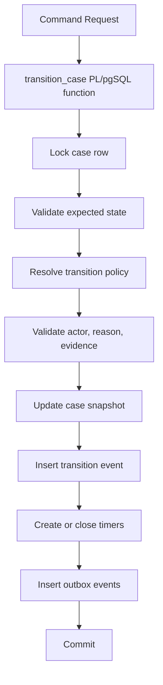
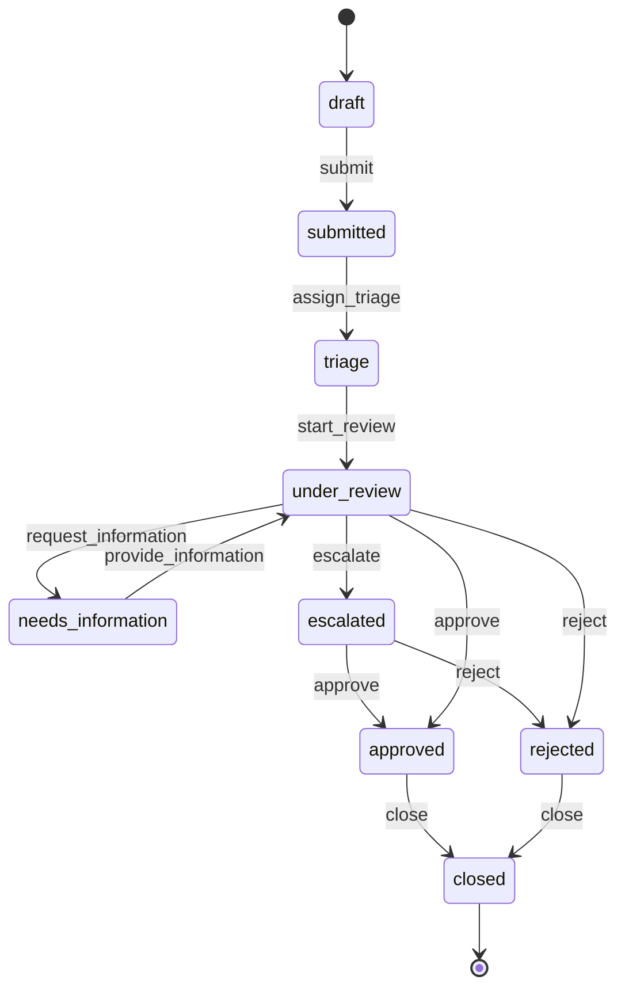
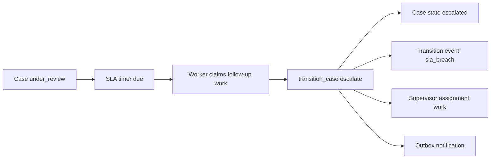

# Part 024 — State Machines, Escalation Logic, and Regulatory Workflows

A `status` column is not a state machine.

A state machine is a contract over time:

> From a known state, under a named command, by an authorized actor, with required evidence and reason, the entity may move to one allowed next state, producing an auditable event and any required follow-up work.

Regulatory workflows make this stricter. A system must not only do the right thing. It must be able to prove later:

- what state the case was in;
- who changed it;
- what command they executed;
- why the transition was allowed;
- which rule version allowed it;
- what evidence was available;
- what deadlines were created or satisfied;
- whether escalation happened on time;
- whether any direct bypass occurred.

PL/pgSQL is useful here because a transition function can make the state change, audit write, timer creation, outbox event, and idempotency marking occur in one transaction.

But it is also dangerous if you hide workflow complexity inside unreviewed trigger spaghetti. The goal is not “put workflow in the database”. The goal is:

> Put the **invariant-critical transition boundary** in the database, and keep orchestration, UI, and external integration at the edges.

---

## 1. The Real Problem

In many systems, workflow code starts like this:

```sql
UPDATE regulatory_case
SET status = 'approved'
WHERE case_id = $1;
```

Then later it grows conditions:

```sql
UPDATE regulatory_case
SET status = 'approved'
WHERE case_id = $1
  AND status = 'under_review';
```

Then application code adds role checks, reason codes, notifications, deadlines, and audit tables.

Eventually, the system has rules scattered across:

- frontend buttons;
- backend services;
- PL/pgSQL functions;
- triggers;
- batch workers;
- migration scripts;
- ad hoc admin SQL;
- reporting queries.

At that point, `status` is no longer trustworthy.

The fix is to model workflow as an explicit transition system.

---

## 2. Core State Machine Model

A practical database-backed state machine has these parts:

| Component | Meaning |
|---|---|
| Entity table | Current snapshot: current state, version, assignment, timestamps |
| State catalog | List of valid states and terminal markers |
| Command catalog | Named actions users/workers can request |
| Transition policy | Allowed `(from_state, command, to_state)` rules |
| Transition function | Atomic enforcement boundary |
| Event table | Immutable history of transitions and decisions |
| Timer/escalation table | Future obligations caused by state/rule |
| Outbox | Integration events after committed transition |



The transition function is the gate. Everything else is support.

---

## 3. State as Data, Not Code Branches

Hardcoding every transition in `IF` statements works for small workflows but becomes painful when policy changes.

A better design stores transition policy as data.

```sql
CREATE SCHEMA IF NOT EXISTS workflow;

CREATE TABLE workflow.case_state (
    state_code text PRIMARY KEY,
    state_label text NOT NULL,
    is_initial boolean NOT NULL DEFAULT false,
    is_terminal boolean NOT NULL DEFAULT false,
    sort_order integer NOT NULL,
    CHECK (state_code = lower(state_code)),
    CHECK (state_code <> '')
);

CREATE TABLE workflow.case_command (
    command_code text PRIMARY KEY,
    command_label text NOT NULL,
    is_user_command boolean NOT NULL DEFAULT true,
    CHECK (command_code = lower(command_code)),
    CHECK (command_code <> '')
);

CREATE TABLE workflow.case_transition_policy (
    policy_id bigserial PRIMARY KEY,
    from_state text NOT NULL REFERENCES workflow.case_state(state_code),
    command_code text NOT NULL REFERENCES workflow.case_command(command_code),
    to_state text NOT NULL REFERENCES workflow.case_state(state_code),
    min_actor_role text NOT NULL,
    requires_reason boolean NOT NULL DEFAULT false,
    requires_evidence boolean NOT NULL DEFAULT false,
    is_enabled boolean NOT NULL DEFAULT true,
    valid_from timestamptz NOT NULL DEFAULT '-infinity',
    valid_to timestamptz NOT NULL DEFAULT 'infinity',
    policy_version integer NOT NULL DEFAULT 1,
    UNIQUE (from_state, command_code, to_state, valid_from),
    CHECK (valid_to > valid_from)
);
```

This does not mean every rule belongs in a table. Some complex rules are better implemented as named validation functions. But the allowed transition map should be inspectable.

---

## 4. Snapshot Table and Event Table

The entity table stores current truth.

The event table stores historical proof.

```sql
CREATE TABLE workflow.regulatory_case (
    case_id uuid PRIMARY KEY DEFAULT gen_random_uuid(),
    case_number text NOT NULL UNIQUE,
    current_state text NOT NULL REFERENCES workflow.case_state(state_code),
    assigned_user_id uuid,
    priority text NOT NULL DEFAULT 'normal',
    version integer NOT NULL DEFAULT 0,
    opened_at timestamptz NOT NULL DEFAULT clock_timestamp(),
    last_transition_at timestamptz,
    closed_at timestamptz,
    CHECK (version >= 0)
);

CREATE TABLE workflow.case_transition_event (
    event_id uuid PRIMARY KEY DEFAULT gen_random_uuid(),
    case_id uuid NOT NULL REFERENCES workflow.regulatory_case(case_id),
    idempotency_key text NOT NULL,
    command_code text NOT NULL,
    from_state text NOT NULL,
    to_state text NOT NULL,
    actor_user_id uuid NOT NULL,
    actor_role text NOT NULL,
    reason_code text,
    reason_text text,
    evidence_ref jsonb NOT NULL DEFAULT '[]'::jsonb,
    policy_id bigint NOT NULL,
    policy_version integer NOT NULL,
    request_payload jsonb NOT NULL DEFAULT '{}'::jsonb,
    decision_metadata jsonb NOT NULL DEFAULT '{}'::jsonb,
    occurred_at timestamptz NOT NULL DEFAULT clock_timestamp(),
    UNIQUE (case_id, idempotency_key)
);
```

Why keep both snapshot and event?

- Snapshot makes current-state queries cheap.
- Event history makes audits and reconstruction possible.
- The transition function keeps them consistent.

Do not use an event table as an excuse to let any code mutate the snapshot directly.

---

## 5. Seed Example States and Commands

```sql
INSERT INTO workflow.case_state (state_code, state_label, is_initial, is_terminal, sort_order)
VALUES
    ('draft', 'Draft', true, false, 10),
    ('submitted', 'Submitted', false, false, 20),
    ('triage', 'Triage', false, false, 30),
    ('under_review', 'Under Review', false, false, 40),
    ('needs_information', 'Needs Information', false, false, 50),
    ('escalated', 'Escalated', false, false, 60),
    ('approved', 'Approved', false, true, 90),
    ('rejected', 'Rejected', false, true, 91),
    ('closed', 'Closed', false, true, 99);

INSERT INTO workflow.case_command (command_code, command_label, is_user_command)
VALUES
    ('submit', 'Submit', true),
    ('assign_triage', 'Assign to Triage', false),
    ('start_review', 'Start Review', true),
    ('request_information', 'Request Information', true),
    ('provide_information', 'Provide Information', true),
    ('escalate', 'Escalate', false),
    ('approve', 'Approve', true),
    ('reject', 'Reject', true),
    ('close', 'Close', true);

INSERT INTO workflow.case_transition_policy (
    from_state,
    command_code,
    to_state,
    min_actor_role,
    requires_reason,
    requires_evidence,
    policy_version
)
VALUES
    ('draft', 'submit', 'submitted', 'case_submitter', false, false, 1),
    ('submitted', 'assign_triage', 'triage', 'system', false, false, 1),
    ('triage', 'start_review', 'under_review', 'case_reviewer', false, false, 1),
    ('under_review', 'request_information', 'needs_information', 'case_reviewer', true, false, 1),
    ('needs_information', 'provide_information', 'under_review', 'case_submitter', false, true, 1),
    ('under_review', 'escalate', 'escalated', 'system', true, false, 1),
    ('under_review', 'approve', 'approved', 'case_approver', true, true, 1),
    ('under_review', 'reject', 'rejected', 'case_approver', true, true, 1),
    ('approved', 'close', 'closed', 'case_closer', false, false, 1),
    ('rejected', 'close', 'closed', 'case_closer', false, false, 1);
```

Example graph:



---

## 6. Role and Authorization Model

Do not confuse database roles with business roles.

Database roles answer:

> Which database principal can execute this function?

Business roles answer:

> Which actor is allowed to perform this workflow command?

In many systems, application users are not individual database roles. So pass actor identity and role as command input, then validate it against workflow policy or an authorization table.

```sql
CREATE TABLE workflow.actor_role_rank (
    role_code text PRIMARY KEY,
    role_rank integer NOT NULL UNIQUE,
    CHECK (role_rank >= 0)
);

INSERT INTO workflow.actor_role_rank (role_code, role_rank)
VALUES
    ('system', 1000),
    ('case_closer', 800),
    ('case_approver', 700),
    ('case_reviewer', 500),
    ('case_submitter', 100);
```

Helper:

```sql
CREATE OR REPLACE FUNCTION workflow.assert_actor_role_at_least(
    p_actor_role text,
    p_required_role text
)
RETURNS void
LANGUAGE plpgsql
AS $$
DECLARE
    v_actor_rank integer;
    v_required_rank integer;
BEGIN
    SELECT arr.role_rank
    INTO v_actor_rank
    FROM workflow.actor_role_rank arr
    WHERE arr.role_code = p_actor_role;

    IF v_actor_rank IS NULL THEN
        RAISE EXCEPTION
            USING
                ERRCODE = 'P4201',
                MESSAGE = 'unknown actor role',
                DETAIL = format('actor_role=%s', p_actor_role);
    END IF;

    SELECT arr.role_rank
    INTO v_required_rank
    FROM workflow.actor_role_rank arr
    WHERE arr.role_code = p_required_role;

    IF v_required_rank IS NULL THEN
        RAISE EXCEPTION
            USING
                ERRCODE = 'P4202',
                MESSAGE = 'unknown required role',
                DETAIL = format('required_role=%s', p_required_role);
    END IF;

    IF v_actor_rank < v_required_rank THEN
        RAISE EXCEPTION
            USING
                ERRCODE = 'P4203',
                MESSAGE = 'actor role is not allowed to perform transition',
                DETAIL = format('actor_role=%s required_role=%s', p_actor_role, p_required_role);
    END IF;
END;
$$;
```

This simple rank model is not always sufficient. Real authorization may require department, assignment, conflict of interest, region, delegation, dual control, or separation of duty. Keep the transition function as the boundary, but delegate complex authorization to reviewed helper functions.

---

## 7. The Transition Function

A transition function must do four jobs atomically:

1. Lock current entity state.
2. Validate command against policy.
3. Apply state mutation.
4. Record proof and follow-up work.

```sql
CREATE OR REPLACE FUNCTION workflow.transition_case(
    p_case_id uuid,
    p_idempotency_key text,
    p_command_code text,
    p_expected_state text,
    p_actor_user_id uuid,
    p_actor_role text,
    p_reason_code text DEFAULT NULL,
    p_reason_text text DEFAULT NULL,
    p_evidence_ref jsonb DEFAULT '[]'::jsonb,
    p_request_payload jsonb DEFAULT '{}'::jsonb
)
RETURNS jsonb
LANGUAGE plpgsql
AS $$
DECLARE
    v_case workflow.regulatory_case%ROWTYPE;
    v_policy workflow.case_transition_policy%ROWTYPE;
    v_event_id uuid;
    v_response jsonb;
    v_existing_event workflow.case_transition_event%ROWTYPE;
BEGIN
    IF p_idempotency_key IS NULL OR btrim(p_idempotency_key) = '' THEN
        RAISE EXCEPTION USING ERRCODE = 'P4210', MESSAGE = 'idempotency key is required';
    END IF;

    -- Replay previous transition for the same case and command intent.
    SELECT *
    INTO v_existing_event
    FROM workflow.case_transition_event cte
    WHERE cte.case_id = p_case_id
      AND cte.idempotency_key = p_idempotency_key;

    IF FOUND THEN
        RETURN jsonb_build_object(
            'eventId', v_existing_event.event_id,
            'caseId', v_existing_event.case_id,
            'fromState', v_existing_event.from_state,
            'toState', v_existing_event.to_state,
            'command', v_existing_event.command_code,
            'replayed', true
        );
    END IF;

    SELECT *
    INTO STRICT v_case
    FROM workflow.regulatory_case rc
    WHERE rc.case_id = p_case_id
    FOR UPDATE;

    IF p_expected_state IS NOT NULL AND v_case.current_state <> p_expected_state THEN
        RAISE EXCEPTION
            USING
                ERRCODE = 'P4211',
                MESSAGE = 'case state changed before transition',
                DETAIL = format(
                    'case_id=%s expected_state=%s actual_state=%s',
                    p_case_id,
                    p_expected_state,
                    v_case.current_state
                ),
                HINT = 'Reload the case and retry with the latest state.';
    END IF;

    SELECT *
    INTO v_policy
    FROM workflow.case_transition_policy ctp
    WHERE ctp.from_state = v_case.current_state
      AND ctp.command_code = p_command_code
      AND ctp.is_enabled
      AND clock_timestamp() >= ctp.valid_from
      AND clock_timestamp() < ctp.valid_to
    ORDER BY ctp.policy_version DESC, ctp.policy_id DESC
    LIMIT 1;

    IF NOT FOUND THEN
        RAISE EXCEPTION
            USING
                ERRCODE = 'P4212',
                MESSAGE = 'transition is not allowed from current state',
                DETAIL = format(
                    'case_id=%s from_state=%s command=%s',
                    p_case_id,
                    v_case.current_state,
                    p_command_code
                );
    END IF;

    PERFORM workflow.assert_actor_role_at_least(p_actor_role, v_policy.min_actor_role);

    IF v_policy.requires_reason AND p_reason_code IS NULL THEN
        RAISE EXCEPTION
            USING
                ERRCODE = 'P4213',
                MESSAGE = 'transition requires a reason code',
                DETAIL = format('command=%s from_state=%s to_state=%s', p_command_code, v_policy.from_state, v_policy.to_state);
    END IF;

    IF v_policy.requires_evidence
       AND (p_evidence_ref IS NULL OR jsonb_typeof(p_evidence_ref) <> 'array' OR jsonb_array_length(p_evidence_ref) = 0) THEN
        RAISE EXCEPTION
            USING
                ERRCODE = 'P4214',
                MESSAGE = 'transition requires evidence references',
                DETAIL = format('command=%s from_state=%s to_state=%s', p_command_code, v_policy.from_state, v_policy.to_state);
    END IF;

    -- Allows the defensive trigger in section 11 to distinguish this reviewed transition path
    -- from direct ad hoc status mutation. Permissions remain the primary security control.
    PERFORM set_config('workflow.transition_context', 'allowed', true);

    UPDATE workflow.regulatory_case rc
    SET
        current_state = v_policy.to_state,
        version = rc.version + 1,
        last_transition_at = clock_timestamp(),
        closed_at = CASE
            WHEN EXISTS (
                SELECT 1
                FROM workflow.case_state cs
                WHERE cs.state_code = v_policy.to_state
                  AND cs.is_terminal
            )
            THEN clock_timestamp()
            ELSE rc.closed_at
        END
    WHERE rc.case_id = p_case_id
    RETURNING *
    INTO v_case;

    INSERT INTO workflow.case_transition_event (
        case_id,
        idempotency_key,
        command_code,
        from_state,
        to_state,
        actor_user_id,
        actor_role,
        reason_code,
        reason_text,
        evidence_ref,
        policy_id,
        policy_version,
        request_payload,
        decision_metadata
    )
    VALUES (
        p_case_id,
        p_idempotency_key,
        p_command_code,
        v_policy.from_state,
        v_policy.to_state,
        p_actor_user_id,
        p_actor_role,
        p_reason_code,
        p_reason_text,
        COALESCE(p_evidence_ref, '[]'::jsonb),
        v_policy.policy_id,
        v_policy.policy_version,
        COALESCE(p_request_payload, '{}'::jsonb),
        jsonb_build_object(
            'requiredRole', v_policy.min_actor_role,
            'policyValidFrom', v_policy.valid_from,
            'policyValidTo', v_policy.valid_to
        )
    )
    RETURNING event_id
    INTO v_event_id;

    PERFORM workflow.create_case_followup_work(
        p_case_id => p_case_id,
        p_event_id => v_event_id,
        p_new_state => v_policy.to_state
    );

    INSERT INTO workflow.case_outbox_event (
        event_type,
        case_id,
        transition_event_id,
        payload
    )
    VALUES (
        'case.transitioned',
        p_case_id,
        v_event_id,
        jsonb_build_object(
            'caseId', p_case_id,
            'eventId', v_event_id,
            'command', p_command_code,
            'fromState', v_policy.from_state,
            'toState', v_policy.to_state
        )
    );

    v_response := jsonb_build_object(
        'eventId', v_event_id,
        'caseId', p_case_id,
        'fromState', v_policy.from_state,
        'toState', v_policy.to_state,
        'command', p_command_code,
        'caseVersion', v_case.version,
        'replayed', false
    );

    RETURN v_response;
END;
$$;
```

This function references two objects not yet defined:

- `workflow.create_case_followup_work()`;
- `workflow.case_outbox_event`.

They are intentionally separated because transition validation and follow-up scheduling should be distinct responsibilities inside the same transaction.

---

## 8. Follow-Up Work and Escalation Tables

Regulatory workflows are not only state transitions. They also have obligations:

- review within 2 business days;
- request information response within 7 days;
- escalate overdue case;
- close approved case after downstream confirmation;
- notify supervisor after high-priority delay.

Use a durable work table.

```sql
CREATE TABLE workflow.case_followup_work (
    work_id uuid PRIMARY KEY DEFAULT gen_random_uuid(),
    case_id uuid NOT NULL REFERENCES workflow.regulatory_case(case_id),
    source_event_id uuid NOT NULL REFERENCES workflow.case_transition_event(event_id),
    work_type text NOT NULL,
    due_at timestamptz NOT NULL,
    status text NOT NULL DEFAULT 'pending',
    locked_by text,
    locked_until timestamptz,
    attempt_count integer NOT NULL DEFAULT 0,
    created_at timestamptz NOT NULL DEFAULT clock_timestamp(),
    completed_at timestamptz,
    UNIQUE (case_id, source_event_id, work_type),
    CHECK (attempt_count >= 0),
    CHECK (status IN ('pending', 'processing', 'completed', 'cancelled', 'failed'))
);

CREATE TABLE workflow.case_outbox_event (
    outbox_id uuid PRIMARY KEY DEFAULT gen_random_uuid(),
    event_type text NOT NULL,
    case_id uuid NOT NULL REFERENCES workflow.regulatory_case(case_id),
    transition_event_id uuid REFERENCES workflow.case_transition_event(event_id),
    payload jsonb NOT NULL,
    status text NOT NULL DEFAULT 'pending',
    created_at timestamptz NOT NULL DEFAULT clock_timestamp(),
    published_at timestamptz,
    UNIQUE (event_type, transition_event_id)
);
```

Rule-driven follow-up creation:

```sql
CREATE TABLE workflow.state_followup_rule (
    rule_id bigserial PRIMARY KEY,
    state_code text NOT NULL REFERENCES workflow.case_state(state_code),
    work_type text NOT NULL,
    due_after interval NOT NULL,
    is_enabled boolean NOT NULL DEFAULT true,
    priority_filter text,
    UNIQUE (state_code, work_type)
);

INSERT INTO workflow.state_followup_rule (state_code, work_type, due_after, priority_filter)
VALUES
    ('submitted', 'auto_assign_triage', interval '5 minutes', NULL),
    ('under_review', 'review_sla_check', interval '2 days', NULL),
    ('needs_information', 'information_response_sla_check', interval '7 days', NULL),
    ('escalated', 'supervisor_review_sla_check', interval '1 day', NULL);
```

Creation function:

```sql
CREATE OR REPLACE FUNCTION workflow.create_case_followup_work(
    p_case_id uuid,
    p_event_id uuid,
    p_new_state text
)
RETURNS void
LANGUAGE plpgsql
AS $$
BEGIN
    INSERT INTO workflow.case_followup_work (
        case_id,
        source_event_id,
        work_type,
        due_at
    )
    SELECT
        p_case_id,
        p_event_id,
        sfr.work_type,
        clock_timestamp() + sfr.due_after
    FROM workflow.state_followup_rule sfr
    JOIN workflow.regulatory_case rc ON rc.case_id = p_case_id
    WHERE sfr.state_code = p_new_state
      AND sfr.is_enabled
      AND (sfr.priority_filter IS NULL OR sfr.priority_filter = rc.priority)
    ON CONFLICT (case_id, source_event_id, work_type)
    DO NOTHING;
END;
$$;
```

Follow-up work must be idempotent. The unique key prevents duplicate timers if a transition function is retried after a partial failure inside an outer boundary.

---

## 9. Escalation Worker Procedure

An escalation worker should:

1. Claim due work in small batches.
2. Use row locks with `SKIP LOCKED` so multiple workers can run.
3. Re-check current case state before escalating.
4. Use the same transition function, not direct updates.
5. Mark work completed or failed.

```sql
CREATE OR REPLACE PROCEDURE workflow.process_due_case_work(
    p_worker_name text,
    p_batch_size integer DEFAULT 100
)
LANGUAGE plpgsql
AS $$
DECLARE
    v_work record;
    v_response jsonb;
BEGIN
    FOR v_work IN
        WITH due AS (
            SELECT cfw.work_id
            FROM workflow.case_followup_work cfw
            WHERE cfw.status = 'pending'
              AND cfw.due_at <= clock_timestamp()
            ORDER BY cfw.due_at, cfw.created_at
            LIMIT p_batch_size
            FOR UPDATE SKIP LOCKED
        )
        UPDATE workflow.case_followup_work cfw
        SET
            status = 'processing',
            locked_by = p_worker_name,
            locked_until = clock_timestamp() + interval '5 minutes',
            attempt_count = cfw.attempt_count + 1
        FROM due
        WHERE cfw.work_id = due.work_id
        RETURNING cfw.*
    LOOP
        BEGIN
            IF v_work.work_type = 'review_sla_check' THEN
                v_response := workflow.transition_case(
                    p_case_id => v_work.case_id,
                    p_idempotency_key => 'work:' || v_work.work_id::text,
                    p_command_code => 'escalate',
                    p_expected_state => 'under_review',
                    p_actor_user_id => '00000000-0000-0000-0000-000000000000'::uuid,
                    p_actor_role => 'system',
                    p_reason_code => 'sla_breach',
                    p_reason_text => 'Review SLA exceeded',
                    p_evidence_ref => jsonb_build_array(
                        jsonb_build_object('workId', v_work.work_id, 'dueAt', v_work.due_at)
                    ),
                    p_request_payload => jsonb_build_object('sourceWorkId', v_work.work_id)
                );
            END IF;

            UPDATE workflow.case_followup_work cfw
            SET
                status = 'completed',
                completed_at = clock_timestamp(),
                locked_by = NULL,
                locked_until = NULL
            WHERE cfw.work_id = v_work.work_id;

        EXCEPTION
            WHEN SQLSTATE 'P4211' THEN
                -- Expected state no longer matches. The work is obsolete.
                UPDATE workflow.case_followup_work cfw
                SET
                    status = 'cancelled',
                    completed_at = clock_timestamp(),
                    locked_by = NULL,
                    locked_until = NULL
                WHERE cfw.work_id = v_work.work_id;

            WHEN OTHERS THEN
                UPDATE workflow.case_followup_work cfw
                SET
                    status = CASE WHEN cfw.attempt_count >= 5 THEN 'failed' ELSE 'pending' END,
                    locked_by = NULL,
                    locked_until = NULL
                WHERE cfw.work_id = v_work.work_id;

                RAISE WARNING 'case work failed: work_id=%, sqlstate=%, message=%',
                    v_work.work_id,
                    SQLSTATE,
                    SQLERRM;
        END;
    END LOOP;
END;
$$;
```

This pattern deliberately routes escalation through `transition_case()`. That preserves policy, audit, idempotency, and outbox behavior.

---

## 10. Expected State as Optimistic Intent

`p_expected_state` is not redundant.

It protects user intent.

Suppose a reviewer opens a case in `under_review`. Before they click Approve, another actor requests information and moves it to `needs_information`.

Without `expected_state`, the approve command might fail with “no transition allowed” or, worse, take a different path if another rule exists.

With `expected_state`, the function returns a precise conflict:

```txt
expected_state=under_review actual_state=needs_information
```

That is useful for UI, APIs, and audit.

---

## 11. Direct Update Guardrail

A state machine collapses if anyone can do this:

```sql
UPDATE workflow.regulatory_case
SET current_state = 'approved'
WHERE case_id = '...';
```

Use permissions first:

```sql
REVOKE UPDATE (current_state) ON workflow.regulatory_case FROM app_user;
GRANT EXECUTE ON FUNCTION workflow.transition_case(...) TO app_user;
```

For extra defense, add a trigger that blocks direct state changes unless a transaction-local context is set by the transition function.

Trigger:

```sql
CREATE OR REPLACE FUNCTION workflow.prevent_direct_case_state_update()
RETURNS trigger
LANGUAGE plpgsql
AS $$
BEGIN
    IF OLD.current_state IS DISTINCT FROM NEW.current_state
       AND current_setting('workflow.transition_context', true) IS DISTINCT FROM 'allowed' THEN
        RAISE EXCEPTION
            USING
                ERRCODE = 'P4220',
                MESSAGE = 'direct case state update is not allowed',
                DETAIL = format('case_id=%s old=%s new=%s', OLD.case_id, OLD.current_state, NEW.current_state),
                HINT = 'Use workflow.transition_case().';
    END IF;

    RETURN NEW;
END;
$$;

CREATE TRIGGER trg_prevent_direct_case_state_update
BEFORE UPDATE OF current_state ON workflow.regulatory_case
FOR EACH ROW
EXECUTE FUNCTION workflow.prevent_direct_case_state_update();
```

Then the transition function must set local context before the update:

```sql
PERFORM set_config('workflow.transition_context', 'allowed', true);
```

This is a guardrail, not a complete security model. Any role that can call `set_config` with that custom setting and update the table could bypass it. Permissions remain the primary control.

---

## 12. Policy Versioning and Defensibility

Regulatory systems must answer:

> Was this transition valid under the policy in effect at the time?

That requires transition events to store `policy_id` and `policy_version`.

Do not rely only on current policy tables. Policies change.

A defensible event should include:

- `from_state`;
- `to_state`;
- `command_code`;
- `policy_id`;
- `policy_version`;
- actor identity;
- actor role;
- reason code;
- evidence references;
- decision metadata;
- timestamp.

For critical workflows, you may also store a policy snapshot:

```sql
ALTER TABLE workflow.case_transition_event
ADD COLUMN policy_snapshot jsonb NOT NULL DEFAULT '{}'::jsonb;
```

Then include the exact rule material used by the decision. This improves forensic readability at the cost of duplication.

---

## 13. Reason Codes and Evidence

Free-text reason alone is weak.

Use reason codes for classification and analytics, plus reason text for human detail.

```sql
CREATE TABLE workflow.case_reason_code (
    reason_code text PRIMARY KEY,
    reason_label text NOT NULL,
    applies_to_command text REFERENCES workflow.case_command(command_code),
    is_enabled boolean NOT NULL DEFAULT true
);
```

Evidence should refer to durable objects, not just ad hoc strings.

Examples:

```json
[
  {
    "type": "document",
    "documentId": "...",
    "sha256": "..."
  },
  {
    "type": "inspection_note",
    "noteId": "..."
  }
]
```

The transition function can validate shape lightly, but heavy evidence validation may belong in a helper function:

```sql
PERFORM workflow.assert_evidence_refs_valid(p_evidence_ref);
```

---

## 14. Modeling Escalation Correctly

Escalation is not merely a status.

It may be:

1. a state transition: `under_review -> escalated`;
2. an assignment change: reviewer to supervisor;
3. a notification obligation;
4. an SLA breach event;
5. a reporting dimension;
6. all of the above.

Do not overload one column to represent all of these.

A robust design separates:

- case state;
- priority;
- assignment;
- SLA timers;
- escalation event;
- notification outbox.



This separation keeps reporting honest.

---

## 15. State Machine vs BPM Engine

PL/pgSQL state machines are excellent when:

- transitions are data-centric;
- invariants must be enforced close to tables;
- auditability matters;
- workflow is mostly synchronous around one aggregate;
- external orchestration is simple.

A BPM/workflow engine may be better when:

- long-running human tasks span many services;
- timers, retries, compensation, and visibility are complex;
- process diagrams are first-class business artifacts;
- external service orchestration dominates;
- non-database events drive most progress.

A practical architecture often uses both:

```txt
BPM engine orchestrates process
PostgreSQL PL/pgSQL enforces aggregate transition invariants
```

Do not force PL/pgSQL to become a hidden BPM engine.

---

## 16. Concurrency Failure Modes

### 16.1 Two Actors Transition Same Case

Without row lock:

```txt
A reads under_review
B reads under_review
A approves
B rejects
```

With `FOR UPDATE`, one transition wins first. The second sees the latest state and fails or follows a valid next rule.

### 16.2 Duplicate Escalation Timer

Use unique key:

```sql
UNIQUE (case_id, source_event_id, work_type)
```

For recurring SLA checks, use a separate recurrence key:

```txt
case_id + work_type + due_bucket
```

### 16.3 Transition Event Without Snapshot Update

Keep snapshot update and event insert in one transition function transaction.

### 16.4 Snapshot Update Without Event

Prevent direct updates with permissions and guard triggers.

### 16.5 Old Policy Reinterpreted as New Policy

Store policy id/version/snapshot in event.

### 16.6 Escalation Storm

If many overdue cases exist, workers can generate huge outbox volume. Use batch size, backpressure, and priority ordering.

---

## 17. Observability Queries

Current case distribution:

```sql
SELECT
    rc.current_state,
    count(*) AS case_count
FROM workflow.regulatory_case rc
GROUP BY rc.current_state
ORDER BY case_count DESC;
```

Transition volume by command:

```sql
SELECT
    cte.command_code,
    cte.from_state,
    cte.to_state,
    count(*) AS transition_count
FROM workflow.case_transition_event cte
WHERE cte.occurred_at >= now() - interval '7 days'
GROUP BY cte.command_code, cte.from_state, cte.to_state
ORDER BY transition_count DESC;
```

Overdue work:

```sql
SELECT *
FROM workflow.case_followup_work cfw
WHERE cfw.status = 'pending'
  AND cfw.due_at < clock_timestamp()
ORDER BY cfw.due_at
LIMIT 100;
```

Cases with state update but no event should be impossible. This query checks for suspicious records:

```sql
SELECT rc.*
FROM workflow.regulatory_case rc
WHERE rc.version > 0
  AND NOT EXISTS (
      SELECT 1
      FROM workflow.case_transition_event cte
      WHERE cte.case_id = rc.case_id
  );
```

State transitions not in current policy:

```sql
SELECT DISTINCT
    cte.from_state,
    cte.command_code,
    cte.to_state
FROM workflow.case_transition_event cte
WHERE NOT EXISTS (
    SELECT 1
    FROM workflow.case_transition_policy ctp
    WHERE ctp.from_state = cte.from_state
      AND ctp.command_code = cte.command_code
      AND ctp.to_state = cte.to_state
);
```

This does not necessarily mean historical events were invalid. It may mean policy changed. That is why policy versioning matters.

---

## 18. Testing Strategy

### 18.1 Transition Matrix Tests

For each policy row:

- create case in `from_state`;
- call transition function;
- assert final state equals `to_state`;
- assert event exists;
- assert policy id/version captured;
- assert outbox exists.

### 18.2 Forbidden Transition Tests

For each state, attempt commands not allowed from that state. Assert custom SQLSTATE such as `P4212`.

### 18.3 Authorization Tests

For each transition, test:

- actor with insufficient role rejected;
- actor with exact role accepted;
- actor with higher role accepted if rank model allows it.

### 18.4 Idempotency Replay Tests

Call transition twice with the same idempotency key. Assert:

- only one event row;
- same response shape;
- second call indicates replay;
- case version increments only once.

### 18.5 Concurrency Tests

Run two sessions:

```txt
Session A: approve case under_review
Session B: reject same case under_review
```

Expected:

- one transition succeeds;
- the other fails due to expected-state mismatch or invalid current state;
- final case has one coherent event path.

---

## 19. Design Variants

### 19.1 Enum State vs Text State

PostgreSQL enum is compact and type-safe, but changing enum values can be operationally less flexible than changing rows in a lookup table.

For regulatory workflows where states can evolve, a lookup table is often more flexible.

### 19.2 One Generic Transition Function vs Domain-Specific Functions

Generic:

```txt
transition_case(case_id, command, ...)
```

Pros:

- one enforcement boundary;
- consistent audit;
- easier matrix testing.

Cons:

- command-specific validation can become indirect.

Domain-specific wrapper:

```txt
approve_case(case_id, evidence, reason)
```

Pros:

- clearer API;
- stronger typed parameters;
- better caller ergonomics.

Cons:

- risk of duplicated transition logic.

Recommended pattern:

```txt
domain-specific wrappers call one internal transition primitive
```

### 19.3 Trigger-Based State Machine

Avoid using triggers as the primary transition API.

Triggers are good for guardrails, audit stamping, and defensive checks. They are poor as the only place where business workflow is explained, because callers cannot easily see the command contract.

Prefer explicit transition functions.

---

## 20. Production Review Checklist

### Model

- [ ] Are states explicitly cataloged?
- [ ] Are commands explicitly cataloged?
- [ ] Are allowed transitions inspectable?
- [ ] Are terminal states marked?
- [ ] Is policy versioning supported?

### Transition Boundary

- [ ] Does every state change go through one function or controlled wrapper?
- [ ] Does the function lock the entity row?
- [ ] Does it validate expected state?
- [ ] Does it validate actor authorization?
- [ ] Does it require reason/evidence where needed?
- [ ] Does it insert event history in the same transaction?
- [ ] Does it create timers/outbox in the same transaction?

### Defensibility

- [ ] Does the event store from/to state?
- [ ] Does it store command, actor, role, reason, evidence, policy id/version?
- [ ] Is direct state update prevented by permissions?
- [ ] Are direct update guardrails present for defense in depth?
- [ ] Can historical decisions be explained after policy changes?

### Operations

- [ ] Are overdue timers observable?
- [ ] Can workers process due work with `SKIP LOCKED`?
- [ ] Are escalation commands idempotent?
- [ ] Are worker failures retried safely?
- [ ] Is there a runbook for stuck work?

### Testing

- [ ] Is the transition matrix tested?
- [ ] Are forbidden transitions tested?
- [ ] Are concurrency conflicts tested?
- [ ] Are idempotent retries tested?
- [ ] Are policy-version changes tested?

---

## 21. Exercises

### Exercise 1 — Build a Transition Matrix Test

Write SQL test data that iterates over `workflow.case_transition_policy` and verifies that each policy row can execute successfully from its `from_state`.

### Exercise 2 — Add Separation of Duty

Implement a rule: the user who submitted a case cannot approve it.

Decide whether this belongs in:

- transition policy table;
- helper validation function;
- trigger;
- application service.

Explain the boundary.

### Exercise 3 — Escalation Backpressure

Modify `process_due_case_work()` so it processes high-priority cases first and limits escalation outbox creation per run.

### Exercise 4 — Policy Snapshot

Extend `case_transition_event` so it stores the exact policy row as JSONB at transition time.

### Exercise 5 — Direct Update Attack

Create a test role that can update the table directly. Prove the permission model blocks status changes. Then test the trigger guardrail.

---

## 22. References

- PostgreSQL Documentation — PL/pgSQL Trigger Functions: https://www.postgresql.org/docs/current/plpgsql-trigger.html
- PostgreSQL Documentation — `CREATE TRIGGER`: https://www.postgresql.org/docs/current/sql-createtrigger.html
- PostgreSQL Documentation — Explicit Locking: https://www.postgresql.org/docs/current/explicit-locking.html
- PostgreSQL Documentation — Transaction Isolation: https://www.postgresql.org/docs/current/transaction-iso.html
- PostgreSQL Documentation — Constraints: https://www.postgresql.org/docs/current/ddl-constraints.html
- PostgreSQL Documentation — Error Codes / SQLSTATE: https://www.postgresql.org/docs/current/errcodes-appendix.html
- PostgreSQL Documentation — `GRANT`: https://www.postgresql.org/docs/current/sql-grant.html

---

## 23. Closing Mental Model

A production workflow is not a `status` column.

It is a controlled transition boundary:

```txt
current state
+ command
+ actor authority
+ reason/evidence
+ policy version
+ lock
+ mutation
+ event
+ timers/outbox
= defensible transition
```

PL/pgSQL is effective here when it protects invariants that must be true regardless of which service, worker, migration, or admin path touches the data.

Use it to enforce the aggregate truth. Do not use it to hide an entire business process in invisible database magic.

The next part builds on this by separating validation, normalization, and policy enforcement functions so complex workflows remain testable instead of turning into one giant transition procedure.
